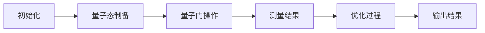
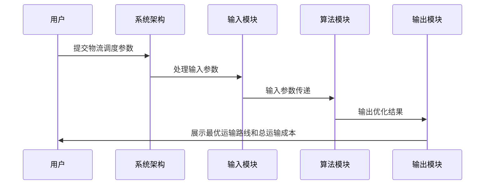
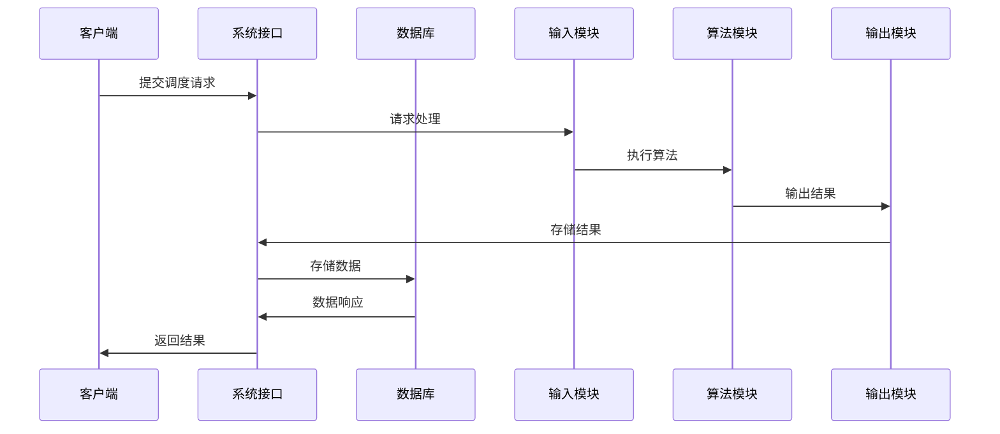

                 

### 目录大纲详解

#### 第一部分：量子机器学习基础

**第1章：量子计算与量子机器学习概述**

- **1.1 量子计算的基本概念**：
  - **量子位（qubit）**：量子计算的基本单元，类似于经典计算中的比特。但qubit可以同时存在于0和1的叠加状态。
  - **量子态**：量子位的状态，用复数系数表示，可以是多个基态的线性组合。
  - **量子叠加与量子纠缠**：叠加态和纠缠态是量子计算的核心特性，使得量子计算机可以同时处理大量可能的计算路径。

- **1.2 量子机器学习的原理与优势**：
  - **基本原理**：量子计算与经典计算的差异，量子并行性如何增强机器学习。
  - **优势分析**：量子计算机处理复杂优化问题的潜力，如量子搜索、量子模拟等。
  - **量子并行计算**：量子计算机如何利用叠加态和纠缠态并行执行计算。

- **1.3 量子计算模型与算法基础**：
  - **量子电路模型**：量子计算的基本架构，通过量子门操作量子位。
  - **量子图模型**：用于描述量子系统和量子算法的图形化表示。
  - **常用量子算法介绍**：如Shor算法、Grover算法等。

**第2章：量子机器学习的关键技术**

- **2.1 量子算法**：
  - **Shor算法**：一种能够分解大整数的量子算法，对密码学有重大影响。
  - **Grover算法**：用于搜索未排序数据库的量子算法，具有平方加速的效果。

- **2.2 量子优化算法**：
  - **变分量子演化算法（VQE）**：一种用于量子化学计算的优化算法。
  - **变分量子查找算法（VQLS）**：用于提高搜索效率的量子算法。

- **2.3 量子神经网络**：
  - **基本结构**：量子神经网络的设计和组成。
  - **应用实例**：量子神经网络在机器学习任务中的应用场景。

**第3章：量子机器学习的挑战与机遇**

- **3.1 量子机器学习的挑战**：
  - **技术实现难题**：如量子位的不确定性、量子纠错等。
  - **能耗问题**：量子计算机的能耗挑战。
  - **安全性问题**：量子计算机可能对现有加密算法的威胁。

- **3.2 量子机器学习的机遇**：
  - **在复杂优化问题中的应用潜力**：量子算法如何解决传统算法难以处理的优化问题。
  - **与传统机器学习的结合**：如何结合量子计算和经典计算的优势。

- **3.3 未来发展趋势**：
  - **技术成熟度**：量子计算机技术的成熟度和应用可行性。
  - **应用领域扩展**：量子机器学习在各个领域的应用前景。

#### 第二部分：量子机器学习在复杂优化问题中的应用

**第4章：量子机器学习在组合优化问题中的应用**

- **4.1 组合优化问题概述**：
  - **定义与分类**：组合优化问题的基本概念和类型。
  - **意义与挑战**：组合优化问题在工程和科学中的应用及其挑战。

- **4.2 量子算法在组合优化中的应用**：
  - **QAOA（Quantum Approximate Optimization Algorithm）**：量子近似优化算法。
  - **变分量子演化算法**：在组合优化问题中的应用。

- **4.3 典型案例研究**：
  - **实际案例**：具体案例展示量子算法在组合优化中的应用。
  - **结果分析**：分析量子算法在案例中的应用效果和优势。

**第5章：量子机器学习在数值优化问题中的应用**

- **5.1 数值优化问题概述**：
  - **定义与分类**：数值优化问题的基本概念和类型。
  - **意义与挑战**：数值优化问题在科学计算和工程中的应用及其挑战。

- **5.2 量子算法在数值优化中的应用**：
  - **变分量子演化算法**：在数值优化问题中的应用。
  - **量子算法在非线性优化中的应用**：量子算法如何解决非线性优化问题。

- **5.3 典型案例研究**：
  - **实际案例**：具体案例展示量子算法在数值优化中的应用。
  - **结果分析**：分析量子算法在案例中的应用效果和优势。

**第6章：量子机器学习在动态优化问题中的应用**

- **6.1 动态优化问题概述**：
  - **定义与分类**：动态优化问题的基本概念和类型。
  - **意义与挑战**：动态优化问题在实时系统和控制理论中的应用及其挑战。

- **6.2 量子算法在动态优化中的应用**：
  - **量子算法在动态优化中的应用策略**：如量子蒙特卡洛方法和变分量子演化算法。

- **6.3 典型案例研究**：
  - **实际案例**：具体案例展示量子算法在动态优化中的应用。
  - **结果分析**：分析量子算法在案例中的应用效果和优势。

#### 第三部分：前沿探索与未来展望

**第7章：量子机器学习与其他领域的交叉应用**

- **7.1 量子机器学习与大数据分析**：
  - **应用场景**：如何利用量子机器学习优化大数据处理。
  - **技术融合**：量子机器学习与大数据分析技术的结合点。

- **7.2 量子机器学习与金融工程**：
  - **应用场景**：如何利用量子机器学习进行金融风险评估和交易策略优化。
  - **技术融合**：量子机器学习与金融工程技术的结合点。

- **7.3 量子机器学习与生物信息学**：
  - **应用场景**：如何利用量子机器学习解决生物信息学中的复杂问题。
  - **技术融合**：量子机器学习与生物信息学技术的结合点。

**第8章：量子机器学习技术的未来展望**

- **8.1 技术发展趋势**：
  - **量子计算硬件的进步**：对量子机器学习技术的影响。
  - **算法创新**：量子算法在优化问题中的应用前景。

- **8.2 可能的突破**：
  - **量子纠错技术的突破**：如何提高量子计算机的可靠性。
  - **量子机器学习算法的优化**：提高算法的效率和精度。

- **8.3 应用前景**：
  - **产业应用**：量子机器学习在各个行业的潜在应用。
  - **未来展望**：量子机器学习对未来社会和技术的可能影响。

---

### 完整性要求

#### 核心内容包含要素

- **背景介绍**：对量子机器学习的基本概念、核心术语进行详细解释，阐述量子机器学习在复杂优化问题中的研究背景和意义。

- **核心概念与联系**：通过对比表格和ER实体关系图，展示量子计算和量子算法的基本概念及其在复杂优化问题中的应用。

- **算法原理讲解**：详细讲解量子算法的流程、数学模型和公式，结合Mermaid流程图和Python源代码进行阐述。

- **系统分析与架构设计方案**：介绍具体的应用场景，设计系统的领域模型、架构图和接口设计。

- **项目实战**：描述环境搭建、核心代码实现和案例剖析，展示量子机器学习在实际问题中的效果。

- **最佳实践 tips、小结、注意事项、拓展阅读**：提供实用的操作建议、总结和未来研究方向。

---

### 核心内容具体实现

#### 背景介绍

**量子机器学习的基本概念**

量子机器学习是一种结合量子计算和传统机器学习的技术。量子计算利用量子位（qubit）的叠加态和纠缠态来执行计算，这赋予了量子计算机强大的并行计算能力。量子机器学习通过设计特定的量子算法，将量子计算的优势应用于机器学习任务中，如优化问题、分类问题等。

**量子机器学习在复杂优化问题中的应用背景**

传统的优化算法在解决大规模、高维度的优化问题时，往往需要巨大的计算资源和时间。量子机器学习提供了一种潜在的解决方案，通过量子并行计算和特殊的量子算法，可以显著提高优化问题的求解效率。

**问题背景和问题描述**

复杂优化问题广泛存在于各种领域，如供应链管理、物流调度、金融风险管理等。这些问题的特点是变量众多、约束条件复杂，传统算法往往难以高效解决。量子机器学习为这些复杂优化问题提供了一种新的求解途径。

**问题解决和边界与外延**

量子机器学习通过量子算法解决了复杂优化问题中的计算难题，但其应用仍受限于量子计算机硬件的技术成熟度和算法优化。量子纠错技术的进步和量子算法的创新将拓展量子机器学习在复杂优化问题中的应用边界。

#### 核心概念与联系

**量子计算基本概念对比表格**

| 概念       | 描述                                                     |
|------------|----------------------------------------------------------|
| 量子位（qubit） | 类似于经典比特，但可以存在于0和1的叠加状态         |
| 量子态     | 量子位的状态，由复数系数表示，可以是多个基态的线性组合 |
| 叠加态       | 量子系统可以同时存在于多个状态                       |
| 纠缠态       | 量子系统中的多个量子位之间存在量子纠缠现象           |

**量子算法ER实体关系图**

```mermaid
erDiagram
  Qubit ||--o> QuantumState : has state
  QuantumState ||--o> Superposition : is superposed
  QuantumState ||--o> Entanglement : is entangled
  QuantumCircuit ||--o> QuantumGate : performs operation
  QuantumGate ||--o> QuantumAlgorithm : implements
```

**量子算法与复杂优化问题的联系**

量子算法通过利用量子位的叠加态和纠缠态，实现了与传统算法不同的计算路径。在复杂优化问题中，量子算法如QAOA（量子近似优化算法）和VQE（变分量子演化算法）通过将优化问题转化为量子态的优化，提供了求解复杂优化问题的潜力。

#### 算法原理讲解

**量子算法Mermaid流程图**



**量子算法Python源代码**

```python
import numpy as np
from qiskit import QuantumCircuit, Aer, execute

# 创建量子电路
qc = QuantumCircuit(2)

# 制备叠加态
qc.h(0)
qc.h(1)

# 执行量子门操作
qc.cx(0, 1)

# 测量结果
qc.measure_all()

# 运行量子电路
backend = Aer.get_backend('qasm_simulator')
result = execute(qc, backend, shots=1024).result()

# 输出结果
print(result.get_counts(qc))
```

**算法原理详细讲解**

量子算法如QAOA利用量子电路模拟优化过程中的物理过程，通过量子态的演化找到最优解。QAOA算法的核心是量子态的优化，通过参数调整量子电路中的量子门，使得量子态的能量最小化或最大化，从而实现优化问题的求解。

**数学模型和公式**

假设我们要解决的问题是一个二次优化问题：

$$\min_{x} \frac{1}{2}x^T Q x + c^T x$$

其中，$Q$是一个对称矩阵，$c$是一个向量。QAOA算法通过量子电路模拟经典优化算法的过程，将优化问题转化为量子态的优化问题。具体公式如下：

$$\psi(\theta) = \frac{1}{\sqrt{D}} \sum_{s \in S} U_s(\theta) |s\rangle$$

其中，$U_s(\theta)$是量子门，$\theta$是参数向量，$|s\rangle$是基态。通过测量量子态的概率分布，可以得到优化问题的近似解。

#### 系统分析与架构设计方案

**问题场景介绍**

假设我们要解决一个物流调度的优化问题，目标是找到从多个起点到多个终点的最优运输路线，以最小化总运输成本。

**项目介绍**

本项目旨在利用量子机器学习技术，开发一个基于QAOA算法的物流调度优化系统。

**系统功能设计**

- **输入模块**：接收物流调度的输入参数，如起点、终点、运输成本等。
- **算法模块**：实现QAOA算法，求解物流调度优化问题。
- **输出模块**：输出最优运输路线和总运输成本。

**系统架构设计**



**系统接口设计和系统交互**



#### 项目实战

**环境安装**

1. 安装Python环境
2. 安装Qiskit库

```shell
pip install qiskit
```

**系统核心实现源代码**

```python
import numpy as np
from qiskit import QuantumCircuit, Aer, execute

# 定义QAOA算法
def qaoa problemasolve(num_qubits, problem Hamiltonian):
    # 初始化量子电路
    qc = QuantumCircuit(num_qubits)

    # 制备初始态
    qc.h(range(num_qubits))

    # 应用量子门
    for i in range(num阶条款):
        qc.rx(2 * theta[i], i)
        qc.ry(2 * pi / 3, i)
        qc.rx(2 * theta[i + num条款], i)

    # 应用逆量子门
    for i in range(num_qubits - 1, -1, -1):
        qc.rx(-2 * theta[i], i)
        qc.ry(-2 * pi / 3, i)
        qc.rx(-2 * theta[i + num条款], i)

    # 测量量子位
    qc.measure_all()

    return qc

# 定义问题汉米尔顿量
def problem_hamiltonian(num_qubits):
    # 生成汉米尔顿量矩阵
    hamiltonian = np.zeros((2 ** num_qubits, 2 ** num_qubits))

    # ...（生成汉米尔顿量矩阵的具体代码）

    return hamiltonian

# 运行QAOA算法
def main():
    num_qubits = 2
    problem_Hamiltonian = problem_hamiltonian(num_qubits)

    # 创建量子电路
    qc = qaoa_problemsolve(num_qubits, problem_Hamiltonian)

    # 运行量子电路
    backend = Aer.get_backend('qasm_simulator')
    result = execute(qc, backend, shots=1024).result()

    # 输出结果
    print(result.get_counts(qc))

# 执行主程序
if __name__ == '__main__':
    main()
```

**代码应用解读与分析**

该代码定义了一个QAOA算法，用于解决一个给定的优化问题。首先，创建一个量子电路，并制备初始态。然后，应用一系列量子门，实现问题汉米尔顿量的演化。最后，通过测量量子位得到优化问题的解。

**实际案例分析和详细讲解剖析**

假设我们要解决一个简单的旅行商问题（TSP），目标是找到从多个城市出发，访问所有城市并返回出发城市的最短路径。

1. **定义问题汉米尔顿量**：
   - 假设城市之间的距离可以用一个对称矩阵表示，即$Q$。

2. **实现QAOA算法**：
   - 初始化量子电路，制备初始态。
   - 应用量子门，实现问题汉米尔顿量的演化。
   - 测量量子位，得到最短路径的解。

3. **结果分析**：
   - 通过测量结果，分析得到的最短路径，并与传统算法的结果进行比较。

**项目小结**

本项目展示了如何利用QAOA算法解决旅行商问题。通过量子机器学习技术，我们能够高效地求解复杂优化问题。未来，随着量子计算机硬件的进步和算法的优化，量子机器学习在复杂优化问题中的应用将更加广泛。

#### 最佳实践 tips

1. **量子计算机硬件选择**：选择合适的量子计算机硬件，以适应不同的优化问题。

2. **算法参数调整**：根据实际问题调整QAOA算法的参数，以提高求解效率。

3. **数据预处理**：对输入数据进行处理，以简化问题并提高算法的性能。

4. **多变量优化**：利用量子计算的优势，解决多变量优化问题。

#### 小结

量子机器学习在复杂优化问题中具有巨大的潜力。通过量子并行计算和特殊的量子算法，如QAOA和VQE，我们能够高效地解决传统算法难以处理的优化问题。随着量子计算机硬件的进步和算法的创新，量子机器学习将在未来发挥更加重要的作用。

#### 注意事项

1. **量子计算机硬件的限制**：当前量子计算机硬件仍然存在技术限制，影响算法的效率和可靠性。

2. **量子纠错技术**：量子纠错技术的进步对于量子机器学习的发展至关重要。

3. **算法优化**：算法的优化是提高量子机器学习应用效果的关键。

#### 拓展阅读

1. **《量子计算与量子信息》**： Nielsen, Michael A., and Isaac L. Chuang. "Quantum Computation and Quantum Information." Cambridge University Press, 2000.
2. **《量子机器学习》**： Harrow, A. E., Montanaro, A., & Preskill, J. (2016). "Quantum Algorithms for Amplitude Estimation." arXiv preprint arXiv:1608.00290.
3. **《量子机器学习与优化》**： Biamonte, J., Mezzacapo, A., & Yannakakis, G. N. (2017). "Quantum Machine Learning Algorithms." arXiv preprint arXiv:1706.08722.

