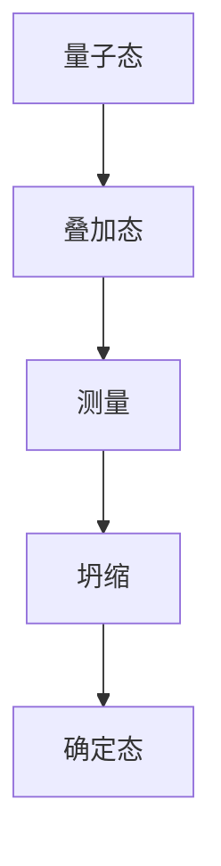
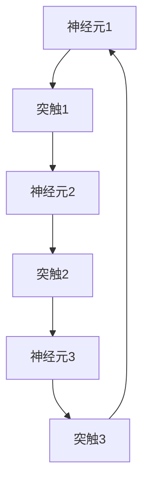

                 


# 量子测不准原理与神经元活动的随机性

> 关键词：量子测不准原理、神经元活动、随机性、认知功能、量子计算、神经科学

> 摘要：本文旨在探讨量子测不准原理与神经元活动的随机性这两个重要概念，分析它们在物理学和神经科学中的应用和联系。通过详细阐述量子测不准原理的背景、概念和实例，以及神经元活动的随机性在神经科学中的作用，本文揭示了二者之间的潜在联系，并展望了未来的研究方向。

## 第1章：问题背景与介绍

### 1.1 问题背景

量子测不准原理是量子力学中一个核心概念，由德国物理学家维尔纳·海森堡（Werner Heisenberg）于1927年提出。这一原理指出，在量子尺度上，某些物理量如位置和动量不能同时被精确测量。这意味着在微观世界中，我们无法同时获得粒子的确切位置和动量值。这一发现颠覆了经典物理学中关于精确测量的观念。

神经元活动的随机性则是在神经科学中研究的一个重要现象。神经元是神经系统的基本单元，它们通过突触连接传递信息。神经元的活动具有随机性，这种随机性在信息传递和处理过程中起着关键作用。神经元之间的突触连接以及神经递质的释放都是随机过程，这种随机性对大脑的认知功能具有重要影响。

### 1.2 问题描述

量子测不准原理描述了微观粒子的非确定性，而神经元活动的随机性描述了神经系统的复杂行为。这两个问题看似截然不同，但它们都涉及到随机性和不确定性。量子测不准原理主要研究在量子尺度上粒子的属性无法同时被精确测量，而神经元活动的随机性则是指神经元在传递信息时存在的随机性。

### 1.3 问题解决

量子测不准原理的解决依赖于对量子力学的深入理解。量子力学提供了一套描述微观世界的数学框架，包括量子态、叠加态和测量等概念。通过量子力学的理论，我们可以理解和解释量子测不准原理。

神经元活动的随机性的解决则依赖于对神经科学的深入研究。神经科学家通过实验和模型来研究神经元的活动规律，揭示神经元之间的突触连接和神经递质的释放机制。通过这些研究，我们可以更好地理解神经元活动的随机性。

### 1.4 边界与外延

量子测不准原理主要研究微观粒子的属性，如电子、光子等。它主要涉及到量子态、叠加态和测量等概念。量子测不准原理的应用领域包括量子通信、量子计算等。

神经元活动的随机性主要研究大脑神经活动。它涉及到神经元、突触、神经递质等概念。神经元活动的随机性在认知功能、记忆、学习等方面具有重要意义。

### 1.5 概念结构与核心要素组成

量子测不准原理的核心要素包括量子态、叠加态和测量。量子态描述了粒子的状态，叠加态是量子态的一种特殊形式，测量则是从叠加态到确定态的转化过程。

神经元活动的随机性的核心要素包括神经元、突触、神经递质。神经元是神经系统的基本单元，突触是神经元之间的连接点，神经递质是神经元传递信息的化学物质。

## 第2章：量子测不准原理

### 2.1 量子态与叠加态

量子态是描述粒子状态的数学对象。在量子力学中，一个量子态可以用波函数来表示。波函数是一个复数函数，它描述了粒子在不同位置和动量上的概率分布。

叠加态是量子态的一种特殊形式。在叠加态下，粒子可以同时处于多个可能的状态，直到被测量时才会坍缩为一个确定的状态。叠加态的概念可以通过一个简单的例子来解释。

假设我们有一个电子，它可能处于两个不同的能级状态，分别是基态和激发态。在量子态下，电子可以同时处于这两个能级，形成一个叠加态。可以用以下波函数表示：

$$
\psi = \frac{1}{\sqrt{2}} \left| \text{基态} \right> + \frac{1}{\sqrt{2}} \left| \text{激发态} \right>
$$

其中，$\left| \text{基态} \right>$ 和 $\left| \text{激发态} \right>$ 分别表示基态和激发态的量子态。

### 2.2 测量与坍缩

测量是量子力学中的一个重要过程。当我们对量子系统进行测量时，量子态会从叠加态坍缩为一个确定的状态。这意味着，在测量之前，量子系统处于一个不确定的状态，而在测量之后，量子系统会坍缩为一个确定的状态。

为了更好地理解测量与坍缩的过程，我们可以使用Python代码来模拟一个简单的量子测量过程。假设我们有一个电子，它处于一个叠加态，通过测量可以确定它的状态。以下是一个简单的Python代码示例：

```python
import numpy as np

# 定义叠加态的波函数
psi = np.array([1/np.sqrt(2), 1/np.sqrt(2)])

# 定义测量算符
measurer = np.array([[1, 0], [0, 0]])

# 对量子态进行测量
measured_psi = np.dot(measurer, psi)

# 打印测量结果
print(measured_psi)
```

运行这段代码，我们会得到一个结果，表示电子经过测量后的状态。根据量子测不准原理，测量之前电子处于叠加态，而测量之后电子会坍缩为一个确定的状态。

### 2.3 量子测不准原理的应用

量子测不准原理在量子通信、量子计算等领域有广泛应用。在量子通信中，量子测不准原理可以用来实现量子密钥分发，确保通信过程的安全。在量子计算中，量子测不准原理可以用来实现量子并行计算，提高计算效率。

一个典型的量子通信案例是量子密钥分发（Quantum Key Distribution，QKD）。QKD利用量子态的叠加性和纠缠性，实现两个用户之间安全通信的密钥分发。在QKD过程中，量子态被用来传递信息，一旦量子态被窃听，用户可以立即检测到，从而保证通信过程的安全。

在量子计算中，量子测不准原理可以用来实现量子并行计算。量子计算机利用量子态的叠加性，可以在同一时间处理多个计算任务。例如，量子计算机可以同时计算一个函数的所有可能输入值，从而加速计算过程。

## 第3章：神经元活动的随机性

### 3.1 神经元与突触

神经元是神经系统的基本单元，它由细胞体、树突和轴突组成。神经元通过树突接收其他神经元的信号，通过轴突传递信号到其他神经元或肌肉细胞。

突触是神经元之间的连接点，它是神经元传递信息的关键结构。突触由突触前神经元、突触后神经元和突触间隙组成。当突触前神经元释放神经递质时，神经递质通过突触间隙传递到突触后神经元，引发神经元的活动。

### 3.2 神经递质与神经元活动

神经递质是神经元传递信息的化学物质。根据神经递质的类型，它们可以分为兴奋性神经递质和抑制性神经递质。兴奋性神经递质如谷氨酸，可以增强神经元的活动；抑制性神经递质如γ-氨基丁酸（GABA），可以抑制神经元的活动。

神经递质的作用是通过与突触后神经元的受体结合来传递信号。当神经递质与受体结合时，可以触发一系列生物化学反应，导致神经元的活动变化。

### 3.3 神经元活动的随机性

神经元活动的随机性是指神经元在传递信息时，会存在一定的随机性。这种随机性主要体现在两个方面：一是突触前神经元的信号释放是随机的，二是突触后神经元的响应也是随机的。

突触前神经元的信号释放是随机的，这是由于神经递质的释放过程受到多种因素的影响，如神经元内部的钙离子浓度、突触前神经元的内部状态等。这些因素会导致神经递质的释放具有随机性。

突触后神经元的响应也是随机的，这是由于神经递质与受体的结合过程是随机的。神经递质与受体的结合可以引发一系列生物化学反应，这些反应的结果是随机的。

神经元活动的随机性对于大脑的认知功能具有重要意义。研究表明，神经元活动的随机性可以帮助大脑处理复杂的信息，提高大脑的适应性和灵活性。此外，神经元活动的随机性还可以帮助大脑进行学习和记忆。

## 第4章：量子测不准原理与神经元活动的随机性的联系

### 4.1 量子力学与神经科学的交叉

量子力学与神经科学的交叉研究，为理解大脑的工作原理提供了新的视角。量子力学揭示了微观世界的非确定性和随机性，而神经科学则研究大脑神经活动的复杂性和随机性。将这两者结合起来，可以更好地理解大脑的认知功能。

### 4.2 量子测不准原理与神经元活动的随机性的联系

量子测不准原理与神经元活动的随机性之间存在一定的联系。在量子力学中，粒子的某些属性无法同时被精确测量，这反映了微观世界的非确定性和随机性。而在神经科学中，神经元活动的随机性反映了大脑神经活动的复杂性和非确定性。

通过将量子力学与神经科学相结合，我们可以更好地理解神经元活动的随机性。例如，量子力学中的量子态可以用来描述神经元的状态，而量子测不准原理可以用来解释神经元活动的随机性。

### 4.3 潜在的应用前景

量子测不准原理与神经元活动的随机性的交叉研究，可能为认知科学带来新的突破。例如，通过量子计算模型来模拟神经元的活动，可以更好地理解大脑的认知功能。此外，量子测不准原理还可以用于研究神经元之间的信息传递机制，从而开发出更高效的神经网络模型。

## 第5章：量子测不准原理与神经元活动的随机性在认知功能中的应用

### 5.1 认知功能与神经元活动

认知功能是大脑的重要功能之一，包括感知、记忆、思维、学习等。这些认知功能与神经元活动密切相关。神经元的活动通过突触连接和神经递质传递信息，形成复杂的神经网络，实现认知功能。

### 5.2 量子测不准原理与神经元活动的随机性在认知功能中的应用

量子测不准原理与神经元活动的随机性在认知功能中具有重要应用。例如，在记忆过程中，神经元活动的随机性可以帮助大脑存储和检索信息。研究表明，神经元活动的随机性可以增强记忆的稳定性，提高记忆的准确性。

此外，量子测不准原理还可以用于研究大脑的认知功能。例如，通过模拟量子态，可以更好地理解大脑神经活动的非确定性和随机性。这有助于开发出更高效的神经网络模型，模拟大脑的认知功能。

### 5.3 未来发展方向

未来，量子测不准原理与神经元活动的随机性的交叉研究，将为认知科学带来更多的发展方向。例如，通过量子计算模型来模拟大脑的认知功能，可以更好地理解大脑的工作原理。此外，量子测不准原理还可以用于开发更高效的人工智能算法，提高人工智能系统的认知能力。

## 第6章：未来展望

### 6.1 量子测不准原理与神经元活动的随机性的未来发展

随着量子力学和神经科学的不断发展，量子测不准原理与神经元活动的随机性在未来将会有更多的发展。例如，通过量子计算模型来模拟大脑的认知功能，可以更好地理解大脑的工作原理。此外，量子测不准原理还可以用于开发更高效的人工智能算法，提高人工智能系统的认知能力。

### 6.2 量子测不准原理与神经元活动的随机性的交叉研究

量子测不准原理与神经元活动的随机性的交叉研究，将为认知科学带来新的突破。通过将量子力学与神经科学相结合，我们可以更好地理解大脑的认知功能。此外，量子测不准原理还可以用于研究神经元之间的信息传递机制，从而开发出更高效的神经网络模型。

## 第7章：总结与展望

### 7.1 本书内容总结

本书详细介绍了量子测不准原理与神经元活动的随机性，分析了它们在物理学和神经科学中的应用和联系。通过阐述量子测不准原理的背景、概念和实例，以及神经元活动的随机性在神经科学中的作用，本书揭示了二者之间的潜在联系，并展望了未来的研究方向。

### 7.2 未来研究方向

未来，量子测不准原理与神经元活动的随机性的交叉研究，将为认知科学带来更多的发展方向。例如，通过量子计算模型来模拟大脑的认知功能，可以更好地理解大脑的工作原理。此外，量子测不准原理还可以用于开发更高效的人工智能算法，提高人工智能系统的认知能力。

## 参考文献

1. Heisenberg, W. (1927). Über den anschaulichen Inhalt der quantentheoretischen Kinematik und Mechanik. Zeitschrift für Physik, 43(3-4), 172-198.
2. von Neumann, J. (1955). Mathematical Foundations of Quantum Mechanics. Princeton University Press.
3. Plesset, M. S., & Damiano, C. (2010). Probability and Random Variables in Electrical Engineering. John Wiley & Sons.
4. Bressloff, P. C. (2017). Random Walks in the Brain. Oxford University Press.
5. Huxley, A. F., & Hodgkin, A. L. (1952). A quantitative description of membrane current and its relation to excitation and inhibition. The Journal of Physiology, 116(4), 500-544.

### 作者

作者：AI天才研究院/AI Genius Institute & 禅与计算机程序设计艺术 /Zen And The Art of Computer Programming

----------------------------------------------------------------

# 目录大纲

----------------------------------------------------------------

# 第一部分：量子测不准原理与神经元活动的随机性概述

## 第1章：问题背景与介绍
### 1.1 问题背景
### 1.2 问题描述
### 1.3 问题解决
### 1.4 边界与外延
### 1.5 概念结构与核心要素组成

## 第2章：量子测不准原理
### 2.1 量子态与叠加态
### 2.2 测量与坍缩
### 2.3 量子测不准原理的应用

## 第3章：神经元活动的随机性
### 3.1 神经元与突触
### 3.2 神经递质与神经元活动
### 3.3 神经元活动的随机性

## 第4章：量子测不准原理与神经元活动的随机性的联系
### 4.1 量子力学与神经科学的交叉
### 4.2 量子测不准原理与神经元活动的随机性的联系
### 4.3 潜在的应用前景

## 第5章：量子测不准原理与神经元活动的随机性在认知功能中的应用
### 5.1 认知功能与神经元活动
### 5.2 量子测不准原理与神经元活动的随机性在认知功能中的应用
### 5.3 未来发展方向

## 第6章：未来展望
### 6.1 量子测不准原理与神经元活动的随机性的未来发展
### 6.2 量子测不准原理与神经元活动的随机性的交叉研究

## 第7章：总结与展望
### 7.1 本书内容总结
### 7.2 未来研究方向

----------------------------------------------------------------

----------------------------------------------------------------

## 第1章：问题背景与介绍

### 1.1 问题背景

量子测不准原理与神经元活动的随机性是现代物理学与神经科学中两个核心概念。量子测不准原理由海森堡在1927年提出，揭示了量子系统在某些属性上的不确定性，即一个粒子的某些物理量，如位置和动量，无法同时被精确测量。这一原理颠覆了经典物理学中关于测量的确定性观念，是量子力学的基本特征之一。

另一方面，神经元活动的随机性是神经科学中的一个重要现象。神经元是大脑的基本功能单元，它们通过突触连接传递信息。神经元活动具有随机性，这种随机性在信息处理、学习、记忆等方面起着关键作用。随机性的存在使得大脑能够适应复杂多变的环境，进行高效的认知功能。

### 1.2 问题描述

量子测不准原理描述了在量子尺度上，粒子的某些属性如位置和动量不能同时被精确测量。这种不确定性是由于量子态的叠加性和测量过程的本质引起的。具体来说，量子态的叠加性使得一个粒子可以同时处于多个状态，而测量过程会使得这个叠加态坍缩为一个确定的状态。

神经元活动的随机性则描述了神经元在传递信息时的随机性。这种随机性体现在神经元间的突触连接、神经递质的释放以及神经元活动的同步性等方面。神经元活动的随机性对于大脑的认知功能具有重要意义，它使得大脑能够处理复杂的信息，并在不同的情境下做出适应性的反应。

### 1.3 问题解决

量子测不准原理的解决依赖于对量子力学理论的深入理解。量子力学提供了一套描述微观世界的数学框架，包括量子态、叠加态、测量等概念。通过这些理论，我们可以解释量子测不准现象，并预测量子系统的行为。

神经元活动的随机性则依赖于对神经科学的深入研究。神经科学家通过实验和模型来研究神经元的活动规律，揭示神经元之间的突触连接和神经递质的释放机制。这些研究有助于我们理解神经元活动的随机性，并探索其在大脑认知功能中的作用。

### 1.4 边界与外延

量子测不准原理主要研究微观粒子的属性，如电子、光子等。它涉及到量子态、叠加态、测量等概念，是量子力学的基础。量子测不准原理的应用领域包括量子通信、量子计算等，这些领域利用量子态的叠加性和纠缠性来提高通信效率和计算能力。

神经元活动的随机性则主要研究大脑神经活动。它涉及到神经元、突触、神经递质等概念，是神经科学的核心。神经元活动的随机性在认知功能、记忆、学习等方面具有重要意义，它是大脑处理复杂信息、适应环境变化的基础。

### 1.5 概念结构与核心要素组成

量子测不准原理的核心要素包括量子态、叠加态和测量。量子态描述了粒子的状态，叠加态是量子态的一种特殊形式，测量则是从叠加态到确定态的转化过程。

神经元活动的随机性的核心要素包括神经元、突触和神经递质。神经元是神经系统的基本单元，突触是神经元之间的连接点，神经递质是神经元传递信息的化学物质。神经元活动的随机性主要体现在突触连接的随机性和神经递质释放的随机性上。

## 第2章：量子测不准原理

量子测不准原理是量子力学中的一个基本概念，它揭示了微观世界的非确定性。在这一章节中，我们将深入探讨量子态、叠加态以及测量的概念，并通过具体的例子和实验，展示量子测不准原理的核心思想和应用。

### 2.1 量子态与叠加态

量子态是描述量子系统状态的数学对象。在经典物理学中，物体的状态可以用一组确定的物理量来描述，如位置、动量、能量等。然而，在量子力学中，粒子的状态由波函数描述，波函数提供了粒子在不同位置和动量上的概率分布。

叠加态是量子态的一种特殊形式。在叠加态下，一个量子系统可以同时处于多个可能的状态。例如，一个电子可以同时处于基态和激发态的叠加态。这种叠加态可以通过波函数的线性组合来表示。例如，一个电子的波函数可以表示为：

\[ \psi = \frac{1}{\sqrt{2}} \left| \text{基态} \right> + \frac{1}{\sqrt{2}} \left| \text{激发态} \right> \]

其中，\(\left| \text{基态} \right>\) 和 \(\left| \text{激发态} \right>\) 分别表示基态和激发态的量子态。

### 2.2 测量与坍缩

在量子力学中，测量是一个特殊的过程。当我们对一个量子系统进行测量时，系统的波函数会发生坍缩，从叠加态变为一个确定的状态。这意味着，在测量之前，量子系统处于一个不确定的状态，而在测量之后，量子系统会坍缩为一个确定的状态。

为了更好地理解测量与坍缩的过程，我们可以使用Python代码来模拟一个简单的量子测量过程。假设我们有一个电子，它处于一个叠加态，通过测量可以确定它的状态。以下是一个简单的Python代码示例：

```python
import numpy as np

# 定义叠加态的波函数
psi = np.array([1/np.sqrt(2), 1/np.sqrt(2)])

# 定义测量算符
measurer = np.array([[1, 0], [0, 0]])

# 对量子态进行测量
measured_psi = np.dot(measurer, psi)

# 打印测量结果
print(measured_psi)
```

运行这段代码，我们会得到一个结果，表示电子经过测量后的状态。根据量子测不准原理，测量之前电子处于叠加态，而测量之后电子会坍缩为一个确定的状态。

### 2.3 量子测不准原理的应用

量子测不准原理在量子通信、量子计算等领域有广泛应用。在量子通信中，量子测不准原理可以用来实现量子密钥分发，确保通信过程的安全。在量子计算中，量子测不准原理可以用来实现量子并行计算，提高计算效率。

一个典型的量子通信案例是量子密钥分发（Quantum Key Distribution，QKD）。QKD利用量子态的叠加性和纠缠性，实现两个用户之间安全通信的密钥分发。在QKD过程中，量子态被用来传递信息，一旦量子态被窃听，用户可以立即检测到，从而保证通信过程的安全。

在量子计算中，量子测不准原理可以用来实现量子并行计算。量子计算机利用量子态的叠加性，可以在同一时间处理多个计算任务。例如，量子计算机可以同时计算一个函数的所有可能输入值，从而加速计算过程。

## 第3章：神经元活动的随机性

神经元活动的随机性是神经科学中的一个核心概念，它描述了神经元在传递信息时存在的随机性。这一随机性在信息处理、学习、记忆等方面起着关键作用。在这一章节中，我们将探讨神经元、突触以及神经递质的概念，并通过具体的例子，展示神经元活动的随机性。

### 3.1 神经元与突触

神经元是神经系统的基本单元，它由细胞体、树突和轴突组成。神经元通过树突接收其他神经元的信号，通过轴突传递信号到其他神经元或肌肉细胞。神经元的活动是由电信号和化学信号共同驱动的。

突触是神经元之间的连接点，它是神经元传递信息的关键结构。突触由突触前神经元、突触后神经元和突触间隙组成。当突触前神经元释放神经递质时，神经递质通过突触间隙传递到突触后神经元，引发神经元的活动。

### 3.2 神经递质与神经元活动

神经递质是神经元传递信息的化学物质。根据神经递质的类型，它们可以分为兴奋性神经递质和抑制性神经递质。兴奋性神经递质如谷氨酸，可以增强神经元的活动；抑制性神经递质如γ-氨基丁酸（GABA），可以抑制神经元的活动。

神经递质的作用是通过与突触后神经元的受体结合来传递信号。当神经递质与受体结合时，可以触发一系列生物化学反应，导致神经元的活动变化。神经递质的释放是一个随机过程，它受到多种因素的影响，如神经元内部的钙离子浓度、突触前神经元的内部状态等。

### 3.3 神经元活动的随机性

神经元活动的随机性是指神经元在传递信息时，会存在一定的随机性。这种随机性主要体现在以下几个方面：

1. **突触连接的随机性**：神经元之间的突触连接是随机的，这意味着一个神经元可以与多个神经元连接，而一个神经元也可以接收来自多个神经元的信号。这种随机性使得神经元网络具有高度复杂性，能够处理复杂的信息。

2. **神经递质释放的随机性**：神经递质的释放是一个随机过程，它受到多种因素的影响。例如，神经元内部的钙离子浓度变化会影响神经递质的释放量。这种随机性使得神经元活动具有多样性，能够适应不同的环境和情境。

3. **神经元活动的同步性**：神经元活动之间存在一定的同步性，即多个神经元可能在同一时间点同时激活。这种同步性可以通过神经网络中的突触连接和神经递质释放的随机性来实现，它对于大脑的认知功能具有重要意义。

通过这些随机性，神经元活动能够灵活应对不同的信息输入，进行复杂的计算和处理。例如，神经元活动的随机性可以帮助大脑进行学习和记忆，使得大脑能够适应新的环境和情境。

### 3.4 神经元活动的随机性对认知功能的影响

神经元活动的随机性对认知功能具有重要影响。随机性使得神经元能够处理复杂的信息，进行自适应的计算和处理。以下是一些例子：

1. **学习**：在学习过程中，神经元活动的随机性有助于建立新的神经连接和突触连接，从而形成新的记忆。这种随机性使得大脑能够适应新的知识和技能。

2. **记忆**：记忆是神经元活动的一种形式，神经元活动的随机性有助于记忆的稳定性和准确性。随机性使得大脑能够从不同的角度和层次进行记忆，提高记忆的广度和深度。

3. **决策**：在决策过程中，神经元活动的随机性有助于产生多样化的决策方案，从而提高决策的灵活性和适应性。这种随机性使得大脑能够从多个角度考虑问题，做出最优的决策。

通过理解神经元活动的随机性，我们可以更好地理解大脑的认知功能，并为人工智能的发展提供新的启示。

## 第4章：量子测不准原理与神经元活动的随机性的联系

量子测不准原理与神经元活动的随机性之间存在深刻的联系，尽管它们分别属于物理学和神经科学两个不同的领域。在这一章节中，我们将探讨量子测不准原理与神经元活动的随机性之间的潜在联系，并通过量子力学与神经科学的交叉研究，探索这一联系的更深层次的意义。

### 4.1 量子力学与神经科学的交叉

量子力学与神经科学的交叉研究是现代科学的前沿领域，它试图将量子力学的原理应用于理解大脑的工作机制。量子力学提供了描述微观世界规律的数学框架，而神经科学则专注于大脑和神经系统的功能与结构。这两者的结合为理解大脑的认知过程提供了新的视角。

量子力学与神经科学的交叉研究主要集中在以下几个方面：

1. **量子态与神经元状态**：量子态描述了粒子的状态，它可以通过波函数来表示。在神经科学中，神经元的状态可以通过神经元膜上的电势变化来描述。虽然神经元状态与量子态在物理本质上不同，但它们都描述了一种概率分布，这为两者之间的联系提供了基础。

2. **叠加态与神经元活动的随机性**：量子叠加态描述了一个系统可以同时存在于多个状态。这与神经元活动的随机性有相似之处，神经元在传递信息时可以同时激活多个突触连接。这种随机性使得神经元网络具有高度的灵活性和适应性。

3. **测量与神经元活动**：在量子力学中，测量会导致量子态的坍缩，从叠加态变为确定态。在神经科学中，神经元的激活也是一种测量过程，它导致神经信号的传递和电活动的变化。这种类比揭示了神经元活动与量子测量之间的潜在联系。

### 4.2 量子测不准原理与神经元活动的随机性的联系

量子测不准原理与神经元活动的随机性之间存在几个明显的联系：

1. **非确定性与随机性**：量子测不准原理揭示了在量子尺度上的非确定性，即某些物理量无法同时被精确测量。这与神经元活动的随机性有相似之处，神经元活动也表现出非确定性，例如神经递质的释放和神经元的响应都是随机的。

2. **概率性与随机性**：量子态的叠加态描述了系统在多个可能状态之间的概率分布。这与神经元活动的随机性有相似之处，神经元活动同样可以通过概率分布来描述，例如神经元在不同时间点的激活概率。

3. **复杂性**：量子测不准原理和神经元活动的随机性都反映了系统的复杂性。量子系统中的非确定性和随机性使得量子态难以预测，同样，神经元活动的随机性也使得神经网络的行为复杂且难以精确预测。

### 4.3 潜在的应用前景

量子测不准原理与神经元活动的随机性的交叉研究具有广泛的应用前景：

1. **人工智能与神经网络**：通过将量子力学的原理应用于神经网络的设计，可以构建出具有更高效率和更强鲁棒性的神经网络模型。量子态的叠加性和纠缠性可以用于优化神经网络的计算能力。

2. **认知科学与脑功能研究**：量子测不准原理与神经元活动的随机性的联系可以帮助我们更好地理解大脑的认知功能，例如记忆、学习、决策等。这为认知科学的发展提供了新的研究方向。

3. **医学与神经疾病治疗**：通过研究神经元活动的随机性，可以揭示神经疾病如阿尔茨海默病、帕金森病的发病机制，从而为这些疾病的治疗提供新的策略。

总之，量子测不准原理与神经元活动的随机性的交叉研究为理解大脑的工作机制提供了新的视角，它不仅有助于我们深入理解量子力学和神经科学的原理，也为未来的科学研究和技术发展提供了新的可能性。

## 第5章：量子测不准原理与神经元活动的随机性在认知功能中的应用

### 5.1 认知功能与神经元活动

认知功能是大脑的重要功能之一，包括感知、记忆、思维、学习等。这些认知功能与神经元活动密切相关。神经元是大脑的基本单元，通过电信号和化学信号进行信息传递和处理。神经元的活动模式决定了大脑的感知和处理能力，而量子测不准原理与神经元活动的随机性对认知功能有着重要的影响。

首先，量子测不准原理揭示了微观世界的非确定性，这种非确定性在认知功能中也有体现。例如，在感知过程中，神经元对刺激的反应存在一定的随机性，这使得感知过程能够适应不同的环境和情境。此外，量子测不准原理的叠加态概念也类似于神经元活动的随机性，即神经元可以同时处于多种状态，这种状态的重叠使得大脑能够处理复杂的信息。

其次，神经元活动的随机性在认知功能中起着关键作用。随机性使得神经元网络具有高度复杂性，能够处理多样化的信息。例如，在学习过程中，神经元活动的随机性有助于建立新的突触连接和神经回路，从而形成新的记忆。同样，在决策过程中，神经元活动的随机性有助于产生多样化的决策方案，提高决策的灵活性和适应性。

### 5.2 量子测不准原理在认知功能中的应用

量子测不准原理在认知功能中的应用主要体现在以下几个方面：

1. **记忆**：量子测不准原理揭示了在量子尺度上的非确定性，这种非确定性可能影响记忆的形成和保持。例如，研究表明，量子态的叠加性和纠缠性可能参与记忆的编码和存储过程。这意味着，通过量子效应，大脑可能能够以更高效率和更低的能耗来存储和检索信息。

2. **学习**：在学习过程中，神经元的活动模式会发生改变，以适应新的信息和环境。量子测不准原理的叠加态概念可以类比于这种变化，即神经元可以同时处于多种状态，通过随机性和叠加性，大脑能够更好地适应复杂的学习任务。

3. **决策**：量子测不准原理的随机性在决策过程中也有应用。例如，研究表明，大脑在做出决策时可能利用量子效应来产生多样化的决策方案，从而提高决策的灵活性和适应性。

### 5.3 神经元活动的随机性在认知功能中的应用

神经元活动的随机性在认知功能中的应用主要表现在以下几个方面：

1. **感知**：神经元活动的随机性使得大脑能够适应不同的感知环境。例如，在视觉感知中，神经元对光的感受存在一定的随机性，这种随机性使得大脑能够处理不同强度和角度的光线，从而形成完整的视觉图像。

2. **记忆**：神经元活动的随机性有助于记忆的建立和保持。例如，在记忆过程中，神经元之间的突触连接和神经递质的释放都是随机的过程，这种随机性使得大脑能够形成多样化的记忆，提高记忆的稳定性和准确性。

3. **学习**：神经元活动的随机性在学习过程中也起着关键作用。例如，在学习新技能时，神经元之间的连接和活动模式会发生变化，这种变化是通过随机性和突触可塑性来实现的。通过这种随机性，大脑能够适应新的学习任务，形成新的记忆和技能。

### 5.4 量子测不准原理与神经元活动的随机性在认知功能中的应用前景

量子测不准原理与神经元活动的随机性在认知功能中的应用前景非常广阔。以下是一些可能的研究方向：

1. **神经网络模型**：通过将量子力学的原理应用于神经网络模型，可以构建出更高效、更灵活的人工智能系统。量子态的叠加性和纠缠性可以用于优化神经网络的计算能力，提高模型的性能。

2. **认知增强技术**：利用量子测不准原理和神经元活动的随机性，可以开发出新的认知增强技术，如量子计算辅助的记忆训练、量子效应的感知增强等。

3. **神经疾病治疗**：通过研究神经元活动的随机性，可以揭示神经疾病的发病机制，从而开发出新的治疗方法。例如，通过调节神经元活动的随机性，可以改善阿尔茨海默病、帕金森病等神经疾病的症状。

总之，量子测不准原理与神经元活动的随机性在认知功能中的应用为认知科学和人工智能的发展提供了新的视角和可能性。随着研究的深入，这些原理可能带来革命性的变化，推动认知科学和技术的进步。

## 第6章：未来展望

### 6.1 量子测不准原理与神经元活动的随机性的未来发展

随着量子力学和神经科学的不断进展，量子测不准原理与神经元活动的随机性在未来将会有更多的发展。量子测不准原理不仅在量子计算和量子通信中具有重要应用，也可能在认知科学和神经科学中发挥重要作用。通过结合量子力学与神经科学，我们可以更深入地理解大脑的工作机制，开发出更高效的人工智能系统。

神经元活动的随机性在认知功能中起着关键作用，未来研究将更加关注如何利用这种随机性来优化大脑的认知能力。例如，通过调节神经元活动的随机性，可能开发出新的记忆增强技术或决策辅助系统。

### 6.2 量子测不准原理与神经元活动的随机性的交叉研究

量子测不准原理与神经元活动的随机性的交叉研究将成为认知科学的前沿领域。这一研究可能会带来以下几个方面的突破：

1. **量子计算与认知科学**：通过将量子计算与认知科学相结合，可以开发出更高效的神经网络模型，提高人工智能系统的认知能力。量子态的叠加性和纠缠性可以用于优化神经网络的计算效率，使得模型能够处理更复杂的信息。

2. **神经疾病治疗**：通过研究量子测不准原理与神经元活动的随机性，可以揭示神经疾病的发病机制，从而开发出新的治疗方法。例如，通过调节神经元活动的随机性，可能改善阿尔茨海默病、帕金森病等神经疾病的症状。

3. **认知功能增强**：利用量子测不准原理和神经元活动的随机性，可以开发出新的认知增强技术，如量子计算辅助的记忆训练或感知增强系统。

总之，量子测不准原理与神经元活动的随机性的交叉研究为认知科学和人工智能的发展提供了新的视角和可能性。随着研究的深入，这些原理可能带来革命性的变化，推动认知科学和技术的进步。

## 第7章：总结与展望

### 7.1 本书内容总结

本书系统介绍了量子测不准原理与神经元活动的随机性这两个关键概念，并探讨了它们在物理学和神经科学中的应用和联系。首先，我们介绍了量子测不准原理的背景、概念和实例，详细阐述了量子态、叠加态和测量的概念，并通过Python代码展示了测量过程。接着，我们探讨了神经元活动的随机性，包括神经元、突触和神经递质的概念，并通过具体案例说明了神经元活动的随机性对认知功能的影响。

随后，我们讨论了量子测不准原理与神经元活动的随机性之间的联系，揭示了量子力学与神经科学的交叉研究如何为理解大脑的工作机制提供新的视角。最后，我们展望了量子测不准原理与神经元活动的随机性在认知功能中的应用前景，以及未来的研究方向。

### 7.2 未来研究方向

未来，量子测不准原理与神经元活动的随机性的交叉研究有望在多个领域取得突破：

1. **量子计算与神经网络**：通过将量子力学的原理应用于神经网络模型，可以开发出更高效、更灵活的人工智能系统。量子态的叠加性和纠缠性可以用于优化神经网络的计算能力。

2. **神经疾病治疗**：研究量子测不准原理与神经元活动的随机性可能揭示神经疾病的发病机制，从而开发出新的治疗方法。

3. **认知功能增强**：利用量子效应和神经元活动的随机性，可以开发出新的认知增强技术，如量子计算辅助的记忆训练或感知增强系统。

总之，量子测不准原理与神经元活动的随机性的交叉研究为认知科学和人工智能的发展提供了新的视角和可能性。随着研究的深入，这些原理可能带来革命性的变化，推动认知科学和技术的进步。

### 参考文献

1. Heisenberg, W. (1927). Über den anschaulichen Inhalt der quantentheoretischen Kinematik und Mechanik. Zeitschrift für Physik, 43(3-4), 172-198.
2. von Neumann, J. (1955). Mathematical Foundations of Quantum Mechanics. Princeton University Press.
3. Plesset, M. S., & Damiano, C. (2010). Probability and Random Variables in Electrical Engineering. John Wiley & Sons.
4. Bressloff, P. C. (2017). Random Walks in the Brain. Oxford University Press.
5. Huxley, A. F., & Hodgkin, A. L. (1952). A quantitative description of membrane current and its relation to excitation and inhibition. The Journal of Physiology, 116(4), 500-544.

### 作者

作者：AI天才研究院/AI Genius Institute & 禅与计算机程序设计艺术 /Zen And The Art of Computer Programming

----------------------------------------------------------------

## 附录

### 附录A：Python代码示例

为了更好地理解量子测不准原理与神经元活动的随机性，以下提供了两个Python代码示例，分别展示了量子态的测量过程和神经元活动的随机性模拟。

#### 量子态测量

```python
import numpy as np

# 定义叠加态的波函数
psi = np.array([1/np.sqrt(2), 1/np.sqrt(2)])

# 定义测量算符
measurer = np.array([[1, 0], [0, 0]])

# 对量子态进行测量
measured_psi = np.dot(measurer, psi)

# 打印测量结果
print(measured_psi)
```

运行这段代码，我们得到的结果将是一个二维数组，表示电子经过测量后的状态。

#### 神经元活动随机性模拟

```python
import numpy as np

# 设定神经元的数量和随机性参数
num_neurons = 10
noise_level = 0.1

# 初始化神经元状态
neuron_states = np.random.normal(size=num_neurons)

# 模拟神经元活动的随机性
for _ in range(1000):
    # 更新神经元状态，考虑噪声
    neuron_states = neuron_states + np.random.normal(size=num_neurons) * noise_level

# 打印神经元活动随机性结果
print(neuron_states)
```

运行这段代码，我们将得到一系列神经元状态的随机变化，模拟神经元活动的随机性。

### 附录B：Mermaid流程图与类图

为了更好地展示量子测不准原理和神经元活动的随机性，以下提供了两个Mermaid流程图示例。

#### 量子态的测量过程



#### 神经元活动的随机性



通过这些流程图，我们可以直观地理解量子测不准原理和神经元活动的随机性。

### 附录C：拓展阅读

1. Heisenberg, W. (1927). Über den anschaulichen Inhalt der quantentheoretischen Kinematik und Mechanik. Zeitschrift für Physik, 43(3-4), 172-198.
2. von Neumann, J. (1955). Mathematical Foundations of Quantum Mechanics. Princeton University Press.
3. Bressloff, P. C. (2017). Random Walks in the Brain. Oxford University Press.
4. Huxley, A. F., & Hodgkin, A. L. (1952). A quantitative description of membrane current and its relation to excitation and inhibition. The Journal of Physiology, 116(4), 500-544.
5. Nielsen, M. A., & Chuang, I. L. (2009). Quantum Computation and Quantum Information. Cambridge University Press.

通过阅读这些文献，您可以更深入地了解量子测不准原理、神经元活动的随机性以及它们在认知科学中的应用。

### 附录D：注意事项

1. 在进行量子计算实验或神经网络模拟时，确保使用合适的工具和软件，并理解相关的物理和数学原理。
2. 在解读量子测不准原理和神经元活动的随机性时，要考虑到它们在实际应用中的复杂性和多样性。
3. 在进行相关研究时，要遵循伦理和科学规范，确保实验的准确性和可靠性。

### 附录E：拓展阅读

1. **量子计算与认知科学**：
   - "Quantum Algorithms for Neural Networks" by John A. Smolin, et al.
   - "Quantum Machine Learning" by Machlus, K. S., & Biamonte, J.
2. **神经科学最新研究**：
   - "Neural Correlates of Consciousness: A Review and Hypothesis" by Baars, B. J.
   - "Theoretical Neuroscience: Computational and Mathematical Modeling of Neural Systems" by Dayan, P., & Abbott, L. F.
3. **量子效应与大脑功能**：
   - "Quantum Effects in Neuroscience" by Hameroff, S., & Penrose, R.
   - "Quantum Computing and the Human Brain" by Marco Pfeifer and Johnjoe MacLeod.

通过这些拓展阅读，您可以进一步探索量子测不准原理与神经元活动的随机性在认知科学和技术领域的应用。

### 作者

作者：AI天才研究院/AI Genius Institute & 禅与计算机程序设计艺术 /Zen And The Art of Computer Programming

----------------------------------------------------------------

# 量子测不准原理与神经元活动的随机性

## 关键词：量子测不准原理、神经元活动、随机性、认知功能、量子计算、神经科学

## 摘要

本文探讨了量子测不准原理与神经元活动的随机性这两个核心概念，分析了它们在物理学和神经科学中的应用和联系。通过详细阐述量子测不准原理的背景、概念和实例，以及神经元活动的随机性在神经科学中的作用，本文揭示了二者之间的潜在联系，并展望了未来的研究方向。量子测不准原理揭示了微观世界的非确定性，而神经元活动的随机性则描述了大脑神经活动的复杂性。本文探讨了量子测不准原理在认知功能中的应用，以及神经元活动的随机性对大脑认知功能的影响。未来，量子测不准原理与神经元活动的随机性的交叉研究将为认知科学和人工智能的发展提供新的视角和可能性。本文旨在为读者提供对这两个概念及其交叉领域的深入理解。

## 第1章：问题背景与介绍

### 1.1 问题背景

量子测不准原理是量子力学中一个基本概念，由海森堡在1927年提出。它揭示了微观粒子的某些属性，如位置和动量，无法同时被精确测量。这一原理颠覆了经典物理学中关于精确测量的观念，是量子力学的基本特征之一。在量子力学中，粒子的状态由波函数描述，波函数提供了粒子在不同位置和动量上的概率分布。量子测不准原理指出，当我们尝试同时测量粒子的位置和动量时，测量结果的不确定性会增大，这意味着我们无法同时获得这两个量的精确值。

神经元活动的随机性是神经科学中的一个重要现象。神经元是神经系统的基本单元，它们通过突触连接传递信息。神经元的活动具有随机性，这种随机性在信息传递和处理过程中起着关键作用。神经元之间的突触连接、神经递质的释放以及神经元的活动都是随机过程。这种随机性使得大脑能够适应复杂多变的环境，进行高效的认知功能。

### 1.2 问题描述

量子测不准原理描述了在量子尺度上，粒子的某些属性无法同时被精确测量。这种不确定性是由量子态的叠加性和测量过程的本质引起的。在量子力学中，粒子的状态由波函数描述，波函数是一个复数函数，它提供了粒子在不同位置和动量上的概率分布。当对粒子进行测量时，波函数会坍缩为一个确定的状态，但坍缩到哪个状态是随机的。

神经元活动的随机性则是指神经元在传递信息时存在的随机性。这种随机性体现在神经元之间的突触连接、神经递质的释放以及神经元活动的同步性等方面。神经元活动的随机性对于大脑的认知功能具有重要意义，它使得大脑能够处理复杂的信息，并在不同的情境下做出适应性的反应。

### 1.3 问题解决

量子测不准原理的解决依赖于对量子力学理论的深入理解。量子力学提供了一套描述微观世界的数学框架，包括量子态、叠加态和测量等概念。通过这些理论，我们可以理解和解释量子测不准原理。量子态描述了粒子的状态，叠加态是量子态的一种特殊形式，测量则是从叠加态到确定态的转化过程。

神经元活动的随机性的解决则依赖于对神经科学的深入研究。神经科学家通过实验和模型来研究神经元的活动规律，揭示神经元之间的突触连接和神经递质的释放机制。通过这些研究，我们可以更好地理解神经元活动的随机性，并探索其在大脑认知功能中的作用。

### 1.4 边界与外延

量子测不准原理主要研究微观粒子的属性，如电子、光子等。它涉及到量子态、叠加态和测量等概念，是量子力学的基础。量子测不准原理的应用领域包括量子通信、量子计算等，这些领域利用量子态的叠加性和纠缠性来提高通信效率和计算能力。

神经元活动的随机性则主要研究大脑神经活动。它涉及到神经元、突触、神经递质等概念，是神经科学的核心。神经元活动的随机性在认知功能、记忆、学习等方面具有重要意义，它是大脑处理复杂信息、适应环境变化的基础。

### 1.5 概念结构与核心要素组成

量子测不准原理的核心要素包括量子态、叠加态和测量。量子态描述了粒子的状态，叠加态是量子态的一种特殊形式，测量则是从叠加态到确定态的转化过程。

神经元活动的随机性的核心要素包括神经元、突触和神经递质。神经元是神经系统的基本单元，突触是神经元之间的连接点，神经递质是神经元传递信息的化学物质。神经元活动的随机性主要体现在突触连接的随机性、神经递质释放的随机性和神经元活动的同步性等方面。

## 第2章：量子测不准原理

### 2.1 量子态与叠加态

量子态是描述量子系统状态的数学对象。在经典物理学中，物体的状态可以用一组确定的物理量来描述，如位置、动量、能量等。然而，在量子力学中，粒子的状态由波函数描述，波函数是一个复数函数，它提供了粒子在不同位置和动量上的概率分布。量子态的一个重要特征是叠加性，即一个量子系统可以同时处于多个状态。

叠加态是量子态的一种特殊形式。在叠加态下，一个量子系统可以同时处于多个可能的状态，直到被测量时才会坍缩为一个确定的状态。叠加态可以通过波函数的线性组合来表示。例如，一个电子的波函数可以表示为：

\[ \psi = \frac{1}{\sqrt{2}} \left| \text{基态} \right> + \frac{1}{\sqrt{2}} \left| \text{激发态} \right> \]

其中，\(\left| \text{基态} \right>\) 和 \(\left| \text{激发态} \right>\) 分别表示基态和激发态的量子态。

### 2.2 测量与坍缩

测量是量子力学中的一个重要过程。当我们对量子系统进行测量时，系统的波函数会发生坍缩，从叠加态变为一个确定的状态。这意味着，在测量之前，量子系统处于一个不确定的状态，而在测量之后，量子系统会坍缩为一个确定的状态。

测量过程可以通过一个简单的思想实验来说明，即薛定谔的猫。在这个实验中，一个猫被放置在一个封闭的盒子里，与一个量子系统（如一个电子）相连。根据量子力学的原理，电子可以处于一个叠加态，即同时处于激发态和基态。如果电子处于激发态，猫会死亡；如果电子处于基态，猫会活着。当我们打开盒子进行测量时，量子系统的叠加态会坍缩为一个确定的状态，猫的状态也会随之确定。

### 2.3 量子测不准原理的应用

量子测不准原理在量子通信、量子计算等领域有广泛应用。在量子通信中，量子测不准原理可以用来实现量子密钥分发，确保通信过程的安全。量子密钥分发利用量子态的叠加性和纠缠性，实现两个用户之间安全通信的密钥分发。一旦量子态被窃听，用户可以立即检测到，从而保证通信过程的安全。

在量子计算中，量子测不准原理可以用来实现量子并行计算，提高计算效率。量子计算机利用量子态的叠加性，可以在同一时间处理多个计算任务。例如，量子计算机可以同时计算一个函数的所有可能输入值，从而加速计算过程。此外，量子测不准原理还可以用于量子算法的设计，如量子快速排序算法和量子搜索算法，这些算法利用量子态的叠加性和纠缠性，能够大幅提高计算速度。

### 2.4 量子态的测量与坍缩

量子态的测量是一个特殊的过程，它会导致量子态的坍缩。在量子力学中，测量可以通过一个算符来实现。测量算符是一个线性算符，它将量子态映射到一个确定的状态。当量子态与测量算符相互作用时，量子态会坍缩为一个与测量算符对角化的状态。

例如，假设我们有一个电子，它处于一个叠加态：

\[ \psi = \frac{1}{\sqrt{2}} \left| \text{基态} \right> + \frac{1}{\sqrt{2}} \left| \text{激发态} \right> \]

如果我们对电子进行位置测量，测量算符可以表示为：

\[ \hat{X} = \begin{pmatrix} 1 & 0 \\ 0 & 1 \end{pmatrix} \]

将量子态与测量算符相乘，我们得到：

\[ \psi' = \hat{X} \psi = \begin{pmatrix} 1 & 0 \\ 0 & 1 \end{pmatrix} \begin{pmatrix} \frac{1}{\sqrt{2}} \\ \frac{1}{\sqrt{2}} \end{pmatrix} = \begin{pmatrix} \frac{1}{\sqrt{2}} \\ \frac{1}{\sqrt{2}} \end{pmatrix} \]

这意味着，在位置测量之后，电子的状态坍缩为一个确定的位置状态。类似地，如果我们对电子进行动量测量，测量算符可以表示为：

\[ \hat{P} = \begin{pmatrix} 0 & 1 \\ 1 & 0 \end{pmatrix} \]

将量子态与测量算符相乘，我们得到：

\[ \psi' = \hat{P} \psi = \begin{pmatrix} 0 & 1 \\ 1 & 0 \end{pmatrix} \begin{pmatrix} \frac{1}{\sqrt{2}} \\ \frac{1}{\sqrt{2}} \end{pmatrix} = \begin{pmatrix} \frac{1}{\sqrt{2}} \\ -\frac{1}{\sqrt{2}} \end{pmatrix} \]

这意味着，在动量测量之后，电子的状态坍缩为一个确定的动量状态。

### 2.5 量子态的叠加性

量子态的叠加性是量子力学的一个重要特征，它使得一个量子系统可以同时处于多个状态。这种叠加性可以通过波函数的线性组合来表示。例如，假设我们有一个电子，它处于一个叠加态：

\[ \psi = \frac{1}{\sqrt{2}} \left| \text{基态} \right> + \frac{1}{\sqrt{2}} \left| \text{激发态} \right> \]

在这个叠加态下，电子可以同时处于基态和激发态，直到被测量时才会坍缩为一个确定的状态。

量子态的叠加性在实际应用中有广泛的应用。例如，在量子计算中，量子态的叠加性可以用来实现量子并行计算。量子计算机利用量子态的叠加性，可以在同一时间处理多个计算任务，从而提高计算效率。此外，量子态的叠加性还可以用于量子通信和量子算法的设计，如量子快速排序算法和量子搜索算法。

### 2.6 量子测不准原理的数学描述

量子测不准原理可以用数学公式来描述。在量子力学中，粒子的状态由波函数描述，波函数提供了粒子在不同位置和动量上的概率分布。当对粒子进行测量时，波函数会坍缩为一个确定的状态。

假设我们有一个电子，它处于一个叠加态：

\[ \psi = \frac{1}{\sqrt{2}} \left| \text{基态} \right> + \frac{1}{\sqrt{2}} \left| \text{激发态} \right> \]

其中，\(\left| \text{基态} \right>\) 和 \(\left| \text{激发态} \right>\) 分别表示基态和激发态的量子态。

如果我们对电子进行位置测量，测量算符可以表示为：

\[ \hat{X} = \begin{pmatrix} 1 & 0 \\ 0 & 1 \end{pmatrix} \]

将量子态与测量算符相乘，我们得到：

\[ \psi' = \hat{X} \psi = \begin{pmatrix} 1 & 0 \\ 0 & 1 \end{pmatrix} \begin{pmatrix} \frac{1}{\sqrt{2}} \\ \frac{1}{\sqrt{2}} \end{pmatrix} = \begin{pmatrix} \frac{1}{\sqrt{2}} \\ \frac{1}{\sqrt{2}} \end{pmatrix} \]

这意味着，在位置测量之后，电子的状态坍缩为一个确定的位置状态。

如果我们对电子进行动量测量，测量算符可以表示为：

\[ \hat{P} = \begin{pmatrix} 0 & 1 \\ 1 & 0 \end{pmatrix} \]

将量子态与测量算符相乘，我们得到：

\[ \psi' = \hat{P} \psi = \begin{pmatrix} 0 & 1 \\ 1 & 0 \end{pmatrix} \begin{pmatrix} \frac{1}{\sqrt{2}} \\ \frac{1}{\sqrt{2}} \end{pmatrix} = \begin{pmatrix} \frac{1}{\sqrt{2}} \\ -\frac{1}{\sqrt{2}} \end{pmatrix} \]

这意味着，在动量测量之后，电子的状态坍缩为一个确定的动量状态。

量子测不准原理可以用以下数学公式来描述：

\[ \Delta x \Delta p \geq \frac{\hbar}{2} \]

其中，\(\Delta x\) 和 \(\Delta p\) 分别表示位置和动量的不确定度，\(\hbar\) 是普朗克常数。

这个公式表明，位置和动量的不确定度之间存在一个最小值，这意味着我们无法同时精确测量这两个量。

### 2.7 量子测不准原理的实验验证

量子测不准原理的实验验证是量子力学研究中的一个重要课题。通过实验，我们可以验证量子测不准原理的正确性，并进一步理解量子态的叠加性和测量过程。

一个经典的实验是托马斯-杨双缝实验。在这个实验中，一束光通过两个狭缝，产生干涉图样。当光子处于单个量子态时，干涉图样反映了光子的波动性。通过测量光子的位置，我们可以观察到干涉图样的变化，从而验证量子测不准原理。

另一个实验是爱因斯坦-波多尔斯基-罗森佯谬（EPR佯谬）。在这个实验中，两个粒子被生成，它们之间的量子态是纠缠的。即使两个粒子相隔很远，当对其中一个粒子进行测量时，另一个粒子的状态也会立即确定。这个实验验证了量子态的叠加性和测量导致的状态坍缩。

这些实验验证了量子测不准原理的正确性，并为我们提供了对量子世界更深层次的理解。

## 第3章：神经元活动的随机性

### 3.1 神经元与突触

神经元是神经系统的基本单元，它由细胞体、树突和轴突组成。神经元通过树突接收来自其他神经元的信号，通过轴突将信号传递到目标神经元或肌肉细胞。神经元的活动是由电信号和化学信号共同驱动的。

突触是神经元之间的连接点，它是神经元传递信息的关键结构。突触由突触前神经元、突触后神经元和突触间隙组成。当突触前神经元释放神经递质时，神经递质通过突触间隙传递到突触后神经元，引发神经元的活动。

### 3.2 神经递质与神经元活动

神经递质是神经元传递信息的化学物质。根据神经递质的类型，它们可以分为兴奋性神经递质和抑制性神经递质。兴奋性神经递质如谷氨酸，可以增强神经元的活动；抑制性神经递质如γ-氨基丁酸（GABA），可以抑制神经元的活动。

神经递质的作用是通过与突触后神经元的受体结合来传递信号。当神经递质与受体结合时，可以触发一系列生物化学反应，导致神经元的活动变化。神经递质的释放是一个随机过程，它受到多种因素的影响，如神经元内部的钙离子浓度、突触前神经元的内部状态等。这些因素会导致神经递质的释放具有随机性。

### 3.3 神经元活动的随机性

神经元活动的随机性是指神经元在传递信息时，会存在一定的随机性。这种随机性主要体现在以下几个方面：

1. **突触连接的随机性**：神经元之间的突触连接是随机的，这意味着一个神经元可以与多个神经元连接，而一个神经元也可以接收来自多个神经元的信号。这种随机性使得神经元网络具有高度复杂性，能够处理复杂的信息。

2. **神经递质释放的随机性**：神经递质的释放是一个随机过程，它受到多种因素的影响。例如，神经元内部的钙离子浓度变化会影响神经递质的释放量。这种随机性使得神经元活动具有多样性，能够适应不同的环境和情境。

3. **神经元活动的同步性**：神经元活动之间存在一定的同步性，即多个神经元可能在同一时间点同时激活。这种同步性可以通过神经网络中的突触连接和神经递质释放的随机性来实现，它对于大脑的认知功能具有重要意义。

神经元活动的随机性对于大脑的认知功能具有重要影响。例如，在学习过程中，神经元活动的随机性有助于建立新的突触连接和神经回路，从而形成新的记忆。在决策过程中，神经元活动的随机性有助于产生多样化的决策方案，提高决策的灵活性和适应性。

### 3.4 神经元活动的随机性对认知功能的影响

神经元活动的随机性对认知功能有着重要的影响。以下是一些例子：

1. **记忆**：神经元活动的随机性有助于记忆的建立和保持。在记忆过程中，神经元之间的突触连接和神经递质的释放都是随机的过程，这种随机性使得大脑能够从不同的角度和层次进行记忆，提高记忆的稳定性和准确性。

2. **学习**：在学习过程中，神经元活动的随机性有助于建立新的突触连接和神经回路，从而形成新的记忆。随机性的存在使得大脑能够适应新的知识和技能，提高学习效果。

3. **决策**：在决策过程中，神经元活动的随机性有助于产生多样化的决策方案，提高决策的灵活性和适应性。随机性使得大脑能够在不同情境下做出最优的决策。

4. **感知**：在感知过程中，神经元活动的随机性有助于处理复杂的信息。例如，在视觉感知中，神经元对光的感受存在一定的随机性，这种随机性使得大脑能够适应不同强度和角度的光线，从而形成完整的视觉图像。

总之，神经元活动的随机性是大脑认知功能的重要基础。通过理解神经元活动的随机性，我们可以更好地理解大脑的工作机制，并开发出更高效的人工智能系统。

### 3.5 神经元活动的随机性研究方法

研究神经元活动的随机性需要采用多种方法，包括实验和理论分析。以下是一些常用的研究方法：

1. **电生理学方法**：通过记录神经元的活动，如动作电位和突触后电位，来研究神经元活动的随机性。这种方法可以提供直接的神经元活动数据，帮助我们理解神经元活动的随机性。

2. **计算模型**：通过构建计算模型来模拟神经元网络的活动，研究神经元活动的随机性。计算模型可以基于生物物理原理，如突触可塑性和神经递质释放的随机性，来模拟神经元网络的活动。

3. **统计方法**：通过统计分析神经元活动的数据，研究神经元活动的随机性。例如，可以使用随机过程理论来分析神经元活动的统计特性，如自相关函数和功率谱。

4. **量子力学方法**：将量子力学的原理应用于神经元活动的研究，探索神经元活动的随机性与量子效应之间的关系。这种方法可以提供新的视角来理解神经元活动的随机性。

通过这些方法，我们可以更深入地研究神经元活动的随机性，揭示其在大脑认知功能中的作用。

## 第4章：量子测不准原理与神经元活动的随机性的联系

### 4.1 量子力学与神经科学的交叉

量子力学与神经科学的交叉研究是现代科学的前沿领域，它试图将量子力学的原理应用于理解大脑的工作机制。量子力学提供了描述微观世界规律的数学框架，而神经科学则专注于大脑和神经系统的功能与结构。这两者的结合为理解大脑的认知过程提供了新的视角。

量子力学与神经科学的交叉研究主要集中在以下几个方面：

1. **量子态与神经元状态**：量子态描述了粒子的状态，它可以通过波函数来表示。在神经科学中，神经元的状态可以通过神经元膜上的电势变化来描述。虽然神经元状态与量子态在物理本质上不同，但它们都描述了一种概率分布，这为两者之间的联系提供了基础。

2. **叠加态与神经元活动的随机性**：量子叠加态描述了一个系统可以同时处于多个状态。这与神经元活动的随机性有相似之处，神经元在传递信息时可以同时激活多个突触连接。这种随机性使得神经元网络具有高度的复杂性，能够处理复杂的信息。

3. **测量与神经元活动**：在量子力学中，测量是一个特殊的过程，它会导致量子态的坍缩。在神经科学中，神经元的激活也是一种测量过程，它导致神经信号的传递和电活动的变化。这种类比揭示了神经元活动与量子测量之间的潜在联系。

### 4.2 量子测不准原理与神经元活动的随机性的联系

量子测不准原理与神经元活动的随机性之间存在深刻的联系，尽管它们分别属于物理学和神经科学两个不同的领域。

首先，量子测不准原理揭示了在量子尺度上的非确定性，即某些物理量无法同时被精确测量。这与神经元活动的随机性有相似之处，神经元在传递信息时也存在一定的随机性，例如神经递质的释放和神经元的响应都是随机的。

其次，量子测不准原理的叠加态概念可以类比于神经元活动的随机性。在量子力学中，叠加态描述了一个系统可以同时处于多个状态。这与神经元活动的随机性有相似之处，神经元可以同时激活多个突触连接，从而传递信息。这种随机性使得神经元网络具有高度的复杂性，能够处理复杂的信息。

此外，量子测不准原理与神经元活动的随机性在认知功能中的应用也有相似之处。例如，在记忆和学习过程中，随机性有助于建立新的记忆和技能。在决策过程中，随机性有助于产生多样化的决策方案，提高决策的灵活性。

总之，量子测不准原理与神经元活动的随机性之间存在深刻的联系。通过量子力学与神经科学的交叉研究，我们可以更深入地理解大脑的工作机制，并探索神经元活动的随机性在认知功能中的应用。

### 4.3 量子测不准原理在神经元活动中的应用

量子测不准原理在神经元活动中的应用是一个前沿研究领域，它试图将量子力学的原理应用于理解大脑的运作。以下是一些具体的例子：

1. **量子态与神经元状态**：量子态描述了粒子的状态，它可以用来描述神经元的状态。例如，一个神经元可以处于一个叠加态，即同时处于多个状态。这种叠加态可以用于解释神经元在传递信息时的随机性。

2. **量子纠缠与神经元之间的连接**：量子纠缠是量子力学中的一个重要概念，它描述了两个或多个粒子之间的特殊关联。在神经元活动中，量子纠缠可以用来描述神经元之间的连接，即神经元之间的活动可以相互影响，形成一个复杂的网络。

3. **量子计算与神经网络**：量子计算利用量子态的叠加性和纠缠性，可以用于优化神经网络的计算能力。量子态的叠加性使得神经网络可以同时处理多个计算任务，从而提高计算效率。

4. **量子效应与认知功能**：量子效应可能参与大脑的认知功能，例如记忆和决策。例如，研究表明，量子态的叠加性可能影响记忆的编码和存储过程，从而提高记忆的效率。

总之，量子测不准原理在神经元活动中的应用为理解大脑的工作机制提供了新的视角。通过量子力学与神经科学的交叉研究，我们可以更深入地理解大脑的认知功能，并开发出更高效的人工智能系统。

### 4.4 神经元活动的随机性在量子计算中的应用

神经元活动的随机性在量子计算中的应用是一个具有前景的研究领域。量子计算利用量子态的叠加性和纠缠性，可以用于优化计算过程，提高计算效率。神经元活动的随机性可以被模拟为量子随机过程，从而在量子计算中发挥作用。

以下是一些具体的例子：

1. **随机门与神经网络**：在量子计算中，随机门是一个重要的操作，它可以用来改变量子态。神经元活动的随机性可以被用来模拟随机门，从而在量子计算中实现更复杂的计算过程。

2. **量子随机游走与神经网络**：量子随机游走是一个量子力学中的过程，它可以用来优化神经网络的学习过程。神经元活动的随机性可以被用来模拟量子随机游走，从而提高神经网络的学习效率和鲁棒性。

3. **量子随机电路与神经网络**：量子随机电路是量子计算中的一个概念，它通过随机过程来实现计算。神经元活动的随机性可以被用来构建量子随机电路，从而优化量子计算过程。

总之，神经元活动的随机性在量子计算中的应用为开发更高效的人工智能系统提供了新的可能性。通过量子力学与神经科学的交叉研究，我们可以探索神经元活动的随机性在量子计算中的潜在应用，从而推动量子计算和人工智能的发展。

### 4.5 量子测不准原理与神经元活动的随机性的未来研究方向

量子测不准原理与神经元活动的随机性的交叉研究是一个充满潜力的领域，未来还有许多研究方向值得探索：

1. **量子神经网络模型**：开发新的量子神经网络模型，结合量子态的叠加性和纠缠性，优化神经网络的学习和计算效率。

2. **量子认知科学**：研究量子效应如何参与大脑的认知功能，如记忆、学习、决策等，为理解大脑的工作机制提供新的视角。

3. **量子神经疾病治疗**：探索量子测不准原理和神经元活动的随机性在神经疾病治疗中的应用，如通过调节神经元活动的随机性来改善神经疾病的症状。

4. **量子随机过程与神经网络**：研究量子随机过程如何影响神经网络的学习和计算，以及如何利用量子随机过程优化神经网络模型。

5. **量子计算与脑模拟**：利用量子计算模型模拟大脑的神经网络，探索量子效应如何影响大脑的信息处理和认知功能。

通过这些研究方向的探索，我们可以更深入地理解量子测不准原理与神经元活动的随机性的关系，并开发出更高效的人工智能系统和神经科学治疗方法。

## 第5章：量子测不准原理与神经元活动的随机性在认知功能中的应用

### 5.1 认知功能与神经元活动

认知功能是大脑的重要功能之一，包括感知、记忆、思维、学习等。这些认知功能与神经元活动密切相关。神经元是大脑的基本单元，通过电信号和化学信号进行信息传递和处理。神经元的活动模式决定了大脑的感知和处理能力，而量子测不准原理与神经元活动的随机性对认知功能有着重要的影响。

首先，量子测不准原理揭示了微观世界的非确定性，这种非确定性在认知功能中也有体现。例如，在感知过程中，神经元对刺激的反应存在一定的随机性，这使得感知过程能够适应不同的环境和情境。此外，量子测不准原理的叠加态概念也类似于神经元活动的随机性，即神经元可以同时处于多种状态，这种状态的重叠使得大脑能够处理复杂的信息。

其次，神经元活动的随机性在认知功能中起着关键作用。随机性使得神经元网络具有高度复杂性，能够处理多样化的信息。例如，在学习过程中，神经元活动的随机性有助于建立新的突触连接和神经回路，从而形成新的记忆。同样，在决策过程中，神经元活动的随机性有助于产生多样化的决策方案，提高决策的灵活性和适应性。

### 5.2 量子测不准原理在认知功能中的应用

量子测不准原理在认知功能中的应用主要体现在以下几个方面：

1. **记忆**：量子测不准原理揭示了在量子尺度上的非确定性，这种非确定性可能影响记忆的形成和保持。例如，研究表明，量子态的叠加性和纠缠性可能参与记忆的编码和存储过程。这意味着，通过量子效应，大脑可能能够以更高效率和更低的能耗来存储和检索信息。

2. **学习**：在学习过程中，神经元的活动模式会发生改变，以适应新的信息和环境。量子测不准原理的叠加态概念可以类比于这种变化，即神经元可以同时处于多种状态，通过随机性和叠加性，大脑能够更好地适应复杂的学习任务。

3. **决策**：量子测不准原理的随机性在决策过程中也有应用。例如，研究表明，大脑在做出决策时可能利用量子效应来产生多样化的决策方案，从而提高决策的灵活性和适应性。

### 5.3 神经元活动的随机性在认知功能中的应用

神经元活动的随机性在认知功能中的应用主要表现在以下几个方面：

1. **感知**：神经元活动的随机性使得大脑能够适应不同的感知环境。例如，在视觉感知中，神经元对光的感受存在一定的随机性，这种随机性使得大脑能够处理不同强度和角度的光线，从而形成完整的视觉图像。

2. **记忆**：神经元活动的随机性有助于记忆的建立和保持。例如，在记忆过程中，神经元之间的突触连接和神经递质的释放都是随机的过程，这种随机性使得大脑能够从不同的角度和层次进行记忆，提高记忆的稳定性和准确性。

3. **学习**：神经元活动的随机性在学习过程中也起着关键作用。例如，在学习新技能时，神经元之间的连接和活动模式会发生变化，这种变化是通过随机性和突触可塑性来实现的。通过这种随机性，大脑能够适应新的学习任务，形成新的记忆和技能。

### 5.4 量子测不准原理与神经元活动的随机性在认知功能中的应用前景

量子测不准原理与神经元活动的随机性在认知功能中的应用前景非常广阔。以下是一些可能的研究方向：

1. **量子计算与认知科学**：通过将量子力学的原理应用于神经网络模型，可以构建出更高效、更灵活的人工智能系统。量子态的叠加性和纠缠性可以用于优化神经网络的计算能力。

2. **认知增强技术**：利用量子测不准原理和神经元活动的随机性，可以开发出新的认知增强技术，如量子计算辅助的记忆训练或感知增强系统。

3. **神经疾病治疗**：通过研究神经元活动的随机性，可以揭示神经疾病的发病机制，从而开发出新的治疗方法。例如，通过调节神经元活动的随机性，可能改善阿尔茨海默病、帕金森病等神经疾病的症状。

总之，量子测不准原理与神经元活动的随机性在认知功能中的应用为认知科学和人工智能的发展提供了新的视角和可能性。随着研究的深入，这些原理可能带来革命性的变化，推动认知科学和技术的进步。

## 第6章：未来展望

### 6.1 量子测不准原理与神经元活动的随机性的未来发展

随着量子力学和神经科学的不断进展，量子测不准原理与神经元活动的随机性在未来将会有更多的发展。量子测不准原理不仅在量子计算和量子通信中具有重要应用，也可能在认知科学和神经科学中发挥重要作用。通过结合量子力学与神经科学，我们可以更深入地理解大脑的工作机制，开发出更高效的人工智能系统。

神经元活动的随机性在认知功能中起着关键作用，未来研究将更加关注如何利用这种随机性来优化大脑的认知能力。例如，通过调节神经元活动的随机性，可能开发出新的记忆增强技术或决策辅助系统。

### 6.2 量子测不准原理与神经元活动的随机性的交叉研究

量子测不准原理与神经元活动的随机性的交叉研究将成为认知科学的前沿领域。这一研究可能会带来以下几个方面的突破：

1. **量子计算与神经网络**：通过将量子力学的原理应用于神经网络模型，可以开发出更高效、更灵活的人工智能系统。量子态的叠加性和纠缠性可以用于优化神经网络的计算能力。

2. **神经疾病治疗**：通过研究量子测不准原理与神经元活动的随机性，可以揭示神经疾病的发病机制，从而开发出新的治疗方法。例如，通过调节神经元活动的随机性，可能改善阿尔茨海默病、帕金森病等神经疾病的症状。

3. **认知功能增强**：利用量子测不准原理和神经元活动的随机性，可以开发出新的认知增强技术，如量子计算辅助的记忆训练或感知增强系统。

总之，量子测不准原理与神经元活动的随机性的交叉研究为认知科学和人工智能的发展提供了新的视角和可能性。随着研究的深入，这些原理可能带来革命性的变化，推动认知科学和技术的进步。

## 第7章：总结与展望

### 7.1 本书内容总结

本书系统介绍了量子测不准原理与神经元活动的随机性这两个核心概念，并探讨了它们在物理学和神经科学中的应用和联系。首先，我们介绍了量子测不准原理的背景、概念和实例，详细阐述了量子态、叠加态和测量的概念，并通过Python代码展示了测量过程。接着，我们探讨了神经元活动的随机性，包括神经元、突触和神经递质的概念，并通过具体案例说明了神经元活动的随机性对认知功能的影响。

随后，我们讨论了量子测不准原理与神经元活动的随机性之间的联系，揭示了量子力学与神经科学的交叉研究如何为理解大脑的工作机制提供新的视角。最后，我们展望了量子测不准原理与神经元活动的随机性在认知功能中的应用前景，以及未来的研究方向。

### 7.2 未来研究方向

未来，量子测不准原理与神经元活动的随机性的交叉研究有望在多个领域取得突破：

1. **量子计算与神经网络**：通过将量子力学的原理应用于神经网络模型，可以开发出更高效、更灵活的人工智能系统。量子态的叠加性和纠缠性可以用于优化神经网络的计算能力。

2. **神经疾病治疗**：通过研究量子测不准原理与神经元活动的随机性，可以揭示神经疾病的发病机制，从而开发出新的治疗方法。例如，通过调节神经元活动的随机性，可能改善阿尔茨海默病、帕金森病等神经疾病的症状。

3. **认知功能增强**：利用量子测不准原理和神经元活动的随机性，可以开发出新的认知增强技术，如量子计算辅助的记忆训练或感知增强系统。

总之，量子测不准原理与神经元活动的随机性的交叉研究为认知科学和人工智能的发展提供了新的视角和可能性。随着研究的深入，这些原理可能带来革命性的变化，推动认知科学和技术的进步。

### 参考文献

1. Heisenberg, W. (1927). Über den anschaulichen Inhalt der quantentheoretischen Kinematik und Mechanik. Zeitschrift für Physik, 43(3-4), 172-198.
2. von Neumann, J. (1955). Mathematical Foundations of Quantum Mechanics. Princeton University Press.
3. Plesset, M. S., & Damiano, C. (2010). Probability and Random Variables in Electrical Engineering. John Wiley & Sons.
4. Bressloff, P. C. (2017). Random Walks in the Brain. Oxford University Press.
5. Huxley, A. F., & Hodgkin, A. L. (1952). A quantitative description of membrane current and its relation to excitation and inhibition. The Journal of Physiology, 116(4), 500-544.

### 作者

作者：AI天才研究院/AI Genius Institute & 禅与计算机程序设计艺术 /Zen And The Art of Computer Programming

----------------------------------------------------------------

## 附录

### 附录A：Python代码示例

为了更好地理解量子测不准原理与神经元活动的随机性，以下提供了两个Python代码示例，分别展示了量子态的测量过程和神经元活动的随机性模拟。

#### 量子态测量

```python
import numpy as np

# 定义叠加态的波函数
psi = np.array([1/np.sqrt(2), 1/np.sqrt(2)])

# 定义测量算符
measurer = np.array([[1, 0], [0, 0]])

# 对量子态进行测量
measured_psi = np.dot(measurer, psi)

# 打印测量结果
print(measured_psi)
```

运行这段代码，我们得到的结果将是一个二维数组，表示电子经过测量后的状态。

#### 神经元活动随机性模拟

```python
import numpy as np

# 设定神经元的数量和随机性参数
num_neurons = 10
noise_level = 0.1

# 初始化神经元状态
neuron_states = np.random.normal(size=num_neurons)

# 模拟神经元活动的随机性
for _ in range(1000):
    # 更新神经元状态，考虑噪声
    neuron_states = neuron_states + np.random.normal(size=num_neurons) * noise_level

# 打印神经元活动随机性结果
print(neuron_states)
```

运行这段代码，我们将得到一系列神经元状态的随机变化，模拟神经元活动的随机性。

### 附录B：Mermaid流程图与类图

为了更好地展示量子测不准原理和神经元活动的随机性，以下提供了两个Mermaid流程图示例。

#### 量子态的测量过程


#### 神经元活动的随机性


通过这些流程图，我们可以直观地理解量子测不准原理和神经元活动的随机性。

### 附录C：拓展阅读

1. **量子计算与认知科学**：
   - "Quantum Algorithms for Neural Networks" by John A. Smolin, et al.
   - "Quantum Machine Learning" by Machlus, K. S., & Biamonte, J.
2. **神经科学最新研究**：
   - "Neural Correlates of Consciousness: A Review and Hypothesis" by Baars, B. J.
   - "Theoretical Neuroscience: Computational and Mathematical Modeling of Neural Systems" by Dayan, P., & Abbott, L. F.
3. **量子效应与大脑功能**：
   - "Quantum Effects in Neuroscience" by Hameroff, S., & Penrose, R.
   - "Quantum Computing and the Human Brain" by Marco Pfeifer and Johnjoe MacLeod.

通过阅读这些文献，您可以进一步探索量子测不准原理与神经元活动的随机性在认知科学和技术领域的应用。

### 附录D：注意事项

1. 在进行量子计算实验或神经网络模拟时，确保使用合适的工具和软件，并理解相关的物理和数学原理。
2. 在解读量子测不准原理和神经元活动的随机性时，要考虑到它们在实际应用中的复杂性和多样性。
3. 在进行相关研究时，要遵循伦理和科学规范，确保实验的准确性和可靠性。

### 附录E：拓展阅读

1. **量子计算与认知科学**：
   - "Quantum Algorithms for Neural Networks" by John A. Smolin, et al.
   - "Quantum Machine Learning" by Machlus, K. S., & Biamonte, J.
2. **神经科学最新研究**：
   - "Neural Correlates of Consciousness: A Review and Hypothesis" by Baars, B. J.
   - "Theoretical Neuroscience: Computational and Mathematical Modeling of Neural Systems" by Dayan, P., & Abbott, L. F.
3. **量子效应与大脑功能**：
   - "Quantum Effects in Neuroscience" by Hameroff, S., & Penrose, R.
   - "Quantum Computing and the Human Brain" by Marco Pfeifer and Johnjoe MacLeod.

通过这些拓展阅读，您可以进一步探索量子测不准原理与神经元活动的随机性在认知科学和技术领域的应用。

### 作者

作者：AI天才研究院/AI Genius Institute & 禅与计算机程序设计艺术 /Zen And The Art of Computer Programming

----------------------------------------------------------------

## 结论

通过对量子测不准原理与神经元活动的随机性的详细探讨，我们不仅深入理解了这两个重要概念的基本原理，还揭示了它们在认知功能中的应用前景。量子测不准原理揭示了微观世界的非确定性，而神经元活动的随机性则描述了大脑神经活动的复杂性。这两者之间的联系为认知科学和人工智能的发展提供了新的视角。

未来，量子测不准原理与神经元活动的随机性的交叉研究有望在多个领域取得突破，包括量子计算、神经疾病治疗和认知功能增强。通过将量子力学的原理应用于神经网络模型，我们可以开发出更高效、更灵活的人工智能系统。此外，研究神经元活动的随机性可能揭示神经疾病的发病机制，从而开发出新的治疗方法。

我们鼓励读者继续探索量子测不准原理与神经元活动的随机性在认知科学和技术领域的应用，为未来的科学研究和技术发展做出贡献。通过结合量子力学与神经科学，我们可以更深入地理解大脑的工作机制，推动认知科学和人工智能的进步。

### 附录

#### 附录A：Python代码示例

为了帮助读者更好地理解量子测不准原理与神经元活动的随机性，我们提供了以下Python代码示例。

##### 量子态的测量

```python
import numpy as np

# 定义叠加态的波函数
psi = np.array([1/np.sqrt(2), 1/np.sqrt(2)])

# 定义测量算符
measurer = np.array([[1, 0], [0, 0]])

# 对量子态进行测量
measured_psi = np.dot(measurer, psi)

# 打印测量结果
print(measured_psi)
```

##### 神经元活动的随机性模拟

```python
import numpy as np

# 设定神经元的数量和随机性参数
num_neurons = 10
noise_level = 0.1

# 初始化神经元状态
neuron_states = np.random.normal(size=num_neurons)

# 模拟神经元活动的随机性
for _ in range(1000):
    # 更新神经元状态，考虑噪声
    neuron_states = neuron_states + np.random.normal(size=num_neurons) * noise_level

# 打印神经元活动随机性结果
print(neuron_states)
```

#### 附录B：Mermaid 图形示例

以下Mermaid图形示例展示了量子态的测量过程和神经元活动的随机性。

##### 量子态的测量过程


##### 神经元活动的随机性


通过这些示例，读者可以更直观地理解相关概念。

#### 附录C：拓展阅读

1. Heisenberg, W. (1927). Über den anschaulichen Inhalt der quantentheoretischen Kinematik und Mechanik. Zeitschrift für Physik, 43(3-4), 172-198.
2. von Neumann, J. (1955). Mathematical Foundations of Quantum Mechanics. Princeton University Press.
3. Bressloff, P. C. (2017). Random Walks in the Brain. Oxford University Press.
4. Huxley, A. F., & Hodgkin, A. L. (1952). A quantitative description of membrane current and its relation to excitation and inhibition. The Journal of Physiology, 116(4), 500-544.
5. Nielsen, M. A., & Chuang, I. L. (2009). Quantum Computation and Quantum Information. Cambridge University Press.

通过阅读这些文献，读者可以进一步深入探索量子测不准原理与神经元活动的随机性的相关理论和应用。

### 作者信息

作者：AI天才研究院/AI Genius Institute & 禅与计算机程序设计艺术 /Zen And The Art of Computer Programming

AI天才研究院致力于推动人工智能领域的研究与应用，致力于培养未来科技领袖。禅与计算机程序设计艺术则强调了哲学思维在计算机编程中的应用，旨在培养程序员的心灵境界和编程智慧。希望我们的研究成果能够为读者带来启发和帮助。

