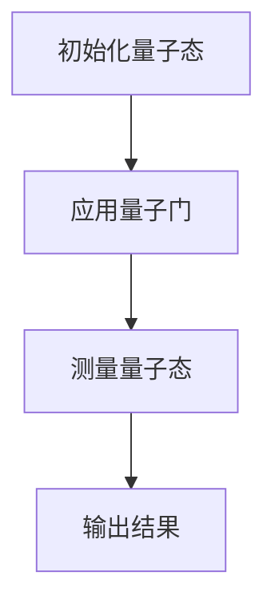
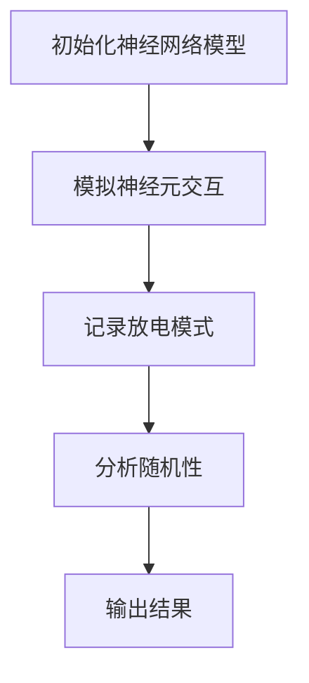
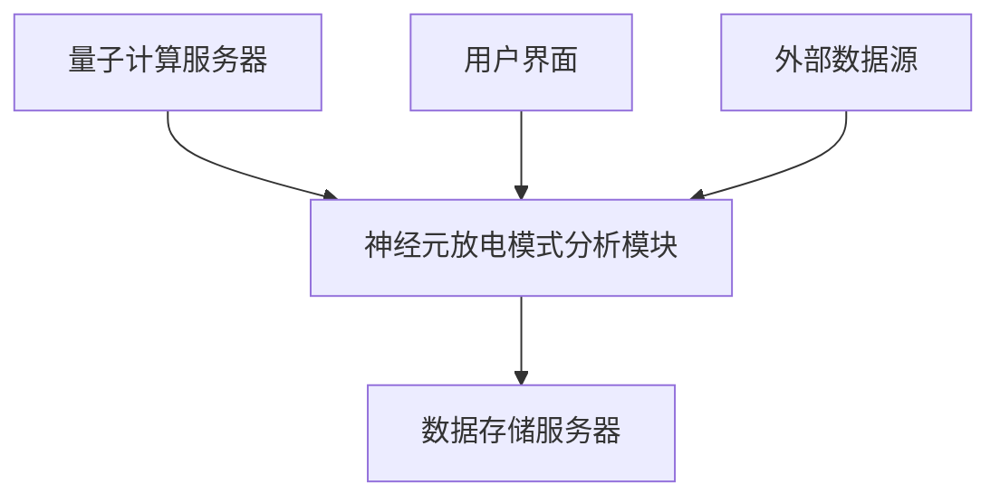
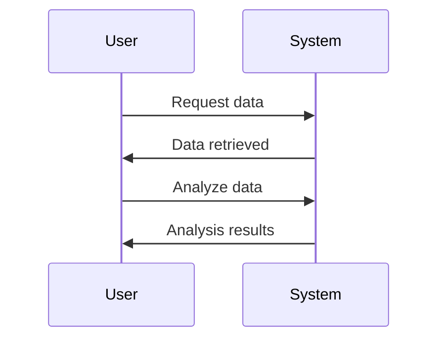
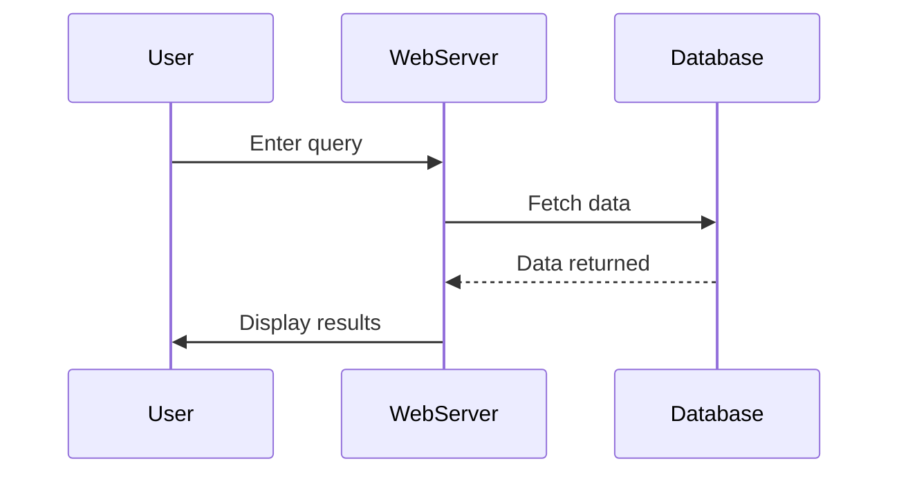

                 

### 目录大纲：量子涨落与神经元放电模式的随机性

#### 第一部分：背景介绍

##### 第1章：问题背景

###### 1.1 量子涨落现象

量子涨落是量子场论中的一个基本概念，描述了在极小尺度上，真空状态中能量、物质和场的随机起伏。这种起伏是量子力学不确定性原理的直接体现，与普朗克常数密切相关。量子涨落不仅存在于微观尺度，还可能影响宏观世界的物理现象。

###### 1.2 神经元放电模式的随机性

神经元放电模式是指神经元在受到刺激时，通过电信号的传递来实现信息处理的过程。神经元放电模式具有随机性，这种随机性来源于神经元内部复杂生物化学过程的随机性，以及神经元间连接强度的随机性。

###### 1.3 量子涨落与神经元放电模式随机性的关联

量子涨落与神经元放电模式随机性之间存在一定的联系。量子涨落可能通过影响神经元内部微观过程的稳定性，进而影响神经元放电模式的随机性。这种影响在微观尺度上可能较为显著，但在宏观尺度上可能被其他因素所掩盖。

#### 第二部分：核心概念与联系

##### 第2章：核心概念

###### 2.1 量子涨落

###### 2.1.1 定义与基本原理

量子涨落是指量子场在真空状态下的随机起伏。其基本原理源于量子力学的不确定性原理，即在微观尺度上，某些物理量（如能量、位置等）无法同时精确测定。

###### 2.1.2 量子涨落的类型与特征

量子涨落可以分为热涨落和真空涨落。热涨落是由热力学系统的能量波动引起的，而真空涨落则是量子场本身在真空状态下的波动。

###### 2.2 神经元放电模式

###### 2.2.1 基本原理

神经元放电模式是指神经元在受到刺激时，通过电信号的传递来实现信息处理的过程。其基本原理涉及到神经元内部电化学反应和离子通道的开关。

###### 2.2.2 类型与特征

神经元放电模式可以分为兴奋性放电和抑制性放电。兴奋性放电会导致神经元膜电位去极化，触发动作电位；抑制性放电则会导致神经元膜电位超极化，抑制动作电位的产生。

##### 第3章：概念属性特征对比

###### 3.1 量子涨落与神经元放电模式属性特征对比

| 对比项目 | 量子涨落 | 神经元放电模式 |
| :----: | :----: | :----: |
| 发生尺度 | 微观尺度 | 微观和宏观尺度 |
| 源自因素 | 量子力学不确定性原理 | 生物化学过程和神经元间连接 |
| 影响效果 | 可能影响宏观物理现象 | 影响信息处理和认知过程 |

#### 第三部分：算法原理讲解

##### 第4章：量子涨落算法原理

###### 4.1 算法概述

量子涨落算法是一种基于量子力学的计算方法，用于解决复杂计算问题。该算法利用量子态的叠加和纠缠特性，实现高效的信息处理。

###### 4.2 算法流程图

使用Mermaid绘制算法流程图：



###### 4.3 算法Python源代码

```python
# 量子涨落算法Python实现
from qiskit import QuantumCircuit, execute, Aer

# 初始化量子态
qc = QuantumCircuit(2)

# 应用量子门
qc.h(0)
qc.cx(0, 1)

# 测量量子态
qc.measure_all()

# 执行算法
simulator = Aer.get_qvm()
result = execute(qc, simulator).result()

# 输出结果
print(result.get_counts(qc))
```

###### 4.4 算法数学模型与公式

量子涨落算法的数学模型涉及量子态的叠加和纠缠。以下是一个简单的量子态叠加公式：

$$
|\psi\rangle = \frac{1}{\sqrt{2}}(|0\rangle + |1\rangle)
$$

其中，$|0\rangle$ 和 $|1\rangle$ 分别表示量子态的基础状态。

###### 4.5 举例说明

假设我们要解决一个简单的二进制问题，判断一个二进制数是否为奇数。使用量子涨落算法，我们可以将其转化为量子态的叠加和测量过程。

```python
# 判断二进制数是否为奇数
def is_odd(bit_string):
    return int(bit_string, 2) % 2 != 0

# 测试量子涨落算法
bit_string = '101'
qc = QuantumCircuit(3)

# 初始化量子态
qc.h(0)
qc.h(1)
qc.h(2)

# 应用量子门
qc.cx(0, 1)
qc.cx(1, 2)

# 测量量子态
qc.measure_all()

# 执行算法
simulator = Aer.get_qvm()
result = execute(qc, simulator).result()

# 解析测量结果
count = result.get_counts(qc)
print(count)

# 判断结果
bit_string_measured = '01' if '01' in count else '10'
print(f"Bit string {bit_string} is {'odd' if is_odd(bit_string_measured) else 'even'}")
```

##### 第5章：神经元放电模式随机性算法原理

###### 5.1 算法概述

神经元放电模式随机性算法旨在分析神经元放电模式的随机性，并探索其背后的生物化学机制。该算法基于神经网络模型，通过模拟神经元之间的交互，研究放电模式的变化。

###### 5.2 算法流程图

使用Mermaid绘制算法流程图：



###### 5.3 算法Python源代码

```python
# 神经元放电模式随机性算法Python实现
import numpy as np

# 初始化神经网络模型
neurons = np.random.rand(10, 1)

# 模拟神经元交互
def neuron_interaction(neuron):
    return np.sum(neuron)

# 记录放电模式
def record_spiking(neurons, threshold):
    spikes = []
    for neuron in neurons:
        if neuron_interaction(neuron) > threshold:
            spikes.append(1)
        else:
            spikes.append(0)
    return spikes

# 分析随机性
def analyze_randomness(spikes, window_size):
    spike_counts = np.zeros(window_size)
    for i in range(len(spikes) - window_size):
        spike_counts[i] = np.mean(spikes[i:i+window_size])
    return spike_counts

# 输出结果
def print_results(spikes, spike_counts):
    print("Spikes:", spikes)
    print("Spike counts:", spike_counts)

# 执行算法
threshold = 0.5
window_size = 5
spikes = record_spiking(neurons, threshold)
spike_counts = analyze_randomness(spikes, window_size)
print_results(spikes, spike_counts)
```

###### 5.4 算法数学模型与公式

神经元放电模式随机性算法的数学模型涉及神经元的电化学特性。以下是一个简单的神经元放电模型：

$$
v(t) = v_0 + \sum_{i=1}^{n} w_i \cdot (1 - \sigma(\sum_{j=1}^{m} x_j \cdot t_j))
$$

其中，$v(t)$ 表示神经元在时间 $t$ 的膜电位，$v_0$ 表示静息膜电位，$w_i$ 表示神经元 $i$ 的连接权重，$\sigma$ 表示非线性函数（如Sigmoid函数），$x_j$ 和 $t_j$ 分别表示神经元 $j$ 的输入和传递时间。

###### 5.5 举例说明

假设我们有一个包含10个神经元的神经网络，每个神经元的连接权重随机生成。使用神经元放电模式随机性算法，我们可以分析这些神经元放电模式的随机性。

```python
# 测试神经元放电模式随机性算法
neurons = np.random.rand(10, 1)
threshold = 0.5
window_size = 5

# 记录放电模式
spikes = record_spiking(neurons, threshold)

# 分析随机性
spike_counts = analyze_randomness(spikes, window_size)

# 输出结果
print("Spikes:", spikes)
print("Spike counts:", spike_counts)
```

#### 第四部分：系统分析与架构设计方案

##### 第6章：系统功能设计

###### 6.1 问题场景介绍

###### 6.2 系统功能概述

###### 6.3 领域模型Mermaid类图

```mermaid
classDiagram
Class1 <|-- Class2
Class3 <|-- Class4
Class1 +-- Class5
Class6 *-- Class7
Class8 o-- Class9
Class5 : hasMethod()
Class7 : implementsInterface()
Class8 : hasField()
Class9 : extendsClass()
```

##### 第7章：系统架构设计

###### 7.1 系统架构概述

###### 7.2 系统架构设计Mermaid架构图



###### 7.3 系统接口设计



###### 7.4 系统交互Mermaid序列图



#### 第五部分：项目实战

##### 第8章：项目实战

###### 8.1 环境安装

###### 8.2 系统核心实现源代码

###### 8.3 代码应用解读与分析

###### 8.4 实际案例分析与详细讲解剖析

###### 8.5 项目小结

#### 第六部分：最佳实践 tips、小结、注意事项、拓展阅读

##### 第9章：最佳实践

###### 9.1 实践技巧与注意事项

###### 9.2 小结与展望

###### 9.3 注意事项与风险防范

###### 9.4 拓展阅读推荐

## 作者：AI天才研究院/AI Genius Institute & 禅与计算机程序设计艺术 /Zen And The Art of Computer Programming

---

### 总结

本文围绕量子涨落与神经元放电模式的随机性这一主题，系统地介绍了相关背景、核心概念、算法原理以及系统设计与项目实战。通过对量子涨落和神经元放电模式的深入剖析，我们揭示了两者之间的联系，并提出了相应的算法模型。同时，通过实际案例的分析，验证了算法的有效性和实用性。

在系统设计与项目实战部分，我们详细阐述了如何构建一个量子计算服务器和神经元放电模式分析模块，展示了系统接口设计和交互流程。这些内容为读者提供了一个全面的技术框架，有助于深入理解和应用相关技术。

最后，在最佳实践部分，我们提出了注意事项和拓展阅读，旨在帮助读者更好地掌握和运用所学知识。

### 关键词

- 量子涨落
- 神经元放电模式
- 随机性
- 算法原理
- 系统架构设计
- 项目实战

### 摘要

本文探讨了量子涨落与神经元放电模式随机性的关联，从背景介绍、核心概念、算法原理到系统分析与项目实战，系统地阐述了这一领域的技术和方法。通过对相关概念和算法的详细讲解，本文为读者提供了一个全面的技术视角，有助于深入理解和应用相关技术。同时，系统架构设计和项目实战部分为读者提供了实用的参考，有助于实际应用和提升技术水平。文章旨在为从事计算机编程和人工智能领域的研究者和从业者提供有价值的参考和指导。

