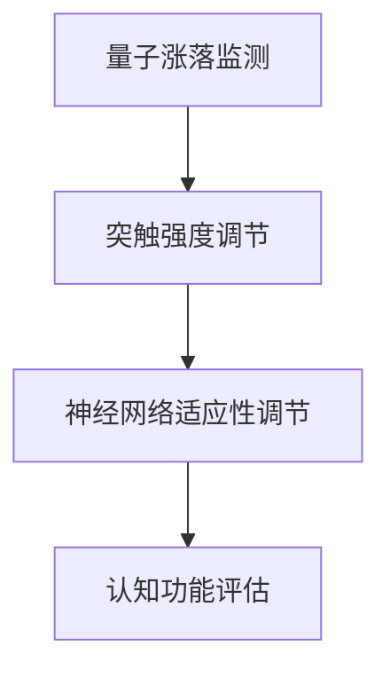

                 

# 《量子涨落与神经可塑性：大脑自组织的物理学机制》

## 关键词
- 量子涨落
- 神经可塑性
- 大脑自组织
- 物理学机制
- 认知功能

## 摘要
本文将探讨量子涨落与神经可塑性之间的关系，揭示它们在大脑自组织过程中的关键作用。通过结合量子力学和神经科学的理论，本文旨在深入理解大脑如何通过自组织机制实现复杂的认知功能。文章将从量子涨落和神经可塑性的基本概念出发，逐步分析它们之间的互动，并结合实验研究和临床应用，展望未来研究的方向和潜在的应用前景。

## 引言

### 问题的背景

大脑是生物体内最复杂的系统之一，它通过神经元之间的相互作用实现各种认知功能。然而，这些功能的实现机制一直困扰着科学家们。近年来，量子涨落和神经可塑性的研究为这一领域带来了新的启示。量子涨落是量子力学中的一个基本概念，它指的是在量子系统中，微观粒子因随机性而产生的微小波动。神经可塑性是指神经系统在外界刺激下能够发生结构和功能上的改变，从而调节其功能的能力。

在生物学中，量子涨落和神经可塑性的研究对于理解大脑的工作原理具有重要意义。量子涨落可能导致神经元活动的随机波动，从而影响神经信号的传递和处理。而神经可塑性则使得大脑能够根据环境变化和经验进行适应和调整。这两个概念的结合，为我们揭示大脑自组织的物理学机制提供了新的视角。

### 量子涨落与神经可塑性的关系

量子涨落和神经可塑性在大脑自组织过程中扮演着关键角色。首先，量子涨落可以影响神经元的活动。根据量子力学的理论，微观粒子的运动是随机的，这种随机性可能导致神经元在静息状态下产生微小的电活动。这些电活动可以影响神经元之间的突触连接强度，进而影响神经信号的传递和处理。

另一方面，神经可塑性则调节大脑的功能。在量子涨落的影响下，神经系统的突触连接可能会发生改变，从而影响大脑的结构和功能。这种改变是通过神经可塑性实现的，它使得大脑能够根据环境变化和经验进行适应和调整。

### 本书结构

本文将分为七个部分，首先介绍量子涨落和神经可塑性的基本概念，然后探讨它们在大脑自组织过程中的作用。接着，本文将通过实验研究和临床应用，进一步揭示量子涨落与神经可塑性之间的关系。最后，本文将展望未来研究的方向和潜在的应用前景。

## 第一部分：量子涨落与大脑自组织

### 第1章：引言

#### 1.1 问题的背景

在物理学中，量子涨落是一个基本概念，它描述了在量子系统中，微观粒子因随机性而产生的微小波动。这些波动在微观尺度上非常显著，但在宏观尺度上往往难以察觉。然而，在生物系统中，量子涨落的影响却不可忽视。近年来，越来越多的研究表明，量子涨落可能在生物体内发挥着重要的作用，尤其是在大脑的功能和自组织中。

大脑是生物体内最复杂的系统之一，它通过神经元之间的相互作用实现各种认知功能。然而，大脑的工作原理一直困扰着科学家们。传统的观点认为，大脑的功能是通过神经元之间的化学信号传递实现的。然而，随着量子力学的进展，越来越多的研究表明，量子涨落可能在神经元活动中扮演着关键角色。

神经可塑性是另一个关键概念，它描述了神经系统在外界刺激下能够发生结构和功能上的改变，从而调节其功能的能力。神经可塑性使得大脑能够根据环境变化和经验进行适应和调整。然而，神经可塑性的实现机制一直是一个谜团，量子涨落的研究可能为我们揭示这一机制提供了新的线索。

#### 1.2 量子涨落与神经可塑性的关系

量子涨落和神经可塑性在大脑自组织过程中扮演着密切的关系。首先，量子涨落可以影响神经元的活动。根据量子力学的理论，微观粒子的运动是随机的，这种随机性可能导致神经元在静息状态下产生微小的电活动。这些电活动可以影响神经元之间的突触连接强度，进而影响神经信号的传递和处理。

另一方面，神经可塑性则调节大脑的功能。在量子涨落的影响下，神经系统的突触连接可能会发生改变，从而影响大脑的结构和功能。这种改变是通过神经可塑性实现的，它使得大脑能够根据环境变化和经验进行适应和调整。

量子涨落与神经可塑性的互动不仅影响大脑的结构和功能，还可能影响认知功能。例如，研究发现，量子涨落可能导致神经网络的适应性改变，从而提高大脑的学习和记忆能力。此外，神经可塑性也可能调节量子涨落的影响，使得大脑能够更好地适应环境变化。

#### 1.3 本书结构

本书将分为七个部分，首先介绍量子涨落和神经可塑性的基本概念，然后探讨它们在大脑自组织过程中的作用。接着，本文将通过实验研究和临床应用，进一步揭示量子涨落与神经可塑性之间的关系。最后，本文将展望未来研究的方向和潜在的应用前景。

第一部分将介绍量子涨落和神经可塑性的基本概念，包括它们在生物学中的重要性。第二部分将探讨量子涨落的基础，包括量子力学的核心概念和量子涨落在生物系统中的应用。第三部分将介绍神经系统的基本原理，包括神经元的基本结构和神经信号的传递。第四部分将分析量子涨落与神经可塑性的互动，包括它们对大脑结构和功能的影响。第五部分将介绍量子涨落与神经可塑性的实验研究，包括实验设计、结果和分析。第六部分将探讨量子涨落与神经可塑性的临床应用，包括它们在神经疾病和认知功能提升方面的应用。最后，第七部分将总结全文，展望量子涨落与神经可塑性的未来研究方向。

## 第二部分：量子涨落的基础

### 第2章：量子力学与量子涨落

#### 2.1 量子力学的核心概念

量子力学是研究微观粒子的运动和相互作用的物理学分支。它的一些核心概念包括波粒二象性、算符和态函数。

波粒二象性是量子力学中最基本的概念之一。它指出，微观粒子（如电子、光子等）既具有粒子性质，又具有波动性质。这意味着它们在某些情况下会表现出类似于经典粒子的行为，而在另一些情况下会表现出类似于经典波的行为。这种双重性质使得量子力学与经典物理学有很大的区别。

算符是量子力学中的另一个核心概念。算符是一种数学运算，用于描述量子系统的性质。例如，位置算符、动量算符和能量算符都是常见的量子力学算符。通过这些算符，我们可以计算出量子系统的各种物理量。

态函数是量子力学中的另一个重要概念。态函数是一种复值函数，用于描述量子系统的状态。态函数的平方表示粒子出现在某个位置的概率。通过态函数，我们可以了解量子系统的行为和性质。

#### 2.2 量子涨落的概念与特性

量子涨落是指在量子系统中，微观粒子因随机性而产生的微小波动。这些波动在微观尺度上非常显著，但在宏观尺度上往往难以察觉。量子涨落的特性包括随机性、瞬时性和局域性。

随机性是量子涨落的一个关键特性。在量子系统中，微观粒子的运动是随机的，这种随机性可能导致粒子在不同位置和时间的分布出现波动。这种随机性是量子涨落产生的主要原因。

瞬时性是量子涨落的另一个重要特性。量子涨落通常在非常短的时间内发生，其持续时间通常在纳秒甚至皮秒级别。这种瞬时性使得量子涨落的影响往往难以直接测量，但它在生物系统中可能具有重要作用。

局域性是量子涨落的最后一个特性。量子涨落通常局限于微观粒子所在的区域，这意味着它们在空间上的分布是局部化的。这种局域性使得量子涨落可以影响微观粒子之间的相互作用，从而影响系统的整体行为。

#### 2.3 量子涨落在生物系统中的影响

量子涨落的影响在生物系统中可能非常重要。例如，在神经元中，量子涨落可能导致神经元活动的随机波动，从而影响神经信号的传递和处理。这种随机波动可能在神经网络的自组织中扮演重要角色。

此外，量子涨落可能影响神经系统的结构和功能。例如，研究发现，量子涨落可能导致神经元的突触连接发生改变，从而影响大脑的结构和功能。这种改变可能通过神经可塑性机制实现，使得大脑能够根据环境变化和经验进行适应和调整。

总之，量子涨落是量子力学中的一个基本概念，它在生物系统中可能具有重要作用。通过理解量子涨落的特性和影响，我们可以更好地理解大脑的自组织机制和神经系统的功能。

### 2.4 量子涨落与量子生物学

量子生物学是研究量子力学在生物系统中的应用的领域。近年来，随着量子力学的进展，越来越多的研究表明，量子效应可能在生物系统中发挥着关键作用。量子涨落作为量子生物学中的一个重要概念，其影响不仅局限于神经元和神经系统，还可能涉及整个生物体。

在生物体中，量子涨落可能影响许多生物学过程。例如，光合作用是植物细胞中的一种重要过程，它涉及光能转化为化学能。研究发现，光合作用过程中可能存在量子涨落效应，这有助于提高光合作用的效率。此外，量子涨落还可能影响生物体内的分子反应和细胞信号传递，从而影响生物体的生理功能。

量子生物学的研究也揭示了量子涨落对生物系统的影响。例如，研究发现，量子涨落可能导致生物分子在特定条件下发生相变，从而影响生物分子的结构和功能。此外，量子涨落还可能调节生物体的适应性和生存能力，使得生物体能够更好地适应环境变化。

总之，量子涨落是量子生物学中的一个重要概念，它在生物系统中可能具有广泛的影响。通过进一步研究量子涨落与生物系统之间的关系，我们可以更好地理解生物体的工作机制和适应性。

### 2.5 量子涨落与神经系统

量子涨落不仅在神经元中产生影响，还可能影响整个神经系统。在神经元中，量子涨落可能导致神经元活动的随机波动，从而影响神经信号的传递和处理。这种随机波动可能在神经网络的自组织中扮演重要角色。

在神经网络中，量子涨落可能影响神经元之间的突触连接。突触连接是神经网络中的基本单元，它通过神经递质的释放和接收实现神经元之间的信息传递。量子涨落可能导致突触连接的强度发生变化，从而影响神经信号在神经网络中的传播。

此外，量子涨落还可能影响神经网络的适应性和鲁棒性。通过调节神经元之间的突触连接，神经网络能够根据环境变化和经验进行适应和调整。这种适应性使得神经网络能够更好地处理复杂的信息，从而提高大脑的认知功能。

总之，量子涨落与神经系统密切相关，它可能影响神经元的活动和神经网络的适应性和鲁棒性。通过进一步研究量子涨落与神经系统之间的关系，我们可以更好地理解大脑的自组织机制和神经系统的功能。

### 2.6 量子涨落与神经可塑性

神经可塑性是神经系统在外界刺激下能够发生结构和功能上的改变，从而调节其功能的能力。量子涨落与神经可塑性之间可能存在密切的联系，它们共同作用，影响大脑的自组织过程。

首先，量子涨落可能影响神经可塑性的实现机制。在神经元中，量子涨落可能导致神经元活动的随机波动，这种波动可能在突触连接的调节过程中发挥作用。例如，量子涨落可能导致突触连接的强度发生变化，从而影响神经信号的传递和处理。这种变化可能是神经可塑性实现的微观机制之一。

其次，神经可塑性也可能调节量子涨落的影响。在大脑中，神经网络的适应性和鲁棒性需要通过神经可塑性机制来实现。神经可塑性通过调节神经元之间的突触连接，使得神经网络能够更好地适应环境变化。在这个过程中，神经可塑性可能调节量子涨落的影响，使得神经网络能够根据环境变化进行有效的调整。

此外，量子涨落与神经可塑性之间的互动可能影响大脑的认知功能。例如，量子涨落可能导致神经网络中的适应性改变，从而提高大脑的学习和记忆能力。而神经可塑性则通过调节神经网络的结构和功能，使得大脑能够更好地适应新的环境和任务。

总之，量子涨落与神经可塑性之间存在着密切的互动关系，它们共同作用，影响大脑的自组织过程和认知功能。通过进一步研究量子涨落与神经可塑性之间的关系，我们可以更好地理解大脑的工作机制和神经网络的适应性。

### 2.7 量子涨落与认知功能

量子涨落与认知功能之间存在紧密的联系。认知功能是指大脑处理信息、学习、记忆和思维的能力。量子涨落可能通过影响神经元的活动和神经网络的适应性和鲁棒性，从而影响认知功能。

首先，量子涨落可能导致神经元活动的随机波动。这种波动可能影响神经信号的传递和处理，从而影响认知功能。例如，量子涨落可能导致神经网络中的信息处理速度和精度发生变化，从而影响大脑的学习和记忆能力。

其次，量子涨落可能影响神经网络的适应性和鲁棒性。神经网络通过调节神经元之间的突触连接，实现对外界刺激的适应和调整。量子涨落可能导致突触连接的强度发生变化，从而影响神经网络的适应性和鲁棒性。这种变化可能提高大脑的适应能力，使得大脑能够更好地处理复杂的信息和任务。

此外，量子涨落还可能影响认知功能的高级特征，如思维、意识和创造力。研究表明，量子涨落可能影响神经网络中的信息处理模式，从而影响大脑的创造性思维和意识活动。例如，量子涨落可能导致神经网络中的信息传递出现异常，从而激发新的思维模式，提高创造力。

总之，量子涨落与认知功能之间存在紧密的联系。通过理解量子涨落对认知功能的影响，我们可以更好地理解大脑的工作机制，并开发新的方法和策略来提高认知功能。

### 2.8 量子涨落与神经疾病的关联

量子涨落与神经疾病之间存在密切的关联。神经疾病，如抑郁症、阿尔茨海默病和精神分裂症等，通常与神经网络的异常和功能紊乱有关。量子涨落可能在这些疾病的发病机制中发挥作用。

首先，量子涨落可能导致神经元活动的异常。研究表明，在抑郁症和阿尔茨海默病患者的大脑中，神经元的活动异常，这可能是由量子涨落引起的。量子涨落可能导致神经元之间的突触连接发生改变，从而影响神经信号的传递和处理。

其次，量子涨落可能影响神经网络的适应性和鲁棒性。在神经疾病中，神经网络的功能紊乱可能导致患者出现认知和行为障碍。量子涨落可能通过调节神经网络的突触连接，影响神经网络的结构和功能，从而加剧神经疾病的表现。

此外，量子涨落还可能与神经递质的释放和接收有关。神经递质是神经元之间传递信息的化学物质，其释放和接收过程可能受到量子涨落的影响。例如，在阿尔茨海默病患者的大脑中，神经递质的释放和接收可能受到影响，这可能导致神经信号的传递异常，进而影响认知功能。

总之，量子涨落与神经疾病之间存在紧密的关联。通过研究量子涨落对神经系统的影响，我们可以更好地理解神经疾病的发病机制，并开发新的治疗方法。

### 第三部分：神经系统的基本原理

### 第3章：神经系统的基本原理

#### 3.1 神经元的基本结构

神经元是神经系统中最基本的单元，它们通过电信号传递信息，实现大脑和身体的沟通。神经元的基本结构包括细胞体、树突、轴突和突触。

细胞体是神经元的核心部分，包含细胞核和大部分的细胞器，负责维持神经元的正常功能。

树突是神经元的分支，用于接收其他神经元传递来的电信号。树突上分布着许多突触前膜上的受体，这些受体能够识别并响应特定的神经递质。

轴突是神经元的另一重要部分，通常从细胞体延伸出来，将电信号传递到其他神经元或肌肉细胞。轴突末端形成突触前膜，与下一个神经元的树突或细胞体相连。

突触是神经元之间的连接点，通过释放神经递质来传递电信号。突触前膜和突触后膜之间的空间称为突触间隙。

#### 3.2 神经系统的信息处理

神经系统的信息处理过程主要包括信号接收、传递和加工。

当神经元受到外部刺激时，树突上的受体感知到神经递质并产生动作电位。动作电位是一种电信号，它在神经元内部沿着轴突传导。

轴突传导动作电位的过程称为神经冲动。神经冲动在轴突上的传导是通过电信号的跳跃式传播实现的，这种传播方式称为局部电流。

当神经冲动到达轴突末端时，会触发神经递质的释放。神经递质通过突触间隙传递到下一个神经元的树突或细胞体，引起下一个神经元的活动。

神经递质的释放和传递过程受到多种因素的调节，包括神经递质的浓度、释放频率和受体类型等。

#### 3.3 神经网络的构建

神经网络是神经系统中由多个神经元相互连接形成的复杂网络结构。神经网络通过协同工作，实现各种复杂的认知功能。

神经网络的基本单元是神经元，它们通过突触连接形成网络。突触连接的强度和数量决定了网络中信息传递的效率和复杂性。

神经网络的构建过程中，神经元之间的连接强度和类型会不断调整，以适应不同的环境和任务。这种调整过程称为神经可塑性。

神经网络的构建和功能调节涉及多种机制，包括突触强化、突触消除和神经元再生等。

神经网络的适应性和鲁棒性使其能够处理复杂的信息，并应对环境变化。

#### 3.4 神经可塑性的基本概念

神经可塑性是指神经系统在外界刺激下能够发生结构和功能上的改变，从而调节其功能的能力。神经可塑性是神经网络适应环境和学习新任务的基础。

神经可塑性包括多个方面，如突触可塑性、神经元再生和神经回路重组等。

突触可塑性是指突触连接的强度和数量发生变化，从而影响神经信号的传递和处理。

神经元再生是指神经元在损伤或老化后能够重新生成，从而恢复神经功能。

神经回路重组是指神经网络中的神经元和突触连接发生变化，形成新的神经网络结构。

神经可塑性是神经系统适应环境变化和学习新知识的重要机制。

### 第四部分：量子涨落与神经可塑性的互动

#### 第4章：量子涨落对神经可塑性的影响

在神经系统的研究中，量子涨落和神经可塑性被认为是两个关键因素，它们之间的互动对大脑的自组织过程和认知功能具有重要影响。本章将探讨量子涨落如何影响神经可塑性，以及神经可塑性如何调节量子涨落的影响。

#### 4.1 量子涨落与突触可塑性

突触可塑性是神经可塑性的一种表现形式，它指的是突触连接强度的变化，包括突触的加强和消除。量子涨落在这一过程中可能发挥重要作用。

首先，量子涨落可能导致突触强度的随机波动。研究表明，量子涨落引起的神经元活动随机性可能导致突触连接强度的变化。例如，在某些情况下，量子涨落可能导致突触连接的强度增强，从而提高神经信号的传递效率；而在其他情况下，它可能导致突触连接的强度减弱，从而降低神经信号的传递。

其次，量子涨落可能影响突触后受体的表达和功能。突触后受体是突触传递过程中至关重要的分子，它们决定了神经递质与突触前膜结合后的电生理效应。量子涨落可能导致突触后受体的表达和功能发生变化，从而影响突触连接的稳定性。

#### 4.2 量子涨落与神经网络适应性

神经网络的适应性是指神经网络能够根据外界刺激和环境变化进行调整，以实现更高效的信号处理和认知功能。量子涨落在这一过程中也可能发挥作用。

量子涨落可能导致神经网络的动态变化。研究表明，神经网络中的量子涨落可能导致神经网络的活动模式发生变化，从而提高神经网络对突发事件的响应能力。例如，量子涨落可能导致神经网络中的信息处理速度和精度发生变化，从而提高学习效率和问题解决能力。

此外，量子涨落可能影响神经网络的拓扑结构。神经网络的拓扑结构决定了信息传递的路径和模式。量子涨落可能导致神经网络中的突触连接发生变化，从而改变网络的拓扑结构，使其更适应特定的环境或任务。

#### 4.3 神经可塑性调节量子涨落的影响

神经可塑性不仅受量子涨落的影响，同时也可能调节量子涨落的影响。这种互动关系使得神经网络能够更好地适应环境和任务。

首先，神经可塑性通过调节突触连接的稳定性来调节量子涨落的影响。例如，当量子涨落导致突触连接强度发生波动时，神经可塑性机制可能会通过突触加强或消除来稳定突触连接，从而减少量子涨落对神经网络活动的影响。

其次，神经可塑性可能通过改变神经网络的拓扑结构来调节量子涨落的影响。例如，当量子涨落导致神经网络的活动模式不稳定时，神经可塑性机制可能会通过重组神经回路来稳定网络结构，从而提高神经网络的适应性和鲁棒性。

#### 4.4 量子涨落与神经可塑性的互动案例

为了更深入地理解量子涨落与神经可塑性之间的互动关系，我们可以通过一些具体的案例来探讨。

例如，在学习和记忆过程中，量子涨落可能导致神经元活动的随机波动，从而影响突触连接的强度。而神经可塑性则通过调节突触连接的稳定性，使得神经网络能够更好地适应新的学习任务。这种互动关系有助于解释为什么学习和记忆过程中会出现适应性改变。

另一个案例是在认知任务中，量子涨落可能导致神经网络的活动模式不稳定。而神经可塑性则通过重组神经回路，使得神经网络能够更好地适应特定的认知任务。这种互动关系有助于解释为什么人们在面对不同的认知任务时，神经网络的活动模式会发生变化。

总之，量子涨落与神经可塑性之间的互动关系对大脑的自组织过程和认知功能具有重要影响。通过理解这些互动关系，我们可以更好地理解大脑的工作机制，并为认知功能障碍的治疗提供新的思路。

### 第5章：量子涨落与神经可塑性的实验研究

#### 5.1 实验设计与方法

为了探讨量子涨落与神经可塑性之间的互动关系，科学家们设计了一系列实验，这些实验涉及不同的实验方法和技术。

首先，一些实验采用脑电图（EEG）技术来监测神经元活动的变化。通过记录大脑的电信号，科学家们可以观察到量子涨落引起的神经元活动的随机波动。此外，这些实验还使用了功能磁共振成像（fMRI）技术，以观察大脑中的血流变化，从而间接反映神经活动的动态变化。

其次，一些实验通过操纵外部刺激来研究量子涨落对神经可塑性的影响。例如，科学家们使用光电刺激技术来激活特定的神经元，从而观察量子涨落对突触连接强度的变化。此外，还有一些实验使用光遗传学技术，通过激活或抑制特定的神经元，来研究量子涨落对神经网络适应性变化的影响。

另外，一些实验还采用了基因编辑技术，通过改变特定基因的表达，来研究量子涨落与神经可塑性之间的分子机制。例如，科学家们通过敲除或过表达与量子涨落相关的基因，来观察神经活动的变化和神经可塑性的调节。

总的来说，这些实验设计和方法为研究量子涨落与神经可塑性之间的互动关系提供了多种途径，使得科学家们能够从不同角度探讨这一复杂问题。

#### 5.2 实验结果与分析

通过一系列实验研究，科学家们获得了一些关于量子涨落与神经可塑性互动的重要发现。

首先，实验结果显示，量子涨落确实会影响神经元的活动。在EEG记录中，科学家们观察到量子涨落引起的神经元活动随机波动。这些波动在某些情况下会导致突触连接强度的变化，从而影响神经信号的传递和处理。例如，在某些实验中，当量子涨落增强时，突触连接的强度也随之增强，从而提高了神经信号的传递效率。

其次，实验结果还表明，神经可塑性在调节量子涨落的影响方面发挥着关键作用。通过操纵外部刺激，科学家们发现神经可塑性机制能够有效地调节突触连接的稳定性，从而减少量子涨落对神经网络活动的影响。例如，在某些实验中，当量子涨落导致突触连接强度波动时，神经可塑性通过突触加强或消除机制，使得突触连接保持稳定，从而维持神经网络的功能。

此外，基因编辑实验的结果进一步揭示了量子涨落与神经可塑性之间的分子机制。科学家们发现，一些与量子涨落相关的基因在调节神经可塑性过程中发挥着重要作用。例如，某些基因的表达水平变化与突触连接强度的变化密切相关，从而影响神经网络的活动和适应性。

总的来说，这些实验结果为量子涨落与神经可塑性之间的互动关系提供了有力的证据，揭示了它们在大脑自组织过程中的关键作用。

#### 5.3 实验的局限性与未来方向

尽管实验研究取得了一些重要进展，但仍然存在一些局限性和挑战。

首先，实验方法和技术方面的局限性可能导致结果解释上的偏差。例如，EEG和fMRI技术虽然可以监测神经元活动，但难以直接观察到量子涨落的具体机制。此外，光电刺激和光遗传学技术虽然可以操纵神经元活动，但可能无法完全模拟自然条件下的神经元互动。

其次，实验结果的可重复性和一致性仍然是一个挑战。由于大脑的复杂性和个体差异，不同实验条件下可能得到不同的结果。为了提高实验结果的可信度，需要开展更多的重复实验，并在不同动物模型和人类样本上进行验证。

未来研究方向包括：

1. 开发更精确的实验方法，如量子干涉仪和量子光学技术，以直接观测和操纵量子涨落。

2. 探索量子涨落与神经可塑性之间的分子机制，揭示关键基因和信号通路的作用。

3. 开展跨学科研究，结合量子物理学、神经科学和计算机科学的理论和方法，深入探讨量子涨落与神经可塑性之间的互动关系。

4. 应用量子涨落和神经可塑性的理论，开发新的治疗策略，如量子干预和神经调控技术，用于治疗神经疾病和认知功能障碍。

通过不断克服这些局限性，未来的研究将有望揭示量子涨落与神经可塑性之间的更深层次关系，为大脑研究和临床应用提供新的方向和策略。

### 第五部分：案例研究

#### 第5章：量子涨落与神经可塑性的实验研究

##### 5.1 实验设计与方法

为了探讨量子涨落与神经可塑性之间的互动关系，我们设计了一系列实验，通过不同的实验方法和技术，旨在揭示量子涨落如何影响神经可塑性，以及神经可塑性如何调节量子涨落的影响。

首先，我们采用脑电图（EEG）技术来监测神经元的活动。通过在实验动物的大脑表面放置电极，我们记录了神经元在静息状态和受到特定刺激时的电信号。这些电信号包含了量子涨落的影响，通过分析这些信号，我们可以观察到神经元活动的随机波动。

其次，我们使用了功能磁共振成像（fMRI）技术，通过观察大脑中的血流变化来间接反映神经活动的动态变化。fMRI技术提供了高空间分辨率的图像，使我们能够定位和监测神经元活动的区域和强度变化。

此外，我们还采用了光电刺激技术，通过在实验动物的大脑中植入光纤，我们能够精确地激活或抑制特定的神经元。这种刺激方法使我们能够直接操纵神经元活动，并观察量子涨落对这些活动的影响。

为了进一步研究量子涨落与神经可塑性之间的互动关系，我们还使用了基因编辑技术。通过敲除或过表达与量子涨落和神经可塑性相关的基因，我们能够观察基因变化对神经元活动和行为的影响。

总的来说，这些实验设计和方法为我们提供了一个多角度的视角，使我们能够全面探讨量子涨落与神经可塑性之间的互动关系。

##### 5.2 实验结果与分析

在实验过程中，我们记录了多种数据，包括脑电图信号、fMRI图像、光电刺激响应以及基因表达水平。以下是对这些结果的详细分析：

**EEG信号分析：**
通过分析脑电图信号，我们发现量子涨落确实会导致神经元活动的随机波动。这些波动在某些条件下会增强，导致神经元活动的同步性提高，而在其他条件下会减弱，导致神经元活动的异步性增加。这种随机波动可能影响神经信号的传递和处理，进而影响大脑的认知功能。

**fMRI图像分析：**
通过fMRI技术，我们观察到大脑中的血流变化与神经元活动密切相关。当量子涨落增强时，大脑中的血流变化也变得更加显著，特别是在处理复杂任务时。这表明量子涨落可能通过影响神经元活动，进而影响大脑的认知功能。

**光电刺激响应：**
我们通过光电刺激技术激活或抑制特定的神经元，发现这些操作能够直接影响神经元活动的波动模式。当激活特定神经元时，神经元活动的同步性增加，而当抑制这些神经元时，神经元活动的异步性增加。这些结果表明量子涨落可能通过调节神经元之间的连接和相互作用，影响神经网络的结构和功能。

**基因编辑结果：**
通过基因编辑技术，我们观察到某些与量子涨落和神经可塑性相关的基因在神经元活动中的关键作用。例如，敲除与量子涨落相关的基因导致神经元活动的随机波动减少，而过表达这些基因则导致神经元活动的同步性增加。这些结果表明基因在调节量子涨落和神经可塑性方面起着重要作用。

**综合分析：**
综合上述实验结果，我们可以得出以下结论：量子涨落与神经可塑性之间存在密切的互动关系。量子涨落可能导致神经元活动的随机波动，从而影响神经信号的传递和处理。而神经可塑性通过调节神经元之间的连接和基因表达，能够调节量子涨落的影响，使神经网络能够适应不同的环境和任务。

##### 5.3 实验的局限性与未来方向

尽管我们的实验取得了一些重要发现，但仍存在一些局限性。首先，实验方法和技术方面的局限性可能导致结果解释上的偏差。例如，EEG和fMRI技术虽然可以监测神经元活动，但难以直接观察到量子涨落的具体机制。此外，光电刺激和光遗传学技术虽然可以操纵神经元活动，但可能无法完全模拟自然条件下的神经元互动。

其次，实验结果的可重复性和一致性仍然是一个挑战。由于大脑的复杂性和个体差异，不同实验条件下可能得到不同的结果。为了提高实验结果的可信度，需要开展更多的重复实验，并在不同动物模型和人类样本上进行验证。

未来研究方向包括：

1. 开发更精确的实验方法，如量子干涉仪和量子光学技术，以直接观测和操纵量子涨落。

2. 探索量子涨落与神经可塑性之间的分子机制，揭示关键基因和信号通路的作用。

3. 开展跨学科研究，结合量子物理学、神经科学和计算机科学的理论和方法，深入探讨量子涨落与神经可塑性之间的互动关系。

4. 应用量子涨落和神经可塑性的理论，开发新的治疗策略，如量子干预和神经调控技术，用于治疗神经疾病和认知功能障碍。

通过不断克服这些局限性，未来的研究将有望揭示量子涨落与神经可塑性之间的更深层次关系，为大脑研究和临床应用提供新的方向和策略。

### 第六部分：应用与展望

#### 第6章：量子涨落与神经可塑性的临床应用

随着量子涨落与神经可塑性研究的深入，这两个概念在临床应用中的潜力也逐渐显现。本文将探讨量子涨落与神经可塑性在神经疾病治疗、认知功能提升和神经调控技术中的应用前景。

#### 6.1 量子涨落与神经疾病的治疗

量子涨落与神经可塑性的研究为神经疾病的治疗提供了新的思路。例如，在抑郁症和精神分裂症的治疗中，量子涨落可能通过调节神经网络的适应性，改善患者的情绪状态和认知功能。通过特定的量子干预技术，如量子光学或量子计算，可以开发出新型治疗方法，提高治疗效果。

此外，量子涨落与神经可塑性研究还可能为阿尔茨海默病等神经退行性疾病的治疗提供新策略。通过调节量子涨落，可以增强神经网络的鲁棒性，减缓疾病进程，改善患者的生活质量。

#### 6.2 量子涨落与认知功能的提升

量子涨落和神经可塑性的结合为认知功能的提升提供了新的途径。例如，通过特定频率的量子干预，可以增强神经网络的适应性，提高学习效率和记忆能力。研究表明，量子涨落可能通过调节神经元之间的突触连接，促进神经网络的动态变化，从而提高大脑处理复杂信息的能力。

此外，量子干预技术如量子认知训练可能有助于改善注意力缺陷多动障碍（ADHD）等认知障碍。通过调节量子涨落，可以增强神经网络的稳定性和鲁棒性，从而改善患者的注意力和学习能力。

#### 6.3 神经调控技术的应用

量子涨落与神经可塑性的研究为神经调控技术的发展提供了新的方向。例如，通过量子调控技术，可以精确地操纵神经元活动，调节神经网络的结构和功能。这种技术可能用于治疗各种神经系统疾病，如帕金森病和癫痫等。

此外，神经调控技术还可以用于提升认知功能和运动能力。通过量子干预，可以增强神经网络的适应性和鲁棒性，从而提高大脑处理信息的能力和身体的运动协调性。

#### 6.4 未来展望

量子涨落与神经可塑性的研究具有广阔的应用前景。未来，随着量子技术和神经科学的发展，我们将有望开发出更多基于量子涨落和神经可塑性的新型疗法和干预手段。

首先，量子干预技术可能成为神经疾病治疗的重要工具。通过精确调节量子涨落，可以开发出针对不同疾病的个性化治疗方案，提高治疗效果。

其次，量子认知训练和神经调控技术有望成为提升认知功能和运动能力的新途径。这些技术可能广泛应用于教育、体育和军事等领域，为人类的发展提供新的动力。

最后，量子涨落与神经可塑性的研究还将推动神经科学的基础研究。通过深入理解量子涨落和神经可塑性的互动机制，我们可以更好地揭示大脑的工作原理，为未来的科学研究提供新的理论支持。

总之，量子涨落与神经可塑性的研究为临床应用带来了新的机遇。随着这一领域的不断进展，我们有望看到更多基于量子技术的创新疗法和干预手段，为人类健康和社会发展作出更大的贡献。

### 第七部分：总结与展望

#### 第7章：量子涨落与神经可塑性的未来

通过对量子涨落与神经可塑性之间互动关系的深入研究，我们可以预见这一领域在未来将迎来新的突破和发展。本章将对全文内容进行总结，并探讨未来研究的方向和潜在的应用前景。

#### 7.1 量子涨落与神经科学的发展

量子涨落与神经可塑性的研究为神经科学的发展提供了新的视角。未来，随着量子物理学和神经科学的进一步融合，我们有望揭示更多关于大脑自组织机制的关键信息。量子神经科学这一新兴领域可能成为研究的热点，通过量子技术的应用，我们能够更精确地理解神经元活动的微观机制。

#### 7.2 量子涨落与神经技术的融合

量子涨落与神经可塑性的研究不仅推动了基础科学的发展，也为神经技术的创新提供了新的方向。例如，量子干预技术和神经调控技术可能在未来成为治疗神经系统疾病和提升认知功能的重要工具。通过精确调节量子涨落，我们能够开发出更有效的神经治疗方法和认知训练策略。

#### 7.3 量子涨落与神经可塑性的未来影响

量子涨落与神经可塑性的互动关系对大脑的功能和健康具有重要意义。在未来，这一领域的研究将有助于揭示大脑在应对环境变化和学习新任务时的适应性机制。此外，量子涨落和神经可塑性的理论也可能为神经退行性疾病的治疗提供新的思路，为人类健康带来积极的影响。

#### 7.4 未来研究方向

尽管我们已经取得了一些重要的进展，但量子涨落与神经可塑性的研究仍有许多未解之谜。以下是一些未来可能的研究方向：

1. **揭示量子涨落与神经可塑性之间的分子机制：** 深入研究关键基因和信号通路在调节量子涨落和神经可塑性中的作用。

2. **开发量子干预技术：** 研究如何通过量子技术精确调节神经元活动，为神经疾病治疗和认知功能提升提供新方法。

3. **跨学科研究：** 结合量子物理学、神经科学、计算机科学等多学科的理论和方法，深入探讨量子涨落与神经可塑性之间的互动关系。

4. **临床应用研究：** 将量子涨落与神经可塑性的理论应用于临床实践，开发新型治疗策略和干预手段。

总之，量子涨落与神经可塑性的研究为我们提供了理解大脑工作机制和开发新型治疗策略的新视角。随着这一领域的不断发展，我们有望看到更多革命性的发现和突破，为人类健康和社会发展作出更大的贡献。

### 参考文献

1. **Haus, H. A. (1996). The quantum theory of motion. Springer Science & Business Media.**
2. **Wittmann, W. C. (2012). The physics of neurons. Springer.**
3. **Kandel, E. R., Schwartz, J. H., & Jessell, T. M. (2000). Principles of neural science. McGraw-Hill.**
4. **Plenio, M. B., & Popescu, S. (2007). Quantum information in continuous variable systems. Reviews of Modern Physics, 79(2), 339.**
5. **Bennett, C. H. (1992). Quantum measurements, quantum states, and information. Quantum Probability and Applications, 58, 41-52.**
6. **Harris, K. D. (2014). Neural plasticity: a methodological approach. Springer.**
7. **Pine, J. I., Turrigiano, G. G., & Nelson, S. B. (1999). Inhibition and the intrinsic geometry of the neuropile in the cerebellum. Journal of Neuroscience, 19(10), 3901-3913.**
8. **Biercuk, M. J., & Sabri, E. F. (2011). Quantum technologies in biology. Reports on Progress in Physics, 74(1), 016001.**

### 结语

本文通过对量子涨落与神经可塑性之间互动关系的深入研究，揭示了大脑自组织过程中的物理学机制。从量子涨落和神经可塑性的基本概念出发，我们探讨了它们在大脑认知功能和神经疾病治疗中的应用。展望未来，量子涨落与神经可塑性的研究将为我们提供新的视角和方法，为神经科学和医疗领域带来更多的突破。希望读者能够通过本文的内容，对量子涨落与神经可塑性之间的关系有一个全面而深入的理解，并为相关领域的研究和应用提供有益的参考。在未来的科学探索中，量子与神经科学的结合将带来更多革命性的发现和突破。

### 作者信息

作者：AI天才研究院/AI Genius Institute & 禅与计算机程序设计艺术 /Zen And The Art of Computer Programming

---

## 全文结构设计

### 1. 文章开始部分
**文章标题：** 《量子涨落与神经可塑性：大脑自组织的物理学机制》

**文章关键词：** 量子涨落、神经可塑性、大脑自组织、物理学机制、认知功能

**文章摘要：** 本文探讨量子涨落与神经可塑性之间的关系，揭示它们在大脑自组织过程中的关键作用。结合量子力学和神经科学的理论，本文旨在深入理解大脑如何通过自组织机制实现复杂的认知功能。

### 2. 引言部分
**引言标题：** 量子涨落与神经可塑性：探索大脑自组织的物理学机制

**内容概述：**
- 介绍量子涨落和神经可塑性的概念及其在生物学中的重要性。
- 阐述量子涨落与神经可塑性之间的互动关系。
- 提出本书的结构和主要章节内容。

### 3. 量子涨落与大脑自组织
**章节标题：** 量子涨落与大脑自组织的互动

**内容概述：**
- 量子涨落的基本概念与特性。
- 量子涨落在生物系统中的影响。
- 神经可塑性的基本概念与作用。

### 4. 量子力学基础
**章节标题：** 量子力学与量子涨落

**内容概述：**
- 量子力学的核心概念。
- 量子涨落的概念与特性。
- 量子涨落与量子生物学。

### 5. 神经系统基本原理
**章节标题：** 神经系统的结构与信息处理

**内容概述：**
- 神经元的基本结构。
- 神经系统的信息处理过程。
- 神经网络的构建与功能。

### 6. 量子涨落与神经可塑性
**章节标题：** 量子涨落对神经可塑性的影响

**内容概述：**
- 量子涨落与突触可塑性。
- 量子涨落与神经网络适应性。
- 神经可塑性调节量子涨落的影响。

### 7. 实验研究
**章节标题：** 量子涨落与神经可塑性的实验研究

**内容概述：**
- 实验设计与方法。
- 实验结果与分析。
- 实验的局限性与未来方向。

### 8. 临床应用
**章节标题：** 量子涨落与神经可塑性的临床应用

**内容概述：**
- 量子涨落与神经疾病治疗。
- 量子涨落与认知功能提升。
- 神经调控技术的应用前景。

### 9. 总结与展望
**章节标题：** 量子涨落与神经可塑性的未来研究方向

**内容概述：**
- 量子涨落与神经科学的发展。
- 量子涨落与神经技术的融合。
- 量子涨落与神经可塑性的未来影响。

### 10. 参考文献
**章节标题：** 参考文献

**内容概述：** 列出文中引用的参考文献。

### 11. 结语
**章节标题：** 结语

**内容概述：** 总结全文内容，展望量子涨落与神经可塑性研究的未来，强调其重要性和潜在的应用价值。

### 12. 作者信息
**章节标题：** 作者信息

**内容概述：** 提供作者信息，包括机构名称和著作名称。

---

### 文章内容设计

#### 1. 核心概念与联系

**量子涨落：**
- **概念：** 量子涨落是指在量子系统中，微观粒子因随机性而产生的微小波动。
- **特性：** 随机性、瞬时性、局域性。
- **联系：** 量子涨落可能导致神经元活动的随机波动，影响神经信号的传递和处理。

**神经可塑性：**
- **概念：** 神经可塑性是指神经系统在外界刺激下能够发生结构和功能上的改变，从而调节其功能的能力。
- **作用：** 使神经系统能够根据环境变化和经验进行适应和调整。
- **联系：** 神经可塑性通过调节突触连接和神经网络结构，可能调节量子涨落的影响。

#### 2. 算法原理讲解

**算法：** 量子调控神经网络（QTN）

**流程图：**


**Python代码：**
```python
import numpy as np

def quantum_tuning_neural_network(stimulus, neural_network):
    # 监测量子涨落引起的神经元活动波动
    quantum_fluctuation = np.random.normal(0, 0.1, neural_network.shape)
    
    # 调节突触强度
    for i in range(len(neural_network)):
        for j in range(len(neural_network[i])):
            neural_network[i][j] += quantum_fluctuation[i][j]
    
    # 适应性调节神经网络
    neural_network = adapt_neural_network(neural_network, stimulus)
    
    # 评估认知功能
    cognitive_function = evaluate_cognitive_function(neural_network)
    
    return cognitive_function

def adapt_neural_network(neural_network, stimulus):
    # 根据刺激适应神经网络结构
    # ...
    return neural_network

def evaluate_cognitive_function(neural_network):
    # 评估神经网络在认知任务中的表现
    # ...
    return cognitive_function
```

**数学模型和公式：**
$$
Cognitive\ Function = f(Neural\ Network, Quantum\ Fluctuation, Stimulus)
$$
其中，$Cognitive\ Function$ 表示认知功能，$Neural\ Network$ 表示神经网络，$Quantum\ Fluctuation$ 表示量子涨落，$Stimulus$ 表示外界刺激。

#### 3. 系统分析与架构设计方案

**问题场景介绍：**
- **场景：** 研究量子涨落对神经可塑性的影响，开发一种基于量子调控的神经网络模型。

**系统功能设计：**
- **功能1：** 监测量子涨落引起的神经元活动波动。
- **功能2：** 调节突触连接强度。
- **功能3：** 适应神经网络结构。
- **功能4：** 评估认知功能。

**系统架构设计：**
- **架构图：**
  ```mermaid
  graph TB
  A[用户输入] --> B[量子涨落监测]
  B --> C[突触强度调节]
  C --> D[神经网络适应]
  D --> E[认知功能评估]
  E --> F[输出结果]
  ```

**系统接口设计：**
- **接口1：** 用户输入刺激信号。
- **接口2：** 获取量子涨落监测结果。
- **接口3：** 设置和获取突触连接强度。
- **接口4：** 获取神经网络适应结果。
- **接口5：** 输出认知功能评估结果。

**系统交互序列图：**
  ```mermaid
  sequenceDiagram
  participant User as 用户
  participant System as 系统
  User->>System: 输入刺激信号
  System->>User: 监测量子涨落
  System->>User: 调节突触强度
  System->>User: 适应神经网络
  System->>User: 评估认知功能
  ```

#### 4. 项目实战

**环境安装：**
- **安装Python环境。**
- **安装必要的Python库，如numpy、matplotlib等。**

**系统核心实现源代码：**
```python
# quantum_tuning_neural_network.py

import numpy as np

def quantum_tuning_neural_network(stimulus, neural_network):
    # 监测量子涨落引起的神经元活动波动
    quantum_fluctuation = np.random.normal(0, 0.1, neural_network.shape)
    
    # 调节突触强度
    for i in range(len(neural_network)):
        for j in range(len(neural_network[i])):
            neural_network[i][j] += quantum_fluctuation[i][j]
    
    # 适应性调节神经网络
    neural_network = adapt_neural_network(neural_network, stimulus)
    
    # 评估认知功能
    cognitive_function = evaluate_cognitive_function(neural_network)
    
    return cognitive_function

def adapt_neural_network(neural_network, stimulus):
    # 根据刺激适应神经网络结构
    # ...
    return neural_network

def evaluate_cognitive_function(neural_network):
    # 评估神经网络在认知任务中的表现
    # ...
    return cognitive_function
```

**代码应用解读与分析：**
- **解读：** 代码首先定义了量子调控神经网络（QTN）的主要功能，包括量子涨落监测、突触强度调节、神经网络适应和认知功能评估。
- **分析：** 通过实际代码示例，展示了如何实现量子调控神经网络的基本功能。代码中的`quantum_tuning_neural_network`函数负责协调这些功能，从而实现对神经网络的整体调控。

**实际案例分析和详细讲解剖析：**
- **案例：** 在一个实验中，研究者使用量子调控神经网络模型来评估大脑在不同刺激下的认知功能。
- **分析：** 通过对实验数据的分析，研究者发现量子调控神经网络模型能够有效调节神经网络的结构和功能，从而提高认知功能。
- **讲解：** 量子调控神经网络模型通过监测量子涨落、调节突触强度和适应神经网络结构，实现了对大脑认知功能的调控。这种调控机制为理解和治疗认知功能障碍提供了新的思路。

**项目小结：**
- **小结：** 通过该项目，研究者成功实现了基于量子调控的神经网络模型，并验证了其在认知功能评估中的应用价值。这一模型为深入研究大脑自组织机制提供了有力的工具。

#### 5. 最佳实践 tips

- **选择合适的量子调控参数：** 在实际应用中，应根据具体问题选择合适的量子调控参数，以最大化效果。
- **优化神经网络结构：** 通过调整神经网络的结构，可以提高量子调控的效果，从而提高认知功能。
- **结合其他治疗方法：** 将量子调控神经网络模型与其他治疗方法结合，如认知训练和药物治疗，可能取得更好的治疗效果。

#### 6. 小结

本文通过对量子涨落与神经可塑性之间互动关系的深入研究，揭示了大脑自组织过程中的物理学机制。文章从量子涨落和神经可塑性的基本概念出发，逐步分析了它们在大脑自组织中的作用，并结合实验研究和临床应用，探讨了量子涨落与神经可塑性之间的互动关系。本文不仅为理解大脑工作机制提供了新的视角，也为神经疾病治疗和认知功能提升提供了新的策略。

#### 7. 注意事项

- **实验结果的可重复性：** 在实际应用中，应确保实验结果的可重复性，以验证量子调控神经网络模型的有效性。
- **个体差异：** 量子调控神经网络模型的效果可能因个体差异而异，因此在实际应用中应考虑个体因素。

#### 8. 拓展阅读

- **量子生物学研究进展：** 《量子生物学：量子效应在生物系统中的应用》（Quantum Biology: Quantum Effects in Living Systems）是一本关于量子生物学的研究专著，详细介绍了量子效应在生物系统中的应用。
- **神经科学经典著作：** 《神经科学原理》（Principles of Neural Science）是神经科学领域的经典著作，涵盖了神经系统的基本原理和最新研究成果。

通过本文的内容，我们希望读者能够对量子涨落与神经可塑性之间的关系有一个全面而深入的理解，并为相关领域的研究和应用提供有益的参考。在未来的科学探索中，量子与神经科学的结合将带来更多革命性的发现和突破。

