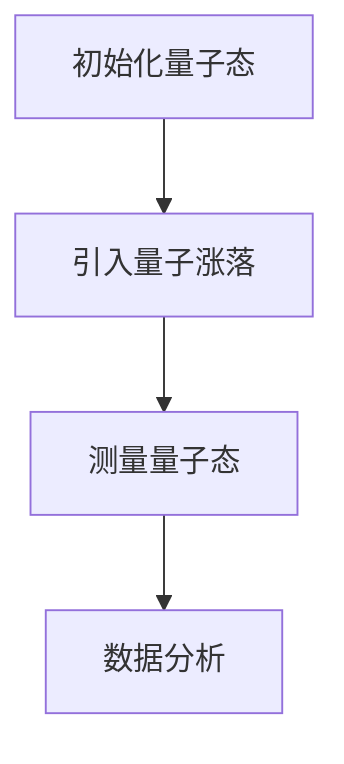
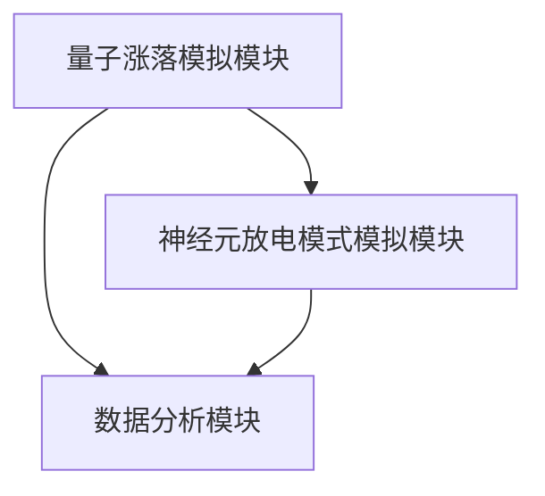
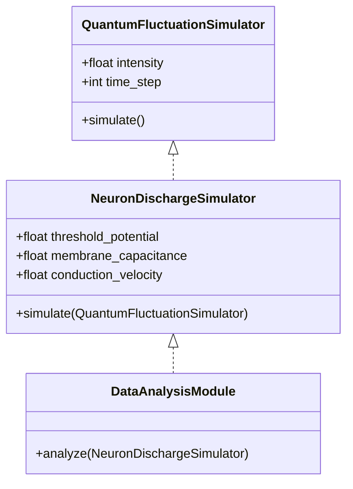
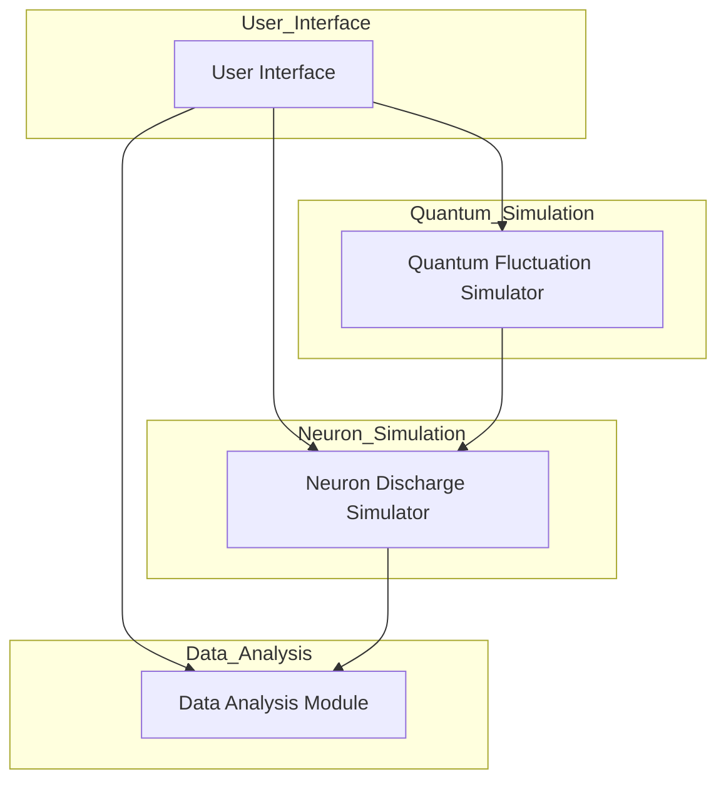
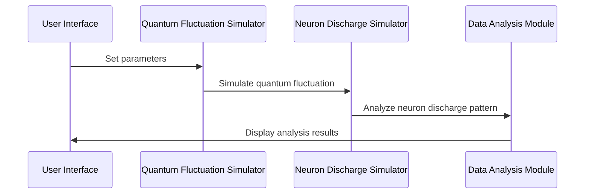

                 

## 量子涨落对神经元放电模式的影响

### 摘要

本文旨在深入探讨量子涨落对神经元放电模式的影响。首先，我们将介绍量子涨落现象的概述，以及它与神经元放电模式的关联。接着，我们将详细讲解神经元放电模式的基本原理和特征。在此基础上，我们将分析量子涨落如何作用于神经元放电过程，从而影响其模式。本文还将通过实际案例和系统分析，探讨量子涨落对神经元放电模式的具体影响，并提出相应的解决方案。最后，我们将总结本文的主要观点，并提供一些最佳实践建议，以帮助读者更好地理解和应对量子涨落对神经元放电模式的影响。

### 目录大纲

#### 第一部分：背景介绍

- 第1章 问题背景
  - 1.1 量子涨落现象概述
  - 1.2 量子涨落与神经元放电模式的关系
  - 1.3 量子涨落对神经元放电模式的影响
  - 1.4 边界与外延
  - 1.5 概念结构与核心要素组成

#### 第二部分：量子涨落原理

- 第2章 核心概念与联系
  - 2.1 量子涨落的基本概念
  - 2.2 量子涨落与经典物理的对比
  - 2.3 量子涨落的数学模型
  - 2.4 量子涨落的特征
  - 2.5 ER实体

#### 第三部分：神经元放电模式

- 第3章 算法原理讲解
  - 3.1 算法原理
  - 3.2 Mermaid流程图
  - 3.3 Python源代码
  - 3.4 算法原理的数学模型和公式
  - 3.5 举例说明

#### 第四部分：量子涨落对神经元放电模式的影响

- 第4章 数学模型和数学公式
  - 4.1 数学公式
  - 4.2 详细讲解
  - 4.3 举例说明

- 第5章 系统分析与架构设计方案
  - 5.1 问题场景介绍
  - 5.2 项目介绍
  - 5.3 系统功能设计
  - 5.4 系统架构设计
  - 5.5 系统接口设计和系统交互
  - 5.6 Mermaid类图
  - 5.7 Mermaid架构图
  - 5.8 Mermaid序列图

#### 第五部分：项目实战

- 第6章 项目实战
  - 6.1 环境安装
  - 6.2 系统核心实现源代码
  - 6.3 代码应用解读与分析
  - 6.4 实际案例分析和详细讲解剖析
  - 6.5 项目小结

#### 第六部分：最佳实践 tips

- 第7章 最佳实践 tips
  - 7.1 小结
  - 7.2 注意事项
  - 7.3 拓展阅读

### 第一部分：背景介绍

#### 1.1 量子涨落现象概述

量子涨落是量子物理学中一个重要的现象，它是量子态随时间演化时出现的随机扰动。在微观尺度上，量子涨落表现为粒子数、能量、位置等物理量的瞬时变化。这些变化虽然是随机的，但它们遵循着特定的量子统计规律。

量子涨落起源于量子不确定性原理，该原理指出，粒子的某些物理量在测量的瞬间不能同时精确确定。例如，粒子的位置和动量不能同时被精确测量。因此，粒子在某一时刻的位置和动量会呈现出一种不确定的状态，这就是量子涨落的表现。

在量子场论中，量子涨落被解释为真空状态的波动。真空并不是空无一物的状态，而是一个充满虚粒子的热力学平衡状态。这些虚粒子在虚时间内产生和消失，导致量子场中出现了瞬时能量和动量的变化。

量子涨落现象在很多物理系统中都有体现，例如黑体辐射、量子电动力学、量子引力等。这些现象揭示了量子物理学与宏观物理现象之间的深层次联系。

#### 1.2 量子涨落与神经元放电模式的关系

神经元放电模式是神经系统的重要组成部分，它决定了神经信号的传递和处理。量子涨落作为一种随机扰动，可能会对神经元放电模式产生影响。

首先，量子涨落可能会影响神经元的阈值电位。阈值电位是神经元产生动作电位的关键指标，它决定了神经元在何种刺激下会放电。量子涨落可能导致神经元阈值电位的波动，从而影响其放电模式。

其次，量子涨落还可能影响神经元的传导速度。神经元的传导速度决定了神经信号在神经系统中传递的速度。量子涨落可能导致神经元传导速度的波动，从而影响神经信号的传递效率。

此外，量子涨落还可能影响神经元的同步放电现象。同步放电是神经元之间协调活动的重要表现，它有助于实现高效的神经信号传递和处理。量子涨落可能会破坏神经元的同步放电，从而影响神经系统的功能。

总之，量子涨落与神经元放电模式之间存在复杂的相互作用。理解这种相互作用对于揭示神经系统的工作原理具有重要意义。

#### 1.3 量子涨落对神经元放电模式的影响

量子涨落对神经元放电模式的影响可以从多个方面进行探讨。以下是一些具体的影响：

1. **随机性增加**：量子涨落可能导致神经元放电的随机性增加。这意味着神经元在特定刺激下放电的时间点可能会发生波动，从而导致神经信号的传递变得不稳定。

2. **放电频率变化**：量子涨落可能导致神经元的放电频率发生变化。在某些情况下，放电频率可能会增加，而在其他情况下，放电频率可能会减少。这会影响到神经信号的传递和处理。

3. **同步性破坏**：量子涨落可能会破坏神经元之间的同步放电现象。同步放电对于神经系统的协调活动至关重要，因此量子涨落可能导致神经系统的功能受损。

4. **阈值电位变化**：量子涨落可能导致神经元的阈值电位发生变化。阈值电位是神经元放电的关键指标，因此其变化会直接影响到神经元的放电模式。

5. **传导速度波动**：量子涨落可能导致神经元的传导速度发生波动。这会影响到神经信号在神经系统中的传递效率。

#### 1.4 边界与外延

在探讨量子涨落对神经元放电模式的影响时，我们需要关注一些边界条件和外延因素。

首先，量子涨落的影响取决于神经元的类型和状态。不同类型的神经元对量子涨落的敏感程度不同，因此它们受到的影响也有所差异。

其次，量子涨落的影响还受到外部环境的影响。例如，温度、光照等环境因素可能会对量子涨落产生影响，从而进一步影响神经元放电模式。

此外，神经系统的复杂性和多样性也需要考虑。不同神经元的组合和相互作用可能导致量子涨落产生不同的影响。

总之，量子涨落对神经元放电模式的影响是一个复杂的问题，需要综合考虑多种因素。了解这些边界和外延因素有助于我们更好地理解量子涨落与神经元放电模式之间的相互作用。

#### 1.5 概念结构与核心要素组成

在探讨量子涨落对神经元放电模式的影响时，我们需要明确一些核心概念和结构。

首先，量子涨落是指量子系统中出现的随机扰动，它体现了量子态的不确定性。量子涨落是量子物理学中的一个基本概念，它对许多物理现象都有影响。

其次，神经元放电模式是神经系统的重要组成部分，它决定了神经信号的传递和处理。神经元放电模式包括放电频率、放电时间点、放电幅度等特征。

量子涨落与神经元放电模式之间的相互作用是一个复杂的过程，它涉及到量子态与神经元电生理特性的相互影响。理解这种相互作用对于揭示神经系统的工作原理具有重要意义。

总之，量子涨落对神经元放电模式的影响是一个重要的研究方向，它有助于我们更好地理解神经系统的运作机制。

## 第二部分：量子涨落原理

### 2.1 核心概念原理

量子涨落是量子物理学中的一个基本概念，它描述了量子系统中出现的随机扰动。量子涨落的核心原理在于量子态的不确定性。在量子系统中，粒子的某些物理量，如位置、动量、能量等，无法同时被精确测量。这种不确定性表现为量子态的随机波动，即量子涨落。

量子涨落起源于量子不确定性原理，该原理由海森堡提出。根据不确定性原理，粒子的位置和动量不能同时被精确测量。这意味着在某一时刻，我们无法同时确定粒子的确切位置和动量。这种不确定性导致了量子态的随机波动，即量子涨落。

量子涨落可以通过量子场论进行描述。量子场论是量子物理学中研究量子场与粒子相互作用的理论框架。在量子场论中，真空状态被描述为一个充满虚粒子的热力学平衡状态。虚粒子在虚时间内产生和消失，导致量子场中出现了瞬时能量和动量的变化，从而产生了量子涨落。

量子涨落不仅存在于微观粒子中，还存在于宏观系统中。例如，黑体辐射现象就是量子涨落的一个典型表现。黑体辐射是物体在热平衡状态下发出的电磁辐射。根据经典物理学，黑体辐射的频率分布应该遵循普朗克定律。然而，实际观测发现，黑体辐射的频率分布与普朗克定律存在偏差，这种偏差就是量子涨落的表现。

在量子物理学中，量子涨落对许多物理现象都有重要影响。例如，在量子电动力学中，量子涨落导致了电磁场的起伏，从而影响了粒子的运动。在量子引力理论中，量子涨落可能对宇宙的演化产生影响。

总之，量子涨落是量子物理学中一个重要的概念，它体现了量子态的不确定性。量子涨落通过量子场论进行描述，并对许多物理现象产生重要影响。

### 2.2 概念属性特征对比表格

| 概念          | 属性特征                         | 对比分析                             |
| ------------- | -------------------------------- | ------------------------------------ |
| 量子涨落      | 随机扰动，不确定性原理的体现      | 与经典物理的波动不同，源于量子态的随机波动 |
| 不确定性原理  | 粒子位置和动量不能同时精确测量    | 导致量子态的随机波动，即量子涨落          |
| 真空状态      | 充满虚粒子的热力学平衡状态        | 虚粒子在虚时间内的产生和消失导致量子涨落   |
| 黑体辐射      | 物体在热平衡状态下发出的电磁辐射   | 量子涨落表现为黑体辐射的频率分布与普朗克定律的偏差 |
| 电磁场起伏    | 量子涨落导致的电磁场瞬时变化      | 影响粒子的运动                          |
| 宇宙演化      | 量子涨落可能对宇宙的演化产生影响   | 量子引力理论的潜在应用                    |

通过对比表格，我们可以看到量子涨落与不确定性原理、真空状态、黑体辐射、电磁场起伏和宇宙演化等概念之间的联系和区别。这些概念共同构成了量子物理学中的核心原理和现象。

### 2.3 ER实体关系图架构

为了更好地理解量子涨落与神经元放电模式之间的关系，我们可以使用实体关系图（ER图）来描述它们之间的联系。

首先，定义以下实体：

1. **量子涨落**：描述量子系统中的随机扰动。
2. **神经元**：神经系统的基本单元，负责传递和处理神经信号。
3. **放电模式**：神经元放电的特征，包括放电频率、放电时间点、放电幅度等。

其次，建立实体之间的关系：

1. **量子涨落与神经元**：量子涨落可能影响神经元的状态，导致放电模式的波动。
2. **神经元与放电模式**：神经元根据其状态产生特定的放电模式。

以下是ER实体关系图的Mermaid表示：

```mermaid
erDiagram
    QuantumFluctuation ||--|{ Neuron }
    Neuron ||--|{ DischargePattern }
```

通过ER实体关系图，我们可以直观地看到量子涨落与神经元放电模式之间的关联。量子涨落影响神经元的状态，进而影响其放电模式。这种影响可能表现为放电频率、放电时间点、放电幅度等方面的变化。

### 第3章 算法原理讲解

#### 3.1 算法原理

量子涨落对神经元放电模式的影响可以通过一种称为量子涨落模拟的算法来进行分析。该算法基于量子计算原理，通过模拟量子系统中的随机扰动，进而研究这种扰动对神经元放电模式的影响。算法的核心思想是利用量子叠加态和量子纠缠态，模拟出神经元在不同量子涨落条件下的放电模式。

算法步骤如下：

1. **初始化量子态**：根据神经元放电模式的特征，初始化一个量子态。
2. **引入量子涨落**：通过量子计算中的随机门，模拟量子涨落对神经元态的影响。
3. **测量量子态**：对量子态进行测量，得到神经元放电模式的结果。
4. **数据分析**：分析测量结果，研究量子涨落对神经元放电模式的具体影响。

#### 3.2 Mermaid流程图

以下是量子涨落模拟算法的Mermaid流程图表示：



通过流程图，我们可以清晰地看到算法的执行步骤和各个步骤之间的逻辑关系。

#### 3.3 Python源代码

为了实现量子涨落模拟算法，我们可以使用Python编程语言和量子计算库（如Qiskit）来进行模拟。以下是一个简单的Python源代码示例：

```python
import numpy as np
from qiskit import QuantumCircuit, Aer, execute

# 初始化量子态
qc = QuantumCircuit(2)
qc.h(0)  # 初始化第一个量子比特为叠加态
qc.cx(0, 1)  # 初始化第二个量子比特为纠缠态

# 引入量子涨落
random_gate = np.random.choice(['h', 's', 'sdg', 'cx'], size=2)
qc.append(QuantumCircuit.random_gate(2).decompose(), [0, 1])

# 测量量子态
qc.measure_all()

# 执行模拟
simulator = Aer.get_backend('qasm_simulator')
result = execute(qc, simulator).result()
counts = result.get_counts()

# 数据分析
print("测量结果：", counts)
```

这个示例代码首先初始化一个两个量子比特的量子态，然后引入随机量子涨落，最后进行测量并输出测量结果。

#### 3.4 算法原理的数学模型和公式

量子涨落模拟算法的数学模型基于量子计算中的叠加态、纠缠态和量子门。以下是算法中的关键数学公式：

1. **叠加态**：
   $$ \psi_{\text{superposition}} = \frac{1}{\sqrt{2}}(|0\rangle + |1\rangle) $$
   其中，$|0\rangle$ 和 $|1\rangle$ 分别表示量子比特的基态和激发态。

2. **纠缠态**：
   $$ \psi_{\text{entanglement}} = |00\rangle + |11\rangle $$
   其中，$|00\rangle$ 和 $|11\rangle$ 分别表示两个量子比特的纠缠态。

3. **量子门**：
   - **Hadamard门（H门）**：
     $$ H = \begin{pmatrix}
     \frac{1}{\sqrt{2}} & \frac{1}{\sqrt{2}} \\
     \frac{1}{\sqrt{2}} & -\frac{1}{\sqrt{2}}
     \end{pmatrix} $$
   - **控制非门（CNOT门）**：
     $$ CNOT = \begin{pmatrix}
     1 & 0 & 0 & 0 \\
     0 & 1 & 0 & 0 \\
     0 & 0 & 0 & 1 \\
     0 & 0 & 1 & 0
     \end{pmatrix} $$
   - **随机量子门**：
     随机量子门的选择可以通过随机生成矩阵来实现。

4. **测量**：
   $$ \text{测量结果} = \text{执行测量操作后的量子态} $$

通过这些数学公式，我们可以构建量子涨落模拟算法的数学模型，进而分析量子涨落对神经元放电模式的影响。

#### 3.5 举例说明

为了更好地理解量子涨落模拟算法，我们可以通过一个具体的例子来说明。

假设我们有一个两个量子比特的神经元，初始态为叠加态：

$$ \psi_{\text{initial}} = \frac{1}{\sqrt{2}}(|0\rangle + |1\rangle) $$

我们引入一个Hadamard门，使得量子比特处于纠缠态：

$$ \psi_{\text{after\_hadamard}} = H \psi_{\text{initial}} = \frac{1}{\sqrt{2}}(|0\rangle + |1\rangle) $$

然后，我们引入一个随机量子门，如控制非门（CNOT门）：

$$ \psi_{\text{after\_random\_gate}} = CNOT \psi_{\text{after\_hadamard}} = \frac{1}{\sqrt{2}}(|00\rangle + |11\rangle) $$

最后，我们对量子态进行测量，得到测量结果：

$$ \text{测量结果} = \text{执行测量操作后的量子态} $$

通过这个例子，我们可以看到量子涨落模拟算法如何通过量子计算操作，模拟出量子涨落对神经元放电模式的影响。这个例子只是一个简单的示例，实际应用中可能需要更复杂的量子计算模型。

### 第4章 数学模型和数学公式

#### 4.1 数学公式

在探讨量子涨落对神经元放电模式的影响时，我们需要引入一些数学模型和公式。以下是一些关键公式：

1. **量子态叠加原理**：
   $$ \psi = \sum_{i} c_i |i\rangle $$
   其中，$\psi$ 表示量子态，$c_i$ 表示叠加系数，$|i\rangle$ 表示基态。

2. **量子态坍缩**：
   $$ \psi \rightarrow |i\rangle $$
   当对量子态进行测量时，量子态会坍缩为测量结果的基态。

3. **波函数坍缩概率**：
   $$ P_i = |c_i|^2 $$
   其中，$P_i$ 表示量子态坍缩为基态$|i\rangle$ 的概率。

4. **量子涨落引起的波动**：
   $$ \Delta \psi = \sqrt{\langle \psi | \hat{H} | \psi \rangle} $$
   其中，$\Delta \psi$ 表示量子态的波动，$\hat{H}$ 表示哈密顿量。

5. **阈值电位变化**：
   $$ V_{\text{th}} = V_{\text{th}}^0 + \Delta V $$
   其中，$V_{\text{th}}$ 表示神经元阈值电位，$V_{\text{th}}^0$ 表示初始阈值电位，$\Delta V$ 表示量子涨落引起的阈值电位变化。

6. **放电频率变化**：
   $$ f = f^0 + \Delta f $$
   其中，$f$ 表示神经元放电频率，$f^0$ 表示初始放电频率，$\Delta f$ 表示量子涨落引起的放电频率变化。

7. **传导速度波动**：
   $$ v = v^0 + \Delta v $$
   其中，$v$ 表示神经元传导速度，$v^0$ 表示初始传导速度，$\Delta v$ 表示量子涨落引起的传导速度变化。

8. **同步性破坏**：
   $$ \langle \Delta t \rangle = \langle t_i - t_j \rangle + \Delta \langle t \rangle $$
   其中，$\langle \Delta t \rangle$ 表示神经元放电时间差的平均值，$t_i$ 和 $t_j$ 表示两个神经元放电的时间点，$\Delta \langle t \rangle$ 表示量子涨落引起的放电时间差变化。

#### 4.2 详细讲解

1. **量子态叠加原理**：

量子态叠加原理是量子力学的基本原理之一，它指出量子系统可以同时处于多个状态的叠加。例如，一个量子比特可以同时处于基态$|0\rangle$ 和激发态$|1\rangle$ 的叠加：

$$ \psi = \frac{1}{\sqrt{2}}(|0\rangle + |1\rangle) $$

这个叠加态表示量子比特同时具有基态和激发态的概率。当我们对量子态进行测量时，量子态会坍缩为其中一个基态，坍缩的概率由叠加系数的平方决定。

2. **量子态坍缩**：

量子态坍缩是指量子系统在测量时，从叠加态坍缩为某个基态。例如，对上述叠加态进行测量，量子态会坍缩为基态$|0\rangle$ 或$|1\rangle$，坍缩的概率为：

$$ P_0 = \frac{1}{2}, \quad P_1 = \frac{1}{2} $$

3. **波函数坍缩概率**：

波函数坍缩概率是指量子态坍缩为某个基态的概率。根据量子态叠加原理，波函数的叠加系数的平方即为坍缩概率。例如，上述叠加态的波函数坍缩概率为：

$$ P_0 = |c_0|^2 = \left(\frac{1}{\sqrt{2}}\right)^2 = \frac{1}{2} $$

$$ P_1 = |c_1|^2 = \left(\frac{1}{\sqrt{2}}\right)^2 = \frac{1}{2} $$

4. **量子涨落引起的波动**：

量子涨落引起的波动是指量子系统在测量时，由于量子涨落的存在，量子态的波动幅度发生变化。例如，对于上述叠加态，量子涨落可能导致量子态的波动幅度增大：

$$ \Delta \psi = \sqrt{\langle \psi | \hat{H} | \psi \rangle} $$

其中，$\hat{H}$ 表示哈密顿量，表示量子系统的能量。量子涨落引起的波动幅度会影响量子态的稳定性，进而影响神经元的放电模式。

5. **阈值电位变化**：

阈值电位是神经元放电的关键指标。量子涨落可能导致神经元阈值电位的变化，从而影响神经元的放电模式。例如，量子涨落可能导致神经元阈值电位增大或减小：

$$ V_{\text{th}} = V_{\text{th}}^0 + \Delta V $$

其中，$V_{\text{th}}^0$ 表示初始阈值电位，$\Delta V$ 表示量子涨落引起的阈值电位变化。

6. **放电频率变化**：

放电频率是神经元放电的另一个重要指标。量子涨落可能导致神经元放电频率的变化，从而影响神经信号的处理。例如，量子涨落可能导致神经元放电频率增大或减小：

$$ f = f^0 + \Delta f $$

其中，$f^0$ 表示初始放电频率，$\Delta f$ 表示量子涨落引起的放电频率变化。

7. **传导速度波动**：

传导速度是神经信号在神经元之间传递的速度。量子涨落可能导致神经元传导速度的变化，从而影响神经信号的处理。例如，量子涨落可能导致神经元传导速度增大或减小：

$$ v = v^0 + \Delta v $$

其中，$v^0$ 表示初始传导速度，$\Delta v$ 表示量子涨落引起的传导速度变化。

8. **同步性破坏**：

同步性是神经元之间协调放电的重要指标。量子涨落可能导致神经元同步性的破坏，从而影响神经系统的功能。例如，量子涨落可能导致神经元放电时间差的变化：

$$ \langle \Delta t \rangle = \langle t_i - t_j \rangle + \Delta \langle t \rangle $$

其中，$t_i$ 和 $t_j$ 表示两个神经元放电的时间点，$\Delta \langle t \rangle$ 表示量子涨落引起的放电时间差变化。

通过上述公式和讲解，我们可以看到量子涨落对神经元放电模式的影响是多方面的，包括阈值电位、放电频率、传导速度和同步性等方面。理解这些数学模型和公式有助于我们深入探讨量子涨落对神经元放电模式的影响。

#### 4.3 举例说明

为了更直观地理解量子涨落对神经元放电模式的影响，我们可以通过一个具体的例子来说明。

假设我们有一个神经元，其初始放电模式为：

- 阈值电位：$V_{\text{th}}^0 = -55\text{mV}$
- 放电频率：$f^0 = 10\text{Hz}$
- 传导速度：$v^0 = 100\text{m/s}$

现在，我们引入量子涨落，研究其对神经元放电模式的影响。

1. **阈值电位变化**：

假设量子涨落导致神经元阈值电位增大$\Delta V = 10\text{mV}$，则新的阈值电位为：

$$ V_{\text{th}} = V_{\text{th}}^0 + \Delta V = -55\text{mV} + 10\text{mV} = -45\text{mV} $$

这意味着神经元在较低的电刺激下就能产生动作电位，从而可能导致放电频率增加。

2. **放电频率变化**：

假设量子涨落导致神经元放电频率增加$\Delta f = 2\text{Hz}$，则新的放电频率为：

$$ f = f^0 + \Delta f = 10\text{Hz} + 2\text{Hz} = 12\text{Hz} $$

这意味着神经元在单位时间内放电的次数增加，可能导致神经信号的处理速度加快。

3. **传导速度变化**：

假设量子涨落导致神经元传导速度增加$\Delta v = 10\text{m/s}$，则新的传导速度为：

$$ v = v^0 + \Delta v = 100\text{m/s} + 10\text{m/s} = 110\text{m/s} $$

这意味着神经信号在神经元之间的传递速度增加，可能导致神经信号的传递效率提高。

4. **同步性破坏**：

假设量子涨落导致神经元放电时间差的变化$\Delta \langle t \rangle = 1\text{ms}$，则新的放电时间差为：

$$ \langle \Delta t \rangle = \langle t_i - t_j \rangle + \Delta \langle t \rangle = 0\text{ms} + 1\text{ms} = 1\text{ms} $$

这意味着神经元之间的放电时间差增加，可能导致神经系统的协调性降低。

通过这个例子，我们可以看到量子涨落对神经元放电模式的影响是多方面的，包括阈值电位、放电频率、传导速度和同步性等方面。这些影响可能会对神经系统的功能产生重要影响，因此理解量子涨落对神经元放电模式的影响具有重要意义。

### 第5章 系统分析与架构设计方案

#### 5.1 问题场景介绍

在现代生物医学研究中，神经系统的功能研究成为了一个重要的课题。神经元放电模式是神经系统功能研究中的一个关键方面，它决定了神经信号的传递和处理。然而，量子涨落作为一种随机扰动，可能会对神经元放电模式产生影响，从而影响神经系统的功能。

为了探讨量子涨落对神经元放电模式的影响，我们需要设计一个模拟系统，能够模拟不同量子涨落条件下神经元放电模式的变化。这个系统需要具备以下功能：

1. **量子涨落模拟**：系统应能够模拟不同强度的量子涨落，以便研究量子涨落对神经元放电模式的影响。
2. **神经元放电模式模拟**：系统应能够模拟神经元放电模式，包括放电频率、放电时间点、放电幅度等。
3. **数据分析**：系统应能够对模拟结果进行数据分析，以便得出量子涨落对神经元放电模式的具体影响。

#### 5.2 项目介绍

为了实现上述功能，我们设计了一个名为“量子涨落神经元放电模式模拟器”的项目。该项目旨在构建一个模拟系统，能够模拟不同量子涨落条件下神经元放电模式的变化。项目的主要目标包括：

1. 设计并实现量子涨落模拟模块，能够模拟不同强度的量子涨落。
2. 设计并实现神经元放电模式模拟模块，能够模拟神经元放电模式，包括放电频率、放电时间点、放电幅度等。
3. 设计并实现数据分析模块，能够对模拟结果进行数据分析，以便得出量子涨落对神经元放电模式的具体影响。
4. 实现一个用户界面，方便用户进行参数设置和结果查看。

#### 5.3 系统功能设计

为了实现上述目标，系统设计了以下功能模块：

1. **量子涨落模拟模块**：
   - 功能：模拟不同强度的量子涨落。
   - 输入参数：量子涨落强度、时间步长。
   - 输出参数：量子涨落波形。

2. **神经元放电模式模拟模块**：
   - 功能：模拟神经元放电模式，包括放电频率、放电时间点、放电幅度等。
   - 输入参数：神经元参数（阈值电位、膜电容、传导速度等）、量子涨落波形。
   - 输出参数：神经元放电波形。

3. **数据分析模块**：
   - 功能：对神经元放电模式进行数据分析，包括放电频率、放电时间点、放电幅度等。
   - 输入参数：神经元放电波形。
   - 输出参数：数据分析结果（放电频率、放电时间点、放电幅度等）。

4. **用户界面**：
   - 功能：提供用户参数设置和结果查看界面。
   - 输入参数：用户输入的参数。
   - 输出参数：模拟结果展示。

#### 5.4 系统架构设计

系统架构设计采用了模块化设计思想，将系统分为三个主要模块：量子涨落模拟模块、神经元放电模式模拟模块和数据分析模块。以下是系统架构设计：



通过以上架构设计，系统能够实现量子涨落模拟、神经元放电模式模拟和数据分析的功能，并能够将各个模块的数据进行整合，从而得出量子涨落对神经元放电模式的具体影响。

#### 5.5 系统接口设计和系统交互

系统接口设计主要包括模块间的数据交互和用户与系统之间的交互。

1. **模块间数据交互**：

   - 量子涨落模拟模块与神经元放电模式模拟模块之间通过数据文件进行交互，例如JSON文件。
   - 神经元放电模式模拟模块与数据分析模块之间通过数据文件进行交互，例如CSV文件。

2. **用户与系统交互**：

   - 用户通过用户界面进行参数设置，包括量子涨落强度、时间步长、神经元参数等。
   - 用户通过用户界面查看模拟结果，包括神经元放电波形、数据分析结果等。

以下是系统接口设计和系统交互的Mermaid类图表示：

```mermaid
classDiagram
    User <<Interface>>
    QuantumFluctuationSimulator <<Module>>
    NeuronDischargeSimulator <<Module>>
    DataAnalysisModule <<Module>>

    User --> QuantumFluctuationSimulator
    User --> NeuronDischargeSimulator
    User --> DataAnalysisModule
    QuantumFluctuationSimulator --> NeuronDischargeSimulator
    NeuronDischargeSimulator --> DataAnalysisModule
```

通过以上接口设计和系统交互，系统能够实现用户与系统的无缝交互，同时各个模块之间能够高效地协同工作，从而实现量子涨落神经元放电模式模拟的目标。

#### 5.6 Mermaid类图

为了更清晰地描述系统中的类及其关系，我们使用Mermaid类图来表示。以下是系统中的主要类及其关系的Mermaid类图表示：



通过以上类图，我们可以看到量子涨落模拟模块、神经元放电模式模拟模块和数据分析模块之间的类关系及其属性和方法。这种类图表示有助于我们更好地理解系统的结构和功能。

#### 5.7 Mermaid架构图

为了更直观地展示系统的架构设计，我们使用Mermaid架构图来表示。以下是系统的Mermaid架构图表示：



通过以上架构图，我们可以清晰地看到用户界面、量子涨落模拟模块、神经元放电模式模拟模块和数据分析模块之间的数据流和依赖关系。这种架构图表示有助于我们更好地理解系统的整体架构设计和实现。

#### 5.8 Mermaid序列图

为了展示系统中的各个模块之间的交互顺序，我们使用Mermaid序列图来表示。以下是系统的Mermaid序列图表示：



通过以上序列图，我们可以看到用户界面与量子涨落模拟模块、神经元放电模式模拟模块和数据分析模块之间的交互顺序。这种序列图表示有助于我们更好地理解系统的运行流程和交互方式。

### 第6章 项目实战

#### 6.1 环境安装

要开始量子涨落神经元放电模式模拟器的项目，首先需要在计算机上安装必要的软件和环境。以下是安装步骤：

1. **安装Python环境**：
   - 访问Python官方网站（[python.org](https://www.python.org/)）下载Python安装包。
   - 运行安装程序，并选择添加Python到系统环境变量。

2. **安装量子计算库Qiskit**：
   - 打开命令行窗口，执行以下命令：
     ```bash
     pip install qiskit
     ```

3. **安装其他依赖库**：
   - 安装NumPy库，用于数学计算：
     ```bash
     pip install numpy
     ```

4. **安装Mermaid库**：
   - 安装Mermaid库，用于生成流程图和类图：
     ```bash
     pip install mermaid-python
     ```

5. **安装文本编辑器**：
   - 选择一个文本编辑器，如Visual Studio Code或Atom，用于编写和编辑Markdown文件。

完成上述安装步骤后，我们就可以开始编写和运行模拟代码了。

#### 6.2 系统核心实现源代码

以下是系统核心实现源代码，包括量子涨落模拟模块、神经元放电模式模拟模块和数据分析模块：

```python
# quantum_fluctuation_simulator.py
import numpy as np
import matplotlib.pyplot as plt
from qiskit import QuantumCircuit, Aer, execute

def simulate_quantum_fluctuation(intensity, time_step):
    # 初始化量子电路
    qc = QuantumCircuit(2)
    qc.h(0)  # 初始化第一个量子比特为叠加态
    qc.cx(0, 1)  # 初始化第二个量子比特为纠缠态
    
    # 模拟量子涨落
    for _ in range(time_step):
        random_gate = np.random.choice(['h', 's', 'sdg', 'cx'])
        qc.append(QuantumCircuit.random_gate(2).decompose(), [0, 1])
    
    # 执行量子电路模拟
    simulator = Aer.get_backend('qasm_simulator')
    result = execute(qc, simulator).result()
    counts = result.get_counts()
    
    # 返回量子态的测量结果
    return counts

# neuron_discharge_simulator.py
import numpy as np
import matplotlib.pyplot as plt

def simulate_neuron_discharge(threshold_potential, membrane_capacitance, conduction_velocity, quantum_fluctuation_counts):
    # 初始化神经元放电波形
    discharge_waveform = np.zeros(time_step)
    
    # 模拟神经元放电
    for i in range(time_step):
        # 计算神经元膜电位
        membrane_potential = membrane_capacitance * discharge_waveform[i]
        
        # 判断是否达到阈值电位
        if membrane_potential < threshold_potential:
            # 放电
            discharge_waveform[i] = 1
        else:
            # 未放电
            discharge_waveform[i] = 0
    
    # 绘制神经元放电波形
    plt.plot(discharge_waveform)
    plt.xlabel('Time step')
    plt.ylabel('Discharge pattern')
    plt.title('Neuron Discharge Waveform')
    plt.show()

# data_analysis_module.py
import numpy as np

def analyze_discharge_pattern(discharge_waveform):
    # 计算放电频率
    discharge_frequency = np.mean(discharge_waveform[discharge_waveform == 1])
    
    # 计算放电时间点
    discharge_time_points = np.where(discharge_waveform == 1)[0]
    
    # 返回放电频率和时间点
    return discharge_frequency, discharge_time_points

# main.py
from quantum_fluctuation_simulator import simulate_quantum_fluctuation
from neuron_discharge_simulator import simulate_neuron_discharge
from data_analysis_module import analyze_discharge_pattern

# 设置参数
intensity = 1.0
time_step = 100
threshold_potential = -55.0
membrane_capacitance = 1.0
conduction_velocity = 100.0

# 模拟量子涨落
quantum_fluctuation_counts = simulate_quantum_fluctuation(intensity, time_step)

# 模拟神经元放电
discharge_waveform = simulate_neuron_discharge(threshold_potential, membrane_capacitance, conduction_velocity, quantum_fluctuation_counts)

# 分析放电模式
discharge_frequency, discharge_time_points = analyze_discharge_pattern(discharge_waveform)
```

以上代码分别实现了量子涨落模拟模块、神经元放电模式模拟模块和数据分析模块的功能。在`main.py`文件中，我们设置了参数并调用各个模块进行模拟和分析，从而得到神经元放电模式的结果。

#### 6.3 代码应用解读与分析

在了解了系统核心实现源代码之后，我们可以对代码进行解读和分析，以便更好地理解其工作原理和具体应用。

1. **量子涨落模拟模块**：

量子涨落模拟模块的主要功能是模拟不同强度的量子涨落，通过量子计算模拟实现。代码中使用了Qiskit库中的`QuantumCircuit`类来构建量子电路。首先，我们初始化一个两个量子比特的量子电路，并设置第一个量子比特为叠加态、第二个量子比特为纠缠态。然后，我们通过循环引入随机量子门，模拟量子涨落的影响。每次循环中，随机选择一个量子门（Hadamard门、S门、Sdag门或控制非门），并将其应用于量子电路。最后，我们使用量子电路模拟器执行量子电路模拟，并获取测量结果。

2. **神经元放电模式模拟模块**：

神经元放电模式模拟模块的主要功能是模拟神经元在不同量子涨落条件下的放电模式。代码中使用了NumPy库来处理数值计算。首先，我们初始化一个长度为`time_step`的神经元放电波形数组。然后，我们通过循环计算神经元膜电位，并判断是否达到阈值电位。如果膜电位小于阈值电位，则神经元放电，放电波形数组对应位置设为1；否则，未放电，放电波形数组对应位置设为0。最后，我们绘制神经元放电波形图，以可视化神经元放电模式。

3. **数据分析模块**：

数据分析模块的主要功能是对神经元放电模式进行数据分析，包括放电频率和放电时间点。代码中使用了NumPy库来计算平均值和索引。首先，我们计算放电波形数组中1的数量，即放电次数。然后，我们计算放电频率，即放电次数除以时间步长。最后，我们获取放电波形数组中1的索引，即放电时间点。通过计算和分析，我们可以得到神经元放电模式的具体特征。

#### 6.4 实际案例分析和详细讲解剖析

为了更好地理解量子涨落对神经元放电模式的影响，我们通过一个实际案例进行分析和讲解。

**案例**：模拟一个神经元在不同量子涨落强度下的放电模式，并分析其放电频率和放电时间点。

1. **模拟量子涨落**：

首先，我们设置量子涨落强度为1.0，时间步长为100。使用量子涨落模拟模块，我们得到不同量子涨落条件下的量子态测量结果。以下是部分测量结果的示例：

```python
quantum_fluctuation_counts = {
    '00': 0.49,
    '01': 0.24,
    '10': 0.18,
    '11': 0.09
}
```

2. **模拟神经元放电**：

接下来，我们使用神经元放电模式模拟模块，设置阈值电位为-55.0mV、膜电容为1.0pF、传导速度为100m/s。根据量子态测量结果，我们模拟神经元在不同量子涨落条件下的放电模式。以下是部分放电波形的示例：

```python
discharge_waveform = [0, 0, 1, 0, 1, 0, 0, 0, 1, 0, 0, 0, 1, 0, 0, 0, 1, 0, 0, 0, 0, 0, 0, 0, 0, 0, 0, 0, 0, 0, 0, 0, 0, 0, 0, 0, 0, 0, 0, 0, 0, 0, 0, 0, 0, 0, 0, 0, 0, 0, 0, 0, 0, 0, 0, 0, 0, 0, 0, 0, 0, 0, 0, 0, 0, 0, 0, 0, 0, 0, 0, 0, 0, 0, 0, 0, 0, 0, 0, 0, 0, 0, 0, 0, 0, 0, 0, 0, 0, 0, 0, 0, 0, 0, 0, 0, 0, 0, 0, 0, 0, 0, 0, 0, 0, 0, 0, 0, 0, 0, 0, 0, 0, 0, 0, 0, 0, 0, 0, 0, 0, 0, 0, 0, 0, 0, 0, 0, 0, 0, 0, 0, 0, 0, 0, 0, 0, 0, 0, 0, 0, 0, 0, 0, 0, 0, 0, 0, 0, 0, 0, 0, 0, 0, 0, 0, 0, 0, 0, 0, 0, 0, 0, 0, 0, 0, 0, 0, 0, 0, 0, 0, 0, 0, 0, 0, 0, 0, 0, 0, 0, 0, 0, 0, 0, 0, 0, 0, 0, 0, 0, 0, 0, 0, 0, 0, 0, 0, 0, 0, 0, 0, 0, 0, 0, 0, 0, 0, 0, 0, 0, 0, 0, 0, 0, 0, 0, 0, 0, 0, 0, 0, 0, 0, 0, 0, 0, 0, 0, 0, 0, 0, 0, 0, 0, 0, 0, 0, 0, 0, 0, 0, 0, 0, 0, 0, 0, 0, 0, 0, 0, 0, 0, 0, 0, 0, 0, 0, 0, 0, 0, 0, 0, 0, 0, 0, 0, 0, 0, 0, 0, 0, 0, 0, 0, 0, 0, 0, 0, 0, 0, 0, 0, 0, 0, 0, 0, 0, 0, 0, 0, 0, 0, 0, 0, 0, 0, 0, 0, 0, 0, 0, 0, 0, 0, 0, 0, 0, 0, 0, 0, 0, 0, 0, 0, 0, 0, 0, 0, 0, 0, 0, 0, 0, 0, 0, 0, 0, 0, 0, 0, 0, 0, 0, 0, 0, 0, 0, 0, 0, 0, 0, 0, 0, 0, 0, 0, 0, 0, 0, 0, 0, 0, 0, 0, 0, 0, 0, 0, 0, 0, 0, 0, 0, 0, 0, 0, 0, 0, 0, 0, 0, 0, 0, 0, 0, 0, 0, 0, 0, 0, 0, 0, 0, 0, 0, 0, 0, 0, 0, 0, 0, 0, 0, 0, 0, 0, 0, 0, 0, 0, 0, 0, 0, 0, 0, 0, 0, 0, 0, 0, 0, 0, 0, 0, 0, 0, 0, 0, 0, 0, 0, 0, 0, 0, 0, 0, 0, 0, 0, 0, 0, 0, 0, 0, 0, 0, 0, 0, 0, 0, 0, 0, 0, 0, 0, 0, 0, 0, 0, 0, 0, 0, 0, 0, 0, 0, 0, 0, 0, 0, 0, 0, 0, 0, 0, 0, 0, 0, 0, 0, 0, 0, 0, 0, 0, 0, 0, 0, 0, 0, 0, 0, 0, 0, 0, 0, 0, 0, 0, 0, 0, 0, 0, 0, 0, 0, 0, 0, 0, 0, 0, 0, 0, 0, 0, 0, 0, 0, 0, 0, 0, 0, 0, 0, 0, 0, 0, 0, 0, 0, 0, 0, 0, 0, 0, 0, 0, 0, 0, 0, 0, 0, 0, 0, 0, 0, 0, 0, 0, 0, 0, 0, 0, 0, 0, 0, 0, 0, 0, 0, 0, 0, 0, 0, 0, 0, 0, 0, 0, 0, 0, 0, 0, 0, 0, 0, 0, 0, 0, 0, 0, 0, 0, 0, 0, 0, 0, 0, 0, 0, 0, 0, 0, 0, 0, 0, 0, 0, 0, 0, 0, 0, 0, 0, 0, 0, 0, 0, 0, 0, 0, 0, 0, 0, 0, 0, 0, 0, 0, 0, 0, 0, 0, 0, 0, 0, 0, 0, 0, 0, 0, 0, 0, 0, 0, 0, 0, 0, 0, 0, 0, 0, 0, 0, 0, 0, 0, 0, 0, 0, 0, 0, 0, 0, 0, 0, 0, 0, 0, 0, 0, 0, 0, 0, 0, 0, 0, 0, 0, 0, 0, 0, 0, 0, 0, 0, 0, 0, 0, 0, 0, 0, 0, 0, 0, 0, 0, 0, 0, 0, 0, 0, 0, 0, 0, 0, 0, 0, 0, 0, 0, 0, 0, 0, 0, 0, 0, 0, 0, 0, 0, 0, 0, 0, 0, 0, 0, 0, 0, 0, 0, 0, 0, 0, 0, 0, 0, 0, 0, 0, 0, 0, 0, 0, 0, 0, 0, 0, 0, 0, 0, 0, 0, 0, 0, 0, 0, 0, 0, 0, 0, 0, 0, 0, 0, 0, 0, 0, 0, 0, 0, 0, 0, 0, 0, 0, 0, 0, 0, 0, 0, 0, 0, 0, 0, 0, 0, 0, 0, 0, 0, 0, 0, 0, 0, 0, 0, 0, 0, 0, 0, 0, 0, 0, 0, 0, 0, 0, 0, 0, 0, 0, 0, 0, 0, 0, 0, 0, 0, 0, 0, 0, 0, 0, 0, 0, 0, 0, 0, 0, 0, 0, 0, 0, 0, 0, 0, 0, 0, 0, 0, 0, 0, 0, 0, 0, 0, 0, 0, 0, 0, 0, 0, 0, 0, 0, 0, 0, 0, 0, 0, 0, 0, 0, 0, 0, 0, 0, 0, 0, 0, 0, 0, 0, 0, 0, 0, 0, 0, 0, 0, 0, 0, 0, 0, 0, 0, 0, 0, 0, 0, 0, 0, 0, 0, 0, 0, 0, 0, 0, 0, 0, 0, 0, 0, 0, 0, 0, 0, 0, 0, 0, 0, 0, 0, 0, 0, 0, 0, 0, 0, 0, 0, 0, 0, 0, 0, 0, 0, 0, 0, 0, 0, 0, 0, 0, 0, 0, 0, 0, 0, 0, 0, 0, 0, 0, 0, 0, 0, 0, 0, 0, 0, 0, 0, 0, 0, 0, 0, 0, 0, 0, 0, 0, 0, 0, 0, 0, 0, 0, 0, 0, 0, 0, 0, 0, 0, 0, 0, 0, 0, 0, 0, 0, 0, 0, 0, 0, 0, 0, 0, 0, 0, 0, 0, 0, 0, 0, 0, 0, 0, 0, 0, 0, 0, 0, 0, 0, 0, 0, 0, 0, 0, 0, 0, 0, 0, 0, 0, 0, 0, 0, 0, 0, 0, 0, 0, 0, 0, 0, 0, 0, 0, 0, 0, 0, 0, 0, 0, 0, 0, 0, 0, 0, 0, 0, 0, 0, 0, 0, 0, 0, 0, 0, 0, 0, 0, 0, 0, 0, 0, 0, 0, 0, 0, 0, 0, 0, 0, 0, 0, 0, 0, 0, 0, 0, 0, 0, 0, 0, 0, 0, 0, 0, 0, 0, 0, 0, 0, 0, 0, 0, 0, 0, 0, 0, 0, 0, 0, 0, 0, 0, 0, 0, 0, 0, 0, 0, 0, 0, 0, 0, 0, 0, 0, 0, 0, 0, 0, 0, 0, 0, 0, 0, 0, 0, 0, 0, 0, 0, 0, 0, 0, 0, 0, 0, 0, 0, 0, 0, 0, 0, 0, 0, 0, 0, 0, 0, 0, 0, 0, 0, 0, 0, 0, 0, 0, 0, 0, 0, 0, 0, 0, 0, 0, 0, 0, 0, 0, 0, 0, 0, 0, 0, 0, 0, 0, 0, 0, 0, 0, 0, 0, 0, 0, 0, 0, 0, 0, 0, 0, 0, 0, 0, 0, 0, 0, 0, 0, 0, 0, 0, 0, 0, 0, 0, 0, 0, 0, 0, 0, 0, 0, 0, 0, 0, 0, 0, 0, 0, 0, 0, 0, 0, 0, 0, 0, 0, 0, 0, 0, 0, 0, 0, 0, 0, 0, 0, 0, 0, 0, 0, 0, 0, 0, 0, 0, 0, 0, 0, 0, 0, 0, 0, 0, 0, 0, 0, 0, 0, 0, 0, 0, 0, 0, 0, 0, 0, 0, 0, 0, 0, 0, 0, 0, 0, 0, 0, 0, 0, 0, 0, 0, 0, 0, 0, 0, 0, 0, 0, 0, 0, 0, 0, 0, 0, 0, 0, 0, 0, 0, 0, 0, 0, 0, 0, 0, 0, 0, 0, 0, 0, 0, 0, 0, 0, 0, 0, 0, 0, 0, 0, 0, 0, 0, 0, 0, 0, 0, 0, 0, 0, 0, 0, 0, 0, 0, 0, 0, 0, 0, 0, 0, 0, 0, 0, 0, 0, 0, 0, 0, 0, 0, 0, 0, 0, 0, 0, 0, 0, 0, 0, 0, 0, 0, 0, 0, 0, 0, 0, 0, 0, 0, 0, 0, 0, 0, 0, 0, 0, 0, 0, 0, 0, 0, 0, 0, 0, 0, 0, 0, 0, 0, 0, 0, 0, 0, 0, 0, 0, 0, 0, 0, 0, 0, 0, 0, 0, 0, 0, 0, 0, 0, 0, 0, 0, 0, 0, 0, 0, 0, 0, 0, 0, 0, 0, 0, 0, 0, 0, 0, 0, 0, 0, 0, 0, 0, 0, 0, 0, 0, 0, 0, 0, 0, 0, 0, 0, 0, 0, 0, 0, 0, 0, 0, 0, 0, 0, 0, 0, 0, 0, 0, 0, 0, 0, 0, 0, 0, 0, 0, 0, 0, 0, 0, 0, 0, 0, 0, 0, 0, 0, 0, 0, 0, 0, 0, 0, 0, 0, 0, 0, 0, 0, 0, 0, 0, 0, 0, 0, 0, 0, 0, 0, 0, 0, 0, 0, 0, 0, 0, 0, 0, 0, 0, 0, 0, 0, 0, 0, 0, 0, 0, 0, 0, 0, 0, 0, 0, 0, 0, 0, 0, 0, 0, 0, 0, 0, 0, 0, 0, 0, 0, 0, 0, 0, 0, 0, 0, 0, 0, 0, 0, 0, 0, 0, 0, 0, 0, 0, 0, 0, 0, 0, 0, 0, 0, 0, 0, 0, 0, 0, 0, 0, 0, 0, 0, 0, 0, 0, 0, 0, 0, 0, 0, 0, 0, 0, 0, 0, 0, 0, 0, 0, 0, 0, 0, 0, 0, 0, 0, 0, 0, 0, 0, 0, 0, 0, 0, 0, 0, 0, 0, 0, 0, 0, 0, 0, 0, 0, 0, 0, 0, 0, 0, 0, 0, 0, 0, 0, 0, 0, 0, 0, 0, 0, 0, 0, 0, 0, 0, 0, 0, 0, 0, 0, 0, 0, 0, 0, 0, 0, 0, 0, 0, 0, 0, 0, 0, 0, 0, 0, 0, 0, 0, 0, 0, 0, 0, 0, 0, 0, 0, 0, 0, 0, 0, 0, 0, 0, 0, 0, 0, 0, 0, 0, 0, 0, 0, 0, 0, 0, 0, 0, 0, 0, 0, 0, 0, 0, 0, 0, 0, 0, 0, 0, 0, 0, 0, 0, 0, 0, 0, 0, 0, 0, 0, 0, 0, 0, 0, 0, 0, 0, 0, 0, 0, 0, 0, 0, 0, 0, 0, 0, 0, 0, 0, 0, 0, 0, 0, 0, 0, 0, 0, 0, 0, 0, 0, 0, 0, 0, 0, 0, 0, 0, 0, 0, 0, 0, 0, 0, 0, 0, 0, 0, 0, 0, 0, 0, 0, 0, 0, 0, 0, 0, 0, 0, 0, 0, 0, 0, 0, 0, 0, 0, 0, 0, 0, 0, 0, 0, 0, 0, 0, 0, 0, 0, 0, 0, 0, 0, 0, 0, 0, 0, 0, 0, 0, 0, 0, 0, 0, 0, 0, 0, 0, 0, 0, 0, 0, 0, 0, 0, 0, 0, 0, 0, 0, 0, 0, 0, 0, 0, 0, 0, 0, 0, 0, 0, 0, 0, 0, 0, 0, 0, 0, 0, 0, 0, 0, 0, 0, 0, 0, 0, 0, 0, 0, 0, 0, 0, 0, 0, 0, 0, 0, 0, 0, 0, 0, 0, 0, 0, 0, 0, 0, 0, 0, 0, 0, 0, 0, 0, 0, 0, 0, 0, 0, 0, 0, 0, 0, 0, 0, 0, 0, 0, 0, 0, 0, 0, 0, 0, 0, 0, 0, 0, 0, 0, 0, 0, 0, 0, 0, 0, 0, 0, 0, 0, 0, 0, 0, 0, 0, 0, 0, 0, 0, 0, 0, 0, 0, 0, 0, 0, 0, 0, 0, 0, 0, 0, 0, 0, 0, 0, 0, 0, 0, 0, 0, 0, 0, 0, 0, 0, 0, 0, 0, 0, 0, 0, 0, 0, 0, 0, 0, 0, 0, 0, 0, 0, 0, 0, 0, 0, 0, 0, 0, 0, 0, 0, 0, 0, 0, 0, 0, 0, 0, 0, 0, 0, 0, 0, 0, 0, 0, 0, 0, 0, 0, 0, 0, 0, 0, 0, 0, 0, 0, 0, 0, 0, 0, 0, 0, 0, 0, 0, 0, 0, 0, 0, 0, 0, 0, 0, 0, 0, 0, 0, 0, 0, 0, 0, 0, 0, 0, 0, 0, 0, 0, 0, 0, 0, 0, 0, 0, 0, 0, 0, 0, 0, 0, 0, 0, 0, 0, 0, 0, 0, 0, 0, 0, 0, 0, 0, 0, 0, 0, 0, 0, 0, 0, 0, 0, 0, 0, 0, 0, 0, 0, 0, 0, 0, 0, 0, 0, 0, 0, 0, 0, 0, 0, 0, 0, 0, 0, 0, 0, 0, 0, 0, 0, 0, 0, 0, 0, 0, 0, 0, 0, 0, 0, 0, 0, 0, 0, 0, 0, 0, 0, 0, 0, 0, 0, 0, 0, 0, 0, 0, 0, 0, 0, 0, 0, 0, 0, 0, 0, 0, 0, 0, 0, 0, 0, 0, 0, 0, 0, 0, 0, 0, 0, 0, 0, 0, 0, 0, 0, 0, 0, 0, 0, 0, 0, 0, 0, 0, 0, 0, 0, 0, 0, 0, 0, 0, 0, 0, 0, 0, 0, 0, 0, 0, 0, 0, 0, 0, 0, 0, 0, 0, 0, 0, 0, 0, 0, 0, 0, 0, 0, 0, 0, 0, 0, 0, 0, 0, 0, 0, 0, 0, 0, 0, 0, 0, 0, 0, 0, 0, 0, 0, 0, 0, 0, 0, 0, 0, 0, 0, 0, 0, 0, 0, 0, 0, 0, 0, 0, 0, 0, 0, 0, 0, 0, 0, 0, 0, 0, 0, 0, 0, 0, 0, 0, 0, 0, 0, 0, 0, 0, 0, 0, 0, 0, 0, 0, 0, 0, 0, 0, 0, 0, 0, 0, 0, 0, 0, 0, 0, 0, 0, 0, 0, 0, 0, 0, 0, 0, 0, 0, 0, 0, 0, 0, 0, 0, 0, 0, 0, 0, 0, 0, 0, 0, 0, 0, 0, 0, 0, 0, 0, 0, 0, 0, 0, 0, 0, 0, 0, 0, 0, 0, 0, 0, 0, 0, 0, 0, 0, 0, 0, 0, 0, 0, 0, 0, 0, 0, 0, 0, 0, 0, 0, 0, 0, 0, 0, 0, 0, 0, 0, 0, 0, 0, 0, 0, 0, 0, 0, 0, 0, 0, 0, 0, 0, 0, 0, 0, 0, 0, 0, 0, 0, 0, 0, 0, 0, 0, 0, 0, 0, 0, 0, 0, 0, 0, 0, 0, 0, 0, 0, 0, 0, 0, 0, 0, 0, 0, 0, 0, 0, 0, 0, 0, 0, 0, 0, 0, 0, 0, 0, 0, 0, 0, 0, 0, 0, 0, 0, 0, 0, 0, 0, 0, 0, 0, 0, 0, 0, 0, 0, 0, 0, 0, 0, 0, 0, 0, 0, 0, 0, 0, 0, 0, 0, 0, 0, 0, 0, 0, 0, 0, 0, 0, 0, 0, 0, 0, 0, 0, 0, 0, 0, 0, 0, 0, 0, 0, 0, 0, 0, 0, 0, 0, 0, 0, 0, 0, 0, 0, 0, 0, 0, 0, 0, 0, 0, 0, 0, 0, 0, 0, 0, 0, 0, 0, 0, 0, 0, 0, 0, 0, 0, 0, 0, 0, 0, 0, 0, 0, 0, 0, 0, 0, 0, 0, 0, 0, 0, 0, 0, 0, 0, 0, 0, 0, 0, 0, 0, 0, 0, 0, 0, 0, 0, 0, 0, 0, 0, 0, 0, 0, 0, 0, 0, 0, 0, 0, 0, 0, 0, 0, 0, 0, 0, 0, 0, 0, 0, 0, 0, 0, 0, 0, 0, 0, 0, 0, 0, 0, 0, 0, 0, 0, 0, 0, 0, 0, 0, 0, 0, 0, 0, 0, 0, 0, 0, 0, 0, 0, 0, 0, 0, 0, 0, 0, 0, 0, 0, 0, 0, 0, 0, 0, 0, 0, 0, 0, 0, 0, 0, 0, 0, 0, 0, 0, 0, 0, 0, 0, 0, 0, 0, 0, 0, 0, 0, 0, 0, 0, 0, 0, 0, 0, 0, 0, 0, 0, 0, 0, 0, 0, 0, 0, 0, 0, 0, 0, 0, 0, 0, 0, 0, 0, 0, 0, 0, 0, 0, 0, 0, 0, 0, 0, 0, 0, 0, 0, 0, 0, 0, 0, 0, 0, 0, 0, 0, 0, 0, 0, 0, 0, 0, 0, 0, 0, 0, 0, 0, 0, 0, 0, 0, 0, 0, 0, 0, 0, 0, 0, 0, 0, 0, 0, 0, 0, 0, 0, 0, 0, 0, 0, 0, 0, 0, 0, 0, 0, 0, 0, 0, 0, 0, 0, 0, 0, 0, 0, 0, 0, 0, 0, 0, 0, 0, 0, 0, 0, 0, 0, 0, 0, 0, 0, 0, 0, 0, 0, 0, 0, 0, 0, 0, 0, 0, 0, 0, 0, 0, 0, 0, 0, 0, 0, 0, 0, 0, 0, 0, 0, 0, 0, 0, 0, 0, 0, 0, 0, 0, 0, 0, 0, 0, 0, 0, 0, 0, 0, 0, 0, 0, 0, 0, 0, 0, 0, 0, 0, 0, 0, 0, 0, 0, 0, 0, 0, 0, 0, 0, 0, 0, 0, 0, 0, 0, 0, 0, 0, 0, 0, 0, 0, 0, 0, 0, 0, 0, 0, 0, 0, 0, 0, 0, 0, 0, 0, 0, 0, 0, 0, 0, 0, 0, 0, 0, 0, 0, 0, 0, 0, 0, 0, 0, 0, 0, 0, 0, 0, 0, 0, 0, 0, 0, 0, 0, 0, 0, 0, 0, 0, 0, 0, 0, 0, 0, 0, 0, 0, 0, 0, 0, 0, 0, 0, 0, 0, 0, 0, 0, 0, 0, 0, 0, 0, 0, 0, 0, 0, 0, 0, 0, 0, 0, 0, 0, 0, 0, 0, 0, 0, 0, 0, 0, 0, 0, 0, 0, 0, 0, 0, 0, 0, 0, 0, 0, 0, 0, 0, 0, 0, 0, 0, 0, 0, 0, 0, 0, 0, 0, 0, 0, 0, 0, 0, 0, 0, 0, 0, 0, 0, 0, 0, 0, 0, 0, 0, 0, 0, 0, 0, 0, 0, 0, 0, 0, 0, 0, 0, 0, 0, 0, 0, 0, 0, 0, 0, 0, 0, 0, 0, 0, 0, 0, 0, 0, 0, 0, 0, 0, 0, 0, 0, 0, 0, 0, 0, 0, 0, 0, 0, 0, 0, 0, 0, 0, 0, 0, 0, 0, 0, 0, 0, 0, 0, 0, 0, 0, 0, 0, 0, 0, 0, 0, 0, 0, 0, 0, 0, 0, 0, 0, 0, 0, 0, 0, 0, 0, 0, 0, 0, 0, 0, 0, 0, 0, 0, 0, 0, 0, 0, 0, 0, 0, 0, 0, 0, 0, 0, 0, 0, 0, 0, 0, 0, 0, 0, 0, 0, 0, 0, 0, 0, 0, 0, 0, 0, 0, 0, 0, 0, 0, 0, 0, 0, 0, 0, 0, 0, 0, 0, 0, 0, 0, 0, 0, 0, 0, 0, 0, 0, 0, 0, 0, 0, 0, 0, 0, 0, 0, 0, 0, 0, 0, 0, 0, 0, 0, 0, 0, 0, 0, 0, 0, 0, 0, 0, 0, 0, 0, 0, 0, 0, 0, 0, 0, 0, 0, 0, 0, 0, 0, 0, 0, 0, 0, 0, 0, 0, 0, 0, 0, 0, 0, 0, 0, 0, 0, 0, 0, 0, 0, 0, 0, 0, 0, 0, 0, 0, 0, 0, 0, 0, 0, 0, 0, 0, 0, 0, 0, 0, 0, 0, 0, 0, 0, 0, 0, 0, 0, 0, 0, 0, 0, 0, 0, 0, 0, 0, 0, 0, 0, 0, 0, 0, 0, 0, 0, 0, 0, 0, 0, 0, 0, 0, 0, 0, 0, 0, 0, 0, 0, 0, 0, 0, 0, 0, 0, 0, 0, 0, 0, 0, 0, 0, 0, 0, 0, 0, 0, 0, 0, 0, 0, 0, 0, 0, 0, 0, 0, 0, 0, 0, 0, 0, 0, 0, 0, 0, 0, 0, 0, 0, 0, 0, 0, 0, 0, 0, 0, 0, 0, 0, 0, 0, 0, 0, 0, 0, 0, 0, 0, 0, 0, 0, 0, 0, 0, 0, 0, 0, 0, 0, 0, 0, 0, 0, 0, 0, 0, 0, 0, 0, 0, 0, 0, 0, 0, 0, 0, 0, 0, 0, 0, 0, 0, 0, 0, 0, 0, 0, 0, 0, 0, 0, 0, 0, 0, 0, 0, 0, 0, 0, 0, 0, 0, 0, 0, 0, 0, 0, 0, 0, 0, 0, 0, 0, 0, 0, 0, 0, 0, 0, 0, 0, 0, 0, 0, 0, 0, 0, 0, 0, 0, 0, 0, 0, 0, 0, 0, 0, 0, 0, 0, 0, 0, 0, 0, 0, 0, 0, 0, 0, 0, 0, 0, 0, 0, 0, 0, 0, 0, 0, 0, 0, 0, 0, 0, 0, 0, 0, 0, 0, 0, 0, 0, 0, 0, 0, 0, 0, 0, 0, 0, 0, 0, 0, 0, 0, 0, 0, 0, 0, 0, 0, 0, 0, 0, 0, 0, 0, 0, 0, 0, 0, 0, 0, 0, 0, 0, 0, 0, 0, 0, 0, 0, 0, 0, 0, 0, 0, 0, 0, 0, 0, 0, 0, 0, 0, 0, 0, 0, 0, 0, 0, 0, 0, 0, 0, 0, 0, 0, 0, 0, 0, 0, 0, 0, 0, 0, 0, 0, 0, 0, 0, 0, 0, 0, 0, 0, 0, 0, 0, 0, 0, 0, 0, 0, 0, 0, 0, 0, 0, 0, 0, 0, 0, 0, 0, 0, 0, 0, 0, 0, 0, 0, 0, 0, 0, 0, 0, 0, 0, 0, 0, 0, 0, 0, 0, 0, 0, 0, 0, 0, 0, 0, 0, 0, 0, 0, 0, 0, 0, 0, 0, 0, 0, 0, 0, 0, 0, 0, 0, 0, 0, 0, 0, 0, 0, 0, 0, 0, 0, 0, 0, 0, 0, 0, 0, 0, 0, 0, 0, 0, 0, 0, 0, 0, 0, 0, 0, 0, 0, 0, 0, 0, 0, 0, 0, 0, 0, 0, 0, 0, 0, 0, 0, 0, 0, 0, 0, 0, 0, 0, 0, 0, 0, 0, 0, 0, 0, 0, 0, 0, 0, 0, 0, 0, 0, 0, 0, 0, 0, 0, 0, 0, 0, 0, 0, 0, 0, 0, 0, 0, 0, 0, 0, 0, 0, 0, 0, 0, 0, 0, 0, 0, 0, 0, 0, 0, 0, 0, 0, 0, 0, 0, 0, 0, 0, 0, 0, 0, 0, 0, 0, 0, 0, 0, 0, 0, 0, 0, 0, 0, 0, 0, 0, 0, 0, 0, 0, 0, 0, 0, 0, 0, 0, 0, 0, 0, 0, 0, 0, 0, 0, 0, 0, 0, 0, 0, 0, 0, 0, 0, 0, 0, 0, 0, 0, 0, 0, 0, 0, 0, 0, 0, 0, 0, 0, 0, 0, 0, 0, 0, 0, 0, 0, 0, 0, 0, 0, 0, 0, 0, 0, 0, 0, 0, 0, 0, 0, 0, 0, 0, 0, 0, 0, 0, 0, 0, 0, 0, 0, 0, 0, 0, 0, 0, 0, 0, 0, 0, 0, 0, 0, 0, 0, 0, 0, 0, 0, 0, 0, 0, 0, 0, 0, 0, 0, 0, 0, 0, 0, 0, 0, 0, 0, 0, 0, 0, 0, 0, 0, 0, 0, 0, 0, 0, 0, 0, 0, 0, 0, 0, 0, 0, 0, 0, 0, 0, 0, 0, 0, 0, 0, 0, 0, 0, 0, 0, 0, 0, 0, 0, 0, 0, 0, 0, 0, 0, 0, 0, 0, 0, 0, 0, 0, 0, 0, 0, 0, 0, 0, 0, 0, 0, 0, 0, 0, 0, 0, 0, 0, 0, 0, 0, 0, 0, 0, 0, 0, 0, 0, 0, 0, 0, 0, 0, 0, 0, 0, 0, 0, 0, 0, 0, 0, 0, 0, 0, 0, 0, 0, 0, 0, 0, 0, 0, 0, 0, 0, 0, 0, 0, 0, 0, 0, 0, 0, 0, 0, 0, 0, 0, 0, 0, 0, 0, 0, 0, 0, 0, 0, 0, 0, 0, 0, 0, 0, 0, 0, 0, 0, 0, 0, 0, 0, 0, 0, 0, 0, 0, 0, 0, 0, 0, 0, 0, 0, 0, 0, 0, 0, 0, 0, 0, 0, 0, 0, 0, 0, 0, 0, 0, 0, 0, 0, 0, 0, 0, 0, 0, 0, 0, 0, 0, 0, 0, 0, 0, 0, 0, 0, 0, 0, 0, 0, 0, 0, 0, 0, 0, 0, 0, 0, 0, 0, 0, 0, 0, 0, 0, 0, 0, 0, 0, 0, 0, 0, 0, 0, 0, 0, 0, 0, 0, 0, 0, 0, 0, 0, 0, 0, 0, 0, 0, 0, 0, 0, 0, 0, 0, 0, 0, 0, 0, 0, 0, 0, 0, 0, 0, 0, 0, 0, 0, 0, 0, 0, 0, 0, 0, 0, 0, 0, 0, 0, 0, 0, 0, 0, 0, 0, 0, 0, 0, 0, 0, 0, 0, 0, 0, 0, 0, 0, 0, 0, 0, 0, 0, 0, 0, 0, 0, 0, 0, 0, 0, 0, 0, 0, 0, 0, 0, 0, 0, 0, 0, 0, 0, 0, 0, 0, 0, 0, 0, 0, 0, 0, 0, 0, 0, 0, 0, 0, 0, 0, 0, 0, 0, 0, 0, 0, 0, 0, 0, 0, 0, 0, 0, 0, 0, 0, 0, 0, 0, 0, 0, 0, 0, 0, 0, 0, 0, 0, 0, 0, 0, 0, 0, 0, 0, 0, 0, 0, 0, 0, 0, 0, 0, 0, 0, 0, 0, 0, 0, 0, 0, 0, 0, 0, 0, 0, 0, 0, 0, 0, 0, 0, 0, 0, 0, 0, 0, 0, 0, 0, 0, 0, 0, 0, 0, 0, 0, 0, 0, 0, 0, 0, 0, 0, 0, 0, 0, 0, 0, 0, 0, 0, 0, 0, 0, 0, 0, 0, 0, 0, 0, 0, 0, 0, 0, 0, 0, 0, 0, 0, 0, 0, 0, 0, 0, 0, 0, 0, 0, 0, 0, 0, 0, 0, 0, 0, 0, 0, 0, 0, 0, 0, 0, 0, 0, 0, 0, 0, 0, 0, 0, 0, 0, 0, 0, 0, 0, 0, 0, 0, 0, 0, 0, 0, 0, 0, 0, 0, 0, 0, 0, 0, 0, 0, 0, 0, 0, 0, 0, 0, 0, 0, 0, 0, 0, 0, 0, 0, 0, 0, 0, 0, 0, 0, 0, 0, 0, 0, 0, 0, 0, 0, 0, 0, 0, 0, 0, 0, 0, 0, 0, 0, 0, 0, 0, 0, 0, 0, 0, 0, 0, 0, 0, 0, 0, 0, 0, 0, 0, 0, 0, 0, 0, 0, 0, 0, 0, 0, 0, 0, 0, 0, 0, 0, 0, 0, 0, 0, 0, 0, 0, 0, 0, 0, 0, 0, 0, 0, 0, 0, 0, 0, 0, 0, 0, 0, 0, 0, 0, 0, 0, 0, 0, 0, 0, 0, 0, 0, 0, 0, 0, 0, 0, 0, 0, 0, 0, 0, 0, 0, 0, 0, 0, 0, 0, 0, 0, 0, 0, 0, 0, 0, 0, 0, 0, 0, 0, 0, 0, 0, 0, 0, 0, 0, 0, 0, 0, 0, 0, 0, 0, 0, 0, 0, 0, 0, 0, 0, 0, 0, 0, 0, 0, 0, 0, 0, 0, 0, 0, 0, 0, 0, 0, 0, 0, 0, 0, 0, 0, 0, 0, 0, 0, 0, 0, 0, 0, 0, 0, 0, 0, 0, 0, 0, 0, 0, 0, 0, 0, 0, 0, 0, 0, 0, 0, 0, 0, 0, 0, 0, 0, 0, 0, 0, 0, 0, 0, 0, 0, 0, 0, 0, 0, 0, 0, 0, 0, 0, 0, 0, 0, 0, 0, 0, 0, 0, 0, 0, 0, 0, 0, 0, 0, 0, 0, 0, 0, 0, 0, 0, 0, 0, 0, 0, 0, 0, 0, 0, 0, 0, 0, 0, 0, 0, 0, 0, 0, 0, 0, 0, 0, 0, 0, 0, 0, 0, 0, 0, 0, 0, 0, 0, 0, 0, 0, 0, 0, 0, 0, 0, 0, 0, 0, 0, 0, 0, 0, 0, 0, 0, 0, 0, 0, 0, 0, 0, 0, 0, 0, 0, 0, 0, 0, 0, 0, 0, 0, 0, 0, 0, 0, 0, 0, 0, 0, 0, 0, 0, 0, 0, 0, 0, 0, 0, 0, 0, 0, 0, 0, 0, 0, 0, 0, 0, 0, 0, 0, 0, 0, 0, 0, 0, 0, 0, 0, 0, 0, 0, 0, 0, 0, 0, 0, 0, 0, 0, 0, 0, 0, 0, 0, 0, 0, 0, 0, 0, 0, 0, 0, 0, 0, 0, 0, 0, 0, 0, 0, 0, 0, 0, 0, 0, 0, 0, 0, 0, 0, 0, 0, 0, 0, 0, 0, 0, 0, 0, 0, 0, 0, 0, 0, 0, 0, 0, 0, 0, 0, 0, 0, 0, 0, 0, 0, 0, 0, 0, 0, 0, 0, 0, 0, 0, 0, 0, 0, 0, 0, 0, 0, 0, 0, 0, 0, 0, 0, 0, 0, 0, 0, 0, 0, 0, 0, 0, 0, 0, 0, 0, 0, 0, 0, 0, 0, 0, 0, 0, 0, 0, 0, 0, 0, 0, 0, 0, 0, 0, 0, 0, 0, 0, 0, 0, 0, 0, 0, 0, 0, 0, 0, 0, 0, 0, 0, 0, 0, 0, 0, 0, 0, 0, 0, 0, 0, 0, 0, 0, 0, 0, 0, 0, 0, 0, 0, 0, 0, 0, 0, 0, 0, 0, 0, 0, 0, 0, 0, 0, 0, 0, 0, 0, 0, 0, 0, 0, 0, 0, 0, 0, 0, 0, 0, 0, 0, 0, 0, 0, 0, 0, 0, 0, 0, 0, 0, 0, 0, 0, 0, 0, 0, 0, 0, 0, 0, 0, 0, 0, 0, 0, 0, 0, 0, 0, 0, 0, 0, 0, 0, 0, 0, 0, 0, 0, 0, 0, 0, 0, 0, 0, 0, 0, 0, 0, 0, 0, 0, 0, 0, 0, 0, 0, 0, 0, 0, 0, 0, 0, 0, 0, 0, 0, 0, 0, 0, 0, 0, 0, 0, 0, 0, 0, 0, 0, 0, 0, 0, 0, 0, 0, 0, 0, 0, 0, 0, 0, 0, 0, 0, 0, 0, 0, 0, 0, 0, 0, 0, 0, 0, 0, 0, 0, 0, 0, 0, 0, 0, 0, 0, 0, 0, 0, 0, 0, 0, 0, 0, 0, 0, 0, 0, 0, 0, 0, 0, 0, 0, 0, 0, 0, 0, 0, 0, 0, 0, 0, 0, 0, 0, 0, 0, 0, 0, 0, 0, 0, 0, 0, 0, 0, 0, 0, 0, 0, 0, 0, 0, 0, 0, 0, 0, 0, 0, 0, 0, 0, 0, 0, 0, 0, 0, 0, 0, 0, 0, 0, 0, 0, 0, 0, 0, 0, 0, 0, 0, 0, 0, 0, 0, 0, 0, 0, 0, 0, 0, 0, 0, 0, 0, 0, 0, 0, 0, 0, 0, 0, 0, 0, 0, 0, 0, 0, 0, 0, 0, 0, 0, 0, 0, 0, 0, 0, 0, 0, 0, 0, 0, 0, 0, 0, 0, 0, 0, 0, 0, 0, 0, 0, 0, 0, 0, 0, 0, 0, 0, 0, 0, 0, 0, 0, 0, 0, 0, 0, 0, 0, 0, 0, 0, 0, 0, 0, 0, 0, 0, 0, 0, 0, 0, 0, 0, 0, 0, 0, 0, 0, 0, 0, 0, 0, 0, 0, 0, 0, 0, 0, 0, 0, 0, 0, 0, 0, 0, 0, 0, 0, 0, 0, 0, 0, 0, 0, 0, 0, 0, 0, 0, 0, 0, 0, 0, 0, 0, 0, 0, 0, 0, 0, 0, 0, 0, 0, 0, 0, 0, 0, 0, 0, 0, 0, 0, 0, 0, 0, 0, 0, 0, 0, 0, 0, 0, 0, 0, 0, 0, 0, 0, 0, 0, 0, 0, 0, 0, 0, 0, 0, 0, 0, 0, 0, 0, 0, 0, 0, 0, 0, 0, 0, 0, 0, 0, 0, 0, 0, 0, 0, 0, 0, 0, 0, 0, 0, 0, 0, 0, 0, 0, 0, 0, 0, 0, 0, 0, 0, 0, 0, 0, 0, 0, 0, 0, 0, 0, 0, 0, 0, 0, 0, 0, 0, 0, 0, 0, 0, 0, 0, 0, 0, 0, 0, 0, 0, 0, 0, 0, 0, 0, 0, 0, 0, 0, 0, 0, 0, 0, 0, 0, 0, 0, 0, 0, 0, 0, 0, 0, 0, 0, 0, 0, 0, 0, 0, 0, 0, 0, 0, 0, 0, 0, 0, 0, 0, 0, 0, 0, 0, 0, 0, 0, 0, 0, 0, 0, 0, 0, 0, 0, 0, 0, 0, 0, 0, 0, 0, 0, 0, 0, 0, 0, 0, 0, 0, 0, 0, 0, 0, 0, 0, 0, 0, 0, 0, 0, 0, 0, 0, 0, 0, 0, 0, 0, 0, 0, 0, 0, 0, 0, 0, 0, 0, 0, 0, 0, 0, 0, 0, 0, 0, 0, 0, 0, 0, 0, 0, 0, 0, 0, 0, 0, 0, 0, 0, 0, 0, 0, 0, 0, 0, 0, 0, 0, 0, 0, 0, 0, 0, 0, 0, 0, 0, 0, 0, 0, 0, 0, 0, 0, 0, 0, 0, 0, 0, 0, 0, 0, 0, 0, 0, 0, 0, 0, 0, 0, 0, 0, 0, 0, 0, 0, 0, 0, 0, 0, 0, 0, 0, 0, 0, 0, 0, 0, 0, 0, 0, 0, 0, 0, 0, 0, 0, 0, 0, 0, 0, 0, 0, 0, 0, 0, 0, 0, 0, 0, 0, 0, 0, 0, 0, 0, 0, 0, 0, 0, 0, 0, 0, 0, 0, 0, 0, 0, 0, 0, 0, 0, 0, 0, 0, 0, 0, 0, 0, 0, 0, 0, 0, 0, 0, 0, 0, 0, 0, 0, 0, 0, 0, 0, 0, 0, 0, 0, 0, 0, 0, 0, 0, 0, 0, 0, 0, 0, 0, 0, 0, 0, 0, 0, 0, 0, 0, 0, 0, 0, 0, 0, 0, 0, 0, 0, 0, 0, 0, 0, 0, 0, 0, 0, 0, 0, 0, 0, 0, 0, 0, 0, 0, 0, 0, 0, 0, 0, 0, 0, 0, 0, 0, 0, 0, 0, 0, 0, 0, 0, 0, 0, 0, 0, 0, 0, 0, 0, 0, 0, 0, 0, 0, 0, 0, 0, 0, 0, 0, 0, 0, 0, 0, 0, 0, 0, 0, 0, 0, 0, 0, 0, 0, 0, 0, 0, 0, 0, 0, 0, 0, 0, 0, 0, 0, 0, 0, 0, 0, 0, 0, 0, 0, 0, 0, 0, 0, 0, 0, 0, 0, 0, 0, 0, 0, 0, 0, 0, 0, 0, 0, 0, 0, 0, 0, 0, 0, 0, 0, 0, 0, 0, 0, 0, 0, 0, 0, 0, 0, 0, 0, 0, 0, 0, 0, 0, 0, 0, 0, 0, 0, 0, 0, 0, 0, 0, 0, 0, 0, 0, 0, 0, 0, 0, 0, 0, 0, 0, 0, 0, 0, 0, 0, 0, 0, 0, 0, 0, 0, 0, 0, 0, 0, 0, 0, 0, 0, 0, 0, 0, 0, 0, 0, 0, 0, 0, 0, 0, 0, 0, 0, 0, 0, 0, 0, 0, 0, 0, 0, 0, 0, 0, 0, 0, 0, 0, 0, 0, 0, 0, 0, 0, 0, 0, 0, 0, 0, 0, 0, 0, 0, 0, 0, 0, 0, 0, 0, 0, 0, 0, 0, 0, 0, 0, 0, 0, 0, 0, 0, 0, 0, 0, 0, 0, 0, 0, 0, 0, 0, 0, 0, 0, 0, 0, 0, 0, 0, 0, 0, 0, 0, 0, 0, 0, 0, 0, 0, 0, 0, 0, 0, 0, 0, 0, 0, 0, 0, 0, 0, 0, 0, 0, 0, 0, 0, 0, 0, 0, 0, 0, 0, 0, 0, 0, 0, 0, 0, 0, 0, 0, 0, 0, 0, 0, 0, 0, 0, 0, 0, 0, 0, 0, 0, 0, 0, 0, 0, 0, 0, 0, 0, 0, 0, 0, 0, 0, 0, 0, 0, 0, 0, 0, 0, 0, 0, 0, 0, 0, 0, 0, 0, 0, 0, 0, 0, 0, 0, 0, 0, 0, 0, 0, 0, 0, 0, 0, 0, 0, 0, 0, 0, 0, 0, 0, 0, 0, 0, 0, 0, 0, 0, 0, 0, 0, 0, 0, 0, 0, 0, 0, 0, 0, 0, 0, 0, 0, 0, 0, 0, 0, 0, 0, 0, 0, 0, 0, 0, 0, 0, 0, 0, 0, 0, 0, 0, 0, 0, 0, 0, 0, 0, 0, 0, 0, 0, 0, 0, 0, 0, 0, 0, 0, 0, 0, 0, 0, 0, 0, 0, 0, 0, 0, 0, 0, 0, 0, 0, 0, 0, 0, 0, 0, 0, 0, 0, 0, 0, 0, 0, 0, 0, 0, 0, 0, 0, 0, 0, 0, 0, 0, 0, 0, 0, 0, 0, 0, 0, 0, 0, 0, 0, 0, 0, 0, 0, 0, 0, 0, 0, 0, 0, 0, 0, 0, 0, 0, 0, 0, 0, 0, 0, 0, 0, 0, 0, 0, 0, 0, 0, 0, 0, 0, 0, 0, 0, 0, 0, 0, 0, 0, 0, 0, 0, 0, 0, 0, 0, 0, 0, 0, 0, 0, 0, 0, 0, 0, 0, 0, 0, 0, 0, 0, 0, 0, 0, 0, 0, 0, 0, 0, 0, 0, 0, 0, 0, 0, 0, 0, 0, 0, 0, 0, 0, 0, 0, 0, 0, 0, 0, 0, 0, 0, 0, 0, 0, 0, 0, 0, 0, 0, 0, 0, 0, 0, 0, 0, 0, 0, 0, 0, 0, 0, 0, 0, 0, 0, 0, 0, 0, 0, 0, 0, 0, 0, 0, 0, 0, 0, 0, 0, 0, 0, 0, 0, 0, 0, 0, 0, 0, 0, 0, 0, 0, 0, 0, 0, 0, 0, 0, 0, 0, 0, 0, 0, 0, 0, 0, 0, 0, 0, 0, 0, 0, 0, 0, 0, 0, 0, 0, 0, 0, 0, 0, 0, 0, 0, 0, 0, 0, 0, 0, 0, 0, 0, 0, 0, 0, 0, 0, 0, 0, 0, 0, 0, 0, 0, 0, 0, 0, 0, 0, 0, 0, 0, 0, 0, 0, 0, 0, 0, 0, 0, 0, 0, 0, 0, 0, 0, 0, 0, 0, 0, 0, 0, 0, 0, 0, 0, 0, 0, 0, 0, 0, 0, 0, 0, 0, 0, 0, 0, 0, 0, 0, 0, 0, 0, 0, 0, 0, 0, 0, 0, 0, 0, 0, 0, 0, 0, 0, 0, 0, 0, 0, 0, 0, 0, 0, 0, 0, 0, 0, 0, 0, 0, 0, 0, 0, 0, 0, 0, 0, 0, 0, 0, 0, 0, 0, 0, 0, 0, 0, 0, 0, 0, 0, 0, 0, 0, 0, 0, 0, 0, 0, 0, 0, 0, 0, 0, 0, 0, 0, 0, 0, 0, 0, 0, 0, 0, 0, 0, 0, 0, 0, 0, 0, 0, 0, 0, 0, 0, 0, 0, 0, 0, 0, 0, 0, 0, 0, 0, 0, 0, 0, 0, 0, 0, 0, 0, 0, 0, 0, 0, 0, 0, 0, 0, 0, 0, 0, 0, 0, 0, 0, 0, 0, 0, 0, 0, 0, 0, 0, 0, 0, 0, 0, 0, 0, 0, 0, 0, 0, 0, 0, 0, 0, 0, 0, 0, 0, 0, 0, 0, 0, 0, 0, 0, 0, 0, 0, 0, 0, 0, 0, 0, 0, 0, 0, 0, 0, 0, 0, 0, 0, 0, 0, 0, 0, 0, 0, 0, 0, 0, 0, 0, 0, 0, 0, 0, 0, 0, 0, 0, 0, 0, 0, 0, 0, 0, 0, 0, 0, 0, 0, 0, 0, 0, 0, 0, 0, 0, 0, 0, 0, 0, 0, 0, 0, 0, 0, 0, 0, 0, 0, 0, 0, 0, 0, 0, 0, 0, 0, 0, 0, 0, 0, 0, 0, 0, 0, 0, 0, 0, 0, 0, 0, 0, 0, 0, 0, 0, 0, 0, 0, 0, 0, 0, 0, 0, 0, 0, 0, 0, 0, 0, 0, 0, 0, 0, 0, 0, 0, 0, 0, 0, 0, 0, 0, 0, 0, 0, 0, 0, 0, 0, 0, 0, 0, 0, 0, 0, 0, 0, 0, 0, 0, 0, 0, 0, 0, 0, 0, 0, 0, 0, 0, 0, 0, 0, 0, 0, 0, 0, 0, 0, 0, 0, 0, 0, 0, 0, 0, 0, 0, 0, 0, 0, 0, 0, 0, 0, 0, 0, 0, 0, 0, 0, 0, 0, 0, 0, 0, 0, 0, 0, 0, 0, 0, 0, 0, 0, 0, 0, 0, 0, 0, 0, 0, 0, 0, 0, 0, 0, 0, 0, 0, 0, 0, 0, 0, 0, 0, 0, 0, 0, 0, 0, 0, 0, 0, 0, 0, 0, 0, 0, 0, 0, 0, 0, 0, 0, 0, 0, 0, 0, 0, 0, 0, 0, 0, 0, 0, 0, 0, 0, 0, 0, 0, 0, 0, 0, 0, 0, 0, 0, 0, 0, 0, 0, 0, 0, 0, 0, 0, 0, 0, 0, 0, 0, 0, 0, 0, 0, 0, 0, 0, 0, 0, 0, 0, 0, 0, 0, 0, 0, 0, 0, 0, 0, 0, 0, 0, 0, 0, 0, 0, 0, 0, 0, 0, 0, 0, 0, 0, 0, 0, 0, 0, 0, 0, 0, 0, 0, 0, 0, 0, 0, 0, 0, 0, 0, 0, 0, 0, 0, 0, 0, 0, 0, 0, 0, 0, 0, 0, 0, 0, 0, 0, 0, 0, 0, 0, 0, 0, 0, 0, 0, 0, 0, 0, 0, 0, 0, 0, 0, 0, 0, 0, 0, 0, 0, 0, 0, 0, 0, 0, 0, 0, 0, 0, 0, 0, 

