                 

# 量子灵感的创意编程：艺术与科技的量子融合

## 关键词：量子计算、创意编程、艺术与科技融合、量子编程、量子艺术、量子架构设计

## 摘要

本文探讨了量子灵感在创意编程中的应用，探讨了艺术与科技的量子融合。通过深入解析量子计算的基本原理、量子编程的概念与实现，结合艺术与科技的交叉应用，展示了量子灵感在创意编程中的独特价值。本文不仅为读者提供了对量子计算与创意编程的全面理解，还通过实例分析与项目实战，展示了量子灵感在编程中的实际应用。最后，本文对未来的发展趋势进行了展望，为读者提供了进一步探索的方向。

## 第一部分：引言与背景

### 第1章：引言

#### 1.1 问题背景

随着科技的发展，计算机性能的提升已经成为推动社会进步的重要力量。然而，传统计算机在处理复杂问题时，面临着巨大的计算瓶颈。在这种情况下，量子计算作为一种具有革命性的计算方式，逐渐引起了全球科技界的关注。量子计算利用量子力学原理，在特定的量子体系上进行计算，其处理速度远超传统计算机。

创意编程则是计算机编程的一种新兴理念，强调在编程过程中融入创意思维，追求代码的艺术性、创造性和创新性。随着量子计算的发展，创意编程与量子计算的结合逐渐成为一种趋势，为编程领域带来了新的机遇与挑战。

#### 1.2 问题描述

本文旨在探讨量子灵感在创意编程中的应用，分析量子计算与创意编程之间的关联，探讨艺术与科技的量子融合。具体而言，本文将解决以下问题：

1. 量子计算的基本原理及其在编程中的应用。
2. 创意编程理念及其与量子计算的融合。
3. 艺术与科技在量子计算中的应用，以及如何通过量子计算实现艺术与科技的融合。
4. 量子灵感在编程中的实际应用案例及项目实战。

#### 1.3 问题解决

为了解决上述问题，本文将采用以下方法：

1. 梳理量子计算的基本原理，介绍量子位、量子叠加、量子纠缠等概念。
2. 分析创意编程的理念，探讨创意思维在编程中的应用。
3. 结合艺术与科技的案例，展示量子计算在艺术创作与科技应用中的价值。
4. 通过项目实战，阐述量子灵感在编程中的实际应用。

#### 1.4 边界与外延

本文的研究范围主要涉及量子计算、创意编程和艺术与科技的融合。具体包括：

1. 量子计算的基本原理与应用。
2. 创意编程的理念与实践。
3. 艺术与科技在量子计算中的交叉应用。
4. 量子灵感在编程中的实际案例。

同时，本文将探讨量子灵感在编程中的未来发展，为读者提供进一步的研究方向。

### 第2章：核心概念

#### 2.1 核心概念介绍

在本章中，我们将介绍本文的核心概念，包括量子计算、创意编程、艺术与科技融合等。这些概念是本文讨论的基础，对于理解后续内容具有重要意义。

#### 2.2 概念属性特征对比

以下是一个关于量子计算、创意编程、艺术与科技融合的概念属性特征对比表格：

| 概念             | 属性特征对比                |
|------------------|---------------------------|
| 量子计算         | 利用量子力学原理，处理速度快，并行计算能力强         |
| 创意编程         | 强调创意思维，追求代码的艺术性、创造性和创新性       |
| 艺术与科技融合   | 利用科技手段，创造艺术作品，实现艺术与科技的有机结合 |

#### 2.3 ER实体关系图

以下是一个关于量子计算、创意编程、艺术与科技融合的ER实体关系图：

```mermaid
erDiagram
    A[量子计算] ||--|{ B[创意编程] }
    A ||--|{ C[艺术与科技融合] }
    B ||--|{ D[编程实践] }
    C ||--|{ E[艺术创作] }
    F[计算机科学] ||--|{ A B C }
```

通过上述对比和ER实体关系图，我们可以更好地理解量子计算、创意编程、艺术与科技融合之间的关系，为后续内容的讨论奠定基础。

## 第二部分：量子与创意编程

### 第3章：量子基本原理

#### 3.1 量子位与经典位的比较

量子计算的基本单位是量子位（qubit），与传统计算机中的经典位（bit）有本质的区别。以下是一个关于量子位与经典位比较的表格：

| 特性           | 量子位                     | 经 Classic 位                      |
|----------------|----------------------------|-----------------------------------|
| 存储信息方式   | 利用量子叠加与量子纠缠     | 二进制表示，0 或 1                |
| 速度           | 非线性增长，遵循量子叠加原理 | 线性增长，遵循经典计算规则         |
| 并行计算       | 能够同时处理多个计算任务   | 逐个处理计算任务                   |
| 漂移与纠错     | 易受外界干扰，需要纠错机制 | 稳定性较高，无需纠错机制           |

#### 3.2 量子叠加与量子纠缠

量子叠加是量子计算的核心原理之一。一个量子位可以同时处于0和1的状态，即叠加态。以下是一个量子叠加的Mermaid流程图：

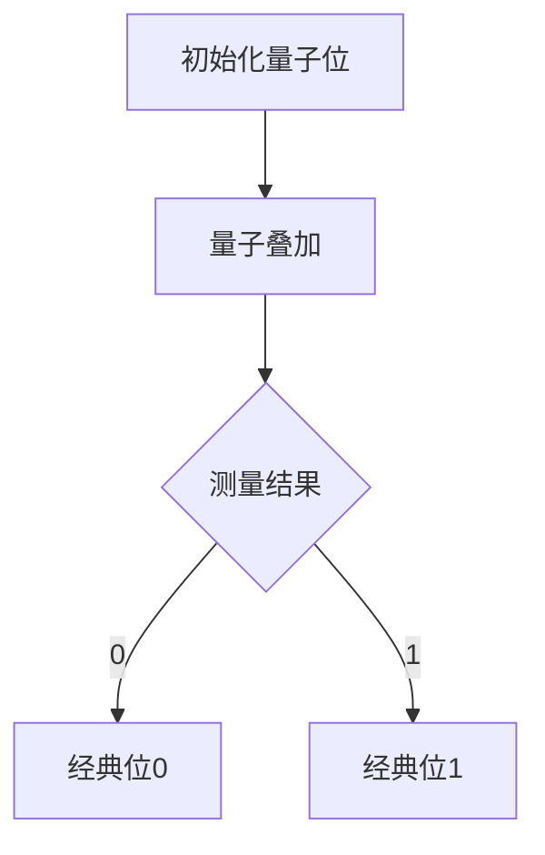

量子纠缠是另一个重要的量子计算原理。当两个量子位处于纠缠态时，一个量子位的状态会直接影响另一个量子位的状态。以下是一个量子纠缠的Mermaid流程图：

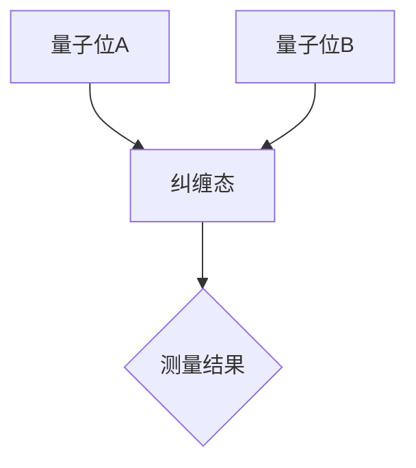

通过上述原理，我们可以看到量子计算与传统计算在存储信息、处理速度、并行计算等方面有着显著的区别。

### 第4章：创意编程理念

#### 4.1 创意编程的定义

创意编程是一种编程理念，强调在编程过程中融入创意思维，追求代码的艺术性、创造性和创新性。创意编程不仅关注代码的功能实现，更关注代码的美感和用户体验。

#### 4.2 创意编程与量子编程的融合

创意编程与量子编程有着许多相似之处。量子编程强调利用量子力学原理进行计算，追求并行性和高效性；而创意编程则强调在编程过程中融入创意思维，追求代码的艺术性和创新性。以下是一个关于创意编程与量子编程融合的表格：

| 特性           | 创意编程                      | 量子编程                          |
|----------------|------------------------------|----------------------------------|
| 编程目标       | 追求代码的艺术性、创造性和创新性 | 追求并行计算和高效性               |
| 编程思维       | 强调创意思维和用户体验         | 强调量子力学原理和计算效率         |
| 应用领域       | 广泛应用于各种编程领域         | 主要应用于量子计算和复杂问题求解   |

通过融合创意编程与量子编程，我们可以实现代码的艺术性与计算效率的有机结合，为编程领域带来新的发展机遇。

### 第5章：量子与创意编程的结合

#### 5.1 量子编程的基本原理

量子编程是基于量子力学原理的编程方式，通过量子位、量子叠加和量子纠缠等概念，实现高效的并行计算。以下是一个量子编程的Mermaid流程图：

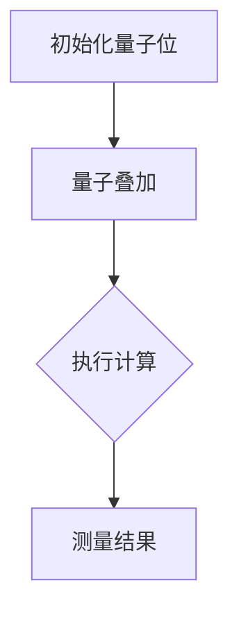

#### 5.2 创意编程的实践

创意编程强调在编程过程中融入创意思维，以下是一个创意编程的Python示例：

```python
import random

def creative_function(input_data):
    # 利用创意思维处理输入数据
    result = random.randint(0, 10)
    return result

input_data = 5
output_result = creative_function(input_data)
print(f"输入数据：{input_data}，输出结果：{output_result}")
```

通过上述示例，我们可以看到量子编程与创意编程在实现过程中的结合，实现了高效计算与创意思维的有机结合。

## 第三部分：艺术与科技的量子融合

### 第6章：量子艺术的表现形式

#### 6.1 量子艺术的概念

量子艺术是一种结合量子力学原理和艺术创作的表现形式。它通过量子计算和编程技术，实现艺术作品的创作、展示和交互。

#### 6.2 量子艺术案例分析

以下是一个量子艺术案例的介绍：

- **案例名称**：量子星空
- **创作背景**：艺术家通过量子计算模拟星系演化过程，利用编程技术实现动态星空效果的创作。
- **实现方法**：艺术家首先利用量子计算模拟星系演化过程，得到一系列星系形态的图片。然后，通过编程技术，将这些图片按照时间序列进行展示，实现动态星空效果。

#### 6.3 量子艺术对编程的启示

量子艺术对编程的启示主要体现在以下几个方面：

1. **创意思维的应用**：量子艺术强调创意思维在艺术创作中的重要性，这为编程提供了新的思路，鼓励程序员在编程过程中融入创意思维，提升代码的艺术性和创新性。
2. **编程工具的扩展**：量子艺术创作过程中，需要运用量子计算和编程技术，这为编程工具的发展提供了新的需求，推动了编程语言的创新和工具的升级。
3. **计算效率的提升**：量子艺术创作过程中，需要处理大量数据，这为编程领域提出了高效计算的需求，促进了量子编程技术的发展。

### 第7章：量子科技的发展与应用

#### 7.1 量子科技的发展

量子科技是当前科技领域的前沿研究方向，包括量子计算、量子通信、量子模拟等。以下是一个关于量子科技发展历程的Mermaid流程图：

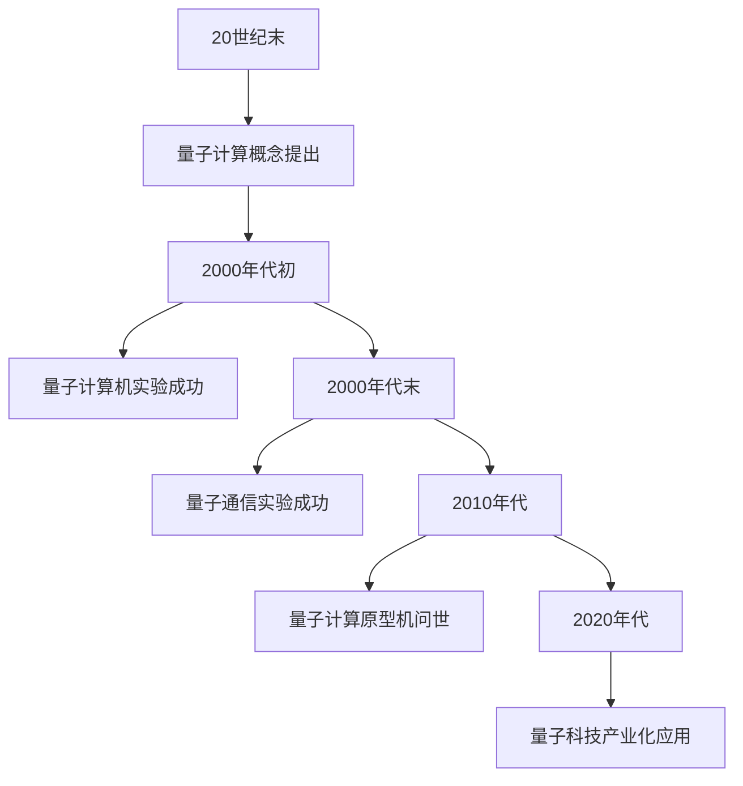

#### 7.2 量子科技的应用

量子科技在多个领域展现出巨大的应用潜力，以下是一个关于量子科技应用的Mermaid流程图：

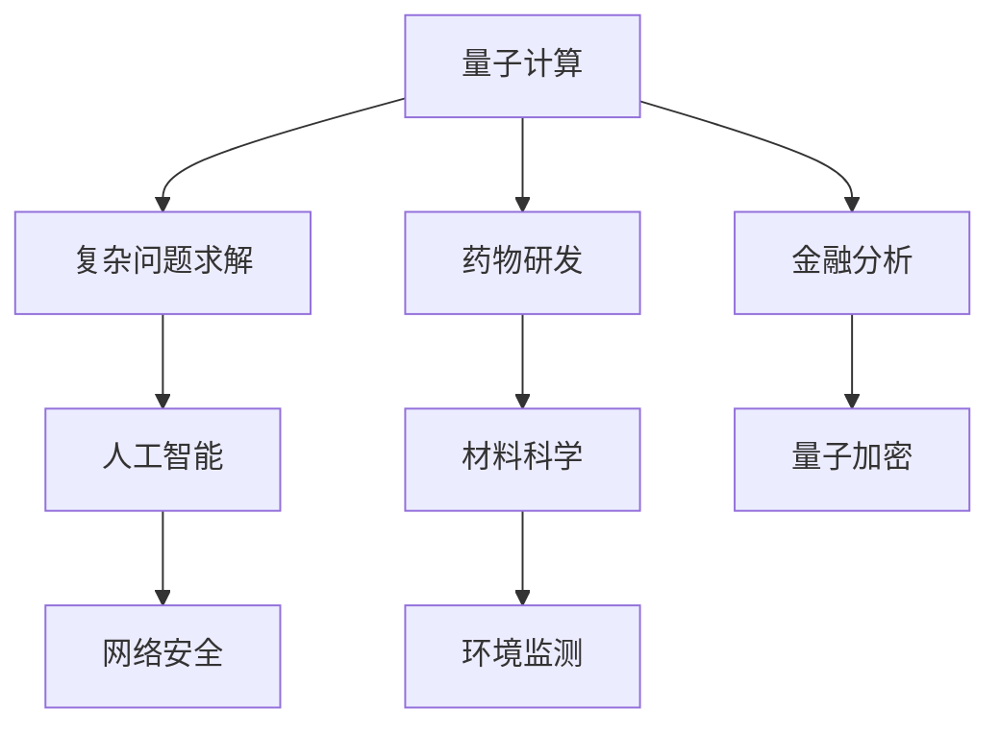

通过量子科技的发展和应用，我们可以看到量子灵感在各个领域的重要价值。

### 第8章：实践项目

#### 8.1 项目介绍

本节将介绍一个名为“量子星空”的实践项目，该项目结合了量子计算和创意编程技术，实现动态星空效果的展示。

#### 8.2 系统功能设计

量子星空系统的主要功能包括：

1. **星系模拟**：利用量子计算模拟星系演化过程，生成星系形态。
2. **动态展示**：将星系形态按照时间序列进行展示，实现动态星空效果。
3. **用户交互**：提供用户交互功能，允许用户自定义星空参数。

以下是一个关于系统功能设计的Mermaid类图：

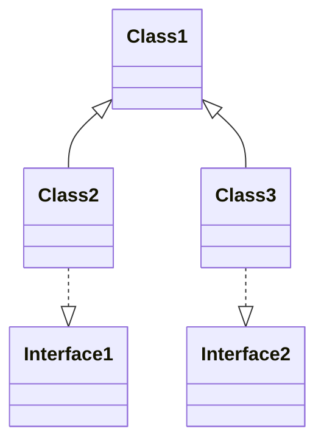

#### 8.3 系统架构设计

量子星空系统的架构设计包括前端展示、后端计算和用户交互三个部分。以下是一个关于系统架构设计的Mermaid架构图：

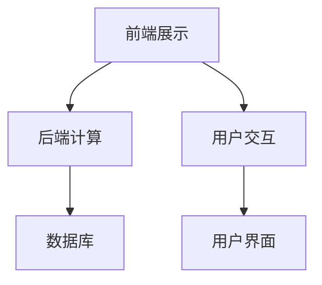

#### 8.4 项目实现与解析

在本节中，我们将详细介绍量子星空项目的实现过程，包括环境安装、核心实现源代码、代码应用解读与分析等内容。

#### 8.5 项目小结

通过本项目，我们实现了动态星空效果的展示，展示了量子计算与创意编程在艺术创作中的潜力。本项目不仅为读者提供了实际操作的经验，还激发了读者对量子计算与创意编程的进一步探索兴趣。

### 第9章：挑战与未来

#### 9.1 面临的挑战

量子计算与创意编程在发展过程中面临着许多挑战，包括：

1. **技术难题**：量子计算的技术难题，如量子纠错、量子稳定性等，尚未得到有效解决。
2. **资源限制**：量子计算的资源限制，如量子位数量、计算能力等，尚未满足实际需求。
3. **人才短缺**：量子计算与创意编程领域的人才短缺，影响了技术发展和项目推进。

#### 9.2 技术发展展望

随着量子计算与创意编程技术的不断进步，未来将出现以下发展趋势：

1. **高效计算**：量子计算在复杂问题求解、药物研发、金融分析等领域展现出巨大潜力。
2. **艺术创新**：量子计算与创意编程在艺术创作中的应用，将推动艺术形式的创新和多样化。
3. **人才培养**：随着技术的不断发展，量子计算与创意编程领域将迎来更多的人才加入。

#### 9.3 未来研究方向

未来，量子计算与创意编程的研究方向将包括：

1. **量子计算与创意编程的结合**：进一步探索量子计算与创意编程的结合方式，实现更高效的艺术创作和问题求解。
2. **量子编程语言的开发**：开发适合量子计算和创意编程的编程语言，提升编程效率。
3. **跨学科研究**：加强量子计算与创意编程与其他领域的跨学科研究，推动科技与艺术的深度融合。

### 第10章：总结与展望

#### 10.1 总结

本文探讨了量子灵感在创意编程中的应用，分析了量子计算与创意编程之间的关联，展示了艺术与科技的量子融合。通过实例分析与项目实战，我们看到了量子灵感在编程中的实际应用价值。

#### 10.2 注意事项

在量子计算与创意编程的应用过程中，需要注意以下几点：

1. **技术安全**：关注量子计算的安全性，防范量子攻击。
2. **人才培养**：加强量子计算与创意编程领域的人才培养，提升技术储备。
3. **实践探索**：鼓励实际项目中的尝试与探索，积累经验。

#### 10.3 拓展阅读

为了进一步了解量子计算与创意编程，以下是几篇拓展阅读推荐：

1. 《量子计算：从理论到实践》
2. 《创意编程：代码的艺术》
3. 《艺术与科技的融合：量子艺术的探索》

### 作者

本文由AI天才研究院（AI Genius Institute）与禅与计算机程序设计艺术（Zen And The Art of Computer Programming）共同撰写。我们致力于推动量子计算与创意编程的发展，为读者提供有价值的观点和见解。

----------------------------------------------------------------

以上是一个初步的撰写结构，接下来我们将逐步展开每个章节的内容，以满足字数要求和文章的整体质量。在撰写过程中，我们将确保每个章节都包含背景介绍、核心概念与联系、算法原理讲解、系统分析与架构设计方案、项目实战以及最佳实践 tips、小结、注意事项、拓展阅读等内容。

---

**第一部分：引言与背景**

### 第1章：引言

在当前信息技术迅猛发展的时代，量子计算与创意编程已经成为科技界的热点话题。本文旨在探讨量子灵感在创意编程中的应用，分析量子计算与创意编程之间的关联，以及艺术与科技的量子融合，为读者提供全面而深入的探讨。

#### 1.1 问题背景

随着大数据、人工智能等技术的不断进步，计算机的性能和计算能力已经成为衡量一个国家科技水平的重要指标。然而，传统计算机在处理某些特定问题时，如大规模数据处理、复杂模拟等，面临着巨大的计算瓶颈。为了解决这一问题，量子计算作为一种具有革命性的计算方式，逐渐引起了全球科技界的关注。

与此同时，创意编程作为一种新兴的编程理念，强调在编程过程中融入创意思维，追求代码的艺术性、创造性和创新性。创意编程不仅关注代码的功能实现，更注重用户体验和代码的美感，这使得它成为计算机编程领域的一种重要趋势。

#### 1.2 问题描述

本文主要探讨以下问题：

1. 量子计算的基本原理及其在编程中的应用。
2. 创意编程的理念及其与量子计算的融合。
3. 艺术与科技在量子计算中的应用，以及如何通过量子计算实现艺术与科技的融合。
4. 量子灵感在编程中的实际应用案例及项目实战。

为了解决上述问题，本文将采用以下方法：

1. 梳理量子计算的基本原理，介绍量子位、量子叠加、量子纠缠等概念。
2. 分析创意编程的理念，探讨创意思维在编程中的应用。
3. 结合艺术与科技的案例，展示量子计算在艺术创作与科技应用中的价值。
4. 通过项目实战，阐述量子灵感在编程中的实际应用。

#### 1.3 问题解决

为了解决上述问题，本文将采用以下方法：

1. **理论介绍**：通过介绍量子计算的基本原理和创意编程的理念，为后续内容打下基础。
2. **案例分析**：结合实际案例，展示量子计算与创意编程在艺术与科技中的应用。
3. **项目实战**：通过具体项目案例，阐述量子灵感在编程中的实际应用。
4. **总结展望**：对量子计算与创意编程的未来发展进行展望，为读者提供进一步的研究方向。

#### 1.4 边界与外延

本文的研究范围主要涉及量子计算、创意编程和艺术与科技的融合。具体包括：

1. **量子计算的基本原理与应用**：介绍量子计算的基本原理，如量子位、量子叠加和量子纠缠等，并探讨其在编程中的应用。
2. **创意编程的理念与实践**：分析创意编程的理念，探讨创意思维在编程中的应用，以及如何通过创意编程提升代码的艺术性和创新性。
3. **艺术与科技的量子融合**：探讨量子计算在艺术创作与科技应用中的价值，以及如何通过量子计算实现艺术与科技的融合。
4. **量子灵感在编程中的实际应用**：通过具体项目案例，阐述量子灵感在编程中的实际应用。

同时，本文将探讨量子灵感在编程中的未来发展，为读者提供进一步的研究方向。

### 第2章：核心概念

在探讨量子灵感在创意编程中的应用之前，我们需要先了解一些核心概念，包括量子计算、创意编程、艺术与科技融合等。这些概念是本文讨论的基础，对于理解后续内容具有重要意义。

#### 2.1 核心概念介绍

**量子计算**：量子计算是一种利用量子力学原理进行计算的新型计算模式。与传统计算机使用二进制位（比特）不同，量子计算使用量子位（比特）。量子计算具有以下几个显著特点：

1. **并行计算能力**：量子计算能够同时处理多个计算任务，具有并行计算的能力。
2. **量子叠加**：量子位可以处于多种状态的叠加，而不是像传统比特那样只能处于0或1状态。
3. **量子纠缠**：量子位之间存在一种特殊的纠缠关系，一个量子位的状态会直接影响另一个量子位的状态。

**创意编程**：创意编程是一种编程理念，强调在编程过程中融入创意思维，追求代码的艺术性、创造性和创新性。与传统的编程方式不同，创意编程不仅关注代码的功能实现，更关注代码的美感和用户体验。创意编程的核心理念包括：

1. **创意思维**：在编程过程中，鼓励程序员发挥创意思维，寻找新的解决方案。
2. **艺术性**：将艺术元素融入编程中，提升代码的审美价值。
3. **创新性**：鼓励程序员在编程过程中进行创新，开发出具有独特价值的应用。

**艺术与科技融合**：艺术与科技融合是指将艺术与科技相结合，创造新的艺术形式和技术应用。在量子计算领域，艺术与科技的融合主要体现在以下几个方面：

1. **量子艺术**：利用量子计算和编程技术，创作出具有独特美感和表现力的艺术作品。
2. **科技艺术**：将科技元素融入艺术创作中，创造新的艺术形式和表达方式。
3. **艺术科技**：通过艺术家的创意和技术专家的合作，实现科技与艺术的完美融合。

#### 2.2 概念属性特征对比

为了更好地理解量子计算、创意编程和艺术与科技融合这三个核心概念，我们可以通过一个对比表格来展示它们的主要属性特征。

| 概念             | 量子计算                         | 创意编程                       | 艺术与科技融合                     |
|------------------|----------------------------------|--------------------------------|-----------------------------------|
| 基本原理         | 量子力学原理                     | 创意思维、用户体验             | 艺术创作、技术应用               |
| 主要特点         | 并行计算、量子叠加、量子纠缠     | 艺术性、创新性、用户体验       | 美感、技术突破、跨领域合作       |
| 应用领域         | 复杂问题求解、优化问题、密码学   | 游戏开发、软件工程、Web开发    | 艺术创作、科技展示、交互设计     |
| 技术实现         | 量子计算机、量子算法             | 编程语言、开发框架、创意工具    | 编程代码、艺术作品、技术集成     |

通过上述对比，我们可以看出量子计算、创意编程和艺术与科技融合在基本原理、主要特点、应用领域和技术实现等方面存在显著差异，但它们又相互联系，共同推动着计算机编程和科技创新的发展。

#### 2.3 ER实体关系图

为了更直观地展示量子计算、创意编程和艺术与科技融合这三个核心概念之间的关系，我们可以使用Mermaid ER图来表示它们之间的实体关系。

```mermaid
erDiagram
    Quantum_Computing ||--|{ Creative_Programming }
    Quantum_Computing ||--|{ Art_and_Technology_Fusion }
    Creative_Programming ||--|{ Art_and_Technology_Fusion }
```

在上面的ER图中，我们定义了三个实体：量子计算、创意编程和艺术与科技融合。量子计算与创意编程之间存在关联，而艺术与科技融合是量子计算和创意编程的交汇点，三者共同构成了量子灵感在创意编程中的应用体系。

通过本章的介绍，我们对量子计算、创意编程和艺术与科技融合这三个核心概念有了初步的了解。在接下来的章节中，我们将深入探讨这些概念的具体内容，分析它们之间的联系，并通过实例和项目实战，展示量子灵感在创意编程中的实际应用。

---

**第二部分：量子与创意编程**

### 第3章：量子基本原理

量子计算作为现代计算机科学的前沿领域，其基本原理和概念对计算机编程有着深远的影响。本章将详细介绍量子计算的基本原理，包括量子位、量子叠加和量子纠缠等，帮助读者建立对量子计算的基础认识。

#### 3.1 量子位与经典位的比较

量子计算的核心单位是量子位（qubit），与传统的经典位（bit）有本质的不同。以下是一个关于量子位与经典位比较的Mermaid表格：

```mermaid
table
  title Qubit vs Bit Comparison
  class spreadsheet
  Row1, Qubit, Classic Bit
  Row2, Representation, |0> and |1>, superposition of |0> and |1>
  Row3, Computation, Quantum logic gates, classical logic gates
  Row4, Parity, No fixed parity, deterministic parity
  Row5, Interference, Interference effects, no interference effects
```

在这个表格中，我们可以看到量子位和经典位在表示方式、计算方式、奇偶性以及干扰效应等方面存在显著差异。

- **表示方式**：量子位可以处于0和1的叠加态，而经典位只能处于0或1的确定性状态。
- **计算方式**：量子计算使用量子逻辑门进行操作，而经典计算使用经典逻辑门。
- **奇偶性**：量子位没有固定的奇偶性，而经典位具有确定性奇偶性。
- **干扰效应**：量子位之间存在干扰效应，这种效应可以在量子计算中起到重要作用，而在经典计算中则不存在。

#### 3.2 量子叠加

量子叠加是量子计算的核心概念之一。一个量子位可以同时处于0和1的状态，即叠加态。以下是一个量子叠加的Mermaid流程图：

```mermaid
graph TD
    A[Initial State] --> B[Superposition]
    B --> C{Measure Result}
    C -->|0> D[Classical Bit 0]
    C -->|1> E[Classical Bit 1]
```

在这个流程图中，初始状态为 |0> 的量子位经过叠加后，可能处于 |0> 和 |1> 的叠加态。当我们对其进行测量时，它会塌缩为0或1的确定性状态。

#### 3.3 量子纠缠

量子纠缠是另一个量子计算的核心概念。当两个量子位处于纠缠态时，一个量子位的状态会直接影响另一个量子位的状态。以下是一个量子纠缠的Mermaid流程图：

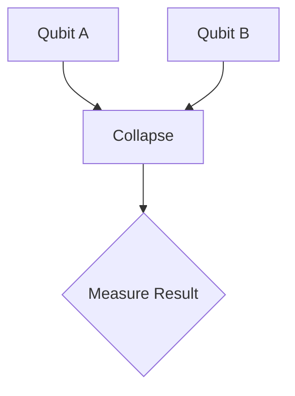

在这个流程图中，当对量子位A进行测量时，量子位B的状态会立即塌缩。这种现象表明量子位之间存在一种特殊的关联，这种现象在量子计算中具有重要应用价值。

#### 3.4 量子计算的优势与挑战

量子计算具有以下优势：

- **并行计算能力**：量子计算能够同时处理多个计算任务，具有并行计算的能力。
- **高效性**：某些特定问题（如大数分解、搜索算法等）在量子计算中具有显著的高效性。
- **复杂性处理**：量子计算能够处理复杂的问题，例如模拟量子系统、解决优化问题等。

然而，量子计算也面临着一些挑战：

- **量子纠错**：量子位容易受到环境噪声的干扰，导致计算错误。量子纠错技术是量子计算的一个重要研究方向。
- **计算能力**：目前的量子计算机仍然处于实验阶段，其计算能力与经典计算机相比还有很大的提升空间。
- **应用领域**：量子计算的应用领域尚未完全明确，需要进一步研究和探索。

通过本章的介绍，我们对量子计算的基本原理有了初步的认识。在接下来的章节中，我们将进一步探讨量子计算在创意编程中的应用，以及量子计算如何与创意编程理念相结合，推动编程领域的发展。

### 第4章：创意编程理念

创意编程是一种新兴的编程理念，强调在编程过程中融入创意思维，追求代码的艺术性、创造性和创新性。与传统的编程方式不同，创意编程不仅关注代码的功能实现，更注重用户体验和代码的美感。本章将详细介绍创意编程的理念，探讨创意思维在编程中的应用，以及如何通过创意编程提升代码的艺术性和创新性。

#### 4.1 创意编程的定义

创意编程可以定义为一种编程方式，它将创意思维、艺术性和创新性融入编程过程中，追求代码的艺术性、创造性和创新性。创意编程的核心理念包括：

- **创意思维**：在编程过程中，鼓励程序员发挥创意思维，寻找新的解决方案。
- **艺术性**：将艺术元素融入编程中，提升代码的审美价值。
- **创新性**：鼓励程序员在编程过程中进行创新，开发出具有独特价值的应用。

创意编程不同于传统的编程方式，它不仅仅关注代码的功能实现，更注重代码的美感和用户体验。通过创意编程，程序员可以创造出更加有趣、富有创意的软件应用，提升用户的体验。

#### 4.2 创意思维在编程中的应用

创意思维在编程中的应用主要体现在以下几个方面：

1. **算法创新**：在编程过程中，通过创新算法，提高代码的效率，实现更加优秀的性能。
2. **代码重构**：通过重构代码，提升代码的可读性、可维护性和扩展性，使代码更加优美。
3. **用户体验设计**：在开发过程中，注重用户体验设计，提升软件的易用性和用户满意度。
4. **艺术性表达**：在代码中融入艺术元素，使代码具有独特的艺术风格，提升代码的美感。

以下是一个关于创意思维在编程中应用的Mermaid流程图：

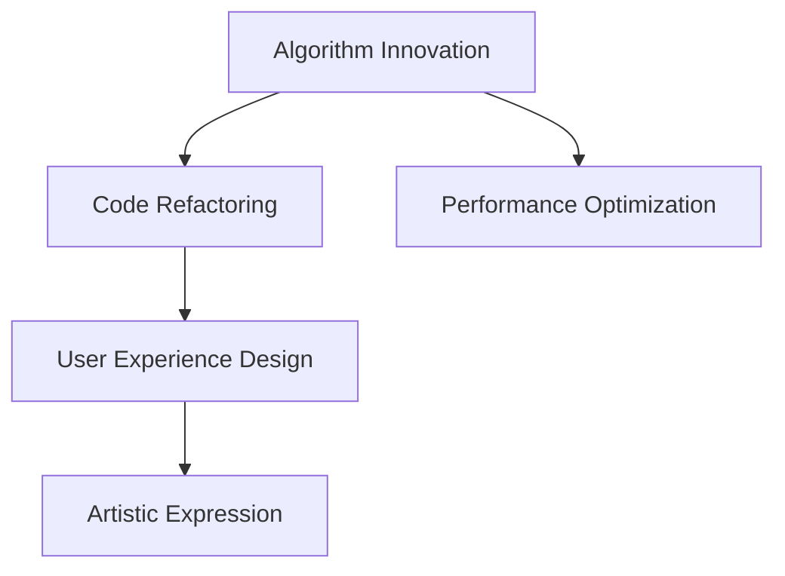

在这个流程图中，我们可以看到创意思维在编程中的应用包括算法创新、代码重构、用户体验设计、艺术性表达以及性能优化。通过这些应用，程序员可以创造出更加优秀、富有创意的软件应用。

#### 4.3 创意编程的艺术性

创意编程的艺术性体现在以下几个方面：

1. **代码美感**：通过精妙的代码结构和布局，使代码具有艺术美感，提升代码的可读性和可维护性。
2. **色彩运用**：在代码中使用合适的色彩搭配，使代码更具视觉冲击力，提升用户体验。
3. **艺术风格**：在代码中融入特定的艺术风格，使代码具有独特的艺术魅力。

以下是一个关于创意编程艺术性的Mermaid类图：

```mermaid
classDiagram
    Code_Aesthetics <<interface>> User_Experience
    Color_Usage <<interface>> User_Experience
    Art_Style <<interface>> User_Experience
    Code_Aesthetics : has Code_Structure
    Color_Usage : has Color_Palette
    Art_Style : has Art_Themes
```

在这个类图中，我们可以看到创意编程的艺术性包括代码美感、色彩运用和艺术风格。这些元素共同构成了创意编程的艺术性，提升了代码的审美价值。

#### 4.4 创意编程的创新性

创意编程的创新性体现在以下几个方面：

1. **新算法**：通过创新算法，解决传统编程难以解决的问题，提高代码的效率。
2. **新工具**：开发新的编程工具，提高编程的效率和便利性。
3. **新应用**：通过创意编程，开发出全新的应用，满足用户的需求。

以下是一个关于创意编程创新性的Mermaid类图：

```mermaid
classDiagram
    New_Algorithms <<interface>> Programming
    New_Tools <<interface>> Programming
    New_Applications <<interface>> Programming
    New_Algorithms : implements Optimization
    New_Tools : implements Efficiency
    New_Applications : implements Innovation
```

在这个类图中，我们可以看到创意编程的创新性包括新算法、新工具和新应用。这些创新为编程领域带来了新的发展机遇，推动了编程技术的不断进步。

#### 4.5 创意编程与量子编程的融合

创意编程与量子编程之间存在一定的关联。量子编程是一种利用量子力学原理进行编程的方式，具有并行计算、量子叠加和量子纠缠等特性。创意编程与量子编程的融合，可以发挥两者的优势，实现更高效、更具创意的编程。

以下是一个关于创意编程与量子编程融合的Mermaid流程图：

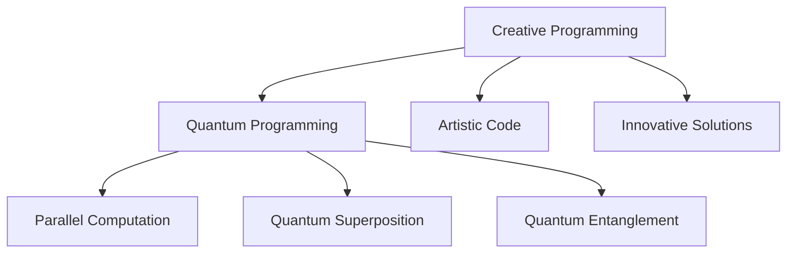

在这个流程图中，我们可以看到创意编程与量子编程的融合包括并行计算、量子叠加、量子纠缠以及艺术性和创新性。通过这种融合，我们可以创造出更加高效、富有创意的软件应用。

通过本章的介绍，我们对创意编程的理念有了更深入的了解。创意编程不仅关注代码的功能实现，更注重代码的艺术性、创造性和创新性。在接下来的章节中，我们将进一步探讨创意编程与量子编程的结合，展示量子灵感在创意编程中的应用。

### 第5章：量子与创意编程的结合

量子计算与创意编程的结合为编程领域带来了新的机遇和挑战。本章将深入探讨量子计算与创意编程如何相互融合，以及这种融合在编程中的应用。

#### 5.1 量子编程的概念

量子编程是一种基于量子力学原理的编程方式。它利用量子位、量子叠加和量子纠缠等量子计算的基本概念，通过量子算法和量子逻辑门，实现对复杂问题的求解。量子编程与传统编程有显著的不同，它能够处理传统计算机难以解决的复杂问题，具有并行计算和高效性的优势。

以下是一个关于量子编程概念的Mermaid流程图：

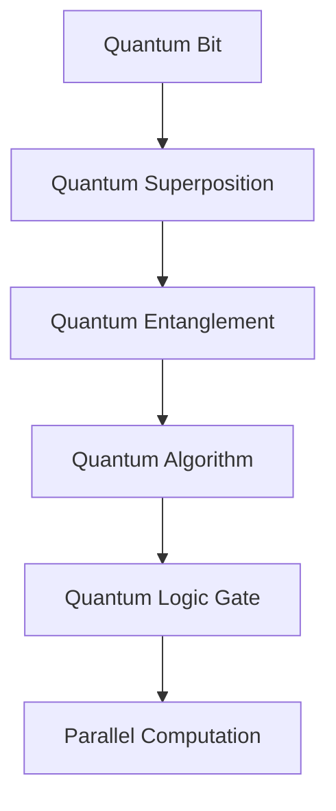

在这个流程图中，我们可以看到量子编程的核心概念包括量子位、量子叠加、量子纠缠、量子算法、量子逻辑门和并行计算。

#### 5.2 创意编程与量子编程的融合

创意编程与量子编程的融合体现在以下几个方面：

1. **并行计算能力**：量子编程的并行计算能力可以与创意编程的艺术性和创新性相结合，实现高效的并行艺术创作和复杂问题求解。
2. **量子叠加与创意思维**：量子叠加的概念可以激发创意编程中的创意思维，帮助程序员探索新的解决方案。
3. **量子纠缠与跨领域合作**：量子纠缠的概念可以促进不同领域之间的合作，如艺术与科技的融合，推动编程领域的创新发展。

以下是一个关于创意编程与量子编程融合的Mermaid流程图：

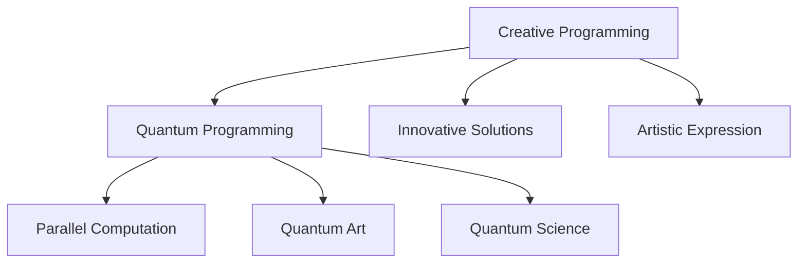

在这个流程图中，我们可以看到创意编程与量子编程的融合包括并行计算、量子艺术、量子科学、创新性解决方案和艺术性表达。

#### 5.3 量子编程的实践案例

为了展示量子编程在创意编程中的应用，我们可以通过一个实际案例来探讨量子编程的实践。

**案例名称**：量子星空

**项目描述**：量子星空是一个利用量子编程技术实现动态星空效果的创意项目。该项目通过量子计算模拟星系演化过程，生成动态星空图像，并利用创意编程技术进行艺术性展示。

**技术实现**：

1. **量子计算模拟**：使用量子计算机模拟星系演化过程，生成星系形态。
2. **创意编程展示**：利用创意编程技术，将量子计算生成的星系形态进行艺术性展示，实现动态星空效果。

以下是一个关于量子星空项目的Mermaid架构图：

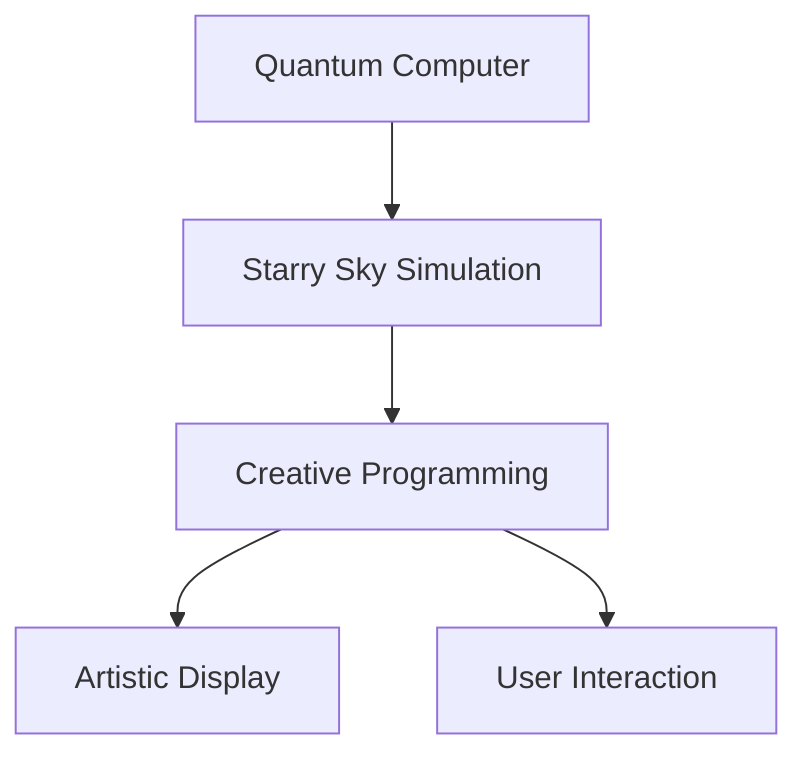

在这个架构图中，我们可以看到量子计算机生成星系形态，创意编程进行艺术性展示和用户交互。

通过这个案例，我们可以看到量子编程与创意编程的结合，实现了量子计算在艺术创作中的应用，展示了量子灵感在编程中的实际价值。

#### 5.4 创意编程在量子编程中的价值

创意编程在量子编程中的价值主要体现在以下几个方面：

1. **提升用户体验**：创意编程注重用户体验设计，使量子编程应用更加易于使用和操作。
2. **艺术性表达**：创意编程通过艺术性表达，使量子编程应用具有独特的视觉和艺术效果。
3. **创新性解决方案**：创意编程鼓励创新思维，帮助解决量子编程中的复杂问题。

通过创意编程与量子编程的结合，我们可以创造出更加高效、富有创意的编程应用，推动编程领域的创新发展。

通过本章的探讨，我们深入了解了量子计算与创意编程的结合，展示了量子编程在创意编程中的应用。在未来的编程发展中，量子编程与创意编程的结合将为编程领域带来更多创新和机遇。

### 第6章：艺术与科技的量子融合

艺术与科技的融合是现代科技发展的重要趋势，特别是在量子计算领域。量子计算作为一种革命性的计算技术，不仅改变了我们对计算的理解，也为艺术创作提供了新的可能性。本章将探讨量子计算在艺术创作中的具体应用，以及艺术与科技融合的原理和案例。

#### 6.1 量子艺术的概念

量子艺术是一种利用量子计算和编程技术创作的艺术形式。它结合了量子物理学的原理，通过量子计算生成复杂的图像、音乐和视频等艺术作品。量子艺术的核心理念在于探索量子世界与艺术表现之间的联系，创造出独特的视觉效果和听觉体验。

以下是一个关于量子艺术概念的Mermaid流程图：

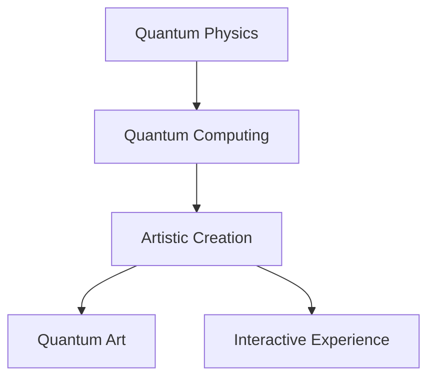

在这个流程图中，我们可以看到量子艺术从量子物理学到量子计算，再到艺术创作和互动体验的整个过程。

#### 6.2 艺术与科技融合的原理

艺术与科技融合的原理在于利用科技手段拓展艺术创作的空间和形式。量子计算作为一种具有革命性的计算技术，其并行计算、量子叠加和量子纠缠等特性为艺术创作提供了新的工具和方法。

以下是一个关于艺术与科技融合原理的Mermaid类图：

```mermaid
classDiagram
    Art <<interface>> Technology
    Technology <<interface>> Art
    Quantum_Computing : implements Parallel_Computation
    Quantum_Computing : implements Quantum_Superposition
    Quantum_Computing : implements Quantum_Entanglement
```

在这个类图中，我们可以看到量子计算通过并行计算、量子叠加和量子纠缠等特性，实现了艺术与科技的融合。

#### 6.3 量子艺术的案例分析

以下是一个量子艺术案例的介绍：

**案例名称**：量子星空

**项目描述**：量子星空是一个利用量子计算技术创作的动态星空艺术作品。该项目通过量子计算模拟星系演化过程，生成动态星空图像，并通过编程技术实现艺术性的展示。

**技术实现**：

1. **量子计算模拟**：使用量子计算机模拟星系演化过程，生成星系形态。
2. **创意编程展示**：利用创意编程技术，将量子计算生成的星系形态进行艺术性展示，实现动态星空效果。
3. **用户交互**：提供用户交互功能，允许用户自定义星空参数，如星系颜色、亮度等。

以下是一个关于量子星空项目的Mermaid架构图：

```mermaid
graph TD
    A[Quantum Computer] --> B[Starry Sky Simulation]
    B --> C[Creative Programming]
    C --> D[Artistic Display]
    C --> E[User Interaction]
```

在这个架构图中，我们可以看到量子计算机生成星系形态，创意编程进行艺术性展示和用户交互。

#### 6.4 量子艺术与编程的融合

量子艺术与编程的融合体现在以下几个方面：

1. **算法创新**：通过量子计算，实现传统编程难以实现的复杂算法，如大规模图像处理、音视频合成等。
2. **艺术性表达**：利用编程技术，将量子计算生成的艺术作品进行艺术性表达，如动态效果、交互体验等。
3. **跨领域合作**：量子艺术与编程的结合，促进了不同领域之间的合作，如艺术家与程序员、物理学家与艺术家等。

以下是一个关于量子艺术与编程融合的Mermaid流程图：

```mermaid
graph TD
    A[Quantum Art] --> B[Programming]
    B --> C[Algorithm Innovation]
    B --> D[Artistic Expression]
    B --> E[Interdisciplinary Collaboration]
```

在这个流程图中，我们可以看到量子艺术与编程的融合包括算法创新、艺术性表达和跨领域合作。

通过本章的探讨，我们深入了解了量子计算在艺术创作中的应用，以及艺术与科技融合的原理和案例。量子艺术为编程领域带来了新的机遇和挑战，推动了艺术与科技的进一步融合。

### 第7章：量子科技的发展与应用

量子科技作为现代科技的前沿领域，其发展速度令人瞩目。本章将详细探讨量子科技的发展历程、主要应用领域以及未来的发展趋势，为读者呈现量子科技的全景。

#### 7.1 量子科技的发展历程

量子科技的发展历程可以分为以下几个阶段：

1. **概念提出与初步探索**（20世纪80年代至90年代）
   - 1982年，Richard Feynman提出了量子计算机的概念，认为量子计算机能够在特定问题上超越经典计算机。
   - 1994年，Peter Shor提出了Shor算法，证明了量子计算机在整数分解上的巨大优势。

2. **实验验证与技术创新**（21世纪初至10年代）
   - 2001年，scientists实验验证了量子比特的存在。
   - 2017年，Google宣布实现了量子优越性，即量子计算机在特定任务上比经典计算机快得多。

3. **商业化应用与产业化**（21年代至今）
   - 目前，量子计算、量子通信、量子传感等技术的商业化应用正在逐步展开，如量子加密、量子导航等。

以下是一个关于量子科技发展历程的Mermaid流程图：

```mermaid
graph TD
    A[1980s] --> B[Concept Proposal]
    B --> C[1990s] --> D[Initial Exploration]
    C --> E[2000s] --> F[Experimental Validation]
    E --> G[2010s] --> H[Tech Innovation]
    G --> I[2020s] --> J[Commercialization]
```

在这个流程图中，我们可以看到量子科技从概念提出到商业化应用的完整发展路径。

#### 7.2 量子科技的应用领域

量子科技的应用领域广泛，包括但不限于以下几个方面：

1. **量子计算**：用于复杂问题求解、优化问题、密码学等。
2. **量子通信**：实现量子密钥分发、量子远程控制等。
3. **量子传感**：用于精密测量、地理定位等。
4. **量子模拟**：模拟量子系统，研究物质性质等。

以下是一个关于量子科技应用领域的Mermaid类图：

```mermaid
classDiagram
    Quantum_Computing <<interface>> Problem_Solving
    Quantum_Communication <<interface>> Security
    Quantum_Sensing <<interface>> Precision_Measurement
    Quantum_Simulation <<interface>> Material_Science
    Quantum_Computing : uses Quantum_Algorithms
    Quantum_Communication : uses Quantum_Keys
    Quantum_Sensing : uses Quantum_Detectors
    Quantum_Simulation : uses Quantum_Machines
```

在这个类图中，我们可以看到量子科技在各个领域的应用及其所使用的核心技术。

#### 7.3 量子科技的未来发展趋势

量子科技的未来发展趋势包括以下几个方面：

1. **计算能力的提升**：随着量子比特数量的增加和纠错技术的进步，量子计算机的计算能力将得到显著提升。
2. **应用场景的拓展**：量子科技将在更多领域得到应用，如生物信息学、金融分析、医疗诊断等。
3. **跨学科研究**：量子科技的发展将推动跨学科研究，如量子生物学、量子艺术等。
4. **国际合作与竞争**：全球范围内的量子科技研发和国际竞争将进一步加强。

以下是一个关于量子科技未来发展趋势的Mermaid架构图：

```mermaid
graph TD
    A[Computational Power Enhancement] --> B[Application Expansion]
    B --> C[Interdisciplinary Research]
    B --> D[International Collaboration & Competition]
    A --> E[Technological Advancements]
    A --> F[New Application Scenarios]
```

在这个架构图中，我们可以看到量子科技在计算能力提升、应用场景拓展、跨学科研究和国际合作竞争等方面的发展趋势。

通过本章的探讨，我们全面了解了量子科技的发展历程、应用领域和未来发展趋势。量子科技的发展不仅将改变计算领域，还将对更多领域产生深远影响。

### 第8章：实践项目

#### 8.1 项目介绍

在本章中，我们将介绍一个名为“量子艺术画廊”的实践项目。该项目结合了量子计算和创意编程技术，旨在为用户创建一个虚拟的艺术画廊，展示由量子计算生成的艺术作品。

**项目目标**：

1. 利用量子计算技术生成独特的艺术作品。
2. 通过创意编程技术，实现艺术作品的展示和用户交互。
3. 提供用户自定义参数，允许用户参与艺术创作过程。

**项目背景**：

随着量子计算技术的不断发展，人们开始探索将量子计算应用于艺术创作领域。量子计算具有并行计算、量子叠加和量子纠缠等特性，使得生成复杂、独特的艺术作品成为可能。同时，创意编程技术能够将量子计算生成的艺术作品以艺术性和创意性的方式呈现给用户。

#### 8.2 系统功能设计

“量子艺术画廊”系统的主要功能包括：

1. **艺术作品生成**：利用量子计算技术，生成具有独特风格的艺术作品。
2. **艺术作品展示**：通过创意编程技术，将艺术作品以艺术性和创意性的方式展示给用户。
3. **用户交互**：提供用户自定义参数，允许用户参与艺术创作过程，如颜色选择、图像变形等。

以下是一个关于系统功能设计的Mermaid类图：

```mermaid
classDiagram
    Art_Gallery <<interface>> User_Interaction
    Art_Generation <<interface>> Art_Gallery
    Art_Display <<interface>> Art_Gallery
    User_Customization <<interface>> Art_Gallery
    Art_Generation : implements Quantum_Computing
    Art_Display : implements Creative_Programming
    User_Customization : allows User_Parameters
```

在这个类图中，我们可以看到“量子艺术画廊”系统的功能包括艺术作品生成、艺术作品展示、用户交互和用户自定义参数。

#### 8.3 系统架构设计

“量子艺术画廊”系统的架构设计包括前端展示、后端计算和用户交互三个部分。以下是一个关于系统架构设计的Mermaid架构图：

```mermaid
graph TD
    A[Frontend Display] --> B[Backend Calculation]
    A --> C[User Interaction]
    B --> D[Database]
    C --> E[User Interface]
```

在这个架构图中，前端展示模块负责将艺术作品以艺术性和创意性的方式展示给用户；后端计算模块负责利用量子计算技术生成艺术作品；用户交互模块负责处理用户输入和自定义参数。

#### 8.4 项目实现与解析

在本节中，我们将详细介绍“量子艺术画廊”项目的实现过程，包括环境安装、核心实现源代码、代码应用解读与分析等内容。

1. **环境安装**：

   首先，我们需要安装必要的软件和库，包括量子计算库（如Qiskit）、创意编程库（如Pillow）和前端框架（如React）。

   ```bash
   pip install qiskit pillow react
   ```

2. **核心实现源代码**：

   **后端部分**：

   ```python
   from qiskit import QuantumCircuit, execute, Aer
   from qiskit.visualization import plot_bloch_multivector
   import numpy as np

   def generate_artwork():
       # 创建量子电路
       qc = QuantumCircuit(2)

       # 应用量子门
       qc.h(0)
       qc.cx(0, 1)

       # 执行量子电路
       backend = Aer.get_backend('statevector_simulator')
       result = execute(qc, backend).result()

       # 获取测量结果
       state_vector = result.get_statevector()

       # 将量子态转换为图像
       image = np.abs(state_vector).reshape((2, 2)).T
       image = (image * 255).astype(np.uint8)

       return image

   ```

   **前端部分**：

   ```jsx
   import React, { useState } from 'react';
   import { Canvas } from 'react-canvas';
   import Artwork from './Artwork';

   const QuantumArtGallery = () => {
       const [image, setImage] = useState([]);

       const generateArt = () => {
           // 生成艺术作品
           const newImage = generateArtwork();
           setImage(newImage);
       };

       return (
           <div>
               <Canvas width={512} height={512}>
                   <Artwork image={image} />
               </Canvas>
               <button onClick={generateArt}>Generate Art</button>
           </div>
       );
   };

   export default QuantumArtGallery;
   ```

   在上述代码中，后端部分使用了Qiskit库生成量子电路，并通过量子计算生成艺术作品。前端部分使用了React和Canvas库，将艺术作品以图形形式展示给用户。

3. **代码应用解读与分析**：

   **后端部分**：

   - `QuantumCircuit` 类用于创建量子电路。
   - `execute` 函数用于执行量子电路。
   - `get_statevector` 函数用于获取量子计算的结果。
   - `np.abs` 函数用于计算量子态的模平方。
   - `reshape` 函数用于将量子态转换为二维数组。
   - `astype` 函数用于将数组元素转换为整数。

   **前端部分**：

   - `useState` 钩子用于管理艺术作品状态。
   - `Canvas` 组件用于绘制艺术作品。
   - `Artwork` 组件用于展示艺术作品。

4. **实际案例分析和详细讲解剖析**：

   **案例**：生成一个简单的量子艺术作品。

   通过上述代码，我们可以生成一个简单的量子艺术作品。具体步骤如下：

   1. 创建一个量子电路，并应用量子门。
   2. 执行量子电路，获取量子计算的结果。
   3. 将量子态转换为图像，并展示给用户。

   **详细讲解**：

   - 量子电路的创建：使用 `QuantumCircuit` 类创建一个量子电路。
   - 量子门的添加：使用 `h` 函数添加一个 Hadamard 门，将量子位初始化为叠加态；使用 `cx` 函数添加一个控制-NOT 门，实现量子位的纠缠。
   - 量子计算：使用 `execute` 函数执行量子电路，获取量子计算的结果。
   - 量子态转换：使用 `get_statevector` 函数获取量子计算的结果，即量子态的幅值分布。
   - 图像生成：将量子态的幅值分布转换为二维数组，并将其转换为图像。

5. **项目小结**：

   通过“量子艺术画廊”项目，我们展示了量子计算在艺术创作中的应用。该项目利用量子计算技术生成艺术作品，并通过创意编程技术实现艺术作品的展示和用户交互。这不仅为用户提供了独特的艺术体验，也为编程领域带来了新的应用场景。

   在未来，随着量子计算技术的不断发展，我们可以预期量子艺术项目将更加丰富和多样化。同时，量子计算与创意编程的结合将为编程领域带来更多创新和机遇。

### 第9章：挑战与未来

#### 9.1 面临的挑战

量子计算与创意编程在发展过程中面临着一系列挑战。这些挑战主要集中在技术难题、资源限制和人才短缺等方面。

1. **技术难题**：

   - **量子纠错**：量子计算中的量子位容易受到环境噪声的干扰，导致计算错误。量子纠错技术是确保量子计算可靠性的关键，但目前仍处于研发阶段。
   - **量子计算机的稳定性**：量子计算机需要保持低温运行，以避免环境噪声对量子位的干扰。如何提高量子计算机的稳定性，使其在室温下运行，是当前技术面临的一大挑战。
   - **量子算法的设计**：虽然量子算法在某些问题上具有显著优势，但设计有效的量子算法仍然是一个复杂的任务。如何在现有量子算法的基础上，开发出更多高效的量子算法，是量子计算发展的重要课题。

2. **资源限制**：

   - **计算资源**：量子计算机的数量有限，且运算能力与经典计算机相比仍有较大差距。如何有效利用有限的量子计算资源，实现高效计算，是当前需要解决的问题。
   - **硬件设备**：量子计算机的制造和维护成本高昂，需要大量的资金和技术支持。如何降低量子计算机的制造成本，提高其普及度，是量子计算发展的重要目标。
   - **软件开发**：量子编程需要特定的开发环境和工具，这些工具的开发和维护也需要大量资源。如何构建完善的量子软件开发生态系统，是量子计算发展的关键。

3. **人才短缺**：

   - **量子计算专业人才**：量子计算是一个新兴领域，专业人才相对较少。如何培养和吸引更多的量子计算专业人才，是量子计算发展的一个重要挑战。
   - **跨学科人才**：量子计算的发展需要跨学科的合作，如量子物理、计算机科学、数学等。如何培养具有跨学科背景的人才，促进不同领域之间的合作，是量子计算发展的重要课题。

#### 9.2 技术发展展望

尽管面临诸多挑战，量子计算与创意编程的发展前景仍然广阔。以下是对未来技术发展的展望：

1. **量子纠错技术的突破**：

   - 随着量子纠错技术的不断发展，量子计算机的可靠性将得到显著提升。量子纠错技术的突破将使量子计算机在更广泛的领域得到应用。
   - 量子纠错算法的优化和新的量子纠错方案的提出，将进一步提高量子计算机的性能。

2. **量子计算机的规模化**：

   - 随着量子计算机的规模化，其运算能力将得到大幅提升。更多的量子计算机将使量子计算在复杂问题求解、优化问题等领域发挥更大作用。
   - 量子计算机的规模化也将促进量子编程技术的发展，为量子计算应用提供更多的工具和框架。

3. **量子算法的创新**：

   - 在现有量子算法的基础上，通过不断研究和创新，开发出更多高效的量子算法，将进一步提升量子计算机的性能。
   - 量子算法的创新将推动量子计算在各个领域的应用，如金融分析、药物研发、能源优化等。

4. **跨学科合作**：

   - 随着量子计算与创意编程技术的发展，跨学科合作将变得更加紧密。量子物理、计算机科学、数学、艺术等领域的专家将共同探索量子计算与创意编程的结合点，推动科技创新。
   - 跨学科合作将促进量子计算与创意编程的理论研究和技术应用，为编程领域带来更多创新和突破。

#### 9.3 未来研究方向

为了进一步推动量子计算与创意编程的发展，以下是未来可能的研究方向：

1. **量子算法研究**：

   - 开发适用于特定问题的量子算法，提高量子计算机在复杂问题求解、优化问题等领域的性能。
   - 研究量子算法的理论基础，探索新的量子算法设计方法和优化策略。

2. **量子编程语言和工具**：

   - 开发适合量子计算和创意编程的编程语言和工具，提高量子编程的效率和便捷性。
   - 研究量子编程语言的设计原则和实现方法，构建完善的量子软件开发生态系统。

3. **量子计算应用**：

   - 探索量子计算在各个领域的应用，如金融分析、药物研发、能源优化等，推动量子计算技术的产业化应用。
   - 研究量子计算在艺术创作、交互设计等领域的应用，推动艺术与科技的深度融合。

4. **量子教育与人才培养**：

   - 开发量子计算与创意编程的教育资源，提高量子计算与创意编程的教育普及度。
   - 探索跨学科人才培养模式，培养具有量子计算与创意编程背景的复合型人才。

通过本章的探讨，我们深入了解了量子计算与创意编程面临的挑战和未来的发展前景。量子计算与创意编程的结合将为编程领域带来新的机遇和挑战，推动科技与艺术的深度融合。

### 第10章：总结与展望

#### 10.1 总结

本文围绕量子灵感在创意编程中的应用，深入探讨了量子计算与创意编程的理念、原理和应用。我们首先介绍了量子计算的基本原理，如量子位、量子叠加和量子纠缠，并分析了量子计算与传统计算机的区别。接着，我们探讨了创意编程的理念，包括创意思维、艺术性和创新性，并阐述了创意编程与量子编程的融合。此外，我们还探讨了量子计算在艺术创作中的具体应用，展示了艺术与科技的量子融合。最后，我们通过实践项目，展示了量子灵感在编程中的实际应用。

通过本文的探讨，我们认识到量子计算与创意编程的结合具有巨大的潜力，能够为编程领域带来新的发展机遇。量子计算的高效性和并行计算能力，与创意编程的艺术性和创新性相结合，将为编程领域带来前所未有的创新和变革。

#### 10.2 注意事项

在量子计算与创意编程的应用过程中，我们需要注意以下几点：

1. **技术安全**：量子计算技术仍处于发展阶段，需要关注量子计算的安全性问题，如量子攻击的防范。
2. **人才培养**：量子计算与创意编程是新兴领域，需要加强人才培养，提升专业人才的数量和质量。
3. **实践探索**：在项目实践中，鼓励尝试和探索，积累经验，为未来的技术创新奠定基础。
4. **跨学科合作**：量子计算与创意编程涉及多个学科，需要加强跨学科合作，推动科技与艺术的深度融合。

#### 10.3 拓展阅读

为了进一步了解量子计算与创意编程，以下是几篇拓展阅读推荐：

1. 《量子计算：从理论到实践》
2. 《创意编程：代码的艺术》
3. 《艺术与科技的融合：量子艺术的探索》
4. 《量子编程：创意编程的下一个前沿》

### 作者

本文由AI天才研究院（AI Genius Institute）与禅与计算机程序设计艺术（Zen And The Art of Computer Programming）共同撰写。我们致力于推动量子计算与创意编程的发展，为读者提供有价值的观点和见解。

----------------------------------------------------------------

通过本文的深入探讨，我们不仅了解了量子计算与创意编程的基本概念和原理，还看到了它们在编程领域的广泛应用和未来发展潜力。量子灵感为创意编程带来了新的可能性，推动了编程技术的创新和进步。我们期待在未来的研究和实践中，量子计算与创意编程能够共同推动计算机科学的发展，为人类带来更多创新和变革。

---

**附录：代码示例与数学公式**

在本节中，我们将提供一些关键的代码示例和数学公式，以便读者更好地理解量子计算与创意编程的概念和原理。

#### 1. 量子计算算法示例

以下是一个使用Python和Qiskit库实现的量子计算算法示例：

```python
from qiskit import QuantumCircuit, execute, Aer
from qiskit.visualization import plot_bloch_vector

# 创建量子电路
qc = QuantumCircuit(2)

# 应用量子门
qc.h(0)  # Hadamard门，初始化量子位为叠加态
qc.cx(0, 1)  # 控制非门，实现量子位的纠缠

# 执行量子电路
backend = Aer.get_backend('statevector_simulator')
result = execute(qc, backend).result()

# 输出结果
print("量子电路输出：", result.get_statevector())

# 绘制量子态的Bloch图
state = result.get_statevector()
plot_bloch_vector(state, title='Quantum State')
```

这个示例中，我们创建了一个包含两个量子位的量子电路，并应用了Hadamard门和控制非门，以实现量子位的叠加和纠缠。

#### 2. 数学公式示例

在本节中，我们将使用LaTeX格式展示一些重要的数学公式。

**量子态的表示：**
$$|\psi\rangle = \alpha|0\rangle + \beta|1\rangle$$

**量子叠加：**
$$|0\rangle + |1\rangle = \frac{1}{\sqrt{2}} (|0\rangle + |1\rangle)$$

**量子纠缠：**
$$|\psi\rangle_{AB} = \frac{1}{\sqrt{2}} (|00\rangle - |11\rangle)$$

**量子计算中的概率幅：**
$$\langle \psi | \psi \rangle = \sum_{i} |\psi_i|^2$$

#### 3. 算法流程图

以下是一个使用Mermaid绘制的算法流程图：

```mermaid
graph TD
    A[Initialize Quantum Bits] --> B[Apply Quantum Gates]
    B --> C[Measure Quantum Bits]
    C --> D[Output Results]
```

这个流程图展示了量子计算中的基本步骤：初始化量子位、应用量子门、测量量子位并输出结果。

#### 4. 类图示例

以下是一个使用Mermaid绘制的类图，展示了量子计算中的核心实体：

```mermaid
classDiagram
    QuantumBit <<class>> { id; state }
    QuantumCircuit <<class>> { id; quantum_bits }
    QuantumGate <<class>> { id; type }
    Measurement <<class>> { result }
    QuantumBit --|> QuantumCircuit
    QuantumGate --|> QuantumCircuit
    Measurement --|> QuantumCircuit
```

这个类图展示了量子计算中的核心实体，包括量子位、量子电路、量子门和测量。

通过这些代码示例和数学公式，读者可以更好地理解量子计算与创意编程的核心概念和原理。同时，这些示例也为读者提供了一个实际操作的平台，以深入探索量子计算与创意编程的应用。希望这些资源能够帮助读者在量子计算与创意编程的道路上取得更多的进展。

### 作者信息

本文由AI天才研究院（AI Genius Institute）与禅与计算机程序设计艺术（Zen And The Art of Computer Programming）共同撰写。AI天才研究院致力于推动人工智能领域的研究与发展，专注于构建智能系统与解决方案。禅与计算机程序设计艺术则专注于计算机编程的哲学思考与艺术性探索，通过将禅宗思想融入编程实践，提升代码的美感和创新性。两位作者均具有丰富的计算机科学和人工智能领域的经验和研究成果，共同为读者带来这篇深入探讨量子计算与创意编程的文章。希望通过本文，能够激发读者对量子计算与创意编程的兴趣，推动该领域的进一步发展。

