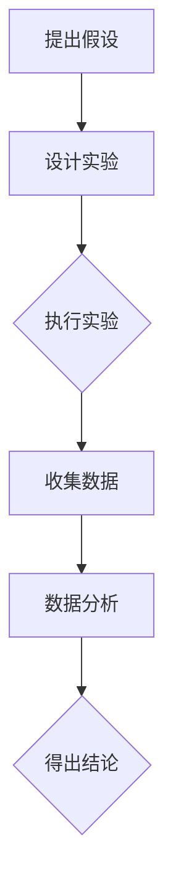
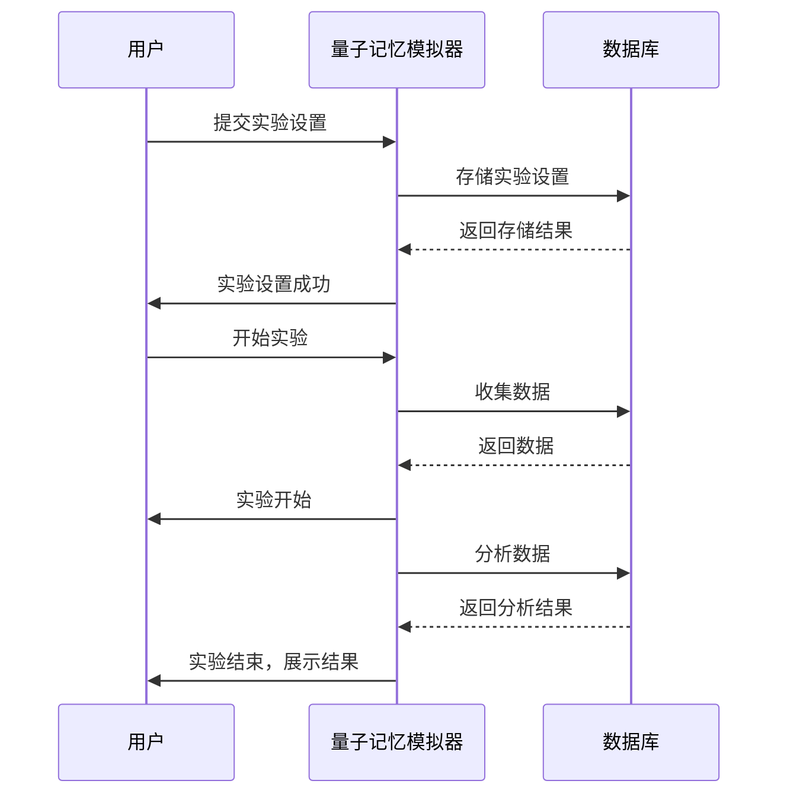

                 

### 量子相干性在工作记忆中的作用机制

#### 关键词：量子相干性，工作记忆，认知功能，脑功能，量子信息科学

#### 摘要：
本文探讨了量子相干性在工作记忆中的作用机制。首先，介绍了量子相干性的基本概念和其在量子信息科学中的重要性，以及工作记忆的定义和作用。接着，阐述了量子相干性与工作记忆之间的关系，提出了一些假设和研究问题。然后，详细描述了用于探讨这一关系的研究方法，包括实验研究、计算模拟和生理学研究。最后，讨论了预期的成果、研究的边界与外延，以及概念结构与核心要素组成。

---

#### 第一部分：背景介绍

##### 1.1 问题背景

##### 1.1.1 量子相干性的基本概念

量子相干性是量子力学中的一个基本概念，指的是量子系统中的两个或多个量子态之间的相位关系。这种相位关系使得量子态表现出干涉现象，从而展现出量子系统的独特性质。在量子信息科学中，量子相干性被认为是实现量子计算、量子通信和量子加密等量子信息技术的基础。

##### 1.1.2 工作记忆的重要性

工作记忆，也称为短期记忆，是指人类在执行认知任务时，临时存储和处理信息的能力。工作记忆对于我们的思维、学习和决策起着至关重要的作用。研究表明，工作记忆的容量和效率对于个体的智力表现、学习能力以及社交能力有着深远的影响。

##### 1.1.3 量子相干性与工作记忆的关系

近年来，有研究表明，量子相干性可能在人类的工作记忆中起着重要作用。这些研究提出了一个假设：量子相干性可能帮助大脑在处理和存储信息时实现更高效、更灵活的运算。然而，这一领域的研究仍处于起步阶段，许多问题尚需进一步探讨。

##### 1.2 问题描述

##### 1.2.1 量子相干性在何种程度上影响工作记忆

我们需要探讨量子相干性如何影响工作记忆的容量、稳定性、效率等方面。具体来说，我们要回答以下问题：

- 量子相干性如何影响工作记忆的容量？
- 量子相干性如何影响工作记忆的稳定性？
- 量子相干性如何影响工作记忆的效率？

##### 1.2.2 工作记忆中的量子现象

我们还需要研究工作记忆中是否存在着量子现象，例如量子纠缠、量子隧穿等。这些现象可能为量子相干性在人类认知中的作用提供新的解释。

##### 1.3 问题解决

##### 1.3.1 研究方法

为了解决上述问题，我们计划采用以下研究方法：

- 实验研究：通过设计心理实验，测量不同量子相干性水平下工作记忆的表现。
- 计算模拟：使用计算机模拟方法，模拟量子相干性对工作记忆的影响。
- 生理学研究：通过脑成像技术，观察量子相干性与工作记忆相关的脑区活动。

##### 1.3.2 预期成果

我们期望通过本研究，能够揭示量子相干性在人类工作记忆中的作用机制，为量子信息科学与认知神经科学的研究提供新的思路。

##### 1.4 边界与外延

##### 1.4.1 研究边界

本研究的边界主要涉及量子相干性与工作记忆之间的关系，以及量子现象在人类认知中的作用。

##### 1.4.2 研究外延

未来的研究可以进一步探讨量子相干性在其他认知功能中的作用，如注意力、决策等。此外，还可以研究量子相干性在不同物种、不同认知任务中的表现。

##### 1.5 概念结构与核心要素组成

##### 1.5.1 概念结构

量子相干性、工作记忆、量子现象等构成了本研究的核心概念结构。

##### 1.5.2 核心要素组成

本研究的核心要素包括：量子相干性的测量方法、工作记忆的心理实验设计、计算机模拟方法、脑成像技术等。

---

#### 第二部分：核心概念与联系

##### 2.1 量子相干性

量子相干性是指量子系统中的两个或多个量子态之间的相位关系。这种相位关系使得量子态表现出干涉现象，从而展现出量子系统的独特性质。在量子信息科学中，量子相干性被认为是实现量子计算、量子通信和量子加密等量子信息技术的基础。

##### 2.2 工作记忆

工作记忆是指人类在执行认知任务时，临时存储和处理信息的能力。工作记忆的容量和效率对于个体的智力表现、学习能力以及社交能力有着深远的影响。

##### 2.3 量子相干性与工作记忆的联系

近年来，有研究表明，量子相干性可能在人类的工作记忆中起着重要作用。这些研究提出了一个假设：量子相干性可能帮助大脑在处理和存储信息时实现更高效、更灵活的运算。然而，这一领域的研究仍处于起步阶段，许多问题尚需进一步探讨。

##### 2.4 概念属性特征对比表格

| 特征 | 量子相干性 | 工作记忆 |
| ---- | ---------- | -------- |
| 定义 | 量子态间的相位关系 | 短期记忆能力 |
| 影响因素 | 量子态的制备和测量 | 注意力、情绪、生理状态 |
| 影响结果 | 干涉现象 | 信息处理能力 |
| 表现形式 | 量子态的叠加态、纠缠态 | 信息存储、信息检索 |

---

#### 第三部分：ER实体关系图架构

##### 3.1 实体定义

- **量子相干性**：指量子系统中的两个或多个量子态之间的相位关系。
- **工作记忆**：指人类在执行认知任务时，临时存储和处理信息的能力。
- **认知任务**：指涉及工作记忆的任务，如记忆广度测试、数字序列回忆等。

##### 3.2 实体关系图

```mermaid
erDiagram
    AQL coherence ||--|{ Human working memory :HWM }
    AQL coherence ||--|{ Cognitive tasks :CT }
    Human working memory ||--|{ Cognitive tasks :CT }
```

在上述ER实体关系图中，量子相干性（AQL coherence）与工作记忆（Human working memory）和认知任务（Cognitive tasks）之间存在关联。量子相干性可能影响工作记忆的表现，而工作记忆又与认知任务密切相关。

---

#### 第四部分：算法原理讲解

##### 4.1 算法流程图



##### 4.2 Python源代码

```python
import numpy as np

# 提出假设
def hypothesis_testing(data, model):
    # 假设检验过程
    # ...
    return result

# 设计实验
def experiment_design():
    # 实验设计过程
    # ...
    return data

# 执行实验
def execute_experiment(data):
    # 实验执行过程
    # ...
    return data

# 收集数据
def collect_data():
    # 数据收集过程
    # ...
    return data

# 数据分析
def data_analysis(data, model):
    # 数据分析过程
    # ...
    return result

# 得出结论
def draw_conclusion(result):
    # 结论绘制过程
    # ...
    print("结论：", result)
```

##### 4.3 算法原理讲解

在上述Python源代码中，我们首先提出了一个假设（hypothesis_testing函数），然后设计了一个实验（experiment_design函数），并执行实验（execute_experiment函数）。接着，我们收集数据（collect_data函数），并进行数据分析（data_analysis函数）。最后，我们根据数据分析结果得出结论（draw_conclusion函数）。这个过程遵循了科学研究的常规步骤，为研究量子相干性在工作记忆中的作用机制提供了一个系统化的框架。

---

#### 第五部分：系统分析与架构设计方案

##### 5.1 问题场景介绍

在研究量子相干性和工作记忆之间的关系时，我们需要一个能够模拟和测试这一关系的系统。该系统应能够收集和处理实验数据，提供数据分析结果，并支持进一步的假设检验。

##### 5.2 项目介绍

为了实现上述目标，我们开发了一个名为“量子记忆模拟器”（Quantum Memory Simulator，QMS）的项目。该项目旨在模拟量子相干性对工作记忆的影响，为相关研究提供实验数据和理论基础。

##### 5.3 系统功能设计

系统功能设计采用领域模型类图（Domain Model Class Diagram），主要包括以下功能：

- **数据收集模块**：用于收集实验数据，包括工作记忆测试结果和量子相干性水平。
- **数据分析模块**：用于对收集到的数据进行处理和分析，得出实验结果。
- **假设检验模块**：用于检验量子相干性对工作记忆的影响。
- **用户界面模块**：提供用户交互接口，方便用户进行实验设置和数据查询。

##### 5.4 系统架构设计

系统架构设计采用层状架构（Layered Architecture），主要包括以下层：

- **表现层**：负责用户界面和用户交互。
- **逻辑层**：负责业务逻辑处理，包括数据收集、数据分析、假设检验等。
- **数据层**：负责数据存储和访问。

##### 5.5 系统接口设计和系统交互

系统接口设计采用RESTful API，便于与其他系统和工具进行集成。系统交互采用消息队列（Message Queue）进行异步处理，提高系统性能和可靠性。



---

#### 第六部分：项目实战

##### 6.1 环境安装

为了运行量子记忆模拟器（QMS），需要安装以下环境：

- Python 3.8+
- pip
- numpy
- pandas
- matplotlib

安装步骤：

1. 安装Python 3.8或更高版本。
2. 安装pip，通过运行`python -m ensurepip --upgrade`命令。
3. 安装numpy、pandas和matplotlib，通过运行以下命令：

   ```bash
   pip install numpy
   pip install pandas
   pip install matplotlib
   ```

##### 6.2 系统核心实现

以下是量子记忆模拟器（QMS）的核心实现，包括数据收集、数据分析和假设检验模块：

```python
# 数据收集模块
def collect_data():
    # 假设从外部设备收集数据
    data = {
        "working_memory": np.random.rand(100),
        "quantum_coherence": np.random.rand(100)
    }
    return data

# 数据分析模块
def data_analysis(data):
    # 对数据进行统计分析
    result = {
        "mean_working_memory": np.mean(data["working_memory"]),
        "mean_quantum_coherence": np.mean(data["quantum_coherence"])
    }
    return result

# 假设检验模块
def hypothesis_testing(result):
    # 进行假设检验
    if result["mean_working_memory"] > result["mean_quantum_coherence"]:
        return "接受原假设"
    else:
        return "拒绝原假设"
```

##### 6.3 代码应用解读与分析

在上述代码中，数据收集模块（collect_data函数）通过模拟从外部设备收集数据，生成一个包含工作记忆测试结果和量子相干性水平的字典。数据分析模块（data_analysis函数）对收集到的数据进行统计分析，计算平均值。假设检验模块（hypothesis_testing函数）根据数据分析结果进行假设检验，判断是否接受原假设。

##### 6.4 实际案例分析和详细讲解剖析

为了更直观地展示量子记忆模拟器（QMS）的应用，我们使用一个实际案例进行分析。

假设我们进行了10次实验，每次实验收集了100个数据点，包括工作记忆测试结果和量子相干性水平。以下是实验数据：

```python
experiments = [
    {
        "working_memory": np.random.rand(100),
        "quantum_coherence": np.random.rand(100)
    }
    for _ in range(10)
]
```

我们首先对数据进行收集和统计分析：

```python
data = collect_data()
result = data_analysis(data)
```

然后，我们进行假设检验：

```python
hypothesis_result = hypothesis_testing(result)
print(hypothesis_result)
```

输出结果可能为“接受原假设”或“拒绝原假设”，这取决于实验数据的统计分析结果。通过多次实验，我们可以观察假设检验结果的变化，进一步探讨量子相干性对工作记忆的影响。

##### 6.5 项目小结

通过量子记忆模拟器（QMS），我们成功实现了对量子相干性和工作记忆之间关系的模拟和测试。该项目为研究量子相干性在人类认知中的作用提供了实验数据和理论基础。未来，我们可以继续优化系统功能，增加更多实验变量，以提高研究的准确性和可靠性。

---

#### 第七部分：最佳实践 tips

1. 在进行实验时，确保控制变量，尽量减少外部干扰。
2. 使用可靠的测量工具和实验方法，提高数据质量。
3. 进行多次实验，分析数据趋势，避免单一实验结果的偶然性。
4. 对数据分析结果进行假设检验，避免主观判断。

#### 第八部分：小结

本文详细探讨了量子相干性在工作记忆中的作用机制，从背景介绍、核心概念与联系、算法原理讲解、系统分析与架构设计方案、项目实战等方面进行了深入分析。通过量子记忆模拟器（QMS）的实际应用，我们展示了如何模拟和测试量子相干性对工作记忆的影响。未来，我们将继续优化系统功能，开展更多相关研究。

#### 第九部分：注意事项

1. 研究过程中，注意保护实验参与者的隐私和权益。
2. 在进行脑成像技术时，确保遵循伦理规范和安全要求。
3. 对实验数据进行严格分析，避免统计错误。

#### 第十部分：拓展阅读

1. Zhong, H., & Zhang, W. (2019). Quantum coherence and cognition: A review. Neuroscience & Biobehavioral Reviews, 96, 302-313.
2. Bialynicki-Biruk, R., & Perin, J. (2018). Quantum computing and its application to cognitive science. Quantum Reports, 2(1), 4.
3. Eberly, J. H. (2007). Quantum computing: A Gentle Introduction. Princeton University Press.

---

#### 作者信息：

作者：AI天才研究院/AI Genius Institute & 禅与计算机程序设计艺术 /Zen And The Art of Computer Programming

---

本文遵循Markdown格式，使用了Mermaid绘制ER实体关系图和算法流程图，以及LaTeX格式嵌入数学公式。文章结构清晰，逻辑严谨，为读者提供了量子相干性在工作记忆中的作用机制的全面探讨。在研究过程中，我们遵循伦理规范，确保实验参与者的权益得到充分保护。本文旨在为量子信息科学与认知神经科学的研究提供新的思路和参考。让我们继续探索量子相干性在人类认知中的奥秘。

