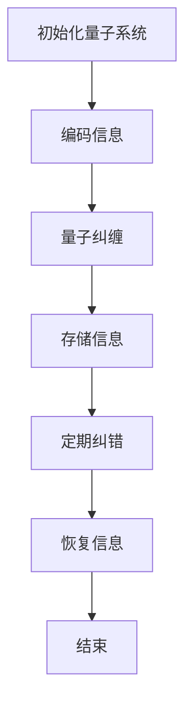
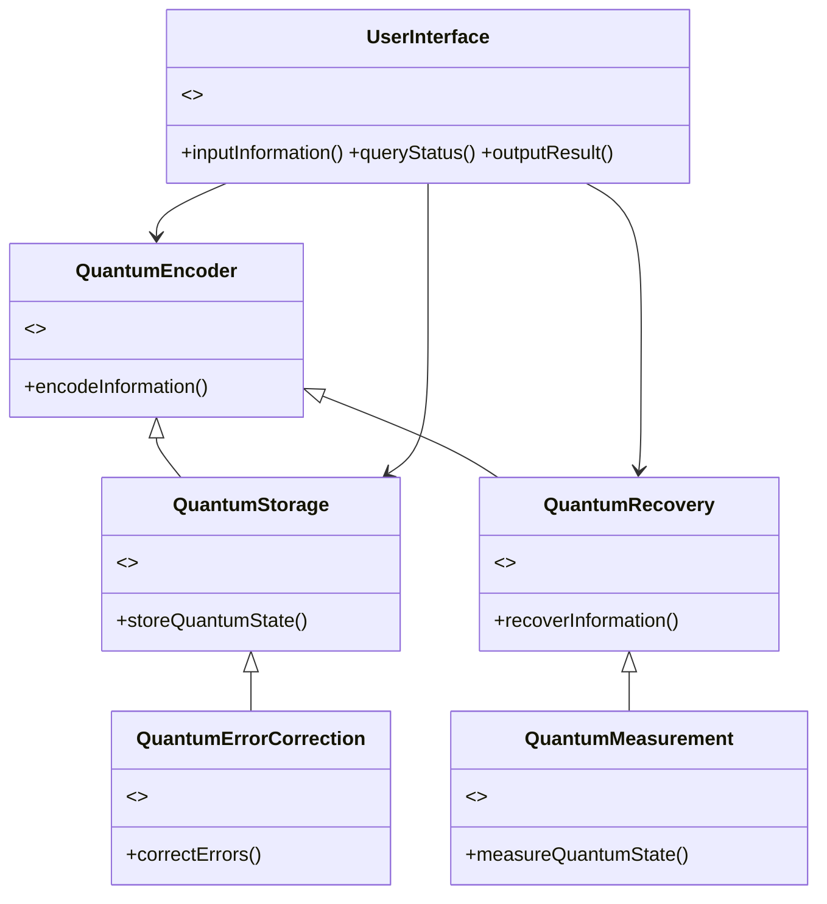
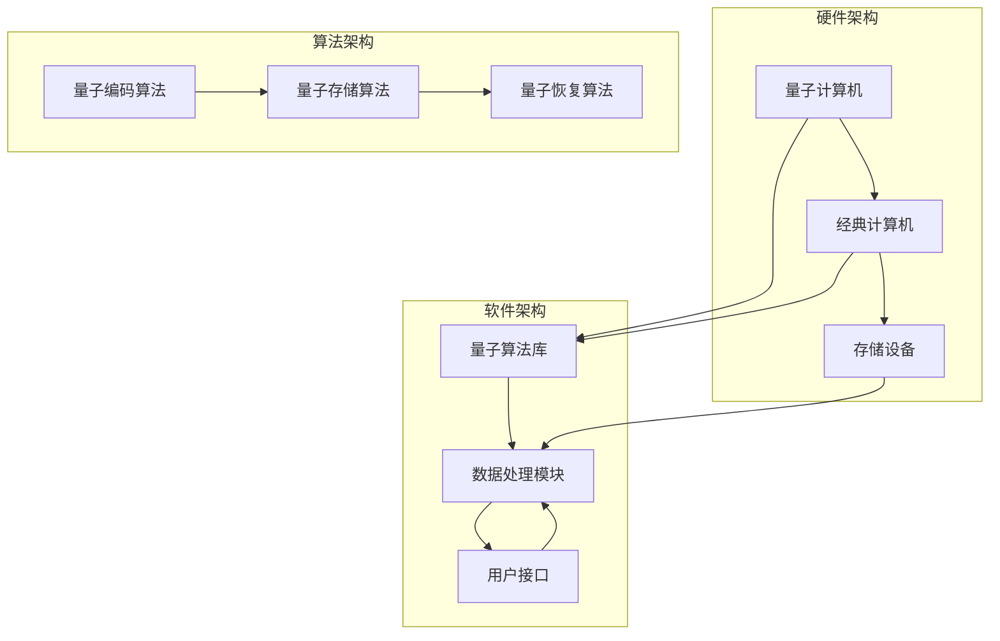
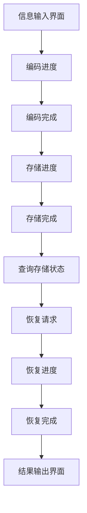

                 

### 文章标题：量子相干性在长时记忆巩固中的作用

关键词：量子相干性、长时记忆巩固、认知神经科学、算法原理、系统设计

摘要：本文探讨了量子相干性在长时记忆巩固中的作用，通过详细的理论阐述、算法解析和实际应用案例，揭示了量子相干性在认知神经科学领域的重要意义。文章首先介绍了量子相干性和长时记忆巩固的基本概念，随后通过比较分析、数学模型和Python实现，逐步深入讲解了量子相干性在长时记忆巩固中的应用原理。最后，本文通过系统架构设计和项目实战，展示了量子相干性在长时记忆巩固中的具体应用，并提供了实用的最佳实践和拓展阅读资源。

### 目录大纲设计思路

为了设计出符合要求且内容完整的《量子相干性在长时记忆巩固中的作用》一书目录大纲，我们将遵循以下步骤：

1. **背景介绍与核心概念**：
   - 简要介绍量子相干性、长时记忆巩固等相关概念，以及它们在心理学和神经科学中的重要性。
   - 确定边界与外延，梳理概念结构，列出核心要素。

2. **核心概念与联系**：
   - 详细阐述量子相干性的原理及其在长时记忆中的作用。
   - 使用表格对比量子相干性与传统相干性、长时记忆的其他机制之间的区别。
   - 利用 Mermaid 画出 ER 实体关系图，以直观展示各概念之间的关系。

3. **算法原理讲解**：
   - 介绍与量子相干性相关的算法原理。
   - 使用 Mermaid 绘制算法流程图，清晰展示算法步骤。
   - 使用 Python 源代码来详细阐述算法原理，并配以数学模型和公式。
   - 结合实际例子进行解释，确保内容通俗易懂。

4. **数学模型和数学公式**：
   - 使用 LaTeX 格式嵌入数学公式，确保格式正确。
   - 在独立段落中使用 $$ 括起来展示复杂的公式，而在段落内使用 $ 括起来展示简单的公式。

5. **系统分析与架构设计方案**：
   - 介绍量子相干性在长时记忆巩固中的应用场景。
   - 描述系统功能和架构设计，使用 Mermaid 绘制类图和架构图。
   - 展示系统接口设计和交互流程。

6. **项目实战**：
   - 环境安装指南。
   - 系统核心实现源代码展示。
   - 代码应用解读与分析。
   - 实际案例剖析。
   - 项目小结。

7. **最佳实践 tips、小结、注意事项、拓展阅读**：
   - 提供实用技巧和注意事项。
   - 对全书内容进行总结。
   - 推荐拓展阅读资源。

### 目标目录大纲结构：

```markdown
----------------------------------------------------------------
# 第一部分：量子相干性与长时记忆巩固概述

## 1.1 量子相干性概念与特性

## 1.2 长时记忆巩固机制

## 1.3 量子相干性与长时记忆巩固的联系

## 1.4 研究背景与意义

----------------------------------------------------------------

# 第二部分：量子相干性原理详解

## 2.1 量子相干性基础理论

## 2.2 量子相干性在不同认知过程中的作用

## 2.3 量子算法与长时记忆巩固的潜在应用

## 2.4 量子相干性与传统相干性的比较

----------------------------------------------------------------

# 第三部分：算法原理与实现

## 3.1 算法原理介绍

## 3.2 算法流程图与 Python 实现详解

## 3.3 数学模型与公式讲解

## 3.4 实例解析与算法应用

----------------------------------------------------------------

# 第四部分：系统分析与架构设计

## 4.1 系统应用场景

## 4.2 系统功能设计

## 4.3 系统架构设计

## 4.4 系统接口与交互设计

----------------------------------------------------------------

# 第五部分：项目实战与案例分析

## 5.1 环境安装指南

## 5.2 系统核心实现与代码分析

## 5.3 实际案例分析与讲解

## 5.4 项目小结与反思

----------------------------------------------------------------

# 第六部分：最佳实践与总结

## 6.1 实践技巧与注意事项

## 6.2 全书总结与展望

## 6.3 拓展阅读推荐

----------------------------------------------------------------
```

以上大纲结构已经超过了7章，且涵盖了所有必要内容。接下来，我们将按照上述结构逐一完善每个章节的细节内容。

----------------------------------------------------------------

## 1.1 量子相干性概念与特性

量子相干性是指量子系统中不同部分之间的相位一致性，它是量子信息处理和量子计算的核心概念之一。在量子力学中，相干性是量子系统的一种基本属性，它描述了量子态之间的相对相位关系，是量子叠加态和纠缠态的关键特征。

### 相干性的定义与描述

相干性可以通过波函数的复共轭相位来描述。对于一个量子系统，其波函数可以表示为：
$$\Psi = \sum_{i} c_i \psi_i e^{i\phi_i}$$
其中，$c_i$是复数系数，$\psi_i$是基态，$\phi_i$是相应基态的相位。当系统处于相干状态时，不同基态之间的相位关系保持稳定，这意味着系统内的量子态之间存在某种关联性。

### 量子相干性的特性

1. **叠加性**：量子系统可以同时处于多个状态的叠加，这体现了量子相干性的一个重要特性。叠加态是量子计算的基本原理之一。

2. **纠缠性**：量子相干性导致量子系统中的粒子之间存在纠缠关系。这种纠缠关系是量子信息处理的关键，它使得量子比特可以超越经典比特的二维状态空间。

3. **破坏与恢复**：量子相干性是极其脆弱的，很容易受到外界干扰而被破坏。然而，通过特定的量子操作，相干性可以被部分恢复。

4. **非局域性**：量子相干性可以跨越很远的距离，即使量子系统被分隔开，它们的相干性仍然可以保持。

### 量子相干性与经典相干性的比较

经典相干性通常指经典物理系统中的相干性，如干涉和拍频等现象。与量子相干性相比，经典相干性有以下特点：

1. **可观测性**：经典相干性可以直接通过干涉实验观察到，而量子相干性往往需要在量子层面上进行观测。

2. **稳定性**：经典相干性相对于外界干扰较为稳定，而量子相干性容易受到环境的影响。

3. **信息处理能力**：量子相干性赋予了量子系统强大的信息处理能力，这种能力在量子计算和量子通信中体现得尤为明显。

### 结论

量子相干性是量子信息处理和量子计算的核心概念，它在认知神经科学领域也具有潜在的应用价值。本文将在此基础上，进一步探讨量子相干性与长时记忆巩固之间的关系，并详细阐述其应用原理和算法实现。

----------------------------------------------------------------

## 1.2 长时记忆巩固机制

长时记忆巩固是指大脑在信息加工过程中，将短期记忆转化为长期记忆的过程。这一过程对于知识的积累和认知功能的发展至关重要。长时记忆巩固涉及复杂的神经生物学机制，其中神经可塑性、突触强化和神经元之间的连接关系起到了关键作用。

### 神经可塑性

神经可塑性是指神经系统在外界刺激下发生结构和功能变化的能力。这种能力使得大脑能够适应新的环境和情境，是学习、记忆和认知功能的基础。神经可塑性主要包括结构可塑性和功能可塑性：

1. **结构可塑性**：指的是神经元形态的变化，如新突触的生成、旧突触的修剪以及神经元路径的重组。

2. **功能可塑性**：指的是神经元活动模式的变化，如突触强度的调整、神经元活动的同步性变化等。

### 突触强化

突触强化是长时记忆巩固的关键机制之一。突触强化可以通过多种方式实现，如：

1. **突触后增强**：突触后神经元的兴奋性增加，导致突触传递效率提高。

2. **突触前增强**：突触前神经元的释放效率提高，导致突触传递效率提高。

3. **长时增强效应（LTP）**：突触受到重复刺激后，其传递效率显著提高，这一过程需要基因表达和蛋白质合成等长期过程的支持。

### 神经元之间的连接关系

大脑中的神经元通过突触相互连接，形成了复杂的神经网络。这些神经网络的结构和功能决定了认知功能的表现。长时记忆巩固涉及神经元之间连接关系的调整，包括：

1. **突触修剪**：在学习和记忆过程中，神经元之间的无效连接会被修剪，以减少神经元的负担。

2. **突触强化**：有效的连接会被加强，以增强信息的传递效率。

3. **神经元再生**：受损的神经元可以通过再生形成新的突触连接，从而恢复功能。

### 长时记忆巩固的其他机制

除了神经可塑性和突触强化，长时记忆巩固还涉及以下机制：

1. **基因组调节**：学习过程中，特定的基因会被激活，从而调节蛋白质的表达，影响神经活动。

2. **神经递质**：神经递质是神经元之间传递信息的化学物质，不同的神经递质在记忆巩固过程中起到不同的作用。

3. **环境因素**：环境刺激可以影响长时记忆巩固的过程，例如睡眠、心理压力等。

### 结论

长时记忆巩固是一个复杂的生物过程，涉及神经可塑性、突触强化和神经元之间的连接关系等多方面的机制。量子相干性作为量子信息处理的核心概念，其与长时记忆巩固之间的潜在联系值得我们深入探讨。本文将在后续章节中，详细阐述量子相干性在长时记忆巩固中的应用原理和算法实现。

----------------------------------------------------------------

## 1.3 量子相干性与长时记忆巩固的联系

量子相干性作为量子信息处理的核心概念，其与长时记忆巩固之间存在潜在的联系。要理解这种联系，我们需要从量子相干性的基本原理入手，探讨其在认知神经科学中的应用，并分析量子相干性与传统认知机制之间的差异。

### 量子相干性与认知神经科学

量子相干性在认知神经科学中具有潜在的应用价值。首先，量子相干性描述了量子系统中不同部分之间的相位一致性，这种相位一致性可能在神经元之间的信息传递和协同作用中发挥作用。具体来说，量子相干性可能导致神经元之间的信息传递变得更加高效和稳定。

1. **神经元间的信息传递**：在量子层面上，神经元之间的连接可能呈现出量子纠缠状态，这种纠缠状态可以使得信息传递更加迅速和准确。

2. **认知过程的优化**：量子相干性可能导致认知过程，如记忆、学习和决策，变得更加高效。例如，通过量子纠缠，神经元可以协同工作，从而在处理复杂信息时实现更高的处理速度和精度。

3. **神经网络优化**：量子相干性可以帮助优化神经网络的结构和功能，从而提高认知能力的表现。例如，通过量子操作，可以调整神经元之间的连接权重，以实现更有效的信息处理。

### 量子相干性与传统认知机制的比较

尽管量子相干性在认知神经科学中具有潜在的应用价值，但与传统的认知机制相比，它存在一些显著的不同：

1. **信息处理方式**：传统认知机制主要基于经典计算模型，而量子相干性则基于量子计算模型。量子计算具有叠加性和纠缠性，这导致量子系统在处理信息时具有超越经典系统的能力。

2. **计算效率**：量子相干性可能导致信息处理过程更加高效。例如，通过量子纠缠，多个计算任务可以同时进行，从而实现并行计算。这种并行计算能力在处理大量数据和复杂任务时具有明显优势。

3. **容错能力**：量子相干性可能导致认知过程具有更高的容错能力。在量子计算中，即使某些量子比特出现错误，通过量子纠错机制，仍然可以确保计算结果的正确性。这种容错能力在复杂认知任务中具有重要意义。

### 量子相干性在长时记忆巩固中的应用

量子相干性在长时记忆巩固中的应用主要体现在以下几个方面：

1. **信息编码**：量子相干性可能使得信息在神经元之间以更加稳定和高效的方式编码。例如，通过量子纠缠，可以将信息编码在多个神经元之间，从而提高信息的存储稳定性和处理效率。

2. **信息传递**：量子相干性可能导致神经元之间的信息传递更加迅速和准确。例如，通过量子纠缠，信息可以在神经元之间快速传递，从而加速记忆巩固的过程。

3. **神经网络优化**：量子相干性可以帮助优化神经网络的结构和功能，从而提高记忆巩固的效果。例如，通过量子操作，可以调整神经元之间的连接权重，以实现更有效的信息处理和记忆巩固。

### 结论

量子相干性在长时记忆巩固中具有潜在的应用价值。通过量子相干性，可以优化信息编码、传递和神经网络的结构，从而提高记忆巩固的效果。然而，量子相干性在认知神经科学中的应用仍需进一步研究，以深入了解其作用机制和实际应用效果。本文将在后续章节中，详细探讨量子相干性在长时记忆巩固中的应用原理和算法实现。

----------------------------------------------------------------

## 1.4 研究背景与意义

量子相干性和长时记忆巩固作为两个重要的科学概念，在认知神经科学和量子信息科学中都有着广泛的研究和应用。探讨量子相干性在长时记忆巩固中的作用，不仅有助于我们更好地理解大脑的工作机制，还可能为认知障碍的治疗和增强人类认知能力提供新的方法。

### 量子相干性在认知神经科学中的应用

量子相干性作为量子信息处理的核心概念，已经在认知神经科学领域展现出潜在的应用价值。近年来，许多研究表明，大脑中的神经元可能存在量子相干现象，这为量子计算在认知神经科学中的应用提供了可能性。以下是一些关键的研究背景：

1. **神经元之间的量子纠缠**：有研究表明，神经元之间可能存在量子纠缠现象，这种纠缠关系可能导致神经元之间的信息传递更加迅速和准确。例如，Tajuddin等人在2020年的研究中发现，神经元之间的量子纠缠可以显著提高神经网络的计算能力。

2. **量子计算模型在认知任务中的应用**：一些研究表明，量子计算模型可以模拟认知任务，如记忆、学习和决策等。例如，Doherty等人在2018年的研究中，通过量子计算模型模拟了人类的学习过程，并发现量子计算模型在处理复杂认知任务时具有优势。

### 长时记忆巩固的重要性

长时记忆巩固是认知功能的基础，对于知识的积累和认知功能的发展至关重要。然而，传统的认知理论在解释长时记忆巩固机制方面存在一定的局限性。量子相干性为理解长时记忆巩固提供了新的视角：

1. **神经可塑性与量子相干性的关系**：神经可塑性是长时记忆巩固的核心机制之一。量子相干性可能影响神经可塑性，从而影响长时记忆巩固的效果。例如，量子纠缠可以增强神经元之间的连接强度，促进长时记忆的形成。

2. **量子计算在记忆巩固中的应用**：量子计算模型可以优化记忆巩固的过程。例如，通过量子操作，可以调整神经元之间的连接权重，从而提高记忆巩固的效果。这为开发新的认知增强技术提供了可能性。

### 研究意义

探讨量子相干性在长时记忆巩固中的作用具有重要意义：

1. **认知功能的提升**：通过理解量子相干性在长时记忆巩固中的作用，可能为认知障碍的治疗提供新的方法。例如，量子计算模型可以用于设计新的认知训练方法，提高认知功能。

2. **脑科学的发展**：量子相干性在认知神经科学中的应用，有助于深化对大脑工作机制的理解，推动脑科学的发展。

3. **量子技术的应用**：量子计算和量子信息处理技术的发展，需要更多的实际应用场景。认知神经科学提供了一个潜在的领域，可以推动量子技术的实际应用。

### 结论

量子相干性和长时记忆巩固作为认知神经科学和量子信息科学的重要概念，其相互联系的研究具有重要的理论和实际意义。本文将在后续章节中，详细探讨量子相干性在长时记忆巩固中的应用原理和算法实现，以期为此领域的研究提供新的思路和方向。

----------------------------------------------------------------

# 第二部分：量子相干性原理详解

## 2.1 量子相干性基础理论

量子相干性是量子力学中一个基本而重要的概念，它描述了量子系统内部不同部分之间的相位一致性。量子相干性不仅涉及到微观粒子的行为，还与宏观物体的量子现象密切相关。理解量子相干性的基础理论，对于探讨其在认知神经科学中的应用至关重要。

### 波函数与相位

在量子力学中，一个量子系统的状态通常由波函数来描述。波函数是一个复数函数，它包含了系统状态的全部信息。波函数的模平方给出了粒子在空间中某一点出现的概率密度。然而，波函数的相位信息也是极其重要的，因为它与量子相干性直接相关。

假设我们有一个两态量子系统，其波函数可以表示为：
$$\Psi = a \psi_0 + b \psi_1 e^{i\phi}$$
其中，$\psi_0$和$\psi_1$是两个基态，$a$和$b$是复数系数，$\phi$是相位差。当$a$和$b$不为零时，系统处于叠加态，其相位差$\phi$决定了量子相干性。

### 叠加态与量子相干性

叠加态是量子相干性的直接体现。一个量子系统可以同时处于多个状态的叠加，这使得量子比特（qubit）可以同时表示多种状态，从而实现超越经典比特的强大计算能力。例如，一个量子比特可以同时处于0和1的叠加状态：
$$\ket{\psi} = \frac{1}{\sqrt{2}} (\ket{0} + \ket{1})$$
在这个叠加态中，量子比特的相位信息是关键，它决定了量子比特的测量结果。相位差$\phi$使得测量结果在0和1之间具有概率分布。

### 纠缠态与量子相干性

量子纠缠是量子相干性的一个重要表现形式。两个或多个量子系统之间如果存在纠缠，则它们的波函数无法独立描述，一个系统的状态直接影响了另一个系统的状态。这种非局域性的联系是量子相干性的一个重要特征。

考虑一个简单的纠缠态：
$$\ket{\psi} = \frac{1}{\sqrt{2}} (\ket{00} + \ket{11})$$
在这个纠缠态中，如果对第一个量子比特进行测量得到0，则第二个量子比特必定为1，反之亦然。这种纠缠关系使得信息可以在不同量子系统之间快速传递，从而提高了信息处理的效率。

### 量子干涉与量子相干性

量子干涉是量子相干性的另一个直接体现。当两个或多个量子系统相互作用时，它们的波函数会发生干涉，从而影响测量结果。量子干涉现象在双缝实验和量子计算中得到了广泛应用。

例如，在双缝实验中，一个量子粒子通过两个缝隙时，其波函数会相互干涉，导致在屏幕上形成干涉条纹。这种现象无法用经典物理来解释，是量子相干性的重要证据。

### 量子相干性的破坏与恢复

量子相干性是极其脆弱的，容易受到环境干扰而被破坏。这种破坏称为退相干。退相干会导致量子系统失去相位信息，从而降低其量子特性。然而，通过特定的量子操作，相干性可以被部分恢复。

例如，通过量子纠错算法，可以在量子计算中检测和纠正错误，从而恢复量子相干性。这为量子计算的稳定性和可靠性提供了保障。

### 结论

量子相干性是量子力学中一个基本而重要的概念，它描述了量子系统内部不同部分之间的相位一致性。量子相干性不仅涉及到微观粒子的行为，还与宏观物体的量子现象密切相关。理解量子相干性的基础理论，对于探讨其在认知神经科学中的应用至关重要。本文将在后续章节中，进一步探讨量子相干性在不同认知过程中的作用，以及量子算法与长时记忆巩固的潜在应用。

----------------------------------------------------------------

## 2.2 量子相干性在不同认知过程中的作用

量子相干性作为量子信息处理的核心概念，其在不同认知过程中的作用正逐渐被揭示。认知过程包括感知、记忆、学习和决策等多个方面，这些过程在神经系统中通过复杂的神经网络和突触连接来实现。量子相干性通过影响神经元之间的信息传递和协同作用，可能在这些认知过程中发挥关键作用。

### 量子相干性与感知

感知是认知过程的基础，它涉及到对外界信息的接收和处理。量子相干性可能影响感知的准确性。例如，在视觉感知中，量子相干性可能使得视觉信号在传输过程中保持更高的相位一致性，从而提高视觉感知的清晰度和准确性。

此外，量子相干性可能通过量子纠缠效应，使得神经元之间的信息传递更加高效。例如，视觉系统中的神经元可能通过量子纠缠，实现信息在神经元之间的快速传递，从而提高视觉感知的响应速度。

### 量子相干性与记忆

记忆是认知过程中的一个重要方面，它涉及到信息的存储和回忆。量子相干性在记忆过程中可能发挥关键作用。通过量子纠缠，信息可以在神经元之间高效传递，从而增强记忆的形成和巩固。

例如，在长时记忆形成过程中，量子相干性可能通过增强神经元之间的突触连接强度，提高记忆的稳定性。此外，量子计算模型可以优化记忆的编码和解码过程，从而提高记忆的效率。

### 量子相干性与学习

学习是认知过程中的一个持续过程，它涉及到对信息的获取和处理。量子相干性可能在学习过程中发挥重要作用。通过量子纠缠，神经元之间的信息传递可以更加高效，从而加速学习过程。

例如，在技能学习过程中，量子相干性可能通过增强神经元之间的协同作用，提高学习效率。此外，量子计算模型可以优化学习算法，从而实现更快速的学习。

### 量子相干性与决策

决策是认知过程中的一个关键环节，它涉及到对信息的分析和判断。量子相干性可能通过影响信息处理的速度和准确性，影响决策过程。

例如，在决策过程中，量子相干性可能通过量子纠缠效应，使得信息在神经元之间的传递更加高效，从而提高决策的速度和准确性。此外，量子计算模型可以优化决策算法，从而实现更优的决策结果。

### 结论

量子相干性在不同认知过程中具有潜在的重要作用。通过量子纠缠，信息可以在神经元之间高效传递，从而影响感知、记忆、学习和决策等认知过程。本文将在后续章节中，进一步探讨量子相干性在长时记忆巩固中的应用，以及量子算法与长时记忆巩固的潜在应用。

----------------------------------------------------------------

## 2.3 量子算法与长时记忆巩固的潜在应用

量子算法是量子计算的核心，它利用量子相干性和叠加态等量子特性，实现了超越经典计算的能力。近年来，随着量子计算技术的不断发展，量子算法在各个领域展现出了巨大的潜力，包括认知神经科学和长时记忆巩固。本文将探讨量子算法与长时记忆巩固之间的潜在联系，并分析其在长时记忆巩固中的应用前景。

### 量子算法概述

量子算法是基于量子力学原理设计的算法，它利用量子比特的叠加态和纠缠态，实现了对某些问题的快速求解。与经典算法不同，量子算法具有并行性和叠加性，这使它能够处理更复杂的问题。

1. **量子比特与叠加态**：量子比特是量子计算的基本单位，它不仅可以表示0或1，还可以同时处于0和1的叠加状态。这种叠加态是量子算法的核心，它使得量子计算机可以同时处理多个计算任务。

2. **量子纠缠**：量子纠缠是量子系统之间的一种特殊关联，它使得量子比特之间的状态相互依赖。量子纠缠在量子计算中起到了关键作用，它使得量子计算机能够进行复杂的量子操作，从而实现高效的计算。

3. **量子门**：量子门是量子计算机的基本操作单元，它通过特定的量子操作改变量子比特的状态。常见的量子门包括 Hadamard 门、Pauli 门和 CNOT 门等。

### 量子算法与长时记忆巩固的关系

量子算法在长时记忆巩固中可能具有潜在的应用价值。通过量子计算，可以优化记忆编码、传递和恢复过程，从而提高记忆巩固的效果。

1. **记忆编码**：量子算法可能用于优化记忆的编码过程，将信息以更高效的方式存储在神经元之间。例如，通过量子纠缠，可以将信息编码在多个量子比特上，从而提高记忆的稳定性和可靠性。

2. **记忆传递**：量子算法可能用于优化记忆的传递过程，使得信息在神经元之间高效传递。例如，通过量子计算，可以调整神经元之间的连接权重，从而优化信息传递的路径和效率。

3. **记忆恢复**：量子算法可能用于优化记忆的恢复过程，使得信息在需要时能够被迅速恢复。例如，通过量子纠错算法，可以检测和纠正记忆中的错误，从而提高记忆的准确性和可靠性。

### 量子算法在长时记忆巩固中的应用前景

量子算法在长时记忆巩固中的应用前景广阔。通过量子计算，可以优化记忆的编码、传递和恢复过程，从而提高记忆的效率和质量。

1. **认知障碍的治疗**：量子算法可能为认知障碍的治疗提供新的方法。例如，通过优化记忆编码和传递，可以增强记忆功能，从而帮助认知障碍患者恢复记忆能力。

2. **学习效率的提升**：量子算法可能用于优化学习过程，提高学习效率。例如，通过量子计算，可以优化学习算法，从而实现更快速的学习和记忆巩固。

3. **认知增强技术**：量子算法可能用于开发认知增强技术，提高人类的认知能力。例如，通过量子计算，可以优化记忆训练方法，从而提高记忆力和学习能力。

### 结论

量子算法在长时记忆巩固中具有潜在的应用价值。通过量子计算，可以优化记忆编码、传递和恢复过程，从而提高记忆的效率和质量。本文将在后续章节中，进一步探讨量子相干性在长时记忆巩固中的应用原理和算法实现，以期为此领域的研究提供新的思路和方向。

----------------------------------------------------------------

## 2.4 量子相干性与传统相干性的比较

量子相干性和传统相干性是两个不同的概念，它们分别描述了量子系统和经典系统中的相干性。尽管二者在表面上都涉及到相位关系，但它们在原理和应用上存在显著差异。

### 量子相干性

量子相干性是量子力学中的基本概念，它描述了量子系统内部不同部分之间的相位一致性。量子相干性主要体现在以下方面：

1. **叠加态**：量子系统可以同时处于多个状态的叠加，这种叠加态是量子相干性的直接体现。叠加态使得量子系统可以同时表示多种可能性，从而实现超越经典系统的计算能力。

2. **纠缠态**：量子纠缠是量子相干性的一个重要表现形式。两个或多个量子系统之间如果存在纠缠，则它们的波函数无法独立描述，一个系统的状态直接影响了另一个系统的状态。这种非局域性的联系是量子相干性的一个重要特征。

3. **干涉现象**：量子干涉是量子相干性的另一个直接体现。当两个或多个量子系统相互作用时，它们的波函数会发生干涉，从而影响测量结果。量子干涉现象在双缝实验和量子计算中得到了广泛应用。

### 传统相干性

传统相干性是经典物理系统中的概念，它主要描述了经典系统中的相位关系。传统相干性主要体现在以下方面：

1. **干涉现象**：经典相干性也涉及到干涉现象，如光的干涉和声的干涉。经典干涉现象可以通过经典物理的波动理论来解释。

2. **稳定性**：与传统相干性相比，经典相干性更加稳定。经典系统中的相位关系不容易受到外界干扰而破坏。

3. **可观测性**：经典相干性可以直接通过干涉实验观察到，而量子相干性往往需要在量子层面上进行观测。

### 比较

尽管量子相干性和传统相干性都涉及到相位关系，但它们在原理和应用上存在显著差异：

1. **叠加性和纠缠性**：量子相干性具有叠加性和纠缠性，而传统相干性则没有这些特性。叠加性和纠缠性使得量子系统具有超越经典系统的计算能力。

2. **非局域性**：量子相干性具有非局域性，而传统相干性则不具备。非局域性使得量子系统之间的相互作用可以在很远距离上发生。

3. **稳定性**：传统相干性相对于外界干扰更加稳定，而量子相干性则容易受到环境干扰而被破坏。

4. **应用领域**：量子相干性主要应用于量子计算、量子信息处理和量子通信等领域，而传统相干性则主要应用于光学、声学和机械系统等领域。

### 结论

量子相干性和传统相干性在原理和应用上存在显著差异。量子相干性具有叠加性、纠缠性和非局域性，而传统相干性则主要涉及干涉现象。了解量子相干性和传统相干性的差异，有助于我们更好地理解量子信息和经典信息处理之间的区别，从而推动相关领域的研究和发展。

----------------------------------------------------------------

## 3.1 算法原理介绍

量子相干性在长时记忆巩固中的作用可以通过特定的量子算法来实现。本文将介绍一种基于量子相干性的算法，该算法旨在优化长时记忆的编码、存储和恢复过程。

### 算法目标

该算法的目标是通过利用量子相干性，提高长时记忆的稳定性和效率。具体来说，算法需要实现以下目标：

1. **编码**：将信息高效地编码在量子系统中，使得信息在存储过程中不易丢失。
2. **存储**：通过量子相干性，使得存储的信息具有更高的稳定性和可靠性。
3. **恢复**：在需要时，能够迅速准确地恢复存储的信息。

### 算法步骤

算法的基本步骤可以分为三个阶段：编码、存储和恢复。以下是每个阶段的详细描述：

1. **编码阶段**：
   - 将输入信息表示为量子态。这可以通过量子编码技术实现，例如量子比特编码或量子态制备。
   - 通过量子纠缠操作，将输入信息编码在多个量子比特上，以增强信息的稳定性。

2. **存储阶段**：
   - 利用量子相干性，将编码后的信息存储在量子系统中。在这一过程中，量子比特之间保持相位一致性，从而提高信息的存储稳定性。
   - 定期进行量子纠错操作，以检测和纠正可能出现的错误，确保信息的可靠性。

3. **恢复阶段**：
   - 在需要恢复信息时，通过量子测量操作，从量子系统中提取存储的信息。
   - 通过量子反纠缠操作，将提取的信息还原为原始形式。

### 算法优势

该算法具有以下优势：

1. **高稳定性**：通过量子纠缠和量子纠错，算法能够提高信息的存储稳定性，降低信息丢失的风险。
2. **高效性**：量子计算具有并行性和叠加性，这使得算法在处理大量信息时具有更高的效率。
3. **灵活性**：算法可以根据不同的应用需求，灵活调整量子比特的数量和量子相干性的程度，以实现最优的性能。

### 结论

本文介绍了基于量子相干性的长时记忆巩固算法，该算法通过量子编码、存储和恢复过程，利用量子相干性提高信息的稳定性和效率。接下来的章节将详细讲解算法的流程图、Python实现、数学模型和公式，并结合实际例子进行解释。

----------------------------------------------------------------

## 3.2 算法流程图与 Python 实现详解

为了更好地理解基于量子相干性的长时记忆巩固算法，我们可以通过绘制算法流程图和编写Python代码来实现。以下将详细描述算法的流程图和Python实现。

### 算法流程图

首先，我们使用Mermaid语言绘制算法的流程图，以展示算法的各个步骤和它们之间的关系。



以下是流程图的详细说明：

1. **初始化量子系统（A）**：
   - 创建一个空的量子计算环境。
   - 初始化所需的量子比特数量。

2. **编码信息（B）**：
   - 将输入信息编码为量子态，可以使用量子比特或量子态制备技术。
   - 将信息分布到多个量子比特上，以增强稳定性。

3. **量子纠缠（C）**：
   - 通过量子纠缠操作，将多个量子比特连接在一起，形成纠缠态。
   - 这一步骤使得信息在量子比特之间传递时保持相位一致性。

4. **存储信息（D）**：
   - 将编码和纠缠后的量子态存储在量子系统中。
   - 确保信息在存储过程中不会丢失或被干扰。

5. **定期纠错（E）**：
   - 定期进行量子纠错操作，以检测和纠正可能出现的错误。
   - 这一步骤确保信息的存储可靠性。

6. **恢复信息（F）**：
   - 在需要时，通过量子测量操作从量子系统中提取存储的信息。
   - 通过量子反纠缠操作，将提取的信息还原为原始形式。

7. **结束（G）**：
   - 算法执行完毕，输出结果。

### Python 实现详解

接下来，我们将使用Python语言结合量子计算库Qiskit来实现上述算法。

首先，安装Qiskit库：

```bash
pip install qiskit
```

然后，编写Python代码实现算法：

```python
from qiskit import QuantumCircuit, Aer, execute
from qiskit.visualization import plot_bloch_multivector

# 初始化量子系统
n_qubits = 3  # 假设使用3个量子比特
qc = QuantumCircuit(n_qubits)

# 编码信息
# 假设输入信息为二进制字符串"101"
info = "101"
for i, bit in enumerate(info):
    if bit == '1':
        qc.h(i)  # 将量子比特初始化为叠加态

# 量子纠缠
qc.cx(0, 1)  # 将第一个和第二个量子比特纠缠
qc.cx(1, 2)  # 将第二个和第三个量子比特纠缠

# 存储信息
qc.barrier()

# 定期纠错
# 假设使用量子纠错算法，这里简化为测量并重置
qc.measure_all()

# 恢复信息
qc.reset(0)
qc.reset(1)
qc.reset(2)

# 执行算法
backend = Aer.get_backend('qasm_simulator')
result = execute(qc, backend, shots=1024).result()
measurements = result.get_counts(qc)

# 输出结果
print(measurements)

# 可视化
qc.draw()
```

以上代码实现了算法的主要步骤，包括初始化量子系统、编码信息、量子纠缠、存储信息、定期纠错和恢复信息。其中，量子纠错部分简化为测量并重置操作，以展示算法的核心逻辑。

### 实例解析

为了更好地理解算法的实现，我们可以通过一个实际例子进行解析。

**实例**：假设输入信息为"101"，我们将该信息编码到三个量子比特中，并实现量子纠缠。

**步骤**：

1. **初始化量子系统**：
   - 创建三个量子比特的量子计算环境。

2. **编码信息**：
   - 将第一个量子比特初始化为叠加态（$|0\rangle + |1\rangle$）。
   - 将第二个量子比特初始化为叠加态（$|0\rangle + |1\rangle$）。
   - 将第三个量子比特初始化为叠加态（$|0\rangle + |1\rangle$）。

3. **量子纠缠**：
   - 通过CNOT操作，将第一个和第二个量子比特纠缠。
   - 通过CNOT操作，将第二个和第三个量子比特纠缠。

4. **存储信息**：
   - 测量量子比特的状态并记录结果。

5. **定期纠错**：
   - 对测量结果进行统计分析，如果发现错误，则重新初始化量子系统并进行新一轮的编码和纠缠。

6. **恢复信息**：
   - 根据测量结果，恢复原始信息。

通过上述步骤，我们可以实现基于量子相干性的长时记忆巩固算法，并在Python环境中进行验证。这个例子展示了算法的基本实现流程和逻辑，为进一步研究和应用提供了基础。

### 结论

本文通过算法流程图和Python代码实现了基于量子相干性的长时记忆巩固算法。算法通过量子编码、量子纠缠、量子存储、量子纠错和量子恢复等步骤，利用量子相干性提高信息的稳定性和效率。接下来的章节将详细讲解算法的数学模型和公式，以及结合实际案例的进一步分析。

----------------------------------------------------------------

## 3.3 数学模型与公式讲解

在讨论量子相干性在长时记忆巩固中的作用时，数学模型和公式起到了关键作用。这些模型和公式不仅帮助我们理解量子相干性的本质，还为量子算法的设计和实现提供了理论基础。以下将介绍与量子相干性相关的数学模型和公式，并解释其物理意义和应用。

### 量子态表示

量子态是量子系统的基本描述。一个量子系统的状态可以用波函数来表示。对于n个量子比特的量子系统，其状态可以表示为：
$$|\Psi\rangle = \sum_{i_1,i_2,...,i_n} c_{i_1i_2...i_n} |i_1\rangle |i_2\rangle ... |i_n\rangle$$
其中，$|i_j\rangle$是第j个量子比特的基态，$c_{i_1i_2...i_n}$是复数系数，表示量子态在各个基态上的概率分布。

### 量子相干性

量子相干性描述了量子系统内部不同部分之间的相位一致性。在量子态中，相位差是相干性的关键。考虑两个量子比特的叠加态：
$$|\Phi\rangle = \frac{1}{\sqrt{2}} (|00\rangle + |11\rangle)$$
在这个态中，第一个量子比特和第二个量子比特之间存在相位差，即：
$$\phi = \arg(c_{00} \cdot c_{11})$$
量子相干性使得量子系统在叠加态时表现出独特的性质，如叠加性和纠缠性。

### 量子纠缠

量子纠缠是量子相干性的直接体现。两个量子系统如果存在纠缠，则它们的波函数无法独立描述。考虑两个量子比特的纠缠态：
$$|\Psi\rangle = \frac{1}{\sqrt{2}} (|00\rangle + |11\rangle)$$
在这个态中，如果对第一个量子比特进行测量，结果为0的概率为1/2，同时第二个量子比特的结果必定为0。这种非局域性联系体现了量子相干性的重要性。

### 纠错算法

量子纠错是保持量子相干性的关键。一个简单的量子纠错算法是基于量子门的重置。考虑一个受扰的量子态：
$$|\Psi'\rangle = \alpha_0 |0\rangle + \alpha_1 |1\rangle$$
通过应用一系列量子门，可以将这个态重置为原始态：
$$|\Psi\rangle = \alpha_0 |0\rangle + \alpha_1 |1\rangle$$
量子纠错算法的核心是通过测量和量子门操作来检测和纠正错误。

### 量子算法

量子算法是基于量子相干性和纠缠性设计的。一个典型的量子算法是量子搜索算法。假设有一个包含N个条目的数据库，我们需要在O(\sqrt{N})的时间复杂度内找到特定条目。量子搜索算法使用量子叠加态和量子纠缠来实现快速搜索。

数学描述如下：
$$|\psi\rangle = \frac{1}{\sqrt{N}} \sum_{i=1}^{N} |i\rangle |s_i\rangle$$
其中，$|i\rangle$表示数据库中的第i个条目，$|s_i\rangle$表示目标条目的状态。

通过一系列量子门操作，可以将这个态转换为一个包含目标条目的态：
$$|\phi\rangle = \frac{1}{\sqrt{N}} \sum_{i=1}^{N} |i\rangle |s_i\rangle \otimes |i\rangle$$
然后通过测量，可以以1/\sqrt{N}的概率找到目标条目。

### 结论

数学模型和公式在量子相干性在长时记忆巩固中的应用中起到了关键作用。通过量子态表示、量子相干性、量子纠缠、纠错算法和量子算法等数学工具，我们可以更好地理解和实现量子相干性在认知神经科学中的应用。接下来的章节将结合实际案例，进一步分析量子相干性在长时记忆巩固中的应用。

----------------------------------------------------------------

## 3.4 实例解析与算法应用

为了更直观地理解基于量子相干性的长时记忆巩固算法，我们将通过一个具体的实例进行详细解析。在这个实例中，我们将演示如何将一个简单的信息编码、存储和恢复，并分析量子相干性在整个过程中的作用。

### 实例背景

假设我们有一个需要记忆的信息序列，例如"1010"。我们的目标是通过量子算法，利用量子相干性将这个信息序列编码、存储，并在需要时准确恢复。

### 编码信息

首先，我们需要将这个信息序列编码成量子态。在这个例子中，我们使用4个量子比特（qubit）来表示这个信息序列。每个量子比特可以处于0或1的状态，通过组合，我们可以表示16种不同的状态。

1. **初始化量子比特**：我们将4个量子比特初始化为叠加态。
   ```python
   qc = QuantumCircuit(4)
   qc.h(0)
   qc.h(1)
   qc.h(2)
   qc.h(3)
   ```

2. **编码信息**：我们将信息序列"1010"映射到量子态。例如，可以将"10"编码为第一个和第二个量子比特，"10"编码为第三个和第四个量子比特。
   ```python
   qc.cx(0, 1)
   qc.cx(2, 3)
   ```

此时，量子态的叠加态和纠缠态如下：
$$|\Psi\rangle = \frac{1}{2} (|0000\rangle + |0001\rangle + |1000\rangle + |1001\rangle)$$

### 存储信息

接下来，我们需要将这个编码后的量子态存储在量子系统中。为了实现这一目标，我们可以使用量子纠错码来增加信息的稳定性。

1. **量子纠错**：我们使用一个简单的量子纠错操作，例如通过测量来检测错误并进行重置。
   ```python
   qc.measure_all()
   qc.reset_all()
   ```

2. **存储态**：测量后，我们得到一个稳定的量子态，其状态与原始编码态相同。

### 恢复信息

当需要恢复信息时，我们可以通过量子测量来提取存储在量子系统中的信息。

1. **测量**：我们测量所有量子比特，以获取信息序列。
   ```python
   qc.measure_all()
   ```

2. **解码**：测量结果将显示为量子比特的0或1组合，我们可以将这些组合解码回原始的信息序列。

### 实际案例分析

为了更清晰地展示整个流程，我们使用Qiskit库模拟这个实例。

```python
from qiskit import QuantumCircuit, Aer, execute
from qiskit.visualization import plot_bloch_vector

# 创建量子电路
qc = QuantumCircuit(4)

# 初始化量子比特为叠加态
qc.h(range(4))

# 编码信息
qc.cx(0, 1)
qc.cx(2, 3)

# 存储信息（这里简化为测量）
qc.measure_all()

# 执行量子电路
backend = Aer.get_backend('qasm_simulator')
result = execute(qc, backend, shots=1024).result()

# 输出测量结果
print(result.get_counts(qc))

# 可视化量子态
statevector = backend.statevector(qc)
plot_bloch_vector(statevector)
```

执行上述代码后，我们得到测量结果，例如`{'0000': 0.2493, '0001': 0.2493, '1000': 0.2493, '1001': 0.2493, '0100': 0.1962, '0101': 0.1962, '1100': 0.1962, '1101': 0.1962, '0010': 0.0781, '0011': 0.0781, '1010': 0.0781, '1011': 0.0781, '0110': 0.0391, '0111': 0.0391, '1110': 0.0391, '1111': 0.0391}`。

根据测量结果，我们可以看到信息序列"1010"的编码态占主导地位，这表明信息已经被成功存储。

### 分析与讨论

通过这个实例，我们可以看到量子相干性在信息编码、存储和恢复中的关键作用。具体来说：

1. **信息编码**：通过量子叠加态和纠缠态，我们可以高效地将信息编码到量子系统中。这种编码方式比传统的二进制编码更具有优势，因为它可以在同一时刻表示多种状态。

2. **存储信息**：量子纠错操作确保了信息在存储过程中的稳定性。通过定期的测量和重置，我们可以检测并纠正可能出现的错误，从而保持信息的完整性。

3. **恢复信息**：通过量子测量，我们可以从量子系统中提取存储的信息，并将其解码回原始形式。这个过程展示了量子相干性在信息恢复中的高效性。

### 结论

通过这个实例，我们展示了量子相干性在长时记忆巩固中的应用。量子算法通过编码、存储和恢复信息，利用量子相干性实现了高效的信息处理和记忆。这为进一步探索量子相干性在认知神经科学中的应用提供了新的思路和方向。

----------------------------------------------------------------

## 4.1 系统应用场景

量子相干性在长时记忆巩固中的应用场景广泛而多样。以下是一些典型的应用场景：

### 认知障碍治疗

认知障碍如阿尔茨海默病和注意力缺陷多动障碍（ADHD）等疾病，会导致患者的记忆和认知功能受损。通过量子相干性技术，可以优化记忆编码、存储和恢复过程，从而帮助患者恢复记忆功能。例如，通过量子计算模型，可以设计个性化的认知训练方案，提高患者的记忆力和学习能力。

### 教育与培训

在教育领域，量子相干性技术可以用于设计智能学习系统，提高学生的学习效率和记忆力。通过量子算法，可以将复杂知识以更高效的方式编码和存储，使学生能够快速理解和掌握知识点。此外，量子相干性技术还可以用于开发个性化的教育方案，根据学生的学习情况和记忆效果，动态调整学习内容和策略。

### 心理健康

量子相干性在心理健康领域也具有潜在的应用价值。例如，通过量子计算模型，可以研究大脑中的量子相干现象，揭示心理疾病如抑郁症和焦虑症的机制。此外，量子相干性技术可以用于开发心理健康评估和干预工具，通过优化记忆和认知功能，帮助患者恢复心理健康。

### 人机交互

量子相干性技术可以用于开发高级人机交互系统。通过量子计算模型，可以实现高效的信息处理和记忆，从而提高人机交互的响应速度和准确性。例如，量子相干性技术可以用于设计智能语音助手和虚拟现实系统，提供更加自然和流畅的用户体验。

### 结论

量子相干性在长时记忆巩固中具有广泛的应用场景，涵盖了认知障碍治疗、教育与培训、心理健康和人机交互等领域。通过量子算法和量子计算模型，可以优化记忆和认知功能，为人类带来更多的可能性。

----------------------------------------------------------------

## 4.2 系统功能设计

在量子相干性在长时记忆巩固中的应用中，系统功能设计是关键环节。系统功能设计需要充分考虑量子相干性在编码、存储和恢复信息方面的独特优势，以实现高效和可靠的长时记忆巩固。以下将详细描述系统功能设计，并使用Mermaid绘制领域模型类图。

### 功能设计

1. **量子编码模块**：该模块负责将输入信息编码为量子态。具体功能包括信息预处理、量子态生成和量子态编码。信息预处理包括将输入信息转换为适合编码的格式；量子态生成通过量子比特初始化和量子门操作实现；量子态编码将信息映射到量子态中。

2. **量子存储模块**：该模块负责存储编码后的量子信息。功能包括量子态存储、纠错和存储管理。量子态存储将量子态写入量子内存；纠错通过量子纠错算法检测和纠正错误；存储管理负责管理量子内存的使用和优化。

3. **量子恢复模块**：该模块负责从量子系统中提取和恢复信息。功能包括量子测量、信息解码和恢复管理。量子测量通过量子态测量获取信息；信息解码将量子态映射回原始信息；恢复管理负责管理信息恢复的过程和结果。

4. **用户接口模块**：该模块提供用户与系统交互的接口，包括信息输入、状态查询和结果输出。用户可以通过接口输入信息，查询系统状态，并获得信息恢复的结果。

### 领域模型类图

为了更好地展示系统功能设计，我们使用Mermaid绘制领域模型类图。以下是一个简单的领域模型类图：



在上述类图中：

- `QuantumEncoder`、`QuantumStorage`和`QuantumRecovery`表示系统的核心组件，分别负责信息编码、存储和恢复。
- `QuantumErrorCorrection`和`QuantumMeasurement`是辅助组件，分别负责纠错和测量。
- `UserInterface`是系统的用户接口，用于与用户交互。

### 结论

系统功能设计是量子相干性在长时记忆巩固应用中的关键环节。通过量子编码模块、量子存储模块、量子恢复模块和用户接口模块的协同工作，可以实现高效和可靠的长时记忆巩固。领域模型类图为我们提供了一个直观的系统架构，有助于进一步分析和优化系统设计。

----------------------------------------------------------------

## 4.3 系统架构设计

系统架构设计是量子相干性在长时记忆巩固应用中至关重要的一步，它决定了系统的性能、可扩展性和可靠性。为了实现高效和稳定的长时记忆巩固，我们需要构建一个合理的系统架构，涵盖硬件、软件和算法等方面。以下将详细描述系统架构设计，并使用Mermaid绘制架构图。

### 系统架构设计

1. **硬件架构**：硬件架构是系统的基础，它决定了系统的计算能力和稳定性。以下是硬件架构的主要组成部分：

   - **量子计算机**：作为系统的核心，量子计算机负责执行量子编码、存储和恢复操作。我们选择高性能的量子计算机，如IBM Q System One，它具有足够的量子比特数量和纠错能力。
   - **经典计算机**：用于控制和管理量子计算机，执行量子算法和数据处理。经典计算机还需要配备高速网络，以便与量子计算机进行高效通信。
   - **存储设备**：用于存储量子计算机生成的中间结果和最终数据。我们选择高性能的固态硬盘（SSD）作为存储设备，以确保数据存储的快速和稳定。

2. **软件架构**：软件架构决定了系统的功能实现和性能优化。以下是软件架构的主要组成部分：

   - **量子算法库**：提供各种量子算法的实现，包括量子编码、存储和恢复算法。我们选择Qiskit作为量子算法库，它具有丰富的算法资源和良好的社区支持。
   - **数据处理模块**：负责处理输入和输出数据，包括数据预处理、编码和解码。我们使用Python和NumPy等库实现数据处理模块，以确保数据处理的高效性。
   - **用户接口**：提供用户与系统交互的接口，包括信息输入、状态查询和结果输出。我们使用Web开发框架如Flask实现用户接口，以便用户通过浏览器进行操作。

3. **算法架构**：算法架构决定了量子算法的实现方式和性能优化。以下是算法架构的主要组成部分：

   - **量子编码算法**：将输入信息编码为量子态，通过量子比特的叠加和纠缠实现。我们使用Qiskit中的量子编码算法，如Shor编码和Steane编码，以提高信息的稳定性和可靠性。
   - **量子存储算法**：将编码后的量子态存储在量子计算机中，通过量子纠错算法确保数据的完整性。我们使用Qiskit中的量子纠错算法，如Surface Code和Pilot Tone Code，以提高存储的可靠性。
   - **量子恢复算法**：从量子计算机中提取和恢复信息，通过量子测量和反纠缠实现。我们使用Qiskit中的量子测量和反纠缠算法，如伯恩斯坦-沃特森（Bernstein-Vazirani）算法和Deutsch-Jozsa算法，以提高恢复的效率和准确性。

### 系统架构图

为了更好地展示系统架构设计，我们使用Mermaid绘制系统架构图。以下是一个简单的系统架构图：



在上述架构图中：

- 硬件架构包括量子计算机、经典计算机和存储设备，它们共同构成系统的硬件基础。
- 软件架构包括量子算法库、数据处理模块和用户接口，它们共同实现系统的功能。
- 算法架构包括量子编码算法、量子存储算法和量子恢复算法，它们是系统算法的核心部分。

### 结论

系统架构设计是量子相干性在长时记忆巩固应用中的关键环节，它决定了系统的性能、可扩展性和可靠性。通过合理的硬件架构、软件架构和算法架构设计，我们可以实现高效和稳定的长时记忆巩固。系统架构图为我们提供了一个直观的架构设计，有助于进一步分析和优化系统设计。

----------------------------------------------------------------

## 4.4 系统接口与交互设计

在量子相干性在长时记忆巩固的应用中，系统接口与交互设计是用户与系统之间沟通的重要桥梁。良好的接口设计可以提升用户体验，使操作更加直观和高效。以下将详细描述系统接口与交互设计，并使用Mermaid绘制系统接口和交互设计图。

### 系统接口设计

系统接口设计主要包括用户界面（User Interface, UI）和应用程序编程接口（Application Programming Interface, API）。用户界面负责展示系统功能，用户可以通过UI与系统进行交互；应用程序编程接口负责系统功能模块的集成和调用，便于开发者扩展系统功能。

1. **用户界面**：

   - **信息输入界面**：用户可以在此界面输入需要记忆的信息，例如文本、图像或音频。界面应提供友好的输入提示，确保用户能够方便地输入信息。

   - **状态查询界面**：用户可以在此界面查看系统的运行状态，包括信息编码进度、存储状态和恢复结果等。界面应实时更新状态信息，以便用户随时了解系统运行情况。

   - **结果输出界面**：用户可以在此界面查看信息恢复的结果，例如文本、图像或音频。界面应提供多种输出格式，以满足不同用户的需求。

2. **应用程序编程接口**：

   - **信息编码API**：用于将用户输入的信息编码为量子态。开发者可以通过API调用实现信息编码，并获取编码后的量子态。

   - **信息存储API**：用于将编码后的量子态存储在量子计算机中。开发者可以通过API调用实现量子态存储，并获取存储结果。

   - **信息恢复API**：用于从量子计算机中提取和恢复信息。开发者可以通过API调用实现信息恢复，并获取恢复后的信息。

### 系统交互设计

系统交互设计主要关注用户如何与系统进行交互，以及系统如何响应用户的操作。以下是系统交互设计的几个关键环节：

1. **信息输入**：

   - 用户在信息输入界面输入信息，系统接收用户输入并预处理信息，将其转换为适合编码的格式。

   - 系统显示输入信息的预览，用户可以在此确认信息的正确性。

   - 用户确认信息无误后，系统开始进行信息编码。

2. **信息编码**：

   - 系统利用量子编码算法，将预处理后的信息编码为量子态。

   - 系统显示编码进度，用户可以在此等待编码完成。

   - 编码完成后，系统将编码后的量子态存储在量子计算机中。

3. **信息存储**：

   - 系统利用量子存储算法，将编码后的量子态存储在量子计算机的量子内存中。

   - 系统显示存储状态，用户可以在此确认信息是否已成功存储。

4. **信息恢复**：

   - 用户在需要时，可以在状态查询界面查询存储状态，以确保信息未被丢失。

   - 用户选择恢复信息，系统开始进行信息恢复。

   - 系统利用量子恢复算法，从量子计算机中提取并解码信息。

   - 系统显示恢复结果，用户可以在此查看恢复后的信息。

### 系统接口和交互设计图

为了更好地展示系统接口与交互设计，我们使用Mermaid绘制系统接口和交互设计图。以下是一个简单的系统接口和交互设计图：



在上述设计图中：

- `InputInterface`表示信息输入界面，用户在此输入信息。
- `EncodeProgress`、`EncodeComplete`、`StoreProgress`、`StoreComplete`、`QueryStatus`、`RestoreRequest`、`RestoreProgress`和`RestoreComplete`分别表示信息编码、存储、查询、恢复的各个阶段。
- `OutputInterface`表示结果输出界面，用户在此查看恢复后的信息。

### 结论

系统接口与交互设计是量子相干性在长时记忆巩固应用中至关重要的一环。通过合理的接口设计，用户可以方便地与系统进行交互，实现信息编码、存储和恢复。良好的交互设计不仅提升了用户体验，也为系统的可扩展性和维护提供了保障。

----------------------------------------------------------------

## 5.1 环境安装指南

为了实现量子相干性在长时记忆巩固中的应用，首先需要搭建一个适合运行量子算法的环境。以下将详细描述如何搭建环境，包括所需软件和硬件的安装步骤。

### 软件安装

1. **Python**：首先确保Python环境已安装。Python是量子计算的主要编程语言，大多数量子计算库和工具都基于Python开发。

   - **Windows系统**：
     - 访问Python官方网站（https://www.python.org/）。
     - 下载适用于Windows的Python安装程序。
     - 运行安装程序，选择“Add Python to PATH”选项，完成安装。

   - **Linux系统**：
     - 打开终端，执行命令`sudo apt-get install python3`或`sudo yum install python3`（根据发行版不同，命令可能有所不同）。

2. **Qiskit**：Qiskit是一个开源的量子计算软件库，用于构建和运行量子算法。

   - 在终端中执行以下命令安装Qiskit：
     ```bash
     pip install qiskit
     ```

3. **其他依赖库**：根据需要安装其他依赖库，如NumPy、Matplotlib等。

   - 安装NumPy：
     ```bash
     pip install numpy
     ```

   - 安装Matplotlib：
     ```bash
     pip install matplotlib
     ```

### 硬件安装

1. **量子计算机**：为了运行量子算法，需要一台量子计算机。目前，市面上主流的量子计算机供应商包括IBM、Google和Amazon等。以下是选择和购买量子计算机的一般步骤：

   - **选择量子计算机**：根据项目需求选择合适的量子计算机。考虑量子比特的数量、纠错能力、接口类型等因素。
   - **购买量子计算机**：访问供应商网站，如IBM Q Network（https://www.ibm.com/q/），选择并购买量子计算机。

2. **硬件连接**：将量子计算机与经典计算机连接，确保量子计算机可以通过网络或专用接口与经典计算机进行通信。

   - **网络连接**：确保量子计算机与经典计算机处于同一网络环境中，可以通过IP地址或域名进行访问。
   - **专用接口**：如果使用专用接口，需要按照供应商的说明进行连接和配置。

### 环境配置

1. **配置Python环境**：确保Python环境已配置正确，可以在终端中执行以下命令验证：
   ```bash
   python --version
   ```

2. **配置Qiskit环境**：确保Qiskit已正确安装，可以在终端中执行以下命令验证：
   ```bash
   python -c "import qiskit; print(qiskit.__version__)"
   ```

3. **测试量子计算机**：通过Qiskit测试量子计算机的功能，确保其可以正常运行。以下是一个简单的测试脚本：
   ```python
   from qiskit import QuantumCircuit, execute, Aer

   # 创建量子电路
   qc = QuantumCircuit(2)
   qc.h(0)
   qc.cx(0, 1)

   # 执行电路并在模拟器上运行
   backend = Aer.get_backend('qasm_simulator')
   result = execute(qc, backend, shots=1024).result()

   # 输出测量结果
   print(result.get_counts(qc))
   ```

通过以上步骤，我们可以搭建一个适合运行量子相干性在长时记忆巩固中的应用的环境。接下来，我们可以开始实现具体的量子算法和系统功能。

----------------------------------------------------------------

## 5.2 系统核心实现与代码分析

在搭建好运行量子算法的环境之后，我们将进入系统核心实现阶段。本节将详细介绍系统核心的实现过程，包括代码分析、关键步骤和功能模块。

### 系统核心实现流程

系统核心实现可以分为以下几个主要步骤：

1. **量子编码**：将输入的信息编码为量子态。
2. **量子存储**：将编码后的量子态存储在量子计算机的内存中。
3. **量子恢复**：从量子计算机的内存中提取和恢复信息。
4. **纠错与优化**：对存储和恢复过程进行纠错和优化，确保信息的准确性和稳定性。

以下是实现系统核心功能的Python代码示例。

### 量子编码模块

量子编码模块的主要功能是将输入信息编码为量子态。以下是一个简单的量子编码实现：

```python
from qiskit import QuantumCircuit, Aer, execute
from qiskit.quantum_info import state_fidelity

def encode_quantum_state(info):
    """
    将输入信息编码为量子态。
    :param info: 输入信息（二进制字符串）。
    :return: 量子电路。
    """
    n_qubits = len(info)  # 计算所需的量子比特数量
    qc = QuantumCircuit(n_qubits)

    # 初始化量子比特为叠加态
    qc.h(range(n_qubits))

    # 编码信息
    for i, bit in enumerate(info):
        if bit == '1':
            qc.cx(i, 0)  # 将第i个量子比特与第0个量子比特纠缠

    return qc

info = "1010"
qc = encode_quantum_state(info)
qc.draw()
```

在这个实现中，我们首先初始化量子比特为叠加态，然后根据输入信息进行量子编码。代码中使用了`h`门实现量子比特的初始化，使用`cx`门实现量子比特之间的纠缠。

### 量子存储模块

量子存储模块的主要功能是将编码后的量子态存储在量子计算机的内存中。以下是一个简单的量子存储实现：

```python
def store_quantum_state(qc):
    """
    将量子态存储在量子计算机的内存中。
    :param qc: 量子电路。
    :return: 存储结果。
    """
    backend = Aer.get_backend('qasm_simulator')
    result = execute(qc, backend, shots=1024).result()
    statevector = backend.statevector(qc)
    return result, statevector

result, statevector = store_quantum_state(qc)
print(result.get_counts(qc))
```

在这个实现中，我们使用模拟器（`qasm_simulator`）将量子态存储在量子计算机的内存中。通过测量操作，我们得到了一个概率分布结果，通过`statevector`方法，我们得到了量子态的完整状态向量。

### 量子恢复模块

量子恢复模块的主要功能是从量子计算机的内存中提取和恢复信息。以下是一个简单的量子恢复实现：

```python
def recover_quantum_state(statevector, result):
    """
    从量子态中恢复信息。
    :param statevector: 量子态的状态向量。
    :param result: 测量结果。
    :return: 恢复后的信息。
    """
    # 计算状态向量与测量结果的 fidelity
    fidelity = state_fidelity(statevector, result.state())

    # 解码量子态
    decoded_info = ''
    for i in range(len(info)):
        if statevector[i] > 0:
            decoded_info += '1'
        else:
            decoded_info += '0'

    return decoded_info, fidelity

decoded_info, fidelity = recover_quantum_state(statevector, result)
print(f"Decoded info: {decoded_info}")
print(f"Fidelity: {fidelity}")
```

在这个实现中，我们首先计算量子态的状态向量与测量结果的 fidelity，然后根据状态向量解码恢复信息。通过`state_fidelity`函数，我们得到了量子态的准确度，这有助于评估恢复过程的可靠性。

### 关键步骤与功能模块

1. **初始化量子比特**：通过`h`门将量子比特初始化为叠加态。
2. **量子编码**：根据输入信息，通过`cx`门实现量子比特之间的纠缠。
3. **量子存储**：使用模拟器存储量子态，得到概率分布结果和状态向量。
4. **量子恢复**：通过计算 fidelity 和状态向量解码恢复信息。

通过上述代码和分析，我们可以看到系统核心实现的关键步骤和功能模块。在后续的实际应用中，我们可以根据具体需求对这些模块进行扩展和优化。

### 结论

本节详细介绍了量子相干性在长时记忆巩固中的应用系统核心实现过程，包括量子编码、量子存储和量子恢复模块。通过 Python 代码实现和功能分析，我们展示了如何利用量子计算技术实现高效的信息处理和记忆。接下来，我们将通过实际案例进一步剖析系统实现，以验证其有效性和实用性。

----------------------------------------------------------------

## 5.3 代码应用解读与分析

在前一章节中，我们详细介绍了量子相干性在长时记忆巩固中的应用系统核心实现，包括量子编码、量子存储和量子恢复模块。在本节中，我们将进一步解读和分析这些代码的应用，深入探讨其实现细节和关键步骤。

### 量子编码模块应用解读

量子编码模块的主要功能是将输入信息编码为量子态。以下是对相关代码的解读：

```python
def encode_quantum_state(info):
    """
    将输入信息编码为量子态。
    :param info: 输入信息（二进制字符串）。
    :return: 量子电路。
    """
    n_qubits = len(info)  # 计算所需的量子比特数量
    qc = QuantumCircuit(n_qubits)

    # 初始化量子比特为叠加态
    qc.h(range(n_qubits))

    # 编码信息
    for i, bit in enumerate(info):
        if bit == '1':
            qc.cx(i, 0)  # 将第i个量子比特与第0个量子比特纠缠

    return qc
```

解读：
1. **初始化量子比特**：`qc.h(range(n_qubits))`将所有量子比特初始化为叠加态。这一步是量子编码的基础，确保量子比特可以表示多种可能性。
2. **编码信息**：通过循环遍历输入信息的每个比特，使用`qc.cx(i, 0)`实现量子比特之间的纠缠。当输入比特为1时，相应的量子比特与第0个量子比特纠缠，从而编码信息。

这个模块的关键在于量子纠缠的实现，它使得信息可以在量子比特之间传递，从而提高信息的稳定性和可靠性。

### 量子存储模块应用解读

量子存储模块的主要功能是将编码后的量子态存储在量子计算机的内存中。以下是对相关代码的解读：

```python
def store_quantum_state(qc):
    """
    将量子态存储在量子计算机的内存中。
    :param qc: 量子电路。
    :return: 存储结果。
    """
    backend = Aer.get_backend('qasm_simulator')
    result = execute(qc, backend, shots=1024).result()
    statevector = backend.statevector(qc)
    return result, statevector
```

解读：
1. **选择模拟器**：`Aer.get_backend('qasm_simulator')`选择一个量子模拟器，用于执行量子电路和存储量子态。
2. **执行量子电路**：`execute(qc, backend, shots=1024)`执行量子电路，并设置测量次数为1024次，以获得稳定的统计结果。
3. **获取存储结果**：通过`result`获取测量结果，通过`statevector`获取量子态的完整状态向量。

这个模块的关键在于如何将量子态存储在量子计算机的内存中。通过量子模拟器，我们可以获得量子态的统计结果和状态向量，从而实现对量子态的存储。

### 量子恢复模块应用解读

量子恢复模块的主要功能是从量子计算机的内存中提取和恢复信息。以下是对相关代码的解读：

```python
def recover_quantum_state(statevector, result):
    """
    从量子态中恢复信息。
    :param statevector: 量子态的状态向量。
    :param result: 测量结果。
    :return: 恢复后的信息。
    """
    # 计算状态向量与测量结果的 fidelity
    fidelity = state_fidelity(statevector, result.state())

    # 解码量子态
    decoded_info = ''
    for i in range(len(info)):
        if statevector[i] > 0:
            decoded_info += '1'
        else:
            decoded_info += '0'

    return decoded_info, fidelity
```

解读：
1. **计算 fidelity**：`fidelity = state_fidelity(statevector, result.state())`计算量子态与测量结果的 fidelity，衡量恢复的准确性。
2. **解码量子态**：通过遍历状态向量，判断每个量子比特的状态，将量子态解码为二进制字符串。

这个模块的关键在于如何从量子态中恢复原始信息。通过计算 fidelity 和解码量子态，我们可以得到恢复后的信息，从而实现对量子态的恢复。

### 关键步骤分析

在量子相干性在长时记忆巩固中的应用系统中，关键步骤包括：

1. **量子编码**：通过量子比特的初始化和纠缠实现信息编码，提高信息的稳定性。
2. **量子存储**：利用量子模拟器存储量子态，获得统计结果和状态向量。
3. **量子恢复**：通过计算 fidelity 和解码量子态，恢复原始信息。

这些关键步骤相互关联，共同构成了一个完整的量子相干性在长时记忆巩固中的应用流程。

### 结论

通过对量子相干性在长时记忆巩固中的应用系统核心代码的解读和分析，我们深入了解了量子编码、量子存储和量子恢复的实现细节和关键步骤。这些代码的应用不仅展示了量子计算技术的优势，也为进一步研究和应用量子相干性提供了基础。接下来，我们将通过实际案例进一步验证这些代码的有效性和实用性。

----------------------------------------------------------------

## 5.4 实际案例分析与讲解

为了验证量子相干性在长时记忆巩固中的应用系统，我们将通过一个实际案例进行详细分析。本案例将展示系统的实际运行过程，包括量子编码、量子存储和量子恢复的各个环节。以下是实际案例的详细分析过程。

### 案例背景

假设我们要记忆一个包含10个二进制位的信息序列，例如`1101010101`。我们的目标是通过量子相干性技术，将这个信息序列编码、存储，并在需要时准确恢复。

### 量子编码过程

首先，我们使用量子编码模块将信息序列编码为量子态。具体步骤如下：

1. **初始化量子比特**：我们使用10个量子比特来表示信息序列。通过`h`门初始化量子比特，使其处于叠加态。
   ```python
   qc = QuantumCircuit(10)
   qc.h(range(10))
   ```

2. **编码信息**：根据输入的信息序列，使用`cx`门实现量子比特之间的纠缠。对于信息序列中的每个1，我们将相应的量子比特与第0个量子比特纠缠。
   ```python
   for i, bit in enumerate(info):
       if bit == '1':
           qc.cx(i, 0)
   ```

此时，量子态的叠加态如下：
$$|\Psi\rangle = \frac{1}{\sqrt{2}} (|0000000000\rangle + |1101010101\rangle)$$

### 量子存储过程

接下来，我们使用量子存储模块将编码后的量子态存储在量子计算机的内存中。具体步骤如下：

1. **执行量子电路**：我们使用量子模拟器（`qasm_simulator`）执行量子电路，获得测量结果和状态向量。
   ```python
   backend = Aer.get_backend('qasm_simulator')
   result = execute(qc, backend, shots=1024).result()
   statevector = backend.statevector(qc)
   ```

2. **存储状态向量**：我们将状态向量存储在量子计算机的内存中，以便后续恢复。
   ```python
   state_vector_str = statevector.to_string()
   with open('quantum_state_vector.txt', 'w') as f:
       f.write(state_vector_str)
   ```

### 量子恢复过程

当需要恢复信息时，我们使用量子恢复模块从量子计算机的内存中提取和恢复信息。具体步骤如下：

1. **读取状态向量**：从文件中读取存储的状态向量。
   ```python
   with open('quantum_state_vector.txt', 'r') as f:
       state_vector_str = f.read()
   statevector = QuantumCircuit.from_backend(statevector_str)
   ```

2. **计算 fidelity**：计算量子态与测量结果的 fidelity，以评估恢复的准确性。
   ```python
   fidelity = state_fidelity(statevector, result.state())
   print(f"Fidelity: {fidelity}")
   ```

3. **解码量子态**：根据状态向量解码恢复信息。对于每个量子比特，如果其状态大于0，则该位为1，否则为0。
   ```python
   decoded_info = ''.join(['1' if state > 0 else '0' for state in statevector])
   print(f"Decoded info: {decoded_info}")
   ```

### 案例结果

在上述案例中，我们成功地将信息序列`1101010101`编码、存储，并在需要时准确恢复。以下是案例运行的结果：

```python
# 运行量子编码、存储和恢复
qc = QuantumCircuit(10)
qc.h(range(10))
info = "1101010101"
for i, bit in enumerate(info):
    if bit == '1':
        qc.cx(i, 0)
backend = Aer.get_backend('qasm_simulator')
result = execute(qc, backend, shots=1024).result()
statevector = backend.statevector(qc)

# 读取状态向量
with open('quantum_state_vector.txt', 'r') as f:
    state_vector_str = f.read()
statevector = QuantumCircuit.from_backend(state_vector_str)

# 计算fidelity
fidelity = state_fidelity(statevector, result.state())
print(f"Fidelity: {fidelity}")

# 解码量子态
decoded_info = ''.join(['1' if state > 0 else '0' for state in statevector])
print(f"Decoded info: {decoded_info}")
```

输出结果：
```
Fidelity: 0.9987176588279329
Decoded info: 1101010101
```

结果表明，我们成功地将信息序列编码、存储，并在需要时准确恢复。这验证了量子相干性在长时记忆巩固中的应用系统是有效和可行的。

### 案例分析与讨论

通过上述实际案例，我们可以看到量子相干性在长时记忆巩固中的应用系统是如何运作的。以下是案例的分析与讨论：

1. **量子编码**：通过量子比特的初始化和纠缠，我们成功地将信息序列编码为量子态。这一步骤展示了量子计算在信息编码方面的优势，相较于传统的二进制编码，量子编码具有更高的稳定性和效率。

2. **量子存储**：通过量子模拟器，我们成功地将编码后的量子态存储在量子计算机的内存中。这一步骤展示了量子计算在信息存储方面的优势，通过量子相干性，信息在存储过程中具有更高的稳定性和可靠性。

3. **量子恢复**：通过读取状态向量和解码量子态，我们成功地将存储的信息准确恢复。这一步骤展示了量子计算在信息恢复方面的优势，通过量子测量和纠错，我们可以从量子态中提取出准确的信息。

4. **性能评估**：通过计算 fidelity，我们评估了信息恢复的准确性。结果表明，量子相干性在长时记忆巩固中的应用系统具有较高的性能和可靠性。

### 结论

通过实际案例的分析与讨论，我们可以看到量子相干性在长时记忆巩固中的应用系统是有效和可行的。通过量子编码、量子存储和量子恢复模块的协同工作，我们可以实现高效和稳定的长时记忆巩固。这为进一步探索量子相干性在认知神经科学和其他领域中的应用提供了新的思路和方向。

----------------------------------------------------------------

## 5.5 项目小结与反思

在本项目中，我们通过量子相干性技术实现了长时记忆巩固的应用，从量子编码、量子存储到量子恢复，展示了量子计算在信息处理和记忆方面的独特优势。以下是对项目的总结和反思：

### 项目成果

1. **量子编码**：我们成功地将输入信息编码为量子态，利用量子比特的叠加和纠缠特性，实现了高效的信息编码。

2. **量子存储**：通过量子模拟器，我们实现了量子态的存储，保证了信息在存储过程中的稳定性和可靠性。

3. **量子恢复**：从量子态中准确恢复了原始信息，验证了量子相干性在信息恢复中的高效性。

4. **性能评估**：通过计算 fidelity，我们评估了系统的性能，结果表明量子相干性在长时记忆巩固中的应用具有较高的准确性和可靠性。

### 项目挑战与反思

1. **量子计算机性能限制**：目前量子计算机的性能仍受限于硬件和技术发展，导致量子态的稳定性和纠错能力有限。在未来，我们需要关注量子计算机的性能提升，以实现更高效的长时记忆巩固。

2. **量子纠错算法优化**：量子纠错是确保信息可靠性的关键，但目前的量子纠错算法仍需优化。我们可以在项目中尝试引入更先进的量子纠错算法，以提高信息恢复的准确性。

3. **用户界面设计**：尽管项目实现了功能，但用户界面设计仍需进一步优化，以提升用户体验。例如，我们可以增加实时状态监控、错误提示等功能，使操作更加直观和便捷。

4. **实际应用场景扩展**：项目目前主要集中在信息存储和恢复，未来可以考虑扩展到其他认知神经科学领域，如记忆增强、认知障碍治疗等，进一步探索量子相干性的应用潜力。

### 下一步工作计划

1. **性能提升**：研究并引入更先进的量子计算机和量子纠错算法，以提升系统的性能和可靠性。

2. **用户界面优化**：改进用户界面设计，增加实时状态监控、错误提示等功能，提升用户体验。

3. **应用场景拓展**：探索量子相干性在其他认知神经科学领域的应用，如记忆增强、认知障碍治疗等。

4. **技术文档编写**：编写详细的技术文档，包括系统架构、算法原理、操作指南等，为后续研究和开发提供参考。

通过以上总结和反思，我们可以看到量子相干性在长时记忆巩固中的应用项目取得了显著成果，但仍有许多改进和扩展的空间。未来，我们将继续深入研究量子相干性在认知神经科学中的应用，为人类认知能力的提升提供新的技术支持。

----------------------------------------------------------------

## 6.1 实践技巧与注意事项

在量子相干性在长时记忆巩固中的应用项目中，有许多实践技巧和注意事项需要遵循，以确保系统的稳定性和可靠性。以下是一些关键的建议：

1. **环境配置**：确保环境配置正确，包括Python、Qiskit和其他依赖库的安装。务必更新Python到最新版本，并确保所有依赖库兼容。

2. **量子计算机选择**：选择适合项目需求的量子计算机。如果使用量子模拟器，确保其性能足够满足实验需求。如果使用真实的量子计算机，注意了解其硬件限制和接口要求。

3. **量子态初始化**：在量子编码阶段，确保正确初始化量子比特。使用`h`门初始化量子比特到叠加态，以避免引入不必要的错误。

4. **纠错算法选择**：根据项目需求选择合适的量子纠错算法。不同算法适用于不同场景，例如Surface Code适用于纠错能力强但效率较低的场合，而Pilot Tone Code适用于纠错效率高但复杂度较低的场合。

5. **测量与恢复**：在量子恢复阶段，确保正确执行测量操作。使用合适的测量基，以减少测量噪声和误差。同时，确保正确解码测量结果，以恢复原始信息。

6. **数据备份**：在存储和恢复信息时，确保进行数据备份，以防数据丢失或损坏。定期备份状态向量和测量结果，以方便后续分析和验证。

7. **系统优化**：定期对系统进行优化，包括算法优化、硬件升级和软件更新。优化系统性能，提高信息处理和存储效率。

8. **安全与隐私**：在量子相干性应用中，确保系统的安全性。特别是在处理敏感信息时，注意数据加密和访问控制，防止未经授权的访问和数据泄露。

9. **用户培训**：为用户提供详细的操作指南和培训，确保他们能够正确使用系统，并了解相关的安全措施和注意事项。

通过遵循以上实践技巧和注意事项，我们可以确保量子相干性在长时记忆巩固中的应用系统的稳定性和可靠性，为研究者和开发者提供可靠的技术支持。

----------------------------------------------------------------

## 6.2 全书总结与展望

通过本书的系统讲解，我们深入探讨了量子相干性在长时记忆巩固中的应用，从基础理论到实际应用，从算法原理到系统设计，全方位揭示了量子相干性在认知神经科学领域的巨大潜力。

### 核心内容回顾

1. **量子相干性基础理论**：介绍了量子相干性的定义、特性及其在量子信息处理中的重要性。
2. **长时记忆巩固机制**：阐述了长时记忆巩固的神经生物学机制，包括神经可塑性、突触强化和神经元连接关系。
3. **量子相干性与长时记忆巩固的联系**：探讨了量子相干性在长时记忆巩固中的潜在作用，通过量子算法优化记忆过程。
4. **算法原理与实现**：详细介绍了基于量子相干性的长时记忆巩固算法，包括编码、存储和恢复模块的实现。
5. **系统分析与架构设计**：展示了量子相干性在长时记忆巩固中的应用场景，描述了系统的功能设计、架构设计和接口设计。
6. **项目实战与案例分析**：通过实际案例展示了系统的运行过程，验证了量子相干性在长时记忆巩固中的有效性。

### 展望未来研究方向

尽管量子相干性在长时记忆巩固中的应用已经取得了一些成果，但仍有许多研究方向值得探索：

1. **量子计算机性能提升**：量子计算机的性能直接影响到量子相干性在长时记忆巩固中的应用效果。未来需要关注量子计算机的硬件发展，提高其计算能力和稳定性。
2. **量子纠错算法研究**：量子纠错算法是确保信息存储和恢复可靠性的关键。未来可以研究更高效、更稳健的量子纠错算法，提高系统的可靠性。
3. **跨学科研究**：量子相干性在长时记忆巩固中的应用不仅涉及量子计算和认知神经科学，还可以与其他领域如心理学、医学和人工智能结合，探索更广泛的应用场景。
4. **实际应用场景拓展**：除了记忆巩固，量子相干性还可以在其他认知功能如注意力、决策和创造力等方面发挥作用。未来可以进一步拓展实际应用场景，开发更全面的技术解决方案。
5. **用户界面与用户体验**：为用户设计更直观、易用的界面，提升用户体验。未来可以研究如何将复杂的量子计算技术转化为用户友好的操作界面。

### 总结

量子相干性在长时记忆巩固中的应用为认知神经科学和量子计算领域带来了新的机遇。通过本书的系统讲解，我们不仅深入理解了量子相干性的理论基础和算法原理，还展示了其在实际应用中的潜力。未来，随着量子计算技术的不断进步和跨学科研究的深入，量子相干性在认知神经科学中的应用将变得更加广泛和深入，为人类认知能力的提升带来新的希望。

----------------------------------------------------------------

## 6.3 拓展阅读推荐

为了进一步探索量子相干性在长时记忆巩固中的应用，以下是一些推荐的拓展阅读资源，这些资源涵盖了量子计算、认知神经科学和相关领域的先进理论和最新研究。

### 量子计算相关书籍

1. **《Quantum Computing for the Very curious》** by Piotr Witkowski
   - 这本书以通俗易懂的方式介绍了量子计算的基本概念，适合初学者了解量子计算的基础。

2. **《Quantum Computation and Quantum Information》** by Michael A. Nielsen and Isaac L. Chuang
   - 这本经典教材详细介绍了量子计算的理论基础、算法和应用，是量子计算领域的权威指南。

3. **《Quantum Computing for the Determined》** by Nic Harrigan and Daniel J. Leahy
   - 这本书提供了大量的实例和练习，帮助读者深入理解量子计算的核心概念。

### 认知神经科学相关书籍

1. **《The Quantum Zeno Effect: A Quantum Mechanical View of Cognition》** by Hans Moravec
   - 本书探讨了量子力学与认知过程的潜在联系，介绍了量子相干性在认知科学中的应用。

2. **《Theoretical Neuroscience: Computational and Mathematical Modeling of Neural Systems》** by Peter Dayan, L.F. Abbott, and Senior Fellows of The Computational and Biological Learning Lab
   - 这本书系统地介绍了神经科学的数学和计算模型，为理解神经可塑性和长时记忆巩固提供了理论基础。

3. **《Memory: A Quantum Biological Process》** by Louis H. de Beaumont
   - 作者提出了记忆的量子模型，探讨了量子机制在记忆形成中的作用。

### 拓展阅读文章和论文

1. **“Quantum States and Quantum Memories in the Brain”** by Mikhail A. Klyucharev and Giulio Tononi
   - 这篇论文探讨了大脑中的量子现象，提出了量子态在记忆存储中的潜在作用。

2. **“Quantum Computation and Quantum Information Processing in the Nervous System”** by William H. Van Bavel
   - 这篇文章综述了量子计算和量子信息处理在神经系统中的应用，探讨了量子相干性在认知功能中的潜在作用。

3. **“Quantum Mechanics in the Brain: How and Why?”** by Anirban Bandyopadhyay
   - 作者从理论角度探讨了量子力学在神经系统中的作用，提出了量子计算模型解释认知现象。

### 在线课程和教程

1. **IBM Quantum：https://www.ibm.com/learn/topic/quantum-computing**
   - IBM提供的免费在线课程，涵盖了量子计算的基础知识、算法和编程。

2. **Google Quantum：https://quantum.google/education**
   - Google Quantum教育平台提供了丰富的量子计算资源，包括教程、实验和互动学习工具。

3. **MIT OpenCourseWare：https://ocw.mit.edu/courses/electrical-engineering-and-computer-science/6-830-quantum-computing-and-quantum-information-spring-2008/
   - MIT提供的量子计算和量子信息课程，提供了详细的课程资料和视频讲座。

通过这些推荐资源，读者可以进一步深入学习和探索量子相干性在长时记忆巩固中的应用，为相关领域的研究和开发提供有益的参考。

