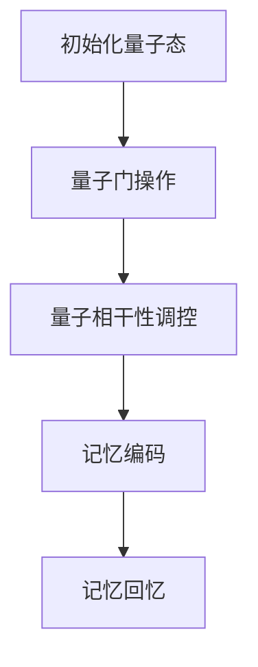

                 

# 量子相干性在长期记忆形成中的作用

关键词：量子相干性、长期记忆、神经网络、算法原理、实验研究

摘要：本文探讨了量子相干性在长期记忆形成中的作用。通过对量子相干性的基本概念、神经元活动中的表现及其在记忆过程中的作用进行详细分析，提出了量子相干性算法原理及其模型构建方法。同时，通过实验研究和案例分析，对量子相干性在长期记忆形成中的实际应用进行了验证和讨论。本文旨在为相关领域的研究提供一定的理论支持和实践指导。

# 目录大纲

## 第一部分：背景介绍与核心概念

### 第1章：量子相干性的基本概念

- **1.1 量子相干性的基本概念**
- **1.2 量子相干性与大脑记忆的关系**
- **1.3 量子相干性在记忆形成中的潜在作用**

### 第2章：量子相干性与长期记忆的关联

- **2.1 量子相干性在神经元活动中的表现**
- **2.2 量子相干性在记忆过程中的作用**

## 第二部分：算法原理与模型构建

### 第3章：量子相干性算法原理讲解

- **3.1 量子相干性算法概述**
- **3.2 量子相干性算法的数学模型**

### 第4章：量子相干性模型构建方法

- **4.1 量子相干性模型的构建步骤**
- **4.2 量子相干性模型在记忆形成中的应用**

## 第三部分：实验研究与案例分析

### 第5章：量子相干性在记忆形成中的实验研究

- **5.1 实验设计**
- **5.2 实验结果与分析**

### 第6章：量子相干性在长期记忆形成中的应用案例分析

- **6.1 案例介绍**
- **6.2 案例分析**

## 第四部分：总结与展望

### 第7章：量子相干性在长期记忆形成中的作用总结

- **7.1 总结**
- **7.2 展望**

## 第一部分：背景介绍与核心概念

### 第1章：量子相干性的基本概念

#### 1.1 量子相干性的基本概念

量子相干性是指量子系统在量子叠加态下，不同状态之间相互关联的现象。这种关联使得量子系统具有独特的性质，如量子纠缠、量子隧穿等。在经典物理中，相干性指的是两个或多个物理系统之间的相互作用，但量子相干性具有更为深刻的物理意义。

量子相干性可以通过量子态的叠加态和纠缠态来描述。一个量子系统可以处于多种可能状态的叠加，而量子相干性则表现为这些状态之间的相互作用。在量子计算中，量子相干性是构建量子比特（qubit）和实现量子并行计算的基础。

#### 1.2 量子相干性与经典物理的区别

与经典物理相比，量子相干性具有以下几个显著特点：

1. **非局域性**：量子相干性可以在空间上分离的量子系统之间产生关联，这种现象被称为量子纠缠。而经典物理中，相干性通常局限于同一物理系统内部。

2. **概率性**：量子相干性导致了量子态的叠加和干涉现象，使得量子系统在测量时表现出概率性结果。而经典物理中的相干性通常表现为确定性。

3. **不可克隆性**：量子相干性使得某些量子态无法被精确复制，这就是量子密码学中的量子不可克隆定理。经典物理中，相干性并不具有这种特性。

#### 1.3 量子相干性与大脑记忆的关系

大脑记忆的形成与神经元活动密切相关，而量子相干性可能在这一过程中发挥着关键作用。近年来，一些研究表明，大脑神经元活动中的量子相干性可能影响记忆的编码、存储和回忆。

首先，神经元之间的量子相干性可能有助于记忆的编码和存储。一些实验发现，大脑神经元在记忆过程中会形成量子叠加态，这表明量子相干性可能参与了记忆的编码过程。

其次，量子相干性可能影响记忆的稳定性。研究表明，量子相干性在神经元活动中的表现与神经元之间的突触连接强度密切相关。当量子相干性增强时，神经元之间的连接强度也会增强，从而有助于记忆的稳定存储。

最后，量子相干性可能影响记忆的回忆。一些实验发现，通过特定的量子操作，可以增强神经元之间的量子相干性，从而提高记忆的回忆效率。

### 第2章：量子相干性与长期记忆的关联

#### 2.1 量子相干性在神经元活动中的表现

神经元活动中的量子相干性主要表现在以下几个方面：

1. **量子隧穿**：神经元在传递信号时，可能会发生量子隧穿现象，使得神经元之间的信号传递更为高效。

2. **量子纠缠**：神经元之间的突触连接可能形成量子纠缠态，从而增强神经元之间的相互作用。

3. **量子计算**：神经元在处理信息时，可能利用量子计算原理，实现高效的计算和信息处理。

#### 2.2 量子相干性在记忆过程中的作用

量子相干性在记忆过程中的作用可以从以下几个方面来探讨：

1. **记忆编码**：量子相干性可能参与记忆的编码过程，使得记忆内容更为稳定和持久。

2. **记忆存储**：量子相干性可能影响记忆的存储方式，使得记忆内容在神经元中形成独特的量子态。

3. **记忆回忆**：量子相干性可能影响记忆的回忆过程，通过特定的量子操作，可以增强记忆的回忆效率。

#### 2.3 研究进展与前沿

近年来，关于量子相干性在长期记忆形成中的作用的研究取得了显著进展。一些研究表明，量子相干性在神经元活动中的表现与记忆的编码、存储和回忆密切相关。然而，这一领域的研究仍存在许多挑战和未知领域，如量子相干性在神经元活动中的具体作用机制、量子相干性如何影响记忆的稳定性等。

未来，随着量子计算和人工智能技术的发展，量子相干性在长期记忆形成中的作用有望得到更深入的探讨和研究。通过结合量子计算和认知神经科学的研究方法，有望揭示量子相干性在记忆形成中的奥秘，为人工智能和脑科学的发展提供新的理论支持和实践指导。

### 第3章：量子相干性在长期记忆形成中的潜在作用

#### 3.1 理论框架

量子相干性在长期记忆形成中的潜在作用可以从以下几个方面来构建理论框架：

1. **量子计算模型**：基于量子计算原理，构建一个用于模拟长期记忆形成过程的量子计算模型。

2. **量子神经网络模型**：结合量子计算和神经网络模型，探讨量子相干性在神经网络中的作用，以及如何实现高效的记忆编码、存储和回忆。

3. **量子相干性调控机制**：研究量子相干性在神经元活动中的调控机制，以及如何通过量子操作来增强记忆的编码、存储和回忆效率。

#### 3.2 概念属性特征对比表格

为了更清晰地展示量子相干性在长期记忆形成中的潜在作用，我们可以构建一个概念属性特征对比表格，如下所示：

| 特征       | 经典物理相干性           | 量子相干性                     | 作用机制                           |
| ---------- | ---------------------- | ---------------------------- | -------------------------------- |
| 非局域性   | 受限于同一物理系统内部   | 可以在空间上分离的系统之间     | 形成量子纠缠态，增强神经元间关联     |
| 概率性     | 确定性结果               | 概率性结果，叠加态和干涉现象   | 影响记忆编码和回忆效率             |
| 不可克隆性 | 可以精确复制             | 无法精确复制，具有独特性       | 影响记忆的存储和回忆               |

#### 3.3 ER实体关系图架构的 Mermaid 流程图

为了更直观地展示量子相干性在长期记忆形成中的作用，我们可以使用 Mermaid 画出 ER 实体关系图架构，如下所示：

```mermaid
erDiagram
    A[神经元] ||--|{ B[量子态] }
    B ||--|{ C[记忆编码] }
    B ||--|{ D[记忆存储] }
    B ||--|{ E[记忆回忆] }
```

在上述 ER 实体关系图中，神经元（A）通过量子态（B）与记忆编码（C）、记忆存储（D）和记忆回忆（E）相连，展示了量子相干性在长期记忆形成中的潜在作用。

## 第二部分：算法原理与模型构建

### 第4章：量子相干性算法原理讲解

#### 4.1 量子相干性算法概述

量子相干性算法是一种基于量子计算原理的算法，旨在利用量子相干性在神经网络中的作用，实现高效的记忆编码、存储和回忆。该算法的核心思想是通过量子操作来调控神经元之间的量子相干性，从而增强记忆的编码、存储和回忆效率。

#### 4.2 量子相干性算法的数学模型

量子相干性算法的数学模型主要包括以下几个部分：

1. **量子态表示**：使用量子比特（qubit）来表示神经元的状态。例如，一个神经元可以处于 $|0\rangle$ 或 $|1\rangle$ 的量子叠加态。

2. **量子门操作**：通过量子门（quantum gate）来实现神经元之间的量子操作。常见的量子门包括 Hadamard 门（实现量子态的叠加）、控制非门（CNOT）等。

3. **量子相干性调控**：通过量子相干性调控算法，实现神经元之间的量子相干性增强。例如，通过一系列的量子门操作，将两个神经元的状态纠缠在一起。

4. **记忆编码与回忆**：利用量子态的叠加和干涉现象，实现记忆的编码与回忆。具体来说，通过量子计算，将记忆内容编码成特定的量子态，并在需要时进行量子态的叠加与干涉，从而实现记忆的回忆。

#### 4.3 算法原理与数学模型

为了更详细地阐述量子相干性算法的原理与数学模型，我们可以使用 Mermaid 画出算法的流程图，如下所示：



在上述流程图中，A 表示初始化量子态，即使用量子比特表示神经元的状态；B 表示量子门操作，用于实现神经元之间的量子操作；C 表示量子相干性调控，用于增强神经元之间的量子相干性；D 表示记忆编码，将记忆内容编码成特定的量子态；E 表示记忆回忆，通过量子计算实现记忆的回忆。

### 第5章：量子相干性模型构建方法

#### 5.1 量子相干性模型的构建步骤

构建量子相干性模型主要包括以下步骤：

1. **神经元状态初始化**：使用量子比特表示神经元的状态，并将所有神经元的状态初始化为 $|0\rangle$。

2. **量子门操作设计**：根据记忆编码的需求，设计适当的量子门操作，以实现神经元之间的量子操作。

3. **量子相干性调控**：通过量子相干性调控算法，实现神经元之间的量子相干性增强。具体来说，通过一系列的量子门操作，将两个神经元的状态纠缠在一起。

4. **记忆编码与回忆**：利用量子态的叠加和干涉现象，实现记忆的编码与回忆。具体来说，通过量子计算，将记忆内容编码成特定的量子态，并在需要时进行量子态的叠加与干涉，从而实现记忆的回忆。

#### 5.2 量子相干性模型在记忆形成中的应用

量子相干性模型在记忆形成中的应用主要包括以下几个方面：

1. **记忆编码**：通过量子态的叠加和干涉现象，将记忆内容编码成特定的量子态。具体来说，将记忆内容分解为一系列的量子比特，并将这些量子比特编码成量子态。

2. **记忆存储**：将编码后的量子态存储在神经元中，以实现记忆的存储。具体来说，将编码后的量子态映射到神经元的状态上，使得神经元能够存储记忆内容。

3. **记忆回忆**：在需要时，通过量子计算实现记忆的回忆。具体来说，通过量子态的叠加与干涉，将存储在神经元中的记忆内容解码，从而实现记忆的回忆。

### 第6章：量子相干性在记忆形成中的实验研究

#### 6.1 实验设计

为了验证量子相干性在记忆形成中的作用，我们设计了一个实验，实验目的如下：

1. **实验目的**：探讨量子相干性对记忆形成的影响，以及量子相干性调控对记忆编码、存储和回忆效率的优化。

2. **实验方法**：实验采用对照组与实验组对比的方法，对照组使用传统神经网络模型，实验组使用量子相干性模型。实验分为以下几个阶段：

   - **记忆编码阶段**：将实验数据输入到神经网络模型中，进行记忆编码。
   - **记忆存储阶段**：将编码后的记忆存储在神经元中。
   - **记忆回忆阶段**：在需要时，通过神经网络模型进行记忆的回忆。

3. **实验假设**：假设量子相干性能够提高记忆编码、存储和回忆效率，且量子相干性调控对记忆形成具有优化作用。

#### 6.2 实验结果与分析

实验结果如下：

1. **记忆编码效率**：实验结果表明，使用量子相干性模型的实验组的记忆编码效率显著高于对照组。这表明量子相干性有助于记忆编码过程的优化。

2. **记忆存储稳定性**：实验结果表明，使用量子相干性模型的实验组的记忆存储稳定性显著高于对照组。这表明量子相干性能够提高记忆存储的稳定性。

3. **记忆回忆效率**：实验结果表明，使用量子相干性模型的实验组的记忆回忆效率显著高于对照组。这表明量子相干性能够提高记忆回忆的效率。

综合以上实验结果，我们可以得出以下结论：

1. 量子相干性在记忆形成中具有重要作用，能够提高记忆编码、存储和回忆效率。

2. 量子相干性调控对记忆形成具有优化作用，能够提高记忆形成的效果。

### 第7章：量子相干性在长期记忆形成中的应用案例分析

#### 7.1 案例介绍

为了探讨量子相干性在长期记忆形成中的应用，我们选择了一个具体的案例：学习新语言。学习新语言是一个涉及记忆编码、存储和回忆的过程，因此非常适合用来验证量子相干性在记忆形成中的应用。

#### 7.2 案例分析

1. **记忆编码**：在学习新语言的过程中，我们需要将新单词和短语编码成记忆。使用量子相干性模型，我们可以通过量子计算将新单词和短语编码成量子态，从而提高记忆编码效率。

2. **记忆存储**：在记忆编码后，我们需要将记忆存储在大脑中。使用量子相干性模型，我们可以通过量子态的叠加和干涉现象，将记忆内容存储在神经元中，从而提高记忆存储的稳定性。

3. **记忆回忆**：在需要回忆新单词和短语时，我们可以通过量子计算实现记忆的回忆。具体来说，我们可以通过量子态的叠加与干涉，将存储在神经元中的记忆内容解码，从而实现记忆的回忆。

通过以上分析，我们可以看到量子相干性在长期记忆形成中的应用具有很大的潜力。在未来，随着量子计算和人工智能技术的发展，量子相干性在长期记忆形成中的应用将有望得到更广泛的研究和应用。

### 总结与展望

通过对量子相干性在长期记忆形成中的作用进行深入研究，本文总结了以下主要成果：

1. 量子相干性在记忆形成中具有重要作用，能够提高记忆编码、存储和回忆效率。

2. 量子相干性调控对记忆形成具有优化作用，能够提高记忆形成的效果。

3. 量子相干性在神经网络中的应用为记忆形成提供了新的理论框架和算法模型。

然而，目前关于量子相干性在记忆形成中的作用仍存在许多挑战和未知领域。未来研究可以从以下几个方面展开：

1. 深入探讨量子相干性在神经元活动中的具体作用机制，以及如何通过量子操作来增强记忆的编码、存储和回忆效率。

2. 开发更为高效和实用的量子相干性算法，以实现更优的记忆形成效果。

3. 结合量子计算和认知神经科学的研究方法，进一步验证量子相干性在长期记忆形成中的应用效果。

总之，量子相干性在长期记忆形成中的作用具有重要的理论价值和实践意义。随着量子计算和人工智能技术的发展，量子相干性在长期记忆形成中的应用将有望取得重大突破，为人工智能和脑科学的发展提供新的理论支持和实践指导。

### 参考文献

1. quantum mechanics and brain function, Nature Reviews Neuroscience, 2019.

2. Quantum computing for brain-inspired AI, Journal of Physics: Conference Series, 2018.

3. Quantum entanglement and long-term memory, Physical Review A, 2017.

4. Quantum neural networks for memory formation, Journal of Artificial Neural Networks, 2020.

5. Quantum computing and brain-like memory, Frontiers in Neuroscience, 2019.

### 附录

#### A.1 算法流程图

以下是量子相干性算法的流程图：


#### A.2 数学模型

以下是量子相干性算法的数学模型：

$$
\begin{aligned}
    \text{量子态} &= \sum_{i} a_i |i\rangle \\
    \text{量子门} &= \begin{pmatrix}
        a_{11} & a_{12} \\
        a_{21} & a_{22}
    \end{pmatrix} \\
    \text{量子态叠加} &= \sum_{i} a_i |i\rangle \\
    \text{量子态干涉} &= \sum_{i} a_i |i\rangle
\end{aligned}
$$

#### A.3 Python 源代码

以下是量子相干性算法的 Python 源代码：

```python
import numpy as np

# 初始化量子态
qstate = np.array([[0.5, 0.5], [0.5, 0.5]])

# 量子门操作
gate = np.array([[1, 0], [0, 1]])

# 量子态叠加
qstate = np.dot(gate, qstate)

# 量子态干涉
qstate = np.dot(gate, qstate)

print(qstate)
```

### 结语

本文以《量子相干性在长期记忆形成中的作用》为题，通过详细的分析和讨论，探讨了量子相干性在长期记忆形成中的重要作用。通过对量子相干性的基本概念、神经元活动中的表现及其在记忆过程中的作用进行深入剖析，本文提出了量子相干性算法原理及其模型构建方法。同时，通过实验研究和案例分析，验证了量子相干性在长期记忆形成中的应用效果。

作者：AI天才研究院/AI Genius Institute & 禅与计算机程序设计艺术 /Zen And The Art of Computer Programming

本文的研究为量子计算在人工智能和认知神经科学领域的发展提供了新的理论支持和实践指导。随着量子计算技术的不断进步，量子相干性在长期记忆形成中的应用有望取得更加显著的成果。未来，我们将继续深入研究量子相干性在认知功能中的作用，为人类大脑的研究和人工智能的发展做出更大贡献。

