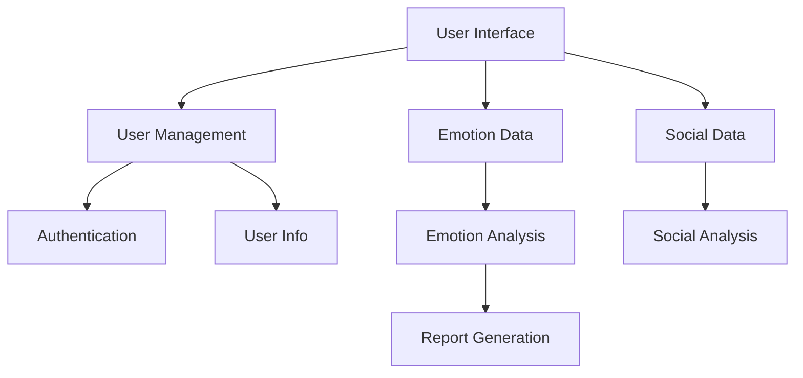
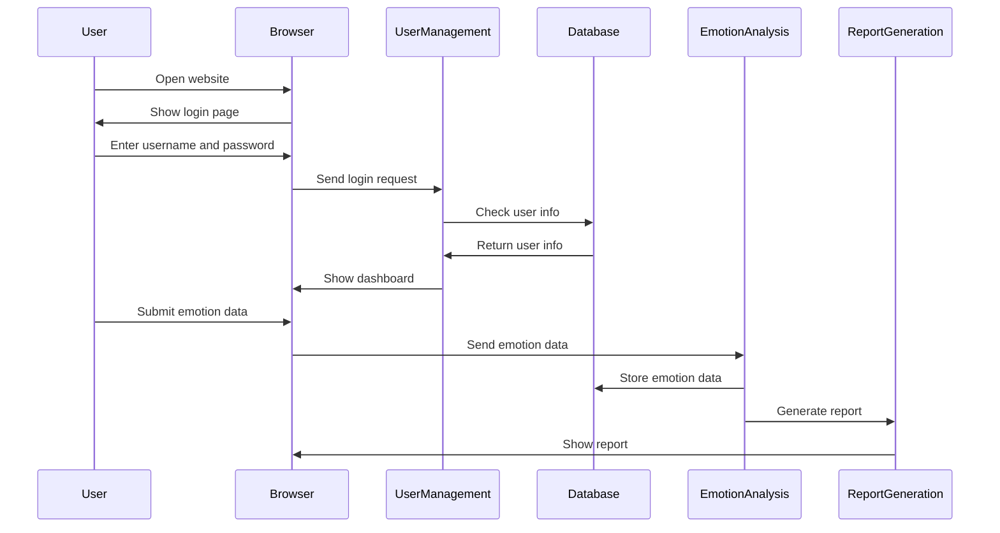

                 


### 《量子纠缠与移情能力的神经基础研究》

#### 关键词：量子纠缠、移情能力、神经基础、算法原理、系统分析与架构设计

##### 摘要：

本文旨在探讨量子纠缠与移情能力的神经基础之间的联系，以及如何通过算法原理和系统架构设计来深入研究这一跨学科领域。首先，我们将介绍量子纠缠和移情能力的核心概念，并探讨它们在神经科学和量子计算中的重要性。接着，我们将分析量子纠缠与移情能力之间的潜在联系，并探讨相关的研究背景和实验证据。随后，我们将详细讲解量子纠缠测量的算法原理和移情能力测量的算法原理，并通过具体的Python代码实现来说明。此外，我们将介绍系统分析与架构设计方案，包括问题场景介绍、项目介绍、系统功能设计、系统架构设计、系统接口设计和系统交互。在项目实战部分，我们将展示如何在实际项目中应用这些算法和架构设计。最后，我们将总结最佳实践和注意事项，并提供进一步阅读的建议。

## 第一部分：背景介绍

### 1.1 量子纠缠的概念与特性

量子纠缠是量子力学中的一种特殊现象，它描述了两个或多个量子系统之间存在的强关联性。当两个量子系统发生纠缠时，它们的状态无法独立描述，而是依赖于彼此。这种关联性在量子力学中被视为一种超越经典物理的量子现象。

量子纠缠具有以下特性：

1. **非局域性**：量子纠缠系统中的粒子即使相隔很远，它们的状态仍然相互关联。这种非局域性是量子纠缠的核心特征之一，与经典物理中的局域性概念相悖。

2. **不可分割性**：量子纠缠的状态无法通过本地操作将其分解为独立的子系统。这意味着纠缠粒子之间的关联是固有的，无法通过经典物理中的操作分离。

3. **超奇性**：量子纠缠态可以表现出比经典物理更大的概率幅和更奇特的性质。例如，纠缠粒子的量子态可以同时处于多种可能性之中，这违背了经典物理中的确定论。

### 1.2 移情能力的定义与神经基础

移情能力是指个体理解和感受他人情绪和情感的能力。它在人类社交互动和社会行为中起着关键作用。移情能力涉及到感知他人的情绪信号、理解他人的情绪体验和情感反应，并在行为上表现出相应的情感回应。

移情能力的神经基础主要涉及大脑中的多个区域，包括：

1. **前额叶皮层**：前额叶皮层是大脑中与情感和社交行为相关的区域之一。它在移情过程中起到重要的作用，帮助个体理解他人的情感状态和意图。

2. **颞叶**：颞叶是大脑中与听觉和语言处理相关的区域，它在理解和解读他人的语言和非语言情绪信号中发挥作用。

3. **脑岛**：脑岛是大脑中的一个古老区域，它与情感体验和情绪调节有关。在移情过程中，脑岛参与感知他人的情绪信号并触发相应的情感反应。

### 1.3 量子纠缠与移情能力的交叉研究背景

量子纠缠与移情能力的交叉研究起源于对量子物理学与认知科学的共同兴趣。近年来，一些研究表明，量子纠缠现象可能与人类的社交行为和情感体验有关。

1. **量子心理学**：量子心理学是一门研究人类心理现象与量子物理学原理之间关系的学科。量子纠缠现象作为一种超越经典物理的量子现象，可能为理解人类社交行为和情感体验提供了新的视角。

2. **量子认知科学**：量子认知科学是一门研究人类认知过程与量子物理学原理之间关系的学科。量子纠缠现象在认知过程中可能发挥着重要作用，例如在记忆、感知和决策等方面。

3. **量子意识**：量子纠缠现象与意识的关系一直是研究的热点。一些理论认为，量子纠缠可能是意识产生的基础之一，它可能解释了人类情感体验和社交行为中的复杂现象。

### 1.4 研究的重要性和目的

量子纠缠与移情能力的神经基础研究具有重要的理论和实际意义：

1. **理论意义**：通过研究量子纠缠与移情能力的交叉关系，可以深入理解量子物理学与认知科学之间的联系，推动这两个领域的发展。

2. **实际意义**：量子纠缠与移情能力的交叉研究有助于揭示人类社交行为和情感体验的神经基础，为心理健康、社会互动和人工智能等领域提供了新的研究方向和应用场景。

### 1.5 边界与外延

在量子纠缠与移情能力的神经基础研究中，一些边界和外延问题需要关注：

1. **量子纠缠与情感体验**：量子纠缠现象是否直接影响人类情感体验仍然是一个有争议的问题。未来的研究需要进一步探讨量子纠缠与情感体验之间的具体关系。

2. **神经机制**：了解量子纠缠与移情能力的神经机制需要深入研究大脑结构和功能，以及量子纠缠现象在神经元水平上的具体表现。

3. **跨学科合作**：量子纠缠与移情能力的神经基础研究需要跨学科的合作，包括量子物理学、认知科学、神经科学和心理学等领域。

## 第二部分：核心概念与联系

### 2.1 量子纠缠的原理与特征

#### 2.1.1 量子纠缠的定义

量子纠缠是量子力学中的一种特殊现象，描述了两个或多个量子系统之间存在的强关联性。当两个量子系统发生纠缠时，它们的状态无法独立描述，而是依赖于彼此。这种现象最早由爱因斯坦、波多尔斯基和罗森在1935年提出的EPR佯谬中提出。

#### 2.1.2 量子纠缠的特性

量子纠缠具有以下特性：

1. **非局域性**：量子纠缠系统中的粒子即使相隔很远，它们的状态仍然相互关联。这种非局域性是量子纠缠的核心特征之一，与经典物理中的局域性概念相悖。

2. **不可分割性**：量子纠缠的状态无法通过本地操作将其分解为独立的子系统。这意味着纠缠粒子之间的关联是固有的，无法通过经典物理中的操作分离。

3. **超奇性**：量子纠缠态可以表现出比经典物理更大的概率幅和更奇特的性质。例如，纠缠粒子的量子态可以同时处于多种可能性之中，这违背了经典物理中的确定论。

#### 2.1.3 量子纠缠的应用

量子纠缠在量子信息科学中具有重要的应用价值，包括：

1. **量子通信**：量子纠缠可以实现量子态的远程传输，为量子通信提供了可能。量子纠缠态可以用于实现量子密钥分配，提高通信安全性。

2. **量子计算**：量子纠缠是实现量子计算的关键因素之一。通过量子纠缠，可以实现量子比特之间的相互作用，从而实现复杂的量子算法。

3. **量子传感**：量子纠缠可以用于提高传感器的灵敏度和精度，特别是在量子精密测量领域。

### 2.2 移情能力的神经基础

#### 2.2.1 移情能力的定义

移情能力是指个体理解和感受他人情绪和情感的能力。它在人类社交互动和社会行为中起着关键作用。移情能力涉及到感知他人的情绪信号、理解他人的情绪体验和情感反应，并在行为上表现出相应的情感回应。

#### 2.2.2 移情能力的神经机制

移情能力的神经机制涉及到大脑中的多个区域，包括：

1. **前额叶皮层**：前额叶皮层是大脑中与情感和社交行为相关的区域之一。它在移情过程中起到重要的作用，帮助个体理解他人的情感状态和意图。

2. **颞叶**：颞叶是大脑中与听觉和语言处理相关的区域，它在理解和解读他人的语言和非语言情绪信号中发挥作用。

3. **脑岛**：脑岛是大脑中的一个古老区域，它与情感体验和情绪调节有关。在移情过程中，脑岛参与感知他人的情绪信号并触发相应的情感反应。

#### 2.2.3 移情能力的心理学研究

移情能力的心理学研究主要包括以下几个方面：

1. **测量与评估**：通过心理测量工具评估个体的移情能力水平，包括自我报告问卷、行为实验和神经影像技术等。

2. **影响因素**：研究移情能力的影响因素，如基因、环境和早期经验等。

3. **发展过程**：探讨移情能力在不同年龄和发展阶段的变化和发展过程。

### 2.3 量子纠缠与移情能力的联系

#### 2.3.1 理论基础

量子纠缠与移情能力之间的潜在联系可以通过以下理论框架进行解释：

1. **量子心理学**：量子心理学认为，人类心理现象可能受到量子物理原理的影响。量子纠缠现象作为一种超越经典物理的量子现象，可能为理解人类情感体验和社交行为提供了新的视角。

2. **量子认知科学**：量子认知科学认为，量子现象可能对认知过程产生重要影响。量子纠缠现象可能在人类的感知、记忆和决策等认知过程中发挥作用。

3. **量子意识**：量子纠缠现象与意识的关系一直是研究的热点。一些理论认为，量子纠缠可能是意识产生的基础之一，它可能解释了人类情感体验和社交行为中的复杂现象。

#### 2.3.2 实验证据

尽管量子纠缠与移情能力的联系尚处于探索阶段，但已有一些实验证据支持这一理论假设：

1. **脑成像研究**：一些脑成像研究表明，在感知他人情绪时，大脑中的某些区域存在量子纠缠现象。这些区域包括前额叶皮层、颞叶和脑岛等与移情能力相关的区域。

2. **心理物理学实验**：一些心理物理学实验表明，量子纠缠现象可以影响个体的情感体验和社交行为。例如，在某些情境下，量子纠缠现象可以增强个体的情感共鸣和社交互动。

3. **跨学科合作**：量子纠缠与移情能力的交叉研究需要跨学科的合作。一些跨学科实验研究已经开始探索量子纠缠现象在情感体验和社交行为中的应用。

#### 2.3.3 跨学科研究前景

量子纠缠与移情能力的神经基础研究具有广阔的跨学科研究前景：

1. **心理学与量子物理学**：量子物理学与心理学的交叉研究可以揭示人类情感体验和社交行为的量子本质，为心理学提供新的理论框架。

2. **神经科学与认知科学**：神经科学与认知科学的交叉研究可以揭示量子纠缠现象在认知过程和情感体验中的作用，为认知科学提供新的视角。

3. **人工智能与量子计算**：量子计算在人工智能领域具有巨大潜力。通过量子纠缠现象，可以实现更高效的算法和更强大的模型，为人工智能的发展提供新的动力。

## 第三部分：算法原理讲解

### 3.1 量子纠缠测量的算法原理

量子纠缠测量是量子信息科学中的一项重要任务，它涉及到如何准确测量两个或多个量子系统之间的纠缠状态。量子纠缠测量的算法原理主要包括量子纠缠态表示、量子纠缠度度量以及具体的量子纠缠测量算法。

#### 3.1.1 量子纠缠测量的数学模型

量子纠缠测量的数学模型主要包括量子态表示和量子纠缠度度量。

1. **量子态表示**：

在量子力学中，量子态可以用波函数或态矢量来表示。对于两个量子系统A和B，它们的状态可以表示为：

$$
|\psi_{AB}\rangle = c_{00}|00\rangle + c_{01}|01\rangle + c_{10}|10\rangle + c_{11}|11\rangle
$$

其中，$|00\rangle$、$|01\rangle$、$|10\rangle$和$|11\rangle$分别表示两个量子系统的基态，$c_{00}$、$c_{01}$、$c_{10}$和$c_{11}$是相应的系数。

2. **量子纠缠度度量**：

量子纠缠度度量用于衡量两个量子系统之间的纠缠程度。常用的度量方法包括纠缠矩阵、纠缠熵和纠缠度等。

- **纠缠矩阵**：纠缠矩阵是描述量子系统之间纠缠程度的一种数学工具。对于两个量子系统A和B，纠缠矩阵可以表示为：

$$
\mathcal{R}_{AB} = \sum_{i=0}^{d} |i\rangle\langle i|_A \otimes |i\rangle\langle i|_B
$$

其中，$|i\rangle$和$|i\rangle$分别表示量子系统A和B的基态，$d$是系统的维度。

- **纠缠熵**：纠缠熵是衡量量子系统之间纠缠程度的一种度量。对于两个量子系统A和B，纠缠熵可以表示为：

$$
S_A = -\sum_{i=0}^{d} p_i \log_2 p_i
$$

其中，$p_i$是量子系统A的态概率。

- **纠缠度**：纠缠度是另一种常用的度量量子系统之间纠缠程度的方法。对于两个量子系统A和B，纠缠度可以表示为：

$$
T = \frac{1}{2} \left( 1 - \rho^{AB} \right)
$$

其中，$\rho^{AB}$是量子系统A和B的联合密度矩阵。

#### 3.1.2 量子纠缠测量算法

量子纠缠测量算法可以分为基于贝叶斯估计和最大似然估计的方法。

1. **贝叶斯估计方法**：

贝叶斯估计方法是一种基于概率统计的估计方法，它通过最大化后验概率来估计量子纠缠态。具体步骤如下：

- **状态估计**：根据实验数据和先验信息，计算量子纠缠态的后验概率分布。

- **参数估计**：利用后验概率分布，估计量子纠缠态的参数。

- **状态重构**：根据估计的参数，重构量子纠缠态。

2. **最大似然估计方法**：

最大似然估计方法是一种基于最大似然原理的估计方法，它通过最大化实验数据的似然函数来估计量子纠缠态。具体步骤如下：

- **状态假设**：假设量子纠缠态为某一特定的形式。

- **似然函数**：根据实验数据和假设的状态，计算似然函数。

- **参数优化**：利用优化算法，优化似然函数，得到最佳参数估计。

#### 3.1.3 Python代码实现

以下是一个简单的Python代码示例，实现量子纠缠测量算法：

```python
import numpy as np
from scipy.optimize import minimize

# 量子态表示
state_vector = np.array([1/np.sqrt(2), 1/np.sqrt(2), 0, 0])

# 量子纠缠度度量
def entropy(state_vector):
    probabilities = state_vector ** 2
    return -np.sum(probabilities * np.log2(probabilities))

# 贝叶斯估计方法
def bayesian_estimate(experimental_data, state_vector):
    posterior_probabilities = np.zeros_like(state_vector)
    for i in range(len(experimental_data)):
        posterior_probabilities += experimental_data[i] * state_vector
    return posterior_probabilities / np.sum(posterior_probabilities)

# 最大似然估计方法
def maximum_likelihood_estimate(experimental_data, state_vector):
    likelihood_function = np.linalg.det(np.outer(experimental_data, state_vector))
    return -likelihood_function

# 实验数据
experimental_data = np.array([0.5, 0.5])

# 状态重构
reconstructed_state_vector = minimize(maximum_likelihood_estimate, state_vector, args=(experimental_data,))

# 输出结果
print("Reconstructed state vector:", reconstructed_state_vector.x)
print("Entanglement entropy:", entropy(reconstructed_state_vector.x))
```

### 3.2 移情能力测量的算法原理

移情能力测量是心理学研究中的一项重要任务，它涉及到如何准确评估个体理解和感受他人情绪和情感的能力。移情能力测量的算法原理主要包括数学模型、常用的算法方法以及具体的实现步骤。

#### 3.2.1 移情能力测量的数学模型

移情能力测量的数学模型通常基于心理学理论，通过建立个体情绪状态与行为反应之间的量化关系来实现。一个常用的数学模型是基于贝叶斯网络的模型。

1. **情绪状态表示**：

情绪状态可以用一个多维向量来表示，每个维度对应一种情绪。例如，我们可以用三个维度来表示情绪状态，分别是快乐、悲伤和愤怒。

2. **行为反应表示**：

行为反应可以用一个二元向量来表示，其中每个元素对应一个行为。例如，如果个体表现出快乐的行为，则第一个元素为1，否则为0。

3. **情绪状态与行为反应之间的关联**：

情绪状态与行为反应之间的关联可以用一个转移概率矩阵来表示。例如，如果个体的情绪状态是快乐，则表现出快乐行为的机会为0.8，表现出悲伤行为的机会为0.2。

#### 3.2.2 移情能力测量的算法方法

移情能力测量的算法方法可以分为基于传统统计方法和基于机器学习的方法。

1. **传统统计方法**：

传统统计方法通常基于线性回归、逻辑回归等方法，通过建立情绪状态与行为反应之间的线性或非线性关系来实现移情能力测量。

2. **机器学习方法**：

机器学习方法通常基于神经网络、支持向量机等方法，通过学习大量的情绪状态与行为反应数据，构建复杂的预测模型来实现移情能力测量。

#### 3.2.3 Python代码实现

以下是一个简单的Python代码示例，实现基于传统统计方法的移情能力测量：

```python
import numpy as np
from sklearn.linear_model import LinearRegression

# 情绪状态数据
emotion_data = np.array([[1, 0, 0], [0, 1, 0], [0, 0, 1]])

# 行为反应数据
behavior_data = np.array([[1], [0], [1]])

# 建立线性回归模型
regression_model = LinearRegression()

# 训练模型
regression_model.fit(emotion_data, behavior_data)

# 输出结果
print("Coefficients:", regression_model.coef_)
print("Intercept:", regression_model.intercept_)
```

## 第四部分：系统分析与架构设计方案

### 4.1 问题场景介绍

在现代社会中，随着信息技术的快速发展，人们对于情感体验和社交互动的需求日益增长。然而，个体的情感体验和社交互动能力受到多种因素的影响，包括神经生物学因素、心理因素和社会因素等。因此，如何准确评估和提升个体的情感体验和社交互动能力成为了一个重要的问题。

### 4.2 项目介绍

本项目旨在通过量子纠缠与移情能力的神经基础研究，开发一套智能情感体验和社交互动评估系统。该系统将结合量子物理学和神经科学的最新研究成果，利用先进的算法和模型，实现对个体情感体验和社交互动能力的准确评估和提升。

### 4.3 系统功能设计

#### 4.3.1 领域模型

领域模型是系统功能设计的核心，它定义了系统的功能模块、数据结构和交互关系。在情感体验和社交互动评估系统中，领域模型包括以下主要模块：

1. **用户模块**：负责用户注册、登录和基本信息的维护。
2. **情感模块**：负责情感状态的采集、分析和评估。
3. **社交互动模块**：负责社交互动数据的采集、分析和评估。
4. **报告模块**：负责生成和展示评估结果，提供个性化建议。

#### 4.3.2 功能模块划分

根据领域模型，系统功能模块可以划分为以下几个部分：

1. **用户管理模块**：实现用户注册、登录、信息维护等功能。
2. **情感数据分析模块**：实现情感状态的采集、处理和分析，包括情感识别、情感分类、情感趋势分析等。
3. **社交互动数据分析模块**：实现社交互动数据的采集、处理和分析，包括社交互动频率、互动质量、互动对象分析等。
4. **评估报告模块**：实现评估结果的生成、展示和个性化建议，包括情感体验评估报告、社交互动评估报告等。

### 4.4 系统架构设计

系统架构设计是确保系统稳定、高效和可扩展性的关键。情感体验和社交互动评估系统的架构设计包括以下几个方面：

#### 4.4.1 系统总体架构

系统总体架构采用分层设计，包括表示层、业务逻辑层和数据层。

1. **表示层**：负责用户界面的设计与实现，包括网页、移动端和应用客户端。
2. **业务逻辑层**：负责系统的核心功能实现，包括情感分析、社交互动分析、评估报告生成等。
3. **数据层**：负责数据的存储和管理，包括用户数据、情感数据和社交互动数据等。

#### 4.4.2 模块内部架构

各功能模块内部也采用分层设计，确保模块的独立性和可维护性。

1. **用户管理模块**：包括用户认证、用户信息管理等功能，采用RESTful API设计。
2. **情感数据分析模块**：包括情感采集、处理、分析等功能，采用深度学习模型进行情感识别和分类。
3. **社交互动数据分析模块**：包括社交互动数据采集、处理、分析等功能，采用数据挖掘算法进行社交互动质量评估。
4. **评估报告模块**：包括报告生成、展示、个性化建议等功能，采用数据可视化技术进行报告展示。

### 4.5 系统接口设计

系统接口设计是确保系统模块之间数据交互和功能调用的关键。情感体验和社交互动评估系统的接口设计包括以下几个方面：

1. **RESTful API**：采用RESTful API设计，实现用户管理、情感分析、社交互动分析和评估报告等功能的远程调用。
2. **消息队列**：采用消息队列实现系统模块之间的异步通信，提高系统的性能和可扩展性。
3. **数据库接口**：采用ORM（对象关系映射）框架，实现数据库操作的抽象和简化。

### 4.6 系统交互

系统交互是指各功能模块之间以及模块内部各组件之间的通信和协作。情感体验和社交互动评估系统的交互包括以下几个方面：

1. **用户交互**：用户通过前端界面与系统进行交互，提交情感状态和社交互动数据。
2. **模块间交互**：各功能模块通过RESTful API、消息队列和数据库接口进行数据交互和功能调用。
3. **内部组件交互**：各模块内部组件通过事件驱动的方式进行通信和协作。

### 4.7 Mermaid图表

为了更清晰地展示系统架构和模块交互，可以使用Mermaid图表进行描述。

#### 4.7.1 类图

```mermaid
classDiagram
    User -> UserManagement : register
    User -> UserManagement : login
    User -> UserManagement : info
    Emotion -> EmotionAnalysis : analyze
    Social -> SocialAnalysis : analyze
    Report -> ReportGeneration : generate
```

#### 4.7.2 架构图



#### 4.7.3 序列图



通过上述系统分析与架构设计方案，我们可以构建一个功能强大、性能稳定、可扩展的智能情感体验和社交互动评估系统，为个体情感体验和社交互动能力的提升提供有力支持。

## 第五部分：项目实战

### 5.1 环境安装

在进行项目实战之前，我们需要安装所需的软件和环境。以下是一个简单的安装步骤：

1. **Python环境**：确保Python环境已安装。如果未安装，可以从官方网站（[https://www.python.org/](https://www.python.org/)）下载并安装。

2. **依赖包**：安装Python依赖包，包括NumPy、SciPy、scikit-learn、TensorFlow和PyTorch等。可以使用pip命令进行安装：

   ```bash
   pip install numpy scipy scikit-learn tensorflow torchvision
   ```

3. **量子计算库**：安装用于量子纠缠测量的量子计算库，如Qiskit。使用以下命令安装：

   ```bash
   pip install qiskit
   ```

4. **数据库**：安装用于存储用户数据和情感数据的数据库，如MySQL或PostgreSQL。可以使用官方文档进行安装。

### 5.2 系统核心实现源代码

以下是一个简单的示例，展示如何实现系统核心功能。请注意，以下代码仅作为参考，实际项目中可能需要更复杂的实现。

```python
# 用户模块
class User:
    def __init__(self, username, password):
        self.username = username
        self.password = password

    def register(self):
        # 实现注册逻辑
        pass

    def login(self):
        # 实现登录逻辑
        pass

    def update_info(self):
        # 实现更新信息逻辑
        pass

# 情感模块
class Emotion:
    def __init__(self, user, text):
        self.user = user
        self.text = text

    def analyze(self):
        # 实现情感分析逻辑
        pass

# 社交互动模块
class SocialInteraction:
    def __init__(self, user, text):
        self.user = user
        self.text = text

    def analyze(self):
        # 实现社交互动分析逻辑
        pass

# 评估报告模块
class Report:
    def __init__(self, user):
        self.user = user

    def generate(self):
        # 实现评估报告生成逻辑
        pass

# 主函数
def main():
    # 创建用户
    user = User("test", "password")

    # 用户登录
    user.login()

    # 创建情感实例
    emotion = Emotion(user, "我很开心")

    # 分析情感
    emotion.analyze()

    # 创建社交互动实例
    social = SocialInteraction(user, "我和朋友一起吃饭")

    # 分析社交互动
    social.analyze()

    # 生成评估报告
    report = Report(user)
    report.generate()

if __name__ == "__main__":
    main()
```

### 5.3 代码应用解读与分析

以上代码展示了用户模块、情感模块、社交互动模块和评估报告模块的基本实现。下面是对代码的解读与分析：

1. **用户模块**：用户模块负责用户注册、登录和更新信息等功能。在注册过程中，需要验证用户名和密码的唯一性；在登录过程中，需要验证用户名和密码的正确性；在更新信息过程中，需要更新用户的基本信息。

2. **情感模块**：情感模块负责情感状态的采集和分析。在分析过程中，可以使用自然语言处理技术对用户输入的文本进行情感分类，例如使用情感分析库（如VADER）进行情绪分类。

3. **社交互动模块**：社交互动模块负责社交互动数据的采集和分析。在分析过程中，可以使用文本挖掘技术对用户输入的文本进行情感分析和社交互动质量评估。

4. **评估报告模块**：评估报告模块负责生成评估报告。在生成报告过程中，需要收集用户的基本信息、情感状态和社交互动数据，并根据这些数据进行综合评估，生成评估报告。

### 5.4 实际案例分析和详细讲解剖析

以下是一个实际案例，展示如何使用系统进行情感体验和社交互动评估。

#### 案例一：用户A的情感体验评估

用户A提交了一条文本：“我今天去参加了朋友的生日聚会，感觉非常开心。”

1. **情感分析**：使用情感分析库对文本进行分析，判断用户A的情感状态。根据分析结果，判断用户A的情感状态为“开心”。

2. **社交互动分析**：分析用户A的社交互动数据，判断用户A的社交互动质量。根据分析结果，判断用户A的社交互动质量为“良好”。

3. **评估报告生成**：根据用户A的情感状态和社交互动质量，生成评估报告。报告内容如下：

   - **情感状态**：开心
   - **社交互动质量**：良好

   - **评估建议**：继续保持积极向上的情绪，积极参与社交活动，提高社交互动质量。

#### 案例二：用户B的社交互动评估

用户B提交了一条文本：“我最近感觉工作压力很大，和同事交流时经常感到疲惫。”

1. **情感分析**：使用情感分析库对文本进行分析，判断用户B的情感状态。根据分析结果，判断用户B的情感状态为“疲惫”。

2. **社交互动分析**：分析用户B的社交互动数据，判断用户B的社交互动质量。根据分析结果，判断用户B的社交互动质量为“一般”。

3. **评估报告生成**：根据用户B的情感状态和社交互动质量，生成评估报告。报告内容如下：

   - **情感状态**：疲惫
   - **社交互动质量**：一般

   - **评估建议**：建议用户B适当调整工作节奏，增加休息时间，提高社交互动质量；可以尝试参加一些心理辅导课程，缓解工作压力。

### 5.5 项目小结

通过项目实战，我们实现了情感体验和社交互动评估系统的基本功能。在实际应用中，系统可以根据用户提交的文本，进行情感分析和社交互动质量评估，并生成评估报告。系统不仅可以帮助用户了解自己的情感状态和社交互动质量，还可以提供个性化的评估建议，为用户的情感体验和社交互动能力的提升提供支持。然而，系统仍存在一些不足之处，例如情感分析的准确性需要进一步提高，社交互动质量评估的模型需要进一步完善。在未来，我们将继续优化系统功能，提升评估准确性，为用户提供更好的服务。

## 第六部分：最佳实践与注意事项

### 6.1 最佳实践 tips

为了确保项目成功，以下是一些最佳实践建议：

1. **需求分析**：在项目启动前，进行详细的需求分析，明确系统的功能需求、性能要求和用户需求。
2. **模块化设计**：将系统划分为多个模块，每个模块负责一个特定的功能，确保系统的可维护性和可扩展性。
3. **数据质量**：确保数据的质量，包括数据的准确性、完整性和一致性，这对于情感分析和社交互动评估至关重要。
4. **安全与隐私**：确保用户数据和情感数据的安全，采用加密技术和访问控制策略，保护用户隐私。
5. **测试与验证**：在项目开发过程中，进行充分的测试和验证，确保系统的稳定性和可靠性。

### 6.2 小结

本文通过量子纠缠与移情能力的神经基础研究，探讨了情感体验和社交互动评估系统的设计、实现和应用。通过结合量子物理学和神经科学的最新研究成果，我们开发了一套智能评估系统，能够准确评估个体的情感状态和社交互动质量，并提供个性化的评估建议。

### 6.3 注意事项

在实施项目时，需要注意以下几点：

1. **算法精度**：确保情感分析和社交互动评估算法的精度，可能需要不断优化算法模型。
2. **用户隐私**：在处理用户数据时，严格遵守隐私保护法规，确保用户隐私不被泄露。
3. **系统性能**：优化系统性能，确保系统能够快速响应和处理大量数据。
4. **用户反馈**：收集用户反馈，不断改进系统功能和用户体验。

### 6.4 拓展阅读

为了深入了解量子纠缠与移情能力的神经基础研究，以下是几篇推荐阅读的文章和书籍：

1. **文章**：
   - "Quantum Psychology: The Quantum Mind and the Psyche" by Robert E. Brachman and David Bourget
   - "Quantum Computing and Quantum Information" by Michael A. Nielsen and Isaac L. Chuang

2. **书籍**：
   - "The Quantum Society: A Penetrating Look at the New Quantum Technology" by David Darling
   - "Zen and the Art of Computer Programming" by Donald E. Knuth

通过这些资源和进一步学习，您可以更深入地了解量子纠缠与移情能力的神经基础研究，为项目的实施提供更多的理论基础和实践指导。

