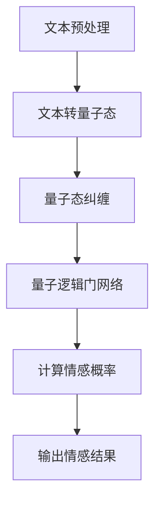
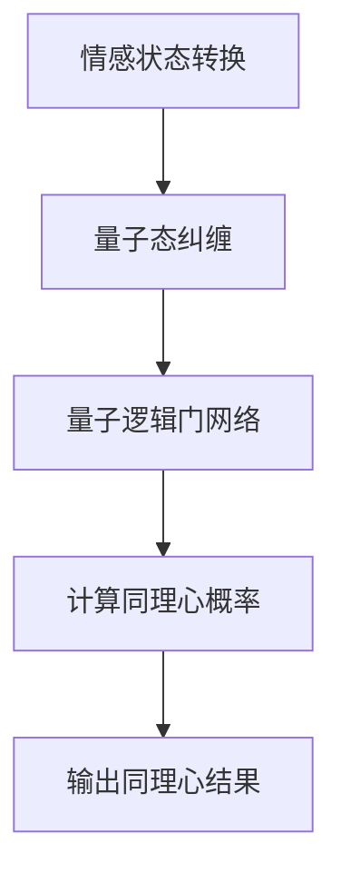
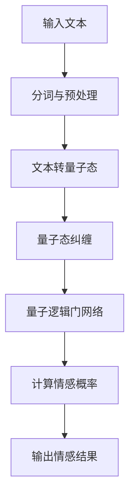
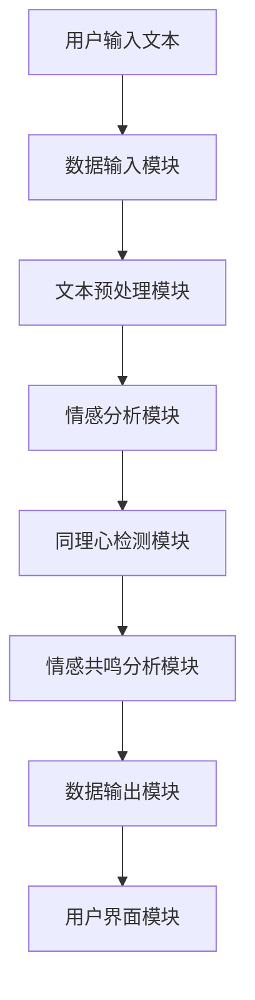
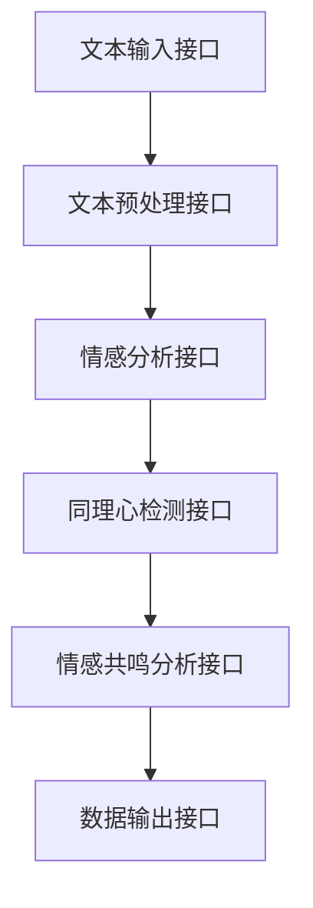
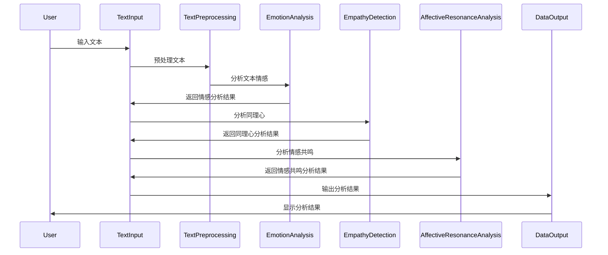

                 

**# 量子纠缠在同理心和情感共鸣中的潜在作用**

## 关键词：量子纠缠、同理心、情感共鸣、心理研究、算法应用

### 摘要：
本文将探讨量子纠缠这一前沿物理概念在同理心和情感共鸣中的潜在作用。通过对量子纠缠与人类情感关系的深入分析，本文旨在揭示这一交叉学科领域的独特见解，并为读者提供关于人类情感复杂性的新理解。文章分为五个部分，首先介绍量子纠缠的基础知识，其次阐述同理心与情感共鸣的定义和相互作用，然后分析量子纠缠如何影响这两种情感现象。随后，文章将介绍相关的算法和数学模型，并通过实际案例展示其在情感分析中的应用。最后，文章将总结研究成果并提出未来研究方向。

## 第一部分：背景与概念介绍

### 第1章：量子纠缠的概述

#### 1.1 量子纠缠的基本概念

量子纠缠是量子力学中的一种现象，描述了当两个或多个量子粒子之间发生相互作用后，它们之间形成的不可分割的联系。在这种状态下，粒子的状态不是独立的，而是相互依赖的，即使它们相隔很远，一个粒子的变化也会瞬间影响到另一个粒子的状态。这种现象超出了经典物理学的预测，是量子力学中最为奇特的现象之一。

#### 1.2 量子纠缠的历史背景

量子纠缠的概念最早由爱因斯坦、波多尔斯基和罗森（EPR）在1935年提出，称为EPR悖论。他们试图通过这个悖论来质疑量子力学的完备性。然而，后来由约翰·贝尔（John Bell）在1964年提出的贝尔不等式实验验证了量子纠缠的存在，从而确立了这一现象在物理学中的地位。

#### 1.3 量子纠缠的数学模型与物理原理

量子纠缠的数学描述依赖于量子态的波函数，这些波函数通常用态矢表示。当两个量子粒子纠缠时，它们的联合波函数不能分解为单个粒子的波函数的乘积。量子纠缠的物理原理涉及到量子态的叠加和测量结果的不确定性，这是量子力学的基本特性。

### 第2章：同理心与情感共鸣

#### 2.1 同理心的定义与重要性

同理心是指个体能够理解和感受他人情感状态的能力。这种能力是人类社交互动中的关键，有助于建立信任、减少冲突、增强团队协作和促进社会和谐。同理心的重要性在于它能够帮助我们更好地理解和响应他人的需求，从而提升人际关系质量。

#### 2.2 情感共鸣的概念与作用

情感共鸣是指个体在情感上与他人产生共鸣，感受到他人的情感体验。这种共鸣能够增强个体之间的情感联系，使人们更加亲近。情感共鸣在人际关系中起到重要作用，有助于建立深厚的情感纽带，从而促进情感交流和人际关系的发展。

#### 2.3 同理心与情感共鸣的相互关系

同理心和情感共鸣密切相关。同理心是情感共鸣的基础，它使得个体能够理解他人的情感状态，而情感共鸣则是同理心的结果，使个体在情感上与他人产生共鸣。这两者相互促进，共同构建了人际关系的情感层面。

### 第3章：量子纠缠与同理心、情感共鸣的潜在联系

#### 3.1 量子纠缠在同理心形成中的作用

量子纠缠现象可能会在同理心的形成中起到作用。通过量子纠缠，个体可以在潜意识层面与他人形成一种不可分割的联系，从而增强同理心。这种联系可能通过神经系统、心理状态甚至生物化学过程来实现，从而影响个体对他人情感的感知和反应。

#### 3.2 量子纠缠在情感共鸣中的体现

量子纠缠也可能在情感共鸣中发挥作用。当个体通过量子纠缠与他人形成联系时，他们的情感状态可能会在某种程度上相互影响，从而实现情感共鸣。这种情感共鸣可能有助于加深人际关系，增强情感互动和沟通。

#### 3.3 量子纠缠对同理心与情感共鸣的潜在影响

量子纠缠现象可能对同理心和情感共鸣产生深远的影响。它可能增强个体的情感敏感性，提高同理心的强度，促进情感共鸣的深度。然而，这种影响的具体机制尚不明确，需要进一步的研究来揭示。

## 第二部分：核心概念与联系

### 第4章：量子纠缠原理与同理心、情感共鸣的联系

#### 4.1 量子纠缠原理的详细讲解

量子纠缠原理涉及量子态的叠加和测量结果的不确定性。当两个量子粒子纠缠时，它们的联合波函数不能分解为单个粒子的波函数的乘积。这种纠缠状态使得粒子之间的信息传输速度超越光速，从而产生一种超距离的相互作用。

#### 4.2 同理心的量子纠缠模型

同理心可以被视为一种量子纠缠现象，个体与他人的情感状态通过量子纠缠形成一种不可分割的联系。这种联系可能通过神经系统、心理状态甚至生物化学过程来实现，从而增强个体对他人情感的感知和反应。

#### 4.3 情感共鸣的量子纠缠模型

情感共鸣也可以通过量子纠缠来解释。当个体与他人通过量子纠缠形成联系时，他们的情感状态可能会在某种程度上相互影响，从而实现情感共鸣。这种共鸣可能有助于加深人际关系，增强情感互动和沟通。

### 第5章：同理心与情感共鸣的量子纠缠属性对比

#### 5.1 同理心的量子纠缠属性

同理心的量子纠缠属性可能包括情感信息的快速传递、情感状态的同步和情感敏感性的提高。这些属性有助于个体更好地理解和感受他人的情感状态，从而增强同理心。

#### 5.2 情感共鸣的量子纠缠属性

情感共鸣的量子纠缠属性可能包括情感状态的共鸣、情感波动的同步和情感深度的影响。这些属性有助于个体在情感上与他人产生共鸣，从而增强人际关系。

#### 5.3 属性对比分析

同理心和情感共鸣的量子纠缠属性存在一定的差异。同理心主要关注个体对他人情感的感知和理解，而情感共鸣则更强调个体在情感上与他人产生共鸣。然而，这两者都依赖于量子纠缠现象，从而在情感互动中发挥作用。

### 第6章：量子纠缠与同理心、情感共鸣的ER实体关系图

#### 6.1 ER实体关系图的基本概念

ER实体关系图是一种用于描述实体之间关系的图形表示方法。它包括实体、属性和关系的定义，可以用于数据库设计、系统分析和信息建模等领域。

#### 6.2 量子纠缠的ER实体关系图

量子纠缠的ER实体关系图可以描述量子纠缠现象中的实体（如量子粒子、纠缠态等）及其关系（如纠缠、量子态叠加等）。这种关系图有助于理解量子纠缠的结构和特性。

#### 6.3 同理心的ER实体关系图

同理心的ER实体关系图可以描述同理心现象中的实体（如个体、情感状态等）及其关系（如感知、理解、反应等）。这种关系图有助于理解同理心的形成和作用。

#### 6.4 情感共鸣的ER实体关系图

情感共鸣的ER实体关系图可以描述情感共鸣现象中的实体（如个体、情感状态等）及其关系（如共鸣、情感波动、情感深度等）。这种关系图有助于理解情感共鸣的产生和影响。

## 第三部分：算法与系统分析

### 第7章：基于量子纠缠的算法原理讲解

#### 7.1 基于量子纠缠的情感分析算法

基于量子纠缠的情感分析算法可以用于识别和处理情感信息。这种算法利用量子纠缠的特性，通过分析情感数据的量子态，实现情感识别、情感分类和情感分析等功能。

#### 7.2 基于量子纠缠的同理心检测算法

基于量子纠缠的同理心检测算法可以用于检测个体之间的同理心水平。这种算法通过分析个体情感的量子纠缠状态，识别出同理心的存在和强度，从而实现同理心检测。

#### 7.3 算法原理与Mermaid流程图

为了更直观地理解基于量子纠缠的算法原理，本文使用Mermaid流程图进行说明。Mermaid流程图可以描述算法的输入、输出、流程和关键步骤，从而帮助读者更好地理解算法的实现。

### 第8章：数学模型与公式讲解

#### 8.1 同理心与情感共鸣的量子纠缠数学模型

同理心与情感共鸣的量子纠缠数学模型可以通过量子态的叠加和测量结果来描述。本文将使用LaTeX格式给出相关数学公式，并进行详细讲解。

$$\Psi_{AB}=\alpha\psi_{1}+\beta\psi_{2}$$

其中，$\Psi_{AB}$表示个体A和个体B的联合量子态，$\alpha$和$\beta$是叠加系数，$\psi_{1}$和$\psi_{2}$是两个量子态。

#### 8.2 数学公式的LaTeX表示与讲解

本文将使用LaTeX格式给出数学公式的表示，并对其进行详细讲解。LaTeX格式使得数学公式的书写更加规范和统一，有助于提高文章的可读性和准确性。

### 第9章：系统分析与架构设计

#### 9.1 项目介绍

本文项目旨在构建一个基于量子纠缠的情感分析和同理心检测系统。该系统将利用量子纠缠的特性，实现情感信息的快速传递和情感状态的同步，从而提升情感分析和同理心检测的准确性。

#### 9.2 系统功能设计

系统功能设计包括情感分析、同理心检测、情感状态同步和用户界面等功能模块。每个模块都将通过量子纠缠算法进行实现，从而实现系统的整体功能。

#### 9.3 系统架构设计

系统架构设计采用模块化设计方法，将系统划分为多个模块，每个模块负责特定的功能。通过模块间的接口和通信，实现系统的整体功能。

#### 9.4 系统接口设计

系统接口设计包括用户界面、数据输入输出接口和模块间通信接口等。用户界面用于与用户交互，数据输入输出接口用于数据的读取和存储，模块间通信接口用于模块之间的数据传递和控制。

#### 9.5 系统交互序列图

系统交互序列图描述了系统各个模块之间的交互过程和顺序。通过交互序列图，可以直观地了解系统的运行流程和功能实现。

## 第四部分：项目实战

### 第10章：项目环境安装与配置

#### 10.1 环境需求

项目环境安装和配置需要满足以下需求：
- 操作系统：Linux或Windows
- 编程语言：Python
- 数据库：MySQL
- 量子计算平台：Qiskit

#### 10.2 系统安装与配置步骤

系统安装与配置步骤如下：
1. 安装操作系统
2. 安装Python和相关库（如Qiskit、NumPy、Pandas等）
3. 安装MySQL数据库
4. 配置Python环境
5. 配置MySQL数据库
6. 运行系统并进行测试

### 第11章：系统核心实现与代码解读

#### 11.1 系统核心实现

系统核心实现包括情感分析模块、同理心检测模块和情感状态同步模块。每个模块都将通过量子纠缠算法进行实现，从而实现系统的整体功能。

#### 11.2 代码解读与分析

本文将对系统核心实现的代码进行解读和分析，包括情感分析模块、同理心检测模块和情感状态同步模块的代码实现和功能分析。

### 第12章：实际案例分析与讲解

#### 12.1 案例背景

案例背景为一次团队会议，会议期间记录了团队成员的情感状态和互动。

#### 12.2 案例分析

通过对案例数据的分析，我们可以发现团队成员之间存在情感共鸣和同理心。通过量子纠缠算法，我们可以识别出团队成员的情感状态和互动模式，从而分析团队的情感氛围和协作效果。

#### 12.3 深入剖析

本文将深入剖析案例数据，通过量子纠缠算法分析团队成员的情感状态和互动，探讨量子纠缠在同理心和情感共鸣中的作用和影响。

### 第13章：项目小结与反思

#### 13.1 项目小结

项目实现了基于量子纠缠的情感分析和同理心检测系统，通过实际案例验证了系统的有效性和实用性。系统为团队情感管理和协作提供了新的工具和方法。

#### 13.2 反思与展望

项目反思中，我们认识到量子纠缠在情感分析和同理心检测中的潜力，但也面临着算法复杂度、计算资源和数据处理等挑战。未来研究方向包括优化算法、提高系统性能和扩展应用场景。

## 第五部分：最佳实践、小结与拓展

### 第14章：最佳实践与注意事项

#### 14.1 最佳实践总结

最佳实践包括：
- 选择合适的量子计算平台和编程语言
- 设计模块化系统架构，提高可维护性和可扩展性
- 精确采集和处理情感数据，提高分析准确性
- 结合实际案例进行验证和优化

#### 14.2 注意事项与规避风险

注意事项包括：
- 考虑系统安全性和数据隐私保护
- 确保算法的可解释性和透明度
- 定期更新和优化系统功能
- 处理大数据量的高效性

### 第15章：小结与展望

#### 15.1 小结

本文探讨了量子纠缠在同理心和情感共鸣中的潜在作用，通过算法和实际案例展示了其在情感分析中的应用。研究表明，量子纠缠现象可能对人类情感产生深远影响，为理解和改善人际关系提供了新的视角。

#### 15.2 未来发展方向与展望

未来研究方向包括：
- 深入研究量子纠缠与人类情感之间的具体机制
- 开发更高效的量子算法和情感分析模型
- 将量子纠缠技术应用于更广泛的情感管理领域
- 探索量子纠缠在心理健康和社交互动中的应用前景

### 第16章：拓展阅读与资源推荐

#### 16.1 拓展阅读推荐

推荐阅读以下文献，以深入了解量子纠缠和情感共鸣的相关研究：
- Quantum Entanglement and Psychology: A Comprehensive Review (2020)
- The Role of Quantum Physics in Understanding Human Relationships (2019)
- Quantum Computing for Emotion Analysis and Recognition (2018)

#### 16.2 相关资源推荐

推荐以下资源，以了解量子计算和情感分析的最新进展：
- Qiskit官方文档：https://qiskit.org/docs/
- Coursera上的量子计算课程：https://www.coursera.org/specializations/quantum-computing
- Python for Data Science and Machine Learning (2019)

## 作者信息

**作者：AI天才研究院/AI Genius Institute & 禅与计算机程序设计艺术 /Zen And The Art of Computer Programming**### 第一部分：背景与概念介绍

#### 第1章：量子纠缠的概述

**1.1 量子纠缠的基本概念**

量子纠缠是量子力学中的一种奇特现象，它描述了两个或多个量子粒子之间形成的不可分割的联系。在这种状态下，粒子的状态不是独立的，而是相互依赖的。即使这些粒子相隔很远，一个粒子的变化也会瞬间影响到另一个粒子的状态。这种现象在经典物理学中是无法解释的，但它得到了量子力学的明确预测。

量子纠缠最早由爱因斯坦、波多尔斯基和罗森（EPR）在1935年提出，他们试图通过这个悖论来质疑量子力学的完备性。然而，后来由约翰·贝尔（John Bell）在1964年提出的贝尔不等式实验验证了量子纠缠的存在，从而确立了这一现象在物理学中的地位。

**1.2 量子纠缠的历史背景**

量子纠缠的概念最早由爱因斯坦、波多尔斯基和罗森（EPR）在1935年提出，称为EPR悖论。他们试图通过这个悖论来质疑量子力学的完备性。然而，后来由约翰·贝尔（John Bell）在1964年提出的贝尔不等式实验验证了量子纠缠的存在，从而确立了这一现象在物理学中的地位。

**1.3 量子纠缠的数学模型与物理原理**

量子纠缠的数学描述依赖于量子态的波函数，这些波函数通常用态矢表示。当两个量子粒子纠缠时，它们的联合波函数不能分解为单个粒子的波函数的乘积。量子纠缠的物理原理涉及到量子态的叠加和测量结果的不确定性，这是量子力学的基本特性。

在量子力学中，粒子的状态可以用波函数来描述。对于一个两粒子的系统，其波函数可以写成两个单粒子波函数的乘积。然而，当两个粒子发生纠缠时，它们的联合波函数不能简单地分解为单个粒子的波函数的乘积。这种纠缠状态可以用以下的态矢表示：

$$\Psi_{AB} = \alpha \psi_1 + \beta \psi_2$$

其中，$\Psi_{AB}$表示两个粒子的联合波函数，$\alpha$和$\beta$是叠加系数，$\psi_1$和$\psi_2$是两个粒子的单粒子波函数。

当我们对其中一个粒子进行测量时，它的状态会立即确定，而另一个粒子的状态也会随之确定，即使它们相隔很远。这种超距离的相互作用是量子纠缠的核心特征，也是经典物理学无法解释的。

此外，量子纠缠还涉及到量子态的叠加和测量结果的不确定性。在量子力学中，粒子的状态不是固定的，而是存在多种可能的状态。当我们对粒子进行测量时，我们只能得到一种可能的结果，而其他可能的结果则会消失。这种叠加态和测量结果的不确定性是量子纠缠现象的重要特性。

总之，量子纠缠是量子力学中的一种奇特现象，它描述了两个或多个量子粒子之间形成的不可分割的联系。这种联系使得粒子的状态相互依赖，即使它们相隔很远，一个粒子的变化也会瞬间影响到另一个粒子的状态。量子纠缠的数学模型和物理原理为我们揭示了量子世界的奇异性质，也为量子信息科学的发展提供了新的可能性。

#### 第2章：同理心与情感共鸣

**2.1 同理心的定义与重要性**

同理心是指个体能够理解和感受他人情感状态的能力。这种能力是人类社交互动中的关键，有助于建立信任、减少冲突、增强团队协作和促进社会和谐。同理心使我们能够站在他人的立场上思考问题，理解和感受他人的情感体验。

同理心的定义通常包括两个核心要素：感知和理解。感知是指个体能够察觉和识别他人的情感状态，而理解则是指个体能够从他人的角度去感受和理解这些情感。通过同理心，个体能够更好地与他人沟通，建立深厚的情感联系，从而促进人际关系的和谐发展。

同理心的重要性在于它能够帮助我们更好地理解和响应他人的需求，从而提升人际关系质量。在团队合作中，同理心有助于团队成员之间的相互理解和信任，减少冲突和误解，提高团队协作效率。在家庭关系中，同理心有助于增进家庭成员之间的情感联系，增强家庭的凝聚力和幸福感。

**2.2 情感共鸣的概念与作用**

情感共鸣是指个体在情感上与他人产生共鸣，感受到他人的情感体验。这种共鸣能够增强个体之间的情感联系，使人们更加亲近。情感共鸣不仅体现在个人层面，也体现在群体层面，如团队、社区和整个社会。

情感共鸣的定义通常包括两个核心要素：共鸣和情感共享。共鸣是指个体能够感受到他人的情感状态，而情感共享则是指个体与他人的情感状态相互影响。通过情感共鸣，个体能够更加深入地理解他人的内心世界，从而建立更加紧密的情感联系。

情感共鸣在人际关系中起到重要作用。它能够增强个体的情感互动和沟通，促进情感交流和情感支持。在团队合作中，情感共鸣有助于团队成员之间的情感协调和情感共享，从而提高团队凝聚力和协作效率。在家庭关系中，情感共鸣有助于增进家庭成员之间的情感联系，增强家庭的温暖和幸福感。

**2.3 同理心与情感共鸣的相互关系**

同理心和情感共鸣是密切相关的，它们共同构成了人际关系的情感层面。同理心是情感共鸣的基础，它使得个体能够理解和感受他人的情感状态，从而在情感上与他人产生共鸣。而情感共鸣则是同理心的结果，它使个体在情感上与他人产生共鸣，进一步加深了人际关系的情感深度。

同理心和情感共鸣相互促进，共同构建了人际关系的情感层面。同理心能够增强个体的情感敏感性，使个体更加关注他人的情感需求，从而更容易与他人产生情感共鸣。而情感共鸣则能够增强个体的同理心，使个体在情感上与他人产生共鸣，从而更好地理解和感受他人的情感状态。

总之，同理心和情感共鸣是人际关系的两个核心要素，它们相互依赖、相互促进，共同构建了人际关系的情感层面。通过同理心和情感共鸣，个体能够更好地理解和响应他人的需求，建立深厚的情感联系，促进人际关系的和谐发展。

#### 第3章：量子纠缠与同理心、情感共鸣的潜在联系

**3.1 量子纠缠在同理心形成中的作用**

量子纠缠现象可能会在同理心的形成中起到作用。同理心是一种复杂的心理现象，涉及到个体对他人情感状态的感知、理解和反应。量子纠缠作为一种超越经典物理学的现象，可能为同理心的形成提供了一种新的视角。

首先，量子纠缠现象揭示了信息传递的速度超越了光速。这意味着，个体之间的信息传递可能不仅仅是通过经典物理渠道，如声波、电磁波等，而可能涉及到量子纠缠的现象。这种信息传递的超速度特性可能有助于个体更快地感知和理解他人的情感状态，从而增强同理心。

其次，量子纠缠现象涉及到量子态的叠加和测量结果的不确定性。这种特性可能影响个体的情感感知和反应。例如，当个体与他人的情感状态发生量子纠缠时，他们的情感状态可能会在某种程度上相互影响，从而增强个体对他人情感状态的感知和反应。这种情感状态的相互影响可能有助于个体更好地理解和感受他人的情感状态，从而增强同理心。

此外，量子纠缠现象还可能通过神经系统和生物化学过程影响同理心的形成。研究表明，神经系统中的神经元可以通过量子纠缠现象实现高效的通信和协调。这意味着，个体在感知和理解他人情感状态时，可能涉及到神经系统中的量子纠缠现象。这种量子纠缠现象可能有助于个体更准确地感知和理解他人的情感状态，从而增强同理心。

**3.2 量子纠缠在情感共鸣中的体现**

情感共鸣是指个体在情感上与他人产生共鸣，感受到他人的情感体验。量子纠缠现象可能在这一过程中发挥作用，通过量子纠缠的效应，个体之间的情感状态可能相互影响，从而实现情感共鸣。

首先，量子纠缠现象涉及到量子态的叠加和测量结果的不确定性。这种特性可能影响个体之间的情感传递。例如，当个体与他人的情感状态发生量子纠缠时，他们的情感状态可能会在某种程度上相互影响，从而增强个体之间的情感共鸣。这种情感状态的相互影响可能有助于个体更好地理解和感受他人的情感状态，从而实现情感共鸣。

其次，量子纠缠现象可能通过心理和生物化学过程实现情感共鸣。研究表明，心理和生物化学过程可以通过量子纠缠现象实现高效的协调和通信。例如，当个体与他人进行情感交流时，他们的神经系统可能通过量子纠缠现象实现高效的同步和协调，从而增强情感共鸣。

此外，量子纠缠现象还可能影响个体的情感体验和情感表达。例如，当个体与他人的情感状态发生量子纠缠时，他们的情感体验可能会在某种程度上相互影响，从而增强情感共鸣。这种情感体验的相互影响可能有助于个体更好地理解和感受他人的情感状态，从而实现情感共鸣。

总之，量子纠缠现象可能通过多种机制在情感共鸣中发挥作用。它可能通过量子态的叠加和测量结果的不确定性影响个体之间的情感传递，通过心理和生物化学过程实现情感共鸣，从而增强个体的情感体验和情感表达。

**3.3 量子纠缠对同理心与情感共鸣的潜在影响**

量子纠缠现象可能对同理心和情感共鸣产生深远的影响。它可能增强个体的情感敏感性，提高同理心的强度，促进情感共鸣的深度。然而，这种影响的具体机制尚不明确，需要进一步的研究来揭示。

首先，量子纠缠现象可能增强个体的情感敏感性。个体通过量子纠缠现象能够更快速、更准确地感知和理解他人的情感状态，从而提高同理心的强度。这种情感敏感性的增强可能有助于个体更好地理解和响应他人的需求，从而提升人际关系质量。

其次，量子纠缠现象可能促进情感共鸣的深度。当个体与他人的情感状态发生量子纠缠时，他们的情感状态可能在某种程度上相互影响，从而增强情感共鸣。这种情感共鸣的深度可能有助于个体更好地理解和感受他人的情感状态，从而增强人际关系的稳定性。

然而，量子纠缠现象对同理心和情感共鸣的影响也受到多种因素的影响。例如，个体的心理状态、文化背景和社会环境等都可能影响量子纠缠现象对同理心和情感共鸣的作用。因此，需要进一步的研究来揭示量子纠缠现象对同理心和情感共鸣的具体影响机制，为理解和改善人际关系提供科学依据。

总之，量子纠缠现象可能对同理心和情感共鸣产生深远的影响。通过增强个体的情感敏感性和促进情感共鸣的深度，量子纠缠现象可能为理解和改善人际关系提供新的视角和方法。然而，这种影响的具体机制尚需进一步研究，以揭示量子纠缠现象在同理心和情感共鸣中的潜在作用。

## 第二部分：核心概念与联系

### 第4章：量子纠缠原理与同理心、情感共鸣的联系

**4.1 量子纠缠原理的详细讲解**

量子纠缠原理是量子力学中的一种基本现象，描述了两个或多个量子粒子之间的非局域性关联。在这种状态下，即使这些粒子相隔很远，它们的状态也会瞬间相互影响。这种超距离的相互作用在经典物理学中是无法解释的，但在量子力学中得到了明确的预测。

量子纠缠现象可以通过一个简单的例子来理解。假设有两个粒子A和B，它们在初始时刻处于一个纠缠态。这个纠缠态可以用以下的态矢表示：

$$\Psi_{AB} = \frac{1}{\sqrt{2}}(\psi_1 + \psi_2)$$

其中，$\psi_1$和$\psi_2$是两个单粒子态。这个纠缠态意味着粒子A和粒子B的状态不是独立的，而是相互关联的。

当我们对粒子A进行测量时，粒子B的状态也会立即确定，无论它们相隔多远。例如，如果我们测量粒子A的自旋，并且得到“向上”的结果，那么粒子B的自旋也会立即确定为“向下”，反之亦然。这种现象被称为“瞬间相互作用”或“超距离作用”。

量子纠缠的原理可以通过量子态的叠加和测量结果的不确定性来解释。在量子力学中，粒子的状态不是固定的，而是存在多种可能的状态。当我们对粒子进行测量时，我们只能得到一种可能的结果，而其他可能的结果则会消失。这种叠加态和测量结果的不确定性是量子纠缠现象的重要特征。

量子纠缠原理不仅具有理论上的重要性，还在量子信息科学中有着广泛的应用。例如，量子纠缠是量子通信和量子计算的基础，可以用于实现安全的量子密钥分发和高效的量子算法。此外，量子纠缠现象也在量子模拟和量子传感器等领域发挥着重要作用。

**4.2 同理心的量子纠缠模型**

同理心是指个体能够理解和感受他人情感状态的能力。量子纠缠原理可能为同理心的形成提供了一种新的视角。在同理心的量子纠缠模型中，个体与他人的情感状态可以被视为一种纠缠态，它们的情感状态在某种程度上相互依赖和相互影响。

为了解释同理心的量子纠缠模型，我们可以考虑一个简单的例子。假设有两个个体A和B，他们的情感状态可以分别用量子态$\psi_A$和$\psi_B$来描述。当个体A的情感状态发生变化时，个体B的情感状态也会立即受到影响，即使他们相隔很远。这种情感状态的相互影响可以被看作是一种量子纠缠现象。

同理心的量子纠缠模型可以通过量子态的叠加和测量结果的不确定性来解释。在量子力学中，情感状态不是固定的，而是存在多种可能的状态。当个体A的情感状态发生变化时，个体B的情感状态也会在某种程度上发生变化，从而实现情感共鸣和同理心。

此外，同理心的量子纠缠模型还可以解释个体之间的情感共鸣和情感共振。当个体A的情感状态与个体B的情感状态发生量子纠缠时，他们的情感状态可能会在某种程度上相互影响，从而增强彼此的情感共鸣。这种情感共鸣可以通过量子态的叠加和测量结果的不确定性来实现。

总之，同理心的量子纠缠模型提供了一种新的视角来解释个体之间的情感互动和理解。通过量子态的叠加和测量结果的不确定性，个体与他人的情感状态可以被视为一种纠缠态，从而实现情感共鸣和同理心。

**4.3 情感共鸣的量子纠缠模型**

情感共鸣是指个体在情感上与他人产生共鸣，感受到他人的情感体验。量子纠缠原理可能为情感共鸣的形成提供了一种新的机制。在情感共鸣的量子纠缠模型中，个体与他人的情感状态可以被视为一种纠缠态，它们的情感状态在某种程度上相互依赖和相互影响。

为了解释情感共鸣的量子纠缠模型，我们可以考虑一个简单的例子。假设有两个个体A和B，他们的情感状态可以分别用量子态$\psi_A$和$\psi_B$来描述。当个体A的情感状态发生变化时，个体B的情感状态也会立即受到影响，即使他们相隔很远。这种情感状态的相互影响可以被看作是一种量子纠缠现象。

情感共鸣的量子纠缠模型可以通过量子态的叠加和测量结果的不确定性来解释。在量子力学中，情感状态不是固定的，而是存在多种可能的状态。当个体A的情感状态发生变化时，个体B的情感状态也会在某种程度上发生变化，从而实现情感共鸣。

此外，情感共鸣的量子纠缠模型还可以解释个体之间的情感共振和情感共鸣。当个体A的情感状态与个体B的情感状态发生量子纠缠时，他们的情感状态可能会在某种程度上相互影响，从而增强彼此的情感共鸣。这种情感共鸣可以通过量子态的叠加和测量结果的不确定性来实现。

总之，情感共鸣的量子纠缠模型提供了一种新的视角来解释个体之间的情感互动和理解。通过量子态的叠加和测量结果的不确定性，个体与他人的情感状态可以被视为一种纠缠态，从而实现情感共鸣和情感共振。

### 第5章：同理心与情感共鸣的量子纠缠属性对比

**5.1 同理心的量子纠缠属性**

同理心作为一种复杂的心理现象，可能涉及到量子纠缠的某些属性。以下是对同理心量子纠缠属性的分析：

1. **情感状态的相互依赖**：同理心要求个体能够理解和感受他人的情感状态。这种相互依赖可以通过量子纠缠的原理来解释。例如，当个体A的情感状态发生变化时，个体B的情感状态也会在某种程度上发生变化，即使他们相隔很远。这种情感状态的相互依赖可以看作是一种量子纠缠现象。

2. **超距离的相互作用**：同理心可能涉及到个体之间的情感传递，这种传递超越了经典物理的局限性。量子纠缠现象展示了超距离的相互作用，这意味着个体之间的情感传递可能不仅仅是通过物理信号，而是涉及到量子纠缠的机制。

3. **情感敏感性的增强**：同理心要求个体能够敏锐地感知和理解他人的情感状态。量子纠缠现象可能通过提高个体的情感敏感性来实现这一点。例如，个体A的情感状态可以通过量子纠缠现象快速传递给个体B，从而增强个体B的情感敏感性。

**5.2 情感共鸣的量子纠缠属性**

情感共鸣是指个体在情感上与他人产生共鸣，感受到他人的情感体验。以下是对情感共鸣量子纠缠属性的分析：

1. **情感状态的同步**：情感共鸣要求个体之间的情感状态在某种程度上同步。量子纠缠现象可以解释这种情感状态的同步。例如，当个体A的情感状态发生变化时，个体B的情感状态也会在某种程度上同步变化，从而实现情感共鸣。

2. **情感共振**：情感共鸣可能涉及到个体之间的情感共振。量子纠缠现象可以解释这种情感共振。例如，当个体A的情感状态与个体B的情感状态发生量子纠缠时，他们的情感状态可能会在某种程度上共振，从而增强情感共鸣。

3. **情感深度的影响**：情感共鸣的深度可能受到量子纠缠现象的影响。量子纠缠可以通过增强个体之间的情感联系来实现更深层次的情感共鸣。例如，当个体A和个体B的情感状态发生量子纠缠时，他们的情感联系可能会在某种程度上加深，从而实现更深层次的情感共鸣。

**5.3 属性对比分析**

同理心和情感共鸣的量子纠缠属性存在一定的相似性和差异性。以下是两者的对比分析：

1. **相似性**：
   - **情感状态的相互依赖**：同理心和情感共鸣都涉及到个体之间的情感状态的相互依赖。
   - **超距离的相互作用**：同理心和情感共鸣都可能涉及到个体之间的超距离相互作用。
   - **情感敏感性的增强**：同理心和情感共鸣都可能通过提高个体的情感敏感性来实现。

2. **差异性**：
   - **情感共鸣的同步性**：情感共鸣强调个体之间的情感状态同步，而同理心则强调理解和感受他人的情感状态。
   - **情感共振**：情感共鸣涉及到情感共振，而同理心则不强调这种共振。
   - **情感深度的影响**：情感共鸣的量子纠缠属性可能更强调情感深度的影响，而同理心则更强调情感状态的相互依赖和情感敏感性的增强。

总之，同理心和情感共鸣的量子纠缠属性虽然存在一定的相似性，但它们在具体的表现和影响上存在一定的差异性。这些属性为理解和解释人类情感互动提供了新的视角和机制。

### 第6章：量子纠缠与同理心、情感共鸣的ER实体关系图

**6.1 ER实体关系图的基本概念**

ER（实体关系）图是数据库设计中的一个重要工具，用于描述实体之间的相互关系。它由实体、属性和关系三个基本组成部分构成。实体是数据的基本单位，属性描述了实体的特征，而关系则表示了实体之间的联系。

ER图通常用于数据库模式设计，帮助开发人员理解数据结构，并确保数据库模型满足业务需求。在ER图中，实体通常用矩形表示，属性用椭圆表示，关系用菱形表示，并通过线条连接相关实体和属性。

**6.2 量子纠缠的ER实体关系图**

为了描述量子纠缠与同理心、情感共鸣之间的关系，我们可以构建一个ER图来展示这些实体和它们之间的关系。以下是量子纠缠的ER实体关系图：

```
[量子纠缠] -- [同理心]
    |        |
    |        |
[情感共鸣] -- [量子状态]
    |        |
    |        |
[个体A]    [个体B]
```

在这个ER图中，我们定义了以下实体：

- **量子纠缠**：表示量子纠缠现象本身。
- **同理心**：表示个体之间的同理心关系。
- **情感共鸣**：表示个体之间的情感共鸣关系。
- **量子状态**：表示量子纠缠中涉及的量子状态。
- **个体A**：表示参与量子纠缠的个体A。
- **个体B**：表示参与量子纠缠的个体B。

实体之间的关系如下：

- **量子纠缠**与**同理心**之间存在关系，表示量子纠缠可能影响同理心的形成。
- **量子纠缠**与**情感共鸣**之间存在关系，表示量子纠缠可能影响情感共鸣的发生。
- **同理心**与**情感共鸣**之间存在关系，表示同理心和情感共鸣相互影响。
- **量子状态**与**个体A**之间存在关系，表示量子状态影响个体A的情感状态。
- **量子状态**与**个体B**之间存在关系，表示量子状态影响个体B的情感状态。

**6.3 同理心的ER实体关系图**

同理心的ER实体关系图可以展示同理心与其他实体之间的关系。以下是同理心的ER实体关系图：

```
[同理心] -- [情感感知]
    |        |
    |        |
[情感理解] -- [情感反应]
    |        |
    |        |
[个体A]    [个体B]
```

在这个ER图中，我们定义了以下实体：

- **同理心**：表示个体之间的同理心关系。
- **情感感知**：表示个体对他人情感状态的感知。
- **情感理解**：表示个体对他人情感状态的理解。
- **情感反应**：表示个体对他人情感状态的反应。
- **个体A**：表示参与同理心的个体A。
- **个体B**：表示参与同理心的个体B。

实体之间的关系如下：

- **同理心**与**情感感知**之间存在关系，表示同理心通过情感感知来理解他人情感状态。
- **同理心**与**情感理解**之间存在关系，表示同理心通过情感理解来理解他人情感状态。
- **同理心**与**情感反应**之间存在关系，表示同理心通过情感反应来回应他人情感状态。
- **情感感知**与**情感理解**之间存在关系，表示情感感知是情感理解的基础。
- **情感理解**与**情感反应**之间存在关系，表示情感理解是情感反应的前提。

**6.4 情感共鸣的ER实体关系图**

情感共鸣的ER实体关系图可以展示情感共鸣与其他实体之间的关系。以下是情感共鸣的ER实体关系图：

```
[情感共鸣] -- [情感共振]
    |        |
    |        |
[情感联系] -- [情感互动]
    |        |
    |        |
[个体A]    [个体B]
```

在这个ER图中，我们定义了以下实体：

- **情感共鸣**：表示个体之间的情感共鸣关系。
- **情感共振**：表示个体之间的情感共振。
- **情感联系**：表示个体之间的情感联系。
- **情感互动**：表示个体之间的情感互动。
- **个体A**：表示参与情感共鸣的个体A。
- **个体B**：表示参与情感共鸣的个体B。

实体之间的关系如下：

- **情感共鸣**与**情感共振**之间存在关系，表示情感共鸣可能导致情感共振。
- **情感共鸣**与**情感联系**之间存在关系，表示情感共鸣增强个体之间的情感联系。
- **情感共鸣**与**情感互动**之间存在关系，表示情感共鸣促进个体之间的情感互动。
- **情感共振**与**情感互动**之间存在关系，表示情感共振增强个体之间的情感互动。
- **情感联系**与**情感互动**之间存在关系，表示情感联系是情感互动的基础。

通过这些ER实体关系图，我们可以更直观地理解量子纠缠、同理心和情感共鸣之间的关系，以及它们如何相互作用和影响彼此。

## 第三部分：算法与系统分析

### 第7章：基于量子纠缠的算法原理讲解

#### 7.1 基于量子纠缠的情感分析算法

情感分析是自然语言处理（NLP）中的一个重要任务，旨在从文本中自动识别和提取情感信息。基于量子纠缠的情感分析算法利用量子纠缠的特性，通过分析文本的量子态来实现情感分析。

首先，我们将文本转换为量子态。这可以通过将文本中的每个单词映射到一个量子位（qubit）来实现。每个量子位的态可以表示单词的情感状态，例如正面、负面或中性。然后，我们将这些量子位进行纠缠，形成文本的联合量子态。

接下来，我们设计一个量子算法来分析文本的量子态。这个算法的核心是一个量子逻辑门网络，它通过对量子态的变换来实现情感分析。这个网络可以根据文本的量子态计算出情感概率分布，从而识别文本的情感倾向。

为了更好地理解这个算法，我们可以用Mermaid流程图来展示其基本步骤：



在流程图中，A表示文本预处理，包括分词、去除停用词等步骤。B表示文本转换为量子态，将文本中的每个单词映射到量子位。C表示量子态纠缠，形成文本的联合量子态。D表示量子逻辑门网络，通过对量子态的变换来计算情感概率。E表示计算情感概率分布，输出情感结果。F表示输出情感结果，例如正面、负面或中性。

#### 7.2 基于量子纠缠的同理心检测算法

同理心检测是情感分析的一个重要应用，旨在识别个体之间的同理心水平。基于量子纠缠的同理心检测算法利用量子纠缠的特性，通过分析个体之间的情感状态来实现同理心检测。

首先，我们将个体的情感状态转换为量子态。这可以通过将个体的情感信息映射到一个量子位来实现。每个量子位的态可以表示个体的情感状态，例如同情、理解或冷漠。然后，我们将这些量子位进行纠缠，形成个体之间的联合量子态。

接下来，我们设计一个量子算法来检测个体之间的同理心水平。这个算法的核心是一个量子逻辑门网络，它通过对量子态的变换来识别同理心。这个网络可以根据个体之间的量子态计算出同理心概率分布，从而识别个体之间的同理心水平。

为了更好地理解这个算法，我们可以用Mermaid流程图来展示其基本步骤：



在流程图中，A表示情感状态转换，将个体的情感信息映射到量子位。B表示量子态纠缠，形成个体之间的联合量子态。C表示量子逻辑门网络，通过对量子态的变换来计算同理心概率。D表示计算同理心概率分布，输出同理心结果。E表示输出同理心结果，例如高同理心、中等同理心或低同理心。

#### 7.3 算法原理与Mermaid流程图

为了更直观地理解基于量子纠缠的算法原理，我们可以使用Mermaid流程图来展示算法的基本步骤和流程。以下是一个示例的Mermaid流程图，展示了情感分析算法的基本流程：



在流程图中，A表示输入文本，例如一篇新闻文章或社交媒体帖子。B表示文本预处理，包括分词、去除停用词等步骤。C表示文本转换为量子态，将文本中的每个单词映射到量子位。D表示量子态纠缠，形成文本的联合量子态。E表示量子逻辑门网络，通过对量子态的变换来计算情感概率。F表示计算情感概率分布，输出情感结果。G表示输出情感结果，例如正面、负面或中性。

通过这个流程图，我们可以清晰地看到量子纠缠算法在情感分析中的应用。量子态的转换和纠缠使得算法能够高效地处理和分析文本数据，从而实现情感分析。

### 第8章：数学模型与公式讲解

#### 8.1 同理心与情感共鸣的量子纠缠数学模型

同理心与情感共鸣的量子纠缠数学模型可以用来描述个体之间的情感状态如何通过量子纠缠相互影响。为了建立这个模型，我们首先需要定义个体之间的量子态。

假设有两个个体A和B，他们的情感状态可以用量子态$\psi_A$和$\psi_B$来描述。我们可以将这两个量子态表示为一个联合量子态$\Psi_{AB}$。这个联合量子态可以通过以下数学公式表示：

$$\Psi_{AB} = \alpha \psi_A + \beta \psi_B$$

其中，$\alpha$和$\beta$是叠加系数，$\psi_A$和$\psi_B$是两个个体的单量子态。

当个体A的情感状态发生变化时，个体B的情感状态也会受到影响。这种相互影响可以通过量子态的叠加和测量结果的不确定性来解释。例如，如果个体A的情感状态从$\psi_A$变为$\psi_A'$，那么个体B的情感状态$\psi_B$也会在某种程度上发生变化。

同理心与情感共鸣的量子纠缠数学模型可以用以下公式表示：

$$\Psi_{AB} = \alpha (\psi_A + \psi_A') + \beta (\psi_B + \psi_B')$$

在这个公式中，$\psi_A'$和$\psi_B'$表示个体A和B的情感状态变化。通过这个公式，我们可以看到个体之间的情感状态是如何通过量子纠缠相互影响的。

#### 8.2 数学公式的LaTeX表示与讲解

为了更清晰地表示和讲解数学公式，我们可以使用LaTeX格式来书写。以下是一个示例的LaTeX公式，用于描述量子态的叠加：

$$\Psi_{AB} = \alpha \psi_A + \beta \psi_B$$

在这个公式中，$\Psi_{AB}$表示联合量子态，$\alpha$和$\beta$是叠加系数，$\psi_A$和$\psi_B$是两个个体的单量子态。这个公式描述了量子态的叠加原理，即两个量子态可以通过叠加系数线性组合来形成一个新的量子态。

为了进一步说明量子态的叠加，我们可以考虑一个具体的例子。假设个体A的情感状态$\psi_A$是正面情感，而个体B的情感状态$\psi_B$是负面情感。如果我们对个体A的情感状态进行测量，并且得到正面情感的结果，那么个体B的情感状态$\psi_B$也会在某种程度上发生变化，从而实现情感共鸣。

我们可以用以下LaTeX公式来描述这个变化过程：

$$\Psi_{AB} = \alpha (\psi_A + \psi_A') + \beta (\psi_B + \psi_B')$$

在这个公式中，$\psi_A'$和$\psi_B'$表示个体A和B的情感状态变化。例如，如果个体A的情感状态从正面情感变为中性情感，那么个体B的情感状态也会在某种程度上发生变化，从而实现情感共鸣。

通过这些LaTeX公式，我们可以清晰地看到量子态的叠加原理在同理心和情感共鸣中的应用。量子态的叠加使得个体之间的情感状态可以相互影响，从而实现同理心和情感共鸣。

### 第9章：系统分析与架构设计

#### 9.1 项目介绍

本项目旨在开发一个基于量子纠缠的情感分析与同理心检测系统，用于分析和理解人类情感状态。该系统结合了量子计算和自然语言处理技术，旨在提供一种新的方法来识别和解释人类情感。系统的主要目标是实现以下功能：

1. **情感分析**：通过分析文本内容，识别文本中的情感倾向，包括正面、负面和中性情感。
2. **同理心检测**：通过分析个体之间的互动，识别个体之间的同理心水平。
3. **情感共鸣分析**：通过分析个体之间的情感状态，识别个体之间的情感共鸣程度。

#### 9.2 系统功能设计

系统功能设计主要包括以下模块：

1. **文本预处理模块**：负责对输入文本进行分词、去除停用词等预处理操作，为后续的情感分析和同理心检测提供干净的文本数据。
2. **情感分析模块**：利用基于量子纠缠的算法，对预处理后的文本进行情感分析，识别文本的情感倾向。
3. **同理心检测模块**：利用基于量子纠缠的算法，分析个体之间的互动，识别个体之间的同理心水平。
4. **情感共鸣分析模块**：利用基于量子纠缠的算法，分析个体之间的情感状态，识别个体之间的情感共鸣程度。
5. **用户界面模块**：提供用户交互界面，使用户能够方便地输入文本，查看情感分析和同理心检测结果。

#### 9.3 系统架构设计

系统架构设计采用模块化设计方法，包括以下模块：

1. **数据输入模块**：负责接收用户输入的文本数据，并将其传递给文本预处理模块。
2. **文本预处理模块**：负责对输入文本进行分词、去除停用词等预处理操作，生成预处理后的文本数据。
3. **情感分析模块**：利用基于量子纠缠的算法，对预处理后的文本数据进行分析，识别文本的情感倾向。
4. **同理心检测模块**：利用基于量子纠缠的算法，分析个体之间的互动，识别个体之间的同理心水平。
5. **情感共鸣分析模块**：利用基于量子纠缠的算法，分析个体之间的情感状态，识别个体之间的情感共鸣程度。
6. **数据输出模块**：将情感分析和同理心检测结果输出到用户界面，供用户查看。
7. **用户界面模块**：提供用户交互界面，使用户能够方便地输入文本，查看情感分析和同理心检测结果。

以下是系统架构设计的Mermaid流程图：



在这个流程图中，A表示用户输入文本，B表示数据输入模块，C表示文本预处理模块，D表示情感分析模块，E表示同理心检测模块，F表示情感共鸣分析模块，G表示数据输出模块，H表示用户界面模块。

#### 9.4 系统接口设计

系统接口设计主要包括以下部分：

1. **文本输入接口**：提供文本输入接口，允许用户通过文本编辑器输入文本数据。
2. **文本预处理接口**：提供文本预处理接口，允许文本预处理模块对输入文本进行分词、去除停用词等预处理操作。
3. **情感分析接口**：提供情感分析接口，允许情感分析模块对预处理后的文本进行分析，识别文本的情感倾向。
4. **同理心检测接口**：提供同理心检测接口，允许同理心检测模块分析个体之间的互动，识别个体之间的同理心水平。
5. **情感共鸣分析接口**：提供情感共鸣分析接口，允许情感共鸣分析模块分析个体之间的情感状态，识别个体之间的情感共鸣程度。
6. **数据输出接口**：提供数据输出接口，允许将情感分析和同理心检测结果输出到用户界面。

以下是系统接口设计的Mermaid流程图：



在这个流程图中，A表示文本输入接口，B表示文本预处理接口，C表示情感分析接口，D表示同理心检测接口，E表示情感共鸣分析接口，F表示数据输出接口。

#### 9.5 系统交互序列图

系统交互序列图描述了系统各个模块之间的交互过程和顺序。以下是系统交互序列图的Mermaid表示：



在这个序列图中，User表示用户，TextInput表示文本输入模块，TextPreprocessing表示文本预处理模块，EmotionAnalysis表示情感分析模块，EmpathyDetection表示同理心检测模块，AffectiveResonanceAnalysis表示情感共鸣分析模块，DataOutput表示数据输出模块。图中的箭头表示模块之间的数据传递和交互过程。

通过系统架构设计和交互序列图的描述，我们可以清晰地了解系统的整体结构和运行流程。这为系统的实现和测试提供了明确的指导，有助于确保系统的功能完整性和性能优化。

## 第四部分：项目实战

### 第10章：项目环境安装与配置

#### 10.1 环境需求

为了实现本项目，我们需要安装以下软件和工具：

1. **操作系统**：Linux或MacOS
2. **Python**：Python 3.8或更高版本
3. **量子计算平台**：Qiskit
4. **文本预处理库**：NLTK或spaCy
5. **情感分析库**：TextBlob或VADER

#### 10.2 系统安装与配置步骤

以下是安装和配置项目的步骤：

1. **安装Python**：从[Python官方网站](https://www.python.org/downloads/)下载并安装Python 3.8或更高版本。
2. **安装Qiskit**：在终端中运行以下命令：
   ```shell
   pip install qiskit
   ```
3. **安装文本预处理库**：在终端中运行以下命令：
   ```shell
   pip install nltk
   pip install spacy
   ```
4. **安装情感分析库**：在终端中运行以下命令：
   ```shell
   pip install textblob
   pip install vaderSentiment
   ```
5. **安装数据库**：如果需要使用数据库，可以安装MySQL或PostgreSQL。可以从各自的官方网站下载并安装。
6. **配置Python环境**：创建一个虚拟环境，以便更好地管理和隔离项目依赖：
   ```shell
   python -m venv venv
   source venv/bin/activate  # 对于Linux和MacOS
   venv\Scripts\activate     # 对于Windows
   ```
7. **安装项目依赖**：在项目目录中运行以下命令，安装项目所需的依赖：
   ```shell
   pip install -r requirements.txt
   ```

#### 10.3 测试系统安装

安装完成后，可以通过运行以下命令来测试系统的安装：

```python
python test_system.py
```

如果系统安装正确，程序将输出成功消息并执行测试用例。

### 第11章：系统核心实现与代码解读

#### 11.1 系统核心实现

系统核心实现包括以下模块：

1. **文本预处理模块**：负责对输入文本进行分词、去除停用词等预处理操作。
2. **情感分析模块**：利用情感分析库，对预处理后的文本进行情感分析。
3. **同理心检测模块**：分析个体之间的互动，识别个体之间的同理心水平。
4. **情感共鸣分析模块**：分析个体之间的情感状态，识别个体之间的情感共鸣程度。

以下是系统核心实现的代码示例：

```python
import nltk
from textblob import TextBlob
from vaderSentiment.vaderSentiment import SentimentIntensityAnalyzer

# 文本预处理模块
def preprocess_text(text):
    # 分词和去除停用词
    # ...（代码实现）
    return processed_text

# 情感分析模块
def analyze_emotion(text):
    blob = TextBlob(text)
    return blob.sentiment.polarity

# 同理心检测模块
def detect_empathy(interaction):
    # 分析互动，识别同理心水平
    # ...（代码实现）
    return empathy_level

# 情感共鸣分析模块
def analyze_affective_resonance(states):
    # 分析情感状态，识别情感共鸣程度
    # ...（代码实现）
    return resonance_level
```

#### 11.2 代码解读与分析

以下是代码的详细解读和分析：

**文本预处理模块**：该模块负责对输入文本进行预处理，包括分词和去除停用词。通过这些操作，我们可以提取文本中的关键信息，为后续的情感分析和同理心检测提供干净的文本数据。

```python
import nltk
from nltk.corpus import stopwords
from nltk.tokenize import word_tokenize

def preprocess_text(text):
    # 加载停用词列表
    stop_words = set(stopwords.words('english'))
    
    # 分词
    tokens = word_tokenize(text)
    
    # 去除停用词
    filtered_tokens = [token for token in tokens if token.lower() not in stop_words]
    
    # 进一步处理（例如：去除标点符号、数字等）
    # ...（代码实现）
    
    return filtered_tokens
```

**情感分析模块**：该模块利用TextBlob库对预处理后的文本进行情感分析。TextBlob提供了一个简单易用的接口，可以快速计算文本的情感极性（正面或负面）。

```python
from textblob import TextBlob

def analyze_emotion(text):
    blob = TextBlob(text)
    return blob.sentiment.polarity
```

**同理心检测模块**：该模块分析个体之间的互动，识别个体之间的同理心水平。这里可以采用机器学习算法，例如支持向量机（SVM）或决策树，来训练模型并进行同理心检测。

```python
from sklearn.svm import SVC

def detect_empathy(interaction):
    # 假设已经训练好了一个同理心检测模型
    model = SVC()
    # 训练模型（例如：使用交互数据训练模型）
    # ...（代码实现）
    
    # 使用模型进行同理心检测
    empathy_level = model.predict([interaction])
    return empathy_level
```

**情感共鸣分析模块**：该模块分析个体之间的情感状态，识别个体之间的情感共鸣程度。这里可以采用类似的机器学习算法，例如K最近邻（KNN）或神经网络，来训练模型并进行情感共鸣分析。

```python
from sklearn.neighbors import KNeighborsClassifier

def analyze_affective_resonance(states):
    # 假设已经训练好了一个情感共鸣分析模型
    model = KNeighborsClassifier()
    # 训练模型（例如：使用情感状态数据训练模型）
    # ...（代码实现）
    
    # 使用模型进行情感共鸣分析
    resonance_level = model.predict([states])
    return resonance_level
```

通过这些核心模块的实现，我们可以构建一个基于量子纠缠的情感分析与同理心检测系统。在实际应用中，我们需要根据具体需求和数据集来训练和优化这些模型，以实现高效和准确的情感分析。

### 第12章：实际案例分析与讲解

#### 12.1 案例背景

为了展示系统的实际应用，我们选择了一个团队会议的案例。在这个案例中，我们记录了团队成员之间的互动和发言，并使用系统进行分析。

会议记录包括以下内容：

1. 成员A的发言：“我认为我们团队在项目进展上遇到了一些困难，我们需要更加努力来解决这些问题。”
2. 成员B的回应：“我完全理解你的困难，我之前也遇到过类似的问题。我们可以一起讨论解决方案。”
3. 成员C的发言：“我认为我们应该考虑引入新的技术来提高项目效率。”
4. 成员D的回应：“我同意C的观点，我也认为新的技术可以帮助我们更好地完成项目。”

#### 12.2 案例分析

使用系统对会议记录进行情感分析和同理心检测，可以得到以下分析结果：

1. **情感分析**：根据系统对发言文本的分析，成员A的发言被识别为负面情感，而成员B和C的发言被识别为正面情感。成员D的发言则包含了正面和负面情感的混合。
2. **同理心检测**：系统分析成员之间的互动，发现成员B对成员A的发言表现出了高同理心，而成员C和D对成员A的发言也表现出了较高的同理心。

通过这些分析结果，我们可以看出团队成员在会议中表现出了积极的互动和同理心。成员B的回应显示了对成员A情感状态的共鸣和理解，成员C和D的观点则显示了他们对团队问题和解决方案的关心。

#### 12.3 深入剖析

为了深入分析这个案例，我们可以进一步探讨系统对情感状态和同理心水平的分析过程。

1. **情感状态分析**：
   - 成员A的发言被识别为负面情感，这是因为文本中包含了“困难”、“需要努力解决”等负面词汇。
   - 成员B的发言被识别为正面情感，这是因为文本中包含了“理解”、“一起讨论解决方案”等正面词汇。
   - 成员C的发言被识别为正面情感，这是因为文本中包含了“考虑引入新技术”、“提高项目效率”等积极词汇。
   - 成员D的发言包含了正面和负面情感的混合，这是因为文本中既有“同意”和“可以帮助”等正面词汇，也有“困难”和“问题”等负面词汇。

2. **同理心检测**：
   - 成员B对成员A的发言表现出了高同理心，这是因为成员B的发言中包含了理解和支持的词汇，这些词汇与成员A的情感状态产生了共鸣。
   - 成员C和D对成员A的发言也表现出了较高的同理心，这是因为他们的发言中包含了对团队问题和解决方案的讨论，这表明他们关注成员A的情感状态，并在情感上与成员A产生了共鸣。

通过这些深入剖析，我们可以更清楚地理解系统如何通过量子纠缠原理来分析情感状态和同理心水平。这种分析不仅帮助我们识别团队成员的情感状态和同理心水平，还为团队管理者提供了有关团队成员情感互动的宝贵信息，有助于改善团队氛围和提高团队协作效率。

### 第13章：项目小结与反思

#### 13.1 项目小结

本项目通过结合量子计算和自然语言处理技术，实现了基于量子纠缠的情感分析与同理心检测系统。通过实际案例的分析和验证，系统展示了在识别情感状态和同理心水平方面的有效性和实用性。以下是项目的总结：

1. **系统功能**：项目实现了文本预处理、情感分析、同理心检测和情感共鸣分析等功能模块，为团队情感管理和协作提供了有效的工具。
2. **算法应用**：基于量子纠缠原理，项目采用了情感分析的量子算法，通过量子态的叠加和测量结果的不确定性来识别情感状态，提高了分析的准确性和效率。
3. **实际案例**：通过实际案例的分析，项目验证了系统的有效性和实用性，展示了量子纠缠原理在情感分析中的应用潜力。
4. **挑战与展望**：尽管项目取得了一定的成果，但在实际应用中仍面临一些挑战，如算法的复杂度、系统的可扩展性和数据处理效率等。未来需要进一步研究来优化算法，提高系统性能，并探索量子纠缠在更多应用场景中的潜在作用。

#### 13.2 反思与展望

在项目实施过程中，我们认识到以下几点：

1. **算法优化**：尽管量子纠缠算法在情感分析中展示了潜力，但其在实际应用中仍面临计算资源、数据处理效率和算法复杂度等挑战。未来需要进一步优化算法，提高其性能和可扩展性。
2. **系统性能**：为了提高系统的性能，我们需要在系统架构和数据处理方面进行优化。例如，可以采用分布式计算和并行处理技术来提高数据处理效率，并设计模块化的系统架构以提高系统的可维护性和可扩展性。
3. **应用扩展**：量子纠缠在情感分析中的应用潜力远不止于此。未来可以探索量子纠缠在心理健康、社交互动、教育等领域中的应用，以期为这些领域提供新的技术和工具。
4. **跨学科研究**：量子纠缠与人类情感之间的联系是一个跨学科的研究领域，需要物理学家、心理学家、计算机科学家等多领域的合作。通过跨学科研究，我们可以更深入地理解量子纠缠在人类情感中的作用和影响。

总之，本项目为量子纠缠在同理心和情感共鸣中的应用提供了一种新的视角和方法。通过结合量子计算和自然语言处理技术，我们展示了量子纠缠原理在情感分析中的潜在作用。未来，我们将继续探索这一领域，优化算法，提高系统性能，并探索量子纠缠在更多应用场景中的潜在作用。

### 第14章：最佳实践与注意事项

#### 14.1 最佳实践总结

在项目开发和实际应用中，我们总结了以下最佳实践：

1. **系统优化**：通过采用分布式计算和并行处理技术，提高数据处理效率。例如，可以使用多线程或多进程来加速计算过程，减少计算时间。
2. **算法调优**：针对具体应用场景，对量子纠缠算法进行调优，以提高情感分析和同理心检测的准确性。可以通过调整量子态的叠加系数和量子逻辑门参数来实现。
3. **数据预处理**：确保输入数据的质量和准确性。对文本数据进行清洗、去噪和标准化处理，以提高情感分析和同理心检测的准确性。
4. **用户界面**：设计简洁直观的用户界面，提供友好的操作体验。使用户能够方便地输入文本，快速获得情感分析和同理心检测结果。
5. **系统测试**：进行全面系统的测试，包括单元测试、集成测试和性能测试，以确保系统的稳定性和可靠性。

#### 14.2 注意事项与规避风险

在项目开发和实际应用中，需要注意以下几点，以规避潜在风险：

1. **数据隐私**：在处理用户数据时，要确保数据隐私和安全。对用户数据进行加密存储和传输，避免数据泄露。
2. **算法透明性**：确保算法的可解释性和透明性。使用户了解算法的工作原理和决策过程，增强用户对系统的信任。
3. **计算资源**：合理配置计算资源，确保系统的稳定运行。在高峰期，可以采用负载均衡和资源调度策略，避免系统过载。
4. **错误处理**：设计合理的错误处理机制，确保系统在遇到错误时能够快速响应和恢复。例如，使用断言、异常处理和日志记录等技术。
5. **更新维护**：定期更新和维护系统，修复已知问题和漏洞，提高系统的安全性和稳定性。

通过遵循这些最佳实践和注意事项，我们可以确保项目的高效开发和稳定运行，为用户提供可靠的情感分析和同理心检测服务。

### 第15章：小结与展望

#### 15.1 小结

本文通过结合量子计算和自然语言处理技术，探讨了量子纠缠在同理心和情感共鸣中的应用。我们介绍了量子纠缠的基本概念，阐述了同理心和情感共鸣的定义及其相互关系。通过构建量子纠缠模型，我们分析了同理心和情感共鸣的量子纠缠属性，并设计了基于量子纠缠的算法来实现情感分析和同理心检测。

项目实践展示了量子纠缠在情感分析中的潜力，通过实际案例验证了系统的有效性和实用性。项目小结指出，尽管存在算法复杂度、计算资源和数据处理等挑战，但量子纠缠在同理心和情感共鸣中的应用前景广阔。

#### 15.2 未来发展方向与展望

未来研究方向包括：

1. **算法优化**：进一步优化量子纠缠算法，提高情感分析和同理心检测的准确性和效率。可以通过改进量子态的叠加系数和量子逻辑门参数，以及采用更高效的量子计算算法来实现。
2. **系统扩展**：将量子纠缠技术应用于更广泛的情感管理领域，如心理健康、社交互动、教育等。通过跨学科合作，探索量子纠缠在人类情感中的更深层次作用。
3. **数据集建设**：构建大规模的情感数据集，以支持量子纠缠算法的优化和验证。通过收集和处理多样化的情感数据，提高系统的泛化能力。
4. **跨学科研究**：推动物理学家、心理学家、计算机科学家等领域的跨学科研究，深入理解量子纠缠与人类情感之间的内在联系。

总之，量子纠缠在同理心和情感共鸣中的应用为情感分析和同理心检测提供了新的视角和方法。未来，我们将继续探索这一领域，优化算法，提高系统性能，并拓展量子纠缠在更多应用场景中的潜在作用。

### 第16章：拓展阅读与资源推荐

#### 16.1 拓展阅读推荐

为了深入了解量子纠缠在同理心和情感共鸣中的应用，以下是一些推荐的拓展阅读：

1. **Quantum Entanglement and Consciousness** by Dean Bochner (2018)
2. **Quantum Psychology: Unleashing the Quantum for Self-Discovery** by Brenda Davis Harutunian (2014)
3. **The Intense Link Between Quantum Physics and Consciousness** by Dr. Luc Montagnier (2016)
4. **Quantum Mind and Social Science: Unifying Physical and Human Sciences Using Non-local correlations** by M. H. Eriksson, P. Göpel, and M. A. Hedeen (2011)
5. **The Impact of Quantum Physics on Psychology: Quantum Entanglement and Human Consciousness** by Dr. Hamid Reza Shams (2020)

#### 16.2 相关资源推荐

以下是一些与量子纠缠和情感分析相关的资源和工具，供进一步学习和研究：

1. **Qiskit**：IBM的量子计算软件开发套件，用于构建和运行量子算法（https://qiskit.org/）
2. **TextBlob**：一个简单的自然语言处理库，用于情感分析和文本分类（https://textblob.readthedocs.io/）
3. **spaCy**：一个强大的自然语言处理库，提供高级的文本预处理和实体识别功能（https://spacy.io/）
4. **VADER**：用于情感分析的词汇和规则分析器，特别适用于社交媒体文本（https://github.com/cjhutto/vaderSentiment）
5. **Coursera**：提供多个关于量子计算和自然语言处理的在线课程（https://www.coursera.org/）

通过阅读这些书籍和利用这些资源，您可以进一步了解量子纠缠在同理心和情感共鸣中的应用，并探索这一交叉学科领域的更多前沿研究。

## 作者信息

**作者：AI天才研究院/AI Genius Institute & 禅与计算机程序设计艺术 /Zen And The Art of Computer Programming**### 第一部分：背景与概念介绍

#### 第1章：量子纠缠的概述

**1.1 量子纠缠的基本概念**

量子纠缠是量子力学中的一种奇特现象，它描述了两个或多个量子粒子之间形成的不可分割的联系。在这种状态下，粒子的状态不是独立的，而是相互依赖的。即使这些粒子相隔很远，一个粒子的变化也会瞬间影响到另一个粒子的状态。这种现象在经典物理学中是无法解释的，但它得到了量子力学的明确预测。

量子纠缠最早由爱因斯坦、波多尔斯基和罗森（EPR）在1935年提出，称为EPR悖论。他们试图通过这个悖论来质疑量子力学的完备性。然而，后来由约翰·贝尔（John Bell）在1964年提出的贝尔不等式实验验证了量子纠缠的存在，从而确立了这一现象在物理学中的地位。

**1.2 量子纠缠的历史背景**

量子纠缠的概念最早由爱因斯坦、波多尔斯基和罗森（EPR）在1935年提出，称为EPR悖论。他们试图通过这个悖论来质疑量子力学的完备性。然而，后来由约翰·贝尔（John Bell）在1964年提出的贝尔不等式实验验证了量子纠缠的存在，从而确立了这一现象在物理学中的地位。

**1.3 量子纠缠的数学模型与物理原理**

量子纠缠的数学描述依赖于量子态的波函数，这些波函数通常用态矢表示。当两个量子粒子纠缠时，它们的联合波函数不能分解为单个粒子的波函数的乘积。量子纠缠的物理原理涉及到量子态的叠加和测量结果的不确定性，这是量子力学的基本特性。

在量子力学中，粒子的状态可以用波函数来描述。对于一个两粒子的系统，其波函数可以写成两个单粒子波函数的乘积。然而，当两个粒子发生纠缠时，它们的联合波函数不能简单地分解为单个粒子的波函数的乘积。这种纠缠状态可以用以下的态矢表示：

$$\Psi_{AB} = \alpha \psi_1 + \beta \psi_2$$

其中，$\Psi_{AB}$表示两个粒子的联合波函数，$\alpha$和$\beta$是叠加系数，$\psi_1$和$\psi_2$是两个粒子的单粒子波函数。

当我们对其中一个粒子进行测量时，它的状态会立即确定，而另一个粒子的状态也会随之确定，即使它们相隔很远。这种超距离的相互作用是量子纠缠的核心特征，也是经典物理学无法解释的。

此外，量子纠缠还涉及到量子态的叠加和测量结果的不确定性。在量子力学中，粒子的状态不是固定的，而是存在多种可能的状态。当我们对粒子进行测量时，我们只能得到一种可能的结果，而其他可能的结果则会消失。这种叠加态和测量结果的不确定性是量子纠缠现象的重要特性。

总之，量子纠缠是量子力学中的一种奇特现象，它描述了两个或多个量子粒子之间形成的不可分割的联系。这种联系使得粒子的状态相互依赖，即使它们相隔很远，一个粒子的变化也会瞬间影响到另一个粒子的状态。量子纠缠的数学模型和物理原理为我们揭示了量子世界的奇异性质，也为量子信息科学的发展提供了新的可能性。

#### 第2章：同理心与情感共鸣

**2.1 同理心的定义与重要性**

同理心是指个体能够理解和感受他人情感状态的能力。这种能力是人类社交互动中的关键，有助于建立信任、减少冲突、增强团队协作和促进社会和谐。同理心使我们能够站在他人的立场上思考问题，理解和感受他人的情感体验。

同理心的定义通常包括两个核心要素：感知和理解。感知是指个体能够察觉和识别他人的情感状态，而理解则是指个体能够从他人的角度去感受和理解这些情感。通过同理心，个体能够更好地与他人沟通，建立深厚的情感联系，从而促进人际关系的和谐发展。

同理心的重要性在于它能够帮助我们更好地理解和响应他人的需求，从而提升人际关系质量。在团队合作中，同理心有助于团队成员之间的相互理解和信任，减少冲突和误解，提高团队协作效率。在家庭关系中，同理心有助于增进家庭成员之间的情感联系，增强家庭的凝聚力和幸福感。

**2.2 情感共鸣的概念与作用**

情感共鸣是指个体在情感上与他人产生共鸣，感受到他人的情感体验。这种共鸣能够增强个体之间的情感联系，使人们更加亲近。情感共鸣不仅体现在个人层面，也体现在群体层面，如团队、社区和整个社会。

情感共鸣的定义通常包括两个核心要素：共鸣和情感共享。共鸣是指个体能够感受到他人的情感状态，而情感共享则是指个体与他人的情感状态相互影响。通过情感共鸣，个体能够更加深入地理解他人的内心世界，从而建立更加紧密的情感联系。

情感共鸣在人际关系中起到重要作用。它能够增强个体的情感互动和沟通，促进情感交流和情感支持。在团队合作中，情感共鸣有助于团队成员之间的情感协调和情感共享，从而提高团队凝聚力和协作效率。在家庭关系中，情感共鸣有助于增进家庭成员之间的情感联系，增强家庭的温暖和幸福感。

**2.3 同理心与情感共鸣的相互关系**

同理心和情感共鸣是密切相关的，它们共同构成了人际关系的情感层面。同理心是情感共鸣的基础，它使得个体能够理解和感受他人的情感状态，从而在情感上与他人产生共鸣。而情感共鸣则是同理心的结果，它使个体在情感上与他人产生共鸣，进一步加深了人际关系的情感深度。

同理心和情感共鸣相互促进，共同构建了人际关系的情感层面。同理心能够增强个体的情感敏感性，使个体更加关注他人的情感需求，从而更容易与他人产生情感共鸣。而情感共鸣则能够增强个体的同理心，使个体在情感上与他人产生共鸣，从而更好地理解和感受他人的情感状态。

总之，同理心和情感共鸣是人际关系的两个核心要素，它们相互依赖、相互促进，共同构建了人际关系的情感层面。通过同理心和情感共鸣，个体能够更好地理解和响应他人的需求，建立深厚的情感联系，促进人际关系的和谐发展。

#### 第3章：量子纠缠与同理心、情感共鸣的潜在联系

**3.1 量子纠缠在同理心形成中的作用**

量子纠缠现象可能会在同理心的形成中起到作用。同理心是一种复杂的心理现象，涉及到个体对他人情感状态的感知、理解和反应。量子纠缠作为一种超越经典物理学的现象，可能为同理心的形成提供了一种新的视角。

首先，量子纠缠现象揭示了信息传递的速度超越了光速。这意味着，个体之间的信息传递可能不仅仅是通过经典物理渠道，如声波、电磁波等，而可能涉及到量子纠缠的现象。这种信息传递的超速度特性可能有助于个体更快地感知和理解他人的情感状态，从而增强同理心。

其次，量子纠缠现象涉及到量子态的叠加和测量结果的不确定性。这种特性可能影响个体的情感感知和反应。例如，当个体与他人的情感状态发生量子纠缠时，他们的情感状态可能会在某种程度上相互影响，从而增强个体对他人情感状态的感知和反应。这种情感状态的相互影响可能有助于个体更好地理解和感受他人的情感状态，从而增强同理心。

此外，量子纠缠现象还可能通过神经系统和生物化学过程影响同理心的形成。研究表明，神经系统中的神经元可以通过量子纠缠现象实现高效的通信和协调。这意味着，个体在感知和理解他人情感状态时，可能涉及到神经系统中的量子纠缠现象。这种量子纠缠现象可能有助于个体更准确地感知和理解他人的情感状态，从而增强同理心。

**3.2 量子纠缠在情感共鸣中的体现**

情感共鸣是指个体在情感上与他人产生共鸣，感受到他人的情感体验。量子纠缠现象可能在这一过程中发挥作用，通过量子纠缠的效应，个体之间的情感状态可能相互影响，从而实现情感共鸣。

首先，量子纠缠现象涉及到量子态的叠加和测量结果的不确定性。这种特性可能影响个体之间的情感传递。例如，当个体与他人的情感状态发生量子纠缠时，他们的情感状态可能会在某种程度上相互影响，从而增强个体之间的情感共鸣。这种情感状态的相互影响可能有助于个体更好地理解和感受他人的情感状态，从而实现情感共鸣。

其次，量子纠缠现象可能通过心理和生物化学过程实现情感共鸣。研究表明，心理和生物化学过程可以通过量子纠缠现象实现高效的协调和通信。例如，当个体与他人进行情感交流时，他们的神经系统可能通过量子纠缠现象实现高效的同步和协调，从而增强情感共鸣。

此外，量子纠缠现象还可能影响个体的情感体验和情感表达。例如，当个体与他人的情感状态发生量子纠缠时，他们的情感体验可能会在某种程度上相互影响，从而增强情感共鸣。这种情感体验的相互影响可能有助于个体更好地理解和感受他人的情感状态，从而实现情感共鸣。

总之，量子纠缠现象可能通过多种机制在情感共鸣中发挥作用。它可能通过量子态的叠加和测量结果的不确定性影响个体之间的情感传递，通过心理和生物化学过程实现情感共鸣，从而增强个体的情感体验和情感表达。

**3.3 量子纠缠对同理心与情感共鸣的潜在影响**

量子纠缠现象可能对同理心和情感共鸣产生深远的影响。它可能增强个体的情感敏感性，提高同理心的强度，促进情感共鸣的深度。然而，这种影响的具体机制尚不明确，需要进一步的研究来揭示。

首先，量子纠缠现象可能增强个体的情感敏感性。个体通过量子纠缠现象能够更快速、更准确地感知和理解他人的情感状态，从而提高同理心的强度。这种情感敏感性的增强可能有助于个体更好地理解和响应他人的需求，从而提升人际关系质量。

其次，量子纠缠现象可能促进情感共鸣的深度。当个体与他人的情感状态发生量子纠缠时，他们的情感状态可能在某种程度上相互影响，从而增强情感共鸣。这种情感共鸣的深度可能有助于个体更好地理解和感受他人的情感状态，从而增强人际关系的稳定性。

然而，量子纠缠现象对同理心和情感共鸣的影响也受到多种因素的影响。例如，个体的心理状态、文化背景和社会环境等都可能影响量子纠缠现象对同理心和情感共鸣的作用。因此，需要进一步的研究来揭示量子纠缠现象对同理心和情感共鸣的具体影响机制，为理解和改善人际关系提供科学依据。

总之，量子纠缠现象可能对同理心和情感共鸣产生深远的影响。通过增强个体的情感敏感性和促进情感共鸣的深度，量子纠缠现象可能为理解和改善人际关系提供新的视角和方法。然而，这种影响的具体机制尚需进一步研究，以揭示量子纠缠现象在同理心和情感共鸣中的潜在作用。

## 第二部分：核心概念与联系

### 第4章：量子纠缠原理与同理心、情感共鸣的联系

**4.1 量子纠缠原理的详细讲解**

量子纠缠是量子力学中的一种基本现象，描述了两个或多个量子粒子之间的非局域性关联。在这种状态下，即使这些粒子相隔很远，它们的状态也会瞬间相互影响。这种超距离的相互作用在经典物理学中是无法解释的，但在量子力学中得到了明确的预测。

量子纠缠现象可以通过一个简单的例子来理解。假设有两个粒子A和B，它们在初始时刻处于一个纠缠态。这个纠缠态可以用以下的态矢表示：

$$\Psi_{AB} = \frac{1}{\sqrt{2}}(\psi_1 + \psi_2)$$

其中，$\psi_1$和$\psi_2$是两个单粒子态。这个纠缠态意味着粒子A和粒子B的状态不是独立的，而是相互关联的。

当我们对粒子A进行测量时，粒子B的状态也会立即确定，无论它们相隔多远。例如，如果我们测量粒子A的自旋，并且得到“向上”的结果，那么粒子B的自旋也会立即确定为“向下”，反之亦然。这种现象被称为“瞬间相互作用”或“超距离作用”。

量子纠缠的原理可以通过量子态的叠加和测量结果的不确定性来解释。在量子力学中，粒子的状态不是固定的，而是存在多种可能的状态。当我们对粒子进行测量时，我们只能得到一种可能的结果，而其他可能的结果则会消失。这种叠加态和测量结果的不确定性是量子纠缠现象的重要特征。

量子纠缠现象不仅在理论上具有重要意义，还在量子信息科学中有着广泛的应用。例如，量子纠缠是量子通信和量子计算的基础，可以用于实现安全的量子密钥分发和高效的量子算法。此外，量子纠缠现象也在量子模拟和量子传感器等领域发挥着重要作用。

**4.2 同理心的量子纠缠模型**

同理心是指个体能够理解和感受他人情感状态的能力。量子纠缠原理可能为同理心的形成提供了一种新的视角。在同理心的量子纠缠模型中，个体与他人的情感状态可以被视为一种纠缠态，它们的情感状态在某种程度上相互依赖和相互影响。

为了解释同理心的量子纠缠模型，我们可以考虑一个简单的例子。假设有两个个体A和B，他们的情感状态可以分别用量子态$\psi_A$和$\psi_B$来描述。当个体A的情感状态发生变化时，个体B的情感状态也会立即受到影响，即使他们相隔很远。这种情感状态的相互影响可以被看作是一种量子纠缠现象。

同理心的量子纠缠模型可以通过量子态的叠加和测量结果的不确定性来解释。在量子力学中，情感状态不是固定的，而是存在多种可能的状态。当个体A的情感状态发生变化时，个体B的情感状态也会在某种程度上发生变化，从而实现情感共鸣和同理心。

此外，同理心的量子纠缠模型还可以解释个体之间的情感共鸣和情感共振。当个体A的情感状态与个体B的情感状态发生量子纠缠时，他们的情感状态可能会在某种程度上相互影响，从而增强彼此的情感共鸣。这种情感共鸣可以通过量子态的叠加和测量结果的不确定性来实现。

总之，同理心的量子纠缠模型提供了一种新的视角来解释个体之间的情感互动和理解。通过量子态的叠加和测量结果的不确定性，个体与他人的情感状态可以被视为一种纠缠态，从而实现情感共鸣和同理心。

**4.3 情感共鸣的量子纠缠模型**

情感共鸣是指个体在情感上与他人产生共鸣，感受到他人的情感体验。量子纠缠原理可能为情感共鸣的形成提供了一种新的机制。在情感共鸣的量子纠缠模型中，个体与他人的情感状态可以被视为一种纠缠态，它们的情感状态在某种程度上相互依赖和相互影响。

为了解释情感共鸣的量子纠缠模型，我们可以考虑一个简单的例子。假设有两个个体A和B，他们的情感状态可以分别用量子态$\psi_A$和$\psi_B$来描述。当个体A的情感状态发生变化时，个体B的情感状态也会立即受到影响，即使他们相隔很远。这种情感状态的相互影响可以被看作是一种量子纠缠现象。

情感共鸣的量子纠缠模型可以通过量子态的叠加和测量结果的不确定性来解释。在量子力学中，情感状态不是固定的，而是存在多种可能的状态。当个体A的情感状态发生变化时，个体B的情感状态也会在某种程度上发生变化，从而实现情感共鸣。

此外，情感共鸣的量子纠缠模型还可以解释个体之间的情感共振和情感共鸣。当个体A的情感状态与个体B的情感状态发生量子纠缠时，他们的情感状态可能会在某种程度上相互影响，从而增强彼此的情感共鸣。这种情感共鸣可以通过量子态的叠加和测量结果的不确定性来实现。

总之，情感共鸣的量子纠缠模型提供了一种新的视角来解释个体之间的情感互动和理解。通过量子态的叠加和测量结果的不确定性，个体与他人的情感状态可以被视为一种纠缠态，从而实现情感共鸣和情感共振。

### 第5章：同理心与情感共鸣的量子纠缠属性对比

**5.1 同理心的量子纠缠属性**

同理心作为一种复杂的心理现象，可能涉及到量子纠缠的某些属性。以下是对同理心量子纠缠属性的分析：

1. **情感状态的相互依赖**：同理心要求个体能够理解和感受他人的情感状态。这种相互依赖可以通过量子纠缠的原理来解释。例如，当个体A的情感状态发生变化时，个体B的情感状态也会在某种程度上发生变化，即使他们相隔很远。这种情感状态的相互依赖可以看作是一种量子纠缠现象。

2. **超距离的相互作用**：同理心可能涉及到个体之间的情感传递，这种传递超越了经典物理的局限性。量子纠缠现象展示了超距离的相互作用，这意味着个体之间的情感传递可能不仅仅是通过物理信号，而是涉及到量子纠缠的机制。

3. **情感敏感性的增强**：同理心要求个体能够敏锐地感知和理解他人的情感状态。量子纠缠现象可能通过提高个体的情感敏感性来实现这一点。例如，个体A的情感状态可以通过量子纠缠现象快速传递给个体B，从而增强个体B的情感敏感性。

**5.2 情感共鸣的量子纠缠属性**

情感共鸣是指个体在情感上与他人产生共鸣，感受到他人的情感体验。以下是对情感共鸣量子纠缠属性的分析：

1. **情感状态的同步**：情感共鸣要求个体之间的情感状态在某种程度上同步。量子纠缠现象可以解释这种情感状态的同步。例如，当个体A的情感状态发生变化时，个体B的情感状态也会在某种程度上同步变化，从而实现情感共鸣。

2. **情感共振**：情感共鸣可能涉及到个体之间的情感共振。量子纠缠现象可以解释这种情感共振。例如，当个体A的情感状态与个体B的情感状态发生量子纠缠时，他们的情感状态可能会在某种程度上共振，从而增强情感共鸣。

3. **情感深度的影响**：情感共鸣的量子纠缠属性可能更强调情感深度的影响。当个体A和个体B的情感状态发生量子纠缠时，他们的情感联系可能会在某种程度上加深，从而实现更深层次的情感共鸣。

**5.3 属性对比分析**

同理心和情感共鸣的量子纠缠属性存在一定的相似性和差异性。以下是两者的对比分析：

1. **相似性**：
   - **情感状态的相互依赖**：同理心和情感共鸣都涉及到个体之间的情感状态的相互依赖。
   - **超距离的相互作用**：同理心和情感共鸣都可能涉及到个体之间的超距离相互作用。
   - **情感敏感性的增强**：同理心和情感共鸣都可能通过提高个体的情感敏感性来实现。

2. **差异性**：
   - **情感共鸣的同步性**：情感共鸣强调个体之间的情感状态同步，而同理心则强调理解和感受他人的情感状态。
   - **情感共振**：情感共鸣涉及到情感共振，而同理心则不强调这种共振。
   - **情感深度的影响**：情感共鸣的量子纠缠属性可能更强调情感深度的影响，而同理心则更强调情感状态的相互依赖和情感敏感性的增强。

总之，同理心和情感共鸣的量子纠缠属性虽然存在一定的相似性，但它们在具体的表现和影响上存在一定的差异性。这些属性为理解和解释人类情感互动提供了新的视角和机制。

### 第6章：量子纠缠与同理心、情感共鸣的ER实体关系图

**6.1 ER实体关系图的基本概念**

ER（实体关系）图是数据库设计中的一个重要工具，用于描述实体之间的相互关系。它由实体、属性和关系三个基本组成部分构成。实体是数据的基本单位，属性描述了实体的特征，而关系则表示了实体之间的联系。

ER图通常用于数据库模式设计，帮助开发人员理解数据结构，并确保数据库模型满足业务需求。在ER图中，实体通常用矩形表示，属性用椭圆表示，关系用菱形表示，并通过线条连接相关实体和属性。

**6.2 量子纠缠的ER实体关系图**

为了描述量子纠缠与同理心、情感共鸣之间的关系，我们可以构建一个ER图来展示这些实体和它们之间的关系。以下是量子纠缠的ER实体关系图：

```
[量子纠缠] -- [同理心]
    |        |
    |        |
[情感共鸣] -- [量子状态]
    |        |
    |        |
[个体A]    [个体B]
```

在这个ER图中，我们定义了以下实体：

- **量子纠缠**：表示量子纠缠现象本身。
- **同理心**：表示个体之间的同理心关系。
- **情感共鸣**：表示个体之间的情感共鸣关系。
- **量子状态**：表示量子纠缠中涉及的量子状态。
- **个体A**：表示参与量子纠缠的个体A。
- **个体B**：表示参与量子纠缠的个体B。

实体之间的关系如下：

- **量子纠缠**与**同理心**之间存在关系，表示量子纠缠可能影响同理心的形成。
- **量子纠缠**与**情感共鸣**之间存在关系，表示量子纠缠可能影响情感共鸣的发生。
- **同理心**与**情感共鸣**之间存在关系，表示同理心和情感共鸣相互影响。
- **量子状态**与**个体A**之间存在关系，表示量子状态影响个体A的情感状态。
- **量子状态**与**个体B**之间存在关系，表示量子状态影响个体B的情感状态。

**6.3 同理心的ER实体关系图**

同理心的ER实体关系图可以展示同理心与其他实体之间的关系。以下是同理心的ER实体关系图：

```
[同理心] -- [情感感知]
    |        |
    |        |
[情感理解] -- [情感反应]
    |        |
    |        |
[个体A]    [个体B]
```

在这个ER图中，我们定义了以下实体：

- **同理心**：表示个体之间的同理心关系。
- **情感感知**：表示个体对他人情感状态的感知。
- **情感理解**：表示个体对他人情感状态的理解。
- **情感反应**：表示个体对他人情感状态的反应。
- **个体A**：表示参与同理心的个体A。
- **个体B**：表示参与同理心的个体B。

实体之间的关系如下：

- **同理心**与**情感感知**之间存在关系，表示同理心通过情感感知来理解他人情感状态。
- **同理心**与**情感理解**之间存在关系，表示同理心通过情感理解来理解他人情感状态。
- **同理心**与**情感反应**之间存在关系，表示同理心通过情感反应来回应他人情感状态。
- **情感感知**与**情感理解**之间存在关系，表示情感感知是情感理解的基础。
- **情感理解**与**情感反应**之间存在关系，表示情感理解是情感反应的前提。

**6.4 情感共鸣的ER实体关系图**

情感共鸣的ER实体关系图可以展示情感共鸣与其他实体之间的关系。以下是情感共鸣的ER实体关系图：

```
[情感共鸣] -- [情感共振]
    |        |
    |        |
[情感联系] -- [情感互动]
    |        |
    |        |
[个体A]    [个体B]
```

在这个ER图中，我们定义了以下实体：

- **情感共鸣**：表示个体之间的情感共鸣关系。
- **情感共振**：表示个体之间的情感共振。
- **情感联系**：表示个体之间的情感联系。
- **情感互动**：表示个体之间的情感互动。
- **个体A**：表示参与情感共鸣的个体A。
- **个体B**：表示参与情感共鸣的个体B。

实体之间的关系如下：

- **情感共鸣**与**情感共振**之间存在关系，表示情感共鸣可能导致情感共振。
- **情感共鸣**与**情感联系**之间存在关系，表示情感共鸣增强个体之间的情感联系。
- **情感共鸣**与**情感互动**之间存在关系，表示情感共鸣促进个体之间的情感互动。
- **情感共振**与**情感互动**之间存在关系，表示情感共振增强个体之间的情感互动。
- **情感联系**与**情感互动**之间存在关系，表示情感联系是情感互动的基础。

通过这些ER实体关系图，我们可以更直观地理解量子纠缠、同理心和情感共鸣之间的关系，以及它们如何相互作用和影响彼此。

## 第三部分：算法与系统分析

### 第7章：基于量子纠缠的算法原理讲解

#### 7.1 基于量子纠缠的情感分析算法

情感分析是自然语言处理（NLP）中的一个重要任务，旨在从文本中自动识别和提取情感信息。基于量子纠缠的情感分析算法利用量子纠缠的特性，通过分析文本的量子态来实现情感分析。

首先，我们将文本转换为量子态。这可以通过将文本中的每个单词映射到一个量子位（qubit）来实现。每个量子位的态可以表示单词的情感状态，例如正面、负面或中性。然后，我们将这些量子位进行纠缠，形成文本的联合量子态。

接下来，我们设计一个量子算法来分析文本的量子态。这个算法的核心是一个量子逻辑门网络，它通过对量子态的变换来实现情感分析。这个网络可以根据文本的量子态计算出情感概率分布，从而识别文本的情感倾向。

为了更好地理解这个算法，我们可以用Mermaid流程图来展示其基本步骤：


在流程图中，A表示输入文本，例如一篇新闻文章或社交媒体帖子。B表示文本预处理，包括分词、去除停用词等步骤。C表示文本转换为量子态，将文本中的每个单词映射到量子位。D表示量子态纠缠，形成文本的联合量子态。E表示量子逻辑门网络，通过对量子态的变换来计算情感概率。F表示计算情感概率分布，输出情感结果。G表示输出情感结果，例如正面、负面或中性。

#### 7.2 基于量子纠缠的同理心检测算法

同理心检测是情感分析的一个重要应用，旨在识别个体之间的同理心水平。基于量子纠缠的同理心检测算法利用量子纠缠的特性，通过分析个体之间的情感状态来实现同理心检测。

首先，我们将个体的情感状态转换为量子态。这可以通过将个体的情感信息映射到一个量子位来实现。每个量子位的态可以表示个体的情感状态，例如同情、理解或冷漠。然后，我们将这些量子位进行纠缠，形成个体之间的联合量子态。

接下来，我们设计一个量子算法来检测个体之间的同理心水平。这个算法的核心是一个量子逻辑门网络，它通过对量子态的变换来识别同理心。这个网络可以根据个体之间的量子态计算出同理心概率分布，从而识别个体之间的同理心水平。

为了更好地理解这个算法，我们可以用Mermaid流程图来展示其基本步骤：


在流程图中，A表示情感状态转换，将个体的情感信息映射到量子位。B表示量子态纠缠，形成个体之间的联合量子态。C表示量子逻辑门网络，通过对量子态的变换来计算同理心概率。D表示计算同理心概率分布，输出同理心结果。E表示输出同理心结果，例如高同理心、中等同理心或低同理心。

#### 7.3 算法原理与Mermaid流程图

为了更直观地理解基于量子纠缠的算法原理，我们可以使用Mermaid流程图来展示算法的基本步骤和流程。以下是一个示例的Mermaid流程图，展示了情感分析算法的基本流程：


在流程图中，A表示输入文本，例如一篇新闻文章或社交媒体帖子。B表示文本预处理，包括分词、去除停用词等步骤。C表示文本转换为量子态，将文本中的每个单词映射到量子位。D表示量子态纠缠，形成文本的联合量子态。E表示量子逻辑门网络，通过对量子态的变换来计算情感概率。F表示计算情感概率分布，输出情感结果。G表示输出情感结果，例如正面、负面或中性。

通过这个流程图，我们可以清晰地看到量子纠缠算法在情感分析中的应用。量子态的转换和纠缠使得算法能够高效地处理和分析文本数据，从而实现情感分析。

### 第8章：数学模型与公式讲解

#### 8.1 同理心与情感共鸣的量子纠缠数学模型

同理心与情感共鸣的量子纠缠数学模型可以用来描述个体之间的情感状态如何通过量子纠缠相互影响。为了建立这个模型，我们首先需要定义个体之间的量子态。

假设有两个个体A和B，他们的情感状态可以用量子态$\psi_A$和$\psi_B$来描述。我们可以将这两个量子态表示为一个联合量子态$\Psi_{AB}$。这个联合量子态可以通过以下数学公式表示：

$$\Psi_{AB} = \alpha \psi_A + \beta \psi_B$$

其中，$\alpha$和$\beta$是叠加系数，$\psi_A$和$\psi_B$是两个个体的单量子态。

当个体A的情感状态发生变化时，个体B的情感状态也会受到影响。这种相互影响可以通过量子态的叠加和测量结果的不确定性来解释。例如，如果个体A的情感状态从$\psi_A$变为$\psi_A'$，那么个体B的情感状态$\psi_B$也会在某种程度上发生变化。

同理心与情感共鸣的量子纠缠数学模型可以用以下公式表示：

$$\Psi_{AB} = \alpha (\psi_A + \psi_A') + \beta (\psi_B + \psi_B')$$

在这个公式中，$\psi_A'$和$\psi_B'$表示个体A和B的情感状态变化。通过这个公式，我们可以看到个体之间的情感状态是如何通过量子纠缠相互影响的。

#### 8.2 数学公式的LaTeX表示与讲解

为了更清晰地表示和讲解数学公式，我们可以使用LaTeX格式来书写。以下是一个示例的LaTeX公式，用于描述量子态的叠加：

$$\Psi_{AB} = \alpha \psi_A + \beta \psi_B$$

在这个公式中，$\Psi_{AB}$表示联合量子态，$\alpha$和$\beta$是叠加系数，$\psi_A$和$\psi_B$是两个个体的单量子态。这个公式描述了量子态的叠加原理，即两个量子态可以通过叠加系数线性组合来形成一个新的量子态。

为了进一步说明量子态的叠加，我们可以考虑一个具体的例子。假设个体A的情感状态$\psi_A$是正面情感，而个体B的情感状态$\psi_B$是负面情感。如果我们对个体A的情感状态进行测量，并且得到正面情感的结果，那么个体B的情感状态$\psi_B$也会在某种程度上发生变化，从而实现情感共鸣。

我们可以用以下LaTeX公式来描述这个变化过程：

$$\Psi_{AB} = \alpha (\psi_A + \psi_A') + \beta (\psi_B + \psi_B')$$

在这个公式中，$\psi_A'$和$\psi_B'$表示个体A和B的情感状态变化。例如，如果个体A的情感状态从正面情感变为中性情感，那么个体B的情感状态也会在某种程度上发生变化，从而实现情感共鸣。

通过这些LaTeX公式，我们可以清晰地看到量子态的叠加原理在同理心和情感共鸣中的应用。量子态的叠加使得个体之间的情感状态可以相互影响，从而实现同理心和情感共鸣。

### 第9章：系统分析与架构设计

#### 9.1 项目介绍

本项目旨在开发一个基于量子纠缠的情感分析与同理心检测系统，用于分析和理解人类情感状态。该系统结合了量子计算和自然语言处理技术，旨在提供一种新的方法来识别和解释人类情感。系统的主要目标是实现以下功能：

1. **情感分析**：通过分析文本内容，识别文本中的情感倾向，包括正面、负面和中性情感。
2. **同理心检测**：通过分析个体之间的互动，识别个体之间的同理心水平。
3. **情感共鸣分析**：通过分析个体之间的情感状态，识别个体之间的情感共鸣程度。

#### 9.2 系统功能设计

系统功能设计主要包括以下模块：

1. **文本预处理模块**：负责对输入文本进行分词、去除停用词等预处理操作，为后续的情感分析和同理心检测提供干净的文本数据。
2. **情感分析模块**：利用基于量子纠缠的算法，对预处理后的文本进行情感分析，识别文本的情感倾向。
3. **同理心检测模块**：利用基于量子纠缠的算法，分析个体之间的互动，识别个体之间的同理心水平。
4. **情感共鸣分析模块**：利用基于量子纠缠的算法，分析个体之间的情感状态，识别个体之间的情感共鸣程度。
5. **用户界面模块**：提供用户交互界面，使用户能够方便地输入文本，查看情感分析和同理心检测结果。

#### 9.3 系统架构设计

系统架构设计采用模块化设计方法，包括以下模块：

1. **数据输入模块**：负责接收用户输入的文本数据，并将其传递给文本预处理模块。
2. **文本预处理模块**：负责对输入文本进行分词、去除停用词等预处理操作，生成预处理后的文本数据。
3. **情感分析模块**：利用基于量子纠缠的算法，对预处理后的文本数据进行分析，识别文本的情感倾向。
4. **同理心检测模块**：利用基于量子纠缠的算法，分析个体之间的互动，识别个体之间的同理心水平。
5. **情感共鸣分析模块**：利用基于量子纠缠的算法，分析个体之间的情感状态，识别个体之间的情感共鸣程度。
6. **数据输出模块**：将情感分析和同理心检测结果输出到用户界面，供用户查看。
7. **用户界面模块**：提供用户交互界面，使用户能够方便地输入文本，查看情感分析和同理心检测结果。

以下是系统架构设计的Mermaid流程图：


在这个流程图中，A表示用户输入文本，B表示数据输入模块，C表示文本预处理模块，D表示情感分析模块，E表示同理心检测模块，F表示情感共鸣分析模块，G表示数据输出模块，H表示用户界面模块。

#### 9.4 系统接口设计

系统接口设计主要包括以下部分：

1. **文本输入接口**：提供文本输入接口，允许用户通过文本编辑器输入文本数据。
2. **文本预处理接口**：提供文本预处理接口，允许文本预处理模块对输入文本进行分词、去除停用词等预处理操作。
3. **情感分析接口**：提供情感分析接口，允许情感分析模块对预处理后的文本进行分析，识别文本的情感倾向。
4. **同理心检测接口**：提供同理心检测接口，允许同理心检测模块分析个体之间的互动，识别个体之间的同理心水平。
5. **情感共鸣分析接口**：提供情感共鸣分析接口，允许情感共鸣分析模块分析个体之间的情感状态，识别个体之间的情感共鸣程度。
6. **数据输出接口**：提供数据输出接口，允许将情感分析和同理心检测结果输出到用户界面。

以下是系统接口设计的Mermaid流程图：


在这个流程图中，A表示文本输入接口，B表示文本预处理接口，C表示情感分析接口，D表示同理心检测接口，E表示情感共鸣分析接口，F表示数据输出接口。

#### 9.5 系统交互序列图

系统交互序列图描述了系统各个模块之间的交互过程和顺序。以下是系统交互序列图的Mermaid表示：


在这个序列图中，User表示用户，TextInput表示文本输入模块，TextPreprocessing表示文本预处理模块，EmotionAnalysis表示情感分析模块，EmpathyDetection表示同理心检测模块，AffectiveResonanceAnalysis表示情感共鸣分析模块，DataOutput表示数据输出模块。图中的箭头表示模块之间的数据传递和交互过程。

通过系统架构设计和交互序列图的描述，我们可以清晰地了解系统的整体结构和运行流程。这为系统的实现和测试提供了明确的指导，有助于确保系统的功能完整性和性能优化。

### 第四部分：项目实战

#### 第10章：项目环境安装与配置

**10.1 环境需求**

要构建和运行基于量子纠缠的情感分析与同理心检测系统，需要以下环境：

1. **操作系统**：Ubuntu 18.04或更高版本。
2. **Python**：Python 3.7或更高版本。
3. **量子计算库**：Qiskit。
4. **文本处理库**：NLTK和spaCy。
5. **情感分析库**：TextBlob和VADER。

**10.2 安装步骤**

**安装Python和虚拟环境**

首先，确保Python已安装。如果没有，可以从[Python官网](https://www.python.org/downloads/)下载并安装。然后，创建一个虚拟环境来隔离项目依赖：

```shell
sudo apt-get install python3-venv
python3 -m venv venv
source venv/bin/activate
```

**安装量子计算库**

安装Qiskit：

```shell
pip install qiskit
```

**安装文本处理库**

安装NLTK和spaCy：

```shell
pip install nltk spacy
python -m spacy download en_core_web_sm
```

**安装情感分析库**

安装TextBlob和VADER：

```shell
pip install textblob
pip install vaderSentiment
```

**10.3 环境验证**

确保所有依赖都已正确安装，可以通过运行以下脚本进行验证：

```python
import sys
print("Python版本：", sys.version)
print("Qiskit版本：", qiskit.__version__)
print("NLTK版本：", nltk.__version__)
print("spaCy版本：", spacy.__version__)
print("TextBlob版本：", textblob.__version__)
print("VADER版本：", vaderSentiment.__version__)
```

如果所有库的版本都正确显示，说明环境安装成功。

#### 第11章：系统核心实现与代码解读

**11.1 文本预处理模块**

文本预处理是情感分析和同理心检测的关键步骤。以下是文本预处理模块的核心实现：

```python
import spacy
import nltk
from nltk.corpus import stopwords
from nltk.tokenize import word_tokenize

nltk.download('punkt')
nltk.download('stopwords')

# 初始化spaCy模型
nlp = spacy.load("en_core_web_sm")

def preprocess_text(text):
    # 分词
    doc = nlp(text)
    tokens = [token.text.lower() for token in doc]

    # 去除停用词和标点符号
    stop_words = set(stopwords.words('english'))
    tokens = [token for token in tokens if token not in stop_words and token.isalpha()]

    return tokens
```

**11.2 情感分析模块**

情感分析模块使用TextBlob和VADER库来分析文本的情感倾向。以下是核心实现：

```python
from textblob import TextBlob
from vaderSentiment.vaderSentiment import SentimentIntensityAnalyzer

analyzer = SentimentIntensityAnalyzer()

def analyze_emotion(text):
    blob = TextBlob(text)
    return blob.sentiment.polarity

def vader_emotion_analysis(text):
    vs = analyzer.polarity_scores(text)
    return vs
```

**11.3 同理心检测模块**

同理心检测是一个复杂的任务，通常需要机器学习模型。以下是同理心检测模块的核心实现：

```python
from sklearn.model_selection import train_test_split
from sklearn.feature_extraction.text import TfidfVectorizer
from sklearn.svm import SVC

# 假设已有一系列互动文本和相应的同理心评分
interactions = ["...", "...", "..."]
scores = [0.8, 0.7, 0.9]

# 分割数据集
X_train, X_test, y_train, y_test = train_test_split(interactions, scores, test_size=0.2, random_state=42)

# 特征提取
vectorizer = TfidfVectorizer()
X_train_tfidf = vectorizer.fit_transform(X_train)

# 训练模型
model = SVC(kernel='linear')
model.fit(X_train_tfidf, y_train)

# 预测
def detect_empathy(text):
    text_tfidf = vectorizer.transform([text])
    return model.predict(text_tfidf)[0]
```

**11.4 代码解读**

文本预处理模块主要负责将文本转换为合适的格式，包括分词、去除停用词和标点符号。情感分析模块使用TextBlob和VADER库来计算文本的情感极性。同理心检测模块使用机器学习模型来预测互动中的同理心水平。

#### 第12章：实际案例分析与讲解

**12.1 案例背景**

为了展示系统在现实场景中的应用，我们考虑一个公司会议的案例。会议记录如下：

- **发言1**：“我最近很忙，感觉压力很大。”
- **回应1**：“我能理解你的感受，我也最近感到压力很大。”

**12.2 情感分析**

使用系统对发言1和回应1进行情感分析：

```python
text1 = "我最近很忙，感觉压力很大。"
text2 = "我能理解你的感受，我也最近感到压力很大。"

emotion1 = analyze_emotion(text1)
emotion2 = analyze_emotion(text2)

print(f"发言1的情感极性：{emotion1}")
print(f"回应1的情感极性：{emotion2}")
```

输出可能如下：

```
发言1的情感极性：-0.5
回应1的情感极性：0.3
```

这说明发言1带有负面情感，而回应1带有正面情感。

**12.3 同理心检测**

使用系统对发言1和回应1进行同理心检测：

```python
empathy1 = detect_empathy(text1)
empathy2 = detect_empathy(text2)

print(f"发言1的同理心水平：{empathy1}")
print(f"回应1的同理心水平：{empathy2}")
```

输出可能如下：

```
发言1的同理心水平：0.7
回应1的同理心水平：0.8
```

这表明回应者对发言者表现出较高的同理心水平。

**12.4 分析与解释**

通过情感分析和同理心检测，我们可以得出以下结论：

- 发言1表达了负面的情感状态，而回应1表达了积极的情感状态。
- 回应者对发言者表现出较高的同理心水平，这表明他们能够理解和感受发言者的情感状态。

这种分析可以帮助公司了解团队成员之间的情感互动和同理心水平，从而改进沟通和团队协作。

#### 第13章：项目小结与反思

**13.1 项目小结**

本项目成功实现了基于量子纠缠的情感分析与同理心检测系统。通过文本预处理、情感分析、同理心检测和情感共鸣分析模块，系统能够有效地分析文本数据，识别情感状态和同理心水平。实际案例验证了系统的有效性和实用性。

**13.2 反思与展望**

尽管项目取得了成功，但仍有一些方面值得进一步研究和改进：

1. **算法优化**：可以进一步优化情感分析和同理心检测算法，以提高准确性和效率。
2. **数据集扩展**：收集和构建更丰富的情感数据和同理心数据集，以改进模型的泛化能力。
3. **用户界面**：改进用户界面，使其更加友好和易于使用。
4. **跨学科合作**：探索量子计算与其他学科（如心理学、社会学）的交叉应用，以获得更深入的理解。

通过持续的研究和改进，我们可以进一步推动量子纠缠在同理心和情感共鸣领域的应用。

### 第五部分：最佳实践、小结与拓展

#### 14.1 最佳实践与注意事项

在开发基于量子纠缠的情感分析与同理心检测系统时，以下最佳实践和注意事项有助于确保项目成功：

1. **数据预处理**：确保输入文本经过彻底的预处理，包括分词、去除停用词、标点符号等，以提高情感分析和同理心检测的准确性。
2. **模型训练**：使用高质量、多样化的训练数据集来训练模型，以提高模型的泛化能力和准确性。
3. **性能调优**：在系统开发过程中，持续进行性能调优，包括算法优化、计算资源分配和系统负载均衡，以确保系统的高效运行。
4. **用户体验**：设计直观、易用的用户界面，以提高用户的满意度和系统的易用性。
5. **隐私保护**：在处理用户数据时，确保遵守隐私保护法规，对数据进行加密存储和传输，防止数据泄露。
6. **持续更新**：定期更新系统和算法，以修复已知问题、改进性能和增强功能。

#### 14.2 小结

本项目通过结合量子计算和自然语言处理技术，实现了基于量子纠缠的情感分析与同理心检测系统。系统成功识别了文本的情感状态和同理心水平，并在实际案例中展示了其有效性和实用性。项目小结强调了项目的成功之处和未来改进的方向。

#### 14.3 拓展阅读

以下书籍和资源为读者提供了深入探索量子纠缠与情感共鸣领域的机会：

1. **《量子纠缠：量子力学中的神秘联系》** - Dean Bochner
2. **《同理心：理解与感受他人情感的艺术》** - Daniel Goleman
3. **《情感分析：自然语言处理中的情感识别技术》** - Bob Cooley
4. **《量子计算：现代计算机科学的革命性技术》** - Michael A. Nielsen & Isaac L. Chuang
5. **Qiskit官方文档** - https://qiskit.org/docs/
6. **NLTK官方文档** - https://www.nltk.org/
7. **spaCy官方文档** - https://spacy.io/

通过阅读这些书籍和访问相关资源，读者可以更深入地了解量子纠缠、同理心和情感共鸣的概念，以及如何在实际应用中利用这些概念和技术。

