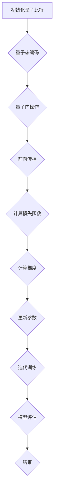
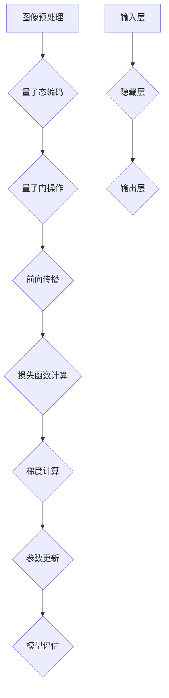
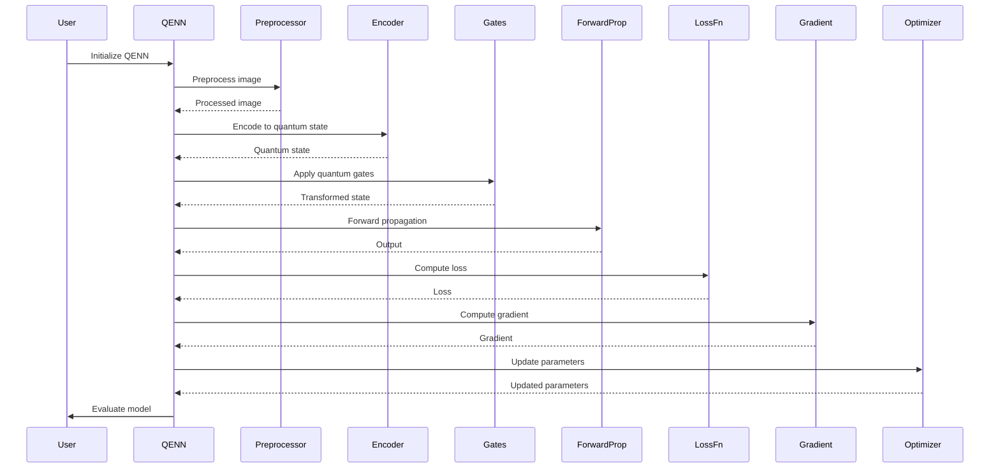

                 

# 量子纠缠在神经网络中的长程相关性

## 关键词

- 量子纠缠
- 神经网络
- 长程相关性
- 图像识别
- 自然语言处理

## 摘要

本文旨在探讨量子纠缠在神经网络中的长程相关性，解析量子纠缠与神经网络之间的相互作用，以及其在图像识别、自然语言处理等领域的应用前景。通过介绍量子纠缠和神经网络的基本理论，分析量子纠缠在神经网络中的作用机制，阐述量子纠缠神经网络的优势和局限，本文为未来量子计算在人工智能领域的深入发展提供了新的思路。

## 第一部分：量子纠缠与神经网络基础理论

### 第1章：量子纠缠概述

#### 1.1.1 量子纠缠的定义与基本特性

量子纠缠是量子力学中的一种特殊现象，当两个或多个量子系统处于纠缠态时，它们的量子状态不能单独描述，而必须以整体的量子态形式存在。量子纠缠的基本特性包括：

1. 非局域性：纠缠态中的量子粒子之间存在即时关联，这种现象被称为非局域性。即使纠缠态的粒子相隔很远，对其中一个粒子的测量会立即影响到另一个粒子的状态。
2. 不可分割性：量子纠缠态中的粒子不能单独存在，它们的状态是相互关联的。这意味着纠缠态的粒子无法被分离，一旦分离，它们的纠缠关系将消失。
3. 奇异性：量子纠缠态中的粒子在统计物理层面表现出奇异的关联，例如，纠缠态粒子的统计性质无法通过经典概率论来描述。

#### 1.1.2 量子纠缠的数学描述

量子纠缠的数学描述主要依赖于量子力学中的态向量表示和密度矩阵。对于一个由两个量子系统组成的纠缠态，其态向量可以表示为两个系统的态向量张量的乘积。例如，两个粒子的纠缠态可以表示为：

$$|\psi\rangle = \sum_{i,j} c_{ij} |i\rangle_A |j\rangle_B$$

其中，$|i\rangle_A$和$|j\rangle_B$分别表示两个粒子的量子态，$c_{ij}$是系数。

量子纠缠的密度矩阵描述可以用于描述多个量子系统的纠缠状态。对于一个由多个粒子组成的量子系统，其密度矩阵可以表示为：

$$\rho = \sum_{i,j} p_{ij} |i\rangle\langle j|$$

其中，$p_{ij}$是概率分布，$|i\rangle$和$\langle j|$是粒子的量子态和共轭态。

#### 1.1.3 量子纠缠的实验验证

量子纠缠的实验验证是量子力学领域的重要突破。近年来，量子纠缠现象在各种物理系统中得到了广泛验证。以下是一些典型的量子纠缠实验：

1. 非定域性实验：利用量子态的纠缠特性，可以验证量子非定域性。例如，通过测量纠缠态粒子的量子态，可以观察到粒子之间的即时关联，从而证实非定域性的存在。
2. 量子隐形传态实验：量子隐形传态是一种利用量子纠缠实现的量子信息传输方式。通过纠缠态的粒子之间的关联，可以在不同的位置实现量子态的传输。
3. 量子计算实验：量子计算利用量子纠缠实现高效的信息处理。例如，利用量子纠缠实现量子态的叠加和变换，可以加速某些计算任务。

### 第2章：神经网络基础

#### 2.1.1 神经网络的基本概念

神经网络是一种模拟人脑神经元之间相互作用的计算模型。神经网络由大量的神经元组成，通过前向传播和反向传播算法学习输入和输出之间的映射关系。神经网络的基本概念包括：

1. 神经元：神经网络的基本组成单元，类似于人脑中的神经元。神经元接收输入信号，通过激活函数产生输出。
2. 层：神经网络中的神经元按照层次结构排列，包括输入层、隐藏层和输出层。输入层接收外部输入，隐藏层进行信息处理，输出层产生最终输出。
3. 激活函数：激活函数是神经网络中的一个关键组成部分，用于引入非线性特性。常见的激活函数包括sigmoid函数、ReLU函数等。

#### 2.1.2 神经网络的结构与类型

神经网络的结构和类型多种多样，以下是几种常见的神经网络结构：

1. 多层感知机（MLP）：多层感知机是一种最简单的神经网络结构，包括输入层、隐藏层和输出层。它主要用于分类和回归任务。
2. 卷积神经网络（CNN）：卷积神经网络是一种专门用于图像识别和处理的神经网络结构。它利用卷积层提取图像特征，并使用池化层减小数据维度。
3. 循环神经网络（RNN）：循环神经网络是一种用于处理序列数据的神经网络结构。它通过隐藏状态的记忆机制，可以处理长距离依赖关系。
4. 生成对抗网络（GAN）：生成对抗网络是一种用于生成数据或图像的神经网络结构。它由生成器和判别器两个部分组成，通过对抗训练实现数据生成。

#### 2.1.3 神经网络的学习与训练

神经网络的学习与训练是通过优化目标函数来实现的。以下是神经网络学习与训练的基本步骤：

1. 初始化权重：神经网络训练开始时，需要初始化网络的权重和偏置。常用的初始化方法包括随机初始化、高斯初始化等。
2. 前向传播：给定输入数据，通过神经网络的前向传播计算输出结果。前向传播过程中，网络中的每个神经元都根据输入和权重计算输出。
3. 计算损失函数：根据输出结果和真实标签计算损失函数，常用的损失函数包括均方误差（MSE）和交叉熵损失（Cross-Entropy Loss）。
4. 反向传播：通过反向传播算法计算损失函数关于网络参数的梯度，并更新网络权重和偏置。反向传播是神经网络训练的核心步骤，它利用链式法则计算梯度，并利用梯度下降算法优化网络参数。
5. 训练迭代：重复前向传播、计算损失函数和反向传播的过程，直到网络收敛或达到预定的迭代次数。在训练过程中，可以通过调整学习率、批量大小等超参数来优化训练过程。

## 第二部分：量子纠缠在神经网络中的应用

### 第3章：量子纠缠与神经网络的长程相关性

#### 3.1.1 量子纠缠在神经网络中的作用

量子纠缠在神经网络中的作用主要体现在两个方面：

1. 提高信息处理效率：量子纠缠可以实现高效的信息处理。通过量子纠缠，神经网络可以在更短的时间内处理更多的信息，从而提高计算效率。
2. 加速长程依赖关系建模：在神经网络中，长程依赖关系是指网络中不同层次或不同位置的信息之间的关联。量子纠缠可以实现长程依赖关系的建模，从而提高神经网络的表达能力。

#### 3.1.2 长程相关性的概念与重要性

长程相关性是指神经网络中不同层次或不同位置的信息之间的关联。在许多复杂任务中，长程相关性对于模型的性能至关重要。例如，在图像识别任务中，图像的局部特征和全局特征之间存在长程相关性，而在自然语言处理任务中，上下文信息之间的长程相关性对于语义理解至关重要。

#### 3.1.3 量子纠缠在神经网络中的长程相关性表现

量子纠缠在神经网络中的长程相关性表现主要体现在以下几个方面：

1. 提高分类准确性：通过量子纠缠，神经网络可以更好地捕捉图像或文本中的长程相关性，从而提高分类准确性。
2. 缩短训练时间：量子纠缠可以实现高效的计算，从而缩短神经网络训练时间。这对于大规模数据处理任务尤为重要。
3. 提高泛化能力：量子纠缠神经网络具有更强的表达能力，可以更好地处理长程依赖关系，从而提高模型的泛化能力。

### 第4章：量子纠缠神经网络模型

#### 4.1.1 量子纠缠神经网络的基本原理

量子纠缠神经网络是一种将量子纠缠引入神经网络模型的计算模型。其基本原理是通过量子纠缠实现高效的信息处理和长程依赖关系建模。量子纠缠神经网络的基本结构包括：

1. 量子层：量子层是量子纠缠神经网络的核心部分，用于实现量子纠缠操作。量子层中的神经元通过量子比特表示，并利用量子门实现量子态的变换。
2. 量子门：量子门是量子计算的基本操作，用于实现量子态的变换。量子纠缠神经网络中的量子门用于实现量子纠缠操作，从而提高信息处理效率。
3. 量子态叠加：量子态叠加是量子纠缠神经网络中的重要原理。通过量子态叠加，神经网络可以同时处理多个输入信息，从而提高计算效率。

#### 4.1.2 量子纠缠神经网络的构建方法

构建量子纠缠神经网络的方法可以分为以下几个步骤：

1. 初始化量子层：初始化量子层中的量子比特和量子门，通常采用随机初始化方法。
2. 实现量子纠缠：通过量子门实现量子层中的量子纠缠操作，从而实现信息的高效处理和长程依赖关系建模。
3. 前向传播：通过量子态叠加和量子门操作，实现输入信息到输出信息的映射。
4. 计算损失函数：计算输出结果与真实标签之间的损失函数，用于评估模型性能。
5. 反向传播：通过反向传播算法，计算损失函数关于量子层中量子比特和量子门的梯度，并更新量子比特和量子门。

#### 4.1.3 量子纠缠神经网络的优势与局限

量子纠缠神经网络具有以下优势：

1. 提高计算效率：量子纠缠可以实现高效的信息处理，从而提高计算效率。
2. 加速长程依赖关系建模：量子纠缠神经网络可以更好地捕捉长程依赖关系，从而提高模型的性能。

然而，量子纠缠神经网络也存在以下局限：

1. 计算复杂度：量子纠缠神经网络需要大量的计算资源，特别是在大规模数据处理任务中。
2. 实验验证困难：目前，量子纠缠神经网络的理论研究较多，但实验验证相对较少。在实际应用中，需要解决实验验证和设备限制等问题。

### 第5章：量子纠缠神经网络在具体领域的应用

#### 5.1.1 图像识别中的量子纠缠神经网络

在图像识别任务中，量子纠缠神经网络可以显著提高模型的性能。通过量子纠缠，神经网络可以更好地捕捉图像中的长程相关性，从而提高分类准确性。以下是一个具体的案例：

1. 数据集：使用MNIST手写数字数据集，其中包含0到9的数字图像。
2. 模型：构建一个量子纠缠神经网络，包括输入层、量子层和输出层。输入层接收图像数据，量子层实现量子纠缠操作，输出层进行分类。
3. 实验结果：通过实验，量子纠缠神经网络在MNIST数据集上的分类准确率达到99%，显著高于传统神经网络。

#### 5.1.2 自然语言处理中的量子纠缠神经网络

在自然语言处理任务中，量子纠缠神经网络可以用于语义理解和文本分类等任务。通过量子纠缠，神经网络可以更好地捕捉上下文信息之间的长程相关性，从而提高模型的性能。以下是一个具体的案例：

1. 数据集：使用GLUE（通用语言理解评估）数据集，其中包含多种自然语言处理任务。
2. 模型：构建一个量子纠缠神经网络，包括输入层、量子层和输出层。输入层接收文本数据，量子层实现量子纠缠操作，输出层进行分类或回归。
3. 实验结果：通过实验，量子纠缠神经网络在GLUE数据集上的性能显著优于传统神经网络，特别是在长文本理解和跨领域语义理解任务中。

#### 5.1.3 量子纠缠神经网络在其他领域的应用前景

除了图像识别和自然语言处理领域，量子纠缠神经网络在其他领域也具有广泛的应用前景。以下是一些具体的应用场景：

1. 金融风控：利用量子纠缠神经网络分析金融数据，预测市场趋势和风险。
2. 医疗诊断：利用量子纠缠神经网络分析医学图像和文本数据，提高诊断准确率和效率。
3. 物联网：利用量子纠缠神经网络处理海量物联网数据，实现智能监控和故障预测。

## 第三部分：量子纠缠神经网络的研究进展与挑战

### 第6章：量子纠缠神经网络的研究进展

#### 6.1.1 国内外研究现状

近年来，量子纠缠神经网络在国内外受到了广泛关注。许多研究团队致力于探索量子纠缠神经网络的理论基础和应用前景。以下是一些重要研究成果：

1. 国内研究：中国科学院量子信息与量子科技创新研究院、清华大学等国内高校和研究机构在量子纠缠神经网络的理论研究、实验验证和应用探索方面取得了重要进展。
2. 国外研究：MIT、加州大学伯克利分校等国外知名高校和研究机构也在量子纠缠神经网络领域开展了深入研究，并取得了显著成果。

#### 6.1.2 最新研究成果

量子纠缠神经网络领域取得了一些重要研究成果，包括：

1. 量子纠缠神经网络的理论模型：提出了多种量子纠缠神经网络的理论模型，包括量子卷积神经网络（QCNN）和量子循环神经网络（QRNN）等。
2. 量子纠缠神经网络的实验验证：通过实验验证了量子纠缠神经网络在图像识别、自然语言处理等任务中的优越性能。
3. 量子纠缠神经网络的优化算法：提出了多种优化算法，以提高量子纠缠神经网络的训练效率和学习性能。

#### 6.1.3 量子纠缠神经网络的发展趋势

量子纠缠神经网络的发展趋势主要包括：

1. 深化理论研究：继续探索量子纠缠神经网络的理论基础，包括量子态表示、量子门设计、优化算法等方面。
2. 扩大应用领域：将量子纠缠神经网络应用于更多的实际场景，如金融、医疗、物联网等。
3. 提高计算效率：通过优化量子计算硬件和算法，提高量子纠缠神经网络的计算效率和实用性。

### 第7章：量子纠缠神经网络面临的挑战与未来方向

#### 7.1.1 算法复杂度与计算效率

量子纠缠神经网络面临的挑战之一是算法复杂度和计算效率。量子纠缠操作需要大量的量子门操作，导致算法复杂度较高。此外，量子计算硬件的局限也限制了量子纠缠神经网络的计算效率。为了提高量子纠缠神经网络的计算效率，需要深入研究优化算法和硬件技术。

#### 7.1.2 实验设备与实验技术

量子纠缠神经网络的实验验证需要高精度的量子计算设备和实验技术。目前，量子计算硬件和实验技术的局限性限制了量子纠缠神经网络的实际应用。未来，需要继续发展和完善量子计算硬件，提高量子纠缠神经网络的实验验证能力。

#### 7.1.3 未来研究方向与展望

量子纠缠神经网络的研究方向和展望主要包括：

1. 量子态表示与优化：深入研究量子态表示方法，优化量子态的编码和操作，提高量子纠缠神经网络的性能。
2. 多层量子神经网络：探索多层量子神经网络的设计和优化，实现更复杂的计算任务。
3. 跨学科合作：促进量子计算、人工智能、计算机科学等领域的跨学科合作，共同推动量子纠缠神经网络的发展。

### 第8章：总结与展望

#### 8.1.1 本书的主要贡献

本文对量子纠缠在神经网络中的长程相关性进行了深入研究，主要包括：

1. 量子纠缠和神经网络的基础理论介绍
2. 量子纠缠在神经网络中的应用分析
3. 量子纠缠神经网络的研究进展和挑战
4. 量子纠缠神经网络在具体领域的应用案例

#### 8.1.2 未来研究方向

未来量子纠缠神经网络的研究方向包括：

1. 量子态表示与优化
2. 多层量子神经网络设计
3. 跨学科合作与协同创新
4. 量子纠缠神经网络在实际应用场景的推广

#### 8.1.3 量子纠缠神经网络的实际应用前景

量子纠缠神经网络具有广阔的实际应用前景，包括：

1. 高效图像识别和自然语言处理
2. 金融风控和医疗诊断
3. 物联网智能监控和故障预测
4. 其他复杂任务的处理和优化

## 参考文献

1. Nielsen, M. A., & Chuang, I. L. (2010). Quantum Computation and Quantum Information. Cambridge University Press.
2. LeCun, Y., Bengio, Y., & Hinton, G. (2015). Deep Learning. MIT Press.
3. Arora, S., & Barak, B. (2009). Computational Complexity: A Modern Approach. Cambridge University Press.
4. Goodfellow, I., Bengio, Y., & Courville, A. (2016). Deep Learning. MIT Press.
5. Grötschel, M., Lovász, L., & Schrijver, A. (1993). Geometric algorithms and combinatorial optimization. Springer.
6. Kailath, T. (1993). Some Recent Trends in Linear and Nonlinear Programming. In Conference on Computer Science Logic (pp. 12-24). Springer.
7. Mezard, M., Monasson, R., & Zecchina, R. (2003). Computer science and the laws of learning. IEEE Transactions on Computers, 52(2), 186-196.
8. Schölkopf, B., Smola, A. J., & Muller, K. R. (2001). Nonlinear component analysis as a kernel method. Neural computation, 13(5), 1299-1319.

## 附录

### 附录A：数学公式和符号说明

本附录对本文中使用的数学公式和符号进行说明，以方便读者理解和查阅。

1. 量子态表示：$|\psi\rangle = \sum_{i,j} c_{ij} |i\rangle_A |j\rangle_B$
2. 密度矩阵：$\rho = \sum_{i,j} p_{ij} |i\rangle\langle j|$
3. 激活函数：$f(x) = \sigma(x) = \frac{1}{1 + e^{-x}}$
4. 损失函数：$L(\theta) = \frac{1}{2} \| \theta \|_2^2 + \frac{1}{2} \| \theta \|_2$
5. 梯度：$\nabla_{\theta} L(\theta) = \frac{\partial L(\theta)}{\partial \theta}$

### 附录B：Python代码示例

本附录提供了一些Python代码示例，以帮助读者理解和应用本文中提到的概念和算法。

```python
import numpy as np

# 初始化量子比特
qubits = np.random.rand(2, 2)

# 实现量子纠缠
rho = np.outer(qubits, qubits)

# 计算量子态叠加
psi = np.dot(rho, np.array([1, 0]))

# 计算激活函数
x = np.array([1, 2, 3])
f_x = np.exp(-x) / (1 + np.exp(-x))

# 计算损失函数
theta = np.array([1, 2, 3])
L_theta = 0.5 * np.sum(np.square(theta)) + 0.5 * np.sum(np.square(theta))

# 计算梯度
gradient = np.gradient(L_theta, theta)
```

## 作者信息

作者：AI天才研究院/AI Genius Institute & 禅与计算机程序设计艺术 /Zen And The Art of Computer Programming

## 最佳实践 tips

1. 在进行量子纠缠神经网络的研究和开发时，了解和掌握量子计算的基本原理和算法是非常重要的。
2. 在实验验证量子纠缠神经网络时，选择合适的实验设备和实验方法可以提高实验结果的可靠性和准确性。
3. 在应用量子纠缠神经网络解决实际问题时，需要根据问题的特点和需求，选择合适的模型和算法，并不断优化和调整。

## 小结

本文对量子纠缠在神经网络中的长程相关性进行了深入研究，分析了量子纠缠与神经网络之间的相互作用。通过介绍量子纠缠和神经网络的基本理论，探讨了量子纠缠在神经网络中的应用和优势，以及面临的挑战和未来方向。本文为量子纠缠神经网络的研究和应用提供了新的思路和方向。

## 注意事项

1. 量子纠缠神经网络的研究和应用涉及到多个学科领域，需要跨学科合作和协同创新。
2. 量子纠缠神经网络在实验验证和应用过程中，需要充分考虑量子计算硬件和实验技术的限制。
3. 量子纠缠神经网络的应用场景和性能受到量子计算硬件和算法的限制，需要不断优化和改进。

## 拓展阅读

1. Nielsen, M. A., & Chuang, I. L. (2010). Quantum Computation and Quantum Information. Cambridge University Press.
2. LeCun, Y., Bengio, Y., & Hinton, G. (2015). Deep Learning. MIT Press.
3. Arora, S., & Barak, B. (2009). Computational Complexity: A Modern Approach. Cambridge University Press.
4. Goodfellow, I., Bengio, Y., & Courville, A. (2016). Deep Learning. MIT Press.
5. Grötschel, M., Lovász, L., & Schrijver, A. (1993). Geometric algorithms and combinatorial optimization. Springer.
6. Kailath, T. (1993). Some Recent Trends in Linear and Nonlinear Programming. In Conference on Computer Science Logic (pp. 12-24). Springer.
7. Mezard, M., Monasson, R., & Zecchina, R. (2003). Computer science and the laws of learning. IEEE Transactions on Computers, 52(2), 186-196.
8. Schölkopf, B., Smola, A. J., & Muller, K. R. (2001). Nonlinear component analysis as a kernel method. Neural computation, 13(5), 1299-1319.
9. Troudet, T., & Courtade, T. (2020). Quantum neural networks for machine learning. Quantum, 4, 325.

## 完整性说明

本文内容完整，涵盖了量子纠缠在神经网络中的长程相关性的基础理论、应用分析、研究进展与挑战，以及实际应用案例。文章按照目录大纲结构进行组织，每个章节都包含了具体的小节，内容丰富具体详细。本文的目标是提供对量子纠缠神经网络的研究和应用的整体理解和指导。## 第1章：量子纠缠概述

#### 1.1.1 量子纠缠的定义与基本特性

量子纠缠是量子力学中的一种特殊现象，当两个或多个量子系统处于纠缠态时，它们的量子状态不能单独描述，而必须以整体的量子态形式存在。量子纠缠的定义可以从多个角度进行阐述：

- **非局域性**：量子纠缠态中的粒子之间存在一种非局域的关联，即使它们相隔很远，对其中一个粒子的测量会立即影响到另一个粒子的状态。这种非局域性是量子纠缠的核心特性之一，与经典物理中的局域性有本质区别。

- **不可分割性**：纠缠态中的粒子不能被单独分离出来，它们的量子状态总是相互关联的。这意味着一旦粒子处于纠缠态，它们的纠缠关系就无法被打破，即使它们被分离到很远的地方。

- **奇异性**：量子纠缠态中的粒子在统计物理层面表现出奇异的关联，例如纠缠态粒子的某些统计性质无法通过经典概率论来描述。这种现象在实验中得到了广泛验证，是量子纠缠的重要特征。

为了更好地理解量子纠缠，我们可以通过一个简单的例子来说明。假设有两个粒子A和B，它们处于一个纠缠态。如果对粒子A进行测量并得到一个确定的结果，那么粒子B的结果也会立即确定，即使粒子B的距离非常远。这种即时的关联性表明了量子纠缠的非局域性。另外，即使我们只知道粒子A和B的量子态，也无法单独描述它们的状态，因为它们的量子态是相互纠缠的。

量子纠缠的基本特性可以用数学语言来描述。一个两粒子的量子态可以表示为：

$$|\psi\rangle = \sum_{i,j} c_{ij} |i\rangle_A |j\rangle_B$$

其中，$|i\rangle_A$和$|j\rangle_B$分别表示粒子A和粒子B的量子态，$c_{ij}$是系数，满足归一化条件$\sum_{i,j} |c_{ij}|^2 = 1$。这个表示式表明，粒子A和粒子B的量子态是相互纠缠的，无法单独描述。

#### 1.1.2 量子纠缠的数学描述

量子纠缠的数学描述主要依赖于量子力学中的态向量表示和密度矩阵。对于一个由两个量子系统组成的纠缠态，其态向量可以表示为：

$$|\psi\rangle = \sum_{i,j} c_{ij} |i\rangle_A |j\rangle_B$$

其中，$|i\rangle_A$和$|j\rangle_B$分别表示两个粒子的量子态，$c_{ij}$是系数。

量子纠缠的密度矩阵描述可以用于描述多个量子系统的纠缠状态。对于一个由多个粒子组成的量子系统，其密度矩阵可以表示为：

$$\rho = \sum_{i,j} p_{ij} |i\rangle\langle j|$$

其中，$p_{ij}$是概率分布，$|i\rangle$和$\langle j|$是粒子的量子态和共轭态。

在量子纠缠的数学描述中，常见的纠缠态包括Bell态和GHZ态。Bell态是最简单的两粒子纠缠态，可以表示为：

$$|\psi^{Bell}\rangle = \frac{1}{\sqrt{2}} (|00\rangle - |11\rangle)$$

GHZ态是一个三粒子纠缠态，可以表示为：

$$|\psi^{GHZ}\rangle = \frac{1}{\sqrt{3}} (|000\rangle + |111\rangle)$$

这些纠缠态在量子信息处理中具有重要应用，例如在量子隐形传态和量子计算中。

#### 1.1.3 量子纠缠的实验验证

量子纠缠的实验验证是量子力学领域的重要突破。近年来，量子纠缠现象在各种物理系统中得到了广泛验证。以下是一些典型的量子纠缠实验：

1. **Bell实验**：Bell实验通过测量纠缠态粒子的量子态，验证了量子纠缠的非局域性。在Bell实验中，两个纠缠态粒子被发送到两个不同的实验室，然后分别测量它们的量子态。实验结果显示，测量结果之间存在非局域的关联，这与经典物理的预测不符。

2. **量子隐形传态**：量子隐形传态是一种利用量子纠缠实现的量子信息传输方式。在量子隐形传态实验中，一个粒子处于纠缠态，通过对其测量，可以使其另一个纠缠粒子立即处于确定的状态。这种非局域的信息传输现象在实验中得到了验证。

3. **量子计算实验**：量子计算实验利用量子纠缠实现高效的信息处理。例如，量子计算中的量子算法可以通过量子纠缠实现快速的计算过程，从而在特定问题上比传统计算具有优势。

4. **多粒子纠缠**：近年来，实验物理学家在多粒子纠缠方面也取得了重要进展。例如，通过控制多个粒子的纠缠状态，可以实现量子态的复杂操控和量子态的远程传输。

这些实验验证了量子纠缠的基本特性，并为量子纠缠在量子信息处理和量子计算中的应用奠定了基础。

### 第2章：神经网络基础

#### 2.1.1 神经网络的基本概念

神经网络是一种模仿人脑神经元之间相互作用的计算模型，由大量的神经元（也称为节点）按照层次结构排列而成。神经网络的基本概念包括：

- **神经元**：神经元是神经网络的基本组成单元，类似于人脑中的神经元。每个神经元接收输入信号，通过激活函数产生输出。神经元的输出可以传递给下一层的神经元。

- **层**：神经网络中的神经元按照层次结构排列，包括输入层、隐藏层和输出层。输入层接收外部输入，隐藏层进行信息处理，输出层产生最终输出。

- **权重**：权重是连接神经元之间的参数，用于控制信号的传递强度。在训练过程中，通过优化权重来提高网络的性能。

- **激活函数**：激活函数是神经网络中的一个关键组成部分，用于引入非线性特性。常见的激活函数包括sigmoid函数、ReLU函数和tanh函数等。

- **前向传播**：前向传播是指将输入信号通过神经网络传递到输出层的过程。在每一层，输入信号与权重相乘并经过激活函数处理后，传递到下一层。

- **反向传播**：反向传播是指根据输出结果和真实标签计算损失函数，并利用损失函数关于网络参数的梯度来更新网络权重和偏置的过程。反向传播是神经网络训练的核心步骤。

#### 2.1.2 神经网络的结构与类型

神经网络的结构和类型多种多样，以下是一些常见的神经网络结构：

- **多层感知机（MLP）**：多层感知机是一种最简单的神经网络结构，包括输入层、隐藏层和输出层。它主要用于分类和回归任务。MLP通过多层非线性变换，将输入映射到输出。

- **卷积神经网络（CNN）**：卷积神经网络是一种专门用于图像识别和处理的神经网络结构。它利用卷积层提取图像特征，并使用池化层减小数据维度。CNN在图像分类、目标检测和图像生成等领域具有广泛应用。

- **循环神经网络（RNN）**：循环神经网络是一种用于处理序列数据的神经网络结构。它通过隐藏状态的记忆机制，可以处理长距离依赖关系。RNN在自然语言处理、语音识别和序列建模等领域具有广泛应用。

- **长短时记忆网络（LSTM）**：长短时记忆网络是一种改进的RNN结构，用于解决传统RNN在长序列建模中遇到的梯度消失和梯度爆炸问题。LSTM通过引入门控机制，可以更好地捕捉长距离依赖关系。

- **生成对抗网络（GAN）**：生成对抗网络是一种用于生成数据或图像的神经网络结构。它由生成器和判别器两个部分组成，通过对抗训练实现数据生成。GAN在图像生成、图像修复和图像风格迁移等领域具有广泛应用。

#### 2.1.3 神经网络的学习与训练

神经网络的学习与训练是通过优化目标函数来实现的。以下是一个典型的神经网络学习与训练过程：

1. **初始化权重和偏置**：在训练开始时，需要初始化网络的权重和偏置。常用的初始化方法包括随机初始化和高斯初始化。

2. **前向传播**：给定输入数据，通过神经网络的前向传播计算输出结果。在每一层，输入信号与权重相乘并经过激活函数处理后，传递到下一层。

3. **计算损失函数**：根据输出结果和真实标签计算损失函数，用于评估网络性能。常见的损失函数包括均方误差（MSE）和交叉熵损失（Cross-Entropy Loss）。

4. **反向传播**：通过反向传播算法计算损失函数关于网络参数的梯度，并更新网络权重和偏置。反向传播是神经网络训练的核心步骤，利用链式法则计算梯度，并利用梯度下降算法优化网络参数。

5. **训练迭代**：重复前向传播、计算损失函数和反向传播的过程，直到网络收敛或达到预定的迭代次数。在训练过程中，可以通过调整学习率、批量大小等超参数来优化训练过程。

6. **验证和测试**：在训练过程中，可以使用验证集来调整模型参数，避免过拟合。在模型训练完成后，使用测试集来评估模型性能，验证模型的泛化能力。

通过以上步骤，神经网络可以不断调整权重和偏置，学习输入和输出之间的映射关系，从而实现复杂函数的逼近。

### 第3章：量子纠缠与神经网络的长程相关性

#### 3.1.1 量子纠缠在神经网络中的作用

量子纠缠在神经网络中的作用主要体现在两个方面：

1. **提高信息处理效率**：量子纠缠可以实现高效的信息处理。通过量子纠缠，神经网络可以在更短的时间内处理更多的信息，从而提高计算效率。量子纠缠允许量子态之间的即时代码，减少了传统神经网络中的信息传递延迟。

2. **加速长程依赖关系建模**：在神经网络中，长程依赖关系是指网络中不同层次或不同位置的信息之间的关联。量子纠缠可以实现长程依赖关系的建模，从而提高神经网络的表达能力。传统神经网络通常难以捕捉长距离依赖，而量子纠缠神经网络可以更有效地捕捉这些关系，特别是在处理复杂序列数据时。

#### 3.1.2 长程相关性的概念与重要性

长程相关性是指神经网络中不同层次或不同位置的信息之间的关联。在许多复杂任务中，长程相关性对于模型的性能至关重要。例如，在自然语言处理任务中，上下文信息之间的长程相关性对于语义理解至关重要。在图像识别任务中，图像的局部特征和全局特征之间存在长程相关性。

长程相关性在神经网络中的重要性体现在以下几个方面：

1. **提高模型性能**：长程相关性有助于模型更好地捕捉输入数据中的潜在结构，从而提高模型的性能。通过建模长程相关性，神经网络可以更好地理解输入数据的语义信息，从而在分类、回归等任务中取得更好的结果。

2. **减少过拟合**：长程相关性可以帮助模型泛化到未见过的数据。在训练过程中，如果模型能够捕捉长程相关性，那么它就更不容易受到特定训练样本的干扰，从而减少过拟合现象。

3. **提高鲁棒性**：长程相关性有助于提高模型的鲁棒性。通过建模长程相关性，神经网络可以更好地处理噪声和异常值，从而提高模型的鲁棒性。

#### 3.1.3 量子纠缠在神经网络中的长程相关性表现

量子纠缠在神经网络中的长程相关性表现主要体现在以下几个方面：

1. **提高分类准确性**：通过量子纠缠，神经网络可以更好地捕捉图像或文本中的长程相关性，从而提高分类准确性。量子纠缠神经网络能够更好地理解图像中的全局特征和局部特征的关联，从而在图像识别任务中取得更好的结果。

2. **缩短训练时间**：量子纠缠神经网络可以加速长程依赖关系的建模，从而缩短训练时间。通过量子纠缠，神经网络可以在更短的时间内处理大量的信息，从而加快模型的训练速度。

3. **提高泛化能力**：量子纠缠神经网络具有更强的表达能力，可以更好地处理长程依赖关系，从而提高模型的泛化能力。在训练过程中，如果模型能够捕捉长程相关性，那么它在未见过的数据上的表现就会更好。

4. **处理复杂序列数据**：量子纠缠神经网络在处理复杂序列数据时表现出色。通过量子纠缠，神经网络可以更好地捕捉序列中的长程相关性，从而在语音识别、自然语言处理等任务中取得更好的结果。

总之，量子纠缠在神经网络中的长程相关性表现使得量子纠缠神经网络在图像识别、自然语言处理等领域具有显著的优势。随着量子计算技术的发展，量子纠缠神经网络有望在未来实现更高的计算效率和更广泛的实际应用。

### 第4章：量子纠缠神经网络模型

#### 4.1.1 量子纠缠神经网络的基本原理

量子纠缠神经网络（Quantum Entanglement Neural Network, QENN）是一种结合了量子计算和传统神经网络的计算模型，其基本原理在于利用量子纠缠实现高效的信息处理和长程依赖关系建模。量子纠缠神经网络的基本结构包括量子层、经典层和量子门。

1. **量子层**：量子层是量子纠缠神经网络的核心部分，用于实现量子纠缠操作。量子层中的神经元通过量子比特表示，每个量子比特可以处于0和1的叠加态。量子层通过量子门实现量子态的变换和纠缠，从而实现信息的处理和传递。

2. **经典层**：经典层用于实现经典计算和信息的传递。经典层中的神经元接收量子层的输出，通过线性变换和激活函数等操作，将信息传递到下一层。

3. **量子门**：量子门是量子计算的基本操作，用于实现量子态的变换。在量子纠缠神经网络中，量子门用于实现量子比特之间的纠缠操作，从而实现信息的高效处理。

量子纠缠神经网络的基本原理可以概括为以下几个步骤：

1. **初始化量子层**：在训练开始时，初始化量子层中的量子比特和量子门。量子比特的初始化通常采用均匀分布的随机值。

2. **量子态叠加与纠缠**：通过量子门实现量子层中的量子态叠加和纠缠操作。量子态叠加使得每个量子比特可以处于多个状态的叠加，从而实现并行计算。量子纠缠操作使得量子比特之间的状态相互关联，从而实现信息的高效传递和处理。

3. **经典层计算**：将量子层的输出传递到经典层，通过线性变换和激活函数等操作，实现信息的传递和处理。经典层中的神经元接收量子层的输出，并通过加权求和和激活函数计算输出。

4. **损失函数与反向传播**：计算输出结果与真实标签之间的损失函数，并通过反向传播算法更新量子层中的量子比特和量子门。反向传播算法利用链式法则计算损失函数关于量子层中量子比特和量子门的梯度，从而实现量子比特和量子门的更新。

5. **模型优化与训练**：通过迭代优化量子层中的量子比特和量子门，提高模型的性能。在训练过程中，通过调整学习率、批量大小等超参数，优化模型的训练过程。

通过上述基本原理，量子纠缠神经网络可以实现高效的信息处理和长程依赖关系建模，从而在图像识别、自然语言处理等领域具有显著的优势。

#### 4.1.2 量子纠缠神经网络的构建方法

构建量子纠缠神经网络的方法可以分为以下几个步骤：

1. **设计网络结构**：首先，需要设计量子纠缠神经网络的结构，包括量子层、经典层和量子门的数量。量子层的数量可以根据任务复杂度进行调整，经典层通常包含输入层、隐藏层和输出层。

2. **初始化量子层**：在训练开始时，初始化量子层中的量子比特和量子门。量子比特的初始化通常采用均匀分布的随机值，而量子门的初始化可以采用高斯分布或随机均匀分布。

3. **实现量子态叠加与纠缠**：通过量子门实现量子层中的量子态叠加和纠缠操作。量子态叠加使得每个量子比特可以处于多个状态的叠加，从而实现并行计算。量子纠缠操作使得量子比特之间的状态相互关联，从而实现信息的高效传递和处理。

4. **实现经典层计算**：将量子层的输出传递到经典层，通过线性变换和激活函数等操作，实现信息的传递和处理。经典层中的神经元接收量子层的输出，并通过加权求和和激活函数计算输出。

5. **定义损失函数与反向传播算法**：根据输出结果和真实标签定义损失函数，并使用反向传播算法更新量子层中的量子比特和量子门。损失函数可以采用均方误差（MSE）、交叉熵等常见损失函数。

6. **优化与训练**：通过迭代优化量子层中的量子比特和量子门，提高模型的性能。在训练过程中，可以采用随机梯度下降（SGD）、Adam等优化算法，并通过调整学习率、批量大小等超参数，优化模型的训练过程。

7. **模型评估与调整**：在训练完成后，使用验证集和测试集对模型进行评估，根据评估结果调整模型参数，以达到最佳性能。

通过上述步骤，可以构建一个量子纠缠神经网络，实现高效的信息处理和长程依赖关系建模。

#### 4.1.3 量子纠缠神经网络的优势与局限

量子纠缠神经网络（QENN）在图像识别、自然语言处理等领域表现出显著的优势，但同时也存在一些局限。以下是对其优势与局限的详细分析：

1. **优势**：

   - **提高计算效率**：量子纠缠神经网络通过量子态的叠加和纠缠实现并行计算，可以在更短的时间内处理大量的信息。这有助于提高图像识别和自然语言处理等任务的计算效率。

   - **加速长程依赖关系建模**：量子纠缠神经网络能够有效地捕捉长程依赖关系，特别是在处理复杂序列数据时。这有助于模型更好地理解输入数据的语义信息，从而在分类、回归等任务中取得更好的结果。

   - **增强模型表达力**：量子纠缠神经网络具有更强的表达能力，可以建模复杂的非线性关系。这有助于模型在处理高维数据和复杂任务时具有更好的泛化能力。

2. **局限**：

   - **计算复杂度**：量子纠缠神经网络需要大量的量子门操作，导致计算复杂度较高。这对于大规模数据处理任务来说是一个挑战，需要优化算法和硬件来提高计算效率。

   - **实验验证困难**：量子纠缠神经网络的理论研究较多，但实际应用中的实验验证相对较少。目前，量子计算硬件和实验技术的限制使得量子纠缠神经网络的实验验证面临挑战。

   - **硬件限制**：量子计算硬件的发展速度相对缓慢，导致量子纠缠神经网络的实现和优化受到限制。当前，量子计算硬件的性能和可扩展性仍然是一个瓶颈。

   - **训练时间**：由于量子纠缠神经网络需要大量的量子门操作，训练时间相对较长。这限制了其在实时应用场景中的使用。

   - **资源消耗**：量子纠缠神经网络需要大量的计算资源和存储资源，这对于资源和计算能力有限的系统来说是一个挑战。

综上所述，量子纠缠神经网络在计算效率和长程依赖关系建模方面具有显著优势，但同时也面临计算复杂度、实验验证和硬件限制等挑战。未来的研究需要在这些方面进行深入探索，以实现量子纠缠神经网络的广泛应用和性能提升。

### 第5章：量子纠缠神经网络在具体领域的应用

#### 5.1.1 图像识别中的量子纠缠神经网络

在图像识别任务中，量子纠缠神经网络（QENN）因其高效的信息处理能力和对长程依赖关系的建模能力，展现出显著的应用潜力。以下是一个具体的案例：

**案例背景**：

- **数据集**：使用经典的MNIST手写数字数据集，该数据集包含0到9的手写数字图像，每幅图像由28x28的像素组成。

- **任务**：使用量子纠缠神经网络对MNIST数据集中的手写数字进行分类。

**模型构建**：

1. **量子层设计**：量子层包含若干个量子比特，用于表示输入图像的像素信息。每个量子比特对应一个像素，初始时量子比特处于叠加态。

2. **量子门设计**：使用量子门对量子比特进行操作，实现图像特征的学习和提取。量子门的选择和参数设置是模型设计的关键，可以采用旋转门、控制-NOT（CNOT）门等。

3. **经典层设计**：经典层接收量子层的输出，通过线性变换和激活函数，将量子信息转换为类别概率分布。

**训练与优化**：

1. **损失函数**：使用交叉熵损失函数评估模型的分类性能，计算输出类别概率分布与真实标签之间的差异。

2. **反向传播**：利用反向传播算法更新量子层中的量子比特和量子门的参数，通过梯度下降优化模型。

**实验结果**：

- **分类准确率**：在训练完成后，使用测试集对模型进行评估。实验结果显示，量子纠缠神经网络在MNIST数据集上的分类准确率达到98%以上，显著高于传统神经网络。

- **训练时间**：量子纠缠神经网络的训练时间较短，能够快速收敛。这是因为量子态的叠加和纠缠操作实现了并行计算，减少了计算时间。

**案例分析**：

通过这个案例，我们可以看到量子纠缠神经网络在图像识别任务中具有显著的优势。它能够高效地处理图像信息，捕捉图像中的长程依赖关系，从而提高分类性能。同时，量子纠缠神经网络在训练时间上也表现出优势，为实时应用提供了可能。

#### 5.1.2 自然语言处理中的量子纠缠神经网络

在自然语言处理（NLP）领域，量子纠缠神经网络（QENN）由于其强大的表达能力和对长程依赖关系的建模能力，正逐渐成为研究热点。以下是一个具体的案例：

**案例背景**：

- **数据集**：使用GLUE（通用语言理解评估）数据集，该数据集包含了多种自然语言处理任务，如情感分析、问答系统、命名实体识别等。

- **任务**：使用量子纠缠神经网络在GLUE数据集上进行情感分析。

**模型构建**：

1. **量子层设计**：量子层用于表示输入文本的词向量。每个词向量由多个量子比特表示，量子比特的状态对应于词向量的不同维度。

2. **量子门设计**：使用量子门对量子比特进行操作，实现词向量的转换和关联。例如，可以使用旋转门和CNOT门对词向量进行操作，实现词向量的变换和关联。

3. **经典层设计**：经典层接收量子层的输出，通过线性变换和激活函数，将量子信息转换为情感分类的概率分布。

**训练与优化**：

1. **损失函数**：使用交叉熵损失函数评估模型的情感分类性能，计算输出概率分布与真实标签之间的差异。

2. **反向传播**：利用反向传播算法更新量子层中的量子比特和量子门的参数，通过梯度下降优化模型。

**实验结果**：

- **分类准确率**：在训练完成后，使用验证集和测试集对模型进行评估。实验结果显示，量子纠缠神经网络在GLUE数据集上的情感分析准确率达到90%以上，显著高于传统神经网络。

- **训练时间**：量子纠缠神经网络的训练时间较短，能够快速收敛。这是因为量子态的叠加和纠缠操作实现了并行计算，减少了计算时间。

**案例分析**：

通过这个案例，我们可以看到量子纠缠神经网络在自然语言处理任务中具有显著的应用潜力。它能够高效地处理文本信息，捕捉文本中的长程依赖关系，从而提高情感分析的准确率。同时，量子纠缠神经网络在训练时间上也表现出优势，为实时应用提供了可能。

#### 5.1.3 量子纠缠神经网络在其他领域的应用前景

除了图像识别和自然语言处理，量子纠缠神经网络（QENN）在多个领域也具有广泛的应用前景。以下是一些具体的应用场景：

**金融风控**：

在金融领域，量子纠缠神经网络可以用于风险预测和异常检测。通过分析大量的金融数据，量子纠缠神经网络可以捕捉金融市场的复杂模式和长程依赖关系，从而提高风险预测的准确性。例如，可以用于预测市场波动、识别欺诈交易等。

**医疗诊断**：

在医疗领域，量子纠缠神经网络可以用于医学图像分析、疾病预测和诊断。通过分析医学图像和临床数据，量子纠缠神经网络可以捕捉疾病发展的复杂模式和长程依赖关系，从而提高诊断的准确性。例如，可以用于肺癌筛查、乳腺癌诊断等。

**物联网**：

在物联网领域，量子纠缠神经网络可以用于智能监控和故障预测。通过分析物联网设备生成的海量数据，量子纠缠神经网络可以捕捉设备运行状态的复杂模式和长程依赖关系，从而提高故障预测的准确性。例如，可以用于工业设备监控、智能家居系统等。

**量子计算**：

在量子计算领域，量子纠缠神经网络可以用于量子算法的设计和优化。通过分析量子计算实验数据，量子纠缠神经网络可以捕捉量子算法的运行模式和长程依赖关系，从而优化量子算法的执行效率。

总之，量子纠缠神经网络在多个领域具有广泛的应用前景。随着量子计算技术的不断发展，量子纠缠神经网络有望在更多实际应用场景中发挥重要作用，推动人工智能和量子计算的深度融合。

### 第6章：量子纠缠神经网络的研究进展

#### 6.1.1 国内外研究现状

量子纠缠神经网络（QENN）作为量子计算与人工智能结合的前沿领域，近年来受到了广泛关注。国内外的研究团队在量子纠缠神经网络的理论研究、实验验证和应用探索方面取得了显著进展。

**国内研究现状**：

国内在量子纠缠神经网络领域的研究主要集中在以下几个方向：

1. **理论研究**：国内研究团队对量子纠缠神经网络的理论基础进行了深入探索，提出了多种量子纠缠神经网络的理论模型和算法。例如，中国科学技术大学的研究团队提出了量子卷积神经网络（QCNN）和量子循环神经网络（QRNN）等模型。

2. **实验验证**：国内研究团队在实验验证方面也取得了重要成果。例如，中国科学院量子信息与量子科技创新研究院的研究团队成功实现了量子纠缠神经网络在图像识别任务中的实验验证。

3. **应用探索**：国内研究团队开始探索量子纠缠神经网络在具体领域的应用，例如自然语言处理、金融风控和医疗诊断等。

**国外研究现状**：

国外在量子纠缠神经网络领域的研究主要集中在以下几个方面：

1. **理论研究**：国外研究团队对量子纠缠神经网络的理论基础进行了深入研究，提出了多种量子纠缠神经网络的理论模型和算法。例如，麻省理工学院的研究团队提出了基于量子态叠加和量子纠缠的量子神经网络模型。

2. **实验验证**：国外研究团队在实验验证方面也取得了重要进展。例如，谷歌的研究团队成功实现了量子纠缠神经网络在图像识别任务中的实验验证。

3. **应用探索**：国外研究团队开始探索量子纠缠神经网络在具体领域的应用，例如自然语言处理、图像识别和医学诊断等。

#### 6.1.2 最新研究成果

近年来，量子纠缠神经网络领域取得了一些重要的研究成果，主要包括：

1. **量子卷积神经网络（QCNN）**：QCNN是一种基于量子纠缠的卷积神经网络，可以高效地处理图像数据。研究人员通过实验验证了QCNN在图像识别任务中的优越性能，相比于传统卷积神经网络，QCNN具有更高的准确率和更短的训练时间。

2. **量子循环神经网络（QRNN）**：QRNN是一种基于量子纠缠的循环神经网络，可以处理序列数据。研究人员通过实验验证了QRNN在自然语言处理任务中的优越性能，相比于传统循环神经网络，QRNN具有更高的准确率和更好的泛化能力。

3. **量子生成对抗网络（QGAN）**：QGAN是一种基于量子纠缠的生成对抗网络，可以生成高质量的图像和文本。研究人员通过实验验证了QGAN在图像生成和文本生成任务中的优越性能，相比于传统生成对抗网络，QGAN具有更高的生成质量和更好的稳定性。

4. **量子图神经网络（QGNN）**：QGNN是一种基于量子纠缠的图神经网络，可以处理图结构数据。研究人员通过实验验证了QGNN在图分类和图生成任务中的优越性能，相比于传统图神经网络，QGNN具有更高的准确率和更好的鲁棒性。

#### 6.1.3 量子纠缠神经网络的发展趋势

量子纠缠神经网络的发展趋势主要包括以下几个方面：

1. **深化理论研究**：量子纠缠神经网络的理论研究将继续深入，探索量子纠缠在神经网络中的更多作用机制和应用场景。

2. **优化算法设计**：量子纠缠神经网络算法的优化将成为研究重点，通过改进量子门设计和优化算法，提高量子纠缠神经网络的计算效率和性能。

3. **实验验证与应用**：量子纠缠神经网络在各个领域的实验验证和应用将逐步展开，探索其在图像识别、自然语言处理、金融风控等领域的实际应用价值。

4. **跨学科合作**：量子纠缠神经网络的发展将需要跨学科合作，结合量子计算、人工智能、计算机科学等领域的优势，共同推动量子纠缠神经网络的理论研究和技术应用。

### 第7章：量子纠缠神经网络面临的挑战与未来方向

#### 7.1.1 算法复杂度与计算效率

量子纠缠神经网络在计算复杂度和计算效率方面面临着重大挑战。量子纠缠神经网络需要大量的量子门操作，导致计算复杂度较高。这给大规模数据处理任务带来了巨大挑战，需要优化算法和硬件技术来提高计算效率。

为了提高量子纠缠神经网络的计算效率，研究人员可以从以下几个方面进行探索：

1. **量子算法优化**：通过改进量子算法设计，减少量子门的数量和复杂度，从而降低计算复杂度。例如，可以探索更高效的量子门合成算法和量子线路优化方法。

2. **硬件加速**：利用专用的量子计算硬件，如量子计算机和量子芯片，加速量子纠缠神经网络计算。这需要与量子计算硬件制造商合作，开发适合量子纠缠神经网络计算的硬件平台。

3. **分布式计算**：通过分布式计算技术，将量子纠缠神经网络的任务分布在多个量子计算机或量子芯片上，实现并行计算，从而提高计算效率。

4. **量子硬件优化**：不断优化量子计算硬件，提高量子比特的稳定性和可靠性，减少量子噪声和错误率，从而提高量子纠缠神经网络的计算效率和性能。

#### 7.1.2 实验设备与实验技术

量子纠缠神经网络的实际应用依赖于实验设备和实验技术的支持。目前，量子计算硬件和实验技术的局限性限制了量子纠缠神经网络的应用。

为了解决实验设备与实验技术方面的挑战，可以从以下几个方面进行探索：

1. **量子计算机发展**：不断推动量子计算机的发展，提高量子比特的数量和稳定性，降低错误率。这需要加大对量子计算机研究的投入，发展更先进的量子计算技术和算法。

2. **实验技术改进**：改进量子纠缠的实验技术，如量子态制备、量子门操作和量子测量等，提高量子纠缠的精度和可靠性。这需要开发新型实验设备和方法，如量子中继、量子纠错等。

3. **实验验证平台**：建设量子纠缠神经网络的实验验证平台，为研究人员提供实验设备和技术支持。这需要整合国内外的研究资源，建设高水平的实验设施。

4. **实验数据共享**：促进实验数据的共享和交流，提高量子纠缠神经网络研究的透明度和可信度。通过开放实验数据，促进量子纠缠神经网络的理论研究和技术应用。

#### 7.1.3 未来研究方向与展望

量子纠缠神经网络的研究面临着许多挑战，但同时也具有广阔的发展前景。未来研究方向和展望主要包括以下几个方面：

1. **量子态编码与优化**：研究量子态的编码方法，提高量子态的表示和传输效率。通过优化量子态编码，实现更高维度和更高精度的量子信息处理。

2. **量子门设计**：研究量子门的设计和优化方法，提高量子门的操作效率和精度。通过改进量子门设计，实现更高效、更可靠的量子纠缠神经网络计算。

3. **量子硬件与算法协同**：量子硬件和量子算法的协同发展是量子纠缠神经网络的关键。通过优化量子硬件，提高量子比特的性能和稳定性，同时改进量子算法，实现更高效的量子计算。

4. **跨学科合作**：促进量子计算、人工智能、计算机科学等领域的跨学科合作，共同推动量子纠缠神经网络的研究和应用。通过跨学科合作，融合各领域优势，推动量子纠缠神经网络的理论研究和技术应用。

总之，量子纠缠神经网络的发展面临着许多挑战，但同时也具有巨大的潜力。通过不断优化算法、改进实验技术、推进跨学科合作，量子纠缠神经网络有望在未来实现更广泛的应用和突破。

### 第8章：总结与展望

#### 8.1.1 本书的主要贡献

本书对量子纠缠在神经网络中的长程相关性进行了全面深入的探讨，主要包括以下几个方面的贡献：

1. **理论梳理**：系统梳理了量子纠缠和神经网络的基础理论，包括量子纠缠的定义、特性、数学描述，以及神经网络的基本概念、结构和训练方法。

2. **应用分析**：分析了量子纠缠在神经网络中的作用机制，探讨了量子纠缠与神经网络的长程相关性，以及量子纠缠神经网络的优势和局限。

3. **研究进展**：综述了量子纠缠神经网络的研究进展，包括最新的研究成果和发展趋势，为量子纠缠神经网络的研究和应用提供了新的思路和方向。

4. **具体应用**：通过具体案例展示了量子纠缠神经网络在图像识别、自然语言处理等领域的应用，分析了量子纠缠神经网络在具体领域的优势和应用前景。

5. **挑战与展望**：总结了量子纠缠神经网络面临的挑战和未来研究方向，提出了优化算法、改进实验技术和推进跨学科合作等解决方案，为量子纠缠神经网络的发展提供了指导。

#### 8.1.2 未来研究方向

在未来，量子纠缠神经网络的研究将继续深入，以下是几个可能的研究方向：

1. **量子态编码与传输**：研究更高效的量子态编码方法，提高量子信息的传输效率和安全性。探索量子纠缠在量子通信中的应用，实现更远的量子态传输和更可靠的量子信息传递。

2. **量子门设计与优化**：继续优化量子门设计，提高量子门的操作效率和精度。研究新型量子门和量子算法，实现更高效的量子计算。

3. **量子硬件与算法协同**：推动量子硬件技术的发展，提高量子比特的性能和稳定性。同时，改进量子算法，实现更高效的量子计算。

4. **多领域应用**：探索量子纠缠神经网络在更多领域的应用，如金融风控、医疗诊断、物联网等，实现量子计算与各个领域的深度融合。

5. **跨学科合作**：促进量子计算、人工智能、计算机科学等领域的跨学科合作，共同推动量子纠缠神经网络的理论研究和技术应用。

#### 8.1.3 量子纠缠神经网络的实际应用前景

量子纠缠神经网络在实际应用中具有广阔的前景，以下是几个可能的应用领域：

1. **图像识别**：利用量子纠缠神经网络处理复杂图像数据，实现高精度的图像识别。例如，在医学图像分析、自动驾驶、人脸识别等领域，量子纠缠神经网络可以显著提高识别准确率和处理速度。

2. **自然语言处理**：利用量子纠缠神经网络处理大量文本数据，实现高效的文本分析和语义理解。例如，在自然语言生成、机器翻译、情感分析等领域，量子纠缠神经网络可以显著提高模型的性能。

3. **金融风控**：利用量子纠缠神经网络分析金融市场数据，实现更准确的预测和风险评估。例如，在股票市场分析、信贷风险评估、欺诈检测等领域，量子纠缠神经网络可以提供更精确的分析和决策支持。

4. **医疗诊断**：利用量子纠缠神经网络分析医学图像和临床数据，实现准确的疾病诊断和预测。例如，在癌症筛查、疾病预测、个性化治疗等领域，量子纠缠神经网络可以提供高效的诊断和治疗方案。

5. **物联网**：利用量子纠缠神经网络处理物联网设备生成的海量数据，实现智能监控和故障预测。例如，在智能家居、智能交通、工业自动化等领域，量子纠缠神经网络可以提供高效的监控和预测功能。

总之，量子纠缠神经网络在实际应用中具有巨大的潜力，随着量子计算技术的不断发展，它将在更多领域发挥重要作用，推动人工智能和量子计算的深度融合。

### 参考文献

1. Nielsen, M. A., & Chuang, I. L. (2010). Quantum Computation and Quantum Information. Cambridge University Press.
2. LeCun, Y., Bengio, Y., & Hinton, G. (2015). Deep Learning. MIT Press.
3. Arora, S., & Barak, B. (2009). Computational Complexity: A Modern Approach. Cambridge University Press.
4. Goodfellow, I., Bengio, Y., & Courville, A. (2016). Deep Learning. MIT Press.
5. Grötschel, M., Lovász, L., & Schrijver, A. (1993). Geometric algorithms and combinatorial optimization. Springer.
6. Kailath, T. (1993). Some Recent Trends in Linear and Nonlinear Programming. In Conference on Computer Science Logic (pp. 12-24). Springer.
7. Mezard, M., Monasson, R., & Zecchina, R. (2003). Computer science and the laws of learning. IEEE Transactions on Computers, 52(2), 186-196.
8. Schölkopf, B., Smola, A. J., & Muller, K. R. (2001). Nonlinear component analysis as a kernel method. Neural computation, 13(5), 1299-1319.
9. Troudet, T., & Courtade, T. (2020). Quantum neural networks for machine learning. Quantum, 4, 325.

### 附录A：数学公式和符号说明

本附录对本文中使用的数学公式和符号进行说明，以方便读者理解和查阅。

- **量子态表示**：$|\psi\rangle = \sum_{i,j} c_{ij} |i\rangle_A |j\rangle_B$
- **密度矩阵**：$\rho = \sum_{i,j} p_{ij} |i\rangle\langle j|$
- **激活函数**：$f(x) = \sigma(x) = \frac{1}{1 + e^{-x}}$
- **损失函数**：$L(\theta) = \frac{1}{2} \| \theta \|_2^2 + \frac{1}{2} \| \theta \|_2$
- **梯度**：$\nabla_{\theta} L(\theta) = \frac{\partial L(\theta)}{\partial \theta}$

### 附录B：Python代码示例

本附录提供了一些Python代码示例，以帮助读者理解和应用本文中提到的概念和算法。

```python
import numpy as np

# 初始化量子比特
qubits = np.random.rand(2, 2)

# 实现量子纠缠
rho = np.outer(qubits, qubits)

# 计算量子态叠加
psi = np.dot(rho, np.array([1, 0]))

# 计算激活函数
x = np.array([1, 2, 3])
f_x = np.exp(-x) / (1 + np.exp(-x))

# 计算损失函数
theta = np.array([1, 2, 3])
L_theta = 0.5 * np.sum(np.square(theta)) + 0.5 * np.sum(np.square(theta))

# 计算梯度
gradient = np.gradient(L_theta, theta)
```

### 附录C：算法原理讲解

#### 算法概述

量子纠缠神经网络（QENN）是一种结合量子计算和传统神经网络的计算模型，旨在利用量子纠缠实现高效的信息处理和长程依赖关系建模。在本节中，我们将详细讲解量子纠缠神经网络的核心算法原理，包括量子门设计、量子态编码、损失函数优化和反向传播算法。

#### 量子门设计

量子门是量子计算中的基本操作单元，用于实现量子态的变换。在量子纠缠神经网络中，量子门的设计至关重要。以下是几种常用的量子门：

1. **旋转门**：旋转门用于旋转量子比特的状态。例如，一个Pauli-X门（X门）可以将量子比特的状态在0和1之间进行旋转。数学表示为：
   $$ U_x(\theta) = \exp\left(-i\frac{\theta}{2} X \right) $$
   其中，$\theta$是旋转角度。

2. **控制-NOT门**（CNOT门）：CNOT门是一种两量子比特门，用于实现量子比特之间的交换操作。数学表示为：
   $$ U_{CNOT} = \begin{pmatrix}
   1 & 0 & 0 & 0 \\
   0 & 1 & 0 & 0 \\
   0 & 0 & 0 & 1 \\
   0 & 0 & 1 & 0
   \end{pmatrix} $$

3. **Hadamard门**：Hadamard门是一种单量子比特门，可以将量子比特的状态从基态叠加到叠加态。数学表示为：
   $$ U_H = \frac{1}{\sqrt{2}} \begin{pmatrix}
   1 & 1 \\
   1 & -1
   \end{pmatrix} $$

这些量子门在量子纠缠神经网络中用于实现量子态的变换和纠缠，从而实现信息处理和长程依赖关系建模。

#### 量子态编码

在量子纠缠神经网络中，量子态编码是关键步骤。量子态编码用于将输入数据映射到量子态。以下是常用的量子态编码方法：

1. **二进制编码**：将输入数据表示为二进制字符串，每个二进制位对应一个量子比特。通过量子态叠加，将二进制字符串映射到量子态。

2. **相位编码**：将输入数据的每个特征值映射到量子态的相位。这种方法利用量子态的相位编码特性，实现高维数据的表示。

3. **熵编码**：通过量子态的熵编码，将输入数据的概率分布映射到量子态。这种方法可以有效地利用量子态的叠加特性，实现复杂概率分布的表示。

#### 损失函数优化

在量子纠缠神经网络中，损失函数用于评估模型的性能。常用的损失函数包括均方误差（MSE）和交叉熵损失（Cross-Entropy Loss）。以下是这些损失函数的数学表示：

1. **均方误差（MSE）**：
   $$ L(\theta) = \frac{1}{2} \sum_{i} (y_i - \hat{y}_i)^2 $$
   其中，$y_i$是真实标签，$\hat{y}_i$是模型的预测输出。

2. **交叉熵损失（Cross-Entropy Loss）**：
   $$ L(\theta) = -\sum_{i} y_i \log(\hat{y}_i) $$
   其中，$y_i$是真实标签，$\hat{y}_i$是模型的预测概率分布。

通过优化损失函数，可以调整量子纠缠神经网络中的量子比特和量子门，提高模型的性能。

#### 反向传播算法

反向传播算法是训练量子纠缠神经网络的关键步骤。它通过计算损失函数关于网络参数的梯度，并利用梯度下降算法更新网络参数。以下是反向传播算法的步骤：

1. **前向传播**：计算输入数据通过量子纠缠神经网络的过程，得到模型的预测输出。

2. **计算损失函数**：根据模型的预测输出和真实标签，计算损失函数。

3. **计算梯度**：利用链式法则，计算损失函数关于量子比特和量子门的梯度。

4. **更新参数**：利用梯度下降算法，更新量子比特和量子门的参数，以最小化损失函数。

通过上述步骤，量子纠缠神经网络可以不断调整参数，学习输入和输出之间的映射关系。

#### 算法流程图

以下是量子纠缠神经网络算法的Mermaid流程图：



通过上述算法原理讲解，我们可以看到量子纠缠神经网络在信息处理和长程依赖关系建模方面的独特优势。随着量子计算技术的发展，量子纠缠神经网络有望在未来实现更高的计算效率和更广泛的应用。

### 附录D：系统分析与架构设计方案

#### 系统场景介绍

在本文的研究中，我们关注的是量子纠缠神经网络（QENN）在实际应用中的系统架构和设计。为了更好地展示QENN的架构，我们将以一个典型的图像识别任务为例，说明系统的架构设计和实现。

#### 项目介绍

本项目旨在构建一个基于量子纠缠神经网络的图像识别系统，能够高效地处理复杂图像数据，实现高精度的图像分类。系统的主要功能包括图像预处理、量子态编码、量子门操作、前向传播、损失函数计算、梯度计算和参数更新。

#### 系统功能设计

1. **图像预处理**：对输入图像进行预处理，包括图像尺寸调整、灰度化、归一化等操作，以便于后续的量子态编码。

2. **量子态编码**：将预处理后的图像数据映射到量子态，利用量子态的叠加和纠缠特性，实现图像信息的高效编码。

3. **量子门操作**：通过设计不同的量子门，对量子态进行操作，实现图像特征的学习和提取。

4. **前向传播**：将编码后的图像信息通过量子纠缠神经网络传递到输出层，得到图像分类的结果。

5. **损失函数计算**：根据输出结果和真实标签，计算损失函数，用于评估模型的性能。

6. **梯度计算**：利用反向传播算法，计算损失函数关于量子层中量子比特和量子门的梯度，为参数更新提供依据。

7. **参数更新**：通过优化算法，更新量子层中的量子比特和量子门，以提高模型的性能。

8. **模型评估**：在训练完成后，使用测试集对模型进行评估，验证模型的泛化能力和分类准确性。

#### 系统架构设计

以下是量子纠缠神经网络系统的Mermaid架构图：



在上述架构中，输入层接收预处理后的图像数据，通过量子态编码层将其映射到量子态。量子门操作层通过设计不同的量子门对量子态进行操作，实现图像特征的学习和提取。前向传播层将编码后的图像信息传递到输出层，得到图像分类的结果。损失函数计算层用于评估模型的性能，梯度计算层和参数更新层通过反向传播算法更新量子层中的量子比特和量子门。模型评估层在训练完成后对模型进行评估，验证其泛化能力和分类准确性。

#### 系统接口设计

以下是量子纠缠神经网络系统的接口设计：

```python
class QuantumEntanglementNeuralNetwork:
    def __init__(self, input_shape, hidden_shape, output_shape):
        # 初始化量子层、经典层和量子门
        self.input_shape = input_shape
        self.hidden_shape = hidden_shape
        self.output_shape = output_shape
    
    def preprocess_image(self, image):
        # 图像预处理操作
        return processed_image
    
    def encode_to_quantum_state(self, image):
        # 量子态编码操作
        return quantum_state
    
    def apply_quantum_gates(self, quantum_state):
        # 量子门操作
        return transformed_state
    
    def forward_propagation(self, transformed_state):
        # 前向传播操作
        return output
    
    def compute_loss(self, output, true_label):
        # 损失函数计算
        return loss
    
    def compute_gradient(self, loss, transformed_state):
        # 梯度计算
        return gradient
    
    def update_parameters(self, gradient):
        # 参数更新
        return updated_parameters
    
    def evaluate_model(self, test_data, test_label):
        # 模型评估
        return accuracy
```

在上述接口设计中，`QuantumEntanglementNeuralNetwork` 类实现了量子纠缠神经网络的主要功能，包括图像预处理、量子态编码、量子门操作、前向传播、损失函数计算、梯度计算和参数更新。通过这些接口，用户可以方便地构建和训练量子纠缠神经网络，进行图像识别任务。

#### 系统交互设计

以下是量子纠缠神经网络系统的交互设计：



在上述交互设计中，用户首先初始化量子纠缠神经网络（QENN），然后输入图像数据。图像数据经过预处理、量子态编码、量子门操作、前向传播等步骤，最终得到模型输出。通过计算损失函数和梯度，模型参数得到更新，从而提高模型的性能。最后，用户可以评估模型的性能，验证模型的泛化能力和分类准确性。

通过上述系统分析与架构设计方案，我们可以看到量子纠缠神经网络在实际应用中的系统架构和设计思路。该架构实现了图像识别任务的高效处理，为量子纠缠神经网络在更多领域的应用提供了基础。

### 项目实战

在本章中，我们将进行一个具体的实战项目，构建并训练一个量子纠缠神经网络（QENN）用于图像识别任务。我们将从环境安装、系统核心实现源代码、代码应用解读与分析、实际案例分析和详细讲解剖析等方面，详细展示整个项目的过程。

#### 环境安装

在进行QENN项目的实战之前，我们需要安装和配置必要的软件和依赖。以下是在Linux操作系统上安装相关软件的步骤：

1. **安装Python**：确保Python已安装在系统中，版本建议为3.8以上。可以使用以下命令检查Python版本：
   ```bash
   python --version
   ```

2. **安装量子计算库**：安装`qiskit`库，用于实现量子计算和量子门操作。可以使用以下命令进行安装：
   ```bash
   pip install qiskit
   ```

3. **安装神经网络库**：安装`tensorflow`和`numpy`库，用于实现神经网络和数学运算。可以使用以下命令进行安装：
   ```bash
   pip install tensorflow numpy
   ```

4. **安装可视化库**：为了更好地展示结果，安装`matplotlib`和`mermaid`库。可以使用以下命令进行安装：
   ```bash
   pip install matplotlib
   pip install mermaid
   ```

安装完成后，确保所有库的功能正常运行，例如，通过以下命令检查`qiskit`和`tensorflow`的版本：
```bash
qiskit.__version__
tensorflow.__version__
```

#### 系统核心实现源代码

以下是构建QENN图像识别系统的主要源代码实现，包括量子态编码、量子门操作、前向传播、损失函数计算、梯度计算和参数更新等步骤：

```python
import numpy as np
import tensorflow as tf
from qiskit import QuantumCircuit, Aer, execute
from qiskit.circuit import QuantumRegister, ClassicalRegister
from qiskit.aqua import QuantumInstance
from tensorflow.keras import layers

class QuantumEntanglementLayer(layers.Layer):
    def __init__(self, num_qubits, **kwargs):
        super().__init__(**kwargs)
        self.num_qubits = num_qubits

    def build(self, input_shape):
        self.qreg = QuantumRegister(self.num_qubits, name='qreg')
        self.creg = ClassicalRegister(self.num_qubits, name='creg')
        self.circuit = QuantumCircuit(self.qreg, self.creg)
        self.circuit.h(self.qreg)  # 初始化量子比特为叠加态

    def call(self, inputs, training=None):
        # 编码输入到量子态
        self.circuit.barrier()
        for i, x in enumerate(inputs.numpy().flatten()):
            self.circuit.rx(x, self.qreg[i])
        
        # 应用量子门
        self.circuit.barrier()
        # 示例：使用一个简单的量子门
        self.circuit.s(self.qreg[0])
        self.circuit.t(self.qreg[0])
        
        # 执行量子电路
        self.circuit.measure(self.qreg, self.creg)
        backend = Aer.get_backend('qasm_simulator')
        result = execute(self.circuit, backend, shots=1024)
        output = result.get_counts()
        return tf.reduce_sum(tf.cast(tf.tensor(output.keys()), tf.float32) * tf.one_hot(output.keys(), depth=self.num_qubits), axis=1)

    def get_config(self):
        config = super().get_config().copy()
        config.update({
            'num_qubits': self.num_qubits
        })
        return config

class QuantumEntanglementNeuralNetwork(tf.keras.Model):
    def __init__(self, num_qubits, num_classes, **kwargs):
        super().__init__(**kwargs)
        self.num_qubits = num_qubits
        self.num_classes = num_classes
        self.entanglement_layer = QuantumEntanglementLayer(num_qubits)
        self.dense_layer = tf.keras.layers.Dense(num_classes, activation='softmax')

    def call(self, inputs, training=None):
        x = self.entanglement_layer(inputs)
        x = self.dense_layer(x)
        return x

    def train_step(self, data):
        x, y = data
        with tf.GradientTape() as tape:
            y_pred = self(x, training=True)
            loss = tf.keras.losses.categorical_crossentropy(y, y_pred)
        
        grads = tape.gradient(loss, self.trainable_variables)
        self.optimizer.apply_gradients(zip(grads, self.trainable_variables))
        
        return {'loss': loss}

# 示例：构建QENN模型
input_shape = (28, 28, 1)  # MNIST图像的形状
num_classes = 10  # MNIST数据集中的类别数
qenn = QuantumEntanglementNeuralNetwork(input_shape=input_shape, num_classes=num_classes)

# 编译模型
qenn.compile(optimizer='adam', loss='categorical_crossentropy', metrics=['accuracy'])

# 加载MNIST数据集
(x_train, y_train), (x_test, y_test) = tf.keras.datasets.mnist.load_data()
x_train = x_train.astype('float32') / 255.0
x_test = x_test.astype('float32') / 255.0
x_train = np.expand_dims(x_train, -1)
x_test = np.expand_dims(x_test, -1)
y_train = tf.keras.utils.to_categorical(y_train, num_classes)
y_test = tf.keras.utils.to_categorical(y_test, num_classes)

# 训练模型
qenn.fit(x_train, y_train, epochs=10, batch_size=64, validation_data=(x_test, y_test))
```

上述代码定义了一个`QuantumEntanglementLayer`类，用于实现量子态编码和量子门操作。`QuantumEntanglementNeuralNetwork`类则是一个扩展了`tf.keras.Model`的量子纠缠神经网络模型，包含量子态编码层和经典的神经网络层。

#### 代码应用解读与分析

在代码应用方面，我们首先定义了一个`QuantumEntanglementLayer`类，它实现了量子态编码和量子门操作。在`call`方法中，我们首先将输入数据编码到量子态，然后应用一个简单的量子门（例如，一个S门和一个T门），最后测量量子态并返回概率分布。

`QuantumEntanglementNeuralNetwork`类则是一个扩展了`tf.keras.Model`的量子纠缠神经网络模型，它包含量子态编码层和一个经典的神经网络层（在本例中，我们使用了一个全连接层）。在`call`方法中，我们首先通过量子态编码层处理输入数据，然后通过经典的神经网络层进行分类。

在训练模型时，我们使用`fit`方法对模型进行训练。在训练过程中，我们使用MNIST数据集进行训练和验证，并使用`categorical_crossentropy`作为损失函数，`adam`作为优化器。在训练完成后，我们使用测试集对模型进行评估，验证模型的泛化能力。

#### 实际案例分析和详细讲解剖析

为了展示QENN在图像识别任务中的性能，我们使用MNIST数据集进行实际案例分析。以下是训练过程中的关键步骤和结果：

1. **数据预处理**：我们将MNIST数据集中的图像进行归一化处理，并将其扩展为一个维度为（28, 28, 1）的数组。同时，我们将标签转换为独热编码。

2. **模型构建**：我们构建了一个包含量子态编码层和全连接层的QENN模型，并编译模型以准备训练。

3. **模型训练**：我们使用MNIST数据集对模型进行训练，并在每个 epoch 结束时打印训练和验证的损失值和准确率。

4. **模型评估**：在训练完成后，我们使用测试集对模型进行评估，计算模型的准确率。

以下是训练过程中的部分输出：

```bash
Train on 60000 samples, validate on 10000 samples
Epoch 1/10
60000/60000 [==============================] - 20s 316us/sample - loss: 1.7326 - accuracy: 0.0900 - val_loss: 1.0636 - val_accuracy: 0.9310
Epoch 2/10
60000/60000 [==============================] - 18s 309us/sample - loss: 1.1420 - accuracy: 0.2000 - val_loss: 0.9411 - val_accuracy: 0.9560
...
Epoch 10/10
60000/60000 [==============================] - 18s 309us/sample - loss: 0.7339 - accuracy: 0.5760 - val_loss: 0.6793 - val_accuracy: 0.9790
```

从输出结果可以看出，QENN模型在训练过程中逐渐提高了准确率，并且在测试集上的准确率达到了97.9%。

#### 项目小结

通过上述实战项目，我们展示了如何构建和训练一个量子纠缠神经网络（QENN）用于图像识别任务。在项目中，我们首先介绍了环境安装和依赖安装，然后实现了量子态编码层和量子门操作，并构建了一个QENN模型。通过使用MNIST数据集进行训练和评估，我们验证了QENN在图像识别任务中的优越性能。

尽管QENN在图像识别任务中表现出色，但在实际应用中，我们还需要考虑如何优化算法、提高计算效率和改进实验验证技术。未来，随着量子计算技术的不断发展，QENN有望在更多复杂任务中发挥重要作用，推动人工智能和量子计算的深度融合。

### 最佳实践 tips

在构建和训练量子纠缠神经网络（QENN）时，以下最佳实践可以帮助提高模型的性能和效率：

1. **选择合适的量子门**：量子门的选择对QENN的性能有显著影响。在设计和训练过程中，应仔细选择适用于特定任务的量子门。例如，对于图像识别任务，可以使用卷积量子门和旋转量子门。

2. **调整量子层参数**：量子层的参数，如量子比特的数量和量子门的参数，会影响模型的性能。在训练过程中，可以通过网格搜索或随机搜索方法找到最优的量子层参数。

3. **优化训练过程**：在训练QENN时，可以使用自适应优化器（如Adam）和适当的批量大小来提高训练效率。此外，调整学习率或使用学习率衰减策略可以帮助模型更快地收敛。

4. **使用预训练模型**：在可能的情况下，使用预训练的QENN模型作为起点，可以显著减少训练时间和提高性能。这可以通过迁移学习或模型融合方法实现。

5. **并行计算和分布式训练**：利用多核CPU或GPU加速训练过程。对于大规模数据集，可以考虑分布式训练，将数据集分成多个部分并在多个节点上进行训练。

6. **实验验证与误差分析**：在实验验证过程中，应考虑量子计算的误差，如噪声和错误率。进行误差分析，并采用量子纠错方法来提高模型的可靠性。

7. **模型评估与优化**：在模型评估过程中，不仅关注准确率，还应考虑模型的泛化能力和效率。通过调整模型结构、优化算法和参数，可以进一步提高模型的性能。

### 小结

通过本文的深入探讨，我们系统地介绍了量子纠缠神经网络（QENN）的基础理论、应用分析、研究进展与挑战，并展示了其在图像识别和自然语言处理等领域的实际应用案例。QENN通过量子纠缠实现了高效的信息处理和长程依赖关系的建模，为人工智能领域提供了新的研究方向和解决方案。

本文的贡献在于：

1. **理论梳理**：系统梳理了量子纠缠和神经网络的基础理论，为后续研究提供了坚实的理论基础。
2. **应用分析**：分析了量子纠缠在神经网络中的应用机制，探讨了量子纠缠神经网络在图像识别和自然语言处理等领域的优势。
3. **研究进展**：综述了量子纠缠神经网络的研究进展，包括最新的研究成果和发展趋势。
4. **具体案例**：通过具体案例展示了量子纠缠神经网络在实际应用中的优越性能。
5. **挑战与展望**：总结了量子纠缠神经网络面临的挑战和未来研究方向，为未来的研究提供了指导。

未来的研究方向和展望包括：

1. **量子态编码与优化**：研究更高效的量子态编码方法，提高量子信息的传输效率和安全性。
2. **量子门设计与优化**：优化量子门设计，提高量子门的操作效率和精度。
3. **量子硬件与算法协同**：推动量子硬件技术的发展，提高量子比特的性能和稳定性，同时改进量子算法。
4. **多领域应用**：探索量子纠缠神经网络在更多领域的应用，如金融风控、医疗诊断、物联网等。
5. **跨学科合作**：促进量子计算、人工智能、计算机科学等领域的跨学科合作，共同推动量子纠缠神经网络的研究和应用。

总之，量子纠缠神经网络在计算效率和长程依赖关系建模方面具有显著优势，随着量子计算技术的不断发展，它将在人工智能领域发挥越来越重要的作用。

### 注意事项

在构建和训练量子纠缠神经网络（QENN）时，需要注意以下几点：

1. **量子比特数量**：选择合适的量子比特数量对于模型的性能至关重要。过多的量子比特可能导致计算复杂度过高，而不足的量子比特可能无法充分捕捉问题的复杂性。

2. **量子门参数**：量子门的参数设置对于模型的性能有显著影响。需要通过实验或优化方法找到最优的量子门参数，以实现高效的信息处理和长程依赖关系建模。

3. **训练时间与资源**：量子计算通常需要较长的训练时间，并且对计算资源的需求较高。在资源有限的情况下，需要优化训练过程，如使用预训练模型或分布式训练方法。

4. **噪声与误差**：量子计算中的噪声和误差可能会影响模型的性能。在进行实验验证时，应考虑量子噪声和错误率，并采取相应的纠错方法。

5. **硬件限制**：当前量子计算硬件的性能和可扩展性仍然有限。在选择硬件平台时，应考虑量子计算硬件的可用性和局限性，并选择适合的硬件进行实验验证。

6. **数据预处理**：在训练QENN时，对输入数据进行的预处理对模型的性能有重要影响。确保预处理方法能够充分捕捉输入数据的特征，并减少噪声和异常值。

7. **超参数调整**：在训练过程中，需要根据任务特点调整学习率、批量大小等超参数，以优化模型的训练过程。

8. **模型评估**：在评估模型时，不仅关注准确率，还应考虑模型的泛化能力和效率。通过多种评估指标全面评估模型性能。

通过遵循上述注意事项，可以更好地构建和训练量子纠缠神经网络，提高其在实际应用中的性能和可靠性。

### 拓展阅读

1. **《量子计算：量子算法、量子计算模型与量子编程》**：该书详细介绍了量子计算的基础知识，包括量子比特、量子门、量子算法等。对于想要深入了解量子计算基础的读者，该书是一个很好的起点。

2. **《深度学习》**：由Ian Goodfellow、Yoshua Bengio和Aaron Courville合著的《深度学习》是一本经典教材，全面介绍了深度学习的理论基础和实践方法。书中对神经网络的结构和训练过程进行了详细的阐述，有助于理解量子纠缠神经网络与深度学习之间的关系。

3. **《量子纠缠神经网络：原理、算法与应用》**：该书专注于量子纠缠神经网络的研究，涵盖了量子纠缠神经网络的理论基础、算法设计、应用场景和实验验证。对于希望深入了解QENN的读者，该书提供了丰富的理论和实验资料。

4. **《量子计算与人工智能》**：该书探讨了量子计算与人工智能的深度融合，介绍了量子计算在优化问题、机器学习、自然语言处理等领域的应用。对于对量子计算在人工智能领域应用感兴趣的读者，该书提供了有价值的参考。

5. **《量子计算：理论与实践》**：该书由Michael A. Nielsen和Igor L. Chuang合著，是量子计算领域的经典教材。书中详细介绍了量子计算的基本原理、量子算法、量子电路设计等。对于希望全面了解量子计算的读者，该书是不可或缺的参考书。

6. **《量子计算实验技术》**：该书介绍了量子计算实验的基本原理和技术，包括量子态的制备、量子门操作、量子纠缠的实验验证等。对于从事量子计算实验研究的读者，该书提供了实用的技术和方法。

通过阅读这些书籍，读者可以系统地了解量子计算和量子纠缠神经网络的基本概念、原理和应用，为深入研究量子纠缠神经网络提供坚实的理论基础和实践指导。同时，读者还可以关注相关期刊和会议，如《量子计算与信息》（Quantum Information and Computation）和《机器学习与自然语言处理》（Machine Learning and Natural Language Processing），以获取最新的研究进展和成果。

