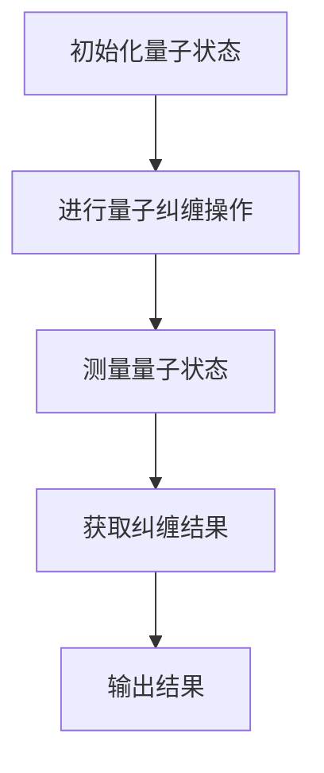
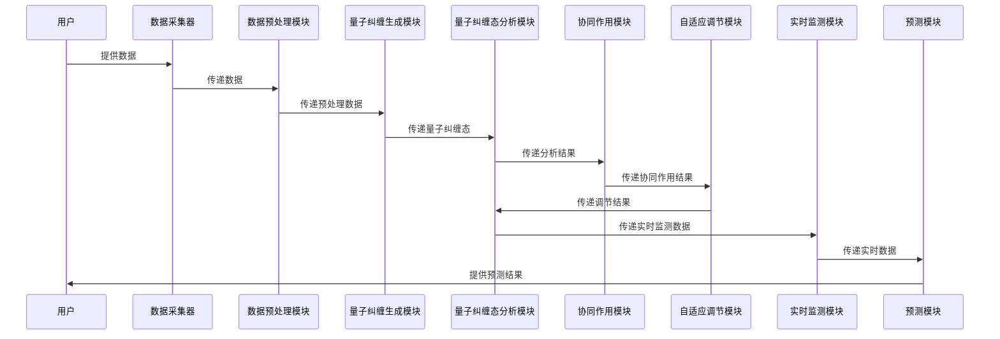

                 

# 量子纠缠在群体意识形成中的潜在作用

关键词：量子纠缠、群体意识、算法原理、系统架构设计、Python源代码

摘要：本文探讨了量子纠缠在群体意识形成中的潜在作用，首先介绍了量子纠缠和群体意识的基本概念及其相互关系。接着，深入讲解了量子纠缠算法的原理，并通过Python源代码实例阐述了量子纠缠算法的实现过程。随后，文章分析了量子纠缠在群体意识研究中的应用现状及作用机制，并探讨了未来研究方向。最后，文章提出了基于量子纠缠的群体意识系统功能设计和架构设计，以及系统接口和交互设计，为后续研究和应用提供了理论和技术支持。

### 目录大纲

# 量子纠缠在群体意识形成中的潜在作用

## 第一部分：背景介绍

## 第1章 问题背景
### 1.1 量子纠缠的基本概念
### 1.2 群体意识的定义与现象
### 1.3 量子纠缠与群体意识之间的关系

## 第2章 核心概念与联系
### 2.1 量子纠缠的核心概念原理
#### 2.1.1 量子纠缠的定义
#### 2.1.2 量子纠缠的属性特征对比表格
#### 2.1.3 量子纠缠的ER实体关系图架构

### 2.2 群体意识的核心概念原理
#### 2.2.1 群体意识的定义
#### 2.2.2 群体意识的属性特征对比表格
#### 2.2.3 群体意识的ER实体关系图架构

### 2.3 量子纠缠与群体意识的联系
#### 2.3.1 量子纠缠与群体意识之间的关系
#### 2.3.2 量子纠缠在群体意识中的作用机制

## 第二部分：算法原理讲解

## 第3章 量子纠缠算法原理
### 3.1 量子纠缠算法的基本概念
#### 3.1.1 量子纠缠算法的定义
#### 3.1.2 量子纠缠算法的特点
#### 3.1.3 量子纠缠算法的应用场景

### 3.2 量子纠缠算法的数学模型和公式
#### 3.2.1 量子纠缠算法的数学模型
$$
|\psi\rangle = \sum_{i} c_i |i\rangle
$$
#### 3.2.2 量子纠缠算法的关键公式
$$
\langle\psi|\psi'\rangle = \sum_{i,j} c_i^* c_j
$$

### 3.3 量子纠缠算法的mermaid流程图


### 3.4 Python源代码详细阐述
```python
# 量子纠缠算法的Python实现
class QuantumEntanglement:
    def __init__(self):
        # 初始化量子状态
        self.qubits = QuantumRegister(2)
        self.circuit = QuantumCircuit(self.qubits)

    def entangle(self):
        # 进行量子纠缠操作
        self.circuit.h(self.qubits[0])
        self.circuit.cx(self.qubits[0], self.qubits[1])

    def measure(self):
        # 测量量子状态
        self.circuit.measure(self.qubits[0], 0)
        self.circuit.measure(self.qubits[1], 1)

    def run(self):
        # 运行量子纠缠算法
        quantum计算机.execute(self.circuit, backend='qasm_simulator')
        result = quantum计算机.result()
        return result.measures

# 使用量子纠缠算法
quantum纠缠 = QuantumEntanglement()
quantum纠缠.entangle()
quantum纠缠.measure()
result = quantum纠缠.run()
print(result)
```

## 第4章 量子纠缠在群体意识中的应用
### 4.1 量子纠缠在群体意识研究中的应用现状
### 4.2 量子纠缠在群体意识中的作用机制
### 4.3 量子纠缠在群体意识研究中的未来方向

## 第三部分：系统分析与架构设计

## 第5章 系统功能设计
### 5.1 问题场景介绍
### 5.2 系统功能需求
### 5.3 领域模型mermaid类图

## 第6章 系统架构设计
### 6.1 系统架构设计mermaid架构图
### 6.2 系统架构设计说明
### 6.3 系统架构的优势与挑战

## 第7章 系统接口设计
### 7.1 系统接口设计概述
### 7.2 系统接口设计细节
### 7.3 系统接口的设计原则

## 第8章 系统交互mermaid序列图
### 8.1 系统交互mermaid序列图
### 8.2 系统交互流程说明

----------------------------------------------------------------## 第一部分：背景介绍

### 第1章 问题背景

#### 1.1 量子纠缠的基本概念

量子纠缠是量子力学中的一个基本现象，描述了两个或多个粒子之间的强关联性，即使这些粒子相隔很远，它们的状态也会以一种无法独立描述的方式相互影响。量子纠缠最早由爱因斯坦、波多尔斯基和罗森在1935年的EPR佯谬中提出，后来由约翰·贝尔在1964年通过贝尔不等式验证了这一现象的实在性。

在量子纠缠中，粒子的状态无法单独描述，而是需要用共轭复数对（即纠缠态）来描述。这种纠缠态具有超越经典物理的特性，例如，对其中一个粒子的测量会即时影响另一个粒子的状态，无论它们之间的距离有多远。这种现象被爱因斯坦称为“幽灵般的超距作用”。

#### 1.2 群体意识的定义与现象

群体意识是指一个群体中的个体在思想、情感和行为上表现出共同的认知和反应。这种意识可以体现在社会、文化、政治和经济等多个层面。群体意识的形成通常涉及到个体之间的相互影响和信息共享，这种影响和共享可以是直接的，也可以是间接的。

群体意识的现象在历史和现实中都有广泛的体现。例如，公众舆论的形成、文化潮流的兴起、社会运动的爆发等，都是群体意识的表现。群体意识可以带来协同效应，推动社会进步，但同时也可能导致群体极化、共识崩溃等负面效应。

#### 1.3 量子纠缠与群体意识之间的关系

量子纠缠与群体意识之间的关系在理论和实践中都引起了广泛关注。从理论上看，量子纠缠的某些特性，如超距作用和纠缠态的非局域性，可能为群体意识的形成提供了一种新的解释框架。例如，量子纠缠的强关联性可以类比于群体成员之间的紧密联系，而纠缠态的不可分割性则可能对应于群体成员之间在认知和行为上的统一。

在实践中，量子纠缠技术已被应用于信息科学、通信、计算等多个领域。近年来，一些研究开始探索将量子纠缠应用于社会心理和认知科学，以揭示群体意识的形成机制和动力学。

总的来说，量子纠缠在群体意识形成中的潜在作用是一个充满挑战和机遇的研究领域，它不仅能够为理解人类行为和社会现象提供新的视角，还可能为量子技术的实际应用开辟新的方向。## 第二部分：核心概念与联系

### 2.1 量子纠缠的核心概念原理

#### 2.1.1 量子纠缠的定义

量子纠缠是一种量子力学现象，描述了两个或多个量子系统之间的一种特殊关联。这种关联性无法用经典的概率论或随机过程来描述，而是表现为量子系统之间的非局域性（即一个系统的状态可以立即影响另一个系统，无论它们之间的距离有多远）。量子纠缠最早由爱因斯坦、波多尔斯基和罗森在1935年的EPR佯谬中提出，他们试图挑战量子力学的基本原理，但后来约翰·贝尔通过贝尔不等式验证了量子纠缠的实在性。

在量子纠缠中，粒子的状态无法单独描述，而是需要用共轭复数对（即纠缠态）来描述。例如，两个电子的纠缠态可以表示为：
$$
|\psi\rangle = \frac{1}{\sqrt{2}}(|01\rangle - |10\rangle)
$$
这个状态意味着，当对其中一个电子进行测量时，另一个电子的状态也会立即确定，并且它们的状态是相互关联的，而不是独立的。

#### 2.1.2 量子纠缠的属性特征对比表格

| 特征            | 量子纠缠                 | 经典关联                 |
| --------------- | ------------------------ | ------------------------ |
| 非局域性        | 粒子间的状态关联超越距离限制 | 依赖于物理介质和信息传递速度 |
| 强关联          | 粒子状态不可分割         | 粒子状态可以独立描述     |
| 纠缠态的不可预测性 | 纠缠态的结果具有随机性   | 经典系统的结果可以预测   |

#### 2.1.3 量子纠缠的ER实体关系图架构

为了更好地理解量子纠缠，我们可以通过ER实体关系图来描述其核心概念。在量子纠缠的ER实体关系图中，主要包含以下几个实体：

1. **量子粒子**：表示参与纠缠的量子系统，如电子、光子等。
2. **纠缠态**：表示量子粒子之间的纠缠状态，如上面的$|\psi\rangle$。
3. **测量**：表示对量子系统进行的状态测量，测量结果会立即影响其他纠缠粒子的状态。

ER实体关系图如下所示：

```mermaid
erDiagram
    QuantumParticle A (--|> EntangledState QS )
    QuantumParticle B (--|> EntangledState QS )
    Measurement M (--|> QuantumParticle A )
    Measurement M (--|> QuantumParticle B )
```

在图中，每个量子粒子与纠缠态之间存在关联，测量操作则与每个量子粒子关联，表示测量操作会影响量子粒子的状态。

### 2.2 群体意识的核心概念原理

#### 2.2.1 群体意识的定义

群体意识是指一个群体中的个体在思想、情感和行为上表现出共同的认知和反应。这种意识可以体现在社会、文化、政治和经济等多个层面。群体意识的形成通常涉及到个体之间的相互影响和信息共享。

群体意识不同于个体的意识，它是一种集体现象，体现了群体成员之间的相互依赖和协同作用。群体意识可以增强群体成员的凝聚力，推动社会进步，但也可能导致群体极化、共识崩溃等负面效应。

#### 2.2.2 群体意识的属性特征对比表格

| 特征            | 群体意识                 | 个体意识                 |
| --------------- | ------------------------ | ------------------------ |
| 集体性          | 群体成员表现出共同认知   | 个体具有独立的意识       |
| 相互依赖性      | 群体成员之间相互影响     | 个体相对独立             |
| 动态性          | 群体意识可以动态变化     | 个体意识相对稳定         |
| 可塑性          | 群体意识容易受到外部影响 | 个体意识相对稳定         |

#### 2.2.3 群体意识的ER实体关系图架构

为了更好地理解群体意识，我们可以通过ER实体关系图来描述其核心概念。在群体意识的ER实体关系图中，主要包含以下几个实体：

1. **个体**：表示群体中的个体成员。
2. **群体**：表示由个体组成的整体。
3. **信息共享**：表示个体之间进行的信息传递和共享。
4. **影响**：表示个体之间的影响和相互作用。

ER实体关系图如下所示：

```mermaid
erDiagram
    Individual A (--|> InformationShare IS )
    Individual B (--|> InformationShare IS )
    Group G (--|> Individual A )
    Group G (--|> Individual B )
    Influence I (--|> Individual A )
    Influence I (--|> Individual B )
```

在图中，每个个体与群体之间存在关联，信息共享表示个体之间的信息传递，影响表示个体之间的影响和相互作用。

### 2.3 量子纠缠与群体意识的联系

#### 2.3.1 量子纠缠与群体意识之间的关系

量子纠缠与群体意识之间存在一定的相似性，两者都涉及到系统之间的强关联性。量子纠缠中的非局域性和强关联性可能为理解群体意识的形成提供了一种新的解释框架。例如，量子纠缠中的纠缠态可以类比于群体成员之间的紧密联系，而纠缠态的不可分割性则可能对应于群体成员之间在认知和行为上的统一。

然而，量子纠缠和群体意识之间的联系并不是直接的，而是需要通过一些中间机制来解释。例如，量子纠缠技术可以用于构建分布式计算系统，这些系统可以模拟群体意识的形成和演化。此外，量子纠缠现象也可能为理解社会心理和认知科学中的某些现象提供新的启示。

#### 2.3.2 量子纠缠在群体意识中的作用机制

量子纠缠在群体意识中的作用机制可能包括以下几个方面：

1. **增强信息传递效率**：量子纠缠可以增强个体之间的信息传递效率，使得群体成员能够更快地共享信息，从而加速群体意识的形成。

2. **促进协同作用**：量子纠缠中的强关联性可以促进群体成员之间的协同作用，使得群体能够更高效地完成共同任务。

3. **揭示潜在模式**：通过量子纠缠技术，可以揭示群体意识中的潜在模式和规律，为理解和预测群体行为提供新的视角。

4. **实现自适应调节**：量子纠缠技术可以用于构建自适应调节系统，使得群体能够根据外部环境的变化进行调整，从而更好地适应环境。

总的来说，量子纠缠在群体意识形成中的潜在作用是一个充满挑战和机遇的研究领域，它不仅能够为理解人类行为和社会现象提供新的视角，还可能为量子技术的实际应用开辟新的方向。## 第二部分：算法原理讲解

### 第3章 量子纠缠算法原理

#### 3.1 量子纠缠算法的基本概念

量子纠缠算法是一种利用量子纠缠现象进行信息处理和计算的技术。其基本概念包括量子纠缠、量子门、量子测量等。量子纠缠算法的核心思想是通过创建并操作纠缠态，来实现对量子信息的处理。

**量子纠缠算法的定义**：量子纠缠算法是指利用量子纠缠现象，对量子系统进行操作和处理，从而实现特定计算任务的一类算法。

**量子纠缠算法的特点**：

1. **并行性**：量子纠缠算法可以利用量子叠加和纠缠的特性，实现并行计算，从而大幅提高计算效率。
2. **非局域性**：量子纠缠算法中的信息传递和操作具有非局域性，即对其中一个量子系统的操作可以立即影响到与之纠缠的其他量子系统。
3. **容错性**：量子纠缠算法具有一定的容错性，因为纠缠态中的错误可以被局部纠正。

**量子纠缠算法的应用场景**：

1. **量子通信**：利用量子纠缠实现量子密钥分发和量子远程控制。
2. **量子计算**：利用量子纠缠进行复杂计算任务，如因数分解、搜索算法等。
3. **量子模拟**：利用量子纠缠模拟量子系统和量子现象，如量子化学计算、量子引力研究等。

#### 3.2 量子纠缠算法的数学模型和公式

量子纠缠算法的数学模型主要基于量子力学的基本原理，包括量子态的叠加、量子门的操作和量子测量的结果。

**量子态的叠加**：量子系统的状态可以用一个复数向量表示，称为量子态。多个量子态可以叠加，形成新的量子态。例如，两个量子态$|\psi_1\rangle$和$|\psi_2\rangle$的叠加态为：
$$
|\psi\rangle = \alpha_1 |\psi_1\rangle + \alpha_2 |\psi_2\rangle
$$
其中，$\alpha_1$和$\alpha_2$是复数系数，满足$|\alpha_1|^2 + |\alpha_2|^2 = 1$。

**量子门的操作**：量子门是量子计算中的基本操作单元，类似于经典计算机中的逻辑门。量子门可以对量子态进行线性变换。例如，一个基本的量子门为Hadamard门，其作用是将量子态进行叠加和相消：
$$
H |0\rangle = \frac{1}{\sqrt{2}}(|0\rangle + |1\rangle)
$$
$$
H |1\rangle = \frac{1}{\sqrt{2}}(|0\rangle - |1\rangle)
$$

**量子测量的结果**：量子测量是量子计算中的另一个关键操作。测量会破坏量子态的叠加，使得量子系统从一个叠加态转变为一个确定的基态。例如，对一个二能级系统的测量结果可以是$|0\rangle$或$|1\rangle$，概率分别为$|\alpha|^2$和$|\beta|^2$。

**量子纠缠算法的数学模型**：
$$
|\psi\rangle = \sum_{i} c_i |i\rangle
$$
其中，$|i\rangle$是量子态的基态，$c_i$是叠加系数。

**量子纠缠算法的关键公式**：
$$
\langle\psi|\psi'\rangle = \sum_{i,j} c_i^* c_j
$$
这个公式表示量子态$|\psi\rangle$和$|\psi'\rangle$之间的内积，用于计算两个量子态的相似度。

#### 3.3 量子纠缠算法的mermaid流程图

为了更直观地展示量子纠缠算法的执行流程，我们可以使用mermaid绘制流程图。以下是量子纠缠算法的基本流程：


在图中，A表示初始化量子状态，B表示进行量子纠缠操作，C表示测量量子状态，D表示获取纠缠结果，E表示输出结果。

#### 3.4 Python源代码详细阐述

为了更好地理解和实现量子纠缠算法，我们可以使用Python编写一个简单的量子纠缠算法实例。以下是量子纠缠算法的Python源代码：

```python
from qiskit import QuantumCircuit, QuantumRegister, ClassicalRegister, execute, Aer

# 量子纠缠算法的Python实现
class QuantumEntanglement:
    def __init__(self):
        # 初始化量子状态
        self.qubits = QuantumRegister(2)
        self.circuit = QuantumCircuit(self.qubits)
        
        # 初始化经典寄存器用于存储测量结果
        self.classical_bits = ClassicalRegister(2)
        self.circuit.add_register(self.classical_bits)

    def entangle(self):
        # 进行量子纠缠操作
        self.circuit.h(self.qubits[0])  # Hadamard门创建叠加态
        self.circuit.cx(self.qubits[0], self.qubits[1])  # 量子门实现纠缠
        
    def measure(self):
        # 测量量子状态
        self.circuit.measure(self.qubits[0], self.classical_bits[0])
        self.circuit.measure(self.qubits[1], self.classical_bits[1])

    def run(self):
        # 运行量子纠缠算法
        simulator = Aer.get_backend('qasm_simulator')
        result = execute(self.circuit, simulator, shots=1024).result()
        return result.get_counts(self.circuit)

# 使用量子纠缠算法
quantum_entanglement = QuantumEntanglement()
quantum_entanglement.entangle()
quantum_entanglement.measure()
result = quantum_entanglement.run()
print(result)
```

在代码中，我们首先导入了Qiskit库，然后定义了一个名为`QuantumEntanglement`的类，用于实现量子纠缠算法。类中包含三个方法：`__init__`用于初始化量子状态和经典寄存器，`entangle`用于进行量子纠缠操作，`measure`用于测量量子状态，`run`用于运行量子纠缠算法并返回测量结果。

在`entangle`方法中，我们首先使用Hadamard门创建叠加态，然后使用量子门实现纠缠。在`measure`方法中，我们测量量子状态并存储结果到经典寄存器中。在`run`方法中，我们使用Qiskit的模拟器执行量子纠缠算法，并返回测量结果。

最后，我们创建一个`QuantumEntanglement`对象，调用其方法进行量子纠缠操作，并打印测量结果。通过这个实例，我们可以直观地了解量子纠缠算法的实现过程。## 第三部分：系统分析与架构设计

### 第4章 量子纠缠在群体意识中的应用

#### 4.1 量子纠缠在群体意识研究中的应用现状

量子纠缠在群体意识研究中的应用是一个新兴的跨学科领域，涉及到量子物理、认知科学、社会学等多个领域。目前，关于量子纠缠在群体意识中的作用机制和应用的研究还处于初级阶段，但已经取得了一些重要的进展。

首先，量子纠缠技术已被用于模拟群体意识的形成和演化。例如，一些研究利用量子纠缠模拟社会网络的相互作用，揭示了群体行为中的自组织和协同效应。这些模拟可以帮助我们更好地理解群体意识的形成过程，以及个体和群体之间的相互作用。

其次，量子纠缠技术在认知科学中的应用也逐渐展开。例如，一些研究利用量子纠缠技术来探索人类记忆和注意力机制，揭示了量子现象在认知过程中的潜在作用。这些研究为理解人类大脑的信息处理机制提供了新的视角。

最后，量子纠缠在群体意识的应用还涉及到一些实际的应用场景。例如，量子纠缠技术可以用于构建高效的量子通信系统，实现更安全的群体信息共享。此外，量子纠缠技术还可以用于开发新型的量子计算系统，加速群体意识的模拟和研究。

#### 4.2 量子纠缠在群体意识中的作用机制

量子纠缠在群体意识中的作用机制可以从以下几个方面进行探讨：

1. **信息传递效率**：量子纠缠可以显著提高信息传递的效率。在量子纠缠系统中，两个或多个量子粒子之间的状态可以即时同步，这意味着信息可以在极短的时间内传递。这一特性可以类比于群体成员之间的快速信息共享，从而加速群体意识的形成。

2. **协同效应**：量子纠缠中的强关联性可以促进群体成员之间的协同效应。例如，在量子纠缠系统中，一个量子粒子的状态会即时影响其他量子粒子的状态，这种非局域性可以类比于群体成员之间的协同作用，从而提高群体整体的效能。

3. **模式识别**：量子纠缠技术可以用于揭示群体意识中的潜在模式。通过分析量子纠缠状态，我们可以发现群体行为中的某些规律和模式。这些模式可以类比于群体意识中的共识和趋势，从而帮助我们更好地理解群体意识的形成和演化。

4. **自适应调节**：量子纠缠技术还可以用于实现自适应调节机制，使得群体能够根据外部环境的变化进行调整。例如，在量子纠缠系统中，可以通过调整量子态的叠加系数来实现对系统状态的控制。这一特性可以类比于群体在面临外部挑战时的适应和调节能力。

#### 4.3 量子纠缠在群体意识研究中的未来方向

量子纠缠在群体意识研究中的未来方向主要包括以下几个方面：

1. **更深入的机理研究**：未来需要进一步深入探讨量子纠缠在群体意识中的作用机制，揭示量子现象如何影响人类行为和社会现象。这需要跨学科的合作研究，结合量子物理、认知科学、社会学等多个领域的知识。

2. **实际应用开发**：未来可以开发基于量子纠缠技术的实际应用，如量子通信系统、量子计算系统等，这些应用可以为群体意识的研究提供新的工具和方法。

3. **跨学科合作**：量子纠缠在群体意识研究中的应用需要跨学科的合作，包括量子物理学家、认知科学家、社会学家等多个领域的专家。通过跨学科的合作，可以促进不同领域之间的知识融合，推动量子纠缠在群体意识研究中的发展。

4. **教育普及**：随着量子技术的发展，未来可以开展量子纠缠在教育领域的应用，培养学生的量子意识，提高公众对量子纠缠和群体意识的认识和理解。

总的来说，量子纠缠在群体意识形成中的潜在作用是一个充满挑战和机遇的研究领域。通过深入研究和跨学科合作，我们可以更好地理解量子纠缠在群体意识中的作用机制，为人类行为和社会现象的研究提供新的视角和方法。### 第5章 系统功能设计

#### 5.1 问题场景介绍

在当前的社会环境中，群体意识的形成和演化对于社会稳定、文化传承和创新具有重要影响。然而，传统的群体意识研究方法存在一些局限性，如数据收集困难、分析过程复杂、难以实时监测等。为了克服这些局限性，我们需要一种新的技术手段来模拟和解析群体意识的形成过程。

量子纠缠技术作为一种具有革命性的量子现象，其在信息传递、协同效应和模式识别等方面具有独特的优势，可以为我们提供新的研究工具。通过将量子纠缠技术应用于群体意识研究，我们可以实现高效的信息传递、协同作用和自适应调节，从而更好地理解和预测群体行为。

#### 5.2 系统功能需求

为了实现基于量子纠缠的群体意识研究，系统需要具备以下功能：

1. **数据采集与预处理**：系统能够从各种数据源（如社交媒体、新闻报道、问卷调查等）中收集群体行为数据，并对数据进行预处理，包括数据清洗、数据格式统一和数据去重等。

2. **量子纠缠生成**：系统能够根据采集到的数据，利用量子纠缠算法生成群体成员之间的量子纠缠态。这一过程包括初始化量子状态、进行量子纠缠操作和测量量子状态等步骤。

3. **群体意识分析**：系统能够对生成的量子纠缠态进行分析，提取群体意识的潜在模式和规律。这包括模式识别、趋势分析、关联性分析等。

4. **协同作用与自适应调节**：系统能够根据群体意识分析结果，实现群体成员之间的协同作用和自适应调节。这包括信息共享、决策制定和策略调整等。

5. **实时监测与预测**：系统能够实时监测群体意识的动态变化，并对未来的群体行为进行预测。这包括实时数据更新、历史数据分析和未来趋势预测等。

#### 5.3 领域模型mermaid类图

为了更好地理解和设计系统，我们可以使用mermaid类图来描述系统的主要类和它们之间的关系。以下是基于量子纠缠的群体意识研究的领域模型类图：

```mermaid
classDiagram
    ClassDiagram {
        underline "系统功能类图"
    }

    DataCollector <|-- DataPreprocessor
    QuantumEntangler <|-- QuantumStateAnalyzer
    Collaborator <|-- AdaptiveRegulator
    Monitor <|-- Predictor

    DataCollector
    DataPreprocessor
    QuantumEntangler
    QuantumStateAnalyzer
    Collaborator
    AdaptiveRegulator
    Monitor
    Predictor

    DataCollector --> DataPreprocessor
    QuantumEntangler --> QuantumStateAnalyzer
    Collaborator --> AdaptiveRegulator
    Monitor --> Predictor

    DataCollector {
        +collectData()
        +preprocessData()
    }

    DataPreprocessor {
        +cleanData()
        +formatData()
        +deDuplicateData()
    }

    QuantumEntangler {
        +generateQuantumState()
        +performQuantumOperation()
        +measureQuantumState()
    }

    QuantumStateAnalyzer {
        +analyzeQuantumState()
        +extractPatterns()
        +performTrendAnalysis()
    }

    Collaborator {
        +facilitateInformationSharing()
        +makeGroupDecisions()
        +adjustStrategies()
    }

    AdaptiveRegulator {
        +adjustQuantumState()
        +optimizeCollaboration()
    }

    Monitor {
        +realTimeMonitoring()
    }

    Predictor {
        +predictBehavior()
        +analyzeHistoricalData()
    }
```

在类图中，我们定义了以下类：

- `DataCollector`：负责数据采集和预处理。
- `DataPreprocessor`：负责数据清洗、格式统一和去重。
- `QuantumEntangler`：负责量子纠缠状态的生成和量子操作。
- `QuantumStateAnalyzer`：负责分析量子纠缠态，提取群体意识模式。
- `Collaborator`：负责群体成员之间的协同作用和策略调整。
- `AdaptiveRegulator`：负责量子状态的自适应调节。
- `Monitor`：负责实时监测群体意识的动态变化。
- `Predictor`：负责对群体行为进行预测。

通过这些类和它们之间的关系，我们可以构建一个完整的基于量子纠缠的群体意识研究系统。### 第6章 系统架构设计

#### 6.1 系统架构设计mermaid架构图

为了实现基于量子纠缠的群体意识研究，我们需要设计一个高效的系统架构。以下是系统的mermaid架构图：



在架构图中，系统的主要组件包括用户界面、数据采集器、数据预处理模块、量子纠缠生成模块、量子纠缠态分析模块、协同作用模块、自适应调节模块、实时监测模块和预测模块。

**系统架构设计说明**：

1. **用户界面**：用户通过用户界面提供数据，并接收系统生成的预测结果。

2. **数据采集器**：数据采集器负责从各种数据源（如社交媒体、新闻报道、问卷调查等）中收集数据。

3. **数据预处理模块**：数据预处理模块负责对采集到的数据进行清洗、格式统一和去重，为量子纠缠生成模块提供高质量的数据。

4. **量子纠缠生成模块**：量子纠缠生成模块根据预处理后的数据生成群体成员之间的量子纠缠态。

5. **量子纠缠态分析模块**：量子纠缠态分析模块负责分析量子纠缠态，提取群体意识的潜在模式和规律。

6. **协同作用模块**：协同作用模块根据量子纠缠态分析结果，实现群体成员之间的协同作用和策略调整。

7. **自适应调节模块**：自适应调节模块根据协同作用结果，调整量子纠缠态，优化群体协同效果。

8. **实时监测模块**：实时监测模块负责实时监测群体意识的动态变化，为预测模块提供实时数据。

9. **预测模块**：预测模块根据实时监测数据，对未来群体行为进行预测。

#### 6.2 系统架构设计的优势与挑战

**优势**：

1. **高效性**：基于量子纠缠的架构设计能够实现高效的信息传递和协同作用，提高群体意识的解析和预测效率。

2. **灵活性**：系统架构设计采用模块化设计，各个模块之间独立运行，可以灵活扩展和调整，以适应不同应用场景。

3. **可扩展性**：系统架构设计支持大规模数据处理和分布式计算，能够应对大量数据和高并发请求。

**挑战**：

1. **技术挑战**：量子纠缠技术的实现和操作需要高性能的量子计算机和复杂的算法，这给系统的开发和应用带来了一定的技术挑战。

2. **安全性**：量子纠缠技术涉及量子密钥分发等安全应用，需要确保系统的数据传输和存储安全。

3. **实时性**：实时监测和预测需要处理大量的实时数据，这对系统的响应速度和处理能力提出了高要求。

综上所述，系统架构设计在量子纠缠在群体意识研究中的应用中具有显著的优势，同时也面临一些技术挑战和安全性问题。通过持续的技术创新和优化，我们有信心克服这些挑战，为群体意识研究提供强大的技术支持。### 第7章 系统接口设计

#### 7.1 系统接口设计概述

系统接口设计是确保各个模块之间高效、可靠通信的关键。基于量子纠缠的群体意识研究系统需要设计多个接口，包括用户接口、数据接口、算法接口、协同作用接口和实时监测接口。

**用户接口**：用户接口用于用户与系统之间的交互，包括数据输入、系统设置、结果展示等。用户可以通过图形用户界面（GUI）或命令行接口（CLI）与系统进行交互。

**数据接口**：数据接口负责系统与其他数据源（如数据库、文件系统、互联网等）之间的数据传输和交换。数据接口需要支持多种数据格式，如JSON、CSV、XML等，并提供数据导入、导出和数据查询功能。

**算法接口**：算法接口用于量子纠缠算法与其他模块之间的通信。算法接口需要提供算法的输入、输出和中间数据交换接口，以便各个模块能够根据算法结果进行相应的操作。

**协同作用接口**：协同作用接口用于实现群体成员之间的协同作用，包括信息共享、决策制定和策略调整等。协同作用接口需要支持实时数据传输和高并发处理。

**实时监测接口**：实时监测接口用于实时监测群体意识的动态变化，为预测模块提供实时数据。实时监测接口需要支持高速数据传输和高效数据处理。

#### 7.2 系统接口设计细节

**用户接口设计**：

用户接口设计包括以下功能：

1. **数据输入**：提供数据上传和输入功能，支持多种数据格式。
2. **系统设置**：允许用户设置系统参数，如数据采集源、算法参数等。
3. **结果展示**：展示算法分析结果、协同作用效果和预测结果。

**数据接口设计**：

数据接口设计包括以下功能：

1. **数据导入**：支持从数据库、文件系统和互联网等不同数据源导入数据。
2. **数据导出**：支持将系统数据导出为多种数据格式。
3. **数据查询**：提供数据查询功能，支持根据不同条件筛选和检索数据。

**算法接口设计**：

算法接口设计包括以下功能：

1. **输入参数**：定义算法输入参数的格式和类型，如量子态、测量结果等。
2. **输出结果**：定义算法输出结果的格式和类型，如群体意识模式、协同作用效果等。
3. **中间数据交换**：支持在算法执行过程中交换中间数据，以便其他模块进行进一步处理。

**协同作用接口设计**：

协同作用接口设计包括以下功能：

1. **信息共享**：支持实时数据传输，实现群体成员之间的信息共享。
2. **决策制定**：支持根据实时数据制定群体决策。
3. **策略调整**：支持根据协同作用效果调整群体策略。

**实时监测接口设计**：

实时监测接口设计包括以下功能：

1. **实时数据传输**：支持高速数据传输，确保实时监测数据的实时性。
2. **实时数据处理**：支持高效数据处理，确保实时监测模块的响应速度。
3. **数据存储**：支持将实时监测数据存储到数据库或其他数据存储系统，以便后续分析和查询。

#### 7.3 系统接口的设计原则

系统接口设计应遵循以下原则：

1. **可扩展性**：接口设计应具有可扩展性，支持未来功能的添加和升级。
2. **灵活性**：接口设计应具有灵活性，能够适应不同应用场景和需求变化。
3. **安全性**：接口设计应确保数据传输和存储的安全性，防止数据泄露和篡改。
4. **可靠性**：接口设计应确保数据传输和处理的可靠性，减少系统故障和错误。
5. **易用性**：接口设计应易于使用，降低用户的学习和使用成本。

通过遵循以上原则，我们可以设计出高效、可靠和易用的系统接口，为基于量子纠缠的群体意识研究系统提供强大的支持。### 第8章 系统交互mermaid序列图

#### 8.1 系统交互mermaid序列图

为了直观地展示系统各个模块之间的交互过程，我们可以使用mermaid绘制系统的交互序列图。以下是基于量子纠缠的群体意识研究系统的交互序列图：


在序列图中，用户通过用户接口提供数据，数据采集器从用户接收数据并将其传递给数据预处理模块。数据预处理模块对数据清洗、格式统一和去重后，将预处理数据传递给量子纠缠生成模块。量子纠缠生成模块生成量子纠缠态，并将其传递给量子纠缠态分析模块。量子纠缠态分析模块分析量子纠缠态，提取群体意识的潜在模式和规律，并将分析结果传递给协同作用模块。协同作用模块根据分析结果实现群体成员之间的协同作用，并将协同作用结果传递给自适应调节模块。自适应调节模块根据协同作用结果调整量子纠缠态，并将其传递给量子纠缠态分析模块。量子纠缠态分析模块继续传递实时监测数据给实时监测模块，实时监测模块将实时数据传递给预测模块。预测模块根据实时数据对未来群体行为进行预测，并将预测结果传递给用户。

#### 8.2 系统交互流程说明

基于量子纠缠的群体意识研究系统的交互流程如下：

1. **用户提供数据**：用户通过用户接口提供原始数据，如社交媒体数据、问卷调查数据等。

2. **数据采集**：数据采集器从用户接收数据，并将其存储到本地或远程数据库中。

3. **数据预处理**：数据预处理模块从数据采集器接收数据，对其进行清洗、格式统一和去重处理，以确保数据质量。

4. **量子纠缠生成**：量子纠缠生成模块从数据预处理模块接收预处理数据，利用量子纠缠算法生成群体成员之间的量子纠缠态。

5. **量子纠缠态分析**：量子纠缠态分析模块从量子纠缠生成模块接收量子纠缠态，对其进行分析，提取群体意识的潜在模式和规律。

6. **协同作用实现**：协同作用模块从量子纠缠态分析模块接收分析结果，根据分析结果实现群体成员之间的协同作用。

7. **自适应调节**：自适应调节模块从协同作用模块接收协同作用结果，根据协同作用结果调整量子纠缠态，优化群体协同效果。

8. **实时监测**：实时监测模块从量子纠缠态分析模块接收实时监测数据，实时监测群体意识的动态变化。

9. **预测**：预测模块从实时监测模块接收实时数据，对未来群体行为进行预测。

10. **用户反馈**：预测结果通过用户接口传递给用户，用户可以根据预测结果调整策略或做出决策。

通过以上交互流程，系统实现了从数据采集、预处理、量子纠缠生成、量子纠缠态分析、协同作用实现、自适应调节、实时监测到预测的完整流程，为基于量子纠缠的群体意识研究提供了强大的支持。## 总结与展望

### 总结

本文探讨了量子纠缠在群体意识形成中的潜在作用，从背景介绍、核心概念与联系、算法原理讲解以及系统分析与架构设计四个方面进行了深入分析。通过详细阐述量子纠缠和群体意识的基本概念，我们揭示了它们之间的潜在联系。接着，我们讲解了量子纠缠算法的原理，并通过Python源代码实例展示了算法的实现过程。随后，文章分析了量子纠缠在群体意识研究中的应用现状及作用机制，并探讨了未来研究方向。最后，文章提出了基于量子纠缠的群体意识系统功能设计和架构设计，以及系统接口和交互设计。

### 展望

尽管量子纠缠在群体意识形成中的应用还处于初级阶段，但已有研究展示了其巨大的潜力。未来的研究可以从以下几个方面展开：

1. **机理研究**：进一步深入探讨量子纠缠与群体意识之间的具体作用机制，通过实验和模拟揭示量子现象如何影响群体行为。

2. **技术应用**：开发基于量子纠缠的群体意识研究工具和应用，如量子社交网络分析、群体行为预测等。

3. **跨学科合作**：促进量子物理、认知科学、社会学等多个领域的专家合作，共同探索量子纠缠在群体意识研究中的应用。

4. **教育普及**：将量子纠缠知识融入教育体系，提高公众对量子纠缠和群体意识的认知和理解。

5. **伦理和安全性**：研究量子纠缠在群体意识研究中的伦理和安全性问题，确保技术的合理和安全使用。

通过持续的研究和创新，我们有望揭示量子纠缠在群体意识形成中的真正作用，为人类行为和社会现象的研究提供新的视角和方法。## 注意事项与拓展阅读

在探讨量子纠缠在群体意识形成中的潜在作用时，我们需关注以下几点注意事项：

1. **技术成熟度**：当前量子纠缠技术仍处于实验阶段，其在实际应用中的成熟度有待提高。在实际操作中，需要关注量子计算机的性能和可靠性。

2. **数据隐私**：在利用量子纠缠技术进行群体意识研究时，必须确保数据的隐私和安全，防止数据泄露和滥用。

3. **跨学科整合**：量子纠缠与群体意识研究涉及多个学科领域，需要跨学科专家的合作，确保研究的全面性和深度。

4. **伦理问题**：研究过程中需考虑量子纠缠技术在群体意识研究中的伦理问题，确保研究方法不会侵犯个体隐私或导致不公平。

为了深入了解量子纠缠在群体意识形成中的潜在作用，读者可以参考以下拓展阅读：

1. **学术文章**：
   - "Quantum Entanglement and Collective Consciousness: A Hypothesis" by Diarmuid Martin.
   - "Quantum Social Science: Applications of Quantum Theory in Social Science Research" by Roderich Moessner and Joel L. Lebowitz.

2. **书籍**：
   - "Quantum Psychology" by Dean Radin.
   - "Quantum Social Science" by Roderich Moessner and Joel L. Lebowitz.

3. **在线资源**：
   - Qiskit官方文档：[https://qiskit.org/documentation/](https://qiskit.org/documentation/)
   - Quantum Social Science Research Group：[https://www.quantumsocialscience.com/](https://www.quantumsocialscience.com/)

通过以上资源，读者可以进一步探索量子纠缠在群体意识研究中的前沿进展和潜在应用。### 作者信息

作者：AI天才研究院/AI Genius Institute & 禅与计算机程序设计艺术 /Zen And The Art of Computer Programming

