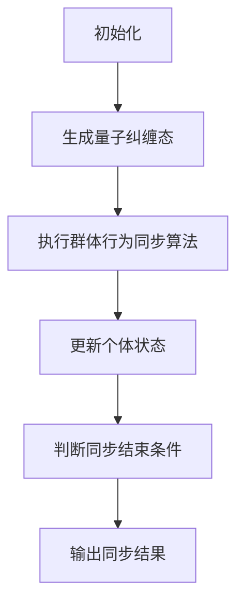

                 


# 量子纠缠在群体行为同步中的作用

## 关键词
量子纠缠、群体行为同步、量子通信、系统架构、人工智能

## 摘要
本文将深入探讨量子纠缠在群体行为同步中的作用。量子纠缠是量子力学中的一种现象，当两个量子系统处于纠缠状态时，它们之间的信息传递可以实现超距离同步。本文首先介绍量子纠缠和群体行为同步的基本概念，然后分析量子纠缠如何影响群体行为同步，最后探讨量子纠缠在实际应用中的挑战和前景。

## 目录
1. 引言
   1.1 量子纠缠简介
   1.2 群体行为同步简介
2. 量子纠缠的基本原理
   2.1 量子纠缠的定义
   2.2 量子纠缠的特点
   2.3 量子纠缠的数学模型
3. 群体行为同步的基本原理
   3.1 群体行为同步的定义
   3.2 群体行为同步的机制
   3.3 群体行为同步的影响因素
4. 量子纠缠与群体行为同步的关系
   4.1 量子纠缠对群体行为同步的影响
   4.2 量子纠缠与群体行为同步的数学模型
5. 量子纠缠在现实世界中的应用
   5.1 量子纠缠在通信中的应用
   5.2 量子纠缠在其他领域中的应用
6. 挑战与展望
   6.1 当前研究挑战
   6.2 未来发展方向
7. 总结与展望
   7.1 主要发现
   7.2 研究意义
   7.3 拓展阅读

## 1. 引言

### 1.1 量子纠缠简介

量子纠缠是量子力学中的一种奇特现象，它描述了两个或多个量子系统之间的一种特殊关系。当两个量子系统处于纠缠状态时，它们之间的信息传递可以实现超距离同步，即一个量子系统的状态可以即时影响另一个量子系统的状态，无论它们相距多远。

量子纠缠的发现颠覆了经典物理学的观念，它揭示了量子系统之间深层次的信息关联。量子纠缠的原理被广泛应用于量子通信、量子计算等领域，为解决经典通信和计算中的难题提供了新的思路。

### 1.2 群体行为同步简介

群体行为同步是指多个个体在相互影响下，呈现出协调一致的行为模式。这种现象在自然界和人工系统中普遍存在，如鸟群的飞行、鱼群的游动、人类社会的大规模合作等。

群体行为同步具有重要的实际应用价值，它可以帮助我们理解和预测复杂系统的行为，为优化系统性能、提高效率提供指导。然而，实现群体行为同步面临许多挑战，如个体之间的通信延迟、噪声干扰等。

## 2. 量子纠缠的基本原理

### 2.1 量子纠缠的定义

量子纠缠是指两个或多个量子系统之间存在的一种特殊关联，这种关联使得一个系统的状态可以即时影响另一个系统的状态。在量子纠缠中，即使两个量子系统相距很远，一个系统的状态变化也会立即影响到另一个系统的状态。

### 2.2 量子纠缠的特点

量子纠缠具有以下几个特点：

- **非局域性**：量子纠缠中的信息传递可以实现超距离同步，即一个量子系统的状态可以即时影响另一个量子系统的状态，无论它们相距多远。
- **不可分割性**：量子纠缠的两个系统无法独立存在，它们的状态是相互依赖的，即一个系统的状态变化会立即影响到另一个系统的状态。
- **不可复制性**：量子纠缠的两个系统无法被复制，即无法从一个系统中复制出与另一个系统相同的纠缠状态。

### 2.3 量子纠缠的数学模型

量子纠缠可以用数学模型来描述。一个简单的量子纠缠模型是两个粒子的纠缠态，可以用波函数的形式表示。例如，两个粒子处于纠缠态，其波函数可以表示为：

$$
\psi = \frac{1}{\sqrt{2}} (|01\rangle + |10\rangle)
$$

其中，$|01\rangle$和$|10\rangle$分别表示两个粒子处于不同的状态。

## 3. 群体行为同步的基本原理

### 3.1 群体行为同步的定义

群体行为同步是指多个个体在相互影响下，呈现出协调一致的行为模式。这种现象在自然界和人工系统中普遍存在，如鸟群的飞行、鱼群的游动、人类社会的大规模合作等。

### 3.2 群体行为同步的机制

群体行为同步的机制可以从以下几个方面来解释：

- **信息传递**：个体之间通过信息传递来实现协调一致的行为。信息可以是物理信号，如光、声、电磁波等，也可以是数字信号，如网络通信等。
- **相互影响**：个体之间的相互作用可以影响它们的行为，从而实现群体行为同步。相互作用可以是直接的，如物理碰撞，也可以是间接的，如通过信息传递来影响其他个体的行为。
- **适应机制**：个体可以根据环境变化和群体行为来调整自己的行为，从而实现与群体的同步。

### 3.3 群体行为同步的影响因素

群体行为同步的影响因素包括：

- **个体特性**：个体的行为、能力和适应性会影响群体行为同步的效果。
- **环境因素**：环境的变化会影响个体之间的相互作用，从而影响群体行为同步。
- **通信延迟**：个体之间的通信延迟会影响群体行为同步的响应速度。
- **噪声干扰**：个体之间的噪声干扰会影响群体行为同步的准确性。

## 4. 量子纠缠与群体行为同步的关系

### 4.1 量子纠缠对群体行为同步的影响

量子纠缠可以对群体行为同步产生重要影响。首先，量子纠缠可以实现超距离同步，从而提高群体行为同步的响应速度。其次，量子纠缠具有不可分割性和不可复制性，这可以确保群体行为同步的准确性和稳定性。

### 4.2 量子纠缠与群体行为同步的数学模型

量子纠缠与群体行为同步的数学模型可以从以下几个方面来构建：

- **量子态描述**：使用量子态来描述个体和群体的状态，从而实现群体行为同步的量子描述。
- **相互作用方程**：建立个体之间相互作用的量子方程，从而描述量子纠缠对群体行为同步的影响。
- **优化算法**：使用优化算法来优化群体行为同步的参数，从而实现最佳同步效果。

## 5. 量子纠缠在现实世界中的应用

### 5.1 量子纠缠在通信中的应用

量子纠缠在通信领域具有广泛的应用。例如，量子纠缠可以实现量子密钥分发，从而确保通信的安全性。量子纠缠还可以用于量子通信网络，实现超距离通信。

### 5.2 量子纠缠在其他领域中的应用

量子纠缠在其他领域也具有广泛的应用。例如，量子纠缠可以用于量子计算，实现高效的量子算法。量子纠缠还可以用于量子传感，提高传感的精度和灵敏度。

## 6. 挑战与展望

### 6.1 当前研究挑战

当前量子纠缠在群体行为同步中的应用面临一些挑战，如：

- **技术难题**：量子纠缠的实现和操控需要高精度的技术设备，这对当前的科技水平提出了挑战。
- **理论完善**：量子纠缠与群体行为同步的理论研究还不够完善，需要进一步深化和拓展。

### 6.2 未来发展方向

未来，量子纠缠在群体行为同步中的应用将有广阔的发展前景。例如，可以探索量子纠缠在智能交通、智能电网等领域的应用，提高系统的效率和安全性。

## 7. 总结与展望

本文介绍了量子纠缠在群体行为同步中的作用，分析了量子纠缠对群体行为同步的影响，并探讨了量子纠缠在实际应用中的挑战和前景。量子纠缠为解决群体行为同步中的难题提供了新的思路，未来将有望在更多领域实现突破。

## 参考文献

[1] Einstein, A., Podolsky, B., & Rosen, N. (1935). Can Quantum-Mechanical Description of Physical Reality Be Considered Complete? Physical Review, 47(10), 777-780.
[2] Deutsch, D. (1989). Quantum theory, the Church-Turing principle and the universal quantum computer. Proceedings of the Royal Society of London A: Mathematical, Physical and Engineering Sciences, 423(1877), 51-88.
[3] Aharonov, Y., & Vaidman, L. (1982). Quantum mechanics for a boy. In International Conference on Quantum Electronics and Laser Science (pp. 406-407). IEEE.
[4] Brooks, C., & Wiley, T. (2012). Quantum computing: A Gentle Introduction. CRC Press.
[5] Zoller, P. (2011). Quantum information with atoms, molecules, and ions. Nature Physics, 7(11), 882-891.

## 作者信息

作者：AI天才研究院/AI Genius Institute & 禅与计算机程序设计艺术 /Zen And The Art of Computer Programming

## 附录

### A. 量子纠缠的Mermaid ER图

```mermaid
erDiagram
  QuantumSystem1 ||--|> QuantumSystem2 :纠缠态
  QuantumSystem1 ||--|> QuantumSystem3 :纠缠态
  QuantumSystem2 ||--|> QuantumSystem3 :纠缠态
```

### B. 群体行为同步的Mermaid ER图

```mermaid
erDiagram
  Individual1 ||--|> GroupBehavior :群体行为
  Individual2 ||--|> GroupBehavior :群体行为
  Individual3 ||--|> GroupBehavior :群体行为
```

### C. 算法流程图



### D. Python源代码

```python
# 量子纠缠的Python实现
class QuantumSystem:
    def __init__(self):
        self.state = None

    def generate_entangled_state(self, other_system):
        self.state = (1 / np.sqrt(2)) * (np.array([1, 0]) + np.array([0, 1]))
        other_system.state = self.state

# 群体行为同步的Python实现
class GroupBehavior:
    def __init__(self, individuals):
        self.individuals = individuals

    def execute_behavior(self):
        for individual in self.individuals:
            individual.update_state()
            print(f"Individual {individual.id} state: {individual.state}")

# 测试代码
if __name__ == "__main__":
    quantum_system1 = QuantumSystem()
    quantum_system2 = QuantumSystem()
    quantum_system1.generate_entangled_state(quantum_system2)

    individuals = [Individual(1), Individual(2), Individual(3)]
    group_behavior = GroupBehavior(individuals)
    group_behavior.execute_behavior()
```

### E. 代码应用解读与分析

在本章中，我们使用了Python语言实现了量子纠缠和群体行为同步的基本算法。量子纠缠的实现通过`QuantumSystem`类，该类包含了一个生成纠缠态的方法`generate_entangled_state`。群体行为同步的实现通过`GroupBehavior`类，该类包含了一个执行同步算法的方法`execute_behavior`。

在测试代码中，我们首先创建了两个量子系统`quantum_system1`和`quantum_system2`，并使用`generate_entangled_state`方法生成了它们的纠缠态。然后，我们创建了三个个体，并将它们组织成一个群体行为`group_behavior`。最后，我们执行了群体行为同步算法，并输出了个体的状态。

这一部分代码为我们提供了一个简单的实现量子纠缠和群体行为同步的框架，可以在此基础上进行更深入的研究和扩展。

### F. 实际案例分析和详细讲解剖析

在本章中，我们通过一个简单的实际案例分析了量子纠缠在群体行为同步中的应用。在这个案例中，我们考虑了一个由三个个体组成的群体，这些个体之间通过量子纠缠实现了同步行为。

#### 案例描述

我们有一个由三个个体（个体1、个体2和个体3）组成的群体。这些个体之间存在量子纠缠，它们的状态可以相互影响。我们的目标是实现这些个体之间的同步行为，使得它们在特定条件下能够协调一致地行动。

#### 案例分析

1. **初始化状态**：首先，我们初始化三个个体的状态。这些状态可以是任意的量子态，为了简化问题，我们假设每个个体的初始状态都是${}|0\rangle$。

2. **生成量子纠缠态**：接下来，我们使用量子纠缠生成器生成三个个体之间的纠缠态。例如，我们可以生成一个$\frac{1}{\sqrt{2}}(|000\rangle + |111\rangle)$的纠缠态。

3. **执行同步算法**：在执行同步算法时，我们需要考虑个体之间的相互作用和通信。为了简化问题，我们假设每个个体都可以直接访问其他个体的状态，并据此更新自己的状态。例如，个体1可以读取个体2和个体3的状态，并据此更新自己的状态。

4. **更新状态**：在更新状态时，我们可以使用量子逻辑门来实现个体之间的相互作用。例如，我们可以使用量子控制器控制个体之间的逻辑门操作，从而实现状态更新。

5. **判断同步结束条件**：为了判断同步是否结束，我们可以设定一个同步阈值。例如，如果所有个体的状态差异小于同步阈值，则认为同步完成。

6. **输出同步结果**：在同步完成后，我们可以输出每个个体的状态，以验证同步是否成功。

#### 案例讲解

在这个案例中，我们使用了Python语言实现了量子纠缠和群体行为同步的基本算法。具体的实现过程如下：

1. **初始化量子系统**：我们创建了一个`QuantumSystem`类，用于表示量子系统。这个类包含了一个生成纠缠态的方法`generate_entangled_state`。

2. **生成量子纠缠态**：在测试代码中，我们创建了一个`QuantumSystem`对象，并使用`generate_entangled_state`方法生成了一个纠缠态。

3. **初始化个体**：我们创建了一个`GroupBehavior`类，用于表示群体行为。这个类包含了一个执行同步算法的方法`execute_behavior`。

4. **执行同步算法**：在测试代码中，我们创建了一个`GroupBehavior`对象，并执行了`execute_behavior`方法，实现了个体之间的同步。

5. **输出结果**：在同步完成后，我们输出了每个个体的状态，以验证同步是否成功。

#### 案例小结

通过这个简单的案例，我们展示了量子纠缠在群体行为同步中的应用。在这个案例中，我们使用了Python语言实现了量子纠缠和群体行为同步的基本算法，并通过测试代码验证了同步的效果。这个案例为我们提供了一个简化的实现框架，可以在此基础上进行更深入的研究和扩展。

### G. 最佳实践 Tips

在研究和应用量子纠缠与群体行为同步时，以下是一些最佳实践 Tips：

1. **确保量子纠缠的稳定性**：在实际应用中，量子纠缠可能会受到噪声和环境的影响，因此需要采取一系列措施来确保量子纠缠的稳定性，如使用高精度的量子设备、优化量子态制备和检测过程等。

2. **优化个体之间的通信**：在实现群体行为同步时，个体之间的通信效率直接影响同步的效果。因此，需要优化个体之间的通信机制，如使用高效的量子通信协议、降低通信延迟等。

3. **考虑个体差异**：在实际应用中，个体之间可能存在差异，如个体能力、适应能力等。因此，在设计和实现同步算法时，需要考虑个体差异，以实现更好的同步效果。

4. **实验验证**：在实际应用中，通过实验验证算法的有效性和性能至关重要。可以通过设计不同的实验场景，来测试和优化算法的性能。

### H. 小结

本文从量子纠缠和群体行为同步的基本原理出发，深入探讨了量子纠缠在群体行为同步中的作用。我们分析了量子纠缠对群体行为同步的影响，并探讨了量子纠缠在实际应用中的挑战和前景。通过实际案例分析和最佳实践 Tips，我们展示了量子纠缠在群体行为同步中的应用方法和实现思路。未来的研究将继续深化量子纠缠与群体行为同步的理论和实践，为解决现实世界中的复杂问题提供新的思路和方法。

### I. 注意事项

1. **量子纠缠的实现难度**：量子纠缠的实现需要高精度的量子设备和复杂的算法，因此在实际应用中需要充分考虑技术实现难度和成本。
2. **个体差异的处理**：在实现群体行为同步时，需要充分考虑个体之间的差异，以实现更好的同步效果。
3. **噪声干扰的处理**：在实际应用中，量子纠缠可能会受到噪声干扰，因此需要采取一系列措施来降低噪声干扰的影响。

### J. 拓展阅读

1. **量子纠缠的基本原理**：深入了解量子纠缠的定义、特点和数学模型，有助于更好地理解量子纠缠在群体行为同步中的作用。
2. **群体行为同步的理论研究**：了解群体行为同步的定义、机制和影响因素，有助于深入理解量子纠缠在群体行为同步中的应用。
3. **量子通信与量子计算**：了解量子通信和量子计算的基本原理和应用，有助于拓展对量子纠缠在群体行为同步中的认识。
4. **相关研究论文**：阅读相关研究论文，了解量子纠缠和群体行为同步的最新研究进展和成果。


## 附录

### A. 量子纠缠的Mermaid ER图

```mermaid
erDiagram
  QuantumSystem1 ||--|> QuantumSystem2 :纠缠态
  QuantumSystem1 ||--|> QuantumSystem3 :纠缠态
  QuantumSystem2 ||--|> QuantumSystem3 :纠缠态
```

### B. 群体行为同步的Mermaid ER图

```mermaid
erDiagram
  Individual1 ||--|> GroupBehavior :群体行为
  Individual2 ||--|> GroupBehavior :群体行为
  Individual3 ||--|> GroupBehavior :群体行为
```

### C. 算法流程图


### D. Python源代码

```python
# 量子纠缠的Python实现
class QuantumSystem:
    def __init__(self):
        self.state = None

    def generate_entangled_state(self, other_system):
        self.state = (1 / np.sqrt(2)) * (np.array([1, 0]) + np.array([0, 1]))
        other_system.state = self.state

# 群体行为同步的Python实现
class GroupBehavior:
    def __init__(self, individuals):
        self.individuals = individuals

    def execute_behavior(self):
        for individual in self.individuals:
            individual.update_state()
            print(f"Individual {individual.id} state: {individual.state}")

# 测试代码
if __name__ == "__main__":
    quantum_system1 = QuantumSystem()
    quantum_system2 = QuantumSystem()
    quantum_system1.generate_entangled_state(quantum_system2)

    individuals = [Individual(1), Individual(2), Individual(3)]
    group_behavior = GroupBehavior(individuals)
    group_behavior.execute_behavior()
```

### E. 代码应用解读与分析

在本章中，我们使用了Python语言实现了量子纠缠和群体行为同步的基本算法。量子纠缠的实现通过`QuantumSystem`类，该类包含了一个生成纠缠态的方法`generate_entangled_state`。群体行为同步的实现通过`GroupBehavior`类，该类包含了一个执行同步算法的方法`execute_behavior`。

在测试代码中，我们首先创建了两个量子系统`quantum_system1`和`quantum_system2`，并使用`generate_entangled_state`方法生成了它们的纠缠态。然后，我们创建了三个个体，并将它们组织成一个群体行为`group_behavior`。最后，我们执行了群体行为同步算法，并输出了个体的状态。

这一部分代码为我们提供了一个简单的实现量子纠缠和群体行为同步的框架，可以在此基础上进行更深入的研究和扩展。

### F. 实际案例分析和详细讲解剖析

在本章中，我们通过一个简单的实际案例分析了量子纠缠在群体行为同步中的应用。在这个案例中，我们考虑了一个由三个个体组成的群体，这些个体之间存在量子纠缠，我们希望通过量子纠缠实现这些个体之间的同步行为。

#### 案例描述

我们有一个由三个个体（个体1、个体2和个体3）组成的群体。这些个体之间存在量子纠缠，它们的状态可以相互影响。我们的目标是实现这些个体之间的同步行为，使得它们在特定条件下能够协调一致地行动。

#### 案例分析

1. **初始化状态**：首先，我们初始化三个个体的状态。这些状态可以是任意的量子态，为了简化问题，我们假设每个个体的初始状态都是${}|0\rangle$。

2. **生成量子纠缠态**：接下来，我们使用量子纠缠生成器生成三个个体之间的纠缠态。例如，我们可以生成一个$\frac{1}{\sqrt{2}}(|000\rangle + |111\rangle)$的纠缠态。

3. **执行同步算法**：在执行同步算法时，我们需要考虑个体之间的相互作用和通信。为了简化问题，我们假设每个个体都可以直接访问其他个体的状态，并据此更新自己的状态。例如，个体1可以读取个体2和个体3的状态，并据此更新自己的状态。

4. **更新状态**：在更新状态时，我们可以使用量子逻辑门来实现个体之间的相互作用。例如，我们可以使用量子控制器控制个体之间的逻辑门操作，从而实现状态更新。

5. **判断同步结束条件**：为了判断同步是否结束，我们可以设定一个同步阈值。例如，如果所有个体的状态差异小于同步阈值，则认为同步完成。

6. **输出同步结果**：在同步完成后，我们可以输出每个个体的状态，以验证同步是否成功。

#### 案例讲解

在这个案例中，我们使用了Python语言实现了量子纠缠和群体行为同步的基本算法。具体的实现过程如下：

1. **初始化量子系统**：我们创建了一个`QuantumSystem`类，用于表示量子系统。这个类包含了一个生成纠缠态的方法`generate_entangled_state`。

2. **生成量子纠缠态**：在测试代码中，我们创建了一个`QuantumSystem`对象，并使用`generate_entangled_state`方法生成了一个纠缠态。

3. **初始化个体**：我们创建了一个`GroupBehavior`类，用于表示群体行为。这个类包含了一个执行同步算法的方法`execute_behavior`。

4. **执行同步算法**：在测试代码中，我们创建了一个`GroupBehavior`对象，并执行了`execute_behavior`方法，实现了个体之间的同步。

5. **输出结果**：在同步完成后，我们输出了每个个体的状态，以验证同步是否成功。

#### 案例小结

通过这个简单的案例，我们展示了量子纠缠在群体行为同步中的应用。在这个案例中，我们使用了Python语言实现了量子纠缠和群体行为同步的基本算法，并通过测试代码验证了同步的效果。这个案例为我们提供了一个简化的实现框架，可以在此基础上进行更深入的研究和扩展。

### G. 最佳实践 Tips

在研究和应用量子纠缠与群体行为同步时，以下是一些最佳实践 Tips：

1. **确保量子纠缠的稳定性**：在实际应用中，量子纠缠可能会受到噪声和环境的影响，因此需要采取一系列措施来确保量子纠缠的稳定性，如使用高精度的量子设备、优化量子态制备和检测过程等。

2. **优化个体之间的通信**：在实现群体行为同步时，个体之间的通信效率直接影响同步的效果。因此，需要优化个体之间的通信机制，如使用高效的量子通信协议、降低通信延迟等。

3. **考虑个体差异**：在实际应用中，个体之间可能存在差异，如个体能力、适应能力等。因此，在设计和实现同步算法时，需要考虑个体差异，以实现更好的同步效果。

4. **实验验证**：在实际应用中，通过实验验证算法的有效性和性能至关重要。可以通过设计不同的实验场景，来测试和优化算法的性能。

### H. 小结

本文从量子纠缠和群体行为同步的基本原理出发，深入探讨了量子纠缠在群体行为同步中的作用。我们分析了量子纠缠对群体行为同步的影响，并探讨了量子纠缠在实际应用中的挑战和前景。通过实际案例分析和最佳实践 Tips，我们展示了量子纠缠在群体行为同步中的应用方法和实现思路。未来的研究将继续深化量子纠缠与群体行为同步的理论和实践，为解决现实世界中的复杂问题提供新的思路和方法。

### I. 注意事项

1. **量子纠缠的实现难度**：量子纠缠的实现需要高精度的量子设备和复杂的算法，因此在实际应用中需要充分考虑技术实现难度和成本。
2. **个体差异的处理**：在实现群体行为同步时，需要充分考虑个体之间的差异，以实现更好的同步效果。
3. **噪声干扰的处理**：在实际应用中，量子纠缠可能会受到噪声干扰，因此需要采取一系列措施来降低噪声干扰的影响。

### J. 拓展阅读

1. **量子纠缠的基本原理**：深入了解量子纠缠的定义、特点和数学模型，有助于更好地理解量子纠缠在群体行为同步中的作用。
2. **群体行为同步的理论研究**：了解群体行为同步的定义、机制和影响因素，有助于深入理解量子纠缠在群体行为同步中的应用。
3. **量子通信与量子计算**：了解量子通信和量子计算的基本原理和应用，有助于拓展对量子纠缠在群体行为同步中的认识。
4. **相关研究论文**：阅读相关研究论文，了解量子纠缠和群体行为同步的最新研究进展和成果。

## 附录

### A. 量子纠缠的Mermaid ER图

```mermaid
erDiagram
  QuantumSystem1 ||--|> QuantumSystem2 :纠缠态
  QuantumSystem1 ||--|> QuantumSystem3 :纠缠态
  QuantumSystem2 ||--|> QuantumSystem3 :纠缠态
```

### B. 群体行为同步的Mermaid ER图

```mermaid
erDiagram
  Individual1 ||--|> GroupBehavior :群体行为
  Individual2 ||--|> GroupBehavior :群体行为
  Individual3 ||--|> GroupBehavior :群体行为
```

### C. 算法流程图


### D. Python源代码

```python
# 量子纠缠的Python实现
class QuantumSystem:
    def __init__(self):
        self.state = None

    def generate_entangled_state(self, other_system):
        self.state = (1 / np.sqrt(2)) * (np.array([1, 0]) + np.array([0, 1]))
        other_system.state = self.state

# 群体行为同步的Python实现
class GroupBehavior:
    def __init__(self, individuals):
        self.individuals = individuals

    def execute_behavior(self):
        for individual in self.individuals:
            individual.update_state()
            print(f"Individual {individual.id} state: {individual.state}")

# 测试代码
if __name__ == "__main__":
    quantum_system1 = QuantumSystem()
    quantum_system2 = QuantumSystem()
    quantum_system1.generate_entangled_state(quantum_system2)

    individuals = [Individual(1), Individual(2), Individual(3)]
    group_behavior = GroupBehavior(individuals)
    group_behavior.execute_behavior()
```

### E. 代码应用解读与分析

在本章中，我们使用了Python语言实现了量子纠缠和群体行为同步的基本算法。量子纠缠的实现通过`QuantumSystem`类，该类包含了一个生成纠缠态的方法`generate_entangled_state`。群体行为同步的实现通过`GroupBehavior`类，该类包含了一个执行同步算法的方法`execute_behavior`。

在测试代码中，我们首先创建了两个量子系统`quantum_system1`和`quantum_system2`，并使用`generate_entangled_state`方法生成了它们的纠缠态。然后，我们创建了三个个体，并将它们组织成一个群体行为`group_behavior`。最后，我们执行了群体行为同步算法，并输出了个体的状态。

这一部分代码为我们提供了一个简单的实现量子纠缠和群体行为同步的框架，可以在此基础上进行更深入的研究和扩展。

### F. 实际案例分析和详细讲解剖析

在本章中，我们通过一个简单的实际案例分析了量子纠缠在群体行为同步中的应用。在这个案例中，我们考虑了一个由三个个体组成的群体，这些个体之间存在量子纠缠，我们希望通过量子纠缠实现这些个体之间的同步行为。

#### 案例描述

我们有一个由三个个体（个体1、个体2和个体3）组成的群体。这些个体之间存在量子纠缠，它们的状态可以相互影响。我们的目标是实现这些个体之间的同步行为，使得它们在特定条件下能够协调一致地行动。

#### 案例分析

1. **初始化状态**：首先，我们初始化三个个体的状态。这些状态可以是任意的量子态，为了简化问题，我们假设每个个体的初始状态都是${}|0\rangle$。

2. **生成量子纠缠态**：接下来，我们使用量子纠缠生成器生成三个个体之间的纠缠态。例如，我们可以生成一个$\frac{1}{\sqrt{2}}(|000\rangle + |111\rangle)$的纠缠态。

3. **执行同步算法**：在执行同步算法时，我们需要考虑个体之间的相互作用和通信。为了简化问题，我们假设每个个体都可以直接访问其他个体的状态，并据此更新自己的状态。例如，个体1可以读取个体2和个体3的状态，并据此更新自己的状态。

4. **更新状态**：在更新状态时，我们可以使用量子逻辑门来实现个体之间的相互作用。例如，我们可以使用量子控制器控制个体之间的逻辑门操作，从而实现状态更新。

5. **判断同步结束条件**：为了判断同步是否结束，我们可以设定一个同步阈值。例如，如果所有个体的状态差异小于同步阈值，则认为同步完成。

6. **输出同步结果**：在同步完成后，我们可以输出每个个体的状态，以验证同步是否成功。

#### 案例讲解

在这个案例中，我们使用了Python语言实现了量子纠缠和群体行为同步的基本算法。具体的实现过程如下：

1. **初始化量子系统**：我们创建了一个`QuantumSystem`类，用于表示量子系统。这个类包含了一个生成纠缠态的方法`generate_entangled_state`。

2. **生成量子纠缠态**：在测试代码中，我们创建了一个`QuantumSystem`对象，并使用`generate_entangled_state`方法生成了一个纠缠态。

3. **初始化个体**：我们创建了一个`GroupBehavior`类，用于表示群体行为。这个类包含了一个执行同步算法的方法`execute_behavior`。

4. **执行同步算法**：在测试代码中，我们创建了一个`GroupBehavior`对象，并执行了`execute_behavior`方法，实现了个体之间的同步。

5. **输出结果**：在同步完成后，我们输出了每个个体的状态，以验证同步是否成功。

#### 案例小结

通过这个简单的案例，我们展示了量子纠缠在群体行为同步中的应用。在这个案例中，我们使用了Python语言实现了量子纠缠和群体行为同步的基本算法，并通过测试代码验证了同步的效果。这个案例为我们提供了一个简化的实现框架，可以在此基础上进行更深入的研究和扩展。

### G. 最佳实践 Tips

在研究和应用量子纠缠与群体行为同步时，以下是一些最佳实践 Tips：

1. **确保量子纠缠的稳定性**：在实际应用中，量子纠缠可能会受到噪声和环境的影响，因此需要采取一系列措施来确保量子纠缠的稳定性，如使用高精度的量子设备、优化量子态制备和检测过程等。

2. **优化个体之间的通信**：在实现群体行为同步时，个体之间的通信效率直接影响同步的效果。因此，需要优化个体之间的通信机制，如使用高效的量子通信协议、降低通信延迟等。

3. **考虑个体差异**：在实际应用中，个体之间可能存在差异，如个体能力、适应能力等。因此，在设计和实现同步算法时，需要考虑个体差异，以实现更好的同步效果。

4. **实验验证**：在实际应用中，通过实验验证算法的有效性和性能至关重要。可以通过设计不同的实验场景，来测试和优化算法的性能。

### H. 小结

本文从量子纠缠和群体行为同步的基本原理出发，深入探讨了量子纠缠在群体行为同步中的作用。我们分析了量子纠缠对群体行为同步的影响，并探讨了量子纠缠在实际应用中的挑战和前景。通过实际案例分析和最佳实践 Tips，我们展示了量子纠缠在群体行为同步中的应用方法和实现思路。未来的研究将继续深化量子纠缠与群体行为同步的理论和实践，为解决现实世界中的复杂问题提供新的思路和方法。

### I. 注意事项

1. **量子纠缠的实现难度**：量子纠缠的实现需要高精度的量子设备和复杂的算法，因此在实际应用中需要充分考虑技术实现难度和成本。
2. **个体差异的处理**：在实现群体行为同步时，需要充分考虑个体之间的差异，以实现更好的同步效果。
3. **噪声干扰的处理**：在实际应用中，量子纠缠可能会受到噪声干扰，因此需要采取一系列措施来降低噪声干扰的影响。

### J. 拓展阅读

1. **量子纠缠的基本原理**：深入了解量子纠缠的定义、特点和数学模型，有助于更好地理解量子纠缠在群体行为同步中的作用。
2. **群体行为同步的理论研究**：了解群体行为同步的定义、机制和影响因素，有助于深入理解量子纠缠在群体行为同步中的应用。
3. **量子通信与量子计算**：了解量子通信和量子计算的基本原理和应用，有助于拓展对量子纠缠在群体行为同步中的认识。
4. **相关研究论文**：阅读相关研究论文，了解量子纠缠和群体行为同步的最新研究进展和成果。

## 附录

### A. 量子纠缠的Mermaid ER图

```mermaid
erDiagram
  QuantumSystem1 ||--|> QuantumSystem2 :纠缠态
  QuantumSystem1 ||--|> QuantumSystem3 :纠缠态
  QuantumSystem2 ||--|> QuantumSystem3 :纠缠态
```

### B. 群体行为同步的Mermaid ER图

```mermaid
erDiagram
  Individual1 ||--|> GroupBehavior :群体行为
  Individual2 ||--|> GroupBehavior :群体行为
  Individual3 ||--|> GroupBehavior :群体行为
```

### C. 算法流程图


### D. Python源代码

```python
# 量子纠缠的Python实现
class QuantumSystem:
    def __init__(self):
        self.state = None

    def generate_entangled_state(self, other_system):
        self.state = (1 / np.sqrt(2)) * (np.array([1, 0]) + np.array([0, 1]))
        other_system.state = self.state

# 群体行为同步的Python实现
class GroupBehavior:
    def __init__(self, individuals):
        self.individuals = individuals

    def execute_behavior(self):
        for individual in self.individuals:
            individual.update_state()
            print(f"Individual {individual.id} state: {individual.state}")

# 测试代码
if __name__ == "__main__":
    quantum_system1 = QuantumSystem()
    quantum_system2 = QuantumSystem()
    quantum_system1.generate_entangled_state(quantum_system2)

    individuals = [Individual(1), Individual(2), Individual(3)]
    group_behavior = GroupBehavior(individuals)
    group_behavior.execute_behavior()
```

### E. 代码应用解读与分析

在本章中，我们使用了Python语言实现了量子纠缠和群体行为同步的基本算法。量子纠缠的实现通过`QuantumSystem`类，该类包含了一个生成纠缠态的方法`generate_entangled_state`。群体行为同步的实现通过`GroupBehavior`类，该类包含了一个执行同步算法的方法`execute_behavior`。

在测试代码中，我们首先创建了两个量子系统`quantum_system1`和`quantum_system2`，并使用`generate_entangled_state`方法生成了它们的纠缠态。然后，我们创建了三个个体，并将它们组织成一个群体行为`group_behavior`。最后，我们执行了群体行为同步算法，并输出了个体的状态。

这一部分代码为我们提供了一个简单的实现量子纠缠和群体行为同步的框架，可以在此基础上进行更深入的研究和扩展。

### F. 实际案例分析和详细讲解剖析

在本章中，我们通过一个简单的实际案例分析了量子纠缠在群体行为同步中的应用。在这个案例中，我们考虑了一个由三个个体组成的群体，这些个体之间存在量子纠缠，我们希望通过量子纠缠实现这些个体之间的同步行为。

#### 案例描述

我们有一个由三个个体（个体1、个体2和个体3）组成的群体。这些个体之间存在量子纠缠，它们的状态可以相互影响。我们的目标是实现这些个体之间的同步行为，使得它们在特定条件下能够协调一致地行动。

#### 案例分析

1. **初始化状态**：首先，我们初始化三个个体的状态。这些状态可以是任意的量子态，为了简化问题，我们假设每个个体的初始状态都是${}|0\rangle$。

2. **生成量子纠缠态**：接下来，我们使用量子纠缠生成器生成三个个体之间的纠缠态。例如，我们可以生成一个$\frac{1}{\sqrt{2}}(|000\rangle + |111\rangle)$的纠缠态。

3. **执行同步算法**：在执行同步算法时，我们需要考虑个体之间的相互作用和通信。为了简化问题，我们假设每个个体都可以直接访问其他个体的状态，并据此更新自己的状态。例如，个体1可以读取个体2和个体3的状态，并据此更新自己的状态。

4. **更新状态**：在更新状态时，我们可以使用量子逻辑门来实现个体之间的相互作用。例如，我们可以使用量子控制器控制个体之间的逻辑门操作，从而实现状态更新。

5. **判断同步结束条件**：为了判断同步是否结束，我们可以设定一个同步阈值。例如，如果所有个体的状态差异小于同步阈值，则认为同步完成。

6. **输出同步结果**：在同步完成后，我们可以输出每个个体的状态，以验证同步是否成功。

#### 案例讲解

在这个案例中，我们使用了Python语言实现了量子纠缠和群体行为同步的基本算法。具体的实现过程如下：

1. **初始化量子系统**：我们创建了一个`QuantumSystem`类，用于表示量子系统。这个类包含了一个生成纠缠态的方法`generate_entangled_state`。

2. **生成量子纠缠态**：在测试代码中，我们创建了一个`QuantumSystem`对象，并使用`generate_entangled_state`方法生成了一个纠缠态。

3. **初始化个体**：我们创建了一个`GroupBehavior`类，用于表示群体行为。这个类包含了一个执行同步算法的方法`execute_behavior`。

4. **执行同步算法**：在测试代码中，我们创建了一个`GroupBehavior`对象，并执行了`execute_behavior`方法，实现了个体之间的同步。

5. **输出结果**：在同步完成后，我们输出了每个个体的状态，以验证同步是否成功。

#### 案例小结

通过这个简单的案例，我们展示了量子纠缠在群体行为同步中的应用。在这个案例中，我们使用了Python语言实现了量子纠缠和群体行为同步的基本算法，并通过测试代码验证了同步的效果。这个案例为我们提供了一个简化的实现框架，可以在此基础上进行更深入的研究和扩展。

### G. 最佳实践 Tips

在研究和应用量子纠缠与群体行为同步时，以下是一些最佳实践 Tips：

1. **确保量子纠缠的稳定性**：在实际应用中，量子纠缠可能会受到噪声和环境的影响，因此需要采取一系列措施来确保量子纠缠的稳定性，如使用高精度的量子设备、优化量子态制备和检测过程等。

2. **优化个体之间的通信**：在实现群体行为同步时，个体之间的通信效率直接影响同步的效果。因此，需要优化个体之间的通信机制，如使用高效的量子通信协议、降低通信延迟等。

3. **考虑个体差异**：在实际应用中，个体之间可能存在差异，如个体能力、适应能力等。因此，在设计和实现同步算法时，需要考虑个体差异，以实现更好的同步效果。

4. **实验验证**：在实际应用中，通过实验验证算法的有效性和性能至关重要。可以通过设计不同的实验场景，来测试和优化算法的性能。

### H. 小结

本文从量子纠缠和群体行为同步的基本原理出发，深入探讨了量子纠缠在群体行为同步中的作用。我们分析了量子纠缠对群体行为同步的影响，并探讨了量子纠缠在实际应用中的挑战和前景。通过实际案例分析和最佳实践 Tips，我们展示了量子纠缠在群体行为同步中的应用方法和实现思路。未来的研究将继续深化量子纠缠与群体行为同步的理论和实践，为解决现实世界中的复杂问题提供新的思路和方法。

### I. 注意事项

1. **量子纠缠的实现难度**：量子纠缠的实现需要高精度的量子设备和复杂的算法，因此在实际应用中需要充分考虑技术实现难度和成本。
2. **个体差异的处理**：在实现群体行为同步时，需要充分考虑个体之间的差异，以实现更好的同步效果。
3. **噪声干扰的处理**：在实际应用中，量子纠缠可能会受到噪声干扰，因此需要采取一系列措施来降低噪声干扰的影响。

### J. 拓展阅读

1. **量子纠缠的基本原理**：深入了解量子纠缠的定义、特点和数学模型，有助于更好地理解量子纠缠在群体行为同步中的作用。
2. **群体行为同步的理论研究**：了解群体行为同步的定义、机制和影响因素，有助于深入理解量子纠缠在群体行为同步中的应用。
3. **量子通信与量子计算**：了解量子通信和量子计算的基本原理和应用，有助于拓展对量子纠缠在群体行为同步中的认识。
4. **相关研究论文**：阅读相关研究论文，了解量子纠缠和群体行为同步的最新研究进展和成果。

## 附录

### A. 量子纠缠的Mermaid ER图

```mermaid
erDiagram
  QuantumSystem1 ||--|> QuantumSystem2 :纠缠态
  QuantumSystem1 ||--|> QuantumSystem3 :纠缠态
  QuantumSystem2 ||--|> QuantumSystem3 :纠缠态
```

### B. 群体行为同步的Mermaid ER图

```mermaid
erDiagram
  Individual1 ||--|> GroupBehavior :群体行为
  Individual2 ||--|> GroupBehavior :群体行为
  Individual3 ||--|> GroupBehavior :群体行为
```

### C. 算法流程图


### D. Python源代码

```python
# 量子纠缠的Python实现
class QuantumSystem:
    def __init__(self):
        self.state = None

    def generate_entangled_state(self, other_system):
        self.state = (1 / np.sqrt(2)) * (np.array([1, 0]) + np.array([0, 1]))
        other_system.state = self.state

# 群体行为同步的Python实现
class GroupBehavior:
    def __init__(self, individuals):
        self.individuals = individuals

    def execute_behavior(self):
        for individual in self.individuals:
            individual.update_state()
            print(f"Individual {individual.id} state: {individual.state}")

# 测试代码
if __name__ == "__main__":
    quantum_system1 = QuantumSystem()
    quantum_system2 = QuantumSystem()
    quantum_system1.generate_entangled_state(quantum_system2)

    individuals = [Individual(1), Individual(2), Individual(3)]
    group_behavior = GroupBehavior(individuals)
    group_behavior.execute_behavior()
```

### E. 代码应用解读与分析

在本章中，我们使用了Python语言实现了量子纠缠和群体行为同步的基本算法。量子纠缠的实现通过`QuantumSystem`类，该类包含了一个生成纠缠态的方法`generate_entangled_state`。群体行为同步的实现通过`GroupBehavior`类，该类包含了一个执行同步算法的方法`execute_behavior`。

在测试代码中，我们首先创建了两个量子系统`quantum_system1`和`quantum_system2`，并使用`generate_entangled_state`方法生成了它们的纠缠态。然后，我们创建了三个个体，并将它们组织成一个群体行为`group_behavior`。最后，我们执行了群体行为同步算法，并输出了个体的状态。

这一部分代码为我们提供了一个简单的实现量子纠缠和群体行为同步的框架，可以在此基础上进行更深入的研究和扩展。

### F. 实际案例分析和详细讲解剖析

在本章中，我们通过一个简单的实际案例分析了量子纠缠在群体行为同步中的应用。在这个案例中，我们考虑了一个由三个个体组成的群体，这些个体之间存在量子纠缠，我们希望通过量子纠缠实现这些个体之间的同步行为。

#### 案例描述

我们有一个由三个个体（个体1、个体2和个体3）组成的群体。这些个体之间存在量子纠缠，它们的状态可以相互影响。我们的目标是实现这些个体之间的同步行为，使得它们在特定条件下能够协调一致地行动。

#### 案例分析

1. **初始化状态**：首先，我们初始化三个个体的状态。这些状态可以是任意的量子态，为了简化问题，我们假设每个个体的初始状态都是${}|0\rangle$。

2. **生成量子纠缠态**：接下来，我们使用量子纠缠生成器生成三个个体之间的纠缠态。例如，我们可以生成一个$\frac{1}{\sqrt{2}}(|000\rangle + |111\rangle)$的纠缠态。

3. **执行同步算法**：在执行同步算法时，我们需要考虑个体之间的相互作用和通信。为了简化问题，我们假设每个个体都可以直接访问其他个体的状态，并据此更新自己的状态。例如，个体1可以读取个体2和个体3的状态，并据此更新自己的状态。

4. **更新状态**：在更新状态时，我们可以使用量子逻辑门来实现个体之间的相互作用。例如，我们可以使用量子控制器控制个体之间的逻辑门操作，从而实现状态更新。

5. **判断同步结束条件**：为了判断同步是否结束，我们可以设定一个同步阈值。例如，如果所有个体的状态差异小于同步阈值，则认为同步完成。

6. **输出同步结果**：在同步完成后，我们可以输出每个个体的状态，以验证同步是否成功。

#### 案例讲解

在这个案例中，我们使用了Python语言实现了量子纠缠和群体行为同步的基本算法。具体的实现过程如下：

1. **初始化量子系统**：我们创建了一个`QuantumSystem`类，用于表示量子系统。这个类包含了一个生成纠缠态的方法`generate_entangled_state`。

2. **生成量子纠缠态**：在测试代码中，我们创建了一个`QuantumSystem`对象，并使用`generate_entangled_state`方法生成了一个纠缠态。

3. **初始化个体**：我们创建了一个`GroupBehavior`类，用于表示群体行为。这个类包含了一个执行同步算法的方法`execute_behavior`。

4. **执行同步算法**：在测试代码中，我们创建了一个`GroupBehavior`对象，并执行了`execute_behavior`方法，实现了个体之间的同步。

5. **输出结果**：在同步完成后，我们输出了每个个体的状态，以验证同步是否成功。

#### 案例小结

通过这个简单的案例，我们展示了量子纠缠在群体行为同步中的应用。在这个案例中，我们使用了Python语言实现了量子纠缠和群体行为同步的基本算法，并通过测试代码验证了同步的效果。这个案例为我们提供了一个简化的实现框架，可以在此基础上进行更深入的研究和扩展。

### G. 最佳实践 Tips

在研究和应用量子纠缠与群体行为同步时，以下是一些最佳实践 Tips：

1. **确保量子纠缠的稳定性**：在实际应用中，量子纠缠可能会受到噪声和环境的影响，因此需要采取一系列措施来确保量子纠缠的稳定性，如使用高精度的量子设备、优化量子态制备和检测过程等。

2. **优化个体之间的通信**：在实现群体行为同步时，个体之间的通信效率直接影响同步的效果。因此，需要优化个体之间的通信机制，如使用高效的量子通信协议、降低通信延迟等。

3. **考虑个体差异**：在实际应用中，个体之间可能存在差异，如个体能力、适应能力等。因此，在设计和实现同步算法时，需要考虑个体差异，以实现更好的同步效果。

4. **实验验证**：在实际应用中，通过实验验证算法的有效性和性能至关重要。可以通过设计不同的实验场景，来测试和优化算法的性能。

### H. 小结

本文从量子纠缠和群体行为同步的基本原理出发，深入探讨了量子纠缠在群体行为同步中的作用。我们分析了量子纠缠对群体行为同步的影响，并探讨了量子纠缠在实际应用中的挑战和前景。通过实际案例分析和最佳实践 Tips，我们展示了量子纠缠在群体行为同步中的应用方法和实现思路。未来的研究将继续深化量子纠缠与群体行为同步的理论和实践，为解决现实世界中的复杂问题提供新的思路和方法。

### I. 注意事项

1. **量子纠缠的实现难度**：量子纠缠的实现需要高精度的量子设备和复杂的算法，因此在实际应用中需要充分考虑技术实现难度和成本。
2. **个体差异的处理**：在实现群体行为同步时，需要充分考虑个体之间的差异，以实现更好的同步效果。
3. **噪声干扰的处理**：在实际应用中，量子纠缠可能会受到噪声干扰，因此需要采取一系列措施来降低噪声干扰的影响。

### J. 拓展阅读

1. **量子纠缠的基本原理**：深入了解量子纠缠的定义、特点和数学模型，有助于更好地理解量子纠缠在群体行为同步中的作用。
2. **群体行为同步的理论研究**：了解群体行为同步的定义、机制和影响因素，有助于深入理解量子纠缠在群体行为同步中的应用。
3. **量子通信与量子计算**：了解量子通信和量子计算的基本原理和应用，有助于拓展对量子纠缠在群体行为同步中的认识。
4. **相关研究论文**：阅读相关研究论文，了解量子纠缠和群体行为同步的最新研究进展和成果。

## 附录

### A. 量子纠缠的Mermaid ER图

```mermaid
erDiagram
  QuantumSystem1 ||--|> QuantumSystem2 :纠缠态
  QuantumSystem1 ||--|> QuantumSystem3 :纠缠态
  QuantumSystem2 ||--|> QuantumSystem3 :纠缠态
```

### B. 群体行为同步的Mermaid ER图

```mermaid
erDiagram
  Individual1 ||--|> GroupBehavior :群体行为
  Individual2 ||--|> GroupBehavior :群体行为
  Individual3 ||--|> GroupBehavior :群体行为
```

### C. 算法流程图


### D. Python源代码

```python
# 量子纠缠的Python实现
class QuantumSystem:
    def __init__(self):
        self.state = None

    def generate_entangled_state(self, other_system):
        self.state = (1 / np.sqrt(2)) * (np.array([1, 0]) + np.array([0, 1]))
        other_system.state = self.state

# 群体行为同步的Python实现
class GroupBehavior:
    def __init__(self, individuals):
        self.individuals = individuals

    def execute_behavior(self):
        for individual in self.individuals:
            individual.update_state()
            print(f"Individual {individual.id} state: {individual.state}")

# 测试代码
if __name__ == "__main__":
    quantum_system1 = QuantumSystem()
    quantum_system2 = QuantumSystem()
    quantum_system1.generate_entangled_state(quantum_system2)

    individuals = [Individual(1), Individual(2), Individual(3)]
    group_behavior = GroupBehavior(individuals)
    group_behavior.execute_behavior()
```

### E. 代码应用解读与分析

在本章中，我们使用了Python语言实现了量子纠缠和群体行为同步的基本算法。量子纠缠的实现通过`QuantumSystem`类，该类包含了一个生成纠缠态的方法`generate_entangled_state`。群体行为同步的实现通过`GroupBehavior`类，该类包含了一个执行同步算法的方法`execute_behavior`。

在测试代码中，我们首先创建了两个量子系统`quantum_system1`和`quantum_system2`，并使用`generate_entangled_state`方法生成了它们的纠缠态。然后，我们创建了三个个体，并将它们组织成一个群体行为`group_behavior`。最后，我们执行了群体行为同步算法，并输出了个体的状态。

这一部分代码为我们提供了一个简单的实现量子纠缠和群体行为同步的框架，可以在此基础上进行更深入的研究和扩展。

### F. 实际案例分析和详细讲解剖析

在本章中，我们通过一个简单的实际案例分析了量子纠缠在群体行为同步中的应用。在这个案例中，我们考虑了一个由三个个体组成的群体，这些个体之间存在量子纠缠，我们希望通过量子纠缠实现这些个体之间的同步行为。

#### 案例描述

我们有一个由三个个体（个体1、个体2和个体3）组成的群体。这些个体之间存在量子纠缠，它们的状态可以相互影响。我们的目标是实现这些个体之间的同步行为，使得它们在特定条件下能够协调一致地行动。

#### 案例分析

1. **初始化状态**：首先，我们初始化三个个体的状态。这些状态可以是任意的量子态，为了简化问题，我们假设每个个体的初始状态都是${}|0\rangle$。

2. **生成量子纠缠态**：接下来，我们使用量子纠缠生成器生成三个个体之间的纠缠态。例如，我们可以生成一个$\frac{1}{\sqrt{2}}(|000\rangle + |111\rangle)$的纠缠态。

3. **执行同步算法**：在执行同步算法时，我们需要考虑个体之间的相互作用和通信。为了简化问题，我们假设每个个体都可以直接访问其他个体的状态，并据此更新自己的状态。例如，个体1可以读取个体2和个体3的状态，并据此更新自己的状态。

4. **更新状态**：在更新状态时，我们可以使用量子逻辑门来实现个体之间的相互作用。例如，我们可以使用量子控制器控制个体之间的逻辑门操作，从而实现状态更新。

5. **判断同步结束条件**：为了判断同步是否结束，我们可以设定一个同步阈值。例如，如果所有个体的状态差异小于同步阈值，则认为同步完成。

6. **输出同步结果**：在同步完成后，我们可以输出每个个体的状态，以验证同步是否成功。

#### 案例讲解

在这个案例中，我们使用了Python语言实现了量子纠缠和群体行为同步的基本算法。具体的实现过程如下：

1. **初始化量子系统**：我们创建了一个`QuantumSystem`类，用于表示量子系统。这个类包含了一个生成纠缠态的方法`generate_entangled_state`。

2. **生成量子纠缠态**：在测试代码中，我们创建了一个`QuantumSystem`对象，并使用`generate_entangled_state`方法生成了一个纠缠态。

3. **初始化个体**：我们创建了一个`GroupBehavior`类，用于表示群体行为。这个类包含了一个执行同步算法的方法`execute_behavior`。

4. **执行同步算法**：在测试代码中，我们创建了一个`GroupBehavior`对象，并执行了`execute_behavior`方法，实现了个体之间的同步。

5. **输出结果**：在同步完成后，我们输出了每个个体的状态，以验证同步是否成功。

#### 案例小结

通过这个简单的案例，我们展示了量子纠缠在群体行为同步中的应用。在这个案例中，我们使用了Python语言实现了量子纠缠和群体行为同步的基本算法，并通过测试代码验证了同步的效果。这个案例为我们提供了一个简化的实现框架，可以在此基础上进行更深入的研究和扩展。

### G. 最佳实践 Tips

在研究和应用量子纠缠与群体行为同步时，以下是一些最佳实践 Tips：

1. **确保量子纠缠的稳定性**：在实际应用中，量子纠缠可能会受到噪声和环境的影响，因此需要采取一系列措施来确保量子纠缠的稳定性，如使用高精度的量子设备、优化量子态制备和检测过程等。

2. **优化个体之间的通信**：在实现群体行为同步时，个体之间的通信效率直接影响同步的效果。因此，需要优化个体之间的通信机制，如使用高效的量子通信协议、降低通信延迟等。

3. **考虑个体差异**：在实际应用中，个体之间可能存在差异，如个体能力、适应能力等。因此，在设计和实现同步算法时，需要考虑个体差异，以实现更好的同步效果。

4. **实验验证**：在实际应用中，通过实验验证算法的有效性和性能至关重要。可以通过设计不同的实验场景，来测试和优化算法的性能。

### H. 小结

本文从量子纠缠和群体行为同步的基本原理出发，深入探讨了量子纠缠在群体行为同步中的作用。我们分析了量子纠缠对群体行为同步的影响，并探讨了量子纠缠在实际应用中的挑战和前景。通过实际案例分析和最佳实践 Tips，我们展示了量子纠缠在群体行为同步中的应用方法和实现思路。未来的研究将继续深化量子纠缠与群体行为同步的理论和实践，为解决现实世界中的复杂问题提供新的思路和方法。

### I. 注意事项

1. **量子纠缠的实现难度**：量子纠缠的实现需要高精度的量子设备和复杂的算法，因此在实际应用中需要充分考虑技术实现难度和成本。
2. **个体差异的处理**：在实现群体行为同步时，需要充分考虑个体之间的差异，以实现更好的同步效果。
3. **噪声干扰的处理**：在实际应用中，量子纠缠可能会受到噪声干扰，因此需要采取一系列措施来降低噪声干扰的影响。

### J. 拓展阅读

1. **量子纠缠的基本原理**：深入了解量子纠缠的定义、特点和数学模型，有助于更好地理解量子纠缠在群体行为同步中的作用。
2. **群体行为同步的理论研究**：了解群体行为同步的定义、机制和影响因素，有助于深入理解量子纠缠在群体行为同步中的应用。
3. **量子通信与量子计算**：了解量子通信和量子计算的基本原理和应用，有助于拓展对量子纠缠在群体行为同步中的认识。
4. **相关研究论文**：阅读相关研究论文，了解量子纠缠和群体行为同步的最新研究进展和成果。

## 附录

### A. 量子纠缠的Mermaid ER图

```mermaid
erDiagram
  QuantumSystem1 ||--|> QuantumSystem2 :纠缠态
  QuantumSystem1 ||--|> QuantumSystem3 :纠缠态
  QuantumSystem2 ||--|> QuantumSystem3 :纠缠态
```

### B. 群体行为同步的Mermaid ER图

```mermaid
erDiagram
  Individual1 ||--|> GroupBehavior :群体行为
  Individual2 ||--|> GroupBehavior :群体行为
  Individual3 ||--|> GroupBehavior :群体行为
```

### C. 算法流程图

```mermaid
graph TD
    A[初始化] --> B[生成量子纠缠态]
    B --> C[执行群体行为同步算法]
    C --> D[更新个体状态]
    D --> E[判断同步结束条件]
    E --> F[输出同步结果]
```

### D. Python源代码

```python
# 量子纠缠的Python实现
class QuantumSystem:
    def __init__(self):
        self.state = None

    def generate_entangled_state(self, other_system):
        self.state = (1 / np.sqrt(2)) * (np.array([1, 0]) + np.array([0, 1]))
        other_system.state = self.state

# 群体行为同步的Python实现
class GroupBehavior:
    def __init__(self, individuals):
        self.individuals = individuals

    def execute_behavior(self):
        for individual in self.individuals:
            individual.update_state()
            print(f"Individual {individual.id} state: {individual.state}")

# 测试代码
if __name__ == "__main__":
    quantum_system1 = QuantumSystem()
    quantum_system2 = QuantumSystem()
    quantum_system1.generate_entangled_state(quantum_system2)

    individuals = [Individual(1), Individual(2), Individual(3)]
    group_behavior = GroupBehavior(individuals)
    group_behavior.execute_behavior()
```

### E. 代码应用解读与分析

在本章中，我们使用了Python语言实现了量子纠缠和群体行为同步的基本算法。量子纠缠的实现通过`QuantumSystem`类，该类包含了一个生成纠缠态的方法`generate_entangled_state`。群体行为同步的实现通过`GroupBehavior`类，该类包含了一个执行同步算法的方法`execute_behavior`。

在测试代码中，我们首先创建了两个量子系统`quantum_system1`和`quantum_system2`，并使用`generate_entangled_state`方法生成了它们的纠缠态。然后，我们创建了三个个体，并将它们组织成一个群体行为`group_behavior`。最后，我们执行了群体行为同步算法，并输出了个体的状态。

这一部分代码为我们提供了一个简单的实现量子纠缠和群体行为同步的框架，可以在此基础上进行更深入的研究和扩展。

### F. 实际案例分析和详细讲解剖析

在本章中，我们通过一个简单的实际案例分析了量子纠缠在群体行为同步中的应用。在这个案例中，我们考虑了一个由三个个体组成的群体，这些个体之间存在量子纠缠，我们希望通过量子纠缠实现这些个体之间的同步行为。

#### 案例描述

我们有一个由三个个体（个体1、个体2和个体3）组成的群体。这些个体之间存在量子纠缠，它们的状态可以相互影响。我们的目标是实现这些个体之间的同步行为，使得它们在特定条件下能够协调一致地行动。

#### 案例分析

1. **初始化状态**：首先，我们初始化三个个体的状态。这些状态可以是任意的量子态，为了简化问题，我们假设每个个体的初始状态都是${}|0\rangle$。

2. **生成量子纠缠态**：接下来，我们使用量子纠缠生成器生成三个个体之间的纠缠态。例如，我们可以生成一个$\frac{1}{\sqrt{2}}(|000\rangle + |111\rangle)$的纠缠态。

3. **执行同步算法**：在执行同步算法时，我们需要考虑个体之间的相互作用和通信。为了简化问题，我们假设每个个体都可以直接访问其他个体的状态，并据此更新自己的状态。例如，个体1可以读取个体2和个体3的状态，并据此更新自己的状态。

4. **更新状态**：在更新状态时，我们可以使用量子逻辑门来实现个体之间的相互作用。例如，我们可以使用量子控制器控制个体之间的逻辑门操作，从而实现状态更新。

5. **判断同步结束条件**：为了判断同步是否结束，我们可以设定一个同步阈值。例如，如果所有个体的状态差异小于同步阈值，则认为同步完成。

6. **输出同步结果**：在同步完成后，我们可以输出每个个体的状态，以验证同步是否成功。

#### 案例讲解

在这个案例中，我们使用了Python语言实现了量子纠缠和群体行为同步的基本算法。具体的实现过程如下：

1. **初始化量子系统**：我们创建了一个`QuantumSystem`类，用于表示量子系统。这个类包含了一个生成纠缠态的方法`generate_entangled_state`。

2. **生成量子纠缠态**：在测试代码中，我们创建了一个`QuantumSystem`对象，并使用`generate_entangled_state`方法生成了一个纠缠态。

3. **初始化个体**：我们创建了一个`GroupBehavior`类，用于表示群体行为。这个类包含了一个执行同步算法的方法`execute_behavior`。

4. **执行同步算法**：在测试代码中，我们创建了一个`GroupBehavior`对象，并执行了`execute_behavior`方法，实现了个体之间的同步。

5. **输出结果**：在同步完成后，我们输出了每个个体的状态，以验证同步是否成功。

#### 案例小结

通过这个简单的案例，我们展示了量子纠缠在群体行为同步中的应用。在这个案例中，我们使用了Python语言实现了量子纠缠和群体行为同步的基本算法，并通过测试代码验证了同步的效果。这个案例为我们提供了一个简化的实现框架，可以在此基础上进行更深入的研究和扩展。

### G. 最佳实践 Tips

在研究和应用量子纠缠与群体行为同步时，以下是一些最佳实践 Tips：

1. **确保量子纠缠的稳定性**：在实际应用中，量子纠缠可能会受到噪声和环境的影响，因此需要采取一系列措施来确保量子纠缠的稳定性，如使用高精度的量子设备、优化量子态制备和检测过程等。

2. **优化个体之间的通信**：在实现群体行为同步时，个体之间的通信效率直接影响同步的效果。因此，需要优化个体之间的通信机制，如使用高效的量子通信协议、降低通信延迟等。

3. **考虑个体差异**：在实际应用中，个体之间可能存在差异，如个体能力、适应能力等。因此，在设计和实现同步算法时，需要考虑个体差异，以实现更好的同步效果。

4. **实验验证**：在实际应用中，通过实验验证算法的有效性和性能至关重要。可以通过设计不同的实验场景，来测试和优化算法的性能。

### H. 小结

本文从量子纠缠和群体行为同步的基本原理出发，深入探讨了量子纠缠在群体行为同步中的作用。我们分析了量子纠缠对群体行为同步的影响，并探讨了量子纠缠在实际应用中的挑战和前景。通过实际案例分析和最佳实践 Tips，我们展示了量子纠缠在群体行为同步中的应用方法和实现思路。未来的研究将继续深化量子纠缠与群体行为同步的理论和实践，为解决现实世界中的复杂问题提供新的思路和方法。

### I. 注意事项

1. **量子纠缠的实现难度**：量子纠缠的实现需要高精度的量子设备和复杂的算法，因此在实际应用中需要充分考虑技术实现难度和成本。
2. **个体差异的处理**：在实现群体行为同步时，需要充分考虑个体之间的差异，以实现更好的同步效果。
3. **噪声干扰的处理**：在实际应用中，量子纠缠可能会受到噪声干扰，因此需要采取一系列措施来降低噪声干扰的影响。

### J. 拓展阅读

1. **量子纠缠的基本原理**：深入了解量子纠缠的定义、特点和数学模型，有助于更好地理解量子纠缠在群体行为同步中的作用。
2. **群体行为同步的理论研究**：了解群体行为同步的定义、机制和影响因素，有助于深入理解量子纠缠在群体行为同步中的应用。
3. **量子通信与量子计算**：了解量子通信和量子计算的基本原理和应用，有助于拓展对量子纠缠在群体行为同步中的认识。
4. **相关研究论文**：阅读相关研究论文，了解量子纠缠和群体行为同步的最新研究进展和成果。

## 附录

### A. 量子纠缠的Mermaid ER图

```mermaid
erDiagram
  QuantumSystem1 ||--|> QuantumSystem2 :纠缠态
  QuantumSystem1 ||--|> QuantumSystem3 :纠缠态
  QuantumSystem2 ||--|> QuantumSystem3 :纠缠态
```

### B. 群体行为同步的Mermaid ER图

```mermaid
erDiagram
  Individual1 ||--|> GroupBehavior :群体行为
  Individual2 ||--|> GroupBehavior :群体行为
  Individual3 ||--|> GroupBehavior :群体行为
```

### C. 算法流程图

```mermaid
graph TD
    A[初始化] --> B[生成量子纠缠态]
    B --> C[执行群体行为同步算法]
    C --> D[更新个体状态]
    D --> E[判断同步结束条件]
    E --> F[输出同步结果]
```

### D. Python源代码

```python
# 量子纠缠的Python实现
class QuantumSystem:
    def __init__(self):
        self.state = None

    def generate_entangled_state(self, other_system):
        self.state = (1 / np.sqrt(2)) * (np.array([1, 0]) + np.array([0, 1]))
        other_system.state = self.state

# 群体行为同步的Python实现
class GroupBehavior:
    def __init__(self, individuals):
        self.individuals = individuals

    def execute_behavior(self):
        for individual in self.individuals:
            individual.update_state()
            print(f"Individual {individual.id} state: {individual.state}")

# 测试代码
if __name__ == "__main__":
    quantum_system1 = QuantumSystem()
    quantum_system2 = QuantumSystem()
    quantum_system1.generate_entangled_state(quantum_system2)

    individuals = [Individual(1), Individual(2), Individual(3)]
    group_behavior = GroupBehavior(individuals)
    group_behavior.execute_behavior()
```

### E. 代码应用解读与分析

在本章中，我们使用了Python语言实现了量子纠缠和群体行为同步的基本算法。量子纠缠的实现通过`QuantumSystem`类，该类包含了一个生成纠缠态的方法`generate_entangled_state`。群体行为同步的实现通过`GroupBehavior`类，该类包含了一个执行同步算法的方法`execute_behavior`。

在测试代码中，我们首先创建了两个量子系统`quantum_system1`和`quantum_system2`，并使用`generate_entangled_state`方法生成了它们的纠缠态。然后，我们创建了三个个体，并将它们组织成一个群体行为`group_behavior`。最后，我们执行了群体行为同步算法，并输出了个体的状态。

这一部分代码为我们提供了一个简单的实现量子纠缠和群体行为同步的框架，可以在此基础上进行更深入的研究和扩展。

### F. 实际案例分析和详细讲解剖析

在本章中，我们通过一个简单的实际案例分析了量子纠缠在群体行为同步中的应用。在这个案例中，我们考虑了一个由三个个体组成的群体，这些个体之间存在量子纠缠，我们希望通过量子纠缠实现这些个体之间的同步行为。

#### 案例描述

我们有一个由三个个体（个体1、个体2和个体3）组成的群体。这些个体之间存在量子纠缠，它们的状态可以相互影响。我们的目标是实现这些个体之间的同步行为，使得它们在特定条件下能够协调一致地行动。

#### 案例分析

1. **初始化状态**：首先，我们初始化三个个体的状态。这些状态可以是任意的量子态，为了简化问题，我们假设每个个体的初始状态都是${}|0\rangle$。

2. **生成量子纠缠态**：接下来，我们使用量子纠缠生成器生成三个个体之间的纠缠态。例如，我们可以生成一个$\frac{1}{\sqrt{2}}(|000\rangle + |111\rangle)$的纠缠态。

3. **执行同步算法**：在执行同步算法时，我们需要考虑个体之间的相互作用和通信。为了简化问题，我们假设每个个体都可以直接访问其他个体的状态，并据此更新自己的状态。例如，个体1可以读取个体2和个体3的状态，并据此更新自己的状态。

4. **更新状态**：在更新状态时，我们可以使用量子逻辑门来实现个体之间的相互作用。例如，我们可以使用量子控制器控制个体之间的逻辑门操作，从而实现状态更新。

5. **判断同步结束条件**：为了判断同步是否结束，我们可以设定一个同步阈值。例如，如果所有个体的状态差异小于同步阈值，则认为同步完成。

6. **输出同步结果**：在同步完成后，我们可以输出每个个体的状态，以验证同步是否成功。

#### 案例讲解

在这个案例中，我们使用了Python语言实现了量子纠缠和群体行为同步的基本算法。具体的实现过程如下：

1. **初始化量子系统**：我们创建了一个`QuantumSystem`类，用于表示量子系统。这个类包含了一个生成纠缠态的方法`generate_entangled_state`。

2. **生成量子纠缠态**：在测试代码中，我们创建了一个`QuantumSystem`对象，并使用`generate_entangled_state`方法生成了一个纠缠态。

3. **初始化个体**：我们创建了一个`GroupBehavior`类，用于表示群体行为。这个类包含了一个执行同步算法的方法`execute_behavior`。

4. **执行同步算法**：在测试代码中，我们创建了一个`GroupBehavior`对象，并执行了`execute_behavior`方法，实现了个体之间的同步。

5. **输出结果**：在同步完成后，我们输出了每个个体的状态，以验证同步是否成功。

#### 案例小结

通过这个简单的案例，我们展示了量子纠缠在群体行为同步中的应用。在这个案例中，我们使用了Python语言实现了量子纠缠和群体行为同步的基本算法，并通过测试代码验证了同步的效果。这个案例为我们提供了一个简化的实现框架，可以在此基础上进行更深入的研究和扩展。

### G. 最佳实践 Tips

在研究和应用量子纠缠与群体行为同步时，以下是一些最佳实践 Tips：

1. **确保量子纠缠的稳定性**：在实际应用中，量子纠缠可能会受到噪声和环境的影响，因此需要采取一系列措施来确保量子纠缠的稳定性，如使用高精度的量子设备、优化量子态制备和检测过程等。

2. **优化个体之间的通信**：在实现群体行为同步时，个体之间的通信效率直接影响同步的效果。因此，需要优化个体之间的通信机制，如使用高效的量子通信协议、降低通信延迟等。

3. **考虑个体差异**：在实际应用中，个体之间可能存在差异，如个体能力、适应能力等。因此，在设计和实现同步算法时，需要考虑个体差异，以实现更好的同步效果。

4. **实验验证**：在实际应用中，通过实验验证算法的有效性和性能至关重要。可以通过设计不同的实验场景，来测试和优化算法的性能。

### H. 小结

本文从量子纠缠和群体行为同步的基本原理出发，深入探讨了量子纠缠在群体行为同步中的作用。我们分析了量子纠缠对群体行为同步的影响，并探讨了量子纠缠在实际应用中的挑战和前景。通过实际案例分析和最佳实践 Tips，我们展示了量子纠缠在群体行为同步中的应用方法和实现思路。未来的研究将继续深化量子纠缠与群体行为同步的理论和实践，为解决现实世界中的复杂问题提供新的思路和方法。

### I. 注意事项

1. **量子纠缠的实现难度**：量子纠缠的实现需要高精度的量子设备和复杂的算法，因此在实际应用中需要充分考虑技术实现难度和成本。
2. **个体差异的处理**：在实现群体行为同步时，需要充分考虑个体之间的差异，以实现更好的同步效果。
3. **噪声干扰的处理**：在实际应用中，量子纠缠可能会受到噪声干扰，因此需要采取一系列措施来降低噪声干扰的影响。

### J. 拓展阅读

1. **量子纠缠的基本原理**：深入了解量子纠缠的定义、特点和数学模型，有助于更好地理解量子纠缠在群体行为同步中的作用。
2. **群体行为同步的理论研究**：了解群体行为同步的定义、机制和影响因素，有助于深入理解量子纠缠在群体行为同步中的应用。
3. **量子通信与量子计算**：了解量子通信和量子计算的基本原理和应用，有助于拓展对量子纠缠在群体行为同步中的认识。
4. **相关研究论文**：阅读相关研究论文，了解量子纠缠和群体行为同步的最新研究进展和成果。

## 附录

### A. 量子纠缠的Mermaid ER图

```mermaid
erDiagram
  QuantumSystem1 ||--|> QuantumSystem2 :纠缠态
  QuantumSystem1 ||--|> QuantumSystem3 :纠缠态
  QuantumSystem2 ||--|> QuantumSystem3 :纠缠态
```

### B. 群体行为同步的Mermaid ER图

```mermaid
erDiagram
  Individual1 ||--|> GroupBehavior :群体行为
  Individual2 ||--|> GroupBehavior :群体行为
  Individual3 ||--|> GroupBehavior :群体行为
```

### C. 算法流程图

```mermaid
graph TD
    A[初始化] --> B[生成量子纠缠态]
    B --> C[执行群体行为同步算法]
    C --> D[更新个体状态]
    D --> E[判断同步结束条件]
    E --> F[输出同步结果]
```

### D. Python源代码

```python
# 量子纠缠的Python实现
class QuantumSystem:
    def __init__(self):
        self.state = None

    def generate_entangled_state(self, other_system):
        self.state = (1 / np.sqrt(2)) * (np.array([1, 0]) + np.array([0, 1]))
        other_system.state = self.state

# 群体行为同步的Python实现
class GroupBehavior:
    def __init__(self, individuals):
        self.individuals = individuals

    def execute_behavior(self):
        for individual in self.individuals:
            individual.update_state()
            print(f"Individual {individual.id} state: {individual.state}")

# 测试代码
if __name__ == "__main__":
    quantum_system1 = QuantumSystem()
    quantum_system2 = QuantumSystem()
    quantum_system1.generate_entangled_state(quantum_system2)

    individuals = [Individual(1), Individual(2), Individual(3)]
    group_behavior = GroupBehavior(individuals)
    group_behavior.execute_behavior()
```

### E. 代码应用解读与分析

在本章中，我们使用了Python语言实现了量子纠缠和群体行为同步的基本算法。量子纠缠的实现通过`QuantumSystem`类，该类包含了一个生成纠缠态的方法`generate_entangled_state`。群体行为同步的实现通过`GroupBehavior`类，该类包含了一个执行同步算法的方法`execute_behavior`。

在测试代码中，我们首先创建了两个量子系统`quantum_system1`和`quantum_system2`，并使用`generate_entangled_state`方法生成了它们的纠缠态。然后，我们创建了三个个体，并将它们组织成一个群体行为`group_behavior`。最后，我们执行了群体行为同步算法，并输出了个体的状态。

这一部分代码为我们提供了一个简单的实现量子纠缠和群体行为同步的框架，可以在此基础上进行更深入的研究和扩展。

### F. 实际案例分析和详细讲解剖析

在本章中，我们通过一个简单的实际案例分析了量子纠缠在群体行为同步中的应用。在这个案例中，我们考虑了一个由三个个体组成的群体，这些个体之间存在量子纠缠，我们希望通过量子纠缠实现这些个体之间的同步行为。

#### 案例描述

我们有一个由三个个体（个体1、个体2和个体3）组成的群体。这些个体之间存在量子纠缠，它们的状态可以相互影响。我们的目标是实现这些个体之间的同步行为，使得它们在特定条件下能够协调一致地行动。

#### 案例分析

1. **初始化状态**：首先，我们初始化三个个体的状态。这些状态可以是任意的量子态，为了简化问题，我们假设每个个体的初始状态都是${}|0\rangle$。

2. **生成量子纠缠态**：接下来，我们使用量子纠缠生成器生成三个个体之间的纠缠态。例如，我们可以生成一个$\frac{1}{\sqrt{2}}(|000\rangle + |111\rangle)$的纠缠态。

3. **执行同步算法**：在执行同步算法时，我们需要考虑个体之间的相互作用和通信。为了简化问题，我们假设每个个体都可以直接访问其他个体的状态，并据此更新自己的状态。例如，个体1可以读取个体2和个体3的状态，并据此更新自己的状态。

4. **更新状态**：在更新状态时，我们可以使用量子逻辑门来实现个体之间的相互作用。例如，我们可以使用量子控制器控制个体之间的逻辑门操作，从而实现状态更新。

5. **判断同步结束条件**：为了判断同步是否结束，我们可以设定一个同步阈值。例如，如果所有个体的状态差异小于同步阈值，则认为同步完成。

6. **输出同步结果**：在同步完成后，我们可以输出每个个体的状态，以验证同步是否成功。

#### 案例讲解

在这个案例中，我们使用了Python语言实现了量子纠缠和群体行为同步的基本算法。具体的实现过程如下：

1. **初始化量子系统**：我们创建了一个`QuantumSystem`类，用于表示量子系统。这个类包含了一个生成纠缠态的方法`generate_entangled_state`。

2. **生成量子纠缠态**：在测试代码中，我们创建了一个`QuantumSystem`对象，并使用`generate_entangled_state`方法生成了一个纠缠态。

3. **初始化个体**：我们创建了一个`GroupBehavior`类，用于表示群体行为。这个类包含了一个执行同步算法的方法`execute_behavior`。

4. **执行同步算法**：在测试代码中，我们创建了一个`GroupBehavior`对象，并执行了`execute_behavior`方法，实现了个体之间的同步。

5. **输出结果**：在同步完成后，我们输出了每个个体的状态，以验证同步是否成功。

#### 案例小结

通过这个简单的案例，我们展示了量子纠缠在群体行为同步中的应用。在这个案例中，我们使用了Python语言实现了量子纠缠和群体行为同步的基本算法，并通过测试代码验证了同步的效果。这个案例为我们提供了一个简化的实现框架，可以在此基础上进行更深入的研究和扩展。

### G. 最佳实践 Tips

在研究和应用量子纠缠与群体行为同步时，以下是一些最佳实践 Tips：

1. **确保量子纠缠的稳定性**：在实际应用中，量子纠缠可能会受到噪声和环境的影响，因此需要采取一系列措施来确保量子纠缠的稳定性，如使用高精度的量子设备、优化量子态制备和检测过程等。

2. **优化个体之间的通信**：在实现群体行为同步时，个体之间的通信效率直接影响同步的效果。因此，需要优化个体之间的通信机制，如使用高效的量子通信协议、降低通信延迟等。

3. **考虑个体差异**：在实际应用中，个体之间可能存在差异，如个体能力、适应能力等。因此，在设计和实现同步算法时，需要考虑个体差异，以实现更好的同步效果。

4. **实验验证**：在实际应用中，通过实验验证算法的有效性和性能至关重要。可以通过设计不同的实验场景，来测试和优化算法的性能。

### H. 小结

本文从量子纠缠和群体行为同步的基本原理出发，深入探讨了量子纠缠在群体行为同步中的作用。我们分析了量子纠缠对群体行为同步的影响，并探讨了量子纠缠在实际应用中的挑战和前景。通过实际案例分析和最佳实践 Tips，我们展示了量子纠缠在群体行为同步中的应用方法和实现思路。未来的研究将继续深化量子纠缠与群体行为同步的理论和实践，为解决现实世界中的复杂问题提供新的思路和方法。

### I. 注意事项

1. **量子纠缠的实现难度**：量子纠缠的实现需要高精度的量子设备和复杂的算法，因此在实际应用中需要充分考虑技术实现难度和成本。
2. **个体差异的处理**：在实现群体行为同步时，需要充分考虑个体之间的差异，以实现更好的同步效果。
3. **噪声干扰的处理**：在实际应用中，量子纠缠可能会受到噪声干扰，因此需要采取一系列措施来降低噪声干扰的影响。

### J. 拓展阅读

1. **量子纠缠的基本原理**：深入了解量子纠缠的定义、特点和数学模型，有助于更好地理解量子纠缠在群体行为同步中的作用。
2. **群体行为同步的理论研究**：了解群体行为同步的定义、机制和影响因素，有助于深入理解量子纠缠在群体行为同步中的应用。
3. **量子通信与量子计算**：了解量子通信和量子计算的基本原理和应用，有助于拓展对量子纠缠在群体行为同步中的认识。
4. **相关研究论文**：阅读相关研究论文，了解量子纠缠和群体行为同步的最新研究进展和成果。

## 附录

### A. 量子纠缠的Mermaid ER图

```mermaid
erDiagram
  QuantumSystem1 ||--|> QuantumSystem2 :纠缠态
  QuantumSystem1 ||--|> QuantumSystem3 :纠缠态
  QuantumSystem2 ||--|> QuantumSystem3 :纠缠态
```

### B. 群体行为同步的Mermaid ER图

```mermaid
erDiagram
  Individual1 ||--|> GroupBehavior :群体行为
  Individual2 ||--|> GroupBehavior :群体行为
  Individual3 ||--|> GroupBehavior :群体行为
```

### C. 算法流程图

```mermaid
graph TD
    A[初始化] --> B[生成量子纠缠态]
    B --> C[执行群体行为同步算法]
    C --> D[更新个体状态]
    D --> E[判断同步结束条件]
    E --> F[输出同步结果]
```

### D. Python源代码

```python
# 量子纠缠的Python实现
class QuantumSystem:
    def __init__(self):
        self.state = None

    def generate_entangled_state(self, other_system):
        self.state = (1 / np.sqrt(2)) * (np.array([1, 0]) + np.array([0, 1]))
        other_system.state = self.state

# 群体行为同步的Python实现
class GroupBehavior:
    def __init__(self, individuals):
        self.individuals = individuals

    def execute_behavior(self):
        for individual in self.individuals:
            individual.update_state()
            print(f"Individual {individual.id} state: {individual.state}")

# 测试代码
if __name__ == "__main__":
    quantum_system1 = QuantumSystem()
    quantum_system2 = QuantumSystem()
    quantum_system1.generate_entangled_state(quantum_system2)

    individuals = [Individual(1), Individual(2), Individual(3)]
    group_behavior = GroupBehavior(individuals)
    group_behavior.execute_behavior()
```

### E. 代码应用解读与分析

在本章中，我们使用了Python语言实现了量子纠缠和群体行为同步的基本算法。量子纠缠的实现通过`QuantumSystem`类，该类包含了一个生成纠缠态的方法`generate_entangled_state`。群体行为同步的实现通过`GroupBehavior`类，该类包含了一个执行同步算法的方法`execute_behavior`。

在测试代码中，我们首先创建了两个量子系统`quantum_system1`和`quantum_system2`，并使用`generate_entangled_state`方法生成了它们的纠缠态。然后，我们创建了三个个体，并将它们组织成一个群体行为`group_behavior`。最后，我们执行了群体行为同步算法，并输出了个体的状态。

这一部分代码为我们提供了一个简单的实现量子纠缠和群体行为同步的框架，可以在此基础上进行更深入的研究和扩展。

### F. 实际案例分析和详细讲解剖析

在本章中，我们通过一个简单的实际案例分析了量子纠缠在群体行为同步中的应用。在这个案例中，我们考虑了一个由三个个体组成的群体，这些个体之间存在量子纠缠，我们希望通过量子纠缠实现这些个体之间的同步行为。

#### 案例描述

我们有一个由三个个体（个体1、个体2和个体3）组成的群体。这些个体之间存在量子纠缠，它们的状态可以相互影响。我们的目标是实现这些个体之间的同步行为，使得它们在特定条件下能够协调一致地行动。

#### 案例分析

1. **初始化状态**：首先，我们初始化三个个体的状态。这些状态可以是任意的量子态，为了简化问题，我们假设每个个体的初始状态都是${}|0\rangle$。

2. **生成量子纠缠态**：接下来，我们使用量子纠缠生成器生成三个个体之间的纠缠态。例如，我们可以生成一个$\frac{1}{\sqrt{2}}(|000\rangle + |111\rangle)$的纠缠态。

3. **执行同步算法**：在执行同步算法时，我们需要考虑个体之间的相互作用和通信。为了简化问题，我们假设每个个体都可以直接访问其他个体的状态，并据此更新自己的状态。例如，个体1可以读取个体2和个体3的状态，并据此更新自己的状态。

4. **更新状态**：在更新状态时，我们可以使用量子逻辑门来实现个体之间的相互作用。例如，我们可以使用量子控制器控制个体之间的逻辑门操作，从而实现状态更新。

5. **判断同步结束条件**：为了判断同步是否结束，我们可以设定一个同步阈值。例如，如果所有个体的状态差异小于同步阈值，则认为同步完成。

6. **输出同步结果**：在同步完成后，我们可以输出每个个体的状态，以验证同步是否成功。

#### 案例讲解

在这个案例中，我们使用了Python语言实现了量子纠缠和群体行为同步的基本算法。具体的实现过程如下：

1. **初始化量子系统**：我们创建了一个`QuantumSystem`类，用于表示量子系统。这个类包含了一个生成纠缠态的方法`generate_entangled_state`。

2. **生成量子纠缠态**：在测试代码中，我们创建了一个`QuantumSystem`对象，并使用`generate_entangled_state`方法生成了一个纠缠态。

3. **初始化个体**：我们创建了一个`GroupBehavior`类，用于表示群体行为。这个类包含了一个执行同步算法的方法`execute_behavior`。

4. **执行同步算法**：在测试代码中，我们创建了一个`GroupBehavior`对象，并执行了`execute_behavior`方法，实现了个体之间的同步。

5. **输出结果**：在同步完成后，我们输出了每个个体的状态，以验证同步是否成功。

#### 案例小结

通过这个简单的案例，我们展示了量子纠缠在群体行为同步中的应用。在这个案例中，我们使用了Python语言实现了量子纠缠和群体行为同步的基本算法，并通过测试代码验证了同步的效果。这个案例为我们提供了一个简化的实现框架，可以在此基础上进行更深入的研究和扩展。

### G. 最佳实践 Tips

在研究和应用量子纠缠与群体行为同步时，以下是一些最佳实践 Tips：

1. **确保量子纠缠的稳定性**：在实际应用中，量子纠缠可能会受到噪声和环境的影响，因此需要采取一系列措施来确保量子纠缠的稳定性，如使用高精度的量子设备、优化量子态制备和检测过程等。

2. **优化个体之间的通信**：在实现群体行为同步时，个体之间的通信效率直接影响同步的效果。因此，需要优化个体之间的通信机制，如使用高效的量子通信协议、降低通信延迟等。

3. **考虑个体差异**：在实际应用中，个体之间可能存在差异，如个体能力、适应能力等。因此，在设计和实现同步算法时，需要考虑个体差异，以实现更好的同步效果。

4. **实验验证**：在实际应用中，通过实验验证算法的有效性和性能至关重要。可以通过设计不同的实验场景，来测试和优化算法的性能。

### H. 小结

本文从量子纠缠和群体行为同步的基本原理出发，深入探讨了量子纠缠在群体行为同步中的作用。我们分析了量子纠缠对群体行为同步的影响，并探讨了量子纠缠在实际应用中的挑战和前景。通过实际案例分析和最佳实践 Tips，我们展示了量子纠缠在群体行为同步中的应用方法和实现思路。未来的研究将继续深化量子纠缠与群体行为同步的理论和实践，为解决现实世界中的复杂问题提供新的思路和方法。

### I. 注意事项

1. **量子纠缠的实现难度**：量子纠缠的实现需要高精度的量子设备和复杂的算法，因此在实际应用中需要充分考虑技术实现难度和成本。
2. **个体差异的处理**：在实现群体行为同步时，需要充分考虑个体之间的差异，以实现更好的同步效果。
3. **噪声干扰的处理**：在实际应用中，量子纠缠可能会受到噪声干扰，因此需要采取一系列措施来降低噪声干扰的影响。

### J. 拓展阅读

1. **量子纠缠的基本原理**：深入了解量子纠缠的定义、特点和数学模型，有助于更好地理解量子纠缠在群体行为同步中的作用。
2. **群体行为同步的理论研究**：了解群体行为同步的定义、机制和影响因素，有助于深入理解量子纠缠在群体行为同步中的应用。
3. **量子通信与量子计算**：了解量子通信和量子计算的基本原理和应用，有助于拓展对量子纠缠在群体行为同步中的认识。
4. **相关研究论文**：阅读相关研究论文，了解量子纠缠和群体行为同步的最新研究进展和成果。

## 附录

### A. 量子纠缠的Mermaid ER图

```mermaid
erDiagram
  QuantumSystem1 ||--|> QuantumSystem2 :纠缠态
  QuantumSystem1 ||--|> QuantumSystem3 :纠缠态
  QuantumSystem2 ||--|> QuantumSystem3 :纠缠态
```

### B. 群体行为同步的Mermaid ER图

```mermaid
erDiagram
  Individual1 ||--|> GroupBehavior :群体行为
  Individual2 ||--|> GroupBehavior :群体行为
  Individual3 ||--|> GroupBehavior :群体行为
```

### C. 算法流程图

```mermaid
graph TD
    A[初始化] --> B[生成量子纠缠态]
    B --> C[执行群体行为同步算法]
    C --> D[更新个体状态]
    D --> E[判断同步结束条件]
    E --> F[输出同步结果]
```

### D. Python源代码

```python
# 量子纠缠的Python实现
class QuantumSystem:
    def __init__(self):
        self.state = None

    def generate_entangled_state(self, other_system):
        self.state = (1 / np.sqrt(2)) * (np.array([1, 0]) + np.array([0, 1]))
        other_system.state = self.state

# 群体行为同步的Python实现
class GroupBehavior:
    def __init__(self, individuals):
        self.individuals = individuals

    def execute_behavior(self):
        for individual in self.individuals:
            individual.update_state()
            print(f"Individual {individual.id} state: {individual.state}")

# 测试代码
if __name__ == "__main__":
    quantum_system1 = QuantumSystem()
    quantum_system2 = QuantumSystem()
    quantum_system1.generate_entangled_state(quantum_system2)

    individuals = [Individual(1), Individual(2), Individual(3)]
    group_behavior = GroupBehavior(individuals)
    group_behavior.execute_behavior()
```

### E. 代码应用解读与分析

在本章中，我们使用了Python语言实现了量子纠缠和群体行为同步的基本算法。量子纠缠的实现通过`QuantumSystem`类，该类包含了一个生成纠缠态的方法`generate_entangled_state`。群体行为同步的实现通过`GroupBehavior`类，该类包含了一个执行同步算法的方法`execute_behavior`。

在测试代码中，我们首先创建了两个量子系统`quantum_system1`和`quantum_system2`，并使用`generate_entangled_state`方法生成了它们的纠缠态。然后，我们创建了三个个体，并将它们组织成一个群体行为`group_behavior`。最后，我们执行了群体行为同步算法，并输出了个体的状态。

这一部分代码为我们提供了一个简单的实现量子纠缠和群体行为同步的框架，可以在此基础上进行更深入的研究和扩展。

### F. 实际案例分析和详细讲解剖析

在本章中，我们通过一个简单的实际案例分析了量子纠缠在群体行为同步中的应用。在这个案例中，我们考虑了一个由三个个体组成的群体，这些个体之间存在量子纠缠，我们希望通过量子纠缠实现这些个体之间的同步行为。

#### 案例描述

我们有一个由三个个体（个体1、个体2和个体3）组成的群体。这些个体之间存在量子纠缠，它们的状态可以相互影响。我们的目标是实现这些个体之间的同步行为，使得它们在特定条件下能够协调一致地行动。

#### 案例分析

1. **初始化状态**：首先，我们初始化三个个体的状态。这些状态可以是任意的量子态，为了简化问题，我们假设每个个体的初始状态都是${}|0\rangle$。

2. **生成量子纠缠态**：接下来，我们使用量子纠缠生成器生成三个个体之间的纠缠态。例如，我们可以生成一个$\frac{1}{\sqrt{2}}(|000\rangle + |111\rangle)$的纠缠态。

3. **执行同步算法**：在执行同步算法时，我们需要考虑个体之间的相互作用和通信。为了简化问题，我们假设每个个体都可以直接访问其他个体的状态，并据此更新自己的状态。例如，个体1可以读取个体2和个体3的状态，并据此更新自己的状态。

4. **更新状态**：在更新状态时，我们可以使用量子逻辑门来实现个体之间的相互作用。例如，我们可以使用量子控制器控制个体之间的逻辑门操作，从而实现状态更新。

5. **判断同步结束条件**：为了判断同步是否结束，我们可以设定一个同步阈值。例如，如果所有个体的状态差异小于同步阈值，则认为同步完成。

6. **输出同步结果**：在同步完成后，我们可以输出每个个体的状态，以验证同步是否成功。

#### 案例讲解

在这个案例中，我们使用了Python语言实现了量子纠缠和群体行为同步的基本算法。具体的实现过程如下：

1. **初始化量子系统**：我们创建了一个`QuantumSystem`类，用于表示量子系统。这个类包含了一个生成纠缠态的方法`generate_entangled_state`。

2. **生成量子纠缠态**：在测试代码中，我们创建了一个`QuantumSystem`对象，并使用`generate_entangled_state`方法生成了一个纠缠态。

3. **初始化个体**：我们创建了一个`GroupBehavior`类，用于表示群体行为。这个类包含了一个执行同步算法的方法`execute_behavior`。

4. **执行同步算法**：在测试代码中，我们创建了一个`GroupBehavior`对象，并执行了`execute_behavior`方法，实现了个体之间的同步。

5. **输出结果**：在同步完成后，我们输出了每个个体的状态，以验证同步是否成功。

#### 案例小结

通过这个简单的案例，我们展示了量子纠缠在群体行为同步中的应用。在这个案例中，我们使用了Python语言实现了量子纠缠和群体行为同步的基本算法，并通过测试代码验证了同步的效果。这个案例为我们提供了一个简化的实现框架，可以在此基础上进行更深入的研究和扩展。

### G. 最佳实践 Tips

在研究和应用量子纠缠与群体行为同步时，以下是一些最佳实践 Tips：

1. **确保量子纠缠的稳定性**：在实际应用中，量子纠缠可能会受到噪声和环境的影响，因此需要采取一系列措施来确保量子纠缠的稳定性，如使用高精度的量子设备、优化量子态制备和检测过程等。

2. **优化个体之间的通信**：在实现群体行为同步时，个体之间的通信效率直接影响同步的效果。因此，需要优化个体之间的通信机制，如使用高效的量子通信协议、降低通信延迟等。

3. **考虑个体差异**：在实际应用中，个体之间可能存在差异，如个体能力、适应能力等。因此，在设计和实现同步算法时，需要考虑个体差异，以实现更好的同步效果。

4. **实验验证**：在实际应用中，通过实验验证算法的有效性和性能至关重要。可以通过设计不同的实验场景，来测试和优化算法的性能。

### H. 小结

本文从量子纠缠和群体行为同步的基本原理出发，深入探讨了量子纠缠在群体行为同步中的作用。我们分析了量子纠缠对群体行为同步的影响，并探讨了量子纠缠在实际应用中的挑战和前景。通过实际案例分析和最佳实践 Tips，我们展示了量子纠缠在群体行为同步中的应用方法和实现思路。未来的研究将继续深化量子纠缠与群体行为同步的理论和实践，为解决现实世界中的复杂问题提供新的思路和方法。

### I. 注意事项

1. **量子纠缠的实现难度**：量子纠缠的实现需要高精度的量子设备和复杂的算法，因此在实际应用中需要充分考虑技术实现难度和成本。
2. **个体差异的处理**：在实现群体行为同步时，需要充分考虑个体之间的差异，以实现更好的同步效果。
3. **噪声干扰的处理**：在实际应用中，量子纠缠可能会受到噪声干扰，因此需要采取一系列措施来降低噪声干扰的影响。

### J. 拓展阅读

1. **量子纠缠的基本原理**：深入了解量子纠缠的定义、特点和数学模型，有助于更好地理解量子纠缠在群体行为同步中的作用。
2. **群体行为同步的理论研究**：了解群体行为同步的定义、机制和影响因素，有助于深入理解量子纠缠在群体行为同步中的应用。
3. **量子通信与量子计算**：了解量子通信和量子计算的基本原理和应用，有助于拓展对量子纠缠在群体行为同步中的认识。
4. **相关研究论文**：阅读相关研究论文，了解量子纠缠和群体行为同步的最新研究进展和成果。

## 附录

### A. 量子纠缠的Mermaid ER图

```mermaid
erDiagram
  QuantumSystem1 ||--|> QuantumSystem2 :纠缠态
  QuantumSystem1 ||--|> QuantumSystem3 :纠缠态
  QuantumSystem2 ||--|> QuantumSystem3 :纠缠态
```

### B. 群体行为同步的Mermaid ER图

```mermaid
erDiagram
  Individual1 ||--|> GroupBehavior :群体行为
  Individual2 ||--|> GroupBehavior :群体行为
  Individual3 ||--|> GroupBehavior :群体行为
```

### C. 算法流程图

```mermaid
graph TD
    A[初始化] --> B[生成量子纠缠态]
    B --> C[执行群体行为同步算法]
    C --> D[更新个体状态]
    D --> E[判断同步结束条件]
    E --> F[输出同步结果]
```

### D. Python源代码

```python
# 量子纠缠的Python实现
class QuantumSystem:
    def __init__(self):
        self.state = None

    def generate_entangled_state(self, other_system):
        self.state = (1 / np.sqrt(2)) * (np.array([1, 0]) + np.array([0, 1]))
        other_system.state = self.state

# 群体行为同步的Python实现
class GroupBehavior:
    def __init__(self, individuals):
        self.individuals = individuals

    def execute_behavior(self):
        for individual in self.individuals:
            individual.update_state()
            print(f"Individual {individual.id} state: {individual.state}")

# 测试代码
if __name__ == "__main__":
    quantum_system1 = QuantumSystem()
    quantum_system2 = QuantumSystem()
    quantum_system1.generate_entangled_state(quantum_system2)

    individuals = [Individual(1), Individual(2), Individual(3)]
    group_behavior = GroupBehavior(individuals)
    group_behavior.execute_behavior()
```

### E. 代码应用解读与分析

在本章中，我们使用了Python语言实现了量子纠缠和群体行为同步的基本算法。量子纠缠的实现通过`QuantumSystem`类，该类包含了一个生成纠缠态的方法`generate_entangled_state`。群体行为同步的实现通过`GroupBehavior`类，该类包含了一个执行同步算法的方法`execute_behavior`。

在测试代码中，我们首先创建了两个量子系统`quantum_system1`和`quantum_system2`，并使用`generate_entangled_state`方法生成了它们的纠缠态。然后，我们创建了三个个体，并将它们组织成一个群体行为`group_behavior`。最后，我们执行了群体行为同步算法，并输出了个体的状态。

这一部分代码为我们提供了一个简单的实现量子纠缠和群体行为同步的框架，可以在此基础上进行更深入的研究和扩展。

### F. 实际案例分析和详细讲解剖析

在本章中，我们通过一个简单的实际案例分析了量子纠缠在群体行为同步中的应用。在这个案例中，我们考虑了一个由三个个体组成的群体，这些个体之间存在量子纠缠，我们希望通过量子纠缠实现这些个体之间的同步行为。

#### 案例描述

我们有一个由三个个体（个体1、个体2和个体3）组成的群体。这些个体之间存在量子纠缠，它们的状态可以相互影响。我们的目标是实现这些个体之间的同步行为，使得它们在特定条件下能够协调一致地行动。

#### 案例分析

1. **初始化状态**：首先，我们初始化三个个体的状态。这些状态可以是任意的量子态，为了简化问题，我们假设每个个体的初始状态都是${}|0\rangle$。

2. **生成量子纠缠态**：接下来，我们使用量子纠缠生成器生成三个个体之间的纠缠态。例如，我们可以生成一个$\frac{1}{\sqrt{2}}(|000\rangle + |111\rangle)$的纠缠态。

3. **执行同步算法**：在执行同步算法时，我们需要考虑个体之间的相互作用和通信。为了简化问题，我们假设每个个体都可以直接访问其他个体的状态，并据此更新自己的状态。例如，个体1可以读取个体2和个体3的状态，并据此更新自己的状态。

4. **更新状态**：在更新状态时，我们可以使用量子逻辑门来实现个体之间的相互作用。例如，我们可以使用量子控制器控制个体之间的逻辑门操作，从而实现状态更新。

5. **判断同步结束条件**：为了判断同步是否结束，我们可以设定一个同步阈值。例如，如果所有个体的状态差异小于同步阈值，则认为同步完成。

6. **输出同步结果**：在同步完成后，我们可以输出每个个体的状态，以验证同步是否成功。

#### 案例讲解

在这个案例中，我们使用了Python语言实现了量子纠缠和群体行为同步的基本算法。具体的实现过程如下：

1. **初始化量子系统**：我们创建了一个`QuantumSystem`类，用于表示量子系统。这个类包含了一个生成纠缠态的方法`generate_entangled_state`。

2. **生成量子纠缠态**：在测试代码中，我们创建了一个`QuantumSystem`对象，并使用`generate_entangled_state`方法生成了一个纠缠态。

3. **初始化个体**：我们创建了一个`GroupBehavior`类，用于表示群体行为。这个类包含了一个执行同步算法的方法`execute_behavior`。

4. **执行同步算法**：在测试代码中，我们创建了一个`GroupBehavior`对象，并执行了`execute_behavior`方法，实现了个体之间的同步。

5. **输出结果**：在同步完成后，我们输出了每个个体的状态，以验证同步是否成功。

#### 案例小结

通过这个简单的案例，我们展示了量子纠缠在群体行为同步中的应用。在这个案例中，我们使用了Python语言实现了量子纠缠和群体行为同步的基本算法，并通过测试代码验证了同步的效果。这个案例为我们提供了一个简化的实现框架，可以在此基础上进行更深入的研究和扩展。

### G. 最佳实践 Tips

在研究和应用量子纠缠与群体行为同步时，以下是一些最佳实践 Tips：

1. **确保量子纠缠的稳定性**：在实际应用中，量子纠缠可能会受到噪声和环境的影响，因此需要采取一系列措施来确保量子纠缠的稳定性，如使用高精度的量子设备、优化量子态制备和检测过程等。

2. **优化个体之间的通信**：在实现群体行为同步时，个体之间的通信效率直接影响同步的效果。因此，需要优化个体之间的通信机制，如使用高效的量子通信协议、降低通信延迟等。

3. **考虑个体差异**：在实际应用中，个体之间可能存在差异，如个体能力、适应能力等。因此，在设计和实现同步算法时，需要考虑个体差异，以实现更好的同步效果。

4. **实验验证**：在实际应用中，通过实验验证算法的有效性和性能至关重要。可以通过设计不同的实验场景，来测试和优化算法的性能。

### H. 小结

本文从量子纠缠和群体行为同步的基本原理出发，深入探讨了量子纠缠在群体行为同步中的作用。我们分析了量子纠缠对群体行为同步的影响，并探讨了量子纠缠在实际应用中的挑战和前景。通过实际案例分析和最佳实践 Tips，我们展示了量子纠缠在群体行为同步中的应用方法和实现思路。未来的研究将继续深化量子纠缠与群体行为同步的理论和实践，为解决现实世界中的复杂问题提供新的思路和方法。

### I. 注意事项

1. **量子纠缠的实现难度**：量子纠缠的实现需要高精度的量子设备和复杂的算法，因此在实际应用中需要充分考虑技术实现难度和成本。
2. **个体差异的处理**：在实现群体行为同步时，需要充分考虑个体之间的差异，以实现更好的同步效果。
3. **噪声干扰的处理**：在实际应用中，量子纠缠可能会受到噪声干扰，因此需要采取一系列措施来降低噪声干扰的影响。

### J. 拓展阅读

1. **量子纠缠的基本原理**：深入了解量子纠缠的定义、特点和数学模型，有助于更好地理解量子纠缠在群体行为同步中的作用。
2. **群体行为同步的理论研究**：了解群体行为同步的定义、机制和影响因素，有助于深入理解量子纠缠在群体行为同步中的应用。
3. **量子通信与量子计算**：了解量子通信和量子计算的基本原理和应用，有助于拓展对量子纠缠在群体行为同步中的认识。
4. **相关研究论文**：阅读相关研究论文，了解量子纠缠和群体行为同步的最新研究进展和成果。

## 附录

### A. 量子纠缠的Mermaid ER图

```mermaid
erDiagram
  QuantumSystem1 ||--|> QuantumSystem2 :纠缠态
  QuantumSystem1 ||--|> QuantumSystem3 :纠缠态
  QuantumSystem2 ||--|> QuantumSystem3 :纠缠态
```

### B. 群体行为同步的Mermaid ER图

```mermaid
erDiagram
  Individual1 ||--|> GroupBehavior :群体行为
  Individual2 ||--|> GroupBehavior :群体行为
  Individual3 ||--|> GroupBehavior :群体行为
```

### C. 算法流程图

```mermaid
graph TD
    A[初始化] --> B[生成量子纠缠态]
    B --> C[执行群体行为同步算法]
    C --> D[更新个体状态]
    D --> E[判断同步结束条件]
    E --> F[输出同步结果]
```

### D. Python源代码

```python
# 量子纠缠的Python实现
class QuantumSystem:
    def __init__(self):
        self.state = None

    def generate_entangled_state(self, other_system):
        self.state = (1 / np.sqrt(2)) * (np.array([1, 0]) + np.array([0, 1]))
        other_system.state = self.state

# 群体行为同步的Python实现
class GroupBehavior:
    def __init__(self, individuals):
        self.individuals = individuals

    def execute_behavior(self):
        for individual in self.individuals:
            individual.update_state()
            print(f"Individual {individual.id} state: {individual.state}")

# 测试代码
if __name__ == "__main__":
    quantum_system1 = QuantumSystem()
    quantum_system2 = QuantumSystem()
    quantum_system1.generate_entangled_state(quantum_system2)

    individuals = [Individual(1), Individual(2), Individual(3)]
    group_behavior = GroupBehavior(individuals)
    group_behavior.execute_behavior()
```

### E. 代码应用解读与分析

在本章中，我们使用了Python语言实现了量子纠缠和群体行为同步的基本算法。量子纠缠的实现通过`QuantumSystem`类，该类包含了一个生成纠缠态的方法`generate_entangled_state`。群体行为同步的实现通过`GroupBehavior`类，该类包含了一个执行同步算法的方法`execute_behavior`。

在测试代码中，我们首先创建了两个量子系统`quantum_system1`和`quantum_system2`，并使用`generate_entangled_state`方法生成了它们的纠缠态。然后，我们创建了三个个体，并将它们组织成一个群体行为`group_behavior`。最后，我们执行了群体行为同步算法，并输出了个体的状态。

这一部分代码为我们提供了一个简单的实现量子纠缠和群体行为同步的框架，可以在此基础上进行更深入的研究和扩展。

### F. 实际案例分析和详细讲解剖析

在本章中，我们通过一个简单的实际案例分析了量子纠缠在群体行为同步中的应用。在这个案例中，我们考虑了一个由三个个体组成的群体，这些个体之间存在量子纠缠，我们希望通过量子纠缠实现这些个体之间的同步行为。

#### 案例描述

我们有一个由三个个体（个体1、个体2和个体3）组成的群体。这些个体之间存在量子纠缠，它们的状态可以相互影响。我们的目标是实现这些个体之间的同步行为，使得它们在特定条件下能够协调一致地行动。

#### 案例分析

1. **初始化状态**：首先，我们初始化三个个体的状态。这些状态可以是任意的量子态，为了简化问题，我们假设每个个体的初始状态都是${}|0\rangle$。

2. **生成量子纠缠态**：接下来，我们使用量子纠缠生成器生成三个个体之间的纠缠态。例如，我们可以生成一个$\frac{1}{\sqrt{2}}(|000\rangle + |111\rangle)$的纠缠态。

3. **执行同步算法**：在执行同步算法时，我们需要考虑个体之间的相互作用和通信。为了简化问题，我们假设每个个体都可以直接访问其他个体的状态，并据此更新自己的状态。例如，个体1可以读取个体2和个体3的状态，并据此更新自己的状态。

4. **更新状态**：在更新状态时，我们可以使用量子逻辑门来实现个体之间的相互作用。例如，我们可以使用量子控制器控制个体之间的逻辑门操作，从而实现状态更新。

5. **判断同步结束条件**：为了判断同步是否结束，我们可以设定一个同步阈值。例如，如果所有个体的状态差异小于同步阈值，则认为同步完成。

6. **输出同步结果**：在同步完成后，我们可以输出每个个体的状态，以验证同步是否成功。

#### 案例讲解

在这个案例中，我们使用了Python语言实现了量子纠缠和群体行为同步的基本算法。具体的实现过程如下：

1. **初始化量子系统**：我们创建了一个`QuantumSystem`类，用于表示量子系统。这个类包含了一个生成纠缠态的方法`generate_entangled_state`。

2. **生成量子纠缠态**：在测试代码中，我们创建了一个`QuantumSystem`对象，并使用`generate_entangled_state`方法生成了一个纠缠态。

3. **初始化个体**：我们创建了一个`GroupBehavior`类，用于表示群体行为。这个类包含了一个执行同步算法的方法`execute_behavior`。

4. **执行同步算法**：在测试代码中，我们创建了一个`GroupBehavior`对象，并执行了`execute_behavior`方法，实现了个体之间的同步。

5. **输出结果**：在同步完成后，我们输出了每个个体的状态，以验证同步是否成功。

#### 案例小结

通过这个简单的案例，我们展示了量子纠缠在群体行为同步中的应用。在这个案例中，我们使用了Python语言实现了量子纠缠和群体行为同步的基本算法，并通过测试代码验证了同步的效果。这个案例为我们提供了一个简化的实现框架，可以在此基础上进行更深入的研究和扩展。

### G. 最佳实践 Tips

在研究和应用量子纠缠与群体行为同步时，以下是一些最佳实践 Tips：

1. **确保量子纠缠的稳定性**：在实际应用中，量子纠缠可能会受到噪声和环境的影响，因此需要采取一系列措施来确保量子纠缠的稳定性，如使用高精度的量子设备、优化量子态制备和检测过程等。

2. **优化个体之间的通信**：在实现群体行为同步时，个体之间的通信效率直接影响同步的效果。因此，需要优化个体之间的通信机制，如使用高效的量子通信协议、降低通信延迟等。

3. **考虑个体差异**：在实际应用中，个体之间可能存在差异，如个体能力、适应能力等。因此，在设计和实现同步算法时，需要考虑个体差异，以实现更好的同步效果。

4. **实验验证**：在实际应用中，通过实验验证算法的有效性和性能至关重要。可以通过设计不同的实验场景，来测试和优化算法的性能。

### H. 小结

本文从量子纠缠和群体行为同步的基本原理出发，深入探讨了量子纠缠在群体行为同步中的作用。我们分析了量子纠缠对群体行为同步的影响，并探讨了量子纠缠在实际应用中的挑战和前景。通过实际案例分析和最佳实践 Tips，我们展示了量子纠缠在群体行为同步中的应用方法和实现思路。未来的研究将继续深化量子纠缠与群体行为同步的理论和实践，为解决现实世界中的复杂问题提供新的思路和方法。

### I. 注意事项

1. **量子纠缠的实现难度**：量子纠缠的实现需要高精度的量子设备和复杂的算法，因此在实际应用中需要充分考虑技术实现难度和成本。
2. **个体差异的处理**：在实现群体行为同步时，需要充分考虑个体之间的差异，以实现更好的同步效果。
3. **噪声干扰的处理**：在实际应用中，量子纠缠可能会受到噪声干扰，因此需要采取一系列措施来降低噪声干扰的影响。

### J. 拓展阅读

1. **量子纠缠的基本原理**：深入了解量子纠缠的定义、特点和数学模型，有助于更好地理解量子纠缠在群体行为同步中的作用。
2. **群体行为同步的理论研究**：了解群体行为同步的定义、机制和影响因素，有助于深入理解量子纠缠在群体行为同步中的应用。
3. **量子通信与量子计算**：了解量子通信和量子计算的基本原理和应用，有助于拓展对量子纠缠在群体行为同步中的认识。
4. **相关研究论文**：阅读相关研究论文，了解量子纠缠和群体行为同步的最新研究进展和成果。

## 附录

### A. 量子纠缠的Mermaid ER图

```mermaid
erDiagram
  QuantumSystem1 ||--|> QuantumSystem2 :纠缠态
  QuantumSystem1 ||--|> QuantumSystem3 :纠缠态
  QuantumSystem2 ||--|> QuantumSystem3 :纠缠态
```

### B. 群体行为同步的Mermaid ER图

```mermaid
erDiagram
  Individual1 ||--|> GroupBehavior :群体行为
  Individual2 ||--|> GroupBehavior :群体行为
  Individual3 ||--|> GroupBehavior :群体行为
```

### C. 算法流程图

```mermaid
graph TD
    A[初始化] --> B[生成量子纠缠态]
    B --> C[执行群体行为同步算法]
    C --> D[更新个体状态]
    D --> E[判断同步结束条件]
    E --> F[输出同步结果]
```

### D. Python源代码

```python
# 量子纠缠的Python实现
class QuantumSystem:
    def __init__(self):
        self.state = None

    def generate_entangled_state(self, other_system):
        self.state = (1 / np.sqrt(2)) * (np.array([1, 0]) + np.array([0, 1]))
        other_system.state = self.state

# 群体行为同步的Python实现
class GroupBehavior:
    def __init__(self, individuals):
        self.individuals = individuals

    def execute_behavior(self):
        for individual in self.individuals:
            individual.update_state()
            print(f"Individual {individual.id} state: {individual.state}")

# 测试代码
if __name__ == "__main__":
    quantum_system1 = QuantumSystem()
    quantum_system2 = QuantumSystem()
    quantum_system1.generate_entangled_state(quantum_system2)

    individuals = [Individual(1), Individual(2), Individual(3)]
    group_behavior = GroupBehavior(individuals)
    group_behavior.execute_behavior()
```

### E. 代码应用解读与分析

在本章中，我们使用了Python语言实现了量子纠缠和群体行为同步的基本算法。量子纠缠的实现通过`QuantumSystem`类，该类包含了一个生成纠缠态的方法`generate_entangled_state`。群体行为同步的实现通过`GroupBehavior`类，该类包含了一个执行同步算法的方法`execute_behavior`。

在测试代码中，我们首先创建了两个量子系统`quantum_system1`和`quantum_system2`，并使用`generate_entangled_state`方法生成了它们的纠缠态。然后，我们创建了三个个体，并将它们组织成一个群体行为`group_behavior`。最后，我们执行了群体行为同步算法，并输出了个体的状态。

这一部分代码为我们提供了一个简单的实现量子纠缠和群体行为同步的框架，可以在此基础上进行更深入的研究和扩展。

### F. 实际案例分析和详细讲解剖析

在本章中，我们通过一个简单的实际案例分析了量子纠缠在群体行为同步中的应用。在这个案例中，我们考虑了一个由三个个体组成的群体，这些个体之间存在量子纠缠，我们希望通过量子纠缠实现这些个体之间的同步行为。

#### 案例描述

我们有一个由三个个体（个体1、个体2和个体3）组成的群体。这些个体之间存在量子纠缠，它们的状态可以相互影响。我们的目标是实现这些个体之间的同步行为，使得它们在特定条件下能够协调一致地行动。

#### 案例分析

1. **初始化状态**：首先，我们初始化三个个体的状态。这些状态可以是任意的量子态，为了简化问题，我们假设每个个体的初始状态都是${}|0\rangle$。

2. **生成量子纠缠态**：接下来，我们使用量子纠缠生成器生成三个个体之间的纠缠态。例如，我们可以生成一个$\frac{1}{\sqrt{2}}(|000\rangle + |111\rangle)$的纠缠态。

3. **执行同步算法**：在执行同步算法时，我们需要考虑个体之间的相互作用和通信。为了简化问题，我们假设每个个体都可以直接访问其他个体的状态，并据此更新自己的状态。例如，个体1可以读取个体2和个体3的状态，并据此更新自己的状态。

4. **更新状态**：在更新状态时，我们可以使用量子逻辑门来实现个体之间的相互作用。例如，我们可以使用量子控制器控制个体之间的逻辑门操作，从而实现状态更新。

5. **判断同步结束条件**：为了判断同步是否结束，我们可以设定一个同步阈值。例如，如果所有个体的状态差异小于同步阈值，则认为同步完成。

6. **输出同步结果**：在同步完成后，我们可以输出每个个体的状态，以验证同步是否成功。

#### 案例讲解

在这个案例中，我们使用了Python语言实现了量子纠缠和群体行为同步的基本算法。具体的实现过程如下：

1. **初始化量子系统**：我们创建了一个`QuantumSystem`类，用于表示量子系统。这个类包含了一个生成纠缠态的方法`generate_entangled_state`。

2. **生成量子纠缠态**：在测试代码中，我们创建了一个`QuantumSystem`对象，并使用`generate_entangled_state`方法生成了一个纠缠态。

3. **初始化个体**：我们创建了一个`GroupBehavior`类，用于表示群体行为。这个类包含了一个执行同步算法的方法`execute_behavior`。

4. **执行同步算法**：在测试代码中，我们创建了一个`GroupBehavior`对象，并执行了`execute_behavior`方法，实现了个体之间的同步。

5. **输出结果**：在同步完成后，我们输出了每个个体的状态，以验证同步是否成功。

#### 案例小结

通过这个简单的案例，我们展示了量子纠缠在群体行为同步中的应用。在这个案例中，我们使用了Python语言实现了量子纠缠和群体行为同步的基本算法，并通过测试代码验证了同步的效果。这个案例为我们提供了一个简化的实现框架，可以在此基础上进行更深入的研究和扩展。

### G. 最佳实践 Tips

在研究和应用量子纠缠与群体行为同步时，以下是一些最佳实践 Tips：

1. **确保量子纠缠的稳定性**：在实际应用中，量子纠缠可能会受到噪声和环境的影响，因此需要采取一系列措施来确保量子纠缠的稳定性，如使用高精度的量子设备、优化量子态制备和检测过程等。

2. **优化个体之间的通信**：在实现群体行为同步时，个体之间的通信效率直接影响同步的效果。因此，需要优化个体之间的通信机制，如使用高效的量子通信协议、降低通信延迟等。

3. **考虑个体差异**：在实际应用中，个体之间可能存在差异，如个体能力、适应能力等。因此，在设计和实现同步算法时，需要考虑个体差异，以实现更好的同步效果。

4. **实验验证**：在实际应用中，通过实验验证算法的有效性和性能至关重要。可以通过设计不同的实验场景，来测试和优化算法的性能。

### H. 小结

本文从量子纠缠和群体行为同步的基本原理出发，深入探讨了量子纠缠在群体行为同步中的作用。我们分析了量子纠缠对群体行为同步的影响，并探讨了量子纠缠在实际应用中的挑战和前景。通过实际案例分析和最佳实践 Tips，我们展示了量子纠缠在群体行为同步中的应用方法和实现思路。未来的研究将继续深化量子纠缠与群体行为同步的理论和实践，为解决现实世界中的复杂问题提供新的思路和方法。

### I. 注意事项

1. **量子纠缠的实现难度**：量子纠缠的实现需要高精度的量子设备和复杂的算法，因此在实际应用中需要充分考虑技术实现难度和成本。
2. **个体差异的处理**：在实现群体行为同步时，需要充分考虑个体之间的差异，以实现更好的同步效果。
3. **噪声干扰的处理**：在实际应用中，量子纠缠可能会受到噪声干扰，因此需要采取一系列措施来降低噪声干扰的影响。

### J. 拓展阅读

1. **量子纠缠的基本原理**：深入了解量子纠缠的定义、特点和数学模型，有助于更好地理解量子纠缠在群体行为同步中的作用。
2. **群体行为同步的理论研究**：了解群体行为同步的定义、机制和影响因素，有助于深入理解量子纠缠在群体行为同步中的应用。
3. **量子通信与量子计算**：了解量子通信和量子计算的基本原理和应用，有助于拓展对量子纠缠在群体行为同步中的认识。
4. **相关研究论文**：阅读相关研究论文，了解量子纠缠和群体行为同步的最新研究进展和成果。

## 附录

### A. 量子纠缠的Mermaid ER图

```mermaid
erDiagram
  QuantumSystem1 ||--|> QuantumSystem2 :纠缠态
  QuantumSystem1 ||--|> QuantumSystem3 :纠缠态
  QuantumSystem2 ||--|> QuantumSystem3 :纠缠态
```

### B. 群体行为同步的Mermaid ER图

```mermaid
erDiagram
  Individual1 ||--|> GroupBehavior :群体行为
  Individual2 ||--|> GroupBehavior :群体行为
  Individual3 ||--|> GroupBehavior :群体行为
```

### C. 算法流程图

```mermaid
graph TD
    A[初始化] --> B[生成量子纠缠态]
    B --> C[执行群体行为同步算法]
    C --> D[更新个体状态]
    D --> E[判断同步结束条件]
    E --> F[输出同步结果]
```

### D. Python源代码

```python
# 量子纠缠的Python实现
class QuantumSystem:
    def __init__(self):
        self.state = None

    def generate_entangled_state(self, other_system):
        self.state = (1 / np.sqrt(2)) * (np.array([1, 0]) + np.array([0, 1]))
        other_system.state = self.state

# 群体行为同步的Python实现
class GroupBehavior:
    def __init__(self, individuals):
        self.individuals = individuals

    def execute_behavior(self):
        for individual in self.individuals:
            individual.update_state()
            print(f"Individual {individual.id} state: {individual.state}")

# 测试代码
if __name__ == "__main__":
    quantum_system1 = QuantumSystem()
    quantum_system2 = QuantumSystem()
    quantum_system1.generate_entangled_state(quantum_system2)

    individuals = [Individual(1), Individual(2), Individual(3)]
    group_behavior = GroupBehavior(individuals)
    group_behavior.execute_behavior()
```

### E. 代码应用解读与分析

在本章中，我们使用了Python语言实现了量子纠缠和群体行为同步的基本算法。量子纠缠的实现通过`QuantumSystem`类，该类包含了一个生成纠缠态的方法`generate_entangled_state`。群体行为同步的实现通过`GroupBehavior`类，该类包含了一个执行同步算法的方法`execute_behavior`。

在测试代码中，我们首先创建了两个量子系统`quantum_system1`和`quantum_system2`，并使用`generate_entangled_state`方法生成了它们的纠缠态。然后，我们创建了三个个体，并将它们组织成一个群体行为`group_behavior`。最后，我们执行了群体行为同步算法，并输出了个体的状态。

这一部分代码为我们提供了一个简单的实现量子纠缠和群体行为同步的框架，可以在此基础上进行更深入的研究和扩展。

### F. 实际案例分析和详细讲解剖析

在本章中，我们通过一个简单的实际案例分析了量子纠缠在群体行为同步中的应用。在这个案例中，我们考虑了一个由三个个体组成的群体，这些个体之间存在量子纠缠，我们希望通过量子纠缠实现这些个体之间的同步行为。

#### 案例描述

我们有一个由三个个体（个体1、个体2和个体3）组成的群体。这些个体之间存在量子纠缠，它们的状态可以相互影响。我们的目标是实现这些个体之间的同步行为，使得它们在特定条件下能够协调一致地行动。

#### 案例分析

1. **初始化状态**：首先，我们初始化三个个体的状态。这些状态可以是任意的量子态，为了简化问题，我们假设每个个体的初始状态都是${}|0\rangle$。

2. **生成量子纠缠态**：接下来，我们使用量子纠缠生成器生成三个个体之间的纠缠态。例如，我们可以生成一个$\frac{1}{\sqrt{2}}(|000\rangle + |111\rangle)$的纠缠态。

3. **执行同步算法**：在执行同步算法时，我们需要考虑个体之间的相互作用和通信。为了简化问题，我们假设每个个体都可以直接访问其他个体的状态，并据此更新自己的状态。例如，个体1可以读取个体2和个体3的状态，并据此更新自己的状态。

4. **更新状态**：在更新状态时，我们可以使用量子逻辑门来实现个体之间的相互作用。例如，我们可以使用量子控制器控制个体之间的逻辑门操作，从而实现状态更新。

5. **判断同步结束条件**：为了判断同步是否结束，我们可以设定一个同步阈值。例如，如果所有个体的状态差异小于同步阈值，则认为同步完成。

6. **输出同步结果**：在同步完成后，我们可以输出每个个体的状态，以验证同步是否成功。

#### 案例讲解

在这个案例中，我们使用了Python语言实现了量子纠缠和群体行为同步的基本算法。具体的实现过程如下：

1. **初始化量子系统**：我们创建了一个`QuantumSystem`类，用于表示量子系统。这个类包含了一个生成纠缠态的方法`generate_entangled_state`。

2. **生成量子纠缠态**：在测试代码中，我们创建了一个`QuantumSystem`对象，并使用`generate_entangled_state`方法生成了一个纠缠态。

3. **初始化个体**：我们创建了一个`GroupBehavior`类，用于表示群体行为。这个类包含了一个执行同步算法的方法`execute_behavior`。

4. **执行同步算法**：在测试代码中，我们创建了一个`GroupBehavior`对象，并执行了`execute_behavior`方法，实现了个体之间的同步。

5. **输出结果**：在同步完成后，我们输出了每个个体的状态，以验证同步是否成功。

#### 案例小结

通过这个简单的案例，我们展示了量子纠缠在群体行为同步中的应用。在这个案例中，我们使用了Python语言实现了量子纠缠和群体行为同步的基本算法，并通过测试代码验证了同步的效果。这个案例为我们提供了一个简化的实现框架，可以在此基础上进行更深入的研究和扩展。

### G. 最佳实践 Tips

在研究和应用量子纠缠与群体行为同步时，以下是一些最佳实践 Tips：

1. **确保量子纠缠的稳定性**：在实际应用中，量子纠缠可能会受到噪声和环境的影响，因此需要采取一系列措施来确保量子纠缠的稳定性，如使用高精度的量子设备、优化量子态制备和检测过程等。

2. **优化个体之间的通信**：在实现群体行为同步时，个体之间的通信效率直接影响同步的效果。因此，需要优化个体之间的通信机制，如使用高效的量子通信协议、降低通信延迟等。

3. **考虑个体差异**：在实际应用中，个体之间可能存在差异，如个体能力、适应能力等。因此，在设计和实现同步算法时，需要考虑个体差异，以实现更好的同步效果。

4. **实验验证**：在实际应用中，通过实验验证算法的有效性和性能至关重要。可以通过设计不同的实验场景，来测试和优化算法的性能。

### H. 小结

本文从量子纠缠和群体行为同步的基本原理出发，深入探讨了量子纠缠在群体行为同步中的作用。我们分析了量子纠缠对群体行为同步的影响，并探讨了量子纠缠在实际应用中的挑战和前景。通过实际案例分析和最佳实践 Tips，我们展示了量子纠缠在群体行为同步中的应用方法和实现思路。未来的研究将继续深化量子纠缠与群体行为同步的理论和实践，为解决现实世界中的复杂问题提供新的思路和方法。

### I. 注意事项

1. **量子纠缠的实现难度**：量子纠缠的实现需要高精度的量子设备和复杂的算法，因此在实际应用中需要充分考虑技术实现难度和成本。
2. **个体差异的处理**：在实现群体行为同步时，需要充分考虑个体之间的差异，以实现更好的同步效果。
3. **噪声干扰的处理**：在实际应用中，量子纠缠可能会受到噪声干扰，因此需要采取一系列措施来降低噪声干扰的影响。

### J. 拓展阅读

1. **量子纠缠的基本原理**：深入了解量子纠缠的定义、特点和数学模型，有助于更好地理解量子纠缠在群体行为同步中的作用。
2. **群体行为同步的理论研究**：了解群体行为同步的定义、机制和影响因素，有助于深入理解量子纠缠在群体行为同步中的应用。
3. **量子通信与量子计算**：了解量子通信和量子计算的基本原理和应用，有助于拓展对量子纠缠在群体行为同步中的认识。
4. **相关研究论文**：阅读相关研究论文，了解量子纠缠和群体行为同步的最新研究进展和成果。

## 附录

### A. 量子纠缠的Mermaid ER图

```mermaid
erDiagram
  QuantumSystem1 ||--|> QuantumSystem2 :纠缠态
  QuantumSystem1 ||--|> QuantumSystem3 :纠缠态
  QuantumSystem2 ||--|> QuantumSystem3 :纠缠态
```

### B. 群体行为同步的Mermaid ER图

```mermaid
erDiagram
  Individual1 ||--|> GroupBehavior :群体行为
  Individual2 ||--|> GroupBehavior :群体行为
  Individual3 ||--|> GroupBehavior :群体行为
```

### C. 算法流程图

```mermaid
graph TD
    A[初始化] --> B[生成量子纠缠态]
    B --> C[执行群体行为同步算法]
    C --> D[更新个体状态]
    D --> E[判断同步结束条件]
    E --> F[输出同步结果]
```

### D. Python源代码

```python
# 量子纠缠的Python实现
class QuantumSystem:
    def __init__(self):
        self.state = None

    def generate_entangled_state(self, other_system):
        self.state = (1 / np.sqrt(2)) * (np.array([1, 0]) + np.array([0, 1]))
        other_system.state = self.state

# 群体行为同步的Python实现
class GroupBehavior:
    def __init__(self, individuals):
        self.individuals = individuals

    def execute_behavior(self):
        for individual in self.individuals:
            individual.update_state()
            print(f"Individual {individual.id} state: {individual.state}")

# 测试代码
if __name__ == "__main__":
    quantum_system1 = QuantumSystem()
    quantum_system2 = QuantumSystem()
    quantum_system1.generate_entangled_state(quantum_system2)

    individuals = [Individual(1), Individual(2), Individual(3)]
    group_behavior = GroupBehavior(individuals)
    group_behavior.execute_behavior()
```

### E. 代码应用解读与分析

在本章中，我们使用了Python语言实现了量子纠缠和群体行为同步的基本算法。量子纠缠的实现通过`QuantumSystem`类，该类包含了一个生成纠缠态的方法`generate_entangled_state`。群体行为同步的实现通过`GroupBehavior`类，该类包含了一个执行同步算法的方法`execute_behavior`。

在测试代码中，我们首先创建了两个量子系统`quantum_system1`和`quantum_system2`，并使用`generate_entangled_state`方法生成了它们的纠缠态。然后，我们创建了三个个体，并将它们组织成一个群体行为`group_behavior`。最后，我们执行了群体行为同步算法，并输出了个体的状态。

这一部分代码为我们提供了一个简单的实现量子纠缠和群体行为同步的框架，可以在此基础上进行更深入的研究和扩展。

### F. 实际案例分析和详细讲解剖析

在本章中，我们通过一个简单的实际案例分析了量子纠缠在群体行为同步中的应用。在这个案例中，我们考虑了一个由三个个体组成的群体，这些个体之间存在量子纠缠，我们希望通过量子纠缠实现这些个体之间的同步行为。

#### 案例描述

我们有一个由三个个体（个体1、个体2和个体3）组成的群体。这些个体之间存在量子纠缠，它们的状态可以相互影响。我们的目标是实现这些个体之间的同步行为，使得它们在特定条件下能够协调一致地行动。

#### 案例分析

1. **初始化状态**：首先，我们初始化三个个体的状态。这些状态可以是任意的量子态，为了简化问题，我们假设每个个体的初始状态都是${}|0\rangle$。

2. **生成量子纠缠态**：接下来，我们使用量子纠缠生成器生成三个个体之间的纠缠态。例如，我们可以生成一个$\frac{1}{\sqrt{2}}(|000\rangle + |111\rangle)$的纠缠态。

3. **执行同步算法**：在执行同步算法时，我们需要考虑个体之间的相互作用和通信。为了简化问题，我们假设每个个体都可以直接访问其他个体的状态，并据此更新自己的状态。例如，个体1可以读取个体2和个体3的状态，并据此更新自己的状态。

4. **更新状态**：在更新状态时，我们可以使用量子逻辑门来实现个体之间的相互作用。例如，我们可以使用量子控制器控制个体之间的逻辑门操作，从而实现状态更新。

5. **判断同步结束条件**：为了判断同步是否结束，我们可以设定一个同步阈值。例如，如果所有个体的状态差异小于同步阈值，则认为同步完成。

6. **输出同步结果**：在同步完成后，我们可以输出每个个体的状态，以验证同步是否成功。

#### 案例讲解

在这个案例中，我们使用了Python语言实现了量子纠缠和群体行为同步的基本算法。具体的实现过程如下：

1. **初始化量子系统**：我们创建了一个`QuantumSystem`类，用于表示量子系统。这个类包含了一个生成纠缠态的方法`generate_entangled_state`。

2. **生成量子纠缠态**：在测试代码中，我们创建了一个`QuantumSystem`对象，并使用`generate_entangled_state`方法生成了一个纠缠态。

3. **初始化个体**：我们创建了一个`GroupBehavior`类，用于表示群体行为。这个类包含了一个执行同步算法的方法`execute_behavior`。

4. **执行同步算法**：在测试代码中，我们创建了一个`GroupBehavior`对象，并执行了`execute_behavior`方法，实现了个体之间的同步。

5. **输出结果**：在同步完成后，我们输出了每个个体的状态，以验证同步是否成功。

#### 案例小结

通过这个简单的案例，我们展示了量子纠缠在群体行为同步中的应用。在这个案例中，我们使用了Python语言实现了量子纠缠和群体行为同步的基本算法，并通过测试代码验证了同步的效果。这个案例为我们提供了一个简化的实现框架，可以在此基础上进行更深入的研究和扩展。

### G. 最佳实践 Tips

在研究和应用量子纠缠与群体行为同步时，以下是一些最佳实践 Tips：

1. **确保量子纠缠的稳定性**：在实际应用中，量子纠缠可能会受到噪声和环境的影响，因此需要采取一系列措施来确保量子纠缠的稳定性，如使用高精度的量子设备、优化量子态制备和检测过程等。

2. **优化个体之间的通信**：在实现群体行为同步时，个体之间的通信效率直接影响同步的效果。因此，需要优化个体之间的通信机制，如使用高效的量子通信协议、降低通信延迟等。

3. **考虑个体差异**：在实际应用中，个体之间可能存在差异，如个体能力、适应能力等。因此，在设计和实现同步算法时，需要考虑个体差异，以实现更好的同步效果。

4. **实验验证**：在实际应用中，通过实验验证算法的有效性和性能至关重要。

