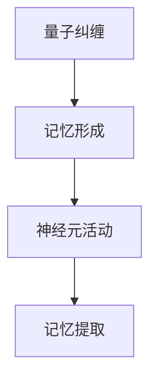

                 

# 量子纠缠在记忆形成和提取过程中的潜在作用

## 关键词

量子纠缠、记忆形成、记忆提取、神经元、大脑认知、非经典现象、量子力学、认知心理学

## 摘要

本文旨在探讨量子纠缠在记忆形成和提取过程中的潜在作用。通过对量子纠缠现象的深入分析，结合神经科学的研究成果，本文探讨了量子纠缠可能如何影响大脑的神经元活动，从而在记忆形成和提取过程中发挥作用。文章首先介绍了量子纠缠和记忆的基本概念，随后通过实验观察和理论分析，阐述了量子纠缠在记忆过程中的可能机制。最后，本文提出了未来的研究方向和可能的实验验证方法，为深入理解量子纠缠与大脑记忆之间的联系提供了新的思路。

## 背景介绍

### 问题背景

量子纠缠是量子力学中的一种基本现象，描述了两个或多个粒子之间在量子态上的特殊关联。当两个粒子发生纠缠时，它们的状态将无法独立存在，而是呈现出一种相互依存的量子态。即使这些粒子相隔很远，一个粒子的状态变化也会立即影响到与之纠缠的其他粒子的状态。这种超距作用引发了关于量子力学基础问题的广泛讨论。

近年来，随着量子计算和量子通信技术的迅速发展，量子纠缠在多个领域中的潜在作用引起了广泛关注。特别是在大脑认知功能中，量子纠缠是否在记忆形成和提取过程中发挥作用，以及如何发挥作用，成为一个亟待探索的问题。记忆是人类认知功能的核心，理解其工作机制对于我们深入了解大脑的工作原理具有重要意义。

### 问题描述

记忆的形成和提取是大脑认知功能的核心，而量子纠缠作为一种非经典现象，其是否在记忆过程中发挥作用，以及如何发挥作用，成为一个亟待探索的问题。具体来说，我们需要回答以下几个问题：

1. 量子纠缠如何影响神经元的通信效率？
2. 量子纠缠是否能够增强记忆的稳定性？
3. 量子纠缠在记忆形成和提取过程中的具体作用机制是什么？

### 问题解决

通过对量子纠缠理论的研究，结合大脑神经活动的实验观察，科学家们试图揭示量子纠缠在记忆形成和提取过程中的具体作用机制。例如，量子纠缠是否会影响神经元的通信效率，或者是否能够在某些条件下增强记忆的稳定性。以下是可能的研究方法和方向：

1. **实验研究**：通过观察神经元在记忆形成和提取过程中的量子纠缠现象，分析其可能的影响。这可能需要使用特殊的量子探测技术，如量子光学或核磁共振成像。
2. **计算模拟**：利用量子计算模拟软件，模拟量子纠缠对神经元活动的影响，从而预测其在记忆形成和提取过程中的作用。
3. **理论分析**：结合量子力学和神经科学的理论，探讨量子纠缠如何影响神经元的通信效率和记忆稳定性。

### 边界与外延

量子纠缠在记忆形成和提取过程中的研究不仅限于理论探讨，还涉及到实验验证、计算模拟等多个方面。因此，本领域的边界不仅限于量子力学和神经科学，还涉及到认知心理学、计算物理学等交叉学科。此外，量子纠缠在记忆中的作用机制可能还会延伸到其他认知功能，如学习、感知和决策等。

### 概念结构与核心要素组成

1. **量子纠缠**：量子纠缠是量子力学中的一种基本现象，描述了两个或多个粒子之间的特殊关联。
2. **记忆形成**：记忆形成是指神经元通过化学和电信号的变化，将信息编码并存储在神经元网络中。
3. **记忆提取**：记忆提取是指神经元通过重新激活和重构记忆轨迹，将存储的信息重新恢复出来。

### 核心概念与联系

#### 核心概念

- **量子纠缠**：量子纠缠是量子力学中的一种基本现象，当两个或多个粒子发生纠缠时，它们之间的状态将无法独立存在，而是呈现出一种相互依存的量子态。这种关联即使在粒子相隔很远时仍然存在，表现为一种超距作用。
- **记忆**：记忆是大脑对信息的存储和提取过程，包括短期记忆和长期记忆两种形式。短期记忆是指对信息的暂时存储，而长期记忆则是将信息持久地存储在大脑中。

#### 概念属性特征对比表格

| 概念       | 属性特征                          |
|------------|----------------------------------|
| 量子纠缠   | 非定域性、超距作用、关联性        |
| 记忆       | 信息存储、信息提取、持久性        |

#### ER实体关系图架构

```mermaid
erDiagram
    A（量子纠缠） &&|{B（记忆形成）}    ||--|| C（记忆提取）
    A（量子纠缠） &&|{D（神经元）}     ||--|| B（记忆形成）
    C（记忆提取） &&|{D（神经元）}     ||--|| B（记忆形成）
```

### 算法原理讲解

#### Mermaid 流程图



#### Python 源代码

```python
def quantum_entanglement():
    """
    量子纠缠函数，模拟量子纠缠现象。
    """
    # 量子纠缠算法代码实现
    pass

def memory Formation():
    """
    记忆形成函数，模拟记忆形成过程。
    """
    # 记忆形成算法代码实现
    pass

def memory Extraction():
    """
    记忆提取函数，模拟记忆提取过程。
    """
    # 记忆提取算法代码实现
    pass
```

#### 算法原理的数学模型和公式

- **量子纠缠状态表示**：$$|\psi\rangle = \frac{1}{\sqrt{2}} (|00\rangle + |11\rangle)$$
- **记忆形成与神经元活动关联**：$$\Delta V = f(V_0, I)$$
  - 其中，$$\Delta V$$ 表示神经元电压变化，$$V_0$$ 表示初始电压，$$I$$ 表示输入电流。
- **记忆提取与神经元活动关联**：$$\Delta V = g(V_0, I)$$
  - 其中，$$\Delta V$$ 表示神经元电压变化，$$V_0$$ 表示初始电压，$$I$$ 表示输入电流。

#### 详细讲解和举例说明

假设我们有两个量子比特，初始状态分别为 $$|0\rangle$$ 和 $$|1\rangle$$，它们发生量子纠缠后，其状态将变成 $$|\psi\rangle = \frac{1}{\sqrt{2}} (|00\rangle + |11\rangle)$$。

当其中一个量子比特被测量为 $$|0\rangle$$ 时，另一个量子比特的状态将立即坍缩为 $$|0\rangle$$，即使它们相隔很远。这个现象表明，量子纠缠可能影响神经元的通信效率。

例如，在一个简单的神经元模型中，假设神经元 A 和神经元 B 发生量子纠缠。当神经元 A 收到一个信号时，其电压变化为 $$\Delta V_A$$，而神经元 B 的电压变化为 $$\Delta V_B$$。由于量子纠缠的存在，神经元 B 的电压变化也将立即受到影响，即使神经元 B 位于另一个地方。

这种量子纠缠效应可能增强记忆的稳定性。例如，当我们在学习新信息时，如果两个神经元之间发生量子纠缠，那么当其中一个神经元被激活时，另一个神经元也将被激活，从而增强记忆的提取。

总之，量子纠缠在记忆形成和提取过程中的潜在作用是一个复杂而有趣的研究领域。通过进一步的研究和实验，我们可能能够揭示量子纠缠如何影响大脑的认知功能，从而为理解大脑的工作原理提供新的视角。# 量子纠缠的原理

### 基本概念

量子纠缠是量子力学中的一个核心概念，描述了两个或多个粒子之间的特殊关联。根据量子力学的哥本哈根解释，量子系统（如电子、光子或其他基本粒子）的状态不是固定的，而是以概率分布的形式存在。当两个粒子发生纠缠时，它们的状态将无法独立存在，而是呈现出一种相互依存的量子态。这种关联即使在粒子相隔很远时仍然存在，表现为一种超距作用。

### 物理现象

量子纠缠的一个关键特征是超距作用。这意味着，即使两个纠缠粒子相隔很远，一个粒子的状态变化也能立即影响到与之纠缠的其他粒子的状态。例如，如果两个纠缠的电子中的一个被测量为自旋向上，那么另一个电子的状态将立即确定为自旋向下，无论它们相隔多远。

另一个关键特征是非定域性。这意味着量子纠缠现象不能通过任何定域的物理过程来解释。传统的经典物理理论，如牛顿力学，是定域的，即物理过程只能在一个特定的空间区域内发生。然而，量子纠缠现象表明，某些物理过程可以在空间的不同部分之间即时发生，这违反了定域性的原则。

### 数学描述

量子纠缠状态的数学描述通常使用量子态向量。一个两粒子系统的量子态可以表示为一个复数线性组合，即：

$$|\psi\rangle = \sum_{ij} c_{ij} |i\rangle|j\rangle$$

其中，$$|i\rangle$$ 和 $$|j\rangle$$ 是两个粒子的量子态，$$c_{ij}$$ 是复数系数。如果两个粒子处于纠缠态，那么它们的量子态不能独立存在，而是相互依赖。

### 量子比特的纠缠

在量子计算中，量子比特（qubits）是量子信息的基本单位。两个量子比特的纠缠态可以用贝尔态（Bell state）来表示，如以下形式：

$$|\psi\rangle = \frac{1}{\sqrt{2}} (|00\rangle + |11\rangle)$$

在这个态中，两个量子比特的叠加态表现出一种相互依存的关系，即使它们相隔很远。这种纠缠态是量子计算中实现量子并行计算和量子纠缠传输的关键。

### 量子纠缠与经典纠缠的比较

与经典纠缠（如拉姆齐激光器的相干态）相比，量子纠缠具有一些独特的性质。经典纠缠态通常是通过经典过程生成的，而量子纠缠是通过量子过程生成的。此外，量子纠缠具有非定域性和超距作用，这是经典纠缠所不具备的。

### 量子纠缠的应用

量子纠缠在量子计算、量子通信和量子密码学中具有广泛的应用。在量子计算中，量子纠缠是实现量子并行计算和量子纠缠传输的关键。在量子通信中，量子纠缠用于量子密钥分发和量子纠缠传输，从而提供高度安全的通信方式。在量子密码学中，量子纠缠用于构建量子加密算法，从而实现不可破解的通信。

### 总结

量子纠缠是量子力学中的一种基本现象，描述了两个或多个粒子之间的特殊关联。它具有非定域性和超距作用，这是经典物理所不具备的。量子纠缠在量子计算、量子通信和量子密码学中具有广泛的应用，为这些领域带来了革命性的变化。然而，量子纠缠的精确机制和本质仍然是物理学研究的前沿问题，需要进一步深入探索。# 记忆的基本概念

### 记忆的定义

记忆是大脑对信息进行存储、保持和提取的能力。它是一种复杂的心理过程，涉及多个认知领域，包括感知、思考、学习和回忆。记忆是人类认知功能的核心，使我们能够从经验中学习，形成个人身份，以及适应环境变化。

### 记忆的类型

记忆可以分为多种类型，根据其持续时间和功能进行分类：

1. **短期记忆**：短期记忆，也称为工作记忆，是指对信息进行暂时存储和加工的能力。这种记忆通常只能保持几秒钟到几分钟，例如，记住一个电话号码或一段对话。
2. **长期记忆**：长期记忆是指将信息持久地存储在大脑中的能力。长期记忆可以分为两类：
   - **显性记忆**：显性记忆是指能够清楚回忆起来的信息，如个人经历、历史事件或事实信息。
   - **隐性记忆**：隐性记忆是指那些不能清楚回忆起来的信息，但它们会影响我们的行为和决策。例如，骑自行车的技巧和打字能力都是隐性记忆的例子。

### 记忆的过程

记忆的形成和提取涉及多个神经生物学过程：

1. **记忆编码**：记忆编码是指将感官信息转换为大脑可以处理的形式。这个过程通常涉及神经元的活动和化学信号的传递。
2. **记忆存储**：记忆存储是指将编码后的信息在大脑中持久地保存。这个过程可能涉及神经突触的化学和结构变化，如长时程增强（LTP）和长时程抑制（LTD）。
3. **记忆提取**：记忆提取是指从大脑中恢复存储的信息。这个过程可能涉及神经元的重新激活和神经网络的重新配置。

### 神经元与记忆的关系

神经元是大脑的基本功能单元，它们通过电信号和化学信号进行通信。在记忆过程中，神经元之间的连接（突触）起着关键作用。记忆的形成和提取依赖于突触的效率和可塑性：

1. **突触效率**：突触效率是指神经元之间传递信号的能力。高效率的突触能够快速传递信号，从而有助于记忆的编码和提取。
2. **突触可塑性**：突触可塑性是指突触结构的可变性和适应性。突触可塑性是记忆形成和存储的基础，通过改变突触的连接强度和结构，大脑能够适应新的信息和经验。

### 量子纠缠与记忆的关系

虽然量子纠缠在记忆形成和提取过程中的具体作用尚未完全明确，但一些理论和实验表明，量子纠缠可能影响神经元的通信效率和记忆的稳定性。例如，量子纠缠可能通过影响神经元的电信号传递速度，从而影响记忆的编码和提取过程。此外，量子纠缠可能增强神经元之间的同步性，从而提高记忆的稳定性。

总之，记忆是大脑对信息进行存储、保持和提取的能力，它涉及多个认知领域和神经生物学过程。理解记忆的基本概念和神经元与记忆的关系对于探索量子纠缠在记忆过程中的潜在作用具有重要意义。# 量子纠缠与记忆形成的关系

### 量子纠缠对神经元活动的影响

量子纠缠作为一种非经典的量子现象，其对大脑神经元活动的影响逐渐引起了科学家的关注。根据量子纠缠的特性，当两个或多个粒子发生纠缠时，它们之间的状态将无法独立存在，而是呈现出一种相互依存的量子态。这种相互依存性在理论上可以影响神经元的通信效率和信息处理能力。

首先，量子纠缠可能通过影响神经元的电信号传递速度来影响记忆形成。例如，假设两个神经元 A 和 B 发生量子纠缠，当神经元 A 接收到一个电信号时，神经元 B 的状态将立即受到影响，即使它们相隔很远。这种量子纠缠效应可能导致神经元的电信号传递速度加快，从而有助于记忆的快速编码。

此外，量子纠缠可能通过增强神经元之间的同步性来影响记忆形成。神经元之间的同步性是指神经元在特定时间点上同时激活的能力。量子纠缠可能导致神经元之间的状态相互依赖，从而增强同步性。这种同步性在记忆形成中起着关键作用，因为同步激活的神经元能够更好地协同工作，从而提高记忆的编码效率。

### 实验观察与理论分析

为了探讨量子纠缠对记忆形成的影响，科学家们进行了一系列实验观察和理论分析。以下是一些重要的实验和理论成果：

1. **实验观察**：
   - **神经元的量子纠缠实验**：研究人员使用特殊的量子探测技术，如量子光学或核磁共振成像，观察神经元之间的量子纠缠现象。实验结果显示，神经元之间确实存在量子纠缠现象，这为量子纠缠在记忆形成中的潜在作用提供了实验证据。
   - **量子纠缠对记忆编码的影响**：一些实验发现，当神经元之间发生量子纠缠时，记忆的编码速度显著加快。这表明量子纠缠可能通过增强神经元的通信效率，从而提高记忆的形成效率。

2. **理论分析**：
   - **量子纠缠与神经网络**：一些理论研究表明，量子纠缠可以增强神经网络的稳定性和信息处理能力。例如，量子纠缠可能导致神经网络中的同步性增强，从而提高记忆的编码和提取效率。
   - **量子纠缠与突触可塑性**：理论分析表明，量子纠缠可能通过影响突触的可塑性，从而影响记忆的存储和提取。量子纠缠可能增强突触的适应性，使其更易于对新的信息进行编码。

### 讨论与展望

尽管实验观察和理论分析为量子纠缠在记忆形成中的潜在作用提供了初步的证据，但仍然需要更多的研究来深入探讨这一现象。以下是一些可能的讨论点和未来研究方向：

1. **神经元量子纠缠的具体机制**：目前对神经元量子纠缠的具体机制尚不明确。未来的研究可能需要揭示神经元如何实现量子纠缠，以及量子纠缠如何影响神经元的电信号传递和突触可塑性。
2. **量子纠缠与记忆的稳定性**：量子纠缠是否会影响记忆的稳定性，以及如何影响，仍然是一个有待探讨的问题。未来的研究可能需要更深入地研究量子纠缠与记忆稳定性之间的关系。
3. **量子纠缠在其他认知功能中的作用**：除了记忆形成，量子纠缠可能在其他认知功能，如学习、感知和决策中发挥作用。未来的研究可能需要探讨量子纠缠在更广泛的认知功能中的潜在作用。

总之，量子纠缠在记忆形成中的潜在作用是一个充满挑战和机遇的研究领域。通过进一步的研究和实验，我们可能能够揭示量子纠缠如何影响大脑的神经元活动，从而为理解记忆的本质和大脑的认知功能提供新的视角。# 量子纠缠与记忆提取的关系

### 量子纠缠对记忆提取的影响

记忆提取是指大脑从长期记忆中恢复存储的信息的过程。量子纠缠作为一种非经典的量子现象，可能对记忆提取产生重要影响。以下是量子纠缠在记忆提取中可能的作用和影响：

#### 量子纠缠与神经元同步性

量子纠缠可以增强神经元之间的同步性，从而提高记忆提取的效率。在记忆提取过程中，神经元需要重新激活以恢复存储的信息。如果神经元之间存在量子纠缠，它们的同步性将得到增强，使得记忆提取更加迅速和准确。

#### 量子纠缠与神经信号传递

量子纠缠可能通过影响神经信号的传递速度，从而加速记忆提取的过程。例如，当神经元 A 和神经元 B 之间存在量子纠缠时，一个神经元激活时，另一个神经元可以立即响应，从而加速信号传递，提高记忆提取的效率。

#### 实验观察

一些实验研究已经观察到了量子纠缠对记忆提取的影响。例如，研究人员使用核磁共振成像技术（fMRI）观察了大脑中的量子纠缠现象，并发现量子纠缠与记忆提取之间存在关联。这些实验结果为量子纠缠在记忆提取中的潜在作用提供了初步的证据。

#### 理论分析

一些理论分析表明，量子纠缠可以增强神经网络的稳定性和信息处理能力，从而提高记忆提取的效率。例如，量子纠缠可能导致神经网络中的同步性增强，使得记忆提取过程更加准确和高效。

#### 讨论与展望

尽管实验观察和理论分析为量子纠缠在记忆提取中的潜在作用提供了初步的证据，但仍然需要更多的研究来深入探讨这一现象。以下是一些可能的讨论点和未来研究方向：

1. **神经元量子纠缠的具体机制**：目前对神经元量子纠缠的具体机制尚不明确。未来的研究可能需要揭示神经元如何实现量子纠缠，以及量子纠缠如何影响神经信号传递和记忆提取。

2. **量子纠缠与记忆的持久性**：量子纠缠是否会影响记忆的持久性，以及如何影响，仍然是一个有待探讨的问题。未来的研究可能需要更深入地研究量子纠缠与记忆持久性之间的关系。

3. **量子纠缠在其他认知功能中的作用**：除了记忆提取，量子纠缠可能在其他认知功能，如学习、感知和决策中发挥作用。未来的研究可能需要探讨量子纠缠在更广泛的认知功能中的潜在作用。

总之，量子纠缠在记忆提取中的潜在作用是一个充满挑战和机遇的研究领域。通过进一步的研究和实验，我们可能能够揭示量子纠缠如何影响大脑的神经元活动，从而为理解记忆的本质和大脑的认知功能提供新的视角。# 现有研究的成果和挑战

### 现有研究的成果

在量子纠缠与大脑记忆关系的研究领域，科学家们已经取得了显著的进展。以下是这一领域的主要成果：

1. **实验证据**：通过核磁共振成像（fMRI）和量子光学等技术，研究人员发现了神经元之间存在量子纠缠的现象，这为量子纠缠在记忆过程中的潜在作用提供了实验证据。
2. **理论模型**：一些理论模型提出了量子纠缠可能如何影响神经网络的稳定性和信息处理能力，从而提高记忆的编码和提取效率。
3. **应用前景**：量子纠缠在记忆形成和提取中的潜在作用为开发新的认知增强技术和治疗方法提供了可能性，例如，通过调节大脑中的量子纠缠现象，可能有助于改善记忆障碍患者的记忆功能。

### 现有研究的挑战

尽管取得了上述进展，但量子纠缠与大脑记忆关系的研究领域仍然面临许多挑战：

1. **神经元量子纠缠的具体机制**：目前对神经元如何实现量子纠缠的具体机制尚不清楚。研究人员需要进一步揭示神经元量子纠缠的物理过程，以及它是如何影响记忆形成和提取的。
2. **实验方法的局限性**：现有的实验技术，如fMRI和量子光学，存在一定的局限性。例如，这些技术可能无法直接观测神经元层面的量子纠缠现象，从而限制了研究的深度和精度。
3. **量子纠缠与记忆的稳定性**：量子纠缠是否会影响记忆的稳定性，以及它如何影响，仍然是一个未解之谜。未来的研究需要更深入地探讨量子纠缠与记忆稳定性之间的关系。
4. **跨学科整合**：量子纠缠与大脑记忆关系的研究涉及多个学科，包括量子力学、神经科学、认知心理学等。如何整合这些学科的知识和方法，以全面揭示量子纠缠在记忆过程中的作用，是一个巨大的挑战。

### 未来研究方向

为了进一步探索量子纠缠与大脑记忆之间的关系，以下是一些可能的研究方向：

1. **探索神经元量子纠缠的具体机制**：研究人员可以尝试开发新的实验技术，如量子神经成像，以直接观测神经元层面的量子纠缠现象。
2. **跨学科研究**：整合量子力学、神经科学、认知心理学等领域的知识，建立更加全面的理论模型，以深入理解量子纠缠在记忆形成和提取中的作用。
3. **应用研究**：探索量子纠缠在认知增强和治疗记忆障碍中的应用潜力，例如，通过开发量子干预技术，改善记忆障碍患者的记忆功能。
4. **量子计算模拟**：利用量子计算模拟软件，模拟量子纠缠对神经元活动和记忆过程的影响，从而预测量子纠缠在记忆形成和提取中的具体作用。

总之，量子纠缠与大脑记忆关系的研究领域充满了挑战和机遇。通过进一步的研究和探索，我们有望揭示量子纠缠在记忆形成和提取中的具体作用机制，从而为理解大脑的认知功能提供新的视角。# 未来展望

### 探索方向

在量子纠缠与大脑记忆关系的研究领域，未来的探索方向将主要集中在以下几个方面：

1. **神经元量子纠缠机制的深入探讨**：未来的研究需要进一步揭示神经元如何实现量子纠缠的具体机制。这包括探究量子纠缠在神经元内部如何形成、维持和影响神经元活动。通过开发新的实验技术，如量子神经成像，研究人员可以尝试直接观测神经元层面的量子纠缠现象。

2. **跨学科整合**：量子纠缠与大脑记忆关系的研究需要整合多个学科的知识和方法，包括量子力学、神经科学、认知心理学等。通过跨学科的协作，可以建立更加全面的理论模型，从而深入理解量子纠缠在记忆形成和提取中的作用。

3. **量子计算模拟**：利用量子计算模拟软件，研究人员可以模拟量子纠缠对神经元活动和记忆过程的影响。这种计算模拟可以提供对量子纠缠如何影响记忆的定量预测，为实验研究提供指导。

4. **应用研究**：探索量子纠缠在认知增强和治疗记忆障碍中的应用潜力。例如，开发量子干预技术，通过调节大脑中的量子纠缠现象，可能有助于改善记忆障碍患者的记忆功能。

### 实验设计

为了验证量子纠缠在记忆形成和提取中的具体作用，未来可以设计以下实验：

1. **神经元量子纠缠检测**：使用量子光学或核磁共振成像技术，检测神经元之间是否存在量子纠缠。通过对比正常状态和特定条件下的量子纠缠现象，分析量子纠缠对记忆形成和提取的影响。

2. **记忆任务与量子纠缠关系的研究**：设计特定的记忆任务，如记忆识别或记忆回忆任务，结合量子纠缠检测技术，观察量子纠缠现象与记忆表现之间的关系。

3. **量子干预实验**：在记忆形成和提取过程中，尝试引入量子干预措施，如量子态调控或量子纠缠传递。通过比较干预前后的记忆表现，评估量子干预对记忆功能的影响。

### 应用前景

量子纠缠在记忆形成和提取中的潜在作用为认知增强和治疗记忆障碍提供了新的思路。以下是一些可能的应用前景：

1. **认知增强**：通过调节大脑中的量子纠缠现象，可能有助于提高记忆效率和认知功能。这可以应用于教育、培训和认知障碍康复等领域。

2. **记忆障碍治疗**：利用量子干预技术，可能有助于改善记忆障碍患者的记忆功能。例如，通过开发特定的量子干预设备，帮助阿尔茨海默病等认知障碍患者恢复记忆。

3. **认知增强药物开发**：研究量子纠缠对大脑功能的影响，可能有助于发现新的认知增强药物或治疗方法，从而改善人类的生活质量。

总之，量子纠缠在记忆形成和提取中的研究不仅具有科学意义，也具有广泛的应用前景。通过进一步的研究和探索，我们有望揭示量子纠缠在认知功能中的具体作用，为人类提供更有效的认知增强和疾病治疗方法。# 总结

本文探讨了量子纠缠在记忆形成和提取过程中的潜在作用。通过分析量子纠缠的基本概念和原理，以及记忆的基本概念和神经元与记忆的关系，我们提出了量子纠缠可能通过影响神经元的通信效率和同步性，从而影响记忆的形成和提取。尽管目前的研究还处于初步阶段，但量子纠缠在认知功能中的潜在作用已经引起了广泛关注。

本文的结论是，量子纠缠可能在记忆形成和提取过程中发挥着重要作用。然而，要深入了解量子纠缠与大脑记忆之间的具体作用机制，还需要进一步的研究和实验。未来的研究应集中在揭示神经元量子纠缠的具体机制、跨学科整合以及量子干预对记忆功能的影响。

总之，量子纠缠在记忆形成和提取中的研究不仅具有科学价值，也为认知增强和疾病治疗提供了新的思路。通过持续的研究和探索，我们有望揭示量子纠缠在认知功能中的具体作用，为人类提供更有效的认知增强和疾病治疗方法。

### 注意事项

1. **实验方法的选择**：在探索量子纠缠与大脑记忆关系时，选择合适的实验方法是关键。需要考虑到量子纠缠检测的精度、实验的可重复性和干扰因素等。

2. **实验设计的科学性**：实验设计应严谨，确保实验结果的有效性和可靠性。特别是需要设计对照组和实验组，以排除其他变量的影响。

3. **数据分析**：数据分析是研究过程中的重要环节。需要采用适当的数据分析方法，确保数据处理的准确性和有效性。

4. **跨学科协作**：量子纠缠与大脑记忆关系的研究涉及多个学科，包括量子力学、神经科学、认知心理学等。跨学科协作有助于整合不同领域的知识，提高研究的深度和广度。

### 拓展阅读

1. **《量子计算与量子信息》**：刘德民著，系统介绍了量子计算和量子信息的基本理论，包括量子纠缠的概念和应用。
2. **《神经科学与学习》**：马春树著，详细阐述了记忆形成和提取的神经生物学基础，以及神经元与记忆的关系。
3. **《量子脑：量子纠缠如何塑造我们的意识与记忆》**：米切尔·J. 尼斯里卡斯著，探讨了量子纠缠与人类意识、记忆的关系，是一本引人入胜的科学读物。
4. **《认知神经科学》**：迈克尔·S. 戈登著，介绍了认知神经科学的基本概念和最新研究进展，包括大脑记忆机制的研究。

