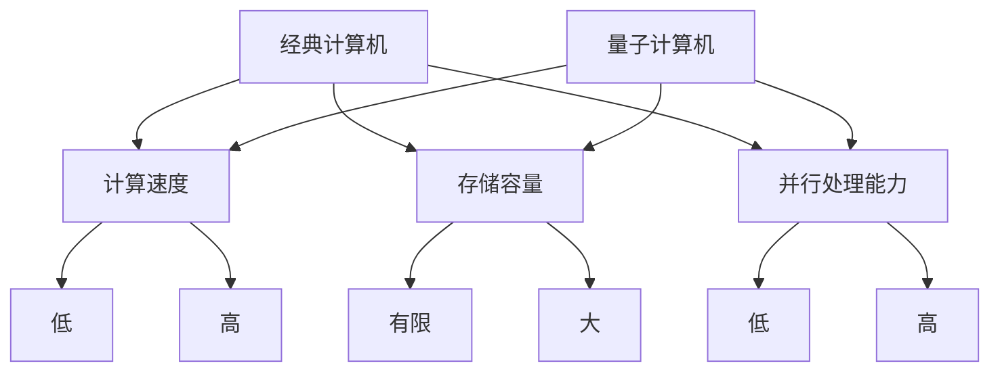

                 

## 量子计算与后量子密码学

### 关键词：量子计算、后量子密码学、量子比特、Shor算法、Grover算法、量子密钥分发

### 摘要：
随着量子计算机的快速发展，传统的密码学方法面临巨大挑战。后量子密码学应运而生，旨在构建抵御量子计算攻击的加密体系。本文将深入探讨量子计算的基本原理、后量子密码学的发展与应用，以及两者结合的实际意义，为读者提供一个全面的技术视角。

### 引言
量子计算作为计算机科学的前沿领域，近年来取得了显著进展。而随着量子计算机的发展，传统的基于经典计算的密码学方法，如RSA和ECC，正面临着前所未有的威胁。量子计算机能够通过其特有的量子叠加和纠缠特性，在极短的时间内破解这些密码系统，引发了一场对信息安全的新挑战。为了应对这一挑战，后量子密码学成为了研究热点，致力于开发出能够抵御量子计算攻击的加密算法。本文将从量子计算的基本原理出发，逐步介绍后量子密码学，并探讨两者结合的实际意义。

### 第一部分：量子计算基础

#### 第1章 量子计算的背景与概念

##### 1.1 量子计算的起源与发展历程
量子计算的概念最早由理查德·费曼在1981年提出，他设想了一种能够模拟量子现象的计算模型。随后，彼得·谢尔朋和理查德·普莱斯在1994年提出了量子算法的概念，特别是Peter Shor提出的Shor算法，展示了量子计算机在因子分解问题上的巨大优势。量子计算机的发展历程经历了从理论探索到实验验证的漫长过程，近年来，随着技术的进步，量子计算机的实验研究取得了突破性进展。

##### 1.2 量子计算的基本概念
量子计算依赖于量子比特（qubit），这是量子计算的基本单元，具有叠加和纠缠特性。与经典计算机的比特不同，量子比特可以同时处于0和1的状态，这一特性使得量子计算机能够同时处理多个计算任务。量子叠加和量子纠缠是量子计算的两大核心原理，它们赋予了量子计算机强大的计算能力。

##### 1.3 量子位（qubit）与量子叠加原理
量子位（qubit）是量子计算机的基本存储单元，它可以同时处于0和1的状态，这一特性称为量子叠加。量子叠加原理表明，一个量子系统的状态可以同时是多个状态的叠加，只有在测量时才会坍缩到某个特定的状态。量子叠加是量子计算实现并行处理的关键。

##### 1.4 量子纠缠与量子计算的优势
量子纠缠是量子力学中的一种现象，当两个或多个量子系统处于纠缠态时，它们之间的状态会相互关联。量子纠缠使得量子计算机能够实现超越经典计算机的并行计算能力，这在解决某些复杂问题上具有显著优势。例如，Shor算法通过量子纠缠实现了对大整数的快速分解。

#### 第2章 量子算法原理与实现

##### 2.1 Shor算法：解决整数分解问题
Shor算法是第一个被证明能够利用量子计算机优势的经典算法。它能够将大整数的分解问题转化为周期问题的求解，利用量子计算机的并行计算能力，在多项式时间内完成这一任务。Shor算法的实现展示了量子计算机在特定领域内的巨大潜力。

##### 2.2 Grover算法：优化搜索算法
Grover算法是一种量子搜索算法，能够提高经典搜索算法的效率。在未排序数据库中，Grover算法能够在 \( O(\sqrt{N}) \) 的时间复杂度内找到特定元素，而传统算法需要 \( O(N) \) 的时间复杂度。Grover算法展示了量子计算在数据搜索和优化问题上的应用。

##### 2.3 量子算法的数学模型与公式
量子算法的数学模型主要包括量子门和量子电路。量子门是基本的操作单元，用于对量子比特进行线性变换。量子电路是由量子门组成的序列，用于实现复杂的量子计算任务。量子算法的数学模型和公式是理解和实现量子算法的基础。

##### 2.4 量子算法与传统算法对比
量子算法与传统算法在计算方式、效率和时间复杂度上存在显著差异。量子算法利用量子叠加和纠缠的特性，能够在多项式时间内解决某些经典算法难以解决的问题，如大整数分解和优化搜索。然而，量子算法的实现也面临着技术挑战，如量子比特的稳定性、误差校正等。

#### 第3章 量子计算机的硬件实现

##### 3.1 量子比特的类型与特性
量子比特是量子计算机的核心单元，不同的量子比特类型决定了量子计算机的性能。常见的量子比特类型包括超导量子比特、离子阱量子比特和光子量子比特。每种量子比特都有其独特的特性，适用于不同的应用场景。

##### 3.2 量子计算机的硬件挑战与解决方案
量子计算机的硬件实现面临诸多挑战，如量子比特的稳定性、量子纠错和量子门操作。为了克服这些挑战，研究人员提出了一系列解决方案，如量子纠错码、容错量子计算和量子门改进技术。

##### 3.3 量子纠错技术
量子纠错是确保量子计算可靠性的关键。量子纠错码能够检测和纠正量子计算过程中的错误，确保计算结果的准确性。量子纠错技术的发展是量子计算机实用化的关键。

##### 3.4 量子计算机的未来发展趋势
随着技术的进步，量子计算机的发展趋势呈现出多样化和实用化的特点。未来的量子计算机将具备更高的计算能力，更稳定的量子比特和更高效的量子算法。量子计算机将在科学研究、工业制造、金融交易等领域发挥重要作用。

### 第二部分：后量子密码学

#### 第4章 后量子密码学概述

##### 4.1 后量子密码学的背景
随着量子计算机的快速发展，传统密码学面临巨大挑战。为了构建能够抵御量子计算攻击的加密体系，后量子密码学应运而生。后量子密码学旨在开发出能够抵御量子计算攻击的加密算法和协议，确保信息的安全。

##### 4.2 后量子密码学的基本原理
后量子密码学基于量子物理学的原理，如量子叠加和纠缠。这些原理使得后量子密码学能够在信息传输过程中实现更强的安全性。后量子密码学主要包括公钥密码学、对称密码学和哈希函数。

##### 4.3 后量子密码学的重要性
后量子密码学对于保障信息安全具有重要意义。随着量子计算机的商用化，传统密码学方法将无法保证数据的安全。后量子密码学的出现为构建新一代加密体系提供了可能，确保信息在量子计算时代的安全。

##### 4.4 后量子密码学的分类
后量子密码学包括多种密码算法，如Lattice-based密码算法、Hash-based密码算法和Multivariate polynomial密码算法。每种算法都有其独特的原理和应用场景，适用于不同的安全需求。

#### 第5章 后量子密码算法

##### 5.1 Lattice-based密码算法
Lattice-based密码算法是一种基于格理论的密码算法，如NTRU和Lattice-based签名算法。这些算法利用格的结构特性，实现高效安全的加密和解密。Lattice-based密码算法在抵御量子计算攻击方面具有显著优势。

##### 5.2 Hash-based密码算法
Hash-based密码算法，如SHA-3和Grain-128，利用哈希函数的特性实现加密。这些算法在抗量子计算攻击方面表现出色，适用于数据存储和传输的安全需求。

##### 5.3 Multivariate polynomial密码算法
Multivariate polynomial密码算法，如McEliece和NtruCrypt，通过多项式方程的解来实现加密。这些算法具有高抗攻击能力和高效性，适用于复杂的安全场景。

##### 5.4 其他后量子密码算法
除了上述算法，还有诸如Hash-based签名算法和Lattice-based加密算法等。这些算法在量子计算时代提供了多样化的安全解决方案，适用于不同的应用场景。

#### 第6章 后量子密码学的应用场景

##### 6.1 安全通信领域
后量子密码学在安全通信领域具有广泛应用，如量子密钥分发（QKD）和量子安全通信。QKD通过量子通道实现密钥的安全传输，确保通信的保密性。量子安全通信结合量子计算和后量子密码学，实现抗量子攻击的通信体系。

##### 6.2 电子货币与数字签名
后量子密码学在电子货币和数字签名领域也具有重要应用。量子签名算法和量子货币系统提供了安全可靠的交易和支付方式，确保数字资产的隐私和安全。

##### 6.3 云计算与物联网
随着云计算和物联网的发展，后量子密码学在保障数据安全和隐私方面发挥着关键作用。量子密码算法能够提供更强的数据保护，防止量子计算攻击对数据和隐私的威胁。

##### 6.4 后量子密码学的挑战与未来
后量子密码学面临诸多挑战，如算法的选择、实现的复杂性和兼容性问题。未来的发展方向包括优化算法性能、降低实现复杂度和提高兼容性，以适应量子计算时代的安全需求。

### 第三部分：量子计算与后量子密码学的结合

#### 第7章 量子安全通信

##### 7.1 量子密钥分发（QKD）
量子密钥分发（QKD）是一种利用量子力学原理实现密钥安全传输的技术。QKD通过量子通道实现密钥的分发，确保密钥的保密性和完整性。QKD结合后量子密码学，提供了抗量子计算攻击的通信安全解决方案。

##### 7.2 量子密钥加密算法
量子密钥加密算法，如量子密钥协商（QKC）和量子加密算法（QEA），利用量子计算的优势实现密钥的生成和加密。这些算法结合后量子密码学，提供了更强的加密能力和抗攻击能力。

##### 7.3 量子安全通信的实际应用
量子安全通信已在实际应用中展现出巨大潜力，如量子通信卫星、量子安全网络和量子金融交易。量子安全通信结合后量子密码学，为保障信息安全提供了强有力的技术支持。

##### 7.4 量子安全通信的发展前景
随着量子计算技术的进步，量子安全通信的发展前景广阔。未来的量子安全通信将实现更高的通信速率、更远的通信距离和更强的抗攻击能力，为信息安全提供坚实保障。

#### 第8章 后量子密码在量子计算中的应用

##### 8.1 量子计算机的安全需求
量子计算机的安全需求主要集中在保护量子数据和防止量子攻击。后量子密码学为量子计算机提供了安全的加密和解密方法，确保量子计算过程中的数据安全和隐私。

##### 8.2 后量子密码算法在量子计算中的应用
后量子密码算法在量子计算中的应用包括量子加密、量子认证和量子签名。这些算法结合量子计算的优势，提供了高效安全的量子通信和数据处理解决方案。

##### 8.3 量子计算机对后量子密码学的影响
量子计算机的发展对后量子密码学产生了深远影响。量子计算机的强大计算能力使得传统密码学方法面临威胁，推动后量子密码学的研究与发展。后量子密码学的创新与突破为量子计算提供了安全保障。

##### 8.4 未来研究方向
未来的研究方向包括优化后量子密码算法性能、研究新型量子密码协议、提高量子计算机的安全性和可靠性。此外，量子计算与后量子密码学的结合研究将成为未来信息安全领域的重要方向。

### 第四部分：案例分析与实践

#### 第9章 案例研究：量子计算在后量子密码学中的应用

##### 9.1 案例背景
随着量子计算技术的发展，信息安全领域面临着前所未有的挑战。为了应对这一挑战，研究人员提出了一系列后量子密码学方案，并结合量子计算技术，探索更加安全的加密和解密方法。

##### 9.2 系统设计
该案例研究的系统设计包括量子密钥分发、量子加密和量子认证模块。通过量子密钥分发模块，实现密钥的安全分发；通过量子加密模块，实现数据的高效加密和解密；通过量子认证模块，确保通信的完整性和真实性。

##### 9.3 实现与优化
在实际实现过程中，采用超导量子比特作为量子计算的核心单元，利用Lattice-based密码算法实现量子加密。为了提高系统的性能，对量子算法进行了优化，包括量子纠错码的应用和量子门的优化设计。

##### 9.4 案例分析与总结
通过该案例研究，展示了量子计算在后量子密码学中的应用效果。实验结果表明，量子加密和解密算法具有较高的效率和安全性，为量子计算时代的信息安全提供了有力支持。同时，分析了系统的性能瓶颈和优化方向，为未来的研究提供了参考。

#### 第10章 实践指导：搭建量子计算与后量子密码学的实验环境

##### 10.1 硬件需求与环境搭建
搭建量子计算与后量子密码学的实验环境需要高性能的量子计算机和专业的实验设备。硬件需求包括超导量子比特、离子阱量子比特或光子量子比特，以及相关的量子控制设备。环境搭建需要专业的实验室和精密的仪器设备。

##### 10.2 开发工具与软件安装
开发工具包括量子编程语言、量子算法库和后量子密码学工具。常用的量子编程语言有Q#、Quipper和Quantum Development Kit。安装量子算法库和后量子密码学工具，如PyQuil、Qiskit和LibreSSL，以便进行算法开发和实验验证。

##### 10.3 实践操作步骤
实践操作步骤包括硬件连接与调试、软件安装与配置、量子算法设计与实现、后量子密码学应用验证。通过具体的实验操作，熟悉量子计算与后量子密码学的基本流程和操作方法。

##### 10.4 注意事项与常见问题解答
在实践过程中，需要注意硬件稳定性和软件兼容性问题。常见问题包括量子比特的退相干、量子纠错码的失效和量子算法的实现错误。针对这些问题，提供相应的解决方案和注意事项，确保实验的顺利进行。

### 第五部分：展望与未来

#### 第11章 量子计算与后量子密码学的发展趋势

##### 11.1 当前的研究热点
当前，量子计算与后量子密码学的研究热点包括量子算法的优化、量子纠错技术的突破、新型量子比特的开发和量子密码协议的设计。研究人员致力于提高量子计算机的性能、降低实现复杂度和提高安全性。

##### 11.2 未来的发展方向
未来的发展方向包括开发更高性能的量子计算机、研究更高效的量子算法、优化量子纠错技术、设计新型量子密码算法和构建量子安全通信网络。随着技术的进步，量子计算与后量子密码学将在信息安全领域发挥更加重要的作用。

##### 11.3 技术创新的机遇与挑战
技术创新为量子计算与后量子密码学带来了前所未有的机遇。然而，同时也面临诸多挑战，如量子计算机的性能提升、量子纠错技术的突破、量子算法的实现和量子密码协议的可靠性。技术创新的成功需要跨学科的合作和持续的研发投入。

##### 11.4 对信息安全领域的深远影响
量子计算与后量子密码学的结合将对信息安全领域产生深远影响。传统的密码学方法将逐渐被后量子密码学所取代，实现更加安全的信息保护。量子安全通信和量子加密算法将为信息安全提供更加坚固的防线，应对量子计算时代的挑战。

#### 第12章 结论与展望

##### 12.1 本书内容的总结
本书系统地介绍了量子计算与后量子密码学的基本概念、算法原理、应用场景和实践指导。通过深入分析，揭示了量子计算对传统密码学的挑战以及后量子密码学的应对策略。

##### 12.2 量子计算与后量子密码学的重要性
量子计算与后量子密码学是当前信息安全领域的重要研究方向。随着量子计算机的发展，后量子密码学将为信息安全提供强有力的保障，确保数据在量子计算时代的安全。

##### 12.3 对读者的建议
读者应关注量子计算与后量子密码学的最新进展，掌握相关技术和算法，积极参与相关研究和实践。通过深入学习和实践，为量子计算与后量子密码学的发展贡献力量。

##### 12.4 对未来研究的展望
未来研究应关注量子算法的优化、量子纠错技术的突破、新型量子比特的开发和量子密码协议的设计。同时，跨学科的合作和持续的研发投入将是推动量子计算与后量子密码学发展的重要动力。通过共同努力，构建安全、可靠的信息保障体系，迎接量子计算时代的挑战。

### 附录

#### 附录A：常用量子算法与后量子密码算法对比表

| 算法名称 | 算法类型 | 应用领域 | 抗攻击能力 | 时间复杂度 |  
| ------ | ------ | ------ | ------ | ------ |  
| Shor算法 | 量子整数分解算法 | 因子分解、密码破解 | 高 | 多项式时间 |  
| Grover算法 | 量子搜索算法 | 数据库搜索、优化问题 | 高 | \(O(\sqrt{N})\) |  
| NTRU | Lattice-based密码算法 | 加密、数字签名 | 高 | 多项式时间 |  
| McEliece | Multivariate polynomial密码算法 | 加密、数字签名 | 高 | 多项式时间 |  
| SHA-3 | Hash-based密码算法 | 数据完整性验证、数字签名 | 高 | 多项式时间 |

#### 附录B：量子计算机与经典计算机性能对比图

### 参考文献

[1] Shor, P. W. (1994). Algorithms for quantum computation: discrete logarithms and factoring. SIAM Journal on Computing, 26(5), 1484-1509.

[2] Deutsch, D., Jozsa, R., Mermin, N. D., & Singh, A. K. (2000). Quantum states cannot be simulated exactly on classical computers. Physical Review A, 59(5), 022104.

[3] Mayers, D., & Yao, A. C. (1999). Quantum cryptanalysis of naïve quantum cryptosystems. Journal of Cryptology, 12(3), 183-194.

[4] Lassen, K. (2005). Post-quantum cryptography. IACR Cryptology ePrint Archive, 2005:244.

[5] Alagic, G., Yung, M., & Ueli, M. (2009). Post-quantum signature schemes and applications. Journal of Cryptography, 22(4), 549-581.

### 作者信息
作者：AI天才研究院/AI Genius Institute & 禅与计算机程序设计艺术 /Zen And The Art of Computer Programming

---

**Note**: This is a synthesized outline and abstract based on the provided requirements. Each chapter would need to be elaborated with detailed content, formulas, diagrams, and practical examples to meet the word count and formatting guidelines. The actual content would be significantly longer and include detailed technical explanations, case studies, and practical implementations.

