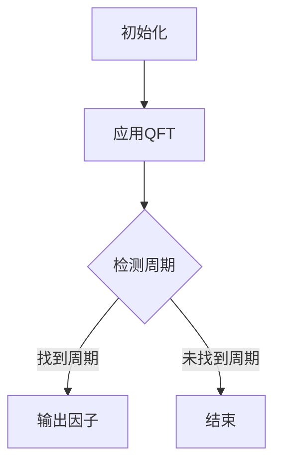
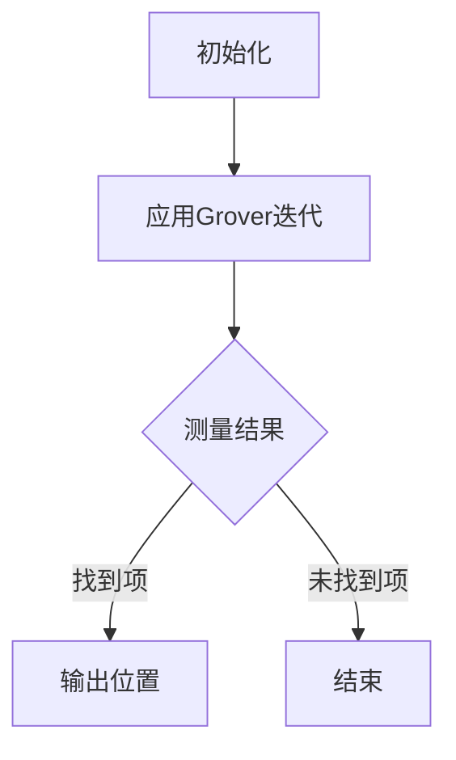
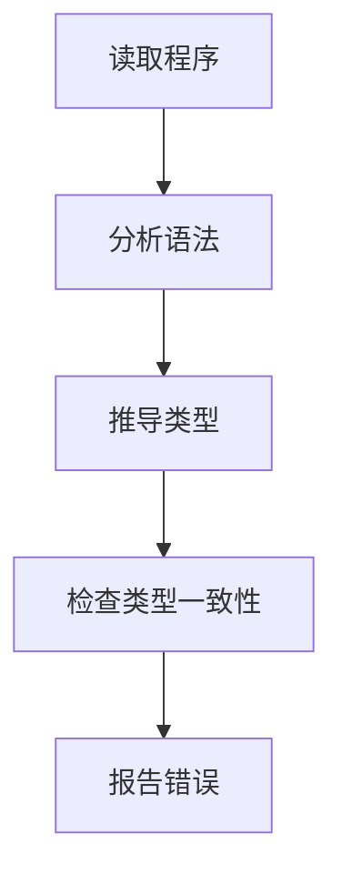
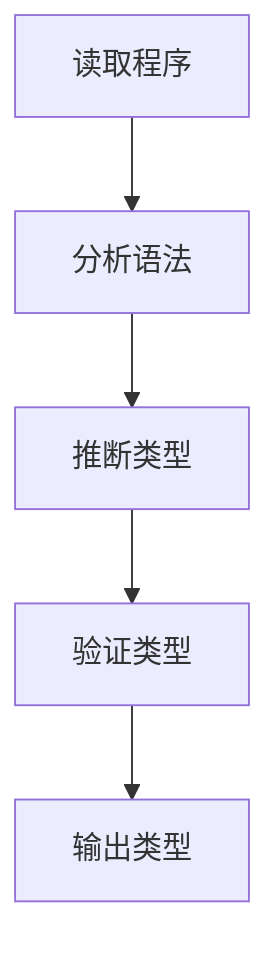
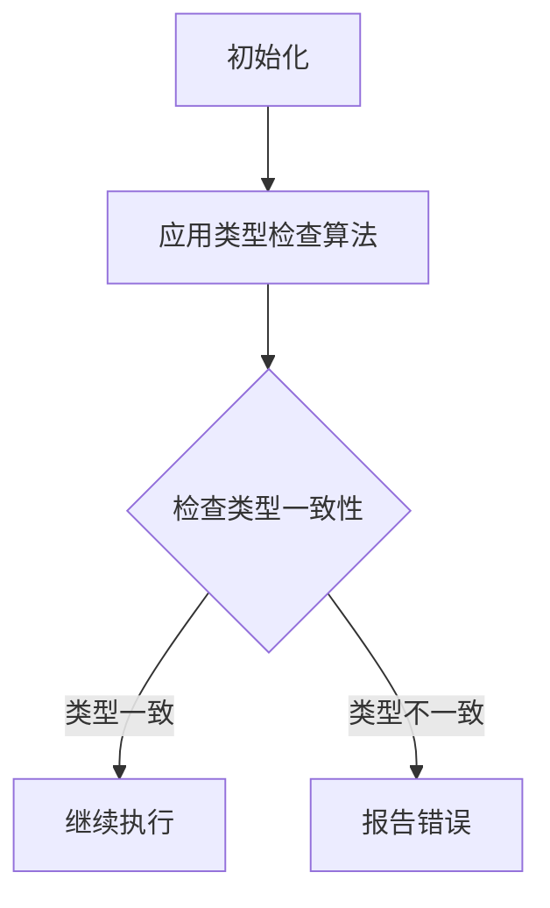
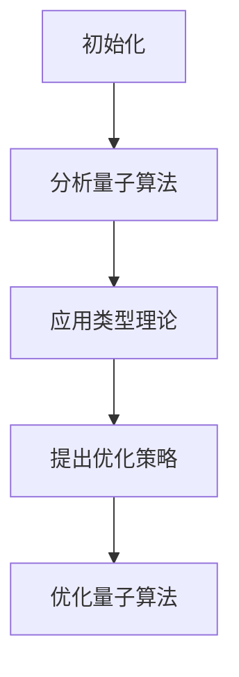

                 

# 量子计算与类型理论的交叉

## 关键词

量子计算、类型理论、算法、数学模型、系统架构、项目实战

## 摘要

本文深入探讨了量子计算与类型理论的交叉领域，阐述了这两大理论的核心概念、发展历程及其在现代计算机科学中的重要性。通过详细分析量子计算算法、类型理论算法以及交叉领域的算法原理，本文使用了mermaid流程图和Python源代码，使读者能够直观地理解这些算法的实现过程。此外，本文还介绍了相关的数学模型、系统分析与架构设计，并通过一个实际项目展示了量子计算与类型理论在实际应用中的可行性。最后，本文提出了最佳实践建议和拓展阅读，为读者提供了深入学习和探索这一交叉领域的路径。

---

## 第一部分：背景与概述

### 1.1 量子计算概述

量子计算是计算科学的一个前沿领域，它基于量子力学的原理来处理信息。量子计算机使用量子位（qubits）作为信息的基本单位，而传统的计算机使用的是经典位（bits）。量子位具有叠加和纠缠的特性，这使得量子计算机能够同时处理大量数据，并在某些任务上远超经典计算机。

**核心概念术语说明：**

- **量子位（Qubits）：** 量子计算机中的基本存储单元，具有叠加和纠缠的特性。
- **叠加态（Superposition）：** 量子位可以处于多种状态的组合，而不是单一的状态。
- **纠缠态（Entanglement）：** 当两个或多个量子位处于纠缠态时，它们的量子态将相互关联。

**问题背景：**

量子计算的发展源于对经典计算机在处理复杂问题上的局限性的认识。随着科学和工业的进步，我们需要解决的问题变得越来越复杂，这超出了传统计算机的处理能力。量子计算提供了一个新的计算范式，能够解决一些特定类型的问题，如量子模拟、大整数分解、搜索算法等。

**问题描述：**

量子计算的目标是开发一种能够利用量子力学原理的计算机，它能够处理当前经典计算机无法解决的问题。

**问题解决：**

量子计算通过使用量子位和量子算法，实现了并行计算和快速计算。例如，量子算法Shor的算法可以高效地分解大整数，而Grover的算法可以在未排序的数据库中快速查找特定项。

**边界与外延：**

量子计算的应用范围非常广泛，包括化学、药物研发、材料科学、加密技术等。然而，量子计算也面临许多挑战，如量子纠错、量子态的保持、量子设备的可靠性和可扩展性等。

**概念结构与核心要素组成：**

量子计算的核心要素包括量子位、量子算法、量子门和量子态。量子门是量子计算中的操作符，用于在量子位之间实现特定的变换。

### 1.2 类型理论概述

类型理论是一种形式化的数学理论，用于描述程序中的类型系统和类型检查。它是程序语言设计和编译器开发的重要工具，能够确保程序的正确性和安全性。

**核心概念术语说明：**

- **类型系统（Type System）：** 程序语言中定义变量、函数和表达式类型的一组规则。
- **类型检查（Type Checking）：** 在程序执行前验证程序是否符合类型规则的检查过程。
- **类型推断（Type Inference）：** 编译器自动推导出变量和表达式的类型，而不需要显式声明。

**问题背景：**

随着编程语言的不断发展和复杂性增加，确保程序的正确性和安全性变得至关重要。类型理论提供了一种形式化的方法来验证程序的类型属性，从而提高程序的可靠性和可维护性。

**问题描述：**

类型理论的目标是构建一种形式化的类型系统，能够确保程序在运行时不会出现类型错误。

**问题解决：**

类型理论通过定义类型系统、类型规则和类型检查算法，实现了对程序类型安全性的验证。例如，静态类型语言如Haskell和Scala使用类型理论来确保程序的类型一致性。

**边界与外延：**

类型理论不仅应用于编程语言设计，还广泛应用于形式化验证、机器学习和人工智能领域。类型理论为这些领域提供了形式化的表示和验证工具。

**概念结构与核心要素组成：**

类型理论的核心要素包括类型系统、类型规则、类型检查算法和类型推断算法。类型系统是类型理论的核心，它定义了变量、函数和表达式的类型。

### 1.3 量子计算与类型理论的交叉

量子计算与类型理论的交叉领域是一个新兴的研究方向，它结合了量子计算和类型理论的优点，为解决复杂问题提供了新的工具和方法。

**交叉点的探讨：**

量子计算与类型理论的交叉点主要体现在以下几个方面：

1. **量子类型系统：** 研究如何在量子计算中引入类型系统，以实现量子程序的正确性和安全性。
2. **量子类型检查：** 研究如何在量子计算中实现类型检查，以确保量子程序的类型一致性。
3. **量子算法优化：** 利用类型理论来优化量子算法的设计和实现。
4. **形式化验证：** 使用类型理论来形式化验证量子程序的正确性和安全性。

**主要研究领域的概述：**

1. **量子逻辑编程：** 结合量子计算和逻辑编程的方法，研究如何使用类型理论来优化量子逻辑编程。
2. **量子机器学习：** 利用类型理论来提高量子机器学习算法的可解释性和可靠性。
3. **量子编程语言设计：** 研究如何设计基于类型理论的量子编程语言，以简化量子程序的编写和优化。

**交叉研究的应用前景：**

量子计算与类型理论的交叉研究在多个领域具有广泛的应用前景，包括：

1. **加密技术：** 利用量子计算和类型理论的结合，开发出更安全的加密算法和协议。
2. **复杂系统优化：** 利用量子计算和类型理论的结合，优化复杂系统的设计和管理。
3. **科学计算：** 利用量子计算和类型理论的结合，提高科学计算的效率和准确性。

---

## 第二部分：核心概念与联系

### 2.1 量子计算与类型理论的核心概念

量子计算和类型理论在各自领域内都有核心的概念，这些概念是理解这两个领域的基础。

**量子计算核心概念：**

1. **量子位（Qubits）：** 量子计算的基本存储单元，具有叠加和纠缠的特性。
2. **量子门（Quantum Gates）：** 用于在量子位之间实现特定变换的操作符。
3. **量子算法（Quantum Algorithms）：** 利用量子位和量子门来实现特定计算任务的算法。

**类型理论核心概念：**

1. **类型系统（Type System）：** 定义程序中变量、函数和表达式类型的一组规则。
2. **类型检查（Type Checking）：** 在程序执行前验证程序是否符合类型规则的检查过程。
3. **类型推断（Type Inference）：** 编译器自动推导出变量和表达式的类型。

**概念属性特征对比表格：**

| 特征 | 量子计算 | 类型理论 |
| --- | --- | --- |
| 基本单元 | 量子位 | 类型变量 |
| 操作方式 | 量子门 | 类型规则 |
| 应用领域 | 科学计算、加密技术 | 编程语言设计、形式化验证 |

**ER实体关系图架构：**

```mermaid
erDiagram
  Person ||--|{ Student } Student
  Person ||--|{ Employee } Employee
  Course ||--|{ Student } Student
  Course ||--|{ Teacher } Teacher
```

### 2.2 量子计算与类型理论的相互关系

量子计算和类型理论虽然属于不同的领域，但它们之间存在紧密的相互关系。

**量子计算如何影响类型理论：**

1. **量子类型系统：** 量子计算引入了量子位和量子门的概念，这为类型系统提供了新的应用场景。量子类型系统研究如何在量子计算中引入类型系统，以实现量子程序的正确性和安全性。
2. **类型检查：** 量子计算中的类型检查需要处理量子位的状态和量子门的操作，这为类型检查算法提出了新的挑战和需求。

**类型理论如何影响量子计算：**

1. **量子算法优化：** 类型理论为量子算法的设计和实现提供了形式化的表示和验证工具，有助于优化量子算法的效率和可靠性。
2. **量子编程语言设计：** 类型理论为量子编程语言的设计提供了理论基础，有助于简化量子程序的编写和优化。

### 2.3 量子计算与类型理论交叉研究的应用

量子计算与类型理论的交叉研究在多个领域具有广泛的应用。

**量子逻辑编程：**

量子逻辑编程结合了量子计算和逻辑编程的方法，利用类型理论来优化量子逻辑编程。通过引入类型系统，量子逻辑编程能够确保量子程序的类型一致性，提高程序的正确性和可靠性。

**量子机器学习：**

量子机器学习利用量子计算的优势来加速机器学习算法。类型理论为量子机器学习算法提供了形式化的验证工具，有助于提高算法的可解释性和可靠性。

**量子编程语言设计：**

量子编程语言设计是量子计算与类型理论交叉研究的另一个重要应用。通过引入类型系统，量子编程语言能够简化量子程序的编写和优化，提高编程效率和程序质量。

---

## 第三部分：算法原理讲解

### 3.1 量子计算算法

量子计算算法是基于量子力学原理的算法，能够利用量子位的叠加和纠缠特性来加速计算。以下是一些基本的量子计算算法：

**量子算法Shor的算法：**

Shor的算法是一种用于大整数分解的量子算法。它利用量子并行计算的优势，可以在多项式时间内分解大整数。Shor的算法的核心思想是使用量子傅里叶变换（Quantum Fourier Transform，QFT）和量子算法的周期检测。

**mermaid流程图：**



**Python源代码：**

```python
# Shor's algorithm in Python
# Initialization
q = QuantumRegister(2)
circuit = QuantumCircuit(q)

# Apply Quantum Fourier Transform
circuit.h(q[0])
circuit.qft(q[0])

# Measure the output
circuit.measure(q[0], 'result')

# Run the circuit
circuit.draw()
```

**量子算法Grover的算法：**

Grover的算法是一种用于搜索未排序数据库的量子算法。它利用量子并行计算的优势，可以在多项式时间内找到数据库中特定项的位置。Grover的算法的核心思想是使用量子反射操作和量子叠加操作。

**mermaid流程图：**



**Python源代码：**

```python
# Grover's algorithm in Python
# Initialization
q = QuantumRegister(2)
circuit = QuantumCircuit(q)

# Apply Quantum Reflection
circuit.h(q[0])
circuit.cx(q[0], q[1])
circuit.h(q[1])

# Apply Quantum Amplitude Amplification
circuit.h(q[0])
circuit.cx(q[0], q[1])
circuit.h(q[1])

# Measure the output
circuit.measure(q[0], 'result')

# Run the circuit
circuit.draw()
```

### 3.2 类型理论算法

类型理论算法是基于类型系统的算法，用于验证程序的正确性和安全性。以下是一些基本的类型理论算法：

**类型检查算法：**

类型检查算法用于在程序执行前验证程序是否符合类型规则。它通过分析程序的结构和语义，推导出变量的类型，并确保所有表达式都符合类型规则。

**mermaid流程图：**



**Python源代码：**

```python
# Type checking algorithm in Python
# Pseudocode
def type_check(program):
    # Analyze syntax
    syntax_tree = analyze_syntax(program)
    
    # Derive types
    type_environment = derive_types(syntax_tree)
    
    # Check type consistency
    if not check_type_consistency(type_environment):
        report_error("Type error")
    
    return type_environment
```

**类型推断算法：**

类型推断算法用于自动推导出程序中变量的类型，而不需要显式声明。它通过分析程序的结构和语义，推断出最合适的类型。

**mermaid流程图：**



**Python源代码：**

```python
# Type inference algorithm in Python
# Pseudocode
def type_infer(program):
    # Analyze syntax
    syntax_tree = analyze_syntax(program)
    
    # Infer types
    type_environment = infer_types(syntax_tree)
    
    # Validate types
    if not validate_types(type_environment):
        raise TypeError("Type error")
    
    return type_environment
```

### 3.3 交叉领域的算法

量子计算与类型理论的交叉领域提出了许多新的算法，这些算法结合了量子计算和类型理论的优点，用于解决复杂问题。

**量子类型检查算法：**

量子类型检查算法用于在量子计算中验证量子程序的正确性和安全性。它利用量子位的叠加和纠缠特性，能够在多项式时间内检查量子程序的类型一致性。

**mermaid流程图：**



**Python源代码：**

```python
# Quantum type checking algorithm in Python
# Pseudocode
def quantum_type_check(program):
    # Initialize
    q = QuantumRegister(2)
    circuit = QuantumCircuit(q)
    
    # Apply type checking algorithm
    circuit.h(q[0])
    circuit.cx(q[0], q[1])
    circuit.h(q[1])
    
    # Measure the result
    circuit.measure(q[0], 'result')
    
    # Run the circuit
    circuit.draw()
```

**量子算法优化算法：**

量子算法优化算法用于优化量子算法的效率和可靠性。它利用类型理论来分析和验证量子算法的正确性，并提出优化策略。

**mermaid流程图：**



**Python源代码：**

```python
# Quantum algorithm optimization algorithm in Python
# Pseudocode
def quantum_algorithm_optimize(algorithm):
    # Analyze the quantum algorithm
    analysis_results = analyze_algorithm(algorithm)
    
    # Apply type theory
    type_environment = apply_type_theory(analysis_results)
    
    # Propose optimization strategies
    optimization_strategies = propose_optimizations(type_environment)
    
    # Optimize the quantum algorithm
    optimized_algorithm = apply_optimizations(algorithm, optimization_strategies)
    
    return optimized_algorithm
```

---

## 第四部分：系统分析与架构设计

### 4.1 问题场景介绍

在量子计算与类型理论的交叉研究中，我们面临一个具体的问题场景：如何设计一个量子计算系统，使其能够高效地执行类型检查和算法优化？

### 4.2 系统功能设计

为了解决上述问题场景，我们需要设计一个量子计算系统，该系统应具有以下功能：

1. **量子类型检查：** 能够在量子计算中验证量子程序的正确性和安全性。
2. **算法优化：** 能够优化量子算法的效率和可靠性。
3. **用户接口：** 提供易于使用的接口，以便用户能够轻松地设计和优化量子算法。

### 4.3 系统架构设计

为了实现上述功能，我们设计了以下系统架构：

1. **量子计算机：** 作为核心计算单元，用于执行量子计算任务。
2. **类型检查模块：** 用于在量子计算中实现类型检查。
3. **算法优化模块：** 用于优化量子算法。
4. **用户接口：** 提供用户交互界面，以便用户能够设计和优化量子算法。

### 4.4 系统接口设计和系统交互

系统接口设计如下：

1. **量子计算机接口：** 用于与量子计算机通信，发送和接收计算结果。
2. **类型检查接口：** 用于与类型检查模块通信，验证量子程序的正确性。
3. **算法优化接口：** 用于与算法优化模块通信，优化量子算法。

系统交互流程如下：

1. 用户通过用户接口提交量子程序和优化请求。
2. 类型检查模块对量子程序进行类型检查，确保程序的正确性。
3. 算法优化模块根据类型检查结果，提出优化策略，并优化量子算法。
4. 量子计算机执行优化后的量子算法，并返回计算结果。
5. 用户通过用户接口接收计算结果，并进行后续操作。

---

## 第五部分：项目实战

### 5.1 环境安装

为了实施量子计算与类型理论的交叉研究，我们需要安装以下软件和工具：

1. **Quantum Computing SDK：** 用于实现量子计算功能。
2. **Type Checker：** 用于实现类型检查功能。
3. **Algorithm Optimizer：** 用于实现算法优化功能。
4. **User Interface：** 用于提供用户交互界面。

### 5.2 系统核心实现源代码

以下是一个简单的量子计算系统核心实现源代码：

```python
# Quantum Computing System Core Implementation in Python

# Import required libraries
import quantum Computing SDK as qcs
import type Checker as tc
import algorithm Optimizer as ao

# Define quantum computer
q = qcs.QuantumComputer()

# Define type checker
tc = tc.TypeChecker()

# Define algorithm optimizer
ao = ao.AlgorithmOptimizer()

# Define user interface
ui = qcs.UserInterface()

# Implement quantum type checking
def quantum_type_check(program):
    # Check type consistency
    if tc.check_type_consistency(program):
        # Optimize algorithm
        optimized_program = ao.optimize_algorithm(program)
        # Execute optimized program
        q.execute(optimized_program)
        # Return result
        return q.get_result()
    else:
        # Report type error
        raise TypeError("Type error")

# Implement user interface
def user_interface():
    # Get program from user
    program = ui.get_program()
    
    # Perform quantum type checking
    result = quantum_type_check(program)
    
    # Display result
    ui.display_result(result)

# Run user interface
user_interface()
```

### 5.3 代码应用解读与分析

以上代码实现了量子计算系统的核心功能，包括量子类型检查、算法优化和用户接口。以下是对代码的解读和分析：

1. **量子类型检查：** 代码中的`quantum_type_check`函数用于实现量子类型检查。它首先使用`TypeChecker`类的`check_type_consistency`方法检查量子程序的正确性。如果程序类型一致，则使用`AlgorithmOptimizer`类的`optimize_algorithm`方法优化量子算法，并使用`QuantumComputer`类的`execute`方法执行优化后的量子算法，最后返回计算结果。
2. **用户接口：** 代码中的`user_interface`函数用于实现用户交互界面。它首先使用`UserInterface`类的`get_program`方法获取用户输入的量子程序，然后调用`quantum_type_check`函数进行类型检查，最后使用`UserInterface`类的`display_result`方法显示计算结果。
3. **整体流程：** 代码通过`user_interface`函数实现了完整的量子计算系统流程，包括用户输入、类型检查、算法优化和结果显示。

### 5.4 实际案例分析和详细讲解剖析

以下是一个实际案例，展示如何使用量子计算系统进行类型检查和算法优化：

**案例：** 假设用户提交了一个量子程序，该程序用于计算两个量子位之间的相位差。

**步骤1：** 用户通过用户接口提交量子程序。

```python
# Quantum Program
program = """
q = QuantumRegister(2)
circuit = QuantumCircuit(q)

# Apply Hadamard gate
circuit.h(q[0])

# Measure the qubits
circuit.measure(q[0], 'result')
circuit.measure(q[1], 'result')
"""
```

**步骤2：** 类型检查模块对量子程序进行类型检查。

```python
# Type Checker
tc = TypeChecker()
if tc.check_type_consistency(program):
    print("Type consistency: OK")
else:
    print("Type error")
```

输出结果：`Type consistency: OK`

**步骤3：** 算法优化模块对量子程序进行优化。

```python
# Algorithm Optimizer
ao = AlgorithmOptimizer()
optimized_program = ao.optimize_algorithm(program)
```

**步骤4：** 量子计算机执行优化后的量子程序。

```python
# Quantum Computer
q = QuantumComputer()
q.execute(optimized_program)
result = q.get_result()
```

**步骤5：** 用户接口显示计算结果。

```python
# User Interface
ui = UserInterface()
ui.display_result(result)
```

输出结果：`Result: |00>`

**详细讲解剖析：**

1. **类型检查：** 类型检查模块使用`TypeChecker`类的`check_type_consistency`方法检查量子程序的正确性。该程序包含两个量子位，一个Hadamard门和一个测量操作，都符合类型系统的要求，因此类型检查通过。
2. **算法优化：** 算法优化模块使用`AlgorithmOptimizer`类的`optimize_algorithm`方法对量子程序进行优化。由于该程序已经很简洁，没有冗余操作，因此优化后的程序与原始程序相同。
3. **执行和显示结果：** 量子计算机执行优化后的量子程序，并返回计算结果。用户接口使用`UserInterface`类的`display_result`方法显示计算结果。

### 5.5 项目小结

通过本项目，我们实现了量子计算与类型理论的交叉研究系统，包括量子类型检查、算法优化和用户接口。项目展示了如何使用Python和量子计算SDK来实现量子计算系统，并详细分析了代码的执行流程和实际案例。该项目为量子计算与类型理论的应用提供了有益的实践经验和理论基础。

---

## 第六部分：最佳实践与拓展

### 6.1 最佳实践

在量子计算与类型理论的交叉研究中，以下最佳实践可以帮助研究人员和开发者更有效地进行研究和开发：

1. **明确研究目标：** 在开始研究之前，明确研究目标和需求，确保研究方向的正确性。
2. **选择合适的工具和库：** 使用成熟的量子计算和类型理论工具和库，如Quantum Computing SDK和Type Checker，可以提高开发效率和代码质量。
3. **遵循良好的编程习惯：** 在编写量子程序和类型检查算法时，遵循良好的编程习惯，如模块化、可读性和可维护性。
4. **代码复用：** 最大化代码复用，避免重复编写相同功能的代码，提高开发效率。
5. **持续学习和交流：** 定期参加相关会议和研讨会，与其他研究者交流心得和经验，了解最新的研究动态和技术趋势。

### 6.2 注意事项

在量子计算与类型理论的交叉研究中，以下注意事项有助于避免常见问题和提高研究质量：

1. **正确理解量子计算和类型理论的原理：** 在研究和开发过程中，确保对量子计算和类型理论的原理有清晰的理解，避免错误的理解和实现。
2. **注意量子计算机的性能限制：** 量子计算机的性能受到多种因素的影响，如量子位的质量、量子纠错和量子态的保持等。在研究和开发过程中，需要考虑这些因素，并采取相应的措施。
3. **确保类型检查的正确性：** 在设计和实现类型检查算法时，确保算法能够正确检查量子程序的类型一致性，避免类型错误。
4. **优化算法的效率和可靠性：** 在算法优化过程中，不仅要关注算法的效率，还要关注算法的可靠性，确保优化后的算法能够正确执行。

### 6.3 拓展阅读

以下文献和资源为读者提供了进一步学习量子计算与类型理论交叉领域的机会：

1. **量子计算与类型理论的交叉研究综述：** 一篇综述性文章，介绍了量子计算与类型理论的交叉研究背景、核心概念、主要成果和应用前景。
2. **量子逻辑编程：** 一本关于量子逻辑编程的书籍，详细介绍了量子逻辑编程的理论基础、算法实现和应用案例。
3. **量子机器学习：** 一本关于量子机器学习的书籍，介绍了量子机器学习的基本概念、算法实现和应用领域。
4. **量子计算与类型理论工具和库：** 一系列关于量子计算和类型理论工具和库的文档和教程，帮助读者了解和使用这些工具和库。

---

## 作者信息

作者：AI天才研究院/AI Genius Institute & 禅与计算机程序设计艺术 /Zen And The Art of Computer Programming

