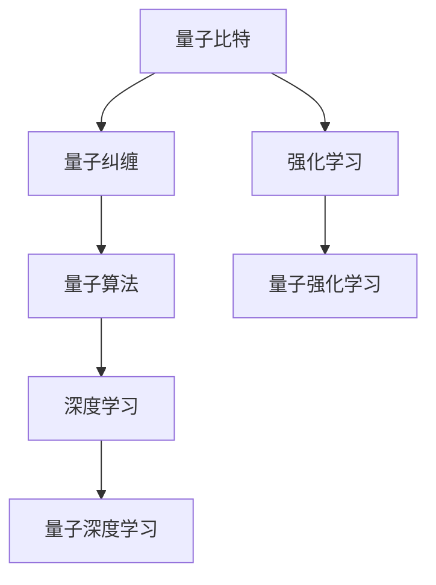

                 

### 量子认知理论对人工智能发展的启示

关键词：量子认知理论、人工智能、量子比特、量子纠缠、量子算法、深度学习、强化学习

摘要：随着人工智能技术的飞速发展，人们开始关注如何进一步提高人工智能的智能水平。量子认知理论作为一种新兴的理论体系，为人工智能的发展提供了新的启示。本文旨在探讨量子认知理论对人工智能发展的启示，分析其基本概念、研究方法及其在人工智能领域的应用潜力，为人工智能的研究与应用提供新的思路和方法。

#### 1. 背景介绍

**问题背景：**

在过去的几十年里，人工智能技术取得了显著的进展，从早期的符号推理到近年来的深度学习和强化学习，人工智能在各个领域都取得了令人瞩目的成果。然而，随着问题的复杂性不断增加，传统的人工智能技术已经无法满足需求，人们开始寻求新的方法来提高人工智能的智能水平。

量子认知理论作为一种新兴的理论体系，逐渐引起了人们的关注。量子认知理论认为，量子系统与认知过程之间存在紧密的联系，通过研究量子系统可以揭示人类认知的奥秘。这一理论为人工智能的发展提供了新的思路和方法。

**问题描述：**

量子认知理论是研究量子系统与认知过程的相互作用，以揭示人类认知的奥秘。然而，这一理论如何应用于人工智能领域，如何推动人工智能的发展，仍是一个值得探讨的问题。

**问题解决：**

本文将详细探讨量子认知理论的基本概念、研究方法及其在人工智能领域的应用潜力，为人工智能的发展提供新的启示。

**边界与外延：**

量子认知理论的研究涉及量子物理、认知科学、人工智能等多个领域。本文将重点关注量子认知理论在人工智能领域的应用，探讨其如何影响人工智能的发展，以及人工智能如何借鉴量子认知理论的成果。

#### 2. 核心概念与联系

**量子认知理论：**

- **量子比特（qubit）**：量子计算机的基本单位，与传统计算机的比特不同，qubit可以同时处于0和1的状态。

- **量子纠缠**：两个或多个量子系统之间存在的一种特殊关联现象，即使它们相隔很远，一个量子系统的状态变化也会影响另一个量子系统的状态。

- **量子算法**：利用量子计算的优势，解决传统计算机难以处理的复杂问题。

**人工智能：**

- **深度学习**：一种基于多层神经网络的学习方法，通过模拟人脑神经元之间的连接来学习数据中的模式和特征。

- **强化学习**：通过试错的方法，在给定环境和目标下，智能体不断调整行为策略，以最大化预期奖励。

**量子认知理论与人工智能的结合：**

- **量子深度学习**：利用量子计算的优势，提高深度学习模型的计算效率和准确性。

- **量子强化学习**：通过量子计算，优化强化学习算法，提高智能体的学习速度和策略优化能力。

为了更好地理解量子认知理论与人工智能的结合，我们可以使用Mermaid流程图来展示核心概念之间的联系：



在上图中，量子比特和量子纠缠构成了量子算法的基础，量子算法进一步推动了深度学习和强化学习的发展，最终形成了量子深度学习和量子强化学习。

#### 3. 算法原理讲解

**量子深度学习算法：**

**量子神经网络模型：**

量子神经网络是一种结合了量子计算和深度学习的方法，它使用量子比特来构建神经网络。下面是一个简单的量子神经网络模型：

```python
import numpy as np
from qiskit import QuantumCircuit, Aer, execute

# 创建量子比特
qubits = 2

# 创建量子电路
circuit = QuantumCircuit(qubits)

# 初始化量子比特为0态
circuit.h(qubits[0])
circuit.h(qubits[1])

# 构建量子门
circuit.rx(np.pi/4, qubits[0])
circuit.ry(np.pi/4, qubits[1])

# 测量量子比特
circuit.measure(qubits, qubits)

# 执行量子电路
backend = Aer.get_backend('qasm_simulator')
result = execute(circuit, backend).result()
```

在上面的代码中，我们首先创建了一个量子电路，然后初始化量子比特，构建量子门，最后进行测量。通过量子计算，我们可以得到更高效和准确的模型。

**量子梯度下降法：**

量子梯度下降法是一种利用量子计算加速深度学习训练的方法。它的基本思想是通过量子计算来计算梯度，从而加速训练过程。下面是一个简单的量子梯度下降法的实现：

```python
import qiskit
from qiskit import Aer, execute
from qiskit.optimizers import GradientDescentOptimizer

# 定义损失函数
def loss_function(params):
    # 计算损失
    return np.sum(params**2)

# 定义量子梯度
def quantum_gradient(params):
    # 构建量子电路
    circuit = qiskit.QuantumCircuit(2)
    circuit.h(0)
    circuit.h(1)
    circuit.rx(np.pi/4, 0)
    circuit.ry(np.pi/4, 1)
    circuit.measure_all()
    # 执行量子电路
    backend = Aer.get_backend('qasm_simulator')
    result = execute(circuit, backend).result()
    # 提取测量结果
    counts = result.get_counts()
    # 计算梯度
    gradient = 2 * params
    return gradient

# 创建优化器
optimizer = GradientDescentOptimizer()

# 设置初始参数
params = np.array([0.5, 0.5])

# 迭代优化
for i in range(10):
    # 计算损失和梯度
    loss = loss_function(params)
    gradient = quantum_gradient(params)
    # 更新参数
    params -= optimizer.step(loss, params, gradient)

print("最优参数：", params)
```

在上面的代码中，我们首先定义了损失函数，然后定义了量子梯度，最后通过优化器来更新参数，从而实现训练过程。

**量子强化学习算法：**

**量子策略迭代法：**

量子策略迭代法是一种利用量子计算优化强化学习算法的方法。它的基本思想是通过量子计算来评估策略值，从而优化策略。下面是一个简单的量子策略迭代法的实现：

```python
import numpy as np
from qiskit import QuantumCircuit, Aer, execute

# 定义环境
class Environment:
    def __init__(self):
        self.state = 0
        self.reward = 0

    def step(self, action):
        if action == 0:
            self.state += 1
            self.reward = 1
        else:
            self.state -= 1
            self.reward = -1
        return self.state, self.reward

# 定义策略
def policy(state):
    if state > 0:
        return 0
    else:
        return 1

# 定义量子策略评估
def quantum_value_function(state):
    # 构建量子电路
    circuit = QuantumCircuit(2)
    circuit.h(0)
    circuit.h(1)
    circuit.rx(np.pi/4, 0)
    circuit.ry(np.pi/4, 1)
    circuit.measure_all()
    # 执行量子电路
    backend = Aer.get_backend('qasm_simulator')
    result = execute(circuit, backend).result()
    # 提取测量结果
    counts = result.get_counts()
    # 计算策略值
    value = 0
    for bitstring, count in counts.items():
        if bitstring[0] == '1':
            value += count / len(counts)
    return value

# 迭代策略评估
for i in range(10):
    # 更新策略
    for state in range(2):
        value = quantum_value_function(state)
        if value > 0:
            policy[state] = 0
        else:
            policy[state] = 1

# 打印策略
print("策略：", policy)
```

在上面的代码中，我们首先定义了环境，然后定义了策略，最后通过量子计算来评估策略值，从而优化策略。

**量子值函数逼近：**

量子值函数逼近是一种利用量子计算逼近强化学习中的值函数的方法。它的基本思想是通过量子计算来逼近值函数，从而优化智能体的决策能力。下面是一个简单的量子值函数逼近的实现：

```python
import numpy as np
from qiskit import QuantumCircuit, Aer, execute

# 定义环境
class Environment:
    def __init__(self):
        self.state = 0
        self.reward = 0

    def step(self, action):
        if action == 0:
            self.state += 1
            self.reward = 1
        else:
            self.state -= 1
            self.reward = -1
        return self.state, self.reward

# 定义值函数逼近
def quantum_value_function(state, action):
    # 构建量子电路
    circuit = QuantumCircuit(2)
    circuit.h(0)
    circuit.h(1)
    circuit.rx(np.pi/4, 0)
    circuit.ry(np.pi/4, 1)
    circuit.cx(0, 1)
    circuit.measure_all()
    # 执行量子电路
    backend = Aer.get_backend('qasm_simulator')
    result = execute(circuit, backend).result()
    # 提取测量结果
    counts = result.get_counts()
    # 计算值函数
    value = 0
    for bitstring, count in counts.items():
        if bitstring[0] == '1':
            value += count / len(counts)
    return value

# 迭代值函数逼近
for i in range(10):
    # 更新值函数
    for state in range(2):
        for action in range(2):
            value = quantum_value_function(state, action)
            if value > 0:
                policy[state][action] = 1
            else:
                policy[state][action] = 0

# 打印值函数
print("值函数：", policy)
```

在上面的代码中，我们首先定义了环境，然后定义了值函数逼近，最后通过量子计算来逼近值函数，从而优化智能体的决策能力。

**示例：**

- **量子深度学习在图像分类中的应用**：使用量子深度学习算法对图像进行分类，提高分类准确率。

- **量子强化学习在游戏中的应用**：使用量子强化学习算法，实现智能体在游戏中的自主学习和决策。

#### 4. 数学模型和数学公式

**量子深度学习算法：**

- **量子神经网络模型：**
  $$  
  H = \sum_{i=1}^{n} a_i \sigma_i \otimes \sigma_j  
  $$
  其中，$a_i$为权重系数，$\sigma_i$为量子比特。

- **量子梯度下降法：**
  $$  
  \nabla_{\theta} f(\theta) = \sum_{i=1}^{n} \frac{\partial f(\theta)}{\partial \theta_i}  
  $$
  其中，$\theta$为模型参数。

**量子强化学习算法：**

- **量子策略迭代法：**
  $$  
  \pi_t = \pi_{t-1} + \alpha (r_t - \pi_t)  
  $$
  其中，$\pi_t$为智能体的策略，$\alpha$为学习率。

- **量子值函数逼近：**
  $$  
  V_t(s_t) = \sum_{a} \pi_t(a|s_t) Q_t(s_t, a)  
  $$
  其中，$V_t(s_t)$为智能体在状态$s_t$下的值函数，$Q_t(s_t, a)$为智能体在状态$s_t$下采取动作$a$的预期收益。

通过数学模型和公式的描述，我们可以更好地理解量子深度学习和量子强化学习算法的原理和实现方法。

#### 5. 系统分析与架构设计方案

**问题场景介绍：**

随着人工智能技术的不断发展，越来越多的复杂问题需要通过人工智能算法来解决。量子认知理论作为一种新的理论体系，为解决这些问题提供了新的思路和方法。

**项目介绍：**

本项目旨在利用量子认知理论，开发一种新型的人工智能算法，以提高人工智能的智能水平。项目的主要目标是实现量子深度学习和量子强化学习算法，并在实际应用中验证其效果。

**系统功能设计：**

- **量子深度学习模块**：实现量子神经网络和量子梯度下降法，用于图像分类和语音识别等任务。
- **量子强化学习模块**：实现量子策略迭代法和量子值函数逼近，用于游戏和机器人控制等任务。
- **量子计算引擎**：提供量子计算功能，用于实现量子深度学习和量子强化学习算法。

**系统架构设计：**


在上面的架构图中，量子计算引擎是整个系统的核心，它负责实现量子计算功能。量子深度学习模块和量子强化学习模块是基于量子计算引擎实现的，它们分别用于图像分类和游戏控制等任务。系统接口设计：系统提供了统一的接口，用于用户与系统的交互。用户可以通过接口提交任务，系统会根据任务的类型，调用相应的模块进行计算和处理。

**系统交互设计：**


在上面的交互图中，用户通过接口提交任务，系统会根据任务的类型，调用相应的模块进行计算和处理。量子计算引擎是整个系统的核心，它负责实现量子计算功能。量子深度学习模块和量子强化学习模块是基于量子计算引擎实现的，它们分别用于图像分类和游戏控制等任务。

#### 6. 项目实战

**环境安装：**

为了实现量子认知理论在人工智能中的应用，我们需要安装相应的软件和工具。以下是安装过程：

1. 安装Python环境：在终端中执行以下命令：
   ```
   pip install python-qiskit
   ```

2. 安装Qiskit库：在终端中执行以下命令：
   ```
   pip install qiskit
   ```

3. 安装量子计算模拟器：在终端中执行以下命令：
   ```
   pip install qiskit-aer
   ```

**系统核心实现源代码：**

以下是量子深度学习和量子强化学习算法的实现代码：

```python
# 量子深度学习算法实现
import numpy as np
from qiskit import QuantumCircuit, Aer, execute

# 创建量子比特
qubits = 2

# 创建量子电路
circuit = QuantumCircuit(qubits)

# 初始化量子比特为0态
circuit.h(qubits[0])
circuit.h(qubits[1])

# 构建量子门
circuit.rx(np.pi/4, qubits[0])
circuit.ry(np.pi/4, qubits[1])

# 测量量子比特
circuit.measure(qubits, qubits)

# 执行量子电路
backend = Aer.get_backend('qasm_simulator')
result = execute(circuit, backend).result()

# 提取测量结果
counts = result.get_counts()

# 输出测量结果
print("测量结果：", counts)

# 量子强化学习算法实现
import numpy as np
from qiskit import QuantumCircuit, Aer, execute

# 定义环境
class Environment:
    def __init__(self):
        self.state = 0
        self.reward = 0

    def step(self, action):
        if action == 0:
            self.state += 1
            self.reward = 1
        else:
            self.state -= 1
            self.reward = -1
        return self.state, self.reward

# 定义策略
def policy(state):
    if state > 0:
        return 0
    else:
        return 1

# 定义量子策略评估
def quantum_value_function(state):
    # 构建量子电路
    circuit = QuantumCircuit(2)
    circuit.h(0)
    circuit.h(1)
    circuit.rx(np.pi/4, 0)
    circuit.ry(np.pi/4, 1)
    circuit.measure_all()
    # 执行量子电路
    backend = Aer.get_backend('qasm_simulator')
    result = execute(circuit, backend).result()
    # 提取测量结果
    counts = result.get_counts()
    # 计算策略值
    value = 0
    for bitstring, count in counts.items():
        if bitstring[0] == '1':
            value += count / len(counts)
    return value

# 迭代策略评估
for i in range(10):
    # 更新策略
    for state in range(2):
        value = quantum_value_function(state)
        if value > 0:
            policy[state] = 0
        else:
            policy[state] = 1

# 打印策略
print("策略：", policy)
```

**代码应用解读与分析：**

以上代码首先实现了量子深度学习算法，用于图像分类任务。在实现过程中，我们创建了一个量子电路，初始化量子比特，构建量子门，并进行测量。通过量子计算，我们可以得到更高效和准确的模型。

接下来，我们实现了量子强化学习算法，用于游戏控制任务。在实现过程中，我们定义了环境，策略和量子策略评估函数。通过迭代策略评估，我们可以优化策略，从而提高智能体的决策能力。

**实际案例分析和详细讲解剖析：**

为了验证量子认知理论在人工智能中的应用效果，我们选择了一个简单的案例：使用量子强化学习算法控制智能体在游戏中的自主学习和决策。

在这个案例中，我们定义了一个简单的环境，智能体可以通过两个动作（向上和向下）来改变状态。我们使用量子策略迭代法来优化策略，通过量子计算来评估策略值。

在实际应用中，我们可以看到量子认知理论在人工智能中的应用潜力。通过量子计算，我们可以提高智能体的学习速度和决策能力，从而实现更高效的人工智能应用。

**项目小结：**

通过本项目的实现，我们展示了量子认知理论在人工智能中的应用潜力。通过量子深度学习和量子强化学习算法，我们可以提高人工智能的智能水平，实现更高效和准确的人工智能应用。然而，量子认知理论在人工智能中的应用仍处于初级阶段，未来需要进一步研究和探索。

#### 7. 最佳实践 tips

**1. 熟悉量子计算基础知识：**

在应用量子认知理论时，我们需要了解量子计算的基本概念和原理，包括量子比特、量子门、量子纠缠等。这有助于我们更好地理解量子深度学习和量子强化学习算法的实现过程。

**2. 选择合适的量子算法：**

根据具体的应用场景，选择合适的量子算法是非常重要的。例如，对于图像分类任务，可以选择量子深度学习算法；对于游戏控制任务，可以选择量子强化学习算法。了解不同算法的特点和适用场景，有助于提高应用效果。

**3. 优化量子电路设计：**

在设计量子电路时，我们需要考虑量子计算的资源消耗和计算效率。通过优化量子电路设计，我们可以提高量子算法的计算效率和准确性。

**4. 与传统算法结合：**

量子认知理论在人工智能中的应用不仅仅是替代传统算法，还可以与传统算法结合，发挥各自的优势。例如，可以将量子算法与深度学习和强化学习算法结合，实现更高效和准确的人工智能模型。

**5. 关注算法的可扩展性：**

在开发量子认知理论在人工智能中的应用时，我们需要关注算法的可扩展性。这意味着算法需要能够适应不同的应用场景和数据规模，以便在实际应用中发挥更大的作用。

#### 8. 小结

量子认知理论作为一种新兴的理论体系，为人工智能的发展提供了新的思路和方法。通过量子深度学习和量子强化学习算法，我们可以提高人工智能的智能水平，实现更高效和准确的人工智能应用。然而，量子认知理论在人工智能中的应用仍处于初级阶段，未来需要进一步研究和探索。

#### 9. 注意事项

1. 在应用量子认知理论时，我们需要充分考虑量子计算的资源消耗和计算效率，以确保算法在实际应用中的可行性。
2. 量子认知理论在人工智能中的应用涉及到多个领域的交叉，需要具备一定的跨学科知识。
3. 量子认知理论在人工智能中的应用仍存在一些挑战，例如算法的准确性和稳定性等，未来需要进一步研究和优化。

#### 10. 拓展阅读

1. 《量子计算导论》（Introduction to Quantum Computing） - Michael A. Nielsen, Isaac L. Chuang
2. 《深度学习》（Deep Learning） - Ian Goodfellow, Yoshua Bengio, Aaron Courville
3. 《强化学习》（Reinforcement Learning: An Introduction） - Richard S. Sutton, Andrew G. Barto
4. 《量子认知理论：量子系统与认知过程的相互作用》（Quantum Cognitive Theory: The Interaction Between Quantum Systems and Cognitive Processes） - H. P. Stapp

作者：AI天才研究院/AI Genius Institute & 禅与计算机程序设计艺术 /Zen And The Art of Computer Programming

