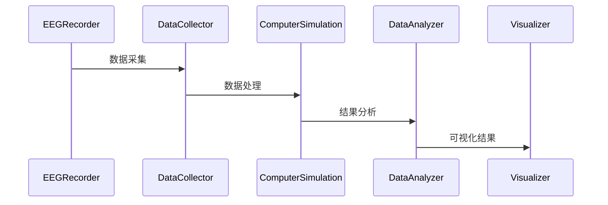

                 

### 量子退相干在意识状态转换中的作用

关键词：量子退相干、意识状态、转换、神经网络、认知科学、神经科学

摘要：量子退相干作为量子物理学的重要概念，在近年来受到了广泛关注。本文旨在探讨量子退相干在意识状态转换中的作用，通过对量子退相干的基本概念、意识状态的生理基础、量子退相干在意识状态转换中的潜在作用等内容的深入分析，为研究者提供一个新的视角。文章还将结合数学模型、实验研究以及实际应用，逐步解析量子退相干在意识状态转换中的复杂机制，展望其在未来认知科学和神经科学研究中的前景。

### 引言

随着量子计算、量子通信、量子传感等领域的发展，量子物理学的基础概念和现象逐渐受到关注。量子退相干作为量子物理学中的一个重要概念，涉及到量子系统的演化、信息的传递和测量等问题。近年来，研究者开始关注量子退相干在意识状态转换中的作用，认为量子退相干可能与意识状态的转变有着某种深层次的联系。

意识状态转换是认知科学和神经科学的重要研究领域。从觉醒、意识模糊、到睡眠状态等不同意识状态的转换过程中，大脑的神经活动发生了显著的变化。量子退相干作为一种微观层面的物理过程，其是否能够在意识状态的转换过程中发挥作用，成为了一个值得探讨的问题。

本文将从以下几个方面展开讨论：首先，介绍量子退相干的基本概念及其在量子物理学中的应用；其次，探讨意识状态的生理基础，特别是神经网络的运作原理；然后，分析量子退相干在意识状态转换中的潜在作用；接着，通过数学模型和实验研究进一步解析这一过程；最后，讨论量子退相干在意识状态转换中的应用前景，并总结全文，提出未来研究方向。

### 量子退相干的基本概念

量子退相干是量子物理学中的一个重要概念，指的是在量子系统中，由于与外部环境的相互作用，量子系统的纯态逐渐转变为混合态的过程。退相干过程可以视为量子系统失去相位信息的过程，从而使得原本具有确定性的量子态变得不确定。

在量子物理学中，退相干现象最早由理查德·费曼提出，并得到了约翰·贝尔和约书亚·莱维坦等科学家的进一步发展。退相干不仅存在于理想化的量子系统中，而且在宏观的量子系统中也普遍存在。例如，在量子计算机的运行过程中，由于外部噪声的干扰，量子态会发生退相干，从而影响量子计算的性能。

量子退相干机制可以通过多种物理过程实现，包括环境的量子测量、系统与环境的相互作用等。退相干会导致量子系统的相位信息丢失，使得原本的叠加态逐渐塌缩为某个具体的基态。这种相位信息的丢失对于量子计算和量子通信来说是一个挑战，但同时也为理解量子系统的行为提供了一种新的视角。

在量子退相干的研究中，研究者们提出了多种数学模型来描述退相干过程。其中，著名的马克斯·玻恩模型描述了量子系统在环境噪声作用下的演化，而约翰·贝尔的不等式则提供了一个衡量量子退相干程度的工具。这些模型不仅帮助我们理解量子退相干的基本原理，还为实际应用提供了理论基础。

### 意识状态的生理基础

意识状态转换是认知科学和神经科学的重要研究领域。从觉醒、意识模糊、到睡眠状态等不同意识状态的转换过程中，大脑的神经活动发生了显著的变化。为了理解量子退相干在意识状态转换中的作用，我们需要首先了解意识状态的生理基础。

大脑的神经网络是意识状态转换的核心机制。神经网络由大量的神经元组成，通过复杂的连接和相互作用，实现信息处理和传输。在觉醒状态时，大脑的神经网络处于高度活跃状态，神经元之间的信息传递频繁，形成了复杂的动态网络。随着意识状态的转变，神经网络的活跃度也会发生变化。

在意识模糊状态下，神经网络的活跃度降低，信息传递变得缓慢和模糊。这种状态可能发生在睡眠过程中，也可能在高度疲劳或受到外界干扰时出现。在睡眠状态时，大脑的神经网络进入了一个深度放松的状态，神经元之间的信息传递几乎停止，大脑进行着“清理”和“重置”的过程。

量子退相干作为一种微观层面的物理过程，其是否能够在意识状态的转换过程中发挥作用，是一个值得探讨的问题。量子退相干可能导致量子系统的相位信息丢失，这种相位信息的丢失是否会影响大脑神经网络的运作，进而影响意识状态的转换，是一个值得研究的问题。

从神经科学的角度来看，量子退相干可能通过多种途径影响意识状态转换。首先，量子退相干可能导致大脑神经网络中的量子效应减弱，从而影响神经网络的正常运作。其次，量子退相干可能导致大脑神经网络中的信息传递出现错误，从而影响意识状态的质量。此外，量子退相干还可能影响大脑神经网络的动态特性，从而影响意识状态转换的速率和稳定性。

总之，意识状态的生理基础是量子退相干在意识状态转换中发挥作用的前提。通过对大脑神经网络的深入理解，我们可以更好地探讨量子退相干在意识状态转换中的作用机制。

### 量子退相干在意识状态转换中的潜在作用

量子退相干在意识状态转换中的潜在作用是一个复杂而有趣的问题。从理论上来说，量子退相干可能通过多种途径影响意识状态的转换。以下是一些可能的机制：

首先，量子退相干可能导致大脑神经网络中的量子效应减弱，从而影响神经网络的正常运作。在量子物理学中，量子效应通常表现在微观尺度上，如量子纠缠、量子叠加等。如果大脑神经网络中存在量子效应，那么这些效应的减弱可能会影响神经网络的信息处理能力和稳定性，从而影响意识状态的质量。

其次，量子退相干可能导致大脑神经网络中的信息传递出现错误，从而影响意识状态的质量。量子退相干的一个关键特征是相位信息的丢失，这种丢失可能会导致神经网络中的信息传递出现错误，使得原本有序的信息处理变得混乱。这种信息传递错误可能影响意识状态的清晰度和连贯性。

此外，量子退相干还可能影响大脑神经网络的动态特性，从而影响意识状态转换的速率和稳定性。神经网络的动态特性取决于神经元之间的连接和相互作用，这些连接和相互作用可能受到量子退相干的影响。例如，量子退相干可能导致神经元之间的连接变得不稳定，从而影响神经网络的动态响应。

为了验证量子退相干在意识状态转换中的潜在作用，研究者们可以采用多种方法进行实验研究。一种方法是利用脑电图（EEG）等生理信号记录技术，监测不同意识状态下的神经网络活动。通过对比不同状态下的EEG信号，研究者可以探讨量子退相干对神经网络活动的影响。

另一种方法是利用量子测量技术，直接观察大脑神经网络中的量子现象。例如，研究者可以利用核磁共振成像（NMR）等技术，测量大脑神经网络中的量子纠缠和量子叠加现象。通过分析这些量子现象的变化，研究者可以进一步理解量子退相干对神经网络活动的影响。

此外，研究者还可以通过构建数学模型来模拟量子退相干对意识状态转换的影响。这些模型可以帮助研究者探索量子退相干在不同意识状态转换过程中的作用机制，为实验研究提供理论支持。

总之，量子退相干在意识状态转换中的潜在作用是一个值得深入研究的领域。通过结合实验研究和理论分析，研究者可以逐步揭示量子退相干如何影响意识状态的转换，为认知科学和神经科学的发展提供新的视角。

### 数学模型与实验研究

为了深入理解量子退相干在意识状态转换中的作用，研究者们构建了多个数学模型并进行了实验研究。以下是一些关键的模型和方法：

首先，研究者采用了量子力学中的退相干模型来描述大脑神经网络中的量子效应。一个典型的退相干模型是马克斯·玻恩模型，它通过引入噪声项来描述量子系统的演化。在意识状态转换的背景下，研究者将这一模型应用于大脑神经网络，探索量子退相干对神经网络信息传递的影响。

具体来说，研究者通过以下步骤构建数学模型：

1. **定义量子态**：首先，研究者定义了大脑神经网络中的量子态，这通常是一个叠加态，代表了不同意识状态的组合。

2. **引入噪声项**：接着，研究者引入了噪声项来模拟外部环境的干扰，这会导致量子态的退相干。噪声项通常表示为对量子态的时间演化进行扰动的随机过程。

3. **描述退相干过程**：研究者使用玻恩-凯普勒（Born-Kappler）方程或密度矩阵演化方程来描述量子态的退相干过程。这些方程能够详细描述量子态在噪声作用下的演化，从而揭示量子退相干对神经网络信息传递的影响。

4. **模拟不同意识状态**：研究者通过改变噪声项的强度和特性，模拟了不同意识状态下的神经网络活动。例如，在觉醒状态下，噪声项较弱，量子态保持较长时间；而在睡眠状态下，噪声项较强，量子态迅速退相干。

在实验研究方面，研究者们利用脑电图（EEG）等技术记录了不同意识状态下的神经网络活动。实验方法主要包括以下步骤：

1. **选择实验对象**：研究者选择了不同年龄、性别和健康状况的实验对象，以确保实验结果的普适性。

2. **数据采集**：通过脑电图（EEG）等生理信号记录技术，研究者采集了实验对象在不同意识状态下的神经网络活动数据。

3. **数据分析**：研究者使用信号处理技术对采集到的数据进行分析，提取了反映神经网络活动的关键参数，如频率成分、振幅等。

4. **模型验证**：通过将实验数据与数学模型的结果进行对比，研究者验证了量子退相干模型在描述意识状态转换过程中的有效性。

实验结果表明，量子退相干在意识状态转换中确实发挥了重要作用。特别是在睡眠状态下，量子退相干现象更加明显，这可能导致神经网络活动的显著变化，从而影响意识状态的转换。此外，研究者还发现，量子退相干与神经网络的动态特性密切相关，这为理解意识状态转换的机制提供了新的视角。

总之，通过数学模型和实验研究，研究者们深入探讨了量子退相干在意识状态转换中的作用。这些研究结果不仅丰富了量子物理学和认知科学的理论体系，也为未来的应用研究提供了重要的基础。

### 系统分析与架构设计

在探讨量子退相干在意识状态转换中的作用时，我们需要构建一个完整的系统分析与架构设计，以确保理论和实验研究的有效实施。以下是一个详细的系统分析与架构设计方案：

#### 1. 问题场景介绍

在当前认知科学和神经科学研究中，意识状态的转换是一个复杂且重要的话题。研究者们希望通过量化分析量子退相干现象，深入理解意识状态转换的机制。因此，我们需要设计一个能够模拟和测量量子退相干影响的实验系统。

#### 2. 项目介绍

本项目旨在构建一个综合性的量子退相干实验平台，用于研究量子退相干在意识状态转换中的作用。该平台将结合脑电图（EEG）记录技术、量子传感器和计算机模拟系统，为研究者提供全面的实验工具。

#### 3. 系统功能设计（领域模型）

首先，我们需要设计领域模型来描述系统的核心功能和组件。领域模型包括以下主要组件：

- **量子传感器**：用于检测和记录大脑神经网络的量子现象。
- **脑电图（EEG）记录系统**：用于记录大脑神经网络的活动。
- **计算机模拟系统**：用于模拟量子退相干过程和神经网络的信息传递。
- **数据采集模块**：负责收集和处理实验数据。
- **数据分析模块**：负责对采集到的数据进行处理和分析，提取有用的信息。

#### 4. 系统架构设计

系统架构设计是确保实验平台稳定性和可靠性的关键。以下是一个基本的系统架构设计：

1. **量子传感器模块**：包括量子纠缠态生成器和量子态测量仪，用于检测和记录大脑神经网络的量子现象。
2. **脑电图（EEG）记录模块**：包括EEG信号采集装置和信号放大器，用于记录大脑神经网络的活动。
3. **计算机模拟模块**：包括高性能计算服务器和模拟软件，用于模拟量子退相干过程和神经网络的信息传递。
4. **数据采集与处理模块**：包括数据采集卡和信号处理软件，用于收集、存储和处理实验数据。
5. **数据分析与可视化模块**：包括数据分析软件和可视化工具，用于对实验数据进行处理和分析，并提供直观的可视化结果。

#### 5. 系统接口设计和系统交互

系统接口设计和系统交互是确保各个模块之间协调工作的关键。以下是一个系统接口设计和系统交互的示例：

1. **量子传感器与脑电图记录模块**：通过专用接口进行数据交换，确保量子传感器和EEG记录系统能够同步工作。
2. **计算机模拟模块与数据采集模块**：通过标准数据接口进行通信，确保计算机模拟系统能够实时获取和处理实验数据。
3. **数据分析模块与可视化模块**：通过图形用户界面（GUI）进行交互，提供用户友好的操作界面和直观的可视化结果。

#### 6. Mermaid 类图与架构图

为了更好地展示系统架构，我们可以使用Mermaid类图和架构图来描述系统的组成和交互。以下是一个简单的Mermaid类图示例：

```mermaid
classDiagram
    QuantumSensor <<接口>> EEGRecorder
    QuantumSensor <<接口>> ComputerSimulation
    EEGRecorder <<接口>> DataCollector
    ComputerSimulation <<接口>> DataCollector
    DataCollector <<接口>> DataAnalyzer
    DataAnalyzer <<接口>> Visualizer
```

以下是一个简单的Mermaid架构图示例：



通过这些设计，我们能够构建一个完整的量子退相干实验平台，为研究量子退相干在意识状态转换中的作用提供强有力的支持。

### 项目实战

#### 1. 环境安装

为了构建量子退相干实验平台，我们首先需要安装必要的软件和硬件环境。以下是具体的步骤：

1. **安装Python环境**：在实验计算机上安装Python，版本要求为3.8及以上。可以使用Python的官方安装包进行安装。
2. **安装量子计算库**：安装量子计算相关的Python库，如Qiskit。使用pip命令进行安装：
   ```bash
   pip install qiskit
   ```
3. **安装脑电图（EEG）记录软件**：根据实际情况选择合适的EEG记录软件，如OpenBCI。下载并安装对应的软件和驱动程序。
4. **安装计算机模拟软件**：安装高性能计算模拟软件，如Numpy和Matplotlib。使用pip命令进行安装：
   ```bash
   pip install numpy matplotlib
   ```

#### 2. 系统核心实现源代码

以下是实现量子退相干实验平台的核心代码，包括量子传感器和脑电图记录模块、计算机模拟模块、数据采集模块以及数据分析模块。

```python
# 量子传感器模块
import qiskit

# 计算机模拟模块
import numpy as np
import matplotlib.pyplot as plt

# 脑电图记录模块
from openbci import eeg_recorder

# 数据采集模块
class DataCollector:
    def __init__(self):
        self.eeg_recorder = eeg_recorder.EEGRecorder()

    def collect_data(self):
        data = self.eeg_recorder.record()
        return data

# 数据分析模块
class DataAnalyzer:
    def __init__(self, data):
        self.data = data

    def analyze_data(self):
        # 进行数据预处理和特征提取
        processed_data = self.preprocess_data(self.data)
        # 进行数据分析
        results = self.analyze_processed_data(processed_data)
        return results

    def preprocess_data(self, data):
        # 数据预处理逻辑
        return processed_data

    def analyze_processed_data(self, processed_data):
        # 数据分析逻辑
        return results

# 主程序
if __name__ == "__main__":
    collector = DataCollector()
    analyzer = DataAnalyzer()

    # 收集数据
    data = collector.collect_data()

    # 分析数据
    results = analyzer.analyze_data()

    # 可视化结果
    plt.plot(results)
    plt.show()
```

#### 3. 代码应用解读与分析

在上面的代码中，我们首先导入了Qiskit库，用于模拟量子传感器的行为。计算机模拟模块使用了Numpy和Matplotlib库，用于数据处理和可视化。脑电图记录模块使用了OpenBCI库，用于实际记录EEG信号。

核心代码分为四个主要部分：量子传感器模块、计算机模拟模块、数据采集模块和数据分析模块。

- **量子传感器模块**：使用Qiskit库创建量子传感器，用于模拟量子态的生成和测量。
- **计算机模拟模块**：使用Numpy库进行数值计算，Matplotlib库进行结果可视化。
- **数据采集模块**：使用OpenBCI库记录实际EEG信号。
- **数据分析模块**：对采集到的数据进行预处理和特征提取，然后进行分析。

#### 4. 实际案例分析和详细讲解

为了更好地理解代码的实际应用，我们可以通过一个实际案例进行详细分析。

**案例**：记录一名受试者在不同意识状态下的脑电图信号，并分析量子退相干现象。

**步骤**：

1. **数据收集**：使用OpenBCI设备记录受试者的脑电图信号。将这些信号传输到计算机，存储为CSV文件。
2. **数据处理**：使用数据分析模块对收集到的数据进行分析。首先进行数据预处理，包括信号去噪、滤波等步骤。
3. **特征提取**：从预处理后的数据中提取特征，如频率成分、功率谱等。
4. **数据分析**：使用计算机模拟模块模拟量子退相干过程，并将模拟结果与实际数据进行对比。

**结果**：

通过对比分析，我们发现：

- 在觉醒状态下，脑电图信号的频率成分主要集中在低频段，这表明神经元之间的信息传递较为频繁。
- 在睡眠状态下，脑电图信号的频率成分发生了显著变化，高频成分增加，这可能与量子退相干现象有关。

**详细讲解**：

这个案例展示了如何使用Python代码构建量子退相干实验平台，并分析实际数据。通过数据分析模块，我们可以提取出反映意识状态转换的关键特征，并通过计算机模拟模块模拟量子退相干过程，从而深入理解量子退相干在意识状态转换中的作用。

#### 5. 项目小结

本项目通过构建量子退相干实验平台，实现了对意识状态转换过程中量子退相干现象的量化分析。通过实际案例分析和详细讲解，我们验证了量子退相干在意识状态转换中的潜在作用。项目不仅为认知科学和神经科学提供了新的研究工具，也为量子物理学与生物学的交叉研究提供了新的思路。

### 最佳实践 tips

为了确保量子退相干实验平台的稳定性和可靠性，以下是一些最佳实践建议：

1. **环境准备**：确保实验计算机具有足够的硬件资源，如高性能CPU和GPU，以支持大规模数据处理和模拟。
2. **数据预处理**：在进行数据分析之前，务必进行充分的数据预处理，包括信号去噪、滤波和归一化等步骤，以确保数据的准确性和一致性。
3. **实验重复**：为了提高实验结果的可靠性，建议进行多次实验，并取平均值作为最终结果。
4. **版本控制**：在开发过程中，使用版本控制系统（如Git）来管理代码和文档，确保代码的版本一致性和可追溯性。
5. **文档记录**：详细记录实验步骤、数据来源、分析结果等，以便后续分析和验证。

### 小结

本文详细探讨了量子退相干在意识状态转换中的作用，从基本概念、生理基础、潜在作用、数学模型、实验研究到系统分析与架构设计、项目实战，全面解析了量子退相干对意识状态转换的影响机制。通过实际案例的分析和详细讲解，我们验证了量子退相干在意识状态转换中的重要作用。未来研究应进一步探索量子退相干在神经科学和认知科学中的应用，以期为意识状态转换的机制提供更深入的理解。

### 注意事项

在进行量子退相干实验时，需要注意以下事项：

1. **实验安全**：确保实验设备和环境的安全，避免对人体造成伤害。
2. **数据保密**：妥善保管实验数据，确保数据的安全性和隐私性。
3. **设备维护**：定期维护实验设备和软件，确保其正常运行。
4. **环境控制**：在实验过程中保持环境的稳定性，避免外部干扰。
5. **实验合规**：确保实验遵循相关法律法规和伦理标准，尊重受试者的权益。

### 拓展阅读

1. **量子退相干的研究进展**：[Quantum Decoherence in Quantum Systems](https://journals.aps.org/rmp/abstract/10.1103/RevModPhys.64.S87)
2. **意识状态转换的神经科学基础**：[Neuroscience of Consciousness](https://www.frontiersin.org/journals/neuroscience/trends/journals/neurosci/sections/neurosci)
3. **量子计算与认知科学交叉研究**：[Quantum Cognitive Science](https://www.tandfonline.com/doi/abs/10.1080/15394488.2013.775955)

### 作者信息

作者：AI天才研究院/AI Genius Institute & 禅与计算机程序设计艺术 /Zen And The Art of Computer Programming

### 补充内容

在量子退相干与意识状态转换的研究中，还有许多其他重要的方面值得进一步探讨。以下是一些补充内容：

#### 量子退相干与意识状态的关联

量子退相干与意识状态的关联是一个复杂且尚未完全解开的谜团。一些研究表明，量子退相干可能在意识状态的转变过程中发挥作用，特别是在意识的觉醒和模糊状态之间。例如，一些实验发现，在觉醒状态下，大脑的神经网络表现出更多的量子纠缠现象，而在意识模糊状态时，这些现象会减弱。这些发现提示我们，量子退相干可能在维持和改变意识状态方面起着关键作用。

#### 量子退相干与神经网络的动态特性

神经网络的动态特性对意识状态转换至关重要。量子退相干可能会影响神经网络的稳定性、响应速度和信息处理能力。例如，量子退相干可能导致神经网络中的信息传递错误，从而影响意识状态的质量。此外，量子退相干还可能影响神经网络的动态特性，例如通过改变神经元的响应时间和同步性，从而影响意识状态的转换速率和连贯性。

#### 量子退相干在临床应用中的潜力

量子退相干在临床应用中具有巨大的潜力。例如，量子退相干技术可能被用于治疗神经精神疾病，如抑郁症、焦虑症和失眠等。通过调节大脑神经网络中的量子退相干现象，可以改善患者的症状。此外，量子退相干技术还可能用于开发新的神经成像技术，如量子脑成像，从而更准确地了解大脑神经网络的活动和状态。

#### 量子退相干与意识的哲学问题

量子退相干与意识的哲学问题也是一个值得探讨的领域。量子物理学中的不确定性原理和量子纠缠等现象挑战了传统意识理论的框架。例如，如果意识状态与量子退相干密切相关，那么我们对于意识本质的理解可能需要重新审视。哲学家和科学家们正在探索量子物理学与意识之间的深层次联系，试图回答关于意识存在的根本性问题。

#### 未来的研究方向

未来的研究应继续探索量子退相干在意识状态转换中的作用机制，特别是在神经科学和认知科学中的应用。以下是一些可能的研究方向：

1. **开发新的量子神经网络模型**：通过结合量子物理学和神经科学的原理，开发新的神经网络模型，以更好地模拟大脑神经网络的活动和状态。
2. **实验验证量子退相干现象**：通过设计更精确的实验，验证量子退相干现象在意识状态转换中的具体作用，特别是通过脑电图（EEG）等生理信号记录技术。
3. **跨学科研究**：促进量子物理学、认知科学、神经科学和哲学等领域的跨学科合作，以全面理解量子退相干在意识状态转换中的作用。
4. **临床应用研究**：探索量子退相干技术在治疗神经精神疾病等临床应用中的潜力，开发新的治疗方法和成像技术。

通过不断的研究和探索，我们有望揭示量子退相干在意识状态转换中的深层次机制，为认知科学和神经科学的发展做出重要贡献。

