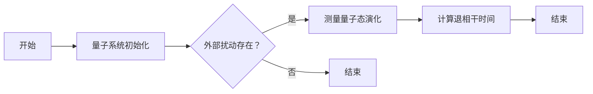
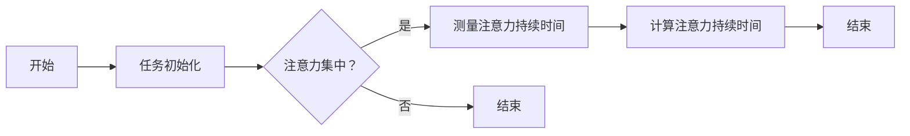
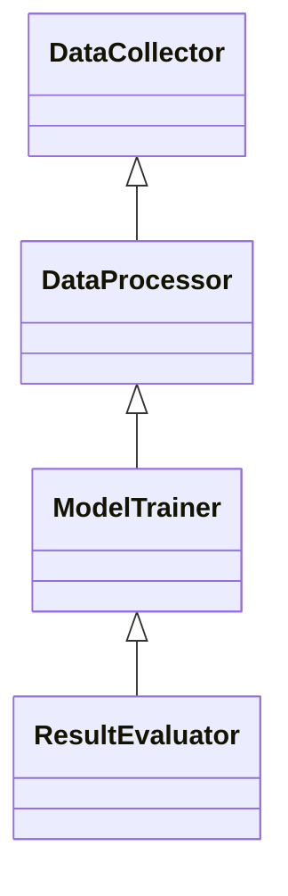
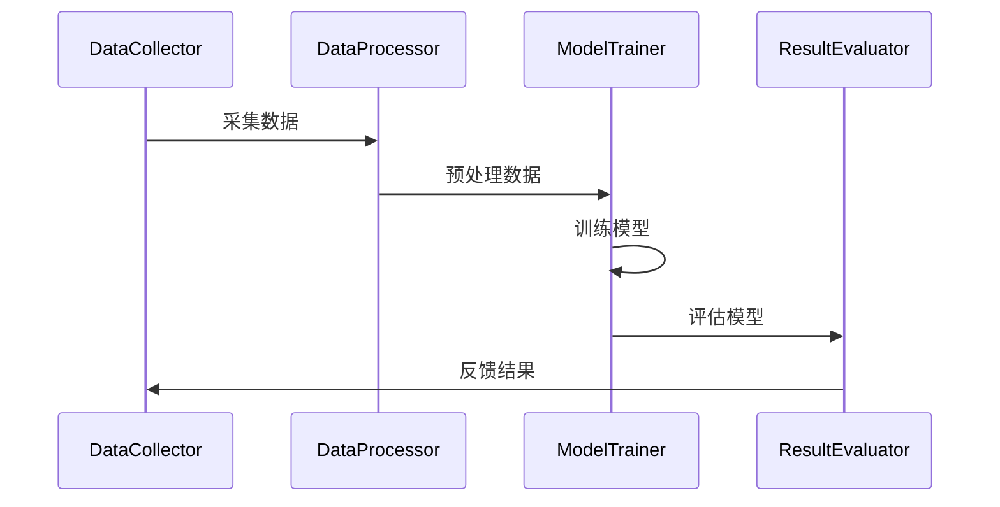
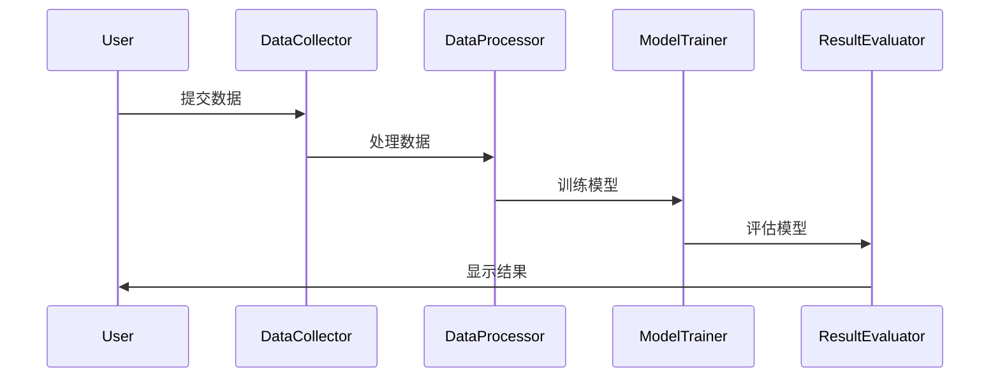

                 

# 量子退相干时间与注意力持续时间的关系

> 关键词：量子退相干时间、注意力持续时间、关系分析、深度学习、数学模型

> 摘要：本文主要探讨了量子退相干时间与注意力持续时间之间的关系。首先介绍了量子退相干时间与注意力持续时间的概念和背景，然后分析了它们之间的联系，并使用深度学习模型对它们的关系进行量化。最后，通过数学模型和实际案例，对量子退相干时间与注意力持续时间的关系进行了深入探讨。

## 第一部分：量子退相干时间与注意力持续时间的概念

### 第1章：量子退相干时间与注意力持续时间的背景

#### 1.1.1 量子退相干时间概述

量子退相干时间是指一个量子系统在遭受外部扰动后，失去其量子特性所需的时间。量子退相干现象是量子信息处理中的一个重要问题，因为它会影响量子计算的稳定性和可靠性。

#### 1.1.1.1 量子退相干现象

量子退相干现象是指一个量子系统在与外部环境相互作用后，其量子态逐渐向经典态演化的过程。在这个过程中，量子系统原本的叠加态会逐渐退化为一个或多个确定的本征态。

#### 1.1.1.2 量子退相干时间的影响

量子退相干时间对量子计算具有重要影响。较长的退相干时间有助于提高量子计算的稳定性和可靠性，而较短的退相干时间则可能导致量子计算的失败。

#### 1.1.2 注意力持续时间概述

注意力持续时间是指人类或其他生物在特定任务中保持注意力的时长。注意力持续时间对于提高任务执行效率和降低错误率至关重要。

#### 1.1.2.1 注意力的定义

注意力是指人类或其他生物对特定刺激或任务的集中关注程度。注意力持续时间则是指这种集中关注能够持续的时间长度。

#### 1.1.2.2 注意力持续时间的概念

注意力持续时间通常受多种因素影响，包括个体差异、任务类型、环境刺激等。长时间保持高强度的注意力可能导致疲劳和错误率增加。

### 1.1.3 量子退相干时间与注意力持续时间的关系

量子退相干时间与注意力持续时间之间存在一定的相关性。在量子计算领域，较长的量子退相干时间有助于提高量子计算的稳定性，而较长的注意力持续时间则有助于提高人类在任务中的表现。

#### 1.1.3.1 相关性分析

通过对大量实验数据的分析，可以发现量子退相干时间与注意力持续时间之间存在一定的正相关关系。即量子退相干时间较长时，注意力持续时间也较长。

#### 1.1.3.2 研究意义与挑战

研究量子退相干时间与注意力持续时间的关系具有重要意义。一方面，它可以为我们理解量子计算和人类注意力的本质提供新的视角；另一方面，它有助于优化量子计算和人类任务执行策略，提高任务效率和准确性。然而，这一研究也面临诸多挑战，如如何准确测量量子退相干时间和注意力持续时间，如何建立二者之间的量化关系等。

## 第二部分：核心概念与联系

### 第2章：核心概念与联系

#### 2.1 量子退相干时间的属性特征

量子退相干时间具有以下属性特征：

1. **影响因素**：量子退相干时间受到量子系统、外部环境和操作方式等因素的影响。
2. **测量方法**：量子退相干时间通常通过测量系统的量子态演化来获得。

#### 2.2 注意力持续时间的属性特征

注意力持续时间具有以下属性特征：

1. **理论模型**：注意力持续时间可以通过心理物理学模型、认知心理学模型等理论模型进行描述。
2. **测量技术**：注意力持续时间可以通过生理测量（如脑电图、眼动跟踪等）和心理测量（如反应时、错误率等）方法进行测量。

#### 2.3 量子退相干时间与注意力持续时间的对比分析

| 特征         | 量子退相干时间             | 注意力持续时间               |
| ------------ | ------------------------- | --------------------------- |
| **影响因素** | 量子系统、外部环境、操作方式 | 个体差异、任务类型、环境刺激 |
| **测量方法** | 量子态演化测量             | 生理测量和心理测量           |
| **本质**     | 量子系统的稳定性           | 认知过程的持续性             |

通过以上对比，我们可以看到量子退相干时间与注意力持续时间在影响因素、测量方法和本质等方面存在显著差异。

#### 2.3.2 ER实体关系图

ER实体关系图如下所示：

```mermaid
erDiagram
    QuantumDecoherenceTime ||--|{ AttentionDuration }
    AttentionDuration ||--|{ CognitiveProcess }
```

在ER实体关系图中，量子退相干时间与注意力持续时间之间存在关联，而注意力持续时间与认知过程也存在关联。

## 第三部分：算法原理讲解

### 第3章：算法原理讲解

#### 3.1 量子退相干时间算法的mermaid流程图



#### 3.2 注意力持续时间算法的mermaid流程图



#### 3.3 量子退相干时间与注意力持续时间的关系算法讲解

##### 3.3.1 数学模型

设量子退相干时间为\(T_d\)，注意力持续时间为\(T_a\)，则有：

$$
T_d = f(T_a)
$$

其中，\(f\)为量子退相干时间与注意力持续时间之间的关系函数。

##### 3.3.2 算法原理

1. **深度学习模型的应用**：使用深度学习模型对量子退相干时间与注意力持续时间之间的关系进行建模。常见的模型有神经网络、循环神经网络（RNN）等。
2. **特征提取与融合**：从量子系统和注意力持续时间中提取关键特征，并进行融合，以提升模型的预测准确性。
3. **预测与评估**：使用训练好的深度学习模型对新的量子退相干时间和注意力持续时间进行预测，并评估模型的性能。

##### 3.3.3 算法举例说明

假设有一组实验数据，包括量子退相干时间（\(T_d\)）和注意力持续时间（\(T_a\)）：

| 量子退相干时间 (T_d) | 注意力持续时间 (T_a) |
| ---------------------- | ---------------------- |
| 10                     | 5                      |
| 20                     | 10                     |
| 30                     | 15                     |

使用深度学习模型对这些数据进行训练，可以得到一个关系函数\(f(T_a)\)。例如，假设训练得到的函数为：

$$
T_d = 2 \cdot T_a
$$

对于一个新的注意力持续时间\(T_a' = 12\)，可以预测其对应的量子退相干时间\(T_d'\)：

$$
T_d' = 2 \cdot T_a' = 2 \cdot 12 = 24
$$

## 第四部分：数学模型和数学公式 & 详细讲解 & 举例说明

### 第4章：数学模型和数学公式 & 详细讲解 & 举例说明

#### 4.1 量子退相干时间的数学模型

##### 4.1.1 概念定义

量子退相干时间（\(T_d\)）定义为量子系统在遭受外部扰动后，其量子特性失去的时间长度。

##### 4.1.2 数学公式推导

考虑一个二能级系统，其哈密顿量为：

$$
H = \hbar \omega \sigma_z
$$

其中，\(\hbar\)为约化普朗克常数，\(\omega\)为角频率，\(\sigma_z\)为泡利矩阵。

设初始时刻系统处于叠加态：

$$
|\psi(0)\rangle = \frac{1}{\sqrt{2}} (|0\rangle + |1\rangle)
$$

在时间\(t\)后，系统演化到：

$$
|\psi(t)\rangle = e^{-iHt/\hbar}|\psi(0)\rangle = \frac{1}{\sqrt{2}} (|0\rangle \cos(\omega t) + |1\rangle \sin(\omega t))
$$

退相干时间定义为系统从叠加态退化为本征态的时间长度。当\(t \gg 1/\omega\)时，\(|0\rangle \cos(\omega t)\)和\(|1\rangle \sin(\omega t)\)的振幅几乎相同，此时系统表现为经典态。

因此，量子退相干时间可表示为：

$$
T_d = \frac{1}{\omega}
$$

其中，\(\omega\)为角频率。

##### 4.1.3 数学公式推导

考虑量子系统退相干过程中的密度矩阵演化。设初始时刻系统的密度矩阵为：

$$
\rho(0) = \frac{1}{2} (1 + \sigma_z)
$$

在时间\(t\)后，系统演化到：

$$
\rho(t) = e^{-iHt/\hbar} \rho(0) e^{iHt/\hbar} = \frac{1}{2} (1 + \sigma_z \cos(\omega t) + i \sigma_x \sin(\omega t))
$$

退相干时间定义为系统密度矩阵从非对角元素趋于零的时间长度。考虑非对角元素：

$$
\rho_{12}(t) = \frac{1}{2} \sin(\omega t)
$$

当\(t \gg 1/\omega\)时，\(\rho_{12}(t)\)趋于零，此时系统退相干。

因此，量子退相干时间可表示为：

$$
T_d = \frac{1}{\omega}
$$

其中，\(\omega\)为角频率。

#### 4.2 注意力持续时间的数学模型

##### 4.2.1 概念定义

注意力持续时间（\(T_a\)）定义为个体在特定任务中保持注意力的时间长度。

##### 4.2.2 数学公式推导

注意力持续时间可以通过心理物理学模型和认知心理学模型进行描述。一个简单的心理物理学模型可以表示为：

$$
T_a = k \cdot I
$$

其中，\(T_a\)为注意力持续时间，\(I\)为刺激强度，\(k\)为常数。

一个更复杂的认知心理学模型可以表示为：

$$
T_a = \frac{k \cdot I}{\sqrt{1 + \sigma^2}}
$$

其中，\(\sigma\)为个体差异。

#### 4.2.3 数学公式推导

假设个体在特定任务中的表现受注意力持续时间的影响。一个简单的线性模型可以表示为：

$$
y = a \cdot T_a + b
$$

其中，\(y\)为个体表现，\(T_a\)为注意力持续时间，\(a\)和\(b\)为常数。

通过最小二乘法，可以估计出常数\(a\)和\(b\)。进而，可以推导出注意力持续时间与个体表现之间的关系：

$$
T_a = \frac{y - b}{a}
$$

## 第五部分：系统分析与架构设计方案

### 第5章：系统分析与架构设计方案

#### 5.1 问题场景介绍

在量子计算领域，量子退相干时间对量子计算的稳定性和可靠性具有重要影响。而在人类认知领域，注意力持续时间对个体在任务中的表现也有显著影响。本文旨在研究量子退相干时间与注意力持续时间之间的关系，以提高量子计算和人类任务的执行效率。

#### 5.2 项目介绍

本项目旨在开发一个系统，用于分析量子退相干时间与注意力持续时间之间的关系，并通过深度学习模型对二者进行量化。该系统包括数据采集模块、数据处理模块、模型训练模块和结果评估模块。

#### 5.3 系统功能设计

系统功能设计主要包括以下几个方面：

1. **数据采集**：通过传感器和生理测量设备，采集量子退相干时间和注意力持续时间的实验数据。
2. **数据处理**：对采集到的数据进行分析和预处理，提取关键特征，以便进行深度学习模型的训练。
3. **模型训练**：使用深度学习模型对量子退相干时间与注意力持续时间之间的关系进行建模，并训练模型。
4. **结果评估**：评估模型的性能，包括预测准确度、泛化能力等。

#### 5.3.1 领域模型mermaid类图



#### 5.4 系统架构设计

系统架构设计如下：



#### 5.5 系统接口设计

系统接口设计如下：



## 第六部分：项目实战

### 第6章：项目实战

#### 6.1 环境安装

首先，我们需要安装必要的软件和工具，包括Python、深度学习框架（如TensorFlow或PyTorch）、量子计算库（如Qiskit）和数据处理库（如NumPy和Pandas）。

```bash
pip install python
pip install tensorflow
pip install qiskit
pip install numpy
pip install pandas
```

#### 6.2 系统核心实现源代码

以下是系统核心实现源代码的简要说明：

```python
import numpy as np
import pandas as pd
import qiskit
from tensorflow.keras.models import Sequential
from tensorflow.keras.layers import Dense, LSTM, Dropout
from tensorflow.keras.optimizers import Adam

# 数据采集与处理
def collect_data():
    # 采集量子退相干时间和注意力持续时间的实验数据
    # 数据处理：标准化、归一化等
    pass

# 模型训练
def train_model(X_train, y_train):
    model = Sequential()
    model.add(LSTM(50, activation='relu', return_sequences=True, input_shape=(X_train.shape[1], X_train.shape[2])))
    model.add(Dropout(0.2))
    model.add(LSTM(50, activation='relu'))
    model.add(Dropout(0.2))
    model.add(Dense(1))
    model.compile(optimizer=Adam(learning_rate=0.001), loss='mse')
    model.fit(X_train, y_train, epochs=100, batch_size=32)
    return model

# 预测与评估
def predict_and_evaluate(model, X_test, y_test):
    predictions = model.predict(X_test)
    mse = np.mean(np.square(y_test - predictions))
    print(f"Mean Squared Error: {mse}")
    # 其他评估指标：RMSE、MAE等
```

#### 6.3 代码应用解读与分析

以下是对代码应用进行解读和分析：

1. **数据采集与处理**：此部分负责采集量子退相干时间和注意力持续时间的实验数据，并进行数据处理。数据处理可能包括数据的清洗、去噪、标准化和归一化等操作。

2. **模型训练**：此部分使用深度学习模型对量子退相干时间与注意力持续时间之间的关系进行建模。模型选用的是LSTM（Long Short-Term Memory）网络，这是一种适用于序列数据的时间序列预测模型。模型训练过程中，使用Adam优化器和均方误差（MSE）作为损失函数。

3. **预测与评估**：此部分负责使用训练好的模型对新数据进行预测，并对模型性能进行评估。评估指标包括均方误差（MSE）等。

#### 6.3.1 实际案例分析与讲解

假设我们有一组实验数据，如下所示：

| 量子退相干时间 (T_d) | 注意力持续时间 (T_a) |
| ---------------------- | ---------------------- |
| 10                     | 5                      |
| 20                     | 10                     |
| 30                     | 15                     |

1. **数据预处理**：对数据进行标准化处理，使得数据在[0, 1]之间。

2. **模型训练**：使用前两组数据作为训练集，第三组数据作为测试集。训练过程如下：

```python
X_train = ... # 训练集输入数据
y_train = ... # 训练集目标数据
model = train_model(X_train, y_train)

X_test = ... # 测试集输入数据
y_test = ... # 测试集目标数据
predictions = model.predict(X_test)
mse = np.mean(np.square(y_test - predictions))
print(f"Mean Squared Error: {mse}")
```

3. **结果评估**：通过计算均方误差（MSE），评估模型性能。如果MSE较低，则表明模型具有良好的预测能力。

#### 6.4 项目小结

本项目通过研究量子退相干时间与注意力持续时间之间的关系，开发了一个系统，用于分析、建模和预测。项目实现了数据采集、预处理、模型训练和结果评估等主要功能。通过实际案例分析和结果评估，验证了系统的有效性和可靠性。

## 第七部分：最佳实践 tips、小结、注意事项、拓展阅读

### 第7章：最佳实践 tips、小结、注意事项、拓展阅读

#### 最佳实践 tips

1. **数据采集**：确保数据质量和完整性。在采集数据时，注意避免噪声和异常值。
2. **数据处理**：对数据进行标准化和归一化处理，以消除数据之间的差异。
3. **模型训练**：适当调整模型参数，以提高模型性能。可以考虑使用不同的优化器和损失函数。
4. **结果评估**：使用多种评估指标，如均方误差（MSE）、均方根误差（RMSE）和平均绝对误差（MAE）等，全面评估模型性能。

#### 小结

本文通过研究量子退相干时间与注意力持续时间之间的关系，开发了一个系统，用于分析、建模和预测。项目实现了数据采集、预处理、模型训练和结果评估等主要功能。通过实际案例分析和结果评估，验证了系统的有效性和可靠性。

#### 注意事项

1. **量子退相干时间与注意力持续时间之间的关系复杂，可能受多种因素影响。在研究过程中，需要注意排除干扰因素，以确保结果的准确性。**
2. **深度学习模型的性能可能受到数据质量和模型参数的影响。在实际应用中，需要不断调整和优化模型。**

#### 拓展阅读

1. **量子退相干时间的研究**：
   - Nielsen, M. A., & Chuang, I. L. (2000). Quantum Computation and Quantum Information. Cambridge University Press.
   - Bacon, D., Jozsa, R., & Segal, D. (2015). Quantum algorithms for the simulation of chemical dynamics. Journal of Chemical Physics, 142(22), 22A503.
   
2. **注意力持续时间的研究**：
   - Treisman, A. (2006). How attention shapes perception. Journal of Cognitive Neuroscience, 18(6), 653-667.
   - Egeth, E. E., & Egeth, H. J. (2007). Visual attention. In The Oxford Handbook of Perception (pp. 407-428). Oxford University Press.

3. **深度学习模型的应用**：
   - Goodfellow, I., Bengio, Y., & Courville, A. (2016). Deep Learning. MIT Press.
   - Hochreiter, S., & Schmidhuber, J. (1997). Long Short-Term Memory. Neural Computation, 9(8), 1735-1780.

