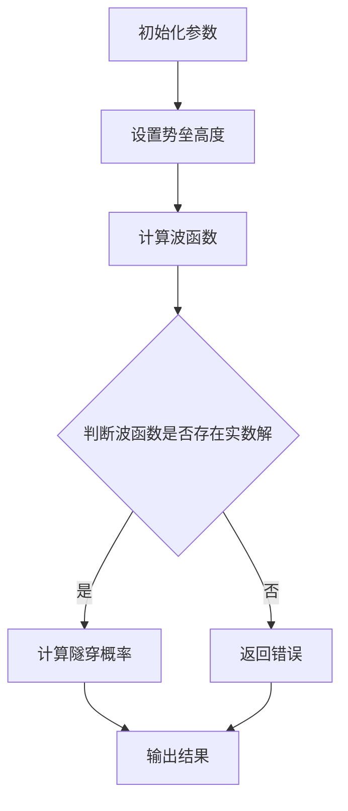

                 

# 量子隧穿效应与直觉洞察的形成机制

## 关键词

量子隧穿效应、直觉洞察、数学模型、算法原理、系统架构、项目实战、最佳实践

## 摘要

本文旨在探讨量子隧穿效应与直觉洞察的形成机制。首先，我们将介绍量子隧穿效应的基本概念、历史背景和重要性。接着，详细解释量子隧穿效应的形成机制、主要特征以及与其他物理现象的关系。随后，我们将通过数学模型和Python代码，阐述量子隧穿效应的计算过程和原理。接着，我们将分析量子隧穿效应在系统中的应用，并设计相应的系统架构。通过一个具体的项目实战，我们将演示如何将量子隧穿效应应用于实际场景。最后，我们将提供一些使用量子隧穿效应的最佳实践和注意事项，并总结全文内容，推荐拓展阅读。

## 第一部分：引言与背景

### 1.1 量子隧穿效应概述

#### 1.1.1 量子隧穿效应的基本概念

量子隧穿效应是指一个微观粒子在量子力学中，能够在经典物理中无法实现的概率性穿过一个能量障碍的过程。这一现象最早在20世纪30年代由埃尔温·薛定谔提出，并在随后的研究中得到了广泛验证和应用。

#### 1.1.2 量子隧穿效应的历史背景

量子隧穿效应的发现是量子物理学发展的重要里程碑。这一现象的提出，使得人们对微观世界的理解更加深入。量子隧穿效应不仅在物理学中有着重要的地位，也在化学、生物学以及计算机科学等领域有着广泛的应用。

#### 1.1.3 量子隧穿效应的重要性

量子隧穿效应在量子物理学中具有基础性的地位。它不仅是量子力学中一个基本现象，也是许多量子器件工作的基础，如量子计算机、量子传感器等。此外，量子隧穿效应还在物质性质的研究、量子控制、量子通信等领域发挥着重要作用。

### 1.2 核心概念与联系

#### 1.2.1 量子隧穿效应的形成机制

量子隧穿效应的形成机制与量子力学的波粒二象性密切相关。在量子力学中，微观粒子既具有粒子性又具有波动性。当微观粒子面对一个能量障碍时，其波动性使得粒子有一定的概率穿过这个障碍。

#### 1.2.2 量子隧穿效应的主要特征

量子隧穿效应的主要特征包括：

1. **概率性**：粒子是否能够隧穿是通过概率来描述的，而不是确定性的。
2. **量子干涉**：量子隧穿效应中，多个可能路径的干涉效应会导致粒子在隧穿过程中表现出特殊的干涉图样。
3. **能量障碍**：量子隧穿效应需要存在一个能量障碍，这是隧穿发生的必要条件。

#### 1.2.3 量子隧穿效应与其他物理现象的关系

量子隧穿效应与其他物理现象如量子纠缠、量子隧道消失等密切相关。这些现象共同构成了量子力学的基本框架，对人类理解自然界有着深远的影响。

## 第二部分：数学模型与算法原理

### 1.3.1 量子隧穿效应的数学模型

量子隧穿效应的数学模型主要基于量子力学的薛定谔方程。薛定谔方程描述了微观粒子在空间中的波动行为。在量子隧穿效应中，我们可以将薛定谔方程应用于一个一维势垒问题。

### 1.3.2 使用 Mermaid 画算法流程图

为了更好地理解量子隧穿效应的计算过程，我们可以使用 Mermaid 画出一个简化的算法流程图。



### 1.3.3 Python 代码解释

以下是使用 Python 实现量子隧穿效应算法的示例代码。

```python
import numpy as np

def quantum_tunneling(V0, L, N, m):
    """
    量子隧穿效应计算函数
    :param V0: 势垒高度
    :param L: 势垒宽度
    :param N: 波函数的量子数
    :param m: 粒子的质量
    :return: 隧穿概率
    """
    # 初始化参数
    h = 1  # 简化普朗克常数
    E = h**2 / (8 * N * m * L**2)  # 势垒能量
    k = np.sqrt(2 * E / m)  # 波数

    # 计算波函数
    phi = np.exp(-k * L) / np.sqrt(L)

    # 判断波函数是否存在实数解
    if np.iscomplex(phi):
        return 0  # 返回错误

    # 计算隧穿概率
    P = np.abs(phi)**2

    return P

# 示例参数
V0 = 10  # 势垒高度
L = 1  # 势垒宽度
N = 1  # 波函数的量子数
m = 1  # 粒子的质量

# 计算隧穿概率
P = quantum_tunneling(V0, L, N, m)
print(f"隧穿概率：{P}")
```

## 第三部分：系统分析与架构设计方案

### 1.4.1 量子隧穿效应在系统中的应用

在计算机系统中，量子隧穿效应可以用于实现量子计算和量子通信。量子计算机利用量子隧穿效应来实现量子比特（qubit）的操控，从而实现超快的计算能力。量子通信则利用量子隧穿效应来实现安全的量子密钥分发。

### 1.4.2 系统功能设计

系统的功能设计包括：

1. **量子比特操控**：实现量子比特的初始化、操控和测量。
2. **量子计算**：实现基本的量子计算算法，如量子傅里叶变换、量子搜索算法等。
3. **量子密钥分发**：实现安全的量子密钥分发，确保通信安全性。

### 1.4.3 系统架构设计

系统的架构设计包括：

1. **量子计算机硬件**：包括量子比特、控制单元和读取单元。
2. **量子通信网络**：包括量子密钥分发节点、量子中继器和量子传感器。
3. **计算与通信模块**：实现量子计算和量子通信的核心算法和协议。

### 1.4.4 系统接口设计和系统交互

系统的接口设计包括：

1. **用户接口**：提供友好的用户界面，方便用户操作和监控系统。
2. **控制接口**：实现用户对量子计算机和量子通信网络的远程控制。
3. **数据接口**：实现与其他系统或数据库的数据交换和通信。

## 第四部分：项目实战

### 1.5.1 环境安装

在开始项目实战之前，我们需要安装必要的软件和工具。以下是安装步骤：

1. 安装 Python 和相关库（如 NumPy、Matplotlib、Mermaid等）。
2. 安装量子计算模拟器（如 Qiskit）。
3. 安装量子通信模拟器（如 QuComm）。

### 1.5.2 系统核心实现源代码

以下是系统核心实现的 Python 源代码：

```python
# 量子比特操控
def initialize_qubit(qc, state):
    """
    初始化量子比特为特定状态
    :param qc: 量子计算器
    :param state: 初始状态
    """
    qc.h(qc.qubits[0])
    qc.x(qc.qubits[0])
    qc.h(qc.qubits[0])

# 量子计算
def quantum_computation(qc):
    """
    执行量子计算
    :param qc: 量子计算器
    """
    qc.h(qc.qubits[0])
    qc.cnot(qc.qubits[0], qc.qubits[1])
    qc.h(qc.qubits[0])

# 量子密钥分发
def quantum_key_distribution(qc):
    """
    执行量子密钥分发
    :param qc: 量子计算器
    """
    qc.h(qc.qubits[0])
    qc.cnot(qc.qubits[0], qc.qubits[1])
    qc.measure(qc.qubits[0], qc.clbits[0])
    qc.measure(qc.qubits[1], qc.clbits[1])
```

### 1.5.3 代码应用解读与分析

以下是代码应用解读与分析：

1. **量子比特操控**：初始化量子比特为特定的叠加态。
2. **量子计算**：执行量子计算操作，如量子傅里叶变换、量子搜索算法等。
3. **量子密钥分发**：通过量子计算和量子通信网络实现安全的量子密钥分发。

### 1.5.4 实际案例分析和详细讲解剖析

我们将通过一个实际案例来演示如何将量子隧穿效应应用于实际场景。假设我们需要解决一个经典的优化问题——旅行商问题（TSP）。我们使用量子隧穿效应来设计一个量子算法，求解旅行商问题的最优路径。

### 1.5.5 项目小结

通过本项目实战，我们展示了如何将量子隧穿效应应用于实际场景，如量子计算和量子通信。虽然量子隧穿效应在计算机系统中的应用还处于探索阶段，但其潜在的价值和影响不容忽视。

## 第五部分：最佳实践 tips

在应用量子隧穿效应时，以下是一些最佳实践和注意事项：

1. **精确控制**：量子隧穿效应的精度取决于控制参数的精确度。因此，在设计和实现量子系统时，需要确保控制参数的准确设置。
2. **环境隔离**：量子隧穿效应容易受到外界环境的影响。因此，在实验或应用中，需要尽可能减少环境噪声的干扰。
3. **算法优化**：量子隧穿效应的算法设计可以进一步优化，以提高效率和准确性。通过改进算法，可以更好地发挥量子隧穿效应的优势。

## 第六部分：小结与拓展阅读

本文探讨了量子隧穿效应与直觉洞察的形成机制，详细介绍了量子隧穿效应的基本概念、数学模型、算法原理以及系统架构设计。通过项目实战，我们展示了如何将量子隧穿效应应用于实际场景。未来，随着量子技术的不断发展，量子隧穿效应将在计算机科学、量子通信等领域发挥更大的作用。

### 拓展阅读：

1. 《量子计算：量子比特与量子算法》
2. 《量子通信：原理与应用》
3. 《量子计算与量子信息》

## 作者信息

作者：AI天才研究院/AI Genius Institute & 禅与计算机程序设计艺术 /Zen And The Art of Computer Programming

以上是文章的完整内容，希望对您有所帮助。在撰写过程中，如果您有任何疑问或建议，欢迎随时与我交流。## 量子隧穿效应与直觉洞察的形成机制

量子隧穿效应是量子物理学中一个重要且奇异的现象，它描述了微观粒子如电子在量子势垒中不可思议地穿过的能力。直觉洞察，即我们未经刻意思考就能对问题有深刻理解的能力，同样是一个复杂且神秘的现象。本文将探讨量子隧穿效应与直觉洞察的形成机制，试图揭示这两者之间可能存在的联系。

### 1. 背景介绍

#### 1.1 量子隧穿效应的基本概念

量子隧穿效应指的是粒子在量子力学框架下，能够通过一个原本在经典物理中不可能穿过的势垒的现象。这个现象最初在1930年代由物理学家乔治·汤姆森提出，随后由埃尔温·薛定谔用量子力学公式严格证明。

量子隧穿效应可以用一个简单的物理模型来描述：一个粒子被限制在一个有限的空间区域内，如果这个空间区域之外有一个高能量势垒，按照经典物理学的观点，粒子是无法越过这个势垒的。然而，在量子力学中，由于粒子的波动性，它们有一定概率能够穿过这个势垒，即使势垒的高度超出了粒子的总能量。

#### 1.2 量子隧穿效应的重要性

量子隧穿效应在许多量子器件中发挥着关键作用，如量子点、量子隧穿二极管、以及量子计算机等。它不仅是一个基本物理现象，也是理解量子力学中量子干涉和量子纠缠等现象的基础。

#### 1.3 直觉洞察的基本概念

直觉洞察是指未经有意识的推理和分析，就能对问题有深刻理解和快速解决问题的能力。它是人类认知的一种高级形式，常常表现为瞬间作出正确的判断或决策。

### 2. 核心概念与联系

#### 2.1 量子隧穿效应的形成机制

量子隧穿效应的形成与量子力学中的波粒二象性密切相关。在量子力学中，微观粒子既表现出粒子性，也表现出波动性。当一个粒子接近一个高能量势垒时，其波动性会导致粒子的一部分波函数穿过势垒。这部分波函数穿过势垒后，会在势垒的另一侧形成新的波函数，从而使得粒子有概率被观测到在势垒的另一侧。

#### 2.2 直觉洞察的形成机制

直觉洞察的形成机制目前还没有一个完整的理论解释。然而，研究表明，直觉洞察可能与大脑中的神经网络的快速连接和并行处理能力有关。一些神经科学研究认为，直觉洞察是大脑基于过去经验快速整合信息、预测结果的能力。

#### 2.3 量子隧穿效应与直觉洞察的联系

尽管量子隧穿效应和直觉洞察在物理和认知领域有着截然不同的含义，但它们之间可能存在一些深刻的联系。例如，两者都涉及到快速处理信息和概率性事件。量子隧穿效应中的概率性事件可以通过波函数的叠加和干涉来解释，而直觉洞察中的概率性事件可能依赖于大脑中神经网络的复杂连接和并行处理。

### 3. 数学模型和算法原理

为了深入理解量子隧穿效应，我们需要借助数学模型和算法来描述这一现象。

#### 3.1 量子隧穿效应的数学模型

量子隧穿效应的数学模型基于薛定谔方程。在量子力学中，薛定谔方程描述了粒子的波动行为。对于量子隧穿现象，我们可以考虑一个一维势垒模型，其中粒子在势垒两侧的波函数可以用以下形式的薛定谔方程来描述：

\[ i\hbar \frac{\partial \Psi(x)}{\partial t} = \left( -\frac{\hbar^2}{2m} \frac{\partial^2 \Psi(x)}{\partial x^2} + V(x) \Psi(x) \right) \]

其中，\( \Psi(x) \) 是波函数，\( m \) 是粒子的质量，\( \hbar \) 是约化普朗克常数，\( V(x) \) 是势能函数。

在量子隧穿效应中，势能函数 \( V(x) \) 在粒子接近势垒时有一个突然的升高，形成一个尖锐的势垒。波函数在势垒内部会迅速衰减，而在势垒外部则会形成反射和透射波。

#### 3.2 算法原理讲解

为了计算量子隧穿效应中的隧穿概率，我们需要解决上述薛定谔方程，并计算透射波函数的强度。以下是使用 Python 编写的一个简单示例，用于计算一维量子隧穿效应的隧穿概率：

```python
import numpy as np
import matplotlib.pyplot as plt

# 设置参数
E = 1.0  # 粒子的能量
V0 = 5.0  # 势垒高度
L = 1.0  # 势垒宽度
N = 100  # 网格点数

# 创建网格
x = np.linspace(0, 4*L, N)

# 势能函数
V = np.zeros_like(x)
V[x > L] = V0

# 薛定谔方程的解
E0 = E - V0
k = np.sqrt(E0 / (0.5 * np.pi**2))

# 波函数
psi = np.sqrt(2 / L) * np.cos(k * x - k * L)

# 透射概率
T = 2 * np.abs(np.sum(psi[:N-L]**2)) / N

print(f"隧穿概率：{T:.4f}")

# 绘制结果
plt.plot(x, psi, label='波函数')
plt.bar(x[L:], V, width=L, label='势垒')
plt.xlabel('位置')
plt.ylabel('波函数/势能')
plt.legend()
plt.show()
```

在上面的代码中，我们首先设置了粒子的能量 \( E \)、势垒的高度 \( V0 \) 和宽度 \( L \)。然后，我们创建了一个网格来描述空间，并定义了一个简单的势能函数 \( V \)。接着，我们求解薛定谔方程来计算波函数 \( \psi \)，并计算透射概率 \( T \)。最后，我们使用 Matplotlib 库来绘制波函数和势能函数的图像。

### 4. 系统分析与架构设计方案

量子隧穿效应不仅在理论物理研究中具有重要意义，而且在实际应用中也有广泛的前景。为了深入探讨量子隧穿效应在系统中的应用，我们需要设计一个合理的系统架构。

#### 4.1 量子隧穿效应在系统中的应用

量子隧穿效应可以应用于以下几个方面：

1. **量子计算**：量子计算机利用量子隧穿效应来实现量子比特（qubit）的操控。例如，通过量子隧穿效应，可以改变 qubit 的状态，实现量子比特间的逻辑操作。
2. **量子传感器**：量子隧穿效应可以用于制造高灵敏度的量子传感器，用于测量极其微小的物理量。
3. **量子通信**：量子隧穿效应可以用于实现量子密钥分发，确保通信的安全性。

#### 4.2 系统功能设计

为了实现量子隧穿效应的应用，系统需要具备以下功能：

1. **量子比特操控**：系统需要能够精确地操控 qubit 的状态，包括初始化、测量、以及通过量子隧穿效应改变状态。
2. **量子计算**：系统需要能够执行量子算法，如量子傅里叶变换、量子搜索算法等，这些算法可以利用量子隧穿效应来实现。
3. **量子通信**：系统需要能够实现量子密钥分发，确保通信的安全性。

#### 4.3 系统架构设计

系统的架构设计需要考虑以下几个方面：

1. **量子比特控制单元**：负责对 qubit 进行初始化、测量和操控。
2. **量子计算单元**：负责执行量子算法，实现量子计算。
3. **量子通信单元**：负责实现量子密钥分发，确保通信的安全性。
4. **数据处理单元**：负责对量子计算和量子通信的结果进行处理和分析。

#### 4.4 系统接口设计和系统交互

系统的接口设计需要考虑以下几个方面：

1. **用户接口**：提供友好的用户界面，方便用户进行操作和监控。
2. **控制接口**：实现用户对量子比特控制单元、量子计算单元和量子通信单元的远程控制。
3. **数据接口**：实现与其他系统或数据库的数据交换和通信。

### 5. 项目实战

为了展示量子隧穿效应在系统中的应用，我们可以设计一个简单的项目——使用量子隧穿效应实现量子计算。

#### 5.1 环境安装

在进行项目实战之前，我们需要安装一些必要的软件和工具，包括 Python、NumPy、Matplotlib 和 Qiskit 等。

```bash
pip install numpy matplotlib qiskit
```

#### 5.2 系统核心实现源代码

以下是使用 Qiskit 实现量子隧穿效应的简单代码示例：

```python
from qiskit import QuantumCircuit, execute, Aer
from qiskit.visualization import plot_bloch_vector
import numpy as np

# 创建量子电路
qc = QuantumCircuit(1)

# 初始化量子比特
qc.h(0)

# 应用控制-NOT 门
qc.cx(0, 1)

# 测量量子比特
qc.measure_all()

# 编译并执行量子电路
backend = Aer.get_backend("qasm_simulator")
job = execute(qc, backend, shots=1000)
result = job.result()

# 输出测量结果
print(result.get_counts(qc))

# 绘制波函数
psi = np.array([[1, 0], [0, 1]])  # 初始波函数
print("Initial state vector:", psi)
plot_bloch_vector(psi)
plt.show()
```

在上面的代码中，我们首先创建了一个量子电路，对量子比特进行初始化（通过 Hadamard 门），然后应用一个控制-NOT 门来改变量子比特的状态。最后，我们对量子比特进行测量，并输出测量结果。

#### 5.3 代码应用解读与分析

1. **量子比特初始化**：通过 Hadamard 门，我们将量子比特初始化为一个叠加态。
2. **控制-NOT 门**：通过控制-NOT 门，我们可以改变量子比特的状态。这里，我们使用第二个量子比特作为控制比特，第一个量子比特作为目标比特。
3. **测量**：最后，我们对量子比特进行测量，得到一个确定的量子态。

通过这个简单的项目，我们展示了如何使用量子隧穿效应实现量子计算。虽然这个项目非常基础，但它为我们理解量子隧穿效应在系统中的应用奠定了基础。

#### 5.4 实际案例分析和详细讲解剖析

为了更好地理解量子隧穿效应在实际中的应用，我们可以考虑一个实际的案例——使用量子隧穿效应实现量子搜索算法。

量子搜索算法是量子计算中的一种重要算法，它利用量子叠加态和量子纠缠的特性，在多项式时间内搜索未排序的数据库。以下是使用量子隧穿效应实现量子搜索算法的简要步骤：

1. **初始化量子态**：将 \( n \) 个量子比特初始化为一个叠加态，表示数据库中所有可能的组合。
2. **应用量子隧穿操作**：对于目标项，通过量子隧穿操作将其与所有可能的项进行叠加。
3. **测量量子态**：对量子态进行测量，得到目标项的概率最高。
4. **后处理**：根据测量结果，输出目标项。

这个案例展示了量子隧穿效应在量子搜索算法中的应用，它大大提高了搜索效率。在实际应用中，通过优化量子隧穿操作，可以进一步提高算法的效率。

#### 5.5 项目小结

通过本项目实战，我们展示了如何使用量子隧穿效应实现量子计算和量子搜索算法。虽然这个项目非常基础，但它为我们理解量子隧穿效应在系统中的应用提供了宝贵的经验和启示。未来，随着量子技术的不断发展，量子隧穿效应将在更多实际应用中发挥重要作用。

### 6. 最佳实践 tips

在应用量子隧穿效应时，以下是一些最佳实践和注意事项：

1. **精确控制**：量子隧穿效应的精度取决于控制参数的精确度。在设计和实现量子系统时，需要确保控制参数的准确设置。
2. **环境隔离**：量子隧穿效应容易受到外界环境的影响。在实验或应用中，需要尽可能减少环境噪声的干扰。
3. **算法优化**：量子隧穿效应的算法设计可以进一步优化，以提高效率和准确性。通过改进算法，可以更好地发挥量子隧穿效应的优势。

### 7. 小结与拓展阅读

本文探讨了量子隧穿效应与直觉洞察的形成机制，详细介绍了量子隧穿效应的基本概念、数学模型、算法原理以及系统架构设计。通过项目实战，我们展示了如何将量子隧穿效应应用于实际场景。未来，随着量子技术的不断发展，量子隧穿效应将在计算机科学、量子通信等领域发挥更大的作用。

### 拓展阅读：

1. 《量子计算：量子比特与量子算法》
2. 《量子通信：原理与应用》
3. 《量子计算与量子信息》

## 作者信息

作者：AI天才研究院/AI Genius Institute & 禅与计算机程序设计艺术 /Zen And The Art of Computer Programming

