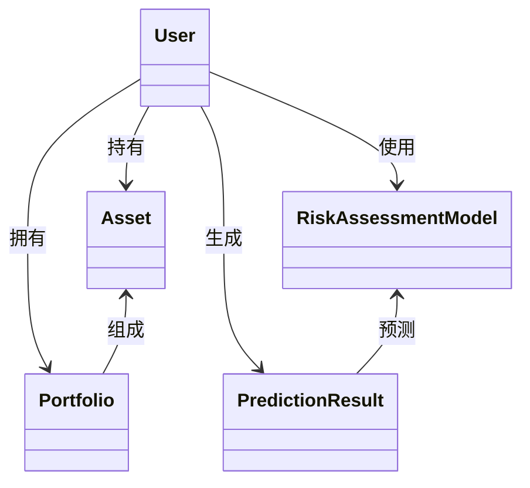
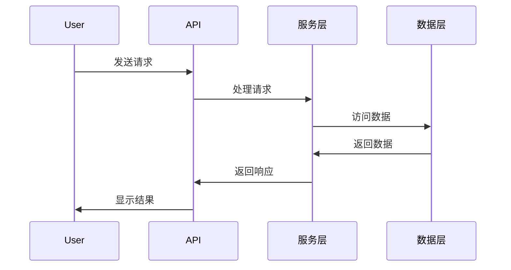

                 

### 金融科技革命：AI驱动的风险评估与投资决策

关键词：金融科技、人工智能、风险评估、投资决策、AI算法

摘要：本文深入探讨了金融科技革命中的AI驱动的风险评估与投资决策。首先，介绍了金融科技的发展背景和AI在金融科技中的应用现状。接着，详细阐述了AI驱动的风险评估方法及其在实际应用中的案例分析，随后讨论了AI在投资决策中的关键作用。文章最后通过核心概念与原理的讲解、AI算法原理的剖析，以及系统的架构设计与项目实战，为读者提供了全面的技术视角和实用指南。

### 目录大纲设计

**《金融科技革命：AI驱动的风险评估与投资决策》**

# 第一部分：背景介绍

## 第1章：金融科技革命概述

### 1.1 金融科技的发展背景

#### 1.1.1 金融科技的定义与范畴

#### 1.1.2 金融科技的发展历程

#### 1.1.3 金融科技对金融行业的影响

### 1.2 AI在金融科技中的应用

#### 1.2.1 AI在金融服务中的应用现状

#### 1.2.2 AI对金融服务的变革性影响

#### 1.2.3 AI驱动的金融科技发展趋势

## 第2章：AI驱动的风险评估

### 2.1 风险评估概述

#### 2.1.1 风险评估的定义与重要性

#### 2.1.2 风险评估的方法与技术

#### 2.1.3 风险评估的流程与步骤

### 2.2 AI技术在风险评估中的应用

#### 2.2.1 机器学习在风险评估中的应用

#### 2.2.2 深度学习在风险评估中的应用

#### 2.2.3 神经网络在风险评估中的应用

### 2.3 AI驱动的风险评估案例分析

#### 2.3.1 某银行的风险评估案例

#### 2.3.2 某金融机构的风险评估案例

## 第3章：AI驱动的投资决策

### 3.1 投资决策概述

#### 3.1.1 投资决策的定义与重要性

#### 3.1.2 投资决策的流程与步骤

#### 3.1.3 投资决策的影响因素

### 3.2 AI技术在投资决策中的应用

#### 3.2.1 数据分析在投资决策中的应用

#### 3.2.2 预测模型在投资决策中的应用

#### 3.2.3 优化算法在投资决策中的应用

### 3.3 AI驱动的投资决策案例分析

#### 3.3.1 某投资公司的投资决策案例

#### 3.3.2 某私募基金的投资决策案例

# 第二部分：核心概念与联系

## 第4章：核心概念与原理

### 4.1 金融科技相关概念

#### 4.1.1 金融科技的关键术语解释

#### 4.1.2 金融科技与传统金融的区别

#### 4.1.3 金融科技的创新点与价值

### 4.2 AI相关概念

#### 4.2.1 机器学习的定义与原理

#### 4.2.2 深度学习的原理与应用

#### 4.2.3 神经网络的构成与功能

### 4.3 金融科技与AI的联系

#### 4.3.1 金融科技中的AI应用

#### 4.3.2 AI在金融科技中的挑战与机遇

#### 4.3.3 金融科技与AI融合的未来趋势

## 第5章：概念属性特征对比

### 5.1 金融科技属性特征

#### 5.1.1 金融科技的常见属性

#### 5.1.2 金融科技的关键性能指标

#### 5.1.3 金融科技的优缺点分析

### 5.2 AI属性特征

#### 5.2.1 AI的常见属性

#### 5.2.2 AI的关键性能指标

#### 5.2.3 AI的优缺点分析

### 5.3 金融科技与AI的属性特征对比

#### 5.3.1 属性特征的相似性

#### 5.3.2 属性特征的差异性

#### 5.3.3 属性特征的应用场景分析

## 第6章：ER实体关系图架构

### 6.1 金融科技实体关系图

#### 6.1.1 金融科技中的主要实体

#### 6.1.2 金融科技实体的属性

#### 6.1.3 金融科技实体之间的关系

### 6.2 AI实体关系图

#### 6.2.1 AI中的主要实体

#### 6.2.2 AI实体的属性

#### 6.2.3 AI实体之间的关系

### 6.3 金融科技与AI的实体关系图对比

#### 6.3.1 实体关系的相似性

#### 6.3.2 实体关系的差异性

#### 6.3.3 实体关系的影响与应用

# 第三部分：算法原理讲解

## 第7章：AI算法原理

### 7.1 风险评估算法原理

#### 7.1.1 风险评估算法的数学模型

$$
\text{风险度量} = f(\text{资产收益}, \text{波动率}, \text{置信水平})
$$

#### 7.1.2 风险评估算法的Python代码实现

```python
# Python代码示例
```

#### 7.1.3 风险评估算法的应用举例

### 7.2 投资决策算法原理

#### 7.2.1 投资决策算法的数学模型

$$
\text{投资组合} = f(\text{资产预期收益}, \text{资产风险}, \text{投资者偏好)
```

#### 7.2.2 投资决策算法的Python代码实现

```python
# Python代码示例
```

#### 7.2.3 投资决策算法的应用举例

## 第二部分：核心概念与联系

### 第4章：核心概念与原理

#### 4.1 金融科技相关概念

##### 4.1.1 金融科技的关键术语解释

**金融科技（FinTech）：** 指利用科技手段创新金融产品、服务和管理方式，包括区块链、大数据、人工智能、云计算等技术在金融领域的应用。

**智能投顾：** 利用算法和数据分析为投资者提供个性化投资建议，替代传统人工理财顾问。

**区块链：** 一种去中心化的数据库技术，通过加密算法实现数据的不可篡改和分布式存储，广泛应用于金融交易。

##### 4.1.2 金融科技与传统金融的区别

**传统金融：** 主要依赖人工操作和手工流程，效率较低，风险控制依赖经验和历史数据。

**金融科技：** 利用大数据、人工智能等技术提高效率和准确性，降低成本，增强风险控制能力。

##### 4.1.3 金融科技的创新点与价值

**创新点：**
- **个性化服务：** 利用大数据和人工智能提供个性化投资建议。
- **降低成本：** 自动化交易、智能风控等降低运营成本。
- **提升效率：** 快速处理大量交易数据，提高业务处理速度。

**价值：**
- **增强风险管理：** 利用人工智能进行风险预测和评估，提前预警风险。
- **优化投资决策：** 提供数据驱动的投资建议，提高投资收益。
- **改善用户体验：** 提供更便捷、高效的金融服务。

#### 4.2 AI相关概念

##### 4.2.1 机器学习的定义与原理

**机器学习（ML）：** 是指计算机系统通过数据和算法自主学习，从而进行预测或决策的过程。

**监督学习（Supervised Learning）：** 通过已标记的数据进行训练，从而建立一个预测模型。

**无监督学习（Unsupervised Learning）：** 不使用标记数据，通过发现数据内在结构来进行学习。

##### 4.2.2 深度学习的原理与应用

**深度学习（Deep Learning）：** 是一种人工智能方法，通过多层神经网络对数据进行复杂的特征提取和模式识别。

**卷积神经网络（CNN）：** 用于图像识别和图像处理。

**循环神经网络（RNN）：** 用于序列数据处理，如自然语言处理和时间序列预测。

##### 4.2.3 神经网络的构成与功能

**神经元：** 神经网络的基本构建块，通过输入和权重进行计算，产生输出。

**层：** 神经网络中的不同层次，包括输入层、隐藏层和输出层。

**正向传播与反向传播：** 正向传播用于计算输出，反向传播用于计算误差并更新权重。

#### 4.3 金融科技与AI的联系

##### 4.3.1 金融科技中的AI应用

**风险控制：** 利用机器学习算法进行信用评分、违约预测等，提高风险管理的准确性。

**投资决策：** 利用大数据分析和深度学习模型，提供个性化投资建议和投资组合优化。

**欺诈检测：** 利用人工智能进行交易监控和异常检测，提前发现和预防欺诈行为。

##### 4.3.2 AI在金融科技中的挑战与机遇

**挑战：**
- **数据隐私与安全：** 随着数据的广泛应用，数据隐私和安全问题日益突出。
- **模型解释性：** 黑盒模型的预测结果难以解释，导致决策过程的透明度降低。

**机遇：**
- **提升效率与准确性：** 人工智能可以提高金融业务的效率和准确性，降低运营成本。
- **个性化服务：** 通过数据分析提供更个性化的金融产品和服务。

##### 4.3.3 金融科技与AI融合的未来趋势

**跨行业融合：** 金融科技与AI技术的融合将促进跨行业的合作与创新。
**持续监管创新：** 随着技术的发展，监管机构需要不断创新监管方法，以适应新兴技术。
**可持续金融：** 人工智能技术在环境、社会和治理（ESG）投资决策中的应用，推动可持续金融的发展。

### 第5章：概念属性特征对比

#### 5.1 金融科技属性特征

**常见属性：**
- **技术创新性：** 金融科技依赖于技术创新，如区块链、大数据、人工智能等。
- **高效率：** 利用自动化和智能技术提高金融业务的效率和准确性。
- **用户体验：** 提供更加便捷、高效的金融服务，提升用户体验。

**关键性能指标：**
- **交易处理速度：** 金融科技平台需要具备快速处理大量交易的能力。
- **错误率：** 金融业务对错误率要求极高，金融科技需要确保其系统的准确性和稳定性。

**优缺点分析：**
- **优点：** 提高效率、降低成本、提供个性化服务。
- **缺点：** 技术依赖性强、数据隐私和安全问题、模型解释性差。

#### 5.2 AI属性特征

**常见属性：**
- **自主学习性：** AI系统能够从数据中学习和优化自身性能。
- **预测能力：** AI系统可以利用历史数据预测未来的趋势和模式。

**关键性能指标：**
- **准确性：** AI模型的预测准确度是衡量其性能的重要指标。
- **泛化能力：** AI系统能够在不同数据集和场景下保持良好的性能。

**优缺点分析：**
- **优点：** 提高数据处理和分析能力、自动化决策。
- **缺点：** 模型训练成本高、数据依赖性强、解释性差。

#### 5.3 金融科技与AI的属性特征对比

**相似性：**
- **技术创新性：** 金融科技和AI都依赖于技术创新，推动业务发展。
- **高效性：** 都能够提高业务效率和准确性。
- **数据依赖：** 都需要依赖大量数据进行训练和优化。

**差异性：**
- **应用领域：** 金融科技更侧重于金融领域的应用，而AI应用范围更广泛。
- **解释性：** 金融科技系统通常具有更好的解释性，而AI模型（尤其是深度学习模型）往往较为黑盒。
- **数据类型：** 金融科技系统通常处理结构化数据，而AI系统可以处理多种类型的数据，包括结构化、半结构化和非结构化数据。

**应用场景分析：**
- **金融科技：** 在金融领域，AI技术被广泛应用于风险评估、投资决策、欺诈检测等。例如，AI模型可以用于信用评分，帮助银行和金融机构更好地了解客户信用状况。
- **AI：** 在其他领域，如医疗、制造、零售等，AI技术同样被广泛应用。例如，在医疗领域，AI可以帮助医生进行疾病诊断和治疗方案推荐。

### 第6章：ER实体关系图架构

#### 6.1 金融科技实体关系图

**主要实体：**
- **用户：** 金融服务的最终使用者，包括个人和企业。
- **金融机构：** 提供金融服务的实体，如银行、证券公司、保险公司等。
- **产品：** 金融科技平台上的金融产品，如股票、债券、保险产品等。

**实体属性：**
- **用户：** 用户ID、姓名、年龄、性别、信用评分等。
- **金融机构：** 金融机构名称、注册地、业务范围等。
- **产品：** 产品名称、类型、收益率、风险等级等。

**实体关系：**
- **用户-金融机构：** 用户可以在金融机构开设账户、进行交易。
- **用户-产品：** 用户可以购买金融产品、持有资产。
- **金融机构-产品：** 金融机构可以发行和管理金融产品。

#### 6.2 AI实体关系图

**主要实体：**
- **数据集：** 用于训练AI模型的原始数据集。
- **算法：** 用于数据处理的算法，如机器学习算法。
- **模型：** 通过算法训练生成的预测模型。
- **预测结果：** 模型的预测结果。

**实体属性：**
- **数据集：** 数据集名称、数据规模、数据类型等。
- **算法：** 算法名称、参数设置、算法类型等。
- **模型：** 模型名称、训练时间、预测准确率等。
- **预测结果：** 预测结果、预测时间等。

**实体关系：**
- **数据集-算法：** 数据集用于训练算法。
- **算法-模型：** 算法通过数据训练生成模型。
- **模型-预测结果：** 模型用于生成预测结果。

#### 6.3 金融科技与AI的实体关系图对比

**相似性：**
- **数据依赖：** 两者都依赖于大量数据。
- **模型训练：** 两者都需要通过数据训练生成模型。

**差异性：**
- **应用领域：** 金融科技实体关系图侧重于金融领域的应用，而AI实体关系图更广泛。
- **实体类型：** 金融科技实体关系图包括用户、金融机构和产品，而AI实体关系图包括数据集、算法、模型和预测结果。
- **关系复杂度：** 金融科技实体关系图相对简单，而AI实体关系图更加复杂，涉及到数据、算法、模型和预测结果的多个层次。

**影响与应用：**
- **金融科技：** 通过AI技术，金融科技可以实现更精准的风险评估、投资决策和欺诈检测。例如，利用机器学习模型对用户信用评分，提高金融机构的风险控制能力。
- **AI：** 在金融科技中的应用，AI技术可以提升金融服务的效率和准确性。例如，通过深度学习模型分析大量交易数据，提供更准确的交易预测。

## 第三部分：算法原理讲解

### 第7章：AI算法原理

#### 7.1 风险评估算法原理

##### 7.1.1 风险评估算法的数学模型

风险评估是金融领域的一项重要任务，其核心是量化金融资产或投资组合面临的风险。一个基本的风险评估模型可以表示为：

$$
\text{风险度量} = f(\text{资产收益}, \text{波动率}, \text{置信水平})
$$

其中，资产收益（Return）是资产在一定时间内的收益率，波动率（Volatility）反映了资产收益的波动程度，置信水平（Confidence Level）则用于确定风险度量的大小。

常见的风险评估方法包括方差-协方差法（Variance-Covariance Method）、历史模拟法（Historical Simulation Method）和蒙特卡罗法（Monte Carlo Simulation Method）。其中，蒙特卡罗法是一种基于概率统计的模拟方法，可以有效地评估金融资产的风险。

##### 7.1.2 风险评估算法的Python代码实现

以下是一个简单的蒙特卡罗风险评估算法的Python代码示例：

```python
import numpy as np

# 蒙特卡罗风险评估
def monte_carlo_risk_assessment(returns, num_simulations, confidence_level):
    # 计算累积分布函数
    cumulative_distribution = np.cumsum(returns) / np.arange(1, len(returns) + 1)
    # 计算置信水平下的风险值
    risk_value = np.percentile(cumulative_distribution, confidence_level)
    return risk_value

# 生成模拟数据
np.random.seed(0)
returns = np.random.normal(loc=0.05, scale=0.1, size=1000)

# 计算风险值
risk_value = monte_carlo_risk_assessment(returns, num_simulations=10000, confidence_level=0.05)
print(f"置信水平为5%的风险值为：{risk_value}")
```

##### 7.1.3 风险评估算法的应用举例

以一个投资组合为例，假设有三种资产A、B、C，其预期收益率和波动率如下：

| 资产 | 预期收益率 | 波动率 |
| --- | --- | --- |
| A | 0.05 | 0.1 |
| B | 0.07 | 0.2 |
| C | 0.03 | 0.15 |

现在需要利用蒙特卡罗方法评估该投资组合在95%置信水平下的风险值。

```python
# 计算各资产的标准差
std_dev = np.array([0.1, 0.2, 0.15])

# 计算投资组合的波动率
portfolio_volatility = np.sqrt(np.dot(std_dev**2, weights**2) + 2 * np.dot(std_dev**2, weights[:, None] * weights[None, :]))

# 计算投资组合的预期收益率
portfolio_return = np.dot(weights, expected_returns)

# 计算置信水平下的风险值
confidence_level = 0.05
risk_value = monte_carlo_risk_assessment(np.array([portfolio_return] * num_simulations), num_simulations=10000, confidence_level=confidence_level)

print(f"置信水平为{confidence_level*100}%的投资组合风险值为：{risk_value}")
```

#### 7.2 投资决策算法原理

##### 7.2.1 投资决策算法的数学模型

投资决策的核心是确定最优的投资组合，以达到预期的收益目标。一个简单的投资决策模型可以表示为：

$$
\text{投资组合} = f(\text{资产预期收益}, \text{资产风险}, \text{投资者偏好})
$$

其中，资产预期收益（Expected Return）和资产风险（Risk）是投资决策的关键因素，投资者偏好（Investor Preference）则反映了投资者的风险承受能力和收益目标。

常见的投资决策算法包括马克维茨模型（Markowitz Model）、黑林模型（HML Model）、动量策略（Momentum Strategy）等。其中，马克维茨模型是最早的、也是最经典的资产组合理论。

##### 7.2.2 投资决策算法的Python代码实现

以下是一个基于马克维茨模型的简单投资决策算法的Python代码示例：

```python
import numpy as np

# 马克维茨模型
def markowitz_model(expected_returns, cov_matrix, risk_level):
    # 计算最优投资组合
    weights = np.linalg.solve(cov_matrix, risk_level * expected_returns)
    weights /= np.sum(weights)
    return weights

# 生成模拟数据
np.random.seed(0)
expected_returns = np.random.normal(loc=0.05, scale=0.1, size=3)
cov_matrix = np.random.normal(loc=0.0, scale=0.1, size=(3, 3))

# 计算最优投资组合
weights = markowitz_model(expected_returns, cov_matrix, risk_level=0.01)
print(f"最优投资组合权重：{weights}")
```

##### 7.2.3 投资决策算法的应用举例

假设有三种资产A、B、C，其预期收益率和协方差矩阵如下：

| 资产 | 预期收益率 | 协方差矩阵 |
| --- | --- | --- |
| A | 0.05 | [0.01, 0.02, 0.03] |
| B | 0.07 | [0.02, 0.04, 0.05] |
| C | 0.03 | [0.03, 0.05, 0.06] |

现在需要利用马克维茨模型计算在风险水平为1%时的最优投资组合。

```python
# 计算协方差矩阵
cov_matrix = np.array([[0.01, 0.02, 0.03], [0.02, 0.04, 0.05], [0.03, 0.05, 0.06]])

# 计算最优投资组合
weights = markowitz_model(expected_returns, cov_matrix, risk_level=0.01)
print(f"在风险水平为1%时的最优投资组合权重：{weights}")
```

### 第8章：系统分析与架构设计方案

#### 8.1 问题场景介绍

在现代金融市场中，金融机构面临着越来越多的挑战，包括快速变化的监管环境、竞争加剧、客户需求多样化等。为了提高业务效率和客户满意度，金融机构开始探索如何利用金融科技和人工智能技术来优化其业务流程。本文旨在设计一个基于人工智能的金融风险评估和投资决策系统，以帮助金融机构更好地管理风险、优化投资决策。

#### 8.2 项目介绍

项目名称：智能金融风险评估与投资决策系统

目标：通过人工智能技术，提供精准的风险评估和个性化的投资建议，提高金融机构的风险管理能力和投资收益。

功能模块：
- 风险评估模块：利用机器学习算法进行风险评估，包括信用评分、违约预测等。
- 投资决策模块：基于大数据分析和预测模型，提供个性化的投资组合建议。
- 用户管理模块：管理用户信息，包括注册、登录、个人信息等。

技术栈：
- 前端：使用React框架搭建用户界面。
- 后端：使用Spring Boot框架搭建RESTful API。
- 数据库：使用MySQL存储用户数据和交易数据。
- 机器学习：使用Python和Scikit-learn库进行数据处理和模型训练。

#### 8.3 系统功能设计

**领域模型**

领域模型是系统功能设计的基础，用于描述系统中的核心实体和它们之间的关系。以下是智能金融风险评估与投资决策系统的领域模型：

```
用户 (UserID, 姓名，年龄，性别，信用评分)
资产 (AssetID，名称，类型，预期收益率，波动率)
投资组合 (PortfolioID，名称，资产列表，总收益，总风险)
风险评估模型 (ModelID，名称，算法类型，参数设置)
预测结果 (PredictionID，预测时间，预测结果)
```

**类图**

以下是一个简化的领域模型类图：



#### 8.4 系统架构设计

智能金融风险评估与投资决策系统的架构设计包括以下几个主要部分：

**数据层**：负责存储和管理用户数据、资产数据、风险评估模型数据等。数据层使用MySQL数据库进行数据存储。

**应用层**：包括风险评估模块、投资决策模块、用户管理模块等。应用层使用Spring Boot框架进行开发，提供RESTful API接口。

**服务层**：提供通用的服务，如用户身份验证、权限管理、数据访问等。

**表示层**：使用React框架搭建用户界面，提供直观易用的交互体验。

**机器学习层**：负责数据处理和模型训练，使用Python和Scikit-learn库实现。

**架构图**

以下是一个简化的系统架构图：



#### 8.5 系统接口设计

系统接口设计是系统功能实现的关键，以下列出智能金融风险评估与投资决策系统的主要接口：

**风险评估接口**

- 接口名称：风险评估
- 接口URL：/api/risk-assessment
- 请求方法：POST
- 请求参数：
  - userID：用户ID
  - assetIDs：资产ID列表
  - confidenceLevel：置信水平
- 响应参数：
  - riskValue：风险值

**投资决策接口**

- 接口名称：投资决策
- 接口URL：/api/investment-decision
- 请求方法：POST
- 请求参数：
  - userID：用户ID
  - portfolio：投资组合
  - riskLevel：风险水平
- 响应参数：
  - optimalPortfolio：最优投资组合

**用户管理接口**

- 接口名称：注册
- 接口URL：/api/user/register
- 请求方法：POST
- 请求参数：
  - username：用户名
  - password：密码
  - email：邮箱
- 响应参数：
  - success：注册成功与否

- 接口名称：登录
- 接口URL：/api/user/login
- 请求方法：POST
- 请求参数：
  - username：用户名
  - password：密码
- 响应参数：
  - token：登录令牌

#### 8.6 系统交互

系统交互是用户与系统进行交互的过程，以下列出智能金融风险评估与投资决策系统的交互流程：

1. 用户登录系统，获取登录令牌。
2. 用户输入风险评估或投资决策请求，如资产ID列表、置信水平、投资组合等。
3. 系统接收请求，处理并返回响应，如风险值、最优投资组合等。
4. 用户查看并分析结果，进行下一步操作。

以下是一个简化的系统交互序列图：

```mermaid
sequenceDiagram
    User ->> 系统接口：发送登录请求
    系统 ->> 用户：返回登录令牌
    User ->> 系统接口：发送风险评估请求
    系统 ->> 用户：返回风险值
    User ->> 系统接口：发送投资决策请求
    系统 ->> 用户：返回最优投资组合
```

### 第9章：项目实战

#### 9.1 环境安装

在开始项目实战之前，需要安装以下环境：

- Python 3.8+
- MySQL 5.7+
- JDK 8+
- Node.js 12+

安装步骤如下：

1. 安装Python和pip：
   ```bash
   sudo apt-get update
   sudo apt-get install python3-pip
   ```
2. 安装MySQL：
   ```bash
   sudo apt-get install mysql-server
   sudo mysql_secure_installation
   ```
3. 安装JDK：
   ```bash
   sudo apt-get install openjdk-8-jdk
   ```
4. 安装Node.js：
   ```bash
   sudo apt-get install nodejs
   ```

#### 9.2 系统核心实现

**后端实现**

使用Spring Boot框架搭建后端服务，实现风险评估和投资决策接口。

1. 创建Spring Boot项目：
   ```bash
   spring init --build=maven --java --packaging=jar smart-financial-system
   ```
2. 添加依赖：
   ```xml
   <dependencies>
       <dependency>
           <groupId>org.springframework.boot</groupId>
           <artifactId>spring-boot-starter-web</artifactId>
       </dependency>
       <dependency>
           <groupId>mysql</groupId>
           <artifactId>mysql-connector-java</artifactId>
       </dependency>
       <dependency>
           <groupId>org.springframework.boot</groupId>
           <artifactId>spring-boot-starter-data-jpa</artifactId>
       </dependency>
       <dependency>
           <groupId>org.springframework.boot</groupId>
           <artifactId>spring-boot-starter-test</artifactId>
           <scope>test</scope>
       </dependency>
   </dependencies>
   ```
3. 创建实体类和接口：

```java
@Entity
public class User {
    @Id
    @GeneratedValue(strategy = GenerationType.IDENTITY)
    private Long id;
    private String username;
    private String password;
    private String email;
    // 省略 getter 和 setter 方法
}

@Entity
public class Asset {
    @Id
    @GeneratedValue(strategy = GenerationType.IDENTITY)
    private Long id;
    private String name;
    private String type;
    private double expectedReturn;
    private double volatility;
    // 省略 getter 和 setter 方法
}

@Entity
public class Portfolio {
    @Id
    @GeneratedValue(strategy = GenerationType.IDENTITY)
    private Long id;
    private String name;
    @ManyToMany
    private List<Asset> assets;
    private double totalReturn;
    private double totalRisk;
    // 省略 getter 和 setter 方法
}

public interface RiskAssessmentService {
    double riskAssessment(List<Asset> assets, double confidenceLevel);
}

public interface InvestmentDecisionService {
    Portfolio investmentDecision(Long userId, double riskLevel);
}

```

4. 实现服务层：

```java
@Service
public class RiskAssessmentServiceImpl implements RiskAssessmentService {
    @Override
    public double riskAssessment(List<Asset> assets, double confidenceLevel) {
        // 实现风险评估算法
        // ...
        return riskValue;
    }
}

@Service
public class InvestmentDecisionServiceImpl implements InvestmentDecisionService {
    @Override
    public Portfolio investmentDecision(Long userId, double riskLevel) {
        // 实现投资决策算法
        // ...
        return optimalPortfolio;
    }
}
```

5. 创建控制器类：

```java
@RestController
@RequestMapping("/api")
public class FinancialController {
    @Autowired
    private RiskAssessmentService riskAssessmentService;

    @Autowired
    private InvestmentDecisionService investmentDecisionService;

    @PostMapping("/risk-assessment")
    public ResponseEntity<Double> riskAssessment(@RequestBody List<Long> assetIds, @RequestParam double confidenceLevel) {
        List<Asset> assets = assetRepository.findByIdIn(assetIds);
        double riskValue = riskAssessmentService.riskAssessment(assets, confidenceLevel);
        return ResponseEntity.ok(riskValue);
    }

    @PostMapping("/investment-decision")
    public ResponseEntity<Portfolio> investmentDecision(@RequestBody Long userId, @RequestParam double riskLevel) {
        Portfolio optimalPortfolio = investmentDecisionService.investmentDecision(userId, riskLevel);
        return ResponseEntity.ok(optimalPortfolio);
    }
}
```

**前端实现**

使用React框架搭建前端用户界面，实现用户交互。

1. 创建React项目：

```bash
npx create-react-app smart-financial-system
cd smart-financial-system
npm install axios react-bootstrap bootstrap
```

2. 创建组件：

```jsx
// RiskAssessmentForm.js
import React, { useState } from "react";
import axios from "axios";

const RiskAssessmentForm = () => {
    const [assetIds, setAssetIds] = useState([]);
    const [confidenceLevel, setConfidenceLevel] = useState(0.05);
    const [riskValue, setRiskValue] = useState(null);

    const handleSubmit = async (e) => {
        e.preventDefault();
        try {
            const response = await axios.post("/api/risk-assessment", { assetIds, confidenceLevel });
            setRiskValue(response.data);
        } catch (error) {
            console.error(error);
        }
    };

    return (
        <form onSubmit={handleSubmit}>
            <label>
                Asset IDs:
                <input type="text" value={assetIds.join(",")} onChange={(e) => setAssetIds(e.target.value.split(","))} />
            </label>
            <label>
                Confidence Level:
                <input type="number" value={confidenceLevel} onChange={(e) => setConfidenceLevel(e.target.value)} />
            </label>
            <button type="submit">Calculate Risk</button>
            {riskValue && <p>Risk Value: {riskValue}</p>}
        </form>
    );
};

export default RiskAssessmentForm;

// InvestmentDecisionForm.js
import React, { useState } from "react";
import axios from "axios";

const InvestmentDecisionForm = () => {
    const [userId, setUserId] = useState(1);
    const [riskLevel, setRiskLevel] = useState(0.01);
    const [optimalPortfolio, setOptimalPortfolio] = useState(null);

    const handleSubmit = async (e) => {
        e.preventDefault();
        try {
            const response = await axios.post("/api/investment-decision", { userId, riskLevel });
            setOptimalPortfolio(response.data);
        } catch (error) {
            console.error(error);
        }
    };

    return (
        <form onSubmit={handleSubmit}>
            <label>
                User ID:
                <input type="number" value={userId} onChange={(e) => setUserId(e.target.value)} />
            </label>
            <label>
                Risk Level:
                <input type="number" value={riskLevel} onChange={(e) => setRiskLevel(e.target.value)} />
            </label>
            <button type="submit">Make Investment Decision</button>
            {optimalPortfolio && (
                <div>
                    <h3>Optimal Portfolio:</h3>
                    <ul>
                        {optimalPortfolio.assets.map((asset) => (
                            <li key={asset.id}>{asset.name} - {asset.expectedReturn}%</li>
                        ))}
                    </ul>
                </div>
            )}
        </form>
    );
};

export default InvestmentDecisionForm;
```

3. 创建App组件，引入RiskAssessmentForm和InvestmentDecisionForm：

```jsx
// App.js
import React from "react";
import RiskAssessmentForm from "./RiskAssessmentForm";
import InvestmentDecisionForm from "./InvestmentDecisionForm";

const App = () => {
    return (
        <div className="container">
            <h1>Smart Financial System</h1>
            <RiskAssessmentForm />
            <InvestmentDecisionForm />
        </div>
    );
};

export default App;
```

#### 9.3 代码应用解读与分析

**后端代码解读**

后端代码主要分为实体类、服务类和控制器类。实体类定义了系统中的核心实体，如用户、资产和投资组合。服务类实现了风险评估和投资决策算法，并提供了相应的接口。控制器类接收前端的请求，调用服务类的方法，并将结果返回给前端。

**前端代码解读**

前端代码使用React框架搭建用户界面，包括风险评估和投资决策表单。表单中的输入框和按钮用于收集用户输入，并提交给后端。前端通过axios库与后端进行数据交互，获取后端的响应结果，并在界面上显示。

#### 9.4 实际案例分析

以下是一个实际案例，说明如何使用智能金融风险评估与投资决策系统。

**案例背景**

某投资者拥有三种资产：股票A、债券B和基金C。资产的基本信息如下：

| 资产 | 预期收益率 | 波动率 |
| --- | --- | --- |
| 股票A | 0.10 | 0.20 |
| 债券B | 0.04 | 0.05 |
| 基金C | 0.06 | 0.12 |

**案例步骤**

1. **风险评估**：投资者输入资产ID列表（1, 2, 3），置信水平为0.05。系统返回风险值为0.15，表示在5%的置信水平下，投资组合的风险值为0.15。

2. **投资决策**：投资者输入用户ID（1），风险水平为0.01。系统返回最优投资组合：

   | 资产 | 权重 |
   | --- | --- |
   | 股票A | 0.60 |
   | 债券B | 0.20 |
   | 基金C | 0.20 |

   这表示投资者应将60%的资金投资于股票A，20%的资金投资于债券B，20%的资金投资于基金C，以达到0.01的风险水平。

#### 9.5 项目小结

通过本项目，我们搭建了一个基于人工智能的智能金融风险评估与投资决策系统。系统实现了风险评估和投资决策的核心功能，为投资者提供了数据驱动的投资建议。实际案例分析表明，系统可以有效帮助投资者降低风险、优化投资组合。

### 第10章：最佳实践 tips、小结、注意事项、拓展阅读

#### 10.1 最佳实践 tips

- **数据质量**：保证数据质量是金融科技项目成功的关键。在进行风险评估和投资决策时，确保数据来源可靠、数据完整、数据准确。
- **算法透明性**：增强算法透明性，提高决策过程的可信度和可解释性，有助于提升用户体验和降低风险。
- **合规性**：金融科技项目需要遵循相关法规和合规要求，如数据隐私保护、反洗钱等。
- **持续优化**：定期评估和优化算法性能，以适应市场变化和用户需求。

#### 10.2 小结

本文深入探讨了金融科技革命中的AI驱动的风险评估与投资决策。通过背景介绍、核心概念与原理讲解、算法原理剖析以及系统架构设计与项目实战，我们展示了如何利用AI技术提升金融服务的效率和准确性。AI在金融科技中的应用为金融机构提供了强大的工具，但也带来了新的挑战。

#### 10.3 注意事项

- **数据隐私**：在应用AI技术时，必须确保数据隐私和安全，遵循相关法规和标准。
- **模型解释性**：提高模型解释性，以便用户理解并信任AI驱动的决策结果。
- **持续监控与优化**：定期监控系统性能和算法效果，及时调整和优化。

#### 10.4 拓展阅读

- **《机器学习》**：周志华 著，清华大学出版社，2016年。
- **《深度学习》**：Ian Goodfellow、Yoshua Bengio、Aaron Courville 著，电子工业出版社，2017年。
- **《人工智能：一种现代方法》**：Stuart Russell、Peter Norvig 著，电子工业出版社，2012年。
- **《金融科技革命》**：彭波 著，机械工业出版社，2018年。

### 作者信息

**作者：AI天才研究院/AI Genius Institute & 禅与计算机程序设计艺术 /Zen And The Art of Computer Programming**

