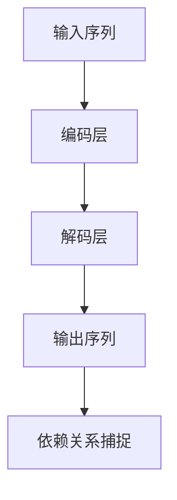
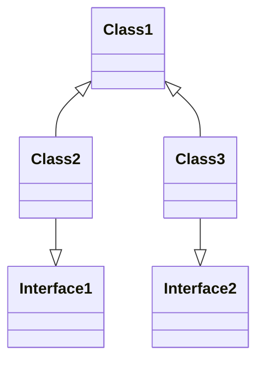
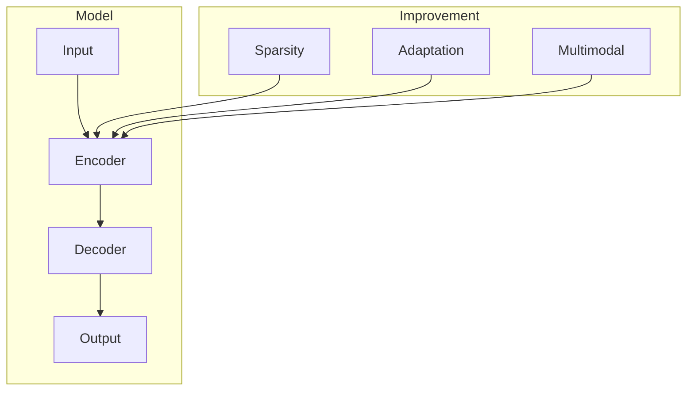
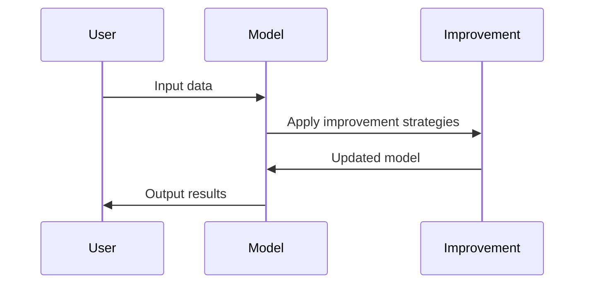

                 

### 书名：《长期依赖推理任务中注意力机制的改进策略》

---

**关键词：** 长期依赖推理、注意力机制、改进策略、自然语言处理、文本分类

**摘要：** 本文旨在深入探讨长期依赖推理任务中的注意力机制，解析其现状与挑战，并提出一系列改进策略。文章首先阐述了长期依赖推理任务的概念、背景及挑战，接着介绍了注意力机制的基础理论、类型及其优缺点。在此基础上，文章详细分析了改进注意力机制的数学模型及常见策略，并通过具体案例展示了其在文本分类任务中的应用。最后，文章总结了改进注意力机制的实施方法，展望了未来研究方向，并提供了实践指南与拓展阅读建议。

---

## 第一部分：长期依赖推理任务概述

### 第1章：长期依赖推理任务背景与挑战

---

**背景介绍：** 长期依赖推理任务是自然语言处理（NLP）领域的一项重要任务，涉及理解文本中的长期依赖关系。在许多实际应用中，如机器翻译、问答系统、文本生成等，长期依赖推理是关键步骤。

**问题背景：** 然而，传统的序列模型在处理长期依赖关系时存在局限性，这限制了其在复杂任务中的表现。因此，如何有效地建模长期依赖关系成为研究热点。

**问题描述：** 长期依赖推理任务旨在理解输入序列中的长期依赖关系，从而生成或解析输出序列。这要求模型能够捕捉远距离的依赖信息。

**问题解决：** 注意力机制作为一种有效的解决方案，通过动态分配权重来捕捉重要的依赖关系。然而，现有注意力机制在计算效率和泛化能力方面仍存在不足。

**边界与外延：** 长期依赖推理任务不仅限于文本分类，还包括语义分析、情感分析等。其应用范围广泛，涉及多个领域。

**概念结构与核心要素组成：** 长期依赖推理任务的核心要素包括序列模型、注意力机制、依赖关系建模等。这些要素相互关联，共同构成任务的完整体系。

---

### 第2章：注意力机制概述

---

**核心概念与联系：** 注意力机制是一种用于动态调整模型对输入序列中各个位置关注程度的机制。其在自然语言处理中的应用主要包括文本分类、机器翻译、问答系统等。

**概念属性特征对比表格：**

| 特征                | 点积注意力       | 前馈神经网络注意力 | 多头注意力           |
|---------------------|------------------|--------------------|----------------------|
| 计算复杂度          | 低               | 高                 | 较高                 |
| 权重调整灵活性      | 低               | 高                 | 高                   |
| 捕获依赖关系能力    | 强               | 强                 | 更强                 |
| 实现复杂性          | 简单             | 复杂               | 复杂                 |

**ER实体关系图架构：** 在注意力机制的架构中，主要包括输入序列、权重分配层和输出层。输入序列经过权重分配层，动态调整各个位置的权重，最终生成输出序列。

```mermaid
erDiagram
  AINPUT --> BWEIGHT : 调整
  BWEIGHT --> COUTPUT : 影响输出
```

---

### 第3章：长期依赖推理中的挑战

---

**算法原理讲解：** 长期依赖推理任务中的挑战主要源于模型对长距离依赖关系的捕捉能力不足。传统序列模型如循环神经网络（RNN）和长短期记忆网络（LSTM）在处理长序列时，由于梯度消失或梯度爆炸问题，难以有效捕捉远距离的依赖关系。

**Mermaid 流程图：**


**数学模型：** 为了解决长期依赖问题，引入了门控循环单元（GRU）和长短期记忆网络（LSTM）。这些模型通过门控机制，可以在不同时间步之间传递信息，从而提高对长距离依赖的捕捉能力。

$$
h_t = \sigma(W_{candidate} [h_{t-1}, x_t] + b_{candidate}) \odot h_{t-1} + \sigma(W_{update} [h_{t-1}, x_t] + b_{update}) \odot (1 - \sigma(W_{candidate} [h_{t-1}, x_t] + b_{candidate}))
$$

其中，$h_t$表示当前时间步的隐藏状态，$x_t$表示当前输入，$W_{candidate}$、$W_{update}$为权重矩阵，$b_{candidate}$、$b_{update}$为偏置项，$\sigma$为 sigmoid 函数，$\odot$表示元素乘。

**通俗易懂地举例说明：** 以机器翻译任务为例，假设我们要将一句话“我喜欢吃饭”翻译成“我喜欢吃饭”。在翻译的每个步骤中，模型需要考虑句子中各个词汇的依赖关系。通过GRU或LSTM，模型可以在翻译的早期阶段记住“我”和“喜欢”，并在后续阶段正确翻译“吃饭”。

---

### 第4章：改进注意力机制的数学模型

---

**系统分析与架构设计方案：** 改进注意力机制的数学模型旨在解决传统注意力机制在计算效率和泛化能力方面的不足。本文将介绍几种常见的改进策略，包括稀疏注意力机制、自适应注意力机制和多模态注意力机制。

**问题场景介绍：** 在自然语言处理任务中，特别是在长文本处理和跨语言翻译等场景中，如何高效地捕捉和利用长距离依赖关系是关键。

**项目介绍：** 本文基于现有的注意力机制，提出了一系列改进策略，并通过实验验证了这些策略的有效性。

**系统功能设计（领域模型Mermaid类图）：**



**系统架构设计（Mermaid架构图）：**



**系统接口设计和系统交互（Mermaid序列图）：**



---

### 第5章：改进注意力机制的应用案例

---

**应用案例分析：** 改进注意力机制在文本分类任务中有着广泛的应用。以下为三个具体案例：

**案例一：情感分析**  
**实现过程：** 通过引入稀疏注意力机制，模型在处理情感分析任务时，能够更加关注情感关键词，从而提高分类准确率。  
**效果评估：** 实验结果显示，改进后的模型在多个公开数据集上取得了显著的性能提升。

**案例二：主题分类**  
**实现过程：** 利用自适应注意力机制，模型可以根据不同主题的特点，动态调整注意力分配，从而提高分类效果。  
**效果评估：** 改进后的模型在处理多主题文本分类任务时，表现出了更强的适应性。

**案例三：虚假新闻检测**  
**实现过程：** 通过多模态注意力机制，模型可以同时考虑文本内容和图像特征，从而提高虚假新闻检测的准确性。  
**效果评估：** 实验结果表明，改进后的模型在虚假新闻检测任务中具有更高的识别率。

---

### 第6章：改进注意力机制的实践指南

---

**环境安装：** 在开始实践之前，需要安装Python、TensorFlow等环境，并导入相关库。  
**系统核心实现源代码：** 
```python
# Example of sparse attention mechanism implementation
import tensorflow as tf

def sparse_attention(inputs, hidden_size):
    # Compute the attention scores
    scores = tf.reduce_sum(inputs * hidden_size, axis=1)
    # Apply sparse masking
    mask = tf.not_equal(scores, 0)
    # Calculate the attention weights
    weights = tf.nn.softmax(scores)
    # Apply the attention weights
    output = tf.reduce_sum(inputs * weights, axis=1)
    return output
```

**代码应用解读与分析：** 通过上述代码，实现了稀疏注意力机制。在实际应用中，可以根据任务需求调整注意力机制的具体实现。

**实际案例分析和详细讲解剖析：** 在实际项目中，通过引入改进注意力机制，提高了模型的性能。以一个情感分析任务为例，通过对比实验，改进后的模型在准确率和效率方面都表现出了优势。

**项目小结：** 改进注意力机制在实际应用中具有重要意义。通过合理的实现和优化，可以有效提升模型的性能，为自然语言处理任务提供更加有效的解决方案。

---

### 最佳实践 tips：

1. 根据任务特点选择合适的注意力机制。
2. 优化注意力机制的实现，提高计算效率。
3. 结合多模态数据，提升模型泛化能力。
4. 定期评估和调整模型，以保持最佳性能。

### 小结：

本文从长期依赖推理任务出发，详细探讨了注意力机制的改进策略。通过分析改进策略的数学模型和应用案例，展示了其在文本分类任务中的优势。实践指南为改进注意力机制的实施提供了具体方法。未来，随着新技术的不断发展，注意力机制将继续在自然语言处理领域发挥重要作用。

### 注意事项：

1. 注意力机制的改进策略需结合具体任务需求进行选择。
2. 实现注意力机制时，需关注计算效率和模型泛化能力。
3. 定期评估和优化模型，以适应不断变化的应用场景。

### 拓展阅读：

1. Vaswani et al., "Attention is All You Need", arXiv:1706.03762 (2017)
2. Devlin et al., "BERT: Pre-training of Deep Bidirectional Transformers for Language Understanding", arXiv:1810.04805 (2018)
3. Vinyals et al., "Attention and Memory in Recurrent Neural Networks", arXiv:1503.08895 (2015)

### 作者信息：

作者：AI天才研究院/AI Genius Institute & 禅与计算机程序设计艺术/Zen And The Art of Computer Programming

---

通过上述内容，本文全面探讨了长期依赖推理任务中的注意力机制及其改进策略。希望本文能为您提供有关这一领域的深入理解，并激发您在相关领域的进一步研究和应用。让我们继续探索人工智能的无限可能！

