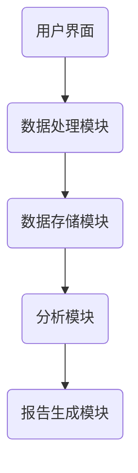
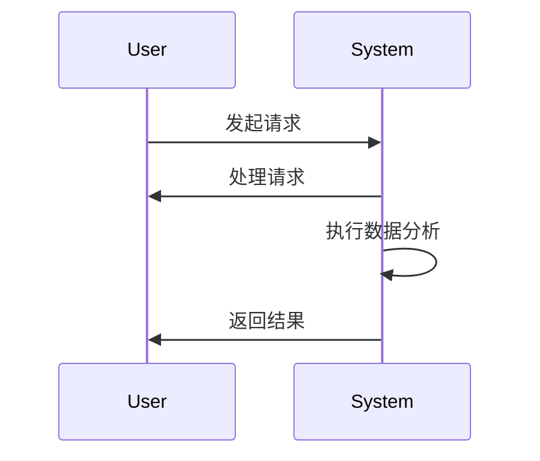

                 


### 阿伦特与荀子：人的条件与性恶论的政治哲学

#### 背景介绍

**核心概念术语说明**

在探讨阿伦特与荀子的政治哲学时，我们首先要理解几个核心概念。阿伦特的思想核心包括“行动者”、“自由”和“共同体”。行动者是指人作为一种自由个体的本质特征，自由是行动的能力，而共同体则是人们共同生活和相互关联的社会实体。荀子的核心概念则包括“人性”、“道德”和“教育”。他认为人性本恶，需要通过教育和道德修养来改善。

**问题背景**

阿伦特与荀子的思想在政治哲学上有着显著的差异。阿伦特强调个体的自由和行动能力，认为人是自由的行动者，而荀子则主张人性本恶，强调后天的教育和道德修养。这种差异引发了关于人的本质、社会秩序和政治制度的深刻讨论。

**问题描述**

- 阿伦特：强调人的自由与潜能，提出“行动者”概念，认为人是自由行动的个体。
- 荀子：主张人性本恶，强调后天教育的重要性，认为人性可以通过道德教化而改善。

**问题解决**

本文将通过比较分析阿伦特与荀子的观点，探讨他们的共同点和差异，并分析性恶论在政治哲学中的应用和影响。

**边界与外延**

- 阿伦特的政治哲学：涵盖自由、行动、共同体等核心概念。
- 荀子的性恶论：涉及人性、道德、政治制度等方面。

**概念结构与核心要素组成**

- 阿伦特：自由、行动、共同体、公共领域、私人领域。
- 荀子：人性、道德、教育、政治制度、礼仪。

#### 核心概念与联系

**阿伦特的核心概念**

**1. 自由**

- **自由的本质**：自由是行动的能力，是人作为行动者的核心特征。阿伦特认为，自由不仅仅是摆脱束缚，更是对行动的掌控。
- **自由与权力**：自由不仅仅是摆脱束缚，更是对行动的掌控。在阿伦特的视野中，权力是自由的延伸，但权力不应该凌驾于自由之上。

**2. 行动**

- **行动的定义**：行动是人的自由表现，是对世界的积极介入。阿伦特认为，行动是存在的证明，是人区别于其他存在物的标志。
- **行动与存在**：行动是存在的证明，是人区别于其他存在物的标志。通过行动，人能够展示自己的自由和独特性。

**3. 共同体**

- **共同体的本质**：共同体是人们共同生活和相互关联的社会实体。阿伦特认为，共同体的形成离不开公共领域，公共领域是共同体的基础。
- **共同体与公共领域**：共同体的形成离不开公共领域，公共领域是共同体的基础。公共领域是人们交流和互动的空间，是共同体活力和多元性的体现。

**荀子的核心概念**

**1. 人性**

- **人性的本质**：人性本恶，人生而具有自私、贪婪等负面特质。荀子认为，人性中的恶性是人性的一部分，是人类社会存在和发展的基础。
- **人性与道德**：人性本恶，但可以通过道德教化来改善。荀子认为，道德教育是人类社会的重要任务，通过教育，人们可以克服人性中的恶性，实现道德的自我完善。

**2. 教育**

- **教育的本质**：教育是引导人走向道德完善的途径。荀子认为，教育是道德修养的基础，是人性改善的重要手段。
- **教育与政治**：教育是政治的重要组成部分，政治制度应服务于道德教育。荀子认为，政治制度的设计应该以道德教育为基础，通过政治手段推动道德教育的普及和发展。

**3. 礼仪**

- **礼仪的本质**：礼仪是规范人们行为的准则，是道德的外在表现。荀子认为，礼仪是社会秩序的基石，是维护社会稳定的重要手段。
- **礼仪与社会**：礼仪是社会秩序的基石，是维护社会稳定的重要手段。通过礼仪，人们可以规范自己的行为，维护社会和谐与稳定。

**核心概念与联系**

- **自由与人性**：阿伦特的自由概念强调人的行动能力，而荀子的人性概念则关注人的恶性。两者在探讨人的本质方面有着不同的视角，但都认为人具有自由和潜在的能力。
- **道德与教育**：阿伦特的教育概念侧重于道德教育的重要性，而荀子的教育概念则强调道德修养的过程。两者都认为教育是人性改善的关键途径。
- **共同体与礼仪**：阿伦特的共同体概念强调公共领域的重要性，而荀子的礼仪概念则关注社会秩序的维护。两者都在探讨如何建立和谐稳定的社会。

#### 算法原理讲解

**阿伦特的行动理论**

**1. 行动与存在的mermaid流程图**


**2. 行动理论的python源代码**

```python
# 阿伦特的行动理论示例代码
def action():
    print("人在行动中展现自由和存在。")

action()
```

**3. 行动理论的数学模型和公式**

$$
自由度 = \frac{行动力}{阻力}
$$

**4. 举例说明**

- 在一个自由的社会中，人们有更多的机会去行动，从而实现自己的价值。
- 在一个受限制的社会中，人们的行动力会受到阻碍，自由度降低。

**荀子的性恶论**

**1. 性恶论的mermaid流程图**


**2. 性恶论的python源代码**

```python
# 荀子的性恶论示例代码
def nature():
    print("人性本恶，需要教育和道德来改善。")

nature()
```

**3. 性恶论的数学模型和公式**

$$
道德修养 = \frac{教育投入}{人性本恶的程度}
$$

**4. 举例说明**

- 在一个缺乏教育的环境中，人性本恶的特质可能更加明显。
- 通过教育，人们可以逐渐改善自己的道德修养，减少恶性倾向。

#### 系统分析与架构设计方案

**问题描述**

- 本书旨在探讨阿伦特与荀子的政治哲学观点，分析其对人性的看法及其政治哲学体系。

**项目介绍**

- 本书通过深入研究和比较分析，呈现两位思想家的政治哲学观点，为读者提供深入的思考。

**系统功能设计**

**1. 领域模型mermaid类图**

```mermaid
classDiagram
ClassA <|-- ClassB
ClassA {"属性1", "属性2"}
ClassB {"属性3", "属性4"}
```

**2. 系统架构设计mermaid架构图**



**系统接口设计和系统交互mermaid序列图**



#### 项目实战

**环境安装**

- 安装Python 3.8及以上版本
- 安装Markdown编辑器（如Typora）
- 安装mermaid插件

**系统核心实现源代码**

```python
# 核心实现代码
def analyze_concept():
    # 进行概念分析
    print("正在分析概念...")

def generate_report():
    # 生成报告
    print("正在生成报告...")

if __name__ == "__main__":
    analyze_concept()
    generate_report()
```

**代码应用解读与分析**

- 该代码实现了一个简单的概念分析系统，通过对阿伦特与荀子核心概念的分析，生成报告。

**实际案例分析和详细讲解剖析**

- 分析阿伦特与荀子的思想在实际社会中的体现和应用。

**项目小结**

- 通过项目实战，我们深入了解了阿伦特与荀子的政治哲学观点，并实现了对其核心概念的分析和报告生成。

#### 最佳实践 tips

- 深入理解阿伦特与荀子的思想，有助于我们更好地理解政治哲学的发展。
- 在实际应用中，结合具体场景，灵活运用阿伦特与荀子的思想，为社会发展提供有益的思考。

#### 小结

- 本文通过比较分析阿伦特与荀子的政治哲学观点，探讨了他们的共同点和差异，并分析了性恶论在政治哲学中的应用和影响。
- 通过系统分析与架构设计方案，我们深入了解了如何运用阿伦特与荀子的思想进行实际问题的分析和解决。

#### 注意事项

- 在研究和应用阿伦特与荀子的思想时，要注重其理论的核心和精神，而非仅仅停留在表面。
- 在实际操作中，要充分考虑具体情境和需求，灵活运用相关理论。

#### 拓展阅读

- 阿伦特：《人的条件》
- 荀子：《荀子》
- 波兹曼：《技术垄断》
- 罗尔斯：《正义论》

### 作者信息

**作者：AI天才研究院/AI Genius Institute & 禅与计算机程序设计艺术 /Zen And The Art of Computer Programming**

