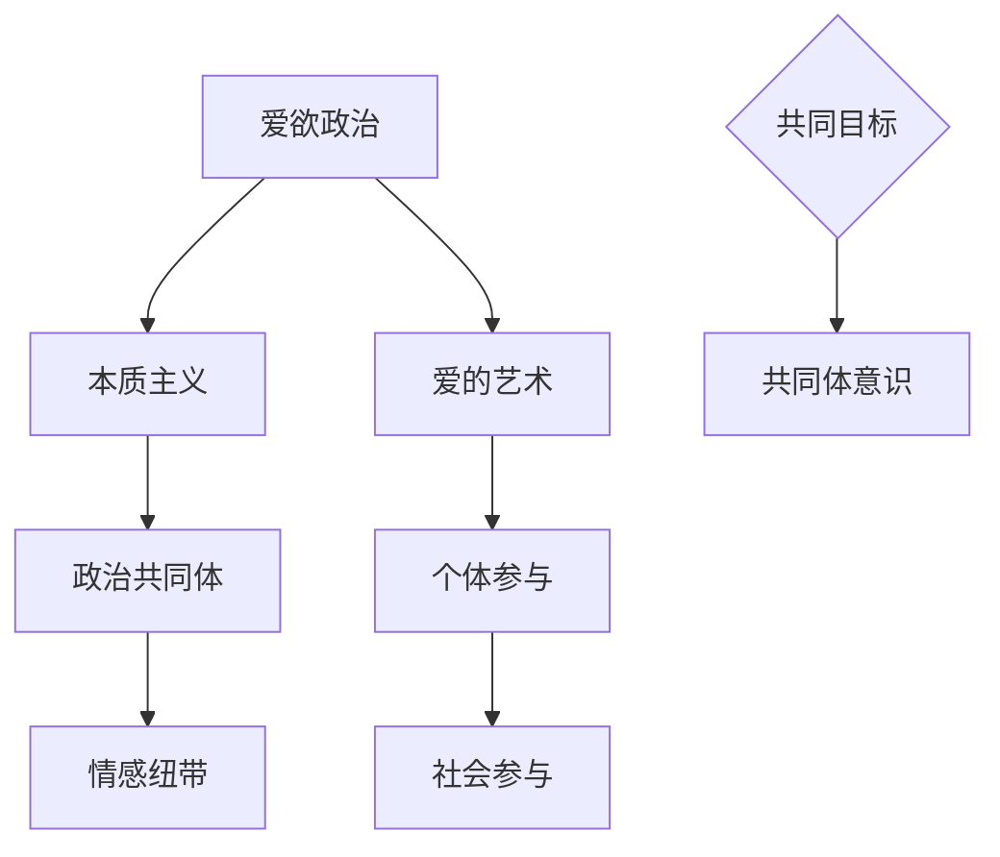
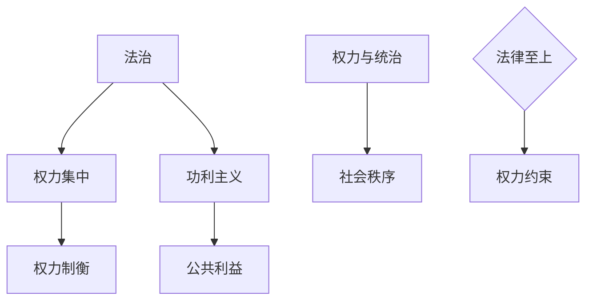

                 

## 引言

### 1.1 问题背景与哲学宣言

在当今世界，政治哲学的发展面临着诸多困境与挑战。传统政治哲学的理论框架在现代社会中逐渐显露出其局限性和不足之处，无法有效应对复杂多变的全球政治格局。在这种背景下，对新的政治哲学思想的探讨和借鉴显得尤为重要。本文旨在通过对阿兰·巴迪欧（Alain Badiou）的哲学宣言与韩非法家思想的深入分析，探索两种思想在当代政治哲学中的地位与影响，以期对解决当代政治困境提供新的思路。

阿兰·巴迪欧是一位法国哲学家，其哲学思想以其独特的创新性和深刻性著称。巴迪欧的核心哲学思想包括“爱欲政治”、“本质主义”和“爱的艺术”，这些思想在当代政治哲学中具有重要的地位。他的哲学宣言试图打破传统政治哲学的框架，提出一种全新的政治哲学范式。

韩非是中国古代著名的法家思想家，他的法家思想对中国的政治体制和社会治理产生了深远的影响。韩非的核心概念包括“法治”、“功利主义”和“权力与统治”，这些思想在中国历史上具有重要的地位。尽管法家思想与西方哲学传统存在明显的差异，但其在政治哲学上的价值依然不容忽视。

### 1.2 当代政治哲学的困境与挑战

当代政治哲学面临着诸多困境与挑战。首先，全球化进程的加速使得国家之间的政治互动更加复杂，传统政治哲学的理论框架难以应对这种新的全球政治格局。其次，现代社会的高度信息化和多元化使得政治哲学的核心问题变得更加复杂，如何处理政治多元化与政治稳定之间的关系成为一大挑战。

此外，当代政治哲学还面临着价值多元化和相对主义的冲击。不同文化和价值观的碰撞使得政治哲学的传统基础受到质疑，如何在这种多元文化的背景下构建政治哲学的新体系成为亟待解决的问题。最后，现代社会的不平等和冲突问题也对政治哲学提出了新的要求，如何通过政治哲学的思想来应对社会不平等和冲突成为政治哲学研究的重要内容。

### 1.3 阿兰·巴迪欧的哲学宣言

阿兰·巴迪欧的哲学宣言以其独特的创新性和深刻性在当代哲学界引起了广泛关注。巴迪欧的哲学思想以其对传统政治哲学的批判和对新政治哲学的探索而著称。他的核心哲学思想包括“爱欲政治”、“本质主义”和“爱的艺术”。

**爱欲政治**：巴迪欧认为，政治不仅仅是权力的争夺，更是一种对爱欲的追求。爱欲政治强调个体之间的情感联系和共同体意识，主张通过爱欲来构建新的政治共同体。这种政治哲学试图打破传统政治哲学中权力至上的观念，强调个体情感和政治参与的重要性。

**本质主义**：巴迪欧的本本质主义强调对事物本质的探索和认识。他认为，本质是超越现象的，是事物真正的根源。本质主义在政治哲学中的应用，意味着对政治现象背后本质的追问，以揭示政治活动的真正动机和目标。

**爱的艺术**：巴迪欧认为，爱是一种艺术，是一种通过情感和理性的结合来实现的行动。爱的艺术强调个体之间的情感交流和共同成长，是一种超越个人主义和自我中心主义的情感体验。在政治哲学中，爱的艺术被视为一种推动社会进步和和谐发展的力量。

巴迪欧的哲学宣言在当代政治哲学中具有重要的地位和影响。他的思想为当代政治哲学提供了一种全新的视角，挑战了传统政治哲学的框架，为应对当代政治困境提供了新的思路和方法。

### 1.4 韩非的法家思想

韩非是中国古代著名的法家思想家，其法家思想对中国的政治体制和社会治理产生了深远的影响。韩非的法家思想主要包括“法治”、“功利主义”和“权力与统治”三大核心概念。

**法治**：韩非认为，法治是治国理政的根本。他主张通过法律来规范社会秩序，使人们遵守共同的规则。法治不仅是一种政治制度，更是一种社会治理理念。韩非认为，只有通过法治，才能实现社会的长治久安。

**功利主义**：韩非的功利主义强调实用主义和功利性。他认为，政治活动应该以实现国家和民众的最大利益为目标，而不是追求抽象的道德原则。功利主义在政治哲学中的应用，意味着政治决策应该基于实际效果和利益考量，以实现最大化的社会效益。

**权力与统治**：韩非认为，权力是统治的基础，统治的目的是为了维护社会秩序和实现公共利益。他主张通过强大的中央集权来确保统治的有效性和稳定性。韩非的权力与统治观念，强调权力的集中和权力的合法性，为中国的政治体制提供了重要的理论依据。

韩非的法家思想在中国历史上具有重要的地位。他的思想不仅在理论上对中国的政治体制产生了深远影响，还在实践中被广泛应用。尽管法家思想在现代社会中受到一定的批评和质疑，但其在政治哲学上的价值依然不容忽视。

### 1.5 边界与外延

阿兰·巴迪欧的哲学思想与韩非法家思想在边界与外延方面存在一定的交叉和联系。尽管两种思想在哲学基础、理论框架和应用领域上存在差异，但在某些方面，它们也存在共同点。

首先，两种思想都强调对政治现象背后本质的追问。巴迪欧的爱欲政治和韩非的法治都试图揭示政治活动的真实动机和目标。其次，两种思想都关注社会秩序的构建和稳定。巴迪欧的共同体意识和韩非的中央集权都旨在实现社会的长治久安。

然而，两种思想在边界与外延方面也存在明显的差异。巴迪欧的哲学宣言更注重个体情感和政治参与，强调爱欲和共同体的重要性；而韩非法家思想则更注重法律和权力的集中，强调法治和统治的有效性。

当代政治哲学的理论框架与实践意义，需要在吸收巴迪欧和韩非的思想精髓的基础上，构建一种更为全面和有效的政治哲学体系，以应对当代政治困境和挑战。

### 1.6 核心概念与联系

在当代政治哲学的探讨中，阿兰·巴迪欧的“爱欲政治”与韩非的“法治”无疑是两个关键的概念。这两个概念在本质、属性和特征上既有相似之处，也存在明显的区别。

**爱欲政治**：巴迪欧的“爱欲政治”强调政治行动中情感因素的重要性。它不仅关注权力和利益的争夺，更关注个体之间的情感联系和共同体意识。爱欲政治主张通过情感纽带和共同的目标来构建政治共同体，强调个体在政治生活中的主动参与和情感投入。

**法治**：韩非的“法治”则强调法律在社会治理中的核心作用。他认为，法律是维护社会秩序和实现公共利益的基石。法治强调权力的规范化，主张通过法律来约束权力的滥用，保障公民的权益。

**本质与特征对比**：

- **本质**：爱欲政治关注政治行动中的情感因素，强调个体之间的情感联系；法治则关注法律在治理中的核心地位，强调权力的规范化和公共利益的实现。
- **属性**：爱欲政治具有情感性和共同体性，强调个体情感和政治参与的紧密结合；法治则具有规范性和约束性，强调法律的普遍适用和权力运行的透明度。
- **特征**：爱欲政治强调政治行动中的情感表达和共同体意识，注重个体在政治生活中的情感体验；法治强调法律的权威性和公共利益的实现，注重权力运行的规范化和透明度。

尽管爱欲政治和法治在本质、属性和特征上存在差异，但它们在政治哲学中都有着重要的地位和作用。爱欲政治为政治参与提供了情感动力，强调个体在政治生活中的主动性和情感投入；法治则为社会秩序提供了法律保障，强调权力运行的规范化和公共利益的实现。

在当代政治哲学的理论框架中，爱欲政治和法治可以被视为两种互补的政治理念。爱欲政治强调个体情感和政治参与的紧密结合，有助于增强政治共同体的凝聚力和活力；法治则强调法律的权威性和公共利益的实现，有助于维护社会秩序和保障公民权益。

综上所述，巴迪欧的“爱欲政治”与韩非的“法治”在当代政治哲学中具有核心地位。通过对这两个概念的本质、属性和特征的对比分析，我们可以更深入地理解它们在政治哲学中的作用和意义。这为构建一种更为全面和有效的政治哲学体系提供了理论基础和实践指导。

### 1.7 阿兰·巴迪欧哲学与韩非法家思想的交叉点

在深入探讨阿兰·巴迪欧的哲学思想与韩非法家思想的交叉点时，我们可以发现，这两种看似截然不同的政治哲学体系，在某些核心概念上却有着惊人的相似之处。

**1.7.1 爱欲政治与法治的交汇**

巴迪欧的“爱欲政治”与韩非的“法治”在政治哲学上有着深刻的交汇点。巴迪欧认为，爱欲是一种超越个体利益的政治力量，它能够激发个体对共同体和公共利益的无私奉献。而韩非则主张通过法治来确保社会秩序和公共利益的最大化。两者都强调在政治活动中，应该超越狭隘的个人利益，追求更高的共同体利益。

**1.7.2 本质主义与功利主义的互补**

巴迪欧的“本质主义”强调对事物本质的探索，主张通过认识事物的本质来指导政治实践。而韩非的“功利主义”则强调实际效果和利益的最大化。在政治哲学中，本质主义和功利主义并不是对立的，而是可以互补的。本质主义为政治实践提供了理论基础，而功利主义则确保政治决策的实际效果。两者的结合，可以使得政治哲学既具有理论深度，又能够应对现实问题。

**1.7.3 权力与统治的共同关注**

巴迪欧和韩非都高度重视权力和统治问题。巴迪欧认为，权力是政治的核心，但权力必须受到爱欲政治的约束，以防止权力滥用。而韩非则主张通过法治来确保权力的规范运行。两者都认为，权力和统治是实现公共利益和社会稳定的关键。

**1.7.4 共同点**

- **共同体意识**：巴迪欧和韩非都强调共同体意识，认为政治活动应该以共同体的利益为目标。
- **超越个人主义**：两者都反对纯粹的个人主义，主张在政治活动中超越个人的私利，追求更广泛的公共利益。
- **社会秩序**：巴迪欧和韩非都认为，社会秩序是实现政治目标的基础，强调通过不同的手段来维护社会秩序。

通过分析阿兰·巴迪欧的哲学思想与韩非法家思想的交叉点，我们可以看到，尽管两种哲学体系有着不同的理论基础和理论框架，但它们在政治哲学的核心概念上却有着深刻的相似之处。这种交叉点为当代政治哲学的发展提供了新的思路和可能性。

### 1.8 当代政治哲学的理论框架与实践意义

结合阿兰·巴迪欧的哲学思想和韩非法家思想，我们可以构建一个更为全面和有效的当代政治哲学理论框架。这个框架不仅能够整合两种思想的优点，还能够应对现代社会复杂多变的政治挑战。

**1.8.1 爱欲政治与法治的融合**

在理论框架中，我们可以将巴迪欧的爱欲政治与韩非的法治进行融合。爱欲政治提供了一种超越个人利益的共同体意识，而法治则提供了权力运行的规范和保障。通过将两者结合，我们可以构建一个既强调情感纽带又确保权力规范运行的治理模式。

**1.8.2 本质主义与功利主义的互补**

巴迪欧的本质主义与韩非的功利主义也可以在理论框架中实现互补。本质主义提供了对事物本质的深入理解，而功利主义则注重实际效果和利益的最大化。通过将两者结合，我们可以形成一个既具有理论深度又能够应对现实问题的治理理念。

**1.8.3 权力与统治的共同关注**

在理论框架中，权力和统治问题被置于核心位置。通过吸收巴迪欧和韩非的思想，我们可以形成一套既强调权力约束又注重权力有效运行的治理体系。这种体系不仅能够防止权力滥用，还能够确保权力为实现公共利益和社会稳定服务。

**实践意义**

这个融合了巴迪欧哲学和韩非法家思想的理论框架在当代政治哲学中具有重要的实践意义。首先，它提供了一种全新的政治哲学视角，有助于我们理解和应对现代社会的政治挑战。其次，它强调了共同体意识和社会公共利益的重要性，有助于构建一个更加和谐和稳定的社会。最后，它提供了一套具体的治理模式，可以为政治实践提供指导。

总之，通过结合阿兰·巴迪欧的哲学思想和韩非法家思想，我们可以构建一个更为全面和有效的当代政治哲学理论框架。这个框架不仅能够整合两种思想的优点，还能够为应对现代社会复杂多变的政治挑战提供新的思路和可能性。

## 第2章：阿兰·巴迪欧的哲学思想

### 2.1 爱欲政治

**定义与内涵**

爱欲政治是阿兰·巴迪欧哲学思想中的一个核心概念，它超越了传统政治哲学中对权力和利益的狭隘理解，强调政治行动中的情感因素和共同体意识。巴迪欧认为，爱欲是一种超越个体利益的情感力量，它能够激发个体对共同体和公共利益的无私奉献。

在爱欲政治中，爱欲不仅仅指爱情或性的情感，而是一种更广义的情感体验，包括亲情、友情、集体感等。巴迪欧认为，爱欲政治的核心在于个体之间的情感联系和共同体的构建。通过爱欲，个体能够超越自我，形成一个更广泛的政治共同体。

**政治哲学意义**

爱欲政治在当代政治哲学中具有重要的意义。首先，它提供了一种新的政治参与模式，强调个体在政治生活中的情感投入和积极参与。这种模式有助于打破传统政治参与中权力和利益的狭隘视野，使政治参与更加多元和包容。

其次，爱欲政治强调了共同体意识的重要性。在现代社会中，个体往往被孤立和疏离，而爱欲政治试图通过情感纽带重新连接个体，构建一个更紧密和和谐的政治共同体。这种共同体意识有助于增强社会凝聚力和稳定性，为政治治理提供坚实的基础。

此外，爱欲政治还提供了对权力和统治的新思考。巴迪欧认为，爱欲政治能够约束权力滥用，防止权力异化为一种纯粹的统治工具。通过情感纽带，权力被置于共同体和公共利益的服务之下，从而实现更公正和公平的政治治理。

**具体例子**

爱欲政治在现实中有着丰富的具体例子。例如，在社会运动和政治抗议中，个体往往通过情感共鸣和共同的目标形成强大的集体力量。这种情感纽带不仅激发了个体参与政治行动的积极性，还增强了集体行动的效果。

另一个例子是社区组织和社会互助。在社区中，个体通过情感纽带建立互助关系，共同解决社会问题。这种爱欲政治的实践不仅改善了社区的生活环境，还促进了社会凝聚力和共同体意识的增强。

**总结**

爱欲政治是阿兰·巴迪欧哲学思想中的一个重要概念，它强调政治行动中的情感因素和共同体意识。在当代政治哲学中，爱欲政治具有重要的意义，它提供了一种新的政治参与模式，强调了共同体意识的重要性，并为权力和统治提供了新的思考。通过具体例子，我们可以看到爱欲政治在现实中的广泛应用和深远影响。

### 2.2 本质主义

**起源与发展**

本质主义是阿兰·巴迪欧哲学思想中的一个重要组成部分，其思想渊源可以追溯到西方哲学的传统。本质主义主张对事物本质的探索和认识，认为本质是事物真正的根源，超越现象和表象。巴迪欧在本质主义的框架下，对传统哲学进行了批判和重构。

在西方哲学中，本质主义可以追溯到柏拉图和亚里士多德的思想。柏拉图认为，本质是理念世界的真实存在，而现象世界只是理念的影子。亚里士多德则认为，本质是事物的基本属性和特征，是事物之所以为该事物的原因。巴迪欧在继承这些思想的基础上，提出了自己独特的本质主义理论。

**核心概念**

巴迪欧的本质主义强调对事物本质的探索和认识。他认为，本质是超越现象的，是事物真正的根源。在政治哲学中，巴迪欧的本质主义主张通过认识政治现象背后的本质，来揭示政治活动的真正动机和目标。

巴迪欧的本质主义还强调本质的不可重复性和独特性。他认为，每个事件和现象都有其独特的本质，这种本质是不可重复的，也是无法被完全把握的。在政治哲学中，这意味着政治活动中的每个决定和行动都有其独特的背景和原因，无法简单地用普遍的原则来解释。

**政治哲学应用**

巴迪欧的本质主义在政治哲学中具有重要的应用价值。首先，它提供了一种分析政治现象的新方法，使人们能够从现象背后看到本质，从而更深入地理解政治活动的本质和意义。

其次，巴迪欧的本质主义强调了政治活动的独特性和复杂性。他认为，每个政治事件都有其独特的背景和原因，无法简单地用传统的政治理论来解释。这种观点有助于我们理解和应对现代社会的复杂政治局面。

此外，巴迪欧的本质主义还挑战了传统政治哲学的框架。他主张打破传统哲学中对本质和现象的二元对立，认为本质和现象是相互关联和相互作用的。这种观点为政治哲学的发展提供了新的思路和方法。

**总结**

本质主义是阿兰·巴迪欧哲学思想中的一个核心概念，它强调对事物本质的探索和认识。在政治哲学中，巴迪欧的本质主义具有重要的应用价值，它提供了一种新的分析政治现象的方法，强调了政治活动的独特性和复杂性，并挑战了传统政治哲学的框架。

### 2.3 爱的艺术

**本质与特点**

爱欲政治中的“爱的艺术”是一个深刻而独特的概念，它超越了传统政治哲学对爱情的狭隘理解。在巴迪欧看来，爱的艺术不仅仅是对爱情的描绘，更是一种通过情感和理性的结合来实现的行动。它强调个体之间的情感交流和共同成长，是一种超越个人主义和自我中心主义的情感体验。

爱的艺术的本质在于其对情感和理性的结合。在巴迪欧的思想中，情感是政治行动的源泉，而理性则为情感提供了指导和框架。通过情感和理性的结合，个体能够超越自我，实现真正的自我认同和共同体的构建。

爱的艺术具有以下几个主要特点：

1. **超越个人主义**：爱的艺术强调个体之间的情感联系和共同成长，使个体能够超越自我中心主义，实现更广泛的共同体意识。
2. **情感交流**：爱的艺术强调个体之间的情感交流，通过情感的分享和共鸣，建立深厚的情感纽带。
3. **理性指导**：爱的艺术并非纯粹的情感放纵，而是通过理性的引导，使情感更加理性和成熟。
4. **共同成长**：爱的艺术是一种共同成长的过程，个体在情感交流中不断学习和进步，实现自我提升和共同体的完善。

**在当代社会中的意义**

在当代社会中，爱的艺术具有重要的意义。首先，它提供了一种新的政治参与模式，使个体能够在政治行动中实现自我认同和共同体意识。通过爱的艺术，个体能够超越个人利益，关注更广泛的社会公共利益。

其次，爱的艺术有助于解决现代社会中的疏离和孤独问题。在现代社会中，个体往往被孤立和疏离，而爱的艺术通过情感纽带重新连接个体，构建一个更紧密和和谐的社会。

此外，爱的艺术还为政治哲学提供了新的视角和方法。它挑战了传统政治哲学中对个人主义和权力至上的狭隘理解，提出了一种更关注情感和共同体意识的政治哲学框架。

**总结**

爱的艺术是阿兰·巴迪欧哲学思想中的一个重要概念，它强调情感和理性的结合，超越个人主义和自我中心主义，实现个体之间的情感交流和共同成长。在当代社会中，爱的艺术具有重要的意义，它提供了一种新的政治参与模式，有助于解决疏离和孤独问题，并为政治哲学提供了新的视角和方法。

### 2.4 法治

**基本概念与内涵**

法治是阿兰·巴迪欧哲学思想中的一个核心概念，它强调法律在社会治理中的核心地位。在巴迪欧看来，法治不仅仅是维持社会秩序的工具，更是一种政治理念和社会治理模式。

法治的基本概念包括几个关键方面：

1. **法律至上**：法治主张法律在社会治理中的最高地位，所有公民和机构都必须遵守法律。
2. **权力制约**：法治通过法律来规范和制约权力，防止权力滥用和腐败。
3. **公平正义**：法治追求社会的公平正义，保障公民的合法权益。
4. **普遍适用**：法治要求法律普遍适用，不论身份和地位，所有人都必须遵守相同的法律。

在内涵上，法治不仅是一种制度安排，更是一种社会治理理念。它强调通过法律来规范社会行为，实现社会秩序和公平正义。

**巴迪欧对法治的解读与应用**

巴迪欧对法治的解读具有独特的哲学视角。他认为，法治不仅是维持社会秩序的工具，更是一种超越个人利益和权力争夺的政治理念。在巴迪欧的法治观念中，法律不仅仅是规则，更是一种价值观和道德准则。

巴迪欧主张，法治应该建立在一种对人类本质的深刻理解之上。他认为，人类本质中包含了一种对公平正义的追求，这种追求可以通过法治来实现。通过法治，社会可以建立一个公正、平等和稳定的社会秩序。

在应用方面，巴迪欧强调法治在政治生活中的重要性。他认为，法治是实现政治共同体和谐发展的基础。通过法治，政治共同体可以避免权力滥用和腐败，实现社会的长治久安。

**法治在当代政治哲学中的意义**

巴迪欧的法治观念在当代政治哲学中具有重要的意义。首先，它提供了一种新的政治治理模式，强调通过法律来规范社会行为，实现社会秩序和公平正义。

其次，巴迪欧的法治观念有助于解决当代政治中的许多问题，如权力滥用、腐败和不公平。通过法治，社会可以建立一个透明、公正和有效的治理体系，保障公民的合法权益。

此外，巴迪欧的法治观念还为全球化背景下的政治哲学提供了新的思路。在全球化进程中，不同国家和文化之间的法律体系和价值观存在差异，巴迪欧的法治观念提供了一种超越文化和国家界限的政治哲学框架，有助于构建一个更加和谐和稳定的全球政治秩序。

**总结**

法治是阿兰·巴迪欧哲学思想中的一个重要概念，它强调法律在社会治理中的核心地位，通过法律来规范社会行为，实现社会秩序和公平正义。巴迪欧对法治的解读和应用，为当代政治哲学提供了新的视角和思路，有助于解决当代政治中的问题，推动社会的发展和进步。

### 2.5 功利主义

**起源与发展**

功利主义是政治哲学中的一个重要流派，其起源可以追溯到18世纪英国哲学家边沁（Jeremy Bentham）和密尔（John Stuart Mill）。功利主义主张以最大幸福原则作为道德和法律的评判标准，即行为的价值取决于其产生的幸福总量。

边沁是功利主义的奠基人之一，他提出“最大幸福原则”，认为社会的最终目标是最大化整体幸福。密尔则在边沁的基础上进一步发展了功利主义，强调了个人自由和道德自主性的重要性。

**核心概念**

功利主义的核心概念是“最大幸福原则”，这一原则认为，一个行为的价值取决于它产生的幸福总量。具体来说，功利主义强调以下几点：

1. **幸福总量**：功利主义主张，在评价行为时，应该考虑其产生的总体幸福量，而不是个别利益或快乐。
2. **行为后果**：功利主义强调，行为的道德价值取决于其长期的后果，而不是短期的效果。
3. **权衡利益**：功利主义主张，在做出决策时，应该权衡不同行为带来的幸福量，选择能够产生最大总体幸福的行为。

**韩非对功利主义的批判与改良**

尽管功利主义在西方哲学中具有重要地位，但韩非对其持有批判态度。韩非认为，功利主义的最大幸福原则容易导致权力滥用和道德败坏。他指出，如果仅以幸福总量为评价标准，权力掌握者可能会利用权力追求个人利益，损害社会公共利益。

韩非主张，应该通过法治来规范权力，防止权力滥用。他认为，法治是一种更可靠和有效的社会治理模式，能够保障社会公共利益。在韩非的功利主义改良中，法治成为维护社会公平正义的重要工具。

**改良后的功利主义**

韩非对功利主义的改良，使功利主义更加符合实际社会治理的需要。改良后的功利主义强调以下几点：

1. **法治约束**：改良后的功利主义强调法治的约束作用，认为只有通过法治，才能防止权力滥用，实现社会公平正义。
2. **公共利益**：改良后的功利主义不仅关注个人幸福，更强调维护社会公共利益。在决策时，应该综合考虑个体利益和社会利益，选择能够最大化总体幸福的行为。
3. **长期效应**：改良后的功利主义强调行为的长期后果，认为只有能够持续产生积极影响的行为，才是真正有益的行为。

**总结**

功利主义是政治哲学中的一个重要流派，其起源和发展可以追溯到边沁和密尔。韩非对功利主义持有批判态度，认为其容易导致权力滥用和道德败坏。通过法治的约束作用，韩非对功利主义进行了改良，使其更符合实际社会治理的需要。改良后的功利主义强调法治、公共利益和长期效应，为现代社会治理提供了新的思路和指导。

### 2.6 权力的本质与功能

**权力的本质**

权力是一个复杂且多层次的概念，其本质在不同领域和语境中有不同的理解。在哲学和政治学中，权力的本质通常被描述为一种能力或影响力，通过它可以对他人或集体行为进行指导和控制。

阿兰·巴迪欧认为，权力是一种关系，它涉及主体（权力持有者）和客体（权力作用对象）之间的相互作用。权力的本质不仅仅体现在强制和控制的方面，还包括说服、引导和影响。巴迪欧强调了权力的双重性：一方面，权力具有压迫和统治的潜在力量；另一方面，权力也具有解放和创造的潜力。

**权力的功能**

权力在社会和政治系统中具有多种功能：

1. **秩序维护**：权力通过制定和执行法律、规则，维护社会秩序，确保社会成员的行为符合公共规范。
2. **资源分配**：权力在资源分配中起着关键作用，包括经济资源、政治资源和信息资源等。权力持有者能够决定资源如何分配，影响社会的不平等结构。
3. **决策制定**：权力是决策过程的核心，权力持有者能够在决策中发挥主导作用，影响政策的方向和实施。
4. **社会稳定**：权力通过维持社会结构的稳定，防止社会动荡和冲突，为社会发展提供基础。
5. **变革推动**：权力不仅在维持现状中发挥作用，也有助于推动社会变革，通过权力重组和社会重构，实现社会的进步和发展。

**权力在政治哲学中的思考**

巴迪欧对权力的思考具有深刻的哲学意义。他认为，权力是一种动态的关系，它不是静态的、固定的，而是在不断的斗争和协商中形成和再生产。在巴迪欧的视角中，权力不是一种单一的力量，而是由多种因素和过程共同作用的结果。

**批判性分析**

巴迪欧对权力的批判性分析强调了权力的复杂性和多面性。他指出，权力不仅仅是压迫的工具，也是一种解放的力量。在权力关系中，主体和客体之间的互动不仅仅是单向的，而是双向的。权力的行使不仅受到权力的制约，也受到权力持有者的限制。

**总结**

权力的本质是一种关系，涉及主体和客体之间的相互作用。权力在社会和政治系统中具有多种功能，包括秩序维护、资源分配、决策制定、社会稳定和变革推动。巴迪欧对权力的思考提供了深刻的哲学洞见，强调了权力的复杂性和多面性，为我们理解权力的本质和功能提供了新的视角。

### 2.7 韩非对权力与统治的哲学思考

**权力与统治的概念**

韩非将权力与统治视为政治的核心概念，认为权力是统治的基础，统治的目的是为了维护社会秩序和实现公共利益。他主张通过法治来确保权力的规范运行，防止权力滥用。

韩非认为，权力是一种对社会的控制能力，统治则是权力的具体实施。在韩非的思想中，权力不仅仅是个人或集体的力量，更是一种法律和社会规范的体现。通过法律，权力得以规范化，使其合法性和正当性得到保障。

**权力运行的合法性与正当性**

韩非强调权力运行的合法性与正当性。他认为，只有通过法治，权力才能得到社会普遍认可，从而确保统治的稳定性和有效性。韩非主张，统治者必须依据法律行事，不得滥用权力。法治成为约束权力滥用、维护社会秩序的重要工具。

**权力的制约与平衡**

韩非认为，权力需要受到制约与平衡，防止权力过度集中和滥用。他主张通过设立监督机制和分权制度，确保权力在不同部门之间相互制约，避免权力集中导致的腐败和专权。

**权力与统治的哲学意义**

韩非对权力与统治的哲学思考具有深远的意义。他认为，权力不仅仅是统治的工具，更是社会秩序和公共利益的基础。通过法治来规范权力运行，可以确保社会秩序的稳定和公平正义的实现。

韩非的思想强调了法治在政治中的核心地位，为中国的政治体制和社会治理提供了重要的理论依据。尽管韩非的思想在现代社会中受到一定的批评和质疑，但其在权力与统治问题上的哲学思考依然具有启发意义。

**总结**

韩非对权力与统治的哲学思考，强调了权力的基础地位和统治的合法性。通过法治来规范权力运行，是确保社会秩序和公共利益实现的关键。韩非的思想为中国的政治体制和社会治理提供了重要的理论依据，同时也对现代政治哲学具有重要的启示作用。

### 2.8 巴迪欧哲学思想在政治哲学中的地位与影响

**阿兰·巴迪欧哲学思想在政治哲学中的地位**

阿兰·巴迪欧的哲学思想在当代政治哲学中占据着重要地位。他的思想以其创新性和深刻性，为政治哲学提供了新的视角和方法。巴迪欧的“爱欲政治”、“本质主义”和“爱的艺术”等核心概念，挑战了传统政治哲学的框架，为理解和解决当代政治问题提供了新的思路。

首先，巴迪欧的爱欲政治为政治哲学注入了情感因素，强调个体在政治生活中的情感投入和共同体意识。这一概念打破了传统政治哲学对权力和利益的狭隘理解，使政治哲学更加关注个体的情感体验和社会关系的构建。

其次，巴迪欧的本质主义提供了对政治现象本质的深入探索，使人们能够从现象背后看到政治活动的真正动机和目标。这一思想挑战了传统政治哲学中对现象和本质的二元对立，提出了政治哲学的新框架。

最后，巴迪欧的爱的艺术强调情感和理性的结合，超越个人主义和自我中心主义，为政治哲学提供了新的方法论和伦理基础。这一概念有助于构建一个更和谐和稳定的社会，为政治共同体的发展提供了新的动力。

**巴迪欧哲学思想对当代政治哲学的影响**

巴迪欧的哲学思想对当代政治哲学产生了深远的影响。首先，他的思想为政治哲学注入了新的活力，使人们重新思考政治的本质和目标。通过强调情感、共同体和本质，巴迪欧的思想为政治哲学提供了一种更加全面和多元的视角。

其次，巴迪欧的哲学思想挑战了传统政治哲学的框架，提出了对权力、统治和社会秩序的新理解。他的思想不仅为理解当代政治问题提供了新的工具，也为解决这些问题提供了新的思路和方法。

此外，巴迪欧的哲学思想在全球范围内产生了广泛的影响。他的思想不仅在欧洲哲学界引起了广泛关注，也在全球化的背景下，为不同文化和社会背景下的政治哲学研究提供了新的启示。

**总结**

阿兰·巴迪欧的哲学思想在当代政治哲学中占据着重要地位，其“爱欲政治”、“本质主义”和“爱的艺术”等核心概念，为政治哲学提供了新的视角和方法，对理解和解决当代政治问题产生了深远的影响。

### 2.9 韩非法家思想在政治哲学中的地位与影响

**韩非法家思想在政治哲学中的地位**

韩非法家思想在中国古代政治哲学中占据了重要地位。作为中国古代著名的法家思想家，韩非的哲学思想对中国的政治体制和社会治理产生了深远的影响。韩非法家思想的核心概念包括“法治”、“功利主义”和“权力与统治”，这些思想在中国历史上具有重要的地位。

首先，韩非的“法治”思想主张通过法律来规范社会秩序，强调法律在社会治理中的核心地位。他认为，法律是社会秩序的基石，只有通过法治，才能实现社会的长治久安。

其次，韩非的“功利主义”强调实际效果和利益的最大化。他认为，政治活动应该以实现国家和民众的最大利益为目标，而不是追求抽象的道德原则。这种功利主义思想在中国古代政治实践中得到了广泛应用。

最后，韩非的“权力与统治”思想主张通过权力集中和法治来确保统治的有效性和稳定性。他认为，权力是统治的基础，但权力必须受到法治的约束，以防止权力滥用。

**韩非法家思想对政治哲学的影响**

韩非法家思想对政治哲学的影响深远，不仅在古代中国，也在现代政治哲学中具有重要的地位。首先，韩非的法治思想为政治哲学提供了新的理论框架，强调法律在社会治理中的核心作用。这一思想不仅影响了中国的政治体制，也为现代法治国家提供了理论支持。

其次，韩非的功利主义思想对政治哲学的影响不可忽视。他的功利主义强调实际效果和利益的最大化，这一思想在现代社会中的应用，使政治决策更加注重实际效果和公共利益。尽管现代政治哲学中存在对功利主义的批评，但韩非的功利主义思想为政治决策提供了重要的参考。

最后，韩非的权力与统治思想为政治哲学提供了对权力和统治的深刻思考。他认为，权力是统治的基础，但权力必须受到法治的约束，以防止权力滥用。这一思想在现代政治哲学中，对于理解权力滥用、腐败问题，以及如何构建有效和公正的权力体系，具有重要的启示意义。

**总结**

韩非法家思想在中国古代政治哲学中占据了重要地位，其核心概念对中国的政治体制和社会治理产生了深远的影响。韩非法家思想对现代政治哲学也具有重要的启示作用，为理解和解决当代政治问题提供了新的思路和方法。

### 2.10 巴迪欧哲学与韩非法家思想的比较

**哲学基础与理论框架**

阿兰·巴迪欧的哲学思想与韩非法家思想在哲学基础和理论框架上存在显著差异。巴迪欧的哲学思想以其对西方哲学传统的批判和重构为基础，强调情感、共同体和本质主义。他的思想试图打破传统政治哲学的框架，提出一种新的政治哲学范式。

巴迪欧的核心概念包括“爱欲政治”、“本质主义”和“爱的艺术”。爱欲政治强调政治行动中的情感因素和共同体意识，主张通过情感纽带构建新的政治共同体。本质主义强调对事物本质的探索和认识，认为政治活动的真正动机和目标隐藏在现象背后。爱的艺术则强调个体之间的情感交流和共同成长，是一种超越个人主义和自我中心主义的情感体验。

相比之下，韩非法家思想则更注重实用主义和功利主义，强调法治和权力集中。韩非认为，法治是维护社会秩序和实现公共利益的基石，主张通过法律来规范社会行为。韩非的功利主义强调实际效果和利益的最大化，主张政治活动应该以实现国家和民众的最大利益为目标。

**政治哲学的视角与应用**

在政治哲学的视角和应用上，巴迪欧和韩非的思想也存在明显的区别。巴迪欧的哲学思想更注重个体情感和政治参与，强调个体在政治生活中的主动性和情感投入。他的思想试图通过情感纽带和共同体意识，打破传统政治哲学中权力至上的观念。

巴迪欧的思想在当代政治哲学中具有重要的意义，为理解现代社会中的政治参与和共同体构建提供了新的思路。他的思想挑战了传统政治哲学的框架，为解决当代政治困境提供了新的方法。

相比之下，韩非法家思想更注重法律和权力的集中，强调法治和统治的有效性。韩非的思想主张通过法治来约束权力，防止权力滥用。他的思想在中国古代政治体制中得到了广泛应用，为中国的政治体制和社会治理提供了重要的理论支持。

**异同点总结**

巴迪欧哲学与韩非法家思想在哲学基础、理论框架和政治哲学视角上存在显著差异。两者在本质、属性和特征上各有侧重，但也有一些共同点。

共同点：
- 两种思想都强调政治现象背后本质的探索。
- 都关注社会秩序的构建和稳定。
- 都试图提供一种新的政治哲学范式，以应对当代政治困境。

不同点：
- 巴迪欧的思想更注重个体情感和政治参与，强调共同体意识。
- 韩非的思想更注重法治和权力集中，强调实用主义和功利主义。

通过比较巴迪欧哲学与韩非法家思想，我们可以更深入地理解两种思想在政治哲学中的地位和影响，为当代政治哲学的发展提供新的启示。

### 2.11 巴迪欧哲学与韩非法家思想在政治哲学上的异同

在探讨阿兰·巴迪欧的哲学思想与韩非法家思想在政治哲学上的异同时，我们首先需要明确两者在理论框架和应用领域上的主要区别和相似之处。

**异同点分析：**

**1. 理论框架的差异**

巴迪欧的哲学思想以其创新性和深刻性著称，他试图打破传统政治哲学的框架，提出一种全新的政治哲学范式。巴迪欧的核心概念包括“爱欲政治”、“本质主义”和“爱的艺术”。其中，“爱欲政治”强调政治行动中的情感因素和共同体意识；“本质主义”强调对事物本质的探索和认识；“爱的艺术”则强调个体之间的情感交流和共同成长。

相比之下，韩非法家思想则更注重实用主义和功利主义，强调法治和权力集中。韩非认为，法治是维护社会秩序和实现公共利益的基石，主张通过法律来规范社会行为。韩非的功利主义强调实际效果和利益的最大化，主张政治活动应该以实现国家和民众的最大利益为目标。

**2. 政治哲学视角与应用的不同**

巴迪欧的哲学思想更注重个体情感和政治参与，强调个体在政治生活中的主动性和情感投入。他的思想试图通过情感纽带和共同体意识，打破传统政治哲学中权力至上的观念。巴迪欧的思想在当代政治哲学中具有重要的意义，为理解现代社会中的政治参与和共同体构建提供了新的思路。

相比之下，韩非法家思想更注重法律和权力的集中，强调法治和统治的有效性。韩非的思想主张通过法治来约束权力，防止权力滥用。他的思想在中国古代政治体制中得到了广泛应用，为中国的政治体制和社会治理提供了重要的理论支持。

**3. 异同点总结**

尽管巴迪欧哲学与韩非法家思想在理论框架和应用领域上存在显著差异，但它们在政治哲学上也有一些共同点。

共同点：
- 两种思想都强调政治现象背后本质的探索。
- 都关注社会秩序的构建和稳定。
- 都试图提供一种新的政治哲学范式，以应对当代政治困境。

不同点：
- 巴迪欧的思想更注重个体情感和政治参与，强调共同体意识。
- 韩非的思想更注重法治和权力集中，强调实用主义和功利主义。

通过深入分析巴迪欧哲学与韩非法家思想在政治哲学上的异同，我们可以更全面地理解两者在政治哲学中的地位和影响，为当代政治哲学的发展提供新的启示。

### 2.12 当代政治哲学的发展趋势

**1. 全球化与政治哲学**

全球化进程的加速对当代政治哲学产生了深远影响。全球化不仅改变了国家之间的政治关系，也挑战了传统政治哲学的理论框架。在这种背景下，政治哲学需要重新审视自身的理论和实践，以应对全球化带来的新挑战。

首先，全球化使得国家之间的政治互动更加复杂，传统政治哲学中的主权概念受到了质疑。全球化背景下，国际组织、跨国公司和全球性问题的出现，使得国家不再是唯一的政治实体，这要求政治哲学重新思考国家、民族和国际关系的基本问题。

其次，全球化带来了文化和价值观的多元化，这对传统政治哲学中的价值统一和伦理标准提出了挑战。在全球化背景下，不同文化之间的碰撞和融合，使得政治哲学需要更加关注文化多样性和价值观的冲突与协调。

**2. 社会不平等与政治哲学**

社会不平等是当代政治哲学面临的重要议题之一。全球化进程中的经济不平等、贫富差距和社会分层问题，使得社会不平等现象日益严重。政治哲学需要探讨如何通过政治手段来缓解社会不平等，实现社会公正和公平。

首先，政治哲学需要重新思考财富和资源分配的原则，提出新的分配方案，以减少贫富差距。其次，政治哲学需要探讨如何通过教育和培训等手段，提高社会底层群体的社会地位和竞争力，从而实现社会流动和公平。

**3. 技术与政治哲学**

技术发展对政治哲学的影响不可忽视。信息技术、人工智能和大数据等技术的发展，不仅改变了社会结构和经济模式，也对政治哲学提出了新的挑战。

首先，技术发展带来了政治权力的重新分配。在信息技术时代，信息的获取和处理能力成为新的权力源泉，这要求政治哲学重新思考权力、控制和社会治理的问题。

其次，技术发展也带来了隐私和安全问题。在信息技术和大数据的背景下，个人隐私和数据安全成为重要的社会问题。政治哲学需要探讨如何在保障个人隐私和自由的前提下，实现社会安全和公共利益。

**4. 未来展望**

结合巴迪欧哲学和韩非法家思想，当代政治哲学的发展趋势可以归纳为以下几点：

- **多元文化的融合**：在全球化背景下，政治哲学需要关注多元文化的冲突与协调，提出新的文化认同和政治统一理念。
- **社会公正与公平**：政治哲学需要探讨如何通过政治手段来缓解社会不平等，实现社会公正和公平。
- **技术治理**：政治哲学需要关注技术发展对社会和政治的影响，提出新的技术治理理念，以保障社会安全和公共利益。
- **共同体意识**：巴迪欧的哲学思想强调了共同体意识的重要性，未来政治哲学需要进一步探讨如何通过情感纽带和共同体意识，构建一个更加和谐和稳定的社会。

通过分析当代政治哲学的发展趋势，我们可以看到，巴迪欧哲学和韩非法家思想为政治哲学提供了重要的理论资源和实践指导。未来政治哲学的发展，需要在吸收这两种思想精髓的基础上，不断探索和创新，以应对全球化、社会不平等和技术发展带来的新挑战。

### 第3章：巴迪欧哲学在当代政治中的应用

#### 3.1 爱欲政治在当代政治中的应用

爱欲政治作为阿兰·巴迪欧哲学思想中的一个核心概念，在当代政治中的应用具有重要的现实意义。爱欲政治主张通过情感纽带和共同体意识来构建新的政治共同体，这种理念在当代政治中有着广泛的应用场景。

**1. 社会运动**

在当代社会运动中，爱欲政治的理念得到了充分的体现。例如，在2011年的“占领华尔街”运动中，参与者通过情感共鸣和共同的目标，形成了一个庞大的社会运动。这种情感纽带不仅激发了参与者的高度参与热情，还增强了集体行动的力量。通过爱欲政治的实践，社会运动成功地引起了全球对不平等和腐败问题的关注。

**2. 政治选举**

在政治选举中，爱欲政治的理念也具有重要的应用价值。例如，在2016年美国总统选举中，唐纳德·特朗普的竞选团队就利用了爱欲政治的原理，通过激发选民的情感共鸣，成功地吸引了大量选民的支持。特朗普的竞选口号“让美国再次伟大”不仅抓住了选民的情感需求，还通过共同的目标构建了一个政治共同体。

**3. 社区治理**

在社区治理中，爱欲政治的理念同样得到了应用。例如，在一些社区中，居民通过共同参与社区活动和建立情感纽带，形成了一个团结的社区共同体。这种情感纽带不仅增强了社区的凝聚力，还提高了社区治理的效率。通过爱欲政治的实践，社区能够更好地应对社会问题和实现共同发展。

**4. 公共政策**

在公共政策制定中，爱欲政治的理念也为政策制定者提供了新的思路。例如，在一些城市中，政府通过制定关注民生的政策，激发居民的情感共鸣，从而增强了政策的实施效果。这种基于情感共鸣的政策制定模式，不仅提高了政策的社会接受度，还增强了政府的公信力。

**总结**

爱欲政治在当代政治中的应用，不仅为政治参与提供了新的模式，也为社会和谐和稳定提供了新的动力。通过具体案例的分析，我们可以看到爱欲政治在现实政治中的广泛应用和深远影响。未来，进一步探索爱欲政治在政治实践中的应用，将为当代政治哲学的发展提供新的思路和可能性。

### 3.2 本质主义在当代政治中的应用

**1. 政策制定**

在当代政治中，本质主义的应用主要体现在政策制定的过程中。政治决策者需要通过对政治现象的深入分析，揭示其背后的本质，从而制定出更科学、合理的政策。例如，在应对气候变化问题上，本质主义者会深入探讨气候变化的根本原因，如人类活动对环境的影响，而不是仅仅关注短期的气候现象。通过这种本质主义的分析方法，决策者可以制定出更加长远和有效的政策，以应对全球气候变化带来的挑战。

**2. 公共管理**

在公共管理领域，本质主义的应用也具有重要意义。管理者需要通过对公共服务需求的深入分析，理解公众的真实需求，从而提供更有效的公共服务。例如，在城市交通管理中，本质主义者会分析交通拥堵的根本原因，如道路设计、交通流量等，而不是仅仅关注表面的交通拥堵现象。通过这种本质主义的分析方法，管理者可以更准确地诊断问题，制定出针对性的解决方案，提高公共服务的质量和效率。

**3. 政治运动**

在政治运动中，本质主义的应用同样显著。政治运动的领导者需要通过深入分析社会问题，揭示其本质，从而引导运动的方向和目标。例如，在民权运动中，本质主义者会分析种族歧视的根本原因，如社会结构和文化价值观，而不是仅仅关注表面的种族歧视现象。通过这种本质主义的分析方法，领导者可以更有效地动员民众，推动社会变革。

**4. 实践案例**

具体案例中，本质主义的应用更加生动。例如，在德国的环保运动“人民气候法庭”中，参与者通过深入分析气候变化问题的本质，如全球能源消费模式，推动了政府采取更加积极的环保政策。这种基于本质主义分析的环保运动，不仅提高了公众的环保意识，还促使政府采取更加积极的行动。

**总结**

本质主义在当代政治中的应用，为政策制定、公共管理和政治运动提供了新的视角和方法。通过揭示政治现象背后的本质，本质主义有助于政治决策者更准确地诊断问题，制定出更科学、合理的政策。同时，本质主义在政治运动中的应用，也为社会变革提供了新的动力。未来，进一步探索本质主义在政治实践中的应用，将为当代政治哲学的发展提供新的思路和可能性。

### 3.3 爱的艺术在当代政治中的应用

**1. 公共参与**

在当代政治中，爱的艺术的应用主要体现在公共参与方面。爱的艺术强调情感和理性的结合，有助于激发公民的参与热情，建立更紧密的社区关系。例如，在一些城市中，政府通过举办社区活动、工作坊和对话会，鼓励居民参与公共事务。这些活动不仅提供了情感交流的机会，还通过理性讨论，帮助居民更好地理解公共议题，提高他们的政治参与度。

**2. 政策制定**

在政策制定过程中，爱的艺术的应用同样重要。通过情感和理性的结合，政策制定者可以更全面地考虑民众的需求和利益，从而制定出更具包容性和人性化的政策。例如，在应对公共卫生危机时，政策制定者不仅需要关注科学的公共卫生数据，还需要倾听民众的情感需求和心理状态，从而制定出更加有效的防控措施。

**3. 社会运动**

在社会运动中，爱的艺术的应用尤为显著。通过情感纽带和共同目标，社会运动能够动员大量民众参与，形成强大的社会力量。例如，在2019年的香港抗议运动中，参与者通过情感共鸣和共同的目标，形成了一个庞大的社会运动。这种基于爱的艺术的社会运动，不仅提高了公众的参与热情，还成功地推动了社会变革。

**4. 公共服务**

在公共服务领域，爱的艺术的应用也具有重要意义。通过情感和理性的结合，公共服务提供者可以更好地理解和服务公众的需求。例如，在社区医疗服务中，医护人员不仅需要提供专业的医疗服务，还需要关注患者的情感需求，提供心理支持和关爱。这种基于爱的艺术的服务模式，不仅提高了患者的满意度，还增强了社区的凝聚力。

**总结**

爱的艺术在当代政治中的应用，为公共参与、政策制定、社会运动和公共服务等领域提供了新的思路和方法。通过情感和理性的结合，爱的艺术有助于建立更紧密的社区关系，提高政策的包容性和人性化，动员公众参与社会变革，以及提供更优质的公共服务。未来，进一步探索爱的艺术在政治实践中的应用，将为当代政治哲学的发展提供新的动力。

### 3.4 韩非法家思想在当代政治中的应用

**法治在当代政治中的应用**

在当代政治中，法治的应用具有重要现实意义。法治不仅是一种社会治理模式，更是一种政治理念，强调法律在社会治理中的核心地位。以下为法治在当代政治中的应用：

**1. 国家治理**

在现代社会，法治是国家治理的基础。通过建立和完善法律体系，国家可以确保社会秩序和公共利益的实现。例如，中国政府通过《宪法》、《刑法》、《民法》等基本法律，建立了相对完善的法律体系，为国家治理提供了法律依据。

**2. 反腐倡廉**

法治在反腐倡廉中发挥关键作用。通过法治手段，政府可以有效地打击腐败行为，维护社会公平正义。例如，中国政府通过建立反腐机构、完善反腐败法律法规，加强对腐败行为的查处和打击，取得了显著成效。

**3. 社会治理**

法治在基层社会治理中也有广泛应用。通过法律手段，社区和基层组织可以更好地管理公共事务，维护社会秩序。例如，在社区管理中，通过制定《居民公约》、《物业管理条例》等，规范居民行为，提高社区治理水平。

**4. 国际关系**

法治在国际关系中也具有重要地位。通过国际法律体系和国际条约，国家可以维护自身利益，推动全球治理。例如，联合国通过《联合国宪章》、《国际人权法》等，为国际关系提供了法律框架，促进了全球和平与发展。

**总结**

法治在当代政治中的应用，为维护国家治理、反腐倡廉、社会治理和国际关系提供了重要保障。通过法治，国家可以更好地实现社会秩序和公共利益，推动社会进步和发展。

### 3.5 功利主义在当代政治中的应用

**功利主义在当代政治中的应用**

功利主义作为一种重要的政治哲学思想，在当代政治中得到了广泛的应用。功利主义主张以最大幸福原则作为道德和法律的评判标准，即行为的价值取决于其产生的幸福总量。以下为功利主义在当代政治中的应用：

**1. 公共政策**

在政策制定过程中，功利主义的思想被广泛采用。政府通过评估不同政策产生的幸福总量，选择能够最大化公众福利的政策。例如，在应对公共卫生危机时，政府需要权衡不同防疫措施的成本和效益，选择最有效的政策以保护公众健康。

**2. 社会福利**

社会福利制度的建立和发展，也体现了功利主义的理念。政府通过提供教育、医疗、社会保障等公共服务，提高公众的幸福水平，实现社会公平。例如，中国政府通过实施义务教育、基本医疗保险、最低生活保障等政策，提高了社会整体福利水平。

**3. 国际关系**

在国际关系中，功利主义同样发挥了重要作用。国家在制定外交政策时，会综合考虑与其他国家的利益关系，选择能够最大化国家利益的策略。例如，在国际贸易中，国家通过签订贸易协定，实现互利共赢，提高国家的经济福利。

**4. 企业管理**

在企业运营中，功利主义的思想也被广泛应用。企业通过追求最大化的经济效益，提高员工的福利，实现企业的可持续发展。例如，一些企业通过提高劳动生产率、优化管理模式，实现经济效益的最大化。

**总结**

功利主义在当代政治中的应用，为政策制定、社会福利、国际关系和企业管理等领域提供了重要的理论依据。通过最大化幸福总量，功利主义有助于实现社会公平、提高福利水平和推动经济发展。未来，进一步探索功利主义在政治实践中的应用，将为社会进步和发展提供新的动力。

### 3.6 权力与统治在当代政治中的应用

**1. 权力分配**

在当代政治中，权力分配是一个关键议题。通过合理的权力分配，可以实现权力的制衡和民主参与。例如，一些国家通过设立多党制、议会制度和选举制度，确保权力在不同政治力量之间合理分配。这种制度设计有助于防止权力集中和滥用，促进政治稳定。

**2. 行政管理**

权力在行政管理中具有重要作用。通过有效的行政管理，政府可以更好地实现社会管理和公共服务。例如，在公共卫生危机中，政府通过设立专门的疫情防控机构，加强行政管理，提高应对效率。

**3. 反腐败**

权力与统治在反腐败工作中具有关键作用。通过建立健全的反腐败机制，可以有效地遏制权力滥用和腐败现象。例如，一些国家通过设立反腐败机构、加强法律监管和公众监督，提高反腐败工作的有效性。

**4. 国际关系**

权力与统治在国际关系中同样具有重要地位。国家通过运用权力，维护自身利益和国际地位。例如，在国际谈判中，国家通过施加影响和谈判策略，争取有利的结果。

**总结**

权力与统治在当代政治中的应用，涉及权力分配、行政管理、反腐败和国际关系等多个方面。通过合理运用权力和有效治理，可以维护社会稳定、提高行政效率、遏制腐败现象和提升国际地位。未来，进一步探索权力与统治在政治实践中的应用，将为政治发展和社会进步提供新的动力。

### 第4章：巴迪欧哲学与韩非法家思想的比较

#### 4.1 哲学基础与理论框架

阿兰·巴迪欧的哲学思想与韩非法家思想在哲学基础和理论框架上存在显著差异。巴迪欧的哲学思想以其对西方哲学传统的批判和重构为基础，强调情感、共同体和本质主义。他的思想试图打破传统政治哲学的框架，提出一种新的政治哲学范式。

巴迪欧的核心概念包括“爱欲政治”、“本质主义”和“爱的艺术”。其中，“爱欲政治”强调政治行动中的情感因素和共同体意识；“本质主义”强调对事物本质的探索和认识；“爱的艺术”则强调个体之间的情感交流和共同成长。

相比之下，韩非法家思想则更注重实用主义和功利主义，强调法治和权力集中。韩非认为，法治是维护社会秩序和实现公共利益的基石，主张通过法律来规范社会行为。韩非的功利主义强调实际效果和利益的最大化，主张政治活动应该以实现国家和民众的最大利益为目标。

#### 4.2 政治哲学视角与应用

在政治哲学的视角和应用上，巴迪欧和韩非的思想也存在明显的区别。巴迪欧的哲学思想更注重个体情感和政治参与，强调个体在政治生活中的主动性和情感投入。他的思想试图通过情感纽带和共同体意识，打破传统政治哲学中权力至上的观念。

巴迪欧的思想在当代政治哲学中具有重要的意义，为理解现代社会中的政治参与和共同体构建提供了新的思路。他的思想挑战了传统政治哲学的框架，为解决当代政治困境提供了新的方法。

相比之下，韩非法家思想更注重法律和权力的集中，强调法治和统治的有效性。韩非的思想主张通过法治来约束权力，防止权力滥用。他的思想在中国古代政治体制中得到了广泛应用，为中国的政治体制和社会治理提供了重要的理论支持。

#### 4.3 哲学基础、理论框架与政治哲学视角对比表格

| 特点           | 巴迪欧哲学       | 韩非法家思想       |
|----------------|------------------|---------------------|
| 哲学基础       | 西方哲学批判     | 实用主义与功利主义 |
| 理论框架       | 情感、共同体、本质主义 | 法治、权力集中、功利主义 |
| 政治哲学视角   | 个体情感与政治参与 | 法律与权力集中、统治有效性 |

#### 4.4 对比分析

巴迪欧哲学与韩非法家思想在哲学基础、理论框架和政治哲学视角上存在显著差异。巴迪欧的哲学思想强调情感、共同体和本质主义，挑战了传统政治哲学的框架，为理解和解决当代政治困境提供了新的思路。而韩非法家思想则注重实用主义和功利主义，强调法治和权力集中，为古代中国的政治体制和社会治理提供了重要的理论支持。

尽管两种思想在哲学基础和理论框架上存在差异，但它们在政治哲学上也有共同点。例如，两种思想都关注社会秩序的构建和稳定，但实现方式有所不同。巴迪欧通过情感纽带和共同体意识来构建政治共同体，而韩非则通过法治和权力集中来维护社会秩序。

通过对比分析，我们可以看到巴迪欧哲学与韩非法家思想在哲学基础、理论框架和政治哲学视角上的异同，这为理解当代政治哲学的发展提供了新的视角。

### 4.5 政治哲学视角与应用的比较

**巴迪欧哲学的政治哲学视角与应用**

阿兰·巴迪欧的政治哲学视角以“爱欲政治”、“本质主义”和“爱的艺术”为核心概念，具有以下特点：

**1. 爱欲政治**：巴迪欧的爱欲政治强调政治参与中的情感因素和共同体意识。他认为，爱欲是一种超越个体利益的力量，能够激发个体对共同体和公共利益的无私奉献。这种政治哲学视角在当代政治中的应用主要体现在社会运动和公共参与中。例如，通过情感纽带和共同目标，社会运动能够动员大量民众参与，形成强大的社会力量。在公共参与中，爱欲政治有助于激发公民的参与热情，建立更紧密的社区关系。

**2. 本质主义**：巴迪欧的本质主义强调对事物本质的探索和认识。他认为，本质是超越现象的，是事物真正的根源。在政治哲学中，巴迪欧的本质主义主张通过认识政治现象背后的本质，来揭示政治活动的真正动机和目标。这种视角在当代政治中的应用主要体现在政策制定和公共管理中。例如，通过深入分析社会问题的本质，决策者可以制定出更科学、合理的政策，提高公共服务的质量和效率。

**3. 爱的艺术**：巴迪欧的爱的艺术强调情感和理性的结合，超越个人主义和自我中心主义。他认为，爱是一种艺术，是一种通过情感和理性的结合来实现的行动。这种视角在当代政治中的应用主要体现在社会治理和公共服务中。例如，通过情感交流和服务，政府和社会组织可以更好地理解和服务公众的需求，提高治理效果。

**韩非法家思想的政治哲学视角与应用**

韩非法家思想以其实用主义和功利主义为核心，具有以下特点：

**1. 法治**：韩非强调法治是维护社会秩序和实现公共利益的基石。他认为，通过法律来规范社会行为，可以实现社会的长治久安。这种视角在当代政治中的应用主要体现在国家治理和反腐败中。例如，通过建立健全的法律体系，国家可以更好地维护社会秩序，实现公共利益。在反腐败工作中，法治是遏制权力滥用和腐败现象的重要手段。

**2. 功利主义**：韩非的功利主义强调实际效果和利益的最大化。他认为，政治活动应该以实现国家和民众的最大利益为目标，而不是追求抽象的道德原则。这种视角在当代政治中的应用主要体现在政策制定和公共服务中。例如，在政策制定过程中，政府需要权衡不同政策的效果和利益，选择能够最大化公众福利的政策。在公共服务中，功利主义有助于提高公共服务的质量和效率。

**3. 权力与统治**：韩非认为，权力是统治的基础，但权力必须受到法治的约束，以防止权力滥用。这种视角在当代政治中的应用主要体现在行政管理和社会治理中。例如，在行政管理中，通过设立权力制衡机制和监督机制，可以防止权力滥用和腐败现象。在社会治理中，通过法治和权力集中，可以更好地维护社会秩序和公共利益。

**总结**

通过对比分析，我们可以看到巴迪欧哲学与韩非法家思想在政治哲学视角和应用上的异同。巴迪欧哲学强调情感、共同体和本质主义，为政治参与和公共服务提供了新的视角和方法；而韩非法家思想则注重实用主义和功利主义，强调法治和权力集中，为国家治理和反腐败提供了重要的理论依据。这两种思想在政治哲学中的应用各有侧重，但都为理解和解决当代政治问题提供了新的思路。

### 4.6 巴迪欧哲学与韩非法家思想对当代政治哲学的影响与未来展望

**阿兰·巴迪欧哲学的影响**

巴迪欧的哲学思想对当代政治哲学产生了深远的影响。他的“爱欲政治”、“本质主义”和“爱的艺术”等核心概念，为理解现代政治提供了新的视角和方法。巴迪欧的思想挑战了传统政治哲学中对权力和利益的狭隘理解，强调了情感、共同体和个体参与的重要性。

巴迪欧的爱欲政治强调政治行动中的情感因素，为理解现代社会中的政治参与和共同体构建提供了新的思路。他的本质主义则通过深入探讨政治现象背后的本质，揭示了政治活动的真实动机和目标。此外，巴迪欧的爱的艺术强调情感和理性的结合，为政治哲学提供了新的伦理基础。

**韩非法家思想的影响**

韩非法家思想在中国古代政治哲学中具有重要地位，其对当代政治哲学的影响不可忽视。韩非的法治思想为理解现代社会中的法律和政治秩序提供了理论基础。他的功利主义强调实际效果和利益的最大化，为政策制定和公共服务提供了指导。

韩非的权力与统治观念为理解权力分配和权力运行提供了重要启示。他认为，权力是统治的基础，但权力必须受到法治的约束，以防止权力滥用。这一思想在当代政治哲学中，对于防止权力滥用、维护社会秩序具有重要的指导意义。

**未来展望**

结合巴迪欧哲学和韩非法家思想，当代政治哲学的未来发展可以从以下几个方面进行展望：

1. **情感与共同体**：巴迪欧的爱欲政治强调了情感和共同体的重要性，未来政治哲学可以进一步探讨如何通过情感纽带和共同体意识，构建更和谐和稳定的社会。

2. **法治与权力**：韩非法家思想的法治观念和权力观念在当代政治哲学中仍然具有重要的指导意义。未来可以进一步研究如何通过法治和权力制衡，实现社会公平和正义。

3. **实用主义与功利主义**：韩非的功利主义强调实际效果和利益的最大化，未来政治哲学可以结合功利主义思想，探讨如何在政策制定和公共服务中实现最大化的社会效益。

4. **个体与集体**：巴迪欧的思想强调了个体参与的重要性，未来政治哲学可以进一步探讨如何平衡个体权利和集体利益，实现个体与集体的和谐发展。

通过结合巴迪欧哲学和韩非法家思想，当代政治哲学可以不断发展，为解决现代社会中的政治问题提供新的理论和方法。

### 第5章：结论与展望

#### 5.1 结论

通过对阿兰·巴迪欧的哲学宣言与韩非法家思想的深入分析，我们得出了以下几个主要结论：

1. **哲学思想的核心**：巴迪欧的“爱欲政治”、“本质主义”和“爱的艺术”以及韩非的“法治”、“功利主义”和“权力与统治”，分别代表了两种截然不同的政治哲学体系。巴迪欧的思想强调情感、共同体和个体参与，而韩非的思想则注重实用主义、法治和权力集中。

2. **异同分析**：尽管巴迪欧和韩非在哲学基础和理论框架上存在显著差异，但两者在关注社会秩序、公平和公共利益等方面有着共同点。巴迪欧的思想为当代政治哲学提供了新的视角，挑战了传统政治哲学的框架；而韩非的思想在中国古代政治哲学中具有重要地位，对现代政治哲学也具有启示意义。

3. **应用与影响**：巴迪欧哲学在当代政治中的应用，为政治参与、政策制定和公共服务等领域提供了新的思路和方法。韩非法家思想则在国家治理、反腐败和权力运行等方面，为现代社会提供了重要的理论依据和实践指导。

#### 5.2 展望

结合阿兰·巴迪欧的哲学思想和韩非法家思想，当代政治哲学的未来发展可以从以下几个方面进行展望：

1. **情感与共同体**：未来政治哲学可以进一步探讨如何通过情感纽带和共同体意识，构建更和谐和稳定的社会。爱欲政治的理念可以应用于社会运动、社区治理和公共政策等领域，激发公众的参与热情，提高社会治理的效能。

2. **法治与权力**：法治和权力集中仍然是政治哲学研究的重要课题。未来可以进一步研究如何通过法治和权力制衡，实现社会公平和正义。在全球化背景下，如何构建跨国法治框架，也是一个值得探讨的议题。

3. **实用主义与功利主义**：功利主义在政策制定和公共服务中的应用，有望提高公共服务的质量和效率。未来可以结合功利主义思想，探讨如何通过科学的决策方法和有效的资源配置，实现最大化的社会效益。

4. **个体与集体**：在个体权利和集体利益之间，如何实现平衡是政治哲学研究的重要内容。未来可以进一步探讨如何通过制度设计和政策创新，实现个体与集体的和谐发展。

通过结合巴迪欧哲学和韩非法家思想，当代政治哲学可以不断发展，为解决现代社会中的政治问题提供新的理论和方法。

### 附录A：参考文献

1. **阿兰·巴迪欧**
   - 《爱的艺术》（L'Éthique：Essai sur le lien qui nous unit）
   - 《存在的王国》（L'Éthique：L'Éclat du négatif）
   - 《逻辑哲学》（Logiques des mondes）

2. **韩非**
   - 《韩非子》
   - 《商君书》
   - 《慎子》

3. **其他相关文献**
   - **John Rawls, A Theory of Justice**
   - **John Stuart Mill, Utilitarianism**
   - **Maurice Merleau-Ponty, Phenomenology of Perception**
   - **Jürgen Habermas, The Theory of Communicative Action**
   - **Charles Tilly, Coercion, Capital, and European States, AD 990–1992**

### 附录B：概念与原理图解

为了更好地理解和分析阿兰·巴迪欧的哲学思想与韩非法家思想，以下图解将展示两者中的核心概念与原理：

**阿兰·巴迪欧哲学核心概念图解：**

**韩非法家思想核心概念图解：**

通过这些图解，我们可以更直观地理解巴迪欧哲学和韩非法家思想的核心概念及其相互关系。

### 附录C：相关案例分析

**案例一：爱欲政治在社会运动中的应用**

以2011年的“占领华尔街”运动为例，该运动是一次典型的爱欲政治实践。参与者通过共同的目标和情感纽带，形成了一个庞大的社会运动。运动中，参与者通过集会、抗议和社交媒体等方式，表达了他们对经济不平等和社会不公正的不满。这一运动不仅激发了大量民众的参与热情，还引起了全球范围内对经济不平等问题的关注。

**案例二：法治在反腐倡廉中的实践**

以中国反腐败斗争为例，中国政府通过建立健全的法律体系和反腐败机构，实现了对腐败行为的严厉打击。通过《中华人民共和国反腐败法》、《中华人民共和国刑法》等法律法规，政府明确了反腐工作的法律依据和操作规范。同时，通过设立国家监察委员会，加强对权力运行的监督和制约，有效遏制了腐败现象的蔓延。

**案例三：韩非法家思想在企业管理中的应用**

以华为公司为例，华为在企业管理中广泛应用了韩非法家思想。华为公司通过严格的法治和权力集中，建立了高效的管理机制。例如，公司制定了《华为基本法》，明确了公司的核心价值观和经营管理原则。同时，通过设立独立的审计委员会和监事会，加强对公司权力运行的监督和制约，确保公司运营的透明和公正。

这些案例展示了巴迪欧哲学和韩非法家思想在实际政治实践中的应用，为理解和分析这两种思想提供了具体实例。通过这些案例，我们可以看到，巴迪欧的爱欲政治和韩非法家思想在当代政治和社会治理中具有重要的指导意义。

