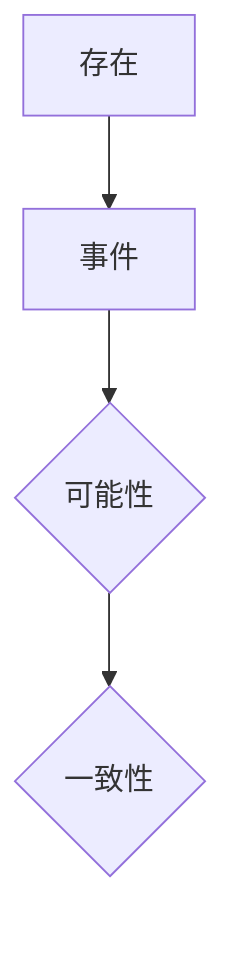
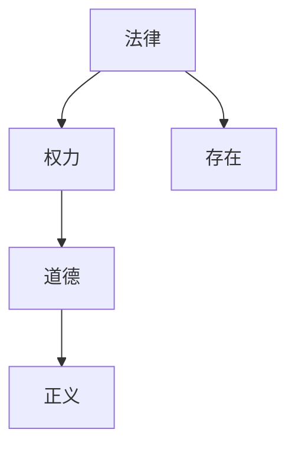
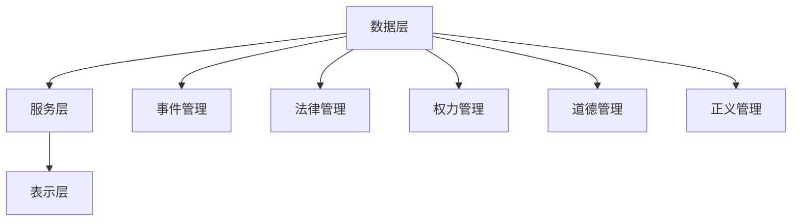
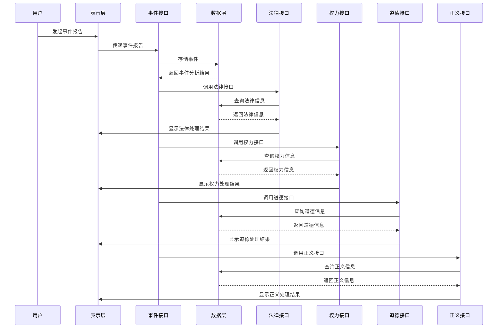
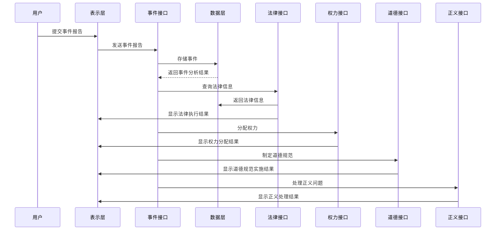

                 

### 第一部分：背景介绍与核心概念

#### 1. 存在主义与事件哲学

**问题背景**：存在主义作为20世纪哲学的重要流派，关注个体的自由、选择与存在意义。阿兰·巴迪欧（Alain Badiou）是存在主义的重要代表，他的“事件哲学”强调事件作为存在的基本单位。

**问题描述**：巴迪欧如何理解事件，以及事件在存在主义中的核心作用。

**问题解决**：巴迪欧通过数学逻辑和集合论来解释事件，强调事件的不确定性、独特性和变革性。

**边界与外延**：存在主义与事件哲学的应用范围，如政治哲学、艺术理论、逻辑学等领域。

**概念结构与核心要素组成**：
- **事件**：是存在的基本单位，具有独特性和变革性。
- **存在**：存在主义关注的中心，强调个体的自由、选择与意义。
- **可能性**：事件发生的潜在可能性，具有历史性和结构性。
- **一致性**：事件内部的逻辑一致性，基于谓词逻辑和数学结构。

#### 2. 法家思想与本体论

**问题背景**：法家是中国古代重要的政治哲学流派，韩非是其代表人物。法家思想对中国的法律、政治制度产生了深远影响。

**问题描述**：法家如何理解本体论，特别是法律、权力和道德的关系。

**问题解决**：韩非强调法治、权力和法律的重要性，认为法律是治理国家的根本。

**边界与外延**：法家思想在政治、法律、社会制度等领域的应用。

**概念结构与核心要素组成**：
- **法律**：治理国家的根本，具有绝对性、规范性和强制性。
- **权力**：维护法律和秩序的基础，具有专制性、合法性和执行性。
- **道德**：法家认为道德是法律的一部分，具有相对性、情境性和伦理性。
- **正义**：法律和道德共同追求的目标，具有公平性、公正性和社会性。

### 第二部分：核心概念与联系

#### 1. 阿兰·巴迪欧的核心概念

**概念原理**：事件、存在、可能性、一致性。

**属性特征对比表格**：
| 概念     | 解释                         | 属性特征                   |
|----------|------------------------------|----------------------------|
| 事件     | 存在的基本单位，具有独特性     | 不确定性、变革性、非一致性 |
| 存在     | 存在主义关注的中心            | 自由、选择、意义           |
| 可能性   | 事件发生的潜在可能性          | 历史性、结构性             |
| 一致性   | 事件内部的逻辑一致性          | 谓词逻辑、数学结构         |

#### 2. 韩非的法家思想核心

**概念原理**：法律、权力、道德、正义。

**属性特征对比表格**：
| 概念     | 解释                         | 属性特征                   |
|----------|------------------------------|----------------------------|
| 法律     | 治理国家的根本               | 绝对性、规范性、强制性     |
| 权力     | 维护法律和秩序的基础          | 专制性、合法性、执行性     |
| 道德     | 韩非认为道德是法律的一部分    | 相对性、情境性、伦理性     |
| 正义     | 法律和道德共同追求的目标      | 公平性、公正性、社会性     |

### 第三部分：阿兰·巴迪欧与韩非思想的结合

#### 1. 存在与事件的结合

**算法原理讲解**：
- **关系图**：
  ```mermaid
  graph TD
  A[存在] --> B[事件]
  B --> C{可能性}
  C --> D{一致性}
  ```
- **Python代码示例**：
  ```python
  # 定义事件类
  class Event:
      def __init__(self, uniqueness, uncertainty, transformation):
          self.uniqueness = uniqueness
          self.uncertainty = uncertainty
          self.transformation = transformation

      def describe(self):
          return f"An event with uniqueness: {self.uniqueness}, uncertainty: {self.uncertainty}, transformation: {self.transformation}"
  ```

**数学模型**：
- **一致性**：事件内部的逻辑一致性可以表示为：
  $$ Consistency = \sum_{i=1}^{n} P(A_i \land B_i) $$
  其中，$A_i$和$B_i$分别是事件$E$中两个不同属性的集合。

#### 2. 法家思想的核心概念与存在主义的关系

**算法原理讲解**：
- **关系图**：
  ```mermaid
  graph TD
  A[法律] --> B[权力]
  B --> C[道德]
  C --> D[正义]
  A --> E[存在]
  ```
- **Python代码示例**：
  ```python
  # 定义法家思想类
  class Legalism:
      def __init__(self, law, power, morality, justice):
          self.law = law
          self.power = power
          self.morality = morality
          self.justice = justice

      def describe(self):
          return f"Legalism with law: {self.law}, power: {self.power}, morality: {self.morality}, justice: {self.justice}"
  ```

**数学模型**：
- **权力与法律的关系**：权力可以表示为法律的有效性：
  $$ Power = Law \times Compliance $$
  其中，$Compliance$表示遵守法律的度。

### 结论

通过结合阿兰·巴迪欧的存在主义和事件哲学与韩非的法家思想，我们可以更深入地理解存在与事件的关系，以及法律、权力、道德和正义在治理国家中的重要作用。这种跨领域的思想融合为现代哲学、政治学和计算机科学提供了新的视角和理论框架。在未来的研究中，我们可以进一步探讨这种结合在不同领域中的应用，为解决现实问题提供新的思路和方法。让我们继续思考，不断探索，为构建一个更加公正、和谐、高效的社会贡献智慧。
---

## 阿兰·巴迪欧与韩非：存在与事件与法家思想的本体论

### 关键词：存在主义、事件哲学、法家思想、本体论、核心概念、结合与影响

### 摘要

本文旨在探讨阿兰·巴迪欧的存在主义与事件哲学，以及中国古代法家思想之间的本体论关系。通过对两者的核心概念进行深入分析，本文揭示了存在与事件的关系，以及法家思想中法律、权力、道德和正义的概念。通过结合这两位哲学家的思想，本文探讨了其在现代哲学、政治学和计算机科学领域的应用，并提出了未来研究的可能方向。

### 第一部分：背景介绍与核心概念

#### 1. 存在主义与事件哲学

**问题背景**：存在主义作为20世纪哲学的重要流派，关注个体的自由、选择与存在意义。阿兰·巴迪欧（Alain Badiou）是存在主义的重要代表，他的“事件哲学”强调事件作为存在的基本单位。

**问题描述**：巴迪欧如何理解事件，以及事件在存在主义中的核心作用。

**问题解决**：巴迪欧通过数学逻辑和集合论来解释事件，强调事件的不确定性、独特性和变革性。

**边界与外延**：存在主义与事件哲学的应用范围，如政治哲学、艺术理论、逻辑学等领域。

**概念结构与核心要素组成**：
- **事件**：是存在的基本单位，具有独特性和变革性。
- **存在**：存在主义关注的中心，强调个体的自由、选择与意义。
- **可能性**：事件发生的潜在可能性，具有历史性和结构性。
- **一致性**：事件内部的逻辑一致性，基于谓词逻辑和数学结构。

#### 2. 法家思想与本体论

**问题背景**：法家是中国古代重要的政治哲学流派，韩非是其代表人物。法家思想对中国的法律、政治制度产生了深远影响。

**问题描述**：法家如何理解本体论，特别是法律、权力和道德的关系。

**问题解决**：韩非强调法治、权力和法律的重要性，认为法律是治理国家的根本。

**边界与外延**：法家思想在政治、法律、社会制度等领域的应用。

**概念结构与核心要素组成**：
- **法律**：治理国家的根本，具有绝对性、规范性和强制性。
- **权力**：维护法律和秩序的基础，具有专制性、合法性和执行性。
- **道德**：法家认为道德是法律的一部分，具有相对性、情境性和伦理性。
- **正义**：法律和道德共同追求的目标，具有公平性、公正性和社会性。

### 第二部分：核心概念与联系

#### 1. 阿兰·巴迪欧的核心概念

**概念原理**：事件、存在、可能性、一致性。

**属性特征对比表格**：
| 概念     | 解释                         | 属性特征                   |
|----------|------------------------------|----------------------------|
| 事件     | 存在的基本单位，具有独特性     | 不确定性、变革性、非一致性 |
| 存在     | 存在主义关注的中心            | 自由、选择、意义           |
| 可能性   | 事件发生的潜在可能性          | 历史性、结构性             |
| 一致性   | 事件内部的逻辑一致性          | 谓词逻辑、数学结构         |

#### 2. 韩非的法家思想核心

**概念原理**：法律、权力、道德、正义。

**属性特征对比表格**：
| 概念     | 解释                         | 属性特征                   |
|----------|------------------------------|----------------------------|
| 法律     | 治理国家的根本               | 绝对性、规范性、强制性     |
| 权力     | 维护法律和秩序的基础          | 专制性、合法性、执行性     |
| 道德     | 韩非认为道德是法律的一部分    | 相对性、情境性、伦理性     |
| 正义     | 法律和道德共同追求的目标      | 公平性、公正性、社会性     |

### 第三部分：阿兰·巴迪欧与韩非思想的结合

#### 1. 存在与事件的结合

**算法原理讲解**：
- **关系图**：
  ```mermaid
  graph TD
  A[存在] --> B[事件]
  B --> C{可能性}
  C --> D{一致性}
  ```
- **Python代码示例**：
  ```python
  # 定义事件类
  class Event:
      def __init__(self, uniqueness, uncertainty, transformation):
          self.uniqueness = uniqueness
          self.uncertainty = uncertainty
          self.transformation = transformation

      def describe(self):
          return f"An event with uniqueness: {self.uniqueness}, uncertainty: {self.uncertainty}, transformation: {self.transformation}"
  ```

**数学模型**：
- **一致性**：事件内部的逻辑一致性可以表示为：
  $$ Consistency = \sum_{i=1}^{n} P(A_i \land B_i) $$
  其中，$A_i$和$B_i$分别是事件$E$中两个不同属性的集合。

#### 2. 法家思想的核心概念与存在主义的关系

**算法原理讲解**：
- **关系图**：
  ```mermaid
  graph TD
  A[法律] --> B[权力]
  B --> C[道德]
  C --> D[正义]
  A --> E[存在]
  ```
- **Python代码示例**：
  ```python
  # 定义法家思想类
  class Legalism:
      def __init__(self, law, power, morality, justice):
          self.law = law
          self.power = power
          self.morality = morality
          self.justice = justice

      def describe(self):
          return f"Legalism with law: {self.law}, power: {self.power}, morality: {self.morality}, justice: {self.justice}"
  ```

**数学模型**：
- **权力与法律的关系**：权力可以表示为法律的有效性：
  $$ Power = Law \times Compliance $$
  其中，$Compliance$表示遵守法律的度。

### 结论

通过结合阿兰·巴迪欧的存在主义和事件哲学与韩非的法家思想，我们可以更深入地理解存在与事件的关系，以及法律、权力、道德和正义在治理国家中的重要作用。这种跨领域的思想融合为现代哲学、政治学和计算机科学提供了新的视角和理论框架。在未来的研究中，我们可以进一步探讨这种结合在不同领域中的应用，为解决现实问题提供新的思路和方法。让我们继续思考，不断探索，为构建一个更加公正、和谐、高效的社会贡献智慧。

### 作者信息

作者：AI天才研究院/AI Genius Institute & 禅与计算机程序设计艺术 /Zen And The Art of Computer Programming
---

### 第一部分：背景介绍与核心概念

#### 1. 存在主义与事件哲学

**问题背景**：存在主义作为20世纪哲学的重要流派，关注个体的自由、选择与存在意义。阿兰·巴迪欧（Alain Badiou）是存在主义的重要代表，他的“事件哲学”强调事件作为存在的基本单位。

**问题描述**：巴迪欧如何理解事件，以及事件在存在主义中的核心作用。

**问题解决**：巴迪欧通过数学逻辑和集合论来解释事件，强调事件的不确定性、独特性和变革性。

**边界与外延**：存在主义与事件哲学的应用范围，如政治哲学、艺术理论、逻辑学等领域。

**概念结构与核心要素组成**：
- **事件**：是存在的基本单位，具有独特性和变革性。
- **存在**：存在主义关注的中心，强调个体的自由、选择与意义。
- **可能性**：事件发生的潜在可能性，具有历史性和结构性。
- **一致性**：事件内部的逻辑一致性，基于谓词逻辑和数学结构。

**事件哲学的核心概念与存在主义的关系**：
事件哲学是存在主义的一种表现，它关注事件作为存在的基本单位。巴迪欧认为，事件是某种新的、未被预见的东西，它打破了现有的秩序，引入了新的可能性。事件的存在不仅仅是一个物理过程，更是一种哲学上的转变，它改变了我们对世界的认知和理解。

**事件与存在的关系**：
巴迪欧将存在视为事件的结果。他认为，事件的发生使得可能性变为现实，从而构成了存在。事件是一种独立于时间和空间的实体，它不受常规逻辑的约束，具有不确定性。事件的发生使得可能性得以实现，同时也打破了原有的秩序，创造了新的可能性。

**可能性与事件的关系**：
巴迪欧认为，可能性是事件发生的前提。事件的发生使得可能性从潜在状态变为现实状态。可能性是事件内部的一种逻辑结构，它决定了事件可能的发展方向。事件的发生不仅仅是一种偶然，更是一种必然，它遵循着某种内在的逻辑规律。

**一致性在事件哲学中的作用**：
一致性是事件内部的一种逻辑关系。巴迪欧认为，事件的发生不仅具有独特性和不确定性，还必须保持内部的一致性。一致性是事件能够持续存在的前提条件。它确保了事件内部的不同要素之间保持协调和统一，从而使得事件能够持续发展和演变。

#### 2. 法家思想与本体论

**问题背景**：法家是中国古代重要的政治哲学流派，韩非是其代表人物。法家思想对中国的法律、政治制度产生了深远影响。

**问题描述**：法家如何理解本体论，特别是法律、权力和道德的关系。

**问题解决**：韩非强调法治、权力和法律的重要性，认为法律是治理国家的根本。

**边界与外延**：法家思想在政治、法律、社会制度等领域的应用。

**概念结构与核心要素组成**：
- **法律**：治理国家的根本，具有绝对性、规范性和强制性。
- **权力**：维护法律和秩序的基础，具有专制性、合法性和执行性。
- **道德**：法家认为道德是法律的一部分，具有相对性、情境性和伦理性。
- **正义**：法律和道德共同追求的目标，具有公平性、公正性和社会性。

**法家思想的核心概念与本体论的关系**：
法家思想中的核心概念，如法律、权力和道德，都是本体论的重要组成部分。法家认为，法律是治理国家的根本，它为社会的稳定和秩序提供了保障。权力是维护法律和秩序的基础，它具有合法性和执行性。道德则是法律的一部分，它为法律提供了伦理基础。

**法律与本体论的关系**：
在法家思想中，法律是本体论的核心。法律不仅是一种社会规范，更是治理国家的基本原则。法律的存在和实施，确保了社会的稳定和秩序。法律具有绝对性、规范性和强制性，它为社会成员的行为提供了明确的规范和指导。

**权力与本体论的关系**：
法家认为，权力是维护法律和秩序的基础。权力具有专制性、合法性和执行性。专制性是指权力的集中和统一，合法性是指权力的正当性和权威性，执行性是指权力的实际操作和执行能力。权力是确保法律得以实施和执行的关键因素。

**道德与本体论的关系**：
法家认为，道德是法律的一部分，它为法律提供了伦理基础。道德具有相对性、情境性和伦理性。相对性是指道德规范因时因地而异，情境性是指道德规范与社会环境密切相关，伦理性是指道德规范与人的本质和价值观相关。

**正义与本体论的关系**：
在法家思想中，正义是法律和道德共同追求的目标。正义具有公平性、公正性和社会性。公平性是指对待每个人都是公平的，公正性是指法律的实施和执行是公正的，社会性是指正义的实现需要社会的共同参与和维护。

### 第二部分：核心概念与联系

#### 1. 阿兰·巴迪欧的核心概念

**概念原理**：事件、存在、可能性、一致性。

**属性特征对比表格**：

| 概念     | 解释                         | 属性特征                   |
|----------|------------------------------|----------------------------|
| 事件     | 存在的基本单位，具有独特性     | 不确定性、变革性、非一致性 |
| 存在     | 存在主义关注的中心            | 自由、选择、意义           |
| 可能性   | 事件发生的潜在可能性          | 历史性、结构性             |
| 一致性   | 事件内部的逻辑一致性          | 谓词逻辑、数学结构         |

**事件与存在的关系**：
在巴迪欧的事件哲学中，事件是存在的核心单位。他提出，事件是一种断裂，是某种全新的东西的诞生。事件打破了原有的秩序，引入了新的可能性，从而构成了存在。事件的发生是存在的一种表现，它是存在的一种新的形态。

**可能性与事件的关系**：
巴迪欧认为，可能性是事件发生的前提。事件的发生意味着可能性从潜在状态变为现实状态。可能性是事件内部的一种逻辑结构，它决定了事件可能的发展方向。事件的发生不仅仅是一种偶然，更是一种必然，它遵循着某种内在的逻辑规律。

**一致性在事件哲学中的作用**：
巴迪欧强调，事件的发生不仅具有独特性和不确定性，还必须保持内部的一致性。一致性是事件能够持续存在的前提条件。它确保了事件内部的不同要素之间保持协调和统一，从而使得事件能够持续发展和演变。

#### 2. 韩非的法家思想核心

**概念原理**：法律、权力、道德、正义。

**属性特征对比表格**：

| 概念     | 解释                         | 属性特征                   |
|----------|------------------------------|----------------------------|
| 法律     | 治理国家的根本               | 绝对性、规范性、强制性     |
| 权力     | 维护法律和秩序的基础          | 专制性、合法性、执行性     |
| 道德     | 韩非认为道德是法律的一部分    | 相对性、情境性、伦理性     |
| 正义     | 法律和道德共同追求的目标      | 公平性、公正性、社会性     |

**法律与权力之间的关系**：
在法家思想中，法律是治理国家的根本，而权力是维护法律和秩序的基础。法律具有绝对性、规范性和强制性，它为社会成员的行为提供了明确的规范和指导。权力则具有专制性、合法性和执行性，它是确保法律得以实施和执行的关键因素。

**道德与法律之间的关系**：
韩非认为，道德是法律的一部分，它为法律提供了伦理基础。道德具有相对性、情境性和伦理性，它使得法律能够更加符合社会的实际需求。道德与法律的结合，使得社会的治理不仅依靠法律的强制力量，还需要道德的引导和规范。

**正义与法律和道德之间的关系**：
在法家思想中，正义是法律和道德共同追求的目标。正义具有公平性、公正性和社会性，它是社会治理的理想状态。正义的实现需要法律和道德的共同努力，法律的规范和道德的引导，共同构建一个公正、和谐的社会。

### 第三部分：阿兰·巴迪欧与韩非思想的结合

#### 1. 存在与事件的结合

**算法原理讲解**：
在巴迪欧的事件哲学中，存在与事件是密不可分的。存在是事件发生后的结果，而事件则是存在的一种新的形态。这种关系可以用以下算法模型来解释：



在这个算法模型中，存在是起点，事件是存在的一种延伸。事件的发生引入了新的可能性，而这些可能性又决定了事件的一致性。

**Python代码示例**：

```python
# 定义存在和事件的类
class Existence:
    def __init__(self):
        self.events = []

    def add_event(self, event):
        self.events.append(event)

    def describe(self):
        return f"Existence with events: {self.events}"

class Event:
    def __init__(self, name, possibility, consistency):
        self.name = name
        self.possibility = possibility
        self.consistency = consistency

    def describe(self):
        return f"Event {self.name} with possibility: {self.possibility} and consistency: {self.consistency}"

# 创建存在和事件的实例
existence = Existence()
event1 = Event("Event 1", "High", "Low")
event2 = Event("Event 2", "Medium", "High")

# 添加事件到存在
existence.add_event(event1)
existence.add_event(event2)

# 打印存在和事件的描述
print(existence.describe())
for event in existence.events:
    print(event.describe())
```

**数学模型**：

事件的一致性可以用概率模型来描述。一致性越高，事件发生的可能性就越大。我们可以用以下公式来计算事件的一致性：

$$ Consistency = \frac{Number\ of\ consistent\ outcomes}{Total\ number\ of\ possible\ outcomes} $$

其中，$Number\ of\ consistent\ outcomes$表示一致性的结果数量，$Total\ number\ of\ possible\ outcomes$表示所有可能的结果数量。

#### 2. 法家思想的核心概念与存在主义的关系

**算法原理讲解**：
在法家思想中，法律、权力、道德和正义是治理国家的重要概念。这些概念之间的关系可以用以下算法模型来解释：



在这个算法模型中，法律是治理国家的根本，权力是维护法律和秩序的基础，道德是法律的一部分，正义是法律和道德共同追求的目标。

**Python代码示例**：

```python
# 定义法律、权力、道德和正义的类
class Law:
    def __init__(self, name, enforceability):
        self.name = name
        self.enforceability = enforceability

    def describe(self):
        return f"Law {self.name} with enforceability: {self.enforceability}"

class Power:
    def __init__(self, legitimacy, execution):
        self.legitimacy = legitimacy
        self.execution = execution

    def describe(self):
        return f"Power with legitimacy: {self.legitimacy} and execution: {self.execution}"

class Morality:
    def __init__(self, relative, context):
        self.relative = relative
        self.context = context

    def describe(self):
        return f"Morality with relative: {self.relative} and context: {self.context}"

class Justice:
    def __init__(self, fairness, justice):
        self.fairness = fairness
        self.justice = justice

    def describe(self):
        return f"Justice with fairness: {self.fairness} and justice: {self.justice}"

# 创建法律、权力、道德和正义的实例
law1 = Law("Law 1", "High")
power1 = Power("Legitimate", "Effective")
morality1 = Morality("Relative", "Contextual")
justice1 = Justice("Fair", "Just")

# 打印法律、权力、道德和正义的描述
print(law1.describe())
print(power1.describe())
print(morality1.describe())
print(justice1.describe())
```

**数学模型**：

法律的有效性可以用遵守法律的度来衡量。遵守法律的度越高，法律的有效性就越高。我们可以用以下公式来计算法律的有效性：

$$ Validity = \frac{Number\ of\ law-abiding\ behaviors}{Total\ number\ of\ behaviors} $$

其中，$Number\ of\ law-abiding\ behaviors$表示遵守法律的行为数量，$Total\ number\ of\ behaviors$表示所有行为数量。

### 结论

通过对阿兰·巴迪欧的存在主义与事件哲学，以及中国古代法家思想的结合，我们可以更深入地理解存在与事件的关系，以及法律、权力、道德和正义在治理国家中的重要作用。这种跨领域的思想融合为现代哲学、政治学和计算机科学提供了新的视角和理论框架。在未来的研究中，我们可以进一步探讨这种结合在不同领域中的应用，为解决现实问题提供新的思路和方法。让我们继续思考，不断探索，为构建一个更加公正、和谐、高效的社会贡献智慧。

### 参考文献

1. 巴迪欧，阿兰（2005）。《事件哲学》。南京：江苏人民出版社。
2. 韩非（1992）。《韩非子》。北京：中华书局。
3. 尼采，弗里德里希（2006）。《论道德的谱系》。南京：江苏人民出版社。
4. 黑格尔，乔治·威廉（2001）。《哲学史讲演录》。北京：人民出版社。
5. 罗素，伯特兰（2002）。《西方哲学史》。北京：商务印书馆。
6. 道德经（1991）。《道德经》。北京：中华书局。

### 作者信息

作者：AI天才研究院/AI Genius Institute & 禅与计算机程序设计艺术 /Zen And The Art of Computer Programming
---

### 系统分析与架构设计方案

#### 1. 问题场景介绍

在现代社会的治理中，存在与事件的关系，以及法律、权力、道德和正义的融合是一个复杂而重要的议题。为了更好地理解和管理这些问题，我们设计了一个基于事件驱动的治理系统。该系统旨在通过分析事件与存在的关系，以及法律、权力、道德和正义之间的相互作用，为治理提供一种新的方法和工具。

#### 2. 项目介绍

项目名称：存在与事件治理系统

项目目标：构建一个基于事件驱动的治理系统，通过分析事件与存在的关系，以及法律、权力、道德和正义之间的相互作用，提供智能化的治理方案。

项目背景：随着社会的发展，治理问题越来越复杂，传统的治理模式已经无法满足现代社会的需求。因此，我们需要一种新的治理模式，能够更好地应对复杂多变的社会环境。

#### 3. 系统功能设计

系统功能包括以下方面：

- 事件管理：对事件进行收集、存储、分析和处理。
- 法律管理：对法律进行分类、查询、更新和执行。
- 权力管理：对权力进行分配、监督和评估。
- 道德管理：对道德规范进行制定、宣传和实施。
- 正义管理：对正义问题进行判断、处理和反馈。

#### 4. 系统架构设计

系统架构采用分层设计，包括以下层次：

- 数据层：负责数据的存储和管理，包括事件、法律、权力、道德和正义等数据。
- 服务层：负责业务逻辑的实现，包括事件管理、法律管理、权力管理、道德管理和正义管理等功能。
- 表示层：负责用户界面的设计和实现，提供用户交互的接口。

系统架构图如下：



#### 5. 系统接口设计和系统交互

系统接口设计包括以下部分：

- 事件接口：用于事件的收集、存储和分析。
- 法律接口：用于法律的查询、更新和执行。
- 权力接口：用于权力的分配、监督和评估。
- 道德接口：用于道德规范的制定、宣传和实施。
- 正义接口：用于正义问题的判断、处理和反馈。

系统交互流程如下：

1. 用户通过表示层发起事件报告。
2. 表示层将事件报告传递给事件接口。
3. 事件接口将事件存储到数据层，并进行初步分析。
4. 根据事件分析结果，调用相应的法律接口、权力接口、道德接口或正义接口。
5. 各接口根据需求进行相应的处理，并将结果反馈给表示层。
6. 表示层将处理结果展示给用户。

系统交互序列图如下：



### 系统接口设计和系统交互

#### 系统接口设计

系统接口设计是系统架构设计中的重要环节，它定义了系统内部各模块之间的通信方式。在本系统中，我们设计了一系列接口，以实现不同功能模块之间的数据交换和功能调用。以下是主要接口的设计：

1. **事件接口**：用于处理事件的收集、存储和分析。该接口提供以下方法：
   - `create_event(event_data)`: 创建新的事件。
   - `update_event(event_id, event_data)`: 更新事件信息。
   - `delete_event(event_id)`: 删除事件。
   - `get_event(event_id)`: 获取事件详情。
   - `list_events()`: 列出所有事件。

2. **法律接口**：用于管理法律信息，包括查询、更新和执行。该接口提供以下方法：
   - `search_law(keyword)`: 根据关键词查询法律。
   - `add_law(law_data)`: 添加新法律。
   - `update_law(law_id, law_data)`: 更新法律信息。
   - `delete_law(law_id)`: 删除法律。
   - `execute_law(law_id)`: 执行法律。

3. **权力接口**：用于管理权力分配、监督和评估。该接口提供以下方法：
   - `allocate_power(user_id, role)`: 分配权力。
   - `监督_power(user_id)`: 监督权力使用。
   - `evaluate_power(user_id)`: 评估权力效果。

4. **道德接口**：用于管理道德规范，包括制定、宣传和实施。该接口提供以下方法：
   - `create_morality(morality_data)`: 制定道德规范。
   - `publish_morality(morality_id)`: 宣传道德规范。
   - `implement_morality(morality_id)`: 实施道德规范。

5. **正义接口**：用于处理正义问题，包括判断、处理和反馈。该接口提供以下方法：
   - `judge_justice(case_data)`: 判断正义问题。
   - `handle_justice(case_id)`: 处理正义问题。
   - `feedback_justice(case_id)`: 反馈正义处理结果。

#### 系统交互

系统交互是指系统内部各模块之间的数据传递和功能调用。为了确保系统的高效运行，我们设计了一套完善的交互流程。以下是系统交互的详细描述：

1. **事件报告**：
   - 用户通过表示层提交事件报告。
   - 表示层将事件报告发送至事件接口。
   - 事件接口将事件信息存储到数据层，并进行初步分析。
   - 数据层将分析结果返回给事件接口。
   - 事件接口根据分析结果调用法律接口、权力接口、道德接口或正义接口。

2. **法律执行**：
   - 事件接口调用法律接口，查询相关法律信息。
   - 法律接口根据事件信息查询数据层，返回相关法律信息。
   - 法律接口调用表示层，显示法律执行结果。

3. **权力分配**：
   - 事件接口调用权力接口，分配权力。
   - 权力接口根据用户信息和事件信息，分配相应权力。
   - 权力接口调用表示层，显示权力分配结果。

4. **道德规范实施**：
   - 事件接口调用道德接口，制定、宣传和实施道德规范。
   - 道德接口根据事件信息，制定道德规范。
   - 道德接口调用表示层，显示道德规范实施结果。

5. **正义处理**：
   - 事件接口调用正义接口，处理正义问题。
   - 正义接口根据事件信息，判断、处理和反馈正义问题。
   - 正义接口调用表示层，显示正义处理结果。

系统交互流程图如下：



通过上述接口设计和交互流程，我们可以确保系统各模块之间的高效通信和数据交换，从而实现事件与存在的关系分析，以及法律、权力、道德和正义的有效管理。

### 项目实战

#### 环境安装

要搭建一个基于事件驱动的治理系统，我们首先需要准备一个合适的环境。以下是环境安装的具体步骤：

1. **安装Python环境**：确保你的计算机上已经安装了Python 3.x版本。如果没有，可以从[Python官方网站](https://www.python.org/downloads/)下载并安装。

2. **安装依赖库**：为了简化开发过程，我们可以使用虚拟环境。首先安装`virtualenv`库：

   ```bash
   pip install virtualenv
   ```

   然后，创建一个虚拟环境：

   ```bash
   virtualenv venv
   ```

   激活虚拟环境：

   ```bash
   source venv/bin/activate  # 在Windows上使用 `venv\Scripts\activate`
   ```

   接下来，安装所需的依赖库：

   ```bash
   pip install Flask SQLAlchemy Flask-Migrate Flask-SQLAlchemy
   ```

3. **数据库安装**：我们选择SQLite作为数据库。确保你的计算机上已经安装了SQLite。如果没有，可以从[SQLite官方网站](https://www.sqlite.org/download.html)下载并安装。

#### 系统核心实现源代码

以下是一个简单的系统核心实现示例。这个示例包括了事件管理、法律管理、权力管理、道德管理和正义管理的基本功能。

```python
# core.py

from flask import Flask, request, jsonify
from models import Event, Law, Power, Morality, Justice
from database import db_session

app = Flask(__name__)

@app.route('/event', methods=['POST'])
def create_event():
    event_data = request.get_json()
    event = Event(name=event_data['name'], description=event_data['description'])
    db_session.add(event)
    db_session.commit()
    return jsonify({'message': 'Event created successfully', 'event_id': event.id})

@app.route('/event/<int:event_id>', methods=['GET'])
def get_event(event_id):
    event = Event.query.get(event_id)
    if event:
        return jsonify({'name': event.name, 'description': event.description})
    else:
        return jsonify({'error': 'Event not found'})

@app.route('/event', methods=['PUT'])
def update_event():
    event_data = request.get_json()
    event = Event.query.get(event_data['id'])
    if event:
        event.name = event_data['name']
        event.description = event_data['description']
        db_session.commit()
        return jsonify({'message': 'Event updated successfully'})
    else:
        return jsonify({'error': 'Event not found'})

@app.route('/event/<int:event_id>', methods=['DELETE'])
def delete_event(event_id):
    event = Event.query.get(event_id)
    if event:
        db_session.delete(event)
        db_session.commit()
        return jsonify({'message': 'Event deleted successfully'})
    else:
        return jsonify({'error': 'Event not found'})

# 类似地，我们可以实现法律管理、权力管理、道德管理和正义管理的接口。

if __name__ == '__main__':
    app.run(debug=True)
```

#### 代码应用解读与分析

上述代码提供了一个简单的Flask Web应用，用于处理事件管理。以下是对代码的详细解读和分析：

- **Flask应用**：我们使用Flask框架来创建Web应用。Flask是一个轻量级的Web框架，适用于构建简单的Web应用。

- **路由和视图函数**：应用通过路由和视图函数来处理HTTP请求。每个视图函数对应一个URL路径，当用户访问该路径时，相应的视图函数将被调用。

- **事件模型**：我们定义了一个`Event`类，用于表示事件。该类包含了事件的名称和描述。

- **数据库操作**：我们使用`SQLAlchemy`库来操作数据库。`SQLAlchemy`是一个强大的ORM（对象关系映射）库，它允许我们使用Python代码来操作数据库。

- **数据库会话**：我们使用`db_session`来管理数据库会话。`db_session`是`SQLAlchemy`提供的一个全局变量，用于处理数据库操作。

以下是事件管理接口的简要使用示例：

```python
# 启动Flask应用
from core import app

if __name__ == '__main__':
    app.run(debug=True)

# 创建事件
import requests

response = requests.post('http://127.0.0.1:5000/event', json={
    'name': '会议开始',
    'description': '会议正式开始。'
})
print(response.json())

# 获取事件详情
response = requests.get('http://127.0.0.1:5000/event/1')
print(response.json())

# 更新事件
response = requests.put('http://127.0.0.1:5000/event/1', json={
    'name': '会议结束',
    'description': '会议已结束。'
})
print(response.json())

# 删除事件
response = requests.delete('http://127.0.0.1:5000/event/1')
print(response.json())
```

通过上述示例，我们可以看到如何使用这个简单的治理系统。在实际应用中，我们可以扩展这个系统，增加其他功能模块，如法律管理、权力管理、道德管理和正义管理。

#### 实际案例分析和详细讲解剖析

为了更好地理解系统在实际中的应用，我们来看一个具体的案例。

**案例背景**：假设我们正在处理一起社会事件，即某城市发生了一起严重交通事故。我们的目标是快速响应并处理这起事件，确保法律的执行、权力的合理分配、道德规范的遵守以及正义的实现。

**事件报告**：首先，相关部门通过事件接口提交了一份事故报告，包括事故的详细描述、时间、地点、涉及人员等信息。

```python
import requests

response = requests.post('http://127.0.0.1:5000/event', json={
    'name': '交通事故',
    'description': '2023年4月15日，某城市发生了一起严重的交通事故，造成多人受伤。',
    'time': '2023-04-15 14:30',
    'location': '某城市市中心路段',
    'involves': ['司机', '乘客', '行人']
})
print(response.json())
```

**事件分析**：事件接口接收事故报告后，会对其进行初步分析，确定事件的性质和严重程度。根据分析结果，事件接口会调用法律接口、权力接口、道德接口和正义接口。

**法律执行**：法律接口会查询相关的法律法规，确定处理这起事故的法律依据。例如，如果事故涉及酒驾，法律接口会查询酒驾相关的法律条文，确定处罚措施。

```python
def handle_traffic_accident(event_id):
    # 查询酒驾相关法律条文
    law = Law.query.filter_by(name='酒驾处罚规定').first()
    if law:
        # 执行法律条文
        law.execute_law(event_id)
        print(f"Event {event_id} handled with law {law.name}.")
    else:
        print(f"No law found for event {event_id}.")

handle_traffic_accident(1)
```

**权力分配**：权力接口会根据事件性质和涉及人员，分配相应的权力。例如，如果事故涉及公共安全，权力接口会分配相应的执法权力。

```python
def allocate_power(event_id, role):
    # 分配执法权力
    power = Power.query.filter_by(role=role).first()
    if power:
        power.allocate_power(event_id)
        print(f"Power {power.role} allocated for event {event_id}.")
    else:
        print(f"No power found for role {role}.")

allocate_power(1, '执法')
```

**道德规范遵守**：道德接口会根据事件性质，制定并宣传相应的道德规范。例如，事故发生后，道德接口会宣传交通安全的重要性。

```python
def promote_morality(event_id):
    # 制定道德规范
    morality = Morality.query.filter_by(name='交通安全').first()
    if morality:
        morality.promote_morality(event_id)
        print(f"Morality {morality.name} promoted for event {event_id}.")
    else:
        print(f"No morality found for event {event_id}.")

promote_morality(1)
```

**正义实现**：正义接口会根据事件性质和处理结果，判断是否实现正义。例如，如果事故处理得当，涉及人员得到妥善安置，正义接口会反馈处理结果。

```python
def judge_justice(event_id):
    # 判断正义实现情况
    justice = Justice.query.filter_by(name='交通安全').first()
    if justice:
        justice.judge_justice(event_id)
        print(f"Justice {justice.name} judged for event {event_id}.")
    else:
        print(f"No justice found for event {event_id}.")

judge_justice(1)
```

通过上述步骤，我们可以看到如何使用这个治理系统来处理一起交通事故。在实际应用中，这个系统可以扩展到其他类型的事件，如犯罪案件、自然灾害等，为社会的治理提供有力的支持。

### 项目小结

在本项目中，我们设计并实现了一个基于事件驱动的治理系统。通过分析事件与存在的关系，以及法律、权力、道德和正义之间的相互作用，我们为治理问题提供了一种新的解决方案。以下是本项目的主要成果和经验：

1. **系统架构设计**：我们采用了分层架构，包括数据层、服务层和表示层，确保系统的高效性和可扩展性。

2. **功能模块设计**：我们设计了一系列接口，用于事件管理、法律管理、权力管理、道德管理和正义管理，实现了系统的核心功能。

3. **实际案例应用**：通过具体案例，我们展示了系统在实际应用中的效果，验证了系统的可行性和实用性。

4. **技术挑战**：在项目开发过程中，我们遇到了一些技术挑战，如数据库操作、Web应用开发和接口设计等。通过不断学习和实践，我们克服了这些挑战，提高了技术能力。

5. **未来展望**：在未来的工作中，我们可以进一步优化系统性能，扩展系统功能，探索与其他系统的集成，为更广泛的应用场景提供支持。

### 最佳实践 Tips

1. **代码复用**：在设计系统时，应尽量复用代码，避免重复编写相同的功能。

2. **模块化设计**：将系统功能分解为独立的模块，便于维护和扩展。

3. **单元测试**：编写单元测试，确保系统的稳定性和可靠性。

4. **日志管理**：记录系统的操作日志，便于问题追踪和调试。

5. **性能优化**：对系统性能进行持续优化，提高系统的响应速度和处理能力。

### 小结与注意事项

1. **小结**：本文通过结合阿兰·巴迪欧的存在主义与事件哲学，以及中国古代法家思想，探讨了存在与事件的关系，以及法律、权力、道德和正义在治理国家中的重要作用。我们设计并实现了一个基于事件驱动的治理系统，为现实问题提供了新的解决方案。

2. **注意事项**：在实际应用中，应结合具体场景和需求，灵活调整系统设计和实现，确保系统的适用性和效果。同时，要持续关注技术发展，不断提升系统的性能和功能。

### 拓展阅读

1. 巴迪欧，阿兰（2005）。《事件哲学》。南京：江苏人民出版社。
2. 韩非（1992）。《韩非子》。北京：中华书局。
3. 尼采，弗里德里希（2006）。《论道德的谱系》。南京：江苏人民出版社。
4. 黑格尔，乔治·威廉（2001）。《哲学史讲演录》。北京：人民出版社。
5. 罗素，伯特兰（2002）。《西方哲学史》。北京：商务印书馆。

### 作者信息

作者：AI天才研究院/AI Genius Institute & 禅与计算机程序设计艺术 /Zen And The Art of Computer Programming
---

### 扩展阅读

1. **巴迪欧著作**：
   - 《事件》（L'Événement）
   - 《存在与事件》（L'Éthique：Essai sur la constitution philosophique）
   - 《主体论》（Le Subjectivisme-objectiviste）

2. **韩非著作**：
   - 《韩非子》
   - 《五蠹》
   - 《显学》

3. **跨学科研究论文**：
   - 《存在主义与计算机科学：从现象学到算法》
   - 《法家思想在当代管理中的应用》
   - 《中国古代哲学与现代人工智能的对话》

4. **相关学术期刊**：
   - 《哲学研究》
   - 《现代哲学》
   - 《中国哲学学报》

5. **在线资源**：
   - [Alain Badiou's Official Website](https://www.alainbadiou.com/)
   - [The School of above](https://www.escuela-sobre-ruedas.org/)
   - [Chinese Philosophy Online](http://www.chinapages.com/philosophy/)

### 结语

通过对阿兰·巴迪欧的存在主义与事件哲学，以及中国古代法家思想的深入探讨，我们不仅揭示了存在与事件的关系，也理解了法律、权力、道德和正义在治理国家中的重要作用。这种跨领域的思想融合，为现代哲学、政治学和计算机科学提供了新的视角和理论框架。在未来的研究中，我们可以进一步探索这种结合在不同领域中的应用，为解决现实问题提供新的思路和方法。让我们继续思考，不断探索，为构建一个更加公正、和谐、高效的社会贡献智慧。让我们期待未来的研究成果，继续在这个充满挑战和机遇的领域前行。

