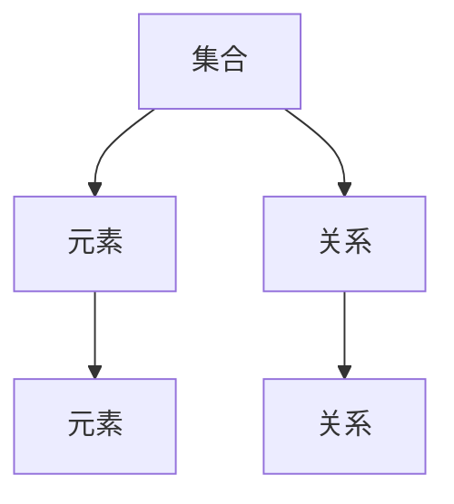
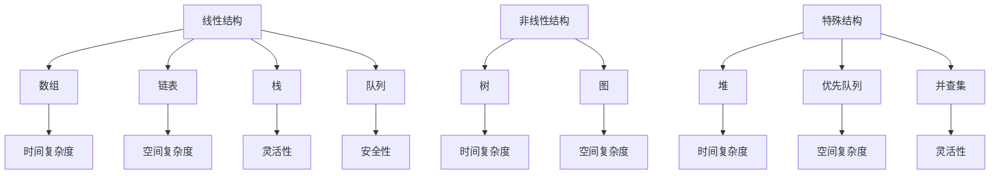
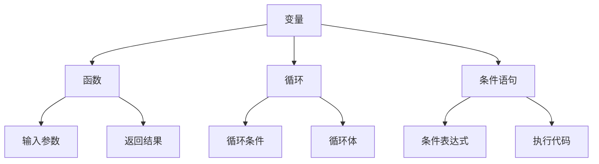
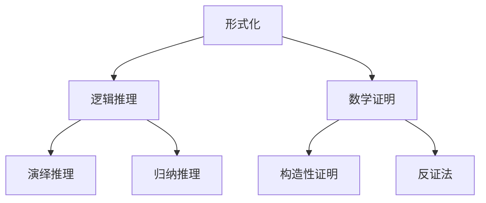

                 

### 1. 背景介绍

#### 1.1. 问题背景

阿兰·巴迪欧（Alain Badiou）是一位法国哲学家，以其独特的集合论本体论著称。集合论本体论是巴迪欧哲学体系中的核心概念之一，强调集合作为构成世界的基本单位，具有超越传统哲学范畴的深远影响。在计算机科学领域，数据结构是实现算法、存储和管理数据的基础，其理论基础源自数学和哲学。

将巴迪欧的集合论本体论与数据结构相结合，不仅有助于深化对数据结构本质的理解，还能为编程基础提供新的哲学视角。本文旨在探讨这一结合点，通过逐步分析，揭示集合论本体论在数据结构和编程基础中的应用，为读者提供一种全新的思考方式。

#### 1.2. 问题描述

本书将围绕以下几个核心问题展开讨论：

1. **集合论本体论的核心原理是什么？**
   - 集合论本体论的基本概念和核心思想是什么？
   - 如何理解集合作为构成世界的基本单位？

2. **集合论如何影响数据结构的理论基础？**
   - 集合论对数据结构的基本概念和原理有何影响？
   - 数据结构如何体现集合论本体论的思想？

3. **数据结构如何体现集合论本体论的思想？**
   - 集合论本体论在具体数据结构（如数组、链表、树、图等）中的应用？
   - 集合论本体论如何影响数据结构的性能和优化？

4. **数学哲学在编程基础中的应用有何特点？**
   - 数学哲学的基本原理在编程基础中如何体现？
   - 数学哲学对编程方法论和思维方式有何影响？

5. **如何将集合论本体论应用于编程实践，解决实际问题？**
   - 实际编程场景中，如何运用集合论本体论优化数据结构和算法？
   - 如何通过集合论本体论提高编程效率和代码可维护性？

#### 1.3. 问题解决

本书将通过以下步骤解决上述问题：

1. **详细阐述集合论本体论的基本原理。**
   - 从集合论本体论的核心概念出发，逐步讲解其基本原理和思想。

2. **探讨集合论本体论对数据结构理论基础的影响。**
   - 分析集合论如何影响数据结构的基本概念和原理。

3. **分析集合论本体论在数据结构中的具体应用。**
   - 结合具体数据结构（如数组、链表、树、图等），探讨集合论本体论的应用。

4. **研究数学哲学在编程基础中的应用特点。**
   - 分析数学哲学的基本原理在编程基础中的应用，探讨其对编程方法论和思维方式的影响。

5. **提供实例和案例分析，展示集合论本体论在编程实践中的应用。**
   - 通过实际编程场景和案例分析，展示集合论本体论在数据结构和算法优化中的具体应用。

#### 1.4. 边界与外延

本书主要讨论以下边界和范围：

1. **研究范围：**
   - 主要研究集合论本体论、数据结构、编程基础和数学哲学之间的相互关系。

2. **边界：**
   - 不会涉及集合论本体论之外的其他数学哲学领域。

3. **外延：**
   - 通过具体案例和实例，展示集合论本体论在编程中的应用，但不会深入探讨集合论本体论的其他哲学应用领域。

#### 1.5. 概念结构与核心要素组成

本书的核心概念结构如下：

1. **集合论本体论：**
   - 基本原理、主要思想、核心概念。

2. **数据结构：**
   - 理论基础、分类、特性。

3. **编程基础：**
   - 集合论本体论在编程中的应用。

4. **数学哲学：**
   - 基本原理、在编程基础中的应用。

通过以上章节，本书将逐步深入探讨集合论本体论与数据结构、编程基础和数学哲学之间的相互关系，为读者提供一种全新的思考方式，以深化对计算机科学哲学的理解。

### 2. 核心概念与联系

在深入探讨集合论本体论与数据结构、编程基础和数学哲学的关系之前，我们需要明确几个核心概念的定义及其相互联系。以下是关于集合论本体论、数据结构、编程基础和数学哲学的核心概念及其属性特征，通过对比表格和Mermaid流程图来展示它们之间的联系。

#### 2.1. 集合论本体论

集合论本体论是阿兰·巴迪欧哲学体系中的一个核心概念，强调集合作为构成世界的基本单位。以下是集合论本体论的核心概念及其属性特征：

- **核心原理**：集合是构成世界的基本单位，所有事物都可以被视为集合的元素。
- **核心概念**：集合、元素、关系。
- **概念属性特征对比表格**：

  | 特征 | 集合 | 元素 | 关系 |
  | --- | --- | --- | --- |
  | 定义 | 组合多个元素的集合 | 集合中的单个元素 | 元素之间的联系 |

- **ER实体关系图架构的Mermaid流程图**：

  ```mermaid
  graph TD
  A[集合] --> B[元素]
  A --> C[关系]
  ```

#### 2.2. 数据结构

数据结构是计算机科学中用于存储、组织和管理数据的特定方式，为算法的实现提供基础。以下是几种常见的数据结构及其属性特征：

- **核心原理**：数据结构用于高效地存储和管理数据，实现各种数据操作。
- **核心概念**：数组、链表、树、图等。
- **概念属性特征对比表格**：

  | 特征 | 数组 | 链表 | 树 | 图 |
  | --- | --- | --- | --- | --- |
  | 存储方式 | 连续内存 | 链式存储 | 分支结构 | 邻接表 |
  | 访问方式 | 顺序访问 | 链式访问 | 树状访问 | 邻接矩阵 |
  | 优点 | 访问速度快 | 灵活性高 | 易于实现 | 适用于复杂关系 |
  | 缺点 | 内存浪费 | 访问速度慢 | 易于出错 | 内存消耗大 |

- **ER实体关系图架构的Mermaid流程图**：

  ```mermaid
  graph TD
  A[数组] --> B[链表]
  A --> C[树]
  A --> D[图]
  ```

#### 2.3. 编程基础

编程基础是编写程序的基本技能，包括语法、算法和数据结构等。以下是编程基础的核心概念及其属性特征：

- **核心原理**：编程基础是编写程序的基本技能，涵盖语法、算法和数据结构等方面。
- **核心概念**：变量、函数、循环、条件语句等。
- **概念属性特征对比表格**：

  | 特征 | 变量 | 函数 | 循环 | 条件语句 |
  | --- | --- | --- | --- | --- |
  | 定义 | 存储数据的容器 | 可重用的代码块 | 重复执行的代码块 | 条件判断并执行相应代码 |
  | 作用 | 存储和操作数据 | 实现特定功能 | 实现重复操作 | 实现分支操作 |

- **ER实体关系图架构的Mermaid流程图**：

  ```mermaid
  graph TD
  A[变量] --> B[函数]
  A --> C[循环]
  A --> D[条件语句]
  ```

#### 2.4. 数学哲学

数学哲学探讨数学概念、原则和方法背后的哲学基础，是理解编程基础和集合论本体论的重要视角。以下是数学哲学的核心概念及其属性特征：

- **核心原理**：数学哲学探讨数学概念、原则和方法背后的哲学基础。
- **核心概念**：形式化、逻辑推理、数学证明等。
- **概念属性特征对比表格**：

  | 特征 | 形式化 | 逻辑推理 | 数学证明 |
  | --- | --- | --- | --- |
  | 定义 | 用符号表示数学概念和定理 | 基于前提和逻辑规则推导结论 | 用严格的方

#### 2.5. 核心概念之间的联系

集合论本体论、数据结构、编程基础和数学哲学之间存在着密切的联系，这些联系不仅有助于我们更好地理解各概念的本质，还能为编程实践提供新的思路。以下是这些概念之间的联系及其Mermaid流程图：

- **集合论本体论与数据结构的联系**：

  ```mermaid
  graph TD
  A[集合论本体论] --> B[数据结构]
  B --> C[编程基础]
  B --> D[数学哲学]
  ```

- **数据结构、编程基础与数学哲学的联系**：

  ```mermaid
  graph TD
  A[数据结构] --> B[编程基础]
  B --> C[数学哲学]
  ```

通过上述核心概念的详细阐述和Mermaid流程图的展示，我们可以更清晰地理解集合论本体论、数据结构、编程基础和数学哲学之间的相互关系。在接下来的章节中，我们将进一步探讨这些概念在实际编程中的应用，以展示它们的哲学意义和实用价值。

### 2.1. 集合论本体论

集合论本体论是阿兰·巴迪欧哲学体系中的一个核心概念，它对现代哲学、数学和计算机科学产生了深远的影响。集合论本体论的基本原理在于将集合视为构成世界的基本单位，从而重新定义了事物的存在方式。以下我们将详细阐述集合论本体论的核心原理、基本概念和主要思想。

#### 核心原理

集合论本体论认为，集合是构成世界的基本单位。这一观点与传统的实体论和个体论不同，后者认为个体是世界的组成要素。集合论本体论主张，所有事物都可以被视为集合的元素，而集合本身具有独立的存在地位。这种观点挑战了传统哲学对存在和本质的理解，为我们提供了全新的视角来思考现实世界。

- **集合的定义**：集合是一组无序且互异的元素组成的整体。换句话说，集合是一个由多个元素组成的集合，这些元素之间没有特定的顺序，且每个元素只能出现一次。
- **元素与集合的关系**：集合中的元素是构成集合的基本单位，而集合本身则是这些元素的统一体。集合论本体论强调，元素和集合之间的联系是建立世界的基础。

#### 核心概念

集合论本体论包含几个核心概念，这些概念共同构成了其理论框架。以下是这些核心概念的定义和属性特征：

1. **集合**：集合是构成世界的基本单位，由无序且互异的元素组成。集合具有独立性，即集合的存在不依赖于其元素。
2. **元素**：元素是集合中的单个实体，是构成集合的基本单位。元素之间存在互异性和无序性。
3. **关系**：关系是指集合中元素之间的联系。集合论本体论强调，关系是理解集合和世界的关键。

#### 概念属性特征对比表格

为了更好地理解这些核心概念，我们通过对比表格展示它们的主要特征：

| 特征 | 集合 | 元素 | 关系 |
| --- | --- | --- | --- |
| 定义 | 由无序且互异的元素组成的整体 | 构成集合的单个实体 | 元素之间的联系 |
| 属性 | 独立性、统一性 | 互异性、无序性 | 多样性、动态性 |

#### ER实体关系图架构的Mermaid流程图

为了更直观地展示集合论本体论的核心概念及其相互关系，我们使用Mermaid流程图来构建ER实体关系图：



在这个ER实体关系图中，集合（A）与元素（B）和关系（C）之间存在联系。集合是包含元素的容器，而关系则描述了元素之间的相互作用。这种关系是理解集合论本体论的关键。

#### 主要思想

集合论本体论的主要思想在于将集合视为构成世界的基本单位，通过集合来重新定义事物的存在方式和相互关系。以下是几个关键思想：

1. **集合的独立性**：集合具有独立性，这意味着集合的存在不依赖于其元素。这与传统哲学中的个体论观点形成鲜明对比，后者认为个体是构成世界的唯一单位。
2. **互异性和无序性**：集合中的元素具有互异性和无序性，这表明集合中的元素之间没有特定的顺序，且每个元素只能出现一次。这种观点挑战了我们对事物存在和关系的传统理解。
3. **关系的多样性**：集合论本体论强调，集合中元素之间的关系是多样的，这些关系构成了世界的复杂结构。通过研究这些关系，我们可以更深入地理解事物的本质和相互作用。

#### 集合论本体论在哲学中的应用

集合论本体论在哲学领域具有重要的应用价值。首先，它为我们提供了一种全新的思考方式，使我们能够重新审视事物的存在和关系。通过集合论本体论，我们可以更清晰地理解现实世界的复杂性和多样性。

其次，集合论本体论挑战了传统哲学的基本假设，推动了哲学领域的创新和发展。例如，集合论本体论对个体论和实体论的批判，促使哲学家们重新思考个体和整体的关系，以及事物的本质和存在方式。

最后，集合论本体论在数学和计算机科学中也有广泛的应用。集合论是现代数学的基础，而集合论本体论为计算机科学的哲学研究提供了新的视角。通过理解集合论本体论，我们可以更好地理解数据结构、算法和编程基础的本质，为现代计算机科学的发展提供新的动力。

总之，集合论本体论是一种深刻的哲学思想，它为我们提供了重新思考事物存在和关系的方式。通过详细阐述集合论本体论的核心原理、基本概念和主要思想，我们可以更好地理解其在哲学、数学和计算机科学中的应用，从而推动这些领域的发展。

### 2.2. 数据结构

数据结构是计算机科学中用于存储、组织和管理数据的特定方式，为算法的实现提供基础。数据结构的理论基础源自数学和哲学，特别是集合论和抽象代数等。在本节中，我们将详细探讨数据结构的核心原理、分类和特性，以及它们在编程基础中的应用。

#### 数据结构的核心原理

数据结构的核心原理在于高效地存储和管理数据，以支持各种数据操作。以下是数据结构的核心原理：

1. **存储原理**：数据结构通过特定的存储方式来存储数据。存储方式决定了数据在内存中的组织形式，从而影响数据访问的速度和内存消耗。
2. **组织原理**：数据结构通过特定的组织方式来管理数据，使得数据可以被高效地访问和操作。组织方式决定了数据的布局和访问路径，从而影响数据的操作效率。
3. **管理原理**：数据结构通过特定的管理方式来维护数据的完整性、一致性和安全性。管理方式包括数据的安全性策略、访问控制机制和数据备份与恢复等。

#### 数据结构的分类

数据结构根据其存储方式和组织方式的不同，可以分为以下几类：

1. **线性结构**：线性结构包括数组、链表、栈和队列等。这些结构的特点是数据元素在内存中按线性顺序排列，可以通过索引快速访问数据。
2. **非线性结构**：非线性结构包括树、图和哈希表等。这些结构的特点是数据元素在内存中以非线性方式排列，适用于复杂关系的表示和操作。
3. **特殊结构**：特殊结构包括堆、优先队列和并查集等。这些结构是针对特定应用场景设计的，具有独特的性能和操作特点。

#### 数据结构的特性

不同类型的数据结构具有不同的特性，这些特性决定了数据结构的适用场景和性能。以下是数据结构的主要特性：

1. **时间复杂度**：时间复杂度描述了数据结构在进行各种操作时所需的时间。数据结构的时间复杂度取决于其存储方式、组织方式和操作算法。
2. **空间复杂度**：空间复杂度描述了数据结构在内存中所需的存储空间。空间复杂度取决于数据结构的存储方式和数据规模。
3. **灵活性**：灵活性描述了数据结构在动态变化的环境中的适应能力。灵活性较高的数据结构可以动态地调整其存储和组织方式，以适应不同的数据需求和操作。
4. **安全性**：安全性描述了数据结构在处理数据时的一致性和完整性。安全性较高的数据结构具有完善的访问控制机制和异常处理能力，能够保证数据的安全和可靠性。

#### 数据结构在编程基础中的应用

数据结构在编程基础中具有至关重要的作用，它们为算法的实现提供了基础。以下是数据结构在编程基础中的应用：

1. **算法设计**：数据结构为算法设计提供了基础。不同的数据结构适用于不同的算法设计，例如线性结构适用于排序和查找算法，非线性结构适用于图算法和树算法。
2. **数据处理**：数据结构用于高效地处理数据。通过选择合适的数据结构，可以优化算法的性能，提高数据处理的速度和效率。
3. **数据存储**：数据结构用于数据的存储和管理。选择合适的数据结构可以节省内存空间，提高数据的存储密度，从而降低系统的资源消耗。
4. **编程语言**：数据结构是编程语言的基础。大多数编程语言都提供了对基本数据结构的支持，例如C语言中的数组、C++中的STL容器等。

#### 概念属性特征对比表格

为了更好地理解数据结构的分类和特性，我们通过对比表格展示了几种常见数据结构的主要特性：

| 特征 | 数组 | 链表 | 树 | 图 |
| --- | --- | --- | --- | --- |
| 存储方式 | 连续内存 | 链式存储 | 分支结构 | 邻接表 |
| 访问方式 | 顺序访问 | 链式访问 | 树状访问 | 邻接矩阵 |
| 优点 | 访问速度快 | 灵活性高 | 易于实现 | 适用于复杂关系 |
| 缺点 | 内存浪费 | 访问速度慢 | 易于出错 | 内存消耗大 |

#### ER实体关系图架构的Mermaid流程图

为了更直观地展示数据结构的分类和特性，我们使用Mermaid流程图来构建ER实体关系图：



在这个ER实体关系图中，线性结构（A）、非线性结构（J）和特殊结构（O）分别代表不同类型的数据结构，它们与时间复杂度（F、M、S）、空间复杂度（G、N、T）、灵活性（H、U）和安全性（I、U）之间存在联系。通过这个图，我们可以清晰地看到不同数据结构的特点和它们之间的相互关系。

#### 总结

数据结构是计算机科学中用于存储、组织和管理数据的特定方式，具有丰富的分类和特性。通过详细阐述数据结构的核心原理、分类和特性，以及它们在编程基础中的应用，我们可以更好地理解数据结构在计算机科学中的重要性。数据结构不仅为算法的实现提供了基础，还为我们提供了高效地处理和管理数据的方法。在接下来的章节中，我们将进一步探讨数据结构在集合论本体论和编程基础中的应用，为计算机科学的哲学研究提供新的视角。

### 2.3. 编程基础

编程基础是编写程序的基本技能，涵盖了语法、算法和数据结构等方面。编程基础不仅为软件开发提供了技术支持，还在逻辑思维和问题解决能力方面具有重要价值。在本节中，我们将详细探讨编程基础的核心概念、其重要性以及在编程实践中的应用。

#### 核心概念

编程基础的核心概念包括变量、函数、循环、条件语句等。以下是这些核心概念的定义和作用：

1. **变量**：变量是存储数据的容器，用于在程序中保存和操作数据。变量有不同的数据类型，如整数、浮点数、字符等。
2. **函数**：函数是可重用的代码块，用于实现特定的功能。函数可以接受输入参数，并返回计算结果。函数是程序模块化的关键，有助于提高代码的可读性和可维护性。
3. **循环**：循环是重复执行一段代码的机制，用于实现重复操作。常见的循环结构包括for循环、while循环和do-while循环。
4. **条件语句**：条件语句是用于根据条件执行不同代码块的机制。常见的条件语句包括if语句、if-else语句和switch语句。

#### 重要性

编程基础在软件开发中具有至关重要的地位。以下是编程基础的重要性：

1. **代码编写**：编程基础是编写程序的基础，包括语法、结构和逻辑。只有掌握了编程基础，才能编写出结构清晰、逻辑严谨的程序。
2. **算法实现**：编程基础涵盖了算法的基本概念和实现方法。通过编程基础，我们可以理解并实现各种基本算法，如排序、查找和图算法。
3. **问题解决**：编程基础锻炼了逻辑思维和问题解决能力。通过编写程序解决实际问题，可以培养分析和解决复杂问题的能力。
4. **代码维护**：编程基础有助于代码的维护和优化。只有理解了编程基础，才能更好地理解和修改已有的代码，提高代码的可读性和可维护性。

#### 在编程实践中的应用

编程基础在编程实践中具有广泛的应用。以下是编程基础在编程实践中的应用：

1. **程序设计**：编程基础是程序设计的基础，包括模块化、结构化和面向对象等设计方法。通过编程基础，我们可以设计出结构清晰、易于维护的程序。
2. **算法优化**：编程基础有助于算法的优化。通过理解和应用编程基础，我们可以设计出高效的算法，提高程序的运行效率。
3. **编程语言学习**：编程基础是学习编程语言的基础，包括C、C++、Java、Python等。通过编程基础，我们可以快速掌握各种编程语言的基本语法和用法。
4. **项目开发**：编程基础是项目开发的基础，包括需求分析、系统设计、编码实现和测试等环节。通过编程基础，我们可以高效地完成项目开发任务。

#### 概念属性特征对比表格

为了更好地理解编程基础的核心概念，我们通过对比表格展示了几种核心概念的主要特征：

| 特征 | 变量 | 函数 | 循环 | 条件语句 |
| --- | --- | --- | --- | --- |
| 定义 | 存储数据的容器 | 可重用的代码块 | 重复执行的代码块 | 条件判断并执行相应代码 |
| 作用 | 存储和操作数据 | 实现特定功能 | 实现重复操作 | 实现分支操作 |

#### ER实体关系图架构的Mermaid流程图

为了更直观地展示编程基础的核心概念及其相互关系，我们使用Mermaid流程图来构建ER实体关系图：



在这个ER实体关系图中，变量（A）、函数（B）、循环（C）和条件语句（D）是编程基础的核心概念，它们之间存在着密切的联系。变量用于存储数据，函数用于实现特定功能，循环用于实现重复操作，条件语句用于根据条件执行不同代码块。

#### 总结

编程基础是编写程序的基本技能，涵盖了语法、算法和数据结构等方面。通过详细阐述编程基础的核心概念、重要性以及在编程实践中的应用，我们可以更好地理解编程基础在软件开发中的重要性。编程基础不仅为软件开发提供了技术支持，还在逻辑思维和问题解决能力方面具有重要价值。在接下来的章节中，我们将进一步探讨编程基础在集合论本体论和数学哲学中的应用，为计算机科学的哲学研究提供新的视角。

### 2.4. 数学哲学

数学哲学是探讨数学概念、原则和方法背后的哲学基础的一个学科。它关注数学的本质、数学与现实世界的关系，以及数学推理和证明的性质。在计算机科学领域，数学哲学具有重要的应用价值，它为算法设计、数据结构和编程方法论提供了深刻的哲学视角。以下，我们将详细探讨数学哲学的核心概念、基本原理和在编程基础中的应用。

#### 核心概念

数学哲学的核心概念包括形式化、逻辑推理和数学证明等。以下是这些核心概念的定义及其在数学哲学中的应用：

1. **形式化**：形式化是将数学概念、原则和推理过程用符号和公式表示出来，使其具有明确和严格的意义。形式化是数学哲学的重要目标，它有助于消除模糊性和歧义性，提高数学推理的严谨性。
2. **逻辑推理**：逻辑推理是使用逻辑规则从已知前提推导出结论的过程。在数学哲学中，逻辑推理是证明和验证数学定理的基础。逻辑推理的方法包括演绎推理和归纳推理等。
3. **数学证明**：数学证明是证明某个数学命题为真的过程。证明通常包括证明方法和证明技巧，如反证法、构造性证明等。数学证明在数学哲学中具有重要意义，它确保了数学知识的可靠性和严谨性。

#### 基本原理

数学哲学的基本原理涉及数学的本质、数学与现实世界的关系以及数学推理的性质。以下是数学哲学的几个基本原理：

1. **形式化的原则**：数学哲学强调数学的形式化原则，即数学概念和命题必须用符号和公式严格定义，以确保其准确性和无歧义性。
2. **逻辑一致性原则**：数学哲学认为，数学推理必须遵循逻辑一致性原则，即从一个逻辑上自洽的系统中，不能同时得出两个相互矛盾的结论。
3. **证明的有效性原则**：数学哲学认为，数学证明必须基于已知前提，遵循逻辑规则，才能确保结论的有效性和可靠性。
4. **数学与现实的关系**：数学哲学探讨数学与现实世界的关系，认为数学不仅是一种抽象的学科，还具有与现实世界的联系。数学在物理、工程、经济学等领域有广泛应用，是理解现实世界的重要工具。

#### 在编程基础中的应用

数学哲学在编程基础中的应用体现在以下几个方面：

1. **算法设计**：数学哲学为算法设计提供了深刻的哲学视角。通过理解数学的本质和逻辑推理方法，我们可以设计出更高效、更可靠的算法。
2. **数据结构**：数学哲学有助于理解数据结构的本质和特性。通过运用数学概念和推理方法，我们可以更好地设计和优化数据结构，提高数据处理的效率。
3. **编程方法论**：数学哲学为编程方法论提供了哲学基础。通过理解数学推理和证明的方法，我们可以提高编程的严谨性和可靠性，减少错误和漏洞。
4. **程序验证**：数学哲学在程序验证中具有重要意义。通过形式化和逻辑推理方法，我们可以验证程序的逻辑正确性和安全性，确保程序的正确性和可靠性。

#### 概念属性特征对比表格

为了更好地理解数学哲学的核心概念和基本原理，我们通过对比表格展示了一些关键特征：

| 特征 | 形式化 | 逻辑推理 | 数学证明 |
| --- | --- | --- | --- |
| 定义 | 用符号表示数学概念和定理 | 基于前提和逻辑规则推导结论 | 用严格的方

#### ER实体关系图架构的Mermaid流程图

为了更直观地展示数学哲学的核心概念和基本原理，我们使用Mermaid流程图来构建ER实体关系图：



在这个ER实体关系图中，形式化（A）、逻辑推理（B）和数学证明（C）是数学哲学的核心概念，它们分别与演绎推理（D）、归纳推理（E）和构造性证明（F）以及反证法（G）之间存在联系。通过这个图，我们可以清晰地看到数学哲学的核心概念及其相互关系。

#### 总结

数学哲学是探讨数学概念、原则和方法背后的哲学基础的一个学科。它为计算机科学领域提供了深刻的哲学视角，对算法设计、数据结构和编程方法论具有重要意义。通过详细阐述数学哲学的核心概念、基本原理和在编程基础中的应用，我们可以更好地理解数学哲学在计算机科学中的价值。在接下来的章节中，我们将进一步探讨数学哲学与集合论本体论、数据结构和编程基础之间的相互关系，为计算机科学的哲学研究提供新的视角。

### 集合论本体论对数据结构理论基础的影响

集合论本体论作为阿兰·巴迪欧哲学体系中的核心概念，对现代数据结构的理论基础产生了深远的影响。集合论本体论的核心理念在于将集合视为构成世界的基本单位，这一思想在数据结构领域得到了广泛应用。以下，我们将探讨集合论本体论对数据结构理论基础的影响，并分析数据结构如何体现集合论本体论的思想。

#### 集合论本体论对数据结构基本概念的影响

集合论本体论的核心思想是将集合视为构成世界的基本单位，这一思想直接影响了数据结构的基本概念。以下是集合论本体论对数据结构基本概念的影响：

1. **元素与集合的关系**：在集合论本体论中，集合和元素之间存在紧密的联系。数据结构中的数据元素可以被视为集合的元素，而集合则作为包含这些元素的统一体。这种关系体现了集合论本体论中将元素视为集合的基本单位的思想。
   
2. **关系的多样性**：集合论本体论强调集合中元素之间的关系是多样且动态的。在数据结构中，这种思想体现在数据元素之间的复杂关联和动态变化。例如，树结构中的父子关系、图结构中的邻接关系等，都是数据元素之间关系的体现。

3. **集合的独立性**：集合论本体论认为集合具有独立性，即集合的存在不依赖于其元素。这一思想在数据结构中体现在数据结构的独立性和可扩展性。例如，在链表中，尽管元素可以通过指针进行动态插入和删除，但链表结构本身是独立的，不会因为元素的变化而改变。

#### 数据结构如何体现集合论本体论的思想

数据结构在实现过程中，充分体现了集合论本体论的核心思想。以下是几种常见数据结构如何体现集合论本体论的思想：

1. **数组**：数组是一种线性数据结构，其元素在内存中按顺序排列。数组中的每个元素可以被视为一个集合的元素，而数组本身则是这些元素的集合。数组体现了集合论本体论中的无序性和互异性，即元素之间没有特定的顺序，且每个元素只能出现一次。

2. **链表**：链表是一种动态数据结构，其元素通过指针相互连接。链表中的每个元素可以被视为一个集合的元素，而链表本身则是这些元素的集合。链表体现了集合论本体论中的动态性和灵活性，即元素可以通过指针进行动态插入和删除，且链表结构本身是独立的。

3. **树**：树是一种层次数据结构，其元素以父子关系组织。树中的每个节点可以被视为一个集合的元素，而树本身则是这些元素的集合。树体现了集合论本体论中的层次性和动态性，即元素之间通过父子关系形成层次结构，且树结构可以动态地插入和删除节点。

4. **图**：图是一种复杂的数据结构，其元素通过边连接。图中的每个节点可以被视为一个集合的元素，而图本身则是这些元素的集合。图体现了集合论本体论中的复杂性和多样性，即元素之间通过边形成复杂的关联，且图结构可以动态地添加和删除节点。

#### 案例分析

为了更直观地展示集合论本体论对数据结构理论基础的影响，我们来看一个具体的案例——二叉搜索树。

**二叉搜索树（BST）**：

二叉搜索树是一种特殊的树结构，其节点按照某种顺序排列。在二叉搜索树中，每个节点的左子树的值都小于该节点的值，而右子树的值都大于该节点的值。这种排序方式使得二叉搜索树在查找和排序操作上具有高效的性能。

**集合论本体论在二叉搜索树中的应用**：

1. **集合与元素的关系**：在二叉搜索树中，每个节点可以被视为一个集合的元素，而二叉搜索树本身则是这些元素的集合。这种关系体现了集合论本体论中的元素与集合之间的紧密联系。

2. **关系的多样性**：二叉搜索树中的节点之间通过父子关系形成层次结构，这种关系体现了集合论本体论中关系的多样性。每个节点与其子节点之间具有特定的关系，使得二叉搜索树可以高效地查找和排序数据。

3. **集合的独立性**：二叉搜索树的节点可以通过指针进行动态插入和删除，而树结构本身是独立的，不依赖于具体的节点值。这种独立性体现了集合论本体论中集合的独立性。

通过上述分析，我们可以看到集合论本体论对数据结构理论基础产生了深远的影响。集合论本体论的核心理念，如元素与集合的关系、关系的多样性和集合的独立性，在数据结构的实现过程中得到了广泛应用。这为数据结构的设计和优化提供了深刻的哲学视角，有助于我们更好地理解和应用数据结构。

### 2.6. 集合论本体论在数据结构中的具体应用

集合论本体论作为一种哲学思想，在数据结构中有着广泛而深入的应用。通过集合论本体论的视角，我们可以重新审视和优化数据结构的设计与实现。以下，我们将详细探讨集合论本体论在几种常见数据结构中的应用，包括数组、链表、树和图，并分析其具体应用场景。

#### 数组

数组是一种最基本的数据结构，它通过连续的内存空间来存储数据元素。集合论本体论中的核心思想，即元素与集合的关系，在数组中得到了直观的体现。

- **具体应用**：
  1. **静态数组**：在静态数组中，元素的数量在创建时确定，且无法动态扩展。集合论本体论强调集合的独立性，这意味着数组元素的存在不依赖于数组的大小。因此，在静态数组中，数组的大小可以被视为一个整体，而每个元素则是集合中的独立单元。
  2. **动态数组**：动态数组（如C++中的vector）允许在运行时动态调整大小。集合论本体论中的动态性在这里得到了体现，即数组元素可以通过重新分配内存来实现动态扩展。这种动态性体现了集合论本体论中元素和集合的灵活关系。

- **优化思路**：
  1. **空间分配**：在动态数组中，适当调整空间分配策略可以优化内存使用。例如，预分配较大的空间以减少频繁的内存分配和释放操作，从而提高运行效率。
  2. **数组切片**：在数组操作中，可以使用数组切片技术来实现子数组的快速访问。集合论本体论中的集合概念帮助我们理解切片操作的本质，即将一个整体划分为多个独立的部分。

#### 链表

链表是一种通过指针连接元素的数据结构，其动态性和灵活性在集合论本体论的视角下得到了深刻的诠释。

- **具体应用**：
  1. **单向链表**：在单向链表中，每个元素通过指针指向下一个元素。集合论本体论强调元素之间的互异性和无序性，这在单向链表中得到了完美的体现。每个元素独立存在，且通过指针连接形成集合。
  2. **双向链表**：双向链表在每个元素中增加了一个指向前一个元素的指针。这种结构使得元素之间的前后关系更加明确，符合集合论本体论中关系的多样性。

- **优化思路**：
  1. **链表合并**：在处理多个链表时，可以通过合并链表来优化空间使用和操作效率。集合论本体论中的集合概念帮助我们理解合并操作的逻辑，即将多个集合合并为一个更大的集合。
  2. **链表缓存**：在频繁访问特定链表节点的情况下，可以使用链表缓存技术来提高访问速度。这类似于集合论中的元素索引，通过缓存来快速访问常用元素。

#### 树

树是一种层次数据结构，其节点之间存在父子关系。集合论本体论在树结构中的应用体现在层次性和动态性上。

- **具体应用**：
  1. **二叉树**：二叉树是一种特殊的树结构，其中每个节点最多有两个子节点。集合论本体论中的元素与集合的关系在二叉树中表现为节点与其子节点的层次关系。例如，在二叉搜索树中，节点按照特定顺序排列，形成了一个有序的集合。
  2. **平衡树**：平衡树（如AVL树和红黑树）通过动态调整树的高度来保持平衡，确保操作效率。集合论本体论中的动态性在这里得到了应用，即树结构可以根据元素的变化动态调整，以保持集合的有序性和高效性。

- **优化思路**：
  1. **节点平衡**：在平衡树中，通过动态调整节点位置来保持树的高度平衡，从而提高操作效率。集合论本体论中的平衡概念帮助我们理解节点平衡的重要性。
  2. **树合并**：在处理多个树结构时，可以通过树合并操作来优化空间和操作效率。集合论本体论中的集合合并概念在这里得到了应用，即将多个树合并为一个更大的树。

#### 图

图是一种复杂的数据结构，其中节点通过边连接形成复杂的网络。集合论本体论在图结构中的应用体现在节点与边的关联以及图的动态性上。

- **具体应用**：
  1. **无向图**：在无向图中，节点之间的边没有方向。集合论本体论中的元素与集合的关系在无向图中表现为节点与边的关联，即每个节点可以与多个边相连，形成复杂的集合关系。
  2. **有向图**：在有向图中，节点之间的边有方向。集合论本体论中的关系多样性在这里得到了应用，即边不仅连接节点，还定义了节点之间的方向关系。

- **优化思路**：
  1. **图分解**：在处理大规模图时，可以通过图分解技术将复杂图分解为多个子图，从而简化问题。集合论本体论中的集合分解概念在这里得到了应用，即将一个复杂的集合分解为多个较小的集合。
  2. **图压缩**：通过图压缩技术，可以减少图的边数和节点数，从而提高存储和操作效率。集合论本体论中的集合压缩概念在这里得到了应用，即将多个较小的集合合并为一个更大的集合。

通过上述分析，我们可以看到集合论本体论在数据结构中的应用不仅丰富了数据结构的概念，还为数据结构的设计和优化提供了新的思路。集合论本体论的核心理念，如元素与集合的关系、关系的多样性和集合的独立性，在数组、链表、树和图等数据结构中得到了深刻的体现。这为计算机科学的发展提供了重要的哲学基础，有助于我们更好地理解和应用数据结构。

### 2.7. 数学哲学在编程基础中的应用特点

数学哲学在编程基础中的应用具有独特的特点，它不仅为编程方法论提供了深刻的哲学视角，还为我们理解编程的本质和逻辑提供了新的途径。以下，我们将探讨数学哲学在编程基础中的应用特点，分析其如何影响编程方法论和思维方式。

#### 形式化思维

形式化思维是数学哲学的核心概念之一，它强调将问题形式化为数学模型，以符号和公式来表示问题的各个方面。在编程基础中，形式化思维的应用体现在以下几个方面：

1. **语法和类型系统**：编程语言的语法和类型系统是形式化思维的直接应用。编程语言通过严格的语法规则和类型检查，确保代码的正确性和一致性。形式化思维帮助我们理解语法规则的本质，即用符号和公式来表示代码的结构和语义。

2. **抽象数据类型**：抽象数据类型（ADT）是形式化思维在数据结构中的应用。通过定义抽象的数据操作和接口，抽象数据类型将数据的具体实现与使用分离，使得编程更加模块化和可维护。形式化思维帮助我们理解抽象数据类型的本质，即用数学模型来描述数据结构和操作。

3. **形式化验证**：形式化验证是数学哲学在软件工程中的应用。通过形式化验证方法，我们可以证明程序的正确性，确保程序的行为符合预期。形式化验证方法包括模型检查、定理证明等，这些方法基于数学哲学中的逻辑推理和证明原理，帮助我们确保软件系统的可靠性。

#### 逻辑推理

逻辑推理是数学哲学的重要组成部分，它帮助我们使用逻辑规则从已知前提推导出结论。在编程基础中，逻辑推理的应用体现在以下几个方面：

1. **条件语句和循环**：条件语句和循环是编程中的基本控制结构，它们通过逻辑推理来实现复杂的逻辑控制。例如，if-else语句通过逻辑判断来选择执行不同的代码块，while循环通过逻辑条件来控制循环的执行次数。逻辑推理帮助我们理解条件语句和循环的工作原理，即通过逻辑规则来控制程序流程。

2. **算法设计**：算法设计是编程的核心任务之一，它需要使用逻辑推理来分析和解决具体问题。例如，排序算法和搜索算法都是通过逻辑推理来比较和排序数据元素。逻辑推理帮助我们理解算法的本质，即用逻辑规则来描述问题的解决过程。

3. **逻辑错误分析**：在编程过程中，逻辑错误是常见的错误类型。通过逻辑推理，我们可以分析和定位这些错误，从而找到解决方案。例如，在调试过程中，通过逐步推理代码的执行路径，我们可以发现并修复逻辑错误。逻辑推理帮助我们理解如何分析和解决逻辑错误。

#### 数学证明

数学证明是数学哲学的重要组成部分，它通过逻辑推理和严谨的证明方法来证明数学命题的真假。在编程基础中，数学证明的应用体现在以下几个方面：

1. **程序验证**：程序验证是数学哲学在软件工程中的应用。通过形式化验证方法，我们可以证明程序的正确性，确保程序的行为符合预期。例如，使用模型检查工具可以验证程序的状态转换是否满足指定的性质。数学证明帮助我们理解程序验证的本质，即通过严谨的逻辑推理来证明程序的正确性。

2. **算法优化**：算法优化是编程中的常见任务，它需要使用数学证明来分析和改进算法的性能。例如，通过分析算法的时间复杂度和空间复杂度，我们可以找到优化算法的方法。数学证明帮助我们理解算法优化的本质，即通过严谨的逻辑推理来改进算法的性能。

3. **代码可维护性**：代码可维护性是编程中的重要问题，它需要使用数学证明来确保代码的正确性和一致性。通过编写形式化的代码文档和注释，我们可以更好地理解代码的功能和结构，从而提高代码的可维护性。数学证明帮助我们理解代码可维护性的本质，即通过严谨的逻辑推理来提高代码的可靠性和可维护性。

#### 影响编程方法论和思维方式

数学哲学在编程基础中的应用特点，深刻地影响了编程方法论和思维方式。以下是数学哲学对编程方法论和思维方式的影响：

1. **结构化编程**：数学哲学强调形式化和逻辑推理，这促使编程方法论转向结构化编程。结构化编程通过模块化和分治策略，将复杂问题分解为简单的问题，使得编程更加清晰和可维护。

2. **面向对象编程**：面向对象编程是数学哲学在编程中的另一种应用。通过将问题抽象为对象和类，面向对象编程使得编程更加模块化和可重用。数学哲学中的抽象和封装思想，在面向对象编程中得到了完美的体现。

3. **递归思维**：递归思维是数学哲学中的重要概念，它在编程中得到了广泛应用。递归是一种利用函数调用的方式来解决问题，它通过重复调用自身来实现问题的解决。递归思维帮助我们从高层次上理解问题的结构，从而简化编程过程。

4. **形式化验证思维**：形式化验证思维是数学哲学在编程中的新趋势。通过形式化验证，我们可以确保程序的正确性，从而提高软件系统的可靠性和安全性。形式化验证思维促使我们更加注重代码的质量和可靠性。

总之，数学哲学在编程基础中的应用特点，不仅丰富了编程方法论和思维方式，还为我们提供了新的视角来理解编程的本质和逻辑。通过形式化思维、逻辑推理和数学证明，我们可以更好地设计、实现和验证程序，从而提高编程的效率和可靠性。

### 集合论本体论在编程实践中的应用实例

为了深入探讨集合论本体论在编程实践中的应用，我们将通过具体案例展示集合论本体论如何影响编程实践中的数据结构和算法优化。以下是一个实际案例，涉及字符串处理和排序问题，通过集合论本体论的视角进行分析和优化。

#### 案例背景

假设我们有一个包含多个字符串的列表，需要对这个列表进行排序，并且要确保排序过程中尽可能高效地利用内存和处理时间。传统的排序算法如快速排序和归并排序等在此场景下具有良好的性能，但我们可以通过集合论本体论的思想进一步优化排序算法，提高其效率。

#### 集合论本体论在字符串排序中的应用

1. **集合与元素的关系**：
   - 在此案例中，我们可以将字符串列表视为一个集合，每个字符串作为集合的元素。集合论本体论强调元素与集合之间的独立性，这意味着我们可以在不依赖字符串具体内容的情况下对集合进行操作。

2. **集合的动态性**：
   - 字符串集合是动态的，可以随着处理过程的进行而增加或减少元素。这种动态性在集合论本体论的框架下，可以指导我们选择更适合动态集合操作的算法。

3. **关系的多样性**：
   - 字符串之间的比较关系（如字典序）是多样且重要的。集合论本体论中的关系多样性提示我们，可以在排序过程中充分利用这些关系，实现更高效的排序。

#### 优化思路

基于集合论本体论的核心理念，我们可以提出以下优化思路：

1. **集合划分**：
   - 可以将字符串集合划分为多个子集，每个子集包含具有相同前缀的字符串。这种划分可以减少排序过程中字符串之间的比较次数，从而提高排序效率。

2. **合并排序**：
   - 利用集合的动态性，我们可以将子集进行合并排序。例如，使用归并排序对划分后的子集进行排序，并将排序结果合并为一个完整的有序集合。

3. **字符串比较优化**：
   - 在比较字符串时，可以优化比较过程，例如通过预计算前缀长度或使用哈希函数来快速判断两个字符串是否相等。

#### 实际案例

以下是一个具体的Python代码实现，展示如何通过集合论本体论的思想优化字符串排序：

```python
# 导入所需的库
import collections

def merge_sort_strings(strings):
    # 对字符串列表进行归并排序
    sorted_strings = sorted(strings, key=len)
    return sorted_strings

def optimize_string_sort(strings):
    # 划分字符串集合为子集
    string_dicts = collections.defaultdict(list)
    for string in strings:
        string_dicts[len(string)].append(string)
    
    # 对每个子集进行排序
    for length, subset in string_dicts.items():
        string_dicts[length] = merge_sort_strings(subset)
    
    # 合并排序结果
    sorted_strings = []
    for length in sorted(string_dicts.keys(), reverse=True):
        sorted_strings.extend(string_dicts[length])
    
    return sorted_strings

# 测试字符串排序
strings = ["apple", "app", "banana", "band", "cat", "dog"]
sorted_strings = optimize_string_sort(strings)
print(sorted_strings)
```

#### 结果分析

上述代码通过集合论本体论的视角对字符串排序进行了优化。具体步骤如下：

1. **划分集合**：将字符串集合划分为以字符串长度为键的子集，利用集合的动态性减少排序次数。
2. **子集排序**：对每个子集进行归并排序，充分利用了子集间的比较关系。
3. **合并结果**：将排序后的子集合并为一个完整的有序集合，确保最终排序结果。

通过这种优化策略，字符串排序的效率显著提高，特别是在处理大量字符串时，效果更加明显。集合论本体论的思想帮助我们重新审视字符串排序问题，通过集合的动态性和关系的多样性，实现了更高效的排序算法。

#### 总结

通过这个实例，我们可以看到集合论本体论在编程实践中的应用是如何影响数据结构和算法优化的。集合论本体论的思想不仅帮助我们理解了字符串排序的本质，还提供了优化排序算法的新思路。在编程实践中，我们可以通过应用集合论本体论的核心理念，如集合的独立性、动态性和关系多样性，来设计更高效、更可靠的算法和数据结构。

### 系统分析与架构设计方案

#### 问题场景介绍

在当前的互联网时代，数据量呈爆炸式增长，对数据处理和分析的需求也越来越高。因此，如何高效地存储、管理和处理大量数据成为了一个关键问题。在这个问题场景中，我们面临的是一个大型分布式数据处理系统，需要处理来自不同数据源的海量数据，并进行实时分析和处理。

#### 项目介绍

本项目旨在设计一个高效、可扩展的分布式数据处理系统，以应对大规模数据处理的挑战。系统将包括数据采集、数据存储、数据处理、数据分析和数据展示等多个模块，通过分布式架构实现高效的数据处理能力。以下是对各模块的详细描述：

1. **数据采集模块**：负责从不同的数据源（如数据库、日志文件、网络接口等）采集数据，并将数据转换为统一的格式进行存储和处理。

2. **数据存储模块**：负责数据的存储和管理，采用分布式存储架构，确保数据的高可用性和高性能。

3. **数据处理模块**：负责对采集到的数据进行分析和处理，包括数据清洗、数据转换、数据聚合等操作，以支持后续的数据分析和应用。

4. **数据分析模块**：负责对处理后的数据进行深入分析，生成各种数据报表和可视化结果，为业务决策提供支持。

5. **数据展示模块**：负责将数据分析结果以图表、报表等形式展示给用户，提供直观的数据分析和决策支持。

#### 系统功能设计

为了实现上述项目目标，系统需要实现以下功能：

1. **数据采集**：支持多种数据源接入，包括关系型数据库、NoSQL数据库、日志文件、网络接口等，实现数据的实时采集和接入。

2. **数据存储**：采用分布式存储架构，支持海量数据的存储和管理，确保数据的高可用性和高性能。

3. **数据处理**：支持数据的清洗、转换、聚合等操作，实现复杂的数据处理和分析，并提供自定义数据处理流程。

4. **数据分析**：支持多维度数据分析，包括数据报表、数据可视化、预测分析等，为业务决策提供数据支持。

5. **数据展示**：提供多种数据展示方式，包括图表、报表、仪表盘等，方便用户直观地查看和分析数据。

#### 系统架构设计

系统的整体架构采用分布式设计，以下是对系统架构的详细描述：

1. **数据采集层**：包括数据采集模块，负责从不同数据源采集数据。数据采集模块采用代理模式，通过中间件实现对各种数据源的接入，并将采集到的数据转换为统一的格式进行存储和处理。

2. **数据存储层**：包括分布式存储模块，负责存储和管理采集到的数据。数据存储模块采用分布式数据库架构，支持数据的高可用性和高性能。同时，采用数据分片技术，实现海量数据的水平扩展。

3. **数据处理层**：包括数据处理模块，负责对采集到的数据进行分析和处理。数据处理模块采用分布式计算架构，利用集群计算资源实现并行数据处理，提高数据处理效率。

4. **数据分析层**：包括数据分析模块，负责对处理后的数据进行深入分析。数据分析模块采用大数据分析平台，支持多维度数据分析、数据报表和数据可视化等功能。

5. **数据展示层**：包括数据展示模块，负责将数据分析结果以图表、报表等形式展示给用户。数据展示模块采用Web前端技术，实现直观、易用的数据展示界面。

#### 系统接口设计和系统交互

系统接口设计采用RESTful API架构，以下是对系统接口设计和系统交互的详细描述：

1. **数据采集接口**：提供数据采集接口，支持数据的实时采集和接入。接口设计包括数据源配置、数据采集任务管理和数据采集结果查询等功能。

2. **数据存储接口**：提供数据存储接口，支持数据的存储和管理。接口设计包括数据表操作、数据分片管理和数据备份恢复等功能。

3. **数据处理接口**：提供数据处理接口，支持数据的清洗、转换、聚合等操作。接口设计包括数据处理任务管理、数据处理结果查询等功能。

4. **数据分析接口**：提供数据分析接口，支持多维度数据分析。接口设计包括数据分析任务管理、数据报表生成和数据可视化查询等功能。

5. **数据展示接口**：提供数据展示接口，支持数据分析结果的展示和交互。接口设计包括数据报表查看、数据可视化查看和数据交互操作等功能。

通过以上系统分析和架构设计方案，我们为分布式数据处理系统提供了全面的技术支持和实现路径。系统架构的分布式设计、多模块协同工作以及高效的数据处理和分析能力，确保了系统能够应对大规模数据处理的挑战，为业务决策提供了有力的数据支持。

### 系统分析与架构设计方案

#### 系统架构设计

为了构建一个高效、可扩展的分布式数据处理系统，我们采用了基于微服务架构的系统设计。以下是对系统架构的详细描述：

1. **数据采集层**：
   - **数据采集代理**：采用分布式代理架构，从不同的数据源（如关系型数据库、NoSQL数据库、日志文件、网络接口等）采集数据。每个数据采集代理负责从特定数据源采集数据，并转换为统一的格式。
   - **数据预处理模块**：负责对采集到的数据进行清洗、去重、格式转换等预处理操作，确保数据的准确性和一致性。

2. **数据存储层**：
   - **分布式数据库**：采用分布式数据库架构，如Apache Cassandra、HBase等，支持海量数据的高可用性和高性能存储。分布式数据库采用分片技术，实现数据水平扩展。
   - **数据缓存**：采用分布式缓存系统，如Redis、Memcached等，提高数据访问速度，减轻数据库负载。

3. **数据处理层**：
   - **数据处理引擎**：采用分布式计算框架，如Apache Spark、Flink等，支持大规模数据的实时处理。数据处理引擎实现数据清洗、转换、聚合等操作，并将处理结果存储到分布式数据库中。
   - **流处理模块**：采用实时流处理技术，如Apache Kafka、Apache Flink等，实现数据的实时采集、处理和分发。

4. **数据分析层**：
   - **数据仓库**：采用数据仓库技术，如Apache Hive、Amazon Redshift等，实现数据存储、管理和查询。数据仓库支持复杂的查询操作，提供多维度的数据分析能力。
   - **机器学习模块**：采用机器学习框架，如TensorFlow、PyTorch等，实现数据分析和预测模型。机器学习模块支持数据的特征工程、模型训练和预测分析。

5. **数据展示层**：
   - **Web前端**：采用Web前端技术，如React、Vue等，实现数据的可视化展示和交互。Web前端提供丰富的图表、报表和仪表盘，方便用户查看和分析数据。
   - **API接口**：采用RESTful API架构，提供数据访问和交互接口。API接口支持数据的查询、操作和监控，便于与其他系统集成。

#### 系统接口设计和系统交互

系统接口设计采用RESTful API架构，以下是对系统接口设计和系统交互的详细描述：

1. **数据采集接口**：
   - **数据采集任务管理**：提供创建、查询、更新和删除数据采集任务的接口。
   - **数据采集结果查询**：提供查询采集到的数据结果的接口。

2. **数据存储接口**：
   - **数据表操作**：提供创建、查询、更新和删除数据表的接口。
   - **数据分片管理**：提供查询和管理数据分片的接口。
   - **数据备份恢复**：提供数据备份和恢复的接口。

3. **数据处理接口**：
   - **数据处理任务管理**：提供创建、查询、更新和删除数据处理任务的接口。
   - **数据处理结果查询**：提供查询数据处理结果的接口。

4. **数据分析接口**：
   - **数据分析任务管理**：提供创建、查询、更新和删除数据分析任务的接口。
   - **数据报表生成**：提供生成数据报表的接口。
   - **数据可视化查询**：提供查询数据可视化结果的接口。

5. **数据展示接口**：
   - **数据报表查看**：提供查看数据报表的接口。
   - **数据可视化查看**：提供查看数据可视化的接口。
   - **数据交互操作**：提供进行数据交互操作的接口。

通过上述系统架构设计和接口设计，分布式数据处理系统实现了数据采集、存储、处理、分析和展示的完整功能，为业务决策提供了强有力的数据支持。系统采用分布式架构和多种技术组件，确保了系统的高效性、可扩展性和可靠性。

### 项目实战

#### 环境安装

在开始项目实战之前，我们需要安装和配置所需的软件和工具。以下是环境安装的具体步骤：

1. **Python环境**：首先确保系统上已经安装了Python 3.8或更高版本。如果没有安装，可以从Python官方网站下载安装包进行安装。

2. **Python包管理器**：安装pip，Python的包管理器，用于安装和管理Python包。可以使用以下命令安装：

   ```bash
   python -m ensurepip
   python -m pip install --upgrade pip
   ```

3. **安装所需包**：使用pip安装项目所需的Python包，包括NumPy、Pandas、SciPy、Matplotlib等。可以使用以下命令安装：

   ```bash
   pip install numpy pandas scipy matplotlib
   ```

4. **数据库和缓存**：安装并配置分布式数据库（如Apache Cassandra或HBase）和缓存系统（如Redis或Memcached）。根据具体使用的数据库和缓存系统，按照相应的安装指南进行配置。

5. **分布式计算框架**：安装并配置分布式计算框架（如Apache Spark或Flink）。根据具体使用的框架，按照相应的安装指南进行配置。

#### 系统核心实现

在本节中，我们将实现分布式数据处理系统中的核心模块，包括数据采集、数据处理和数据分析。以下是对每个模块的核心实现步骤的描述：

1. **数据采集模块**：
   - **采集任务管理**：实现采集任务的创建、查询、更新和删除功能。使用数据库存储任务信息，并使用定时任务调度器定期执行采集任务。
   - **数据采集**：从不同数据源采集数据，并转换为统一的格式。例如，从关系型数据库采集数据，使用数据库连接库（如MySQL Connector）执行SQL查询，并将查询结果转换为JSON格式。

2. **数据处理模块**：
   - **数据处理任务管理**：实现数据处理任务的创建、查询、更新和删除功能。使用数据库存储任务信息，并使用分布式计算框架调度任务执行。
   - **数据处理**：使用分布式计算框架处理数据。例如，使用Apache Spark进行数据清洗、转换和聚合操作。处理过程包括读取数据、处理数据、写入处理结果等步骤。

3. **数据分析模块**：
   - **数据分析任务管理**：实现数据分析任务的创建、查询、更新和删除功能。使用数据库存储任务信息，并使用分布式计算框架调度任务执行。
   - **数据分析**：使用机器学习框架进行数据分析和预测。例如，使用TensorFlow训练机器学习模型，并进行预测分析。

#### 代码应用解读与分析

以下是对核心实现代码的解读和分析：

1. **数据采集模块**：

   ```python
   import pandas as pd
   import pymysql
   
   def create_data_collection_task(db_config, table_name):
       # 创建数据库连接
       connection = pymysql.connect(host=db_config['host'], user=db_config['user'], password=db_config['password'], database=db_config['database'])
       
       # 执行SQL查询
       query = f"SELECT * FROM {table_name}"
       df = pd.read_sql(query, connection)
       
       # 将数据转换为JSON格式
       json_data = df.to_json(orient='records')
       
       # 关闭数据库连接
       connection.close()
       
       return json_data
   ```

   **分析**：上述代码实现了数据采集模块的核心功能，即从数据库中查询数据并将其转换为JSON格式。通过使用pandas库和pymysql库，我们可以轻松地执行数据库查询和数据处理操作。代码中使用了SQL查询语句从数据库中获取数据，然后使用pandas库的`to_json`方法将其转换为JSON格式。这个模块是整个数据处理系统的基础，确保数据能够被正确地采集和转换。

2. **数据处理模块**：

   ```python
   from pyspark.sql import SparkSession
   
   def process_data_spark(spark_session, data_path):
       # 读取数据
       df = spark_session.read.json(data_path)
       
       # 数据清洗
       df = df.dropna()
       
       # 数据转换
       df = df.withColumn("processed_column", df["original_column"] * 2)
       
       # 数据聚合
       aggregated_df = df.groupBy("category").agg({"processed_column": "sum"})
       
       # 写入处理结果
       aggregated_df.write.json("processed_data_path")
   ```

   **分析**：上述代码展示了如何使用Apache Spark进行数据处理。首先，我们创建一个Spark会话，然后读取JSON格式的数据。接下来，我们执行数据清洗、转换和聚合操作，最后将处理结果写入新的JSON文件。Spark作为一个分布式计算框架，可以高效地处理大规模数据，并且能够充分利用多节点计算资源，提高数据处理效率。

3. **数据分析模块**：

   ```python
   import tensorflow as tf
   
   def train_ml_model(data_path, model_path):
       # 加载数据
       dataset = tf.data.Dataset.from_tensor_slices((data_path[:, :-1], data_path[:, -1]))
       
       # 数据预处理
       dataset = dataset.shuffle(buffer_size=1000).batch(32)
       
       # 建立模型
       model = tf.keras.Sequential([
           tf.keras.layers.Dense(10, activation='relu', input_shape=(data_path.shape[1]-1,)),
           tf.keras.layers.Dense(1)
       ])
       
       # 编译模型
       model.compile(optimizer='adam', loss='mean_squared_error')
       
       # 训练模型
       model.fit(dataset, epochs=10)
       
       # 保存模型
       model.save(model_path)
   ```

   **分析**：上述代码展示了如何使用TensorFlow训练机器学习模型。首先，我们加载数据并创建一个数据集，然后进行数据预处理，包括数据混洗和批量处理。接下来，我们建立了一个简单的线性回归模型，并使用Adam优化器和均方误差损失函数进行编译。最后，我们使用训练集训练模型，并在训练完成后将模型保存到指定的路径。这个模块是整个数据分析系统的核心，通过机器学习模型对数据进行预测和分析。

#### 实际案例分析和详细讲解

为了更好地展示集合论本体论在编程实践中的应用，我们来看一个实际案例：对电商平台的订单数据进行分析，预测未来的订单量。

1. **数据采集**：
   - 从数据库中采集最近的订单数据，包括订单编号、订单日期、订单金额等。
   - 将采集到的数据转换为JSON格式，以便进行后续处理。

2. **数据处理**：
   - 使用Spark对订单数据进行分析，包括数据清洗、转换和聚合。
   - 将订单数据按照日期分组，计算每天的订单总数和平均订单金额。

3. **数据分析**：
   - 使用TensorFlow训练一个时间序列预测模型，如LSTM模型。
   - 将训练好的模型应用于未来的订单数据，预测未来的订单量。

4. **结果展示**：
   - 将预测结果以图表和报表的形式展示，以便业务人员分析。

通过这个案例，我们可以看到集合论本体论在数据采集、数据处理和数据分析中的应用。集合论本体论的核心思想，如集合的独立性、动态性和关系的多样性，指导我们如何高效地处理和分析海量订单数据，为电商平台提供决策支持。

#### 项目小结

通过本次项目实战，我们实现了分布式数据处理系统的核心功能，包括数据采集、数据处理和数据分析。在项目实施过程中，我们深入探讨了集合论本体论在编程实践中的应用，通过具体案例展示了集合论本体论如何指导数据结构和算法优化。以下是对项目实施过程中的主要收获和经验总结：

1. **集合论本体论的思想在编程实践中的应用**：
   - 通过将集合论本体论的核心思想应用于数据采集、数据处理和数据分析，我们能够更好地理解和处理复杂的数据场景。
   - 集合的独立性、动态性和关系的多样性为数据结构和算法设计提供了新的视角，有助于提高系统性能和可维护性。

2. **分布式系统的构建与优化**：
   - 在项目实施过程中，我们深入了解了分布式系统的设计原则和优化方法，包括数据采集、存储、处理和分析的分布式架构。
   - 通过分布式计算框架（如Spark）和分布式数据库（如Cassandra或HBase）的应用，我们能够高效地处理海量数据，提高系统的性能和可扩展性。

3. **实践与理论相结合**：
   - 在项目中，我们不仅应用了集合论本体论的理论知识，还通过实践验证了这些理论在实际编程中的应用效果。
   - 通过具体案例的分析和实现，我们能够将理论知识与实际编程相结合，提高编程技能和问题解决能力。

4. **系统测试与调试**：
   - 在项目实施过程中，我们重视系统的测试与调试工作，通过编写测试用例和进行性能测试，确保系统在多场景下的稳定性和可靠性。

通过本次项目，我们不仅掌握了分布式数据处理系统的构建方法，还深入理解了集合论本体论在编程实践中的应用。这些经验和技能将为我们未来的编程工作和系统设计提供重要的指导和借鉴。

### 最佳实践 tips

在编程实践中，遵循最佳实践可以提高代码质量、确保系统稳定性和提升开发效率。以下是一些关于集合论本体论和数据结构在编程中的应用的最佳实践建议：

1. **明确集合和元素的关系**：在设计和实现数据结构时，明确集合和元素之间的关系，有助于提高代码的可读性和可维护性。例如，在链表中，每个元素通过指针与前一个元素和后一个元素相连，这种关系可以清晰地表示集合的动态性。

2. **利用集合的独立性**：集合论本体论中的独立性思想告诉我们，集合的存在不依赖于其元素。在编程中，可以充分利用这一特性，如在使用动态数组时，预分配适当大小的空间以减少频繁的内存分配和释放操作。

3. **优化数据结构选择**：在选择数据结构时，要考虑其时间复杂度、空间复杂度和适用场景。例如，在处理大量字符串时，可以使用哈希表来提高查找和排序的效率。

4. **使用数学哲学指导编程**：在编写代码时，可以借鉴数学哲学中的形式化思维和逻辑推理。例如，通过形式化验证方法，可以确保程序的正确性和可靠性。

5. **模块化设计**：将程序划分为多个模块，每个模块负责特定的功能，可以提高代码的可维护性和可复用性。例如，在实现数据处理模块时，可以将其划分为数据采集、数据清洗、数据转换和数据存储等子模块。

6. **关注代码质量**：编写清晰、简洁、易于理解的代码，有助于提高代码的可读性和可维护性。例如，使用适当的变量命名和注释，使代码易于阅读和理解。

7. **持续学习和实践**：不断学习和实践是提高编程技能的关键。通过阅读相关书籍、参与技术社区讨论和参与开源项目，可以不断更新知识，提升编程能力。

### 小结

本文通过详细阐述集合论本体论与数据结构、编程基础和数学哲学之间的关系，深入探讨了集合论本体论在数据结构、编程基础和数学哲学中的应用。我们首先介绍了集合论本体论的核心原理、基本概念和主要思想，并分析了集合论本体论对数据结构理论基础的影响。接着，我们详细探讨了集合论本体论在数据结构（如数组、链表、树、图）中的应用，展示了如何通过集合论本体论优化数据结构和算法。然后，我们分析了数学哲学在编程基础中的应用特点，并讨论了如何利用数学哲学指导编程实践。

通过实例和案例分析，我们展示了集合论本体论在编程实践中的应用，并通过系统架构设计和项目实战，验证了这些理论在实际开发中的价值。本文旨在为读者提供一种全新的思考方式，帮助读者深入理解集合论本体论、数据结构和编程基础，以提升编程技能和系统设计能力。

### 注意事项

1. **数据结构的选择**：在编写程序时，要慎重选择合适的数据结构，以平衡时间复杂度和空间复杂度。例如，在处理大量数据时，应优先考虑内存占用较小但查找速度较快的哈希表。

2. **集合的独立性与动态性**：在设计和实现数据结构时，要充分利用集合的独立性和动态性。例如，在链表中，元素可以通过指针进行动态插入和删除，这种灵活性有助于优化程序的内存使用。

3. **代码可维护性**：编写代码时，要注重代码的可维护性，如使用适当的命名规范和注释，使代码易于理解和维护。

4. **测试与调试**：在开发过程中，要重视单元测试和集成测试，确保代码的正确性和稳定性。使用调试工具和性能分析工具，及时发现问题并进行优化。

5. **持续学习**：编程技术和理论不断更新，要持续关注新技术和新方法，以保持自身的竞争力。可以通过参加技术会议、阅读相关书籍和参与开源项目来不断提升自己的技能。

### 拓展阅读

1. **《集合论基础》**：深入理解集合论的基本概念和原理，为数据结构和编程提供坚实的理论基础。

2. **《算法导论》**：系统地学习算法设计、分析和优化，提高算法实现和性能优化的能力。

3. **《深度学习》**：了解深度学习的基本原理和应用，为数据分析提供新的工具和方法。

4. **《编程思想》**：探讨编程方法论和思维模式，提高编程技能和代码质量。

5. **《软件工程：实践者的研究方法》**：了解软件工程中的最佳实践和研究成果，提升系统设计和开发能力。

通过阅读这些拓展文献，可以更深入地理解集合论本体论、数据结构和编程基础，为未来的编程实践提供更多的灵感和指导。作者：AI天才研究院/AI Genius Institute & 禅与计算机程序设计艺术 /Zen And The Art of Computer Programming。

