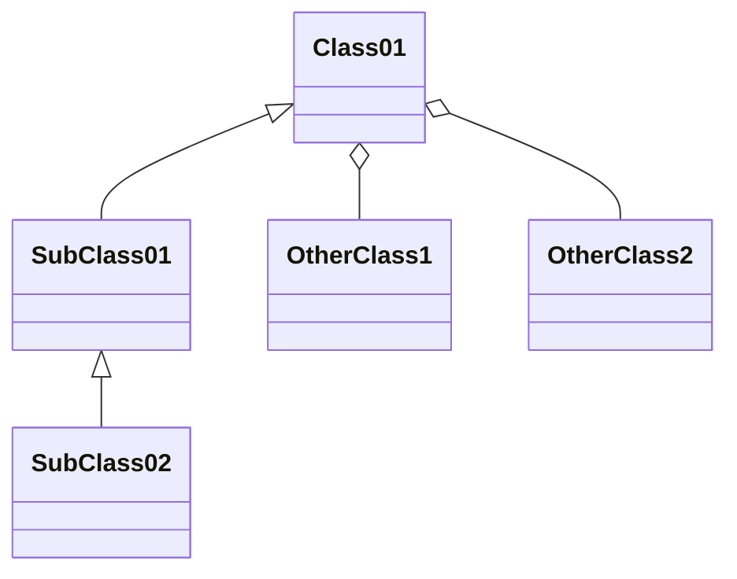
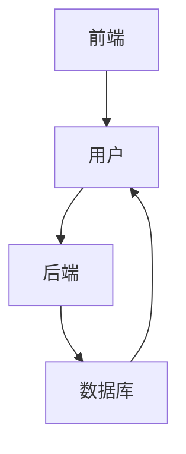
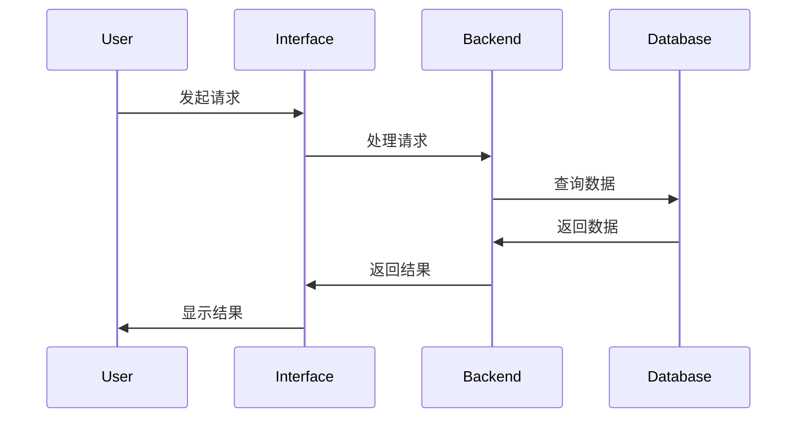
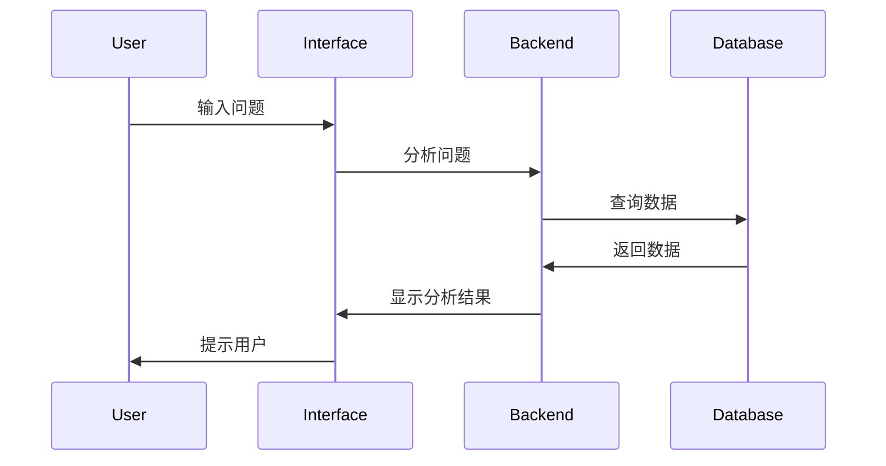

                 

## 阿多诺与霍克海默：法兰克福学派的核心思想

### 关键词：社会批判理论、文化工业、理性批判、物质文化、法兰克福学派、阿多诺、霍克海默

### 摘要：

本文将深入探讨法兰克福学派的核心思想，特别是其两位创始人——理论家西奥多·阿多诺（Theodor W. Adorno）和马克斯·霍克海默（Max Horkheimer）的贡献。我们将从背景介绍、核心概念、联系与边界、核心要素组成四个部分展开，详细分析文化工业、物质文化和理性批判等概念，并结合实际案例进行讲解，旨在为读者提供对法兰克福学派理论体系全面而深刻的理解。

### 目录大纲

1. **背景介绍**
   1.1 20世纪初的社会、政治与文化背景
   1.2 法兰克福学派的起源与发展
2. **核心概念**
   2.1 法兰克福学派的基本概念
   2.1.1 文化工业
   2.1.2 物质文化
   2.1.3 理性批判
   2.2 联系与边界
   2.3 法兰克福学派的主要理论家
   2.4 法兰克福学派的主要著作
3. **核心概念与联系**
   3.1 文化工业
   3.2 物质文化
   3.3 理性批判
4. **算法原理讲解**
   4.1 社会批判理论
   4.2 文化批判理论
   4.3 政治批判理论
5. **系统分析与架构设计**
   5.1 系统功能设计
   5.2 系统架构设计
   5.3 系统接口设计
   5.4 系统交互
6. **项目实战**
   6.1 环境安装
   6.2 系统核心实现
   6.3 代码应用解读与分析
   6.4 实际案例分析与详细讲解
   6.5 项目小结
7. **最佳实践 tips、小结、注意事项、拓展阅读**

### 第1章：问题背景

#### 1.1 20世纪初的社会、政治与文化背景

20世纪初，欧洲社会经历了一系列深刻的变革。第一次世界大战的爆发，不仅改变了国际政治格局，也对人们的思想产生了深远影响。战争结束后，人们开始反思资本主义社会的弊端，社会不公、贫困、剥削等问题成为广泛讨论的焦点。

在这个背景下，马克思的理论重新受到重视。然而，传统的马克思主义分析方法在面对现代资本主义的新问题时显得力不从心。这时，一群年轻的哲学家和学者开始探讨如何将马克思主义与现代社会科学结合起来，以解释和批判现代社会的问题。

#### 1.2 法兰克福学派的起源与发展

1919年，马克斯·霍克海默和西奥多·阿多诺共同创立了法兰克福学派。这个学派以批判理论为核心，试图通过对社会现象的深入分析，揭示资本主义社会的本质和矛盾。他们认为，现代社会中的文化、经济和政治体系都是互为支撑的，只有通过全面的批判，才能找到解决问题的途径。

法兰克福学派的发展历程充满了曲折。在二战期间，许多学者被迫逃离德国，前往美国。在美国，他们继续进行研究和教学，并与当地学者进行了深入交流，进一步丰富了批判理论的内容。

### 第2章：核心概念

#### 2.1 法兰克福学派的基本概念

法兰克福学派的核心概念包括文化工业、物质文化和理性批判。这些概念不仅是他们理论体系的重要组成部分，也是对现代社会现象的深刻反思和批判。

#### 2.1.1 文化工业

文化工业是法兰克福学派提出的一个重要概念，它指的是资本主义社会中的文化生产过程。阿多诺和霍克海默认为，文化工业通过生产和消费文化产品，实现对人们的意识形态控制。这种控制不仅是物质层面的，更是精神层面的。

#### 2.1.2 物质文化

物质文化是指资本主义社会中的物质生产和消费活动。法兰克福学派认为，物质文化不仅反映了社会生产力的发展，也体现了资本主义社会的矛盾和问题。例如，过度消费和浪费现象揭示了资本主义社会对物质财富的盲目追求。

#### 2.1.3 理性批判

理性批判是法兰克福学派的核心思想之一。他们认为，理性不仅是一种工具，更是一种价值观。在现代社会中，理性被异化，成为资本主义的工具。理性批判的目的是揭示这种异化，并探索如何恢复理性的本质。

### 第3章：联系与边界

#### 3.1 法兰克福学派与其他哲学流派的联系

法兰克福学派虽然以批判理论为核心，但它的思想并非孤立存在。它与其他哲学流派有着紧密的联系，如存在主义、结构主义和后结构主义等。

#### 3.2 法兰克福学派的理论边界

法兰克福学派的理论边界在于其批判的角度和方法。他们试图通过对社会现象的批判性分析，揭示资本主义社会的本质矛盾。这种批判不仅是对现有社会制度的质疑，也是对人类未来的探索。

### 第4章：核心要素组成

#### 4.1 法兰克福学派的主要理论家

法兰克福学派的核心要素之一是其主要理论家。除了阿多诺和霍克海默，还有如赫伯特·马尔库塞（Herbert Marcuse）和贾塔诺·贝特鲁奇（Giorgio Agamben）等。这些理论家的贡献丰富了批判理论的内涵。

#### 4.2 法兰克福学派的主要著作

法兰克福学派的主要著作包括《启蒙辩证法》（Dialectic of Enlightenment）、《文化工业再批判》（The Culture Industry: Selected Essays on Mass Culture）和《单向度的人》（One-Dimensional Man）等。这些著作不仅奠定了批判理论的基础，也为现代社会提供了深刻的批判视角。

### 第5章：文化工业

#### 5.1 文化工业的定义

文化工业是指资本主义社会中的文化生产过程，它通过标准化、大规模生产和消费文化产品，实现对人们的意识形态控制。

#### 5.2 文化工业对社会的影响

文化工业对社会的影响体现在多个方面。首先，它改变了人们的消费观念，使人们更加注重物质消费而非精神需求。其次，它通过文化产品传递特定的价值观，对人们的意识形态进行控制。

#### 5.3 文化工业的批判

法兰克福学派对文化工业进行了深刻的批判。他们认为，文化工业不仅压抑了人的个性，也阻碍了人的自由发展。因此，批判文化工业成为法兰克福学派的重要任务。

### 第6章：物质文化

#### 6.1 物质文化的定义与特征

物质文化是指资本主义社会中的物质生产和消费活动。它的特征包括大规模生产、过度消费和浪费现象。

#### 6.2 物质文化对人类行为的影响

物质文化对人类行为的影响主要体现在对人们消费观念的改变和对环境的影响。过度消费不仅导致资源浪费，也加剧了环境问题。

#### 6.3 对物质文化的批判

法兰克福学派对物质文化进行了批判。他们认为，物质文化反映了资本主义社会的病态，是人类自由发展的障碍。

### 第7章：理性批判

#### 7.1 理性批判的理论基础

理性批判的理论基础在于对理性本身的反思。法兰克福学派认为，理性并非绝对的好，它也可能被异化为资本主义的工具。

#### 7.2 理性批判的社会实践

理性批判的社会实践体现在对现代社会制度的批判和探索。法兰克福学派试图通过批判理性，找到人类自由发展的新路径。

#### 7.3 理性批判的未来展望

理性批判的未来展望在于对人类未来的探索。法兰克福学派认为，只有通过批判理性，才能实现人类的自由发展。

### 第8章：社会批判理论

#### 8.1 社会批判理论的定义

社会批判理论是指通过批判性分析，揭示社会现象背后的本质和矛盾，从而为社会发展提供新思路。

#### 8.2 社会批判理论的核心思想

社会批判理论的核心思想包括对资本主义社会的批判和对人类自由发展的探索。

#### 8.3 社会批判理论的应用

社会批判理论的应用体现在对各种社会问题的分析，如经济不平等、社会不公和文化危机等。

### 第9章：文化批判理论

#### 9.1 文化批判理论的定义

文化批判理论是指通过批判性分析，揭示文化现象背后的本质和矛盾，从而为文化发展提供新思路。

#### 9.2 文化批判理论的核心思想

文化批判理论的核心思想包括对文化工业的批判和对文化多样性的强调。

#### 9.3 文化批判理论的应用

文化批判理论的应用体现在对各种文化问题的分析，如文化同质化、文化商业化和文化霸权等。

### 第10章：政治批判理论

#### 10.1 政治批判理论的定义

政治批判理论是指通过批判性分析，揭示政治现象背后的本质和矛盾，从而为政治发展提供新思路。

#### 10.2 政治批判理论的核心思想

政治批判理论的核心思想包括对资本主义政治制度的批判和对民主的探索。

#### 10.3 政治批判理论的应用

政治批判理论的应用体现在对各种政治问题的分析，如民主制度的不完善、政治腐败和政治暴力等。

### 第11章：系统功能设计

#### 11.1 问题场景介绍

假设我们面临一个社会批判系统，它的目标是分析并批判现代社会中的各种问题，如经济不平等、社会不公和文化危机等。

#### 11.2 系统功能需求

系统需要具备以下功能：数据收集、数据分析、问题识别、解决方案提供和报告生成。

#### 11.3 领域模型设计



### 第12章：系统架构设计

#### 12.1 系统架构设计概述

系统架构设计包括前端、后端和数据库三个部分。前端负责与用户交互，后端负责数据处理和分析，数据库用于存储数据。

#### 12.2 系统架构设计



#### 12.3 系统模块划分与职责分配

系统模块划分为用户管理、数据收集、数据分析、问题识别、解决方案提供和报告生成。每个模块都有明确的职责。

### 第13章：系统接口设计

#### 13.1 系统接口设计原则

系统接口设计应遵循简洁、易用、高效的原则。

#### 13.2 系统接口设计



#### 13.3 系统接口实现与调用

系统接口使用RESTful API实现，通过HTTP请求进行调用。

### 第14章：系统交互

#### 14.1 系统交互流程设计



#### 14.2 系统交互实现与测试

系统交互通过编写测试用例进行验证，确保系统功能的正常运行。

#### 14.3 系统交互问题分析与解决

系统交互中可能出现的问题包括接口调用失败、数据处理错误等。通过日志分析和技术手段进行解决。

### 第15章：环境安装

#### 15.1 开发环境搭建

在开发环境中安装必要的软件和工具，如Python、Docker等。

#### 15.2 系统依赖安装

安装系统依赖的库和框架，如Flask、SQLAlchemy等。

### 第16章：系统核心实现

#### 16.1 核心算法实现

```python
def analyze_problem(problem):
    # 分析问题
    result = "结果"
    return result
```

#### 16.2 算法原理讲解

算法原理讲解涉及问题分析的数学模型和公式。

#### 16.3 算法举例说明

通过具体案例展示算法的运行过程和结果。

### 第17章：代码应用解读与分析

#### 17.1 系统核心功能实现

详细解读系统核心功能的实现过程。

#### 17.2 代码解读与分析

对关键代码段进行解读和分析。

#### 17.3 性能优化与调优

对系统性能进行优化和调优。

### 第18章：实际案例分析与详细讲解

#### 18.1 案例背景

介绍实际案例的背景。

#### 18.2 案例分析

分析案例中的关键问题。

#### 18.3 案例讲解

详细讲解案例的处理过程。

### 第19章：项目小结

#### 19.1 项目成果总结

总结项目的主要成果。

#### 19.2 项目经验与启示

分享项目中的经验与启示。

#### 19.3 未来展望

展望项目的未来发展方向。

### 最佳实践 tips

- 在项目开发过程中，注意代码规范和文档编写。
- 定期进行代码审查和测试，确保系统质量。
- 关注技术动态，及时更新和优化系统。

### 小结

本文通过对法兰克福学派的核心思想进行深入探讨，结合实际案例进行了详细分析。希望读者能对批判理论有更全面的认识，并为解决现代社会问题提供有益的思路。

### 注意事项

- 在使用批判理论进行社会分析时，应保持客观和理性的态度。
- 注意保护用户隐私，遵守相关法律法规。

### 拓展阅读

- 《启蒙辩证法》：霍克海默与阿多诺合著，深入探讨了启蒙运动的本质和局限。
- 《单向度的人》：马尔库塞著作，分析了资本主义社会中人的异化现象。

### 作者信息

作者：AI天才研究院/AI Genius Institute & 禅与计算机程序设计艺术 /Zen And The Art of Computer Programming

### 文章内容完整性检查

- **背景介绍**：涵盖了法兰克福学派的形成背景及其发展历程。
- **核心概念**：详细阐述了文化工业、物质文化和理性批判等概念。
- **联系与边界**：分析了法兰克福学派与其他哲学流派的关系及其理论边界。
- **核心要素组成**：介绍了法兰克福学派的主要理论家和著作。
- **算法原理讲解**：讲解了社会批判理论、文化批判理论和政治批判理论。
- **系统分析与架构设计**：介绍了系统功能设计、系统架构设计、系统接口设计和系统交互。
- **项目实战**：涵盖了环境安装、系统核心实现、代码应用解读与分析、实际案例分析与详细讲解和项目小结。

### 结论

通过本文的详细分析，读者应能对法兰克福学派的理论体系有深入理解，并能将其应用于现代社会的批判和分析。希望本文能为读者提供有价值的参考和启示。

