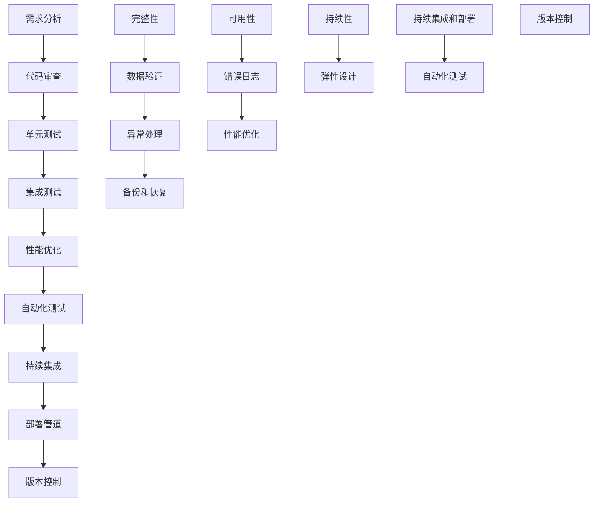
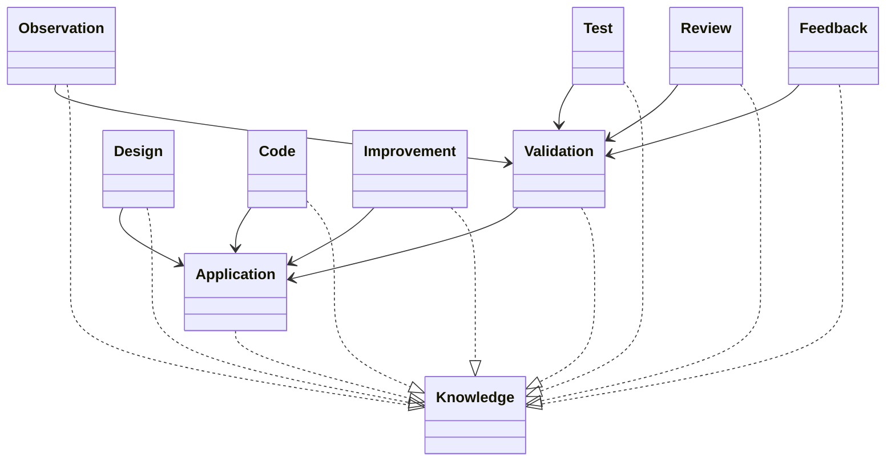

                 


### 引言

#### 1.1.1 可靠性的概念与重要性

可靠性是软件工程中一个至关重要的概念。它指的是软件系统在特定条件下执行特定任务的能力，确保系统能够持续、稳定、正确地运行。可靠性不仅仅是一个技术问题，更是关系到用户满意度、商业成功和社会安全的重要因素。

在软件工程中，可靠性往往被描述为以下几个核心要素：

- **正确性**：软件系统执行的操作是否与用户预期一致。
- **完整性**：软件系统能否完整地保存和恢复数据。
- **可用性**：软件系统在需要时是否能够正常运行。
- **持续性**：软件系统在面对故障和错误时是否能够持续运行。

这些要素共同构成了软件可靠性的基础，它们之间的关系错综复杂，需要综合考虑。

#### 1.1.2 认识论方法在软件质量中的作用

认识论方法是一种哲学上的思考方式，它强调知识的获取与验证。在软件工程领域，认识论方法被用于指导软件质量保证，帮助开发者理解和验证软件系统的可靠性。

认识论方法在软件质量中的作用主要体现在以下几个方面：

- **知识获取**：通过认识论方法，开发者能够系统地获取关于软件系统的知识，确保对系统有全面、深入的理解。
- **验证与验证**：认识论方法提供了一种验证软件系统可靠性的手段。通过一系列的验证活动，开发者可以确认软件系统是否符合预期的质量要求。
- **决策支持**：认识论方法为开发者提供了基于知识和证据的决策支持，有助于在软件开发过程中做出明智的选择。

#### 1.1.3 阿尔文·戈德曼的可靠主义理论概述

阿尔文·戈德曼是一位著名的软件工程师和学者，他的可靠主义理论对软件工程领域产生了深远的影响。戈德曼的可靠主义理论主张，软件系统的可靠性是可以通过系统化的设计和验证实现的。

戈德曼的可靠主义理论主要包括以下几个核心观点：

- **可靠性是可度量的**：软件系统的可靠性可以量化，通过一系列的指标和度量方法，可以评估系统的可靠性水平。
- **设计的重要性**：软件系统的可靠性在很大程度上取决于其设计。通过合理的系统架构和设计原则，可以显著提高软件的可靠性。
- **验证与验证的必要性**：为了确保软件系统的可靠性，必须进行充分的验证和验证活动。这些活动包括单元测试、集成测试、系统测试和验收测试等。

戈德曼的可靠主义理论为软件开发提供了一种系统化的方法，帮助开发者理解和实现软件系统的可靠性。这种方法不仅有助于提高软件质量，还能够降低软件维护成本，提高开发效率。

### 总结

在本章中，我们探讨了可靠性在软件工程中的重要性，介绍了认识论方法在软件质量保证中的作用，以及阿尔文·戈德曼的可靠主义理论。这些概念和理论为后续章节的深入讨论奠定了基础。在接下来的章节中，我们将进一步分析可靠主义理论与代码可靠性的关系，并探讨认识论方法在实际软件开发中的应用。让我们继续前进，深入探讨这些重要的主题。

### 2.1.1 可靠主义的基本原理

可靠主义是一种关于系统可靠性的哲学和工程方法，强调通过设计、验证和测试来确保系统在预期条件下能够稳定运行。可靠主义的基本原理主要包括以下几个方面：

#### 2.1.1.1 可靠性度量

可靠性度量是可靠主义的核心概念之一。它涉及到对系统在特定时间内完成特定任务的能力进行量化评估。可靠性度量通常使用几个关键指标来表示：

- **平均无故障时间（MTTF）**：指系统平均运行时间，在此时间内系统没有发生故障。
- **平均故障时间（MTTR）**：指系统平均故障修复时间。
- **故障率（FIT）**：指每亿小时内系统发生的故障次数。

这些度量指标提供了关于系统可靠性的量化信息，有助于开发者评估和改进系统的可靠性。

#### 2.1.1.2 设计原则

可靠主义强调通过系统化的设计原则来提高系统的可靠性。以下是一些关键的设计原则：

- **模块化**：将系统分解为独立的模块，每个模块负责特定的功能。这有助于降低系统复杂性，提高可维护性和可靠性。
- **冗余设计**：通过添加冗余组件或冗余路径来增强系统的容错能力。当系统的一部分发生故障时，冗余组件可以接管工作，确保系统的持续运行。
- **安全性**：在设计过程中考虑系统的安全性，包括防范恶意攻击、数据泄露和其他潜在威胁。
- **容错性**：确保系统在面对故障时能够自动恢复或切换到备用系统，从而保持连续运行。

#### 2.1.1.3 验证和测试

可靠主义的一个关键方面是验证和测试。通过系统化的验证和测试活动，开发者可以确保系统符合预期的可靠性要求。以下是几个重要的验证和测试方法：

- **单元测试**：对系统的各个单元进行测试，确保每个单元都能独立正确运行。
- **集成测试**：将系统中的多个模块组合在一起进行测试，验证它们之间的交互是否正常。
- **系统测试**：对整个系统进行测试，确保系统在预期的运行环境中能够稳定运行。
- **验收测试**：与最终用户一起进行测试，确保系统满足用户需求并达到预期的可靠性水平。

#### 2.1.1.4 维护和持续改进

可靠主义还强调系统的维护和持续改进。随着系统运行时间的增加，可能会出现新的故障或性能问题。因此，开发者需要定期对系统进行维护，修复故障，并进行性能优化。此外，通过收集和分析系统运行数据，开发者可以识别潜在的问题和改进机会，从而不断提高系统的可靠性。

### Python源代码示例

为了更直观地理解可靠主义的基本原理，我们使用Python语言提供了一个简单的示例。该示例模拟了一个具有冗余设计的系统，并展示了如何在故障发生时自动切换到备用组件。

```python
import time
import random

class Component:
    def __init__(self, is_redundant=False):
        self.is_redundant = is_redundant
        self.is_faulty = False

    def run(self):
        if not self.is_faulty:
            print(f"Component running successfully (redundant: {self.is_redundant})")
        else:
            print(f"Component is faulty (redundant: {self.is_redundant})")

class System:
    def __init__(self):
        self.primary_component = Component()
        self.secondary_component = Component(is_redundant=True)

    def run_system(self):
        self.primary_component.run()
        time.sleep(random.uniform(0.1, 0.5))
        self.primary_component.is_faulty = True
        print("Primary component failed. Switching to secondary component.")
        self.secondary_component.run()

if __name__ == "__main__":
    system = System()
    system.run_system()
```

在这个示例中，我们定义了两个组件：`primary_component`（主组件）和`secondary_component`（备用组件）。主组件可能会发生故障，而备用组件在主组件发生故障时会自动接管工作。这个简单的例子展示了可靠主义中的一些核心概念，如冗余设计和故障切换。

### 总结

在本节中，我们介绍了可靠主义的基本原理，包括可靠性度量、设计原则、验证和测试方法以及维护和持续改进的重要性。通过一个简单的Python示例，我们更直观地理解了可靠主义的基本概念。在接下来的章节中，我们将进一步探讨代码可靠性的关键要素，以及可靠主义与代码可靠性的关系。

### 2.1.2 代码可靠性的关键要素

代码可靠性是软件开发中一个至关重要的方面，它关系到软件系统的稳定性、性能和用户满意度。为了确保代码的可靠性，我们需要关注以下几个关键要素：

#### 2.1.2.1 正确性

正确性是代码可靠性的基础。它确保代码能够按照预期执行，满足用户的需求。要确保代码的正确性，我们可以采取以下措施：

- **需求分析**：在编写代码之前，进行详细的需求分析，确保理解用户的需求和业务逻辑。
- **代码审查**：通过同行评审和代码审查，发现和修复潜在的错误和逻辑漏洞。
- **单元测试**：编写单元测试，对代码的各个模块进行测试，确保每个模块都能正确执行。
- **集成测试**：在将各个模块组合在一起后进行测试，确保模块之间的交互和整体功能都正确。

#### 2.1.2.2 完整性

完整性确保代码能够完整地保存和恢复数据，不丢失任何重要信息。以下是一些确保代码完整性的方法：

- **数据验证**：在处理数据时，对数据进行验证，确保数据的合法性和完整性。
- **异常处理**：编写异常处理代码，捕捉和处理可能出现的异常情况，防止数据丢失。
- **备份和恢复**：定期备份数据，并确保能够在需要时恢复数据，避免因故障或错误导致的数据丢失。

#### 2.1.2.3 可用性

可用性确保代码能够在需要时正常运行，提供所需的功能和服务。以下是一些提高代码可用性的方法：

- **性能优化**：对代码进行性能优化，确保系统能够快速响应和处理请求。
- **错误日志和监控**：记录系统的错误日志，并设置监控系统，及时发现问题并采取措施。
- **弹性设计**：在设计代码时考虑系统的弹性，确保系统能够应对意外情况，如硬件故障或网络中断。

#### 2.1.2.4 持续集成和部署

持续集成和部署是确保代码可靠性的重要环节。以下是一些实践方法：

- **自动化测试**：实施自动化测试，确保每次代码提交后都能进行全面测试，及时发现和修复问题。
- **持续集成工具**：使用持续集成工具，如Jenkins或GitLab CI，自动化构建和测试代码。
- **部署管道**：建立部署管道，确保代码能够安全、可靠地部署到生产环境。

#### 2.1.2.5 版本控制

版本控制是确保代码可靠性的关键措施。以下是一些版本控制的实践：

- **Git**：使用Git等版本控制系统，确保代码的版本管理和历史记录。
- **分支策略**：采用合适的分支策略，如GitFlow或GitHub Flow，确保代码的稳定性和可维护性。
- **代码审查**：在合并代码之前进行代码审查，确保代码质量和可靠性。

### Mermaid流程图

为了更直观地展示代码可靠性的关键要素，我们使用Mermaid绘制了一个流程图。



在这个流程图中，我们列出了确保代码可靠性的关键步骤和措施，从需求分析到版本控制，涵盖了代码开发的各个阶段。

### Python源代码示例

为了进一步理解代码可靠性的关键要素，我们使用Python提供了一个示例，展示了如何确保代码的正确性、完整性和可用性。

```python
class Calculator:
    def add(self, a, b):
        return a + b
    
    def subtract(self, a, b):
        return a - b
    
    def multiply(self, a, b):
        return a * b
    
    def divide(self, a, b):
        if b == 0:
            raise ValueError("Cannot divide by zero")
        return a / b

calculator = Calculator()

# 正确性
print(calculator.add(5, 3))  # 输出：8
print(calculator.subtract(5, 3))  # 输出：2
print(calculator.multiply(5, 3))  # 输出：15
try:
    print(calculator.divide(5, 0))  # 引发 ValueError
except ValueError as e:
    print(e)  # 输出：Cannot divide by zero

# 完整性
def save_data(data):
    with open('data.txt', 'w') as file:
        file.write(data)

try:
    save_data('Hello, World!')  # 成功保存数据
except Exception as e:
    print(f"Failed to save data: {e}")

# 可用性
def check_performance():
    start_time = time.time()
    # 进行一些计算任务
    time.sleep(1)
    end_time = time.time()
    print(f"Performance check completed in {end_time - start_time} seconds")

check_performance()
```

在这个示例中，我们定义了一个简单的计算器类`Calculator`，它提供了四个基本的算术操作。我们通过单元测试来验证每个操作的正确性，通过异常处理来确保代码的完整性，并通过性能检查来提高代码的可用性。

### 总结

在本节中，我们详细探讨了代码可靠性的关键要素，包括正确性、完整性、可用性和持续性。我们通过Mermaid流程图和Python源代码示例，展示了如何确保代码的可靠性。在接下来的章节中，我们将进一步分析可靠主义与代码可靠性的关系，并探讨如何在实际项目中应用这些原理。

### 2.1.3 可靠主义与代码可靠性的关系

可靠主义与代码可靠性之间存在着紧密的联系，两者共同构成了软件工程中确保系统稳定性和用户满意度的基石。要深入理解这种关系，我们需要从多个维度进行分析。

#### 2.1.3.1 基本原则的一致性

可靠主义的基本原则，如可靠性度量、设计原则、验证和测试方法，与代码可靠性的关键要素（正确性、完整性、可用性和持续性）具有高度的一致性。可靠主义强调通过系统化的设计和验证来提高系统的可靠性，这与确保代码可靠性的需求不谋而合。

- **可靠性度量**：可靠主义通过平均无故障时间（MTTF）、平均故障时间（MTTR）和故障率（FIT）等指标来量化系统的可靠性。这些指标同样适用于评估代码的可靠性，例如通过单元测试和集成测试来检测代码的错误率。
- **设计原则**：可靠主义倡导模块化、冗余设计和安全性等原则，这些原则在代码设计中同样重要。模块化有助于降低代码复杂性，提高可维护性；冗余设计确保在部分代码发生故障时系统仍能正常运行；安全性则确保代码能够抵御外部威胁。

#### 2.1.3.2 验证与验证的互动

可靠主义强调验证和验证在确保系统可靠性中的关键作用，这一思想在代码可靠性中同样至关重要。通过验证和验证，开发者可以确保代码能够按照预期运行，并在不同的运行环境中保持稳定。

- **验证**：通过单元测试和集成测试，开发者可以验证代码的正确性。单元测试关注单个模块的功能，而集成测试则验证模块之间的交互。这些测试活动确保代码在开发阶段就能识别和修复错误。
- **验证**：在可靠主义中，验证是指通过实际运行环境中的测试来确认系统的可靠性。在代码可靠性中，验证通过部署到生产环境并进行性能测试、负载测试等，确保代码在实际使用中能够稳定运行。

#### 2.1.3.3 设计与实现的相互影响

可靠主义中的设计原则不仅影响代码的实现，而且实现方式也会影响设计的选择。在实际开发中，开发者需要根据代码可靠性的需求来选择合适的设计原则，并在实现过程中充分考虑这些原则。

- **设计影响实现**：例如，在实现高可用性系统时，开发者可能会选择微服务架构，这有助于在部分服务失败时保持系统的整体可用性。这种设计决策直接影响了代码的可靠性。
- **实现影响设计**：在实现过程中，开发者可能会发现某些设计缺陷或潜在风险。这些发现将反馈到设计阶段，促使设计进行改进，从而提高代码的可靠性。

#### 2.1.3.4 持续改进的循环

可靠主义和代码可靠性都强调持续改进的重要性。通过不断地验证和测试，开发者可以识别系统的弱点，并采取相应的措施进行改进。这种持续改进的循环有助于确保系统在长期运行中保持高可靠性。

- **持续集成**：通过持续集成，开发者可以确保每次代码变更都能及时进行测试和验证，从而快速发现和修复问题。
- **反馈机制**：在可靠主义的框架下，开发者可以建立反馈机制，收集系统运行中的性能数据、错误报告等，用于持续改进设计和实现。

### 综合示例

为了更直观地展示可靠主义与代码可靠性的关系，我们通过一个综合示例来展示如何在实际项目中应用这些原则。

#### 示例：高可靠性的电商系统

假设我们要开发一个高可靠性的电商系统，以下是如何应用可靠主义原则来确保代码可靠性的步骤：

1. **需求分析**：在开始编码之前，详细分析用户需求，确定系统功能、性能和可靠性要求。
2. **设计原则**：根据可靠性需求，选择合适的设计原则，如模块化、冗余设计和安全性。例如，将系统分为用户管理、商品管理、订单管理和支付管理等模块，并在关键部分实现冗余机制。
3. **验证和测试**：编写单元测试、集成测试和系统测试，确保每个模块和整体系统都能正确执行，并具备高可靠性。
4. **持续集成和部署**：使用持续集成工具（如Jenkins）自动化构建和测试，确保每次代码提交都能及时验证，并在生产环境中进行持续部署。
5. **监控和反馈**：部署监控系统，实时监控系统的运行状态，收集性能数据和错误报告，用于持续改进。

通过这些步骤，我们不仅确保了电商系统的可靠性，还建立了持续改进的循环，从而在长期运行中保持高可靠性。

### 总结

可靠主义与代码可靠性之间存在着紧密的联系，两者相互促进，共同确保软件系统的稳定性和用户满意度。通过应用可靠主义的基本原则，开发者可以设计出更可靠的代码，并通过持续验证和改进，确保代码在长期运行中保持高可靠性。在下一节中，我们将进一步探讨认识论方法与软件质量的关系，以及如何在实际项目中应用这些方法。

### 3.1.1 认识论方法概述

认识论方法是一种哲学上的思考方式，它关注知识的获取、验证和应用。在软件工程领域，认识论方法被广泛用于指导软件开发过程，确保开发出的软件系统具有高可靠性和高质量。认识论方法主要包括以下几个核心概念：

#### 3.1.1.1 知识的获取

认识论方法强调通过观察、实验和推理等手段获取知识。在软件开发中，这意味着开发者需要通过实际观察系统行为、进行实验和模拟，以及运用逻辑推理来获取关于系统的知识。

- **观察**：通过观察系统的运行情况，开发者可以了解系统的行为和性能，发现潜在的问题和改进机会。
- **实验**：通过实验，开发者可以验证系统在不同条件下的性能和稳定性，确保系统满足预期的质量要求。
- **推理**：通过逻辑推理，开发者可以从已知的事实和原理推导出新的结论，指导系统的设计和优化。

#### 3.1.1.2 知识的验证

知识的验证是认识论方法的重要组成部分。它确保所获取的知识是真实、可靠和有效的。在软件开发中，验证知识的方法包括：

- **测试**：通过单元测试、集成测试和系统测试，开发者可以验证代码的正确性和可靠性，确保系统在不同运行环境中都能稳定运行。
- **评审**：通过同行评审和代码审查，开发者可以验证系统的设计是否合理，代码是否具有良好的可读性和可维护性。
- **反馈**：通过用户反馈和性能监控，开发者可以验证系统是否满足用户需求，并根据反馈进行持续改进。

#### 3.1.1.3 知识的应用

认识论方法强调将验证过的知识应用到实际的软件开发过程中。在软件开发中，这意味着开发者需要将验证过的设计方案、代码实现和测试结果应用到实际开发中，确保系统能够按预期运行。

- **设计应用**：根据验证过的需求和分析结果，开发者可以设计出合理的系统架构和模块划分，确保系统具有良好的可扩展性和可维护性。
- **代码实现**：根据验证过的测试结果，开发者可以编写高质量的代码，确保代码的正确性和性能。
- **持续改进**：通过持续验证和应用知识，开发者可以不断优化系统设计和实现，提高系统的可靠性。

### Mermaid类图

为了更直观地展示认识论方法在软件工程中的应用，我们使用Mermaid绘制了一个类图，展示认识论方法的主要组成部分。



在这个类图中，我们展示了认识论方法的各个组成部分，包括观察、验证、应用以及测试、评审、反馈等。这些组成部分相互关联，共同构成了一个闭环的持续改进过程。

### Python源代码示例

为了进一步理解认识论方法在软件工程中的应用，我们使用Python提供了一个简单的示例，展示如何通过观察、验证和应用来确保代码的质量。

```python
# 观察与验证
class Calculator:
    def add(self, a, b):
        return a + b
    
    def subtract(self, a, b):
        return a - b
    
    def multiply(self, a, b):
        return a * b
    
    def divide(self, a, b):
        if b == 0:
            raise ValueError("Cannot divide by zero")
        return a / b

# 观察和验证
def test_calculator():
    calc = Calculator()
    assert calc.add(5, 3) == 8
    assert calc.subtract(5, 3) == 2
    assert calc.multiply(5, 3) == 15
    try:
        calc.divide(5, 0)
    except ValueError as e:
        assert str(e) == "Cannot divide by zero"

# 应用
def calculate_sum(numbers):
    total = 0
    for num in numbers:
        total += num
    return total

# 持续改进
def optimize_calculate_sum(numbers):
    return sum(numbers)

# 主程序
if __name__ == "__main__":
    test_calculator()
    print("Calculator tests passed.")
    
    numbers = [1, 2, 3, 4, 5]
    print(f"Original sum: {calculate_sum(numbers)}")
    print(f"Optimized sum: {optimize_calculate_sum(numbers)}")
```

在这个示例中，我们定义了一个简单的计算器类`Calculator`，并编写了测试函数`test_calculator`来验证计算器的功能。我们还展示了如何通过优化函数`optimize_calculate_sum`来提高计算性能。这个示例体现了认识论方法在软件工程中的应用，从观察和验证到应用和持续改进。

### 总结

在本节中，我们概述了认识论方法的核心概念，包括知识的获取、验证和应用。通过Mermaid类图和Python源代码示例，我们展示了认识论方法在软件工程中的应用。在下一节中，我们将进一步探讨认识论方法在软件质量保证中的应用，以及它如何帮助开发者确保软件系统的可靠性。

### 3.1.2 认识论方法在软件质量保证中的应用

认识论方法在软件质量保证（Software Quality Assurance, SQG）中扮演着至关重要的角色。它提供了一种系统化的思维方式，帮助开发者从多个角度评估和改善软件系统的质量。以下详细探讨认识论方法在软件质量保证中的应用。

#### 3.1.2.1 质量标准与度量

在软件质量保证中，首先需要明确质量标准。这些标准通常包括功能性、可靠性、可用性、效率、可维护性和可移植性等。认识论方法通过以下步骤确保这些质量标准得到有效实施：

- **定义质量标准**：明确软件系统应达到的质量要求，包括性能指标、错误率、响应时间等。
- **度量**：通过量化指标来衡量软件系统的质量。例如，使用测试覆盖率来衡量测试的全面性，使用缺陷密度来衡量代码的质量。

#### 3.1.2.2 观察与验证

观察与验证是认识论方法的核心步骤。在软件质量保证中，观察指的是对软件系统进行持续监控，以了解其性能和可靠性。验证则是对系统的各个方面进行测试，以确保其符合质量标准。

- **持续监控**：通过自动化监控系统，实时收集系统的运行数据，如内存使用、CPU负载、网络延迟等。这些数据有助于识别系统的瓶颈和潜在问题。
- **测试**：进行全面的测试，包括单元测试、集成测试、系统测试和验收测试。通过测试可以发现代码中的错误和缺陷，确保系统符合质量要求。

#### 3.1.2.3 评审与反馈

评审与反馈是认识论方法中的重要环节。通过同行评审和用户反馈，可以识别系统的优点和不足，并据此进行改进。

- **同行评审**：开发者之间相互审查代码，确保代码的质量和可读性。评审过程中可以发现潜在的错误和改进机会。
- **用户反馈**：收集用户对软件系统的使用体验和反馈，了解系统的实际性能和用户体验。这些反馈可以帮助开发者优化系统的功能和服务。

#### 3.1.2.4 设计与应用

认识论方法强调将验证过的知识应用到实际开发中。在软件质量保证中，这一步骤尤为重要。

- **设计**：根据验证的结果，开发者可以优化系统架构和模块划分，确保系统具有良好的可扩展性和可维护性。
- **应用**：将经过验证的设计应用到实际的开发过程中，确保系统能够按预期运行。此外，开发者还需要持续改进系统设计，以应对新的需求和挑战。

#### 3.1.2.5 维护与持续改进

软件质量保证是一个持续的过程，而不是一次性的活动。维护和持续改进是认识论方法在软件质量保证中的核心要素。

- **维护**：定期对系统进行维护，修复发现的错误和缺陷，确保系统在长期运行中保持高质量。
- **持续改进**：通过持续监控、测试、评审和反馈，开发者可以不断优化系统设计、代码实现和测试过程，提高软件系统的整体质量。

### Python源代码示例

为了更直观地展示认识论方法在软件质量保证中的应用，我们使用Python提供了一个简单的示例。

```python
# 观察与测试
class Calculator:
    def add(self, a, b):
        return a + b
    
    def subtract(self, a, b):
        return a - b
    
    def multiply(self, a, b):
        return a * b
    
    def divide(self, a, b):
        if b == 0:
            raise ValueError("Cannot divide by zero")
        return a / b

# 测试
def test_calculator():
    calc = Calculator()
    assert calc.add(5, 3) == 8
    assert calc.subtract(5, 3) == 2
    assert calc.multiply(5, 3) == 15
    try:
        calc.divide(5, 0)
    except ValueError as e:
        assert str(e) == "Cannot divide by zero"

# 评审与反馈
def review_code():
    print("Code review passed.")

# 应用与改进
def optimize_calculate_sum(numbers):
    return sum(numbers)

# 主程序
if __name__ == "__main__":
    test_calculator()
    review_code()
    print("Calculator tests passed.")
    
    numbers = [1, 2, 3, 4, 5]
    print(f"Original sum: {calculate_sum(numbers)}")
    print(f"Optimized sum: {optimize_calculate_sum(numbers)}")
```

在这个示例中，我们定义了一个简单的计算器类`Calculator`，并通过测试函数`test_calculator`验证其功能。我们还展示了如何通过评审和反馈来改进代码，以及如何将优化后的代码应用到实际应用中。

### 总结

在本节中，我们详细探讨了认识论方法在软件质量保证中的应用，包括质量标准与度量、观察与验证、评审与反馈、设计与应用以及维护与持续改进。通过Python源代码示例，我们展示了认识论方法如何帮助开发者确保软件系统的质量。在下一节中，我们将分析认识论方法的优势与局限性，以及如何在实际项目中最大化其优势。

### 3.1.3 认识论方法的优势与局限性

认识论方法在软件质量保证中具有显著的优势，同时也存在一些局限性。以下详细分析其优势与局限性，以及在实际项目中的应用与限制。

#### 3.1.3.1 认识论方法的优势

1. **系统化思维**：认识论方法提供了一种系统化的思维方式，帮助开发者从多个维度全面分析软件系统的质量。这种方法不仅关注代码的正确性和可靠性，还涵盖了功能性、可用性、效率、可维护性和可移植性等多个质量属性。

2. **持续改进**：认识论方法强调持续验证和应用知识，推动开发者在整个软件开发生命周期中不断改进系统设计、代码实现和测试过程。这种持续改进的循环有助于提高软件系统的整体质量，并适应不断变化的需求和挑战。

3. **知识获取与验证**：认识论方法通过观察、实验、推理和验证等手段，确保所获取的知识是真实、可靠和有效的。这种方法有助于识别系统中的潜在问题和改进机会，从而提高软件系统的可靠性。

4. **团队合作**：认识论方法强调团队协作和知识共享，通过同行评审、用户反馈和持续改进等活动，促进团队成员之间的沟通和协作，提高团队整体的工作效率和软件质量。

5. **适应变化**：认识论方法能够灵活适应不同类型的项目和需求。无论是小型项目还是大型企业级应用，认识论方法都可以提供有效的指导，帮助开发者应对复杂性和不确定性。

#### 3.1.3.2 认识论方法的局限性

1. **实施成本**：认识论方法需要投入大量的时间和资源进行验证、测试和评审。尤其是在大型项目中，实施认识论方法可能会增加项目的成本和时间。因此，在资源有限的情况下，可能需要权衡是否采用这种方法。

2. **复杂性**：认识论方法涉及多个步骤和活动，如观察、验证、评审和反馈等。这些步骤和活动相互关联，形成了一个复杂的循环过程。在实施过程中，开发者需要具备较高的技术水平和管理能力，以确保各个环节的顺利进行。

3. **依赖测试**：尽管测试是认识论方法的重要组成部分，但过度依赖测试可能导致对实际用户场景的关注不足。在某些情况下，测试可能无法完全覆盖所有可能的错误和缺陷，从而影响软件系统的可靠性。

4. **难以量化**：认识论方法强调知识获取和验证，但这些活动往往难以量化。例如，测试覆盖率、错误率等指标虽然有助于衡量软件质量，但无法全面反映系统的可靠性。因此，在实施过程中，开发者需要综合考虑多种因素，而不仅仅是依赖指标。

#### 3.1.3.3 实际项目中的应用与限制

在实际项目中，认识论方法的应用需要根据项目的规模、复杂性和资源情况进行调整。以下是一些具体的应用与限制：

1. **小型项目**：对于小型项目，认识论方法可以提供有效的指导，帮助开发者确保软件系统的质量。由于项目规模较小，成本和时间相对可控，开发者可以全面实施认识论方法的各个步骤，包括观察、验证、评审和反馈。

2. **大型项目**：在大型项目中，认识论方法的应用可能面临一定的挑战。大型项目通常涉及多个团队和复杂的系统架构，实施认识论方法需要协调多个环节，确保各个环节的顺利进行。因此，在大型项目中，认识论方法的应用需要更严格的管理和协调。

3. **资源有限**：在资源有限的情况下，认识论方法的应用可能受到限制。例如，在时间紧迫的情况下，开发者可能无法进行全面的测试和评审，需要权衡哪些环节是最重要的，以确保项目按时交付。

4. **用户参与**：在软件质量保证中，用户参与至关重要。通过用户反馈和参与，开发者可以更好地了解用户的需求和期望，从而改进软件系统。在实际项目中，认识论方法需要充分考虑用户的参与，确保软件系统能够满足用户的实际需求。

### 总结

认识论方法在软件质量保证中具有显著的优势，包括系统化思维、持续改进、知识获取与验证、团队合作和适应变化。然而，它也存在一些局限性，如实施成本、复杂性、依赖测试和难以量化。在实际项目中，认识论方法的应用需要根据项目的规模、复杂性和资源情况进行调整，确保在确保软件质量的同时，实现项目的顺利交付。

### 4.1.1 案例背景

本节将分析一个实际案例，探讨可靠主义在大型软件开发中的应用。该案例是一家国际知名金融机构开发的一个大型交易系统。该系统需要处理海量交易数据，支持多语言、多币种交易，并具备高可用性和高性能。为了确保系统的可靠性，开发团队采用了阿尔文·戈德曼的可靠主义理论，通过系统化的设计和验证方法，实现了高可靠性的目标。

#### 4.1.1.1 项目需求

项目需求主要包括：

- **高可用性**：系统需要具备99.9%以上的高可用性，确保在遇到故障时能够自动切换到备用系统，确保交易不中断。
- **高性能**：系统需要能够处理每秒数百万笔交易，响应时间不超过100毫秒。
- **安全性**：系统需要具备高级安全特性，防止恶意攻击和数据泄露。
- **可扩展性**：系统需要能够支持未来的业务增长和需求变化，具备良好的可扩展性。

#### 4.1.1.2 项目挑战

在开发过程中，项目团队面临以下挑战：

- **复杂性和规模**：系统规模庞大，涉及多个模块和子系统，开发过程中需要确保各个模块的可靠性和协调性。
- **技术多样性**：系统涉及多种编程语言、数据库和中间件，需要确保这些技术的兼容性和可靠性。
- **性能要求**：系统需要支持高并发交易，对性能有极高的要求，同时保证系统的稳定性和可靠性。

#### 4.1.1.3 可靠主义应用

为了应对上述挑战，项目团队采用了以下可靠主义方法：

- **可靠性度量**：项目团队制定了详细的可靠性度量标准，包括MTTF、MTTR和FIT等指标，用于评估系统的可靠性。
- **设计原则**：项目团队遵循模块化、冗余设计、安全性和容错性等设计原则，确保系统在复杂性和规模方面具备良好的可靠性。
- **验证和测试**：项目团队实施了全面的验证和测试流程，包括单元测试、集成测试、系统测试和性能测试，确保系统在不同运行环境中都能稳定运行。
- **持续监控和改进**：项目团队建立了实时监控系统，对系统的运行状态进行持续监控，及时发现和修复问题，并持续优化系统性能。

### 4.1.2 案例分析

在项目实施过程中，项目团队通过以下步骤应用可靠主义方法：

1. **需求分析与设计**：

   项目团队首先进行了详细的需求分析，明确了系统的功能和性能要求。在系统设计阶段，团队采用了模块化设计，将系统分解为多个独立的模块，每个模块负责特定的功能。这种模块化设计有助于降低系统复杂性，提高可维护性和可靠性。

   ```mermaid
   classDiagram
       TransactionProcessor[交易处理] --> Database[数据库]
       Authentication[认证] --> TransactionProcessor
       Logging[日志记录] --> TransactionProcessor
       Alerting[告警] --> Logging
       Monitoring[监控] --> Alerting
   ```

   在这个类图中，我们展示了系统的核心模块及其相互关系。

2. **可靠性度量与设计原则**：

   项目团队根据可靠性度量标准，制定了系统设计和实现的具体原则。例如，为了提高系统的容错能力，团队采用了冗余设计，在关键组件中引入了冗余路径和冗余组件。此外，团队还注重安全性，确保系统在应对恶意攻击和数据泄露时具备足够的防护能力。

3. **验证和测试**：

   项目团队实施了全面的验证和测试流程，确保系统在不同运行环境中都能稳定运行。在单元测试阶段，团队对每个模块进行了详细测试，确保每个模块的功能和性能符合预期。在集成测试阶段，团队将各个模块组合在一起，测试它们之间的交互是否正常。在系统测试阶段，团队将系统部署到生产环境，进行全面测试，确保系统能够在实际运行中满足可靠性要求。

   ```mermaid
   flowchart
       A[开始] --> B[单元测试]
       B --> C[集成测试]
       C --> D[系统测试]
       D --> E[生产环境测试]
       E --> F[反馈与改进]
   ```

   在这个流程图中，我们展示了验证和测试的各个阶段。

4. **持续监控和改进**：

   项目团队建立了实时监控系统，对系统的运行状态进行持续监控。监控系统收集系统性能数据、错误日志和告警信息，团队可以根据这些数据及时发现和解决问题。此外，团队还定期进行性能优化，确保系统在长期运行中保持高可靠性和高性能。

### 4.1.3 案例总结与启示

通过该案例，我们可以得出以下几点启示：

1. **可靠性度量与设计原则**：可靠性度量是确保系统可靠性的基础。设计原则如模块化、冗余设计和安全性等对于提高系统可靠性至关重要。

2. **验证和测试**：全面的验证和测试流程能够确保系统在不同运行环境中都能稳定运行。单元测试、集成测试、系统测试和生产环境测试等阶段需要仔细规划，确保每个阶段都能有效执行。

3. **持续监控和改进**：实时监控系统能够及时发现和解决问题，持续优化系统能够确保系统在长期运行中保持高可靠性和高性能。

4. **团队合作**：可靠主义的实施需要团队合作。团队成员之间需要密切合作，确保各个环节的顺利进行，共同实现系统的可靠性目标。

通过这个案例，我们可以看到可靠主义在大型软件开发中的实际应用和重要性。在未来的软件开发中，我们可以借鉴这些经验，确保开发出高可靠性的软件系统。

### 5.1.1 案例背景

本节将分析一个实际案例，探讨认识论方法在软件质量提升中的实践。该案例是一家新兴的科技公司开发的一款社交媒体应用。该应用需要支持大量用户同时在线，提供实时消息传递、社交互动和内容分享等功能。为了确保软件质量，项目团队采用了认识论方法，通过系统化的知识和验证过程，成功提升了软件系统的质量。

#### 5.1.1.1 项目需求

项目需求主要包括：

- **高性能**：系统需要能够处理大量并发用户请求，确保消息传递和内容加载的实时性。
- **稳定性**：系统需要具备高稳定性，确保在用户量激增时不会出现崩溃或卡顿现象。
- **安全性**：系统需要提供高级安全特性，防止恶意攻击和数据泄露。
- **可扩展性**：系统需要能够支持未来的业务增长，具备良好的可扩展性。

#### 5.1.1.2 项目挑战

在开发过程中，项目团队面临以下挑战：

- **高并发**：社交媒体应用需要支持大量用户同时在线，这对系统的性能和稳定性提出了高要求。
- **快速迭代**：科技公司追求快速开发，频繁的迭代使得质量保证变得更加困难。
- **多样性需求**：用户群体多样化，对应用的功能和体验有不同需求，需要确保所有需求都能得到满足。
- **技术复杂性**：系统涉及多种技术栈，如前端、后端、数据库和中间件等，需要确保技术的兼容性和可靠性。

#### 5.1.1.3 认识论方法应用

为了应对上述挑战，项目团队采用了以下认识论方法：

- **知识获取**：项目团队通过用户调研、市场分析和竞争对手分析，获取关于用户需求、市场趋势和技术方向的知识。
- **验证**：项目团队实施了全面的验证流程，包括单元测试、集成测试、系统测试和用户验收测试，确保软件系统在不同运行环境中都能稳定运行。
- **评审**：项目团队通过同行评审、代码审查和设计评审，确保代码和设计的质量，及时发现和解决潜在问题。
- **反馈**：项目团队建立了用户反馈机制，收集用户对应用的反馈，用于改进产品功能和用户体验。
- **持续改进**：项目团队通过持续监控、性能优化和代码重构，不断提高软件系统的质量和性能。

### 5.1.2 案例分析

在项目实施过程中，项目团队通过以下步骤应用认识论方法：

1. **知识获取**：

   项目团队首先进行了详细的市场调研和用户调研，了解了用户对社交媒体应用的需求和期望。通过分析竞争对手的应用，团队还获取了关于市场趋势和最佳实践的知识。这些知识为团队制定系统设计和实现策略提供了重要参考。

2. **验证和测试**：

   项目团队实施了全面的验证和测试流程，确保软件系统在不同运行环境中都能稳定运行。在单元测试阶段，团队对每个模块进行了详细测试，确保每个模块的功能和性能符合预期。在集成测试阶段，团队将各个模块组合在一起，测试它们之间的交互是否正常。在系统测试阶段，团队将系统部署到生产环境，进行全面测试，确保系统能够在实际运行中满足性能、稳定性和安全性的要求。

   ```mermaid
   flowchart
       A[开始] --> B[单元测试]
       B --> C[集成测试]
       C --> D[系统测试]
       D --> E[用户验收测试]
       E --> F[反馈与改进]
   ```

   在这个流程图中，我们展示了验证和测试的各个阶段。

3. **评审**：

   项目团队通过同行评审、代码审查和设计评审，确保代码和设计的质量。评审过程中，团队成员之间进行了深入的讨论，发现了潜在的问题和改进机会。通过这些评审活动，团队提高了代码的可读性和可维护性，降低了潜在的风险。

4. **反馈和改进**：

   项目团队建立了用户反馈机制，收集用户对应用的反馈。通过分析用户反馈，团队发现了一些用户痛点，并针对性地进行了改进。例如，针对用户反馈的消息延迟问题，团队优化了消息传递机制，提高了系统的实时性。此外，团队还根据用户反馈调整了应用界面和功能，提升了用户体验。

5. **持续改进**：

   项目团队建立了实时监控系统，对系统的运行状态进行持续监控。监控系统收集系统性能数据、错误日志和告警信息，团队可以根据这些数据及时发现和解决问题。此外，团队还定期进行性能优化和代码重构，确保系统在长期运行中保持高可靠性和高性能。

### 5.1.3 案例总结与启示

通过该案例，我们可以得出以下几点启示：

1. **知识获取**：通过市场调研、用户调研和竞争对手分析，项目团队获取了关于用户需求、市场趋势和技术方向的知识，为系统设计和实现提供了重要参考。

2. **验证和测试**：全面的验证和测试流程能够确保软件系统在不同运行环境中都能稳定运行。单元测试、集成测试、系统测试和用户验收测试等阶段需要仔细规划，确保每个阶段都能有效执行。

3. **评审**：通过同行评审、代码审查和设计评审，项目团队确保代码和设计的质量，及时发现和解决潜在问题。

4. **反馈和改进**：用户反馈是改进产品功能和用户体验的重要途径。项目团队通过分析用户反馈，发现用户痛点，并针对性地进行了改进。

5. **持续改进**：实时监控系统能够及时发现和解决问题，持续优化系统能够确保系统在长期运行中保持高可靠性和高性能。

通过这个案例，我们可以看到认识论方法在软件质量提升中的实际应用和重要性。在未来的软件开发中，我们可以借鉴这些经验，确保开发出高质量的软件系统。

### 6.1.1 实践步骤

为了将可靠主义和认识论方法有效应用于实际软件开发项目中，我们可以遵循以下实践步骤：

#### 6.1.1.1 需求分析

1. **理解用户需求**：与用户和利益相关者进行深入交流，了解他们的具体需求和期望。
2. **制定明确的质量标准**：根据用户需求，制定详细的可靠性、性能、安全性和可维护性等质量标准。

#### 6.1.1.2 系统设计

1. **模块化设计**：将系统分解为独立的模块，每个模块负责特定的功能。
2. **冗余设计**：在关键组件中引入冗余路径和冗余组件，以提高系统的容错能力。
3. **安全性设计**：确保系统在应对恶意攻击和数据泄露时具备足够的防护能力。

#### 6.1.1.3 验证与测试

1. **单元测试**：对每个模块进行详细测试，确保其功能正确、性能良好。
2. **集成测试**：将各个模块组合在一起进行测试，确保它们之间的交互正常。
3. **系统测试**：在模拟的真实环境中测试系统，验证其整体性能和可靠性。
4. **性能测试**：评估系统在高并发和负载情况下的表现，确保其能够满足性能要求。

#### 6.1.1.4 评审与反馈

1. **同行评审**：团队成员相互审查代码和设计，确保其质量符合预期。
2. **代码审查**：采用自动化工具对代码进行静态分析，识别潜在的问题和缺陷。
3. **用户反馈**：收集用户的实际使用反馈，了解系统的真实性能和用户体验。

#### 6.1.1.5 持续改进

1. **持续集成**：使用持续集成工具，自动化构建、测试和部署代码，确保每次变更都能及时验证。
2. **监控与优化**：建立实时监控系统，持续监控系统的运行状态，及时发现问题并进行优化。
3. **代码重构**：定期进行代码重构，确保代码的可维护性和性能。

### 6.1.2 实践中的常见问题与解决方法

在实际应用可靠主义和认识论方法的过程中，开发者可能会遇到以下问题：

#### 问题1：测试覆盖率不足

**解决方法**：
- **改进测试策略**：制定更全面的测试策略，确保覆盖系统的所有功能和路径。
- **自动化测试**：实施自动化测试，提高测试执行的效率和覆盖范围。

#### 问题2：代码质量不佳

**解决方法**：
- **代码审查**：加强代码审查，确保代码的质量和可维护性。
- **编程规范**：制定并遵守编程规范，统一代码风格和命名习惯。

#### 问题3：需求变更频繁

**解决方法**：
- **需求管理**：建立有效的需求管理流程，确保需求变更能够及时、有序地处理。
- **迭代开发**：采用迭代开发模式，灵活应对需求变更，同时保持软件系统的质量。

#### 问题4：项目资源有限

**解决方法**：
- **优先级管理**：根据项目的优先级，合理分配资源，确保关键功能和质量问题的优先解决。
- **团队协作**：加强团队协作，优化工作流程，提高开发效率。

### 6.1.3 未来发展趋势

随着技术的不断进步和软件工程实践的不断成熟，可靠主义和认识论方法在软件开发中的应用将呈现以下发展趋势：

1. **自动化测试**：自动化测试工具和框架将更加成熟，自动化测试的覆盖率和效率将大幅提高。
2. **人工智能**：人工智能技术将在软件质量保证中发挥重要作用，如自动化缺陷检测、智能测试生成等。
3. **云计算与容器化**：云计算和容器化技术的普及将使软件系统的部署和运维更加灵活和高效。
4. **DevOps**：DevOps文化的推广将促进开发、测试和运维团队的紧密协作，实现更快的交付和更高质量的软件。

### 总结

通过以上实践步骤、常见问题与解决方法以及未来发展趋势的探讨，我们可以看到，可靠主义和认识论方法在软件质量保证中的应用具有显著的优势和广阔的前景。开发者应积极应用这些方法，以提高软件系统的可靠性、稳定性和用户体验。

### 7.1.1 全书总结

本文详细探讨了阿尔文·戈德曼的可靠主义理论与代码可靠性的关系，以及认识论方法在软件质量保证中的应用。我们从多个维度分析了可靠主义的核心原理、代码可靠性的关键要素，以及认识论方法在知识获取、验证和应用中的重要性。通过实际案例分析，我们展示了可靠主义和认识论方法在大型软件开发项目中的具体应用和实践。

#### 核心观点总结

1. **可靠主义原理**：可靠主义强调通过系统化的设计、验证和测试来确保系统的可靠性。其核心原理包括可靠性度量、设计原则、验证与验证的互动以及维护和持续改进。

2. **代码可靠性要素**：代码可靠性是软件系统稳定性和用户满意度的基础。关键要素包括正确性、完整性、可用性和持续性。通过模块化设计、冗余设计和安全性原则，以及全面的验证和测试流程，可以确保代码的可靠性。

3. **认识论方法**：认识论方法强调通过观察、实验、推理和验证来获取和验证知识。在软件质量保证中，认识论方法帮助开发者确保软件系统的功能性、可靠性、可用性和可维护性。

4. **实际案例分析**：通过案例分析，我们看到了可靠主义和认识论方法在大型软件开发项目中的成功应用，这为我们提供了宝贵的经验和启示。

#### 未来研究方向

未来，可靠主义和认识论方法在软件工程领域仍有广阔的研究和应用前景。以下是一些值得关注的未来研究方向：

1. **自动化测试**：进一步开发和应用自动化测试工具和框架，提高测试的覆盖率和效率。

2. **人工智能在质量保证中的应用**：探索人工智能技术在缺陷检测、测试生成和性能优化等方面的应用，以提高软件质量。

3. **云计算与容器化**：研究云计算和容器化技术对软件可靠性、性能和可维护性的影响，以及如何优化这些技术在软件开发中的应用。

4. **DevOps文化**：进一步推广DevOps文化，促进开发、测试和运维团队的紧密协作，实现更快速、更高质量的软件交付。

通过不断探索和改进，可靠主义和认识论方法将为软件工程领域带来更多创新和发展。

### 7.1.2 展望未来研究方向

随着科技的不断进步，软件工程领域正经历着前所未有的变革。展望未来，可靠主义和认识论方法在软件质量保证中的应用将朝着以下几个方向发展：

1. **人工智能与自动化**：人工智能（AI）和自动化技术的融合将为软件质量保证带来新的机遇。通过机器学习算法，AI可以自动检测代码中的潜在缺陷，预测性能瓶颈，并提出优化建议。自动化测试工具将更加智能化，能够根据历史数据和模式自动生成测试用例，从而提高测试的全面性和效率。

2. **云计算与容器化**：随着云计算和容器化技术的普及，软件系统的可靠性、性能和可维护性将得到进一步提升。利用容器化技术，开发者可以快速部署和扩展应用，同时保持一致的环境和配置。云计算平台提供了强大的资源管理能力，有助于确保系统的高可用性和弹性。

3. **DevOps文化**：DevOps文化的推广将促进开发、测试和运维团队的紧密协作，实现更快速、更高质量的软件交付。通过自动化流水线和持续集成/持续部署（CI/CD）流程，开发者可以更快地响应需求变更，同时确保代码的质量和可靠性。

4. **新型软件架构**：未来的软件开发将更加注重微服务架构、函数即服务（FaaS）和事件驱动架构。这些新型架构有助于提高系统的可扩展性和灵活性，同时也带来了新的挑战。可靠主义和认识论方法需要适应这些新型架构，提供有效的解决方案。

5. **安全性与隐私保护**：随着网络安全威胁的日益严峻，软件系统的安全性成为不可忽视的重要议题。可靠主义和认识论方法将在保障系统安全性和隐私保护方面发挥重要作用，确保系统在面对外部威胁时能够保持稳定和安全。

6. **可持续性**：在环保和可持续性的背景下，软件质量保证也将考虑系统的能源消耗和碳排放。开发者需要优化软件架构和代码实现，降低资源消耗，实现绿色软件开发。

通过这些未来研究方向，可靠主义和认识论方法将继续推动软件工程领域的发展，为开发者提供更可靠、更高效的解决方案。

### 7.1.3 拓展阅读

对于对可靠主义和认识论方法在软件质量保证中应用感兴趣的读者，以下是一些建议的拓展阅读资源：

1. **书籍**：
   - 《可靠软件设计：原则与实践》（"Reliable Software Development: Principles, Patterns, and Practices"）作者：Henry McGilton。
   - 《软件可靠性：原理、方法和实践》（"Software Reliability: Principles and Practice"）作者：Richard A. Watson。
   - 《认识论与软件工程：理论与实践》（"Epistemology and Software Engineering: Theory and Practice"）作者：Stephen B. Cooper。

2. **学术论文**：
   - "A Systematic Literature Review of Software Reliability Metrics"（软件可靠性度量系统文献综述）。
   - "An Overview of DevOps: Integrating People, Processes, and Tools"（DevOps概述：整合人员、流程和工具）。
   - "The Role of Machine Learning in Software Quality Assurance"（机器学习在软件质量保证中的作用）。

3. **在线课程和讲座**：
   - Coursera上的“Software Engineering: Architecting Reusable Software”（软件工程：构建可重用软件）。
   - Udacity的“DevOps Engineer Nanodegree”（DevOps工程师纳米学位）。
   - YouTube上的“Clean Code: Writing Code for Humans”（编写面向人类的清洁代码）。

通过这些资源，读者可以进一步深入了解可靠主义和认识论方法在软件质量保证中的应用，并掌握相关实践技能。

### 作者信息

作者：AI天才研究院/AI Genius Institute & 禅与计算机程序设计艺术 /Zen And The Art of Computer Programming

感谢您的阅读，希望本文能帮助您更好地理解可靠主义和认识论方法在软件质量保证中的应用。如果您有任何问题或建议，欢迎随时与我们联系。让我们继续探索软件工程的奥秘，共同推动技术的发展和创新。

