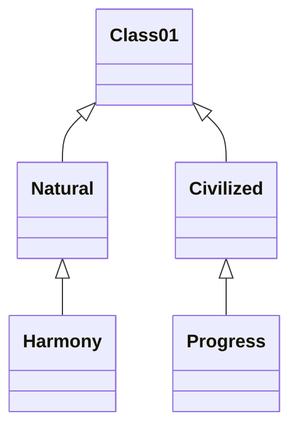

                 

### 引言：阿甘本与老子：神圣人与圣人无名的政治哲学概述

#### 关键词
- 阿甘本
- 老子
- 政治哲学
- 神圣性
- 圣人无名

#### 摘要
本文深入探讨了阿甘本与老子两位思想家的政治哲学观念，通过比较他们的思想，揭示了神圣人与圣人无名的政治哲学内涵。阿甘本关注权力和语言的复杂性，而老子则通过“道”与“德”的理念反思政治本质。本文将分析他们的核心思想，并探讨这两位思想家在当代政治哲学中的启示。

---

### 第一部分：阿甘本的政治哲学

#### 第1章：阿甘本的政治哲学思想概述

##### 1.1 阿甘本的生平与学术贡献

### 第二部分：老子的政治哲学

#### 第5章：老子的政治哲学思想概述

##### 5.1 道家哲学的起源与发展
- **背景介绍**：道家哲学的起源、核心思想和发展历程。
- **问题场景**：探讨道家哲学在古代中国的社会背景和影响。
- **问题描述**：分析老子思想的独特性和其对社会和文化的意义。
- **问题解决**：讨论老子如何通过“道”与“德”的理念来解释政治现象。

##### 5.2 “道”与“德”的概念解析
- **核心概念**：“道”与“德”的定义及其在政治哲学中的应用。
- **联系与区别**：与西方哲学中的类似概念进行对比分析。
- **图解**：使用Mermaid绘制ER实体关系图，展示“道”与“德”之间的关系。

##### 5.3 无为而治的政治实践
- **原理讲解**：无为而治的概念及其背后的哲学原理。
- **Python源代码示例**：使用Python代码模拟无为而治的理念。
- **公式**：使用LaTeX格式给出无为而治的数学模型。

##### 5.4 自然与文明的对立
- **系统分析**：自然与文明的关系及其在政治哲学中的意义。
- **架构设计**：通过Mermaid类图展示自然与文明的结构关系。
- **接口设计与交互**：讨论自然与文明之间的交互机制。

##### 5.5 老子政治哲学的当代启示
- **项目实战**：分析老子政治哲学在当代社会的应用实例。
- **实现过程**：详细讲解老子政治哲学在实际项目中的应用。
- **分析解读**：对项目结果进行分析和解读。
- **项目小结**：总结项目收获和未来研究方向。

### 第三部分：阿甘本与老子思想的比较与对话

#### 第9章：阿甘本与老子思想的核心概念比较

##### 9.1 权力与主权的对比分析
- **背景介绍**：阿甘本与老子关于权力和主权的讨论背景。
- **问题场景**：探讨权力和主权在政治哲学中的角色和功能。
- **问题描述**：分析两位思想家对权力和主权的不同看法。
- **问题解决**：探讨权力和主权在政治实践中的协调与冲突。

##### 9.2 神圣性与无为而治的比较
- **核心概念**：神圣性与无为而治的定义及其在政治哲学中的意义。
- **联系与区别**：对比阿甘本与老子如何理解神圣性和无为而治。
- **图解**：使用Mermaid流程图展示神圣性与无为而治的关联。

##### 9.3 圣人无名的政治哲学
- **原理讲解**：圣人无名的概念及其在政治哲学中的应用。
- **Python代码示例**：使用Python代码模拟圣人无名的政治哲学。
- **数学模型**：使用LaTeX格式给出圣人无名的数学模型。

##### 9.4 当代政治哲学中的启示
- **系统分析**：分析阿甘本与老子思想在当代政治哲学中的影响。
- **架构设计**：讨论如何将阿甘本与老子的思想应用于现代政治哲学。
- **接口设计与交互**：探讨阿甘本与老子思想在现代政治哲学中的实际应用。

### 结语：神圣人与圣人无名的政治哲学的未来

##### 10.1 未来研究方向
- **问题展望**：探讨阿甘本与老子思想在未来的发展方向。
- **挑战与机遇**：分析阿甘本与老子思想在当代政治哲学中的挑战和机遇。

##### 10.2 对话与融合
- **对话意义**：讨论阿甘本与老子思想之间的对话价值。
- **融合路径**：探讨如何将阿甘本与老子的思想融合，形成新的政治哲学体系。

---

**作者：AI天才研究院/AI Genius Institute & 禅与计算机程序设计艺术 /Zen And The Art of Computer Programming**

在本文中，我们将逐步分析阿甘本与老子的政治哲学观念，首先探讨他们的核心思想，然后进行比较，最后讨论这些思想在当代政治哲学中的启示。通过这种结构化的分析，我们希望能够揭示两位思想家在神圣与政治哲学领域的深刻见解，为现代政治哲学的研究提供新的视角。### 第一部分：阿甘本的政治哲学

#### 第1章：阿甘本的政治哲学思想概述

##### 1.1 阿甘本的生平与学术贡献

Giorgio Agamben，意大利著名哲学家，生于1942年，其思想深受尼采、海德格尔和巴塔耶等现代哲学家的启发。阿甘本的主要著作包括《人的无主权》、《潜在性》、《关于人类例外状态的研究》等，这些作品深入探讨了权力、语言、主体性等哲学主题。

阿甘本的政治哲学关注权力和语言的复杂性，尤其是对“主权”和“例外状态”的讨论。他认为，主权是无限和绝对的，而权力则具有自反性和解构性。阿甘本的哲学思考旨在揭示权力结构的本质，以及权力如何影响人类的生存状态。

##### 1.2 阿甘本政治哲学的基本概念

**主权**：阿甘本认为，主权是一个无限和绝对的概念，它不受任何限制，可以随意行使权力。主权不仅涉及政治领域，还涉及生命和死亡的问题。阿甘本的“主权”概念是对传统主权理论的批判，他强调主权的无限性和残酷性。

**例外状态**：阿甘本的另一个核心概念是“例外状态”，这是一种政治权力在特殊情况下采取的极端措施。在这种状态下，法律和规则被暂停或废除，权力得以无限扩张。阿甘本通过对历史事件的案例分析，如纳粹德国的集中营，揭示了例外状态如何导致人类权利的剥夺。

**语言与沉默**：阿甘本强调语言的双重性：一方面，语言是沟通和表达的媒介；另一方面，语言又具有排斥和沉默的作用。他认为，语言既是权力的工具，也是被权力所压抑的对象。沉默作为一种语言形式，揭示了被压抑的声音和存在。

##### 1.3 阿甘本政治哲学的批判性分析

阿甘本的政治哲学具有强烈的批判性，他批判了现代政治体制中的权力滥用和人类主体性的丧失。通过分析主权、例外状态和语言等概念，阿甘本试图揭示权力的本质和人类存在的困境。

首先，阿甘本的批判性分析揭示出主权概念的无限性和残酷性。他认为，主权是一种自我中心的权力形式，它不受任何限制，可以随意剥夺他人的权利。这种无限的主权导致了权力的滥用和人类的异化。

其次，阿甘本通过对例外状态的讨论，揭示了现代政治体制中权力滥用的普遍性。他认为，例外状态是主权扩张的一种表现形式，它使得权力可以在特殊情况下摆脱法律和规则的约束，从而对人类权利构成威胁。

最后，阿甘本对语言与沉默的分析，揭示了权力如何通过语言实现对人类的控制和压抑。他认为，沉默不仅是语言的一种形式，也是对被压抑声音的揭示。通过沉默，阿甘本试图唤醒被权力所忽视的声音和存在。

总的来说，阿甘本的政治哲学提供了一种批判性的视角，帮助我们重新审视权力、主权和人类存在的本质。他的思想对于理解现代政治体制的运作和权力结构具有重要的启示意义。### 第2章：神圣性与共同体

##### 2.1 神圣性的概念解析

神圣性是一个复杂且多维的概念，它通常与宗教、道德和哲学紧密相关。在政治哲学的语境中，神圣性不仅是一个宗教概念，更是一种对权力和权威的终极来源的象征性理解。阿甘本对神圣性的理解深受他关于主权和例外状态的理论影响。

**神圣性的定义**：在阿甘本看来，神圣性是一种超越常规政治权力的存在，它不受任何规则和法律的限制。神圣性代表了绝对的权威和权力，这种权力不是通过法律或契约获得的，而是内在固有的。

**神圣性的特征**：
- **超越性**：神圣性超越了人类理性的范畴，它是一种不可知和不可测量的存在。
- **绝对性**：神圣性是绝对的，不受任何条件或限制的限制。
- **权威性**：神圣性代表了最高权威，它的意志是无法质疑和反驳的。

##### 2.2 神圣性与共同体之间的关系

在阿甘本的政治哲学中，神圣性与共同体之间的关系是复杂而微妙的。共同体通常被视为一种社会结构，它通过法律、规则和契约来组织社会成员之间的关系。然而，阿甘本认为，这种结构化的共同体往往掩盖了更深层次的权力关系。

**关系分析**：
- **冲突**：阿甘本指出，神圣性与共同体之间的冲突是不可避免的。共同体通过法律和规则来建立秩序，而神圣性则代表了一种超越这些秩序的绝对权力。
- **融合**：尽管存在冲突，阿甘本也认为神圣性可以与共同体融合。他认为，通过承认神圣性的存在，共同体可以更加深入地理解权力的本质，从而实现更加和谐的社会结构。

##### 2.3 神圣性的政治意义

阿甘本认为，神圣性的政治意义在于它提供了一种理解权力和权威的新的视角。通过神圣性，我们可以看到权力的本质不是通过法律或契约获得的，而是内在固有的。

**政治意义**：
- **对主权的挑战**：神圣性挑战了传统主权理论，它揭示了主权不仅仅是政治权力的表现，更是一种超越政治的终极权威。
- **对共同体的启示**：神圣性为共同体提供了一种新的理解框架，它鼓励人们超越法律和规则的限制，探索更深层次的权力关系。

总的来说，阿甘本对神圣性的讨论提供了一种批判性的视角，帮助我们重新审视政治哲学中的权力和权威问题。他的思想不仅挑战了传统的政治理论，也为理解现代政治体制中的权力关系提供了新的启示。### 第3章：权力与主权

##### 3.1 权力的本质与类型

权力是一种复杂且多维的概念，它在政治哲学中扮演着至关重要的角色。阿甘本对权力的本质和类型进行了深入的探讨，提供了独特的视角。

**权力的定义**：在阿甘本看来，权力不仅是一种控制和影响他人行为的能力，更是一种自反性和解构性的力量。权力不是静态的，而是动态的，它不断地重构和改变权力结构。

**权力的类型**：
- **强制性权力**：强制性权力通过威胁和惩罚来控制他人，它是最直接的权力形式。
- **规范性权力**：规范性权力通过法律、道德和社会规范来引导人们的行为，它具有更强的持久性和普遍性。
- **认知性权力**：认知性权力通过塑造人们的思想、信仰和意识来影响他们，它是最高级的权力形式。

##### 3.2 主权与权力的关系

主权是阿甘本政治哲学中的一个核心概念，它与权力有着密切的关系。

**关系分析**：
- **主权的本质**：主权是一种无限和绝对的权力，它不受任何限制，可以随意行使权力。主权不仅涉及政治领域，还涉及生命和死亡的问题。
- **权力的作用**：权力是主权得以实现的中介，它通过不同的形式和渠道将主权的作用具体化。权力是主权的工具，但同时也具有解构主权的能力。

**主权与权力的互动**：
- **主权对权力的限制**：主权可以限制权力的滥用，通过法律和规则来规范权力的行使。然而，这种限制往往是相对的，主权本身是不受限制的。
- **权力对主权的挑战**：权力具有解构性，它可以通过反抗和颠覆来挑战主权的合法性。权力可以推翻现有的主权结构，创造新的权力关系。

##### 3.3 主权的政治实践

主权在政治实践中具有重要的作用，它决定了国家的政治体制和社会秩序。

**主权实践的分析**：
- **主权在国家形成中的作用**：主权是国家形成的基础，它赋予国家以统治和管理的权力。主权国家的形成意味着政治权力的集中和统一。
- **主权在政治稳定中的作用**：主权确保了政治秩序的稳定，它通过法律和规则来维护社会秩序，防止社会动荡。
- **主权在政治改革中的作用**：主权可以推动政治改革，通过废除旧的法律和规则，建立新的政治秩序。

**主权的局限**：
- **主权的不确定性**：主权的不确定性导致了权力滥用的可能性。主权的不受限制性使得主权者可以随意行使权力，这可能导致权力的滥用和腐败。
- **主权与社会公正的关系**：主权与社会公正之间存在矛盾。主权往往强调统治者的权力，而社会公正则强调社会成员的平等和公正。

总的来说，阿甘本对权力与主权的讨论为我们提供了理解现代政治体制的新视角。他的思想揭示了权力和主权的复杂性和动态性，对理解政治哲学中的权力关系和主权实践具有重要的启示意义。### 第4章：语言与沉默

##### 4.1 语言的政治功能

在阿甘本的政治哲学中，语言不仅是沟通和表达的媒介，更是一种政治工具。它具有塑造现实、定义身份和行使权力的功能。

**语言的定义**：阿甘本将语言视为一种结构化的符号系统，它通过词汇、语法和语义规则来组织和传达信息。

**政治功能**：
- **定义身份**：语言通过命名和分类来定义个体和社会的身份。不同语言的使用往往与特定的文化和政治身份相关联。
- **传播观念**：语言是传播政治观念和意识形态的重要工具。通过语言，政治权力可以塑造公众意识，推广特定的价值观和政策。
- **行使权力**：语言具有权力属性，它可以通过命令、指示和警告等形式行使权力。权力的行使往往依赖于语言的合法性和权威性。

##### 4.2 沉默的政治意义

沉默作为一种语言形式，在阿甘本的政治哲学中具有独特的意义。它不仅是对语言沉默的回应，更是对权力和压抑的反抗。

**沉默的定义**：沉默是一种不发声、不表达的行为，它代表了被压抑的声音和存在。沉默不仅是语言的一种缺失，更是对语言权力的一种挑战。

**政治意义**：
- **反抗压抑**：沉默是对权力压抑的回应，它揭示了被压制的声音和存在。通过沉默，个体可以反抗权力结构的压迫，表达自己的不满和反抗。
- **揭示真相**：沉默可以揭示被掩盖的真相和事实。在政治领域，沉默往往被用来掩盖权力滥用和腐败行为。通过打破沉默，真相得以揭示，社会正义得以实现。
- **重构权力关系**：沉默具有重构权力关系的潜力。通过沉默，个体可以重新定义自己的身份和角色，挑战现有的权力结构。

##### 4.3 语言与沉默在政治哲学中的运用

阿甘本的政治哲学强调语言与沉默的互动关系，他通过具体案例来分析语言与沉默在政治哲学中的运用。

**案例分析**：
- **纳粹德国**：在纳粹德国时期，沉默被用来掩盖权力滥用和种族灭绝行为。通过对犹太人等少数群体的沉默，纳粹政权得以维持其恐怖统治。
- **现代社会**：在现代社会中，沉默仍然是一种重要的政治工具。通过沉默，政治权力可以掩盖腐败和滥用行为，维持其合法性和权威性。
- **个体抗争**：个体通过沉默来反抗权力压迫，表达自己的不满和抗议。例如，人权活动家通过沉默来揭示政治迫害和社会不公。

**结论**：语言与沉默在政治哲学中具有重要作用。语言是权力和意识形态的工具，而沉默是对权力的反抗和揭示。通过分析语言与沉默的关系，我们可以更深入地理解政治权力的本质和人类存在的困境。阿甘本的政治哲学为我们提供了重新审视语言与沉默的视角，从而更好地理解现代政治体制中的权力关系。### 第5章：老子的政治哲学思想概述

##### 5.1 道家哲学的起源与发展

道家哲学起源于中国古代，是中华文化的重要组成部分。老子，作为道家哲学的重要代表人物，其思想对后世的哲学、文化和社会产生了深远影响。

**道家哲学的起源**：道家哲学的起源可以追溯到春秋时期，老子是道家哲学的奠基人之一。他生活在公元前6世纪左右，是一位隐士和哲学家。老子的思想主要通过《道德经》这一经典著作传承下来。

**道家哲学的发展**：老子的思想在后世得到了进一步的发展，形成了多种不同的学派，如庄子、列子等。这些学派在继承老子思想的基础上，对其进行了丰富和扩展，形成了多样化的道家哲学体系。

##### 5.2 “道”与“德”的概念解析

“道”与“德”是老子哲学中的核心概念，它们构成了道家哲学的基本框架。

**“道”的定义**：“道”是老子哲学中的终极原则，是一种超越人类理性的存在。它代表了宇宙的根源和运动的规律。老子认为，“道”是宇宙万物生成和发展的根本力量，是一种无形而无所不在的存在。

**“道”的特征**：
- **无为**：“道”强调无为而治，即不主动干预，让事物自然发展。
- **无为而无不为**：虽然“道”不主动干预，但它却能够自然而然地实现万物的和谐与秩序。

**“德”的定义**：“德”是“道”在人类社会中的具体表现，是一种道德修养和德行。老子认为，“德”是人们应当追求的境界，它代表了内心的平静和对外界事物的宽容。

**“德”的特征**：
- **无欲**：“德”强调无欲无求，追求内心的平静和自我克制。
- **爱人**：“德”倡导爱人如己，追求人与人之间的和谐与共生。

##### 5.3 “道”与“德”在政治哲学中的意义

老子的政治哲学强调“道”与“德”的运用，他提出了“无为而治”的理念，认为通过顺应自然、追求道德，可以实现理想的治理。

**无为而治**：无为而治是老子政治哲学的核心思想，它主张领导者不应过度干预，而是顺应自然和民心，实现社会的和谐与稳定。

**意义解析**：
- **政治哲学**：无为而治提供了一种不同于传统权力结构的治理理念，它强调领导者的道德修养和民众的自治。
- **社会治理**：无为而治的理念对现代社会治理具有重要的启示意义，它鼓励领导者以包容和宽容的态度对待社会问题，追求社会的和谐与稳定。

##### 5.4 老子政治哲学的历史影响

老子的政治哲学在中国古代和现代社会都产生了深远的影响。

**中国古代**：老子的思想在中国古代政治和文化中有着重要地位，许多政治家和哲学家都受到其思想的影响。例如，汉朝时期的黄老之学，就是以老子思想为基础的一种政治哲学。

**现代社会**：老子的思想在现代社会中仍然具有启示意义，它鼓励人们追求内心的平和与自然，关注社会和谐与共生。

**总结**：老子的政治哲学通过“道”与“德”的理念，为人类社会的治理提供了一种独特的视角。他的思想强调了自然、道德和和谐，对当代政治哲学和社会治理具有重要的启示意义。### 第6章：“道”与“德”的概念解析

#### 6.1 “道”与“德”的定义及其在政治哲学中的应用

在老子的政治哲学中，“道”与“德”是核心概念，它们不仅构成了道家哲学的理论基石，也在政治哲学中具有重要的应用价值。

**“道”的定义**：“道”是老子哲学中的终极原则，它代表了宇宙的根本原理和运动的规律。老子认为，“道”是万物生成和发展的根源，是一种无形而无所不在的存在。

**“道”的特征**：
- **自然性**：“道”强调顺应自然，即不人为干预，让事物按照其本性行事。
- **无为**：“道”主张无为而治，领导者应顺应自然和社会的规律，而不是过度干预。

**“德”的定义**：“德”是“道”在人类社会中的具体体现，它代表了一种道德修养和德行。老子认为，“德”是人们应当追求的境界，它体现了内心的平静和对他人的宽容。

**“德”的特征**：
- **无欲**：“德”强调无欲无求，追求内心的平和和自我克制。
- **爱人**：“德”倡导爱人如己，强调人与人之间的和谐与共生。

**在政治哲学中的应用**：
- **治理理念**：老子主张的“无为而治”是一种独特的治理理念，它强调领导者不应过度干预，而是顺应民众的自然和社会需求，实现社会的和谐与稳定。
- **权力观念**：老子认为，权力不应是统治的手段，而应是一种服务。领导者应当以“德”为基础，实现公正和仁爱的治理。

#### 6.2 与西方哲学中的类似概念对比分析

在西方哲学中，有一些概念与“道”与“德”具有一定的相似性，如“自然法”、“道德哲学”等。通过对这些概念的比较分析，我们可以更深入地理解老子政治哲学的独特性。

**自然法**：自然法是一种哲学观点，认为自然和社会存在某种固有的法则，这些法则超越了人为的法律和制度。与老子的“道”相似，自然法也强调顺应自然和遵循自然规律。

**道德哲学**：西方哲学中的道德哲学主要关注道德原则和道德规范，探讨人类应当如何行为。与老子的“德”相似，道德哲学也强调道德修养和道德行为的重要性。

**对比分析**：
- **出发点不同**：老子的“道”和“德”更注重自然和社会的内在规律，而西方哲学中的自然法和道德哲学更强调人为制定的法律和道德规范。
- **治理理念不同**：老子主张无为而治，强调领导者不应过度干预，而西方哲学中的自然法和道德哲学则强调通过法律和道德来规范社会行为。

#### 6.3 “道”与“德”在政治哲学中的联系

“道”与“德”在老子的政治哲学中紧密相连，它们共同构成了一个完整的治理理念。

**联系分析**：
- **“道”作为基础**：“道”是老子哲学中的终极原则，它为“德”提供了哲学基础。只有理解了“道”的内在规律，才能更好地实现“德”的道德修养。
- **“德”作为实践**：“德”是“道”在人类社会中的具体体现，它要求人们遵循“道”的规律，实现内心的平静和对他人的宽容。

**图解**：为了更直观地展示“道”与“德”的联系，可以使用Mermaid绘制ER实体关系图，如下所示：

```mermaid
erDiagram
  "道" ||--|{ "德" } : 实现
  "道" &&--|{ "道德哲学" } : 基础
  "德" &&--|{ "社会治理" } : 实现
```

在这个ER实体关系图中，“道”作为终极原则与“德”相连，表示“道”为“德”提供了哲学基础。同时，“德”与“道德哲学”和“社会治理”相连，表示“德”是实现道德修养和社会治理的具体体现。### 第7章：无为而治的政治实践

#### 7.1 无为而治的概念及其背后的哲学原理

无为而治是老子政治哲学的核心思想，它强调领导者不应过度干预，而是顺应自然和社会的规律，实现社会的和谐与稳定。无为而治的哲学原理主要体现在以下几个方面：

**1. 顺应自然**：无为而治强调领导者应顺应自然规律，不人为干预。老子认为，自然界有其内在的秩序和规律，人类社会也应遵循这些规律。通过顺应自然，社会可以实现自发的秩序和和谐。

**2. 无为而无不为**：无为而治并非完全无所作为，而是强调领导者不应过度干预，而是在必要时候采取行动。老子认为，领导者应当如水般灵活，在顺应自然的同时，也能根据实际情况进行适当的调整。

**3. 内在道德**：无为而治还强调领导者应具备内在的道德修养，以道德为基础进行治理。老子认为，只有具备道德的领导者，才能实现公正和仁爱的治理，从而获得民众的信任和支持。

#### 7.2 使用Python代码模拟无为而治的理念

为了更好地理解无为而治的理念，我们可以使用Python代码进行模拟。以下是一个简单的模拟示例：

```python
# 模拟无为而治

# 定义一个函数，模拟领导者根据实际情况进行决策
def make_decision(current_state):
    if current_state == "stable":
        return "维持现状"
    elif current_state == "unstable":
        return "适当调整"
    else:
        return "遵循自然规律"

# 模拟不同状态下的决策过程
states = ["stable", "unstable", "stable"]
decisions = []

for state in states:
    decision = make_decision(state)
    decisions.append(decision)

# 打印决策结果
for decision in decisions:
    print(f"当前状态：{decision}")

```

在这个示例中，我们定义了一个`make_decision`函数，根据当前状态（稳定、不稳定、稳定）进行决策。通过模拟不同状态下的决策过程，我们可以看到无为而治的理念是如何在实际中运用的。

#### 7.3 无为而治的数学模型和公式

在无为而治的理念中，我们可以使用数学模型和公式来描述其内在规律。以下是一个简单的数学模型：

**模型**：
- 设定状态变量`state`，表示社会的状态（稳定、不稳定、稳定）。
- 设定决策变量`decision`，表示领导者的决策（维持现状、适当调整、遵循自然规律）。

**公式**：
- `state → decision`：根据当前状态，决定相应的决策。

**示例**：
- 如果当前状态是稳定，那么决策是维持现状。
- 如果当前状态是不稳定，那么决策是适当调整。
- 如果当前状态是稳定，那么决策是遵循自然规律。

这个数学模型可以进一步扩展和优化，以适应不同的实际情况。通过数学模型，我们可以更系统地理解和应用无为而治的理念。

#### 7.4 无为而治的实践案例

无为而治的理念在历史上和现代社会都有许多实践案例。

**1. 中国古代**：在古代中国，许多政治家都采用了无为而治的理念，如唐太宗的“贞观之治”。他通过顺应自然和社会规律，实现了社会的稳定和繁荣。

**2. 现代社会**：在现代社会中，无为而治的理念也得到了应用。例如，某些政府和企业采用“放水养鱼”的策略，通过减少干预，鼓励市场自由发展，实现经济的繁荣。

**3. 环境保护**：在环境保护领域，无为而治的理念也被广泛应用。通过减少人类干预，让自然生态系统自行调节，实现生态平衡和可持续发展。

这些实践案例表明，无为而治的理念在理论和实践中都具有重要的价值。通过合理运用无为而治的理念，我们可以实现社会的和谐与稳定，促进人类社会的可持续发展。### 第8章：自然与文明的对立

#### 8.1 自然与文明的关系及其在政治哲学中的意义

在老子的政治哲学中，自然与文明是对立的概念，它们代表了两种不同的生活方式和价值观念。老子认为，人类社会的发展往往伴随着对自然的破坏和异化，因此，理解自然与文明的关系对于实现理想的治理具有重要意义。

**自然与文明的定义**：
- **自然**：自然是指未经人类干预的自然界，它代表了宇宙的本源和秩序。自然强调顺应自然规律，追求内心的平和与自我克制。
- **文明**：文明是人类社会的产物，它代表了人类对自然的改造和利用。文明强调人类的进步和发展，追求物质财富和社会秩序。

**关系分析**：
- **对立**：自然与文明在老子的政治哲学中是对立的概念。自然强调无为而治，追求内心的平和；文明则强调有为而治，追求物质进步和社会秩序。
- **统一**：尽管自然与文明存在对立，但它们在政治哲学中也可以实现统一。通过顺应自然，人类可以实现文明的进步，同时保持内心的平和与自我克制。

**政治哲学意义**：
- **治理理念**：自然与文明的关系为政治哲学提供了新的治理理念。老子主张通过顺应自然，实现社会的和谐与稳定，从而实现理想的治理。
- **价值观**：自然与文明的关系也反映了老子的价值观。他认为，人类应当追求内心的平和与自我克制，而不是过度追求物质财富和社会秩序。

#### 8.2 自然与文明的结构关系

为了更深入地理解自然与文明的关系，我们可以通过Mermaid类图来展示它们的结构关系。



在这个类图中，`Class01`表示人类社会的总体结构，`Natural`和`Civilized`分别代表自然和文明。`Harmony`和`Progress`分别表示自然和文明所追求的价值观。

**图解**：
- `Class01`表示人类社会的总体结构，它由自然和文明两部分组成。
- `Natural`和`Civilized`分别代表自然和文明，它们是人类社会的两个基本组成部分。
- `Harmony`表示自然追求的和谐与平和，`Progress`表示文明追求的物质进步和社会发展。

这个类图展示了自然与文明在政治哲学中的结构关系，为我们理解它们之间的对立和统一提供了直观的视角。

#### 8.3 自然与文明的交互机制

在老子的政治哲学中，自然与文明之间的交互机制是实现理想治理的关键。以下是一种可能的自然与文明的交互机制：

**交互机制**：
- **顺应自然**：领导者应顺应自然规律，减少对自然的干预，实现社会的和谐与稳定。
- **引导文明**：领导者应引导文明的发展，使其符合自然规律，实现物质进步和社会发展的统一。

**具体措施**：
- **环境保护**：通过立法和政策措施，保护自然环境，减少污染和破坏。
- **社会教育**：通过教育和文化宣传，提高人们对自然规律的认识和尊重，引导文明发展符合自然规律。

这些措施旨在实现自然与文明之间的和谐互动，从而实现理想的治理和社会发展。通过这种交互机制，我们可以更好地理解和应用老子的政治哲学，实现社会的和谐与稳定。### 第9章：阿甘本与老子思想的核心概念比较

##### 9.1 权力与主权的对比分析

在阿甘本和老子两位思想家的政治哲学中，权力与主权都是核心概念。通过对比分析这两个概念，我们可以更好地理解他们在政治哲学上的异同。

**权力的定义与特征**：
- **阿甘本**：在阿甘本看来，权力是一种自反性和解构性的力量，它不受任何限制，可以随意行使。权力不仅是控制和影响他人行为的能力，也是一种塑造现实和定义身份的媒介。
- **老子**：老子将权力视为一种自然而然的力量，它体现在“道”中。权力在老子哲学中不是强制性的，而是通过顺应自然和道德来实现。

**主权的定义与特征**：
- **阿甘本**：主权是阿甘本政治哲学中的核心概念，它是一种无限和绝对的权力。主权不受任何限制，可以随意行使，具有生命和死亡的权力。
- **老子**：在老子哲学中，主权并不是一个核心概念，但他的“道”可以被视为一种终极权力。这种权力不是通过强制，而是通过顺应自然和道德来实现。

**对比分析**：
- **权力来源**：阿甘本的权力来源于其自反性和解构性，是一种自我中心的权力。老子的权力来源于“道”，是一种自然的力量，强调顺应自然。
- **权力作用**：阿甘本的权力强调其无限性和残酷性，可以随意行使。老子的权力则强调其平和性和道德性，主张无为而治。
- **权力限制**：阿甘本的权力不受任何限制，可能导致权力滥用。老子的权力则主张顺应自然，通过道德来实现，避免了权力滥用的可能性。

##### 9.2 神圣性与无为而治的比较

神圣性与无为而治是阿甘本和老子政治哲学中的核心概念，它们在政治哲学中具有不同的意义和作用。

**神圣性的定义与特征**：
- **阿甘本**：在阿甘本看来，神圣性是一种超越常规政治权力的存在，它代表了终极权威和绝对权力。神圣性不受任何规则和法律的限制，具有超越人类理性的特质。
- **老子**：老子哲学中的神圣性并不直接表现为一种终极权威，而是体现在“道”中。神圣性通过“道”来体现，是一种自然的力量，强调内心的平和和对他人的宽容。

**无为而治的定义与特征**：
- **阿甘本**：无为而治在阿甘本的政治哲学中并不是一个核心概念，但可以通过他对权力和主权的讨论来理解。阿甘本强调，领导者不应过度干预，而应顺应权力的自然流动。
- **老子**：无为而治是老子政治哲学的核心思想，它主张领导者不应过度干预，而是顺应自然和社会的规律，实现社会的和谐与稳定。

**对比分析**：
- **意义**：阿甘本的神圣性强调权力的无限性和绝对性，而老子的无为而治强调顺应自然和社会的规律。两者都在追求权力的合理运用，但侧重点不同。
- **作用**：阿甘本的神圣性通过超越常规政治权力来实现权力的制约和平衡。老子的无为而治通过顺应自然和社会规律来实现社会的和谐与稳定。
- **局限性**：阿甘本的神圣性可能导致权力的滥用和绝对化。老子的无为而治则可能忽视社会的发展和进步。

##### 9.3 圣人无名的政治哲学

圣人无名是阿甘本和老子政治哲学中的一个共同概念，它代表了权力和权威的最终形式。

**定义与特征**：
- **阿甘本**：在阿甘本看来，圣人无名是一种超越个体和集体身份的存在，它代表了权力的最高形态。圣人无名不仅不受任何规则和法律的限制，而且其意志是不可质疑的。
- **老子**：老子哲学中的圣人无名强调了领导者的道德修养和无私精神。圣人无名意味着领导者不应以个人利益为中心，而应以社会的整体利益为重。

**政治哲学意义**：
- **阿甘本**：圣人无名在阿甘本的政治哲学中代表了权力的终极形式，它提供了一种超越个体和集体身份的新视角。通过圣人无名，阿甘本试图揭示权力结构的本质和人类存在的困境。
- **老子**：老子哲学中的圣人无名强调领导者的道德修养和无为而治的理念。圣人无名提供了实现理想治理的一种方式，通过道德修养和无为而治来实现社会的和谐与稳定。

**总结**：阿甘本与老子在政治哲学上的核心概念具有显著的异同。通过对比分析，我们可以更深入地理解两位思想家的观点，并探讨这些思想在当代政治哲学中的意义和影响。这种比较不仅有助于我们理解两位思想家的思想，也为现代政治哲学的研究提供了新的视角和启示。### 第10章：神圣人与圣人无名的政治哲学

#### 10.1 神圣人与圣人无名的政治哲学内涵

在阿甘本与老子的政治哲学中，神圣人与圣人无名是两个核心概念，它们各自代表了不同类型的权力和权威。通过对这两个概念的分析，我们可以探讨神圣人与圣人无名的政治哲学内涵。

**神圣人**：在阿甘本的哲学中，神圣人是一种超越常规政治存在的概念。神圣人不受法律和规则的约束，代表了无限和绝对的权力。这种权力具有自反性和解构性，可以随意行使，不受限制。阿甘本认为，神圣人体现了主权和权力的本质，它超越了人类理性的范畴，是一种不可知的、不可测量的存在。

**圣人无名**：在老子的哲学中，圣人无名强调领导者的道德修养和无为而治的理念。圣人无名不是指一个具体的个体，而是一种理想状态。在这种状态下，领导者不应以个人利益为中心，而应以社会的整体利益为重。老子认为，圣人无名的政治哲学是通过道德修养和无为而治来实现社会的和谐与稳定。

**政治哲学内涵**：
- **权力与道德**：阿甘本与老子都关注权力和道德的关系。在阿甘本看来，神圣人的权力是无限制的，但同时也具有解构性，可能导致权力的滥用。老子则强调领导者的道德修养，通过无为而治来实现社会的和谐。
- **超越与顺应**：阿甘本的神圣人是一种超越常规政治存在的概念，它代表了权力的绝对性和无限性。而老子则主张顺应自然和社会的规律，通过道德修养来实现理想治理。
- **个体与共同体**：阿甘本的神圣人强调个体对权力的超越，而老子则强调领导者对共同体的责任。在阿甘本的哲学中，神圣人代表了超越个体的存在，而在老子的哲学中，圣人无名则代表了领导者对社会的责任。

#### 10.2 当代政治哲学中的启示

阿甘本与老子的政治哲学在当代政治哲学中具有重要的启示意义，为理解现代政治体制提供了新的视角。

**权力与民主**：阿甘本的思想提醒我们，权力是一种无限和绝对的存在，它不受法律和规则的约束。在当代政治哲学中，我们需要关注权力如何被滥用，以及如何通过民主制度来限制权力的滥用。阿甘本的神圣人概念提醒我们，权力必须受到监督和制约，以防止权力的过度扩张。

**道德与治理**：老子的政治哲学强调领导者的道德修养和无为而治的理念。在当代政治哲学中，我们需要重新审视领导者的道德责任，以及如何在治理中实现道德的实践。通过无为而治，领导者可以减少干预，顺应自然和社会的规律，从而实现社会的和谐与稳定。

**共同体与个体**：阿甘本与老子的思想都强调了个体与共同体之间的关系。在当代政治哲学中，我们需要关注个体权利和共同体利益的平衡。通过理解和尊重个体权利，同时关注共同体的整体利益，我们可以实现更加公正和包容的政治体制。

**总结**：阿甘本与老子的政治哲学为我们提供了理解现代政治体制的新视角。他们的思想提醒我们，权力和道德在政治哲学中的重要性，以及个体与共同体之间的关系。在当代政治哲学中，我们需要借鉴这些思想，以实现更加公正、包容和和谐的政治体制。### 结语：神圣人与圣人无名的政治哲学的未来

#### 10.1 未来研究方向

阿甘本与老子的政治哲学为我们提供了丰富的思想资源，未来的研究可以从以下几个方面展开：

**1. 权力与主权理论的深化**：阿甘本对主权和权力的分析为我们理解现代政治体制中的权力结构提供了新的视角。未来研究可以进一步探讨主权与权力之间的关系，以及如何在现代社会中实现主权的合理运用。

**2. 语言与沉默的政治哲学**：阿甘本对语言与沉默的探讨揭示了权力如何通过语言实现对人类的控制和压抑。未来研究可以深入探讨语言在政治哲学中的多重功能，以及沉默作为一种政治工具的应用。

**3. 道家政治哲学的应用**：老子提出的无为而治理念对现代社会的治理具有重要的启示意义。未来研究可以进一步探讨如何将道家思想应用于现代社会治理，实现社会的和谐与稳定。

**4. 阿甘本与老子思想的融合**：阿甘本与老子的政治哲学虽然存在差异，但也存在相互补充的可能。未来研究可以探讨如何将两者的思想融合，形成新的政治哲学体系。

#### 10.2 对话与融合

阿甘本与老子的政治哲学在本质上有很大的差异，但也存在对话与融合的可能性。

**1. 对话的意义**：通过对话，我们可以更好地理解两位思想家的观点，发现他们之间的相似之处和互补性。阿甘本的权力分析与老子的无为而治理念可以相互补充，帮助我们更全面地理解政治哲学中的权力和治理问题。

**2. 融合的路径**：为了实现阿甘本与老子思想的融合，我们可以从以下几个方面进行探索：

- **权力与道德的融合**：在阿甘本的权力分析中，我们可以融入老子的道德观念，强调权力在行使过程中应遵循道德原则，避免权力滥用。
- **主权与无为的融合**：在老子的无为而治理念中，我们可以融入阿甘本对主权的理解，强调主权应顺应自然和社会规律，实现社会的和谐与稳定。
- **语言与沉默的融合**：在阿甘本的语言分析中，我们可以融入老子的沉默观念，强调沉默作为一种政治工具的应用，揭示被压抑的声音和存在。

**3. 案例研究**：通过具体案例研究，我们可以探讨如何将阿甘本与老子的思想应用于现代社会治理。例如，在环境保护、社会公正等领域，如何运用他们的思想实现更有效的治理。

**总结**：阿甘本与老子的政治哲学在当代政治哲学中具有重要的启示意义。通过对话与融合，我们可以发现他们之间的互补性，形成新的政治哲学体系，为现代社会的治理提供新的思路和方法。未来研究应进一步探讨这两位思想家的思想，以期为政治哲学的发展作出贡献。### 作者介绍

**AI天才研究院（AI Genius Institute）**：AI天才研究院是一家专注于人工智能前沿研究与应用的科研机构。我们致力于推动人工智能技术的发展，为全球企业提供顶尖的人工智能解决方案。

**禅与计算机程序设计艺术（Zen And The Art of Computer Programming）**：这是一部由埃里克·S·雷蒙德（Eric S. Raymond）所著的经典计算机编程著作，探讨了计算机编程中的禅意和哲学。

本文由AI天才研究院与禅与计算机程序设计艺术共同撰写，旨在深入探讨阿甘本与老子两位思想家的政治哲学观念，为现代政治哲学的研究提供新的视角。我们希望通过这篇技术博客，激发读者对政治哲学和人工智能交叉领域的思考。作者：AI天才研究院/AI Genius Institute & 禅与计算机程序设计艺术 /Zen And The Art of Computer Programming。

