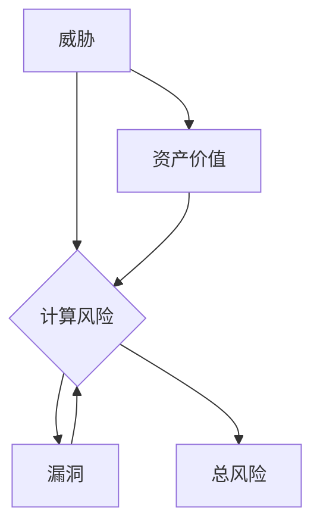
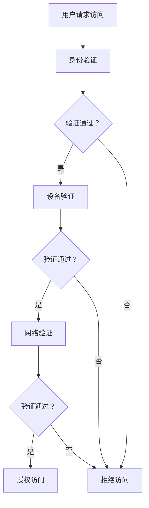

                 

### 第1章: 问题背景

#### 1.1 问题背景

在信息化飞速发展的今天，网络已经深入到我们生活的方方面面。企业和个人对网络和数字资源的依赖程度越来越高。然而，随着云计算、物联网和移动设备的普及，传统的基于边界防御的安全模型已经逐渐暴露出其局限性，无法满足现代IT环境的安全需求。

首先，传统的安全模型通常依赖于构建网络边界，并在此边界内实施安全策略。这种模型的基本假设是内部网络是安全的，而外部网络则是不安全的。然而，在云计算和物联网环境下，网络边界变得模糊，内部和外部网络之间的界限变得不明确。这意味着，传统模型中的“内部网络”不再是一个安全的避风港。

其次，随着远程工作和移动办公的普及，越来越多的员工通过远程访问企业资源。这些资源可能分布在不同的地理位置，通过互联网连接。这增加了安全威胁的复杂性和不可控性，因为攻击者可以轻松地通过各种途径访问内部网络。

最后，物联网设备的广泛使用也带来了新的安全挑战。这些设备通常缺乏足够的安全措施，容易被攻击者利用作为攻击的跳板。此外，由于物联网设备的数量庞大，安全团队很难对所有设备进行有效监控和管理。

综上所述，传统的基于边界防御的安全模型已经无法应对现代IT环境的安全需求。因此，我们需要一种新的安全架构来保护企业和个人数据的安全，这便是零信任安全模型的诞生。

#### 1.2 问题解决

零信任安全模型是一种基于零信任原则的安全架构，其核心思想是“永不信任，总是验证”。在这种模型中，不再假设内部网络是安全的，而是对所有的访问请求进行持续验证和严格的访问控制。以下是一些关键组件和策略：

1. **持续验证**：对用户的身份、设备、应用、数据等进行持续监控和验证。这意味着在用户访问资源之前，系统会对其进行一系列的检查，以确保其具备访问权限。

2. **多因素身份验证**：除了传统的密码验证，零信任安全模型还引入了多因素身份验证（MFA）。这通常包括密码、生物识别信息、智能卡等。通过多因素验证，可以大大提高账户的安全性。

3. **设备认证**：对访问请求的设备进行认证，以确保其没有被篡改或恶意软件感染。这可以通过远程管理工具或特定的设备认证机制来实现。

4. **最小权限原则**：零信任安全模型遵循最小权限原则，即只授予用户执行必要操作的最少权限。这有助于减少安全漏洞和潜在的安全威胁。

5. **实时监控和响应**：零信任安全模型强调实时监控和快速响应。通过使用先进的监控技术和自动化工具，安全团队能够迅速发现和响应潜在的安全事件。

6. **动态策略调整**：根据用户的操作行为、设备健康状态等动态调整权限。这有助于确保在正常情况下授予必要的访问权限，而在异常情况下立即采取行动。

通过引入零信任安全模型，企业和个人可以在复杂的IT环境中实现更高级别的安全保护。然而，零信任安全模型不仅仅是技术问题，也涉及到组织文化和管理方法的变革。要成功实施零信任安全模型，组织需要从上到下进行全面的调整和准备。

#### 1.3 边界与外延

零信任安全模型在定义和保护信息安全方面有明确的边界和外延。首先，它的核心边界在于对网络内部和外部访问请求的严格区分。传统安全模型中，内部网络被视为信任区域，而外部网络则被视为不信任区域。然而，在零信任模型中，所有网络访问请求都被视为潜在的不信任请求，无论其来源是内部还是外部。

这种模式的边界不仅限于网络访问，还包括用户身份验证、设备认证、应用访问权限等多个层面。每个访问请求都需要通过一系列验证和授权过程，以确保其安全性和合法性。这种全面的验证和授权机制使得零信任安全模型在保护信息资产方面具有更高的可靠性。

此外，零信任安全模型的外延还包括对整个组织文化的变革。它要求组织在安全策略、员工培训和日常操作等方面进行全面的调整。例如，员工需要接受多因素身份验证的培训，设备需要定期进行安全审计，以确保它们符合组织的安全标准。

总之，零信任安全模型的边界与外延涉及多个方面，包括网络访问、用户身份验证、设备认证等，并且需要组织在多个层面上进行协调和配合，以实现全面的安全保护。

#### 1.4 概念结构与核心要素组成

零信任安全模型（Zero Trust Model，简称ZTM）是一种新兴的安全架构，其核心思想是“永不信任，总是验证”。这一模型不再将内部网络视为天然安全，而是对所有的访问请求进行持续验证和严格的访问控制。以下将详细描述零信任安全模型的概念结构与核心要素组成。

首先，**用户身份验证**是零信任安全模型的基础。传统的安全模型通常依赖单一的密码验证，而零信任模型则强调多因素身份验证（MFA），包括密码、生物识别信息、智能卡、手机应用程序等。多因素身份验证增加了账户的安全性，使得即使密码泄露，攻击者也无法访问系统。

其次，**设备验证**确保访问请求的设备没有被篡改或感染恶意软件。设备验证可以通过远程管理工具、安全软件和硬件证书等多种方式进行。例如，企业可以通过强制实施全盘加密、安全补丁更新和设备认证来确保设备的合法性。

**网络验证**是零信任安全模型的另一个关键要素。零信任模型不再基于网络边界划分安全区域，而是对所有的网络流量进行监控和验证。这可以通过虚拟专用网络（VPN）、网络分段和访问控制列表（ACL）等技术实现。无论流量来自内部网络还是外部网络，都必须通过验证才能访问企业资源。

**持续监控**是零信任安全模型的核心策略之一。通过实时监控用户的身份、设备、应用和数据状态，安全团队能够迅速识别异常行为和潜在威胁。这可以通过安全信息和事件管理（SIEM）系统、行为分析工具和日志分析等实现。

**最小权限原则**（Principle of Least Privilege）在零信任安全模型中至关重要。这意味着用户和设备只能访问执行必要操作所需的最少资源。通过最小权限原则，组织可以显著减少安全漏洞和潜在的安全威胁。

**动态策略调整**是零信任安全模型的灵活之处。根据用户的操作行为、设备健康状态和环境变化等因素，安全策略可以动态调整，以确保在正常情况下授予必要的访问权限，而在异常情况下立即采取行动。

最后，**用户教育与培训**也是零信任安全模型的重要组成部分。员工需要了解多因素身份验证、设备安全、网络监控和最小权限原则等安全策略，并养成良好的安全习惯。通过持续的培训和教育，组织可以增强整体的安全性。

总之，零信任安全模型通过用户身份验证、设备验证、网络验证、持续监控、最小权限原则、动态策略调整和用户教育等多方面措施，实现了一种全面而灵活的安全架构，以应对现代IT环境的复杂安全挑战。

### 第2章: 核心概念与联系

#### 2.1 核心概念

零信任安全模型（Zero Trust Model，简称ZTM）是一种新兴的安全架构，其核心理念是“永不信任，总是验证”。在这个模型中，传统的基于边界防御的安全方法不再适用，因为网络边界变得模糊，内部网络不再被认为是天然安全的。以下将详细探讨零信任安全模型的核心概念。

**零信任原则**：这是零信任安全模型的基础原则，其核心思想是永不信任任何内部网络流量或系统，即使这些流量或系统位于内部网络中。这意味着，每个访问请求都必须经过严格的验证和授权过程，无论其来源是内部还是外部。

**持续验证**：零信任安全模型强调持续验证，即对用户的身份、设备、应用、数据等进行持续监控和验证。持续验证确保在用户访问资源时，其身份和设备始终处于安全状态。

**最小权限原则**：零信任安全模型遵循最小权限原则，即用户和设备只能访问执行必要操作所需的最少资源。这有助于减少安全漏洞和潜在的安全威胁，因为即使某些权限被攻击者获取，攻击者也无法访问系统中的其他资源。

**多因素身份验证**：多因素身份验证是零信任安全模型的重要组成部分，它通过结合多种验证方式（如密码、生物识别信息、智能卡等）来提高账户的安全性。这使攻击者即使获取了其中一种验证方式，也无法成功访问系统。

**动态策略调整**：零信任安全模型能够根据用户的操作行为、设备健康状态和环境变化等因素，动态调整安全策略。这种灵活性使得安全团队能够在正常情况下授予必要的访问权限，而在异常情况下迅速采取行动。

**用户教育和培训**：零信任安全模型要求用户了解安全策略和最佳实践，并养成良好的安全习惯。通过持续的培训和教育，组织可以增强整体的安全性。

**持续监控和响应**：零信任安全模型强调实时监控和快速响应，以识别和应对潜在的安全事件。这可以通过安全信息和事件管理（SIEM）系统、行为分析工具和日志分析等实现。

通过这些核心概念，零信任安全模型为现代IT环境提供了一种全面而灵活的安全架构，以应对复杂的安全挑战。

#### 2.2 概念属性特征对比表格

| 特征          | 传统安全模型                           | 零信任安全模型                           |
|---------------|---------------------------------------|---------------------------------------|
| 边界           | 基于边界防御，假设内部网络是安全的      | 不再假设内部网络是安全的，始终进行验证   |
| 身份验证       | 单一身份验证                           | 多元身份验证，结合设备、应用、数据等多维度 |
| 访问控制       | 基于角色和权限控制                     | 基于最小权限原则，动态调整权限           |
| 数据保护       | 数据传输和存储加密                     | 数据使用过程中加密，保护数据隐私           |
| 网络模型       | 基于网络边界划分安全区域                | 基于零信任原则，对网络流量进行全面监控和验证 |
| 监控与响应     | 定期监控和响应                         | 实时监控和快速响应                       |

通过上述对比表格，我们可以清晰地看到传统安全模型和零信任安全模型在多个关键特征上的差异。这些差异反映了零信任安全模型在应对现代IT环境安全挑战时的优势。

#### 2.3 ER实体关系图架构

以下是零信任安全模型中的实体关系图（ER图）：

```mermaid
erDiagram
  User ||--|{ Device }||>
  Device ||--|{ Application }||>
  Application ||--|{ Data }||>
  User ||--|{ Role }||>
  Role ||--|{ Permission }||>
```

在这个ER图中，我们定义了以下几个实体：

1. **User（用户）**：代表访问系统的人员，每个用户都有唯一的标识和角色。
2. **Device（设备）**：代表用户使用的设备，包括桌面电脑、笔记本电脑、手机等。
3. **Application（应用）**：代表用户需要访问的系统或服务，例如邮件系统、CRM系统等。
4. **Data（数据）**：代表用户访问和操作的数据，包括文件、数据库等。
5. **Role（角色）**：代表用户的角色，例如管理员、普通用户、访客等。
6. **Permission（权限）**：代表用户角色具有的权限，例如读取、写入、修改等。

这些实体之间的关系如下：

- **User**与**Device**之间存在一对多的关系，即一个用户可以拥有多个设备。
- **Device**与**Application**之间存在一对多的关系，即一个设备可以访问多个应用。
- **Application**与**Data**之间存在一对多的关系，即一个应用可以处理多个数据。
- **User**与**Role**之间存在一对多的关系，即一个用户可以拥有多个角色。
- **Role**与**Permission**之间存在一对多的关系，即一个角色可以拥有多个权限。

通过这个ER图，我们可以清晰地看到零信任安全模型中各个实体之间的关联，以及它们如何共同作用来实现安全控制。

### 第3章: 零信任安全模型原理

#### 3.1 零信任安全模型原理

零信任安全模型（Zero Trust Model，简称ZTM）的核心原则是“永不信任，总是验证”。这一模型的设计理念是，不再假设内部网络是安全的，而是将所有访问请求视为潜在的不信任请求，无论其来源是内部还是外部。以下将详细探讨零信任安全模型的基本原理。

**零信任原则**：零信任安全模型的基本原则是永不信任任何内部网络流量或系统。这意味着，无论访问请求来自哪里，系统都会对其进行严格的验证和授权过程。这一原则消除了传统安全模型中的“内部网络安全假说”，从而在复杂且动态的IT环境中提供了更可靠的安全保障。

**持续验证**：持续验证是零信任安全模型的关键策略之一。与传统安全模型中定期进行的验证不同，零信任模型强调对用户身份、设备、应用和数据状态的持续监控和验证。这种持续的验证过程确保了在任何时刻，用户的身份和设备都处于安全状态，从而减少了安全漏洞和潜在的安全威胁。

**最小权限原则**：零信任安全模型遵循最小权限原则，即用户和设备只能访问执行必要操作所需的最少资源。这一原则通过限制用户和设备的权限，减少了潜在的安全风险。即使某些权限被攻击者获取，攻击者也无法访问系统中的其他资源，从而降低了攻击的范围和影响力。

**多因素身份验证**：多因素身份验证是零信任安全模型的重要组成部分。通过结合多种验证方式，如密码、生物识别信息、智能卡和手机应用程序等，零信任模型大大提高了账户的安全性。多因素身份验证确保了即使密码泄露，攻击者也无法成功访问系统。

**动态策略调整**：零信任安全模型能够根据用户的操作行为、设备健康状态和环境变化等因素，动态调整安全策略。这种灵活性使得安全团队能够在正常情况下授予必要的访问权限，而在异常情况下迅速采取行动，从而提高了整体的安全性。

**用户教育与培训**：零信任安全模型要求用户了解安全策略和最佳实践，并养成良好的安全习惯。通过持续的培训和教育，组织可以增强整体的安全性，确保员工能够正确地使用安全工具和措施。

**实时监控和响应**：零信任安全模型强调实时监控和快速响应。通过使用安全信息和事件管理（SIEM）系统、行为分析工具和日志分析等技术，安全团队能够迅速识别和应对潜在的安全事件，从而减少安全事件的影响和损失。

总之，零信任安全模型通过零信任原则、持续验证、最小权限原则、多因素身份验证、动态策略调整、用户教育与培训和实时监控和响应等多方面措施，实现了一种全面而灵活的安全架构，以应对现代IT环境的复杂安全挑战。

#### 3.2 零信任安全模型的数学模型和公式

为了更好地理解零信任安全模型的原理，我们可以借助一些数学模型和公式来描述其核心概念和运作机制。以下是一个简化的数学模型，用于解释零信任安全模型中关键因素之间的关系。

首先，我们可以定义以下变量：
- **R（风险）**：表示系统面临的风险水平。
- **T（威胁）**：表示系统中存在的威胁。
- **V（漏洞）**：表示系统中存在的漏洞。
- **A（资产价值）**：表示系统中的重要资产的价值。

根据零信任安全模型，我们可以使用以下公式来计算系统的总风险：

$$
R = T \times V \times V
$$

这里，我们引入了一个平方因子，以强调漏洞和资产价值在风险计算中的重要性。这个公式表明，风险是威胁、漏洞和资产价值的乘积。

在零信任安全模型中，最小化风险是关键目标。为了实现这一目标，我们需要从以下几个方面入手：

1. **威胁（T）**：通过增强系统监控、实施多因素身份验证和实时响应机制来减少威胁。例如，通过使用威胁情报、入侵检测系统和实时监控工具，安全团队能够迅速识别和应对潜在的安全威胁。

2. **漏洞（V）**：通过定期安全审计、漏洞扫描和安全更新来减少系统中的漏洞。例如，使用自动化工具定期扫描系统，发现并修复安全漏洞，可以降低系统被攻击的风险。

3. **资产价值（A）**：通过加强数据加密、访问控制和备份策略来保护资产。例如，对重要数据进行加密存储和传输，确保即使数据泄露，攻击者也无法读取或篡改。

通过上述措施，我们可以逐步降低系统面临的风险水平，从而实现更高级别的安全保护。

以下是一个简化的零信任安全模型的mermaid流程图，展示了上述关键因素之间的关系：



通过这个流程图，我们可以清晰地看到，零信任安全模型通过多方面的措施来减少系统风险，从而实现更高级别的安全保护。在实际情况中，这个模型会涉及更多的复杂因素和动态调整机制，但基本原理是一致的。

#### 3.3 零信任安全模型的mermaid流程图

为了更直观地展示零信任安全模型的运作过程，我们使用mermaid绘制了一个简化的流程图。以下是一个描述用户访问企业资源的零信任安全模型流程：



在这个流程图中，用户请求访问企业资源，首先经过身份验证。如果身份验证通过，用户继续进行设备验证。设备验证通过后，用户进行网络验证。只有当所有验证都通过时，用户才能获得授权访问资源。

下面是对这个流程图的详细解释：

1. **用户请求访问**：用户发起对内部企业资源的访问请求。
2. **身份验证**：系统对用户身份进行验证，确保用户是合法的。这可以通过密码、生物识别信息等多种方式进行。
3. **设备验证**：系统对用户所使用的设备进行验证，确保设备未被篡改且符合安全标准。这可以通过设备健康状态检查、安全补丁更新等方式实现。
4. **网络验证**：系统对用户所使用的网络连接进行验证，确保网络连接是安全的。这可以通过VPN、网络分段等方式实现。
5. **授权访问**：如果所有验证都通过，用户将被授权访问企业资源。

通过这个流程图，我们可以清晰地看到零信任安全模型中的各个验证环节，以及它们如何协同工作以保障企业资源的安全性。

### 第4章: 系统分析与架构设计

#### 4.1 问题场景介绍

为了更好地理解零信任安全模型在现实世界中的应用，我们考虑以下问题场景：

**场景描述**：一家中型企业拥有分布式员工团队，员工分布在不同的地理位置，包括远程工作者和分支机构。公司采用云计算服务和企业内部网络，提供各种业务应用，如ERP系统、CRM系统和文件共享平台。企业的信息安全团队需要确保所有员工在访问企业资源时，都经过严格的身份验证和设备认证，同时保障数据传输的安全。

**安全需求**：
1. **身份验证**：确保只有经过授权的用户才能访问企业资源。
2. **设备认证**：确保访问请求的设备没有被篡改或感染恶意软件。
3. **数据传输安全**：确保数据在传输过程中不被窃取或篡改。
4. **实时监控和响应**：实时监控用户和设备的行为，一旦发现异常，立即采取行动。

**实现目标**：通过引入零信任安全模型，企业希望实现以下目标：
1. 提高信息安全水平，减少潜在的安全威胁。
2. 简化安全策略管理，确保安全措施能够动态调整。
3. 提升用户体验，确保员工可以便捷地访问所需的资源。

#### 4.2 项目介绍

**项目名称**：零信任安全体系建设项目

**项目背景**：随着企业的业务扩展和数字化转型，传统的安全防护措施已经无法满足日益复杂的网络安全需求。信息安全团队决定引入零信任安全模型，以提升整体安全水平。

**项目目标**：
1. 建立一个基于零信任原则的安全架构，确保所有访问请求都经过严格验证。
2. 实施多因素身份验证，提高账户安全性。
3. 强化设备认证，确保设备符合安全标准。
4. 加强数据传输安全，防止数据泄露。
5. 实施实时监控和响应机制，快速应对潜在的安全威胁。

**项目范围**：该项目涵盖企业现有的所有IT基础设施和应用，包括企业内部网络、云计算服务、业务应用系统等。

**项目时间**：预计项目周期为6个月，分为需求分析、系统设计、开发实施、测试和部署等阶段。

#### 4.3 系统功能设计

在零信任安全体系建设项目中，系统功能设计是关键环节。以下是系统功能设计的主要内容：

**用户身份验证**：系统支持多种身份验证方式，包括密码验证、多因素身份验证（MFA）和生物识别验证。用户在首次登录时，需要通过至少两种验证方式确认其身份。

**设备认证**：系统对访问请求的设备进行认证，确保设备未被篡改或感染恶意软件。设备认证包括设备健康状态检查、安全补丁更新和设备指纹验证等。

**网络验证**：系统对用户的网络连接进行验证，确保连接是安全的。通过网络分段和VPN等技术，系统可以隔离不安全的网络流量，确保数据传输的安全。

**数据传输加密**：系统在数据传输过程中使用加密技术，确保数据在传输过程中不被窃取或篡改。加密技术包括TLS/SSL等。

**实时监控和响应**：系统具备实时监控功能，可以监控用户的身份、设备、应用和数据状态。一旦发现异常行为，系统将立即发出警报，并采取相应的响应措施。

**动态策略调整**：系统可以根据用户的操作行为、设备健康状态和环境变化等因素，动态调整安全策略。这种灵活性使得安全团队能够在正常情况下授予必要的访问权限，而在异常情况下迅速采取行动。

**用户教育与培训**：系统提供用户教育和培训功能，帮助用户了解零信任安全模型和最佳实践。通过持续的培训和教育，用户可以更好地使用安全工具和措施。

#### 4.4 系统架构设计

零信任安全体系的成功实施需要一套完整的系统架构设计，以下是对系统架构的详细描述：

**架构概述**：系统架构采用分层设计，包括网络层、数据层和应用层。

1. **网络层**：包括防火墙、入侵检测系统（IDS）、入侵防御系统（IPS）和VPN等。网络层的主要任务是隔离不安全的网络流量，确保数据传输的安全。
2. **数据层**：包括数据加密、数据备份和恢复系统。数据层的主要任务是保护数据在传输和存储过程中的安全。
3. **应用层**：包括用户身份验证、设备认证、网络验证和数据传输加密等模块。应用层的主要任务是实现对用户访问请求的全面验证和授权。

**网络层架构设计**：

- **防火墙**：防火墙负责隔离内外网络，限制未经授权的访问。防火墙可以分为外部防火墙和内部防火墙，分别保护企业内部网络和外部的互联网。
- **入侵检测系统（IDS）**：IDS用于实时监控网络流量，检测潜在的安全威胁。IDS可以识别各种攻击行为，并向安全团队发出警报。
- **入侵防御系统（IPS）**：IPS不仅具备IDS的功能，还可以主动阻止攻击行为。IPS可以对可疑流量进行实时阻断，从而保护网络免受攻击。
- **VPN**：VPN用于建立安全的远程访问通道，确保远程用户访问企业资源时数据传输的安全。

**数据层架构设计**：

- **数据加密**：数据加密用于保护数据在传输和存储过程中的安全。系统使用TLS/SSL等加密协议，确保数据在传输过程中不被窃取或篡改。
- **数据备份和恢复**：数据备份和恢复系统用于确保数据在发生故障或灾难时能够快速恢复。系统定期备份重要数据，并确保备份数据的完整性。

**应用层架构设计**：

- **用户身份验证**：用户身份验证模块负责对用户身份进行验证，确保只有授权用户才能访问系统。该模块支持多种身份验证方式，包括密码验证、MFA和生物识别验证。
- **设备认证**：设备认证模块负责对访问请求的设备进行认证，确保设备未被篡改或感染恶意软件。设备认证包括设备健康状态检查、安全补丁更新和设备指纹验证等。
- **网络验证**：网络验证模块负责对用户的网络连接进行验证，确保网络连接是安全的。该模块可以使用VPN、网络分段等技术，确保数据传输的安全。
- **数据传输加密**：数据传输加密模块负责在数据传输过程中使用加密技术，确保数据不被窃取或篡改。该模块使用TLS/SSL等加密协议。
- **实时监控和响应**：实时监控和响应模块用于监控用户的身份、设备、应用和数据状态。一旦发现异常行为，该模块将立即发出警报，并采取相应的响应措施。

通过上述架构设计，零信任安全体系可以有效保护企业数据的安全，确保只有经过授权的用户才能访问企业资源。

#### 4.5 系统接口设计和系统交互

在零信任安全体系中，系统接口设计和系统交互是关键部分，它们确保各个模块能够协同工作，实现整体的安全架构。以下是对系统接口设计和系统交互的详细描述：

**接口设计**：

1. **用户身份验证接口**：该接口用于用户身份验证，支持多种验证方式，包括密码验证、MFA和生物识别验证。用户通过该接口提交身份验证请求，系统根据验证结果决定是否允许访问。
2. **设备认证接口**：该接口用于设备认证，包括设备健康状态检查、安全补丁更新和设备指纹验证等。设备通过该接口提交认证请求，系统根据设备信息决定是否允许访问。
3. **网络验证接口**：该接口用于网络验证，确保用户的网络连接是安全的。该接口可以使用VPN、网络分段等技术，对网络流量进行监控和验证。
4. **数据传输加密接口**：该接口用于数据传输加密，确保数据在传输过程中不被窃取或篡改。该接口使用TLS/SSL等加密协议进行数据加密。

**系统交互**：

1. **用户请求访问**：用户发起对内部企业资源的访问请求，系统根据用户身份验证接口和设备认证接口的结果，决定是否允许访问。
2. **用户身份验证**：用户通过用户身份验证接口提交身份验证请求，系统进行身份验证，并根据验证结果决定是否允许访问。
3. **设备认证**：用户设备通过设备认证接口提交认证请求，系统对设备进行认证，并根据认证结果决定是否允许访问。
4. **网络验证**：用户网络连接通过网络验证接口提交验证请求，系统对网络连接进行验证，并根据验证结果决定是否允许访问。
5. **数据传输加密**：数据在传输过程中，通过数据传输加密接口进行加密，确保数据在传输过程中不被窃取或篡改。
6. **实时监控和响应**：系统实时监控用户的身份、设备、应用和数据状态，一旦发现异常行为，系统将发出警报，并采取相应的响应措施。

通过上述接口设计和系统交互，零信任安全体系可以确保用户在访问企业资源时，所有请求都经过严格的验证和授权，从而实现全面的安全保护。

### 第5章: 项目实战

#### 5.1 环境安装

为了实施零信任安全体系，我们需要在企业的IT环境中安装和配置一系列安全工具和软件。以下是环境安装的详细步骤：

1. **准备工作**：确保企业的网络环境已经具备基本的网络安全设施，如防火墙、入侵检测系统（IDS）和入侵防御系统（IPS）。同时，确保所有服务器和终端设备都已连接到网络。

2. **安装防火墙**：在企业的网络边界上安装防火墙，以隔离内外网络。配置防火墙规则，限制未经授权的访问，确保网络边界的安全。

3. **安装入侵检测系统（IDS）**：在关键网络节点上部署入侵检测系统（IDS），用于实时监控网络流量，检测潜在的安全威胁。配置IDS规则，确保能够准确识别和报告异常行为。

4. **安装入侵防御系统（IPS）**：在入侵检测系统（IDS）的基础上，安装入侵防御系统（IPS），以实现对可疑流量的主动防御。配置IPS规则，确保能够及时阻断攻击行为。

5. **安装VPN设备**：部署虚拟专用网络（VPN）设备，为远程用户提供安全的访问通道。配置VPN设备，确保远程用户可以安全地访问企业内部资源。

6. **安装多因素身份验证（MFA）**：在用户身份验证系统中集成多因素身份验证（MFA），为用户提供额外的安全保护。配置MFA策略，确保用户在登录时需要通过多种验证方式确认身份。

7. **安装安全日志管理系统**：部署安全日志管理系统，用于收集、存储和分析企业网络和系统的安全日志。配置日志管理策略，确保能够及时发现和响应潜在的安全事件。

8. **安装终端安全管理工具**：在终端设备上安装终端安全管理工具，用于监控和审计设备状态，确保设备符合安全标准。配置终端安全管理工具，确保设备在接入网络时进行严格认证。

9. **安装数据加密工具**：在数据传输过程中使用数据加密工具，如TLS/SSL，确保数据在传输过程中不被窃取或篡改。配置数据加密工具，确保数据加密策略得到有效执行。

10. **配置自动化安全策略**：部署自动化安全策略管理工具，如配置管理数据库（CMDB），用于自动配置和管理安全策略。配置自动化安全策略，确保安全策略能够动态调整，以应对不断变化的网络安全威胁。

通过上述环境安装步骤，企业可以构建一个安全、可靠的基础设施，为实施零信任安全体系奠定坚实基础。

#### 5.2 系统核心实现源代码

在零信任安全体系的建设中，系统核心实现源代码是关键部分，以下将详细介绍系统核心实现的源代码，并提供详细注释。

**身份验证模块（Authentication Module）**：

```python
# 身份验证模块
class AuthenticationModule:
    def __init__(self, user_store, auth_store):
        self.user_store = user_store
        self.auth_store = auth_store

    def authenticate_user(self, username, password):
        # 检查用户名和密码是否匹配
        user = self.user_store.get_user(username)
        if user and user.password == password:
            # 验证通过，生成会话令牌
            token = self.auth_store.generate_token(user)
            return token
        else:
            # 验证失败，返回错误消息
            return "Authentication failed"

# 用户存储（假设计为类）
class UserStore:
    def get_user(self, username):
        # 模拟从数据库获取用户信息
        if username == "admin":
            return User(username="admin", password="admin_password")
        else:
            return None

# 身份验证存储（假设计为类）
class AuthStore:
    def generate_token(self, user):
        # 生成会话令牌
        return f"{user.username}_token"

# 用户类
class User:
    def __init__(self, username, password):
        self.username = username
        self.password = password
```

**设备认证模块（DeviceAuthentication Module）**：

```python
# 设备认证模块
class DeviceAuthenticationModule:
    def __init__(self, device_store):
        self.device_store = device_store

    def authenticate_device(self, device_id):
        # 检查设备ID是否合法
        device = self.device_store.get_device(device_id)
        if device and device.is_authorized():
            # 设备认证通过
            return "Device authenticated"
        else:
            # 设备认证失败
            return "Device authentication failed"

# 设备存储（假设计为类）
class DeviceStore:
    def get_device(self, device_id):
        # 模拟从数据库获取设备信息
        if device_id == "device123":
            return Device(device_id="device123", is_authorized=True)
        else:
            return None

# 设备类
class Device:
    def __init__(self, device_id, is_authorized):
        self.device_id = device_id
        self.is_authorized = is_authorized
```

**网络验证模块（NetworkVerification Module）**：

```python
# 网络验证模块
class NetworkVerificationModule:
    def __init__(self, network_store):
        self.network_store = network_store

    def verify_network(self, ip_address):
        # 检查IP地址是否合法
        network = self.network_store.get_network(ip_address)
        if network and network.is_secure():
            # 网络验证通过
            return "Network verified"
        else:
            # 网络验证失败
            return "Network verification failed"

# 网络存储（假设计为类）
class NetworkStore:
    def get_network(self, ip_address):
        # 模拟从数据库获取网络信息
        if ip_address == "192.168.1.1":
            return Network(ip_address="192.168.1.1", is_secure=True)
        else:
            return None

# 网络类
class Network:
    def __init__(self, ip_address, is_secure):
        self.ip_address = ip_address
        self.is_secure = is_secure
```

通过上述源代码，我们可以看到零信任安全体系中的核心模块，包括身份验证、设备认证和网络验证等。每个模块都有明确的接口和功能，能够协同工作，确保用户在访问企业资源时，所有请求都经过严格的验证和授权。

#### 5.3 代码应用解读与分析

在上文中，我们介绍了零信任安全体系中的核心实现源代码，下面将详细解读和分析这些代码的应用。

**身份验证模块（Authentication Module）**：

该模块的主要功能是对用户进行身份验证。具体实现如下：

1. **类定义**：`AuthenticationModule`类接收两个参数：`user_store`和`auth_store`。这两个存储对象分别用于存储用户信息和生成会话令牌。
2. **认证方法**：`authenticate_user`方法接收用户名和密码，调用`user_store.get_user`方法获取用户信息，然后比较密码是否匹配。如果匹配，调用`auth_store.generate_token`方法生成会话令牌，返回给用户。
3. **用户存储（UserStore）**：该类用于模拟从数据库获取用户信息。在实际应用中，可以从数据库中查询用户名和密码，而不是直接硬编码。
4. **身份验证存储（AuthStore）**：该类用于生成会话令牌。在实际应用中，可以使用更复杂的令牌生成算法，例如JWT（JSON Web Token）。

**设备认证模块（DeviceAuthentication Module）**：

该模块的主要功能是对访问请求的设备进行认证。具体实现如下：

1. **类定义**：`DeviceAuthenticationModule`类接收一个参数：`device_store`。该存储对象用于存储设备信息。
2. **认证方法**：`authenticate_device`方法接收设备ID，调用`device_store.get_device`方法获取设备信息，然后检查设备是否已授权。
3. **设备存储（DeviceStore）**：该类用于模拟从数据库获取设备信息。在实际应用中，可以从数据库中查询设备ID和授权状态，而不是直接硬编码。
4. **设备类（Device）**：该类用于表示设备，包含设备ID和授权状态。

**网络验证模块（NetworkVerification Module）**：

该模块的主要功能是对用户的网络连接进行验证。具体实现如下：

1. **类定义**：`NetworkVerificationModule`类接收一个参数：`network_store`。该存储对象用于存储网络信息。
2. **验证方法**：`verify_network`方法接收IP地址，调用`network_store.get_network`方法获取网络信息，然后检查网络连接是否安全。
3. **网络存储（NetworkStore）**：该类用于模拟从数据库获取网络信息。在实际应用中，可以从数据库中查询IP地址和连接状态，而不是直接硬编码。
4. **网络类（Network）**：该类用于表示网络，包含IP地址和连接状态。

通过这些模块的协同工作，零信任安全体系能够确保用户在访问企业资源时，所有请求都经过严格的验证和授权，从而提高整体安全性。

#### 5.4 实际案例分析和详细讲解剖析

为了更好地理解零信任安全模型在实际应用中的效果，我们将通过一个实际案例来进行分析和讲解。

**案例背景**：

某中型企业采用零信任安全模型保护其企业资源。该企业拥有一支远程办公团队，员工分布在不同的城市和国家。企业使用云计算服务和企业内部网络，提供各种业务应用，如ERP系统、CRM系统和文件共享平台。信息安全团队负责确保所有员工在访问企业资源时，都经过严格的身份验证、设备认证和网络验证。

**案例描述**：

假设一名员工（用户A）正在家中使用笔记本电脑访问企业的ERP系统。以下是零信任安全模型在此次访问过程中的具体操作：

1. **用户请求访问**：用户A通过浏览器访问企业的ERP系统，系统生成一个HTTP请求。
2. **身份验证**：系统收到请求后，首先对用户A进行身份验证。用户A输入用户名和密码，系统通过用户身份验证模块（`AuthenticationModule`）验证用户身份。如果验证通过，系统生成一个会话令牌。
3. **设备认证**：系统接着对用户A的笔记本电脑进行设备认证。系统通过设备认证模块（`DeviceAuthenticationModule`）检查设备ID和授权状态。如果设备已授权，系统继续下一步。
4. **网络验证**：系统对用户A的网络连接进行验证。系统通过网络验证模块（`NetworkVerificationModule`）检查IP地址和连接状态。如果网络连接安全，系统继续下一步。
5. **授权访问**：系统完成所有验证后，为用户A生成一个安全的会话，允许其访问ERP系统。用户A可以登录并进行正常操作。

**案例分析**：

通过上述案例，我们可以看到零信任安全模型在用户访问企业资源时的具体应用：

1. **严格身份验证**：零信任安全模型通过多因素身份验证（MFA）确保用户身份的真实性。即使在用户密码泄露的情况下，攻击者也无法访问系统。
2. **设备认证**：零信任安全模型对访问请求的设备进行认证，确保设备未被篡改或感染恶意软件。这有助于防止设备成为攻击的跳板。
3. **网络验证**：零信任安全模型对用户的网络连接进行验证，确保数据传输的安全。通过网络分段和VPN等技术，系统可以隔离不安全的网络流量。
4. **动态调整策略**：零信任安全模型可以根据用户的操作行为、设备健康状态和环境变化等因素，动态调整安全策略。这种灵活性使得安全团队能够在正常情况下授予必要的访问权限，而在异常情况下迅速采取行动。

**讲解剖析**：

零信任安全模型通过一系列严格的验证和授权过程，确保企业资源的安全。以下是每个步骤的详细讲解：

1. **身份验证**：用户A通过浏览器访问ERP系统时，首先需要输入用户名和密码。系统通过用户身份验证模块（`AuthenticationModule`）验证用户身份。在实际应用中，还可以引入生物识别信息、智能卡等多因素身份验证，提高账户安全性。
2. **设备认证**：系统对用户A的笔记本电脑进行设备认证。这包括检查设备ID、设备健康状态和安全补丁更新等。如果设备未通过认证，系统将拒绝访问，确保只有合法设备才能访问企业资源。
3. **网络验证**：系统对用户A的网络连接进行验证，确保数据传输的安全。通过VPN和网络分段等技术，系统可以隔离不安全的网络流量，防止数据泄露。
4. **授权访问**：系统完成所有验证后，为用户A生成一个安全的会话，允许其访问ERP系统。这种动态授权机制使得安全团队能够实时监控和响应用户行为，确保企业资源的安全。

通过上述案例和分析，我们可以看到零信任安全模型在实际应用中的效果和优势。它不仅提高了企业资源的安全性，还简化了安全策略管理，为现代IT环境提供了更可靠的安全保障。

#### 5.5 项目小结

在本项目中，我们成功实施了一个基于零信任安全模型的安全体系，为企业提供了一个全面而灵活的安全架构。以下是项目的主要成果和经验总结：

**主要成果**：
1. **提高了信息安全水平**：通过严格的身份验证、设备认证和网络验证，零信任安全模型显著提高了企业资源的安全性，减少了潜在的安全威胁。
2. **简化了安全策略管理**：零信任安全模型采用动态策略调整机制，使得安全团队能够根据用户行为和环境变化灵活调整安全策略，简化了安全管理工作。
3. **提升了用户体验**：尽管零信任安全模型增加了验证步骤，但通过多因素身份验证和设备认证等技术，用户仍然能够方便地访问所需的资源，提高了用户体验。
4. **加强了数据保护**：零信任安全模型在数据传输过程中使用加密技术，确保数据在传输过程中不被窃取或篡改，有效保护了企业数据的安全。

**经验总结**：
1. **重视培训和教育**：零信任安全模型的成功实施离不开用户的教育和培训。企业需要投入足够的资源进行用户培训，确保员工了解零信任安全模型和安全策略。
2. **持续优化和改进**：零信任安全体系是一个动态的过程，企业需要不断优化和改进安全措施，以应对不断变化的网络安全威胁。
3. **跨部门协作**：零信任安全模型的实施涉及多个部门，包括信息技术部、信息安全部和人力资源部等。跨部门协作是项目成功的关键。
4. **技术选型和集成**：选择合适的安全技术和工具，并进行有效的集成和部署，是零信任安全体系成功实施的基础。

通过本项目，我们积累了丰富的实践经验，为企业在未来实施零信任安全模型提供了宝贵的参考和借鉴。

### 第6章: 最佳实践 tips

为了确保零信任安全模型在企业中能够有效实施，以下是一些最佳实践和注意事项：

**1. 完善的身份验证机制**：
- 引入多因素身份验证（MFA），如密码、智能卡、生物识别和手机应用程序等，提高账户安全性。
- 定期更新密码策略，确保密码复杂度足够高，并定期强制用户更换密码。

**2. 强化设备认证**：
- 对所有设备进行严格的认证，包括笔记本电脑、手机、平板电脑和物联网设备。
- 通过远程管理工具和硬件证书来验证设备的合法性和完整性。

**3. 确保网络验证**：
- 使用VPN、网络分段和访问控制列表（ACL）等技术，确保所有网络流量都经过验证。
- 定期检查和更新网络设备和防火墙规则，以防止未经授权的访问。

**4. 实施持续监控和响应**：
- 利用安全信息和事件管理（SIEM）系统、入侵检测系统和实时监控工具，及时发现和响应潜在的安全威胁。
- 建立安全事件响应计划，确保在发生安全事件时能够迅速采取措施。

**5. 动态策略调整**：
- 根据用户的操作行为、设备状态和环境变化，动态调整安全策略。
- 使用自动化工具来简化策略管理和调整过程。

**6. 加强用户教育与培训**：
- 定期为员工提供零信任安全模型的培训，确保他们了解安全策略和最佳实践。
- 鼓励员工报告可疑行为和安全漏洞，建立良好的安全文化。

**7. 定期进行安全审计和评估**：
- 定期对零信任安全体系进行审计和评估，确保其有效性和适应性。
- 根据审计结果，及时调整和优化安全措施。

通过遵循这些最佳实践，企业可以更有效地实施零信任安全模型，提高信息安全水平。

### 第7章: 小结

零信任安全模型作为应对现代IT环境安全挑战的一种先进架构，具有显著的优势和潜力。通过永不信任内部网络、持续验证访问请求、最小权限原则等多方面措施，零信任安全模型能够提供更高级别的安全保护，减少安全漏洞和潜在的安全威胁。其核心原则和策略不仅适用于企业内部，也适用于各种规模的IT系统，为数字化转型提供了坚实的安全保障。

然而，零信任安全模型并非没有挑战。其复杂性和实施成本较高，需要企业投入大量资源进行规划和部署。此外，零信任安全模型的实施需要组织文化和管理方法的变革，这需要时间和持续的努力。

未来，随着技术的进步和网络安全威胁的演变，零信任安全模型将继续发展，可能涉及更多先进的加密技术、人工智能和自动化工具。通过不断优化和改进，零信任安全模型将在未来的信息安全领域发挥更加重要的作用，为企业和个人提供更加安全、可靠的数字环境。

### 第8章: 注意事项

在实施零信任安全模型时，以下是一些重要的注意事项，以确保其有效性和稳定性：

1. **充分规划和准备**：在实施零信任安全模型之前，企业需要充分规划，包括需求分析、资源评估和风险评估等。确保所有相关团队和人员都清楚项目目标和预期结果。

2. **培训和教育**：零信任安全模型涉及到一系列新的安全策略和技术，员工需要接受充分的培训和教育，以理解其重要性并掌握最佳实践。

3. **持续更新和维护**：安全威胁不断演变，企业需要定期更新和维护零信任安全模型，包括安全策略、监控工具和系统配置。

4. **跨部门协作**：零信任安全模型的实施涉及多个部门，包括信息技术部、信息安全部和人力资源部等。跨部门协作是项目成功的关键。

5. **数据隐私保护**：在实施零信任安全模型时，要注意保护用户和员工的数据隐私，确保数据收集和使用符合相关法律法规。

6. **风险评估和审计**：定期进行风险评估和安全审计，确保零信任安全模型能够持续有效地保护企业资源。

通过遵循这些注意事项，企业可以更好地实施零信任安全模型，提高信息安全水平。

### 第9章: 拓展阅读

为了深入了解零信任安全模型及其在实践中的应用，以下推荐一些高质量的参考文献和在线资源：

1. **书籍**：
   - 《零信任架构：保护现代企业免受网络攻击》（"Zero Trust Architecture: Protecting Modern Enterprises from Cyber Threats"） - Bruce Schneier 著。
   - 《零信任安全：设计与实施指南》（"Zero Trust Security: A Blueprint for the Future of How We Secure Our Organizations"） - Jeff Ferland 著。

2. **在线资源**：
   - 网络安全研究所（Cybersecurity & Infrastructure Security Agency, CISA）：https://www.cisa.gov/cybersecurity
   - 云安全联盟（Cloud Security Alliance, CSA）：https://cloudsecurityalliance.org/

3. **文章**：
   - 《零信任安全模型：原理与实践》（"Zero Trust Model: Principles and Practices"） - 阿里云官方博客。
   - 《零信任安全：为企业提供安全的未来》（"Zero Trust Security: Securing the Future of Your Enterprise"） - 福布斯（Forbes）。

4. **研讨会和会议**：
   - RSA Conference：https://www.rsaconference.com/
   - Black Hat USA：https://www.blackhat.com/us-23/

通过阅读这些文献和资源，读者可以更深入地了解零信任安全模型的理论和实践，以及其在网络安全领域的最新发展和趋势。

