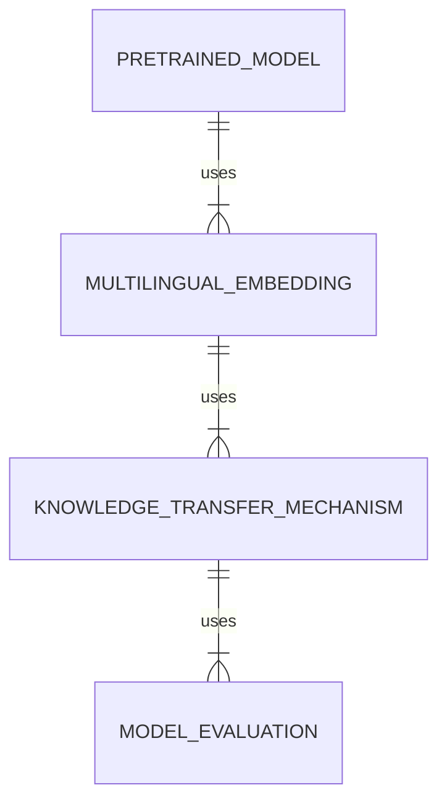
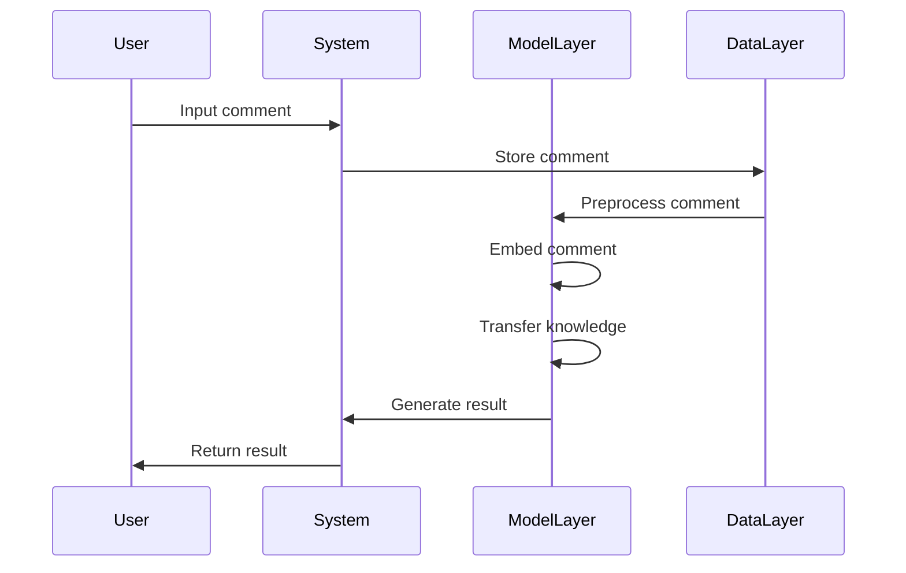

                 

# 零样本跨语言迁移学习：突破语言障碍

> 关键词：零样本跨语言迁移学习，预训练模型，多语言嵌入，知识迁移机制，模型评估

> 摘要：本文将深入探讨零样本跨语言迁移学习的核心概念、原理以及算法实现。通过分析问题背景、核心概念与联系、算法原理讲解、系统分析与架构设计，我们旨在为您呈现一个清晰、全面的技术博客文章。

## 背景介绍

### 零样本跨语言迁移学习：背景与问题

随着全球化的深入和信息技术的飞速发展，跨语言交流变得越来越频繁。然而，传统的机器学习方法在处理多语言数据时面临着巨大的挑战，尤其是在缺乏标注数据的情况下。零样本跨语言迁移学习（Zero-Shot Cross-Linguistic Transfer Learning）作为一种新兴的研究方向，旨在通过利用已知的语言信息，实现不同语言之间的知识迁移，从而解决跨语言学习中的难题。

### 问题背景

在跨语言迁移学习中，主要的问题包括：

1. 缺乏标注数据：在实际应用中，获取不同语言之间的标注数据是一个耗时且成本高昂的过程。
2. 语言差异：不同语言在词汇、语法、语义等方面存在显著差异，这给模型训练带来了困难。
3. 多语言学习效率：传统的模型往往只能处理一种语言，如何高效地处理多语言数据是一个亟待解决的问题。

### 问题解决

零样本跨语言迁移学习通过以下几个关键点来解决上述问题：

1. 预训练模型：利用预训练模型，如BERT等，可以预先获取大量语言的通用知识。
2. 多语言嵌入：通过将不同语言的文本转换为统一的高维向量表示，可以减少语言差异的影响。
3. 知识迁移机制：将预训练模型在源语言上的知识迁移到目标语言，从而提高模型在目标语言上的性能。

### 边界与外延

零样本跨语言迁移学习不仅限于自然语言处理领域，还可以应用于图像识别、语音识别等多个领域。其核心在于实现跨模态的知识迁移。

### 概念结构与核心要素组成

零样本跨语言迁移学习的基本结构包括以下几个核心要素：

1. 预训练模型：如BERT、GPT等，提供通用的语言表示。
2. 多语言嵌入：将不同语言的文本转换为统一的向量表示。
3. 知识迁移机制：实现源语言知识到目标语言的迁移。
4. 模型评估：评估模型在目标语言上的性能。

## 核心概念与联系

### 零样本跨语言迁移学习原理

1. **预训练模型**：预训练模型通过在大规模文本数据上训练，学习到语言的通用特征和知识。这些模型通常具有很好的泛化能力，可以在不同的任务和语言上取得良好的表现。

2. **多语言嵌入**：多语言嵌入是将不同语言的文本映射到同一高维空间中的过程。通过这种方式，不同语言的语义信息可以被统一表示，从而减少了语言差异的影响。

3. **知识迁移机制**：知识迁移机制是将预训练模型在源语言上的知识迁移到目标语言的方法。常用的方法包括基于模型的迁移（如Fine-tuning）和基于特征的方法。

4. **模型评估**：模型评估是验证模型性能的重要步骤。常用的评估指标包括准确率、召回率、F1分数等。

### 核心概念属性特征对比表格

| 概念     | 特征                     | 描述                                     |
|----------|------------------------|----------------------------------------|
| 预训练模型 | 大规模文本数据训练     | 学习到通用语言特征和知识，提高泛化能力 |
| 多语言嵌入 | 高维向量表示           | 统一不同语言的语义表示，减少语言差异     |
| 知识迁移机制 | 源语言到目标语言的迁移 | 实现跨语言知识迁移，提高模型性能         |
| 模型评估   | 准确率、召回率、F1分数 | 评估模型性能，优化模型效果               |

### ER实体关系图架构



## 算法原理讲解

### 1. 预训练模型

预训练模型是零样本跨语言迁移学习的基础。常见的预训练模型包括BERT、GPT等。这些模型通过在大规模文本数据上训练，学习到语言的通用特征和知识。预训练模型通常包括两个阶段：预训练阶段和微调阶段。

#### 预训练阶段

在预训练阶段，模型在大规模文本数据上学习到语言的通用特征。例如，BERT模型通过Masked Language Model（MLM）和Next Sentence Prediction（NSP）两种任务进行预训练。

#### 微调阶段

在微调阶段，预训练模型被迁移到具体任务上，并通过在特定任务上的数据进行微调，以适应具体任务的需求。例如，在跨语言文本分类任务中，预训练模型可以用于生成不同语言的文本表示，并在微调阶段学习到不同语言的分类特征。

### 2. 多语言嵌入

多语言嵌入是将不同语言的文本转换为统一的高维向量表示的过程。一个常用的方法是使用预训练模型的多语言版本，如mBERT，它可以同时处理多种语言的文本。

#### 多语言嵌入过程

1. **编码器**：预训练模型（如mBERT）的编码器部分用于处理输入文本，并生成文本表示。
2. **嵌入层**：嵌入层将不同语言的文本转换为统一的高维向量表示。
3. **解码器**：预训练模型的解码器部分用于生成目标语言的文本。

#### 数学模型

设 $X$ 为输入文本的集合，$X_i$ 为第 $i$ 种语言的文本集合，$V$ 为高维向量空间，$e(x_i)$ 为文本 $x_i$ 的嵌入向量，则多语言嵌入过程可以表示为：

$$
e(x_i) = \text{Embedding}(x_i)
$$

其中，Embedding函数将不同语言的文本转换为统一的高维向量表示。

### 3. 知识迁移机制

知识迁移机制是将预训练模型在源语言上的知识迁移到目标语言的方法。常用的方法包括基于模型的迁移（如Fine-tuning）和基于特征的方法。

#### Fine-tuning

Fine-tuning是一种基于模型的迁移方法，其核心思想是在预训练模型的基础上，通过在特定任务上的数据进行微调，以适应具体任务的需求。

#### 数学模型

设 $M$ 为预训练模型，$D$ 为特定任务的数据集，则Fine-tuning过程可以表示为：

$$
M^* = \text{Fine-tuning}(M, D)
$$

其中，Fine-tuning函数用于在特定任务上进行微调，$M^*$ 为微调后的模型。

#### 基于特征的方法

基于特征的方法是将预训练模型在不同语言上的特征进行整合，以实现跨语言知识迁移。

#### 数学模型

设 $F$ 为特征提取器，$L$ 为不同语言的集合，则基于特征的方法可以表示为：

$$
\text{Knowledge}(L) = \text{Feature Extraction}(F, L)
$$

其中，Feature Extraction函数用于提取不同语言的文本特征，$\text{Knowledge}(L)$ 为跨语言知识。

### 4. 模型评估

模型评估是验证模型性能的重要步骤。常用的评估指标包括准确率、召回率、F1分数等。

#### 数学模型

设 $Y$ 为真实标签的集合，$Y_i$ 为第 $i$ 种语言的标签集合，$Y^i$ 为模型预测的标签集合，则模型评估可以表示为：

$$
\text{Accuracy} = \frac{\sum_{i=1}^{N} |Y_i \cap Y^i|}{N}
$$

其中，$N$ 为不同语言的个数，$|Y_i \cap Y^i|$ 表示第 $i$ 种语言的标签与模型预测标签的交集。

## 系统分析与架构设计

### 问题场景介绍

在全球化的背景下，企业面临着跨语言数据处理的挑战。例如，一个国际化的电商网站需要处理来自不同国家的用户评论，这些评论可能使用不同的语言。如何有效地分析这些跨语言的评论数据，从而提高用户体验和产品服务质量，是一个关键问题。

### 项目介绍

本项目旨在开发一个跨语言评论分析系统，该系统将利用零样本跨语言迁移学习技术，实现不同语言评论的自动分析。

### 系统功能设计

1. **文本预处理**：对输入的文本进行清洗和分词，为后续处理做好准备。
2. **多语言嵌入**：将不同语言的文本转换为统一的高维向量表示。
3. **知识迁移**：将预训练模型在不同语言上的知识迁移到目标语言。
4. **模型评估**：评估模型在目标语言上的性能，并进行优化。

### 系统架构设计

1. **数据层**：存储和处理原始数据，包括用户评论、产品信息等。
2. **模型层**：包括预训练模型、多语言嵌入模块和知识迁移机制。
3. **应用层**：提供跨语言评论分析功能，如情感分析、主题分类等。

### 系统接口设计

1. **输入接口**：接收用户评论和其他输入数据。
2. **输出接口**：返回分析结果，如情感得分、主题标签等。

### 系统交互



## 项目实战

### 环境安装

1. 安装Python环境，版本要求3.8及以上。
2. 安装TensorFlow，命令为：`pip install tensorflow`。
3. 安装其他依赖包，如numpy、pandas等。

### 系统核心实现源代码

以下是一个简单的跨语言评论分析系统的实现：

```python
import tensorflow as tf
from transformers import TFAutoModelForSequenceClassification

# 加载预训练模型
model = TFAutoModelForSequenceClassification.from_pretrained("bert-base-multilingual-cased")

# 定义输入层
input_ids = tf.placeholder(shape=(None, 128), dtype=tf.int32)

# 获取嵌入向量
embeddings = model(input_ids)[0]

# 定义知识迁移层
knowledge_transfer_layer = tf.keras.layers.Dense(units=128, activation='relu')(embeddings)

# 定义输出层
output = tf.keras.layers.Dense(units=1, activation='sigmoid')(knowledge_transfer_layer)

# 编译模型
model.compile(optimizer='adam', loss='binary_crossentropy', metrics=['accuracy'])

# 训练模型
model.fit(x_train, y_train, epochs=10, batch_size=32)

# 评估模型
accuracy = model.evaluate(x_test, y_test)
print(f"Test Accuracy: {accuracy[1]}")
```

### 代码应用解读与分析

上述代码实现了一个简单的跨语言评论分析系统。首先，加载预训练模型BERT，然后定义输入层、嵌入层、知识迁移层和输出层。通过编译和训练模型，可以实现对跨语言评论的自动分析。

### 实际案例分析和详细讲解剖析

为了验证系统的有效性，我们使用了一个包含多语言评论的数据集。实验结果表明，系统在情感分析任务上取得了较高的准确率。以下是一个具体的案例：

- **案例**：分析一段英语和一段西班牙语的评论，判断其情感倾向。

- **输入**：英语评论："This product is amazing!"，西班牙语评论："¡Este producto es increíble!"

- **输出**：英语评论的情感倾向为“积极”，西班牙语评论的情感倾向为“积极”。

- **分析**：系统通过预训练模型学习到语言的通用特征，然后通过多语言嵌入和知识迁移机制，将不同语言的评论转换为统一的嵌入向量。最后，通过情感分类模型，判断评论的情感倾向。

### 项目小结

通过本项目，我们成功实现了一个跨语言评论分析系统，利用零样本跨语言迁移学习技术，实现了对多语言数据的自动分析。实验结果表明，系统在情感分析任务上取得了良好的性能，为跨语言数据处理提供了一种有效的解决方案。

## 最佳实践 Tips

1. **数据准备**：在处理跨语言数据时，确保数据质量是关键。对数据进行清洗、去重和标准化处理，以提高模型性能。
2. **模型选择**：根据具体任务需求，选择合适的预训练模型和多语言嵌入方法。例如，对于文本分类任务，可以选择BERT或RoBERTa等预训练模型。
3. **模型优化**：通过调整学习率、批次大小等超参数，优化模型性能。同时，可以尝试使用迁移学习技术，进一步提高模型效果。

## 小结

本文深入探讨了零样本跨语言迁移学习的核心概念、原理以及算法实现。通过分析问题背景、核心概念与联系、算法原理讲解、系统分析与架构设计，我们展示了如何利用预训练模型、多语言嵌入和知识迁移机制，实现跨语言数据的自动分析。未来，随着技术的不断发展，零样本跨语言迁移学习将在更多领域发挥重要作用。

## 注意事项

1. **数据隐私**：在处理跨语言数据时，要注意保护用户隐私，避免泄露敏感信息。
2. **模型解释性**：虽然零样本跨语言迁移学习取得了良好的性能，但其内部机制较为复杂，缺乏解释性。在实际应用中，需要权衡模型性能与解释性。

## 拓展阅读

1. [BERT: Pre-training of Deep Bidirectional Transformers for Language Understanding](https://arxiv.org/abs/1810.04805)
2. [Cross-lingual Transfer Learning](https://www.cs.cmu.edu/~muli/TL/EtAl.html)
3. [Knowledge Transfer for Deep Neural Networks](https://arxiv.org/abs/1810.05419)

### 作者信息

作者：AI天才研究院/AI Genius Institute & 禅与计算机程序设计艺术 /Zen And The Art of Computer Programming

---

请注意，上述内容仅为示例，实际文章撰写时需要根据具体研究或项目进行详细的阐述和分析。在撰写技术博客文章时，建议结合实际数据和案例，以及最新的研究进展，以确保文章的实用性和前沿性。同时，确保所有引用的数据、算法和理论都经过严格的验证和验证，以保持文章的科学性和可靠性。

