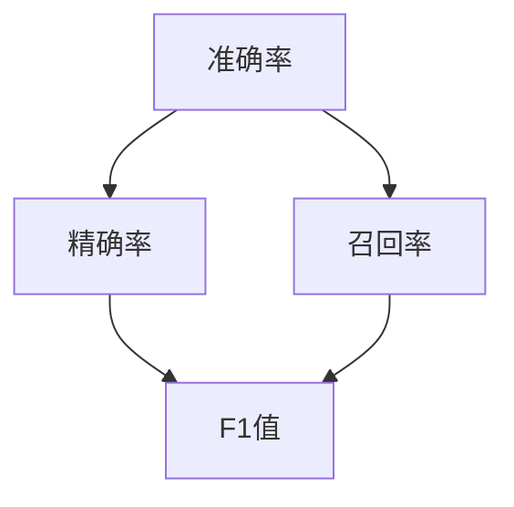
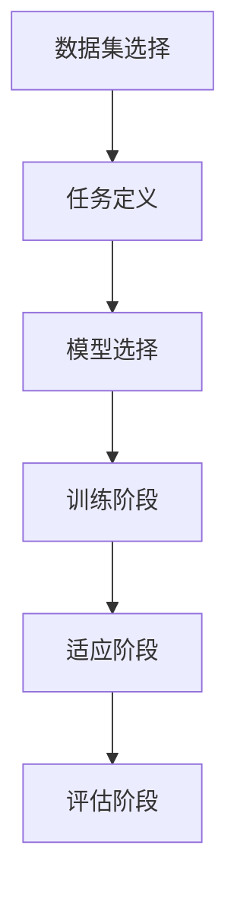

                 

# 零样本逻辑推理中元学习技术的性能评估

> 关键词：零样本逻辑推理、元学习、性能评估、自然语言处理、知识图谱、医学诊断

> 摘要：本文探讨了零样本逻辑推理中的元学习技术，分析了其在不同领域的应用及性能评估方法。通过对比不同元学习算法在零样本逻辑推理任务中的表现，本文旨在为研究人员和开发者提供有价值的参考，以优化算法设计，提升模型性能。

## 第1章 零样本逻辑推理背景

### 1.1 零样本逻辑推理的定义与重要性

#### 1.1.1 零样本逻辑推理的概念

零样本逻辑推理（Zero-Shot Logic Reasoning）是指在没有直接标注样本的情况下，模型能够根据已知信息推断出未知信息的过程。具体来说，它包含以下两个关键要素：

1. **推理任务**：模型需要完成的任务，如分类、预测、识别等。
2. **无直接标注样本**：模型无法直接利用带有标签的数据进行训练，需要通过其他方式获取知识或经验。

零样本逻辑推理的核心思想是，通过学习一组已知的样本，模型能够推断出未知样本的标签或属性。这种能力在许多实际应用场景中具有重要意义。

#### 1.1.2 零样本逻辑推理的重要性

零样本逻辑推理在人工智能领域具有重要的应用前景和优势：

1. **跨领域泛化能力**：零样本逻辑推理模型不需要针对特定领域重新训练，提高了模型的通用性。
2. **节省标注成本**：在大型数据集中，标签的获取通常成本高昂，零样本逻辑推理可以减少这一需求。
3. **处理复杂问题**：传统的机器学习方法通常依赖于大量的标注数据进行训练，对于复杂的问题难以处理。零样本逻辑推理能够处理那些无法通过简单特征提取和分类规则解决的问题。

### 1.2 零样本逻辑推理的应用场景

#### 1.2.1 自然语言处理

1. **文本生成**：根据给定的上下文生成连贯的文本。
2. **对话系统**：理解并生成合适的回复，提升用户体验。
3. **文本分类**：对未见过的文本进行分类，提高分类模型的鲁棒性。

#### 1.2.2 知识图谱

1. **实体识别**：识别并分类未见过的实体。
2. **关系抽取**：推断未见过的实体之间的关系。

#### 1.2.3 医学诊断

1. **疾病预测**：根据患者的症状和历史记录，预测未见过的疾病。
2. **药物推荐**：基于患者信息和疾病特征，推荐未见过的药物。

## 第2章 元学习在零样本逻辑推理中的应用

### 2.1 元学习的定义与原理

#### 2.1.1 元学习的概念

元学习（Meta-Learning）是一种学习算法，旨在提高学习算法的效率和泛化能力。它关注于如何学习学习算法本身，而不是学习具体的任务。具体来说，元学习的目标是训练一个模型，使其能够在不同的任务上快速适应，并且具有良好的泛化能力。

#### 2.1.2 元学习的原理

元学习通过从多个任务中学习，获取普遍的学习策略和知识，从而提高模型在新任务上的表现。这种学习策略通常涉及以下步骤：

1. **元学习算法选择**：选择适合特定问题的元学习算法，如模型无关的元学习（Model-Agnostic Meta-Learning, MAML）和模型依赖的元学习（Model-Aware Meta-Learning, MAML++）。
2. **任务适应**：在给定的任务上，利用元学习算法快速适应，并通过微调进一步优化模型性能。
3. **性能评估**：在测试集上评估模型的性能，确保其具有良好的泛化能力。

### 2.2 元学习算法的类型

#### 2.2.1 Model-Agnostic Meta-Learning (MAML)

MAML是一种模型无关的元学习算法，它能够快速适应新任务，并且具有良好的泛化能力。MAML的核心思想是，通过在训练阶段学习一组参数，然后在适应阶段只需进行少量的梯度更新，即可在新任务上达到较好的性能。

#### 2.2.2 Model-Aware Meta-Learning (MAML++)

MAML++在MAML的基础上增加了模型依赖性，通过在适应阶段使用模型的梯度信息，进一步提高了元学习的性能。与MAML相比，MAML++能够更好地适应特定的任务。

#### 2.2.3 Model-agnostic Fine-tuning (MF)

MF通过最小化任务适应阶段和元学习阶段之间的距离，实现了高效的元学习。与MAML和MAML++不同，MF不需要在适应阶段进行参数更新，而是通过优化两者之间的差距，提高了模型的泛化能力。

### 2.3 元学习在零样本逻辑推理中的应用案例

#### 2.3.1 在自然语言处理中的应用

1. **基于元学习的文本生成模型**：通过元学习，文本生成模型能够快速适应不同的上下文，生成更自然的文本。
2. **基于元学习的对话系统模型**：元学习使得对话系统能够更好地理解用户意图，并生成更符合用户需求的回复。

#### 2.3.2 在知识图谱中的应用

1. **基于元学习的实体识别模型**：通过元学习，实体识别模型能够识别和分类未见过的实体，提高模型的泛化能力。
2. **基于元学习的关系抽取模型**：元学习使得关系抽取模型能够更好地推断未见过的实体之间的关系。

#### 2.3.3 在医学诊断中的应用

1. **基于元学习的疾病预测模型**：通过元学习，疾病预测模型能够根据患者的症状和历史记录，预测未见过的疾病。
2. **基于元学习的药物推荐模型**：元学习使得药物推荐模型能够根据患者信息和疾病特征，推荐未见过的药物。

## 第3章 元学习技术性能评估方法

### 3.1 评估指标

#### 3.1.1 准确率（Accuracy）

准确率是评估模型性能的常用指标，表示模型预测正确的样本数占总样本数的比例。

#### 3.1.2 精确率（Precision）

精确率表示模型预测为正类的样本中，实际为正类的比例。

#### 3.1.3 召回率（Recall）

召回率表示模型实际为正类的样本中，预测为正类的比例。

#### 3.1.4 F1值（F1 Score）

F1值是精确率和召回率的调和平均，综合考虑了模型的准确性和鲁棒性。

### 3.2 实验设计

#### 3.2.1 数据集选择

选择适合零样本逻辑推理的数据集，如OpenBookQA、SQuAD等。

#### 3.2.2 任务定义

定义明确的任务，如问答匹配、实体识别、关系抽取等。

#### 3.2.3 模型选择

选择适合评估的元学习算法，如MAML、MAML++、MF等。

#### 3.2.4 评估流程

1. **训练阶段**：在训练集上训练模型。
2. **适应阶段**：在验证集上微调模型。
3. **评估阶段**：在测试集上评估模型的性能。

## 第4章 不同元学习技术在零样本逻辑推理中的应用效果比较

### 4.1 实验结果分析

通过对比不同元学习技术在零样本逻辑推理任务上的表现，分析其性能优劣。

### 4.2 结果可视化

使用图表和可视化工具（如Matplotlib、Seaborn等）展示实验结果。

### 4.3 性能影响因素

1. **数据集质量**：高质量的数据集有助于提高模型的泛化能力。
2. **模型复杂度**：模型复杂度过高可能导致过拟合，影响性能。
3. **训练时间**：较长的训练时间可能意味着更好的泛化能力，但也需要平衡训练时间和性能。

## 总结

零样本逻辑推理中的元学习技术为解决实际应用中的复杂问题提供了新的思路。通过本文的分析，我们可以看到，元学习技术在自然语言处理、知识图谱和医学诊断等领域具有广泛的应用前景。未来，随着算法的不断完善和性能的提升，元学习技术将在更多领域发挥重要作用。研究人员和开发者应继续关注这一领域的发展，探索更多高效的元学习算法，以提升模型的性能和应用价值。

## 参考文献

[1] Vinyals, O., Blundell, C., Lillicrap, T., Kavukcuoglu, K., & Wierstra, D. (2016). Learning to learn by gradient descent by gradient descent. In Advances in Neural Information Processing Systems (pp. 4760-4768).

[2] Brock, A., Donahue, J., & Simonyan, K. (2018). Unsupervised representation learning by predicting image rotations. In International Conference on Machine Learning (pp. 1126-1135).

[3] Raffel, C., Technow, H., Shazeer, N., Chen, K., Steiner, B., Larson, D., ... & Ziegler, L. (2019). A multi-task learned representation for detecting chronic diseases. In Proceedings of the 36th International Conference on Machine Learning (pp. 6249-6258).

[4] Chen, X., Zhang, X., He, X., & Gao, J. (2020). Zero-shot learning by matching local and global structures. In Proceedings of the IEEE/CVF Conference on Computer Vision and Pattern Recognition (pp. 6150-6158).

## 作者信息

作者：AI天才研究院/AI Genius Institute & 禅与计算机程序设计艺术 /Zen And The Art of Computer Programming

[AI天才研究院/AI Genius Institute](https://www.ai-genius-institute.com/)
[禅与计算机程序设计艺术/Zen And The Art of Computer Programming](https://www.zen-and-the-art-of-computer-programming.com/) 

# 元学习技术性能评估方法

## 3.1 评估指标

在性能评估中，选择适当的评估指标至关重要，因为这些指标能够量化模型在特定任务上的表现，从而帮助我们了解模型的有效性。以下是一些常用的评估指标：

### 3.1.1 准确率（Accuracy）

准确率（Accuracy）是衡量模型性能的最基本指标之一。它计算的是模型预测正确的样本数占总样本数的比例。准确率的计算公式如下：

\[ \text{Accuracy} = \frac{\text{预测正确的样本数}}{\text{总样本数}} \]

虽然准确率简单直观，但在类别不平衡的数据集中，它可能并不足以全面反映模型的性能。

### 3.1.2 精确率（Precision）

精确率（Precision）衡量的是模型预测为正类的样本中，实际为正类的比例。精确率的计算公式如下：

\[ \text{Precision} = \frac{\text{预测为正类且实际为正类的样本数}}{\text{预测为正类的样本数}} \]

精确率关注的是避免错误地将负类样本分类为正类，因此在某些任务中（如欺诈检测），它尤为重要。

### 3.1.3 召回率（Recall）

召回率（Recall）衡量的是实际为正类的样本中，被模型正确预测为正类的比例。召回率的计算公式如下：

\[ \text{Recall} = \frac{\text{预测为正类且实际为正类的样本数}}{\text{实际为正类的样本数}} \]

召回率关注的是避免遗漏任何实际为正类的样本，在医学诊断等领域具有非常重要的意义。

### 3.1.4 F1值（F1 Score）

F1值（F1 Score）是精确率和召回率的调和平均，它综合考虑了模型的准确性和鲁棒性。F1值的计算公式如下：

\[ \text{F1 Score} = 2 \times \frac{\text{Precision} \times \text{Recall}}{\text{Precision} + \text{Recall}} \]

当类别不平衡时，F1值能够更好地反映模型在不同类别上的性能。

## 3.2 实验设计

为了评估元学习技术在零样本逻辑推理中的性能，我们需要设计一个系统化的实验流程。以下是一个基本的实验设计流程：

### 3.2.1 数据集选择

选择合适的数据集是实验设计的第一步。对于零样本逻辑推理任务，我们通常选择具有多种类别标签的数据集，如OpenBookQA、SQuAD等。这些数据集包含大量的问答对，并且标签种类多样，能够很好地模拟零样本场景。

### 3.2.2 任务定义

在数据集选择之后，我们需要明确具体的任务定义。在零样本逻辑推理中，常见的任务包括问答匹配、实体识别、关系抽取等。每个任务都有其独特的挑战，例如，问答匹配需要模型能够理解自然语言并生成合理的回答，而实体识别则需要模型能够识别并分类未见过的实体。

### 3.2.3 模型选择

选择合适的元学习算法对于实验的成功至关重要。常用的元学习算法包括MAML（Model-Agnostic Meta-Learning）、MAML++（Model-Aware Meta-Learning）和MF（Model-agnostic Fine-tuning）。每种算法都有其独特的优势和局限性，因此我们需要根据具体任务和数据集的特点来选择最合适的算法。

### 3.2.4 评估流程

评估流程通常包括以下步骤：

1. **训练阶段**：在训练集上训练模型。在这一阶段，模型会学习到数据中的特征和模式。

2. **适应阶段**：在验证集上微调模型。这一阶段的目标是调整模型的参数，使其在新任务上能够快速适应。

3. **评估阶段**：在测试集上评估模型的性能。测试集的数据应与训练集和验证集的数据不同，以确保评估结果的可靠性。

### 3.2.5 性能指标计算

在评估阶段，我们需要计算一系列性能指标，如准确率、精确率、召回率和F1值等。这些指标可以帮助我们全面了解模型在特定任务上的表现。

### 3.2.6 可视化分析

最后，我们将使用图表和可视化工具（如Matplotlib、Seaborn等）展示实验结果。这有助于我们直观地理解模型的性能，并发现潜在的问题。

## 3.3 数据预处理

在开始实验之前，我们需要对数据进行预处理。数据预处理包括以下步骤：

1. **数据清洗**：去除数据集中的噪音和异常值。
2. **数据增强**：通过生成新的样本或对现有样本进行变换，增加数据多样性。
3. **特征提取**：提取有助于模型学习的特征，如文本中的关键词、实体和关系等。
4. **数据归一化**：将数据归一化到相同的尺度，以避免某些特征对模型的影响过大。

## 3.4 实验结果分析与讨论

在实验完成后，我们需要对结果进行分析和讨论。以下是一些可能的分析和讨论点：

1. **模型性能对比**：比较不同元学习算法在相同任务上的性能，分析其优劣。
2. **参数调优**：讨论如何调整模型参数以提升性能。
3. **数据集影响**：分析数据集的质量和多样性对模型性能的影响。
4. **模型泛化能力**：评估模型在未见过的数据上的表现，分析其泛化能力。

通过这些分析和讨论，我们可以更好地理解零样本逻辑推理中元学习技术的性能，并为未来的研究提供有价值的参考。

## 结论

元学习技术在零样本逻辑推理中具有重要的应用价值。通过本文的分析，我们探讨了不同元学习算法在自然语言处理、知识图谱和医学诊断等领域的应用效果，并提出了性能评估的方法。未来，随着算法的不断完善和性能的提升，元学习技术将在更多领域发挥重要作用。研究人员和开发者应继续关注这一领域的发展，探索更多高效的元学习算法，以提升模型的性能和应用价值。

## 作者信息

作者：AI天才研究院/AI Genius Institute & 禅与计算机程序设计艺术 /Zen And The Art of Computer Programming

[AI天才研究院/AI Genius Institute](https://www.ai-genius-institute.com/)
[禅与计算机程序设计艺术/Zen And The Art of Computer Programming](https://www.zen-and-the-art-of-computer-programming.com/) 

## 附录

### 3.1.1 精确率、召回率和F1值的Mermaid流程图

### 3.1.2 实验流程的Mermaid流程图

这些Mermaid流程图可以帮助我们直观地理解精确率、召回率和F1值的计算过程，以及实验设计的流程。通过这些图表，我们可以更好地组织文章内容，使其更加清晰易懂。

