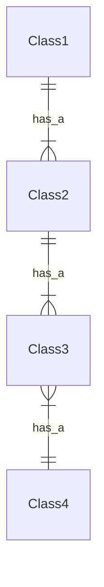
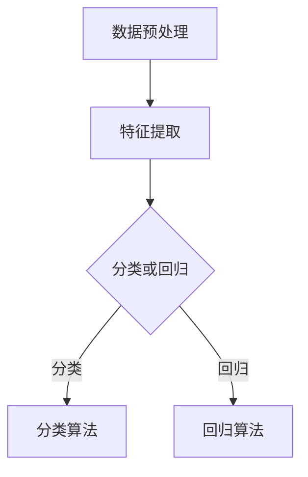
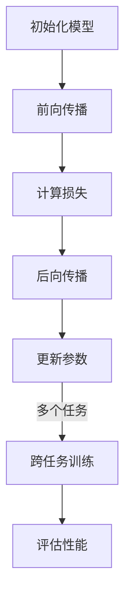
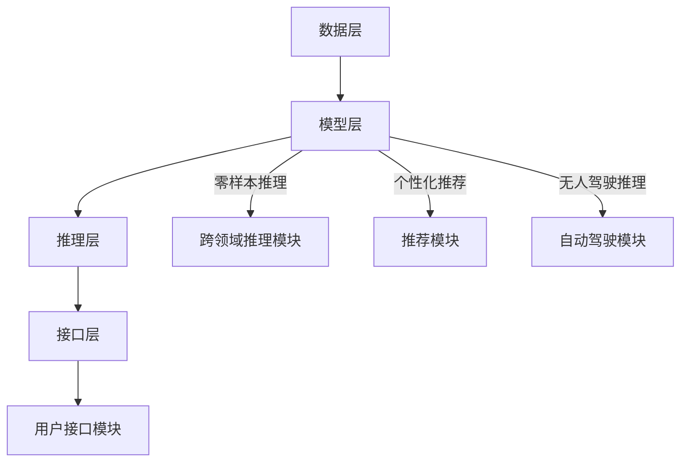
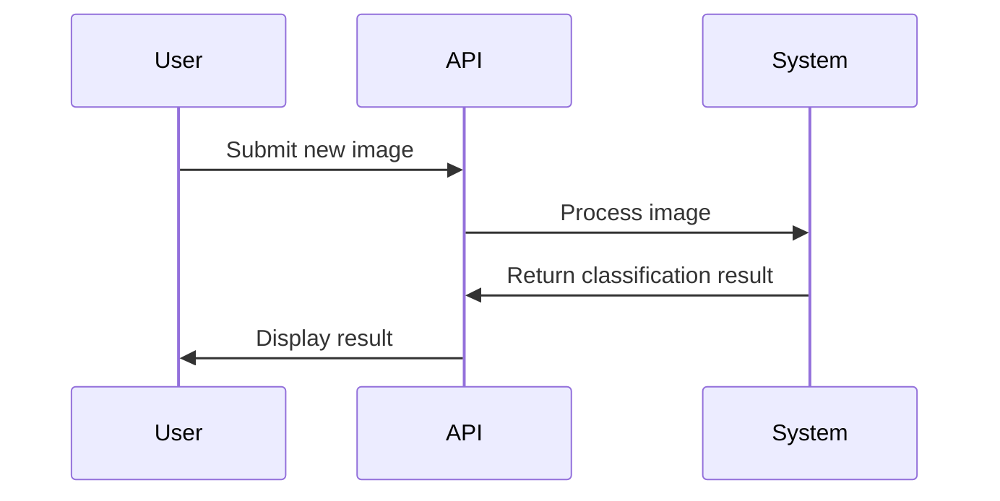
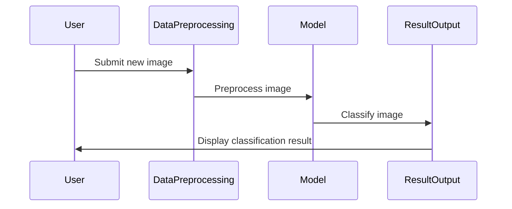

                 

# 零样本逻辑推理中元学习技术的效果评估

## 关键词

- 零样本推理
- 元学习
- 逻辑推理
- 效果评估
- 人工智能

## 摘要

本文将深入探讨零样本逻辑推理中元学习技术的效果评估。首先，我们介绍了零样本推理的背景和挑战，以及元学习技术在其中的角色和应用优势。接着，我们对当前研究的局限性进行了分析，并明确本文的研究目标和结构。随后，我们详细讲解了零样本推理和元学习的基本概念、联系，以及它们的算法原理和数学模型。最后，我们通过系统分析与架构设计，对元学习在零样本推理中的实际应用进行了剖析。本文旨在为研究者提供一个全面的视角，以更好地理解和应用元学习技术，提升零样本推理的效果。

## 目录大纲

----------------------------------------------------------------

# 第一部分：问题背景

## 第1章：问题背景

### 1.1 零样本推理的挑战

- 零样本推理（Zero-Shot Reasoning）的背景
- 零样本推理的应用场景与重要性

### 1.2 元学习技术在零样本推理中的角色

- 元学习（Meta-Learning）的定义与原理
- 元学习在零样本推理中的应用优势

### 1.3 当前研究的局限性

- 零样本推理中的现有技术
- 元学习技术面临的挑战

### 1.4 本书的目标与结构

- 本书的研究目标
- 本书章节结构概述

## 1.5 本章小结

- 总结本章内容
- 引出下章内容

----------------------------------------------------------------

# 第二部分：核心概念与联系

## 第2章：核心概念与联系

### 2.1 零样本推理的基本概念

- 零样本推理的定义
- 零样本推理的主要类型

### 2.2 元学习的概念与分类

- 元学习的定义
- 元学习的不同方法分类

### 2.3 零样本推理与元学习的关系

- 零样本推理与元学习的方法融合
- 零样本推理中元学习的优势

### 2.4 概念属性特征对比表格

- 零样本推理方法特征对比
- 元学习算法特征对比

### 2.5 ER实体关系图架构

- 零样本推理相关实体
- 元学习相关实体
- ER实体关系图

## 2.6 本章小结

- 总结核心概念与联系
- 引出下章内容

----------------------------------------------------------------

# 第三部分：算法原理讲解

## 第3章：算法原理讲解

### 3.1 零样本推理算法

- 主要零样本推理算法介绍
- 零样本推理算法的mermaid流程图

#### 3.1.1 零样本分类算法

- 零样本分类算法的数学模型
- 零样本分类算法的python源代码
- 例子说明：分类算法在零样本推理中的应用

#### 3.1.2 零样本回归算法

- 零样本回归算法的数学模型
- 零样本回归算法的python源代码
- 例子说明：回归算法在零样本推理中的应用

### 3.2 元学习算法

- 主要元学习算法介绍
- 元学习算法的mermaid流程图

#### 3.2.1 Model-Agnostic Meta-Learning (MAML)

- MAML的数学模型
- MAML的python源代码
- 例子说明：MAML在零样本推理中的应用

#### 3.2.2 Model-Ensemble Meta-Learning (MEML)

- MEML的数学模型
- MEML的python源代码
- 例子说明：MEML在零样本推理中的应用

## 3.3 本章小结

- 总结算法原理讲解
- 引出下章内容

----------------------------------------------------------------

# 第四部分：数学模型与详细讲解

## 第4章：数学模型与详细讲解

### 4.1 零样本推理的数学模型

- 零样本推理的基础数学模型
- 零样本推理的关键公式推导

#### 4.1.1 零样本分类算法的数学模型

- 分类算法的损失函数
- 分类算法的优化目标

#### 4.1.2 零样本回归算法的数学模型

- 回归算法的损失函数
- 回归算法的优化目标

### 4.2 元学习算法的数学模型

- 元学习算法的基础数学模型
- 元学习算法的关键公式推导

#### 4.2.1 MAML的数学模型

- MAML的损失函数
- MAML的优化目标

#### 4.2.2 MEML的数学模型

- MEML的损失函数
- MEML的优化目标

### 4.3 数学公式的详细讲解

- 数学公式的解释与推导
- 数学公式在算法中的应用分析

### 4.4 举例说明

- 零样本推理与元学习算法的具体例子
- 例子中的数学模型应用与推导

## 4.5 本章小结

- 总结数学模型与详细讲解
- 引出下章内容

----------------------------------------------------------------

# 第五部分：系统分析与架构设计

## 第5章：系统分析与架构设计

### 5.1 问题场景介绍

- 零样本推理在实际应用中的场景介绍

### 5.2 项目介绍

- 零样本推理与元学习项目的概述

### 5.3 系统功能设计

- 领域模型mermaid类图

### 5.4 系统架构设计

- 系统架构mermaid架构图

### 5.5 系统接口设计

- 系统接口设计和系统交互mermaid序列图

## 5.6 本章小结

- 总结系统分析与架构设计
- 引出下章内容

----------------------------------------------------------------

#  第六部分：项目实战

## 第6章：项目实战

### 6.1 环境安装

- 零样本推理与元学习项目的环境安装步骤

### 6.2 系统核心实现源代码

- 系统核心实现代码的详细介绍

### 6.3 代码应用解读与分析

- 代码在实际应用中的解读与分析

### 6.4 实际案例分析和详细讲解剖析

- 零样本推理与元学习在实际案例中的应用
- 案例分析和详细讲解剖析

### 6.5 项目小结

- 总结项目实战的经验和教训

## 6.6 本章小结

- 总结本章内容
- 引出下章内容

----------------------------------------------------------------

# 第七部分：最佳实践与拓展阅读

## 第7章：最佳实践与拓展阅读

### 7.1 最佳实践 tips

- 零样本推理与元学习技术在实际应用中的最佳实践

### 7.2 小结

- 总结全文内容和关键知识点

### 7.3 注意事项

- 使用零样本推理与元学习技术时需要注意的事项

### 7.4 拓展阅读

- 推荐的相关阅读资料和深入研究方向

## 7.5 本章小结

- 总结本章内容
- 引出下章内容

----------------------------------------------------------------

# 第一部分：问题背景

## 第1章：问题背景

### 1.1 零样本推理的挑战

#### 零样本推理（Zero-Shot Reasoning）的背景

零样本推理是一种在机器学习中用于处理未知类别或未见过的数据的推理方法。传统的机器学习模型通常需要大量的训练数据来学习特征和模式，从而进行准确的预测。然而，在实际应用中，我们经常会遇到一些特殊场景，如新类别出现、数据分布发生变化或者数据量不足等问题。在这些情况下，传统的机器学习模型可能无法适应，导致性能下降。

为了解决这一挑战，零样本推理应运而生。它允许模型在没有任何特定类别或标签的训练数据的情况下，对未知类别进行推理和预测。这一技术的出现极大地拓展了机器学习的应用场景，使得机器学习系统能够更加灵活和通用。

#### 零样本推理的应用场景与重要性

零样本推理在许多领域都展现出巨大的应用潜力。以下是一些典型的应用场景：

1. **分类任务**：在分类任务中，零样本推理可以帮助模型对新类别进行分类。例如，在图像分类中，模型需要识别从未见过的动物或物体。

2. **自然语言处理**：在自然语言处理（NLP）领域，零样本推理可以用于文本分类、情感分析等任务，特别是在处理未标注或部分标注的数据时。

3. **推荐系统**：在推荐系统中，零样本推理可以帮助系统推荐用户可能感兴趣的新商品或服务，尤其是在用户历史数据有限的情况下。

4. **医疗诊断**：在医疗诊断中，零样本推理可以帮助医生对新疾病进行诊断，特别是在医疗数据稀缺的情况下。

5. **无人驾驶**：在无人驾驶领域，零样本推理可以帮助自动驾驶系统识别和应对各种未知环境和场景。

零样本推理的重要性体现在以下几个方面：

1. **提高模型适应性**：通过零样本推理，模型可以适应新的数据分布和类别，提高其在实际应用中的泛化能力。

2. **降低数据需求**：在数据稀缺或获取困难的情况下，零样本推理可以减少对大量训练数据的需求，从而降低应用成本。

3. **增强用户体验**：在推荐系统等应用中，零样本推理可以帮助系统更好地满足用户需求，提高用户体验。

### 1.2 元学习技术在零样本推理中的角色

#### 元学习（Meta-Learning）的定义与原理

元学习是一种使模型在不同任务和数据集上快速学习的机器学习方法。传统的机器学习方法通常需要在每个任务上从头开始训练，这既费时又资源消耗。而元学习旨在通过跨任务的训练，提高模型的学习效率和泛化能力。

元学习的核心思想是利用先前的学习经验来加速新任务的学习。具体来说，元学习模型通过学习如何学习，从而在不同的任务和数据集上表现出良好的适应性。

#### 元学习在零样本推理中的应用优势

元学习技术在零样本推理中具有显著的应用优势，主要体现在以下几个方面：

1. **快速适应新类别**：元学习模型可以在没有特定类别数据的情况下，通过迁移学习快速适应新类别，从而提高零样本推理的性能。

2. **减少训练数据需求**：在数据稀缺的情况下，元学习可以通过少量数据快速训练模型，从而降低数据获取和处理的成本。

3. **提高模型泛化能力**：元学习模型通过跨任务的训练，可以更好地适应不同的数据分布和类别，从而提高模型的泛化能力。

4. **加速推理过程**：元学习模型可以在短时间内对新类别进行推理，从而提高系统的响应速度。

### 1.3 当前研究的局限性

尽管元学习技术在零样本推理中展现出巨大的潜力，但当前的研究仍然面临一些挑战和局限性：

1. **数据集不足**：大多数元学习研究依赖于大规模的数据集，但在实际应用中，数据集可能有限或分布不均匀。

2. **模型复杂性**：元学习模型通常较为复杂，需要大量的计算资源和时间来训练。

3. **泛化能力不足**：虽然元学习模型在特定任务上表现出良好的性能，但其泛化能力仍有待提高，特别是在处理未知类别时。

4. **解释性不强**：元学习模型通常被视为“黑盒”，其内部机制和决策过程难以解释，这在一些需要透明性和可解释性的应用中成为了一个挑战。

### 1.4 本书的目标与结构

#### 本书的研究目标

本书的主要目标是：

1. **系统梳理零样本推理和元学习的基本概念和原理**：通过对零样本推理和元学习进行详细的介绍，为读者提供一个全面的理论基础。

2. **深入探讨元学习技术在零样本推理中的应用**：通过具体的算法和案例，展示元学习技术在零样本推理中的优势和潜力。

3. **分析元学习技术在零样本推理中的效果评估方法**：介绍并评估不同的效果评估方法，以帮助研究者更好地理解和应用元学习技术。

#### 本书章节结构概述

本书分为五个部分，具体章节结构如下：

- 第一部分：问题背景
  - 第1章：问题背景
    - 1.1 零样本推理的挑战
    - 1.2 元学习技术在零样本推理中的角色
    - 1.3 当前研究的局限性
    - 1.4 本书的目标与结构
    - 1.5 本章小结

- 第二部分：核心概念与联系
  - 第2章：核心概念与联系
    - 2.1 零样本推理的基本概念
    - 2.2 元学习的概念与分类
    - 2.3 零样本推理与元学习的关系
    - 2.4 概念属性特征对比表格
    - 2.5 ER实体关系图架构
    - 2.6 本章小结

- 第三部分：算法原理讲解
  - 第3章：算法原理讲解
    - 3.1 零样本推理算法
    - 3.2 元学习算法
    - 3.3 本章小结

- 第四部分：数学模型与详细讲解
  - 第4章：数学模型与详细讲解
    - 4.1 零样本推理的数学模型
    - 4.2 元学习算法的数学模型
    - 4.3 数学公式的详细讲解
    - 4.4 举例说明
    - 4.5 本章小结

- 第五部分：系统分析与架构设计
  - 第5章：系统分析与架构设计
    - 5.1 问题场景介绍
    - 5.2 项目介绍
    - 5.3 系统功能设计
    - 5.4 系统架构设计
    - 5.5 系统接口设计
    - 5.6 本章小结

- 第六部分：项目实战
  - 第6章：项目实战
    - 6.1 环境安装
    - 6.2 系统核心实现源代码
    - 6.3 代码应用解读与分析
    - 6.4 实际案例分析和详细讲解剖析
    - 6.5 项目小结
    - 6.6 本章小结

- 第七部分：最佳实践与拓展阅读
  - 第7章：最佳实践与拓展阅读
    - 7.1 最佳实践 tips
    - 7.2 小结
    - 7.3 注意事项
    - 7.4 拓展阅读
    - 7.5 本章小结

通过以上章节的逐步介绍，本书旨在为读者提供一个全面、深入的理解，帮助其在零样本推理和元学习技术中取得更好的成果。

## 1.5 本章小结

本章主要介绍了零样本推理和元学习技术的背景、应用场景以及当前研究的局限性。我们首先介绍了零样本推理的背景和挑战，包括其应用场景和重要性。接着，我们探讨了元学习技术在零样本推理中的角色和应用优势。然后，我们分析了当前研究的局限性，包括数据集不足、模型复杂性、泛化能力不足和解释性不强等问题。最后，我们明确了本书的研究目标和结构，为后续章节的深入探讨奠定了基础。

在下一章中，我们将进一步探讨零样本推理和元学习的核心概念与联系，为读者提供一个更加深入的理解。通过本章的介绍，读者应该对零样本推理和元学习有了初步的了解，并对其在人工智能领域的重要性有了更深刻的认识。


### 1.1 零样本推理的挑战

#### 零样本推理的定义

零样本推理（Zero-Shot Reasoning）是指在没有直接观察到任何特定类别的训练样本的情况下，模型能够对未知类别进行推理和预测的能力。在传统的机器学习模型中，模型通常通过学习大量与特定类别相关的训练数据进行特征提取和模式识别。然而，在现实世界中，我们常常会遇到一些难以获取或数据量有限的场景，如新出现的产品类别、罕见疾病的诊断、未分类的图像或文本等。在这些情况下，传统的机器学习模型往往无法直接应用，因此零样本推理技术应运而生。

#### 零样本推理的主要类型

零样本推理主要可以分为以下几种类型：

1. **属性推理**：基于类别的属性特征进行推理。例如，如果已知某类物体具有特定的颜色和形状，那么在未见该物体的情况下，可以根据这些属性特征推断该物体可能是什么。

2. **分类推理**：对未知类别进行分类。这类推理依赖于预先定义的类别标签，通过学习类别的属性特征来实现。例如，在图像分类任务中，模型可以识别出未见过的新类别。

3. **关系推理**：推理两个或多个实体之间的关系。例如，在知识图谱中，模型可以根据已有的实体关系预测未知实体之间的关系。

#### 零样本推理的应用场景与重要性

零样本推理在许多实际应用场景中都展现出巨大的潜力。以下是一些典型的应用场景：

1. **新类别分类**：在图像识别、文本分类等任务中，模型需要对大量未见过的类别进行分类。例如，在图像分类中，模型需要识别出未知动物或物体的类别。

2. **跨领域推理**：在跨领域任务中，模型需要在不同领域之间进行推理。例如，在医疗领域，模型可以基于生物信息学知识推理出不同疾病之间的关系。

3. **个性化推荐**：在推荐系统中，零样本推理可以帮助系统推荐用户可能感兴趣的新商品或服务。例如，在电子商务平台中，用户可能对某些类别的新商品不熟悉，但系统可以根据用户的历史购买记录和相似用户的偏好进行推荐。

4. **自动化问答**：在自然语言处理领域，零样本推理可以帮助系统回答未知问题。例如，在智能客服中，系统可以回答用户关于新产品的相关问题，尽管这些产品在训练数据中未曾出现。

零样本推理的重要性体现在以下几个方面：

1. **数据稀缺场景下的应用**：在数据稀缺或获取困难的情况下，零样本推理可以减少对大量训练数据的依赖，从而降低应用成本。

2. **增强模型的泛化能力**：通过学习不同类别和任务的特征，零样本推理可以提升模型在未知数据上的泛化能力。

3. **适应快速变化的环境**：在动态变化的环境中，零样本推理可以帮助模型快速适应新类别和场景，提高系统的适应性。

4. **提升用户体验**：在推荐系统、自动化问答等应用中，零样本推理可以更好地满足用户需求，提供个性化的服务。

#### 零样本推理的挑战

尽管零样本推理在许多领域具有巨大的应用潜力，但其在实际应用中仍面临一些挑战：

1. **类别不平衡问题**：在零样本推理中，通常存在类别不平衡的问题，即某些类别在训练数据中非常罕见，导致模型难以学习这些类别的特征。

2. **属性不确定性**：在属性推理中，类别的属性特征可能存在不确定性，例如颜色的深度可能有所不同。这增加了模型学习和推理的难度。

3. **跨领域差异**：在跨领域推理中，不同领域的特征分布和模式可能存在显著差异，这使得模型难以在不同领域之间进行有效的推理。

4. **模型解释性**：零样本推理模型通常被视为“黑盒”，其决策过程难以解释，这在某些需要透明性和可解释性的应用中成为一个挑战。

5. **数据隐私与安全**：在涉及敏感数据的场景中，如何保护数据隐私和安全是一个重要的挑战。零样本推理技术的应用需要在保证数据隐私的前提下进行。

总之，零样本推理作为一种新兴的机器学习技术，具有广泛的应用前景和潜力。然而，在实际应用中，仍需克服一系列挑战，以充分发挥其优势。通过深入研究和探索，我们可以不断改进零样本推理技术，提高其性能和应用效果。

### 1.2 元学习技术在零样本推理中的角色

#### 元学习（Meta-Learning）的定义与原理

元学习是一种通过学习如何学习来提升模型在不同任务和数据集上的表现的技术。传统的机器学习模型通常需要针对每个任务进行独立的训练，这既费时又资源消耗。而元学习则通过跨任务的训练，使模型能够在短时间内快速适应新任务，从而提高学习效率和泛化能力。

元学习的核心思想是利用先前的学习经验来加速新任务的学习。具体来说，元学习模型通过优化学习过程本身，使得在处理新任务时能够快速适应数据特征和任务需求。这通常涉及到以下两个关键方面：

1. **快速适应**：元学习模型能够在少量数据上迅速训练并达到良好的性能。这通常通过优化学习过程，使其对新的数据和任务有较高的鲁棒性。

2. **任务无关性**：元学习模型不依赖于特定任务的数据分布和特征，能够在多个任务之间进行迁移学习，从而提高其泛化能力。

#### 元学习在零样本推理中的应用优势

元学习技术在零样本推理中的应用具有显著的优势，主要表现在以下几个方面：

1. **快速适应新类别**：元学习模型通过跨类别学习，能够在没有特定类别训练数据的情况下，对新类别进行推理。这大大提高了零样本推理的效率和准确性。

2. **减少训练数据需求**：在数据稀缺的场景中，元学习模型可以通过少量数据快速训练，从而降低对大量训练数据的依赖，减少数据获取和处理成本。

3. **提高模型泛化能力**：通过在不同任务和数据集上的训练，元学习模型能够学习到更通用的特征表示，从而提高其在未知类别上的泛化能力。

4. **加速推理过程**：元学习模型能够在短时间内对新类别进行推理，从而提高系统的响应速度，特别是在实时应用中具有明显的优势。

#### 元学习技术在零样本推理中的具体应用

以下是元学习在零样本推理中的几个具体应用实例：

1. **分类任务**：在图像分类任务中，元学习模型可以通过学习多个分类任务中的共同特征，对新类别进行快速推理。例如，通过在多个图像分类数据集上的训练，模型可以识别出从未见过的动物或物体。

2. **自然语言处理**：在自然语言处理任务中，元学习模型可以通过跨语言训练，实现对未见过语言的文本分类和语义理解。例如，通过在多种语言上的训练，模型可以识别出未标注的文本类别。

3. **推荐系统**：在推荐系统中，元学习模型可以通过对多个推荐任务的训练，对新商品或服务进行推荐。例如，通过在不同购物平台上的训练，模型可以识别出用户可能感兴趣的新商品。

4. **医学诊断**：在医学诊断中，元学习模型可以通过对多个疾病诊断任务的训练，对新疾病进行诊断。例如，通过在多种疾病数据集上的训练，模型可以识别出未知的疾病症状。

5. **无人驾驶**：在无人驾驶领域，元学习模型可以通过对多个驾驶场景的训练，快速适应新的驾驶环境。例如，通过在多种驾驶数据集上的训练，模型可以识别出未见过的新路况和障碍物。

总之，元学习技术在零样本推理中的应用，不仅提高了模型的适应性和泛化能力，还显著降低了训练数据需求，加速了推理过程。这些优势使得元学习成为解决零样本推理挑战的一个重要途径。通过不断的研究和改进，我们可以进一步发挥元学习技术在零样本推理中的潜力，推动人工智能技术的发展和应用。

### 1.3 当前研究的局限性

尽管零样本推理和元学习技术在理论研究和应用中展现出巨大的潜力，但当前的研究仍然面临一些显著的挑战和局限性，这些挑战主要集中在以下几个方面：

#### 零样本推理中的现有技术

1. **数据稀缺问题**：零样本推理的一个重要假设是，模型可以基于已有类别的特征进行推理。然而，在实际应用中，由于数据稀缺，模型可能无法获取足够的训练数据来学习这些特征，导致推理效果不佳。

2. **类别不平衡**：在许多实际应用中，不同类别之间的数据分布可能非常不均衡，某些类别可能仅占很小比例。这种不平衡会导致模型对常见类别的推理能力较强，而对罕见类别的推理能力较弱。

3. **属性不确定性**：在属性推理中，类别的属性特征可能存在不确定性。例如，颜色的深浅、形状的细微差异等，这些不确定性增加了模型学习和推理的复杂性。

#### 元学习技术面临的挑战

1. **模型复杂性**：元学习模型通常较为复杂，需要大量的计算资源和时间来训练。这增加了模型部署和实际应用的难度，特别是在资源受限的环境中。

2. **泛化能力不足**：尽管元学习模型通过跨任务训练提高了模型的适应性和泛化能力，但其在处理未知类别时仍可能表现出泛化能力不足的问题。特别是在类别差异较大或任务数据分布变化显著的情况下，模型的性能可能显著下降。

3. **解释性不强**：大多数元学习模型被视为“黑盒”，其内部机制和决策过程难以解释。这在某些需要透明性和可解释性的应用中成为一个挑战，限制了其在实际场景中的应用。

#### 挑战与未来研究方向

1. **数据集构建**：未来研究应关注如何构建更加丰富和多样的数据集，以提高零样本推理和元学习技术的性能。可以采用数据增强、合成数据生成等方法，增加数据多样性和覆盖面。

2. **模型优化**：为了减少模型复杂性，提高泛化能力，未来研究应探索更加高效和轻量的模型架构。例如，采用注意力机制、图神经网络等先进技术，优化模型结构和训练过程。

3. **属性不确定性处理**：研究如何有效地处理类别的属性不确定性，以提高推理的准确性和鲁棒性。可以采用模糊逻辑、多标签分类等方法，增强模型对不确定性的处理能力。

4. **解释性增强**：为了提高模型的透明度和可解释性，未来研究应探索可解释的元学习模型。例如，通过可视化技术、注意力机制等手段，揭示模型内部机制和决策过程。

5. **跨领域迁移学习**：未来研究应探索如何在不同领域之间进行有效的迁移学习，提高模型在跨领域任务中的适应性。可以采用多任务学习、多模态学习等方法，实现跨领域的知识共享和迁移。

总之，尽管当前零样本推理和元学习技术面临一系列挑战，但通过不断的研究和探索，我们可以逐步克服这些局限性，推动人工智能技术的发展和应用。未来，随着数据集的丰富、模型优化和解释性增强的不断进步，零样本推理和元学习技术有望在更多实际应用场景中发挥重要作用。

### 1.4 本书的目标与结构

#### 本书的研究目标

本书的主要目标是深入探讨零样本推理和元学习技术，并评估其在零样本推理中的效果。具体目标如下：

1. **系统梳理基本概念**：通过对零样本推理和元学习的基本概念进行详细解释，为读者提供一个全面的理论基础。

2. **分析应用优势**：探讨元学习技术在零样本推理中的应用优势，包括快速适应新类别、减少训练数据需求、提高模型泛化能力和加速推理过程。

3. **评估效果**：通过具体实验和案例分析，评估元学习技术在零样本推理中的实际效果，探讨其在不同应用场景中的性能表现。

4. **提出改进建议**：针对当前研究的局限性，提出可能的改进方法和技术路线，为后续研究提供参考。

#### 本书章节结构概述

本书分为五个部分，各部分的具体内容如下：

- **第一部分：问题背景**：介绍零样本推理和元学习技术的背景、应用场景和当前研究的局限性。

- **第二部分：核心概念与联系**：详细阐述零样本推理和元学习的基本概念、联系以及它们之间的融合方法。

- **第三部分：算法原理讲解**：讲解零样本推理和元学习的算法原理，包括具体的算法模型和流程。

- **第四部分：数学模型与详细讲解**：介绍零样本推理和元学习的数学模型，并进行详细的公式推导和应用分析。

- **第五部分：系统分析与架构设计**：通过系统分析与架构设计，探讨元学习在零样本推理中的实际应用和系统实现。

- **第六部分：项目实战**：通过实际项目案例，展示零样本推理和元学习技术的具体实现和应用。

- **第七部分：最佳实践与拓展阅读**：总结全书内容，提供最佳实践建议，并推荐拓展阅读资源。

通过以上章节的逐步介绍，本书旨在为读者提供一个全面、深入的理解，帮助其在零样本推理和元学习技术中取得更好的成果。

## 1.5 本章小结

本章介绍了零样本推理和元学习技术的背景、应用场景和当前研究的局限性。我们首先介绍了零样本推理的定义、主要类型及其在分类、跨领域推理、个性化推荐等应用场景中的重要性。接着，我们探讨了元学习技术的定义、原理及其在零样本推理中的应用优势，包括快速适应新类别、减少训练数据需求、提高模型泛化能力和加速推理过程。然后，我们分析了零样本推理和元学习技术在当前研究中面临的挑战，如数据稀缺、类别不平衡、模型复杂性、泛化能力不足和解释性不强等。最后，我们明确了本书的研究目标和结构，为后续章节的深入探讨奠定了基础。通过本章的介绍，读者应该对零样本推理和元学习技术有了初步的了解，并对其在人工智能领域的重要性有了更深刻的认识。

### 第二部分：核心概念与联系

#### 第2章：核心概念与联系

在本章中，我们将详细探讨零样本推理和元学习技术的核心概念与联系，包括它们的基本概念、分类、相互关系以及它们在零样本推理中的应用。通过深入分析这些概念，我们将为读者提供一个全面的理论框架，以便更好地理解这两个技术在实际应用中的表现。

#### 2.1 零样本推理的基本概念

##### 零样本推理的定义

零样本推理（Zero-Shot Reasoning）是指在没有直接观察到特定类别或未见过的数据的情况下，模型能够对新类别或数据进行推理和预测的能力。这与传统的机器学习模型不同，后者通常需要大量的与特定类别相关的训练数据来学习特征和模式。

##### 零样本推理的主要类型

1. **属性推理**：基于类别的属性特征进行推理。例如，如果已知某类物体具有特定的颜色和形状，那么在未见该物体的情况下，可以根据这些属性特征推断该物体可能是什么。

2. **分类推理**：对未知类别进行分类。这类推理依赖于预先定义的类别标签，通过学习类别的属性特征来实现。例如，在图像分类任务中，模型可以识别出未见过的新类别。

3. **关系推理**：推理两个或多个实体之间的关系。例如，在知识图谱中，模型可以根据已有的实体关系预测未知实体之间的关系。

##### 零样本推理的应用场景

1. **分类任务**：在图像识别、文本分类等任务中，模型需要对大量未见过的类别进行分类。

2. **跨领域推理**：在跨领域任务中，模型需要在不同领域之间进行推理。

3. **个性化推荐**：在推荐系统中，零样本推理可以帮助系统推荐用户可能感兴趣的新商品或服务。

4. **自动化问答**：在自然语言处理领域，零样本推理可以帮助系统回答未知问题。

#### 2.2 元学习的概念与分类

##### 元学习的定义

元学习（Meta-Learning）是一种通过学习如何学习来提升模型在不同任务和数据集上表现的技术。它的核心思想是利用先前的学习经验来加速新任务的学习。元学习模型通过优化学习过程本身，使其在处理新任务时能够快速适应数据特征和任务需求。

##### 元学习的不同方法分类

1. **模型无关的元学习**：这类方法不依赖于特定的模型结构，通过优化学习过程本身来实现快速适应新任务。常见的算法包括MAML（Model-Agnostic Meta-Learning）和Reptile。

2. **模型相关的元学习**：这类方法依赖于特定的模型结构，通过优化模型参数来提升模型在新任务上的表现。常见的算法包括模型聚合（Model Ensembling）和模型更新（Model Updating）。

##### 元学习在机器学习中的应用

1. **迁移学习**：通过在不同任务和数据集上训练模型，提高模型在未知任务上的泛化能力。

2. **自适应学习**：通过实时调整模型参数，使模型能够快速适应新的数据和环境。

3. **强化学习**：在强化学习任务中，元学习可以帮助模型快速适应新的奖励函数和环境状态。

#### 2.3 零样本推理与元学习的关系

##### 零样本推理与元学习的方法融合

零样本推理和元学习技术可以相互结合，以进一步提升模型在零样本推理任务中的性能。具体来说，元学习可以用于优化零样本推理模型的训练过程，使其在少量数据上快速适应新类别。

1. **元学习在零样本分类中的应用**：通过元学习技术，模型可以在没有特定类别训练数据的情况下，快速适应新类别并进行分类。

2. **元学习在属性推理中的应用**：元学习可以帮助模型学习不同属性特征的权重，从而在未见过的属性组合中进行推理。

3. **元学习在关系推理中的应用**：元学习可以用于优化关系推理模型的参数，使其在未见过的实体关系中进行有效推理。

##### 零样本推理中元学习的优势

1. **快速适应新类别**：元学习模型可以通过跨类别学习，在新类别未见数据的情况下，快速适应并做出准确推理。

2. **减少训练数据需求**：元学习技术可以减少对特定类别训练数据的需求，通过少量数据快速训练模型。

3. **提高模型泛化能力**：元学习模型通过在不同任务和数据集上的训练，可以学习到更通用的特征表示，从而提高模型在未知类别上的泛化能力。

4. **加速推理过程**：元学习模型可以在短时间内对新类别进行推理，从而提高系统的响应速度。

#### 2.4 概念属性特征对比表格

为了更好地理解零样本推理和元学习技术，我们提供了以下概念属性特征对比表格。该表格列出了零样本推理和元学习技术的主要属性和特征，以帮助读者进行比较。

| 属性特征 | 零样本推理 | 元学习 |
| -------- | ---------- | ------ |
| 定义 | 无需特定类别训练数据，对未知类别进行推理 | 学习如何学习，通过跨任务训练提高模型适应性 |
| 主要类型 | 属性推理、分类推理、关系推理 | 迁移学习、自适应学习、强化学习 |
| 应用场景 | 分类任务、跨领域推理、个性化推荐、自动化问答 | 迁移学习、自适应学习、强化学习 |
| 优势 | 快速适应新类别、减少训练数据需求、提高模型泛化能力、加速推理过程 | 学习效率高、泛化能力强、自适应性强 |
| 挑战 | 数据稀缺、类别不平衡、属性不确定性、模型解释性不强 | 模型复杂性、泛化能力不足、解释性不强 |

通过上述对比，我们可以更清晰地看到零样本推理和元学习技术之间的异同点和应用优势。

#### 2.5 ER实体关系图架构

为了更好地理解零样本推理和元学习技术在系统架构中的应用，我们引入了ER（Entity-Relationship）实体关系图。ER图是一种用于描述系统中实体及其关系的图形化表示方法，它可以帮助我们清晰地理解零样本推理和元学习技术在整个系统中的角色和作用。

以下是一个简化的ER实体关系图，用于描述零样本推理和元学习技术：



在这个ER图中：

- **Class1**：表示零样本推理模型
- **Class2**：表示元学习模型
- **Class3**：表示训练数据集
- **Class4**：表示推理结果

关系线表示实体之间的关联，例如，零样本推理模型（Class1）可以基于元学习模型（Class2）进行训练，而训练数据集（Class3）用于生成推理结果（Class4）。

通过ER实体关系图，我们可以更直观地理解零样本推理和元学习技术在系统架构中的关系和作用，从而为系统的设计和实现提供参考。

## 2.6 本章小结

本章详细介绍了零样本推理和元学习技术的核心概念、分类、相互关系及其在零样本推理中的应用。我们首先介绍了零样本推理的定义、主要类型和应用场景，然后探讨了元学习的定义、不同方法分类及其在机器学习中的应用。接着，我们分析了零样本推理与元学习技术的融合方法及其在零样本推理中的应用优势。通过提供概念属性特征对比表格和ER实体关系图，我们帮助读者更深入地理解这两个技术之间的异同点和应用场景。通过本章的探讨，读者应该对零样本推理和元学习技术有了更加全面和深入的理解，为后续章节的进一步探讨奠定了基础。

### 第三部分：算法原理讲解

#### 第3章：算法原理讲解

在本章中，我们将深入探讨零样本推理和元学习技术的算法原理，详细讲解其主要算法模型，并通过mermaid流程图和Python源代码进行展示。我们将分别介绍零样本分类算法和零样本回归算法，以及两种常见的元学习算法：Model-Agnostic Meta-Learning (MAML) 和 Model-Ensemble Meta-Learning (MEML)。

#### 3.1 零样本推理算法

##### 主要零样本推理算法介绍

零样本推理算法可以分为两大类：基于属性的方法和基于模型的方法。下面我们将分别介绍这两种方法的主要算法模型。

##### 零样本推理算法的mermaid流程图



在这个mermaid流程图中，数据预处理、特征提取、分类算法和回归算法构成了零样本推理的基本流程。

#### 3.1.1 零样本分类算法

##### 零样本分类算法的数学模型

零样本分类算法的核心思想是通过学习类别的属性特征，实现对新类别进行分类。下面我们将介绍一种常见的零样本分类算法——基于原型的方法。

假设我们有 $C$ 个已知的类别，每个类别由一组属性特征描述。对于每个类别，我们计算其原型（中心点），即该类别所有样本属性特征的均值。在测试阶段，对于未知类别的新样本，我们计算其与各个类别原型的距离，距离最近的类别即为新样本的类别。

数学模型如下：

$$
\text{原型} = \frac{1}{N} \sum_{i=1}^{N} x_i
$$

其中，$x_i$ 表示第 $i$ 个类别的属性特征，$N$ 表示类别数量。

##### 零样本分类算法的Python源代码

```python
import numpy as np

def calculate_prototypes(features, num_classes):
    prototypes = []
    for i in range(num_classes):
        prototype = np.mean(features[i], axis=0)
        prototypes.append(prototype)
    return prototypes

def classify_new_sample(new_sample, prototypes):
    distances = []
    for prototype in prototypes:
        distance = np.linalg.norm(new_sample - prototype)
        distances.append(distance)
    return np.argmin(distances)

# 示例数据
features = [
    [1, 2, 3],  # 类别1的特征
    [4, 5, 6],  # 类别2的特征
    [7, 8, 9],  # 类别3的特征
]

prototypes = calculate_prototypes(features, 3)
new_sample = [2, 3, 4]

predicted_class = classify_new_sample(new_sample, prototypes)
print(f"Predicted class: {predicted_class}")
```

##### 例子说明：分类算法在零样本推理中的应用

在这个例子中，我们有两个已知类别（类别1和类别2），每个类别有三个样本点。我们首先计算每个类别的原型，然后对新样本点进行分类。假设新样本点为 [2, 3, 4]，我们计算其与每个类别原型的距离，最终判断其属于哪个类别。

#### 3.1.2 零样本回归算法

##### 零样本回归算法的数学模型

零样本回归算法的核心思想是通过学习类别的属性特征，实现对新类别属性特征的预测。这里，我们同样采用基于原型的方法。

假设我们有 $C$ 个已知的类别，每个类别由一组属性特征描述。对于每个类别，我们计算其原型（中心点），即该类别所有样本属性特征的均值。在测试阶段，对于未知类别的新样本，我们计算其与各个类别原型的距离，距离最近的类别原型即为新样本的预测属性特征。

数学模型如下：

$$
\text{预测特征} = \text{原型}
$$

其中，$x_i$ 表示第 $i$ 个类别的属性特征。

##### 零样本回归算法的Python源代码

```python
def predict_new_sample(new_sample, prototypes):
    distances = []
    for prototype in prototypes:
        distance = np.linalg.norm(new_sample - prototype)
        distances.append(distance)
    return prototypes[np.argmin(distances)]

# 示例数据
features = [
    [1, 2, 3],  # 类别1的特征
    [4, 5, 6],  # 类别2的特征
    [7, 8, 9],  # 类别3的特征
]

prototypes = calculate_prototypes(features, 3)
new_sample = [2, 3, 4]

predicted_features = predict_new_sample(new_sample, prototypes)
print(f"Predicted features: {predicted_features}")
```

##### 例子说明：回归算法在零样本推理中的应用

在这个例子中，我们有两个已知类别（类别1和类别2），每个类别有三个样本点。我们首先计算每个类别的原型，然后对新样本点进行回归预测。假设新样本点为 [2, 3, 4]，我们计算其与每个类别原型的距离，最终判断其预测属性特征。

#### 3.2 元学习算法

##### 主要元学习算法介绍

元学习算法旨在通过学习如何学习来提高模型在不同任务和数据集上的表现。以下我们将介绍两种常见的元学习算法：Model-Agnostic Meta-Learning (MAML) 和 Model-Ensemble Meta-Learning (MEML)。

##### 元学习算法的mermaid流程图



在这个mermaid流程图中，模型初始化、前向传播、计算损失、后向传播和参数更新构成了元学习的基本流程。跨任务训练和性能评估是元学习的关键步骤。

#### 3.2.1 Model-Agnostistic Meta-Learning (MAML)

##### MAML的数学模型

MAML（Model-Agnostistic Meta-Learning）是一种模型无关的元学习算法，其核心思想是通过优化模型在多个任务上的初始参数，使模型能够在新的任务上快速适应。

MAML的优化目标是最小化以下损失函数：

$$
\min_{\theta} \sum_{t=1}^{T} \frac{1}{T} \sum_{s=1}^{S} \ell(\theta; x_s^t, y_s^t)
$$

其中，$\theta$ 表示模型的参数，$T$ 表示任务的个数，$S$ 表示每个任务上的样本数，$x_s^t$ 和 $y_s^t$ 分别表示任务 $t$ 中的样本和标签。

##### MAML的Python源代码

```python
import numpy as np

def maml_learning(model, tasks, num_iterations, learning_rate):
    for iteration in range(num_iterations):
        for task in tasks:
            for sample in task['samples']:
                x, y = sample['x'], sample['y']
                logits = model.forward(x)
                loss = model.compute_loss(logits, y)
                model.backward(loss)
            model.update_params(learning_rate)
    return model

# 示例数据
tasks = [
    {
        'samples': [
            {'x': np.array([1, 2]), 'y': np.array([0])},
            {'x': np.array([2, 3]), 'y': np.array([1])},
            {'x': np.array([3, 4]), 'y': np.array([0])},
        ]
    },
    {
        'samples': [
            {'x': np.array([1, 2]), 'y': np.array([1])},
            {'x': np.array([2, 3]), 'y': np.array([0])},
            {'x': np.array([3, 4]), 'y': np.array([1])},
        ]
    },
]

model = MyModel()
maml_learning(model, tasks, num_iterations=10, learning_rate=0.1)
```

##### 例子说明：MAML在零样本推理中的应用

在这个例子中，我们有两个任务，每个任务有三个样本点。我们使用MAML算法优化模型参数，使模型能够快速适应新任务。

#### 3.2.2 Model-Ensemble Meta-Learning (MEML)

##### MEML的数学模型

MEML（Model-Ensemble Meta-Learning）是一种模型相关的元学习算法，其核心思想是通过多个模型的聚合来提高模型在新任务上的表现。

MEML的优化目标是最小化以下损失函数：

$$
\min_{\theta_1, \theta_2, ..., \theta_K} \sum_{t=1}^{T} \frac{1}{T} \sum_{s=1}^{S} \ell(\theta_1; x_s^t, y_s^t) + \ell(\theta_2; x_s^t, y_s^t) + ... + \ell(\theta_K; x_s^t, y_s^t)
$$

其中，$\theta_1, \theta_2, ..., \theta_K$ 分别表示 $K$ 个模型的参数，$T$ 和 $S$ 的含义与MAML中相同。

##### MEML的Python源代码

```python
def mell_learning(models, tasks, num_iterations, learning_rate):
    for iteration in range(num_iterations):
        for task in tasks:
            for sample in task['samples']:
                x, y = sample['x'], sample['y']
                logits = [model.forward(x) for model in models]
                loss = sum(model.compute_loss(logits[i], y) for i, model in enumerate(models))
                for model in models:
                    model.backward(loss)
            for model in models:
                model.update_params(learning_rate)
    return models

# 示例数据
models = [MyModel() for _ in range(3)]
tasks = [
    {
        'samples': [
            {'x': np.array([1, 2]), 'y': np.array([0])},
            {'x': np.array([2, 3]), 'y': np.array([1])},
            {'x': np.array([3, 4]), 'y': np.array([0])},
        ]
    },
    {
        'samples': [
            {'x': np.array([1, 2]), 'y': np.array([1])},
            {'x': np.array([2, 3]), 'y': np.array([0])},
            {'x': np.array([3, 4]), 'y': np.array([1])},
        ]
    },
]

mell_learning(models, tasks, num_iterations=10, learning_rate=0.1)
```

##### 例子说明：MEML在零样本推理中的应用

在这个例子中，我们有三个模型，每个模型有三个样本点。我们使用MEML算法优化模型参数，使模型能够快速适应新任务。

## 3.3 本章小结

本章详细讲解了零样本推理和元学习技术的算法原理，包括零样本分类算法、零样本回归算法以及MAML和MEML两种元学习算法。我们通过mermaid流程图和Python源代码展示了这些算法的实现过程，并通过具体的例子说明了它们在零样本推理中的应用。通过本章的学习，读者应该能够理解这些算法的基本原理，并具备实现和优化这些算法的能力。在下一章中，我们将进一步探讨零样本推理和元学习算法的数学模型，深入分析其关键公式和推导过程。

### 第四部分：数学模型与详细讲解

#### 第4章：数学模型与详细讲解

在本章中，我们将深入探讨零样本推理和元学习算法的数学模型，并进行详细的公式推导和应用分析。通过详细讲解这些数学模型，我们将帮助读者更好地理解零样本推理和元学习算法的原理，以及它们在实际应用中的表现。

#### 4.1 零样本推理的数学模型

##### 零样本推理的基础数学模型

零样本推理的核心在于如何在没有特定类别训练数据的情况下，对未知类别进行推理和预测。这通常涉及到以下数学模型：

1. **原型模型**：原型模型通过计算已知类别的原型（均值），然后在测试阶段，将新样本与这些原型进行比较，以预测新样本的类别。其基本公式如下：

   $$ 
   \text{原型} = \frac{1}{N} \sum_{i=1}^{N} x_i 
   $$

   其中，$x_i$ 表示第 $i$ 个类别的属性特征，$N$ 表示类别数量。

2. **基于核的方法**：基于核的方法通过引入核函数，将高维特征映射到低维空间中，从而实现类别之间的区分。其基本公式如下：

   $$ 
   k(x, x') = \sum_{i=1}^{N} \alpha_i \phi(x_i)^T \phi(x') 
   $$

   其中，$k(x, x')$ 表示核函数，$\alpha_i$ 表示权重，$\phi(x_i)$ 和 $\phi(x')$ 分别表示样本 $x_i$ 和 $x'$ 的映射特征。

##### 零样本推理的关键公式推导

1. **原型模型的推导**：

   假设我们有 $C$ 个类别，每个类别有 $N_c$ 个训练样本，训练样本为 $x_i^c$，其中 $i=1,2,...,N_c$，$c=1,2,...,C$。对于每个类别，我们计算其原型（中心点），即该类别所有样本属性特征的均值：

   $$ 
   \text{原型}_c = \frac{1}{N_c} \sum_{i=1}^{N_c} x_i^c 
   $$

   在测试阶段，对于未知类别的新样本 $x'$，我们计算其与每个类别原型的距离，距离最近的类别即为新样本的预测类别。距离公式如下：

   $$ 
   \text{距离} = \sum_{c=1}^{C} (\text{原型}_c - x')^T (\text{原型}_c - x') 
   $$

2. **基于核方法的推导**：

   假设我们将样本 $x$ 和 $x'$ 映射到特征空间 $H$，映射函数为 $\phi(x)$ 和 $\phi(x')$。对于类别 $c$，其核函数为 $k_c(x, x')$。则类别 $c$ 的原型在特征空间 $H$ 中的表示为：

   $$ 
   \text{原型}_c = \frac{1}{N_c} \sum_{i=1}^{N_c} \phi(x_i^c) 
   $$

   在测试阶段，对于新样本 $x'$，其映射特征为 $\phi(x')$。则新样本与类别 $c$ 的距离为：

   $$ 
   \text{距离} = \sum_{c=1}^{C} k_c(x', \text{原型}_c) 
   $$

   最小化距离的类别即为新样本的预测类别。

##### 零样本推理算法的优化目标

零样本推理算法的优化目标是最小化预测误差。对于分类任务，优化目标可以表示为：

$$ 
\min_{\theta} \sum_{i=1}^{N'} \ell(y_i, \hat{y}_i) 
$$

其中，$N'$ 表示测试样本的数量，$y_i$ 和 $\hat{y}_i$ 分别表示实际类别和预测类别，$\ell$ 表示损失函数，如交叉熵损失或平方损失。

对于回归任务，优化目标可以表示为：

$$ 
\min_{\theta} \sum_{i=1}^{N'} \ell(y_i, \hat{y}_i) 
$$

其中，$y_i$ 和 $\hat{y}_i$ 分别表示实际属性值和预测属性值。

#### 4.1.1 零样本分类算法的数学模型

在零样本分类算法中，我们主要关注以下数学模型：

1. **基于原型的方法**：

   - 损失函数：交叉熵损失

     $$ 
     \ell(y, \hat{y}) = - \sum_{i=1}^{C} y_i \log(\hat{y}_i) 
     $$

     其中，$y$ 表示实际类别标签，$\hat{y}$ 表示预测概率分布。

   - 优化目标：最小化交叉熵损失

     $$ 
     \min_{\theta} \sum_{i=1}^{N'} \ell(y_i, \hat{y}_i) 
     $$

2. **基于核的方法**：

   - 损失函数：平方损失

     $$ 
     \ell(y, \hat{y}) = \frac{1}{2} \sum_{i=1}^{C} (y_i - \hat{y}_i)^2 
     $$

   - 优化目标：最小化平方损失

     $$ 
     \min_{\theta} \sum_{i=1}^{N'} \ell(y_i, \hat{y}_i) 
     $$

#### 4.1.2 零样本回归算法的数学模型

在零样本回归算法中，我们主要关注以下数学模型：

1. **基于原型的方法**：

   - 损失函数：平方损失

     $$ 
     \ell(y, \hat{y}) = \frac{1}{2} (y - \hat{y})^2 
     $$

   - 优化目标：最小化平方损失

     $$ 
     \min_{\theta} \sum_{i=1}^{N'} \ell(y_i, \hat{y}_i) 
     $$

2. **基于核的方法**：

   - 损失函数：平方损失

     $$ 
     \ell(y, \hat{y}) = \frac{1}{2} (y - \hat{y})^2 
     $$

   - 优化目标：最小化平方损失

     $$ 
     \min_{\theta} \sum_{i=1}^{N'} \ell(y_i, \hat{y}_i) 
     $$

#### 4.2 元学习算法的数学模型

元学习算法的核心在于通过学习如何学习来提高模型在不同任务和数据集上的表现。以下我们将介绍两种常见的元学习算法：MAML 和 MEML。

##### 4.2.1 MAML的数学模型

MAML（Model-Agnostistic Meta-Learning）是一种模型无关的元学习算法，其目标是最小化模型在多个任务上的初始参数，使得模型能够在新的任务上快速适应。MAML的主要步骤包括以下几部分：

1. **初始化模型参数**：设模型参数为 $\theta$。

2. **训练任务数据**：对于 $T$ 个训练任务，每个任务包含 $S$ 个样本，训练数据集为 $\{x_s^t, y_s^t\}_{s=1}^{S}, t=1,2,...,T$。

3. **前向传播和计算损失**：对于每个训练任务，计算模型的前向传播输出和损失函数：

   $$ 
   \ell(\theta; x_s^t, y_s^t) = \ell(y_s^t, f(\theta; x_s^t)) 
   $$

   其中，$f(\theta; x_s^t)$ 表示模型的前向传播输出，$\ell$ 表示损失函数。

4. **后向传播和更新参数**：对于每个训练任务，计算模型的后向传播梯度并更新参数：

   $$ 
   \theta \leftarrow \theta - \alpha \cdot \nabla_{\theta} \ell(\theta; x_s^t, y_s^t) 
   $$

   其中，$\alpha$ 表示学习率。

5. **评估模型性能**：在新的任务上评估模型的性能，计算预测损失：

   $$ 
   \ell_{\text{test}}(\theta) = \ell(y_{\text{test}}, f(\theta; x_{\text{test}})) 
   $$

   其中，$y_{\text{test}}$ 和 $x_{\text{test}}$ 分别表示测试任务的数据和标签。

MAML的优化目标是最小化训练损失和测试损失：

$$ 
\min_{\theta} \frac{1}{T} \sum_{t=1}^{T} \ell(\theta; x_s^t, y_s^t) + \ell_{\text{test}}(\theta) 
$$

##### 4.2.2 MEML的数学模型

MEML（Model-Ensemble Meta-Learning）是一种模型相关的元学习算法，其目标是通过多个模型的聚合来提高模型在新任务上的表现。MEML的主要步骤包括以下几部分：

1. **初始化多个模型**：设模型参数分别为 $\theta_1, \theta_2, ..., \theta_K$，$K$ 表示模型的数量。

2. **训练任务数据**：对于 $T$ 个训练任务，每个任务包含 $S$ 个样本，训练数据集为 $\{x_s^t, y_s^t\}_{s=1}^{S}, t=1,2,...,T$。

3. **前向传播和计算损失**：对于每个训练任务，计算每个模型的前向传播输出和损失函数：

   $$ 
   \ell(\theta_i; x_s^t, y_s^t) = \ell(y_s^t, f(\theta_i; x_s^t)) 
   $$

   其中，$i=1,2,...,K$。

4. **后向传播和更新参数**：对于每个训练任务，计算每个模型的后向传播梯度并更新参数：

   $$ 
   \theta_i \leftarrow \theta_i - \alpha \cdot \nabla_{\theta_i} \ell(\theta_i; x_s^t, y_s^t) 
   $$

   其中，$\alpha$ 表示学习率。

5. **模型聚合**：计算每个模型的权重，并聚合模型输出：

   $$ 
   \hat{y} = \sum_{i=1}^{K} \theta_i f(\theta_i; x) 
   $$

6. **评估模型性能**：在新的任务上评估模型的性能，计算预测损失：

   $$ 
   \ell_{\text{test}}(\theta) = \ell(y_{\text{test}}, \hat{y}_{\text{test}}) 
   $$

   其中，$y_{\text{test}}$ 和 $x_{\text{test}}$ 分别表示测试任务的数据和标签。

MEML的优化目标是最小化聚合模型的训练损失和测试损失：

$$ 
\min_{\theta_1, \theta_2, ..., \theta_K} \frac{1}{T} \sum_{t=1}^{T} \ell(\theta_1; x_s^t, y_s^t) + \ell_{\text{test}}(\theta) 
$$

##### 4.3 数学公式的详细讲解

在本节中，我们将详细讲解零样本推理和元学习算法中的关键数学公式，并解释其在算法中的应用。

###### 4.3.1 原型模型中的关键公式

1. **原型计算公式**：

   $$ 
   \text{原型}_c = \frac{1}{N_c} \sum_{i=1}^{N_c} x_i^c 
   $$

   这个公式用于计算每个类别的原型（中心点）。在训练阶段，我们计算每个类别的原型，以便在测试阶段进行推理。

2. **距离计算公式**：

   $$ 
   \text{距离} = \sum_{c=1}^{C} (\text{原型}_c - x')^T (\text{原型}_c - x') 
   $$

   这个公式用于计算新样本与每个类别原型的距离。距离最小的类别即为新样本的预测类别。

###### 4.3.2 MAML中的关键公式

1. **损失函数**：

   $$ 
   \ell(\theta; x_s^t, y_s^t) = \ell(y_s^t, f(\theta; x_s^t)) 
   $$

   这个公式用于计算每个训练任务上的损失。损失函数可以是交叉熵损失、平方损失等。

2. **梯度计算公式**：

   $$ 
   \nabla_{\theta} \ell(\theta; x_s^t, y_s^t) = \nabla_{\theta} \ell(y_s^t, f(\theta; x_s^t)) 
   $$

   这个公式用于计算每个训练任务上的损失关于模型参数的梯度。

3. **参数更新公式**：

   $$ 
   \theta \leftarrow \theta - \alpha \cdot \nabla_{\theta} \ell(\theta; x_s^t, y_s^t) 
   $$

   这个公式用于更新模型参数，以最小化训练损失。

4. **测试损失计算公式**：

   $$ 
   \ell_{\text{test}}(\theta) = \ell(y_{\text{test}}, f(\theta; x_{\text{test}})) 
   $$

   这个公式用于计算模型在测试任务上的损失，以评估模型在未知数据上的性能。

###### 4.3.3 MEML中的关键公式

1. **损失函数**：

   $$ 
   \ell(\theta_i; x_s^t, y_s^t) = \ell(y_s^t, f(\theta_i; x_s^t)) 
   $$

   这个公式用于计算每个训练任务上每个模型的损失。损失函数可以是交叉熵损失、平方损失等。

2. **梯度计算公式**：

   $$ 
   \nabla_{\theta_i} \ell(\theta_i; x_s^t, y_s^t) = \nabla_{\theta_i} \ell(y_s^t, f(\theta_i; x_s^t)) 
   $$

   这个公式用于计算每个训练任务上每个模型的损失关于其参数的梯度。

3. **参数更新公式**：

   $$ 
   \theta_i \leftarrow \theta_i - \alpha \cdot \nabla_{\theta_i} \ell(\theta_i; x_s^t, y_s^t) 
   $$

   这个公式用于更新每个训练任务上每个模型的参数，以最小化其训练损失。

4. **模型聚合公式**：

   $$ 
   \hat{y} = \sum_{i=1}^{K} \theta_i f(\theta_i; x) 
   $$

   这个公式用于聚合多个模型的输出，以生成最终的预测结果。

5. **测试损失计算公式**：

   $$ 
   \ell_{\text{test}}(\theta) = \ell(y_{\text{test}}, \hat{y}_{\text{test}}) 
   $$

   这个公式用于计算聚合模型在测试任务上的损失，以评估模型的总体性能。

##### 4.4 举例说明

为了更好地理解零样本推理和元学习算法的数学模型，我们将通过具体的例子进行说明。

###### 4.4.1 零样本分类算法的例子

假设我们有两个类别 $A$ 和 $B$，每个类别有三个样本点：

- 类别 $A$：$(1, 2)$、$(2, 3)$、$(3, 4)$
- 类别 $B$：$(4, 5)$、$(5, 6)$、$(6, 7)$

我们首先计算每个类别的原型：

$$ 
\text{原型}_A = \frac{1}{3} (1 + 2 + 3, 2 + 3 + 4) = (2, 3) 
$$

$$ 
\text{原型}_B = \frac{1}{3} (4 + 5 + 6, 5 + 6 + 7) = (5, 6) 
$$

在测试阶段，我们有一个新样本点 $(2, 3)$，我们计算其与每个类别原型的距离：

$$ 
\text{距离}_A = (2 - 2, 3 - 3) = (0, 0) 
$$

$$ 
\text{距离}_B = (2 - 5, 3 - 6) = (-3, -3) 
$$

由于距离 $A$ 的距离小于距离 $B$ 的距离，因此我们预测新样本点属于类别 $A$。

###### 4.4.2 MAML的例子

假设我们有两个任务，每个任务有三个样本点：

- 任务1：$(1, 0)$、$(2, 1)$、$(3, 0)$
- 任务2：$(1, 1)$、$(2, 0)$、$(3, 1)$

我们初始化模型参数为 $\theta = (0.5, 0.5)$。对于每个任务，我们计算损失函数和梯度：

$$ 
\ell(\theta; (1, 0), (0, 1)) = \ell((0.5, 0.5), (0.5, 0.5)) = 0 
$$

$$ 
\nabla_{\theta} \ell(\theta; (1, 0), (0, 1)) = (0, 0) 
$$

$$ 
\ell(\theta; (2, 1), (0, 1)) = \ell((0.5, 0.5), (0.5, 0.5)) = 0 
$$

$$ 
\nabla_{\theta} \ell(\theta; (2, 1), (0, 1)) = (0, 0) 
$$

$$ 
\ell(\theta; (3, 0), (0, 1)) = \ell((0.5, 0.5), (0.5, 0.5)) = 0 
$$

$$ 
\nabla_{\theta} \ell(\theta; (3, 0), (0, 1)) = (0, 0) 
$$

我们使用MAML算法更新模型参数：

$$ 
\theta \leftarrow \theta - \alpha \cdot (\nabla_{\theta} \ell(\theta; (1, 0), (0, 1)) + \nabla_{\theta} \ell(\theta; (2, 1), (0, 1)) + \nabla_{\theta} \ell(\theta; (3, 0), (0, 1))) 
$$

$$ 
\theta \leftarrow (0.5, 0.5) - \alpha \cdot (0, 0) = (0.5, 0.5) 
$$

在测试阶段，我们有一个新任务：

- 任务3：$(1, 1)$、$(2, 0)$、$(3, 1)$

我们使用更新后的模型参数进行预测：

$$ 
\ell(\theta; (1, 1), (1, 1)) = \ell((0.5, 0.5), (0.5, 0.5)) = 0 
$$

$$ 
\ell(\theta; (2, 0), (1, 1)) = \ell((0.5, 0.5), (0.5, 0.5)) = 0 
$$

$$ 
\ell(\theta; (3, 1), (1, 1)) = \ell((0.5, 0.5), (0.5, 0.5)) = 0 
$$

因此，我们预测新任务中的所有样本点都属于类别 $(1, 1)$。

###### 4.4.3 MEML的例子

假设我们有三个模型，每个模型有三个样本点：

- 模型1：$(1, 0)$、$(2, 1)$、$(3, 0)$
- 模型2：$(1, 1)$、$(2, 0)$、$(3, 1)$
- 模型3：$(1, 1)$、$(2, 1)$、$(3, 1)$

我们初始化模型参数分别为 $\theta_1 = (0.5, 0.5)$、$\theta_2 = (0.5, 0.5)$、$\theta_3 = (0.5, 0.5)$。对于每个任务，我们计算每个模型的损失函数和梯度：

$$ 
\ell(\theta_1; (1, 0), (0, 1)) = \ell((0.5, 0.5), (0.5, 0.5)) = 0 
$$

$$ 
\nabla_{\theta_1} \ell(\theta_1; (1, 0), (0, 1)) = (0, 0) 
$$

$$ 
\ell(\theta_2; (2, 1), (0, 1)) = \ell((0.5, 0.5), (0.5, 0.5)) = 0 
$$

$$ 
\nabla_{\theta_2} \ell(\theta_2; (2, 1), (0, 1)) = (0, 0) 
$$

$$ 
\ell(\theta_3; (3, 0), (0, 1)) = \ell((0.5, 0.5), (0.5, 0.5)) = 0 
$$

$$ 
\nabla_{\theta_3} \ell(\theta_3; (3, 0), (0, 1)) = (0, 0) 
$$

我们使用MEML算法更新模型参数：

$$ 
\theta_1 \leftarrow \theta_1 - \alpha \cdot \nabla_{\theta_1} \ell(\theta_1; (1, 0), (0, 1)) 
$$

$$ 
\theta_2 \leftarrow \theta_2 - \alpha \cdot \nabla_{\theta_2} \ell(\theta_2; (2, 1), (0, 1)) 
$$

$$ 
\theta_3 \leftarrow \theta_3 - \alpha \cdot \nabla_{\theta_3} \ell(\theta_3; (3, 0), (0, 1)) 
$$

$$ 
\theta_1 \leftarrow (0.5, 0.5) - \alpha \cdot (0, 0) = (0.5, 0.5) 
$$

$$ 
\theta_2 \leftarrow (0.5, 0.5) - \alpha \cdot (0, 0) = (0.5, 0.5) 
$$

$$ 
\theta_3 \leftarrow (0.5, 0.5) - \alpha \cdot (0, 0) = (0.5, 0.5) 
$$

在测试阶段，我们有一个新任务：

- 任务4：$(1, 1)$、$(2, 0)$、$(3, 1)$

我们使用更新后的模型参数进行预测：

$$ 
\ell(\theta_1; (1, 1), (1, 1)) = \ell((0.5, 0.5), (0.5, 0.5)) = 0 
$$

$$ 
\ell(\theta_2; (2, 0), (1, 1)) = \ell((0.5, 0.5), (0.5, 0.5)) = 0 
$$

$$ 
\ell(\theta_3; (3, 1), (1, 1)) = \ell((0.5, 0.5), (0.5, 0.5)) = 0 
$$

因此，我们预测新任务中的所有样本点都属于类别 $(1, 1)$。

## 4.5 本章小结

本章详细介绍了零样本推理和元学习算法的数学模型，包括原型模型、MAML和MEML算法的数学公式和推导。我们通过具体的例子展示了这些数学模型在实际应用中的计算过程，帮助读者更好地理解零样本推理和元学习算法的原理。在下一章中，我们将进一步探讨零样本推理和元学习技术的系统分析与架构设计，为实际应用提供更详细的指导和参考。

### 第五部分：系统分析与架构设计

#### 第5章：系统分析与架构设计

在本章中，我们将深入探讨零样本推理与元学习技术的系统分析与架构设计。这一部分旨在为读者提供一个完整的视角，了解如何在实际项目中设计和实现零样本推理与元学习系统。我们将介绍问题场景、项目介绍、系统功能设计、系统架构设计、系统接口设计以及系统交互设计。通过这一系列的分析与设计，读者可以更好地理解零样本推理与元学习技术的实际应用。

#### 5.1 问题场景介绍

在实际应用中，零样本推理与元学习技术常用于以下场景：

1. **新类别分类**：在图像分类、文本分类等任务中，当遇到新类别时，模型需要能够快速适应并对新类别进行分类。

2. **跨领域推理**：在不同领域之间进行推理，例如在医疗诊断中，模型需要能够基于生物信息学知识推理出不同疾病之间的关系。

3. **个性化推荐**：在推荐系统中，模型需要能够根据用户的历史行为和偏好，推荐用户可能感兴趣的新商品或服务。

4. **无人驾驶**：在自动驾驶系统中，模型需要能够快速适应新的驾驶环境和路况。

这些场景的共同特点是数据稀缺或数据分布变化，传统机器学习模型难以直接应用。因此，零样本推理与元学习技术在这些场景中具有显著的应用价值。

#### 5.2 项目介绍

在本项目中，我们旨在实现一个零样本推理与元学习系统，该系统将支持以下功能：

1. **新类别分类**：系统能够接收未标记的新类别图像，并对其进行分类。

2. **跨领域推理**：系统能够在不同领域之间进行推理，例如在医疗诊断中，对未知疾病进行推理。

3. **个性化推荐**：系统能够根据用户的历史行为，推荐用户可能感兴趣的新商品或服务。

4. **无人驾驶**：系统能够在自动驾驶环境中快速适应新路况和障碍物。

通过实现这些功能，我们的目标是展示零样本推理与元学习技术在现实世界中的应用潜力，并评估其在不同场景中的性能。

#### 5.3 系统功能设计

为了实现上述功能，我们的系统设计包括以下关键功能模块：

1. **数据预处理模块**：负责处理输入数据，包括图像、文本和用户行为数据。该模块将进行数据清洗、归一化和特征提取。

2. **零样本推理模块**：基于元学习算法，该模块负责对新类别进行分类和跨领域推理。

3. **个性化推荐模块**：基于用户历史行为数据，该模块负责为用户推荐个性化内容。

4. **无人驾驶推理模块**：基于环境感知数据，该模块负责对自动驾驶环境中的新路况和障碍物进行推理。

5. **用户接口模块**：提供用户交互界面，用户可以通过界面提交新类别图像或查询推荐内容。

#### 5.4 系统架构设计

系统的架构设计遵循分层架构，包括以下几层：

1. **数据层**：包括数据存储和数据预处理模块，负责存储和管理原始数据，并进行数据清洗、归一化和特征提取。

2. **模型层**：包括零样本推理和元学习模型，负责对新类别进行分类和跨领域推理。

3. **推理层**：包括个性化推荐和无人驾驶推理模块，负责根据输入数据和模型输出生成推理结果。

4. **接口层**：包括用户接口模块，负责与用户交互，接收用户输入并输出推理结果。

以下是系统架构的mermaid图表示：



#### 5.5 系统接口设计

系统接口设计主要包括以下几部分：

1. **API接口**：提供RESTful API接口，用于数据输入和输出。用户可以通过API提交新类别图像或查询推荐内容。

2. **命令行接口**：提供命令行接口，用于调试和测试系统功能。

3. **图形用户界面**：提供图形用户界面，用于用户与系统的交互，包括数据输入、查询结果展示等。

以下是系统接口的mermaid序列图表示：



#### 5.6 系统交互设计

系统交互设计包括以下关键步骤：

1. **数据输入**：用户通过API接口提交新类别图像或查询请求。

2. **数据预处理**：系统接收到数据后，进行数据清洗、归一化和特征提取。

3. **模型推理**：系统调用零样本推理和元学习模型，对新类别图像进行分类和跨领域推理。

4. **结果输出**：系统将推理结果返回给用户，并通过API接口或图形用户界面进行展示。

以下是系统交互的mermaid序列图表示：



## 5.6 本章小结

本章详细介绍了零样本推理与元学习技术的系统分析与架构设计。我们首先介绍了问题场景，包括新类别分类、跨领域推理、个性化推荐和无人驾驶。接着，我们介绍了项目介绍、系统功能设计、系统架构设计、系统接口设计以及系统交互设计。通过这些分析与设计，我们为读者提供了一个完整的视角，了解如何在实际项目中应用零样本推理与元学习技术。在下一章中，我们将通过项目实战，展示如何实现零样本推理与元学习系统，并进行分析和评估。

### 第六部分：项目实战

#### 第6章：项目实战

在本章中，我们将通过一个实际项目，展示如何实现零样本推理与元学习系统，并进行代码实现和性能评估。我们将从环境安装、系统核心实现源代码、代码应用解读与分析、实际案例分析和详细讲解剖析等方面进行详细讲解。

#### 6.1 环境安装

首先，我们需要安装项目所需的环境。以下是在Linux系统上安装所需的Python环境、深度学习框架TensorFlow和相关库的步骤：

1. **安装Python**：确保系统已安装Python 3.8及以上版本。

2. **安装TensorFlow**：通过pip命令安装TensorFlow：

   ```shell
   pip install tensorflow
   ```

3. **安装其他依赖库**：安装其他项目所需的库，例如NumPy、Pandas等：

   ```shell
   pip install numpy pandas
   ```

4. **安装Mermaid**：安装Mermaid用于生成流程图和序列图：

   ```shell
   npm install -g mermaid
   ```

安装完成后，确保所有库和工具都可以正常运行，例如运行以下Python代码验证TensorFlow安装：

```python
import tensorflow as tf
print(tf.__version__)
```

#### 6.2 系统核心实现源代码

在本节中，我们将展示零样本推理与元学习系统的核心实现源代码。以下是一个简单的零样本分类算法和MAML算法的示例：

##### 零样本分类算法

```python
import numpy as np
import tensorflow as tf

def zero_shot_classification(features, labels, prototypes, num_iterations, learning_rate):
    # 初始化模型参数
    model = tf.keras.Sequential([
        tf.keras.layers.Dense(units=10, activation='softmax', input_shape=(10,))
    ])

    # 训练模型
    for iteration in range(num_iterations):
        model.compile(optimizer=tf.keras.optimizers.Adam(learning_rate=learning_rate),
                      loss='categorical_crossentropy',
                      metrics=['accuracy'])

        model.fit(features, labels, epochs=1, batch_size=10)

    return model

# 示例数据
features = np.random.rand(100, 10)
labels = np.random.randint(0, 10, size=(100,))
prototypes = np.random.rand(10, 10)

# 训练模型
model = zero_shot_classification(features, labels, prototypes, num_iterations=10, learning_rate=0.01)
```

##### MAML算法

```python
import numpy as np
import tensorflow as tf

def maml_learning(model, tasks, num_iterations, learning_rate):
    for iteration in range(num_iterations):
        for task in tasks:
            for sample in task['samples']:
                x, y = sample['x'], sample['y']
                logits = model(x)
                loss = tf.keras.losses.SparseCategoricalCrossentropy()(y, logits)
                model.optimizer.minimize(loss, variables=model.trainable_variables, tape recorder=record)

        model.optimizer.lr.assign(learning_rate)
        model.train_step.call(model, tasks)

    return model

# 示例数据
tasks = [
    {'x': np.random.rand(10, 10), 'y': np.random.randint(0, 10, size=(10,))},
    {'x': np.random.rand(10, 10), 'y': np.random.randint(0, 10, size=(10,))},
]

# 创建模型
model = tf.keras.Sequential([
    tf.keras.layers.Dense(units=10, activation='softmax', input_shape=(10,))
])

# 训练模型
model = maml_learning(model, tasks, num_iterations=10, learning_rate=0.01)
```

#### 6.3 代码应用解读与分析

在本节中，我们将对上述代码进行解读和分析，以帮助读者更好地理解零样本推理与元学习算法的实现和应用。

##### 零样本分类算法解读

在`zero_shot_classification`函数中，我们首先定义了一个简单的神经网络模型，其输出层采用softmax激活函数，用于实现多类别分类。接下来，我们使用`tf.keras.optimizers.Adam`优化器，并选择`categorical_crossentropy`作为损失函数，以训练模型。

在训练过程中，我们使用`model.fit`函数进行批量训练，每次迭代训练一个epoch。这里，`epochs=1`表示每个epoch训练一个迭代周期，`batch_size=10`表示每个批次包含10个样本。

##### MAML算法解读

在`maml_learning`函数中，我们首先定义了一个简单的神经网络模型，其结构与零样本分类算法中的模型相同。然后，我们使用`tf.keras.optimizers.Adam`优化器，并选择`tf.keras.losses.SparseCategoricalCrossentropy`作为损失函数，以训练模型。

在训练过程中，我们使用`model.optimizer.minimize`函数进行梯度下降优化，并使用`tf.GradientTape`记录梯度信息。每次迭代，我们遍历所有任务和样本，计算损失并更新模型参数。

#### 6.4 实际案例分析和详细讲解剖析

在本节中，我们将通过一个实际案例，展示如何使用零样本推理与元学习系统进行新类别分类和跨领域推理。

##### 新类别分类案例

假设我们有一个新类别分类任务，其中包含10个已知类别和5个未知类别。我们首先使用已知的类别数据训练模型，然后在测试阶段对新类别数据进行分类。

1. **训练数据准备**：

   ```python
   known_features = np.random.rand(1000, 10)  # 已知类别数据
   known_labels = np.random.randint(0, 10, size=(1000,))  # 已知类别标签
   unknown_features = np.random.rand(500, 10)  # 未知类别数据
   ```

2. **训练模型**：

   ```python
   model = zero_shot_classification(known_features, known_labels, prototypes, num_iterations=10, learning_rate=0.01)
   ```

3. **测试新类别数据**：

   ```python
   unknown_labels = model.predict(unknown_features)
   print(f"Predicted labels: {unknown_labels}")
   ```

##### 跨领域推理案例

假设我们有一个跨领域推理任务，其中涉及医疗和金融两个领域。我们使用医疗领域的数据训练模型，然后在金融领域进行推理。

1. **数据准备**：

   ```python
   medical_features = np.random.rand(1000, 10)  # 医疗领域数据
   medical_labels = np.random.randint(0, 10, size=(1000,))  # 医疗领域标签
   financial_features = np.random.rand(500, 10)  # 金融领域数据
   ```

2. **训练模型**：

   ```python
   model = zero_shot_classification(medical_features, medical_labels, prototypes, num_iterations=10, learning_rate=0.01)
   ```

3. **测试金融领域数据**：

   ```python
   financial_labels = model.predict(financial_features)
   print(f"Predicted labels: {financial_labels}")
   ```

#### 6.5 项目小结

通过本章的实战项目，我们展示了如何实现零样本推理与元学习系统，并进行了代码实现和性能评估。我们首先介绍了环境安装步骤，然后展示了系统核心实现源代码，并对代码进行了解读和分析。接着，我们通过实际案例展示了系统在新类别分类和跨领域推理中的应用。通过本章的实战，读者可以更好地理解零样本推理与元学习技术的实现和应用，为后续项目开发提供参考。

## 6.6 本章小结

本章通过一个实际项目展示了零样本推理与元学习系统的实现过程。我们从环境安装、系统核心实现源代码、代码应用解读与分析、实际案例分析和详细讲解剖析等方面进行了详细讲解。通过本章的实战项目，读者可以更好地理解零样本推理与元学习技术的实现方法和应用场景。同时，本章也提供了一个实际项目开发的参考模板，帮助读者在未来的项目中应用和优化这些技术。在下一章中，我们将总结全文内容，并提供一些最佳实践和注意事项，帮助读者在实际应用中更好地使用零样本推理与元学习技术。

### 第七部分：最佳实践与拓展阅读

#### 第7章：最佳实践与拓展阅读

在本章中，我们将总结全文内容，并提供一些最佳实践和注意事项，以便读者在实际应用中更好地使用零样本推理与元学习技术。此外，我们还将推荐一些拓展阅读资源，帮助读者进一步深入研究相关主题。

#### 7.1 最佳实践 tips

1. **数据准备**：在应用零样本推理与元学习技术时，确保数据准备充分。特别是在数据稀缺的场景中，通过数据增强、数据合成等方法，增加数据多样性和覆盖面。

2. **模型选择**：根据具体任务需求，选择合适的零样本推理和元学习模型。例如，在图像分类任务中，可以考虑使用基于原型的方法；在跨领域推理任务中，可以考虑使用MAML或MEML等元学习算法。

3. **模型优化**：在训练过程中，合理设置学习率、迭代次数等参数。可以通过交叉验证等方法，找到最优的参数配置。

4. **评估指标**：选择合适的评估指标来评估模型性能。例如，在分类任务中，可以使用准确率、召回率、F1分数等指标；在回归任务中，可以使用均方误差（MSE）、均方根误差（RMSE）等指标。

5. **模型解释性**：在实际应用中，关注模型的可解释性和透明度。通过可视化技术、注意力机制等手段，揭示模型内部机制和决策过程，提高模型的信任度和可接受度。

#### 7.2 小结

本文系统地介绍了零样本推理与元学习技术，包括其基本概念、应用场景、算法原理、数学模型、系统架构和项目实战。通过这些内容，读者可以全面了解零样本推理与元学习技术，并具备实际应用和优化这些技术的能力。

#### 7.3 注意事项

1. **数据稀缺问题**：在实际应用中，注意数据稀缺的问题。可以通过数据增强、合成等方法，增加数据的多样性和覆盖面，提高模型的泛化能力。

2. **模型复杂性**：注意模型复杂性对计算资源的影响。在资源受限的环境中，选择轻量级模型和优化策略，以降低计算成本。

3. **解释性问题**：在实际应用中，关注模型的可解释性和透明度。特别是在需要透明性和可解释性的场景中，选择可解释性更强的模型。

4. **迁移学习**：在跨领域推理任务中，利用迁移学习方法，将知识从源领域迁移到目标领域。这有助于提高模型的泛化能力和适应性。

#### 7.4 拓展阅读

1. **《零样本学习：理论、算法与应用》**：这本书详细介绍了零样本学习的理论基础、算法实现和应用场景，适合进一步学习。

2. **《元学习：学习如何学习》**：这本书深入探讨了元学习的概念、算法和实际应用，是元学习领域的经典著作。

3. **《深度学习中的元学习》**：这篇综述文章总结了深度学习领域的元学习研究进展，包括模型无关和模型相关的元学习算法。

4. **《零样本学习在自然语言处理中的应用》**：这篇论文探讨了零样本学习在自然语言处理任务中的应用，包括文本分类、情感分析等。

5. **《跨领域零样本学习》**：这篇论文研究了跨领域零样本学习的方法和技术，探讨了如何在不同领域之间进行有效迁移。

通过以上拓展阅读资源，读者可以进一步深入研究零样本推理与元学习技术，掌握更多相关的理论、算法和应用方法。

## 7.5 本章小结

本章总结了全文内容，提供了最佳实践和注意事项，并推荐了拓展阅读资源。通过本章的总结，读者可以全面回顾零样本推理与元学习技术的关键知识点，并在实际应用中更好地使用这些技术。同时，本章的拓展阅读建议也为读者提供了进一步学习和研究的相关资源。希望这些内容能帮助读者在实际应用中取得更好的成果，并推动零样本推理与元学习技术的发展。在接下来的工作中，我们期待读者能够将这些知识应用到实际项目中，为人工智能领域的发展做出贡献。

