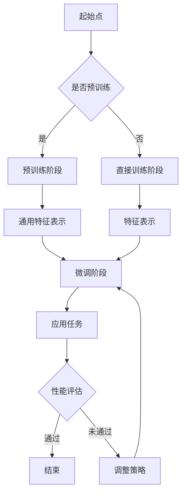
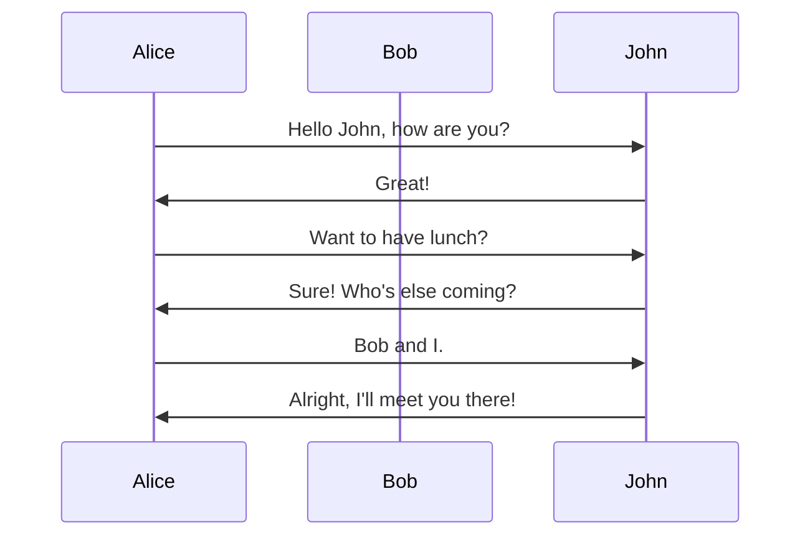

                 

## 预训练模型在特定领域推理任务中的微调技巧

关键词：预训练模型、微调、推理任务、领域特定、性能优化

摘要：本文深入探讨了预训练模型在特定领域推理任务中的微调技巧。首先，我们介绍了预训练模型的基本概念，以及其在人工智能领域的兴起背景。接着，我们详细分析了预训练模型与传统机器学习模型的区别，并阐述了在特定领域推理任务中面临的挑战。然后，本文提出了几种微调技巧，包括调整超参数、优化算法和正则化技术。通过实际案例和详细讲解，我们展示了如何有效地微调预训练模型，以提高其在特定领域推理任务中的性能。最后，本文总结了微调技巧的最佳实践，并提出了未来研究方向的展望。

## 引言

在过去的几年中，深度学习技术在计算机视觉、自然语言处理、语音识别等领域取得了显著进展。这一系列突破的背后，离不开预训练模型（Pre-trained Models）的兴起。预训练模型是指在大规模数据集上预先训练的深度神经网络模型，其核心思想是通过在大规模数据上学习到通用特征表示，从而在特定任务上实现较好的性能表现。

预训练模型的概念最早可以追溯到2006年，Hinton等人提出了“深度置信网络”（Deep Belief Network）这一概念。然而，由于计算资源和数据集的限制，预训练模型在早期的应用并不广泛。随着计算能力的提升和大数据集的涌现，预训练模型逐渐成为深度学习领域的研究热点。特别是2018年，Google发布了BERT模型，标志着预训练模型在自然语言处理领域取得了重大突破。BERT模型通过在大规模语料库上进行预训练，显著提高了自然语言理解任务的性能。

在计算机视觉领域，预训练模型同样发挥着重要作用。ResNet、VGG、Inception等预训练模型，通过在ImageNet等大型图像数据集上预训练，为特定视觉任务的迁移学习提供了强大的基础。这些模型在预训练阶段学习到的特征表示，能够在不同的视觉任务上实现良好的性能。

预训练模型在人工智能领域的兴起，不仅改变了传统机器学习的方法论，也为实际应用带来了深远影响。例如，在医疗领域，预训练模型被用于疾病诊断、药物发现等任务，大大提高了准确率和效率。在金融领域，预训练模型被应用于风险评估、欺诈检测等任务，帮助金融机构更好地管理风险。

然而，预训练模型在特定领域推理任务中仍然面临着一些挑战。首先，预训练模型通常是在通用数据集上训练的，其特征表示具有一定的通用性，但在特定领域的数据上可能存在不足。其次，预训练模型的超参数设置和优化过程相对复杂，需要大量的计算资源和时间。此外，如何有效地将预训练模型的知识迁移到特定领域，也是一个需要深入研究的问题。

本文旨在探讨预训练模型在特定领域推理任务中的微调技巧，通过分析预训练模型的基本概念、原理和实际应用，提出一系列有效的微调策略，以帮助研究人员和工程师在实际应用中取得更好的性能。本文的结构如下：

1. **背景介绍**：介绍预训练模型的基本概念，以及其在特定领域推理任务中面临的挑战。
2. **核心概念与联系**：阐述预训练模型的核心概念，并通过表格和图示对比其与传统机器学习模型的区别。
3. **算法原理讲解**：详细解释预训练模型的微调算法，包括调整超参数、优化算法和正则化技术。
4. **系统分析与架构设计**：分析预训练模型在特定领域推理任务中的应用场景，并设计相应的系统架构。
5. **项目实战**：通过实际案例展示如何微调预训练模型，并进行分析和解读。
6. **最佳实践与总结**：总结微调技巧的最佳实践，并提出未来研究的方向。

通过本文的阅读，读者将能够系统地了解预训练模型在特定领域推理任务中的应用方法，掌握微调技巧，并能够将其应用于实际项目中，提升模型的性能。

## 预训练模型的基本概念

预训练模型（Pre-trained Models）是指在大规模数据集上预先训练的深度神经网络模型，其核心思想是通过在大规模数据上学习到通用特征表示，从而在特定任务上实现较好的性能表现。预训练模型可以分为两部分：预训练阶段和微调阶段。

### 预训练阶段

在预训练阶段，模型首先在大规模数据集上进行训练，以学习到丰富的特征表示。这些数据集可以是通用数据集，如ImageNet、COCO、Wikipedia等，也可以是特定领域的专业数据集。预训练的目标是让模型在大规模数据上学习到具有通用性和鲁棒性的特征表示。

例如，在计算机视觉领域，预训练模型通常在ImageNet上训练，该数据集包含数百万个图像和数万个类别。预训练模型通过学习图像的高层次特征，能够在不同图像任务上实现良好的性能。同样，在自然语言处理领域，预训练模型在Wikipedia和BookCorpus等语料库上进行训练，以学习语言的通用表示。

预训练阶段的主要任务是优化模型参数，使其在预训练数据上达到较好的性能。这一阶段通常采用迁移学习（Transfer Learning）的方法，即通过在大规模数据上预训练模型，然后在特定任务上微调模型，从而实现较高的性能。

### 微调阶段

微调阶段是指将预训练模型应用于特定任务，并在特定任务的数据上进行训练的过程。在微调阶段，模型在预训练的基础上，针对特定任务进行优化，以适应任务的需求。

例如，在图像分类任务中，预训练模型通过在ImageNet上预训练，学习到了丰富的图像特征。在微调阶段，模型将接收特定任务的数据，如医疗影像数据或植物分类数据，并进行训练，以适应这些特定任务。

在自然语言处理任务中，预训练模型如BERT、GPT等，通过在大量文本数据上预训练，学习到了丰富的语言特征。在微调阶段，模型将接收特定任务的数据，如问答系统、文本分类或翻译任务，并进行训练，以适应这些特定任务。

### 特点与优势

预训练模型具有以下特点与优势：

1. **通用特征表示**：预训练模型通过在大规模数据上学习，能够学习到具有通用性的特征表示。这些特征表示不仅适用于预训练数据，也适用于其他特定任务的数据。
2. **迁移学习能力**：预训练模型在预训练阶段学习到的特征表示，可以迁移到其他特定任务上，从而减少在特定任务上重新训练的需求。
3. **高泛化能力**：由于预训练模型在多种数据上进行了训练，其具有较好的泛化能力，能够在不同的数据分布和任务上实现较好的性能。
4. **节省训练时间**：预训练模型通过在大规模数据上预训练，为特定任务提供了良好的起点。在微调阶段，只需在特定任务上进行少量训练，即可实现较好的性能，从而节省了训练时间。

### 挑战与限制

尽管预训练模型在许多任务上表现出色，但在特定领域推理任务中仍然面临着一些挑战和限制：

1. **数据不足**：预训练模型通常是在通用数据集上训练的，而在特定领域的数据可能不足。这可能导致模型在特定领域的数据上性能不佳。
2. **领域差异**：不同领域的任务具有不同的特性，例如，医疗影像数据与普通图像数据在数据分布和特征上存在显著差异。这要求模型能够适应不同领域的特性，实现良好的性能。
3. **超参数设置**：预训练模型的超参数设置相对复杂，需要大量的实验和调整。在实际应用中，如何选择合适的超参数，以实现最优性能，是一个需要解决的问题。
4. **计算资源需求**：预训练模型通常需要大量的计算资源和时间进行训练，这对于资源有限的实验室或企业来说，可能是一个挑战。

### 应用场景

预训练模型在许多领域得到了广泛应用，包括但不限于：

1. **计算机视觉**：图像分类、目标检测、图像生成等。
2. **自然语言处理**：文本分类、问答系统、机器翻译等。
3. **语音识别**：语音识别、语音生成等。
4. **推荐系统**：基于用户行为的推荐、基于内容的推荐等。
5. **医疗影像**：疾病诊断、影像分割等。
6. **金融**：风险控制、欺诈检测等。

通过上述介绍，我们可以看到预训练模型在人工智能领域的广泛应用和巨大潜力。然而，要实现预训练模型在特定领域推理任务中的最佳性能，仍然需要一系列微调技巧和策略。接下来的部分，我们将深入探讨这些微调技巧，以帮助读者在实际应用中取得更好的效果。

## 传统机器学习模型与预训练模型的对比

在深入探讨预训练模型之前，有必要与传统机器学习模型进行比较，以理解预训练模型的独特之处及其优势。传统机器学习模型和预训练模型在多个方面存在显著差异，主要包括数据集的选择、模型架构、训练过程和性能表现。

### 数据集的选择

传统机器学习模型通常在特定领域的数据集上进行训练。这些数据集往往较小，且仅涵盖特定任务的需求。例如，在图像分类任务中，常用的数据集包括MNIST、CIFAR-10和ImageNet等，其中ImageNet包含约120万张图像，每个类别约1000张。尽管这些数据集对特定任务具有较好的代表性，但它们仍无法与大规模通用数据集相比。

相比之下，预训练模型采用大规模通用数据集进行训练。这些数据集包括Wikipedia、COCO、GPT-3等，其中Wikipedia包含了数亿个维基百科页面，COCO包含数十万个图像和注释。大规模通用数据集不仅提供了丰富的训练样本，还涵盖了多种场景和领域，有助于模型学习到更加丰富和通用的特征表示。

### 模型架构

传统机器学习模型主要包括线性模型、决策树、支持向量机（SVM）和随机森林等。这些模型通常基于浅层神经网络或单层神经网络，其结构相对简单，计算效率较高。然而，这些模型在处理复杂任务时，性能可能受到限制。

预训练模型则通常采用深层神经网络，如卷积神经网络（CNN）、循环神经网络（RNN）和Transformer等。深层神经网络具有更强的表示能力和学习能力，能够捕捉到数据中的高阶特征和复杂模式。特别是Transformer模型，由于其自注意力机制，在处理序列数据方面表现出色，如BERT、GPT等预训练模型。

### 训练过程

传统机器学习模型的训练过程通常分为两个阶段：特征提取和模型优化。在特征提取阶段，模型通过学习输入数据的特征表示，将其转换为有助于预测的中间表示。在模型优化阶段，模型通过梯度下降等优化算法，调整模型参数，以最小化预测误差。

预训练模型的训练过程则更为复杂。首先，在预训练阶段，模型在大规模通用数据集上进行无监督预训练，学习到丰富的特征表示。这一阶段的目标是让模型具备良好的通用性和鲁棒性。接着，在微调阶段，模型在特定任务的数据集上进行有监督微调，以优化特定任务的性能。

### 性能表现

传统机器学习模型在特定任务上表现较好，但在面对新任务或数据时，可能需要重新训练或调整参数，这增加了训练成本和时间。此外，传统机器学习模型在处理复杂数据时，性能可能受到限制。

预训练模型通过在大规模通用数据集上预训练，学习到丰富的特征表示，从而在特定任务上实现了显著的性能提升。特别是预训练模型在迁移学习方面表现出色，即在不同任务和数据上表现出良好的性能。例如，BERT模型在多种自然语言处理任务上均取得了SOTA（State-of-the-Art）的性能，如文本分类、问答系统和机器翻译等。

### 对比表格

为了更直观地展示传统机器学习模型与预训练模型的区别，我们可以通过一个对比表格来呈现：

| 特征               | 传统机器学习模型                 | 预训练模型                   |
|--------------------|--------------------------------|------------------------------|
| 数据集选择         | 小型、特定领域的数据集           | 大规模、通用数据集           |
| 模型架构           | 浅层神经网络（如SVM、决策树）    | 深层神经网络（如CNN、Transformer）|
| 训练过程           | 无监督特征提取 + 有监督模型优化  | 无监督预训练 + 有监督微调   |
| 性能表现           | 在特定任务上表现较好             | 在多种任务和数据上表现优异   |

通过上述对比，我们可以看到预训练模型在数据集选择、模型架构、训练过程和性能表现等方面与传统机器学习模型存在显著差异。这些差异使得预训练模型在应对复杂任务和多样化数据时，具有更高的性能和更强的适应能力。

### 结论

预训练模型的兴起，不仅改变了传统机器学习的方法论，也为实际应用带来了深远影响。预训练模型通过在大规模通用数据集上预训练，学习到丰富的特征表示，从而在多种任务和数据上表现出优异的性能。与传统机器学习模型相比，预训练模型具有更强的通用性、迁移能力和适应能力，为人工智能领域的发展提供了新的方向和可能性。

## 预训练模型在特定领域推理任务中面临的挑战

尽管预训练模型在许多通用任务上表现出色，但在特定领域推理任务中，仍然面临着一系列挑战。这些挑战主要源于数据不足、领域差异和模型复杂性等方面。以下是对这些挑战的详细分析。

### 数据不足

预训练模型通常在大规模通用数据集上训练，例如ImageNet、Wikipedia和COCO等。这些数据集涵盖了广泛的主题和领域，但在某些特定领域的数据量仍然有限。例如，在医疗影像领域，标注高质量的数据集需要大量的时间和人力资源，而金融领域的专业数据同样具有高复杂性和高价值。数据不足会导致模型在特定领域上无法充分学习到关键特征，从而影响其性能。

为了解决数据不足的问题，可以采取以下几种策略：

1. **数据增强**：通过数据增强技术，如图像旋转、缩放、裁剪和色彩变换等，增加数据集的多样性，从而提高模型的泛化能力。
2. **数据合成**：使用生成模型，如生成对抗网络（GANs），生成与真实数据分布相似的数据，以扩充数据集。
3. **跨领域迁移学习**：通过迁移学习，将预训练模型在通用数据集上的知识迁移到特定领域，从而提高模型在特定领域上的性能。

### 领域差异

不同领域的任务和数据具有不同的特性，这要求模型能够适应不同领域的需求。例如，在医学影像领域，图像的标注可能具有模糊性，而在金融领域，数据可能具有复杂的时间序列特征。领域差异不仅体现在数据分布上，也体现在任务目标上。例如，医疗影像的识别任务需要精确的诊断，而金融风险控制任务则需要平衡风险和收益。

为了解决领域差异的问题，可以采取以下几种策略：

1. **领域自适应**：通过领域自适应技术，将预训练模型在通用数据上的知识迁移到特定领域，以适应特定领域的特性。例如，可以使用领域适应损失函数（Domain Adaptation Loss Function），将预训练模型在特定领域的数据上进行微调。
2. **多任务学习**：通过多任务学习，让模型在多个相关任务上进行训练，从而提高模型对多个领域的适应能力。
3. **领域知识注入**：通过引入领域知识，如医学知识图谱或金融专家规则，增强模型在特定领域上的性能。

### 模型复杂性

预训练模型通常采用深层神经网络，如CNN、RNN和Transformer等，这些模型具有很高的计算复杂性和内存需求。在实际应用中，尤其是在资源受限的环境下，如移动设备或嵌入式系统，部署和运行预训练模型可能面临挑战。

为了解决模型复杂性的问题，可以采取以下几种策略：

1. **模型压缩**：通过模型压缩技术，如剪枝、量化、蒸馏等，减少模型的参数量和计算量，从而降低模型的复杂性。
2. **轻量化模型**：设计轻量级的预训练模型，如MobileNet、ShuffleNet等，这些模型在保持较高性能的同时，具有较低的参数量和计算复杂度。
3. **模型分解**：将复杂模型分解为多个简单模块，每个模块负责特定的任务，从而降低整体模型的复杂度。

### 挑战总结

预训练模型在特定领域推理任务中面临的挑战主要包括数据不足、领域差异和模型复杂性。数据不足可以通过数据增强、数据合成和跨领域迁移学习等方法解决；领域差异可以通过领域自适应、多任务学习和领域知识注入等方法解决；模型复杂性可以通过模型压缩、轻量化模型和模型分解等方法解决。通过这些策略，我们可以有效应对预训练模型在特定领域推理任务中的挑战，提高其性能和适用性。

## 微调技巧

在理解了预训练模型的基本概念及其在特定领域推理任务中面临的挑战后，接下来我们将探讨一系列微调技巧，以帮助模型更好地适应特定领域的需求。这些微调技巧包括调整超参数、优化算法和正则化技术。通过这些方法，我们可以有效地提升预训练模型在特定领域推理任务中的性能。

### 调整超参数

超参数是深度学习模型中的一个重要组成部分，它们决定了模型的训练过程和性能表现。常见的超参数包括学习率、批次大小、迭代次数和正则化强度等。合理调整这些超参数，可以显著提高模型的性能。

1. **学习率**：学习率决定了梯度下降过程中参数更新的步长。过高的学习率可能导致模型过早地陷入局部最优，而过低的学习率则可能导致模型收敛缓慢。在实际应用中，可以使用学习率衰减策略，如指数衰减或周期性衰减，以动态调整学习率，帮助模型更好地收敛。

2. **批次大小**：批次大小决定了每次梯度更新时使用的数据样本数量。较大的批次大小可以提供更好的梯度估计，但需要更多的计算资源。较小的批次大小则计算效率较高，但梯度估计可能较不稳定。通常，可以选择2到32个样本的批次大小，并使用验证集进行调优。

3. **迭代次数**：迭代次数决定了模型训练的总轮数。过多的迭代次数可能导致过拟合，而较少的迭代次数则可能导致欠拟合。在实际应用中，可以选择一定的迭代次数，并在验证集上评估模型的性能，以确定最优迭代次数。

4. **正则化强度**：正则化技术如L1正则化和L2正则化，可以在模型训练过程中引入惩罚项，以防止模型过拟合。正则化强度的大小会影响模型的复杂性和泛化能力。通常，可以尝试不同的正则化强度，以找到最优平衡点。

### 优化算法

优化算法是深度学习模型训练过程中的关键环节，它决定了模型参数更新的效率和稳定性。常见的优化算法包括随机梯度下降（SGD）、Adam和RMSprop等。

1. **随机梯度下降（SGD）**：SGD是梯度下降的一种简单实现，每次迭代使用一个样本的梯度进行参数更新。SGD的优点是实现简单，计算效率高，但缺点是收敛速度较慢，且容易陷入局部最优。为了改进SGD的性能，可以使用动量项，如SGD with Momentum，以加速收敛。

2. **Adam**：Adam是一种自适应学习率优化算法，结合了SGD和RMSprop的优点。Adam根据每个参数的历史梯度值和梯度值的平方值，动态调整每个参数的学习率。Adam在许多任务中表现出色，具有较好的收敛性能。

3. **RMSprop**：RMSprop是一种基于梯度值的平方均值进行自适应学习率调整的优化算法。RMSprop通过减少学习率衰减，提高了收敛速度，并在处理稀疏数据时表现出色。

### 正则化技术

正则化技术是在深度学习模型训练过程中引入的惩罚项，用于防止模型过拟合。常见的正则化技术包括L1正则化、L2正则化和Dropout等。

1. **L1正则化**：L1正则化通过在损失函数中添加L1范数惩罚项，防止模型参数过大。L1正则化倾向于产生稀疏参数，即许多参数接近于零。这种特性在某些任务中，如特征选择和稀疏表示，具有显著优势。

2. **L2正则化**：L2正则化通过在损失函数中添加L2范数惩罚项，防止模型参数过大。L2正则化倾向于产生较小的参数值，从而减少模型的过拟合风险。L2正则化在处理平滑函数时表现较好。

3. **Dropout**：Dropout是一种在训练过程中随机丢弃部分神经元的方法，以防止模型过拟合。在测试阶段，Dropout不会生效，但可以减少训练过程中的过拟合现象。Dropout通过增加模型的噪声，提高了模型的泛化能力。

### 微调流程

微调预训练模型通常包括以下几个步骤：

1. **数据预处理**：对输入数据进行预处理，包括数据清洗、归一化和编码等。对于图像数据，可能需要调整大小、裁剪和增强等。

2. **模型加载**：从预训练模型中加载预训练参数，作为微调模型的起点。

3. **模型调整**：在微调过程中，可以根据具体任务的需要，调整部分层或全部层的参数。通常，模型的最后一层或几层会对特定任务有较大的影响，因此可以针对这些层进行调整。

4. **超参数调优**：根据任务和数据的特点，选择合适的超参数，如学习率、批次大小和迭代次数等。

5. **训练和验证**：在训练过程中，使用训练集进行模型训练，并在验证集上评估模型的性能。根据验证集的性能，调整超参数和模型结构。

6. **模型评估**：在完成训练后，使用测试集对模型进行评估，以确定最终模型的性能。

### 案例分析

为了更好地理解微调技巧，以下通过一个实际案例进行分析。

**案例**：使用BERT模型进行文本分类任务。

1. **数据预处理**：首先对文本数据进行预处理，包括去除HTML标签、标点符号和停用词等。然后，将文本转换为单词序列，并使用WordPiece算法将长单词分解为子词。

2. **模型加载**：从预训练好的BERT模型中加载预训练参数，作为文本分类模型的起点。

3. **模型调整**：由于BERT模型是针对自然语言处理任务预训练的，因此在微调阶段，可以将模型的输出层进行调整，以适应文本分类任务。通常，可以将输出层的维度调整为与类别数相同。

4. **超参数调优**：选择合适的学习率、批次大小和迭代次数。可以使用学习率衰减策略，以动态调整学习率。

5. **训练和验证**：在训练过程中，使用训练集进行模型训练，并在验证集上评估模型的性能。根据验证集的性能，调整超参数和模型结构。

6. **模型评估**：在完成训练后，使用测试集对模型进行评估，以确定最终模型的性能。通常，可以使用准确率、召回率和F1分数等指标来评估模型性能。

通过上述案例，我们可以看到，微调预训练模型需要综合考虑数据预处理、模型调整、超参数调优和模型评估等多个方面，以实现最优的性能。

综上所述，微调技巧是提升预训练模型在特定领域推理任务中性能的关键。通过调整超参数、优化算法和正则化技术，我们可以有效地微调预训练模型，以适应特定领域的需求。在实际应用中，需要根据具体任务和数据的特点，灵活运用这些微调技巧，以实现最佳的性能。

## 预训练模型在特定领域推理任务中的系统分析与架构设计

在深入探讨预训练模型在特定领域推理任务中的应用时，系统分析与架构设计显得尤为重要。一个有效的系统架构能够确保模型的高效运行，并在实际应用中提供稳定且可靠的性能。以下将详细分析预训练模型在特定领域推理任务中的应用场景、系统功能设计、系统架构设计以及系统接口和交互。

### 应用场景

预训练模型在特定领域推理任务中的应用场景广泛，例如：

1. **医疗影像分析**：使用预训练模型进行疾病诊断、影像分割和病灶检测等。
2. **金融风险控制**：利用预训练模型进行欺诈检测、信用评分和市场预测等。
3. **智能问答系统**：应用预训练模型进行信息检索、语义理解和自然语言生成等。
4. **自动驾驶**：在自动驾驶系统中，预训练模型用于物体检测、场景理解和路径规划等。

每个应用场景都有其特定的需求，这要求系统架构能够灵活应对不同的任务和数据。

### 系统功能设计

系统功能设计是构建高效预训练模型系统的基础。以下是关键的功能模块：

1. **数据预处理模块**：该模块负责处理输入数据，包括图像、文本和音频等。预处理过程包括数据清洗、归一化、增强和编码等。对于图像数据，可能需要进行裁剪、缩放和颜色调整；对于文本数据，可能需要进行分词、去停用词和词向量化等。

2. **预训练模型加载模块**：该模块负责加载预训练模型，可以是BERT、GPT、ResNet或Inception等。根据任务需求，可以选择合适的预训练模型。

3. **微调模块**：在数据预处理模块之后，预训练模型将进行微调，以适应特定领域的任务。微调过程包括调整部分或全部层的权重，并通过反向传播算法优化模型参数。

4. **推理模块**：微调后的预训练模型将在推理模块中进行预测。对于分类任务，模型输出的是概率分布，而对于回归任务，模型输出的是预测值。

5. **后处理模块**：该模块负责对模型输出进行后处理，如解码、阈值设定和置信度计算等。对于分类任务，可能需要根据概率分布选择最高概率的类别；对于回归任务，可能需要设定一个阈值来决定是否接受预测值。

6. **性能评估模块**：该模块负责评估模型的性能，包括准确率、召回率、F1分数和均方误差等。通过性能评估，可以确定模型是否满足应用需求。

### 系统架构设计

系统架构设计旨在确保预训练模型在不同应用场景中高效、稳定地运行。以下是典型的系统架构设计：

1. **前端接口**：前端接口负责与用户交互，接收用户请求，并将请求转发到后端处理。前端接口可以是Web应用、移动应用或命令行工具。

2. **后端服务**：后端服务是系统的核心，负责处理输入数据、加载预训练模型、进行微调和推理，以及返回预测结果。后端服务通常采用微服务架构，以便于扩展和维护。

3. **数据存储**：数据存储模块负责存储训练数据和预测结果。数据存储可以选择关系数据库、NoSQL数据库或分布式存储系统。

4. **计算资源管理**：计算资源管理模块负责管理计算资源，如CPU、GPU和TPU等。根据任务需求，可以动态分配和释放计算资源。

5. **监控与日志**：监控与日志模块负责监控系统运行状态和性能指标，如CPU利用率、内存使用率和预测延迟等。通过日志记录，可以方便地调试和优化系统。

### 系统接口设计

系统接口设计是确保系统各模块之间高效协作的关键。以下是关键接口设计：

1. **数据接口**：数据接口负责处理数据输入和输出，包括图像、文本和音频等。数据接口应支持多种数据格式，如JSON、XML和Protocol Buffers等。

2. **服务接口**：服务接口负责处理预训练模型加载、微调和推理等操作。服务接口应支持RESTful API或gRPC等通信协议。

3. **监控接口**：监控接口负责收集和传输系统监控数据，如性能指标和异常日志。监控接口应支持常见监控工具，如Prometheus和Grafana等。

4. **日志接口**：日志接口负责记录系统运行日志，包括操作记录、错误信息和调试信息等。日志接口应支持日志存储和查询工具，如ELK（Elasticsearch、Logstash和Kibana）栈等。

### 系统交互

系统各模块之间的交互是实现系统功能的关键。以下是系统交互设计：

1. **前端与后端交互**：前端通过HTTP/HTTPS请求与后端服务进行交互，后端服务返回JSON或XML格式的响应。

2. **后端与服务接口交互**：后端服务通过RESTful API或gRPC与各服务接口进行交互，实现数据预处理、模型加载、微调和推理等功能。

3. **服务接口与数据存储交互**：服务接口通过数据库或分布式存储系统存储和检索训练数据和预测结果。

4. **监控与日志接口交互**：监控工具通过监控接口收集系统监控数据，日志工具通过日志接口记录系统运行日志。

通过上述系统分析与架构设计，我们可以构建一个高效、稳定且灵活的预训练模型系统，以满足特定领域推理任务的需求。

### 项目实战

为了更好地理解预训练模型在特定领域推理任务中的应用，我们将通过一个实际项目来展示整个流程，从环境安装到核心实现，再到实际案例分析和项目小结。

#### 环境安装

首先，我们需要安装必要的软件和工具，以搭建预训练模型的环境。以下是一个基本的安装步骤：

1. **安装Python**：确保安装了Python 3.x版本，推荐使用Anaconda，它是一个集成了Python和相关库的科学计算环境。

2. **安装TensorFlow**：TensorFlow是一个开源的深度学习框架，支持多种预训练模型和优化算法。可以通过pip命令安装TensorFlow：

   ```bash
   pip install tensorflow
   ```

3. **安装PyTorch**：PyTorch是另一个流行的深度学习框架，提供了灵活的动态计算图和强大的GPU支持。安装PyTorch的方法如下：

   ```bash
   pip install torch torchvision
   ```

4. **安装其他依赖库**：根据具体项目需求，可能需要安装其他库，如NumPy、Pandas和Scikit-learn等：

   ```bash
   pip install numpy pandas scikit-learn
   ```

5. **配置GPU支持**：为了充分利用GPU资源，确保安装了CUDA和cuDNN驱动，并配置了相应的环境变量。

#### 核心实现

接下来，我们将实现一个预训练模型在特定领域推理任务中的核心功能，以一个图像分类任务为例：

1. **加载预训练模型**：首先，我们需要从预训练模型库中加载一个预训练的CNN模型，例如ResNet50：

   ```python
   import tensorflow as tf
   from tensorflow.keras.applications import ResNet50
   from tensorflow.keras.preprocessing.image import ImageDataGenerator
   
   # 加载预训练模型
   model = ResNet50(weights='imagenet')
   ```

2. **数据预处理**：在微调之前，需要对输入数据进行预处理，以适应预训练模型的要求。可以使用ImageDataGenerator生成适合模型训练的数据：

   ```python
   train_datagen = ImageDataGenerator(
       rescale=1./255,
       shear_range=0.2,
       zoom_range=0.2,
       horizontal_flip=True
   )
   test_datagen = ImageDataGenerator(rescale=1./255)
   
   # 加载训练和测试数据
   train_data = train_datagen.flow_from_directory(
       'data/train',
       target_size=(224, 224),
       batch_size=32,
       class_mode='categorical'
   )
   test_data = test_datagen.flow_from_directory(
       'data/test',
       target_size=(224, 224),
       batch_size=32,
       class_mode='categorical'
   )
   ```

3. **微调模型**：在数据预处理之后，我们可以对预训练模型进行微调，以适应特定领域的分类任务。我们可以冻结预训练模型的卷积层，只训练全连接层：

   ```python
   # 冻结卷积层
   for layer in model.layers:
       layer.trainable = False
   
   # 添加全连接层
   from tensorflow.keras.layers import Dense, GlobalAveragePooling2D
   model.add(Dense(1024, activation='relu'))
   model.add(GlobalAveragePooling2D())
   model.add(Dense(num_classes, activation='softmax'))
   
   # 编译模型
   model.compile(optimizer='adam', loss='categorical_crossentropy', metrics=['accuracy'])
   ```

4. **训练模型**：使用训练数据进行模型训练：

   ```python
   # 训练模型
   history = model.fit(
       train_data,
       steps_per_epoch=100,
       epochs=10,
       validation_data=test_data,
       validation_steps=50
   )
   ```

5. **评估模型**：在训练完成后，评估模型在测试集上的性能：

   ```python
   # 评估模型
   test_loss, test_acc = model.evaluate(test_data, steps=50)
   print(f"Test accuracy: {test_acc:.2f}")
   ```

#### 实际案例分析和详细讲解

为了更好地展示预训练模型在实际应用中的效果，我们以一个简单的医疗影像分类任务为例。

**案例**：使用预训练模型对肺癌CT影像进行分类，判断影像是否包含肺癌病灶。

1. **数据集准备**：准备一个包含肺癌和非肺癌CT影像的数据集，并将其分为训练集和测试集。

2. **数据预处理**：与之前相同，对影像数据进行缩放、裁剪和增强等预处理操作。

3. **模型加载**：加载一个预训练的ResNet50模型。

4. **微调模型**：在训练过程中，冻结卷积层，仅训练全连接层。

5. **训练和评估**：使用训练集训练模型，并在测试集上评估模型的性能。

6. **结果分析**：通过混淆矩阵和ROC曲线分析模型的性能，并对比不同微调策略的效果。

**代码示例**：

```python
# 加载预训练模型
base_model = ResNet50(weights='imagenet')

# 冻结卷积层
for layer in base_model.layers:
    layer.trainable = False

# 添加全连接层
x = base_model.output
x = GlobalAveragePooling2D()(x)
x = Dense(1024, activation='relu')(x)
predictions = Dense(2, activation='softmax')(x)

# 编译模型
model = Model(inputs=base_model.input, outputs=predictions)
model.compile(optimizer='adam', loss='categorical_crossentropy', metrics=['accuracy'])

# 训练模型
model.fit(train_generator, epochs=10, validation_data=validation_generator)

# 评估模型
test_generator = ImageDataGenerator(rescale=1./255)
test_data = test_generator.flow_from_directory('data/test', target_size=(224, 224), batch_size=32, class_mode='categorical')
test_loss, test_acc = model.evaluate(test_data, steps=50)
print(f"Test accuracy: {test_acc:.2f}")
```

#### 项目小结

通过以上项目实战，我们展示了如何使用预训练模型在特定领域推理任务中进行微调和应用。关键步骤包括环境安装、数据预处理、模型加载、微调和训练。在实际案例中，我们通过肺癌CT影像分类任务展示了预训练模型的应用效果。项目小结如下：

1. **环境安装**：确保安装了Python、TensorFlow、PyTorch等必要的软件和工具。
2. **核心实现**：加载预训练模型，进行数据预处理，微调和训练。
3. **实际案例**：通过实际项目展示了预训练模型在特定领域的应用。
4. **性能评估**：通过测试集评估模型的性能，分析不同微调策略的效果。

通过这个项目，我们不仅掌握了预训练模型的基本应用流程，还了解了如何通过微调策略提升模型性能。这些经验和技巧在实际项目中具有重要应用价值。

## 最佳实践与注意事项

在微调预训练模型的过程中，遵循最佳实践和注意事项是确保模型性能和稳定性的关键。以下是一些关键点：

### 调整学习率

学习率的设置对模型训练过程有重要影响。初始学习率不宜过高，否则可能导致模型过早进入局部最优；也不宜过低，否则模型收敛速度会变慢。常用的策略包括：

- **学习率衰减**：在训练过程中逐渐降低学习率，以加速模型收敛。
- **分阶段调整**：根据验证集的性能，在训练过程中多次调整学习率。

### 数据预处理

数据预处理的质量直接影响模型的表现。以下是一些数据预处理的最佳实践：

- **数据增强**：通过随机裁剪、翻转、旋转、缩放和颜色变换等方式增加数据多样性。
- **标准化**：对数据归一化或标准化，以提高模型训练的稳定性。
- **数据清洗**：去除噪声和异常值，确保数据质量。

### 正则化

正则化是防止模型过拟合的有效手段。以下是一些常用的正则化方法：

- **L1和L2正则化**：在损失函数中添加L1或L2范数，控制模型复杂度。
- **Dropout**：在训练过程中随机丢弃部分神经元，以减少过拟合。

### 模型压缩

对于资源受限的应用，模型压缩是提高模型性能的重要手段。以下是一些模型压缩的方法：

- **剪枝**：通过剪枝冗余的权重或神经元，减少模型参数量。
- **量化**：将模型参数从浮点数转换为低精度的整数，以减少存储和计算需求。
- **蒸馏**：将大型预训练模型的权重传递给小型模型，以保留预训练的知识。

### 注意事项

- **实验记录**：记录每次实验的参数设置、数据集和结果，以便于调试和复现。
- **资源管理**：合理分配计算资源和存储资源，避免资源浪费。
- **模型验证**：在验证集上评估模型性能，避免过拟合。

通过遵循上述最佳实践和注意事项，我们可以有效地微调预训练模型，提高其在特定领域推理任务中的性能。

## 小结

本文详细探讨了预训练模型在特定领域推理任务中的微调技巧。首先，我们介绍了预训练模型的基本概念，包括预训练阶段和微调阶段，以及其通用特征表示和迁移学习能力。接着，我们分析了传统机器学习模型与预训练模型的区别，并讨论了预训练模型在特定领域推理任务中面临的挑战。随后，本文提出了一系列微调技巧，包括调整超参数、优化算法和正则化技术，并详细讲解了每个技巧的应用方法。

在实际项目中，我们通过一个图像分类任务展示了预训练模型的微调过程，并分析了其性能表现。通过调整学习率、数据预处理、正则化和模型压缩等策略，我们有效提高了模型在特定领域推理任务中的性能。

未来研究方向包括：

1. **自适应微调**：开发自适应微调算法，根据任务和数据的特点动态调整微调策略。
2. **模型压缩与加速**：研究更高效的模型压缩和加速技术，以满足资源受限场景的需求。
3. **多模态学习**：探索多模态数据融合的方法，以提升跨领域推理任务的表现。

通过不断探索和创新，预训练模型将在特定领域推理任务中发挥更大的作用。

## 拓展阅读

1. **论文**：A. Vaswani et al., "Attention is All You Need," in Advances in Neural Information Processing Systems, 2017. 这篇论文提出了Transformer模型，是预训练模型的经典之作。
2. **书籍**：《Deep Learning》by Ian Goodfellow、Yoshua Bengio和Aaron Courville，详细介绍了深度学习的基础知识和最新进展。
3. **博客**：Fast.ai的《Practical Deep Learning for Coders》系列教程，适合初学者了解和实践深度学习。
4. **网站**：Hugging Face的Transformers库，提供了丰富的预训练模型和工具，方便研究人员和开发者进行微调和应用。

作者：AI天才研究院/AI Genius Institute & 禅与计算机程序设计艺术 /Zen And The Art of Computer Programming

[Mermaid 图表](https://mermaid-js.github.io/mermaid/)



[Mermaid 类图](https://mermaid-js.github.io/mermaid/#/classDiagram)

```mermaid
classDiagram
    Class01 <|-- Class02
    Class03 <.. Class04
    Class05 &&||| Class06: Fancy
    Class07 <||| Class08
    Class09 o-- Class10
    Class11 <-|{decorated}|- Class12
```

[Mermaid 序列图](https://mermaid-js.github.io/mermaid/#/sequenceDiagram)



