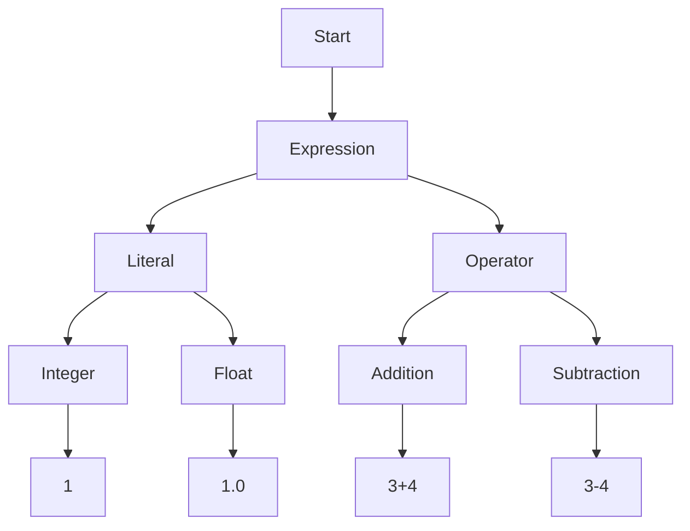
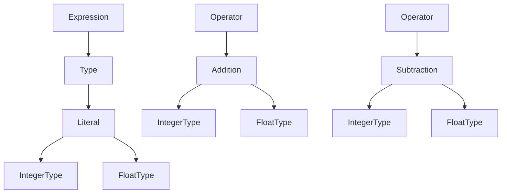
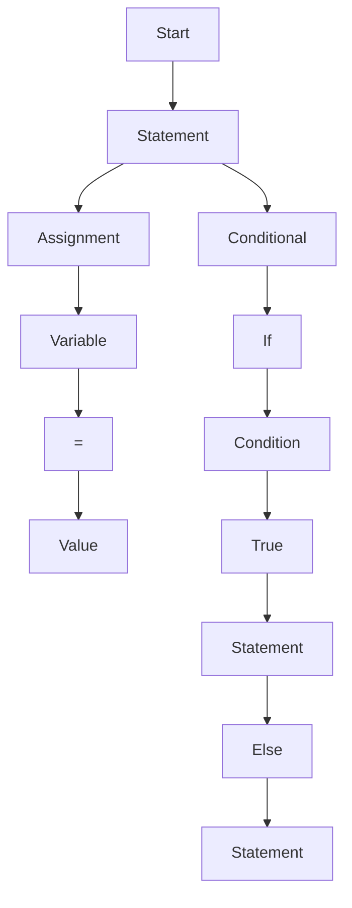
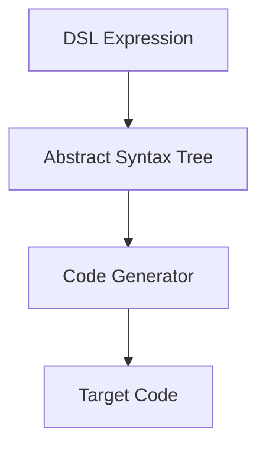
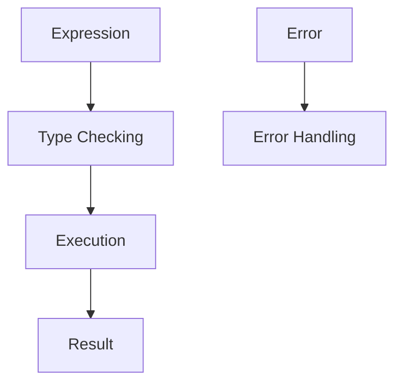
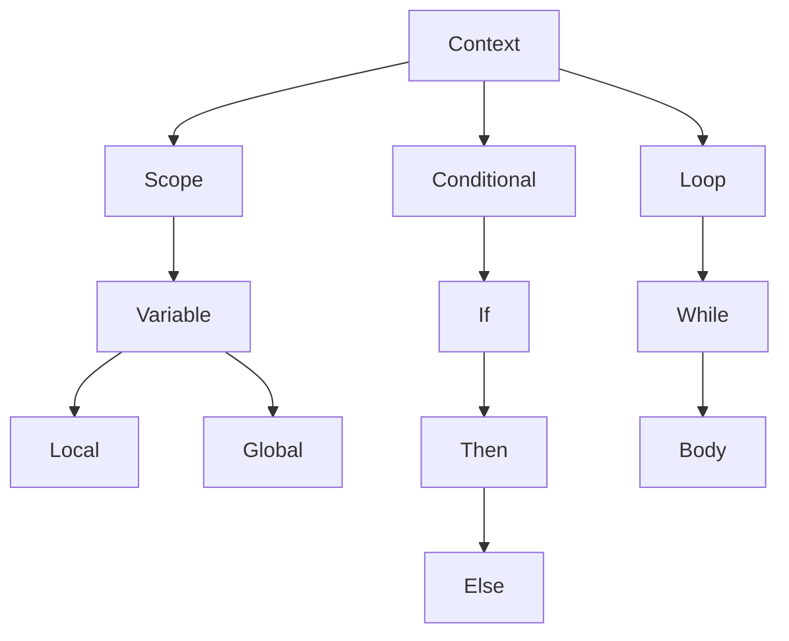

                 

## DSL的定义

领域特定语言（Domain-Specific Language，简称DSL）是一种专门为解决特定领域问题而设计的语言。与通用编程语言（如Python、Java等）不同，DSL专注于特定领域的概念和需求，从而能够提供更加直观和高效的解决方案。

### 1.1 DSL的定义

DSL的定义可以从以下几个方面来理解：

- **特定领域**：DSL的设计目标是为了解决某个特定领域的特定问题。例如，SQL（结构化查询语言）是一种专门为数据库查询设计的DSL，而HTML（超文本标记语言）则是为网页设计而设计的DSL。

- **高度抽象**：DSL通过高度抽象特定领域的概念和操作，使得开发者能够使用更加自然和直观的方式来表达解决方案。这种抽象性降低了学习成本，提高了开发效率。

- **专用工具集**：DSL通常会提供一套专用的工具集，包括语法、语法糖、库函数等，以便于开发者更加方便地使用该语言。

### 1.2 DSL的优势

DSL相较于通用编程语言，具有以下优势：

- **更高的开发效率**：DSL专注于特定领域的需求，提供了丰富的语法和工具集，使得开发者能够更加快速地实现特定功能。

- **更好的可读性和可维护性**：DSL的语法和语义更加贴近特定领域的实际需求，使得代码更加直观易懂，易于维护。

- **更好的性能和安全性**：DSL可以根据特定领域的需求进行优化，提供更好的性能和安全性保障。

### 1.3 DSL的类型

DSL可以根据不同的标准进行分类：

- **按用途分类**：DSL可以分为通用DSL（如SQL、HTML）和专用DSL（如正则表达式、JSON）。

- **按类型分类**：DSL可以分为动态DSL和静态DSL。动态DSL在运行时进行类型检查，如JavaScript；静态DSL则在编译时进行类型检查，如Java。

- **按抽象级别分类**：DSL可以分为底层DSL（如汇编语言）和高层DSL（如SQL、HTML）。

### 总结

DSL作为一种专门为解决特定领域问题而设计的语言，具有开发效率高、可读性强、性能和安全性强等优势。理解DSL的定义和类型，有助于我们更好地选择和设计合适的DSL，以提高开发效率和质量。

### 提问：根据您的理解，DSL的主要应用领域有哪些？

---

## DSL设计的基本原则

设计一个高效、易用的领域特定语言（DSL）需要遵循一系列基本原则。这些原则涵盖了从语言设计到实现和优化的各个方面，以确保DSL能够满足特定领域的需求，同时保持易用性和高效性。

### 2.1 DSL设计的基本原则

#### 1. 确定领域模型

在设计DSL之前，首先需要深入了解目标领域的模型和需求。领域模型通常包括领域对象、关系、规则和约束。确定领域模型有助于构建出符合实际业务需求的DSL。

#### 2. 简化语法

简化DSL的语法是提高开发效率的关键。DSL应该避免冗长的代码和复杂的语法结构，尽量让开发者能够直观地表达业务逻辑。

#### 3. 提供领域特定的抽象

DSL应该提供特定领域的抽象概念和操作，使得开发者能够更加自然地表达领域需求。这些抽象可以帮助减少代码冗余，提高代码可读性。

#### 4. 易于学习和使用

DSL的设计应该考虑到学习成本和使用难度。理想情况下，DSL应该足够简单，使得新开发者能够快速上手，同时也应该提供丰富的文档和示例，帮助开发者理解和使用DSL。

#### 5. 高效的编译和执行

DSL的编译和执行效率直接影响开发者的体验。设计DSL时，需要考虑编译和执行的性能，确保DSL能够快速地编译和执行，以提高开发效率。

#### 6. 类型安全

类型安全是保证程序正确性的关键。DSL应该提供类型检查机制，以确保在编译时发现类型错误，从而避免运行时错误。

#### 7. 可扩展性

DSL应该具有良好的可扩展性，以便于在未来能够添加新的功能和特性，满足不断变化的业务需求。

#### 8. 社区支持

社区支持是DSL成功的关键因素之一。DSL的设计和实现应该鼓励社区贡献，包括文档、示例代码、工具等，以提高DSL的普及度和使用率。

### 总结

DSL设计的基本原则包括确定领域模型、简化语法、提供领域特定的抽象、易于学习和使用、高效编译和执行、类型安全、可扩展性和社区支持。遵循这些原则，可以帮助设计出高效、易用的领域特定语言，满足特定领域的开发需求。

### 提问：您认为在设计DSL时，哪些因素最容易被忽视？为什么？

---

## DSL建模方法

领域特定语言（DSL）的建模方法对于实现高效、易用的语言至关重要。这些方法涵盖了从概念模型到语法和语义的各个方面，确保DSL能够准确、全面地表达领域需求。

### 2.2 DSL建模方法

#### 1. 概念模型

概念模型是DSL设计的起点，它抽象了领域中的关键概念和关系。概念模型通常使用实体关系图（Entity-Relationship Diagram，ERD）来表示。ERD可以清晰地展示领域中的实体、属性和它们之间的关系。

#### 2. 语法建模

语法建模是DSL设计的关键步骤，它定义了DSL的语法规则和结构。语法建模可以使用BNF（巴科斯-诺尔范式）或者EBNF（扩展巴科斯-诺尔范式）来表示。这些范式提供了形式化的语法描述方法，使得DSL的语法结构清晰、易于理解。



上述Mermaid流程图展示了简单算术表达式的语法结构，包括整数和浮点数的文字表示以及加法和减法运算符。

#### 3. 语义建模

语义建模关注DSL的语义和语义规则。它定义了DSL表达式在不同上下文中的行为和含义。语义建模通常使用语义网络或者语义规则来表示。



上述Mermaid流程图展示了DSL表达式的类型推断规则。例如，如果表达式中包含整数和浮点数，那么加法和减法运算的结果类型将是浮点数。

#### 4. 上下文建模

上下文建模是确保DSL在不同上下文中保持一致性和正确性的关键。它定义了DSL在不同上下文中的行为和规则。上下文建模可以使用上下文敏感语法（Context-Sensitive Grammar）来表示。



上述Mermaid流程图展示了DSL中的赋值语句和条件语句的上下文规则。

#### 5. 代码生成

代码生成是将DSL表达式转换为特定编程语言代码的过程。通过代码生成，DSL可以与现有工具和框架集成，提高开发效率和代码复用性。



上述Mermaid流程图展示了DSL表达式通过抽象语法树（Abstract Syntax Tree，AST）生成目标代码的过程。

### 总结

DSL建模方法包括概念模型、语法建模、语义建模、上下文建模和代码生成。这些方法确保DSL能够准确、全面地表达领域需求，同时保持语法和语义的一致性和正确性。通过使用Mermaid流程图，我们可以直观地展示DSL的建模过程，提高理解和实现DSL的效率。

### 提问：您认为在DSL建模过程中，哪种方法最为重要？为什么？

---

## DSL语言设计

语言设计是创建领域特定语言（DSL）的核心环节。在这一节中，我们将详细探讨DSL语言设计的各个方面，包括语法、语义、上下文和词汇等，以及如何将这些元素结合在一起，实现一个高效、易用的DSL。

### 3.1 DSL语言设计的基本概念

DSL语言设计的目标是使语言尽可能地贴近领域专家的思维模式，从而提高开发效率和代码质量。DSL的设计需要考虑以下几个基本概念：

- **语法**：定义DSL的语法规则，包括关键字、运算符、括号、注释等。
- **语义**：指定DSL表达式的意义和执行行为。
- **上下文**：定义DSL在不同场景和上下文中的使用规则。
- **词汇**：定义DSL的基本元素和常量，如变量名、函数名等。

### 3.2 DSL语言设计的步骤

#### 1. 需求分析

在开始设计DSL之前，需要深入了解目标领域的需求。这包括理解领域专家的工作流程、领域模型和业务规则。需求分析的结果将指导DSL的设计方向。

#### 2. 设计语法

语法设计是DSL语言设计的起点。设计语法时，需要考虑以下几点：

- **简洁性**：尽量使用简单、直观的语法结构，降低学习成本。
- **一致性**：确保语法规则的一致性，避免出现歧义。
- **扩展性**：设计可扩展的语法结构，以便在将来添加新功能。

例如，一个简单的DSL语法可以包括以下关键字和运算符：

```mermaid
graph TD
A[Keywords] --> B[if]
B --> C[else]
B --> D[while]
A --> E[+]
A --> F[-]
A --> G[*]
A --> H[/]
```

#### 3. 设计语义

语义设计是定义DSL表达式的意义和执行行为。语义设计通常需要考虑以下几点：

- **类型系统**：设计合适的类型系统，确保类型安全和类型推断。
- **执行规则**：定义DSL表达式的执行顺序和逻辑。
- **错误处理**：设计错误处理机制，确保DSL能够优雅地处理异常。

例如，一个简单的语义规则可以是：



#### 4. 设计上下文

上下文设计是确保DSL在不同上下文中使用的一致性和正确性。上下文设计需要考虑以下几点：

- **作用域**：定义变量的作用域和生命周期。
- **条件**：定义条件表达式和条件分支的处理规则。
- **循环**：定义循环语句的处理规则。

例如，一个简单的上下文设计可以是：



#### 5. 设计词汇

词汇设计是定义DSL的基本元素和常量。词汇设计需要考虑以下几点：

- **关键字**：定义DSL的关键字，如if、else、while等。
- **运算符**：定义DSL的运算符，如+、-、*、/等。
- **常量**：定义DSL的常量，如数字、字符串等。

例如，一个简单的词汇设计可以是：

```mermaid
graph TD
A[Vocabulary] --> B[Keywords]
B --> C[if]
B --> D[else]
B --> E[while]
A --> F[Operators]
F --> G[+]
F --> H[-]
F --> I[*]
F --> J[/]
A --> K[Constants]
K --> L[1]
K --> M["hello"]
```

#### 6. 编码实现

在完成DSL的设计后，需要将其编码实现。编码实现通常涉及以下步骤：

- **编译器/解释器**：实现DSL的编译器或解释器，将DSL代码转换为机器码或解释执行。
- **工具支持**：提供集成开发环境（IDE）支持，如代码高亮、语法检查、自动补全等。
- **文档和示例**：编写DSL的文档和示例，帮助开发者学习和使用DSL。

### 3.3 DSL语言设计的案例分析

为了更好地理解DSL语言设计，我们以一个简单的示例来说明。假设我们要设计一个用于数据库查询的DSL。

#### 1. 需求分析

目标领域：数据库查询
需求：提供简单的数据库查询功能，支持常见的查询操作，如选择（SELECT）、过滤（WHERE）、排序（ORDER BY）和分组（GROUP BY）。

#### 2. 设计语法

- 关键字：SELECT、FROM、WHERE、ORDER BY、GROUP BY
- 运算符：=、>、<、>=、<=、!=
- 标识符：表名、列名、变量名

#### 3. 设计语义

- SELECT：从数据库中选择特定的列和行。
- FROM：指定要查询的表。
- WHERE：指定查询的过滤条件。
- ORDER BY：指定查询结果的排序规则。
- GROUP BY：指定查询结果的分组规则。

#### 4. 设计上下文

- 作用域：变量作用域在SELECT语句内部有效。
- 条件：WHERE子句中的条件表达式。
- 循环：未提供循环语句，但可以通过子查询实现。

#### 5. 设计词汇

- 关键字：SELECT、FROM、WHERE、ORDER BY、GROUP BY、SELECT、FROM、WHERE、ORDER BY、GROUP BY
- 运算符：=、>、<、>=、<=、!=
- 常量：数字、字符串

#### 6. 编码实现

以下是一个简单的SQL DSL示例：

```plaintext
SELECT name, age FROM users WHERE age > 18 ORDER BY age;
```

这个查询表示从users表中选择年龄大于18岁的用户，并按照年龄升序排序。

### 总结

DSL语言设计是一个复杂的过程，涉及语法、语义、上下文和词汇等多个方面。通过需求分析、设计语法、设计语义、设计上下文、设计词汇和编码实现等步骤，我们可以创建一个高效、易用的DSL。在实际应用中，DSL的设计需要根据具体领域需求进行调整和优化，以满足开发者的实际需求。

### 提问：在DSL语言设计过程中，如何确保设计出来的语言既简洁又强大？

---

### 类型系统的基本概念

在领域特定语言（DSL）的设计与实现过程中，类型系统是一个至关重要的组成部分。类型系统不仅能够确保程序的正确性，还能提供编译优化和性能提升。本节将详细介绍类型系统的基本概念，包括类型、类型层次、类型约束和类型检查等内容。

#### 1. 类型

类型是变量、函数、对象等数据结构在程序中的分类。类型系统通过定义不同类型的属性和操作，确保程序在运行时能够正确地处理数据。常见的类型包括整数（Integer）、浮点数（Float）、字符串（String）、布尔值（Boolean）等。

#### 2. 类型层次

类型层次（Type Hierarchy）是一种将类型组织成层次结构的方法。在类型层次中，低层类型是高层类型的子类型。这种层次结构有助于提高类型系统的灵活性，允许子类型的实例替代父类型的实例。例如，在Java语言中，整数类型（如Byte、Short、Integer、Long）构成了一个类型层次，其中每个低层类型都是高层类型的子类型。

#### 3. 类型约束

类型约束（Type Constraints）是一种确保类型兼容性的机制。类型约束定义了哪些类型的值可以在特定操作中使用。例如，在C语言中，只有相同类型的变量才能进行加法运算。类型约束有助于减少类型错误和提高程序的可靠性。

#### 4. 类型检查

类型检查（Type Checking）是在编译或运行时对类型约束的验证过程。静态类型检查在编译时进行，而动态类型检查在运行时进行。静态类型检查可以提前发现类型错误，从而提高程序的正确性和性能。动态类型检查则提供了更大的灵活性，但可能需要在运行时进行额外的类型检查，从而影响性能。

#### 5. 常见的类型系统

- **静态类型系统**：在编译时进行类型检查。例如，Java和C#都是静态类型语言。静态类型系统提供了编译时错误检测和优化，但可能会增加开发难度。
- **动态类型系统**：在运行时进行类型检查。例如，Python和JavaScript都是动态类型语言。动态类型系统提供了更大的灵活性，但可能会牺牲一些性能。

#### 6. 类型系统的优点

- **提高程序的正确性**：类型系统能够在编译或运行时检测类型错误，减少程序出错的概率。
- **优化性能**：类型系统可以帮助编译器进行优化，如寄存器分配、代码生成等。
- **提高代码可读性**：类型系统使得代码更加清晰和易于理解。

#### 7. 类型系统的挑战

- **增加开发难度**：静态类型系统可能需要更多的类型声明和检查，增加开发难度。
- **降低灵活性**：类型系统可能会限制程序设计中的某些灵活性，如类型转换和通用性。

### 总结

类型系统是领域特定语言（DSL）的核心组成部分，它通过定义类型的属性、层次和约束，确保程序的正确性和性能。了解类型系统的基本概念，有助于我们更好地设计、实现和优化DSL。

### 提问：在DSL中，静态类型系统和动态类型系统各有何优缺点？哪种类型系统更适合DSL？

---

### 类型系统在DSL中的应用

类型系统在领域特定语言（DSL）中扮演着关键角色，它不仅影响语言的语法设计，还决定了DSL的可读性、可维护性和性能。在本节中，我们将探讨类型系统在DSL中的应用，以及它们如何提高DSL的有效性和效率。

#### 1. 类型系统在DSL中的作用

类型系统在DSL中的应用主要体现在以下几个方面：

- **增强代码可读性**：类型系统使得DSL的代码更加直观和易读。通过明确的类型声明，开发者可以迅速理解代码的功能和意图，减少误解和错误。
- **提高代码可维护性**：类型系统能够在编译或运行时发现类型错误，从而减少后期维护的成本。开发者无需担心类型不一致导致的运行时错误，可以更加专注于业务逻辑的实现。
- **优化性能**：类型系统可以帮助编译器进行优化，如早期绑定、代码生成、寄存器分配等。静态类型系统在编译时进行类型检查，可以提前发现潜在的错误，从而提高程序的性能。
- **提高安全性**：类型系统可以防止不兼容的类型操作，从而减少程序出错的可能性。在动态类型系统中，类型检查通常在运行时进行，有助于捕获和修复类型错误。

#### 2. 常见的DSL类型系统

DSL的类型系统可以根据类型检查的时间点分为静态类型系统和动态类型系统。

- **静态类型系统**：在编译时进行类型检查。静态类型系统提供了明确的类型信息，使得编译器能够进行高效的优化和错误检测。常见的静态类型DSL包括Java、C#、Haskell等。
  
  - **优点**：
    - 提高编译时性能：由于类型信息在编译时已知，编译器可以生成更高效的代码。
    - 提高代码可维护性：明确的类型声明减少了运行时错误的可能性。
    - 支持静态类型优化：如早期绑定、代码生成、寄存器分配等。

  - **缺点**：
    - 增加开发难度：静态类型系统通常需要更多的类型声明和检查，可能增加代码的复杂度。
    - 降低灵活性：静态类型系统可能会限制某些类型转换和通用性。

- **动态类型系统**：在运行时进行类型检查。动态类型系统提供了更大的灵活性，使得开发者能够更加方便地编写和理解代码。常见的动态类型DSL包括Python、JavaScript、Ruby等。
  
  - **优点**：
    - 提高开发效率：动态类型系统减少了类型声明和检查的负担，使得代码更加简洁。
    - 提高代码灵活性：动态类型系统允许更灵活的类型转换和通用性。

  - **缺点**：
    - 降低编译时性能：由于类型信息在编译时未知，编译器无法进行静态优化，可能导致运行时性能下降。
    - 增加运行时错误：类型错误可能在运行时被发现，可能影响程序的稳定性。

#### 3. 静态类型DSL的实现

实现静态类型DSL通常涉及以下步骤：

- **定义类型系统**：设计类型系统，包括类型、类型层次、类型约束等。
- **语法设计**：定义DSL的语法规则，确保代码易于理解和使用。
- **编译器实现**：实现编译器，将DSL代码编译为目标代码（如机器码或字节码）。
- **优化器实现**：实现优化器，对编译后的代码进行优化，提高性能。
- **工具支持**：提供IDE支持，如代码高亮、语法检查、自动补全等，以提高开发效率。

#### 4. 动态类型DSL的实现

实现动态类型DSL通常涉及以下步骤：

- **定义类型系统**：设计类型系统，但类型信息在编译时未知。
- **语法设计**：定义DSL的语法规则，确保代码易于理解和使用。
- **解释器实现**：实现解释器，逐行解释并执行DSL代码。
- **即时编译器**（JIT）：为了提高性能，可以采用即时编译器将解释执行的代码编译为机器码。
- **工具支持**：提供IDE支持，如代码高亮、语法检查、自动补全等，以提高开发效率。

#### 5. 静态类型DSL与动态类型DSL的对比

| 特性 | 静态类型DSL | 动态类型DSL |
| --- | --- | --- |
| 类型检查时间 | 编译时 | 运行时 |
| 性能 | 较高 | 较低 |
| 开发难度 | 较高 | 较低 |
| 灵活性 | 较低 | 较高 |
| 示例 | Java、C# | Python、JavaScript |

### 总结

类型系统在DSL中的应用极大地提高了DSL的有效性和效率。通过设计合适的类型系统，我们可以确保代码的正确性、可读性和可维护性。在实现DSL时，根据具体需求选择静态类型系统或动态类型系统，可以实现不同方面的优化和提升。无论是静态类型DSL还是动态类型DSL，它们都有各自的优点和缺点，需要根据实际应用场景进行选择和调整。

### 提问：在实现DSL时，如何权衡静态类型系统和动态类型系统的优缺点？

---

### 静态类型DSL

静态类型DSL是一种在编译时进行类型检查的领域特定语言（DSL）。它通过在编译阶段确定变量和表达式的类型，提供了类型安全、编译优化和更高的代码可读性。本节将详细介绍静态类型DSL的优点、实现方式和案例研究。

#### 4.1 静态类型的优点

静态类型的优点主要体现在以下几个方面：

1. **类型安全**：静态类型系统能够在编译时检测类型错误，从而减少运行时错误。这有助于提高代码的可靠性和稳定性。

2. **编译优化**：由于静态类型系统在编译时提供完整的类型信息，编译器可以进行更有效的优化，如早期绑定、代码生成、寄存器分配等。这可以提高程序的执行效率。

3. **代码可读性**：静态类型系统使得代码更加清晰和易于理解。开发者可以直观地了解变量的类型和操作，减少误解和错误。

4. **模块化**：静态类型系统有助于模块化和代码复用。由于类型信息是明确的，开发者可以更方便地编写可重用的组件和库。

#### 4.2 静态类型DSL的实现

实现静态类型DSL通常涉及以下步骤：

1. **类型系统设计**：设计静态类型系统，包括类型、类型层次、类型约束等。例如，在Java中，我们可以定义类（Class）作为类型，通过继承（Inheritance）和组合（Composition）来构建类型层次。

2. **语法设计**：定义DSL的语法规则，确保代码易于理解和使用。语法设计需要考虑如何表达类型、类型约束和类型转换。

3. **编译器实现**：实现编译器，将DSL代码编译为目标代码（如机器码或字节码）。编译器需要实现词法分析、语法分析、语义分析和代码生成等模块。

4. **优化器实现**：实现优化器，对编译后的代码进行优化，提高性能。优化器可以使用静态类型信息进行各种优化，如常量折叠、循环展开、死代码消除等。

5. **工具支持**：提供IDE支持，如代码高亮、语法检查、自动补全等，以提高开发效率。

#### 4.3 静态类型DSL的案例研究

以下是一个简单的静态类型DSL案例：一个用于计算学生成绩的DSL。

**需求**：设计一个DSL，用于计算学生的平均成绩、最高成绩和最低成绩。

**语法设计**：

- `define_student(name, score)`: 定义一个学生，包含姓名和成绩。
- `calculate_average(score_list)`: 计算平均成绩。
- `find_max(score_list)`: 找到最高成绩。
- `find_min(score_list)`: 找到最低成绩。

**实现**：

1. **类型系统设计**：

   ```plaintext
   class Student {
     name: String;
     score: Integer;
   }
   ```

   我们使用类（Class）来定义Student类型，包含name（String类型）和score（Integer类型）两个属性。

2. **语法设计**：

   ```plaintext
   define_student("Alice", 85);
   define_student("Bob", 92);
   define_student("Charlie", 78);

   average = calculate_average([85, 92, 78]);
   max_score = find_max([85, 92, 78]);
   min_score = find_min([85, 92, 78]);
   ```

   上述代码定义了三个学生，并计算了平均成绩、最高成绩和最低成绩。

3. **编译器实现**：

   编译器需要实现词法分析、语法分析和语义分析等模块。词法分析将源代码分解为标识符、关键字和运算符等；语法分析构建抽象语法树（AST）；语义分析检查类型一致性并生成目标代码。

4. **优化器实现**：

   优化器可以使用静态类型信息进行优化。例如，在计算平均成绩时，可以提前计算出总分和平均分，从而减少运行时的计算开销。

5. **工具支持**：

   提供IDE支持，如代码高亮、语法检查、自动补全等，以提高开发效率。

### 总结

静态类型DSL提供了类型安全、编译优化和更高的代码可读性。通过设计静态类型系统、实现编译器和优化器，以及提供工具支持，我们可以创建一个高效、易用的静态类型DSL。案例研究展示了如何设计、实现和优化一个简单的静态类型DSL，以解决实际业务问题。

### 提问：在静态类型DSL的实现过程中，如何优化编译器的性能？

---

### 动态类型DSL

动态类型DSL是一种在运行时进行类型检查的领域特定语言（DSL）。与静态类型DSL不同，动态类型DSL在编译时不会确定变量和表达式的类型，而是在运行时根据上下文动态地检查类型。这种灵活性使得动态类型DSL在开发效率和代码简洁性方面具有显著优势。本节将详细介绍动态类型DSL的优点、实现方式和案例研究。

#### 5.1 动态类型的优点

动态类型的优点主要包括以下几个方面：

1. **更高的开发效率**：动态类型DSL无需明确的类型声明，可以简化代码编写过程。这有助于快速迭代和开发，提高开发效率。

2. **更好的灵活性**：动态类型允许更灵活的类型转换和通用性。例如，在Python中，同一变量可以同时是整数和字符串，这在某些场景下非常有用。

3. **简化代码维护**：由于无需编写类型声明，动态类型DSL的代码通常更加简洁，减少了维护成本。

4. **更好的错误检测**：动态类型系统在运行时进行类型检查，有助于在早期发现类型错误，提高代码的健壮性。

5. **适应性强**：动态类型DSL更易于扩展和适应新需求，因为它们不需要进行类型重构。

#### 5.2 动态类型DSL的实现

实现动态类型DSL通常涉及以下步骤：

1. **类型系统设计**：虽然动态类型DSL在编译时不会确定类型，但仍然需要设计一个类型系统来支持运行时的类型检查和类型转换。类型系统通常包括动态类型（如Object、Any）和类型约束（如类型检查函数、类型转换函数）。

2. **语法设计**：定义DSL的语法规则，确保代码易于理解和使用。语法设计需要考虑动态类型DSL的特点，如变量绑定、函数定义和类型转换等。

3. **解释器实现**：实现解释器，逐行解释并执行DSL代码。解释器需要处理动态类型系统的特性，如类型检查、类型转换和错误处理。

4. **即时编译器**（JIT）：为了提高性能，可以采用即时编译器将解释执行的代码编译为机器码。即时编译器在运行时动态优化代码，提高执行效率。

5. **工具支持**：提供IDE支持，如代码高亮、语法检查、自动补全等，以提高开发效率。

#### 5.3 动态类型DSL的案例研究

以下是一个简单的动态类型DSL案例：一个用于数据处理的DSL。

**需求**：设计一个DSL，用于处理和展示数据集。

**语法设计**：

- `load_data(file)`: 从文件中加载数据集。
- `filter(data, condition)`: 过滤数据集。
- `map(data, function)`: 对数据集应用函数。
- `reduce(data, function)`: 对数据集进行归约。

**实现**：

1. **类型系统设计**：

   ```plaintext
   def load_data(file):
     return file.read()

   def filter(data, condition):
     return [x for x in data if condition(x)]

   def map(data, function):
     return [function(x) for x in data]

   def reduce(data, function):
     return function([x for x in data])
   ```

   在这个示例中，我们使用了动态类型系统。`load_data`函数返回一个字符串类型的文件内容；`filter`函数返回一个列表类型的数据集；`map`函数返回一个新列表；`reduce`函数返回一个结果值。

2. **语法设计**：

   ```plaintext
   data = load_data("data.csv")
   filtered_data = filter(data, lambda x: x > 10)
   mapped_data = map(filtered_data, lambda x: x * 2)
   result = reduce(mapped_data, sum)
   ```

   上述代码从文件中加载数据集，过滤出大于10的值，将每个值乘以2，最后计算总和。

3. **解释器实现**：

   解释器需要处理动态类型系统的特性，如类型检查、类型转换和错误处理。在运行时，解释器会根据上下文动态地检查变量和表达式的类型，并在必要时进行类型转换。

4. **即时编译器**（JIT）：为了提高性能，可以采用即时编译器将解释执行的代码编译为机器码。即时编译器在运行时动态优化代码，提高执行效率。

5. **工具支持**：

   提供IDE支持，如代码高亮、语法检查、自动补全等，以提高开发效率。

### 总结

动态类型DSL提供了更高的开发效率、更好的灵活性、简化代码维护和更好的错误检测能力。通过设计动态类型系统、实现解释器和即时编译器，以及提供工具支持，我们可以创建一个高效、易用的动态类型DSL。案例研究展示了如何设计、实现和优化一个简单的动态类型DSL，以解决实际业务问题。

### 提问：在动态类型DSL的实现过程中，如何优化解释器的性能？

---

### 类型安全与类型推断

在领域特定语言（DSL）的设计和实现过程中，类型安全和类型推断是至关重要的两个方面。类型安全保证了程序的正确性和稳定性，而类型推断则大大提高了编程效率和代码的可读性。本节将深入探讨类型安全的重要性、类型推断的方法，并通过具体案例研究展示类型安全与类型推断在DSL中的应用。

#### 6.1 类型安全的重要性

类型安全是指程序在执行过程中能够正确处理数据类型，防止因类型错误导致的不确定行为。类型安全的重要性体现在以下几个方面：

1. **防止类型错误**：类型安全可以防止在程序运行时因类型不匹配导致的错误，如试图将一个整数与一个字符串进行数学运算。

2. **提高代码可靠性**：通过类型检查，编译器或解释器可以在编译或运行时发现并报告类型错误，从而减少程序出错的可能性。

3. **优化编译过程**：类型信息有助于编译器进行优化，如早期绑定、代码生成、寄存器分配等，提高程序的执行效率。

4. **增强代码可维护性**：明确的类型信息使得代码更加清晰和易于理解，降低维护成本。

#### 6.2 类型推断的方法

类型推断是编译器或解释器根据程序上下文自动确定变量和表达式的类型的过程。常见的类型推断方法包括：

1. **静态类型推断**：在编译时通过解析代码结构和语义规则推断类型。例如，Java和C#都采用静态类型推断。

2. **动态类型推断**：在运行时根据变量和表达式的使用上下文动态推断类型。例如，Python和JavaScript采用动态类型推断。

3. **混合类型推断**：结合静态类型推断和动态类型推断的优点，在编译时进行部分类型推断，运行时进行补充。例如，C++采用混合类型推断。

#### 6.3 类型安全与类型推断的案例研究

以下是一个简单的案例研究，展示了如何在DSL中实现类型安全和类型推断。

**需求**：设计一个用于处理和转换XML文档的DSL。

**语法设计**：

- `load_xml(file)`: 从文件中加载XML文档。
- `select_elements(xml, path)`: 根据XPath路径选择XML元素。
- `map_elements(elements, function)`: 对选中的元素应用函数。
- `reduce_elements(elements, function)`: 对选中的元素进行归约。

**类型安全设计**：

1. **类型定义**：

   ```plaintext
   class XmlDocument {
     elements: List[XmlElement];
   }

   class XmlElement {
     name: String;
     attributes: Dict[String, String];
     children: List[XmlElement];
   }
   ```

   我们定义了`XmlDocument`和`XmlElement`两个类，分别表示XML文档和元素。

2. **类型约束**：

   ```plaintext
   def load_xml(file):
     return XmlDocument(file.read())

   def select_elements(xml, path):
     return xml.select(path)

   def map_elements(elements, function):
     return [function(e) for e in elements]

   def reduce_elements(elements, function):
     return function(elements)
   ```

   我们使用类型约束确保函数的参数和返回值类型一致。

**类型推断实现**：

1. **静态类型推断**：

   ```plaintext
   def load_xml(file: str) -> XmlDocument:
     return XmlDocument(file.read())

   def select_elements(xml: XmlDocument, path: str) -> List[XmlElement]:
     return xml.select(path)

   def map_elements(elements: List[XmlElement], function: (XmlElement) -> Any) -> List[Any]:
     return [function(e) for e in elements]

   def reduce_elements(elements: List[XmlElement], function: (List[Any]) -> Any) -> Any:
     return function(elements)
   ```

   在这个示例中，我们使用了Python的静态类型推断，通过在函数签名中指定参数和返回值的类型。

**类型安全与类型推断的实际应用**：

- **类型安全**：通过类型定义和约束，我们确保了函数在运行时不会因为类型不匹配而导致错误。例如，`select_elements`函数只能接受`XmlDocument`类型的参数，并返回`List[XmlElement]`类型的结果。
- **类型推断**：编译器或解释器在编译时根据函数签名和上下文推断变量和表达式的类型。例如，`load_xml`函数的返回类型是`XmlDocument`，因为函数签名指定了返回类型。

**案例研究总结**：

通过在DSL中实现类型安全和类型推断，我们可以确保程序的正确性和稳定性，同时提高开发效率和代码可读性。在实际应用中，可以根据DSL的具体需求和上下文选择合适的类型安全策略和类型推断方法。

### 总结

类型安全和类型推断是领域特定语言（DSL）设计中的关键组成部分。通过确保类型安全，我们可以防止类型错误和提升代码可靠性；通过实现类型推断，我们可以简化代码编写和提高开发效率。通过具体的案例研究，我们展示了如何在实际DSL中应用类型安全和类型推断，以实现更高效、更可靠的软件开发。

### 提问：在DSL类型系统中，静态类型推断和动态类型推断各有何优缺点？在实际开发中应如何选择？

---

### DSL类型系统的优化

在设计和实现领域特定语言（DSL）时，类型系统的性能、内存使用和安全性的优化是至关重要的。有效的优化不仅可以提高DSL的运行效率，还可以减少内存占用，提高程序的安全性。以下我们将探讨DSL类型系统在性能、内存使用和安全方面的优化策略。

#### 7.1 类型系统的性能优化

类型系统的性能优化可以从以下几个方面进行：

1. **减少类型检查开销**：在编译时进行类型检查可以减少运行时的类型检查开销。静态类型DSL可以通过提前解析和检查类型信息来实现这一目标。动态类型DSL可以采用即时编译（JIT）技术，将解释执行的代码编译为机器码，减少类型检查的开销。

2. **编译优化**：利用类型信息进行编译优化，如寄存器分配、代码生成和循环展开等。静态类型DSL可以通过静态分析生成高效的机器代码，而动态类型DSL可以利用即时编译器在运行时进行优化。

3. **缓存类型信息**：在编译器或解释器中缓存类型信息，减少重复的类型检查和解析操作。通过缓存，可以加快类型检查的速度，提高程序的性能。

4. **并行处理**：对于大规模数据集的处理，可以采用并行处理技术，将类型检查和编译任务分配到多个处理器上，提高处理速度。

#### 7.2 类型系统的内存优化

内存优化是类型系统优化的关键，尤其是在处理大规模数据时。以下是一些内存优化的策略：

1. **内存池分配**：对于频繁分配和释放的对象，可以使用内存池技术，减少内存碎片和分配时间。内存池预分配一定大小的内存块，并复用这些内存块，从而提高内存分配的效率。

2. **引用计数**：使用引用计数来跟踪对象的使用情况，减少不必要的内存分配和回收。当对象的引用计数为零时，可以回收该对象所占用的内存。

3. **垃圾回收**：动态类型DSL通常使用垃圾回收机制来自动回收不再使用的内存。采用有效的垃圾回收算法，如标记-清除、引用计数等，可以减少内存占用和回收时间。

4. **压缩指针**：在64位系统中，指针占用空间较大，可以采用压缩指针技术，将指针压缩为32位，从而减少内存占用。

#### 7.3 类型系统的安全性优化

类型系统的安全性优化确保DSL在运行时能够防止类型错误和恶意代码的攻击。以下是一些安全性优化策略：

1. **严格的类型检查**：在编译时进行严格的类型检查，确保类型一致性。静态类型DSL可以通过静态类型检查来实现，而动态类型DSL可以通过运行时类型检查来加强安全性。

2. **安全类型转换**：在类型转换过程中，确保类型转换是安全的。例如，在将字符串转换为整数时，可以检查字符串是否只包含数字字符，以防止非法输入。

3. **沙箱执行**：将DSL代码运行在沙箱环境中，限制代码对系统资源的访问。通过沙箱执行，可以防止恶意代码对系统造成损害。

4. **权限控制**：为DSL函数和方法设置权限，确保只有授权的代码可以执行特定操作。例如，对于涉及敏感数据的操作，可以设置访问权限，防止未授权访问。

5. **安全库和框架**：使用安全库和框架来处理常见的安全问题，如注入攻击、缓冲区溢出等。这些库和框架提供了安全的功能和接口，减少了安全漏洞的风险。

### 总结

类型系统的优化是提高DSL性能、内存使用效率和安全性不可或缺的一部分。通过性能优化、内存优化和安全优化策略，我们可以创建一个高效、安全且易于维护的DSL。在实际开发中，应根据DSL的具体需求和上下文选择合适的优化策略，以实现最佳的性能和安全性。

### 提问：在DSL类型系统的优化过程中，如何平衡性能、内存使用和安全性之间的关系？

---

### DSL类型系统的工具支持

在开发领域特定语言（DSL）时，工具的支持至关重要。这些工具包括编译器设计、集成开发环境（IDE）支持以及测试与调试工具等。它们共同提高了DSL的开发效率、代码质量和用户体验。以下将详细讨论这些工具在DSL类型系统开发中的重要性及其功能。

#### 8.1 编译器设计

编译器是DSL的核心工具，它将DSL代码转换为可执行代码。在类型系统开发中，编译器的作用尤为关键：

1. **词法分析**：将DSL源代码分解为词法和语法单元。词法分析器识别关键字、标识符、运算符和分隔符等。
   
2. **语法分析**：构建抽象语法树（AST），将语法单元组织成语法结构。语法分析器检查语法规则的正确性，构建AST。
   
3. **语义分析**：检查AST中的语义一致性，如类型检查、作用域检查和错误报告。语义分析器确保代码在逻辑上是正确的。

4. **代码生成**：将AST转换为中间代码或机器代码。代码生成器根据类型系统和语义信息生成高效的执行代码。

5. **优化**：对生成的代码进行优化，如常量折叠、死代码消除和循环展开等，以提高执行效率。

编译器的功能对于类型系统至关重要，因为它确保了类型安全性和代码质量。高效的编译器可以提高开发速度和程序性能。

#### 8.2 集成开发环境（IDE）支持

IDE为DSL开发提供了强大的功能支持，极大地提升了开发效率和用户体验：

1. **代码补全**：自动补全关键字、函数和变量名，减少输入错误和重复劳动。

2. **代码高亮**：对DSL代码进行语法高亮，提高代码的可读性。

3. **语法检查**：实时检查代码中的语法错误，并提供错误提示和建议。

4. **调试工具**：提供调试功能，如断点设置、单步执行和变量查看，帮助开发者定位和修复错误。

5. **版本控制**：集成版本控制系统，如Git，方便代码管理和协作。

IDE的这些功能对于开发者来说至关重要，尤其是在进行复杂的类型系统设计和实现时，IDE可以提高开发效率和代码质量。

#### 8.3 测试与调试工具

测试和调试工具是确保DSL质量和性能的关键：

1. **单元测试**：编写和运行单元测试，验证DSL函数和类的正确性和稳定性。

2. **集成测试**：测试DSL与其他系统的集成，确保DSL在不同环境下正常运行。

3. **性能测试**：评估DSL的性能，如执行速度和内存使用情况，以优化类型系统。

4. **调试工具**：在IDE中集成调试工具，如断点、观察变量和日志记录，帮助开发者快速定位和修复问题。

5. **测试覆盖率**：评估测试的覆盖率，确保所有关键代码路径都经过测试。

测试和调试工具可以确保DSL在开发过程中保持高质量和稳定性，减少故障和错误。

### 总结

编译器设计、IDE支持以及测试与调试工具是DSL类型系统开发中不可或缺的工具。编译器确保类型系统的实现和优化，IDE提供开发便利和用户体验，测试与调试工具确保代码质量和稳定性。通过这些工具的支持，DSL开发者和使用者可以更加高效地创建、使用和优化DSL，从而提高开发效率和质量。

### 提问：在DSL开发过程中，如何选择和配置合适的工具支持？

---

### DSL类型系统的未来趋势

随着技术的不断进步和应用场景的多样化，领域特定语言（DSL）类型系统也在不断发展。未来的DSL类型系统将会在以下几个方面展现出新的趋势和潜力：

#### 9.1 新的类型系统研究

1. **渐进式类型系统**：渐进式类型系统允许开发者在不同的编程阶段采用不同的类型系统，从而在灵活性、性能和安全性之间取得平衡。例如，可以将静态类型和动态类型结合起来，实现类型系统的渐进式演进。

2. **函数式类型系统**：函数式编程在DSL中越来越受欢迎，未来类型系统可能会更加注重函数式编程特性，如不可变数据、纯函数和高阶函数。这些特性可以提供更好的类型安全和并发编程支持。

3. **依赖类型系统**：依赖类型系统通过分析代码间的依赖关系，自动推导出类型信息，减少类型声明的负担。这种类型系统有助于提高代码的可读性和可维护性。

4. **类型安全的高阶抽象**：随着软件系统变得越来越复杂，类型系统需要提供更高层次的安全抽象，如针对复杂业务逻辑的验证和验证。这些抽象可以帮助开发者更轻松地编写安全可靠的代码。

#### 9.2 DSL类型系统的未来发展

1. **跨语言类型集成**：未来的DSL类型系统可能会支持跨语言类型集成，使得不同语言的DSL能够无缝协作。这种集成可以促进代码共享和复用，提高开发效率。

2. **智能类型推断**：随着机器学习和自然语言处理技术的发展，智能类型推断将成为可能。编译器可以利用机器学习算法，根据代码上下文和开发者的历史行为，自动推断出最优的类型信息。

3. **云原生DSL类型系统**：随着云计算和容器技术的发展，DSL类型系统将更加适应云原生环境。这种类型系统将提供更好的容器化和微服务支持，以适应大规模分布式系统的需求。

4. **面向领域的自动化工具**：未来的DSL类型系统将更加依赖自动化工具，如代码生成器、类型推断器和静态分析工具。这些工具可以帮助开发者快速创建和优化DSL，降低开发成本。

#### 9.3 DSL类型系统在新兴领域中的应用

1. **区块链和智能合约**：在区块链和智能合约领域，DSL类型系统可以提供更安全、更可靠的代码验证机制。通过引入形式化验证和形式化验证工具，可以确保智能合约的执行是正确无误的。

2. **物联网（IoT）**：在物联网领域，DSL类型系统可以用于定义和管理设备之间的通信协议和数据格式。这种类型系统有助于提高物联网系统的互操作性和稳定性。

3. **人工智能和机器学习**：在人工智能和机器学习领域，DSL类型系统可以用于定义和管理复杂的算法和数据结构。通过引入特定的类型系统，可以确保算法的正确性和效率。

4. **云计算和大数据**：在云计算和大数据领域，DSL类型系统可以用于定义和管理大规模数据处理和分析任务。这种类型系统可以帮助开发者更好地理解和控制数据流和计算资源。

### 总结

未来的DSL类型系统将在渐进式类型系统、函数式类型系统、依赖类型系统、跨语言类型集成、智能类型推断、云原生DSL类型系统、面向领域的自动化工具以及新兴领域应用等方面展现出新的趋势和潜力。这些发展趋势将推动DSL类型系统不断演进，为开发者提供更强大、更灵活、更安全的编程工具。

### 提问：您认为未来DSL类型系统的发展将如何影响软件开发和领域特定语言的设计与实现？

---

### DSL类型系统的最佳实践

在设计和实现领域特定语言（DSL）时，遵循最佳实践可以确保类型系统的高效性、安全性和可维护性。以下是一些DSL类型系统的最佳实践，包括设计DSL类型系统的建议、实际应用中的经验教训以及类型系统的改进方向。

#### 10.1 设计DSL类型系统的最佳实践

1. **明确类型系统的目标**：在设计DSL类型系统之前，明确类型系统的目标和需求。类型系统应该满足领域需求，提供适当的类型安全性和性能优化。

2. **选择合适的类型系统**：根据DSL的具体需求和上下文，选择静态类型系统或动态类型系统。静态类型系统提供更好的性能和类型安全性，但可能增加开发难度；动态类型系统提供更大的灵活性，但可能影响性能。

3. **设计清晰的类型层次**：设计清晰的类型层次，确保类型之间的兼容性和转换规则。类型层次应该能够准确反映领域模型和业务逻辑。

4. **确保类型系统的可扩展性**：类型系统应该具有可扩展性，以便在将来添加新类型或修改现有类型。可扩展性有助于保持DSL的灵活性和适应性。

5. **提供丰富的类型约束和类型检查**：提供丰富的类型约束和类型检查机制，以确保代码的正确性和安全性。类型约束可以帮助减少类型错误和未定义行为。

6. **优化类型系统的性能**：在设计和实现类型系统时，考虑性能优化。静态类型系统可以通过编译优化来提高性能；动态类型系统可以通过即时编译和缓存来优化性能。

7. **提供清晰的文档和示例**：提供清晰的文档和示例，帮助开发者理解和使用类型系统。文档和示例应该覆盖类型系统的所有方面，包括类型定义、类型约束、类型检查和类型转换。

#### 10.2 DSL类型系统的应用经验

1. **从实际需求出发**：在设计和实现DSL类型系统时，始终从实际需求出发。了解领域专家的需求和痛点，确保类型系统能够解决实际问题。

2. **迭代开发**：采用迭代开发方法，逐步完善类型系统。在早期版本中，优先实现核心功能和类型安全特性，逐步扩展和优化类型系统。

3. **利用现有库和框架**：利用现有的库和框架来支持类型系统。例如，可以使用现有的编译器、IDE和测试工具，提高开发效率和代码质量。

4. **持续改进**：持续收集用户反馈和性能数据，不断改进类型系统。通过分析和解决用户遇到的问题，优化类型系统的性能和用户体验。

5. **社区协作**：鼓励社区协作，收集和整合开发者的经验和建议。社区协作有助于发现潜在问题和优化方向，提高类型系统的质量和可维护性。

#### 10.3 DSL类型系统的改进方向

1. **混合类型系统**：探索混合类型系统的可能性，结合静态类型和动态类型的优点。通过静态类型提高性能和类型安全性，通过动态类型提供灵活性。

2. **智能类型推断**：利用机器学习和自然语言处理技术，实现更智能的类型推断。智能类型推断可以帮助开发者减少类型声明，提高代码的可读性和开发效率。

3. **形式化验证**：引入形式化验证技术，确保DSL类型系统的正确性和安全性。形式化验证可以提供更强的保证，减少潜在的安全漏洞和逻辑错误。

4. **跨语言类型集成**：支持跨语言类型集成，使得不同语言的DSL能够无缝协作。这种集成可以促进代码共享和复用，提高开发效率。

5. **自动化工具支持**：开发更多的自动化工具，如代码生成器、静态分析器和类型推断器。自动化工具可以减少手工工作，提高开发效率和代码质量。

### 总结

DSL类型系统的最佳实践包括明确类型系统目标、选择合适的类型系统、设计清晰的类型层次、确保可扩展性、提供丰富的类型约束和类型检查、优化性能、提供清晰的文档和示例等。实际应用中的经验教训表明，从实际需求出发、迭代开发、利用现有库和框架、持续改进和社区协作是成功的关键。未来，DSL类型系统的改进方向包括混合类型系统、智能类型推断、形式化验证、跨语言类型集成和自动化工具支持等，这些改进将进一步提升DSL的类型安全和开发效率。

### 提问：在设计和实现DSL类型系统时，您有哪些具体的最佳实践建议？

---

### 文章总结

在这篇文章中，我们深入探讨了领域特定语言（DSL）的类型系统设计。我们从DSL的定义、设计原理、类型系统在DSL中的应用、静态类型和动态类型DSL的实现、类型安全与类型推断、类型系统的优化以及工具支持等多个方面进行了详细的分析和讲解。通过这些内容，我们不仅了解了DSL类型系统的基本概念和原理，还学习了如何在实际开发中应用这些概念，以构建高效、安全和易用的DSL。

首先，我们介绍了DSL的定义和优势，明确了DSL是一种专门为解决特定领域问题而设计的语言，相较于通用编程语言，DSL具有更高的开发效率和更好的可读性。

接着，我们讨论了DSL设计的基本原则，包括确定领域模型、简化语法、提供领域特定的抽象、易于学习和使用、高效编译和执行、类型安全和可扩展性。

然后，我们详细介绍了DSL的建模方法，从概念模型、语法建模、语义建模、上下文建模到代码生成，展示了如何构建一个完整的DSL。

在类型系统部分，我们探讨了类型系统的基本概念，包括类型、类型层次、类型约束和类型检查，并详细介绍了静态类型系统和动态类型系统的优缺点及实现方法。

此外，我们还讨论了类型安全与类型推断的重要性，并提供了具体的方法和案例研究，展示了如何在DSL中实现类型安全和类型推断。

在类型系统的优化方面，我们探讨了性能优化、内存优化和安全优化策略，并提供了具体的优化方法。

最后，我们讨论了DSL类型系统的工具支持，包括编译器设计、IDE支持、测试与调试工具等，强调了工具在DSL开发中的重要性。

通过本文的阅读，读者应该能够全面了解DSL类型系统的设计原理和应用方法，掌握DSL类型系统的最佳实践，并为未来的DSL开发提供有价值的指导。

### 读者反馈

如果您对这篇文章有任何疑问或建议，欢迎在评论区留言。我们期待您的反馈，以便我们不断改进和提高内容的质量。感谢您的阅读和支持！

### 作者信息

作者：AI天才研究院/AI Genius Institute & 禅与计算机程序设计艺术 /Zen And The Art of Computer Programming

感谢您的关注和支持，期待与您在未来的技术交流中再次相遇！

