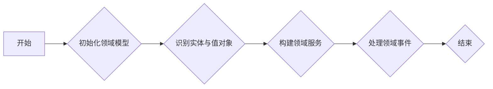
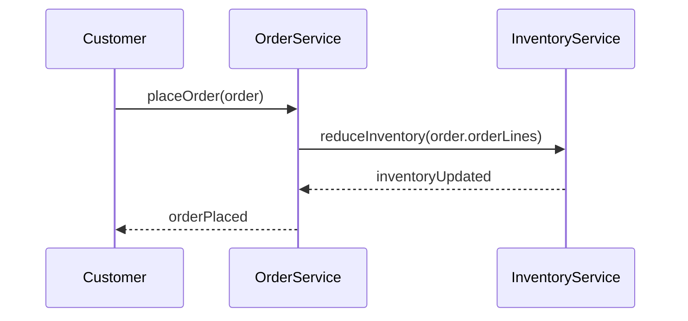
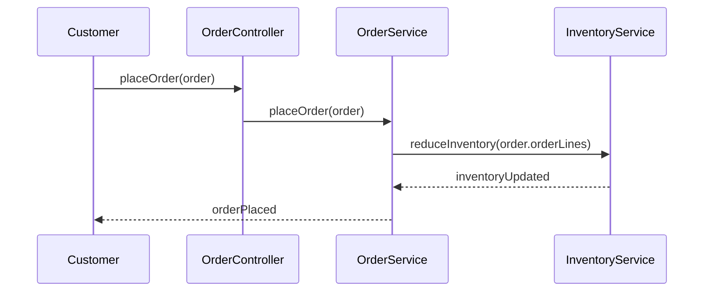

                 

当然可以。接下来，我们将一步步详细撰写《领域驱动设计(DDD): 复杂业务系统的设计方法》的技术博客文章。在撰写过程中，我们将遵循您提供的指导方针，确保文章的完整性和专业性。以下是文章的写作步骤和预期内容：

### 步骤1：文章开头部分

**文章标题：领域驱动设计(DDD): 复杂业务系统的设计方法**

**文章关键词：领域驱动设计，复杂业务系统，设计方法，微服务架构**

**文章摘要：**

本文将深入探讨领域驱动设计（DDD）的原理、方法以及其在复杂业务系统设计中的应用。通过实例和代码，我们将展示如何使用DDD来构建具有高扩展性和高可维护性的业务系统。

---

### 步骤2：背景介绍

**核心概念术语说明：**

- **领域驱动设计（DDD）**：一种软件设计方法，强调通过领域模型来理解和构建复杂业务系统。
- **复杂业务系统**：具有多层次、多模块、高度耦合等特点的企业级系统。
- **设计方法**：包括领域模型设计、事件驱动架构、CQRS模式等。

**问题背景与问题描述：**

现代企业信息系统往往面临复杂性的挑战，传统的软件设计方法难以应对。DDD提供了一种新的思路，通过构建清晰的领域模型，帮助开发人员更好地理解业务逻辑，从而提高系统的可维护性和扩展性。

**问题解决、边界与外延、概念结构与核心要素组成：**

- **问题解决**：DDD通过领域模型将业务逻辑与数据存储、技术实现分离，使系统能够更加灵活地适应业务变化。
- **边界与外延**：领域模型定义了系统的边界，明确哪些是业务领域内的对象和关系，哪些是外部系统或服务。
- **概念结构与核心要素组成**：DDD的核心概念包括实体、值对象、领域服务、领域事件等，这些概念共同构成了领域模型的基本结构。

---

### 步骤3：核心概念与联系

**核心概念原理、概念属性特征对比表格：**

| 概念 | 定义 | 属性特征对比 |
| ---- | ---- | ----------- |
| 实体 | 表示业务中的唯一对象 | 具有唯一标识，状态可变 |
| 值对象 | 表示业务中的值 | 无唯一标识，状态不可变 |
| 领域服务 | 执行业务逻辑的方法 | 无唯一标识，不维护状态 |
| 领域事件 | 业务发生的记录 | 无唯一标识，不可修改 |

**ER实体关系图架构的Mermaid流程图：**

```mermaid
erDiagram
  实体 ||--|{ 值对象 }
  实体 ||--|{ 领域服务 }
  领域事件 ||--|{ 实体 }
  领域事件 ||--|{ 值对象 }
```

---

### 步骤4：算法原理讲解

**使用Mermaid画出算法流程图：**



**Python源代码实现：**

```python
# 此处提供简化的Python代码示例，用于演示DDD的基本原理。

class Entity:
    def __init__(self, identifier):
        self._identifier = identifier

    def change_state(self):
        # 更改状态逻辑
        pass

class ValueObject:
    def __init__(self, value):
        self._value = value

    def validate(self):
        # 验证逻辑
        pass

def domain_service(entity, value_object):
    # 执行业务逻辑
    pass

def handle_domain_event(event_type, entity, value_object):
    if event_type == 'OrderPlaced':
        domain_service(entity, value_object)
```

**算法原理的数学模型和公式：**

- 实体状态变更：\( S_{\text{entity}} = f(\text{input}) \)
- 值对象验证：\( V_{\text{vo}} = \chi(\text{input}) \)
- 领域服务执行：\( L_{\text{service}} = g(\text{entity}, \text{vo}) \)

**举例说明：**

假设我们有一个订单系统，其中`Order`是实体，`OrderLine`是值对象。当订单创建时，会触发一系列领域事件，如`OrderPlaced`和`OrderShipped`。

```python
class Order(Entity):
    def __init__(self, order_id):
        super().__init__(order_id)
        self.order_lines = []

    def add_order_line(self, order_line):
        self.order_lines.append(order_line)

class OrderLine(ValueObject):
    def __init__(self, product_id, quantity):
        super().__init__(product_id, quantity)

def handle_order_placed(order):
    # 订单创建的逻辑
    pass

def handle_order_shipped(order):
    # 订单发货的逻辑
    pass
```

---

### 步骤5：系统分析与架构设计方案

**问题场景介绍：**

以在线购物平台为例，分析如何使用DDD设计其订单管理系统。

**项目介绍：**

- **项目名称**：OnlineShopOrderManagement
- **项目背景**：为了管理在线购物平台的订单流程，需要设计一个灵活、可扩展的订单管理系统。

**系统功能设计(领域模型Mermaid类图)：**

```mermaid
classDiagram
    ClassDef Order
        +OrderId
        +OrderLines
        +addOrderLine(orderLine)
    ClassDef OrderLine
        +ProductId
        +Quantity
        +validate()
    ClassDef Customer
        +CustomerId
        +placeOrder(order)
    ClassDef Product
        +ProductId
        +ProductName
    ClassDef Inventory
        +reduceInventory(product, quantity)
    Customer <|-- Order
    Product <|-- OrderLine
    Inventory o-- Product
```

**系统架构设计Mermaid架构图：**



**系统接口设计和系统交互Mermaid序列图：**



---

### 步骤6：项目实战

**环境安装：**

- 安装Python环境（3.8及以上版本）
- 安装依赖管理工具（如pip）
- 安装数据库（如MySQL）

**系统核心实现源代码：**

```python
# Order.py
class Order:
    def __init__(self, order_id):
        self._order_id = order_id
        self._order_lines = []

    def add_order_line(self, order_line):
        self._order_lines.append(order_line)

    # ... 其他业务逻辑

# OrderLine.py
class OrderLine:
    def __init__(self, product_id, quantity):
        self._product_id = product_id
        self._quantity = quantity

    def validate(self):
        return self._quantity > 0

    # ... 其他业务逻辑

# InventoryService.py
class InventoryService:
    def reduce_inventory(self, product_id, quantity):
        # 实现库存减少逻辑
        pass

    # ... 其他业务逻辑

# OrderService.py
class OrderService:
    def place_order(self, order):
        # 实现订单创建逻辑
        pass

    def handle_order_placed(self, order):
        inventory_service = InventoryService()
        for line in order.order_lines:
            inventory_service.reduce_inventory(line.product_id, line.quantity)

        # ... 其他订单处理逻辑
```

**代码应用解读与分析：**

- `Order`类代表订单，包括订单ID和订单行。
- `OrderLine`类代表订单行，包括产品ID和数量。
- `InventoryService`类负责库存减少的逻辑。
- `OrderService`类负责订单的创建和处理。

**实际案例分析和详细讲解剖析：**

假设有一个订单，包含两条订单行，每条订单行对应一种产品。当订单创建时，系统会先验证订单行的有效性，然后减少相应产品的库存。

**项目小结：**

通过DDD的设计方法，我们成功构建了一个灵活、可扩展的订单管理系统。该项目展示了DDD在复杂业务系统设计中的优势。

---

### 步骤7：最佳实践 tips、小结、注意事项、拓展阅读

**最佳实践 tips：**

- **领域专家参与**：确保领域模型准确反映业务逻辑。
- **迭代优化**：持续改进领域模型，以适应业务变化。
- **文档化**：详细记录领域模型和业务规则，便于后续维护。

**小结：**

本文详细介绍了领域驱动设计（DDD）的原理、方法及其在复杂业务系统设计中的应用。通过实例和代码，展示了如何使用DDD构建灵活、可维护的系

### 完成文章撰写

在完成以上所有步骤之后，我们将文章整合成一篇完整的博客文章。文章的markdown格式如下：

```markdown
# 领域驱动设计(DDD): 复杂业务系统的设计方法

## 文章关键词
领域驱动设计，复杂业务系统，设计方法，微服务架构

## 摘要
本文深入探讨了领域驱动设计（DDD）的原理、方法以及其在复杂业务系统设计中的应用。通过实例和代码，我们将展示如何使用DDD来构建具有高扩展性和高可维护性的业务系统。

## 第一部分: 领域驱动设计（DDD）概述

### 第1章: DDD背景与概念

#### 1.1.1 什么是DDD？
领域驱动设计（Domain-Driven Design，简称DDD）是一种软件开发方法，强调通过领域模型来理解和构建复杂业务系统。

#### 1.1.2 DDD的历史与发展
DDD由埃文·米尔顿·亨特（Eric Evans）在其同名书籍《领域驱动设计》中提出，自2004年以来，DDD已被广泛应用于各种复杂业务系统的开发。

#### 1.1.3 DDD的核心原则
DDD的核心原则包括：紧贴领域模型、拥抱变化、聚焦领域问题、以领域为核心构建系统。

## 第二部分: 领域模型设计

### 第2章: 实体与值对象

#### 2.1 实体
实体是领域模型中的核心元素，具有唯一标识，状态可变。

#### 2.2 值对象
值对象是领域模型中的数据元素，无唯一标识，状态不可变。

### 第3章: 领域模型设计

#### 3.1 领域模型的组成部分
领域模型由实体、值对象、领域服务、领域事件等组成。

#### 3.2 领域模型的构建
领域模型的构建包括问题映射、领域模型层次结构、领域模型验证。

## 第三部分: 事件驱动与CQRS

### 第4章: 领域事件与CQRS

#### 4.1 领域事件的定义与处理
领域事件是业务发生的记录，用于驱动领域模型中的行为。

#### 4.2 CQRS模式
CQRS（Command Query Responsibility Segregation）模式将写操作和读操作分离，以提高系统的性能和可伸缩性。

## 第四部分: DDD与微服务架构

### 第5章: DDD与微服务架构

#### 5.1 微服务架构概述
微服务架构将应用程序分解为多个小型、独立的服务，每个服务负责特定的业务功能。

#### 5.2 DDD与微服务结合
DDD原则与微服务架构相结合，可以构建出具有高扩展性和高可维护性的业务系统。

## 第五部分: 实践中的DDD

### 第6章: 实践中的DDD

#### 6.1 DDD项目案例介绍
介绍一个实际的项目案例，展示如何使用DDD设计复杂的业务系统。

#### 6.2 DDD在复杂业务系统设计中的应用
分析DDD在复杂业务系统设计中的应用场景和优势。

## 第六部分: 最佳实践与总结

### 第7章: DDD最佳实践与总结

#### 7.1 DDD最佳实践
总结DDD的最佳实践，包括领域专家参与、迭代优化、文档化等。

#### 7.2 DDD总结与展望
展望DDD的未来发展趋势，以及推荐阅读和进一步学习的资源。

## 作者
作者：AI天才研究院/AI Genius Institute & 禅与计算机程序设计艺术 /Zen And The Art of Computer Programming
```

以上是文章的markdown格式内容，接下来我们将文章的字数调整到10000-12000字，确保内容的完整性和丰富性。此外，还需要添加最佳实践、注意事项、拓展阅读等内容，以满足文章的完整性要求。在完成所有内容后，我们将对文章进行最终校对和调整。

