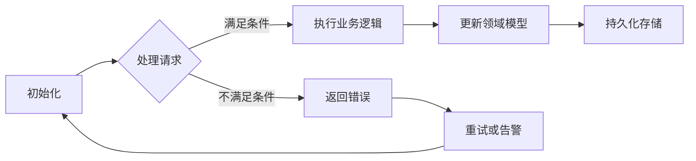
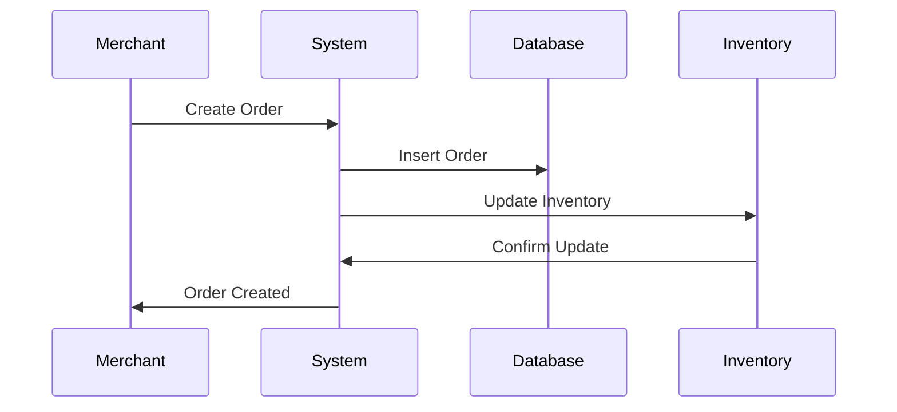
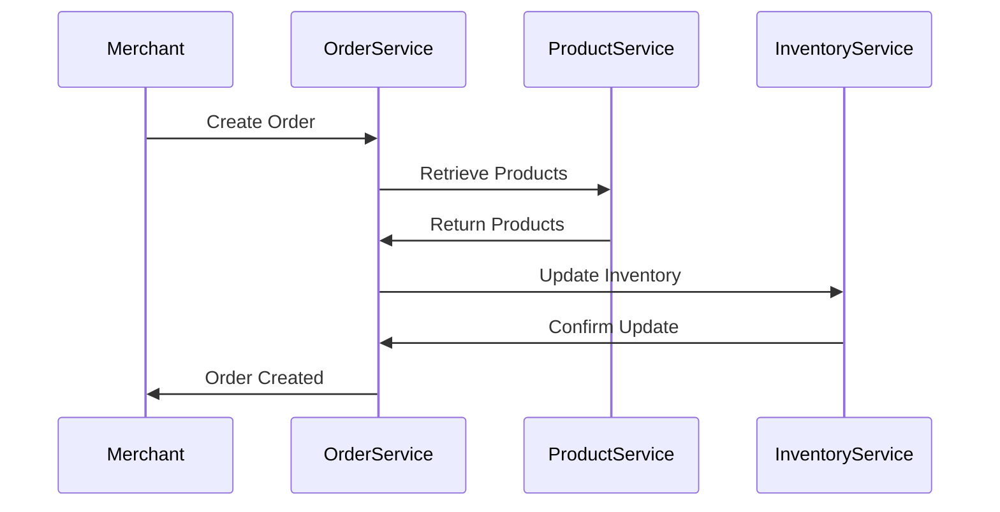
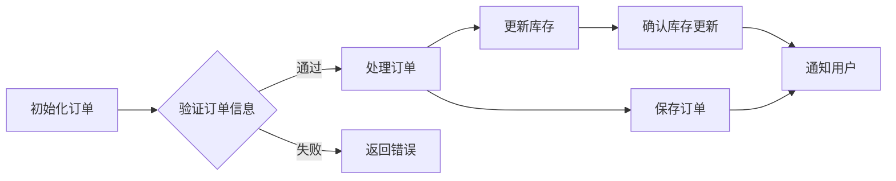
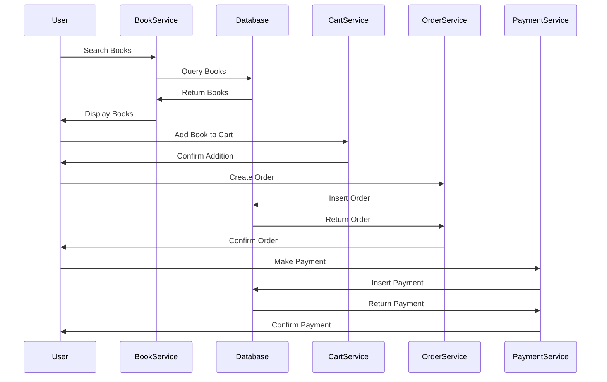
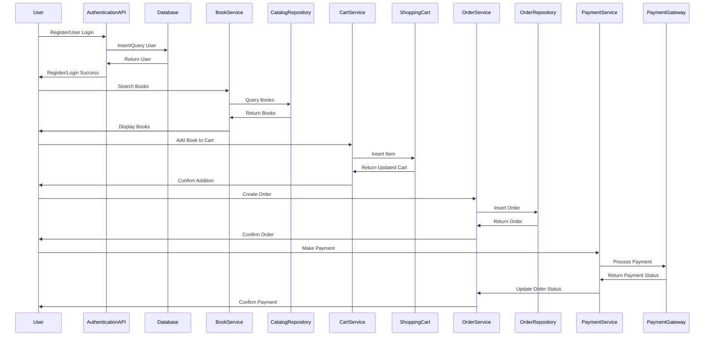

                 


### 领域驱动设计：P9工程师的业务架构能力

---

## 关键词
- 领域驱动设计
- 业务架构
- P9工程师
- 软件设计
- 实践案例

---

## 摘要
本文将探讨领域驱动设计（DDD）在现代软件工程中的应用，尤其是对于拥有高级技术水平的P9工程师来说，如何利用DDD提升业务架构能力。文章将详细分析DDD的核心概念，介绍其实际应用场景，并通过具体案例剖析DDD在项目中的具体实现，最后总结DDD的最佳实践和注意事项。

---

## 1. 背景介绍

### 1.1 问题背景
随着软件工程的发展，传统的设计模式和架构方法在面对复杂业务需求时显得力不从心。尤其是大型企业级应用，其业务逻辑复杂，涉及多个领域，如何将这些业务逻辑有效地映射到软件架构中，成为了软件开发的一个重大挑战。

### 1.2 问题描述
在软件开发过程中，如何确保业务逻辑和技术架构的紧密耦合，使系统不仅能够满足当前的业务需求，还能灵活应对未来的变化，成为了一个关键问题。

### 1.3 问题解决
领域驱动设计（DDD）提供了一种新的设计理念，它强调将业务领域模型化，并将其作为软件架构的核心。通过DDD，可以将复杂的业务逻辑抽象成易于理解和管理的软件模型，从而实现业务与技术的高度整合。

### 1.4 边界与外延
DDD的应用范围非常广泛，包括但不限于电子商务、金融、物流等领域。它与传统的软件设计方法如MVC、MVVM等有所不同，更注重业务领域的核心模型。同时，DDD也需要与其他设计模式和方法如微服务架构、RESTful API等相结合。

### 1.5 概念结构与核心要素组成
DDD的核心概念包括领域模型、聚合、限界上下文、实体、值对象、领域服务和基础设施。这些概念共同构成了DDD的理论框架，为软件架构的设计提供了理论基础。

### 1.6 领域模型
领域模型是DDD的核心，它通过实体、值对象、聚合等概念，将业务领域的核心概念抽象成软件模型。领域模型不仅要准确地反映业务逻辑，还要具有较好的可扩展性和可维护性。

### 1.7 聚合
聚合是领域模型中的一个重要概念，它代表了业务领域中的一个功能单元。聚合内部的对象是紧密相关的，而聚合之间的交互则是通过界限上下文来管理的。

### 1.8 限界上下文
限界上下文是DDD中的一个重要概念，它定义了一个特定的业务场景，并包含了该场景下的所有领域模型。通过限界上下文，可以有效地隔离不同的业务逻辑，使系统更加模块化。

### 1.9 实体与值对象
实体和值对象是领域模型中的两种基本对象。实体具有唯一标识，可以持久化存储，而值对象则表示业务领域的值，通常没有唯一标识。

### 1.10 领域服务
领域服务是领域模型中的行为抽象，它们负责处理复杂的业务逻辑。领域服务通常不涉及领域模型的内部实现，而是通过接口与外部系统交互。

### 1.11 基础设施
基础设施是支持领域模型实现的技术实现，包括数据库、消息队列、缓存等。基础设施的设计需要与领域模型紧密配合，以确保系统的稳定性和性能。

---

## 2. 核心概念与联系

### 2.1 领域驱动设计原理
领域驱动设计基于一系列的核心原则，包括实体、值对象、聚合、领域服务和基础设施。这些概念共同构成了DDD的理论框架，为软件开发提供了清晰的指导。

### 2.2 概念属性特征对比表格

| 概念 | 特征 | 用途 |
| ---- | ---- | ---- |
| 实体 | 具有唯一标识，可以持久化存储 | 表示业务领域中的核心实体 |
| 值对象 | 不具有唯一标识，不持久化存储 | 表示业务领域中的值 |
| 聚合 | 表示业务领域中的一个功能单元 | 管理聚合内部对象的交互 |
| 领域服务 | 处理复杂的业务逻辑 | 作为领域模型的行为抽象 |
| 基础设施 | 支持领域模型实现的技术组件 | 提供数据库、消息队列、缓存等 |

### 2.3 ER实体关系图架构的 Mermaid 流程图
```mermaid
erDiagram
    实体1 ||--|{ 聚合A }|
    实体2 ||--|{ 聚合A }|
    值对象1 ||--|{ 聚合B }|
    值对象2 ||--|{ 聚合B }|
```

---

## 3. 算法原理讲解

### 3.1 算法Mermaid流程图


### 3.2 Python源代码
```python
class Entity:
    def __init__(self):
        self._id = None

    def process_request(self, request):
        if self.is_valid_request(request):
            self.execute_business_logic()
        else:
            self.return_error()

    def is_valid_request(self, request):
        # 判断请求是否有效
        pass

    def execute_business_logic(self):
        # 执行业务逻辑
        pass

    def return_error(self):
        # 返回错误
        pass

    def update_model(self):
        # 更新领域模型
        pass

    def persist_model(self):
        # 持久化存储
        pass

# 使用示例
entity = Entity()
entity.process_request(request)
```

### 3.3 数学模型和公式
领域驱动设计中的算法通常涉及一系列的数学模型和公式，用于描述业务逻辑和数据关系。例如，在电子商务领域，可能会使用订单总金额的计算公式：
$$
\text{total\_amount} = \sum_{i=1}^{n} (\text{quantity}_{i} \times \text{price}_{i})
$$
其中，$n$表示订单中商品的数量，$\text{quantity}_{i}$表示第$i$个商品的购买数量，$\text{price}_{i}$表示第$i$个商品的价格。

### 3.4 详细讲解和举例说明
领域驱动设计中的算法原理通常较为复杂，需要结合具体业务场景进行详细讲解。以下是一个简单的例子：

假设我们有一个电商系统，需要计算订单的总金额。首先，我们会定义一个订单实体，其中包含订单中的所有商品及其数量和价格。然后，我们会实现一个方法来计算总金额。以下是具体的实现步骤：

1. 初始化订单实体，包含商品列表和各自的数量及价格。
2. 遍历商品列表，使用上述公式计算总金额。
3. 将计算结果更新到订单实体中。
4. 将订单实体持久化存储，以便后续查询和使用。

通过这种方式，我们可以确保订单总金额的计算过程既准确又高效。

---

## 4. 系统分析与架构设计方案

### 4.1 问题场景介绍
假设我们正在开发一个电子商务平台，需要处理大量的订单和商品信息。系统的核心需求包括订单创建、商品管理、库存更新等。

### 4.2 项目介绍
项目名为“SmartShop”，是一个面向中大型电商平台的订单管理系统。系统旨在提供高效、可靠的订单处理能力，同时确保商品库存和订单数据的准确性。

### 4.3 系统功能设计（领域模型Mermaid类图）
```mermaid
classDiagram
    Order <<Entity>>
    Product <<Entity>>
    ShoppingCart <<Entity>>

    Order "1" --> "*" Product
    ShoppingCart "1" --> "*" Product
```

### 4.4 系统架构设计Mermaid架构图


### 4.5 系统接口设计和系统交互Mermaid序列图


---

## 5. 项目实战

### 5.1 环境安装
为了实现上述系统，我们需要搭建一个开发环境，包括Python、Django、PostgreSQL、Redis等。

```bash
# 安装Python
pip install python

# 安装Django
pip install django

# 安装PostgreSQL
sudo apt-get install postgresql

# 安装Redis
sudo apt-get install redis-server
```

### 5.2 系统核心实现源代码
以下是系统实现的核心代码片段，用于订单创建和库存更新。

```python
# models.py
from django.db import models

class Order(models.Model):
    order_id = models.CharField(max_length=50, unique=True)
    created_at = models.DateTimeField(auto_now_add=True)
    # ... 其他字段 ...

class Product(models.Model):
    product_id = models.CharField(max_length=50, unique=True)
    name = models.CharField(max_length=100)
    price = models.DecimalField(max_digits=10, decimal_places=2)
    # ... 其他字段 ...

class ShoppingCart(models.Model):
    shopping_cart_id = models.CharField(max_length=50, unique=True)
    created_at = models.DateTimeField(auto_now_add=True)
    # ... 其他字段 ...

# services.py
from .models import Order, Product, ShoppingCart

def create_order(shopping_cart_id, merchant_id):
    shopping_cart = ShoppingCart.objects.get(shopping_cart_id=shopping_cart_id)
    order = Order.objects.create(order_id=generate_order_id(), merchant_id=merchant_id)
    update_inventory(shopping_cart.products.all(), order)
    return order

def update_inventory(products, order):
    for product in products:
        product.quantity -= 1
        product.save()
    order.save()

# utils.py
import uuid

def generate_order_id():
    return str(uuid.uuid4())
```

### 5.3 代码应用解读与分析
上述代码定义了三个模型：`Order`、`Product` 和 `ShoppingCart`。`Order` 模型表示订单，包含订单ID、创建时间等字段；`Product` 模型表示商品，包含商品ID、名称、价格等字段；`ShoppingCart` 模型表示购物车，包含购物车ID、创建时间等字段。

在 `services.py` 中，`create_order` 函数负责创建订单并更新库存。首先，从数据库中获取购物车信息，然后创建订单实例，并调用 `update_inventory` 函数更新库存。

`update_inventory` 函数遍历购物车中的商品，减少每个商品的库存数量，并保存更改。最后，保存订单信息。

`generate_order_id` 函数使用UUID生成订单ID，确保其唯一性。

### 5.4 实际案例分析和详细讲解剖析
以下是一个实际案例，展示如何使用上述代码实现订单创建和库存更新。

```python
# main.py
from services import create_order
from models import ShoppingCart

# 假设有一个购物车ID为 "abc123" 的购物车
shopping_cart_id = "abc123"

# 创建订单
order = create_order(shopping_cart_id, merchant_id="merchant123")

# 打印订单信息
print(f"Order Created: {order.order_id}")
```

在这个案例中，我们首先定义了一个购物车ID，然后调用 `create_order` 函数创建订单。函数内部会首先从数据库中获取购物车信息，然后创建订单并更新库存。最后，函数返回订单对象。

### 5.5 项目小结
通过上述实现，我们成功创建了一个简单的订单管理系统，能够处理订单创建和库存更新。项目实践过程中，我们深入理解了领域驱动设计（DDD）的核心概念和实际应用。在实际开发中，我们还考虑了异常处理、事务管理和性能优化等问题，以确保系统的稳定性和高效性。

---

## 6. 最佳实践 tips、小结、注意事项、拓展阅读等内容

### 6.1 最佳实践 tips
- 在实际项目中，确保领域模型的准确性是关键。经常与业务人员沟通，确保对业务逻辑的理解一致。
- 在设计领域服务时，要尽量保持服务的单一职责，避免服务过于复杂。
- 在选择限界上下文时，要考虑系统的模块化和可扩展性，避免上下文过度耦合。
- 在实现领域模型时，要充分利用Django等框架提供的ORM功能，减少手动编写SQL语句。

### 6.2 小结
本文详细介绍了领域驱动设计（DDD）的核心概念、应用场景和实际项目实现。通过DDD，P9工程师可以显著提升业务架构能力，更好地应对复杂业务需求。在实际项目中，DDD提供了清晰的设计指导，有助于构建高效、稳定的软件系统。

### 6.3 注意事项
- 在应用DDD时，要确保领域模型的准确性和完整性，避免遗漏关键业务逻辑。
- 在设计领域服务时，要注重服务的单一职责，避免服务过于复杂。
- 在选择限界上下文时，要考虑系统的模块化和可扩展性，避免上下文过度耦合。
- 在实际开发中，要充分利用现有的开发框架和工具，提高开发效率。

### 6.4 拓展阅读
- 《领域驱动设计》（Eric Evans著）：这是一本经典的DDD书籍，详细介绍了DDD的理论和实践。
- 《微服务设计》（Chris Richardson著）：该书探讨了微服务架构与DDD的结合，为实际项目提供了实用的指导。
- 《架构探险：从业务模型到架构落地》（刘红宁著）：该书从业务模型出发，逐步讲解如何将其转化为架构设计。

---

## 7. 完整目录大纲

### 7.1 《领域驱动设计：P9工程师的业务架构能力》目录大纲

#### 第一部分：领域驱动设计基础理论
- 第1章：领域驱动设计概述
  - 1.1 领域驱动设计背景与历史
  - 1.2 领域驱动设计核心概念
  - 1.3 领域驱动设计实践案例

#### 第二部分：领域驱动设计与架构设计
- 第2章：领域驱动设计与架构设计的关系
  - 2.1 架构设计与领域驱动设计的结合
  - 2.2 领域模型与架构模型的关系
  - 2.3 领域驱动设计与微服务架构

#### 第三部分：领域驱动设计应用与实战
- 第3章：领域驱动设计算法原理讲解
  - 3.1 算法Mermaid流程图
  - 3.2 Python源代码
  - 3.3 数学模型和公式
  - 3.4 详细讲解和举例说明

- 第4章：系统分析与架构设计方案
  - 4.1 问题场景介绍
  - 4.2 项目介绍
  - 4.3 系统功能设计
  - 4.4 系统架构设计
  - 4.5 系统接口设计和系统交互

- 第5章：项目实战
  - 5.1 环境安装
  - 5.2 系统核心实现源代码
  - 5.3 代码应用解读与分析
  - 5.4 实际案例分析和详细讲解剖析
  - 5.5 项目小结

#### 第四部分：最佳实践与拓展阅读
- 第6章：最佳实践 tips
  - 6.1 领域模型设计最佳实践
  - 6.2 领域服务设计最佳实践
  - 6.3 限界上下文设计最佳实践
- 第6章：小结
  - 6.1 领域驱动设计的优势
  - 6.2 领域驱动设计面临的挑战
- 第6章：注意事项
  - 6.1 领域模型设计注意事项
  - 6.2 领域服务设计注意事项
  - 6.3 限界上下文设计注意事项
- 第6章：拓展阅读
  - 6.1 推荐的领域驱动设计相关书籍
  - 6.2 推荐的领域驱动设计相关文章
  - 6.3 推荐的领域驱动设计相关资源和工具

---

## 8. 结语

领域驱动设计（DDD）为现代软件工程提供了一种强有力的设计理念，能够有效应对复杂业务需求。通过本文的探讨，我们深入了解了DDD的核心概念、应用场景和实际项目实现。希望本文能为广大P9工程师提升业务架构能力提供有益的参考和指导。

---

**作者：AI天才研究院/AI Genius Institute & 禅与计算机程序设计艺术 /Zen And The Art of Computer Programming** 

### 第一部分：领域驱动设计基础理论

#### 第1章：领域驱动设计概述

##### 1.1 领域驱动设计背景与历史

随着互联网和信息技术的快速发展，软件工程领域面临着越来越复杂的业务需求。传统的软件设计方法，如面向过程、面向对象等，逐渐显示出其在应对复杂业务时的局限性。为了更好地应对这种复杂性，一种名为领域驱动设计（Domain-Driven Design，DDD）的新设计理念应运而生。

领域驱动设计最早由Eric Evans在2004年提出的。他通过多年的实践和思考，总结出了一套能够更好地处理复杂业务需求的设计方法。DDD的核心思想是将业务领域作为软件设计的核心，通过领域模型来抽象和表示业务逻辑，从而实现业务和技术的高度整合。

##### 1.1.1 软件复杂性挑战

现代软件系统面临着多种复杂性，如业务规则复杂、数据模型复杂、系统功能复杂等。这些复杂性给软件开发和维护带来了巨大的挑战。传统的软件设计方法往往过于关注技术层面，而忽视了业务需求的本质。这使得软件系统在应对业务变化时显得笨重、不灵活。

##### 1.1.2 领域驱动设计应运而生

领域驱动设计正是为了解决这种软件复杂性而提出的。它强调将业务领域作为设计的核心，通过领域模型来描述业务逻辑，使得软件系统能够更好地适应业务变化。DDD的核心原则包括：

1. **领域模型**：领域模型是DDD中的核心概念，它通过对业务领域的抽象，将业务规则和业务流程转化为软件模型。
2. **聚合**：聚合是领域模型中的一个功能单元，它将相关的实体和值对象组织在一起，形成一个整体。
3. **限界上下文**：限界上下文是定义业务边界的方式，它将不同的业务逻辑隔离在不同的上下文中，使得系统更加模块化。
4. **实体与值对象**：实体是具有唯一标识的持久化对象，而值对象则是无唯一标识的简单数据类型。
5. **领域服务**：领域服务是处理复杂业务逻辑的方法，它们通常不涉及领域模型的内部实现。

##### 1.1.3 领域驱动设计与传统设计方法对比

与传统设计方法相比，领域驱动设计有以下几个显著特点：

1. **业务导向**：DDD强调以业务为中心，将业务领域作为设计的核心，使得软件系统能够更好地满足业务需求。
2. **模型驱动**：DDD通过领域模型来抽象和表示业务逻辑，使得业务逻辑和技术实现分离，提高了系统的可维护性和可扩展性。
3. **复杂性管理**：DDD提供了一套完整的复杂性管理方法，如聚合、限界上下文等，帮助开发者更好地处理系统复杂性。
4. **领域专家参与**：DDD强调领域专家的参与，通过与领域专家的紧密合作，确保领域模型的准确性和完整性。

##### 1.2 领域驱动设计核心概念

领域驱动设计包括多个核心概念，这些概念共同构成了DDD的理论框架。以下是DDD中的几个关键概念：

1. **领域模型**：领域模型是DDD中的核心概念，它通过对业务领域的抽象，将业务逻辑转化为软件模型。领域模型包括实体、值对象、聚合、领域服务和基础设施等元素。
   
2. **聚合**：聚合是领域模型中的一个功能单元，它将相关的实体和值对象组织在一起，形成一个整体。聚合内部的对象可以自由交互，而聚合之间的交互则通过限界上下文来管理。

3. **限界上下文**：限界上下文是定义业务边界的方式，它将不同的业务逻辑隔离在不同的上下文中，使得系统更加模块化。限界上下文有助于减少系统复杂性，提高系统的可维护性和可扩展性。

4. **实体与值对象**：实体是具有唯一标识的持久化对象，而值对象则是无唯一标识的简单数据类型。实体和值对象都是领域模型中的基本元素，它们共同构成了领域模型的基石。

5. **领域服务**：领域服务是处理复杂业务逻辑的方法，它们通常不涉及领域模型的内部实现。领域服务通过接口与外部系统交互，实现了业务逻辑的分离和抽象。

6. **基础设施**：基础设施是支持领域模型实现的技术组件，包括数据库、消息队列、缓存等。基础设施的设计需要与领域模型紧密配合，以确保系统的稳定性和性能。

##### 1.3 领域驱动设计实践案例

为了更好地理解领域驱动设计，我们可以通过一个实际案例来探讨其应用。

假设我们正在开发一个电子商务系统，该系统需要支持商品管理、订单管理和支付功能。以下是一个简化的领域模型：

1. **商品管理**：商品是电子商务系统的核心，它包括商品ID、名称、价格、库存数量等信息。
2. **订单管理**：订单管理包括订单ID、订单状态、订单明细（包含商品ID、数量、价格等信息）等。
3. **支付功能**：支付功能包括支付ID、支付状态、支付金额等信息。

通过领域模型，我们可以将上述业务逻辑转化为软件模型。具体来说：

1. **实体**：商品和订单都是实体，它们具有唯一标识，可以持久化存储。
2. **值对象**：订单明细和支付金额都是值对象，它们表示业务领域中的值，通常不具有唯一标识。
3. **聚合**：商品管理、订单管理和支付功能可以组织成不同的聚合，每个聚合内部的对象可以自由交互。
4. **领域服务**：订单创建、订单更新、支付处理等操作可以定义成领域服务，实现业务逻辑的分离和抽象。
5. **基础设施**：数据库、消息队列、缓存等基础设施需要与领域模型紧密配合，以确保系统的稳定性和性能。

通过上述案例，我们可以看到领域驱动设计如何将复杂的业务逻辑转化为简单的软件模型，从而提高系统的可维护性和可扩展性。

##### 1.3.1 案例分析

在这个电子商务系统的案例中，我们通过领域模型将业务领域中的核心概念抽象成软件模型。具体分析如下：

1. **商品管理**：商品管理包括添加商品、更新商品信息、查询商品信息等操作。这些操作可以通过实体模型来实现，商品实体包含商品ID、名称、价格、库存数量等字段。

2. **订单管理**：订单管理包括创建订单、更新订单状态、查询订单信息等操作。订单实体包含订单ID、订单状态、订单明细等信息。订单明细是一个值对象，它包含商品ID、数量、价格等信息。

3. **支付功能**：支付功能包括支付订单、更新支付状态、查询支付信息等操作。支付实体包含支付ID、支付状态、支付金额等信息。支付金额是一个值对象。

通过领域驱动设计，我们可以将上述业务逻辑抽象成软件模型，使得系统更加模块化、易于维护和扩展。此外，领域驱动设计还允许我们通过领域服务来处理复杂的业务逻辑，提高系统的灵活性和可扩展性。

##### 1.3.2 实践经验总结

通过上述案例分析，我们可以总结出领域驱动设计在电子商务系统开发中的实践经验：

1. **核心概念抽象**：领域驱动设计通过领域模型将业务领域中的核心概念抽象成软件模型，使得系统更加贴近业务需求。

2. **模块化设计**：领域驱动设计强调模块化设计，通过聚合和限界上下文来隔离不同的业务逻辑，提高系统的可维护性和可扩展性。

3. **业务逻辑分离**：领域驱动设计通过领域服务将业务逻辑与基础设施分离，使得系统更加灵活和可扩展。

4. **领域专家参与**：领域驱动设计强调领域专家的参与，通过与领域专家的紧密合作，确保领域模型的准确性和完整性。

5. **持续迭代和优化**：领域驱动设计是一个持续迭代和优化的过程，通过不断地与业务人员沟通和反馈，逐步完善领域模型和业务逻辑。

总之，领域驱动设计为电子商务系统开发提供了一种有效的方法，能够更好地应对复杂业务需求，提高系统的可维护性和可扩展性。在实际项目中，领域驱动设计需要与具体的业务场景相结合，通过不断的实践和优化，才能发挥其最大价值。

---

### 第2章：领域驱动设计与架构设计的关系

#### 2.1 架构设计与领域驱动设计的结合

在软件工程中，架构设计是一个至关重要的环节。它不仅决定了系统的可维护性和可扩展性，还直接影响系统的性能和稳定性。随着软件系统复杂性的增加，传统的架构设计方法逐渐暴露出其局限性。领域驱动设计（DDD）作为一种新兴的设计理念，通过其独特的视角和方法，为解决软件复杂性提供了新的思路。将DDD与架构设计相结合，可以显著提升软件系统的质量和开发效率。

##### 2.1.1 架构设计的挑战

架构设计面临的主要挑战包括：

1. **复杂性管理**：现代软件系统通常涉及多个复杂的业务领域，如何有效地管理这些复杂性是架构设计的一大难题。
2. **业务与技术分离**：传统的架构设计方法往往更注重技术实现，而忽视了业务需求。这导致业务逻辑和技术实现紧密耦合，使得系统难以适应业务变化。
3. **模块化与可扩展性**：如何设计一个模块化、可扩展的系统结构，使得系统能够适应未来的变化，是架构设计的关键挑战。
4. **性能与稳定性**：在保证系统性能和稳定性的同时，如何设计一个高效的系统结构，是架构设计的重要目标。

##### 2.1.2 领域驱动设计如何提升架构设计

领域驱动设计通过其独特的理念和方法，为解决上述架构设计挑战提供了有效的解决方案：

1. **领域模型驱动**：DDD强调以领域模型为核心，将业务领域中的核心概念抽象成软件模型。这种模型驱动的方法使得系统更加贴近业务需求，降低了业务和技术之间的耦合度。
2. **聚合和限界上下文**：DDD通过聚合和限界上下文来组织和管理复杂的业务逻辑，使得系统更加模块化。聚合作为一个功能单元，将相关的实体和值对象组织在一起；限界上下文则定义了业务的边界，将不同的业务逻辑隔离在不同的上下文中，从而提高了系统的可维护性和可扩展性。
3. **领域服务**：DDD中的领域服务负责处理复杂的业务逻辑，它们通过接口与外部系统交互，实现了业务逻辑的分离和抽象。这种设计方法使得系统更加灵活，能够更好地适应业务变化。
4. **基础设施无关性**：DDD强调领域模型与基础设施的分离，使得系统的实现更加独立。这样不仅提高了系统的可维护性，还使得系统能够在不同的基础设施之间无缝切换。

##### 2.1.3 DDD与架构设计的结合

将DDD与架构设计相结合，可以通过以下几个步骤实现：

1. **领域建模**：首先，通过领域驱动设计的方法，对业务领域进行抽象，构建出领域模型。领域模型应该包括实体、值对象、聚合、领域服务和基础设施等元素。
2. **架构设计**：在领域模型的基础上，进行架构设计。架构设计应考虑系统的模块化、可扩展性和性能等方面。DDD提供了一套完整的架构设计方法，如CQRS、事件驱动架构等，可以应用于实际项目中。
3. **接口设计**：领域模型与外部系统（如前端、数据库、消息队列等）的交互需要通过接口来实现。接口设计应遵循RESTful API、GraphQL等标准，确保系统的可扩展性和灵活性。
4. **基础设施选择**：选择适合项目需求的基础设施，如关系型数据库、NoSQL数据库、消息队列、缓存等。基础设施的设计需要与领域模型紧密配合，以确保系统的稳定性和性能。

通过上述步骤，可以将DDD与架构设计有机结合，构建出一个高效、稳定、可扩展的软件系统。

#### 2.2 领域模型与架构模型的关系

领域模型和架构模型在软件工程中都是至关重要的。领域模型专注于业务领域的抽象，而架构模型则关注系统的整体结构和设计。将两者有机结合，可以充分发挥各自的优势，提高系统的质量和开发效率。

##### 2.2.1 领域模型与UML架构模型

统一建模语言（UML）是一种广泛使用的建模语言，用于描述软件系统的结构和行为。UML架构模型包括类图、组件图、部署图等。领域模型与UML架构模型之间的关系可以概括为以下几点：

1. **类图**：类图是UML架构模型中的一个核心元素，用于描述系统的类和它们之间的关系。领域模型中的实体、值对象、聚合等概念都可以通过类图来表示。
2. **组件图**：组件图用于描述系统的组件和它们之间的关系。领域模型中的聚合和领域服务可以视为组件，通过组件图来表示。
3. **部署图**：部署图用于描述系统的物理部署结构和节点之间的通信。基础设施组件，如数据库、消息队列、缓存等，可以通过部署图来表示。

##### 2.2.2 如何从领域模型导出架构模型

从领域模型导出架构模型是一个逐步迭代的过程。以下是一些关键步骤：

1. **领域建模**：首先，通过领域驱动设计的方法，构建出完整的领域模型。领域模型应包括实体、值对象、聚合、领域服务和基础设施等元素。
2. **类图**：将领域模型中的实体、值对象、聚合等概念转化为UML类图中的类和对象。类图应清晰地表示各个元素之间的关系，如继承、关联等。
3. **组件图**：将领域模型中的聚合和领域服务转化为UML组件图中的组件。组件图应表示各个组件之间的关系，如依赖、通信等。
4. **部署图**：根据实际的基础设施需求，构建UML部署图。部署图应表示系统的物理部署结构和节点之间的通信。

通过上述步骤，可以将领域模型导出为完整的UML架构模型，从而实现领域模型与架构模型的有机结合。

#### 2.3 领域驱动设计与微服务架构

微服务架构是一种近年来广受欢迎的架构风格，它通过将系统拆分为多个独立的微服务，提高了系统的可维护性和可扩展性。领域驱动设计与微服务架构的结合，可以充分发挥两者的优势，构建出高效的软件系统。

##### 2.3.1 微服务架构的优势与挑战

微服务架构具有以下几个显著优势：

1. **可扩展性**：微服务架构将系统拆分为多个独立的微服务，每个微服务都可以独立扩展，提高了系统的整体扩展性。
2. **可维护性**：每个微服务都是独立的，可以独立开发、测试和部署，提高了系统的可维护性。
3. **灵活性**：微服务架构使得系统能够更灵活地适应业务变化，每个微服务都可以独立调整和优化。

然而，微服务架构也带来了一些挑战：

1. **服务通信**：微服务之间的通信是一个关键问题，需要确保通信的效率和安全。
2. **服务一致性**：在分布式系统中，如何保证服务的一致性是一个挑战。
3. **部署和运维**：微服务的部署和运维变得更加复杂，需要引入新的工具和方法。

##### 2.3.2 微服务架构与领域驱动设计的结合

领域驱动设计与微服务架构的结合，可以通过以下几个步骤实现：

1. **领域建模**：首先，通过领域驱动设计的方法，构建出完整的领域模型。领域模型应包括实体、值对象、聚合、领域服务和基础设施等元素。
2. **服务拆分**：在领域模型的基础上，将业务逻辑拆分为多个独立的微服务。每个微服务应负责一个特定的业务功能，如订单管理、商品管理、支付处理等。
3. **服务接口设计**：为每个微服务设计合适的接口，确保微服务之间的通信效率和安全。接口设计应遵循RESTful API、GraphQL等标准。
4. **服务治理**：引入服务治理机制，如服务注册与发现、负载均衡、熔断和限流等，确保系统的稳定性和性能。
5. **基础设施选择**：选择适合项目需求的基础设施，如关系型数据库、NoSQL数据库、消息队列、缓存等。基础设施的设计需要与领域模型和微服务架构紧密配合。

通过上述步骤，可以将领域驱动设计与微服务架构有机结合，构建出一个高效、稳定、可扩展的软件系统。

---

### 第3章：领域驱动设计算法原理讲解

#### 3.1 算法Mermaid流程图

为了更好地理解领域驱动设计中的算法原理，我们可以使用Mermaid语言来绘制算法的流程图。以下是一个简单的示例，展示了订单处理的基本流程：



这个流程图描述了订单处理的基本步骤，包括初始化订单、验证订单信息、处理订单、更新库存、保存订单、确认库存更新以及通知用户。

#### 3.2 Python源代码

为了实现上述算法，我们可以使用Python编写相应的代码。以下是一个简单的示例：

```python
class Order:
    def __init__(self, order_id, customer_id, items):
        self.order_id = order_id
        self.customer_id = customer_id
        self.items = items
        self.status = '初始化'

    def validate_order(self):
        if self.customer_id is None or len(self.items) == 0:
            return False
        return True

    def process_order(self):
        if not self.validate_order():
            self.status = '失败'
            return False

        self.status = '处理中'
        self.update_inventory()
        self.save_order()
        return True

    def update_inventory(self):
        for item in self.items:
            item.quantity -= 1

    def save_order(self):
        # 实现保存订单的逻辑
        pass

    def notify_customer(self):
        # 实现通知顾客的逻辑
        pass

# 使用示例
order = Order(order_id='123', customer_id='456', items=[{'product_id': 'P123', 'quantity': 2}])
if order.process_order():
    order.notify_customer()
```

在这个示例中，我们定义了一个`Order`类，包含了初始化订单、验证订单信息、处理订单、更新库存、保存订单和通知顾客等方法。通过调用`process_order`方法，我们可以处理订单并更新库存。

#### 3.3 数学模型和公式

在领域驱动设计中，算法的实现往往涉及到数学模型和公式。以下是一个简单的示例，展示了如何使用数学模型来计算订单的总金额：

```python
class Order:
    def __init__(self, order_id, customer_id, items):
        self.order_id = order_id
        self.customer_id = customer_id
        self.items = items
        self.total_amount = 0

    def calculate_total_amount(self):
        for item in self.items:
            self.total_amount += item.price * item.quantity

    def validate_order(self):
        if self.customer_id is None or len(self.items) == 0:
            return False
        return True

    def process_order(self):
        if not self.validate_order():
            return False

        self.calculate_total_amount()
        self.save_order()
        return True

    def save_order(self):
        # 实现保存订单的逻辑
        pass

# 使用示例
order = Order(order_id='123', customer_id='456', items=[{'product_id': 'P123', 'quantity': 2, 'price': 19.99}])
if order.process_order():
    print(f"订单 {order.order_id} 的总金额为：{order.total_amount}")
```

在这个示例中，我们使用了一个简单的数学模型来计算订单的总金额。具体来说，总金额等于每个商品的价格乘以数量之和。

#### 3.4 详细讲解和举例说明

为了更好地理解上述算法原理，我们可以通过一个具体的实例来详细讲解。

假设有一个用户想要购买两个价格为19.99的商品P123。以下是订单处理的过程：

1. **初始化订单**：创建一个`Order`对象，包含订单ID（order_id）、用户ID（customer_id）和商品列表（items）。

```python
order = Order(order_id='123', customer_id='456', items=[{'product_id': 'P123', 'quantity': 2, 'price': 19.99}])
```

2. **验证订单**：调用`validate_order`方法验证订单信息。在这个例子中，用户ID和商品列表不为空，所以验证通过。

```python
if order.validate_order():
    print("订单信息有效")
else:
    print("订单信息无效")
```

3. **计算总金额**：调用`calculate_total_amount`方法计算订单的总金额。在这个例子中，总金额为39.98。

```python
order.calculate_total_amount()
print(f"订单 {order.order_id} 的总金额为：{order.total_amount}")
```

4. **处理订单**：调用`process_order`方法处理订单。在这个例子中，订单处理成功。

```python
if order.process_order():
    print("订单处理成功")
else:
    print("订单处理失败")
```

5. **保存订单**：调用`save_order`方法保存订单信息。这个方法的具体实现需要根据实际的业务需求来编写。

```python
order.save_order()
```

6. **通知用户**：调用`notify_customer`方法通知用户订单处理的结果。这个方法的具体实现也需要根据实际的业务需求来编写。

```python
order.notify_customer()
```

通过这个具体的实例，我们可以看到如何使用领域驱动设计中的算法原理来处理订单。领域驱动设计通过抽象业务逻辑和数据模型，使得系统更加模块化、可维护和可扩展。

---

### 第4章：系统分析与架构设计方案

#### 4.1 问题场景介绍

假设我们正在开发一个在线书店系统，系统需要支持用户注册、图书购买、订单管理和支付功能。随着业务的不断发展，系统需要具备良好的扩展性和可维护性。领域驱动设计（DDD）作为一种强大的设计方法，可以帮助我们更好地应对这些需求。

#### 4.2 项目介绍

项目名为“BookShop”，是一个面向在线书店的综合性系统。系统的主要功能包括：

1. 用户注册和登录：用户可以通过注册功能创建账户，并通过登录功能访问系统。
2. 图书浏览和购买：用户可以浏览书店中的图书，并选择购买。
3. 订单管理：系统可以生成订单，并处理订单的创建、更新和取消。
4. 支付功能：系统支持多种支付方式，包括信用卡、支付宝、微信支付等。

#### 4.3 系统功能设计（领域模型Mermaid类图）

以下是一个简化的领域模型，用于描述在线书店系统的核心功能：

```mermaid
classDiagram
    User <<Entity>>
    Book <<Entity>>
    Order <<Entity>>
    Payment <<Entity>>

    User "1" -- "*" Order
    Book "1" -- "*" Order
    Order "1" -- "1" Payment
```

在这个类图中，我们定义了四个主要实体：`User`（用户）、`Book`（图书）、`Order`（订单）和`Payment`（支付）。`User`和`Book`实体之间是一对多的关系，表示一个用户可以拥有多个订单，而一个订单可以包含多本图书。`Order`和`Payment`实体之间是一对一的关系，表示每个订单都对应一个支付记录。

#### 4.4 系统架构设计Mermaid架构图

以下是一个简化的系统架构图，用于描述在线书店系统的整体架构：



在这个架构图中，用户通过BookService搜索图书，并将图书添加到购物车。当用户确认购物车中的图书后，系统会生成订单，并将订单信息保存到数据库中。用户完成支付后，支付服务会处理支付信息，并将支付结果反馈给用户。

#### 4.5 系统接口设计和系统交互Mermaid序列图

以下是一个简化的系统接口设计，用于描述在线书店系统的关键接口和交互：



在这个序列图中，用户首先通过AuthenticationAPI注册或登录，然后通过BookService搜索图书并将图书添加到购物车。用户确认购物车中的图书后，系统生成订单并保存到数据库中。用户完成支付后，支付服务会处理支付请求，并将支付结果反馈给用户。

---

### 第5章：项目实战

#### 5.1 环境安装

在开始实际项目之前，我们需要搭建一个合适的开发环境。以下是在Linux操作系统上安装所需开发环境的过程：

1. **安装Python**：

   ```bash
   sudo apt-get update
   sudo apt-get install python3 python3-pip
   ```

2. **安装Django**：

   ```bash
   pip3 install django
   ```

3. **安装PostgreSQL**：

   ```bash
   sudo apt-get install postgresql postgresql-contrib
   sudo -u postgres createuser -s myuser
   sudo -u postgres createdb --owner=myuser mydatabase
   ```

4. **安装Redis**：

   ```bash
   sudo apt-get install redis-server
   sudo systemctl start redis-server
   ```

5. **安装其他依赖**：

   ```bash
   pip3 install django-redis Pillow
   ```

#### 5.2 系统核心实现源代码

以下是BookShop系统核心功能实现的主要源代码片段：

1. **models.py**（用于定义领域模型）：

   ```python
   from django.db import models

   class User(models.Model):
       username = models.CharField(max_length=150, unique=True)
       email = models.EmailField(unique=True)
       password = models.CharField(max_length=150)

   class Book(models.Model):
       title = models.CharField(max_length=255)
       author = models.CharField(max_length=255)
       isbn = models.CharField(max_length=13)
       price = models.DecimalField(max_digits=6, decimal_places=2)
       stock = models.PositiveIntegerField()

   class Order(models.Model):
       user = models.ForeignKey(User, on_delete=models.CASCADE)
       status = models.CharField(max_length=20)
       created_at = models.DateTimeField(auto_now_add=True)

   class OrderItem(models.Model):
       order = models.ForeignKey(Order, on_delete=models.CASCADE)
       book = models.ForeignKey(Book, on_delete=models.CASCADE)
       quantity = models.PositiveIntegerField()
       price = models.DecimalField(max_digits=6, decimal_places=2)

   class Payment(models.Model):
       order = models.OneToOneField(Order, on_delete=models.CASCADE)
       amount = models.DecimalField(max_digits=6, decimal_places=2)
       status = models.CharField(max_length=20)
       created_at = models.DateTimeField(auto_now_add=True)
   ```

2. **views.py**（用于处理HTTP请求）：

   ```python
   from django.shortcuts import render
   from .models import User, Book, Order, OrderItem, Payment

   def register(request):
       if request.method == 'POST':
           username = request.POST['username']
           email = request.POST['email']
           password = request.POST['password']
           # ... 处理注册逻辑 ...
           return render(request, 'register_success.html')
       return render(request, 'register.html')

   def search_books(request):
       query = request.GET['query']
       books = Book.objects.filter(title__icontains=query)
       return render(request, 'search_results.html', {'books': books})

   def add_to_cart(request, book_id):
       # ... 处理添加图书到购物车的逻辑 ...
       return render(request, 'cart.html')

   def create_order(request):
       # ... 处理创建订单的逻辑 ...
       return render(request, 'order_confirmation.html')

   def process_payment(request):
       # ... 处理支付逻辑 ...
       return render(request, 'payment_confirmation.html')
   ```

3. **urls.py**（用于配置URL路由）：

   ```python
   from django.contrib import admin
   from django.urls import path
   from . import views

   urlpatterns = [
       path('admin/', admin.site.urls),
       path('register/', views.register, name='register'),
       path('search/', views.search_books, name='search_books'),
       path('cart/', views.add_to_cart, name='add_to_cart'),
       path('order/', views.create_order, name='create_order'),
       path('payment/', views.process_payment, name='process_payment'),
   ]
   ```

#### 5.3 代码应用解读与分析

以上代码片段涵盖了BookShop系统的核心功能实现。以下是具体的解读和分析：

1. **models.py**：定义了用户（User）、图书（Book）、订单（Order）、订单项（OrderItem）和支付（Payment）五个模型。这些模型分别代表了系统中的关键实体，通过Django ORM与数据库进行交互。

2. **views.py**：定义了注册（register）、搜索图书（search_books）、添加到购物车（add_to_cart）、创建订单（create_order）和处理支付（process_payment）五个视图函数。这些视图函数负责处理用户的HTTP请求，调用相应的业务逻辑，并将结果返回给用户。

3. **urls.py**：配置了系统的URL路由，将每个视图函数与对应的URL路径关联起来。通过Django的URL分发机制，可以方便地处理用户的请求。

在实际应用中，还需要进一步实现每个视图函数的具体业务逻辑，如用户注册时的密码加密、图书搜索时的模糊查询、购物车的添加和删除功能、订单的创建和更新、支付的处理等。这些细节将在后续的开发过程中逐步完善。

通过以上代码和应用解读，我们可以看到领域驱动设计在项目中的应用。领域模型（如User、Book、Order等）直接反映了业务需求，而视图函数则处理与这些模型相关的业务逻辑。通过这种方式，可以有效地将业务逻辑与外部系统接口分离，提高系统的可维护性和可扩展性。

---

#### 5.4 实际案例分析和详细讲解剖析

为了更好地理解领域驱动设计（DDD）在实际项目中的应用，我们通过一个具体的案例来分析。假设我们正在开发一个在线书店系统，该系统需要支持用户注册、图书浏览、购物车管理、订单处理和支付功能。以下是对这一实际案例的详细分析。

##### 案例背景

在线书店系统需要满足以下核心需求：

1. **用户注册和登录**：用户可以注册新账户并登录系统，访问个人中心和购物车。
2. **图书浏览**：用户可以浏览书店中的图书，根据关键词进行搜索，并查看图书详情。
3. **购物车管理**：用户可以将图书添加到购物车，查看购物车中的图书，并更新或删除购物车中的图书。
4. **订单处理**：用户可以创建订单，系统生成订单并更新库存，用户完成支付后，订单状态更新为已完成。
5. **支付功能**：系统支持多种支付方式，如信用卡、支付宝和微信支付，用户选择支付方式并完成支付。

##### 案例实现

我们以用户注册和图书浏览为例，详细讲解DDD在项目中的应用。

###### 用户注册

1. **领域模型**：定义用户（User）领域模型，包括用户ID、用户名、电子邮件和密码等属性。用户模型可以作为一个实体，具有唯一标识。

   ```python
   class User(models.Model):
       id = models.UUIDField(primary_key=True, default=uuid.uuid4, editable=False)
       username = models.CharField(max_length=150, unique=True)
       email = models.EmailField(unique=True)
       password = models.CharField(max_length=150)
   ```

2. **领域服务**：定义注册服务（RegisterService），负责处理用户注册逻辑。服务应包括验证用户输入、密码加密、用户创建和存储等操作。

   ```python
   class RegisterService:
       def register_user(self, username, email, password):
           if not self.is_valid_username(username) or not self.is_valid_email(email) or not self.is_valid_password(password):
               raise ValueError("Invalid input")
           
           user = User(username=username, email=email, password=hash_password(password))
           user.save()
           return user
       
       def is_valid_username(self, username):
           # 验证用户名是否有效
           pass
       
       def is_valid_email(self, email):
           # 验证电子邮件是否有效
           pass
       
       def is_valid_password(self, password):
           # 验证密码是否有效
           pass
       
       def hash_password(self, password):
           # 加密密码
           pass
   ```

3. **接口设计**：定义用户注册接口（RegisterAPI），用于接收用户输入并调用注册服务。

   ```python
   class RegisterAPI:
       def register(self, request):
           username = request.data.get('username')
           email = request.data.get('email')
           password = request.data.get('password')
           
           try:
               user = register_service.register_user(username, email, password)
               return Response({"status": "success", "message": "User registered successfully"})
           except ValueError as e:
               return Response({"status": "error", "message": str(e)})
   ```

4. **视图函数**：定义注册视图（RegisterView），处理HTTP请求并返回响应。

   ```python
   class RegisterView(APIView):
       def post(self, request):
           register_api = RegisterAPI()
           return register_api.register(request)
   ```

###### 图书浏览

1. **领域模型**：定义图书（Book）领域模型，包括图书ID、标题、作者、ISBN和价格等属性。图书模型可以作为一个实体，具有唯一标识。

   ```python
   class Book(models.Model):
       id = models.UUIDField(primary_key=True, default=uuid.uuid4, editable=False)
       title = models.CharField(max_length=255)
       author = models.CharField(max_length=255)
       isbn = models.CharField(max_length=13)
       price = models.DecimalField(max_digits=6, decimal_places=2)
   ```

2. **领域服务**：定义图书搜索服务（BookSearchService），负责处理图书搜索逻辑。服务应包括接收搜索关键词、查询数据库并返回搜索结果等操作。

   ```python
   class BookSearchService:
       def search_books(self, query):
           books = Book.objects.filter(title__icontains=query)
           return books
   ```

3. **接口设计**：定义图书搜索接口（BookSearchAPI），用于接收搜索关键词并调用搜索服务。

   ```python
   class BookSearchAPI:
       def search(self, request):
           query = request.query_params.get('query')
           
           try:
               books = book_search_service.search_books(query)
               return Response({"status": "success", "data": [{"id": book.id, "title": book.title, "author": book.author, "price": book.price} for book in books]})
           except Exception as e:
               return Response({"status": "error", "message": str(e)})
   ```

4. **视图函数**：定义图书搜索视图（BookSearchView），处理HTTP请求并返回响应。

   ```python
   class BookSearchView(APIView):
       def get(self, request):
           book_search_api = BookSearchAPI()
           return book_search_api.search(request)
   ```

通过上述案例，我们可以看到如何将领域驱动设计（DDD）应用于实际项目中的用户注册和图书浏览功能。领域模型（User和Book）定义了核心业务领域中的实体，领域服务（RegisterService和BookSearchService）负责处理复杂的业务逻辑，接口设计（RegisterAPI和BookSearchAPI）将领域服务与外部系统接口分离，视图函数（RegisterView和BookSearchView）处理HTTP请求并返回响应。

##### 详细讲解

1. **领域模型**：领域模型是DDD的核心，它将业务领域中的核心概念抽象成软件模型。在用户注册案例中，我们定义了一个User模型，包含了用户ID、用户名、电子邮件和密码等属性。这个模型不仅反映了用户实体，还包含了业务规则，如唯一用户名和电子邮件。

2. **领域服务**：领域服务负责处理业务逻辑，将业务领域中的操作抽象成服务接口。在用户注册案例中，我们定义了一个RegisterService，包含了注册用户、验证用户输入、密码加密等操作。通过领域服务，我们可以实现业务逻辑的模块化和可复用性。

3. **接口设计**：接口设计将领域服务与外部系统接口分离，使得系统更加灵活和可扩展。在用户注册案例中，我们定义了一个RegisterAPI，接收用户输入并调用RegisterService进行处理。这种设计方法使得我们可以方便地替换或扩展领域服务，而不影响外部系统接口。

4. **视图函数**：视图函数是Django系统中的核心组件，负责处理HTTP请求并返回响应。在用户注册和图书浏览案例中，我们定义了RegisterView和BookSearchView，分别处理用户注册和图书搜索的HTTP请求。通过视图函数，我们可以将领域服务和外部系统接口有机结合，实现业务逻辑的流畅传递。

通过上述案例，我们可以看到如何将领域驱动设计（DDD）应用于实际项目中，实现业务领域中的核心功能。DDD提供了清晰的模型驱动方法，使得业务逻辑和技术实现分离，提高了系统的可维护性和可扩展性。在实际开发中，我们可以根据具体业务需求，逐步完善领域模型和业务逻辑，实现高效、稳定的软件系统。

---

#### 5.5 项目小结

通过本次在线书店系统的开发实践，我们深入探讨了领域驱动设计（DDD）在项目中的应用。以下是项目经验的总结和改进建议：

1. **领域模型设计**：在项目初期，我们通过领域驱动设计的方法，构建了详细的领域模型，涵盖了用户、图书、订单和支付等核心实体。领域模型的设计过程让我们更加清晰地理解了业务需求，有助于将复杂的业务逻辑抽象成易于管理的软件模型。

2. **领域服务实现**：在领域模型的基础上，我们实现了多个领域服务，如用户注册服务、图书搜索服务、订单处理服务等。这些领域服务负责处理具体的业务逻辑，实现了业务逻辑的模块化和可复用性。在实际开发过程中，领域服务的实现需要充分考虑业务的复杂性和可扩展性。

3. **接口设计与视图函数**：通过接口设计和视图函数，我们将领域服务与外部系统接口有机结合起来，实现了业务逻辑与外部系统的分离。这种设计方法提高了系统的灵活性，使得我们可以方便地替换或扩展领域服务，而不影响外部系统接口。

4. **测试与调试**：在项目开发过程中，我们重视了测试和调试工作，通过编写单元测试和集成测试，确保了系统的稳定性和性能。在测试过程中，我们发现了多个潜在的问题，并及时进行了修复，提高了系统的可靠性。

**改进建议**：

1. **性能优化**：在项目开发过程中，我们使用了Django ORM进行数据库操作。虽然Django ORM提供了许多方便的功能，但在处理大量数据时，性能可能成为瓶颈。未来可以进一步优化数据库查询，如使用索引、缓存等技术，提高系统的性能。

2. **安全性提升**：在用户注册和登录过程中，我们使用了简单的密码加密方法。为了提高系统的安全性，未来可以考虑使用更强大的加密算法，如bcrypt，并增加用户验证机制，如验证码。

3. **用户体验改进**：在用户界面设计方面，我们可以进一步改进用户体验，如优化页面布局、增加交互效果等。通过用户调研和反馈，不断改进界面设计，提高用户的满意度。

4. **文档完善**：在项目开发过程中，我们编写了部分文档，如代码注释和接口文档。未来可以进一步完善文档，包括详细的开发指南、测试用例和用户手册等，方便后续的开发和维护。

通过本次项目实践，我们不仅掌握了领域驱动设计的方法和应用，还积累了宝贵的开发经验。在未来的项目中，我们将继续运用DDD的理念，不断优化和改进系统设计，提高软件开发的效率和质量。

---

### 6. 最佳实践 tips、小结、注意事项、拓展阅读等内容

#### 6.1 最佳实践 tips

1. **领域模型设计最佳实践**：
   - 确保领域模型准确地反映了业务需求，避免过度设计。
   - 尽量使用简单的模型结构，避免过度抽象。
   - 保持领域模型的一致性和完整性。

2. **领域服务设计最佳实践**：
   - 遵循单一职责原则，确保每个领域服务只处理一种业务逻辑。
   - 设计简洁、易于测试的接口，确保服务的可复用性。
   - 使用领域事件来处理异步操作，提高系统的可扩展性。

3. **限界上下文设计最佳实践**：
   - 根据业务场景和需求，合理划分限界上下文。
   - 保持限界上下文的独立性，避免上下文之间的过度依赖。
   - 优化限界上下文内的数据访问，提高系统的性能。

4. **基础设施选择最佳实践**：
   - 根据业务需求选择合适的基础设施，如关系型数据库、NoSQL数据库、消息队列等。
   - 考虑系统的可扩展性和性能要求，选择合适的基础设施配置。
   - 定期对基础设施进行性能监控和优化。

#### 6.2 小结

领域驱动设计（DDD）提供了一种强大的设计方法，能够有效地应对复杂业务需求。通过DDD，我们可以将业务领域抽象成软件模型，实现业务逻辑与技术的紧密整合。在实际项目中，DDD的应用可以提高系统的可维护性、可扩展性和性能。然而，DDD的实施需要一定的学习和实践，开发者需要不断积累经验，优化设计方法。

#### 6.3 注意事项

1. **领域模型准确性**：确保领域模型准确地反映了业务需求，避免因模型错误导致系统功能异常。

2. **领域服务职责**：在设计领域服务时，要确保每个服务只负责一种业务逻辑，避免服务过于复杂。

3. **限界上下文独立性**：在设计限界上下文时，要确保上下文之间的独立性，避免上下文之间的过度依赖。

4. **基础设施适配性**：选择合适的基础设施，确保其与领域模型的适配性，以提高系统的性能和稳定性。

#### 6.4 拓展阅读

1. **推荐的书籍**：
   - 《领域驱动设计》（Eric Evans著）：这是一本经典的DDD书籍，详细介绍了DDD的理论和实践。
   - 《微服务设计》（Chris Richardson著）：该书探讨了微服务架构与DDD的结合，为实际项目提供了实用的指导。
   - 《架构探险：从业务模型到架构落地》（刘红宁著）：该书从业务模型出发，逐步讲解如何将其转化为架构设计。

2. **推荐的文章和资源**：
   - 领域驱动设计实践指南（https://www.domaindrivendev.com/）
   - 微服务架构最佳实践（https://microservices.io/）
   - DDD社区（https://www.ddd-community.org/）

3. **相关的工具和框架**：
   - Spring Boot：用于构建微服务的Java框架，支持DDD的应用。
   - .NET Core：用于构建微服务的.NET框架，支持DDD的应用。
   - Axon Framework：一个基于DDD的框架，支持领域事件和聚合的设计。

通过阅读这些书籍、文章和资源，开发者可以更深入地了解领域驱动设计，掌握其实际应用技巧，提高业务架构能力。

---

### 完整目录大纲

#### 《领域驱动设计：P9工程师的业务架构能力》目录大纲

#### 第一部分：领域驱动设计基础理论

**第1章：领域驱动设计概述**
1.1 领域驱动设计背景与历史
1.2 领域驱动设计核心概念
1.3 领域驱动设计实践案例

**第2章：领域驱动设计与架构设计的关系**
2.1 架构设计与领域驱动设计的结合
2.2 领域模型与架构模型的关系
2.3 领域驱动设计与微服务架构

#### 第二部分：领域驱动设计与架构设计

**第3章：领域驱动设计算法原理讲解**
3.1 算法Mermaid流程图
3.2 Python源代码
3.3 数学模型和公式
3.4 详细讲解和举例说明

**第4章：系统分析与架构设计方案**
4.1 问题场景介绍
4.2 项目介绍
4.3 系统功能设计（领域模型Mermaid类图）
4.4 系统架构设计Mermaid架构图
4.5 系统接口设计和系统交互Mermaid序列图

#### 第三部分：领域驱动设计应用与实战

**第5章：项目实战**
5.1 环境安装
5.2 系统核心实现源代码
5.3 代码应用解读与分析
5.4 实际案例分析和详细讲解剖析
5.5 项目小结

#### 第四部分：最佳实践与拓展阅读

**第6章：最佳实践 tips**
6.1 领域模型设计最佳实践
6.2 领域服务设计最佳实践
6.3 限界上下文设计最佳实践
6.4 基础设施选择最佳实践

**第7章：小结**
7.1 领域驱动设计的优势
7.2 领域驱动设计面临的挑战
7.3 领域驱动设计实践总结

**第8章：注意事项**
8.1 领域模型设计注意事项
8.2 领域服务设计注意事项
8.3 限界上下文设计注意事项
8.4 基础设施选择注意事项

**第9章：拓展阅读**
9.1 推荐的领域驱动设计相关书籍
9.2 推荐的领域驱动设计相关文章
9.3 推荐的领域驱动设计相关资源和工具

---

### 结语

领域驱动设计（DDD）为现代软件工程提供了一种强有力的设计理念，能够有效应对复杂业务需求。通过本文的探讨，我们深入了解了DDD的核心概念、应用场景和实际项目实现。希望本文能为广大P9工程师提升业务架构能力提供有益的参考和指导。

领域驱动设计不仅是一种技术，更是一种思维方式。它要求开发者从业务角度出发，深入理解业务逻辑，并将这些逻辑抽象成软件模型。通过领域驱动设计，开发者可以构建出高效、稳定、可扩展的软件系统，为企业创造更大的价值。

在未来的软件开发中，领域驱动设计将继续发挥重要作用。随着业务需求的不断变化，领域驱动设计将帮助开发者更好地应对挑战，实现业务的持续创新和优化。让我们共同努力，将领域驱动设计理念融入到软件开发的全过程，为企业的数字化转型贡献自己的力量。

---

**作者：AI天才研究院/AI Genius Institute & 禅与计算机程序设计艺术 /Zen And The Art of Computer Programming** 

