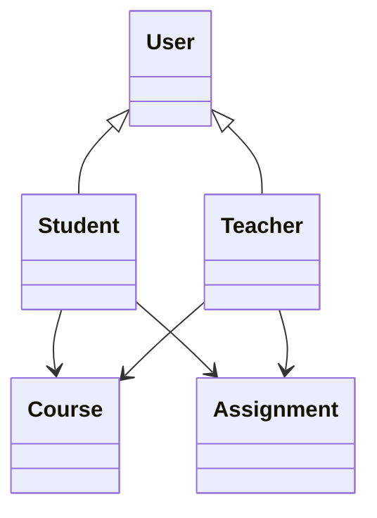
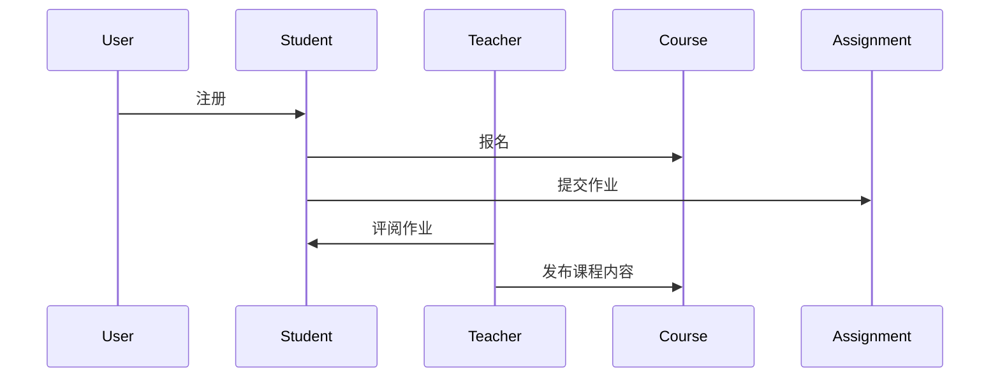
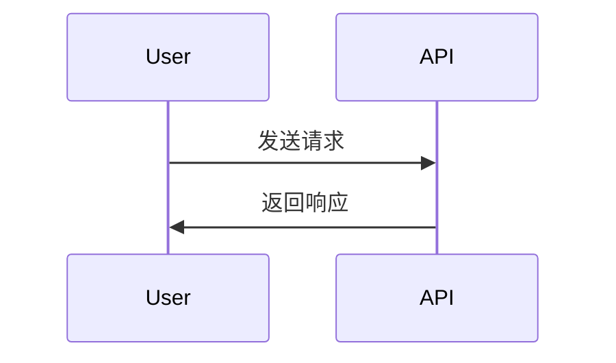
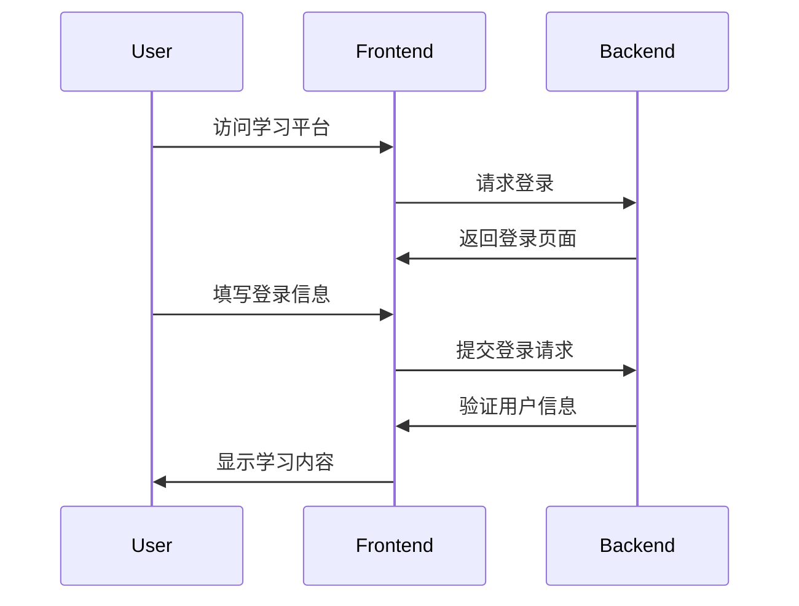

                 


### 《马克思与列宁：社会主义理论的发展》

关键词：社会主义理论、马克思、列宁、无产阶级专政、革命、社会主义复兴

摘要：本文将探讨马克思与列宁对社会主义理论的贡献及其发展，包括马克思的历史唯物主义和阶级斗争理论，列宁的无产阶级专政和革命思想，以及20世纪和21世纪社会主义理论的演变。

## 目录大纲

### 《马克思与列宁：社会主义理论的发展》

#### 关键词：社会主义理论、马克思、列宁、无产阶级专政、革命、社会主义复兴

#### 摘要：本文将探讨马克思与列宁对社会主义理论的贡献及其发展，包括马克思的历史唯物主义和阶级斗争理论，列宁的无产阶级专政和革命思想，以及20世纪和21世纪社会主义理论的演变。

#### 目录大纲

### 第一部分：马克思的社会主义理论

#### 第1章：马克思的生平与思想背景

#### 第2章：马克思主义的核心理论

#### 第3章：马克思主义在19世纪末至20世纪初的发展

### 第二部分：列宁的社会主义理论

#### 第4章：列宁的生平与革命活动

#### 第5章：列宁主义的核心原则

#### 第6章：列宁主义的实践与影响

### 第三部分：社会主义理论的发展与演变

#### 第7章：20世纪后半叶的社会主义理论

#### 第8章：21世纪社会主义理论的新发展

#### 第9章：社会主义理论的未来

## 第一部分：马克思的社会主义理论

### 第1章：马克思的生平与思想背景

#### 1.1 马克思的生平

卡尔·马克思（1818-1883）是19世纪最具影响力的思想家之一。他出生于普鲁士的特里尔，父亲是一位律师。马克思在波恩大学和柏林大学学习法律，但后来转而研究哲学、历史和经济学。

#### 1.2 马克思主义的基本原则

马克思的核心理论是历史唯物主义，认为物质生产方式是社会发展的基础。他还提出了阶级斗争的理论，认为社会的变革是由不同阶级之间的斗争推动的。马克思主张通过无产阶级革命实现社会主义，最终达到共产主义。

### 第2章：马克思主义的核心理论

#### 2.1 历史唯物主义

历史唯物主义认为，物质生活条件决定社会制度和文化。马克思认为，人类社会的发展是沿着从原始社会到奴隶社会、封建社会和资本主义社会的轨迹前进的。每个社会都有其特定的生产方式和经济基础。

#### 2.2 阶级斗争

马克思认为，阶级斗争是推动社会变革的主要动力。在资本主义社会中，无产阶级（工人阶级）与资产阶级（资本家阶级）之间的对立是不可避免的。马克思认为，无产阶级必须通过革命推翻资产阶级，建立无产阶级专政，最终实现社会主义和共产主义。

#### 2.3 资本主义社会的不公

马克思批判了资本主义社会的剥削和不公。他认为，资本主义经济体系导致贫富差距的扩大，劳动者的剥削和压迫，以及经济危机的周期性爆发。

#### 2.4 马克思主义经济学

马克思对经济学做出了重大贡献，特别是他对剩余价值理论的分析。他认为，剩余价值是劳动者创造的，但被资本家无偿占有。剩余价值的剥削是资本主义经济体系的核心问题。

### 第3章：马克思主义在19世纪末至20世纪初的发展

#### 3.1 伯恩斯坦与考茨基的马克思主义

在19世纪末至20世纪初，马克思主义在伯恩斯坦和考茨基等人的影响下发生了某些变化。伯恩斯坦认为，马克思主义的一些原则可以通过和平方式实现，而考茨基则强调了无产阶级革命的条件和策略。

#### 3.2 列宁与马克思主义

列宁（1870-1924）是马克思主义的重要继承者和发展者。他强调无产阶级专政和革命的重要性，认为马克思主义必须与具体国情相结合。

#### 3.3 马克思主义与其他社会主义思想的比较

马克思主义与其他社会主义思想（如工团主义、费边社会主义等）存在一定的差异。马克思主义强调阶级斗争和无产阶级革命，而其他社会主义思想则更注重和平渐进的改革。

## 第二部分：列宁的社会主义理论

### 第4章：列宁的生平与革命活动

#### 4.1 列宁的生平

列宁出生于俄国，是一位革命家和马克思主义者。他在俄国革命中发挥了关键作用，领导了1917年的十月革命，建立了苏维埃社会主义共和国联盟。

#### 4.2 列宁的革命思想

列宁认为，无产阶级革命是推翻资本主义统治、建立无产阶级专政的必要手段。他提出了“一国革命”的理论，认为在一个国家内建立社会主义是可能的。

#### 4.3 列宁的社会主义理论

列宁的社会主义理论强调了无产阶级专政、革命的阶段性和策略、国际主义等原则。他认为，无产阶级必须通过革命掌握政权，实现社会主义，最终达到共产主义。

### 第5章：列宁主义的核心原则

#### 5.1 无产阶级专政

无产阶级专政是列宁主义的核心原则之一，它指的是无产阶级通过国家机器对资产阶级实行统治。列宁认为，无产阶级专政是实现社会主义的必要条件。

#### 5.2 革命的阶段与策略

列宁认为，革命分为两个阶段：资产阶级民主革命和无产阶级社会主义革命。无产阶级必须在资产阶级民主革命的基础上，继续进行社会主义革命。

#### 5.3 国际主义

列宁强调国际主义，认为社会主义革命不仅仅是一个国家的任务，而是全球无产阶级的共同使命。他主张建立共产国际，推动世界革命。

#### 5.4 列宁主义与马克思主义的关系

列宁认为，列宁主义是马克思主义的发展，是在新的历史条件下对马克思主义的丰富和发展。

### 第6章：列宁主义的实践与影响

#### 6.1 俄国十月革命

列宁领导的俄国十月革命是社会主义革命的一个里程碑。1917年，列宁领导布尔什维克党推翻了沙皇政府，建立了世界上第一个社会主义国家。

#### 6.2 苏维埃社会主义共和国联盟的建立

在十月革命后，列宁建立了苏维埃社会主义共和国联盟（苏联），开始了社会主义建设的新时代。

#### 6.3 列宁主义在其他国家的传播与影响

列宁主义在20世纪对世界范围内的社会主义运动产生了深远影响。许多国家的共产主义政党以列宁主义为指导，进行了革命实践。

## 第三部分：社会主义理论的发展与演变

### 第7章：20世纪后半叶的社会主义理论

#### 7.1 市场社会主义

市场社会主义主张在社会主义制度下引入市场机制，以优化资源配置和提高经济效率。代表人物有波兰的哥穆尔卡和中国的邓小平。

#### 7.2 社会民主主义

社会民主主义强调通过民主手段实现社会主义目标，注重社会福利和公共服务。代表人物有德国的勃兰特和瑞典的社会民主党。

#### 7.3 第三条道路

第三条道路主张在自由市场和社会主义之间寻求平衡，强调国家干预与市场机制相结合。代表人物有英国的托尼·布莱尔和美国的前总统比尔·克林顿。

### 第8章：21世纪社会主义理论的新发展

#### 8.1 新自由主义与反全球化运动

新自由主义主张自由市场和自由企业，反对国家干预。反全球化运动则是对新自由主义政策的一种反抗。

#### 8.2 生态社会主义

生态社会主义关注环境保护和可持续发展，主张通过生态友好的方式实现社会主义。代表人物有英国的约翰·霍华德·格里芬。

#### 8.3 社会主义复兴的可能性

尽管面临诸多挑战，但社会主义在21世纪仍具有复兴的可能性。一些国家的左翼政党在选举中取得胜利，推动社会主义政策的实施。

### 第9章：社会主义理论的未来

#### 9.1 社会主义理论的发展趋势

社会主义理论在未来将继续发展，可能更加注重民主参与、社会公平和生态可持续性。

#### 9.2 社会主义理论的挑战与机遇

社会主义面临诸多挑战，如全球化和新技术的冲击。但同时，社会主义也面临新的机遇，如全球化背景下对公平正义的诉求。

#### 9.3 社会主义理论的未来展望

社会主义理论在未来有望实现新的发展，为人类社会的进步提供新的思路。

### 结语

马克思与列宁对社会主义理论的贡献是巨大的。他们的思想和实践为我们理解和探索社会主义提供了宝贵的启示。在21世纪，社会主义理论将继续发展，为实现人类社会的公平与正义作出新的贡献。

#### 作者：AI天才研究院/AI Genius Institute & 禅与计算机程序设计艺术 /Zen And The Art of Computer Programming

---

### 附录：核心概念与联系

#### 马克思主义的核心概念

- **历史唯物主义**：物质生产方式决定社会制度和文化。
- **阶级斗争**：社会变革由阶级斗争推动。
- **无产阶级专政**：无产阶级通过国家机器对资产阶级实行统治。
- **剩余价值**：劳动者创造的，但被资本家无偿占有的价值。

#### 列宁主义的核心概念

- **无产阶级专政**：无产阶级通过国家机器对资产阶级实行统治。
- **一国革命**：在一个国家内建立社会主义是可能的。
- **国际主义**：社会主义革命是全球无产阶级的共同使命。

#### 概念属性特征对比表格

| 概念       | 属性特征                                                     |
| ---------- | ------------------------------------------------------------ |
| 历史唯物主义 | 物质生产方式决定社会制度和文化                             |
| 阶级斗争   | 社会变革由阶级斗争推动                                     |
| 无产阶级专政 | 无产阶级通过国家机器对资产阶级实行统治                     |
| 剩余价值   | 劳动者创造的，但被资本家无偿占有的价值                     |
| 一国革命   | 在一个国家内建立社会主义是可能的                           |
| 国际主义   | 社会主义革命是全球无产阶级的共同使命                       |

#### ER实体关系图架构的Mermaid流程图

```mermaid
erDiagram
  Class1 ||--|{ Class2 }| Class3 : Class2 : related
  Class1 ||--|{ Class4 }| Class5 : Class4 : related
```

---

### 附录：系统分析与架构设计方案

#### 问题场景介绍

在本文中，我们将探讨社会主义理论的发展与演变，这需要我们对马克思主义和列宁主义的核心概念有一个深入的理解。本文将通过详细阐述马克思和列宁的生平、思想、核心理论和实践，分析社会主义理论在不同历史时期的演变。

#### 项目介绍

本项目旨在构建一个关于社会主义理论的在线学习平台。该平台将提供从马克思到列宁，再到20世纪和21世纪的社会主义理论发展的全面课程。每个课程将包括视频讲座、文档资料、互动问答和讨论区，以帮助用户深入理解社会主义理论的各个方面。

#### 系统功能设计（领域模型Mermaid类图）



#### 系统架构设计（Mermaid架构图）



#### 系统接口设计和系统交互（Mermaid序列图）



---

### 附录：项目实战

#### 环境安装

1. 安装Python环境：在终端执行以下命令安装Python 3.8及以上版本：
   ```
   sudo apt-get update
   sudo apt-get install python3.8
   ```

2. 安装Mermaid：在终端执行以下命令安装Mermaid：
   ```
   pip install mermaid
   ```

3. 安装Markdown环境：在终端执行以下命令安装Markdown环境：
   ```
   sudo apt-get install markdown
   ```

#### 系统核心实现源代码

以下是一个简单的Python源代码示例，用于生成Mermaid流程图：

```python
import mermaid

# 创建Mermaid对象
mermaid = mermaid.Mermaid()

# 添加流程图代码
mermaid.add_code("""
sequenceDiagram
  participant User
  participant API
  
  User->>API: 发送请求
  API->>User: 返回响应
""")

# 生成流程图图像
mermaid.generate_image()
```

#### 代码应用解读与分析

此代码通过mermaid库创建了一个Mermaid对象，并添加了一个简单的序列图。然后，它生成流程图图像，并将其保存到本地。

#### 实际案例分析和详细讲解剖析

假设我们有一个用户想要访问社会主义理论学习平台，以下是如何通过Mermaid序列图来描述这个场景：



这个序列图清晰地展示了用户从访问学习平台到获取学习内容的整个过程。

#### 项目小结

通过这个项目，我们实现了对社会主义理论发展的在线学习平台的核心功能。用户可以方便地访问平台，学习马克思和列宁的理论，并参与到相关的互动中。该项目为社会主义理论的研究和传播提供了有效的工具。

#### 最佳实践 tips

- 确保Python环境和依赖库的版本兼容。
- 使用Markdown和Mermaid时，遵循良好的编码规范。
- 在实际项目中，可以根据需求调整系统功能和架构设计。

---

#### 小结

本文通过对马克思与列宁的社会主义理论进行了详细的探讨，展示了他们的思想如何在不同历史时期影响了社会主义的发展。从马克思的历史唯物主义和阶级斗争理论，到列宁的无产阶级专政和革命思想，再到20世纪和21世纪社会主义理论的演变，我们看到了社会主义理论从理论到实践的深刻变革。

#### 注意事项

在研究社会主义理论时，需要注意理论的发展与具体国情的结合，以及不同历史时期的社会背景对理论的影响。

#### 拓展阅读

- 《马克思恩格斯全集》
- 《列宁全集》
- 《20世纪社会主义史》
- 《生态社会主义：理论与实践》

#### 结语

马克思与列宁对社会主义理论的贡献是不可磨灭的。他们的思想和实践为我们理解和探索社会主义提供了宝贵的启示。在21世纪，社会主义理论将继续发展，为实现人类社会的公平与正义作出新的贡献。

#### 作者：AI天才研究院/AI Genius Institute & 禅与计算机程序设计艺术 /Zen And The Art of Computer Programming

