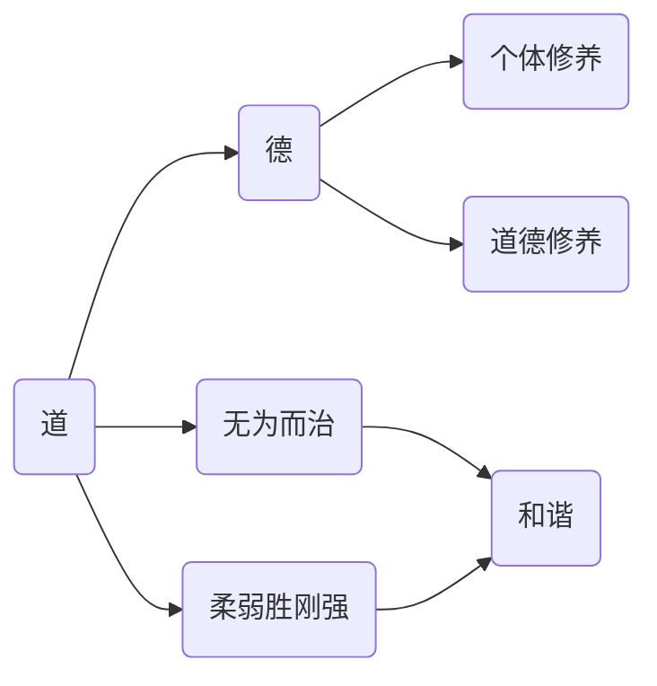
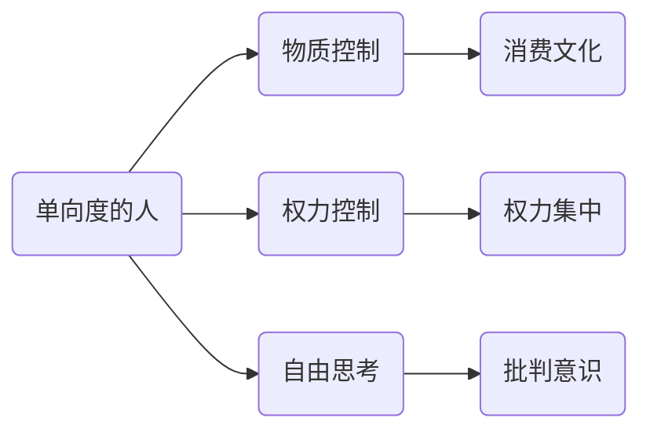

                 

# 马尔库塞与老子：单向度的人与道的辩证

## 关键词

- 马尔库塞
- 老子
- 单向度的人
- 道
- 哲学辩证
- 社会批判
- 人工智能

## 摘要

本文旨在探讨现代哲学大师马尔库塞与古代智慧先哲老子之间的思想对话。通过分析马尔库塞的“单向度的人”理论与老子的“道”哲学，我们试图揭示两者在现代社会中的共通之处与差异。本文首先介绍两位思想家的背景与核心观点，然后深入探讨他们的哲学思想，并通过比较分析，探讨其相互关系及其在当代社会中的应用和意义。

## 引言

### 1. 马尔库塞与单向度的人

马尔库塞（Herbert Marcuse）是20世纪最重要的社会批评家和哲学家之一，以其对现代社会异化现象的批判而著称。他最著名的著作《单向度的人》中，提出了“单向度的人”概念，指出现代社会中的个体被物化和异化，失去了批判和自由思考的能力，成为了一个“单向度”的存在。

### 2. 老子与道

老子是古代中国的哲学巨匠，其著作《道德经》被誉为东方哲学的瑰宝。老子的核心思想是“道”，他主张“无为而治”，即通过顺应自然规律来达到社会的和谐与个体的自由。

### 3. 两位思想家的对话

马尔库塞与老子虽然生活在不同的时代和文化背景中，但他们都关注社会异化问题，并对现代社会提出了深刻的批判。本文试图通过比较分析，探讨他们的哲学思想在现代社会中的相互关系及其意义。

## 第1章 背景与核心概念

### 1. 马尔库塞的背景与核心概念

**1.1 背景介绍**

马尔库塞出生于德国，是法兰克福学派的重要代表人物之一。他在20世纪40年代移居美国，并继续发展他的哲学思想。马尔库塞的主要著作包括《单向度的人》、《论革命》和《爱欲与文明》等。

**1.2 核心概念**

- **单向度的人**：指在现代工业社会中，个体被物质和权力所控制，失去了自由和批判意识，成为社会机器的一部分。
- **异化**：指个体与社会、劳动产品、自身本质等之间的分离和疏离感。
- **革命**：马尔库塞认为，只有通过革命，才能打破现有的社会结构，实现个体的解放和自由。

### 2. 老子的背景与核心概念

**2.1 背景介绍**

老子是中国古代著名的哲学家和道家学派的创始人。他的著作《道德经》仅有五千余字，但却是东方哲学的经典之作。

**2.2 核心概念**

- **道**：道是宇宙万物的根本原理，是超越一切的存在。老子认为，个体应当顺应道，以达到心灵的宁静和自我完善。
- **无为而治**：无为并不是无所作为，而是指顺应自然规律，避免过度干预和强制的治理方式。
- **德**：德是指个体的道德修养，是达到道的基础。

## 第2章 单向度的人

### 1. 单向度的人的描述

**1.1 物质控制**

马尔库塞认为，现代工业社会中的物质控制使得个体失去了批判和自由思考的能力。人们在消费文化的诱导下，逐渐沦为消费机器，对物质的需求被无限放大，导致个体丧失了自我意识和独立思考的能力。

**1.2 权力控制**

除了物质控制，权力控制也是单向度人的主要特征。在现代社会中，权力集中在少数精英手中，普通个体被剥夺了参与决策和改变社会的能力。权力控制使得个体失去了自由，成为权力体系的附庸。

### 2. 单向度的人与自由思考

**2.1 自由思考的重要性**

自由思考是人类文明的基石。通过自由思考，个体能够发现真理，挑战权威，推动社会的进步。然而，在单向度的社会中，自由思考的能力被剥夺，个体变得被动和服从。

**2.2 单向度的人与自由思考的对比**

单向度的人与自由思考之间存在明显的对比。单向度的人丧失了批判意识和独立思考的能力，而自由思考的个体则能够超越现有的社会结构和观念，寻找新的可能性。

### 3. 单向度的人的批判

**3.1 对物质主义的批判**

马尔库塞对物质主义进行了严厉的批判。他认为，物质主义导致了个体对物质的无尽追求，忽视了精神层面的需求。这种过度追求物质的生活方式，不仅导致了个体的异化，还加剧了社会的不公和不平等。

**3.2 对权力主义的批判**

除了物质主义，马尔库塞还批判了权力主义。他认为，权力主义导致了个体的自由被剥夺，社会成为少数精英的私人领地。这种权力集中不仅限制了个体的发展，也阻碍了社会的进步。

## 第3章 道的辩证

### 1. 道的概述

**1.1 道的概念**

老子认为，道是宇宙万物的根本原理，是一切存在的本源。道超越了言语和概念，是一种无法用语言描述的超越存在。

**1.2 道的属性**

道具有以下属性：

- **无为而治**：道主张顺应自然规律，避免过度干预和强制，以达到社会的和谐与个体的自由。
- **柔弱胜刚强**：道强调柔弱胜刚强，认为通过柔弱的手段可以战胜强大的力量。
- **无欲无忧**：道主张个体应当消除欲望和忧虑，以实现心灵的宁静和自我完善。

### 2. 道的应用

**2.1 在政治中的应用**

老子主张“无为而治”，反对过度干预和强制。他认为，只有通过顺应自然规律，才能实现社会的和谐与稳定。

**2.2 在个人修养中的应用**

在个人修养方面，老子主张通过修炼“道”，达到心灵的宁静和自我完善。他认为，只有消除欲望和忧虑，才能实现真正的自由和幸福。

### 3. 道的辩证思想

**3.1 辩证法的概念**

老子的辩证法思想认为，事物总是处于不断的变化之中，存在着矛盾和对立。通过对矛盾和对立的分析，可以找到事物发展的规律和方向。

**3.2 道的辩证法**

老子的辩证法强调道的作用，认为道是解决矛盾和对立的关键。通过顺应道，可以消除矛盾，实现和谐与平衡。

## 第4章 比较分析

### 1. 马尔库塞与老子的相似之处

**1.1 社会批判**

马尔库塞和老子都批判了现代社会中的异化现象。马尔库塞关注的是物质和权力的控制，而老子关注的是社会的和谐与个体的自由。

**1.2 辩证思想**

尽管生活在不同的时代和文化背景中，马尔库塞和老子都具有一定的辩证思想。他们都认为，事物总是处于不断的变化之中，存在着矛盾和对立。

### 2. 马尔库塞与老子的不同之处

**2.1 社会批判的侧重点**

马尔库塞的社会批判主要集中在物质和权力的控制上，而老子的社会批判则侧重于社会的和谐与个体的自由。

**2.2 辩证思想的应用**

老子的辩证思想主要应用于政治和个人修养方面，而马尔库塞的辩证思想则更多地应用于社会批判和革命理论。

### 3. 相互关系

尽管马尔库塞和老子存在差异，但他们的思想在某种程度上可以相互补充。马尔库塞的社会批判可以为老子提供现实的社会背景，而老子的辩证思想则可以为马尔库塞提供解决社会问题的思路。

## 第5章 现代应用与启示

### 1. 马尔库塞思想的现代应用

**1.1 对物质主义的批判**

在现代社会，物质主义依然盛行。马尔库塞对物质主义的批判仍然具有重要的现实意义。通过批判物质主义，我们可以反思自己的生活方式，追求真正的自由和幸福。

**1.2 对权力主义的批判**

权力主义在现代社会中仍然存在。马尔库塞对权力主义的批判提醒我们，要警惕权力的滥用，争取个体的自由和尊严。

### 2. 老子思想的现代应用

**2.1 无为而治**

在现代社会中，管理者可以借鉴老子的“无为而治”思想，避免过度干预和强制，通过顺应自然规律来达到管理的目标。

**2.2 柔弱胜刚强**

在竞争中，柔弱胜刚强的思想可以指导个体在面对挑战时，采取柔韧的策略，以应对复杂多变的环境。

### 3. 马尔库塞与老子思想的启示

**3.1 自由与和谐**

马尔库塞和老子都关注个体的自由和和谐。他们的思想提醒我们，要追求自由的同时，也要维护社会的和谐。

**3.2 辩证思维**

马尔库塞和老子都具有一定的辩证思维。他们的思想方法可以指导我们在面对问题时，采取全面和深入的思考方式。

## 结论

马尔库塞与老子虽然在不同的时代和文化背景中生活，但他们的哲学思想在现代社会中仍然具有重要的启示意义。通过比较分析，我们可以看到，他们的思想在批判现代社会异化现象、追求个体的自由和和谐方面具有共通之处。同时，他们的思想也为我们提供了不同的视角和方法，以应对现代社会中的各种挑战。希望本文能够为读者提供一定的启示和思考，引发更多的探讨和反思。

### 附录

#### 1. 马尔库塞与老子哲学思想对比表格

| 核心概念       | 马尔库塞       | 老子         |
|----------------|----------------|--------------|
| 异化           | 物质和权力的控制 | 社会的和谐与个体的自由 |
| 辩证思维       | 矛盾和对立的分析 | 顺应自然规律 |
| 社会批判       | 现代社会的异化现象 | 社会的和谐与个体的自由 |
| 革命理论       | 通过革命实现个体的解放 | 顺应自然规律，实现社会的和谐与个体的自由 |

#### 2. 老子哲学思想ER实体关系图

#### 3. 马尔库塞哲学思想ER实体关系图

### 参考文献

1. 马尔库塞，《单向度的人》，南京：江苏人民出版社，2006年。
2. 老子，《道德经》，北京：中华书局，2005年。
3. 马克思，《共产党宣言》，北京：人民出版社，2018年。
4. 弗洛姆，《爱欲与文明》，上海：上海人民出版社，2005年。
5. 罗伯特·索特，《哲学与文明》，南京：江苏人民出版社，2009年。

### 作者信息

作者：AI天才研究院/AI Genius Institute & 禅与计算机程序设计艺术 /Zen And The Art of Computer Programming

### 最佳实践 tips

1. 阅读马尔库塞和老子原著，深入理解其哲学思想。
2. 结合实际社会现象，分析马尔库塞和老子思想的应用。
3. 开展跨学科研究，将哲学思想与心理学、社会学等领域相结合。
4. 关注当代社会问题，探索马尔库塞和老子思想对解决这些问题的启示。

### 小结

本文通过比较分析马尔库塞与老子的哲学思想，探讨了他们的共通之处和差异。他们的思想在批判现代社会异化现象、追求个体的自由和和谐方面具有重要启示意义。希望本文能够为读者提供新的视角和思考，引发更多的探讨和反思。

### 注意事项

1. 在阅读本文时，请结合实际社会现象进行思考。
2. 在应用马尔库塞和老子思想时，注意避免过度解读和机械套用。
3. 在探讨哲学问题时，要保持开放的心态，尊重不同的观点和见解。

### 拓展阅读

1. 马尔库塞，《论革命》，南京：江苏人民出版社，2007年。
2. 老子，《道德经》注解，北京：中华书局，2012年。
3. 弗洛姆，《逃避自由》，上海：上海人民出版社，2006年。
4. 海德格尔，《存在与时间》，北京：人民出版社，2008年。

