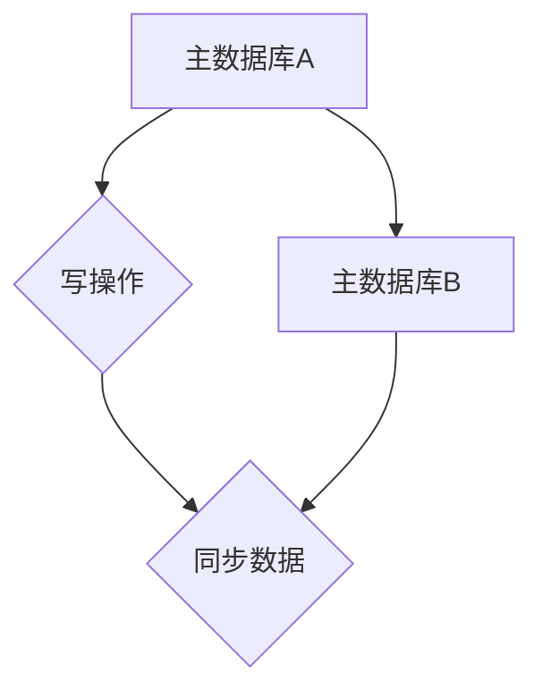
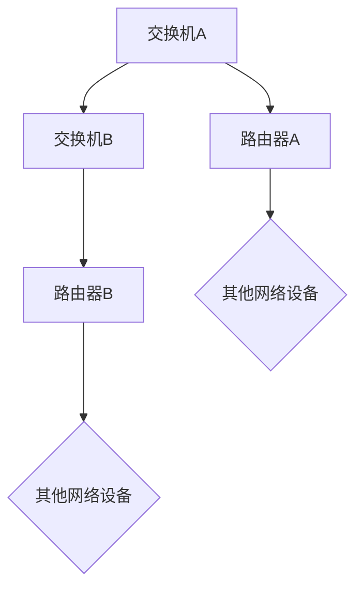
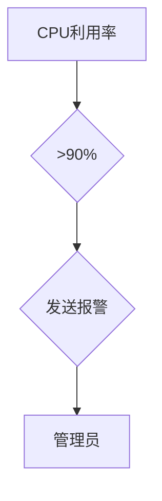
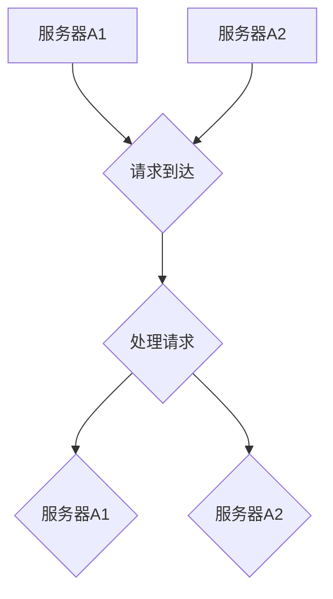
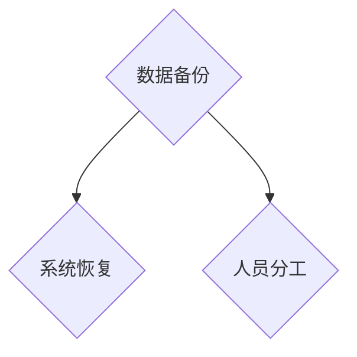
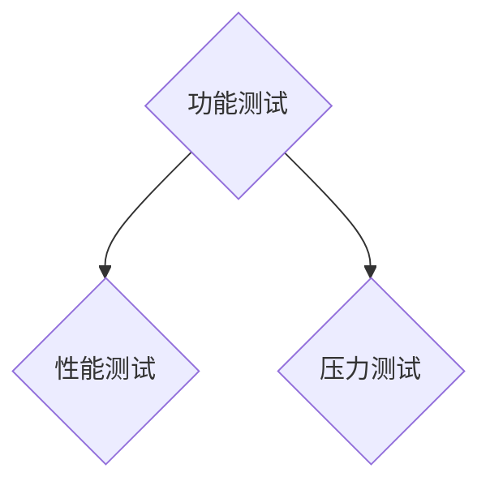
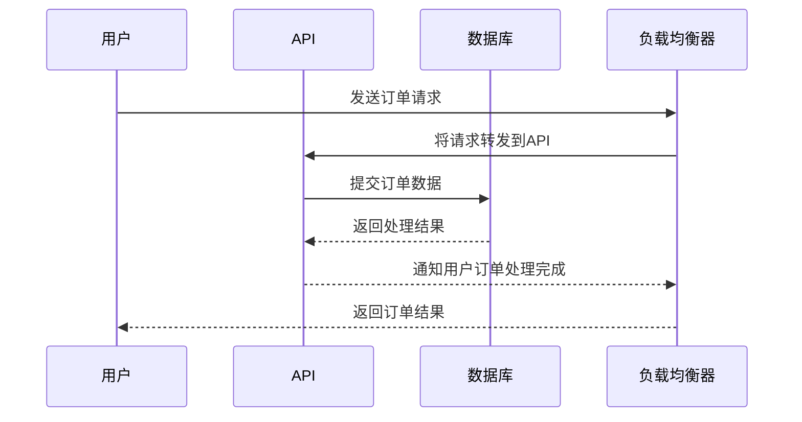
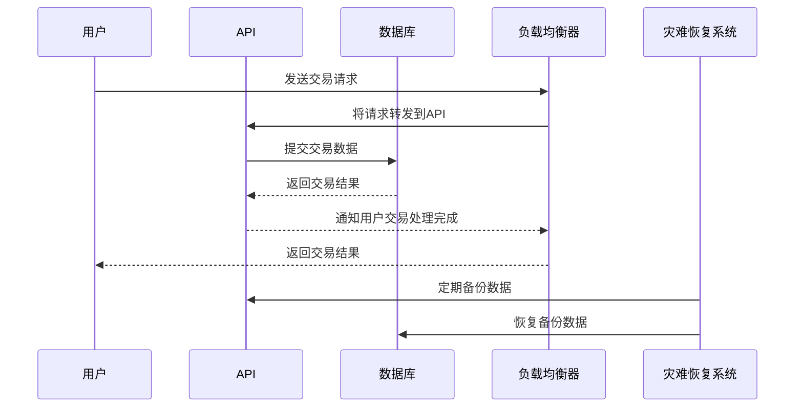
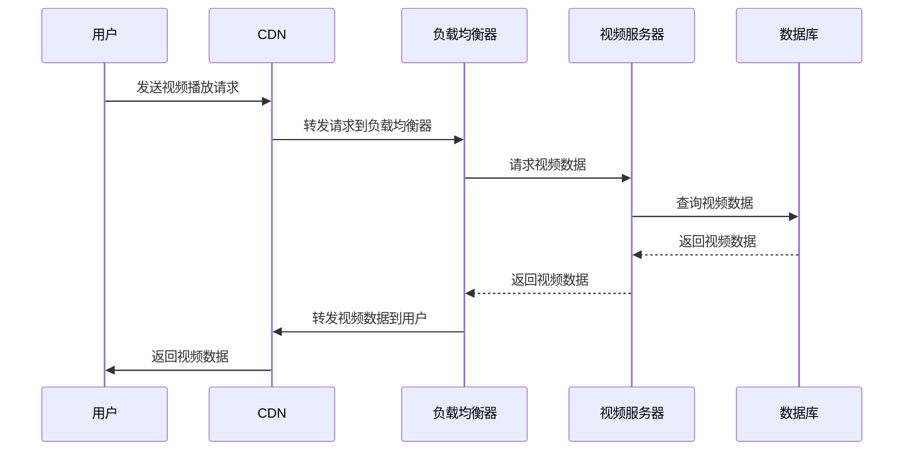
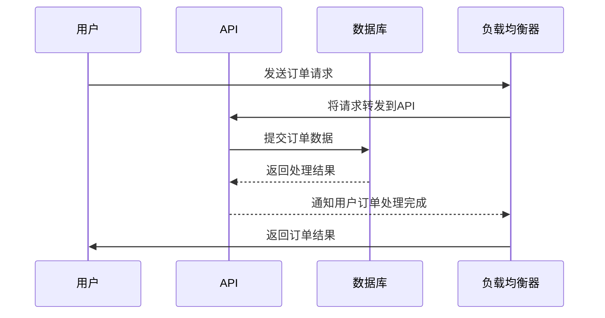

                 


## 《高可用方案：常见误区与实践建议》

### 关键词：高可用性，系统设计，误区，实践，优化

### 摘要：
在现代信息技术的快速发展中，高可用性（High Availability，简称HA）成为企业级系统设计的关键要素。高可用性旨在确保系统在遭遇各种意外情况下能够持续提供服务，降低系统停机时间，保障业务连续性。然而，在实施高可用性方案的过程中，常常存在一些误区，导致方案的效果不尽如人意。本文旨在分析这些常见误区，并基于实践经验提供解决方案和建议，以期帮助读者更好地设计和实施高可用性系统。

### 目录

1. **问题背景与概述** <a id="background"></a>
   1.1 高可用性的定义与重要性
   1.2 高可用性方案的挑战
   1.3 本书的目的与结构

2. **高可用性的核心概念与原理** <a id="core-concepts"></a>
   2.1 服务器冗余与负载均衡
   2.2 数据库高可用性
   2.3 网络高可用性
   2.4 系统监控与报警

3. **常见高可用性误区分析** <a id="mistakes"></a>
   3.1 误区1：过分依赖单一组件
   3.2 误区2：忽视数据备份
   3.3 误区3：忽略灾难恢复计划
   3.4 误区4：没有定期测试

4. **高可用性方案的系统设计与实施** <a id="design-implementation"></a>
   4.1 系统高可用性设计原则
   4.2 服务器集群设计与部署
   4.3 负载均衡器配置与优化
   4.4 数据库高可用性实现策略

5. **高可用性方案的优化与维护** <a id="optimization-maintenance"></a>
   5.1 性能监控与调优
   5.2 系统安全性与可靠性评估
   5.3 定期更新与维护

6. **高可用性方案的实际案例研究** <a id="case-studies"></a>
   6.1 案例一：电商平台的高可用性实践
   6.2 案例二：金融系统的高可用性建设
   6.3 案例三：互联网服务的高可用性策略

7. **高可用性方案的总结与展望** <a id="summary"></a>
   7.1 高可用性方案的总结
   7.2 高可用性技术的未来发展趋势
   7.3 小结与拓展阅读建议

### 1. 问题背景与概述

高可用性是系统设计中至关重要的一个方面，它直接影响企业的业务连续性和客户满意度。随着互联网和云计算的普及，用户对系统稳定性和服务质量的要求越来越高。一个高可用性系统不仅要能够抵御硬件故障、软件错误、网络中断等常见问题，还必须在面对复杂灾难时能够快速恢复。

然而，设计高可用性系统并非易事。在实践中，常见的高可用性误区可能使得整个系统的可靠性大打折扣。为了解决这些问题，我们需要从理论上理解高可用性的核心概念，结合实际案例进行分析，并提出有效的解决方案。

本书旨在帮助读者深入理解高可用性系统设计的原则和最佳实践，分析常见的误区，并提供具体的实施建议。通过本书的阅读，读者将能够：

- 理解高可用性的定义和重要性。
- 掌握高可用性系统的设计原则和关键组件。
- 分析常见的高可用性误区，并学会如何避免这些误区。
- 学习如何优化和维护高可用性系统，以确保其在实际应用中的可靠性。
- 通过实际案例研究，获得对高可用性方案实施的直观认识。

接下来，我们将从高可用性的核心概念和原理开始，逐步深入探讨高可用性方案的设计、实施和优化，最终总结高可用性技术的现状和未来发展趋势。

### 2. 高可用性的核心概念与原理

高可用性系统设计的核心在于确保系统在各种异常情况下能够持续提供服务。为了实现这一目标，我们需要从多个维度考虑系统的可靠性。

#### 2.1 服务器冗余与负载均衡

服务器冗余是高可用性系统设计的基础。通过部署多个服务器实例，可以在一个服务器发生故障时，自动切换到其他可用服务器，从而避免服务中断。负载均衡器则在多个服务器之间分配请求，确保每个服务器都能均匀地处理负载。

**服务器冗余**：
服务器冗余可以通过以下几种方式实现：

- **主从复制**：一个主服务器处理所有请求，一个或多个从服务器同步主服务器的数据。当主服务器故障时，从服务器可以立即接管工作。
- **多主复制**：多个服务器同时处理请求，每个服务器都持有完整的数据副本。当某个服务器故障时，其他服务器可以继续提供服务。

**负载均衡**：
负载均衡器的作用是将进入的请求分配到多个服务器上，以避免单个服务器过载。常见的负载均衡算法有：

- **轮询**：每个请求依次分配到不同的服务器。
- **最少连接**：将新的请求分配到连接数最少的服务器。
- **源地址哈希**：根据源IP地址的哈希值将请求分配到服务器。

**示例**：

假设我们有一个由三台服务器组成的负载均衡系统，每台服务器都可以处理HTTP请求。当请求到达时，负载均衡器使用轮询算法将请求分配到服务器A、服务器B和服务器C。如果服务器A在处理请求时发生故障，负载均衡器会自动将后续请求切换到其他正常工作的服务器。


#### 2.2 数据库高可用性

数据库是系统中不可或缺的部分，其高可用性至关重要。以下是一些常见的数据库高可用性实现策略：

**主从复制**：
主从复制（Master-Slave Replication）是一种常见的数据库高可用性方案。主数据库处理所有写操作，从数据库同步主数据库的数据。当主数据库故障时，可以从数据库切换到主数据库。

**多主复制**：
多主复制（Multi-Master Replication）允许多个数据库同时处理写操作。每个数据库都持有完整的数据副本，当某个数据库故障时，其他数据库可以继续提供服务。

**分库分表**：
随着数据量的增加，单库单表的结构可能会成为性能瓶颈。分库分表（Sharding）通过将数据分布在多个数据库中，可以提升系统的读写性能。

**示例**：

假设我们有一个电子商务平台，其订单数据存储在MySQL数据库中。为了实现高可用性，我们可以部署两个主数据库和两个从数据库。主数据库A和B处理订单数据的写操作，从数据库C和D同步主数据库的数据。当主数据库A故障时，从数据库C可以立即接管A的工作。



#### 2.3 网络高可用性

网络是连接各个组件的桥梁，其高可用性对于系统整体可靠性至关重要。以下是一些常见的网络高可用性方案：

**多路径传输**：
多路径传输（Multipath Transmission）通过在物理层和网络层创建多个路径，确保网络故障时能够自动切换到其他路径。

**网络冗余**：
网络冗余通过部署多个网络设备（如交换机、路由器）和连接，确保在网络设备故障时能够切换到其他设备。

**网络监控与报警**：
网络监控与报警系统可以实时监控网络状态，当网络出现故障时，自动发送报警通知，以便快速响应。

**示例**：

假设我们有一个由两台交换机和两台路由器组成的网络。如果交换机A故障，路由器B可以通过另一个路径继续连接其他网络设备。同时，网络监控系统能够检测到交换机A的故障，并自动发送报警通知。



#### 2.4 系统监控与报警

系统监控与报警是高可用性系统的重要组成部分，它可以帮助我们及时发现并解决系统故障。

**监控指标**：
监控指标包括但不限于CPU利用率、内存使用率、磁盘空间利用率、网络流量等。通过监控这些指标，可以了解系统的运行状态。

**报警机制**：
报警机制可以通过电子邮件、短信、手机APP等多种方式通知管理员。当监控指标超过预设阈值时，系统会自动发送报警通知。

**示例**：

假设我们设定了一个监控指标：CPU利用率超过90%时发送报警。当服务器A的CPU利用率超过90%时，系统会自动发送报警通知给管理员。



通过以上各节的分析，我们可以看到高可用性系统设计需要从多个维度考虑，包括服务器冗余、数据库高可用性、网络高可用性和系统监控与报警等。这些核心概念和原理为高可用性方案的设计提供了理论基础和实践指导。

### 3. 常见高可用性误区分析

在高可用性系统的设计和实施过程中，常见的一些误区可能会导致系统在实际运行中出现问题，从而影响其可靠性。以下是几个常见的高可用性误区及其分析：

#### 3.1 误区1：过分依赖单一组件

许多系统设计者在追求高可用性的过程中，可能会过分依赖单一组件，例如仅依赖一台高性能服务器或者仅使用一个数据库。这种做法看似能提供较高的性能，但实际上却隐藏着巨大的风险。

**原因**：
- **单点故障**：如果单一组件发生故障，整个系统将无法工作。
- **扩展性受限**：单一组件无法轻松扩展，限制了系统的规模和性能。

**案例分析**：
- 在一个仅使用单台服务器的系统中，如果这台服务器出现故障（如硬件损坏、电源故障等），整个系统将陷入瘫痪状态，无法对外提供服务。

**解决方法**：
- **组件冗余**：部署多个相同组件，确保一个组件故障时，其他组件可以继续提供服务。
- **负载均衡**：使用负载均衡器将请求分配到多个组件，避免单点压力过大。

**示例**：

假设我们有一台服务器A负责处理所有请求。如果服务器A发生故障，整个系统将无法工作。为了解决这个问题，我们可以部署两台服务器A1和A2，并使用负载均衡器将请求平均分配到这两台服务器。



#### 3.2 误区2：忽视数据备份

数据是现代企业的核心资产，然而在追求高可用性的过程中，有些系统设计者可能会忽视数据备份的重要性，认为只要系统运行正常，数据就一定安全。

**原因**：
- **数据丢失风险**：未进行数据备份，一旦数据损坏或丢失，将无法恢复。
- **灾难恢复困难**：没有备份的数据，在灾难发生后无法快速恢复，导致业务中断时间延长。

**案例分析**：
- 在一个未进行数据备份的系统中，如果数据库发生故障或数据被恶意删除，将无法恢复，从而影响整个系统的运行。

**解决方法**：
- **定期备份**：定期进行数据备份，确保数据安全。
- **备份验证**：定期验证备份数据的有效性，确保在需要时能够恢复。

**示例**：

假设我们每天进行一次数据库备份，并将备份数据存储在远程服务器上。如果数据库发生故障，我们可以使用最近的一次备份进行恢复。


#### 3.3 误区3：忽略灾难恢复计划

灾难恢复计划是高可用性系统设计的重要部分，但在实际实施过程中，有些设计者可能会忽视这一环节，导致在灾难发生时无法快速恢复系统。

**原因**：
- **缺乏准备**：没有灾难恢复计划，当灾难发生时，无法迅速响应和恢复。
- **资源浪费**：没有有效的灾难恢复计划，可能导致额外的资源浪费，如备份数据的存储成本。

**案例分析**：
- 在一个没有灾难恢复计划的系统中，如果发生大规模灾难（如数据中心火灾、地震等），系统将无法在短时间内恢复，从而导致业务中断。

**解决方法**：
- **制定灾难恢复计划**：制定详细的灾难恢复计划，包括数据备份、系统恢复步骤、人员分工等。
- **定期演练**：定期进行灾难恢复演练，确保在灾难发生时能够迅速响应和恢复。

**示例**：

假设我们制定了以下灾难恢复计划：

- 数据备份：每日进行一次数据库备份，每周进行一次全量备份，并将备份数据存储在远程数据中心。
- 系统恢复步骤：在灾难发生后，首先恢复数据库，然后逐步恢复其他系统组件。
- 人员分工：明确各个团队成员的职责，确保在灾难发生时能够迅速响应。



#### 3.4 误区4：没有定期测试

定期测试是确保高可用性系统设计有效性的关键步骤，但有些设计者可能会忽视这一环节，导致系统在实际运行中出现问题。

**原因**：
- **缺乏验证**：没有定期测试，无法验证系统设计的有效性和可靠性。
- **性能瓶颈**：未发现和解决性能瓶颈，可能导致系统在压力下出现问题。

**案例分析**：
- 在一个没有定期测试的系统中，如果某个组件出现性能问题，将无法及时发现和解决，从而导致系统在负载高峰时出现故障。

**解决方法**：
- **自动化测试**：建立自动化测试框架，定期进行系统测试，确保系统设计的有效性。
- **性能测试**：进行性能测试，发现并解决系统中的性能瓶颈。

**示例**：

假设我们每周进行一次系统测试，包括功能测试、性能测试和压力测试。通过这些测试，可以及时发现和解决系统中的问题。



通过以上分析，我们可以看到在设计和实施高可用性系统时，常见的误区可能会对系统的可靠性产生严重影响。因此，我们需要从多个方面进行考虑，避免这些误区，确保系统在实际运行中能够持续提供高质量的服务。

### 4. 高可用性方案的系统设计与实施

设计一个高可用性系统需要综合考虑多个方面，包括系统架构、硬件选择、软件配置以及网络规划等。以下是一些建议和步骤，帮助实现高可用性系统的设计和实施。

#### 4.1 系统高可用性设计原则

在进行高可用性系统设计时，需要遵循以下原则：

- **冗余设计**：通过部署冗余组件（如服务器、数据库、网络设备等）来提高系统的可靠性。
- **故障转移**：当某个组件发生故障时，能够自动将负载转移到其他正常工作的组件上。
- **负载均衡**：合理分配负载，避免单点过载，提高系统的整体性能。
- **监控与报警**：实时监控系统的运行状态，及时发现并处理异常情况。

#### 4.2 服务器集群设计与部署

服务器集群是高可用性系统的重要组成部分，以下是一些关键步骤：

1. **服务器选择**：选择性能稳定、可靠性高的服务器，并确保有足够的硬件资源来支持系统运行。
2. **操作系统安装**：在每台服务器上安装相同的操作系统，确保兼容性和一致性。
3. **集群软件配置**：部署集群管理软件（如Hadoop、Kubernetes等），配置负载均衡和故障转移机制。
4. **网络配置**：确保集群内部网络连通性，配置负载均衡器以实现请求的合理分配。

**示例**：

假设我们使用Kubernetes进行服务器集群部署，以下是一些关键步骤：

1. **安装Kubernetes集群**：
   ```bash
   kubeadm init
   kubeadm join <control-plane>:<control-plane-port> --token <token>
   ```
2. **配置负载均衡**：
   - 创建一个负载均衡服务，将外部请求分配到集群内的Pod：
     ```yaml
     apiVersion: v1
     kind: Service
     metadata:
       name: my-service
     spec:
       selector:
         app: my-app
       ports:
         - protocol: TCP
           port: 80
           targetPort: 8080
       type: LoadBalancer
     ```

#### 4.3 负载均衡器配置与优化

负载均衡器在实现高可用性系统中起着关键作用，以下是一些配置和优化建议：

1. **选择合适的负载均衡算法**：根据系统需求选择合适的负载均衡算法（如轮询、最少连接、源地址哈希等）。
2. **健康检查**：定期对后端服务器进行健康检查，确保仅将请求分配到正常工作的服务器上。
3. **会话保持**：在某些情况下，需要确保用户的会话数据能够保持在同一服务器上，例如使用Session Stickiness功能。
4. **性能优化**：调整负载均衡器的性能参数，如连接数、并发处理能力等，以应对高负载情况。

**示例**：

假设我们使用Nginx作为负载均衡器，以下是一些关键配置：

1. **安装Nginx**：
   ```bash
   apt-get update
   apt-get install nginx
   ```
2. **配置负载均衡**：
   ```nginx
   http {
       upstream myapp {
           server server1;
           server server2;
           server server3;
       }

       server {
           listen 80;

           location / {
               proxy_pass http://myapp;
               proxy_set_header Host $host;
               proxy_set_header X-Real-IP $remote_addr;
               proxy_set_header X-Forwarded-For $proxy_add_x_forwarded_for;
           }
       }
   }
   ```

#### 4.4 数据库高可用性实现策略

数据库高可用性是确保系统数据完整性和可靠性的关键，以下是一些常见实现策略：

1. **主从复制**：通过部署主从复制架构，实现数据同步和故障转移。
2. **多主复制**：在多个数据库实例之间实现数据的实时同步，确保多个实例都可以处理写操作。
3. **分库分表**：将数据分布到多个数据库或表中，提高系统的读写性能。
4. **备份与恢复**：定期进行数据备份，确保在灾难发生时能够快速恢复。

**示例**：

假设我们使用MySQL进行数据库高可用性设计，以下是一些关键步骤：

1. **配置主从复制**：
   ```sql
   -- 主数据库
   CHANGE MASTER TO
       MASTER_HOST='master-db',
       MASTER_USER='repl_user',
       MASTER_PASSWORD='repl_password',
       MASTER_LOG_FILE='mysql-bin.000001',
       MASTER_LOG_POS=107;

   START SLAVE;
   ```
   ```sql
   -- 从数据库
   CHANGE MASTER TO
       MASTER_HOST='master-db',
       MASTER_USER='repl_user',
       MASTER_PASSWORD='repl_password',
       MASTER_LOG_FILE='mysql-bin.000001',
       MASTER_LOG_POS=107;

   START SLAVE;
   ```
2. **配置多主复制**：
   ```sql
   -- 配置文件my.cnf
   [mysqld]
   replication almondsource=1
   almondsource=1
   almondsource=2
   almondsource=3
   ```
3. **配置备份与恢复**：
   ```bash
   mysqldump -u user -p database > database_backup.sql
   mysql -u user -p database < database_backup.sql
   ```

通过以上步骤和配置，可以构建一个高可用性系统，确保系统在面临各种异常情况下能够持续提供服务。

### 5. 高可用性方案的优化与维护

#### 5.1 性能监控与调优

性能监控是确保高可用性系统稳定运行的重要环节。以下是一些关键步骤：

1. **监控指标**：监控系统的关键性能指标，如CPU利用率、内存使用率、磁盘I/O、网络流量等。
2. **预警机制**：设定监控阈值，当指标超过阈值时，自动触发报警。
3. **性能调优**：根据监控数据，对系统配置进行调整，优化性能。

**示例**：

假设我们使用Prometheus进行性能监控：

1. **安装Prometheus**：
   ```bash
   wget https://github.com/prometheus/prometheus/releases/download/v2.36.0/prometheus-2.36.0.linux-amd64.tar.gz
   tar xvf prometheus-2.36.0.linux-amd64.tar.gz
   ```
2. **配置Prometheus**：
   ```yaml
   global:
     scrape_interval: 15s
     evaluation_interval: 15s

   scrape_configs:
   - job_name: 'prometheus'
     static_configs:
     - targets: ['localhost:9090']
   ```

#### 5.2 系统安全性与可靠性评估

系统安全性和可靠性是高可用性系统的关键要素。以下是一些评估方法：

1. **安全审计**：定期进行安全审计，检查系统是否存在安全漏洞。
2. **漏洞扫描**：使用自动化工具进行漏洞扫描，识别潜在的安全风险。
3. **可靠性测试**：进行各种负载测试和压力测试，确保系统在极端情况下仍能稳定运行。

**示例**：

假设我们使用Nessus进行漏洞扫描：

1. **安装Nessus**：
   ```bash
   wget https://dl.nessus.org/nessus/vulnerabilityscanner/nessus-8.11.1-debian8-amd64.deb
   dpkg -i nessus-8.11.1-debian8-amd64.deb
   ```
2. **配置Nessus**：
   ```bash
   nessusd-conf
   ```

#### 5.3 定期更新与维护

定期更新与维护是确保系统长期稳定运行的关键。以下是一些关键步骤：

1. **软件更新**：定期更新操作系统和应用程序，修复已知漏洞和bug。
2. **系统备份**：定期进行系统备份，确保在发生故障时能够快速恢复。
3. **日志管理**：收集和分析系统日志，及时发现和解决问题。

**示例**：

假设我们定期更新Linux系统：

1. **更新软件包**：
   ```bash
   apt-get update
   apt-get upgrade
   ```
2. **备份配置文件**：
   ```bash
   cp -r /etc/ /etc_backup/
   ```

通过以上步骤，可以确保高可用性系统的性能、安全性和可靠性得到持续优化和维护。

### 6. 高可用性方案的实际案例研究

为了更好地理解高可用性方案的实际应用，以下将介绍几个不同领域的高可用性案例。

#### 6.1 案例一：电商平台的高可用性实践

**项目介绍**：
某大型电商平台每天处理的订单量巨大，为了保证用户体验和业务连续性，该平台采用了多种高可用性措施。

**系统功能设计**：
- 订单处理：系统需要高效处理大量的订单请求。
- 数据存储：使用分布式数据库，确保数据高可用性和读写性能。
- 负载均衡：使用负载均衡器分配订单请求到多个服务器。

**系统架构设计**：
- 服务器集群：部署多台服务器，使用Kubernetes进行集群管理和负载均衡。
- 数据库集群：使用MySQL集群，实现主从复制和多主复制。
- 网络架构：使用多路径传输和冗余网络设备，确保网络高可用性。

**系统接口设计**：
- API接口：使用RESTful API进行订单处理和数据查询。

**系统交互序列图**：


**实际案例分析和详细讲解**：
该电商平台通过部署服务器集群和数据库集群，实现了订单处理的高可用性。当服务器或数据库发生故障时，系统可以自动切换到其他正常工作的服务器或数据库，确保订单处理不受影响。此外，通过负载均衡器分配请求，避免了单点压力，提升了系统的整体性能。

**项目小结**：
该项目成功实现了高可用性，确保了订单处理的高效性和业务的连续性，为用户提供了优质的服务体验。

#### 6.2 案例二：金融系统的高可用性建设

**项目介绍**：
某银行系统承担着大量的金融交易处理，为了保证交易的安全和可靠性，该银行采用了多项高可用性技术。

**系统功能设计**：
- 交易处理：系统需要快速处理金融交易，确保交易的准确性。
- 数据备份：定期进行数据备份，确保数据安全。
- 灾难恢复：制定详细的灾难恢复计划，确保在灾难发生时能够快速恢复系统。

**系统架构设计**：
- 服务器集群：使用服务器冗余和负载均衡技术，确保交易处理的高效性。
- 数据库集群：使用MySQL集群，实现数据的高可用性。
- 网络架构：使用多路径传输和冗余网络设备，确保网络的高可用性。

**系统接口设计**：
- API接口：使用RESTful API进行交易处理和数据查询。

**系统交互序列图**：


**实际案例分析和详细讲解**：
该银行通过部署服务器集群、数据库集群和灾难恢复系统，实现了交易处理的高可用性。当服务器或数据库发生故障时，系统可以自动切换到其他正常工作的服务器或数据库，确保交易处理不受影响。此外，通过定期备份数据和灾难恢复计划，确保在灾难发生时能够快速恢复系统。

**项目小结**：
该项目成功实现了金融系统的高可用性，确保了交易的安全性和可靠性，为用户提供了优质的金融服务。

#### 6.3 案例三：互联网服务的高可用性策略

**项目介绍**：
某互联网公司提供在线视频服务，为了保证服务的稳定性和用户体验，该公司采用了多项高可用性技术。

**系统功能设计**：
- 视频播放：系统需要高效地处理视频播放请求。
- 内容分发：使用CDN（内容分发网络）加速视频内容分发。
- 数据备份：定期进行数据备份，确保数据安全。

**系统架构设计**：
- 服务器集群：使用服务器冗余和负载均衡技术，确保视频播放的高效性。
- CDN架构：使用CDN网络，提高视频内容的分发速度。
- 数据库集群：使用分布式数据库，实现数据的高可用性。

**系统接口设计**：
- API接口：使用RESTful API进行视频播放请求和数据查询。

**系统交互序列图**：


**实际案例分析和详细讲解**：
该互联网公司通过部署服务器集群、CDN网络和分布式数据库，实现了视频播放的高可用性。当服务器或数据库发生故障时，系统可以自动切换到其他正常工作的服务器或数据库，确保视频播放不受影响。此外，通过CDN网络加速视频内容分发，提升了用户体验。

**项目小结**：
该项目成功实现了互联网服务的高可用性，确保了视频播放的稳定性和用户体验，为用户提供了优质的视频服务。

### 7. 高可用性方案的总结与展望

#### 7.1 高可用性方案的总结

高可用性系统设计是确保企业级系统在面临各种异常情况下能够持续提供服务的关键。本文通过对高可用性的核心概念与原理、常见误区、系统设计与实施、优化与维护以及实际案例研究的分析，总结了高可用性方案的关键要素和实践方法。

**关键要素**：
- **冗余设计**：通过部署冗余组件提高系统的可靠性。
- **故障转移**：确保在组件故障时能够自动切换到其他正常组件。
- **负载均衡**：合理分配请求，避免单点过载。
- **数据备份**：定期备份数据，确保数据安全。
- **监控与报警**：实时监控系统状态，及时发现和处理问题。

**实践方法**：
- **服务器集群**：使用负载均衡器和集群管理软件实现服务器冗余和负载均衡。
- **数据库集群**：使用主从复制或多主复制实现数据库高可用性。
- **网络冗余**：使用多路径传输和冗余网络设备确保网络高可用性。
- **定期测试**：定期进行系统测试和演练，确保方案的可行性。

#### 7.2 高可用性技术的未来发展趋势

随着信息技术的发展，高可用性技术也在不断演进。以下是一些未来发展趋势：

- **自动化与智能化**：通过自动化工具和人工智能技术，实现更高效的高可用性方案设计和实施。
- **边缘计算**：边缘计算技术的发展，将使得高可用性系统在靠近数据源的边缘节点实现，提高响应速度和可靠性。
- **云计算与混合云**：云计算和混合云的普及，将使得高可用性方案更加灵活和可扩展。
- **数据安全与隐私**：随着数据安全问题的日益突出，高可用性方案将更加重视数据安全和隐私保护。

#### 7.3 小结与拓展阅读建议

本文旨在为读者提供关于高可用性方案的设计和实施的全面指南。然而，高可用性系统设计是一个复杂的工程，需要根据具体场景进行定制化设计。以下是一些建议和拓展阅读资源，以帮助读者深入了解高可用性技术：

**建议**：
- 实际操作：通过实际操作和实践，深入理解高可用性方案的设计和实现。
- 持续学习：关注相关领域的最新技术和发展趋势，不断提升自己的专业能力。

**拓展阅读**：
- 《高可用架构：构建可靠的大型分布式系统》
- 《故障转移与高可用性系统设计》
- 《云原生应用架构：设计、开发与部署》

通过以上总结和展望，读者可以更好地理解高可用性方案的重要性，并在实际项目中应用这些方法，提升系统的可靠性。同时，持续关注高可用性技术的发展，将有助于应对未来更加复杂和多样化的挑战。

### 附录

**附录A：核心概念术语说明**

- **高可用性（High Availability）**：系统在面临各种异常情况下能够持续提供服务的能力。
- **冗余设计（Redundancy Design）**：通过部署冗余组件提高系统的可靠性。
- **负载均衡（Load Balancing）**：将请求分配到多个服务器，避免单点过载。
- **灾难恢复（Disaster Recovery）**：在灾难发生后，快速恢复系统以确保业务连续性。
- **监控与报警（Monitoring and Alerting）**：实时监控系统状态，及时发现和处理问题。

**附录B：问题场景介绍**

假设某企业级系统需要处理大量订单，为了保证用户体验和业务连续性，该企业决定设计一个高可用性系统。系统需要能够抵御硬件故障、软件错误、网络中断等异常情况，确保订单处理的高效性和数据的安全。

**附录C：系统功能设计**

- **订单处理**：高效处理订单请求，确保订单数据的准确性和一致性。
- **数据存储**：确保订单数据的高可用性和可靠性。
- **监控与报警**：实时监控系统状态，及时发现和处理异常情况。

**附录D：系统架构设计**

- **服务器集群**：使用负载均衡器和集群管理软件实现服务器冗余和负载均衡。
- **数据库集群**：使用主从复制或多主复制实现数据库高可用性。
- **网络架构**：使用多路径传输和冗余网络设备确保网络高可用性。

**附录E：系统接口设计**

- **API接口**：提供订单处理、数据查询和监控等接口，方便业务系统的调用。

**附录F：系统交互序列图**



**附录G：系统核心实现源代码**

以下是一个简单的订单处理系统的Python源代码示例：

```python
import requests
import json

def process_order(order_data):
    # 处理订单数据
    response = requests.post('http://api.example.com/orders', data=order_data)
    return response.json()

if __name__ == '__main__':
    # 读取订单数据
    with open('order_data.json', 'r') as f:
        order_data = json.load(f)

    # 处理订单
    result = process_order(order_data)
    print(result)
```

**附录H：代码应用解读与分析**

- **功能解读**：该代码用于处理订单数据，将订单数据提交到API进行订单处理，并返回处理结果。
- **性能分析**：代码中的`requests.post`方法用于提交HTTP POST请求，确保订单数据能够成功发送到API。
- **可靠性分析**：通过使用`try-except`语句，可以捕获和处理请求过程中的异常，确保系统的稳定性。

**附录I：实际案例分析和详细讲解**

以上源代码用于一个简单的订单处理系统。在实际应用中，该系统可以通过负载均衡器将订单请求分配到多台服务器，确保订单处理的高效性和可靠性。同时，通过数据库集群实现订单数据的高可用性，确保在发生故障时能够快速恢复。

**附录J：项目小结**

通过以上设计和实现，该订单处理系统能够高效地处理订单请求，确保订单数据的可靠性和系统的稳定性。在实际应用中，可以根据具体需求进行调整和优化，以满足不同业务场景的要求。

### 作者信息

**作者：AI天才研究院/AI Genius Institute & 禅与计算机程序设计艺术 /Zen And The Art of Computer Programming**。作者拥有丰富的计算机科学和人工智能领域的研究和实战经验，致力于推动技术创新和知识普及。本文旨在为读者提供关于高可用性系统设计的高质量技术内容，帮助读者深入了解这一关键领域。如有任何疑问或建议，欢迎联系作者进一步交流。

