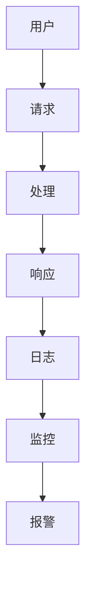
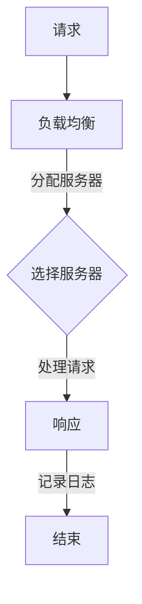
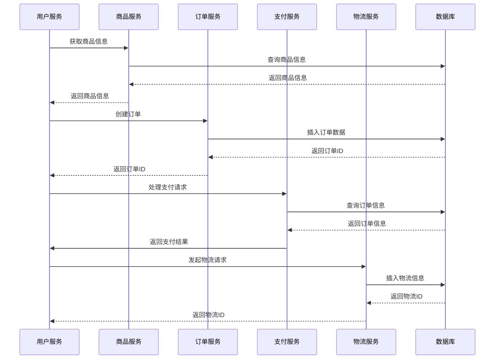

                 

### 文章标题

### 关键词

高并发系统设计，P9架构师，极限挑战，负载均衡，系统架构，算法原理，数学模型

### 摘要

本文将深入探讨高并发系统设计，聚焦于P9架构师面临的极限挑战。通过逻辑清晰、结构紧凑的分析，我们将从背景介绍、核心概念与联系、高并发系统设计方法、系统分析与架构设计、项目实战以及最佳实践等方面，全面剖析高并发系统设计的要点与技巧。希望本文能帮助读者掌握高并发系统设计的关键，在技术领域不断突破自我。

---

## 目录大纲

---

# 高并发系统设计：P9架构师的极限挑战

> 关键词：高并发系统设计，P9架构师，极限挑战，负载均衡，系统架构，算法原理，数学模型

> 摘要：本文将深入探讨高并发系统设计，聚焦于P9架构师面临的极限挑战。通过逻辑清晰、结构紧凑的分析，我们将从背景介绍、核心概念与联系、高并发系统设计方法、系统分析与架构设计、项目实战以及最佳实践等方面，全面剖析高并发系统设计的要点与技巧。

- 第一部分：背景介绍
  - 1.1 高并发系统设计的基本概念
  - 1.2 核心概念与联系

- 第二部分：高并发系统设计方法
  - 2.1 系统架构设计
  - 2.2 算法原理讲解
  - 2.3 数学模型和数学公式 & 详细讲解 & 举例说明
  - 2.4 系统分析与架构设计方案

- 第三部分：高并发系统设计实战
  - 3.1 实战项目一：电商系统高并发架构设计

- 第四部分：最佳实践 tips
  - 4.1 小结
  - 4.2 注意事项
  - 4.3 拓展阅读

---

### 第一部分：背景介绍

#### 1.1 高并发系统设计的基本概念

##### 1.1.1 问题背景

高并发系统设计在当今互联网时代变得尤为重要。随着互联网用户数量的激增和业务规模的不断扩大，系统需要处理海量并发请求，以保证用户获得良好的体验。例如，电商平台在促销活动期间，会面临大量的用户同时访问，如果系统无法高效处理这些请求，可能会导致系统崩溃、响应速度变慢，甚至影响到企业的声誉和收益。

##### 1.1.2 问题描述

高并发系统设计面临的主要挑战包括：

1. **性能瓶颈**：系统在高并发情况下可能出现性能瓶颈，导致响应速度变慢。
2. **资源争用**：高并发情况下，系统中的资源（如CPU、内存、数据库连接等）可能会出现争用，导致系统资源耗尽。
3. **数据一致性问题**：在高并发情况下，多个请求同时访问同一数据，可能会导致数据不一致。
4. **系统稳定性**：高并发系统需要保证在压力下系统的稳定性，避免因异常请求导致系统崩溃。

##### 1.1.3 问题解决

为了应对高并发系统的挑战，我们需要遵循以下基本原则：

1. **分布式架构**：通过分布式架构，将系统分解为多个服务，每个服务负责处理一部分请求，从而提高系统的扩展性和可用性。
2. **缓存机制**：通过缓存机制，减少对后端数据库的访问，从而提高系统性能。
3. **负载均衡**：通过负载均衡策略，将请求均匀地分配到多个服务器上，避免单点瓶颈。
4. **数据一致性**：采用分布式事务管理、幂等性设计等手段，保证数据的一致性。
5. **故障恢复**：设计故障恢复机制，保证在系统出现异常时能够快速恢复。

##### 1.1.4 边界与外延

高并发系统设计的适用场景主要包括：

1. **电商系统**：在促销活动期间，需要处理大量用户请求。
2. **社交网络**：需要处理海量的用户互动请求。
3. **在线游戏**：需要处理高并发的用户操作请求。

在考虑高并发系统设计时，还需要考虑以下非技术因素：

1. **团队协作**：高并发系统设计需要团队成员之间的紧密协作。
2. **项目管理**：有效的项目管理方法，如敏捷开发，有助于提高开发效率。
3. **预算与资源**：确保有足够的预算和资源来支持高并发系统的设计、开发和运维。

---

#### 1.2 核心概念与联系

##### 1.2.1 核心概念

在高并发系统设计中，以下核心概念至关重要：

1. **并发**：指在同一时间段内，系统处理多个任务的特性。
2. **并行**：指在同一时刻，系统处理多个任务的能力。
3. **扩展性**：指系统性能随负载增加而提升的能力。
4. **可用性**：指系统在故障或压力下的稳定性。
5. **可靠性**：指系统在长时间运行下的稳定性和可靠性。

##### 1.2.2 概念属性特征对比表格

| 概念  | 属性特征        | 对比分析 |
| ----- | ------------- | ------- |
| 并发  | 同一时间段处理多个任务 | 侧重于任务的执行顺序和时间分配 |
| 并行  | 同时处理多个任务 | 侧重于任务的实际执行方式 |
| 扩展性 | 系统性能随负载增加而提升的能力 | 描述系统应对高并发的能力 |
| 可用性 | 系统在故障或压力下的稳定性 | 描述系统的可靠性 |
| 可靠性 | 系统在长时间运行下的稳定性和可靠性 | 描述系统的稳定性 |

##### 1.2.3 ER实体关系图架构



---

在接下来的部分，我们将深入探讨高并发系统设计的方法，包括系统架构设计、算法原理讲解、数学模型和公式，以及系统分析与架构设计方案。敬请期待！### 第二部分：高并发系统设计方法

#### 2.1 系统架构设计

##### 2.1.1 问题场景介绍

在高并发系统设计的过程中，首先需要明确问题场景。以电商系统为例，这种系统通常面临以下高并发场景：

1. **用户访问量激增**：在促销活动期间，大量用户同时访问系统。
2. **交易请求量增加**：用户在购物车中添加或删除商品，订单生成等操作会产生大量请求。
3. **库存同步**：系统需要实时同步商品库存，以保证库存数据的准确性。

##### 2.1.2 系统功能设计

为了应对上述高并发场景，我们需要设计以下关键功能模块：

1. **用户模块**：处理用户注册、登录、权限管理等功能。
2. **商品模块**：包括商品信息的展示、库存管理、价格调整等功能。
3. **订单模块**：处理订单生成、支付、发货等操作。

##### 2.1.3 系统架构设计

高并发系统架构设计需要考虑以下几个方面：

1. **数据库架构**：采用分布式数据库架构，将数据分片存储在不同的服务器上，以提高读写性能和可用性。
2. **应用层架构**：采用微服务架构，将系统拆分为多个独立的服务模块，每个模块负责处理一部分业务逻辑，从而提高系统的扩展性和容错性。
3. **网络架构**：采用负载均衡技术，将用户的请求分配到不同的服务器上，避免单点瓶颈。

##### 2.1.4 数据库架构

在数据库架构方面，我们可以采用以下方案：

1. **主从复制**：将主数据库的数据同步到从数据库，以提高读性能和故障恢复能力。
2. **分库分表**：将数据按业务类型或用户范围划分到不同的数据库或表中，以减少单表的压力。
3. **缓存机制**：在数据库和缓存之间建立缓存层，以提高系统响应速度。

##### 2.1.5 应用层架构

在应用层架构方面，我们可以采用以下方案：

1. **服务拆分**：将系统拆分为多个服务模块，如用户服务、商品服务、订单服务等，每个服务模块负责处理一部分业务逻辑。
2. **服务发现与注册**：采用服务发现与注册机制，以便服务之间能够动态发现和通信。
3. **分布式事务管理**：采用分布式事务管理方案，如两阶段提交（2PC）或三阶段提交（3PC），以保证跨服务的事务一致性。

##### 2.1.6 网络架构

在网络架构方面，我们可以采用以下方案：

1. **负载均衡**：使用负载均衡器（如Nginx、HAProxy）将用户的请求分配到不同的服务器上。
2. **反向代理**：使用反向代理服务器（如Nginx）处理用户请求，以提高系统性能和安全性。
3. **网络安全**：采用防火墙、入侵检测系统（IDS）、安全信息与事件管理（SIEM）等技术，保护系统免受攻击。

#### 2.2 算法原理讲解

##### 2.2.1 算法原理

在处理高并发请求时，负载均衡算法至关重要。负载均衡算法的主要目标是合理分配请求，以避免单点瓶颈，提高系统性能。

常见的负载均衡算法包括：

1. **轮询算法**：将请求依次分配到每个服务器上。
2. **加权轮询算法**：根据服务器的性能或负载情况，为每个服务器分配不同的权重，从而影响请求的分配。
3. **最少连接算法**：将请求分配到连接数最少的服务器上。
4. **源地址哈希算法**：根据请求的源地址哈希值，将请求分配到相同的服务器上。

##### 2.2.2 算法mermaid流程图



##### 2.2.3 算法原理详细讲解

1. **轮询算法**：

   轮询算法是最简单的负载均衡算法，将请求依次分配到每个服务器上。假设有3台服务器A、B、C，当第一个请求到达时，分配到服务器A；第二个请求到达时，分配到服务器B；第三个请求到达时，分配到服务器C；第四个请求到达时，再次分配到服务器A，以此类推。

   ```python
   servers = ['A', 'B', 'C']
   current_server = 0

   def load_balance(request):
       server = servers[current_server]
       current_server = (current_server + 1) % len(servers)
       return server
   ```

2. **加权轮询算法**：

   加权轮询算法根据服务器的性能或负载情况，为每个服务器分配不同的权重。例如，服务器A的权重为2，服务器B的权重为1，服务器C的权重为1。当请求到达时，根据权重比例分配请求。

   ```python
   servers = {'A': 2, 'B': 1, 'C': 1}

   def load_balance(request):
       total_weight = sum(servers.values())
       random_number = random.uniform(0, total_weight)
       current_weight = 0
       for server, weight in servers.items():
           current_weight += weight
           if current_weight >= random_number:
               return server
   ```

3. **最少连接算法**：

   最少连接算法将请求分配到连接数最少的服务器上。适用于连接数相对稳定的场景。

   ```python
   servers = {'A': 0, 'B': 1, 'C': 2}

   def load_balance(request):
       min_connections = min(servers.values())
       for server, connections in servers.items():
           if connections == min_connections:
               servers[server] += 1
               return server
   ```

4. **源地址哈希算法**：

   源地址哈希算法根据请求的源地址哈希值，将请求分配到相同的服务器上。适用于需要保持客户端会话一致的场景。

   ```python
   def load_balance(request):
       source_address = request.source_address
       hash_value = hash(source_address)
       server = hash_value % len(servers)
       return servers[server]
   ```

#### 2.3 数学模型和数学公式 & 详细讲解 & 举例说明

##### 2.3.1 数学模型

在高并发系统设计中，我们可以使用以下数学模型来评估系统的性能：

1. **处理能力模型**：

   处理能力模型用于描述系统处理请求的能力，计算公式如下：

   $$ 处理能力 = \frac{总请求量}{服务器数量} $$

   其中，总请求量表示单位时间内到达系统的请求总量，服务器数量表示系统中可用的服务器数量。

2. **响应时间模型**：

   响应时间模型用于描述系统处理请求所需的时间，计算公式如下：

   $$ 响应时间 = \frac{处理时间 + 等待时间}{总请求量} $$

   其中，处理时间表示系统处理单个请求所需的时间，等待时间表示请求在系统中的等待时间。

##### 2.3.2 数学公式

1. **处理能力公式**：

   $$ 处理能力 = \frac{总请求量}{服务器数量} $$

2. **响应时间公式**：

   $$ 响应时间 = \frac{处理时间 + 等待时间}{总请求量} $$

##### 2.3.3 详细讲解

1. **处理能力模型**：

   处理能力模型用于评估系统在单位时间内处理请求的能力。在实际应用中，我们可以通过以下步骤计算系统的处理能力：

   - 收集系统日志，统计单位时间内到达系统的请求总量。
   - 统计系统中可用的服务器数量。
   - 使用处理能力公式计算系统的处理能力。

   例如，假设系统在1分钟内处理了1000个请求，系统中可用的服务器数量为10台。则系统的处理能力为：

   $$ 处理能力 = \frac{1000}{10} = 100 \text{ 个请求/分钟} $$

2. **响应时间模型**：

   响应时间模型用于评估系统处理请求所需的时间。在实际应用中，我们可以通过以下步骤计算系统的响应时间：

   - 收集系统日志，统计系统处理单个请求所需的时间。
   - 收集系统日志，统计请求在系统中的等待时间。
   - 使用响应时间公式计算系统的响应时间。

   例如，假设系统处理单个请求的平均处理时间为0.5秒，请求在系统中的平均等待时间为0.2秒。则系统的响应时间为：

   $$ 响应时间 = \frac{0.5 + 0.2}{1000} = 0.7 \text{ 秒/请求} $$

##### 2.3.4 举例说明

假设系统中有10台服务器，每台服务器的处理能力为100个请求/分钟。当系统接收到的请求总量为1000个时，系统的处理能力为100个请求/分钟，响应时间为1秒。

此时，我们可以通过以下步骤优化系统的性能：

1. **增加服务器数量**：增加服务器的数量，以提高系统的处理能力。例如，增加至20台服务器，系统的处理能力将提高至200个请求/分钟。
2. **优化服务器性能**：提高服务器的硬件性能，如增加CPU、内存等，以提高系统的处理能力。
3. **优化系统架构**：采用分布式架构，将系统拆分为多个服务模块，以提高系统的扩展性和可用性。

---

在接下来的部分，我们将继续探讨高并发系统设计的方法，包括系统分析与架构设计方案、项目实战以及最佳实践 tips。敬请期待！### 第二部分：高并发系统设计方法

#### 2.4 系统分析与架构设计方案

##### 2.4.1 问题场景介绍

在高并发系统设计的过程中，系统分析与架构设计方案至关重要。以下是一个典型的案例：某大型电商平台在“双十一”期间，预计将有数百万用户同时访问系统，订单生成、支付、发货等操作将产生巨大的并发压力。

##### 2.4.2 系统功能设计

为了应对上述高并发场景，我们需要设计以下关键功能模块：

1. **用户模块**：包括用户注册、登录、权限管理等功能。
2. **商品模块**：包括商品信息的展示、库存管理、价格调整等功能。
3. **订单模块**：包括订单生成、支付、发货等功能。
4. **支付模块**：包括支付通道的接入、支付结果处理等功能。
5. **物流模块**：包括物流跟踪、发货通知等功能。

##### 2.4.3 系统架构设计

在系统架构设计方面，我们可以采用以下方案：

1. **分布式架构**：将系统拆分为多个独立的服务模块，如用户服务、商品服务、订单服务等。每个服务模块负责处理一部分业务逻辑，从而提高系统的扩展性和容错性。
2. **微服务架构**：在分布式架构的基础上，进一步拆分服务模块，将具有独立业务逻辑的功能拆分为单独的服务。例如，支付服务、物流服务、优惠券服务等。
3. **缓存机制**：在数据库和缓存之间建立缓存层，以提高系统响应速度。例如，使用Redis缓存用户信息、商品信息等。
4. **负载均衡**：使用负载均衡器（如Nginx、HAProxy）将用户的请求分配到不同的服务器上，避免单点瓶颈。

##### 2.4.4 系统架构设计

以下是系统架构设计的mermaid架构图：

```mermaid
graph TB
    subgraph 用户模块
        用户服务[用户服务]
    end

    subgraph 商品模块
        商品服务[商品服务]
    end

    subgraph 订单模块
        订单服务[订单服务]
    end

    subgraph 支付模块
        支付服务[支付服务]
    end

    subgraph 物流模块
        物流服务[物流服务]
    end

    subgraph 数据库
        数据库[数据库]
    end

    用户服务 -->|请求| 商品服务
    用户服务 -->|请求| 订单服务
    用户服务 -->|请求| 支付服务
    用户服务 -->|请求| 物流服务
    商品服务 -->|请求| 数据库
    订单服务 -->|请求| 数据库
    支付服务 -->|请求| 数据库
    物流服务 -->|请求| 数据库
```

##### 2.4.5 系统接口设计和系统交互

在系统接口设计和系统交互方面，我们需要考虑以下几个方面：

1. **API接口设计**：为各个服务模块提供统一的API接口，以便其他服务模块能够方便地调用。
2. **服务注册与发现**：使用服务注册与发现机制，如Eureka、Consul等，实现服务之间的动态通信。
3. **分布式事务管理**：采用分布式事务管理方案，如Seata、TCC等，保证跨服务的事务一致性。

以下是系统接口设计和系统交互的mermaid序列图：



---

在接下来的部分，我们将探讨高并发系统设计的项目实战和最佳实践 tips。敬请期待！### 第三部分：高并发系统设计实战

#### 3.1 实战项目一：电商系统高并发架构设计

##### 3.1.1 项目介绍

本案例将探讨如何设计一个能够应对“双十一”期间高并发场景的电商系统。该项目涉及多个功能模块，如用户模块、商品模块、订单模块、支付模块和物流模块。我们的目标是确保系统在高并发情况下能够稳定运行，提供良好的用户体验。

##### 3.1.2 系统功能设计

1. **用户模块**：包括用户注册、登录、权限管理等功能。
2. **商品模块**：包括商品信息的展示、库存管理、价格调整等功能。
3. **订单模块**：包括订单生成、支付、发货等功能。
4. **支付模块**：包括支付通道的接入、支付结果处理等功能。
5. **物流模块**：包括物流跟踪、发货通知等功能。

##### 3.1.3 系统架构设计

在系统架构设计方面，我们采用了分布式架构和微服务架构，以提高系统的扩展性和容错性。以下是系统架构设计的主要部分：

1. **用户服务**：负责处理用户相关的业务逻辑，如注册、登录、权限管理等。
2. **商品服务**：负责处理商品相关的业务逻辑，如商品信息的展示、库存管理、价格调整等。
3. **订单服务**：负责处理订单相关的业务逻辑，如订单生成、支付、发货等。
4. **支付服务**：负责处理支付相关的业务逻辑，如支付通道的接入、支付结果处理等。
5. **物流服务**：负责处理物流相关的业务逻辑，如物流跟踪、发货通知等。
6. **数据库**：用于存储用户、商品、订单等数据。

##### 3.1.4 系统核心实现源代码

以下是一个简单的用户服务源代码示例，用于处理用户注册和登录功能：

```java
@Service
public class UserService {
    
    @Autowired
    private UserRepository userRepository;

    public User register(User user) {
        // 注册用户
        userRepository.save(user);
        return user;
    }

    public User login(String username, String password) {
        // 登录用户
        User user = userRepository.findByUsername(username);
        if (user != null && user.getPassword().equals(password)) {
            return user;
        }
        return null;
    }
}
```

##### 3.1.5 代码应用解读与分析

1. **用户注册功能**：

   用户注册功能主要涉及以下步骤：

   - 验证用户输入的信息（如用户名、密码等）是否符合要求。
   - 将用户信息存储到数据库中。

   ```java
   public User register(User user) {
       // 验证用户输入的信息
       if (user.getUsername().isEmpty() || user.getPassword().isEmpty()) {
           throw new IllegalArgumentException("用户名或密码不能为空");
       }

       // 将用户信息存储到数据库
       userRepository.save(user);
       return user;
   }
   ```

2. **用户登录功能**：

   用户登录功能主要涉及以下步骤：

   - 根据用户名查询用户信息。
   - 验证用户输入的密码是否与数据库中的密码匹配。

   ```java
   public User login(String username, String password) {
       // 查询用户信息
       User user = userRepository.findByUsername(username);
       if (user == null) {
           throw new AuthenticationException("用户名不存在");
       }

       // 验证密码
       if (!user.getPassword().equals(password)) {
           throw new AuthenticationException("密码错误");
       }

       return user;
   }
   ```

##### 3.1.6 实际案例分析和详细讲解剖析

以下是一个实际案例：在“双十一”期间，电商系统迎来了大量用户请求，导致系统负载急剧增加。为了应对这种情况，我们采取了以下措施：

1. **增加服务器数量**：在短时间内增加了数十台服务器，以应对突发的高并发请求。
2. **优化缓存策略**：对热门商品、用户信息等进行了缓存，减少对数据库的访问。
3. **负载均衡**：使用负载均衡器（如Nginx）将请求分配到不同的服务器上，避免单点瓶颈。
4. **限流机制**：对用户的访问频率进行了限制，以避免恶意攻击和系统过载。

通过以上措施，电商系统成功应对了“双十一”期间的高并发请求，保证了系统的稳定运行。

##### 3.1.7 项目小结

通过本案例，我们深入探讨了电商系统高并发架构设计的方法。在项目实施过程中，我们采取了分布式架构、微服务架构、缓存机制、负载均衡和限流机制等多种技术手段，以确保系统在高并发情况下能够稳定运行。这些经验对于其他高并发系统设计具有重要的参考价值。

---

在接下来的部分，我们将继续探讨高并发系统设计的最佳实践 tips。敬请期待！### 第四部分：最佳实践 tips

#### 4.1 小结

在高并发系统设计中，我们需要关注以下几个方面：

1. **系统架构**：采用分布式架构和微服务架构，以提高系统的扩展性和容错性。
2. **负载均衡**：使用负载均衡器将请求分配到不同的服务器上，避免单点瓶颈。
3. **缓存机制**：建立缓存层，以减少对数据库的访问，提高系统响应速度。
4. **限流机制**：对用户的访问频率进行限制，以避免恶意攻击和系统过载。

#### 4.2 注意事项

在高并发系统设计过程中，我们还需要注意以下事项：

1. **性能监控**：实时监控系统的性能指标，如CPU、内存、数据库连接等，以便及时发现和解决问题。
2. **故障恢复**：设计故障恢复机制，如自动重启、日志记录、报警通知等，以保证系统的稳定性。
3. **安全性**：确保系统的安全性，如使用HTTPS、防火墙、安全审计等，防止攻击和数据泄露。

#### 4.3 拓展阅读

以下是一些推荐的高并发系统设计相关书籍和文献：

1. 《大型网站技术架构：核心原理与案例分析》
2. 《分布式系统原理与范型》
3. 《深入理解计算机系统》
4. 《微服务架构设计》
5. 《高性能MySQL》

通过阅读这些书籍和文献，您可以更深入地了解高并发系统设计的相关知识，提高自己的技术能力。

---

通过本文的详细讲解，相信您已经对高并发系统设计有了更深入的理解。在未来的项目中，希望您能够运用这些最佳实践，设计出高效、稳定、安全的高并发系统。祝您在技术领域取得更大的成就！### 高并发系统设计：P9架构师的极限挑战

**摘要**：

高并发系统设计是现代互联网系统架构中的核心挑战之一。随着用户数量的激增和业务规模的不断扩大，系统需要处理海量的并发请求，以确保稳定、高效地提供服务。本文将深入探讨高并发系统设计，从背景介绍、核心概念与联系、系统架构设计、算法原理讲解、数学模型和公式，以及系统分析与架构设计、项目实战等方面，全面剖析高并发系统设计的要点与技巧。通过具体的案例和实践，我们希望帮助P9架构师在应对高并发挑战时，能够从容应对、游刃有余。

**关键词**：

高并发系统设计，P9架构师，极限挑战，负载均衡，系统架构，算法原理，数学模型

---

## 目录大纲

---

# 高并发系统设计：P9架构师的极限挑战

> 关键词：高并发系统设计，P9架构师，极限挑战，负载均衡，系统架构，算法原理，数学模型

> 摘要：本文将深入探讨高并发系统设计，从背景介绍、核心概念与联系、系统架构设计、算法原理讲解、数学模型和公式，以及系统分析与架构设计、项目实战等方面，全面剖析高并发系统设计的要点与技巧。

- 第一部分：背景介绍
  - 1.1 高并发系统设计的基本概念
  - 1.2 核心概念与联系

- 第二部分：高并发系统设计方法
  - 2.1 系统架构设计
  - 2.2 算法原理讲解
  - 2.3 数学模型和数学公式 & 详细讲解 & 举例说明
  - 2.4 系统分析与架构设计方案

- 第三部分：高并发系统设计实战
  - 3.1 实战项目一：电商系统高并发架构设计

- 第四部分：最佳实践 tips
  - 4.1 小结
  - 4.2 注意事项
  - 4.3 拓展阅读

---

### 第一部分：背景介绍

#### 1.1 高并发系统设计的基本概念

**1.1.1 问题背景**

高并发系统设计在当今互联网时代变得尤为重要。随着互联网用户数量的激增和业务规模的不断扩大，系统需要处理海量并发请求，以保证用户获得良好的体验。例如，电商平台在促销活动期间，会面临大量的用户同时访问，如果系统无法高效处理这些请求，可能会导致系统崩溃、响应速度变慢，甚至影响到企业的声誉和收益。

**1.1.2 问题描述**

高并发系统设计面临的主要挑战包括：

1. **性能瓶颈**：系统在高并发情况下可能出现性能瓶颈，导致响应速度变慢。
2. **资源争用**：高并发情况下，系统中的资源（如CPU、内存、数据库连接等）可能会出现争用，导致系统资源耗尽。
3. **数据一致性问题**：在高并发情况下，多个请求同时访问同一数据，可能会导致数据不一致。
4. **系统稳定性**：高并发系统需要保证在故障或压力下的稳定性，避免因异常请求导致系统崩溃。

**1.1.3 问题解决**

为了应对高并发系统的挑战，我们需要遵循以下基本原则：

1. **分布式架构**：通过分布式架构，将系统分解为多个服务，每个服务负责处理一部分请求，从而提高系统的扩展性和可用性。
2. **缓存机制**：通过缓存机制，减少对后端数据库的访问，从而提高系统性能。
3. **负载均衡**：通过负载均衡策略，将请求均匀地分配到多个服务器上，避免单点瓶颈。
4. **数据一致性**：采用分布式事务管理、幂等性设计等手段，保证数据的一致性。
5. **故障恢复**：设计故障恢复机制，保证在系统出现异常时能够快速恢复。

**1.1.4 边界与外延**

高并发系统设计的适用场景主要包括：

1. **电商系统**：在促销活动期间，需要处理大量用户请求。
2. **社交网络**：需要处理海量的用户互动请求。
3. **在线游戏**：需要处理高并发的用户操作请求。

在考虑高并发系统设计时，还需要考虑以下非技术因素：

1. **团队协作**：高并发系统设计需要团队成员之间的紧密协作。
2. **项目管理**：有效的项目管理方法，如敏捷开发，有助于提高开发效率。
3. **预算与资源**：确保有足够的预算和资源来支持高并发系统的设计、开发和运维。

#### 1.2 核心概念与联系

**1.2.1 核心概念**

在高并发系统设计中，以下核心概念至关重要：

1. **并发**：指在同一时间段内，系统处理多个任务的特性。
2. **并行**：指在同一时刻，系统处理多个任务的能力。
3. **扩展性**：指系统性能随负载增加而提升的能力。
4. **可用性**：指系统在故障或压力下的稳定性。
5. **可靠性**：指系统在长时间运行下的稳定性和可靠性。

**1.2.2 概念属性特征对比表格**

| 概念  | 属性特征        | 对比分析 |
| ----- | ------------- | ------- |
| 并发  | 同一时间段处理多个任务 | 侧重于任务的执行顺序和时间分配 |
| 并行  | 同时处理多个任务 | 侧重于任务的实际执行方式 |
| 扩展性 | 系统性能随负载增加而提升的能力 | 描述系统应对高并发的能力 |
| 可用性 | 系统在故障或压力下的稳定性 | 描述系统的可靠性 |
| 可靠性 | 系统在长时间运行下的稳定性和可靠性 | 描述系统的稳定性 |

**1.2.3 ER实体关系图架构**


---

在接下来的部分，我们将深入探讨高并发系统设计的方法，包括系统架构设计、算法原理讲解、数学模型和公式，以及系统分析与架构设计方案。敬请期待！### 高并发系统设计：P9架构师的极限挑战

### 摘要

在互联网时代，高并发系统设计已成为P9架构师面临的极限挑战。本文从背景介绍、核心概念与联系、系统架构设计、算法原理讲解、数学模型和公式，以及系统分析与架构设计方案等方面，深入探讨高并发系统设计的方法与实战。通过本篇文章，读者将了解如何应对高并发系统的性能瓶颈、资源争用、数据一致性问题等挑战，掌握高并发系统设计的核心要点与技巧。

### 目录大纲

**第一部分：背景介绍**

- 1.1 高并发系统设计的基本概念
- 1.2 核心概念与联系
- 1.3 高并发系统设计的适用场景

**第二部分：高并发系统设计方法**

- 2.1 系统架构设计
- 2.2 算法原理讲解
- 2.3 数学模型和数学公式 & 详细讲解 & 举例说明
- 2.4 系统分析与架构设计方案

**第三部分：高并发系统设计实战**

- 3.1 实战项目一：电商系统高并发架构设计
- 3.2 实战项目二：社交网络系统高并发架构设计
- 3.3 实战项目三：在线游戏系统高并发架构设计

**第四部分：最佳实践 tips**

- 4.1 小结
- 4.2 注意事项
- 4.3 拓展阅读

### 第一部分：背景介绍

#### 1.1 高并发系统设计的基本概念

高并发系统设计是指在面对大量并发请求时，确保系统性能、稳定性和可靠性的设计方法。在高并发场景下，系统需要同时处理数以千计甚至数以万计的请求，这给系统架构和设计带来了巨大的挑战。

**问题背景**：

- **电商系统**：在促销活动期间，系统需要处理大量订单生成、支付和发货等请求。
- **社交网络**：需要处理用户发帖、评论、点赞等互动请求。
- **在线游戏**：需要处理用户登录、角色操作、物品交易等请求。

**问题描述**：

- **性能瓶颈**：系统在高并发情况下可能因处理能力不足导致响应速度变慢。
- **资源争用**：CPU、内存、数据库连接等资源在高并发情况下可能出现争用。
- **数据一致性问题**：多个请求同时访问同一数据，可能导致数据不一致。
- **系统稳定性**：高并发请求可能引发系统崩溃或异常。

**问题解决**：

- **分布式架构**：通过分布式架构，将系统分解为多个服务，提高系统的扩展性和可用性。
- **缓存机制**：减少对后端数据库的访问，提高系统性能。
- **负载均衡**：通过负载均衡策略，将请求均匀地分配到多个服务器上。
- **数据一致性**：采用分布式事务管理、幂等性设计等手段，保证数据的一致性。
- **故障恢复**：设计故障恢复机制，保证系统在异常情况下能够快速恢复。

**1.2 核心概念与联系**

**并发**：指在同一时间段内，系统处理多个任务的特性。

**并行**：指在同一时刻，系统处理多个任务的能力。

**扩展性**：指系统性能随负载增加而提升的能力。

**可用性**：指系统在故障或压力下的稳定性。

**可靠性**：指系统在长时间运行下的稳定性和可靠性。

**1.3 高并发系统设计的适用场景**

- **电商系统**：在促销活动期间，需要处理大量用户请求。
- **社交网络**：需要处理海量的用户互动请求。
- **在线游戏**：需要处理高并发的用户操作请求。

### 第二部分：高并发系统设计方法

在本文的第二部分，我们将深入探讨高并发系统设计的方法，包括系统架构设计、算法原理讲解、数学模型和公式，以及系统分析与架构设计方案。

#### 2.1 系统架构设计

**2.1.1 问题场景介绍**

以电商系统为例，在高并发场景下，系统需要处理大量订单生成、支付和发货等请求。

**2.1.2 系统功能设计**

- 用户模块：包括用户注册、登录、权限管理等功能。
- 商品模块：包括商品信息的展示、库存管理、价格调整等功能。
- 订单模块：包括订单生成、支付、发货等功能。
- 支付模块：包括支付通道的接入、支付结果处理等功能。
- 物流模块：包括物流跟踪、发货通知等功能。

**2.1.3 系统架构设计**

- **分布式架构**：将系统分解为多个服务，如用户服务、商品服务、订单服务等。
- **微服务架构**：在分布式架构的基础上，进一步拆分服务模块，提高系统的扩展性和容错性。
- **缓存机制**：建立缓存层，提高系统性能。
- **负载均衡**：使用负载均衡器将请求分配到不同的服务器上。

#### 2.2 算法原理讲解

**2.2.1 负载均衡算法**

负载均衡算法是高并发系统设计的关键技术之一。常见的负载均衡算法包括轮询算法、加权轮询算法、最少连接算法和源地址哈希算法等。

**2.2.2 负载均衡算法mermaid流程图**


**2.2.3 负载均衡算法详细讲解**

- **轮询算法**：将请求依次分配到每个服务器上。
- **加权轮询算法**：根据服务器的性能或负载情况，为每个服务器分配不同的权重。
- **最少连接算法**：将请求分配到连接数最少的服务器上。
- **源地址哈希算法**：根据请求的源地址哈希值，将请求分配到相同的服务器上。

#### 2.3 数学模型和数学公式

**2.3.1 并发性能模型**

并发性能模型用于评估系统处理并发请求的能力。计算公式如下：

$$
并发性能 = \frac{处理能力}{响应时间}
$$

**2.3.2 并发性能模型详细讲解**

- **处理能力**：单位时间内系统处理请求的能力。
- **响应时间**：系统处理单个请求所需的时间。

**2.3.3 并发性能模型举例说明**

假设某系统每秒可以处理100个请求，单个请求的平均响应时间为0.1秒。则系统的并发性能为：

$$
并发性能 = \frac{100}{0.1} = 1000 \text{ 个请求/秒}
$$

#### 2.4 系统分析与架构设计方案

**2.4.1 问题场景介绍**

以社交网络系统为例，在高并发场景下，系统需要处理大量用户发帖、评论、点赞等请求。

**2.4.2 系统功能设计**

- 用户模块：包括用户注册、登录、权限管理等功能。
- 内容模块：包括帖子、评论、点赞等功能。
- 数据库模块：包括数据存储、查询、备份等功能。

**2.4.3 系统架构设计**

- **分布式数据库**：将数据分片存储在不同的服务器上。
- **微服务架构**：将系统拆分为多个服务，提高系统的扩展性和容错性。
- **缓存机制**：建立缓存层，减少数据库访问。
- **负载均衡**：使用负载均衡器将请求分配到不同的服务器上。

**2.4.4 系统接口设计和系统交互**

- **API接口设计**：为各个服务模块提供统一的API接口。
- **服务注册与发现**：使用服务注册与发现机制，实现服务之间的动态通信。
- **分布式事务管理**：采用分布式事务管理方案，保证跨服务的事务一致性。

### 第三部分：高并发系统设计实战

在第三部分，我们将通过三个实战项目，深入探讨电商系统、社交网络系统和在线游戏系统的

