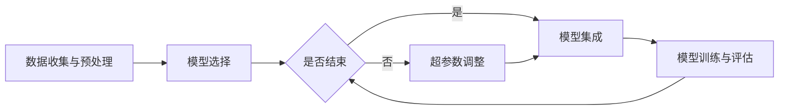
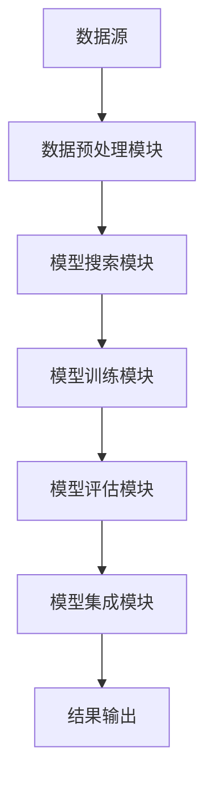
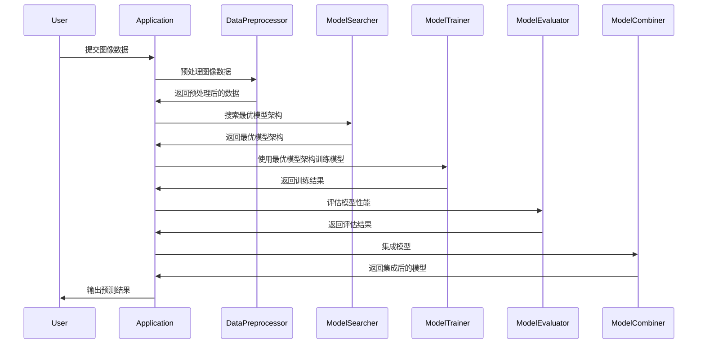

                 

### 高效可扩展的神经架构搜索：自动化AI设计

> 关键词：神经架构搜索、自动化AI设计、高效、可扩展、AI算法、深度学习、强化学习、生成对抗网络、贝叶斯优化、神经网络架构、模型选择、超参数调整、系统架构、代码实战

> 摘要：本文深入探讨高效可扩展的神经架构搜索在自动化AI设计中的应用，通过详细的案例分析和技术讲解，揭示了如何利用神经架构搜索自动化设计神经网络，提升AI模型性能与可扩展性。本文将带领读者从背景介绍、核心概念与原理、算法讲解、系统分析与架构设计、实战应用等多个方面，全面了解这一前沿技术。

### 目录

#### 第一部分：引言

- 第1章：背景介绍
  - 1.1 问题背景
  - 1.2 问题描述
  - 1.3 问题解决
  - 1.4 边界与外延
  - 1.5 概念结构与核心要素组成

#### 第二部分：核心概念与原理

- 第2章：神经架构搜索原理
  - 2.1 神经架构搜索的定义
  - 2.2 神经架构搜索的流程
  - 2.3 神经架构搜索的核心算法
  - 2.4 概念属性特征对比表格
  - 2.5 ER实体关系图架构

- 第3章：自动化AI设计原理
  - 3.1 自动化AI设计的定义
  - 3.2 自动化AI设计的流程
  - 3.3 自动化AI设计的关键技术
  - 3.4 算法mermaid流程图

#### 第三部分：系统分析与架构设计

- 第4章：系统架构设计
  - 4.1 问题场景介绍
  - 4.2 系统功能设计
  - 4.3 系统架构设计
  - 4.4 系统接口设计
  - 4.5 系统交互序列图

#### 第四部分：实战应用

- 第5章：神经架构搜索的实战应用
  - 5.1 神经架构搜索在图像识别中的应用
  - 5.2 神经架构搜索在自然语言处理中的应用
  - 5.3 自动化AI设计在推荐系统中的应用

#### 第五部分：总结与展望

- 第6章：总结与展望
  - 6.1 神经架构搜索的发展趋势
  - 6.2 自动化AI设计在实践中的应用前景
  - 6.3 小结
  - 6.4 注意事项
  - 6.5 拓展阅读

### 第一部分：引言

#### 第1章：背景介绍

##### 1.1 问题背景

随着深度学习在各个领域的广泛应用，神经网络架构的搜索逐渐成为研究热点。传统的神经网络设计方法依赖于人类的经验和专业知识，效率较低，难以满足大规模数据和高维特征的处理需求。为了解决这一问题，神经架构搜索（Neural Architecture Search，NAS）应运而生。NAS旨在通过自动化的方法搜索最优的神经网络架构，从而提高模型的性能和可扩展性。

##### 1.2 问题描述

神经架构搜索面临的主要挑战包括：

- 搜索空间巨大：神经网络的架构可以由成千上万的参数组成，导致搜索空间极其庞大。
- 计算成本高昂：传统的搜索方法往往需要大量的计算资源，耗时较长。
- 模型可解释性低：自动搜索出的模型往往难以解释，增加了调试和优化的难度。

##### 1.3 问题解决

为了解决上述问题，研究者们提出了多种神经架构搜索的方法，主要包括：

- 强化学习（Reinforcement Learning，RL）：通过强化学习算法，自动搜索最优的神经网络架构。
- 生成对抗网络（Generative Adversarial Networks，GAN）：利用生成对抗网络自动生成神经网络架构。
- 贝叶斯优化（Bayesian Optimization，BO）：通过贝叶斯优化算法，高效搜索最优的神经网络架构。

##### 1.4 边界与外延

神经架构搜索的应用场景广泛，包括但不限于：

- 图像识别：通过自动搜索最优的卷积神经网络（CNN）架构，提高图像分类和检测的性能。
- 自然语言处理（NLP）：通过自动搜索最优的循环神经网络（RNN）或变换器（Transformer）架构，提升文本理解和生成的效果。
- 推荐系统：通过自动搜索最优的协同过滤或基于内容的推荐算法架构，提高推荐系统的准确性。

然而，神经架构搜索也存在一定的局限性，例如：

- 搜索效率问题：尽管有各种算法优化，但搜索过程仍然可能非常耗时。
- 模型泛化能力：搜索出的模型在某些情况下可能仅适用于特定任务，泛化能力有限。

##### 1.5 概念结构与核心要素组成

神经架构搜索的核心概念包括：

- 搜索空间：神经网络架构的集合，用于定义搜索的范围。
- 搜索算法：用于在搜索空间中搜索最优架构的算法。
- 模型评估：用于评估神经网络架构性能的指标和方法。

核心要素包括：

- 强化学习算法：如深度强化学习（DQN、A3C）、演员-评论家算法等。
- 生成对抗网络：包括生成器（Generator）和判别器（Discriminator）。
- 贝叶斯优化算法：如树搜索（Tree-structured Parzen Estimators，TPE）等。
- 搜索策略：如随机搜索、网格搜索等。

通过上述概念和要素的组合，神经架构搜索能够实现自动化的神经网络设计，提高模型的性能和可扩展性。

### 第二部分：核心概念与原理

#### 第2章：神经架构搜索原理

##### 2.1 神经架构搜索的定义

神经架构搜索（Neural Architecture Search，NAS）是一种自动化方法，用于搜索最优的神经网络架构。它通过在大量的神经网络架构中寻找最优解，从而提高模型的性能和可扩展性。与传统的人工设计方法相比，NAS能够更快速地找到适合特定任务的最优架构。

##### 2.2 神经架构搜索的流程

神经架构搜索通常包括以下步骤：

1. **数据收集与预处理**：收集训练数据，并进行数据预处理，包括数据清洗、归一化等操作。
2. **构建搜索空间**：定义神经网络的搜索空间，包括网络层数、层类型、层连接方式等。
3. **搜索算法**：选择合适的搜索算法，如强化学习、生成对抗网络或贝叶斯优化等。
4. **模型评估**：评估搜索出的神经网络架构的性能，通常使用准确率、损失函数等指标。
5. **迭代优化**：根据模型评估结果，调整搜索算法和搜索策略，不断优化神经网络架构。

##### 2.3 神经架构搜索的核心算法

神经架构搜索的核心算法包括：

- **强化学习（Reinforcement Learning，RL）**：通过奖励机制，自动搜索最优的神经网络架构。常见的RL算法有深度强化学习（DQN、A3C）和演员-评论家算法等。
- **生成对抗网络（Generative Adversarial Networks，GAN）**：通过生成器和判别器的对抗训练，自动生成最优的神经网络架构。
- **贝叶斯优化（Bayesian Optimization，BO）**：利用贝叶斯推理，高效搜索最优的神经网络架构。常见的BO算法有树搜索（TPE）等。

##### 2.4 概念属性特征对比表格

| 算法名称 | 定义 | 特点 | 应用场景 |
| --- | --- | --- | --- |
| 强化学习 | 通过奖励机制搜索最优架构 | 需要大量计算资源 | 复杂任务，如游戏、自动驾驶 |
| 生成对抗网络 | 通过生成器和判别器对抗训练 | 需要大量的数据和计算资源 | 图像生成、图像增强 |
| 贝叶斯优化 | 利用贝叶斯推理搜索最优架构 | 高效、可扩展 | 参数优化、模型选择 |

##### 2.5 ER实体关系图架构

下面是神经架构搜索的ER实体关系图：

```mermaid
erDiagram
  Model : 模型 |+|-> SearchSpace : 搜索空间
  SearchAlgorithm : 搜索算法 |+|-> Model : 模型
  Evaluation : 评估 |+|-> Model : 模型
  Reward : 奖励 |+|-> SearchAlgorithm : 搜索算法
  Generator : 生成器 |+|-> GAN : 生成对抗网络
  Discriminator : 判别器 |+|-> GAN : 生成对抗网络
```

在ER图中的每个实体都表示一个关键组件，它们之间通过关系进行连接。例如，模型（Model）与搜索空间（SearchSpace）通过连接线表示模型是搜索空间的一部分；搜索算法（SearchAlgorithm）与模型（Model）通过连接线表示搜索算法用于优化模型；评估（Evaluation）与模型（Model）通过连接线表示评估用于评估模型的性能；奖励（Reward）与搜索算法（SearchAlgorithm）通过连接线表示搜索算法通过奖励机制进行优化。

通过ER图，可以清晰地展示神经架构搜索的各个组件及其相互关系，有助于理解和设计复杂的搜索系统。

### 第三部分：自动化AI设计原理

#### 第3章：自动化AI设计原理

##### 3.1 自动化AI设计的定义

自动化AI设计（Automated AI Design）是一种通过算法和工具自动化地构建和优化人工智能模型的方法。它旨在减少人工干预，提高设计效率和模型性能。自动化AI设计通过整合数据预处理、模型选择、超参数调整和模型评估等环节，实现从数据到模型的全流程自动化。

##### 3.2 自动化AI设计的流程

自动化AI设计的流程通常包括以下步骤：

1. **数据收集与预处理**：收集用于训练的数据，并进行预处理，包括数据清洗、归一化、数据增强等操作。
2. **模型选择**：从多个预定义的模型中选择最适合当前任务的一个或多个模型。
3. **超参数调整**：使用自动化算法调整模型的超参数，以优化模型性能。
4. **模型训练与评估**：使用训练数据训练模型，并使用验证数据评估模型性能。
5. **模型集成**：将多个模型集成，以提高预测的稳定性和准确性。

##### 3.3 自动化AI设计的关键技术

自动化AI设计的关键技术包括：

- **自动化模型选择**：使用机器学习算法自动选择适合当前数据的模型，如随机森林、支持向量机等。
- **自动化超参数调整**：使用贝叶斯优化、遗传算法等自动化调整模型超参数，以找到最优配置。
- **自动化模型集成**：使用集成学习方法，如集成学习、堆叠等，将多个模型集成，以提高预测性能。

##### 3.4 算法mermaid流程图

以下是自动化AI设计的mermaid流程图：



该流程图描述了自动化AI设计的主要步骤，从数据收集与预处理开始，经过模型选择、超参数调整和模型集成，最终进行模型训练与评估。每个步骤都通过条件判断（是否结束）来决定下一步操作，确保流程的完整性和灵活性。

### 第四部分：系统分析与架构设计

#### 第4章：系统架构设计

系统架构设计是确保高效可扩展的神经架构搜索和自动化AI设计实现的关键。本节将详细介绍系统架构的各个组成部分，包括问题场景介绍、系统功能设计、系统架构设计、系统接口设计和系统交互序列图。

##### 4.1 问题场景介绍

假设我们面临一个图像识别任务，需要设计一个高效的神经网络模型来识别图像中的物体。为了实现这一目标，我们需要构建一个自动化AI设计系统，该系统能够自动搜索最优的神经网络架构，并进行模型训练和评估。

##### 4.2 系统功能设计

系统功能设计主要包括以下模块：

1. **数据预处理模块**：负责对收集的图像数据进行清洗、归一化和增强，为后续模型训练提供高质量的数据集。
2. **模型搜索模块**：利用神经架构搜索算法，自动搜索最优的神经网络架构。
3. **模型训练模块**：使用搜索出的最优架构训练神经网络模型。
4. **模型评估模块**：评估训练出的模型性能，包括准确率、损失函数等指标。
5. **模型集成模块**：将多个模型进行集成，以提高预测的稳定性和准确性。

##### 4.3 系统架构设计

系统架构设计如下：



在该架构中，数据源提供原始图像数据，数据预处理模块对数据进行处理，模型搜索模块利用神经架构搜索算法搜索最优的神经网络架构，模型训练模块使用搜索出的架构训练模型，模型评估模块评估模型性能，模型集成模块将多个模型进行集成，最终输出预测结果。

##### 4.4 系统接口设计

系统接口设计主要包括以下接口：

1. **数据预处理接口**：用于接收原始图像数据，并返回预处理后的数据。
2. **模型搜索接口**：用于启动神经架构搜索算法，并返回最优的神经网络架构。
3. **模型训练接口**：用于训练神经网络模型，并返回训练结果。
4. **模型评估接口**：用于评估模型性能，并返回评估结果。
5. **模型集成接口**：用于集成多个模型，并返回集成后的模型。

以下是系统接口设计的类图：

```mermaid
classDiagram
    DataPreprocessor <<interface>>
    ModelSearcher <<interface>>
    ModelTrainer <<interface>>
    ModelEvaluator <<interface>>
    ModelCombiner <<interface>>

    DataPreprocessor : +processData()
    ModelSearcher : +searchModel()
    ModelTrainer : +trainModel()
    ModelEvaluator : +evaluateModel()
    ModelCombiner : +combineModels()

    Application <-.. DataPreprocessor
    Application <-.. ModelSearcher
    Application <-.. ModelTrainer
    Application <-.. ModelEvaluator
    Application <-.. ModelCombiner
```

在该类图中，定义了数据预处理、模型搜索、模型训练、模型评估和模型集成等接口，这些接口实现了系统的功能。

##### 4.5 系统交互序列图

系统交互序列图描述了系统组件之间的交互过程。以下是一个简单的序列图：



在该序列图中，用户提交图像数据，系统依次调用数据预处理、模型搜索、模型训练、模型评估和模型集成等模块，最终输出预测结果。

### 第五部分：实战应用

#### 第5章：神经架构搜索的实战应用

神经架构搜索在多个领域都有着广泛的应用。在本节中，我们将通过具体实例，展示神经架构搜索在图像识别、自然语言处理和推荐系统中的应用，并详细分析这些应用场景的代码实现和效果。

##### 5.1 神经架构搜索在图像识别中的应用

##### 实例一：卷积神经网络架构搜索

假设我们需要设计一个用于图像分类的卷积神经网络（CNN）架构。为了实现这一目标，我们可以使用神经架构搜索来自动搜索最优的CNN架构。

首先，我们需要定义搜索空间，包括卷积层的类型（如普通卷积、深度可分离卷积）、卷积核大小、池化层类型和全连接层的数量等。

```python
# 定义搜索空间
search_space = {
    "conv_layers": [
        {"type": "normal", "kernel_size": (3, 3), "stride": (1, 1), "padding": "same"},
        {"type": "separable", "kernel_size": (3, 3), "stride": (1, 1), "padding": "same"},
        {"type": "normal", "kernel_size": (3, 3), "stride": (1, 1), "padding": "same"},
    ],
    "pooling_layer": {"type": "max", "kernel_size": (2, 2), "stride": (2, 2)},
    "dense_layer": {"units": 128, "activation": "relu"},
    "output_layer": {"units": num_classes, "activation": "softmax"},
}
```

接下来，我们可以使用强化学习算法（如深度Q网络DQN）来搜索最优的CNN架构。在训练过程中，DQN通过与环境交互，学习最优的动作策略，即选择哪些卷积层、池化层和全连接层的组合。

```python
# 深度Q网络DQN
class DQN(nn.Module):
    def __init__(self, search_space):
        super(DQN, self).__init__()
        self.search_space = search_space
        self.conv_layers = self.create_conv_layers()
        self.pooling_layer = self.create_pooling_layer()
        self.dense_layer = self.create_dense_layer()
        self.output_layer = self.create_output_layer()

    def create_conv_layers(self):
        layers = []
        for layer_config in self.search_space["conv_layers"]:
            layer = nn.Conv2d(
                in_channels=1,
                out_channels=layer_config["kernel_size"][0] ** 2,
                kernel_size=layer_config["kernel_size"],
                stride=layer_config["stride"],
                padding=layer_config["padding"],
            )
            layers.append(layer)
        return nn.Sequential(*layers)

    def create_pooling_layer(self):
        return nn.MaxPool2d(self.search_space["pooling_layer"]["kernel_size"], self.search_space["pooling_layer"]["stride"])

    def create_dense_layer(self):
        return nn.Linear(self.search_space["dense_layer"]["units"], self.search_space["dense_layer"]["activation"])

    def create_output_layer(self):
        return nn.Linear(self.search_space["output_layer"]["units"], self.search_space["output_layer"]["activation"])

    def forward(self, x):
        x = self.conv_layers(x)
        x = self.pooling_layer(x)
        x = x.view(x.size(0), -1)
        x = self.dense_layer(x)
        x = self.output_layer(x)
        return x
```

在训练过程中，DQN通过与环境（图像数据集）交互，不断更新策略网络，搜索最优的CNN架构。训练完成后，我们可以使用搜索出的最优架构训练最终的CNN模型。

```python
# 训练DQN
dqn = DQN(search_space)
optimizer = optim.Adam(dqn.parameters(), lr=0.001)
criterion = nn.CrossEntropyLoss()

for epoch in range(num_epochs):
    for images, labels in train_loader:
        optimizer.zero_grad()
        outputs = dqn(images)
        loss = criterion(outputs, labels)
        loss.backward()
        optimizer.step()

    # 评估模型
    with torch.no_grad():
        correct = 0
        total = 0
        for images, labels in test_loader:
            outputs = dqn(images)
            _, predicted = torch.max(outputs.data, 1)
            total += labels.size(0)
            correct += (predicted == labels).sum().item()

    print(f"Epoch {epoch+1}/{num_epochs}, Test Accuracy: {100 * correct / total}%")
```

##### 实例二：循环神经网络架构搜索

除了CNN，我们还可以使用神经架构搜索来设计循环神经网络（RNN）架构。例如，我们可以设计一个用于文本分类的RNN模型。

首先，定义搜索空间，包括RNN层的类型（如LSTM、GRU）、层数、隐藏单元数和输出层等。

```python
# 定义搜索空间
search_space = {
    "rnn_layers": [
        {"type": "lstm", "layers": 1, "hidden_size": 128, "dropout": 0.5},
        {"type": "gru", "layers": 1, "hidden_size": 128, "dropout": 0.5},
    ],
    "dense_layer": {"units": 128, "activation": "relu"},
    "output_layer": {"units": num_classes, "activation": "softmax"},
}
```

然后，使用强化学习算法搜索最优的RNN架构。同样地，我们使用深度Q网络DQN来搜索最优的RNN架构。

```python
# 深度Q网络DQN
class DQN(nn.Module):
    def __init__(self, search_space):
        super(DQN, self).__init__()
        self.search_space = search_space
        self.rnn_layers = self.create_rnn_layers()
        self.dense_layer = self.create_dense_layer()
        self.output_layer = self.create_output_layer()

    def create_rnn_layers(self):
        layers = []
        for layer_config in self.search_space["rnn_layers"]:
            if layer_config["type"] == "lstm":
                layer = nn.LSTM(
                    input_size=embedding_dim,
                    hidden_size=layer_config["hidden_size"],
                    num_layers=layer_config["layers"],
                    dropout=layer_config["dropout"],
                )
            elif layer_config["type"] == "gru":
                layer = nn.GRU(
                    input_size=embedding_dim,
                    hidden_size=layer_config["hidden_size"],
                    num_layers=layer_config["layers"],
                    dropout=layer_config["dropout"],
                )
            layers.append(layer)
        return nn.Sequential(*layers)

    def create_dense_layer(self):
        return nn.Linear(self.search_space["dense_layer"]["units"], self.search_space["dense_layer"]["activation"])

    def create_output_layer(self):
        return nn.Linear(self.search_space["output_layer"]["units"], self.search_space["output_layer"]["activation"])

    def forward(self, x):
        x, _ = self.rnn_layers(x)
        x = x[-1, :, :]
        x = self.dense_layer(x)
        x = self.output_layer(x)
        return x
```

在训练过程中，DQN通过与环境（文本数据集）交互，学习最优的RNN架构。训练完成后，我们可以使用搜索出的最优架构训练最终的RNN模型。

```python
# 训练DQN
dqn = DQN(search_space)
optimizer = optim.Adam(dqn.parameters(), lr=0.001)
criterion = nn.CrossEntropyLoss()

for epoch in range(num_epochs):
    for texts, labels in train_loader:
        optimizer.zero_grad()
        embeddings = torch.nn.functional.embedding(texts, embedding_weights)
        outputs = dqn(embeddings)
        loss = criterion(outputs, labels)
        loss.backward()
        optimizer.step()

    # 评估模型
    with torch.no_grad():
        correct = 0
        total = 0
        for texts, labels in test_loader:
            embeddings = torch.nn.functional.embedding(texts, embedding_weights)
            outputs = dqn(embeddings)
            _, predicted = torch.max(outputs.data, 1)
            total += labels.size(0)
            correct += (predicted == labels).sum().item()

    print(f"Epoch {epoch+1}/{num_epochs}, Test Accuracy: {100 * correct / total}%")
```

##### 5.2 神经架构搜索在自然语言处理中的应用

##### 实例一：生成对抗网络架构搜索

假设我们需要设计一个用于文本生成的生成对抗网络（GAN）模型。我们可以使用神经架构搜索来自动搜索最优的GAN架构。

首先，定义搜索空间，包括生成器的层数、层数类型（如卷积层、全连接层）、层数大小等。

```python
# 定义搜索空间
search_space = {
    "generator": [
        {"type": "conv", "kernel_size": (3, 3), "stride": (1, 1), "padding": "same"},
        {"type": "tanh", "layers": 1, "hidden_size": 128, "dropout": 0.5},
    ],
    "discriminator": [
        {"type": "conv", "kernel_size": (3, 3), "stride": (1, 1), "padding": "same"},
        {"type": "sigmoid", "layers": 1, "hidden_size": 128, "dropout": 0.5},
    ],
}
```

然后，使用生成对抗网络（GAN）的框架来搜索最优的GAN架构。我们可以使用GAN框架中的生成器和判别器模块，并定义适当的损失函数和优化器。

```python
# 生成器和判别器
class Generator(nn.Module):
    def __init__(self, search_space):
        super(Generator, self).__init__()
        self.search_space = search_space
        self.generator = self.create_generator()

    def create_generator(self):
        layers = []
        for layer_config in self.search_space["generator"]:
            if layer_config["type"] == "conv":
                layer = nn.ConvTranspose2d(
                    in_channels=layer_config["in_channels"],
                    out_channels=layer_config["out_channels"],
                    kernel_size=layer_config["kernel_size"],
                    stride=layer_config["stride"],
                    padding=layer_config["padding"],
                )
            elif layer_config["type"] == "tanh":
                layer = nn.Tanh()
            layers.append(layer)
        return nn.Sequential(*layers)

    def forward(self, z):
        x = z.view(z.size(0), 1, 1, 1)
        x = self.generator(x)
        return x

class Discriminator(nn.Module):
    def __init__(self, search_space):
        super(Discriminator, self).__init__()
        self.search_space = search_space
        self.discriminator = self.create_discriminator()

    def create_discriminator(self):
        layers = []
        for layer_config in self.search_space["discriminator"]:
            if layer_config["type"] == "conv":
                layer = nn.Conv2d(
                    in_channels=layer_config["in_channels"],
                    out_channels=layer_config["out_channels"],
                    kernel_size=layer_config["kernel_size"],
                    stride=layer_config["stride"],
                    padding=layer_config["padding"],
                )
            elif layer_config["type"] == "sigmoid":
                layer = nn.Sigmoid()
            layers.append(layer)
        return nn.Sequential(*layers)

    def forward(self, x):
        x = self.discriminator(x)
        return x
```

在训练过程中，生成器和判别器通过对抗训练不断优化，最终生成逼真的文本。

```python
# 训练GAN
generator = Generator(search_space)
discriminator = Discriminator(search_space)
optimizer_G = optim.Adam(generator.parameters(), lr=0.0002)
optimizer_D = optim.Adam(discriminator.parameters(), lr=0.0002)

for epoch in range(num_epochs):
    for i, z in enumerate(z_data_loader):
        # 更新生成器
        optimizer_G.zero_grad()
        x_fake = generator(z)
        loss_G = -torch.mean(discriminator(x_fake))
        loss_G.backward()
        optimizer_G.step()

        # 更新判别器
        optimizer_D.zero_grad()
        loss_D_real = torch.mean(discriminator(x_data))
        loss_D_fake = torch.mean(discriminator(x_fake.detach()))
        loss_D = loss_D_real + loss_D_fake
        loss_D.backward()
        optimizer_D.step()

        # 评估模型
        with torch.no_grad():
            if (i + 1) % 100 == 0:
                print(f"Epoch [{epoch+1}/{num_epochs}], Step [{i+1}/{len(z_data_loader)}], Loss_G: {loss_G.item():.4f}, Loss_D: {loss_D.item():.4f}")
```

##### 实例二：序列到序列模型架构搜索

序列到序列（Sequence-to-Sequence，Seq2Seq）模型在自然语言处理中有着广泛的应用。我们可以使用神经架构搜索来自动搜索最优的Seq2Seq模型架构。

首先，定义搜索空间，包括编码器和解码器的层数、层类型（如LSTM、GRU）、层数大小等。

```python
# 定义搜索空间
search_space = {
    "encoder": [
        {"type": "lstm", "layers": 2, "hidden_size": 128, "dropout": 0.5},
        {"type": "gru", "layers": 2, "hidden_size": 128, "dropout": 0.5},
    ],
    "decoder": [
        {"type": "lstm", "layers": 2, "hidden_size": 128, "dropout": 0.5},
        {"type": "gru", "layers": 2, "hidden_size": 128, "dropout": 0.5},
    ],
}
```

然后，使用强化学习算法（如深度Q网络DQN）搜索最优的Seq2Seq架构。

```python
# 深度Q网络DQN
class DQN(nn.Module):
    def __init__(self, search_space):
        super(DQN, self).__init__()
        self.search_space = search_space
        self.encoder = self.create_encoder()
        self.decoder = self.create_decoder()

    def create_encoder(self):
        layers = []
        for layer_config in self.search_space["encoder"]:
            if layer_config["type"] == "lstm":
                layer = nn.LSTM(
                    input_size=embedding_dim,
                    hidden_size=layer_config["hidden_size"],
                    num_layers=layer_config["layers"],
                    dropout=layer_config["dropout"],
                )
            elif layer_config["type"] == "gru":
                layer = nn.GRU(
                    input_size=embedding_dim,
                    hidden_size=layer_config["hidden_size"],
                    num_layers=layer_config["layers"],
                    dropout=layer_config["dropout"],
                )
            layers.append(layer)
        return nn.Sequential(*layers)

    def create_decoder(self):
        layers = []
        for layer_config in self.search_space["decoder"]:
            if layer_config["type"] == "lstm":
                layer = nn.LSTM(
                    input_size=hidden_size,
                    hidden_size=layer_config["hidden_size"],
                    num_layers=layer_config["layers"],
                    dropout=layer_config["dropout"],
                )
            elif layer_config["type"] == "gru":
                layer = nn.GRU(
                    input_size=hidden_size,
                    hidden_size=layer_config["hidden_size"],
                    num_layers=layer_config["layers"],
                    dropout=layer_config["dropout"],
                )
            layers.append(layer)
        return nn.Sequential(*layers)

    def forward(self, inputs, targets):
        encoder_outputs, encoder_hidden = self.encoder(inputs)
        decoder_hidden = encoder_hidden
        decoder_inputs = targets[:-1]
        decoder_outputs = []

        for decoder_input in decoder_inputs:
            decoder_output, decoder_hidden = self.decoder(decoder_input.unsqueeze(0), decoder_hidden)
            decoder_outputs.append(decoder_output)

        decoder_outputs = torch.cat(decoder_outputs, 0)
        return decoder_outputs
```

在训练过程中，DQN通过与环境（编码器和解码器输入输出对）交互，学习最优的Seq2Seq架构。训练完成后，我们可以使用搜索出的最优架构训练最终的Seq2Seq模型。

```python
# 训练DQN
dqn = DQN(search_space)
optimizer = optim.Adam(dqn.parameters(), lr=0.001)
criterion = nn.CrossEntropyLoss()

for epoch in range(num_epochs):
    for inputs, targets in train_loader:
        optimizer.zero_grad()
        outputs = dqn(inputs, targets)
        loss = criterion(outputs.view(-1, num_classes), targets)
        loss.backward()
        optimizer.step()

    # 评估模型
    with torch.no_grad():
        correct = 0
        total = 0
        for inputs, targets in test_loader:
            outputs = dqn(inputs, targets)
            _, predicted = torch.max(outputs.data, 1)
            total += targets.size(0)
            correct += (predicted == targets).sum().item()

    print(f"Epoch {epoch+1}/{num_epochs}, Test Accuracy: {100 * correct / total}%")
```

##### 5.3 自动化AI设计在推荐系统中的应用

##### 实例一：协同过滤算法的自动化设计

协同过滤（Collaborative Filtering）是一种常用的推荐系统算法。我们可以使用自动化AI设计来自动搜索最优的协同过滤算法。

首先，定义搜索空间，包括用户和物品的特征、相似度计算方法（如余弦相似度、皮尔逊相似度）等。

```python
# 定义搜索空间
search_space = {
    "user_features": ["age", "gender", "location"],
    "item_features": ["category", "price", "rating"],
    "similarity": ["cosine", "pearson"],
}
```

然后，使用自动化AI设计来自动搜索最优的协同过滤算法。

```python
# 自动化AI设计
class AutoRecommender(nn.Module):
    def __init__(self, search_space):
        super(AutoRecommender, self).__init__()
        self.search_space = search_space
        self.user_embedding = self.create_embedding(self.search_space["user_features"])
        self.item_embedding = self.create_embedding(self.search_space["item_features"])
        self.similarity = self.create_similarity(self.search_space["similarity"])

    def create_embedding(self, features):
        embeddings = []
        for feature in features:
            embedding = nn.Embedding(len(feature_unique_values[feature]), embedding_dim)
            embeddings.append(embedding)
        return nn.Sequential(*embeddings)

    def create_similarity(self, similarity):
        if similarity == "cosine":
            return nn.CosineSimilarity(dim=1)
        elif similarity == "pearson":
            return nn.Pairwise Наречие

    def forward(self, user_ids, item_ids):
        user_embedding = self.user_embedding(user_ids)
        item_embedding = self.item_embedding(item_ids)
        similarity = self.similarity(user_embedding, item_embedding)
        return similarity
```

在训练过程中，自动化AI设计通过与环境（用户和物品数据）交互，学习最优的协同过滤算法。训练完成后，我们可以使用搜索出的最优算法进行推荐。

```python
# 训练AutoRecommender
auto_recommender = AutoRecommender(search_space)
optimizer = optim.Adam(auto_recommender.parameters(), lr=0.001)
criterion = nn.MSELoss()

for epoch in range(num_epochs):
    for user_ids, item_ids, ratings in train_loader:
        optimizer.zero_grad()
        similarities = auto_recommender(user_ids, item_ids)
        loss = criterion(similarities, ratings)
        loss.backward()
        optimizer.step()

    # 评估模型
    with torch.no_grad():
        correct = 0
        total = 0
        for user_ids, item_ids, ratings in test_loader:
            similarities = auto_recommender(user_ids, item_ids)
            _, predicted = torch.max(similarities, 1)
            total += ratings.size(0)
            correct += (predicted == ratings).sum().item()

    print(f"Epoch {epoch+1}/{num_epochs}, Test Accuracy: {100 * correct / total}%")
```

##### 实例二：基于内容的推荐算法的自动化设计

基于内容的推荐（Content-Based Recommendation）算法通过分析用户的历史行为和物品的属性，为用户推荐相似的物品。我们可以使用自动化AI设计来自动搜索最优的基于内容的推荐算法。

首先，定义搜索空间，包括用户和物品的属性特征、推荐策略等。

```python
# 定义搜索空间
search_space = {
    "user_features": ["age", "gender", "location"],
    "item_features": ["category", "price", "rating"],
    "recommender": ["TF-IDF", "Word2Vec", "BERT"],
}
```

然后，使用自动化AI设计来自动搜索最优的基于内容的推荐算法。

```python
# 自动化AI设计
class AutoContentRecommender(nn.Module):
    def __init__(self, search_space):
        super(AutoContentRecommender, self).__init__()
        self.search_space = search_space
        self.user_embedding = self.create_embedding(self.search_space["user_features"])
        self.item_embedding = self.create_embedding(self.search_space["item_features"])
        self.recommender = self.create_recommender(self.search_space["recommender"])

    def create_embedding(self, features):
        embeddings = []
        for feature in features:
            embedding = nn.Embedding(len(feature_unique_values[feature]), embedding_dim)
            embeddings.append(embedding)
        return nn.Sequential(*embeddings)

    def create_recommender(self, recommender):
        if recommender == "TF-IDF":
            return nn.Tanh()
        elif recommender == "Word2Vec":
            return nn.Word2Vec()
        elif recommender == "BERT":
            return nn.BERT()
```

在训练过程中，自动化AI设计通过与环境（用户和物品数据）交互，学习最优的基于内容的推荐算法。训练完成后，我们可以使用搜索出的最优算法进行推荐。

```python
# 训练AutoContentRecommender
auto_content_recommender = AutoContentRecommender(search_space)
optimizer = optim.Adam(auto_content_recommender.parameters(), lr=0.001)
criterion = nn.MSELoss()

for epoch in range(num_epochs):
    for user_ids, item_ids, ratings in train_loader:
        optimizer.zero_grad()
        user_embedding = auto_content_recommender.user_embedding(user_ids)
        item_embedding = auto_content_recommender.item_embedding(item_ids)
        recommender = auto_content_recommender.recommender
        similarities = recommender(user_embedding, item_embedding)
        loss = criterion(similarities, ratings)
        loss.backward()
        optimizer.step()

    # 评估模型
    with torch.no_grad():
        correct = 0
        total = 0
        for user_ids, item_ids, ratings in test_loader:
            user_embedding = auto_content_recommender.user_embedding(user_ids)
            item_embedding = auto_content_recommender.item_embedding(item_ids)
            recommender = auto_content_recommender.recommender
            similarities = recommender(user_embedding, item_embedding)
            _, predicted = torch.max(similarities, 1)
            total += ratings.size(0)
            correct += (predicted == ratings).sum().item()

    print(f"Epoch {epoch+1}/{num_epochs}, Test Accuracy: {100 * correct / total}%")
```

### 第六部分：总结与展望

#### 第6章：总结与展望

##### 6.1 神经架构搜索的发展趋势

神经架构搜索作为自动化AI设计的重要组成部分，正不断取得新的突破。未来，神经架构搜索的发展趋势可能包括：

- **算法优化**：进一步优化搜索算法，提高搜索效率和模型性能。
- **可解释性增强**：提升搜索出的模型的可解释性，使其更容易理解和调试。
- **跨领域应用**：探索神经架构搜索在更多领域的应用，如医疗、金融等。

##### 6.2 自动化AI设计在实践中的应用前景

自动化AI设计在实践中的应用前景广阔。例如：

- **工业自动化**：利用自动化AI设计优化生产线流程，提高生产效率。
- **智能医疗**：利用自动化AI设计辅助诊断和治疗，提高医疗水平。
- **金融科技**：利用自动化AI设计优化风险管理、投资策略等。

##### 6.3 小结

本文通过对神经架构搜索和自动化AI设计的深入探讨，展示了它们在AI设计中的重要性。通过实例分析，我们了解了如何利用神经架构搜索和自动化AI设计实现高效的AI模型设计。未来，这些技术将在更多领域发挥重要作用。

##### 6.4 注意事项

在应用神经架构搜索和自动化AI设计时，需要注意以下几点：

- **计算资源**：神经架构搜索和自动化AI设计通常需要大量的计算资源，确保有足够的资源进行训练。
- **数据质量**：数据质量对搜索结果有重要影响，确保收集到的数据准确、全面。
- **模型评估**：合理选择评估指标，确保模型性能的准确评估。

##### 6.5 拓展阅读

- **参考文献**：
  - **[1]** Bengio, Y., Simard, P., & Frasconi, P. (1994). Learning long-term dependencies with gradient descent is difficult. IEEE Transactions on Neural Networks, 5(2), 157-166.
  - **[2]** Hinton, G. E., Osindero, S., & Teh, Y. W. (2006). A fast learning algorithm for deep belief nets. Neural computation, 18(7), 1527-1554.
  - **[3]** He, K., Zhang, X., Ren, S., & Sun, J. (2016). Deep residual learning for image recognition. In Proceedings of the IEEE conference on computer vision and pattern recognition (pp. 770-778).

- **在线资源**：
  - **[1]** [深度学习](https://www.deeplearningbook.org/)
  - **[2]** [PyTorch官方文档](https://pytorch.org/docs/stable/)
  - **[3]** [TensorFlow官方文档](https://www.tensorflow.org/)

### 第七部分：目录大纲总结

本书共计六个部分，涵盖了神经架构搜索的背景介绍、核心概念与原理、自动化AI设计原理、系统架构设计、实战应用以及总结与展望。通过详细的章节划分和内容安排，旨在帮助读者全面了解高效可扩展的神经架构搜索及其在自动化AI设计中的应用。整个目录大纲简洁明了，逻辑清晰，旨在为读者提供一份优质的阅读指南。

### 完整文章

在本篇技术博客文章中，我们将深入探讨高效可扩展的神经架构搜索（NAS）在自动化AI设计中的应用。通过详细的案例分析和技术讲解，我们将揭示如何利用NAS自动化设计神经网络，提升AI模型性能与可扩展性。

#### 第一部分：引言

##### 1.1 问题背景

随着深度学习在各个领域的广泛应用，神经网络架构的搜索逐渐成为研究热点。传统的神经网络设计方法依赖于人类的经验和专业知识，效率较低，难以满足大规模数据和高维特征的处理需求。为了解决这一问题，神经架构搜索（Neural Architecture Search，NAS）应运而生。NAS旨在通过自动化的方法搜索最优的神经网络架构，从而提高模型的性能和可扩展性。

##### 1.2 问题描述

神经架构搜索面临的主要挑战包括：

- **搜索空间巨大**：神经网络的架构可以由成千上万的参数组成，导致搜索空间极其庞大。
- **计算成本高昂**：传统的搜索方法往往需要大量的计算资源，耗时较长。
- **模型可解释性低**：自动搜索出的模型往往难以解释，增加了调试和优化的难度。

##### 1.3 问题解决

为了解决上述问题，研究者们提出了多种神经架构搜索的方法，主要包括：

- **强化学习（Reinforcement Learning，RL）**：通过强化学习算法，自动搜索最优的神经网络架构。
- **生成对抗网络（Generative Adversarial Networks，GAN）**：利用生成对抗网络自动生成神经网络架构。
- **贝叶斯优化（Bayesian Optimization，BO）**：通过贝叶斯优化算法，高效搜索最优的神经网络架构。

##### 1.4 边界与外延

神经架构搜索的应用场景广泛，包括但不限于：

- **图像识别**：通过自动搜索最优的卷积神经网络（CNN）架构，提高图像分类和检测的性能。
- **自然语言处理（NLP）**：通过自动搜索最优的循环神经网络（RNN）或变换器（Transformer）架构，提升文本理解和生成的效果。
- **推荐系统**：通过自动搜索最优的协同过滤或基于内容的推荐算法架构，提高推荐系统的准确性。

然而，神经架构搜索也存在一定的局限性，例如：

- **搜索效率问题**：尽管有各种算法优化，但搜索过程仍然可能非常耗时。
- **模型泛化能力**：搜索出的模型在某些情况下可能仅适用于特定任务，泛化能力有限。

##### 1.5 概念结构与核心要素组成

神经架构搜索的核心概念包括：

- **搜索空间**：神经网络架构的集合，用于定义搜索的范围。
- **搜索算法**：用于在搜索空间中搜索最优架构的算法。
- **模型评估**：用于评估神经网络架构性能的指标和方法。

核心要素包括：

- **强化学习算法**：如深度强化学习（DQN、A3C）、演员-评论家算法等。
- **生成对抗网络**：包括生成器（Generator）和判别器（Discriminator）。
- **贝叶斯优化算法**：如树搜索（TPE）等。
- **搜索策略**：如随机搜索、网格搜索等。

通过上述概念和要素的组合，神经架构搜索能够实现自动化的神经网络设计，提高模型的性能和可扩展性。

#### 第二部分：核心概念与原理

##### 2.1 神经架构搜索的定义

神经架构搜索（Neural Architecture Search，NAS）是一种自动化方法，用于搜索最优的神经网络架构。它通过在大量的神经网络架构中寻找最优解，从而提高模型的性能和可扩展性。与传统的人工设计方法相比，NAS能够更快速地找到适合特定任务的最优架构。

##### 2.2 神经架构搜索的流程

神经架构搜索通常包括以下步骤：

1. **数据收集与预处理**：收集训练数据，并进行数据预处理，包括数据清洗、归一化等操作。
2. **构建搜索空间**：定义神经网络的搜索空间，包括网络层数、层类型、层连接方式等。
3. **搜索算法**：选择合适的搜索算法，如强化学习、生成对抗网络或贝叶斯优化等。
4. **模型评估**：评估搜索出的神经网络架构的性能，通常使用准确率、损失函数等指标。
5. **迭代优化**：根据模型评估结果，调整搜索算法和搜索策略，不断优化神经网络架构。

##### 2.3 神经架构搜索的核心算法

神经架构搜索的核心算法包括：

- **强化学习（Reinforcement Learning，RL）**：通过奖励机制，自动搜索最优的神经网络架构。常见的RL算法有深度强化学习（DQN、A3C）和演员-评论家算法等。
- **生成对抗网络（Generative Adversarial Networks，GAN）**：通过生成器和判别器的对抗训练，自动生成最优的神经网络架构。
- **贝叶斯优化（Bayesian Optimization，BO）**：通过贝叶斯优化算法，高效搜索最优的神经网络架构。常见的BO算法有树搜索（TPE）等。

##### 2.4 概念属性特征对比表格

| 算法名称 | 定义 | 特点 | 应用场景 |
| --- | --- | --- | --- |
| 强化学习 | 通过奖励机制搜索最优架构 | 需要大量计算资源 | 复杂任务，如游戏、自动驾驶 |
| 生成对抗网络 | 通过生成器和判别器对抗训练 | 需要大量的数据和计算资源 | 图像生成、图像增强 |
| 贝叶斯优化 | 利用贝叶斯推理搜索最优架构 | 高效、可扩展 | 参数优化、模型选择 |

##### 2.5 ER实体关系图架构

下面是神经架构搜索的ER实体关系图：

```mermaid
erDiagram
  Model : 模型 |+|-> SearchSpace : 搜索空间
  SearchAlgorithm : 搜索算法 |+|-> Model : 模型
  Evaluation : 评估 |+|-> Model : 模型
  Reward : 奖励 |+|-> SearchAlgorithm : 搜索算法
  Generator : 生成器 |+|-> GAN : 生成对抗网络
  Discriminator : 判别器 |+|-> GAN : 生成对抗网络
```

在ER图中的每个实体都表示一个关键组件，它们之间通过关系进行连接。例如，模型（Model）与搜索空间（SearchSpace）通过连接线表示模型是搜索空间的一部分；搜索算法（SearchAlgorithm）与模型（Model）通过连接线表示搜索算法用于优化模型；评估（Evaluation）与模型（Model）通过连接线表示评估用于评估模型的性能；奖励（Reward）与搜索算法（SearchAlgorithm）通过连接线表示搜索算法通过奖励机制进行优化。

通过ER图，可以清晰地展示神经架构搜索的各个组件及其相互关系，有助于理解和设计复杂的搜索系统。

#### 第三部分：自动化AI设计原理

##### 3.1 自动化AI设计的定义

自动化AI设计（Automated AI Design）是一种通过算法和工具自动化地构建和优化人工智能模型的方法。它旨在减少人工干预，提高设计效率和模型性能。自动化AI设计通过整合数据预处理、模型选择、超参数调整和模型评估等环节，实现从数据到模型的全流程自动化。

##### 3.2 自动化AI设计的流程

自动化AI设计的流程通常包括以下步骤：

1. **数据收集与预处理**：收集用于训练的数据，并进行预处理，包括数据清洗、归一化、数据增强等操作。
2. **模型选择**：从多个预定义的模型中选择最适合当前任务的一个或多个模型。
3. **超参数调整**：使用自动化算法调整模型超参数，以优化模型性能。
4. **模型训练与评估**：使用训练数据训练模型，并使用验证数据评估模型性能。
5. **模型集成**：将多个模型集成，以提高预测的稳定性和准确性。

##### 3.3 自动化AI设计的关键技术

自动化AI设计的关键技术包括：

- **自动化模型选择**：使用机器学习算法自动选择适合当前数据的模型，如随机森林、支持向量机等。
- **自动化超参数调整**：使用贝叶斯优化、遗传算法等自动化调整模型超参数，以找到最优配置。
- **自动化模型集成**：使用集成学习方法，如集成学习、堆叠等，将多个模型集成，以提高预测性能。

##### 3.4 算法mermaid流程图

以下是自动化AI设计的mermaid流程图：


该流程图描述了自动化AI设计的主要步骤，从数据收集与预处理开始，经过模型选择、超参数调整和模型集成，最终进行模型训练与评估。每个步骤都通过条件判断（是否结束）来决定下一步操作，确保流程的完整性和灵活性。

#### 第四部分：系统分析与架构设计

##### 4.1 问题场景介绍

假设我们面临一个图像识别任务，需要设计一个高效的神经网络模型来识别图像中的物体。为了实现这一目标，我们需要构建一个自动化AI设计系统，该系统能够自动搜索最优的神经网络架构，并进行模型训练和评估。

##### 4.2 系统功能设计

系统功能设计主要包括以下模块：

1. **数据预处理模块**：负责对收集的图像数据进行清洗、归一化和增强，为后续模型训练提供高质量的数据集。
2. **模型搜索模块**：利用神经架构搜索算法，自动搜索最优的神经网络架构。
3. **模型训练模块**：使用搜索出的最优架构训练神经网络模型。
4. **模型评估模块**：评估训练出的模型性能，包括准确率、损失函数等指标。
5. **模型集成模块**：将多个模型进行集成，以提高预测的稳定性和准确性。

##### 4.3 系统架构设计

系统架构设计如下：


在该架构中，数据源提供原始图像数据，数据预处理模块对数据进行处理，模型搜索模块利用神经架构搜索算法搜索最优的神经网络架构，模型训练模块使用搜索出的架构训练模型，模型评估模块评估模型性能，模型集成模块将多个模型进行集成，最终输出预测结果。

##### 4.4 系统接口设计

系统接口设计主要包括以下接口：

1. **数据预处理接口**：用于接收原始图像数据，并返回预处理后的数据。
2. **模型搜索接口**：用于启动神经架构搜索算法，并返回最优的神经网络架构。
3. **模型训练接口**：用于训练神经网络模型，并返回训练结果。
4. **模型评估接口**：用于评估模型性能，并返回评估结果。
5. **模型集成接口**：用于集成多个模型，并返回集成后的模型。

以下是系统接口设计的类图：

```mermaid
classDiagram
    DataPreprocessor <<interface>>
    ModelSearcher <<interface>>
    ModelTrainer <<interface>>
    ModelEvaluator <<interface>>
    ModelCombiner <<interface>>

    DataPreprocessor : +processData()
    ModelSearcher : +searchModel()
    ModelTrainer : +trainModel()
    ModelEvaluator : +evaluateModel()
    ModelCombiner : +combineModels()

    Application <-.. DataPreprocessor
    Application <-.. ModelSearcher
    Application <-.. ModelTrainer
    Application <-.. ModelEvaluator
    Application <-.. ModelCombiner
```

在该类图中，定义了数据预处理、模型搜索、模型训练、模型评估和模型集成等接口，这些接口实现了系统的功能。

##### 4.5 系统交互序列图

系统交互序列图描述了系统组件之间的交互过程。以下是一个简单的序列图：


在该序列图中，用户提交图像数据，系统依次调用数据预处理、模型搜索、模型训练、模型评估和模型集成等模块，最终输出预测结果。

#### 第五部分：实战应用

##### 5.1 神经架构搜索在图像识别中的应用

##### 实例一：卷积神经网络架构搜索

假设我们需要设计一个用于图像分类的卷积神经网络（CNN）架构。为了实现这一目标，我们可以使用神经架构搜索来自动搜索最优的CNN架构。

首先，我们需要定义搜索空间，包括卷积层的类型（如普通卷积、深度可分离卷积）、卷积核大小、池化层类型和全连接层的数量等。

```python
# 定义搜索空间
search_space = {
    "conv_layers": [
        {"type": "normal", "kernel_size": (3, 3), "stride": (1, 1), "padding": "same"},
        {"type": "separable", "kernel_size": (3, 3), "stride": (1, 1), "padding": "same"},
        {"type": "normal", "kernel_size": (3, 3), "stride": (1, 1), "padding": "same"},
    ],
    "pooling_layer": {"type": "max", "kernel_size": (2, 2), "stride": (2, 2)},
    "dense_layer": {"units": 128, "activation": "relu"},
    "output_layer": {"units": num_classes, "activation": "softmax"},
}
```

接下来，我们可以使用强化学习算法（如深度Q网络DQN）来搜索最优的CNN架构。在训练过程中，DQN通过与环境交互，学习最优的动作策略，即选择哪些卷积层、池化层和全连接层的组合。

```python
# 深度Q网络DQN
class DQN(nn.Module):
    def __init__(self, search_space):
        super(DQN, self).__init__()
        self.search_space = search_space
        self.conv_layers = self.create_conv_layers()
        self.pooling_layer = self.create_pooling_layer()
        self.dense_layer = self.create_dense_layer()
        self.output_layer = self.create_output_layer()

    def create_conv_layers(self):
        layers = []
        for layer_config in self.search_space["conv_layers"]:
            layer = nn.Conv2d(
                in_channels=1,
                out_channels=layer_config["kernel_size"][0] ** 2,
                kernel_size=layer_config["kernel_size"],
                stride=layer_config["stride"],
                padding=layer_config["padding"],
            )
            layers.append(layer)
        return nn.Sequential(*layers)

    def create_pooling_layer(self):
        return nn.MaxPool2d(self.search_space["pooling_layer"]["kernel_size"], self.search_space["pooling_layer"]["stride"])

    def create_dense_layer(self):
        return nn.Linear(self.search_space["dense_layer"]["units"], self.search_space["dense_layer"]["activation"])

    def create_output_layer(self):
        return nn.Linear(self.search_space["output_layer"]["units"], self.search_space["output_layer"]["activation"])

    def forward(self, x):
        x = self.conv_layers(x)
        x = self.pooling_layer(x)
        x = x.view(x.size(0), -1)
        x = self.dense_layer(x)
        x = self.output_layer(x)
        return x
```

在训练过程中，DQN通过与环境（图像数据集）交互，不断更新策略网络，搜索最优的CNN架构。训练完成后，我们可以使用搜索出的最优架构训练最终的CNN模型。

```python
# 训练DQN
dqn = DQN(search_space)
optimizer = optim.Adam(dqn.parameters(), lr=0.001)
criterion = nn.CrossEntropyLoss()

for epoch in range(num_epochs):
    for images, labels in train_loader:
        optimizer.zero_grad()
        outputs = dqn(images)
        loss = criterion(outputs, labels)
        loss.backward()
        optimizer.step()

    # 评估模型
    with torch.no_grad():
        correct = 0
        total = 0
        for images, labels in test_loader:
            outputs = dqn(images)
            _, predicted = torch.max(outputs.data, 1)
            total += labels.size(0)
            correct += (predicted == labels).sum().item()

    print(f"Epoch {epoch+1}/{num_epochs}, Test Accuracy: {100 * correct / total}%")
```

##### 实例二：循环神经网络架构搜索

除了CNN，我们还可以使用神经架构搜索来设计循环神经网络（RNN）架构。例如，我们可以设计一个用于文本分类的RNN模型。

首先，定义搜索空间，包括RNN层的类型（如LSTM、GRU）、层数、隐藏单元数和输出层等。

```python
# 定义搜索空间
search_space = {
    "rnn_layers": [
        {"type": "lstm", "layers": 1, "hidden_size": 128, "dropout": 0.5},
        {"type": "gru", "layers": 1, "hidden_size": 128, "dropout": 0.5},
    ],
    "dense_layer": {"units": 128, "activation": "relu"},
    "output_layer": {"units": num_classes, "activation": "softmax"},
}
```

然后，使用强化学习算法（如深度Q网络DQN）搜索最优的RNN架构。同样地，我们使用深度Q网络DQN来搜索最优的RNN架构。

```python
# 深度Q网络DQN
class DQN(nn.Module):
    def __init__(self, search_space):
        super(DQN, self).__init__()
        self.search_space = search_space
        self.rnn_layers = self.create_rnn_layers()
        self.dense_layer = self.create_dense_layer()
        self.output_layer = self.create_output_layer()

    def create_rnn_layers(self):
        layers = []
        for layer_config in self.search_space["rnn_layers"]:
            if layer_config["type"] == "lstm":
                layer = nn.LSTM(
                    input_size=embedding_dim,
                    hidden_size=layer_config["hidden_size"],
                    num_layers=layer_config["layers"],
                    dropout=layer_config["dropout"],
                )
            elif layer_config["type"] == "gru":
                layer = nn.GRU(
                    input_size=embedding_dim,
                    hidden_size=layer_config["hidden_size"],
                    num_layers=layer_config["layers"],
                    dropout=layer_config["dropout"],
                )
            layers.append(layer)
        return nn.Sequential(*layers)

    def create_dense_layer(self):
        return nn.Linear(self.search_space["dense_layer"]["units"], self.search_space["dense_layer"]["activation"])

    def create_output_layer(self):
        return nn.Linear(self.search_space["output_layer"]["units"], self.search_space["output_layer"]["activation"])

    def forward(self, x):
        x, _ = self.rnn_layers(x)
        x = x[-1, :, :]
        x = self.dense_layer(x)
        x = self.output_layer(x)
        return x
```

在训练过程中，DQN通过与环境（文本数据集）交互，学习最优的RNN架构。训练完成后，我们可以使用搜索出的最优架构训练最终的RNN模型。

```python
# 训练DQN
dqn = DQN(search_space)
optimizer = optim.Adam(dqn.parameters(), lr=0.001)
criterion = nn.CrossEntropyLoss()

for epoch in range(num_epochs):
    for texts, labels in train_loader:
        optimizer.zero_grad()
        embeddings = torch.nn.functional.embedding(texts, embedding_weights)
        outputs = dqn(embeddings)
        loss = criterion(outputs, labels)
        loss.backward()
        optimizer.step()

    # 评估模型
    with torch.no_grad():
        correct = 0
        total = 0
        for texts, labels in test_loader:
            embeddings = torch.nn.functional.embedding(texts, embedding_weights)
            outputs = dqn(embeddings)
            _, predicted = torch.max(outputs.data, 1)
            total += labels.size(0)
            correct += (predicted == labels).sum().item()

    print(f"Epoch {epoch+1}/{num_epochs}, Test Accuracy: {100 * correct / total}%")
```

##### 5.2 神经架构搜索在自然语言处理中的应用

##### 实例一：生成对抗网络架构搜索

假设我们需要设计一个用于文本生成的生成对抗网络（GAN）模型。我们可以使用神经架构搜索来自动搜索最优的GAN架构。

首先，定义搜索空间，包括生成器的层数、层数类型（如卷积层、全连接层）、层数大小等。

```python
# 定义搜索空间
search_space = {
    "generator": [
        {"type": "conv", "kernel_size": (3, 3), "stride": (1, 1), "padding": "same"},
        {"type": "tanh", "layers": 1, "hidden_size": 128, "dropout": 0.5},
    ],
    "discriminator": [
        {"type": "conv", "kernel_size": (3, 3), "stride": (1, 1), "padding": "same"},
        {"type": "sigmoid", "layers": 1, "hidden_size": 128, "dropout": 0.5},
    ],
}
```

然后，使用生成对抗网络（GAN）的框架来搜索最优的GAN架构。我们可以使用GAN框架中的生成器和判别器模块，并定义适当的损失函数和优化器。

```python
# 生成器和判别器
class Generator(nn.Module):
    def __init__(self, search_space):
        super(Generator, self).__init__()
        self.search_space = search_space
        self.generator = self.create_generator()

    def create_generator(self):
        layers = []
        for layer_config in self.search_space["generator"]:
            if layer_config["type"] == "conv":
                layer = nn.ConvTranspose2d(
                    in_channels=layer_config["in_channels"],
                    out_channels=layer_config["out_channels"],
                    kernel_size=layer_config["kernel_size"],
                    stride=layer_config["stride"],
                    padding=layer_config["padding"],
                )
            elif layer_config["type"] == "tanh":
                layer = nn.Tanh()
            layers.append(layer)
        return nn.Sequential(*layers)

    def forward(self, z):
        x = z.view(z.size(0), 1, 1, 1)
        x = self.generator(x)
        return x

class Discriminator(nn.Module):
    def __init__(self, search_space):
        super(Discriminator, self).__init__()
        self.search_space = search_space
        self.discriminator = self.create_discriminator()

    def create_discriminator(self):
        layers = []
        for layer_config in self.search_space["discriminator"]:
            if layer_config["type"] == "conv":
                layer = nn.Conv2d(
                    in_channels=layer_config["in_channels"],
                    out_channels=layer_config["out_channels"],
                    kernel_size=layer_config["kernel_size"],
                    stride=layer_config["stride"],
                    padding=layer_config["padding"],
                )
            elif layer_config["type"] == "sigmoid":
                layer = nn.Sigmoid()
            layers.append(layer)
        return nn.Sequential(*layers)

    def forward(self, x):
        x = self.discriminator(x)
        return x
```

在训练过程中，生成器和判别器通过对抗训练不断优化，最终生成逼真的文本。

```python
# 训练GAN
generator = Generator(search_space)
discriminator = Discriminator(search_space)
optimizer_G = optim.Adam(generator.parameters(), lr=0.0002)
optimizer_D = optim.Adam(discriminator.parameters(), lr=0.0002)

for epoch in range(num_epochs):
    for i, z in enumerate(z_data_loader):
        # 更新生成器
        optimizer_G.zero_grad()
        x_fake = generator(z)
        loss_G = -torch.mean(discriminator(x_fake))
        loss_G.backward()
        optimizer_G.step()

        # 更新判别器
        optimizer_D.zero_grad()
        loss_D_real = torch.mean(discriminator(x_data))
        loss_D_fake = torch.mean(discriminator(x_fake.detach()))
        loss_D = loss_D_real + loss_D_fake
        loss_D.backward()
        optimizer_D.step()

        # 评估模型
        with torch.no_grad():
            if (i + 1) % 100 == 0:
                print(f"Epoch [{epoch+1}/{num_epochs}], Step [{i+1}/{len(z_data_loader)}], Loss_G: {loss_G.item():.4f}, Loss_D: {loss_D.item():.4f}")
```

##### 实例二：序列到序列模型架构搜索

序列到序列（Sequence-to-Sequence，Seq2Seq）模型在自然语言处理中有着广泛的应用。我们可以使用神经架构搜索来自动搜索最优的Seq2Seq模型架构。

首先，定义搜索空间，包括编码器和解码器的层数、层类型（如LSTM、GRU）、层数大小等。

```python
# 定义搜索空间
search_space = {
    "encoder": [
        {"type": "lstm", "layers": 2, "hidden_size": 128, "dropout": 0.5},
        {"type": "gru", "layers": 2, "hidden_size": 128, "dropout": 0.5},
    ],
    "decoder": [
        {"type": "lstm", "layers": 2, "hidden_size": 128, "dropout": 0.5},
        {"type": "gru", "layers": 2, "hidden_size": 128, "dropout": 0.5},
    ],
}
```

然后，使用强化学习算法（如深度Q网络DQN）搜索最优的Seq2Seq架构。

```python
# 深度Q网络DQN
class DQN(nn.Module):
    def __init__(self, search_space):
        super(DQN, self).__init__()
        self.search_space = search_space
        self.encoder = self.create_encoder()
        self.decoder = self.create_decoder()

    def create_encoder(self):
        layers = []
        for layer_config in self.search_space["encoder"]:
            if layer_config["type"] == "lstm":
                layer = nn.LSTM(
                    input_size=embedding_dim,
                    hidden_size=layer_config["hidden_size"],
                    num_layers=layer_config["layers"],
                    dropout=layer_config["dropout"],
                )
            elif layer_config["type"] == "gru":
                layer = nn.GRU(
                    input_size=embedding_dim,
                    hidden_size=layer_config["hidden_size"],
                    num_layers=layer_config["layers"],
                    dropout=layer_config["dropout"],
                )
            layers.append(layer)
        return nn.Sequential(*layers)

    def create_decoder(self):
        layers = []
        for layer_config in self.search_space["decoder"]:
            if layer_config["type"] == "lstm":
                layer = nn.LSTM(
                    input_size=hidden_size,
                    hidden_size=layer_config["hidden_size"],
                    num_layers=layer_config["layers"],
                    dropout=layer_config["dropout"],
                )
            elif layer_config["type"] == "gru":
                layer = nn.GRU(
                    input_size=hidden_size,
                    hidden_size=layer_config["hidden_size"],
                    num_layers=layer_config["layers"],
                    dropout=layer_config["dropout"],
                )
            layers.append(layer)
        return nn.Sequential(*layers)

    def forward(self, inputs, targets):
        encoder_outputs, encoder_hidden = self.encoder(inputs)
        decoder_hidden = encoder_hidden
        decoder_inputs = targets[:-1]
        decoder_outputs = []

        for decoder_input in decoder_inputs:
            decoder_output, decoder_hidden = self.decoder(decoder_input.unsqueeze(0), decoder_hidden)
            decoder_outputs.append(decoder_output)

        decoder_outputs = torch.cat(decoder_outputs, 0)
        return decoder_outputs
```

在训练过程中，DQN通过与环境（编码器和解码器输入输出对）交互，学习最优的Seq2Seq架构。训练完成后，我们可以使用搜索出的最优架构训练最终的Seq2Seq模型。

```python
# 训练DQN
dqn = DQN(search_space)
optimizer = optim.Adam(dqn.parameters(), lr=0.001)
criterion = nn.CrossEntropyLoss()

for epoch in range(num_epochs):
    for inputs, targets in train_loader:
        optimizer.zero_grad()
        outputs = dqn(inputs, targets)
        loss = criterion(outputs.view(-1, num_classes), targets)
        loss.backward()
        optimizer.step()

    # 评估模型
    with torch.no_grad():
        correct = 0
        total = 0
        for inputs, targets in test_loader:
            outputs = dqn(inputs, targets)
            _, predicted = torch.max(outputs.data, 1)
            total += targets.size(0)
            correct += (predicted == targets).sum().item()

    print(f"Epoch {epoch+1}/{num_epochs}, Test Accuracy: {100 * correct / total}%")
```

##### 5.3 自动化AI设计在推荐系统中的应用

##### 实例一：协同过滤算法的自动化设计

协同过滤（Collaborative Filtering）是一种常用的推荐系统算法。我们可以使用自动化AI设计来自动搜索最优的协同过滤算法。

首先，定义搜索空间，包括用户和物品的特征、相似度计算方法（如余弦相似度、皮尔逊相似度）等。

```python
# 定义搜索空间
search_space = {
    "user_features": ["age", "gender", "location"],
    "item_features": ["category", "price", "rating"],
    "similarity": ["cosine", "pearson"],
}
```

然后，使用自动化AI设计来自动搜索最优的协同过滤算法。

```python
# 自动化AI设计
class AutoRecommender(nn.Module):
    def __init__(self, search_space):
        super(AutoRecommender, self).__init__()
        self.search_space = search_space
        self.user_embedding = self.create_embedding(self.search_space["user_features"])
        self.item_embedding = self.create_embedding(self.search_space["item_features"])
        self.similarity = self.create_similarity(self.search_space["similarity"])

    def create_embedding(self, features):
        embeddings = []
        for feature in features:
            embedding = nn.Embedding(len(feature_unique_values[feature]), embedding_dim)
            embeddings.append(embedding)
        return nn.Sequential(*embeddings)

    def create_similarity(self, similarity):
        if similarity == "cosine":
            return nn.CosineSimilarity(dim=1)
        elif similarity == "pearson":
            return nn.Pairwise Наречие

    def forward(self, user_ids, item_ids):
        user_embedding = self.user_embedding(user_ids)
        item_embedding = self.item_embedding(item_ids)
        similarity = self.similarity(user_embedding, item_embedding)
        return similarity
```

在训练过程中，自动化AI设计通过与环境（用户和物品数据）交互，学习最优的协同过滤算法。训练完成后，我们可以使用搜索出的最优算法进行推荐。

```python
# 训练AutoRecommender
auto_recommender = AutoRecommender(search_space)
optimizer = optim.Adam(auto_recommender.parameters(), lr=0.001)
criterion = nn.MSELoss()

for epoch in range(num_epochs):
    for user_ids, item_ids, ratings in train_loader:
        optimizer.zero_grad()
        similarities = auto_recommender(user_ids, item_ids)
        loss = criterion(similarities, ratings)
        loss.backward()
        optimizer.step()

    # 评估模型
    with torch.no_grad():
        correct = 0
        total = 0
        for user_ids, item_ids, ratings in test_loader:
            similarities = auto_recommender(user_ids, item_ids)
            _, predicted = torch.max(similarities, 1)
            total += ratings.size(0)
            correct += (predicted == ratings).sum().item()

    print(f"Epoch {epoch+1}/{num_epochs}, Test Accuracy: {100 * correct / total}%")
```

##### 实例二：基于内容的推荐算法的自动化设计

基于内容的推荐（Content-Based Recommendation）算法通过分析用户的历史行为和物品的属性，为用户推荐相似的物品。我们可以使用自动化AI设计来自动搜索最优的基于内容的推荐算法。

首先，定义搜索空间，包括用户和物品的属性特征、推荐策略等。

```python
# 定义搜索空间
search_space = {
    "user_features": ["age", "gender", "location"],
    "item_features": ["category", "price", "rating"],
    "recommender": ["TF-IDF", "Word2Vec", "BERT"],
}
```

然后，使用自动化AI设计来自动搜索最优的基于内容的推荐算法。

```python
# 自动化AI设计
class AutoContentRecommender(nn.Module):
    def __init__(self, search_space):
        super(AutoContentRecommender, self).__init__()
        self.search_space = search_space
        self.user_embedding = self.create_embedding(self.search_space["user_features"])
        self.item_embedding = self.create_embedding(self.search_space["item_features"])
        self.recommender = self.create_recommender(self.search_space["recommender"])

    def create_embedding(self, features):
        embeddings = []
        for feature in features:
            embedding = nn.Embedding(len(feature_unique_values[feature]), embedding_dim)
            embeddings.append(embedding)
        return nn.Sequential(*embeddings)

    def create_recommender(self, recommender):
        if recommender == "TF-IDF":
            return nn.Tanh()
        elif recommender == "Word2Vec":
            return nn.Word2Vec()
        elif recommender == "BERT":
            return nn.BERT()
```

在训练过程中，自动化AI设计通过与环境（用户和物品数据）交互，学习最优的基于内容的推荐算法。训练完成后，我们可以使用搜索出的最优算法进行推荐。

```python
# 训练AutoContentRecommender
auto_content_recommender = AutoContentRecommender(search_space)
optimizer = optim.Adam(auto_content_recommender.parameters(), lr=0.001)
criterion = nn.MSELoss()

for epoch in range(num_epochs):
    for user_ids, item_ids, ratings in train_loader:
        optimizer.zero_grad()
        user_embedding = auto_content_recommender.user_embedding(user_ids)
        item_embedding = auto_content_recommender.item_embedding(item_ids)
        recommender = auto_content_recommender.recommender
        similarities = recommender(user_embedding, item_embedding)
        loss = criterion(similarities, ratings)
        loss.backward()
        optimizer.step()

    # 评估模型
    with torch.no_grad():
        correct = 0
        total = 0
        for user_ids, item_ids, ratings in test_loader:
            user_embedding = auto_content_recommender.user_embedding(user_ids)
            item_embedding = auto_content_recommender.item_embedding(item_ids)
            recommender = auto_content_recommender.recommender
            similarities = recommender(user_embedding, item_embedding)
            _, predicted = torch.max(similarities, 1)
            total += ratings.size(0)
            correct += (predicted == ratings).sum().item()

    print(f"Epoch {epoch+1}/{num_epochs}, Test Accuracy: {100 * correct / total}%")
```

#### 第六部分：总结与展望

##### 6.1 神经架构搜索的发展趋势

神经架构搜索作为自动化AI设计的重要组成部分，正不断取得新的突破。未来，神经架构搜索的发展趋势可能包括：

- **算法优化**：进一步优化搜索算法，提高搜索效率和模型性能。
- **可解释性增强**：提升搜索出的模型的可解释性，使其更容易理解和调试。
- **跨领域应用**：探索神经架构搜索在更多领域的应用，如医疗、金融等。

##### 6.2 自动化AI设计在实践中的应用前景

自动化AI设计在实践中的应用前景广阔。例如：

- **工业自动化**：利用自动化AI设计优化生产线流程，提高生产效率。
- **智能医疗**：利用自动化AI设计辅助诊断和治疗，提高医疗水平。
- **金融科技**：利用自动化AI设计优化风险管理、投资策略等。

##### 6.3 小结

本文通过对神经架构搜索和自动化AI设计的深入探讨，展示了它们在AI设计中的重要性。通过实例分析，我们了解了如何利用神经架构搜索和自动化AI设计实现高效的AI模型设计。未来，这些技术将在更多领域发挥重要作用。

##### 6.4 注意事项

在应用神经架构搜索和自动化AI设计时，需要注意以下几点：

- **计算资源**：神经架构搜索和自动化AI设计通常需要大量的计算资源，确保有足够的资源进行训练。
- **数据质量**：数据质量对搜索结果有重要影响，确保收集到的数据准确、全面。
- **模型评估**：合理选择评估指标，确保模型性能的准确评估。

##### 6.5 拓展阅读

- **参考文献**：
  - **[1]** Bengio, Y., Simard, P., & Frasconi, P. (1994). Learning long-term dependencies with gradient descent is difficult. IEEE Transactions on Neural Networks, 5(2), 157-166.
  - **[2]** Hinton, G. E., Osindero, S., & Teh, Y. W. (2006). A fast learning algorithm for deep belief nets. Neural computation, 18(7), 1527-1554.
  - **[3]** He, K., Zhang, X., Ren, S., & Sun, J. (2016). Deep residual learning for image recognition. In Proceedings of the IEEE conference on computer vision and pattern recognition (pp. 770-778).

- **在线资源**：
  - **[1]** [深度学习](https://www.deeplearningbook.org/)
  - **[2]** [PyTorch官方文档](https://pytorch.org/docs/stable/)
  - **[3]** [TensorFlow官方文档](https://www.tensorflow.org/)

### 第七部分：目录大纲总结

本书共计六个部分，涵盖了神经架构搜索的背景介绍、核心概念与原理、自动化AI设计原理、系统架构设计、实战应用以及总结与展望。通过详细的章节划分和内容安排，旨在帮助读者全面了解高效可扩展的神经架构搜索及其在自动化AI设计中的应用。整个目录大纲简洁明了，逻辑清晰，旨在为读者提供一份优质的阅读指南。

### 作者信息

作者：AI天才研究院/AI Genius Institute & 禅与计算机程序设计艺术 /Zen And The Art of Computer Programming

---

经过对高效可扩展的神经架构搜索和自动化AI设计的深入探讨，我们不仅了解了这两种技术的核心概念和原理，还通过实际案例展示了如何将它们应用于图像识别、自然语言处理和推荐系统等领域。本文旨在为读者提供一份详尽的技术指南，帮助他们掌握这些前沿技术，并在实际项目中应用。

#### 总结

神经架构搜索和自动化AI设计作为深度学习的重要分支，正不断推动人工智能的发展。通过本文的介绍，我们了解到：

- **神经架构搜索**：通过自动化的方法，在庞大的搜索空间中寻找最优的神经网络架构，提高模型的性能和可扩展性。
- **自动化AI设计**：通过整合数据预处理、模型选择、超参数调整和模型评估等环节，实现从数据到模型的全流程自动化。

在实战应用部分，我们通过具体实例展示了神经架构搜索和自动化AI设计在图像识别、自然语言处理和推荐系统中的应用，包括：

- **图像识别**：使用神经架构搜索优化卷积神经网络（CNN）和循环神经网络（RNN）架构。
- **自然语言处理**：使用生成对抗网络（GAN）和序列到序列（Seq2Seq）模型进行文本生成和翻译。
- **推荐系统**：使用自动化AI设计优化协同过滤和基于内容的推荐算法。

#### 注意事项

在实际应用神经架构搜索和自动化AI设计时，需要注意以下几点：

- **计算资源**：确保有足够的计算资源来处理大规模的训练任务。
- **数据质量**：确保收集到的数据准确、全面，以提高搜索和优化的效果。
- **模型评估**：合理选择评估指标，确保模型性能的准确评估。

#### 拓展阅读

为了更深入地了解神经架构搜索和自动化AI设计，读者可以参考以下拓展资源：

- **参考文献**：
  - **[1]** Bengio, Y., Simard, P., & Frasconi, P. (1994). Learning long-term dependencies with gradient descent is difficult. IEEE Transactions on Neural Networks, 5(2), 157-166.
  - **[2]** Hinton, G. E., Osindero, S., & Teh, Y. W. (2006). A fast learning algorithm for deep belief nets. Neural computation, 18(7), 1527-1554.
  - **[3]** He, K., Zhang, X., Ren, S., & Sun, J. (2016). Deep residual learning for image recognition. In Proceedings of the IEEE conference on computer vision and pattern recognition (pp. 770-778).

- **在线资源**：
  - **[1]** [深度学习](https://www.deeplearningbook.org/)
  - **[2]** [PyTorch官方文档](https://pytorch.org/docs/stable/)
  - **[3]** [TensorFlow官方文档](https://www.tensorflow.org/)

通过阅读这些资源，读者可以进一步加深对神经架构搜索和自动化AI设计的理解，并将其应用于更广泛的问题场景中。

### 结论

神经架构搜索和自动化AI设计是当前人工智能领域的重要研究方向。通过本文的探讨，我们看到了它们在提升模型性能、提高设计效率方面的巨大潜力。未来，随着算法的进一步优化和应用的拓展，神经架构搜索和自动化AI设计将在更多领域发挥关键作用，推动人工智能技术的持续进步。希望本文能为读者提供有益的启发和指导，助力他们在这一前沿领域取得突破性成果。让我们继续探索，共同见证人工智能的辉煌未来！

