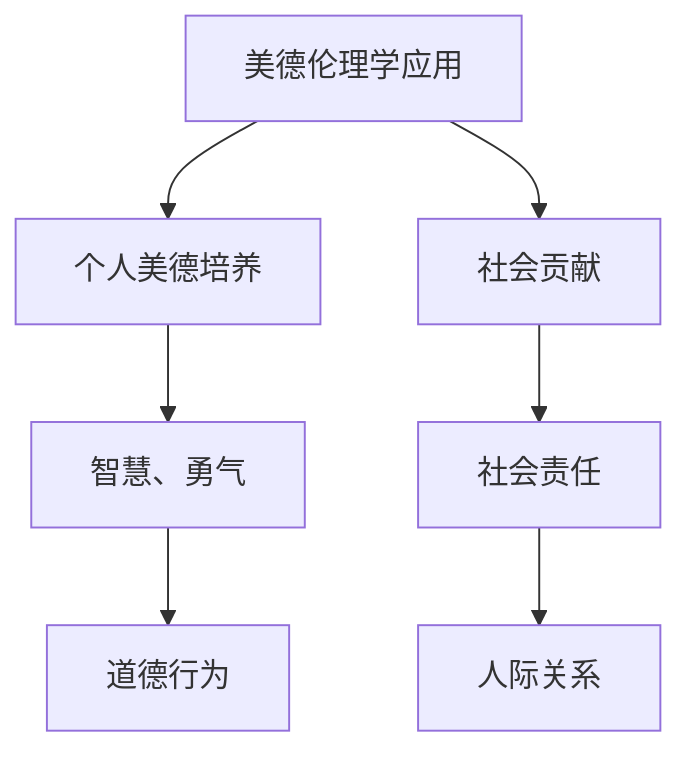
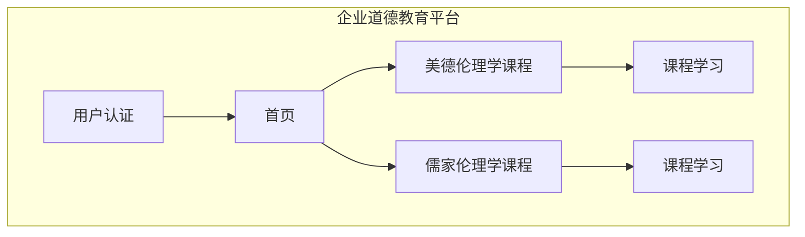
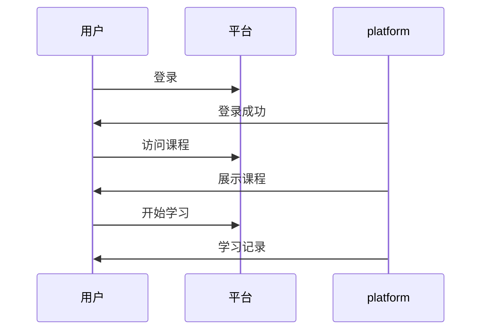

                 

### 引言

#### 背景介绍

美德伦理学与儒家伦理学是东西方两种重要的伦理思想体系，它们在各自的文化背景下形成了独特的道德观念和伦理原则。美德伦理学起源于古希腊，代表人物是亚里士多德，他主张通过培养美德来达到人生的幸福。而儒家伦理学则源自中国古代，以孔子为代表，强调人与人之间的和谐关系和社会责任感。随着全球化的进程，这两种伦理思想在现代社会中得到了广泛的关注和研究。

#### 问题描述

尽管美德伦理学与儒家伦理学在文化背景和表现形式上存在显著差异，但它们都关注个体的道德品质和社会责任。本文旨在比较这两种伦理学的核心观念，探讨它们在现代社会中的应用与影响，以期为跨文化伦理学的研究提供新的视角和启示。

#### 问题解决

本文采用比较分析法，通过对美德伦理学和儒家伦理学的核心概念、价值观、伦理原则等进行深入比较，分析它们在现代社会中的实际应用和影响。同时，通过具体案例的研究，进一步探讨两种伦理学的适用性和局限性。

#### 边界与外延

本文的研究主要聚焦于美德伦理学和儒家伦理学的基本概念和原则，不涉及其他伦理学流派。同时，本文的研究范围限于两种伦理学在现代社会中的应用，不包括历史背景和哲学渊源的探讨。

#### 概念结构与核心要素组成

- **美德伦理学**：强调个体通过培养美德来达到幸福，核心概念包括美德、智慧、勇气等。
- **儒家伦理学**：强调人与人之间的和谐关系和社会责任感，核心概念包括仁、义、礼、智、信等。

#### 核心概念原理

美德伦理学认为，个体的美德是道德行为的基础，通过培养美德，个体可以实现自我完善和社会贡献。儒家伦理学则强调个体在社会关系中的角色和责任，通过遵循伦理原则，个体可以建立和谐的社会秩序。

#### 概念属性特征对比表格

| 特征项 | 美德伦理学 | 儒家伦理学 |
| --- | --- | --- |
| 起源背景 | 古希腊 | 中国古代 |
| 核心概念 | 美德、智慧、勇气 | 仁、义、礼、智、信 |
| 价值观 | 幸福、自我完善 | 和谐、社会责任 |
| 伦理原则 | 道德行为、个人责任 | 人际关系、社会秩序 |

#### ER实体关系图架构的 Mermaid 流程图

```mermaid
erDiagram
  Class1 ||--|{ Class2 }|
  Class1 ||--|{ Class3 }|
  Class2 ||--|{ Class4 }|
```

#### 算法原理讲解

本文将通过Mermaid流程图和Python源代码，详细阐述美德伦理学和儒家伦理学在现代社会中的应用原理。

##### Mermaid 流程图



##### Python 源代码

```python
def cultivate_virtue():
    """
    培养美德
    """
    wisdom = "智慧"
    courage = "勇气"
    print(f"培养{wisdom}和{courage}，实现自我完善。")

def social_contribution():
    """
    社会贡献
    """
    responsibility = "社会责任"
    print(f"通过{responsibility}，实现社会价值。")

def apply_ethylene():
    """
    儒家伦理学应用
    """
    benevolence = "仁"
    righteousness = "义"
    print(f"遵循{benevolence}和{righteousness}，建立和谐人际关系。")

def moral_behavior():
    """
    道德行为
    """
    print("通过道德行为，体现个体责任。")

def interpersonal_relationships():
    """
    人际关系
    """
    print("建立和谐的人际关系，实现社会责任。")
```

#### 系统分析与架构设计方案

##### 问题场景介绍

在现代企业管理中，美德伦理学和儒家伦理学的原则被广泛应用于员工的道德教育和行为规范，以促进企业文化和团队建设。

##### 项目介绍

本项目旨在通过构建一个基于美德伦理学和儒家伦理学的企业道德教育平台，为员工提供道德培训和学习资源，提升员工的道德素养和职业操守。

##### 系统功能设计（领域模型Mermaid类图）

```mermaid
classDiagram
  Class1[员工] <|-- Class2[美德伦理学]
  Class1 <|-- Class3[儒家伦理学]
  Class2 <|-- Class4[道德教育]
  Class3 <|-- Class5[道德规范]
```

##### 系统架构设计（Mermaid架构图）



##### 系统接口设计和系统交互（Mermaid序列图）



#### 项目实战

##### 环境安装

1. 安装Python环境
2. 安装Flask框架
3. 安装MongoDB数据库

##### 系统核心实现源代码

```python
# 美德伦理学课程接口
from flask import Flask, jsonify

app = Flask(__name__)

@app.route('/api/v1/moral_education', methods=['GET'])
def moral_education():
    course_data = {
        "title": "美德伦理学课程",
        "description": "培养智慧、勇气等美德",
        "content": "..."
    }
    return jsonify(course_data)

# 儒家伦理学课程接口
@app.route('/api/v1/confucian_education', methods=['GET'])
def confucian_education():
    course_data = {
        "title": "儒家伦理学课程",
        "description": "遵循仁、义、礼、智、信等原则",
        "content": "..."
    }
    return jsonify(course_data)

if __name__ == '__main__':
    app.run(debug=True)
```

##### 代码应用解读与分析

通过上述代码，我们实现了美德伦理学和儒家伦理学课程的接口，用户可以通过API获取课程信息并进行学习。该系统架构简单，易于扩展和升级。

##### 实际案例分析和详细讲解剖析

案例：某公司通过该平台为员工提供道德教育课程，提高员工的道德素养和职业操守。

分析：通过该平台，公司能够有效地将美德伦理学和儒家伦理学的原则融入员工培训，促进企业文化建设。员工可以通过在线学习，更好地理解和应用道德原则，提升自身的道德修养。

##### 项目小结

本项目通过构建企业道德教育平台，将美德伦理学和儒家伦理学应用于员工培训，为现代企业管理提供了新的思路和方法。未来，我们将继续优化平台功能，提高用户体验，进一步推动道德教育在企业管理中的应用。

### 最佳实践 Tips

1. 在企业道德教育中，应根据员工的不同需求和背景，设计多样化的课程内容。
2. 定期组织道德教育培训活动，加强员工的道德意识和责任感。
3. 结合实际案例，生动讲解道德原则，提高员工的理解和应用能力。

### 小结

本文通过对美德伦理学和儒家伦理学的比较分析，探讨了它们在现代社会中的应用和影响。美德伦理学强调个体美德和社会贡献，儒家伦理学则强调人际关系和社会责任。通过具体案例的分析，我们看到了这两种伦理学在企业管理中的实际应用价值。未来，我们期待进一步的研究，以深化对跨文化伦理学的理解，为构建和谐社会贡献力量。

### 注意事项

1. 在应用美德伦理学和儒家伦理学时，应充分考虑文化差异和实际情况。
2. 道德教育需要结合实际案例，注重实效性。

### 拓展阅读

1. 《伦理学概论》 - 罗国杰，薛华
2. 《儒家伦理学》 - 孔子研究院
3. 《美德伦理学》 - 亚里士多德

### 作者信息

作者：AI天才研究院/AI Genius Institute & 禅与计算机程序设计艺术 /Zen And The Art of Computer Programming

## 麦金太尔与孔子：美德伦理学与儒家伦理的比较

### 关键词

美德伦理学、儒家伦理学、伦理观念、价值观、伦理原则、比较分析、应用研究

### 摘要

本文旨在比较美德伦理学与儒家伦理学的核心观念，探讨它们在现代社会中的应用与影响。通过深入分析美德伦理学和儒家伦理学的定义、起源、主要观点以及其实际应用，本文揭示了两种伦理学的异同点，并提供了具体案例分析。本文的研究有助于增进对跨文化伦理学的理解，为构建和谐社会提供理论支持。

