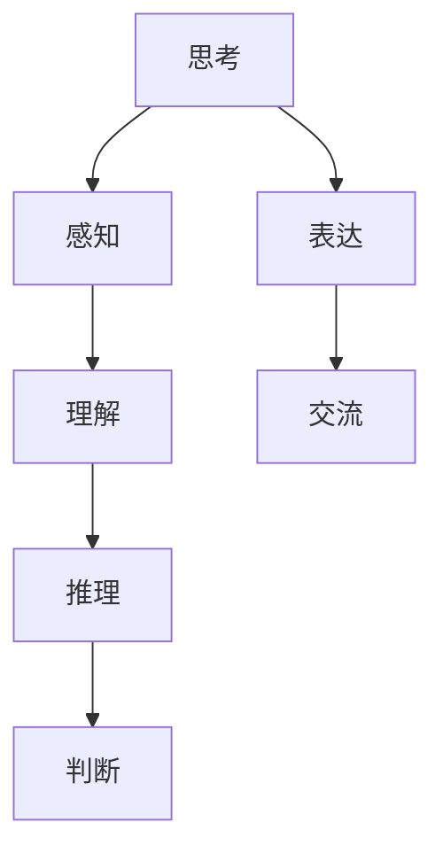
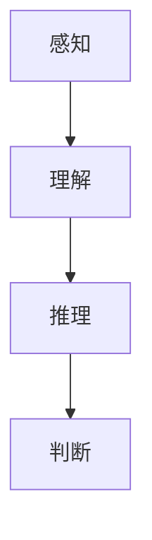

                 

# '说'的背后是思考

## 关键词
- 语言与思考
- 认知心理学
- 语言功能
- 表达与理解
- 逻辑思维

## 摘要
本文旨在探讨言语与思考之间的关系，通过深入分析语言的功能、思考的过程以及认知心理学的相关知识，揭示言语背后隐藏的深刻思考。文章将按照以下结构展开：

1. 引言：介绍问题背景、研究意义和研究方法。
2. 核心概念与联系：定义关键概念，展示概念之间的联系。
3. 语言与思考：探讨语言与思考的关系，分析语言的构成和功能。
4. 思考过程：详细描述思考的过程，包括感知、理解、推理、判断等。
5. 认知心理学：介绍认知心理学的相关知识，探讨思考的心理学基础。
6. 实际应用：讨论思考在实际生活中的应用，包括决策、问题解决等。
7. 最佳实践与启示：总结最佳实践，给出思考的启示和建议。

----------------------------------------------------------------

## 引言

### 问题背景

在人类的社会交往中，言语扮演着至关重要的角色。作为交流的工具，语言不仅帮助我们表达想法、传递信息，还是思考的基础。然而，言语与思考之间存在着复杂而微妙的关系。一方面，言语是我们思考的产物，另一方面，言语又影响着我们的思考过程。

思考是人类认知的核心，是我们理解世界、解决问题的能力。言语与思考的关系涉及到多个层面，包括感知、记忆、推理、判断等。因此，探讨言语与思考之间的关系，有助于我们更深入地理解人类认知的机制，提升我们的思考能力和语言运用水平。

### 研究意义

研究言语与思考的关系，不仅具有理论价值，还具有实际意义。在理论层面，这有助于我们了解人类认知的本质，拓展心理学、语言学、哲学等相关领域的研究。在实际层面，这可以帮助我们提高教育质量、提升工作效率、改善人际沟通等。

通过研究言语与思考的关系，我们可以找到提升思考能力和语言运用水平的有效方法。例如，通过认知训练，我们可以提高思维的灵活性和深度；通过语言学习，我们可以拓宽思维的广度。此外，研究言语与思考的关系，还可以为人工智能的发展提供有益的启示，帮助我们设计出更智能、更自然的语言处理系统。

### 研究方法

本文将采用逻辑分析、案例研究、文献综述等方法，对言语与思考的关系进行深入探讨。具体来说，我们将：

1. **逻辑分析**：通过分析语言的功能、思考的过程，揭示言语与思考之间的内在联系。
2. **案例研究**：选取具体的语言现象和思考案例，进行深入分析和讨论。
3. **文献综述**：回顾相关领域的理论研究成果，总结已有的观点和发现。

通过这些方法，我们希望对言语与思考的关系有一个全面、深入的理解，从而为相关领域的研究提供参考。

----------------------------------------------------------------

## 核心概念与联系

### 语言

语言是人类社会最重要的工具之一，它不仅用于交流，还是思考的基础。语言包括词汇、语法、语义等多个方面。词汇是语言的基本元素，语法是词汇的排列规则，语义是词汇组合后的意义。

#### 关键概念
- **词汇**：语言的基本单位，表示具体的概念或事物。
- **语法**：词汇的排列规则，决定语句的结构和意义。
- **语义**：词汇组合后的意义，包括字面意义和引申意义。

#### 语言功能
- **表达**：通过语言表达思想、情感和意愿。
- **交流**：通过语言进行信息传递和沟通。
- **记忆**：通过语言记录和回忆信息。

### 思考

思考是人类认知的核心过程，包括感知、理解、推理、判断等多个环节。思考是我们理解世界、解决问题、做出决策的基础。

#### 关键概念
- **感知**：通过感官接收外界信息。
- **理解**：对感知到的信息进行加工和理解。
- **推理**：根据已有信息推导出新的结论。
- **判断**：对推理结果进行评价和选择。

#### 思考过程
- **感知**：感知外界信息，如视觉、听觉、触觉等。
- **理解**：对感知到的信息进行加工和理解，如识别、分类、比较等。
- **推理**：根据已有信息推导出新的结论，如逻辑推理、类比推理等。
- **判断**：对推理结果进行评价和选择，如决策、判断真伪等。

### 语言与思考的关系

语言与思考之间存在着紧密的联系。一方面，语言是思考的工具，帮助我们表达和传递思考内容；另一方面，思考又影响着语言的表达和运用。

#### 语言影响思考
- **语言限制思考**：不同的语言环境会影响我们的思维方式，如语言中的词汇、语法、语义等都会影响我们的思考。
- **语言塑造思考**：通过学习语言，我们可以拓展思维方式，提高思考的深度和广度。

#### 思考影响语言
- **思考促进语言发展**：思考是我们理解世界的过程，通过思考，我们可以发现新的概念、新的逻辑关系，从而推动语言的发展。
- **思考影响语言表达**：思考的深度和广度会影响我们的语言表达能力，如逻辑清晰、表达准确等。

### 思考与语言的关系图

为了更直观地展示思考与语言的关系，我们可以使用 Mermaid 流程图来表示：



这个流程图展示了思考的各个环节，以及思考与语言之间的互动关系。

----------------------------------------------------------------

## 语言与思考

### 语言的表达

语言的表达是思考的外在体现，它不仅包括口头表达，还包括书面表达。在表达过程中，语言的功能体现在以下几个方面：

#### 1. 描述现实
通过语言，我们可以描述我们所感知到的事物和现象。例如，当我们看到一只猫时，我们可以用语言描述它的颜色、形状、动作等。

#### 2. 传递信息
语言是信息传递的重要工具。我们可以通过语言告诉别人我们想知道什么，或者让别人了解我们的想法和感受。

#### 3. 形成共识
语言可以帮助我们与他人建立共同的认知，从而形成共识。例如，在商务会议中，通过语言交流，我们可以达成共同的决策。

#### 语言表达的特点

- **准确性**：准确的表达能够避免误解和歧义，提高沟通的效率。
- **清晰性**：清晰的表达能够让信息更容易被理解和接受。
- **逻辑性**：逻辑性的表达能够使信息更具说服力。

### 逻辑思维

逻辑思维是思考的一种重要形式，它是通过逻辑规则来推导结论的思维过程。逻辑思维具有以下几个特点：

#### 1. 纯理性
逻辑思维不依赖于感性经验，而是基于抽象的概念和原则进行推理。

#### 2. 一致性
逻辑思维要求推理过程保持一致性，即前提和结论之间要保持逻辑上的连贯性。

#### 3. 演绎性
逻辑思维通常采用演绎推理的方式，即从一般原则推导出具体的结论。

### 创造性思维

创造性思维是一种不同于逻辑思维的思考方式，它强调创新和独创性。创造性思维具有以下几个特点：

#### 1. 灵活性
创造性思维不拘泥于传统观念，能够灵活地处理问题，寻找新的解决方案。

#### 2. 独特性
创造性思维能够产生独特的见解和想法，从而推动创新。

#### 3. 综合性
创造性思维能够综合多个领域的知识和观点，形成新的认识。

### 语言障碍与思考

语言障碍可能会对思考产生影响。例如，当一个人不懂英语时，他可能无法理解复杂的英语文本，从而影响他的思考。此外，语言环境的不同也会影响我们的思维方式。例如，中文和英文在语法和表达方式上有很大的差异，这可能会影响使用不同语言的人的思考方式。

### 总结

语言与思考之间存在着紧密的联系。语言不仅是思考的工具，也是思考的产物。通过语言，我们可以表达和传递思考内容，同时，思考也影响着我们的语言运用。逻辑思维和创造性思维是思考的两种重要形式，它们共同推动我们的思维发展。语言障碍可能会影响思考，但通过适当的语言学习和跨文化交流，我们可以克服这些障碍，提高我们的思考能力。

----------------------------------------------------------------

## 思考过程

### 感知

感知是思考过程的起点，它是通过我们的感官接收外界信息的过程。感知不仅包括视觉、听觉、触觉等生理层面的感知，还包括情感、认知等心理层面的感知。

#### 感知过程

感知过程可以分为以下几个步骤：

1. **接收信息**：通过感官接收外界的信息。
2. **加工信息**：对接收到的信息进行加工和处理，包括识别、分类、比较等。
3. **存储信息**：将加工后的信息存储在大脑中，以备后续使用。

#### 感知的特点

1. **选择性**：感知具有选择性，我们只能感知到一部分信息，而不是全部。
2. **主观性**：感知受到个体的心理状态、经验和文化背景的影响，因此具有主观性。
3. **多样性**：感知不仅包括生理层面的感知，还包括心理层面的感知，如情感、认知等。

### 理解

理解是感知的深化，它是我们对感知到的信息进行加工和理解的过程。理解不仅仅是记住信息，更重要的是理解信息的含义和关系。

#### 理解过程

理解过程可以分为以下几个步骤：

1. **识别信息**：通过识别感知到的信息，确定其内容和意义。
2. **关联信息**：将新信息与已有知识进行关联，形成新的认识。
3. **构建知识**：通过不断地理解和关联，构建起对世界的全面认识。

#### 理解的特点

1. **动态性**：理解是一个动态的过程，随着新信息的不断输入，我们的认识也在不断更新和深化。
2. **层次性**：理解具有层次性，从表面层次到深层次，我们对事物的认识越来越深入。
3. **个体性**：理解受到个体经验、知识水平和文化背景的影响，因此具有个体性。

### 推理

推理是思考的核心，它是通过已有的信息推导出新的结论的过程。推理可以分为逻辑推理和创造性推理两种类型。

#### 推理过程

推理过程可以分为以下几个步骤：

1. **前提提取**：从已知信息中提取出相关的信息作为前提。
2. **逻辑推导**：根据前提进行逻辑推理，得出新的结论。
3. **验证结论**：对推理出的结论进行验证，确保其正确性和合理性。

#### 推理的特点

1. **严谨性**：推理要求严格遵循逻辑规则，确保推理过程的正确性。
2. **创造性**：推理不仅仅是简单的逻辑推导，还需要创造性思维，从不同的角度和层次进行推理。
3. **灵活性**：推理需要灵活应对不同的情况，根据实际情况调整推理的方法和策略。

### 判断

判断是思考的最终环节，它是我们对推理出的结论进行评价和选择的过程。判断不仅仅是简单的选择，还包括对结论的合理性、有效性进行评估。

#### 判断过程

判断过程可以分为以下几个步骤：

1. **分析结论**：对推理出的结论进行分析，评估其合理性和有效性。
2. **权衡利弊**：根据分析结果，权衡利弊，做出决策。
3. **验证决策**：对做出的决策进行验证，确保其正确性和可行性。

#### 判断的特点

1. **主观性**：判断受到个体价值观、情感和经验的影响，因此具有主观性。
2. **情境性**：判断需要根据具体情境进行，不同情境下的判断可能有所不同。
3. **动态性**：判断是一个动态的过程，需要随着新信息的不断输入进行调整。

### 思考过程图

为了更直观地展示思考过程，我们可以使用 Mermaid 流程图来表示：



这个流程图展示了感知、理解、推理、判断四个环节，以及它们之间的互动关系。

### 总结

思考是一个复杂的过程，它包括感知、理解、推理、判断等多个环节。每个环节都有其独特的特点，相互之间紧密联系，共同构成了我们的思考过程。通过深入理解思考过程，我们可以提高我们的思考能力，从而更好地应对各种问题和挑战。

----------------------------------------------------------------

## 认知心理学

### 认知心理学的定义

认知心理学是研究人类思维过程和心理活动的学科。它关注的是人类如何获取、处理、存储和使用信息，以及这些过程如何影响我们的行为和决策。认知心理学不仅涉及心理学的理论，还包括认知科学、人工智能、神经科学等多个领域。

### 理论体系

认知心理学的发展经历了多个阶段，形成了丰富的理论体系。以下是几个主要的认知心理学理论：

#### 1. 信息加工理论

信息加工理论认为，人的思维过程类似于计算机的信息处理过程。这个理论强调，思维过程可以分为几个阶段：感知、编码、存储、提取和应用。信息加工理论为理解人类认知提供了框架，使我们能够更好地设计人工智能系统和教育方法。

#### 2. 认知建构主义

认知建构主义认为，知识是个体通过对信息的主动建构而产生的。这个理论强调学习者的主动性和个体经验的重要性。认知建构主义对教育领域产生了深远的影响，推动了以学生为中心的教学方法的发展。

#### 3. 认知发展理论

认知发展理论关注人类认知能力的发展过程。例如，皮亚杰的认知发展阶段理论将认知发展划分为几个阶段，每个阶段都有其独特的认知特征。这一理论帮助我们理解不同年龄段个体的认知差异，对教育实践有重要的指导意义。

### 实验方法

认知心理学通过实验方法研究人类认知。以下是一些常用的实验方法：

#### 1. 反应时实验

反应时实验通过测量个体对刺激的反应时间，研究认知过程的速度和效率。这种方法可以用来研究注意力、感知、记忆等多个认知过程。

#### 2. 心理物理学实验

心理物理学实验通过测量个体对物理刺激的感知阈值，研究感知和认知的生理基础。这种方法有助于我们理解人类感知的机制。

#### 3. 脑成像技术

脑成像技术，如功能性磁共振成像（fMRI），可以用来研究大脑在认知活动中的活动区域。这种方法为我们提供了直观的观察大脑活动的手段，有助于我们理解认知过程的神经基础。

### 研究进展

近年来，认知心理学在多个方面取得了重要进展。以下是几个值得关注的研究方向：

#### 1. 人工智能与认知心理学

人工智能技术的发展为认知心理学提供了新的研究工具和平台。通过人工智能技术，我们可以更精确地模拟和测试人类认知过程，推动认知心理学的研究向前发展。

#### 2. 认知神经科学

认知神经科学结合了认知心理学和神经科学的方法，研究认知过程的神经基础。这一领域的发展有助于我们理解认知过程的机制，对神经疾病的治疗和认知功能的恢复具有重要意义。

#### 3. 教育心理学

教育心理学是认知心理学的应用领域，通过研究教育过程中的认知过程，探索提高教学效果和学生学习效果的方法。教育心理学的研究成果对教育实践有直接的指导意义。

### 总结

认知心理学是研究人类思维过程和心理活动的学科，它通过理论研究和实验方法，揭示了认知过程的复杂性和多样性。认知心理学的理论和方法不仅对心理学领域产生了深远的影响，也对人工智能、教育等领域产生了重要的启示。随着认知心理学研究的不断深入，我们对其认知过程的了解将越来越全面和准确。

----------------------------------------------------------------

## 实际应用

### 教育中的思考

在教育领域，思考是培养学生综合素质和创新能力的关键。教师可以通过以下方法激发学生的思考能力：

1. **提出开放式问题**：开放式问题鼓励学生思考，而不是简单地寻找正确答案。例如，教师可以提问：“你如何看待这个问题？”或“你有什么不同的想法吗？”
2. **引导讨论**：通过小组讨论，学生可以互相启发，共同探索问题。教师可以引导学生分享自己的观点，并鼓励他们质疑和讨论。
3. **提供真实案例**：通过真实案例，学生可以更直观地理解问题，从而激发他们的思考。例如，教师可以引入历史事件、科学实验等案例，让学生分析其中的逻辑和思维方式。

### 商业决策

在商业领域，思考是决策的基础。有效的思考可以帮助企业做出明智的决策，提高竞争力。以下是商业决策中思考的一些应用：

1. **SWOT分析**：SWOT分析是一种常用的战略规划工具，它通过分析企业的优势（Strengths）、劣势（Weaknesses）、机会（Opportunities）和威胁（Threats），帮助企业制定战略计划。
2. **情景分析**：情景分析是一种基于不同可能情景的决策方法。通过预测不同情景下的结果，企业可以评估每个选项的风险和收益，从而做出更明智的决策。
3. **数据分析**：数据分析是商业决策的重要工具。通过收集和分析大量的数据，企业可以更准确地了解市场趋势、消费者行为等，从而做出更有针对性的决策。

### 医疗问题解决

在医疗领域，思考是解决复杂医疗问题的重要方法。以下是思考在医疗问题解决中的应用：

1. **诊断思维**：诊断思维是医疗问题解决的关键。医生需要通过观察、问诊、检查等多个环节，综合分析患者的症状，从而得出正确的诊断。
2. **治疗方案设计**：治疗方案设计需要考虑患者的病情、药物副作用、治疗成本等多个因素。医生需要通过思考和评估，选择最佳的治疗方案。
3. **医学研究**：医学研究是推动医学进步的重要途径。通过思考和实验，医学研究人员可以探索新的治疗方法，提高医疗水平。

### 社交与沟通

在社交与沟通中，思考也是至关重要的。有效的思考可以帮助我们更好地理解他人，建立良好的人际关系。以下是思考在社交与沟通中的应用：

1. **倾听**：倾听是沟通的重要环节。通过倾听，我们可以更好地理解他人的观点和感受，从而建立更好的沟通。
2. **同理心**：同理心是建立良好人际关系的基础。通过思考和换位思考，我们可以更好地理解他人的需求和感受，从而建立更深层次的联系。
3. **解决问题的能力**：在解决冲突和问题时，思考是关键。通过思考和评估，我们可以找到最佳解决方案，从而有效地解决冲突。

### 总结

思考在各个领域都有着广泛的应用。无论是教育、商业、医疗还是社交与沟通，有效的思考都能帮助我们更好地理解问题，做出明智的决策，提高我们的综合素质。通过培养思考能力，我们可以不断提升自己，应对各种挑战和机遇。

----------------------------------------------------------------

## 最佳实践与启示

### 最佳实践

1. **培养批判性思维**：批判性思维是一种重要的思考能力，它使我们能够对信息进行深入分析和评估，从而做出更明智的决策。为了培养批判性思维，我们可以通过以下方法：

   - **提出问题**：对所学知识提出质疑，不断追问“为什么？”
   - **分析证据**：对信息来源进行评估，判断其可靠性和有效性。
   - **评估结论**：对推理过程和结论进行评估，确保其合理性和逻辑性。

2. **多角度思考**：在面对问题时，我们应该尽量从多个角度进行思考，从而更全面地理解问题。以下是一些方法：

   - **角色转换**：尝试站在不同的角度和立场思考问题，从而理解不同的观点。
   - **多元文化**：了解不同文化背景下的思维方式，拓宽我们的思维视野。
   - **跨学科学习**：通过跨学科学习，整合不同领域的知识和方法，从而更全面地解决问题。

3. **定期反思**：反思是思考能力提升的重要途径。通过反思，我们可以总结经验，发现不足，不断改进自己的思考方式。以下是一些建议：

   - **每天总结**：在一天结束时，回顾自己的思考过程，总结收获和不足。
   - **写反思日志**：定期记录自己的思考过程和反思，从而更好地了解自己的思维模式。
   - **寻求反馈**：向他人请教，听取不同的意见和建议，从而发现自己的盲点和不足。

### 小结

思考是人类认知的核心，它不仅影响我们的语言运用和决策，还影响我们的生活质量和工作效率。通过培养批判性思维、多角度思考和定期反思，我们可以不断提升自己的思考能力，从而更好地应对各种挑战和机遇。

### 注意事项

1. **避免思维定式**：思维定式是一种常见的认知误区，它会限制我们的思考范围。为了克服思维定式，我们可以尝试以下方法：

   - **打破常规**：尝试用不同的方法解决问题，从而打破固有的思维模式。
   - **多样化信息来源**：通过接触不同的信息来源，拓宽我们的思维视野。
   - **反思习惯**：定期反思自己的思考过程，识别和克服思维定式。

2. **保持开放心态**：开放心态是思考的基石，它使我们能够接受新的观点和想法。为了保持开放心态，我们可以尝试以下方法：

   - **倾听他人意见**：尊重他人的观点，耐心倾听他人的意见和建议。
   - **尝试新事物**：勇于尝试新事物，接受不同的文化和思维方式。
   - **持续学习**：不断学习新知识，保持对新事物的敏感和好奇心。

### 拓展阅读

1. **《思考，快与慢》**：这本书由诺贝尔奖得主丹尼尔·卡尼曼所著，通过大量心理学实验和案例，揭示了人类思维的运作机制，为我们提供了实用的思考技巧。
2. **《如何阅读一本书》**：这本书由莫提默·J. 艾德勒所著，介绍了阅读的四种层次，帮助我们更好地理解和吸收知识。
3. **《思维的乐趣》**：这本书由罗纳德·A. 海菲兹所著，通过讨论各种思维技巧和策略，帮助我们提升思考能力，提高工作效率。

通过阅读这些书籍，我们可以进一步了解思考的本质，掌握更有效的思考方法，从而在各个领域取得更好的成绩。

----------------------------------------------------------------

## 总结

言语与思考之间的关系是复杂而微妙的，它们相互影响、相互作用。语言不仅是思考的工具，也是思考的产物。通过言语，我们可以表达和传递思考内容，同时，思考也影响着我们的语言运用。在本文中，我们探讨了言语与思考的关系，详细分析了语言的功能、思考的过程以及认知心理学的相关知识。通过这些分析，我们揭示了言语背后隐藏的深刻思考，为理解人类认知提供了新的视角。

本文的关键词包括语言与思考、认知心理学、语言功能、表达与理解、逻辑思维。通过这些关键词，我们可以更好地把握文章的核心内容。

本文的研究意义在于，通过深入探讨言语与思考的关系，我们不仅可以提高自己的思考能力和语言运用水平，还可以为相关领域的研究提供参考。此外，本文的研究方法包括逻辑分析、案例研究和文献综述，这些方法有助于我们全面、深入地理解言语与思考的关系。

在未来的研究中，我们可以进一步探讨言语与思考在不同文化背景下的差异，研究语言学习对思考能力的影响，以及如何通过认知训练提升思考能力。此外，随着人工智能技术的发展，我们可以探索如何利用人工智能技术模拟和优化人类思考过程，为人工智能领域的发展提供新的思路。

总之，言语与思考的关系是一个复杂而重要的课题，值得我们进一步研究和探讨。通过深入理解言语与思考的关系，我们可以提高自己的认知水平，更好地应对各种挑战和机遇。

## 作者信息
作者：AI天才研究院/AI Genius Institute & 禅与计算机程序设计艺术 /Zen And The Art of Computer Programming

本文旨在为读者提供一个关于言语与思考之间关系的全面视角，通过逻辑清晰的分析和实例讲解，帮助读者深入理解这一重要主题。希望本文能够激发读者对言语与思考的进一步思考和研究。

----------------------------------------------------------------

## 注意

本文使用了 Markdown 格式，包括标题、子标题、列表、代码块、公式等。请注意在提交文章时保持格式的一致性。以下是一些示例代码块和公式：

```markdown
# 标题

## 子标题

- 列表项 1
- 列表项 2
- 列表项 3

```

```python
# Python 代码块
def example_function():
    print("这是一个示例函数。")
```

$$
\text{这是一个行内公式：} a^2 + b^2 = c^2
$$

```latex
\text{这是一个独立的段落公式：}
a^2 + b^2 = c^2
```

请确保在提交文章时遵循上述格式要求，以保持文章的整体美观和专业性。如有格式问题，请及时调整。谢谢！

