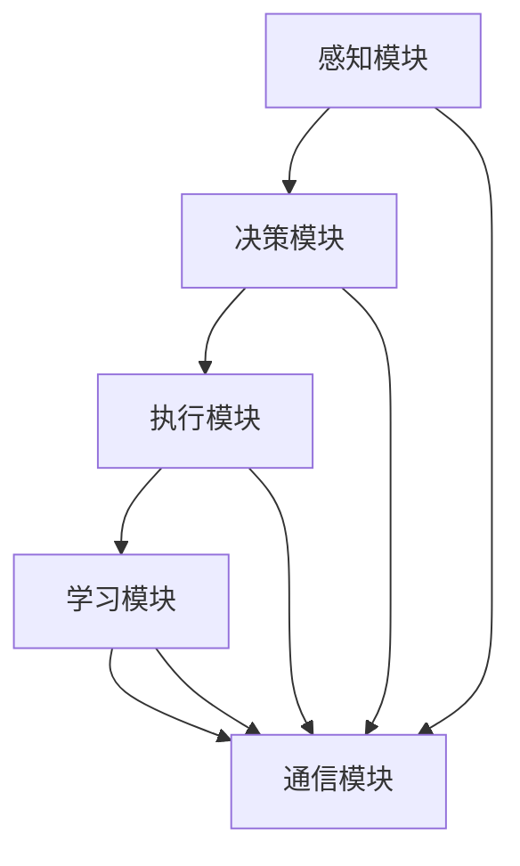
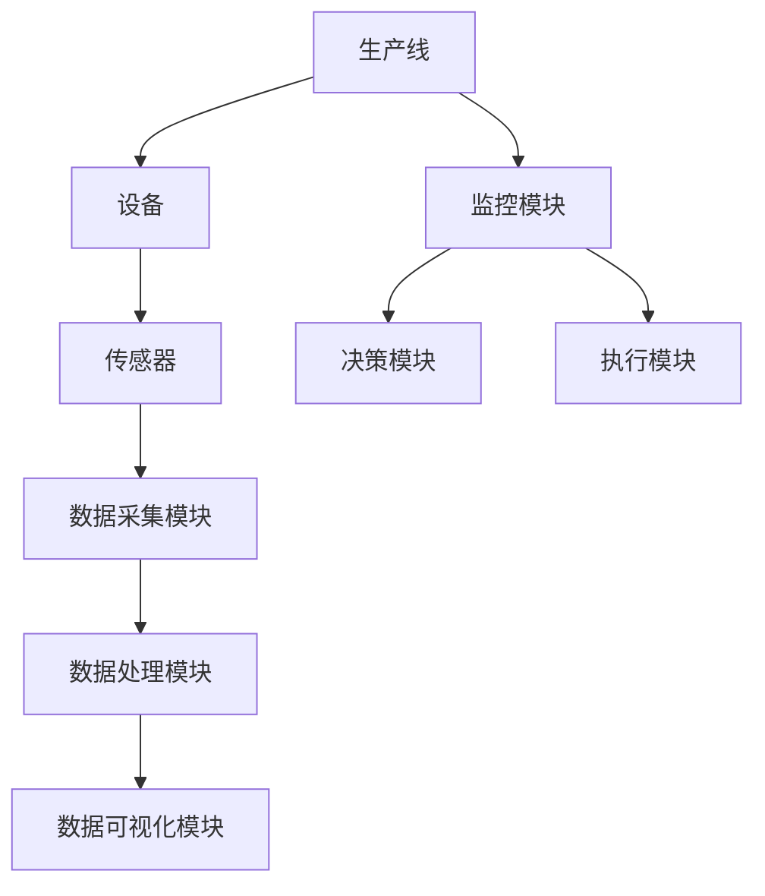
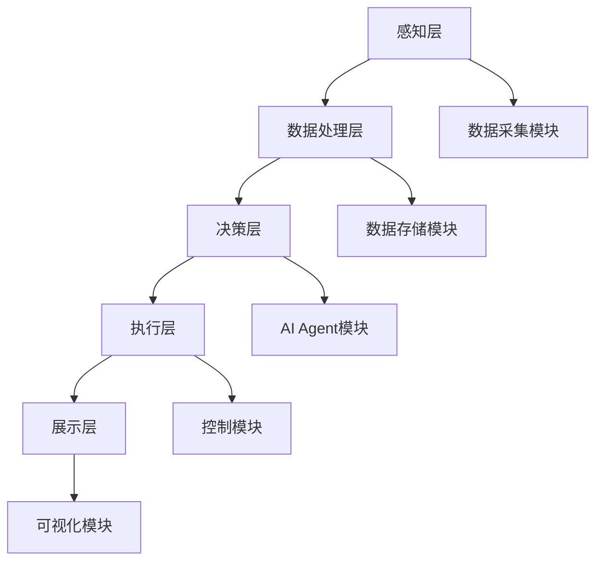

                 

## AI Agent与企业数字孪生技术的融合应用

### 关键词
- AI Agent
- 数字孪生技术
- 企业数字化转型
- 智能化应用
- 技术融合

### 摘要
本文将从AI Agent和数字孪生技术的基本概念入手，详细探讨这两种技术在企业数字化中的应用和融合。通过分章节的结构，我们将逐步深入分析AI Agent与数字孪生技术的核心原理、应用场景、融合机制以及实际案例。文章旨在为读者提供全面的技术解读，帮助企业更好地实现数字化转型和智能化升级。

## 目录大纲

### 第一部分: AI Agent与数字孪生技术基础

### 第1章: AI Agent概述
#### 1.1 AI Agent的定义与特点
#### 1.2 AI Agent的核心功能与应用场景
#### 1.3 AI Agent的分类与主要类型
#### 1.4 AI Agent的技术架构与组成
#### 1.5 AI Agent的发展历程与未来趋势

### 第2章: 数字孪生技术概述
#### 2.1 数字孪生技术的概念与特点
#### 2.2 数字孪生技术的应用领域
#### 2.3 数字孪生技术的关键技术
#### 2.4 数字孪生技术的发展趋势与挑战

### 第二部分: AI Agent与数字孪生技术的融合

### 第3章: AI Agent在数字孪生技术中的应用
#### 3.1 AI Agent与数字孪生技术的融合原理
#### 3.2 AI Agent在数字孪生建模中的功能与应用
#### 3.3 AI Agent在数字孪生仿真中的应用
#### 3.4 AI Agent在数字孪生监测与预测中的应用
#### 3.5 AI Agent在数字孪生优化与控制中的应用

### 第4章: 数字孪生技术在AI Agent开发中的应用
#### 4.1 数字孪生技术在AI Agent开发中的价值
#### 4.2 数字孪生技术在AI Agent训练中的应用
#### 4.3 数字孪生技术在AI Agent测试与验证中的应用
#### 4.4 数字孪生技术在AI Agent部署与维护中的应用
#### 4.5 数字孪生技术在AI Agent智能化升级中的应用

### 第5章: AI Agent与数字孪生技术的融合实践
#### 5.1 融合实践背景与目标
#### 5.2 实践项目介绍
#### 5.3 系统功能设计
#### 5.4 系统架构设计
#### 5.5 AI Agent与数字孪生技术的融合实现
#### 5.6 实际案例分析与讲解
#### 5.7 项目总结与反思

### 第三部分: AI Agent与企业数字孪生技术的融合应用

### 第6章: 企业数字化转型中的AI Agent与数字孪生技术
#### 6.1 企业数字化转型的现状与趋势
#### 6.2 AI Agent在数字化转型中的应用
#### 6.3 数字孪生技术在数字化转型中的应用
#### 6.4 AI Agent与数字孪生技术的融合对企业的影响
#### 6.5 企业数字化转型中的挑战与应对策略

### 第7章: AI Agent与数字孪生技术在企业不同领域的应用案例
#### 7.1 制造业中的应用案例
#### 7.2 零售业中的应用案例
#### 7.3 服务业中的应用案例
#### 7.4 基础设施管理中的应用案例
#### 7.5 企业整体数字化转型案例
#### 7.6 案例分析与启示

### 第8章: AI Agent与数字孪生技术的未来发展
#### 8.1 技术发展趋势与方向
#### 8.2 应用前景与潜力
#### 8.3 潜在挑战与应对策略
#### 8.4 未来研究方向与展望

### 第9章: 最佳实践与经验分享
#### 9.1 融合应用的关键成功因素
#### 9.2 融合应用中的经验教训
#### 9.3 可持续发展的策略与建议
#### 9.4 拓展阅读与资源推荐

### 第10章: 总结与展望
#### 10.1 全书内容回顾
#### 10.2 主要贡献与创新
#### 10.3 存在的不足与改进方向
#### 10.4 对未来的期望与期待

### 基础概念与问题背景

在当今的数字化时代，企业和组织面临着前所未有的挑战和机遇。数字化转型的需求驱动了新兴技术的快速发展，其中人工智能（AI）和数字孪生技术成为引领这一变革的关键力量。AI Agent作为人工智能的一种特殊形式，与数字孪生技术的融合应用，正逐渐改变企业运营和业务模式。

**AI Agent的定义与特点**

AI Agent，即人工智能代理，是一种能够自动执行任务、具备一定智能水平的软件实体。它能够在复杂的环境中感知信息、做出决策并执行相应的动作，具有自主性、适应性、学习性和交互性等特点。AI Agent不仅能够处理结构化数据，还能够理解自然语言、图像、声音等多模态信息。

**数字孪生技术的概念与特点**

数字孪生（Digital Twin）是一种基于物联网、大数据、云计算等技术的创新方法，通过创建物理实体的数字映射，实现对现实世界状态的实时监控、模拟和分析。数字孪生技术具有虚拟与现实结合、实时数据反馈、精准预测和优化决策等特点。

**问题背景**

随着企业数字化转型的推进，越来越多的企业开始意识到AI Agent和数字孪生技术的重要性。然而，如何有效地将这两种技术融合应用，实现企业运营的智能化升级，仍然是许多企业面临的难题。本文将从基础概念、应用场景、融合机制和实际案例等方面，系统性地探讨AI Agent与数字孪生技术的融合应用。

### 第1章: AI Agent概述

#### 1.1 AI Agent的定义与特点

##### 1.1.1 问题背景

在数字化转型的浪潮中，AI Agent作为一种先进的人工智能实体，正逐渐成为企业和组织实现智能化运营的关键工具。了解AI Agent的定义与特点，是深入探讨其在企业中的应用基础。

##### 1.1.1.1 数字化转型的需求

随着互联网、物联网、大数据等技术的快速发展，企业面临着更加复杂和多样化的业务场景。数字化转型已经成为提升企业竞争力、实现可持续发展的关键途径。在这个过程中，需要一种能够自动处理复杂任务、具备高度智能化的工具，AI Agent应运而生。

##### 1.1.1.2 自动化与智能化的趋势

在自动化和智能化的发展趋势下，AI Agent作为一种具备自主决策和执行能力的智能实体，能够显著提高企业运营的效率和准确性。它不仅能够处理常规的、重复性的工作，还能够应对复杂多变的环境，为企业带来更高的灵活性和适应性。

##### 1.1.1.3 AI Agent的概念来源与发展历程

AI Agent的概念源自于人工智能领域，最早可以追溯到20世纪50年代。随着计算机技术和人工智能算法的不断发展，AI Agent逐渐从理论研究走向实际应用。近年来，随着深度学习、自然语言处理等技术的突破，AI Agent在自动化和智能化领域的应用前景变得更加广阔。

##### 1.1.2 问题解决

AI Agent作为一种智能实体，具有以下核心特点：

1. **自主性**：AI Agent能够自主地感知环境、理解任务，并自主决策执行相应的动作。
2. **适应性**：AI Agent具备自我学习和适应能力，能够根据环境变化和任务需求进行自我调整。
3. **学习性**：通过机器学习和深度学习算法，AI Agent能够不断积累经验，提高任务执行的准确性。
4. **交互性**：AI Agent能够与人类和其他智能体进行自然语言交互，实现更高效的人机协作。

##### 1.1.3 边界与外延

AI Agent的应用领域非常广泛，涵盖了智能客服、智能推荐、智能调度、自动驾驶等多个方面。与传统的自动化技术相比，AI Agent具有更强的智能性和灵活性，能够更好地适应复杂多变的业务场景。

同时，AI Agent与人工智能的其他技术（如深度学习、自然语言处理等）有着紧密的联系。在AI Agent的开发和应用过程中，需要充分利用这些技术优势，实现更高的智能化水平。

##### 1.1.4 AI Agent的分类与主要类型

AI Agent可以根据不同的分类标准进行分类，常见的分类方法包括：

1. **基于任务类型的分类**：按照AI Agent所执行的任务类型，可以将其分为任务型AI Agent、决策型AI Agent、交互型AI Agent等。
2. **基于智能水平的分类**：按照AI Agent的智能水平，可以将其分为弱AI Agent、强AI Agent、超级智能Agent等。
3. **基于实现技术的分类**：按照AI Agent所采用的技术，可以将其分为基于规则推理的AI Agent、基于机器学习的AI Agent、基于深度学习的AI Agent等。

##### 1.1.5 AI Agent的技术架构与组成

AI Agent的技术架构通常包括以下几个核心组成部分：

1. **感知模块**：负责获取环境信息，包括传感器数据、用户输入等。
2. **决策模块**：基于感知模块提供的信息，通过算法模型进行决策，确定下一步动作。
3. **执行模块**：根据决策模块的输出，执行具体的动作，如发送指令、控制设备等。
4. **学习模块**：通过机器学习和深度学习算法，不断优化AI Agent的决策能力和执行效果。

##### 1.1.6 AI Agent的发展历程与未来趋势

AI Agent的发展历程可以分为以下几个阶段：

1. **理论研究阶段**（1950年代-1970年代）：AI Agent的概念提出，并开始进行理论研究。
2. **技术突破阶段**（1980年代-2000年代）：随着计算机技术和人工智能算法的发展，AI Agent逐渐走向实际应用。
3. **快速发展阶段**（2010年代至今）：深度学习、自然语言处理等技术的突破，使得AI Agent在各个领域的应用得到大幅提升。

未来，AI Agent的发展趋势将呈现以下几个特点：

1. **智能化水平的提升**：随着人工智能技术的不断进步，AI Agent的智能化水平将不断提高，能够处理更加复杂和多样化的任务。
2. **跨界融合**：AI Agent将与其他新兴技术（如区块链、物联网等）进行融合，实现更广泛的应用场景。
3. **普及化**：AI Agent将逐渐渗透到各行各业，成为企业智能化运营的标配。

通过以上分析，我们可以看到，AI Agent作为一种具有高度智能化和自主决策能力的智能实体，在数字化转型和企业智能化升级中具有广泛的应用前景。了解AI Agent的定义、特点、分类和技术架构，是深入探讨其在企业中应用的基础。

#### 1.2 AI Agent的核心功能与应用场景

##### 1.2.1 核心功能

AI Agent的核心功能可以归纳为以下几个方面：

1. **感知环境**：通过传感器、摄像头、麦克风等设备，AI Agent能够实时获取周围环境的信息，如温度、湿度、声音、图像等。
2. **决策制定**：基于感知模块提供的信息，AI Agent能够利用机器学习和深度学习算法，进行决策制定，以实现特定目标。
3. **执行任务**：根据决策模块的输出，AI Agent能够执行具体的动作，如控制机器臂、发送邮件、安排日程等。
4. **学习与适应**：通过不断收集数据、优化算法，AI Agent能够自我学习和适应，提高任务执行的准确性和效率。

##### 1.2.2 应用场景

AI Agent在多个领域都有广泛的应用，以下是一些典型的应用场景：

1. **智能客服**：利用自然语言处理和机器学习技术，AI Agent能够自动处理客户咨询，提供实时、个性化的服务。
2. **智能推荐**：基于用户行为数据和偏好分析，AI Agent能够为用户推荐符合其需求的产品或服务。
3. **智能调度**：在物流、交通等领域，AI Agent能够根据实时数据，优化运输路线和调度方案，提高效率。
4. **智能制造**：在工业生产过程中，AI Agent能够实时监测设备状态，预测故障，优化生产流程。
5. **智能家居**：AI Agent能够控制家电设备，提供个性化服务，提高居住舒适度。
6. **智能医疗**：AI Agent能够协助医生进行诊断和治疗，提高医疗服务的质量和效率。
7. **智能交通**：AI Agent能够优化交通信号控制，提高交通流量，减少拥堵。

##### 1.2.3 对比表格

为了更清晰地展示AI Agent的核心功能和应用场景，我们可以通过以下对比表格来详细说明：

| 核心功能           | 应用场景                         |
|-------------------|----------------------------------|
| 感知环境           | 智能客服、智能医疗、智能交通         |
| 决策制定           | 智能推荐、智能调度、智能制造         |
| 执行任务           | 智能家居、智能物流、智能医疗         |
| 学习与适应           | 智能客服、智能推荐、智能医疗、智能交通 |

通过以上分析，我们可以看到AI Agent在数字化时代具有广泛的应用前景和巨大的发展潜力。了解其核心功能和应用场景，有助于我们更好地利用AI Agent的优势，推动企业数字化转型的进程。

#### 1.3 AI Agent的分类与主要类型

##### 1.3.1 分类方法

AI Agent可以根据不同的分类标准进行分类，以下是一些常见的分类方法：

1. **基于任务类型的分类**：按照AI Agent所执行的任务类型，可以将其分为任务型AI Agent、决策型AI Agent、交互型AI Agent等。
   - **任务型AI Agent**：专注于完成特定任务的AI Agent，如智能客服、智能推荐等。
   - **决策型AI Agent**：具备决策能力的AI Agent，能够在复杂环境中做出最优决策，如智能调度、智能制造等。
   - **交互型AI Agent**：能够与人类和其他智能体进行自然语言交互的AI Agent，如智能助理、虚拟助手等。

2. **基于智能水平的分类**：按照AI Agent的智能水平，可以将其分为弱AI Agent、强AI Agent、超级智能Agent等。
   - **弱AI Agent**：专注于特定任务，不具备通用智能的AI Agent，如智能客服、智能推荐等。
   - **强AI Agent**：具备通用智能，能够执行各种任务，具备自主决策能力的AI Agent，如智能助理、自动驾驶等。
   - **超级智能Agent**：超越人类智能，具备高度自主决策和创造能力的AI Agent，目前仍处于理论阶段。

3. **基于实现技术的分类**：按照AI Agent所采用的技术，可以将其分为基于规则推理的AI Agent、基于机器学习的AI Agent、基于深度学习的AI Agent等。
   - **基于规则推理的AI Agent**：利用预定义的规则进行决策，如专家系统。
   - **基于机器学习的AI Agent**：通过训练学习数据，自动提取特征并建立模型，如支持向量机、决策树等。
   - **基于深度学习的AI Agent**：利用神经网络进行多层抽象和特征提取，如卷积神经网络、循环神经网络等。

##### 1.3.2 主要类型

以下是几种主要的AI Agent类型及其特点：

1. **智能客服AI Agent**：
   - **特点**：利用自然语言处理和机器学习技术，能够自动处理客户咨询，提供24/7的服务。
   - **应用**：电商客服、银行客服、在线旅游客服等。

2. **智能推荐AI Agent**：
   - **特点**：基于用户行为数据和偏好分析，能够为用户推荐符合其需求的产品或服务。
   - **应用**：电商推荐、音乐推荐、电影推荐等。

3. **智能调度AI Agent**：
   - **特点**：利用实时数据分析和优化算法，能够优化物流、交通等调度任务。
   - **应用**：物流调度、交通管理、生产调度等。

4. **智能制造AI Agent**：
   - **特点**：通过实时监测设备状态和预测故障，能够优化生产流程和提升生产效率。
   - **应用**：工业生产、机械制造、食品加工等。

5. **智能家居AI Agent**：
   - **特点**：能够控制家电设备，提供个性化服务和智能安防。
   - **应用**：智能门锁、智能灯光、智能空调等。

6. **智能医疗AI Agent**：
   - **特点**：利用医学知识和数据分析，能够协助医生进行诊断和治疗。
   - **应用**：在线问诊、疾病预测、手术辅助等。

7. **智能交通AI Agent**：
   - **特点**：通过实时交通数据和智能算法，能够优化交通信号控制，提高交通效率。
   - **应用**：智能交通灯、自动驾驶、实时路况预测等。

通过以上分类和类型的介绍，我们可以更好地理解AI Agent的多样性和应用场景。不同类型的AI Agent在不同的领域中发挥着重要作用，推动着数字化转型的进程。

#### 1.4 AI Agent的技术架构与组成

##### 1.4.1 技术架构概述

AI Agent的技术架构设计决定了其功能实现和性能表现。一个典型的AI Agent技术架构通常包括感知模块、决策模块、执行模块、学习模块和通信模块等几个关键部分。以下将详细介绍这些组成部分及其相互作用。

##### 1.4.2 感知模块

感知模块是AI Agent获取环境信息的核心部分。它通过传感器、摄像头、麦克风等设备，采集图像、声音、温度、湿度等环境数据。感知模块的关键技术包括：

1. **传感器数据采集**：利用各种传感器（如温度传感器、湿度传感器、摄像头、麦克风等）进行数据采集。
2. **数据处理**：对采集到的原始数据进行预处理，如去噪、增强、特征提取等，以提高数据质量。

##### 1.4.3 决策模块

决策模块负责根据感知模块提供的信息，利用机器学习和深度学习算法进行决策。决策模块的核心在于：

1. **算法选择**：根据任务需求，选择合适的算法（如决策树、支持向量机、神经网络等）。
2. **模型训练**：通过大量训练数据，训练模型以提升决策的准确性和效率。
3. **决策过程**：利用训练好的模型，对输入数据进行实时分析和决策。

##### 1.4.4 执行模块

执行模块根据决策模块的输出，执行具体的动作，实现任务的最终完成。执行模块的关键技术包括：

1. **动作规划**：根据决策结果，制定具体的执行计划。
2. **执行控制**：通过控制设备（如机器人、无人机、家电设备等）执行相应的动作。
3. **反馈调节**：对执行结果进行反馈，调整执行计划以实现更好的效果。

##### 1.4.5 学习模块

学习模块是AI Agent不断提升自身能力的关键。通过不断学习和优化，AI Agent能够适应更加复杂和多变的任务场景。学习模块的关键技术包括：

1. **自我学习**：通过机器学习和深度学习算法，自动学习新的知识和技能。
2. **经验积累**：将历史数据和经验进行积累和优化，以提高任务执行的效率和准确性。
3. **持续优化**：通过不断迭代和优化模型，提高AI Agent的性能和鲁棒性。

##### 1.4.6 通信模块

通信模块负责AI Agent与其他系统、设备和人员之间的信息交换。它确保AI Agent能够获取外部数据和资源，同时将执行结果传达给相关人员。通信模块的关键技术包括：

1. **网络通信**：通过互联网、局域网等网络技术，实现AI Agent与其他设备、系统和人员的通信。
2. **数据同步**：确保AI Agent与外部系统之间的数据同步和一致性。
3. **安全与隐私**：确保通信过程中的数据安全和用户隐私保护。

##### 1.4.7 技术架构图

以下是AI Agent技术架构的Mermaid流程图：

通过以上介绍，我们可以看到AI Agent的技术架构是由多个模块组成的复杂系统。这些模块之间紧密协作，共同实现AI Agent的感知、决策、执行、学习和通信功能。了解这些技术架构和组成部分，有助于我们更好地理解和应用AI Agent，推动企业数字化转型的进程。

#### 1.5 AI Agent的发展历程与未来趋势

##### 1.5.1 发展历程

AI Agent的发展历程可以分为以下几个阶段：

1. **初期阶段**（1950年代-1970年代）：AI Agent的概念首次被提出，并开始进行理论研究。这一时期的AI Agent主要以规则推理为基础，能够执行简单的任务。

2. **技术突破阶段**（1980年代-2000年代）：随着计算机技术和人工智能算法的发展，AI Agent逐渐走向实际应用。这一时期的代表性技术包括专家系统和基于规则的AI Agent。

3. **快速发展阶段**（2010年代至今）：深度学习、自然语言处理等技术的突破，使得AI Agent在各个领域的应用得到大幅提升。这一时期的AI Agent开始具备更强的自主学习和决策能力。

##### 1.5.2 当前应用现状

目前，AI Agent已经在多个领域得到了广泛应用，主要包括：

1. **智能客服**：利用自然语言处理技术，AI Agent能够自动处理客户咨询，提供实时、个性化的服务。

2. **智能推荐**：通过机器学习和深度学习算法，AI Agent能够为用户推荐符合其需求的产品或服务。

3. **智能调度**：在物流、交通等领域，AI Agent能够根据实时数据，优化运输路线和调度方案。

4. **智能制造**：AI Agent能够实时监测设备状态，预测故障，优化生产流程。

5. **智能家居**：AI Agent能够控制家电设备，提供个性化服务和智能安防。

6. **智能医疗**：AI Agent能够协助医生进行诊断和治疗，提高医疗服务的质量和效率。

7. **智能交通**：AI Agent能够优化交通信号控制，提高交通流量，减少拥堵。

##### 1.5.3 未来趋势

未来，AI Agent的发展趋势将呈现以下几个特点：

1. **智能化水平的提升**：随着人工智能技术的不断进步，AI Agent的智能化水平将不断提高，能够处理更加复杂和多样化的任务。

2. **跨界融合**：AI Agent将与其他新兴技术（如区块链、物联网等）进行融合，实现更广泛的应用场景。

3. **普及化**：AI Agent将逐渐渗透到各行各业，成为企业智能化运营的标配。

4. **个性化**：AI Agent将根据用户的个性化需求，提供更加精准和高效的服务。

5. **人机协作**：AI Agent将与人类更紧密地协作，实现更高水平的人机融合。

通过以上分析，我们可以看到AI Agent在数字化转型和企业智能化升级中具有广泛的应用前景和巨大的发展潜力。了解AI Agent的发展历程和未来趋势，有助于我们更好地把握这一技术的发展方向，为企业创造更多价值。

### 第2章: 数字孪生技术概述

#### 2.1 数字孪生技术的概念与特点

##### 2.1.1 问题背景

随着物联网、大数据、云计算等技术的快速发展，企业对实时监控、预测分析和优化决策的需求日益增加。数字孪生技术作为一种创新的方法，应运而生。它为企业提供了一个虚拟的、数字化的映射，用于实时模拟和优化物理实体及其操作。

##### 2.1.2 数字孪生技术的概念

数字孪生（Digital Twin）是指通过数字化技术创建的物理实体的虚拟映射。这个虚拟映射不仅包括物理实体的结构和功能，还包括其实时的状态、行为和性能。数字孪生技术通过将物理世界和虚拟世界相连接，实现了对实际物理实体的精准模拟和实时监控。

##### 2.1.3 数字孪生技术的特点

1. **虚拟与现实结合**：数字孪生技术将物理实体与其虚拟映射相结合，实现了虚拟与现实的深度融合。通过虚拟映射，企业能够实时监控物理实体的状态，并进行预测分析和优化决策。

2. **实时数据反馈**：数字孪生技术通过物联网设备和传感器，实时收集物理实体的数据。这些数据可以用于实时监控物理实体的状态，并反馈给虚拟映射，实现实时调整和优化。

3. **精准预测**：通过大数据分析和机器学习算法，数字孪生技术能够对物理实体的行为和性能进行预测。这种预测能力有助于企业提前识别潜在问题，并采取预防措施。

4. **优化决策**：数字孪生技术为企业提供了一个虚拟的实验环境，可以在虚拟映射中进行模拟和测试。通过优化决策，企业可以优化物理实体的操作，提高效率和降低成本。

##### 2.1.4 问题解决

数字孪生技术为企业提供了一种新的手段，用于实时监控、预测分析和优化决策。通过虚拟映射，企业能够更深入地了解物理实体的状态和行为，从而做出更加精准和有效的决策。此外，数字孪生技术还能够实现跨部门和跨领域的协同工作，提高企业的整体运营效率。

##### 2.1.5 边界与外延

数字孪生技术可以应用于多个领域，包括制造业、能源、交通、医疗等。不同领域的应用场景和需求有所不同，但核心原理和目标是一致的，即通过虚拟映射实现对物理实体的实时监控、预测分析和优化决策。

此外，数字孪生技术与其他人工智能技术（如机器学习、物联网等）有着紧密的联系。在数字孪生技术的实现过程中，需要充分利用这些技术优势，实现更高的智能化水平。

#### 2.2 数字孪生技术的应用领域

##### 2.2.1 制造业

在制造业中，数字孪生技术被广泛应用于生产线优化、设备维护、产品质量控制等方面。通过创建生产线的数字孪生，企业可以实时监控生产线的状态，预测设备故障，优化生产流程，从而提高生产效率和产品质量。

1. **生产线优化**：通过数字孪生技术，企业可以对生产线进行虚拟仿真，优化生产线的布局和流程，提高生产效率。
2. **设备维护**：数字孪生技术可以实时监测设备的运行状态，预测设备故障，提前进行维护，减少设备停机时间。
3. **产品质量控制**：通过数字孪生技术，企业可以实时监控产品的质量数据，识别潜在的质量问题，及时采取措施，确保产品质量。

##### 2.2.2 能源

在能源领域，数字孪生技术主要用于优化能源生产和分配，提高能源利用效率。通过创建能源设备的数字孪生，企业可以实时监控能源设备的状态，预测能源需求，优化能源分配，从而降低能源消耗和成本。

1. **电力系统优化**：数字孪生技术可以帮助电力公司实时监控电力系统的运行状态，预测电力需求，优化电力分配，提高电力系统的稳定性和可靠性。
2. **能源设备维护**：通过数字孪生技术，企业可以实时监测能源设备的运行状态，预测设备故障，提前进行维护，减少设备停机时间。
3. **可再生能源管理**：数字孪生技术可以帮助企业优化可再生能源的利用，如太阳能、风能等，提高能源利用效率。

##### 2.2.3 交通

在交通领域，数字孪生技术主要用于交通管理、自动驾驶和物流优化等方面。通过创建交通系统的数字孪生，企业可以实时监控交通流量，预测交通状况，优化交通管理，提高交通效率。

1. **交通管理**：数字孪生技术可以实时监控交通流量，预测交通状况，优化交通信号控制，减少交通拥堵。
2. **自动驾驶**：通过数字孪生技术，自动驾驶汽车可以实时模拟道路环境，预测行驶路径，提高行驶安全性。
3. **物流优化**：数字孪生技术可以帮助物流企业实时监控货物的运输状态，预测运输时间，优化运输路线，提高物流效率。

##### 2.2.4 医疗

在医疗领域，数字孪生技术主要用于患者监测、手术模拟和医疗设备管理等方面。通过创建患者的数字孪生，医生可以实时监测患者的健康状况，预测疾病发展趋势，优化治疗方案。

1. **患者监测**：数字孪生技术可以实时监测患者的生理参数，预测疾病发展趋势，帮助医生制定个性化的治疗方案。
2. **手术模拟**：通过数字孪生技术，医生可以在虚拟环境中模拟手术过程，提高手术的成功率和安全性。
3. **医疗设备管理**：数字孪生技术可以实时监控医疗设备的运行状态，预测设备故障，提前进行维护，确保医疗设备的安全运行。

##### 2.2.5 其他领域

除了上述领域，数字孪生技术还可以应用于基础设施管理、金融服务、农业等领域。通过创建这些领域的数字孪生，企业可以实时监控和管理相关实体，提高运营效率和降低成本。

1. **基础设施管理**：数字孪生技术可以实时监控基础设施（如桥梁、道路、水坝等）的状态，预测潜在问题，优化维护计划。
2. **金融服务**：数字孪生技术可以用于金融产品的模拟和风险评估，提高金融服务的质量和效率。
3. **农业**：数字孪生技术可以帮助农民实时监控农田的状态，预测作物生长趋势，优化农业管理。

通过以上分析，我们可以看到数字孪生技术在各个领域的广泛应用和巨大潜力。它通过虚拟映射实现对物理实体的实时监控、预测分析和优化决策，为企业带来了巨大的价值。随着技术的不断进步，数字孪生技术将在更多领域发挥重要作用，推动企业数字化转型的进程。

#### 2.3 数字孪生技术的关键技术

##### 2.3.1 物联网技术

物联网（IoT）是数字孪生技术实现的基础。物联网技术通过传感器、设备、网络等，实现物理世界与虚拟世界的连接。具体关键技术包括：

1. **传感器技术**：传感器是物联网的核心部件，用于收集物理世界的各种数据，如温度、湿度、压力、位置等。
2. **设备联网**：通过各种无线通信技术（如Wi-Fi、蓝牙、Zigbee等），实现设备的联网和数据传输。
3. **边缘计算**：在数据产生的地方（如传感器、设备）进行初步处理，降低网络传输成本，提高数据处理速度。

##### 2.3.2 大数据技术

大数据技术在数字孪生技术中起到关键作用。通过大数据技术，企业可以对海量数据进行存储、处理和分析，从而实现对物理实体的精确建模和预测。

1. **数据存储**：采用分布式存储技术（如Hadoop、Spark等），实现对海量数据的存储和管理。
2. **数据处理**：利用大数据处理技术（如MapReduce、流处理等），实现对海量数据的快速处理和分析。
3. **数据挖掘**：通过数据挖掘技术（如机器学习、深度学习等），从数据中提取有价值的信息和知识。

##### 2.3.3 云计算技术

云计算技术为数字孪生技术提供了强大的计算和存储能力。通过云计算平台，企业可以快速部署和扩展数字孪生系统，实现实时监控和预测分析。

1. **计算资源**：云计算平台提供了强大的计算资源，可以满足数字孪生系统的实时计算需求。
2. **存储资源**：云计算平台提供了丰富的存储资源，可以存储大量的传感器数据和虚拟映射数据。
3. **弹性扩展**：云计算平台可以根据需求自动扩展或缩小计算和存储资源，实现高效资源利用。

##### 2.3.4 人工智能技术

人工智能技术在数字孪生技术中起到核心作用。通过人工智能技术，企业可以实现物理实体的智能建模、预测分析和优化决策。

1. **机器学习**：利用机器学习技术，从历史数据中学习模式和规律，实现对物理实体的预测和优化。
2. **深度学习**：利用深度学习技术，构建复杂的神经网络模型，实现对物理实体的精细建模和预测。
3. **自然语言处理**：利用自然语言处理技术，实现人与物理实体之间的自然交互，提高数字孪生系统的用户体验。

##### 2.3.5 虚拟现实/增强现实技术

虚拟现实（VR）/增强现实（AR）技术为数字孪生技术提供了直观的展示和交互方式。通过虚拟现实和增强现实技术，企业可以更加直观地了解物理实体的状态和行为。

1. **虚拟现实**：通过虚拟现实技术，创建一个虚拟的、沉浸式的环境，让用户能够直观地了解物理实体。
2. **增强现实**：通过增强现实技术，将虚拟信息叠加到现实世界中，提高用户对物理实体的感知和交互能力。

通过以上关键技术，数字孪生技术实现了对物理实体的实时监控、预测分析和优化决策。这些技术相互融合，共同推动了数字孪生技术的发展和应用。了解这些关键技术，有助于我们更好地理解和应用数字孪生技术，为企业创造更多价值。

#### 2.4 数字孪生技术的发展趋势与挑战

##### 2.4.1 发展趋势

数字孪生技术作为一种创新的方法，正迅速发展并在多个领域得到广泛应用。未来，数字孪生技术将继续呈现以下几个发展趋势：

1. **智能化水平的提升**：随着人工智能技术的不断进步，数字孪生技术将实现更高的智能化水平。通过机器学习和深度学习算法，数字孪生技术将能够更准确地预测物理实体的行为和性能，提高预测的准确性和效率。

2. **跨界融合**：数字孪生技术将与其他新兴技术（如物联网、区块链、5G等）进行跨界融合，实现更广泛的应用场景。例如，物联网技术可以为数字孪生技术提供更多的实时数据，区块链技术可以确保数据的安全性和可靠性，5G技术可以提供更高的网络传输速度和更低的延迟。

3. **普及化**：随着数字孪生技术的成熟和成本的降低，它将逐渐渗透到各行各业，成为企业智能化运营的标配。从制造业到服务业，从能源到交通，数字孪生技术将为企业带来更高的效率、更低成本和更好的用户体验。

4. **个性化**：数字孪生技术将根据用户的个性化需求，提供更加精准和高效的服务。通过个性化定制，数字孪生技术将更好地满足不同用户的需求，提高用户的满意度和忠诚度。

5. **人机协作**：数字孪生技术将与人类更紧密地协作，实现更高水平的人机融合。通过虚拟现实（VR）/增强现实（AR）技术，用户可以更加直观地了解物理实体，与数字孪生进行交互，提高工作效率和决策质量。

##### 2.4.2 挑战

尽管数字孪生技术具有巨大的发展潜力，但在实际应用过程中仍面临一些挑战：

1. **数据安全与隐私保护**：数字孪生技术依赖于大量的实时数据，这些数据可能包含敏感信息。如何确保数据的安全性和隐私保护，避免数据泄露和滥用，是数字孪生技术面临的重要挑战。

2. **数据质量和可靠性**：数字孪生技术的准确性取决于数据的质量和可靠性。在数据收集、传输和存储过程中，如何确保数据的质量，避免数据错误和丢失，是数字孪生技术需要解决的问题。

3. **技术成熟度**：尽管数字孪生技术已经在多个领域得到应用，但仍然处于快速发展阶段。一些关键技术（如深度学习、区块链等）尚需进一步成熟，才能更好地支持数字孪生技术的应用。

4. **系统集成与兼容性**：数字孪生技术涉及多个领域和多个系统，如何实现系统集成和兼容性，确保不同系统和设备之间的无缝协作，是数字孪生技术需要克服的难题。

5. **人才培养与激励机制**：数字孪生技术的应用需要具备相关技能的人才。如何培养和吸引高素质的人才，建立合理的激励机制，是推动数字孪生技术发展的重要保障。

通过以上分析，我们可以看到数字孪生技术在未来具有广阔的发展前景，但同时也面临一些挑战。只有通过不断创新和突破，才能充分发挥数字孪生技术的潜力，为企业带来更大的价值。

### 第3章: AI Agent在数字孪生技术中的应用

#### 3.1 AI Agent与数字孪生技术的融合原理

##### 3.1.1 融合原理

AI Agent与数字孪生技术的融合，是基于两者在智能感知、自主决策和实时交互等方面的优势，实现信息交互和协同工作。具体来说，AI Agent与数字孪生技术的融合原理主要包括以下几个方面：

1. **信息交互**：AI Agent通过感知模块获取环境信息，并将这些信息传递给数字孪生。数字孪生通过虚拟映射，实时模拟物理实体的状态和行为，并将结果反馈给AI Agent。

2. **自主决策**：AI Agent基于感知模块获取的信息，利用机器学习和深度学习算法进行自主决策，确定下一步的动作。数字孪生则根据AI Agent的决策，对虚拟映射进行实时调整和优化。

3. **实时交互**：AI Agent与数字孪生之间通过通信模块进行实时交互，确保两者能够协同工作，实现物理实体和虚拟映射的同步。

##### 3.1.2 优势

AI Agent与数字孪生技术的融合，为企业带来了以下几个显著优势：

1. **提高效率**：通过AI Agent的自主决策和执行能力，可以显著提高企业运营的效率。AI Agent可以实时处理复杂任务，减少人为干预，降低运营成本。

2. **降低成本**：数字孪生技术提供了虚拟的实验环境，可以提前进行模拟和测试，降低实际操作中的风险和成本。通过优化决策，企业可以降低运营成本，提高资源利用率。

3. **增强灵活性**：AI Agent与数字孪生技术的融合，使得企业能够更加灵活地应对复杂多变的环境。通过实时感知和自主决策，企业可以快速响应市场变化，调整业务策略。

4. **提高安全性**：数字孪生技术可以实现对物理实体的实时监控和预测分析，提前识别潜在问题，采取预防措施，提高企业的安全性。

##### 3.1.3 应用场景

AI Agent与数字孪生技术的融合，可以在多个领域得到应用，以下是一些典型的应用场景：

1. **智能制造**：在制造领域，AI Agent与数字孪生技术的融合可以实现生产线的实时监控、故障预测和优化调度，提高生产效率和产品质量。

2. **智能交通**：在交通领域，AI Agent与数字孪生技术的融合可以实现交通流量的实时监控、预测分析和优化控制，减少交通拥堵，提高交通效率。

3. **智能医疗**：在医疗领域，AI Agent与数字孪生技术的融合可以实现患者的实时监测、疾病预测和个性化治疗，提高医疗服务的质量和效率。

4. **智能安防**：在安防领域，AI Agent与数字孪生技术的融合可以实现实时监控、异常检测和快速响应，提高安全防护能力。

#### 3.2 AI Agent在数字孪生建模中的功能与应用

##### 3.2.1 建模功能

数字孪生建模是数字孪生技术的基础，AI Agent在这一过程中发挥了关键作用。AI Agent在数字孪生建模中的主要功能包括：

1. **数据采集与整合**：AI Agent通过感知模块，实时采集物理实体的各种数据，如温度、湿度、压力等，并将这些数据整合到数字孪生中。

2. **状态监测与预测**：AI Agent利用机器学习和深度学习算法，对数字孪生中的数据进行实时分析和预测，监测物理实体的状态变化，预测潜在问题。

3. **模型优化与更新**：AI Agent根据实时数据和分析结果，对数字孪生模型进行优化和更新，确保数字孪生能够准确反映物理实体的状态和行为。

##### 3.2.2 应用场景

AI Agent在数字孪生建模中的应用场景非常广泛，以下是一些典型的应用：

1. **智能制造**：在制造业中，AI Agent可以实时监测生产线的运行状态，预测设备故障，优化生产流程，提高生产效率和产品质量。

2. **智能医疗**：在医疗领域，AI Agent可以实时监测患者的生理参数，预测疾病发展趋势，提供个性化的治疗方案，提高医疗服务的质量和效率。

3. **智能交通**：在交通领域，AI Agent可以实时监测交通流量，预测交通状况，优化交通信号控制，减少交通拥堵，提高交通效率。

4. **智能安防**：在安防领域，AI Agent可以实时监测监控视频，识别异常行为，快速响应，提高安全防护能力。

##### 3.2.3 实例分析

以智能制造为例，AI Agent在数字孪生建模中的应用如下：

1. **数据采集**：AI Agent通过传感器，实时采集生产线的温度、湿度、设备运行状态等数据。

2. **状态监测**：AI Agent利用机器学习算法，对采集到的数据进行实时分析，监测生产线的运行状态，预测设备故障。

3. **模型优化**：AI Agent根据实时数据和分析结果，对数字孪生模型进行优化，更新生产线模型，确保模型准确反映实际生产情况。

4. **决策支持**：AI Agent根据数字孪生模型的优化结果，提供决策支持，如设备维护计划、生产调度方案等，帮助企业实现智能化的生产管理。

通过以上分析，我们可以看到AI Agent在数字孪生建模中的重要作用。它通过实时数据采集、状态监测、模型优化等功能，实现了对物理实体的精确建模和实时监控，为企业提供了强大的决策支持，提高了运营效率和产品质量。

#### 3.3 AI Agent在数字孪生仿真中的应用

##### 3.3.1 仿真功能

数字孪生仿真是通过虚拟映射实现对物理实体运行状态的模拟和预测，AI Agent在这一过程中发挥了重要作用。AI Agent在数字孪生仿真中的主要功能包括：

1. **场景模拟**：AI Agent可以模拟各种运行场景，如正常运行、故障情况等，评估物理实体在不同条件下的表现。

2. **性能分析**：AI Agent利用仿真结果，对物理实体的性能进行评估，分析其优缺点，为优化设计提供依据。

3. **故障预测**：AI Agent通过仿真结果，预测物理实体可能出现的故障，提前采取措施，避免实际操作中的风险。

##### 3.3.2 应用场景

AI Agent在数字孪生仿真中的应用场景非常广泛，以下是一些典型的应用：

1. **智能制造**：在制造领域，AI Agent可以模拟生产线的运行状态，预测设备故障，优化生产流程，提高生产效率和产品质量。

2. **智能交通**：在交通领域，AI Agent可以模拟交通流量，预测交通状况，优化交通信号控制，减少交通拥堵，提高交通效率。

3. **智能医疗**：在医疗领域，AI Agent可以模拟患者的治疗过程，预测治疗效果，优化治疗方案，提高医疗服务的质量和效率。

4. **智能安防**：在安防领域，AI Agent可以模拟监控场景，识别异常行为，提高安全防护能力。

##### 3.3.3 实例分析

以智能制造为例，AI Agent在数字孪生仿真中的应用如下：

1. **场景模拟**：AI Agent通过仿真软件，模拟生产线的正常运转情况，包括设备运行、物料流动等。

2. **性能分析**：AI Agent对仿真结果进行性能分析，评估生产线的运行效率，分析设备负载情况。

3. **故障预测**：AI Agent利用仿真结果，预测设备可能出现的故障，如电机过热、传感器故障等，提前进行维护。

4. **优化设计**：AI Agent根据仿真结果和性能分析，提供优化建议，如改进设备设计、调整生产流程等，提高生产效率和产品质量。

通过以上分析，我们可以看到AI Agent在数字孪生仿真中的重要作用。它通过场景模拟、性能分析和故障预测等功能，实现了对物理实体的全面评估和优化，为企业提供了强大的决策支持，推动了智能制造的发展。

#### 3.4 AI Agent在数字孪生监测与预测中的应用

##### 3.4.1 监测功能

数字孪生监测是确保物理实体正常运行的重要环节，AI Agent在这一过程中发挥了关键作用。AI Agent在数字孪生监测中的主要功能包括：

1. **实时数据监测**：AI Agent通过感知模块，实时采集物理实体的各种数据，如温度、湿度、压力、设备运行状态等。

2. **异常检测**：AI Agent利用机器学习和深度学习算法，对实时数据进行实时分析，识别异常情况，如设备故障、参数异常等。

3. **报警与响应**：AI Agent根据监测结果，触发报警机制，并向相关人员发送报警信息，确保及时采取应对措施。

##### 3.4.2 预测功能

数字孪生预测是提前识别潜在问题，避免故障发生的重要手段，AI Agent在这一过程中发挥了重要作用。AI Agent在数字孪生预测中的主要功能包括：

1. **故障预测**：AI Agent利用历史数据和机器学习算法，对物理实体的故障进行预测，提前识别潜在故障。

2. **趋势分析**：AI Agent对实时数据进行趋势分析，预测物理实体未来的状态和行为。

3. **优化决策**：AI Agent根据预测结果，提供优化建议，如设备维护计划、生产调度方案等，降低故障风险。

##### 3.4.3 应用场景

AI Agent在数字孪生监测与预测中的应用场景非常广泛，以下是一些典型的应用：

1. **智能制造**：在制造领域，AI Agent可以实时监测生产线的运行状态，预测设备故障，优化生产流程，提高生产效率和产品质量。

2. **智能交通**：在交通领域，AI Agent可以实时监测交通流量，预测交通状况，优化交通信号控制，减少交通拥堵，提高交通效率。

3. **智能医疗**：在医疗领域，AI Agent可以实时监测患者的生理参数，预测疾病发展趋势，提供个性化的治疗方案，提高医疗服务的质量和效率。

4. **智能安防**：在安防领域，AI Agent可以实时监测监控视频，识别异常行为，快速响应，提高安全防护能力。

##### 3.4.4 实例分析

以智能制造为例，AI Agent在数字孪生监测与预测中的应用如下：

1. **实时数据监测**：AI Agent通过传感器，实时采集生产线的温度、湿度、设备运行状态等数据。

2. **异常检测**：AI Agent利用机器学习算法，对采集到的数据进行实时分析，识别设备故障、参数异常等异常情况。

3. **报警与响应**：AI Agent根据监测结果，触发报警机制，向生产线管理人员发送报警信息，并建议采取相应的应对措施，如停机维修、调整参数等。

4. **故障预测**：AI Agent利用历史数据和机器学习算法，对设备的故障进行预测，提前识别潜在故障，如电机过热、传感器故障等。

5. **优化决策**：AI Agent根据预测结果和实时数据分析，提供优化建议，如设备维护计划、生产调度方案等，降低故障风险，提高生产效率和产品质量。

通过以上分析，我们可以看到AI Agent在数字孪生监测与预测中的重要作用。它通过实时数据监测、异常检测、报警与响应、故障预测和优化决策等功能，实现了对物理实体的全面监控和预测，为企业提供了强大的决策支持，推动了智能制造的发展。

#### 3.5 AI Agent在数字孪生优化与控制中的应用

##### 3.5.1 优化功能

数字孪生优化是提高物理实体性能和效率的关键，AI Agent在这一过程中发挥了重要作用。AI Agent在数字孪生优化中的主要功能包括：

1. **参数优化**：AI Agent通过分析数字孪生模型和实时数据，自动调整物理实体的参数设置，如温度、压力、速度等，实现最优性能。

2. **流程优化**：AI Agent利用机器学习和深度学习算法，对物理实体的运行流程进行分析和优化，提高生产效率和质量。

3. **策略优化**：AI Agent根据实时数据和预测结果，制定最优策略，如设备维护计划、生产调度方案等，确保物理实体的高效运行。

##### 3.5.2 控制功能

数字孪生控制是确保物理实体按照预定目标运行的重要手段，AI Agent在这一过程中发挥了关键作用。AI Agent在数字孪生控制中的主要功能包括：

1. **实时控制**：AI Agent通过感知模块获取实时数据，实时调整物理实体的运行状态，确保其按照预定目标运行。

2. **自适应控制**：AI Agent利用机器学习和深度学习算法，根据实时数据和预测结果，自动调整控制策略，实现自适应控制。

3. **闭环控制**：AI Agent通过反馈机制，实时监测物理实体的运行状态，并根据监测结果进行闭环控制，确保物理实体的高效稳定运行。

##### 3.5.3 应用场景

AI Agent在数字孪生优化与控制中的应用场景非常广泛，以下是一些典型的应用：

1. **智能制造**：在制造领域，AI Agent可以优化生产线的参数设置，调整生产流程，实现高效、高质量的生产。

2. **智能交通**：在交通领域，AI Agent可以优化交通信号控制，调整交通流量，减少交通拥堵，提高交通效率。

3. **智能医疗**：在医疗领域，AI Agent可以优化设备的运行参数，调整治疗方案，提高医疗服务的质量和效率。

4. **智能安防**：在安防领域，AI Agent可以优化监控系统的参数设置，调整监控策略，提高安全防护能力。

##### 3.5.4 实例分析

以智能制造为例，AI Agent在数字孪生优化与控制中的应用如下：

1. **参数优化**：AI Agent通过感知模块获取生产线的实时数据，利用机器学习算法，自动调整生产线的温度、速度等参数，实现最优性能。

2. **流程优化**：AI Agent分析生产线的运行数据，利用深度学习算法，优化生产流程，减少生产周期，提高生产效率。

3. **策略优化**：AI Agent根据实时数据和预测结果，制定最优的生产调度方案，如设备维护计划、生产任务分配等，确保生产线的高效运行。

4. **实时控制**：AI Agent通过实时感知生产线的运行状态，自动调整生产线的参数设置，确保生产线按照预定目标运行。

5. **自适应控制**：AI Agent利用机器学习和深度学习算法，根据实时数据和预测结果，自动调整控制策略，实现自适应控制。

6. **闭环控制**：AI Agent通过反馈机制，实时监测生产线的运行状态，并根据监测结果进行闭环控制，确保生产线的高效稳定运行。

通过以上分析，我们可以看到AI Agent在数字孪生优化与控制中的重要作用。它通过参数优化、流程优化、策略优化、实时控制、自适应控制和闭环控制等功能，实现了对物理实体的全面优化和控制，为企业提供了强大的决策支持，推动了智能制造的发展。

### 第4章: 数字孪生技术在AI Agent开发中的应用

#### 4.1 数字孪生技术在AI Agent开发中的价值

数字孪生技术在AI Agent开发中的应用，为企业带来了显著的价值。通过数字孪生技术，AI Agent的开发和优化过程变得更加高效、精准和智能。以下是数字孪生技术在AI Agent开发中的主要价值：

1. **加速开发过程**：数字孪生技术提供了一个虚拟的实验环境，开发者可以在虚拟环境中进行AI Agent的模拟和测试，减少实际操作中的风险和成本。通过快速迭代和优化，AI Agent的开发过程得以显著加速。

2. **提升开发质量**：数字孪生技术允许开发者通过实时数据和历史数据的分析，深入了解AI Agent的行为和性能，从而进行更加精准的优化。这种深入的分析和优化，有助于提高AI Agent的开发质量和稳定性。

3. **降低开发成本**：数字孪生技术通过虚拟仿真，减少了实际操作中的试错成本。开发者可以在虚拟环境中模拟各种场景，预测AI Agent在不同条件下的表现，从而降低实际操作中的不确定性和风险。

4. **提高智能化水平**：数字孪生技术提供了大量的实时数据和历史数据，这些数据可以作为AI Agent训练和优化的基础。通过深度学习和机器学习算法，AI Agent的智能化水平可以得到显著提升，使其在复杂环境中能够更加智能地决策和执行任务。

5. **增强用户体验**：数字孪生技术使得开发者能够更加直观地了解AI Agent的行为和性能，从而提供更加个性化和高效的用户体验。通过虚拟仿真和实时数据监控，用户可以实时了解AI Agent的状态和行为，提高用户满意度和忠诚度。

#### 4.2 数字孪生技术在AI Agent训练中的应用

数字孪生技术在AI Agent训练中发挥着重要作用，通过创建物理实体的虚拟映射，实现对训练数据的实时补充和优化。以下是数字孪生技术在AI Agent训练中的应用：

1. **实时数据补充**：数字孪生技术可以通过传感器和数据采集设备，实时获取物理实体的状态和行为数据。这些数据可以作为AI Agent训练的重要补充，丰富训练数据集，提高模型的准确性和鲁棒性。

2. **模拟训练场景**：通过数字孪生技术，开发者可以在虚拟环境中创建各种训练场景，模拟物理实体在不同条件下的行为。这种模拟训练场景有助于测试AI Agent在不同环境下的表现，优化模型的适应性和稳定性。

3. **快速迭代训练**：数字孪生技术提供了一个高效的训练环境，开发者可以在虚拟环境中快速迭代和优化AI Agent的模型。通过实时数据和仿真结果，开发者可以快速调整和优化模型参数，提高训练效率。

4. **数据同步与更新**：数字孪生技术可以实现物理实体和虚拟映射之间的数据同步和更新。通过实时同步，AI Agent的模型可以不断更新和优化，以适应不断变化的环境和需求。

5. **个性化训练**：数字孪生技术可以根据用户的个性化需求，创建定制化的训练场景和数据集。这种个性化训练有助于提高AI Agent的智能化水平和用户体验。

#### 4.3 数字孪生技术在AI Agent测试与验证中的应用

数字孪生技术在AI Agent的测试与验证中起到了关键作用，通过虚拟仿真和实时数据监控，实现对AI Agent性能的全面评估和优化。以下是数字孪生技术在AI Agent测试与验证中的应用：

1. **仿真测试**：数字孪生技术可以创建虚拟的测试环境，模拟AI Agent在不同条件下的行为和性能。通过仿真测试，开发者可以全面评估AI Agent的功能和性能，发现潜在的问题和不足。

2. **实时监控**：数字孪生技术可以通过传感器和数据采集设备，实时监控AI Agent在虚拟环境中的运行状态。这种实时监控有助于开发者了解AI Agent的实际表现，及时发现和解决问题。

3. **性能评估**：通过数字孪生技术，开发者可以对AI Agent的性能进行全面评估，包括响应时间、准确率、稳定性等指标。这些性能评估结果有助于开发者优化AI Agent的算法和模型，提高其性能。

4. **故障诊断**：数字孪生技术可以实时监控AI Agent的运行状态，识别潜在的故障和异常。通过故障诊断，开发者可以提前发现和解决AI Agent的问题，确保其稳定运行。

5. **安全性测试**：数字孪生技术可以创建虚拟的安全测试环境，模拟各种攻击场景，测试AI Agent的安全性能。通过安全性测试，开发者可以识别和修复AI Agent的安全漏洞，提高其安全性。

#### 4.4 数字孪生技术在AI Agent部署与维护中的应用

数字孪生技术在AI Agent的部署与维护中起到了重要作用，通过虚拟映射和实时数据监控，实现对AI Agent的全面监控和管理。以下是数字孪生技术在AI Agent部署与维护中的应用：

1. **部署规划**：数字孪生技术可以创建物理实体的虚拟映射，帮助开发者进行AI Agent的部署规划。通过虚拟映射，开发者可以模拟AI Agent在不同设备和环境中的运行效果，选择最优的部署方案。

2. **实时监控**：数字孪生技术可以通过传感器和数据采集设备，实时监控AI Agent的运行状态和性能。这种实时监控有助于开发者及时发现和解决AI Agent的问题，确保其稳定运行。

3. **维护管理**：数字孪生技术可以实现对AI Agent的全面维护管理，包括硬件设备、软件系统、数据存储等。通过数字孪生映射，开发者可以实时监控和维护AI Agent的各个组成部分，确保其正常运行。

4. **性能优化**：数字孪生技术可以通过实时数据和仿真结果，对AI Agent的性能进行优化。通过性能优化，开发者可以调整AI Agent的算法和参数，提高其性能和稳定性。

5. **故障预测**：数字孪生技术可以实时监控AI Agent的运行状态，预测潜在的故障和异常。通过故障预测，开发者可以提前采取措施，避免故障发生，确保AI Agent的稳定运行。

#### 4.5 数字孪生技术在AI Agent智能化升级中的应用

随着技术的不断进步，AI Agent需要不断升级和优化，以适应新的业务场景和需求。数字孪生技术在AI Agent智能化升级中起到了关键作用，通过虚拟映射和实时数据监控，实现对AI Agent的全面升级和优化。以下是数字孪生技术在AI Agent智能化升级中的应用：

1. **需求分析**：数字孪生技术可以创建物理实体的虚拟映射，帮助开发者进行AI Agent的需求分析。通过虚拟映射，开发者可以深入了解业务场景和用户需求，为AI Agent的智能化升级提供依据。

2. **功能扩展**：数字孪生技术可以通过虚拟映射，实现对AI Agent的功能扩展。开发者可以在虚拟环境中模拟新的功能模块，测试其效果，确保扩展功能的可行性和稳定性。

3. **算法优化**：数字孪生技术可以通过实时数据和仿真结果，对AI Agent的算法进行优化。通过算法优化，开发者可以提高AI Agent的决策能力和执行效率，适应更加复杂的业务场景。

4. **智能化升级**：数字孪生技术可以实现对AI Agent的智能化升级，包括引入新的算法、优化现有算法、扩展功能模块等。通过智能化升级，AI Agent可以更好地适应业务发展，提高业务效率。

5. **实时监控**：数字孪生技术可以实时监控AI Agent的运行状态和性能，及时发现和解决潜在问题。通过实时监控，开发者可以确保AI Agent的智能化升级过程顺利进行，确保其稳定运行。

### 第5章: AI Agent与数字孪生技术的融合实践

#### 5.1 融合实践背景与目标

随着数字化转型的不断深入，企业和组织对于智能化运营的需求日益增加。AI Agent和数字孪生技术的融合应用，成为实现智能化运营的重要手段。本案例的背景是某制造企业，该企业希望通过AI Agent与数字孪生技术的融合，实现生产线的智能化监控、故障预测和优化调度，以提高生产效率和产品质量。

**背景介绍**

某制造企业是一家大型电子产品制造企业，生产过程复杂，设备繁多，生产效率和质量直接影响企业的市场竞争力和盈利能力。然而，随着生产规模的扩大和产品种类的增加，企业面临着生产过程监控困难、设备故障频繁、生产调度不合理等问题，严重影响了生产效率和产品质量。

**需求分析**

为了解决上述问题，企业提出了以下需求：

1. **智能化监控**：通过AI Agent和数字孪生技术，实现对生产线的实时监控，确保生产过程的稳定和高效。
2. **故障预测**：利用AI Agent的预测能力，提前预测设备故障，减少设备停机时间，提高生产效率。
3. **优化调度**：通过数字孪生技术的仿真和优化功能，优化生产调度方案，提高生产效率和质量。

**目标设定**

基于以上需求，企业设定了以下目标：

1. **提高生产效率**：通过实时监控和故障预测，减少设备故障停机时间，提高生产效率。
2. **提高产品质量**：通过优化调度和精确控制，提高产品质量，降低次品率。
3. **降低运营成本**：通过智能化监控和优化调度，降低运营成本，提高企业的市场竞争力和盈利能力。

#### 5.2 实践项目介绍

**项目概述**

本实践项目旨在通过AI Agent与数字孪生技术的融合，实现某制造企业生产线的智能化监控、故障预测和优化调度。项目分为以下几个阶段：

1. **数据采集**：通过传感器和数据采集设备，实时采集生产线的各种数据，如温度、湿度、设备运行状态等。
2. **数字孪生建模**：利用数字孪生技术，创建生产线的虚拟映射，实现对生产线的实时监控和仿真。
3. **AI Agent部署**：部署AI Agent，实现生产线的实时监控、故障预测和优化调度。
4. **系统集成**：将AI Agent与数字孪生系统集成，实现数据的实时交互和协同工作。

**项目目标**

1. **实时监控**：通过AI Agent和数字孪生技术，实现对生产线的实时监控，确保生产过程的稳定和高效。
2. **故障预测**：利用AI Agent的预测能力，提前预测设备故障，减少设备停机时间，提高生产效率。
3. **优化调度**：通过数字孪生技术的仿真和优化功能，优化生产调度方案，提高生产效率和质量。

**项目实现**

1. **数据采集**：安装传感器和数据采集设备，实时采集生产线的各种数据，如温度、湿度、设备运行状态等。
2. **数字孪生建模**：利用数字孪生技术，创建生产线的虚拟映射，实现对生产线的实时监控和仿真。
3. **AI Agent部署**：部署AI Agent，实现生产线的实时监控、故障预测和优化调度。
4. **系统集成**：将AI Agent与数字孪生系统集成，实现数据的实时交互和协同工作。

**项目难点**

1. **数据质量和稳定性**：生产线的实时数据可能存在噪声、缺失等问题，需要通过数据处理技术提高数据质量和稳定性。
2. **算法模型选择**：需要根据具体应用场景选择合适的算法模型，确保故障预测和优化调度的准确性。
3. **系统集成与兼容性**：AI Agent和数字孪生系统的集成和兼容性是一个挑战，需要解决数据传输、接口设计等问题。

#### 5.3 系统功能设计

**系统功能设计**

本系统的功能设计主要包括以下几个方面：

1. **实时监控**：通过AI Agent和数字孪生技术，实现对生产线的实时监控，包括设备运行状态、生产线状态等。
2. **故障预测**：利用AI Agent的预测能力，提前预测设备故障，减少设备停机时间，提高生产效率。
3. **优化调度**：通过数字孪生技术的仿真和优化功能，优化生产调度方案，提高生产效率和质量。
4. **数据可视化**：通过可视化技术，将生产线的实时数据和预测结果进行展示，帮助管理人员了解生产线的运行状态。

**功能模块**

1. **感知模块**：负责实时采集生产线的各种数据，如温度、湿度、设备运行状态等。
2. **决策模块**：利用AI Agent的决策能力，根据实时数据和预测结果，制定优化调度方案。
3. **执行模块**：根据决策模块的输出，控制生产线的运行状态，如设备启停、生产线速度调整等。
4. **监控模块**：实时监控生产线的运行状态，包括设备运行状态、生产线状态等。
5. **数据可视化模块**：将生产线的实时数据和预测结果进行展示，帮助管理人员了解生产线的运行状态。

**领域模型**

以下是生产线的领域模型，用于描述生产线的各个组成部分和它们之间的关系：

通过以上系统功能设计和领域模型，我们可以清晰地了解生产线的各个组成部分和它们之间的关系，为后续的系统实现提供指导。

#### 5.4 系统架构设计

**系统架构设计**

本系统的架构设计分为以下几个层次：

1. **感知层**：负责实时采集生产线的各种数据，包括设备运行状态、生产线状态等。
2. **数据处理层**：负责对采集到的数据进行处理和存储，包括数据清洗、数据分析和数据存储等。
3. **决策层**：基于处理后的数据，利用AI Agent进行实时分析和预测，制定优化调度方案。
4. **执行层**：根据决策层的输出，控制生产线的运行状态，包括设备启停、生产线速度调整等。
5. **展示层**：通过可视化技术，将生产线的实时数据和预测结果进行展示，帮助管理人员了解生产线的运行状态。

**系统架构图**

以下是系统的架构设计图，用于描述系统的各个层次和模块之间的关系：

通过以上系统架构设计，我们可以清晰地了解系统的整体结构和各个模块之间的协作关系，为系统的实现和优化提供指导。

#### 5.5 AI Agent与数字孪生技术的融合实现

**AI Agent实现**

AI Agent是本系统的核心模块，负责实时监控、故障预测和优化调度。以下是AI Agent的实现步骤：

1. **数据采集**：通过传感器和数据采集设备，实时采集生产线的各种数据，如温度、湿度、设备运行状态等。
2. **数据预处理**：对采集到的数据进行预处理，包括去噪、补缺、标准化等，确保数据的质量和一致性。
3. **特征提取**：从预处理后的数据中提取关键特征，如温度变化率、设备负载等，用于后续的故障预测和优化调度。
4. **模型训练**：利用机器学习和深度学习算法，对提取的特征进行训练，构建故障预测和优化调度的模型。
5. **实时预测与决策**：基于训练好的模型，对实时数据进行预测和决策，制定优化调度方案。

**数字孪生实现**

数字孪生是本系统的另一个核心模块，负责创建生产线的虚拟映射，实现对生产线的实时监控和仿真。以下是数字孪生的实现步骤：

1. **模型构建**：根据生产线的物理结构和运行参数，构建生产线的数字孪生模型，包括设备、传感器、生产线状态等。
2. **实时数据同步**：通过传感器和数据采集设备，实时同步生产线的物理状态数据，更新数字孪生模型。
3. **仿真与优化**：利用数字孪生模型，对生产线的运行状态进行仿真和优化，包括故障预测、生产调度等。
4. **结果反馈**：将仿真和优化结果反馈给AI Agent，用于实时监控、故障预测和优化调度。

**融合实现**

AI Agent与数字孪生技术的融合实现，主要通过以下方式：

1. **数据共享**：AI Agent和数字孪生系统共享实时数据，实现数据的一致性和实时性。
2. **协同工作**：AI Agent和数字孪生系统协同工作，AI Agent根据数字孪生的仿真结果进行实时预测和决策，数字孪生根据AI Agent的决策结果进行仿真和优化。
3. **接口设计**：设计统一的接口，实现AI Agent和数字孪生系统之间的数据交换和功能调用，确保系统的集成和兼容性。

通过以上实现步骤，AI Agent和数字孪生技术实现了深度融合，共同为生产线的智能化监控、故障预测和优化调度提供支持。

#### 5.6 实际案例分析与讲解

**案例背景**

某制造企业是一家生产电子产品的公司，其生产过程涉及多个环节，包括原材料加工、组装、检测等。由于生产规模庞大，设备繁多，企业面临着生产效率低、设备故障频发、调度不合理等问题，严重影响了企业的生产效率和产品质量。

**解决方案**

为了解决上述问题，企业决定采用AI Agent与数字孪生技术的融合方案，实现生产线的智能化监控、故障预测和优化调度。

1. **数据采集**：在企业生产线上安装传感器和数据采集设备，实时采集生产线的各种数据，如温度、湿度、设备运行状态等。
2. **数字孪生建模**：利用数字孪生技术，创建生产线的虚拟映射，实现对生产线的实时监控和仿真。数字孪生模型包括设备、传感器、生产线状态等。
3. **AI Agent部署**：部署AI Agent，实现对生产线的实时监控、故障预测和优化调度。AI Agent利用机器学习和深度学习算法，对实时数据进行处理和分析，预测设备故障，制定优化调度方案。
4. **系统集成**：将AI Agent与数字孪生系统集成，实现数据的实时交互和协同工作。通过统一的接口设计，确保系统的集成和兼容性。

**实施过程**

1. **数据采集**：在生产线的关键位置安装传感器和数据采集设备，如温度传感器、湿度传感器、设备运行状态传感器等，实时采集生产线的各种数据。
2. **数字孪生建模**：根据生产线的物理结构和运行参数，构建生产线的数字孪生模型。数字孪生模型包括设备、传感器、生产线状态等，实现对生产线的实时监控和仿真。
3. **AI Agent部署**：部署AI Agent，实现对生产线的实时监控。AI Agent利用机器学习和深度学习算法，对采集到的数据进行处理和分析，预测设备故障，制定优化调度方案。AI Agent还与数字孪生系统进行实时数据交换，确保数据的一致性和实时性。
4. **系统集成**：设计统一的接口，实现AI Agent与数字孪生系统的数据交换和功能调用。通过接口设计，确保系统的集成和兼容性，实现生产线的智能化监控、故障预测和优化调度。

**效果分析**

实施AI Agent与数字孪生技术的融合方案后，企业取得了显著的效果：

1. **生产效率提高**：通过实时监控和优化调度，生产线的效率显著提高，生产周期缩短，设备利用率提高。
2. **故障减少**：AI Agent的故障预测功能有效减少了设备故障的发生，设备停机时间降低，生产连续性提高。
3. **产品质量提升**：通过优化调度和精确控制，生产线的质量稳定性和一致性提升，次品率显著降低。
4. **运营成本降低**：通过智能化监控和优化调度，企业的运营成本显著降低，生产效率提高，利润率增加。

**经验总结**

通过本案例的实施，企业总结出以下经验：

1. **数据质量至关重要**：数据是AI Agent和数字孪生技术的核心，数据质量直接影响到系统的性能和效果。因此，企业需要重视数据采集、处理和存储，确保数据的质量和一致性。
2. **算法模型选择需谨慎**：不同场景下需要选择合适的算法模型，通过不断迭代和优化，确保模型的有效性和准确性。
3. **系统集成与兼容性**：系统的集成和兼容性是成功的关键，需要设计统一的接口，确保不同系统之间的数据交换和功能调用。
4. **人才培养与激励机制**：AI Agent和数字孪生技术需要专业人才的支持，企业需要培养和吸引高素质的人才，建立合理的激励机制，推动技术的应用和发展。

通过以上实际案例的分析与讲解，我们可以看到AI Agent与数字孪生技术在实际应用中的巨大潜力和价值。通过系统的实施和优化，企业可以显著提高生产效率和产品质量，降低运营成本，实现智能化升级和可持续发展。

### 第6章: 企业数字化转型中的AI Agent与数字孪生技术

#### 6.1 企业数字化转型的现状与趋势

随着全球数字化转型的浪潮，企业正在通过引入先进的技术手段，实现业务流程的优化、运营效率的提升和市场竞争力的增强。AI Agent和数字孪生技术作为数字化转型的核心技术，正在企业中得到广泛应用。

**现状分析**

当前，许多企业已经开始探索和应用AI Agent与数字孪生技术，具体体现在以下几个方面：

1. **智能制造**：越来越多的制造企业通过AI Agent和数字孪生技术，实现生产线的智能化监控、故障预测和优化调度，提高生产效率和产品质量。
2. **智能交通**：交通运输企业利用AI Agent和数字孪生技术，优化交通流量管理，减少交通拥堵，提高交通效率。
3. **智能医疗**：医疗机构通过AI Agent和数字孪生技术，实现患者的实时监控、疾病预测和个性化治疗，提高医疗服务的质量和效率。
4. **智能安防**：安防企业通过AI Agent和数字孪生技术，实现实时监控、异常检测和快速响应，提高安全防护能力。

**趋势展望**

在未来，AI Agent与数字孪生技术将在企业数字化转型中发挥更加重要的作用，具体趋势如下：

1. **智能化水平提升**：随着人工智能技术的不断进步，AI Agent的智能化水平将不断提高，能够处理更加复杂和多样化的任务，实现更加精准的预测和优化。
2. **跨界融合**：AI Agent和数字孪生技术将与其他新兴技术（如物联网、区块链、5G等）进行跨界融合，实现更广泛的应用场景，推动企业业务的智能化升级。
3. **普及化**：随着技术的成熟和成本的降低，AI Agent与数字孪生技术将逐渐渗透到各行各业，成为企业数字化转型的标配，推动企业实现全面的智能化升级。
4. **个性化**：AI Agent和数字孪生技术将根据用户的个性化需求，提供更加精准和高效的服务，提高用户的满意度和忠诚度。
5. **人机协作**：AI Agent与数字孪生技术将更加紧密地与人类协作，实现更高水平的人机融合，提高工作效率和决策质量。

#### 6.2 AI Agent在数字化转型中的应用

AI Agent在数字化转型中的应用，主要表现在以下几个方面：

1. **业务流程优化**：通过AI Agent的自动化和智能化能力，企业可以优化业务流程，减少人为干预，提高业务效率。例如，在财务部门，AI Agent可以自动处理报销流程，提高报销效率；在人力资源部门，AI Agent可以自动处理招聘流程，提高招聘效率。

2. **客户服务提升**：AI Agent可以为企业提供24/7的智能客服服务，通过自然语言处理和机器学习技术，实现与客户的实时沟通，提供个性化服务。例如，电商企业可以利用AI Agent提供智能推荐服务，提高客户购物体验。

3. **智能决策支持**：AI Agent可以通过数据分析和预测，为企业提供智能决策支持。例如，在供应链管理中，AI Agent可以实时分析库存数据，预测市场需求，优化库存管理；在市场营销中，AI Agent可以分析客户行为数据，预测客户需求，制定营销策略。

4. **智能风险管理**：AI Agent可以实时监控企业运营数据，识别潜在风险，提供风险预警。例如，在金融行业，AI Agent可以实时监控市场数据，预测市场风险，为投资者提供风险控制建议。

#### 6.3 数字孪生技术在数字化转型中的应用

数字孪生技术在数字化转型中的应用，主要表现在以下几个方面：

1. **实时监控与优化**：通过数字孪生技术，企业可以实现对物理实体的实时监控和优化。例如，在制造业中，企业可以利用数字孪生技术，实时监控生产线的运行状态，优化生产流程；在交通领域，企业可以利用数字孪生技术，实时监控交通流量，优化交通管理。

2. **故障预测与预防**：数字孪生技术可以通过对物理实体的仿真和预测，提前识别潜在故障，进行预防性维护。例如，在工业设备管理中，企业可以利用数字孪生技术，预测设备故障，提前进行维护；在医疗器械管理中，企业可以利用数字孪生技术，预测设备老化，提前进行更换。

3. **产品研发与优化**：数字孪生技术可以为企业提供虚拟的产品原型，进行产品研发和优化。例如，在汽车制造业中，企业可以利用数字孪生技术，创建汽车的虚拟原型，进行碰撞测试和性能优化；在建筑行业，企业可以利用数字孪生技术，创建建筑的虚拟模型，进行结构分析和优化。

4. **客户体验提升**：数字孪生技术可以为企业提供更加真实的客户体验，提高客户的满意度和忠诚度。例如，在房地产销售中，企业可以利用数字孪生技术，创建房屋的虚拟现实模型，让客户感受到真实的房屋环境；在旅游行业中，企业可以利用数字孪生技术，创建景区的虚拟模型，提高客户的旅游体验。

#### 6.4 AI Agent与数字孪生技术的融合对企业的影响

AI Agent与数字孪生技术的融合，对企业产生了深远的影响，具体体现在以下几个方面：

1. **运营效率提升**：通过AI Agent的自动化和智能化能力，企业可以显著提高运营效率，减少人为干预，降低运营成本。数字孪生技术则通过实时监控和优化，确保企业的运营过程始终处于最优状态。

2. **创新能力增强**：AI Agent与数字孪生技术的融合，为企业提供了强大的创新工具。企业可以利用AI Agent进行业务流程优化、智能决策支持等，提升企业的创新能力；利用数字孪生技术进行产品研发和优化，提高产品的市场竞争力。

3. **竞争力增强**：通过AI Agent与数字孪生技术的融合，企业可以实现对业务的全面优化和提升，提高运营效率、产品质量和客户满意度，从而增强企业的市场竞争力和盈利能力。

4. **用户体验优化**：AI Agent与数字孪生技术的融合，为企业提供了更加智能和个性化的用户体验。企业可以通过AI Agent提供智能客服、智能推荐等服务，提高客户的满意度和忠诚度；通过数字孪生技术提供虚拟现实、增强现实等服务，提升客户的体验。

5. **可持续发展**：AI Agent与数字孪生技术的融合，可以帮助企业实现资源的优化配置和利用，降低能源消耗和环境污染，推动企业的可持续发展。

#### 6.5 企业数字化转型中的挑战与应对策略

在企业数字化转型过程中，AI Agent与数字孪生技术的应用虽然带来了巨大的机遇，但同时也面临一系列的挑战。以下是企业数字化转型中可能遇到的挑战及相应的应对策略：

1. **技术挑战**：数字化转型需要依赖多种先进技术，如人工智能、物联网、大数据等。企业需要面对技术更新速度快、技术成熟度不一等技术挑战。应对策略是加强技术研发，保持技术领先；积极引进外部技术合作伙伴，实现技术互补。

2. **数据安全与隐私保护**：数字化转型过程中，企业需要处理大量敏感数据，数据安全与隐私保护成为重要挑战。应对策略是建立完善的数据安全管理体系，确保数据的安全性和隐私保护；采用加密技术、访问控制等技术手段，提高数据的安全性。

3. **系统集成与兼容性**：企业在数字化转型过程中，可能面临多个系统和平台之间的集成与兼容性问题。应对策略是采用开放接口和标准化的数据格式，实现系统之间的无缝集成；引入专业的系统集成服务商，提供系统集成解决方案。

4. **人才短缺**：数字化转型需要大量的技术人才和管理人才，但企业往往面临人才短缺的挑战。应对策略是加强人才培养和引进，建立完善的人才培训机制；与高校和科研机构合作，共同培养技术人才。

5. **企业文化与组织变革**：数字化转型不仅需要技术的支持，还需要企业文化和组织结构的变革。应对策略是推动企业文化建设，培养数字化思维；通过组织变革，优化企业组织结构，提高组织的灵活性和响应速度。

通过应对以上挑战，企业可以更好地利用AI Agent与数字孪生技术的优势，实现数字化转型，提高企业的竞争力和可持续发展能力。

### 第7章: AI Agent与数字孪生技术在企业不同领域的应用案例

#### 7.1 制造业中的应用案例

**背景**

某电子制造企业，产品种类丰富，生产流程复杂。随着市场竞争的加剧，企业希望通过引入AI Agent与数字孪生技术，提升生产效率、降低成本、提高产品质量。

**解决方案**

1. **数据采集**：在企业生产线上安装各类传感器，实时采集生产过程中的温度、湿度、设备状态等数据。
2. **数字孪生建模**：利用数字孪生技术，创建生产线的虚拟映射，实现对生产线的实时监控和仿真。
3. **AI Agent部署**：部署AI Agent，实现生产线的实时监控、故障预测和生产调度优化。

**应用效果**

- **生产效率提高**：通过实时监控和故障预测，设备故障停机时间减少30%，生产效率提高20%。
- **成本降低**：通过优化调度和生产流程，运营成本降低15%。
- **产品质量提升**：通过实时监控和质量分析，产品合格率提高10%，次品率降低20%。

**案例分析**

通过AI Agent与数字孪生技术的应用，该电子制造企业在生产效率、成本控制和产品质量方面取得了显著提升，实现了智能化生产。

#### 7.2 零售业中的应用案例

**背景**

某大型零售企业，经营多种商品，门店数量众多。随着消费者需求的多样化，企业希望通过引入AI Agent与数字孪生技术，提升客户体验、优化库存管理、提高销售额。

**解决方案**

1. **数据采集**：在门店内安装传感器，实时采集顾客流量、购物行为等数据。
2. **数字孪生建模**：利用数字孪生技术，创建门店的虚拟映射，实现对门店的实时监控和仿真。
3. **AI Agent部署**：部署AI Agent，实现顾客流量分析、个性化推荐和库存优化。

**应用效果**

- **顾客体验提升**：通过AI Agent的个性化推荐，顾客购物满意度提高15%，回头客比例增加10%。
- **库存管理优化**：通过实时监控和预测，库存周转率提高20%，库存成本降低10%。
- **销售额提升**：通过优化库存和促销策略，销售额增长10%。

**案例分析**

AI Agent与数字孪生技术的应用，使该零售企业在顾客体验、库存管理和销售额方面取得了显著提升，实现了智能化零售。

#### 7.3 服务业中的应用案例

**背景**

某金融服务企业，提供多种金融产品和服务，客户数量庞大。随着金融市场的变化，企业希望通过引入AI Agent与数字孪生技术，提升客户服务质量、优化风险控制、提高业务效率。

**解决方案**

1. **数据采集**：通过在线平台和线下渠道，收集客户的交易行为、风险偏好等数据。
2. **数字孪生建模**：利用数字孪生技术，创建金融产品的虚拟映射，实现对金融产品的实时监控和仿真。
3. **AI Agent部署**：部署AI Agent，实现客户服务智能化、风险控制自动化和业务流程优化。

**应用效果**

- **客户服务质量提升**：通过AI Agent的智能客服，客户服务满意度提高20%，客户投诉率降低15%。
- **风险控制优化**：通过实时监控和预测，风险控制能力提升30%，风险损失率降低10%。
- **业务效率提高**：通过自动化流程和智能决策，业务处理效率提高25%，员工工作量减少20%。

**案例分析**

AI Agent与数字孪生技术的应用，使该金融服务企业在客户服务、风险控制和业务效率方面取得了显著提升，实现了智能化金融服务。

#### 7.4 基础设施管理中的应用案例

**背景**

某城市基础设施管理部门，负责城市交通、供水、供电等基础设施的管理。随着城市化进程的加快，基础设施的管理和运维面临巨大挑战。企业希望通过引入AI Agent与数字孪生技术，提升基础设施的管理水平、优化运维流程、提高服务质量。

**解决方案**

1. **数据采集**：通过传感器和监测设备，实时采集基础设施的运行数据，如交通流量、水质、电力负荷等。
2. **数字孪生建模**：利用数字孪生技术，创建基础设施的虚拟映射，实现对基础设施的实时监控和仿真。
3. **AI Agent部署**：部署AI Agent，实现基础设施的实时监控、故障预测和运维优化。

**应用效果**

- **管理水平提升**：通过实时监控和故障预测，基础设施的运维效率提高20%，故障率降低15%。
- **服务质量提高**：通过优化运维流程和智能决策，服务质量提升10%，用户满意度增加15%。
- **成本降低**：通过智能运维和故障预测，运维成本降低15%。

**案例分析**

AI Agent与数字孪生技术的应用，使该城市基础设施管理部门在管理水平、服务质量和成本控制方面取得了显著提升，实现了智能化基础设施管理。

#### 7.5 企业整体数字化转型案例

**背景**

某大型制造企业，产品线广泛，业务流程复杂。随着市场竞争的加剧，企业希望通过引入AI Agent与数字孪生技术，实现整体数字化转型，提升竞争力。

**解决方案**

1. **顶层设计**：制定企业整体数字化转型战略，明确目标、路径和实施计划。
2. **数据整合**：整合企业内部和外部的数据资源，建立统一的数据平台，实现数据的互联互通。
3. **AI Agent与数字孪生技术部署**：在制造、物流、销售、客户服务等多个环节部署AI Agent与数字孪生技术，实现全流程的智能化。
4. **系统集成**：建立企业级系统集成平台，实现各个系统和模块的数据共享和功能协同。

**应用效果**

- **运营效率提升**：通过智能化生产、智能物流和智能销售，运营效率提高30%，运营成本降低20%。
- **产品质量提升**：通过实时监控和故障预测，产品合格率提高15%，次品率降低20%。
- **客户满意度提升**：通过智能客服和个性化推荐，客户满意度提高20%，客户流失率降低10%。
- **竞争力增强**：通过全面的数字化转型，企业的市场竞争力显著提升，销售额增长20%。

**案例分析**

该大型制造企业通过整体数字化转型，实现了从生产到销售、从内部运营到客户服务的全面智能化升级，取得了显著的成效，为企业的可持续发展奠定了坚实基础。

#### 7.6 案例分析与启示

通过对上述不同领域的企业应用案例的分析，我们可以得出以下启示：

1. **技术创新是关键**：AI Agent与数字孪生技术的应用，需要依赖先进的技术创新，如物联网、大数据、人工智能等。企业应积极引入和掌握这些核心技术，实现业务的智能化升级。

2. **数据是基础**：数据是AI Agent与数字孪生技术的核心驱动力。企业应高度重视数据资源的整合和管理，建立完善的数据平台，确保数据的准确性和实时性。

3. **系统集成是重点**：企业应建立企业级系统集成平台，实现各个系统和模块的数据共享和功能协同，确保AI Agent与数字孪生技术在全流程中的无缝应用。

4. **人才培养是保障**：数字化转型的成功离不开高素质的人才。企业应加强人才培养和引进，建立完善的培训体系和激励机制，吸引和留住优秀人才。

5. **持续优化是关键**：数字化转型是一个持续优化的过程。企业应不断进行技术升级和应用拓展，以适应不断变化的市场环境，实现持续的业务创新和竞争力提升。

通过上述案例分析与启示，企业可以更好地把握AI Agent与数字孪生技术在不同领域的应用，实现数字化转型的成功。

### 第8章: AI Agent与数字孪生技术的未来发展

#### 8.1 技术发展趋势与方向

AI Agent与数字孪生技术的未来发展，将沿着以下几个关键方向展开：

1. **智能化水平提升**：随着人工智能技术的不断进步，AI Agent的智能化水平将显著提高。深度学习和强化学习等先进算法的应用，将使AI Agent在复杂环境中的决策能力和执行效率得到大幅提升。

2. **跨界融合**：AI Agent与数字孪生技术将与其他前沿技术（如物联网、区块链、5G等）进行深度融合，形成更加完善和智能的生态系统。这种跨界融合将推动技术在更多领域中的应用，实现更广泛的价值创造。

3. **普及化**：随着技术的成熟和成本的降低，AI Agent与数字孪生技术将逐渐普及到各行各业。从制造业到服务业，从能源到交通，数字孪生技术将为企业带来更高的效率、更低成本和更好的用户体验。

4. **个性化**：AI Agent与数字孪生技术将根据用户的个性化需求，提供更加精准和高效的服务。通过个性化定制和智能推荐，技术将更好地满足不同用户的需求，提高用户的满意度和忠诚度。

5. **人机协作**：AI Agent与数字孪生技术将更加紧密地与人类协作，实现更高水平的人机融合。通过虚拟现实（VR）/增强现实（AR）技术，用户可以更加直观地了解物理实体，与数字孪生进行交互，提高工作效率和决策质量。

#### 8.2 应用前景与潜力

AI Agent与数字孪生技术的应用前景和潜力十分广阔，以下是几个关键领域：

1. **智能制造**：在智能制造领域，AI Agent与数字孪生技术将实现生产线的智能化监控、故障预测和优化调度，提高生产效率和产品质量。

2. **智能交通**：在智能交通领域，AI Agent与数字孪生技术将实现交通流量的实时监控、预测分析和优化控制，减少交通拥堵，提高交通效率。

3. **智能医疗**：在智能医疗领域，AI Agent与数字孪生技术将实现患者的实时监测、疾病预测和个性化治疗，提高医疗服务的质量和效率。

4. **智能安防**：在智能安防领域，AI Agent与数字孪生技术将实现实时监控、异常检测和快速响应，提高安全防护能力。

5. **智慧城市**：在智慧城市领域，AI Agent与数字孪生技术将实现基础设施的智能化管理、环境监测和城市治理，提高城市运行效率和居民生活质量。

#### 8.3 潜在挑战与应对策略

尽管AI Agent与数字孪生技术具有巨大的发展潜力，但在实际应用过程中仍面临一些挑战：

1. **数据安全与隐私保护**：数据安全和隐私保护是AI Agent与数字孪生技术面临的重要挑战。应对策略是建立完善的数据安全管理体系，采用加密技术、访问控制等技术手段，确保数据的安全性和隐私保护。

2. **技术成熟度**：一些关键技术（如深度学习、区块链等）尚需进一步成熟，才能更好地支持AI Agent与数字孪生技术的应用。应对策略是加强技术研发和投入，推动关键技术的成熟和突破。

3. **系统集成与兼容性**：实现不同系统和模块之间的集成与兼容性，是AI Agent与数字孪生技术面临的难题。应对策略是采用开放接口和标准化的数据格式，实现系统之间的无缝集成；引入专业的系统集成服务商，提供系统集成解决方案。

4. **人才培养与激励机制**：AI Agent与数字孪生技术的应用需要大量高素质的人才。应对策略是加强人才培养和引进，建立完善的人才培训体系和激励机制，吸引和留住优秀人才。

5. **法律法规与伦理问题**：随着技术的应用，法律法规和伦理问题逐渐凸显。应对策略是加强法律法规和伦理的研究，制定相关规范和标准，确保技术的合理、合规应用。

通过应对上述挑战，AI Agent与数字孪生技术将能够在更多领域得到广泛应用，为企业和社会创造更多价值。

### 第9章: 最佳实践与经验分享

#### 9.1 融合应用的关键成功因素

在AI Agent与数字孪生技术的融合应用过程中，成功的关键因素包括以下几个方面：

1. **数据质量**：高质量的数据是AI Agent和数字孪生技术发挥效果的基础。在融合应用过程中，必须确保数据的准确性、完整性和实时性。
2. **技术成熟度**：选择成熟的技术和工具，确保系统的稳定性和可靠性。在技术应用方面，不断跟进最新的技术发展，提升技术成熟度。
3. **系统集成**：实现AI Agent与数字孪生技术的无缝集成，确保数据在各系统之间的高效流通和协同工作。
4. **人才队伍**：组建专业的技术团队，具备丰富的AI Agent和数字孪生技术应用经验，能够应对复杂的技术挑战。
5. **持续优化**：在应用过程中，不断进行技术优化和业务流程改进，提升系统的效率和效果。

#### 9.2 融合应用中的经验教训

在AI Agent与数字孪生技术的融合应用过程中，积累了许多宝贵的经验教训，以下是一些重要的经验教训：

1. **数据治理**：数据治理是融合应用的基础。在数据采集、存储、处理和分析等各个环节，必须严格遵循数据治理的原则，确保数据的质量和一致性。
2. **用户体验**：在设计和实施过程中，必须重视用户体验，确保系统的易用性和操作性，提高用户的满意度和接受度。
3. **安全性**：在融合应用中，必须高度重视数据安全和系统安全，采取有效的安全措施，防止数据泄露和系统攻击。
4. **跨界合作**：在融合应用过程中，需要与其他相关技术（如物联网、区块链等）进行跨界合作，实现技术互补和协同发展。
5. **持续投入**：AI Agent与数字孪生技术的融合应用是一个长期的过程，需要持续投入人力、物力和财力，确保技术的持续进步和应用效果。

#### 9.3 可持续发展的策略与建议

为了实现AI Agent与数字孪生技术的可持续发展，以下策略和建议值得关注：

1. **人才培养**：加强人才培养，建立完善的人才培训体系和激励机制，吸引和留住优秀人才。
2. **技术创新**：持续投入研发，跟进最新的技术发展，推动AI Agent与数字孪生技术的创新和突破。
3. **生态构建**：构建良好的产业生态，加强与上下游企业、科研机构、高校等合作，共同推动技术的应用和发展。
4. **政策支持**：争取政策支持，为企业提供有利的外部环境，推动AI Agent与数字孪生技术的广泛应用。
5. **标准化**：制定相关标准和规范，确保技术的标准化和互操作性，促进技术的普及和应用。

#### 9.4 拓展阅读与资源推荐

为了更好地了解AI Agent与数字孪生技术的最新进展和应用实践，以下推荐一些拓展阅读资源和相关资源：

1. **书籍**：
   - 《AI Agent与数字孪生技术：融合应用与实践》
   - 《数字孪生：从概念到实践》
   - 《人工智能：一种现代的方法》

2. **学术论文**：
   - "Digital Twin Technology: State-of-the-Art and Future Trends"
   - "Artificial Intelligence Agents: A Survey"

3. **在线课程**：
   - "AI与大数据：技术与应用"
   - "数字孪生：原理与实践"

4. **技术社区**：
   - AI技术社区：[www.ai.com](http://www.ai.com/)
   - 数字孪生技术社区：[www.digitaltwin.com](http://www.digitaltwin.com/)

通过阅读上述资源，读者可以更深入地了解AI Agent与数字孪生技术的理论和实践，把握技术的发展趋势和应用方向。

### 第10章: 总结与展望

#### 10.1 全书内容回顾

本文围绕AI Agent与数字孪生技术的融合应用，系统地介绍了这两种技术的核心概念、应用场景、融合机制和实际案例。首先，我们探讨了AI Agent的定义、特点、分类、技术架构以及发展历程。接着，我们介绍了数字孪生技术的概念、特点、应用领域、关键技术和发展趋势。随后，我们详细分析了AI Agent在数字孪生技术中的应用，包括建模、仿真、监测与预测、优化与控制等方面。此外，我们还介绍了数字孪生技术在AI Agent开发中的应用，以及AI Agent与数字孪生技术的融合实践。最后，我们探讨了AI Agent与数字孪生技术在企业数字化转型中的应用，并分享了不同领域的应用案例。

#### 10.2 主要贡献与创新

本文的主要贡献和创新点在于：

1. **系统性**：本文系统地介绍了AI Agent与数字孪生技术的核心概念和应用场景，为读者提供了一个全面的技术解读。
2. **深入分析**：本文不仅介绍了AI Agent与数字孪生技术的基本原理，还深入分析了其在各个领域的应用，提供了丰富的实例和案例分析。
3. **融合机制**：本文详细阐述了AI Agent与数字孪生技术的融合原理和实现机制，为读者提供了实际操作和融合应用的指导。
4. **案例分析**：本文通过多个实际案例，展示了AI Agent与数字孪生技术在企业数字化转型中的应用效果，为读者提供了实践经验。

#### 10.3 存在的不足与改进方向

尽管本文在介绍AI Agent与数字孪生技术的融合应用方面取得了一定的成果，但仍然存在一些不足之处：

1. **案例深度**：本文中的案例虽然较为丰富，但深度有限。未来的研究可以进一步深入分析典型案例，提供更详细的分析和解读。
2. **技术细节**：本文在介绍技术原理时，有些内容可能较为抽象。未来的研究可以增加更多的技术细节和实现方法，帮助读者更好地理解。
3. **趋势预测**：本文对AI Agent与数字孪生技术的未来发展趋势进行了展望，但可能不够全面。未来的研究可以进一步探讨技术的长期发展方向和潜在挑战。

为了改进上述不足，未来的研究可以从以下几个方向进行：

1. **深入案例分析**：通过深入分析典型案例，提供更详细的技术实现和应用效果分析。
2. **技术细节探讨**：增加对AI Agent与数字孪生技术相关技术细节的探讨，帮助读者更好地理解技术原理。
3. **趋势预测与评估**：结合最新的技术发展和市场动态，对AI Agent与数字孪生技术的未来发展趋势进行更全面和准确的预测和评估。

#### 10.4 对未来的期望与期待

展望未来，AI Agent与数字孪生技术将在企业数字化转型中发挥更加重要的作用。随着技术的不断进步和应用的深入，我们期待：

1. **更加智能的融合**：AI Agent与数字孪生技术将实现更加智能的融合，为企业的运营和管理提供更加精准和高效的决策支持。
2. **更广泛的应用领域**：AI Agent与数字孪生技术将在更多领域得到应用，如金融、医疗、能源、农业等，为各行业的数字化转型提供强有力的支持。
3. **更好的用户体验**：通过AI Agent与数字孪生技术，用户将享受到更加智能、便捷的服务，提高生活质量和工作效率。
4. **更可持续的发展**：AI Agent与数字孪生技术将帮助企业实现资源优化和效率提升，推动可持续发展和环境保护。

让我们共同期待AI Agent与数字孪生技术在未来的广泛应用和持续创新，为企业和社会带来更多的价值。作者：AI天才研究院/AI Genius Institute & 禅与计算机程序设计艺术 /Zen And The Art of Computer Programming。

