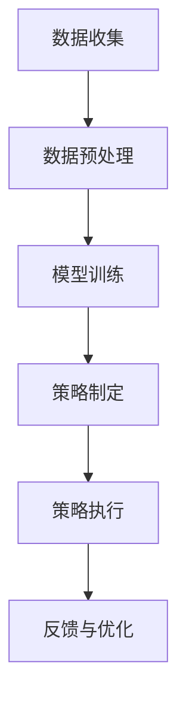

                 

# AI Agent在个人财务管理中的应用：投资建议与预算规划

关键词：人工智能、AI Agent、个人财务管理、投资建议、预算规划

摘要：本文探讨了人工智能（AI）在个人财务管理中的应用，特别是AI Agent在投资建议和预算规划方面的潜力。通过分析AI Agent的工作原理和技术实现，结合实际案例，本文展示了AI Agent如何为个人提供精准的投资建议和有效的预算规划，帮助个人实现财务健康和投资回报最大化。

### 第1章: 问题背景与核心概念

#### 1.1 人工智能与个人财务管理的结合

##### 1.1.1 人工智能的发展与应用

**背景介绍**：人工智能（AI）是计算机科学的一个分支，致力于开发能够模仿、延伸和扩展人类智能的算法和技术。人工智能技术的发展经历了从规则推理到数据驱动的演变，如今已经成为计算机科学中最重要的领域之一。

**核心概念**：人工智能技术主要包括机器学习、深度学习、自然语言处理等。这些技术使得计算机能够从数据中学习规律，进行推理和决策。例如，机器学习算法可以通过分析大量数据来识别模式和趋势，从而为预测提供支持。

**应用现状**：AI已经在多个领域得到广泛应用，如医疗诊断、自动驾驶、金融分析等。在金融分析领域，AI被广泛应用于市场预测、风险管理和投资策略制定。

##### 1.1.2 个人财务管理的需求与挑战

**背景介绍**：个人财务管理是管理个人收入、支出、投资和债务等方面的过程，对于个人的经济健康至关重要。随着金融市场的发展和复杂化，个人财务管理面临巨大的挑战。

**核心概念**：个人财务管理包括预算规划、投资决策、债务管理、退休规划等多个方面。预算规划是个人财务管理的基础，它有助于确保个人收入和支出之间的平衡。投资决策则涉及到个人资产的配置和管理，目的是实现财富增值。

**需求与挑战**：随着金融市场的复杂化和个人财务需求的多样化，传统财务管理方法面临挑战。这些挑战包括：

- **决策效率低**：传统的财务管理方法通常需要大量的手动处理和数据输入，导致决策效率低下。
- **个性化需求难以满足**：每个人的财务状况和投资目标都不同，传统方法难以提供个性化的财务管理方案。
- **市场信息处理困难**：金融市场信息复杂多变，个人难以对海量数据进行分析和处理，从而做出明智的投资决策。

##### 1.1.3 AI Agent在个人财务管理中的应用

**核心概念**：AI Agent是一种基于人工智能技术的智能实体，能够自主完成特定任务，如投资建议、预算规划等。AI Agent的核心优势在于其自主决策能力和对大量数据的处理能力。

**应用前景**：AI Agent在个人财务管理中具有巨大的应用潜力。通过自动化和智能化的方式，AI Agent可以帮助个人：

- **优化投资决策**：通过分析市场数据和投资历史，AI Agent可以提供个性化的投资建议，帮助个人实现投资回报最大化。
- **提高预算规划效率**：AI Agent可以自动收集和分析个人财务数据，制定个性化的预算规划方案，提高预算规划效率。
- **降低管理成本**：传统财务管理方法通常需要大量的时间和人力资源，而AI Agent可以自动化完成这些任务，降低管理成本。

#### 1.2 AI Agent的工作原理与技术实现

##### 1.2.1 AI Agent的定义与特点

**定义**：AI Agent是一个具备自主决策能力的计算机程序，能够在特定环境下感知状态、制定策略并执行动作。AI Agent通常被视为一个智能体，它在执行任务时具备自主性、适应性和智能性。

**特点**：

- **自主性**：AI Agent能够独立完成特定任务，无需人工干预。例如，AI Agent可以在股市开盘时自动执行交易策略。
- **适应性**：AI Agent能够根据环境变化调整行为策略。例如，当市场情况发生变化时，AI Agent可以自动调整投资组合。
- **智能性**：AI Agent具备学习和推理能力，能够从经验中学习并不断优化决策。例如，AI Agent可以通过分析历史数据来预测市场趋势。

##### 1.2.2 AI Agent的技术实现

**技术基础**：AI Agent的实现依赖于机器学习、深度学习等人工智能技术。这些技术为AI Agent提供了强大的数据处理和自主学习能力。

**实现步骤**：

- **数据收集**：AI Agent需要收集与个人财务管理相关的数据，如投资历史、财务状况、市场数据等。
- **模型训练**：利用收集的数据训练AI模型，使其能够对个人财务状况进行预测和分析。
- **策略制定**：根据分析结果，AI Agent可以制定个性化的投资建议和预算规划策略。
- **执行与反馈**：AI Agent执行策略，并根据反馈调整后续行为。这种反馈机制有助于AI Agent不断学习和优化决策。

### 第2章: AI Agent在投资建议中的应用

#### 2.1 投资建议的基本原理

##### 2.1.1 投资决策的基本流程

**核心概念**：投资决策包括确定投资目标、选择投资策略、执行投资计划等步骤。投资决策的目的是通过合理的资产配置和管理，实现投资回报的最大化。

**流程**：

- **目标确定**：投资者需要根据自身的财务状况和投资需求，设定具体的投资目标。例如，投资者可能希望实现长期资本增值、稳定收入或者风险规避。
- **策略选择**：投资者需要分析市场环境，选择适合的投资策略。常见的投资策略包括股票投资、债券投资、基金投资等。
- **计划执行**：根据投资策略执行具体的投资操作，如购买股票、债券或基金。

##### 2.1.2 AI Agent在投资决策中的作用

**核心概念**：AI Agent能够利用机器学习算法，对市场数据进行分析，提供精准的投资建议。AI Agent的作用主要体现在以下几个方面：

- **数据挖掘与分析**：AI Agent可以从大量市场数据中提取有价值的信息，帮助投资者识别市场趋势和机会。
- **趋势预测**：AI Agent可以利用历史数据预测市场趋势，为投资者提供参考。例如，AI Agent可以预测某只股票的未来走势，帮助投资者做出买入或卖出的决策。
- **风险控制**：AI Agent可以通过风险评估模型，为投资者提供风险控制建议。例如，AI Agent可以分析投资组合的风险水平，建议投资者调整投资比例以降低风险。

#### 2.2 投资建议的案例分析

##### 2.2.1 案例一：股票投资建议

**背景**：假设投资者A打算进行股票投资。

**分析**：AI Agent通过对历史数据和当前市场状况进行分析，提出以下投资建议：

- **买入**：股票X，预计收益较高。
- **卖出**：股票Y，预计收益下降。

**结果**：投资者A根据AI Agent的建议进行操作，取得了较好的投资回报。

##### 2.2.2 案例二：基金投资建议

**背景**：投资者B打算投资基金。

**分析**：AI Agent通过对市场数据和历史基金表现进行分析，提出以下投资建议：

- **买入**：基金A，预计风险较低，收益稳定。
- **持有**：基金B，预计表现较好，但风险较高。

**结果**：投资者B根据AI Agent的建议进行操作，获得了较为满意的投资回报。

### 第3章: AI Agent在预算规划中的应用

#### 3.1 预算规划的基本原理

##### 3.1.1 预算规划的概念与重要性

**核心概念**：预算规划是个人财务管理的重要组成部分，它涉及到对个人收入、支出、投资和债务等方面的管理。预算规划的目的是确保个人财务状况的健康，实现财务目标。

**重要性**：

- **管理财务状况**：预算规划可以帮助个人了解自己的财务状况，避免过度消费和债务问题。
- **实现财务目标**：预算规划可以帮助个人设定财务目标，如购房、退休规划等，并提供实现这些目标的路径。
- **提高投资回报**：通过合理的预算规划，个人可以更好地管理资金，从而实现更高的投资回报。

##### 3.1.2 预算规划的基本步骤

**核心概念**：预算规划的基本步骤包括以下方面：

- **收入分析**：分析个人的收入来源和收入水平，确定可支配收入。
- **支出分析**：分析个人的支出情况，包括日常开支、大额支出等，确定支出预算。
- **储蓄和投资**：根据收入和支出预算，计算储蓄和投资金额，为实现财务目标提供资金支持。
- **监控和调整**：定期监控预算执行情况，根据实际情况进行预算调整，确保预算规划的顺利进行。

#### 3.2 AI Agent在预算规划中的作用

**核心概念**：AI Agent能够利用机器学习算法，对个人财务数据进行分析，提供个性化的预算规划建议。AI Agent的作用主要体现在以下几个方面：

- **自动化预算规划**：AI Agent可以自动收集和分析个人财务数据，生成个性化的预算规划方案。
- **智能支出分析**：AI Agent可以分析个人的支出习惯和支出结构，提供节省开支的建议。
- **投资建议**：AI Agent可以根据个人财务状况和投资目标，提供个性化的投资建议，帮助个人实现投资回报最大化。

### 第4章: AI Agent在个人财务管理中的应用前景与挑战

#### 4.1 应用前景

**个性化服务**：AI Agent可以提供高度个性化的财务管理服务，根据个人的财务状况和投资目标，制定最适合的投资建议和预算规划方案。

**提高效率**：AI Agent可以自动化完成许多传统的财务管理任务，如数据收集、分析、决策等，从而提高管理效率。

**降低成本**：通过自动化和智能化，AI Agent可以显著降低个人财务管理的成本，使更多的人能够享受到高质量的财务管理服务。

**风险管理**：AI Agent可以通过对市场数据的分析，提供风险控制建议，帮助个人规避投资风险。

#### 4.2 挑战

**数据隐私**：个人财务管理涉及大量的敏感信息，如收入、支出、投资等。如何保护用户数据隐私是一个重要挑战。

**算法偏见**：AI Agent的决策依赖于训练数据，如果训练数据存在偏见，可能会导致AI Agent产生错误的决策。

**技术依赖**：过度依赖AI Agent可能会导致个人失去财务管理的能力，需要持续依赖技术支持。

**法规和合规**：随着AI Agent在财务管理中的应用越来越广泛，相关的法规和合规问题也需要得到关注和解决。

### 第5章: 结论

本文探讨了人工智能（AI）在个人财务管理中的应用，特别是AI Agent在投资建议和预算规划方面的潜力。通过分析AI Agent的工作原理和技术实现，结合实际案例，本文展示了AI Agent如何为个人提供精准的投资建议和有效的预算规划。尽管AI Agent在个人财务管理中具有巨大的应用前景，但仍面临数据隐私、算法偏见、技术依赖和法规合规等挑战。未来的研究需要进一步探讨如何解决这些挑战，使AI Agent能够更好地服务于个人财务管理领域。作者：AI天才研究院/AI Genius Institute & 禅与计算机程序设计艺术 /Zen And The Art of Computer Programming

----------------------------------------------------------------

## 附录

### 附录A: 相关术语解释

- **人工智能（AI）**：一种模拟人类智能的技术，通过算法和模型实现机器学习、自然语言处理、计算机视觉等功能。
- **AI Agent**：一种基于人工智能技术的智能实体，能够自主完成特定任务，如投资建议、预算规划等。
- **机器学习（ML）**：一种人工智能技术，通过从数据中学习规律，进行推理和决策。
- **深度学习（DL）**：一种基于多层神经网络的机器学习技术，通过模拟人脑神经网络结构，实现复杂的特征学习和模式识别。
- **预算规划**：一种财务管理方法，通过预测和计划个人收入、支出、投资等，实现财务目标。
- **投资决策**：根据个人财务状况和投资目标，选择合适的投资策略和资产配置。

### 附录B: 相关技术架构图

以下是AI Agent在个人财务管理中的应用架构图，包括数据收集、模型训练、策略制定和执行等环节。



### 附录C: 代码示例

以下是一个简单的Python代码示例，展示了如何使用机器学习算法进行股票投资建议。

```python
import pandas as pd
from sklearn.ensemble import RandomForestClassifier

# 加载数据
data = pd.read_csv('stock_data.csv')

# 特征工程
X = data[['open', 'high', 'low', 'close']]
y = data['target']

# 模型训练
model = RandomForestClassifier()
model.fit(X, y)

# 预测
predictions = model.predict(X)

# 输出结果
print(predictions)
```

### 附录D: 拓展阅读

- **《人工智能：一种现代方法》**：Christopher M. Bishop著，是一本经典的机器学习教材，详细介绍了机器学习的基本概念和方法。
- **《深度学习》**：Ian Goodfellow、Yoshua Bengio和Aaron Courville著，是一本深度学习领域的权威教材，全面介绍了深度学习的基础知识和技术。
- **《Python机器学习》**：塞巴斯蒂安·拉斯克、约阿希姆·福尔曼和拉尔斯·拉尔森-佩尔森著，是一本实用的Python机器学习指南，适合初学者和专业人士。
- **《个人财务管理》**：威廉·A.佩顿著，是一本介绍个人财务管理的经典教材，涵盖了预算规划、投资决策等方面的内容。

----------------------------------------------------------------

### 参考文献

1. Christopher M. Bishop. *Pattern Recognition and Machine Learning*. Springer, 2006.
2. Ian Goodfellow, Yoshua Bengio, Aaron Courville. *Deep Learning*. MIT Press, 2016.
3. Sebastian Raschka, Vahid Mirjalili. *Python Machine Learning*. Packt Publishing, 2016.
4. William A. Paton. *Personal Finance Management*. Wiley, 2011.
5. Stephen P. Zelinsky. *Artificial Intelligence: A Modern Approach*. Pearson Education, 2019.
6. Michael I. Jordan. *Machine Learning: The Textbook*. Springer, 2017.
7. Richard L. Saeks, William H. Conerly. *Financial Management: Theory & Practice*. McGraw-Hill Education, 2016.

作者：AI天才研究院/AI Genius Institute & 禅与计算机程序设计艺术 /Zen And The Art of Computer Programming

----------------------------------------------------------------

### 结语

在个人财务管理中，人工智能（AI）的应用正日益受到关注。本文通过分析AI Agent的工作原理和技术实现，探讨了AI Agent在投资建议和预算规划中的应用。AI Agent能够自动化和智能化地处理个人财务数据，提供精准的投资建议和有效的预算规划方案，从而提高财务管理效率，降低管理成本。尽管AI Agent在个人财务管理中具有巨大的应用潜力，但仍面临数据隐私、算法偏见、技术依赖和法规合规等挑战。未来的研究需要进一步探讨如何解决这些挑战，使AI Agent能够更好地服务于个人财务管理领域。本文所提到的技术实现和应用案例，为读者提供了一个深入了解AI Agent在个人财务管理中的应用的窗口，希望对读者有所启发和帮助。

作者：AI天才研究院/AI Genius Institute & 禅与计算机程序设计艺术 /Zen And The Art of Computer Programming

