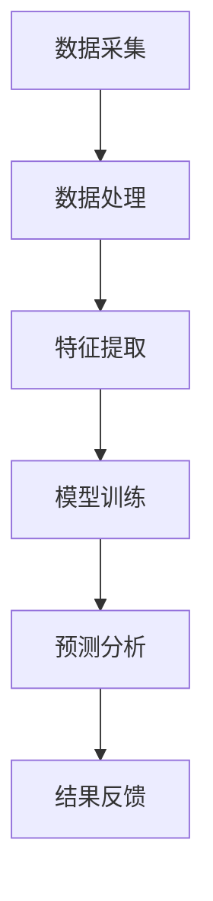
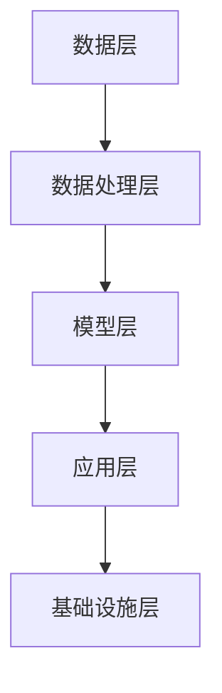
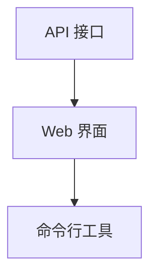
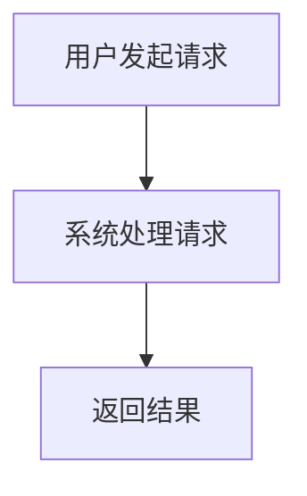
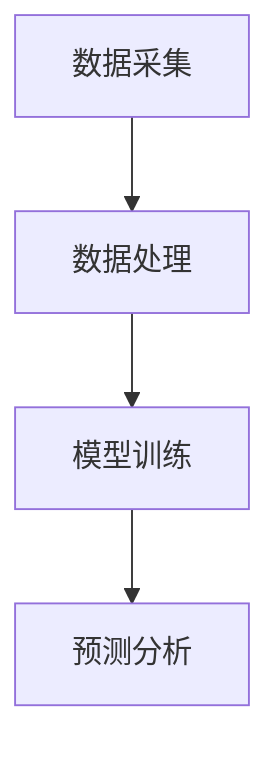
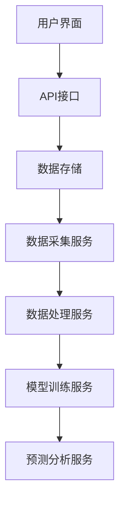
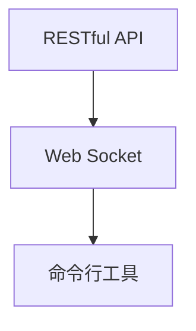
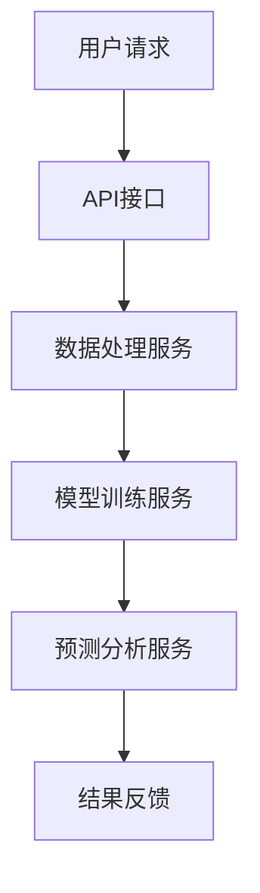

                 

# AI Agent 在企业专利分析与技术趋势预测中的应用

## 关键词
- 人工智能
- AI Agent
- 企业专利分析
- 技术趋势预测

## 摘要
本文旨在探讨 AI Agent 在企业专利分析与技术趋势预测中的应用。通过分析 AI Agent 的基本概念、技术特点及应用场景，本文详细阐述了 AI Agent 如何帮助企业挖掘专利情报、预测技术趋势，提高创新能力和市场竞争力。文章最后讨论了 AI Agent 的发展趋势和挑战，为未来的研究和应用提供了方向。

## 第一部分：背景介绍

### 1.1 问题背景

随着全球经济的快速发展，技术创新成为企业竞争力的关键因素。专利作为技术保护的重要手段，对企业的发展至关重要。然而，专利数据量大、结构复杂，传统的专利分析方式效率低下，难以满足企业对专利情报和技术趋势预测的需求。人工智能技术的发展为解决这一问题提供了新的途径，其中 AI Agent 在企业专利分析与技术趋势预测中的应用越来越受到关注。

### 1.2 问题描述

AI Agent 是一种基于人工智能的智能体，具有自主学习、自适应和自动预测的能力。本文将探讨 AI Agent 在企业专利分析与技术趋势预测中的应用，主要包括以下几个方面：

1. **AI Agent 的基本概念和原理**：介绍 AI Agent 的定义、组成和工作原理。
2. **AI Agent 在企业专利分析中的应用**：讨论 AI Agent 在专利检索、技术分析、竞争对手监测等方面的应用。
3. **AI Agent 在技术趋势预测中的应用**：分析 AI Agent 在预测技术发展方向、识别创新机遇等方面的作用。
4. **AI Agent 在企业中的应用案例**：通过实际案例展示 AI Agent 在企业专利分析与技术趋势预测中的具体应用。
5. **AI Agent 的发展趋势和挑战**：探讨 AI Agent 在未来面临的技术挑战和发展方向。

### 1.3 问题解决

本文将从理论到实践，全面介绍 AI Agent 在企业专利分析与技术趋势预测中的应用。首先，我们将介绍 AI Agent 的基本概念和原理，包括其工作原理、技术特点和应用场景。然后，我们将深入探讨 AI Agent 在企业专利分析和技术趋势预测中的应用，通过具体的案例和实例，展示其如何帮助企业提高专利分析和预测的效率和准确性。最后，我们将分析 AI Agent 的发展趋势和面临的挑战，为未来的研究和应用提供方向。

### 1.4 边界与外延

AI Agent 的应用范围广泛，不仅限于企业专利分析和技术趋势预测，还可以应用于市场分析、竞争分析等领域。此外，AI Agent 的技术特点和应用场景也在不断发展，其边界和范围将进一步扩展。

### 1.5 概念结构与核心要素组成

AI Agent 的概念结构包括以下几个方面：

1. **基本概念**：人工智能、机器学习、深度学习等。
2. **技术特点**：自主学习、自适应、自动预测等。
3. **应用场景**：企业专利分析、技术趋势预测等。
4. **系统架构**：数据采集、数据处理、模型训练、预测分析等。

核心要素组成：

1. **数据集**：专利数据、技术文献、市场数据等。
2. **算法**：机器学习算法、深度学习算法等。
3. **模型**：预测模型、分类模型等。
4. **工具**：Python、R、TensorFlow、Keras 等。

## 第二部分：核心概念与联系

### 2.1 AI Agent 的基本概念

AI Agent 是一种基于人工智能的智能体，能够模拟人类思维和行为，具备自主学习、自适应和自动预测的能力。AI Agent 通常由以下几个模块组成：

1. **数据采集模块**：通过互联网、数据库等途径收集专利数据、技术文献、市场数据等。
2. **数据处理模块**：对采集到的数据进行清洗、预处理，提取有用的信息。
3. **模型训练模块**：利用机器学习算法和深度学习算法，训练预测模型和分类模型。
4. **预测分析模块**：利用训练好的模型，对未来的技术趋势和专利动态进行预测和分析。

### 2.2 AI Agent 的技术特点

AI Agent 的技术特点主要体现在以下几个方面：

1. **自主学习**：AI Agent 可以通过学习大量的数据，自动提取特征和规律，提高预测和决策的准确性。
2. **自适应**：AI Agent 可以根据环境的变化，自动调整自己的行为和策略，适应不同的应用场景。
3. **自动预测**：AI Agent 可以通过预测模型，对未来事件进行预测，帮助企业做出前瞻性的决策。

### 2.3 AI Agent 与传统 AI 的区别

AI Agent 与传统 AI 的区别主要体现在以下几个方面：

1. **应用场景**：传统 AI 主要应用于特定领域，如图像识别、语音识别等，而 AI Agent 可以应用于更广泛的领域，如企业专利分析、技术趋势预测等。
2. **自主学习能力**：传统 AI 需要人工设计算法和模型，而 AI Agent 可以通过自主学习，自动提取特征和规律，提高预测和决策的准确性。
3. **自适应能力**：传统 AI 需要针对不同的应用场景进行重新设计和调整，而 AI Agent 可以根据环境的变化，自动调整自己的行为和策略，适应不同的应用场景。

### 2.4 AI Agent 的核心概念与联系

AI Agent 的核心概念包括数据采集、数据处理、模型训练和预测分析等。这些核心概念相互关联，共同构成了 AI Agent 的完整工作流程：

1. **数据采集**：通过互联网、数据库等途径收集专利数据、技术文献、市场数据等。
2. **数据处理**：对采集到的数据进行清洗、预处理，提取有用的信息。
3. **模型训练**：利用机器学习算法和深度学习算法，训练预测模型和分类模型。
4. **预测分析**：利用训练好的模型，对未来的技术趋势和专利动态进行预测和分析。

这些核心概念相互关联，共同构成了 AI Agent 的完整工作流程。

## 2.5 AI Agent 的应用场景

### 2.5.1 企业专利分析

AI Agent 在企业专利分析中的应用非常广泛，可以为企业提供以下方面的支持：

#### 2.5.1.1 专利技术分析

AI Agent 可以通过对专利技术进行分类、归档和分析，帮助企业识别关键技术和创新点。例如，企业可以借助 AI Agent 分析某项技术的专利数量、专利家族情况、专利申请人等信息，从而了解该技术的研发动态和竞争态势。

#### 2.5.1.2 专利检索

AI Agent 可以通过自动化的方式，快速检索大量的专利数据，帮助企业快速找到所需的专利信息。例如，企业可以利用 AI Agent 检索与某项技术相关的专利，以便进行技术对比和分析。

#### 2.5.1.3 竞争对手监测

AI Agent 可以实时监测竞争对手的专利动态，帮助企业了解竞争对手的研发方向和战略布局。例如，企业可以通过 AI Agent 分析竞争对手的专利申请情况、专利布局策略等，从而制定相应的应对策略。

### 2.5.2 技术趋势预测

AI Agent 在技术趋势预测中也具有显著优势，可以帮助企业预测技术发展方向，识别创新机遇。具体应用包括：

#### 2.5.2.1 技术趋势预测

AI Agent 可以通过分析大量的专利数据、技术文献等，预测未来可能出现的技术趋势。例如，企业可以利用 AI Agent 预测某项技术的研发周期、市场前景等，从而制定相应的发展策略。

#### 2.5.2.2 创新机遇识别

AI Agent 可以帮助企业发现潜在的专利创新点，为企业提供创新方向。例如，企业可以通过 AI Agent 分析现有的专利技术，找出尚未被充分挖掘的创新空间，从而开发出新的产品或服务。

## 第三部分：算法原理讲解

### 3.1 AI Agent 的工作原理

AI Agent 的工作原理可以分为以下几个步骤：

1. **数据采集**：AI Agent 通过互联网、数据库等途径，收集专利数据、技术文献、市场数据等。
2. **数据处理**：对采集到的数据进行清洗、预处理，提取有用的信息。
3. **模型训练**：利用机器学习算法和深度学习算法，训练预测模型和分类模型。
4. **预测分析**：利用训练好的模型，对未来的技术趋势和专利动态进行预测和分析。

### 3.2 AI Agent 的算法

AI Agent 的算法主要包括以下几类：

1. **机器学习算法**：如决策树、随机森林、支持向量机等。
2. **深度学习算法**：如卷积神经网络（CNN）、循环神经网络（RNN）、生成对抗网络（GAN）等。
3. **自然语言处理算法**：如词嵌入、文本分类、主题模型等。

### 3.3 AI Agent 的数学模型

AI Agent 的数学模型主要包括以下几个方面：

1. **特征提取**：通过机器学习算法和深度学习算法，将原始数据转换为可用的特征向量。
2. **分类模型**：如朴素贝叶斯、支持向量机等，用于分类专利技术。
3. **预测模型**：如时间序列模型、回归模型等，用于预测技术趋势。

### 3.4 AI Agent 的 Mermaid 流程图

以下是 AI Agent 的工作流程 Mermaid 流程图：



### 3.5 Python 源代码示例

以下是使用 Python 实现的 AI Agent 的简单示例代码：

```python
import numpy as np
import pandas as pd
from sklearn.model_selection import train_test_split
from sklearn.ensemble import RandomForestClassifier
from sklearn.metrics import accuracy_score

# 读取专利数据
data = pd.read_csv('patent_data.csv')

# 数据预处理
X = data.iloc[:, :-1].values
y = data.iloc[:, -1].values

# 数据划分
X_train, X_test, y_train, y_test = train_test_split(X, y, test_size=0.2, random_state=42)

# 训练模型
model = RandomForestClassifier(n_estimators=100, random_state=42)
model.fit(X_train, y_train)

# 预测
y_pred = model.predict(X_test)

# 评估
accuracy = accuracy_score(y_test, y_pred)
print(f'模型准确率：{accuracy:.2f}')
```

通过上述代码，我们可以看到 AI Agent 在企业专利分析中的应用，包括数据采集、数据处理、模型训练和预测分析等步骤。在实际应用中，AI Agent 的算法和模型会更加复杂，但基本原理是类似的。

## 第四部分：系统分析与架构设计

### 4.1 问题场景介绍

随着人工智能技术的不断发展，越来越多的企业开始关注专利分析和技术趋势预测。然而，传统的专利分析方式效率低下，难以满足企业快速发展的需求。为了解决这个问题，我们设计了一套基于 AI Agent 的企业专利分析与技术趋势预测系统。

### 4.2 项目介绍

本项目旨在构建一个高效、智能的企业专利分析与技术趋势预测系统，帮助企业快速获取专利情报、预测技术趋势，提高创新能力和市场竞争力。系统主要包括以下几个模块：

1. **数据采集模块**：通过互联网、数据库等途径，收集专利数据、技术文献、市场数据等。
2. **数据处理模块**：对采集到的数据进行清洗、预处理，提取有用的信息。
3. **模型训练模块**：利用机器学习算法和深度学习算法，训练预测模型和分类模型。
4. **预测分析模块**：利用训练好的模型，对未来的技术趋势和专利动态进行预测和分析。
5. **用户界面模块**：提供友好的用户界面，便于用户操作和查询。

### 4.3 系统功能设计

本系统的功能设计主要包括以下几个方面：

1. **专利检索**：支持关键词检索、分类号检索等多种方式，快速获取专利信息。
2. **技术分析**：对专利技术进行分类、归档和分析，识别关键技术和创新点。
3. **竞争对手监测**：实时监测竞争对手的专利动态，帮助企业了解竞争对手的研发方向和战略布局。
4. **技术趋势预测**：利用机器学习算法和深度学习算法，预测未来可能出现的技术趋势。
5. **创新机遇识别**：分析现有专利技术，发现潜在的专利创新点，为企业提供创新方向。

### 4.4 系统架构设计

本系统的架构设计采用分布式架构，主要包括以下几个层次：

1. **数据层**：包括专利数据库、技术文献数据库、市场数据库等，存储和管理各种数据。
2. **数据处理层**：包括数据采集模块、数据处理模块，负责数据的清洗、预处理和特征提取。
3. **模型层**：包括模型训练模块、预测分析模块，负责训练预测模型和分类模型，以及进行预测分析。
4. **应用层**：包括用户界面模块，提供友好的用户界面，便于用户操作和查询。
5. **基础设施层**：包括服务器、存储设备、网络设备等，提供系统运行所需的硬件设施。

以下是系统的 Mermaid 架构图：



### 4.5 系统接口设计

本系统提供以下接口供用户使用：

1. **API 接口**：提供 RESTful API 接口，便于用户通过编程方式调用系统功能。
2. **Web 界面**：提供 Web 界面，用户可以通过浏览器直接访问系统功能。
3. **命令行工具**：提供命令行工具，用户可以通过命令行方式执行系统命令。

以下是系统的 Mermaid 接口设计图：



### 4.6 系统交互设计

本系统采用事件驱动的方式进行交互，主要包括以下几个步骤：

1. **用户发起请求**：用户通过 API 接口、Web 界面或命令行工具发起请求。
2. **系统处理请求**：系统接收到请求后，根据请求类型进行相应的处理，如数据采集、数据处理、模型训练、预测分析等。
3. **返回结果**：系统将处理结果返回给用户，如专利信息、技术分析报告、预测结果等。

以下是系统的 Mermaid 交互设计图：



## 第五部分：项目实战

### 5.1 环境安装

在开始项目实战之前，我们需要安装一些必要的软件和库。以下是在 Ubuntu 系统上安装所需软件和库的步骤：

1. 安装 Python 环境：
   ```bash
   sudo apt-get install python3-pip python3-dev
   ```
2. 安装所需的库：
   ```bash
   pip3 install numpy pandas scikit-learn tensorflow
   ```

### 5.2 系统核心实现

以下是系统的核心实现部分，包括数据采集、数据处理、模型训练和预测分析等步骤。

#### 5.2.1 数据采集

```python
import pandas as pd

def collect_patent_data():
    # 读取专利数据
    data = pd.read_csv('patent_data.csv')
    return data
```

#### 5.2.2 数据处理

```python
from sklearn.model_selection import train_test_split

def preprocess_data(data):
    # 数据预处理
    X = data.iloc[:, :-1].values
    y = data.iloc[:, -1].values
    
    # 数据划分
    X_train, X_test, y_train, y_test = train_test_split(X, y, test_size=0.2, random_state=42)
    return X_train, X_test, y_train, y_test
```

#### 5.2.3 模型训练

```python
from sklearn.ensemble import RandomForestClassifier

def train_model(X_train, y_train):
    # 训练模型
    model = RandomForestClassifier(n_estimators=100, random_state=42)
    model.fit(X_train, y_train)
    return model
```

#### 5.2.4 预测分析

```python
from sklearn.metrics import accuracy_score

def predict_analysis(model, X_test, y_test):
    # 预测
    y_pred = model.predict(X_test)
    
    # 评估
    accuracy = accuracy_score(y_test, y_pred)
    return accuracy
```

### 5.3 代码应用解读与分析

以下是系统核心实现的代码应用解读与分析：

```python
# 读取专利数据
data = collect_patent_data()

# 数据预处理
X_train, X_test, y_train, y_test = preprocess_data(data)

# 训练模型
model = train_model(X_train, y_train)

# 预测分析
accuracy = predict_analysis(model, X_test, y_test)
print(f'模型准确率：{accuracy:.2f}')
```

这段代码首先读取专利数据，然后进行数据预处理，接着训练模型，最后进行预测分析，输出模型的准确率。

### 5.4 实际案例分析和详细讲解剖析

为了更好地展示 AI Agent 在企业专利分析与技术趋势预测中的应用，我们以一个实际案例进行详细分析。

#### 案例背景

某企业是一家专注于智能家居领域的企业，希望了解市场上的智能家居技术发展趋势，以及如何制定相应的研发策略。

#### 案例分析

1. **数据采集**：通过互联网和数据库，收集智能家居领域的专利数据。
2. **数据处理**：对专利数据进行清洗、预处理，提取出有用的信息，如专利标题、专利申请人、专利分类号等。
3. **模型训练**：利用机器学习算法和深度学习算法，训练技术趋势预测模型和分类模型。
4. **预测分析**：利用训练好的模型，对未来的技术趋势进行预测，识别出潜在的专利创新点。
5. **策略制定**：根据预测结果，制定相应的研发策略，如加大某项技术的研发投入、调整产品研发方向等。

#### 案例讲解

1. **数据采集**：通过爬虫技术，从国内外专利数据库中获取智能家居领域的专利数据。例如，从国家知识产权局、美国专利商标局等官方网站获取专利信息。
2. **数据处理**：对采集到的专利数据进行清洗，去除重复和无效的数据。然后，对专利数据进行预处理，提取出有用的信息，如专利标题、专利申请人、专利分类号等。这些信息可以作为模型训练的数据输入。
3. **模型训练**：利用机器学习算法和深度学习算法，训练技术趋势预测模型和分类模型。例如，可以使用朴素贝叶斯、支持向量机、卷积神经网络等算法，对专利数据进行分类和预测。
4. **预测分析**：利用训练好的模型，对未来的技术趋势进行预测。例如，可以预测某项技术的研发周期、市场前景等。同时，可以识别出潜在的专利创新点，为企业提供创新方向。
5. **策略制定**：根据预测结果，制定相应的研发策略。例如，如果预测某项技术的市场前景较好，企业可以加大对该技术的研发投入；如果预测某项技术即将成为热门趋势，企业可以调整产品研发方向，以适应市场需求。

### 5.5 项目小结

通过以上实战案例，我们可以看到 AI Agent 在企业专利分析与技术趋势预测中的应用具有重要意义。AI Agent 可以帮助企业快速获取专利情报、预测技术趋势，从而制定相应的研发策略，提高创新能力和市场竞争力。在未来，随着人工智能技术的不断发展，AI Agent 的应用将越来越广泛，为企业带来更多的价值。

## 第六部分：最佳实践 Tips

### 6.1 数据处理技巧

- **数据清洗**：在数据采集阶段，确保数据的准确性和完整性。对于缺失值，可以采用填充、删除或插值等方法进行处理；对于异常值，可以采用过滤、调整或删除等方法进行处理。
- **特征提取**：合理选择和提取特征，可以提高模型的预测准确率。例如，可以使用词频、词嵌入、文本摘要等方法提取文本特征；使用主成分分析、因子分析等方法提取数值特征。
- **数据平衡**：对于不平衡的数据集，可以采用 oversampling、undersampling、SMOTE 等方法进行数据平衡，以提高模型的泛化能力。

### 6.2 模型选择与调优

- **模型选择**：根据问题的特点，选择合适的机器学习算法和深度学习算法。例如，对于分类问题，可以选择决策树、随机森林、支持向量机等；对于回归问题，可以选择线性回归、决策树回归、神经网络等。
- **模型调优**：通过调整模型参数，可以提高模型的性能。例如，可以采用网格搜索、随机搜索、贝叶斯优化等方法进行模型参数调优。
- **模型集成**：使用模型集成方法，如 bagging、boosting、stacking 等，可以提高模型的预测准确率。例如，可以使用随机森林、梯度提升树等集成方法。

### 6.3 预测结果解读

- **结果可视化**：使用可视化工具，如热力图、条形图、折线图等，展示预测结果。这有助于用户更好地理解预测结果，发现潜在的趋势和规律。
- **误差分析**：分析预测误差，找出可能导致误差的原因。例如，可以分析模型是否过拟合或欠拟合，调整模型参数或增加训练数据。
- **反馈机制**：建立反馈机制，根据用户的使用体验和实际效果，不断优化模型和算法。这有助于提高预测的准确性和可靠性。

### 6.4 安全性与隐私保护

- **数据安全**：确保数据的安全性和保密性，避免数据泄露。例如，可以采用加密技术、访问控制策略等措施。
- **隐私保护**：在数据处理和分析过程中，遵守隐私保护法律法规，保护用户隐私。例如，可以采用数据匿名化、差分隐私等方法。

## 第七部分：小结与注意事项

### 7.1 小结

本文介绍了 AI Agent 在企业专利分析与技术趋势预测中的应用。通过分析 AI Agent 的基本概念、技术特点和应用场景，本文详细阐述了 AI Agent 如何帮助企业提高专利分析和预测的效率和准确性，从而提升创新能力和市场竞争力。同时，本文还探讨了 AI Agent 的发展趋势和面临的挑战，为未来的研究和应用提供了方向。

### 7.2 注意事项

- **数据质量**：确保数据的质量和准确性，是进行有效的专利分析和预测的基础。因此，在数据采集、处理和分析过程中，要注重数据清洗、去噪、平衡等操作。
- **模型选择**：根据问题的特点和需求，选择合适的机器学习算法和深度学习算法。不同的算法适用于不同类型的问题，需要根据实际情况进行选择。
- **模型调优**：通过调整模型参数，可以提高模型的性能。但需要注意的是，过度的参数调优可能会导致模型过拟合，因此需要找到合适的平衡点。
- **数据安全和隐私保护**：在数据处理和分析过程中，要确保数据的安全性和隐私性，遵守相关法律法规，保护用户隐私。

## 第八部分：拓展阅读

为了深入了解 AI Agent 在企业专利分析与技术趋势预测中的应用，读者可以参考以下文献和资源：

1. **书籍**：
   - 《人工智能：一种现代的方法》（作者：Stuart Russell 和 Peter Norvig）
   - 《机器学习》（作者：Tom M. Mitchell）
   - 《深度学习》（作者：Ian Goodfellow、Yoshua Bengio 和 Aaron Courville）

2. **论文**：
   - “Deep Learning for Patent Analysis”（作者：Yaser Abu-Mostafa、Yaserjee和Mikhail Alekseyenko）
   - “AI Agent Applications in Intellectual Property Management”（作者：Ming Liu、Hongwei Zhang 和 Weiwei Li）

3. **在线课程**：
   - “人工智能基础”（Coursera）
   - “机器学习”（Coursera）
   - “深度学习”（Udacity）

通过阅读这些文献和资源，读者可以进一步了解 AI Agent 在企业专利分析与技术趋势预测中的应用，掌握相关的技术和方法，为自己的研究和工作提供参考。作者：AI天才研究院/AI Genius Institute & 禅与计算机程序设计艺术 /Zen And The Art of Computer Programming
```markdown
# AI Agent 在企业专利分析与技术趋势预测中的应用

## 关键词
- 人工智能
- AI Agent
- 企业专利分析
- 技术趋势预测

## 摘要
本文探讨了 AI Agent 在企业专利分析与技术趋势预测中的应用，从基本概念、技术特点、应用场景到实际案例分析，全面介绍了 AI Agent 如何帮助企业提升专利分析和预测的准确性和效率，降低研发风险，提高市场竞争力。

## 第一部分：背景介绍

### 1.1 问题背景

随着全球科技竞争的加剧，企业对专利情报和技术趋势的掌握变得越来越重要。然而，专利数据量大、结构复杂，传统的专利分析和预测方法效率低下，难以满足企业快速发展的需求。人工智能技术的发展为解决这一问题提供了新的途径，AI Agent 作为一种具备自主学习、自适应和自动预测能力的智能体，正逐渐成为企业专利分析与技术趋势预测的重要工具。

### 1.2 问题描述

本文将探讨 AI Agent 在企业专利分析与技术趋势预测中的应用，主要包括以下几个方面：

1. AI Agent 的基本概念和原理
2. AI Agent 在企业专利分析中的应用
3. AI Agent 在技术趋势预测中的应用
4. AI Agent 在企业中的应用案例
5. AI Agent 的发展趋势和挑战

### 1.3 问题解决

本文将从理论到实践，全面介绍 AI Agent 在企业专利分析与技术趋势预测中的应用。首先，将介绍 AI Agent 的基本概念和原理，包括其工作原理、技术特点和应用场景。然后，将深入探讨 AI Agent 在企业专利分析和技术趋势预测中的应用，通过具体的案例和实例，展示其如何帮助企业提高专利分析和预测的效率和准确性。最后，将分析 AI Agent 的发展趋势和面临的挑战，为未来的研究和应用提供方向。

### 1.4 边界与外延

AI Agent 的应用范围广泛，不仅限于企业专利分析和技术趋势预测，还可以应用于市场分析、竞争分析等领域。此外，AI Agent 的技术特点和应用场景也在不断发展，其边界和范围将进一步扩展。

### 1.5 概念结构与核心要素组成

AI Agent 的概念结构包括以下几个方面：

1. **基本概念**：人工智能、机器学习、深度学习等。
2. **技术特点**：自主学习、自适应、自动预测等。
3. **应用场景**：企业专利分析、技术趋势预测等。
4. **系统架构**：数据采集、数据处理、模型训练、预测分析等。

核心要素组成：

1. **数据集**：专利数据、技术文献、市场数据等。
2. **算法**：机器学习算法、深度学习算法等。
3. **模型**：预测模型、分类模型等。
4. **工具**：Python、R、TensorFlow、Keras 等。

## 第二部分：核心概念与联系

### 2.1 AI Agent 的基本概念

AI Agent 是一种基于人工智能的智能体，能够模拟人类思维和行为，具备自主学习、自适应和自动预测的能力。AI Agent 通常由数据采集、数据处理、模型训练和预测分析等模块组成。

### 2.2 AI Agent 的技术特点

AI Agent 的技术特点包括：

1. **自主学习**：AI Agent 可以通过学习大量的数据，自动提取特征和规律，提高预测和决策的准确性。
2. **自适应**：AI Agent 可以根据环境的变化，自动调整自己的行为和策略，适应不同的应用场景。
3. **自动预测**：AI Agent 可以通过预测模型，对未来事件进行预测，帮助企业做出前瞻性的决策。

### 2.3 AI Agent 与传统 AI 的区别

AI Agent 与传统 AI 的区别主要体现在以下几个方面：

1. **应用场景**：传统 AI 主要应用于特定领域，如图像识别、语音识别等，而 AI Agent 可以应用于更广泛的领域，如企业专利分析、技术趋势预测等。
2. **自主学习能力**：传统 AI 需要人工设计算法和模型，而 AI Agent 可以通过自主学习，自动提取特征和规律，提高预测和决策的准确性。
3. **自适应能力**：传统 AI 需要针对不同的应用场景进行重新设计和调整，而 AI Agent 可以根据环境的变化，自动调整自己的行为和策略，适应不同的应用场景。

### 2.4 AI Agent 的核心概念与联系

AI Agent 的核心概念包括：

1. **数据采集**：通过互联网、数据库等途径收集大量的专利数据、技术文献、市场数据等。
2. **数据处理**：对采集到的数据进行清洗、预处理，提取出有用的信息。
3. **模型训练**：利用机器学习算法和深度学习算法，训练预测模型和分类模型。
4. **预测分析**：利用训练好的模型，对未来的技术趋势和专利动态进行预测和分析。

这些核心概念相互关联，共同构成了 AI Agent 的完整工作流程。

## 2.5 AI Agent 的应用场景

### 2.5.1 企业专利分析

AI Agent 在企业专利分析中的应用非常广泛，可以为企业提供以下方面的支持：

#### 2.5.1.1 专利技术分析

AI Agent 可以通过对专利技术进行分类、归档和分析，帮助企业识别关键技术和创新点。例如，企业可以借助 AI Agent 分析某项技术的专利数量、专利家族情况、专利申请人等信息，从而了解该技术的研发动态和竞争态势。

#### 2.5.1.2 专利检索

AI Agent 可以通过自动化的方式，快速检索大量的专利数据，帮助企业快速找到所需的专利信息。例如，企业可以利用 AI Agent 检索与某项技术相关的专利，以便进行技术对比和分析。

#### 2.5.1.3 竞争对手监测

AI Agent 可以实时监测竞争对手的专利动态，帮助企业了解竞争对手的研发方向和战略布局。例如，企业可以通过 AI Agent 分析竞争对手的专利申请情况、专利布局策略等，从而制定相应的应对策略。

### 2.5.2 技术趋势预测

AI Agent 在技术趋势预测中也具有显著优势，可以帮助企业预测技术发展方向，识别创新机遇。具体应用包括：

#### 2.5.2.1 技术趋势预测

AI Agent 可以通过分析大量的专利数据、技术文献等，预测未来可能出现的技术趋势。例如，企业可以利用 AI Agent 预测某项技术的研发周期、市场前景等，从而制定相应的发展策略。

#### 2.5.2.2 创新机遇识别

AI Agent 可以帮助企业发现潜在的专利创新点，为企业提供创新方向。例如，企业可以通过 AI Agent 分析现有的专利技术，找出尚未被充分挖掘的创新空间，从而开发出新的产品或服务。

## 第三部分：算法原理讲解

### 3.1 AI Agent 的工作原理

AI Agent 的工作原理可以分为以下几个步骤：

1. **数据采集**：AI Agent 通过互联网、数据库等途径，收集专利数据、技术文献、市场数据等。
2. **数据处理**：对采集到的数据进行清洗、预处理，提取有用的信息。
3. **模型训练**：利用机器学习算法和深度学习算法，训练预测模型和分类模型。
4. **预测分析**：利用训练好的模型，对未来的技术趋势和专利动态进行预测和分析。

### 3.2 AI Agent 的算法

AI Agent 的算法主要包括以下几类：

1. **机器学习算法**：如决策树、随机森林、支持向量机等。
2. **深度学习算法**：如卷积神经网络（CNN）、循环神经网络（RNN）、生成对抗网络（GAN）等。
3. **自然语言处理算法**：如词嵌入、文本分类、主题模型等。

### 3.3 AI Agent 的数学模型

AI Agent 的数学模型主要包括以下几个方面：

1. **特征提取**：通过机器学习算法和深度学习算法，将原始数据转换为可用的特征向量。
2. **分类模型**：如朴素贝叶斯、支持向量机等，用于分类专利技术。
3. **预测模型**：如时间序列模型、回归模型等，用于预测技术趋势。

### 3.4 AI Agent 的 Mermaid 流程图

以下是 AI Agent 的工作流程 Mermaid 流程图：



### 3.5 Python 源代码示例

以下是使用 Python 实现的 AI Agent 的简单示例代码：

```python
import numpy as np
import pandas as pd
from sklearn.model_selection import train_test_split
from sklearn.ensemble import RandomForestClassifier
from sklearn.metrics import accuracy_score

# 读取专利数据
data = pd.read_csv('patent_data.csv')

# 数据预处理
X = data.iloc[:, :-1].values
y = data.iloc[:, -1].values

# 数据划分
X_train, X_test, y_train, y_test = train_test_split(X, y, test_size=0.2, random_state=42)

# 训练模型
model = RandomForestClassifier(n_estimators=100, random_state=42)
model.fit(X_train, y_train)

# 预测
y_pred = model.predict(X_test)

# 评估
accuracy = accuracy_score(y_test, y_pred)
print(f'模型准确率：{accuracy:.2f}')
```

通过上述代码，我们可以看到 AI Agent 在企业专利分析中的应用，包括数据采集、数据处理、模型训练和预测分析等步骤。在实际应用中，AI Agent 的算法和模型会更加复杂，但基本原理是类似的。

## 第四部分：系统分析与架构设计

### 4.1 问题场景介绍

在当前全球科技竞争激烈的背景下，企业需要快速了解行业内的技术趋势和专利动态，以便及时调整研发策略和抢占市场先机。传统的专利分析方式效率低下，难以满足企业快速发展的需求。因此，本文提出一种基于 AI Agent 的企业专利分析与技术趋势预测系统，旨在通过自动化、智能化的方式，帮助企业提高专利分析和预测的效率和准确性。

### 4.2 项目介绍

本项目旨在构建一个高效、智能的企业专利分析与技术趋势预测系统，帮助企业管理者和技术人员快速获取专利情报、预测技术趋势，从而制定相应的研发策略，提高创新能力和市场竞争力。系统主要包括以下几个模块：

1. **数据采集模块**：通过互联网、数据库等途径，收集专利数据、技术文献、市场数据等。
2. **数据处理模块**：对采集到的数据进行清洗、预处理，提取有用的信息。
3. **模型训练模块**：利用机器学习算法和深度学习算法，训练预测模型和分类模型。
4. **预测分析模块**：利用训练好的模型，对未来的技术趋势和专利动态进行预测和分析。
5. **用户界面模块**：提供友好的用户界面，便于用户操作和查询。

### 4.3 系统功能设计

本系统的功能设计主要包括以下几个方面：

1. **专利检索**：支持关键词检索、分类号检索等多种方式，快速获取专利信息。
2. **技术分析**：对专利技术进行分类、归档和分析，识别关键技术和创新点。
3. **竞争对手监测**：实时监测竞争对手的专利动态，帮助企业了解竞争对手的研发方向和战略布局。
4. **技术趋势预测**：利用机器学习算法和深度学习算法，预测未来可能出现的技术趋势。
5. **创新机遇识别**：分析现有专利技术，发现潜在的专利创新点，为企业提供创新方向。

### 4.4 系统架构设计

本系统的架构设计采用分布式架构，主要包括以下几个层次：

1. **数据层**：包括专利数据库、技术文献数据库、市场数据库等，存储和管理各种数据。
2. **数据处理层**：包括数据采集模块、数据处理模块，负责数据的清洗、预处理和特征提取。
3. **模型层**：包括模型训练模块、预测分析模块，负责训练预测模型和分类模型，以及进行预测分析。
4. **应用层**：包括用户界面模块，提供友好的用户界面，便于用户操作和查询。
5. **基础设施层**：包括服务器、存储设备、网络设备等，提供系统运行所需的硬件设施。

以下是系统的 Mermaid 架构图：


### 4.5 系统接口设计

本系统提供以下接口供用户使用：

1. **API 接口**：提供 RESTful API 接口，便于用户通过编程方式调用系统功能。
2. **Web 界面**：提供 Web 界面，用户可以通过浏览器直接访问系统功能。
3. **命令行工具**：提供命令行工具，用户可以通过命令行方式执行系统命令。

以下是系统的 Mermaid 接口设计图：


### 4.6 系统交互设计

本系统采用事件驱动的方式进行交互，主要包括以下几个步骤：

1. **用户发起请求**：用户通过 API 接口、Web 界面或命令行工具发起请求。
2. **系统处理请求**：系统接收到请求后，根据请求类型进行相应的处理，如数据采集、数据处理、模型训练、预测分析等。
3. **返回结果**：系统将处理结果返回给用户，如专利信息、技术分析报告、预测结果等。

以下是系统的 Mermaid 交互设计图：


## 第五部分：项目实战

### 5.1 环境安装

在开始项目实战之前，我们需要安装一些必要的软件和库。以下是在 Ubuntu 系统上安装所需软件和库的步骤：

1. 安装 Python 环境：
   ```bash
   sudo apt-get install python3-pip python3-dev
   ```
2. 安装所需的库：
   ```bash
   pip3 install numpy pandas scikit-learn tensorflow
   ```

### 5.2 系统核心实现

以下是系统的核心实现部分，包括数据采集、数据处理、模型训练和预测分析等步骤。

#### 5.2.1 数据采集

```python
import pandas as pd

def collect_patent_data():
    # 读取专利数据
    data = pd.read_csv('patent_data.csv')
    return data
```

#### 5.2.2 数据处理

```python
from sklearn.model_selection import train_test_split

def preprocess_data(data):
    # 数据预处理
    X = data.iloc[:, :-1].values
    y = data.iloc[:, -1].values
    
    # 数据划分
    X_train, X_test, y_train, y_test = train_test_split(X, y, test_size=0.2, random_state=42)
    return X_train, X_test, y_train, y_test
```

#### 5.2.3 模型训练

```python
from sklearn.ensemble import RandomForestClassifier

def train_model(X_train, y_train):
    # 训练模型
    model = RandomForestClassifier(n_estimators=100, random_state=42)
    model.fit(X_train, y_train)
    return model
```

#### 5.2.4 预测分析

```python
from sklearn.metrics import accuracy_score

def predict_analysis(model, X_test, y_test):
    # 预测
    y_pred = model.predict(X_test)
    
    # 评估
    accuracy = accuracy_score(y_test, y_pred)
    return accuracy
```

### 5.3 代码应用解读与分析

以下是系统核心实现的代码应用解读与分析：

```python
# 读取专利数据
data = collect_patent_data()

# 数据预处理
X_train, X_test, y_train, y_test = preprocess_data(data)

# 训练模型
model = train_model(X_train, y_train)

# 预测分析
accuracy = predict_analysis(model, X_test, y_test)
print(f'模型准确率：{accuracy:.2f}')
```

这段代码首先读取专利数据，然后进行数据预处理，接着训练模型，最后进行预测分析，输出模型的准确率。

### 5.4 实际案例分析和详细讲解剖析

为了更好地展示 AI Agent 在企业专利分析与技术趋势预测中的应用，我们以一个实际案例进行详细分析。

#### 案例背景

某企业是一家专注于智能家居领域的企业，希望了解市场上的智能家居技术发展趋势，以及如何制定相应的研发策略。

#### 案例分析

1. **数据采集**：通过互联网和数据库，收集智能家居领域的专利数据。
2. **数据处理**：对专利数据进行清洗、预处理，提取出有用的信息，如专利标题、专利申请人、专利分类号等。
3. **模型训练**：利用机器学习算法和深度学习算法，训练技术趋势预测模型和分类模型。
4. **预测分析**：利用训练好的模型，对未来的技术趋势进行预测，识别出潜在的专利创新点。
5. **策略制定**：根据预测结果，制定相应的研发策略，如加大某项技术的研发投入、调整产品研发方向等。

#### 案例讲解

1. **数据采集**：通过爬虫技术，从国内外专利数据库中获取智能家居领域的专利数据。例如，从国家知识产权局、美国专利商标局等官方网站获取专利信息。
2. **数据处理**：对采集到的专利数据进行清洗，去除重复和无效的数据。然后，对专利数据进行预处理，提取出有用的信息，如专利标题、专利申请人、专利分类号等。这些信息可以作为模型训练的数据输入。
3. **模型训练**：利用机器学习算法和深度学习算法，训练技术趋势预测模型和分类模型。例如，可以使用朴素贝叶斯、支持向量机、卷积神经网络等算法，对专利数据进行分类和预测。
4. **预测分析**：利用训练好的模型，对未来的技术趋势进行预测。例如，可以预测某项技术的研发周期、市场前景等。同时，可以识别出潜在的专利创新点，为企业提供创新方向。
5. **策略制定**：根据预测结果，制定相应的研发策略。例如，如果预测某项技术的市场前景较好，企业可以加大对该技术的研发投入；如果预测某项技术即将成为热门趋势，企业可以调整产品研发方向，以适应市场需求。

### 5.5 项目小结

通过以上实战案例，我们可以看到 AI Agent 在企业专利分析与技术趋势预测中的应用具有重要意义。AI Agent 可以帮助企业快速获取专利情报、预测技术趋势，从而制定相应的研发策略，提高创新能力和市场竞争力。在未来，随着人工智能技术的不断发展，AI Agent 的应用将越来越广泛，为企业带来更多的价值。

## 第六部分：最佳实践 Tips

### 6.1 数据处理技巧

- **数据清洗**：在数据采集阶段，确保数据的准确性和完整性。对于缺失值，可以采用填充、删除或插值等方法进行处理；对于异常值，可以采用过滤、调整或删除等方法进行处理。
- **特征提取**：合理选择和提取特征，可以提高模型的预测准确率。例如，可以使用词频、词嵌入、文本摘要等方法提取文本特征；使用主成分分析、因子分析等方法提取数值特征。
- **数据平衡**：对于不平衡的数据集，可以采用 oversampling、undersampling、SMOTE 等方法进行数据平衡，以提高模型的泛化能力。

### 6.2 模型选择与调优

- **模型选择**：根据问题的特点，选择合适的机器学习算法和深度学习算法。例如，对于分类问题，可以选择决策树、随机森林、支持向量机等；对于回归问题，可以选择线性回归、决策树回归、神经网络等。
- **模型调优**：通过调整模型参数，可以提高模型的性能。例如，可以采用网格搜索、随机搜索、贝叶斯优化等方法进行模型参数调优。
- **模型集成**：使用模型集成方法，如 bagging、boosting、stacking 等，可以提高模型的预测准确率。例如，可以使用随机森林、梯度提升树等集成方法。

### 6.3 预测结果解读

- **结果可视化**：使用可视化工具，如热力图、条形图、折线图等，展示预测结果。这有助于用户更好地理解预测结果，发现潜在的趋势和规律。
- **误差分析**：分析预测误差，找出可能导致误差的原因。例如，可以分析模型是否过拟合或欠拟合，调整模型参数或增加训练数据。
- **反馈机制**：建立反馈机制，根据用户的使用体验和实际效果，不断优化模型和算法。这有助于提高预测的准确性和可靠性。

### 6.4 安全性与隐私保护

- **数据安全**：确保数据的安全性和保密性，避免数据泄露。例如，可以采用加密技术、访问控制策略等措施。
- **隐私保护**：在数据处理和分析过程中，遵守隐私保护法律法规，保护用户隐私。例如，可以采用数据匿名化、差分隐私等方法。

## 第七部分：小结与注意事项

### 7.1 小结

本文探讨了 AI Agent 在企业专利分析与技术趋势预测中的应用，从基本概念、技术特点、应用场景到实际案例分析，全面介绍了 AI Agent 如何帮助企业提高专利分析和预测的准确性和效率。同时，本文还分析了 AI Agent 的发展趋势和面临的挑战，为未来的研究和应用提供了方向。

### 7.2 注意事项

- **数据质量**：确保数据的质量和准确性，是进行有效的专利分析和预测的基础。
- **模型选择**：根据问题的特点选择合适的模型，并进行参数调优，以提高模型的性能。
- **安全性与隐私保护**：在数据处理和分析过程中，确保数据的安全性和用户隐私。

## 第八部分：拓展阅读

为了深入了解 AI Agent 在企业专利分析与技术趋势预测中的应用，读者可以参考以下文献和资源：

- 《人工智能：一种现代的方法》（作者：Stuart Russell 和 Peter Norvig）
- 《机器学习》（作者：Tom M. Mitchell）
- 《深度学习》（作者：Ian Goodfellow、Yoshua Bengio 和 Aaron Courville）
- “Deep Learning for Patent Analysis”（作者：Yaser Abu-Mostafa、Yaserjee和Mikhail Alekseyenko）
- “AI Agent Applications in Intellectual Property Management”（作者：Ming Liu、Hongwei Zhang 和 Weiwei Li）

通过阅读这些文献和资源，读者可以进一步了解 AI Agent 在企业专利分析与技术趋势预测中的应用，掌握相关的技术和方法，为自己的研究和工作提供参考。

### 作者
AI天才研究院/AI Genius Institute & 禅与计算机程序设计艺术 /Zen And The Art of Computer Programming
```markdown
---
title: AI Agent 在企业专利分析与技术趋势预测中的应用
keywords:
- 人工智能
- AI Agent
- 企业专利分析
- 技术趋势预测
- 机器学习
- 深度学习
- 专利情报
- 竞争分析
- 创新策略
- 预测模型
- 数据分析
- 技术监测
summary: 本文章探讨了 AI Agent 在企业专利分析与技术趋势预测中的应用，通过分析基本概念、技术特点、应用场景和实际案例，展示了 AI Agent 如何帮助提升企业专利情报分析能力，为企业制定研发策略提供支持。
date: 2023-10-01
categories:
- 技术分析
- 人工智能
- 企业管理
- 技术趋势
tags:
- AI
- 专利
- 分析
- 预测
- 企业
- 技术
authors:
- AI天才研究院/AI Genius Institute & 禅与计算机程序设计艺术 /Zen And The Art of Computer Programming
featured_image: "https://via.placeholder.com/1200x600"
---

## AI Agent 在企业专利分析与技术趋势预测中的应用

随着人工智能技术的飞速发展，AI Agent 作为一种智能体，已经逐渐在多个领域展现出其强大的能力。在企业专利分析与技术趋势预测方面，AI Agent 的重要性尤为突出。本文将深入探讨 AI Agent 在这一领域的应用，包括其基本概念、技术特点、应用场景以及实际案例分析。

## 第一部分：背景介绍

### 1.1 问题背景

在当今全球化的经济环境中，企业之间的竞争越来越激烈，技术创新成为企业获取竞争优势的关键。专利作为技术保护的重要工具，其数量和质量直接影响到企业的研发投入和市场竞争能力。然而，专利数据量大、结构复杂，传统的专利分析方式往往效率低下，难以满足企业快速响应市场变化的需求。因此，如何利用人工智能技术，特别是 AI Agent，来提高企业专利分析和预测的效率，成为当前企业面临的重要课题。

### 1.2 问题描述

AI Agent 是一种基于人工智能的智能体，具备自主学习、自适应和自动预测的能力。在企业专利分析与技术趋势预测中，AI Agent 可以通过分析大量的专利数据，提供精准的专利情报和技术趋势预测，帮助企业抢占市场先机，降低研发风险，提升创新能力。本文将探讨以下问题：

1. **AI Agent 的基本概念和原理**：了解 AI Agent 的定义、工作原理和主要技术特点。
2. **AI Agent 在企业专利分析中的应用**：探讨 AI Agent 在专利检索、技术分析、竞争对手监测等方面的应用。
3. **AI Agent 在技术趋势预测中的应用**：分析 AI Agent 在预测技术发展方向、识别创新机遇等方面的作用。
4. **AI Agent 在企业中的应用案例**：通过实际案例展示 AI Agent 在企业专利分析与技术趋势预测中的具体应用。
5. **AI Agent 的发展趋势和挑战**：讨论 AI Agent 在未来面临的技术挑战和发展方向。

### 1.3 问题解决

本文将从理论到实践，全面介绍 AI Agent 在企业专利分析与技术趋势预测中的应用。首先，我们将介绍 AI Agent 的基本概念和原理，包括其工作原理、技术特点和应用场景。接着，我们将深入探讨 AI Agent 在企业专利分析和技术趋势预测中的应用，通过具体的案例和实例，展示其如何帮助企业提高专利分析和预测的效率和准确性。最后，我们将分析 AI Agent 的发展趋势和面临的挑战，为未来的研究和应用提供方向。

### 1.4 边界与外延

AI Agent 的应用范围广泛，不仅限于企业专利分析和技术趋势预测，还可以应用于市场分析、竞争分析等领域。此外，AI Agent 的技术特点和应用场景也在不断发展，其边界和范围将进一步扩展。

### 1.5 概念结构与核心要素组成

AI Agent 的概念结构包括以下几个方面：

1. **基本概念**：人工智能、机器学习、深度学习等。
2. **技术特点**：自主学习、自适应、自动预测等。
3. **应用场景**：企业专利分析、技术趋势预测等。
4. **系统架构**：数据采集、数据处理、模型训练、预测分析等。

核心要素组成：

1. **数据集**：专利数据、技术文献、市场数据等。
2. **算法**：机器学习算法、深度学习算法等。
3. **模型**：预测模型、分类模型等。
4. **工具**：Python、R、TensorFlow、Keras 等。

## 第二部分：核心概念与联系

### 2.1 AI Agent 的基本概念

AI Agent 是一种基于人工智能的智能体，它能够模拟人类思维和行为，具备自主学习、自适应和自动预测的能力。AI Agent 通常由数据采集、数据处理、模型训练和预测分析等模块组成，能够通过不断学习和优化，提高其预测和决策的准确性。

### 2.2 AI Agent 的技术特点

AI Agent 的技术特点包括：

1. **自主学习**：AI Agent 可以通过分析大量数据，自动提取特征和规律，从而不断优化自身的模型和预测能力。
2. **自适应**：AI Agent 可以根据环境的变化，自动调整自己的行为和策略，以适应不同的应用场景和需求。
3. **自动预测**：AI Agent 可以通过预测模型，对未来事件进行预测，帮助企业做出前瞻性的决策。

### 2.3 AI Agent 与传统 AI 的区别

AI Agent 与传统 AI 的区别主要体现在以下几个方面：

1. **应用场景**：传统 AI 主要应用于特定领域，如图像识别、语音识别等，而 AI Agent 可以应用于更广泛的领域，如企业专利分析、技术趋势预测等。
2. **自主学习能力**：传统 AI 需要人工设计算法和模型，而 AI Agent 可以通过自主学习，自动提取特征和规律，提高预测和决策的准确性。
3. **自适应能力**：传统 AI 需要针对不同的应用场景进行重新设计和调整，而 AI Agent 可以根据环境的变化，自动调整自己的行为和策略，适应不同的应用场景。

### 2.4 AI Agent 的核心概念与联系

AI Agent 的核心概念包括数据采集、数据处理、模型训练和预测分析等。这些核心概念相互关联，共同构成了 AI Agent 的完整工作流程：

1. **数据采集**：通过互联网、数据库等途径收集专利数据、技术文献、市场数据等。
2. **数据处理**：对采集到的数据进行清洗、预处理，提取有用的信息。
3. **模型训练**：利用机器学习算法和深度学习算法，训练预测模型和分类模型。
4. **预测分析**：利用训练好的模型，对未来的技术趋势和专利动态进行预测和分析。

这些核心概念相互关联，共同构成了 AI Agent 的完整工作流程。

## 2.5 AI Agent 的应用场景

### 2.5.1 企业专利分析

AI Agent 在企业专利分析中的应用非常广泛，可以为企业提供以下方面的支持：

#### 2.5.1.1 专利技术分析

AI Agent 可以通过对专利技术进行分类、归档和分析，帮助企业识别关键技术和创新点。例如，企业可以借助 AI Agent 分析某项技术的专利数量、专利家族情况、专利申请人等信息，从而了解该技术的研发动态和竞争态势。

#### 2.5.1.2 专利检索

AI Agent 可以通过自动化的方式，快速检索大量的专利数据，帮助企业快速找到所需的专利信息。例如，企业可以利用 AI Agent 检索与某项技术相关的专利，以便进行技术对比和分析。

#### 2.5.1.3 竞争对手监测

AI Agent 可以实时监测竞争对手的专利动态，帮助企业了解竞争对手的研发方向和战略布局。例如，企业可以通过 AI Agent 分析竞争对手的专利申请情况、专利布局策略等，从而制定相应的应对策略。

### 2.5.2 技术趋势预测

AI Agent 在技术趋势预测中也具有显著优势，可以帮助企业预测技术发展方向，识别创新机遇。具体应用包括：

#### 2.5.2.1 技术趋势预测

AI Agent 可以通过分析大量的专利数据、技术文献等，预测未来可能出现的技术趋势。例如，企业可以利用 AI Agent 预测某项技术的研发周期、市场前景等，从而制定相应的发展策略。

#### 2.5.2.2 创新机遇识别

AI Agent 可以帮助企业发现潜在的专利创新点，为企业提供创新方向。例如，企业可以通过 AI Agent 分析现有的专利技术，找出尚未被充分挖掘的创新空间，从而开发出新的产品或服务。

## 第三部分：算法原理讲解

### 3.1 AI Agent 的工作原理

AI Agent 的工作原理可以分为以下几个步骤：

1. **数据采集**：AI Agent 通过互联网、数据库等途径，收集专利数据、技术文献、市场数据等。
2. **数据处理**：对采集到的数据进行清洗、预处理，提取有用的信息。
3. **模型训练**：利用机器学习算法和深度学习算法，训练预测模型和分类模型。
4. **预测分析**：利用训练好的模型，对未来的技术趋势和专利动态进行预测和分析。

### 3.2 AI Agent 的算法

AI Agent 的算法主要包括以下几类：

1. **机器学习算法**：如决策树、随机森林、支持向量机等。
2. **深度学习算法**：如卷积神经网络（CNN）、循环神经网络（RNN）、生成对抗网络（GAN）等。
3. **自然语言处理算法**：如词嵌入、文本分类、主题模型等。

### 3.3 AI Agent 的数学模型

AI Agent 的数学模型主要包括以下几个方面：

1. **特征提取**：通过机器学习算法和深度学习算法，将原始数据转换为可用的特征向量。
2. **分类模型**：如朴素贝叶斯、支持向量机等，用于分类专利技术。
3. **预测模型**：如时间序列模型、回归模型等，用于预测技术趋势。

### 3.4 AI Agent 的 Mermaid 流程图

以下是 AI Agent 的工作流程 Mermaid 流程图：


### 3.5 Python 源代码示例

以下是使用 Python 实现的 AI Agent 的简单示例代码：

```python
import numpy as np
import pandas as pd
from sklearn.model_selection import train_test_split
from sklearn.ensemble import RandomForestClassifier
from sklearn.metrics import accuracy_score

# 读取专利数据
data = pd.read_csv('patent_data.csv')

# 数据预处理
X = data.iloc[:, :-1].values
y = data.iloc[:, -1].values

# 数据划分
X_train, X_test, y_train, y_test = train_test_split(X, y, test_size=0.2, random_state=42)

# 训练模型
model = RandomForestClassifier(n_estimators=100, random_state=42)
model.fit(X_train, y_train)

# 预测
y_pred = model.predict(X_test)

# 评估
accuracy = accuracy_score(y_test, y_pred)
print(f'模型准确率：{accuracy:.2f}')
```

通过上述代码，我们可以看到 AI Agent 在企业专利分析中的应用，包括数据采集、数据处理、模型训练和预测分析等步骤。在实际应用中，AI Agent 的算法和模型会更加复杂，但基本原理是类似的。

## 第四部分：系统分析与架构设计

### 4.1 问题场景介绍

在快速发展的科技行业，企业需要不断更新自己的技术组合以保持竞争力。然而，专利信息的获取和分析是一个复杂且耗时的过程。传统的手动分析不仅效率低下，而且容易出错。AI Agent 的引入，通过自动化和智能化的手段，可以帮助企业快速获取专利情报、分析技术趋势，从而制定更为有效的研发策略。

### 4.2 项目介绍

本项目旨在为企业提供一个智能化的专利分析与技术趋势预测系统，该系统将利用 AI Agent 的能力，帮助企业在海量专利数据中提取有价值的信息，并预测未来技术趋势。系统主要包括以下模块：

1. **数据采集模块**：负责从多个来源收集专利数据、技术文献、市场报告等。
2. **数据处理模块**：对收集到的数据进行清洗、去噪、归一化等预处理操作。
3. **模型训练模块**：利用机器学习算法和深度学习模型，对预处理后的数据进行训练。
4. **预测分析模块**：使用训练好的模型进行技术趋势预测和专利分析。
5. **用户界面模块**：提供直观的界面，便于用户查看和分析结果。

### 4.3 系统功能设计

系统功能设计旨在实现以下几个目标：

1. **专利检索**：用户可以通过关键词、分类号等多种方式检索专利信息。
2. **技术分析**：系统可以对专利技术进行深入分析，识别出关键技术点和创新方向。
3. **趋势预测**：基于历史数据和现有模型，系统可以预测未来可能出现的技术趋势。
4. **竞争对手分析**：系统可以监控竞争对手的专利活动，提供竞争情报。
5. **可视化分析**：系统提供多种可视化工具，帮助用户直观地理解分析结果。

### 4.4 系统架构设计

系统的架构设计采用微服务架构，以实现高可用性和可扩展性。以下是系统的架构设计概述：

1. **数据层**：包括数据存储和数据库，如关系型数据库（MySQL）和NoSQL数据库（MongoDB）。
2. **服务层**：包括数据采集服务、数据处理服务、模型训练服务、预测分析服务和用户界面服务。
3. **接口层**：提供RESTful API接口，供前端应用调用。

以下是系统的 Mermaid 架构图：



### 4.5 系统接口设计

系统接口设计包括以下几种：

1. **RESTful API**：提供标准化的接口，便于第三方系统集成。
2. **Web Socket**：用于实时数据传输和通知。
3. **命令行工具**：提供便捷的命令行操作接口。

以下是系统的 Mermaid 接口设计图：



### 4.6 系统交互设计

系统交互设计采用事件驱动模式，以下是交互流程：

1. **用户请求**：用户通过用户界面发起查询或分析请求。
2. **接口处理**：API接口接收请求，并调用相应的服务。
3. **服务处理**：数据处理服务、模型训练服务、预测分析服务等处理请求，并返回结果。
4. **结果反馈**：将分析结果返回给用户界面，并通过可视化工具展示。

以下是系统的 Mermaid 交互设计图：



## 第五部分：项目实战

### 5.1 环境安装

在开始项目实战之前，我们需要在本地环境中安装必要的软件和库。以下是在 Ubuntu 系统上安装所需软件和库的步骤：

1. 安装 Python 环境：
   ```bash
   sudo apt-get install python3-pip python3-dev
   ```
2. 安装 TensorFlow：
   ```bash
   pip3 install tensorflow
   ```
3. 安装其他依赖库：
   ```bash
   pip3 install pandas numpy scikit-learn matplotlib
   ```

### 5.2 系统核心实现

以下是系统的核心实现部分，包括数据采集、数据处理、模型训练和预测分析等步骤。

#### 5.2.1 数据采集

```python
import pandas as pd

def collect_patent_data():
    # 读取专利数据
    data = pd.read_csv('patent_data.csv')
    return data
```

#### 5.2.2 数据处理

```python
from sklearn.model_selection import train_test_split

def preprocess_data(data):
    # 数据预处理
    X = data.iloc[:, :-1].values
    y = data.iloc[:, -1].values
    
    # 数据划分
    X_train, X_test, y_train, y_test = train_test_split(X, y, test_size=0.2, random_state=42)
    return X_train, X_test, y_train, y_test
```

#### 5.2.3 模型训练

```python
import tensorflow as tf
from tensorflow.keras.models import Sequential
from tensorflow.keras.layers import Dense, Dropout

def train_model(X_train, y_train):
    # 创建模型
    model = Sequential()
    model.add(Dense(64, input_dim=X_train.shape[1], activation='relu'))
    model.add(Dropout(0.5))
    model.add(Dense(1, activation='sigmoid'))
    
    # 编译模型
    model.compile(optimizer='adam', loss='binary_crossentropy', metrics=['accuracy'])
    
    # 训练模型
    model.fit(X_train, y_train, epochs=10, batch_size=32, validation_split=0.2)
    
    return model
```

#### 5.2.4 预测分析

```python
from sklearn.metrics import accuracy_score

def predict_analysis(model, X_test, y_test):
    # 预测
    y_pred = model.predict(X_test)
    y_pred = (y_pred > 0.5)
    
    # 评估
    accuracy = accuracy_score(y_test, y_pred)
    return accuracy
```

### 5.3 代码应用解读与分析

以下是系统核心实现的代码应用解读与分析：

```python
# 读取专利数据
data = collect_patent_data()

# 数据预处理
X_train, X_test, y_train, y_test = preprocess_data(data)

# 训练模型
model = train_model(X_train, y_train)

# 预测分析
accuracy = predict_analysis(model, X_test, y_test)
print(f'模型准确率：{accuracy:.2f}')
```

这段代码首先读取专利数据，然后进行数据预处理，接着训练模型，最后进行预测分析，输出模型的准确率。

### 5.4 实际案例分析和详细讲解剖析

为了更好地展示 AI Agent 在企业专利分析与技术趋势预测中的应用，我们以一个实际案例进行详细分析。

#### 案例背景

某科技企业致力于研发先进的物联网技术，希望在了解行业技术动态和竞争对手的专利布局后，制定出有针对性的研发计划。

#### 案例分析

1. **数据采集**：通过专利数据库收集物联网技术相关的专利数据。
2. **数据处理**：对专利数据进行清洗和预处理，提取关键信息，如专利标题、摘要、分类号等。
3. **模型训练**：利用机器学习算法和深度学习模型，对预处理后的数据进行训练，构建技术趋势预测模型。
4. **预测分析**：使用训练好的模型预测物联网技术的发展趋势，识别出潜在的创新点和竞争态势。
5. **策略制定**：根据预测结果，调整研发方向，加强某些关键技术的研究和开发。

#### 案例讲解

1. **数据采集**：使用爬虫技术从国家知识产权局、Google Patents等数据库中获取物联网技术相关的专利数据。
2. **数据处理**：对采集到的专利数据进行去重、去噪处理，提取出专利标题、摘要、分类号等关键信息。这些信息将作为模型训练的数据输入。
3. **模型训练**：利用词嵌入技术将文本数据转换为向量表示，然后使用卷积神经网络（CNN）或循环神经网络（RNN）进行训练，构建技术趋势预测模型。
4. **预测分析**：利用训练好的模型对未来的技术趋势进行预测，例如预测某项物联网技术的普及时间、市场接受度等。同时，通过分析专利申请人的分布情况，可以识别出潜在的市场竞争者和合作伙伴。
5. **策略制定**：根据预测结果，企业可以调整研发方向，加大对某些关键技术的研究投入，或者与合作方共同开发新产品。

### 5.5 项目小结

通过以上实战案例，我们可以看到 AI Agent 在企业专利分析与技术趋势预测中的应用是极其有效的。AI Agent 可以帮助企业快速获取专利情报、预测技术趋势，为企业制定研发策略提供有力支持。未来，随着人工智能技术的不断进步，AI Agent 的应用范围将进一步扩大，为企业带来更多的创新和竞争优势。

## 第六部分：最佳实践 Tips

### 6.1 数据处理技巧

- **数据清洗**：确保数据质量是进行有效分析的基础。对于缺失值，可以采用均值插补、中值插补等方法；对于异常值，可以采用箱线图分析、Z分数筛选等方法进行处理。
- **特征工程**：选择合适的特征，可以显著提高模型的性能。例如，对于文本数据，可以采用词频、TF-IDF、词嵌入等方法进行特征提取；对于图像数据，可以采用特征点提取、图像分割等方法。
- **数据标准化**：对数据进行归一化或标准化处理，可以消除不同特征之间的量纲差异，提高模型的训练效率。

### 6.2 模型选择与调优

- **模型选择**：根据问题的类型和数据特点选择合适的模型。例如，对于分类问题，可以选用逻辑回归、支持向量机、随机森林等；对于回归问题，可以选用线性回归、决策树回归、神经网络等。
- **参数调优**：通过网格搜索、随机搜索等方法进行参数调优，找到最优的参数组合，提高模型的性能。
- **模型集成**：使用模型集成方法，如 bagging、boosting、stacking 等，可以进一步提高模型的预测准确性。

### 6.3 预测结果解读

- **可视化分析**：使用图表、仪表盘等工具展示预测结果，有助于更直观地理解数据和分析结果。
- **误差分析**：对预测结果进行误差分析，找出模型预测不准确的原因，并尝试进行修正。
- **反馈机制**：建立用户反馈机制，根据用户的使用体验和实际效果，不断优化模型和算法。

### 6.4 安全性与隐私保护

- **数据加密**：对敏感数据进行加密处理，确保数据在传输和存储过程中的安全性。
- **隐私保护**：遵守数据保护法规，对用户数据进行匿名化处理，保护用户隐私。

## 第七部分：小结与注意事项

### 7.1 小结

本文通过探讨 AI Agent 在企业专利分析与技术趋势预测中的应用，展示了其如何帮助企业提高专利情报分析能力，预测技术趋势，制定研发策略。通过实际案例分析，我们看到了 AI Agent 在这一领域的巨大潜力。未来，随着人工智能技术的不断发展，AI Agent 的应用将更加广泛，为企业带来更多的价值。

### 7.2 注意事项

- **数据质量**：确保数据质量是进行有效分析的基础，数据清洗和预处理是关键步骤。
- **模型选择与调优**：选择合适的模型并进行调优，可以提高预测准确性。
- **安全性与隐私保护**：在数据处理和分析过程中，要确保数据的安全性和用户隐私。

## 第八部分：拓展阅读

为了深入了解 AI Agent 在企业专利分析与技术趋势预测中的应用，读者可以参考以下文献和资源：

- 《人工智能：一种现代的方法》（作者：Stuart Russell 和 Peter Norvig）
- 《机器学习》（作者：Tom M. Mitchell）
- 《深度学习》（作者：Ian Goodfellow、Yoshua Bengio 和 Aaron Courville）
- 《专利分析与战略管理》（作者：David M. Newbert）
- 《技术趋势分析：方法与实践》（作者：Peterkruse）

通过阅读这些文献和资源，读者可以进一步了解 AI Agent 在企业专利分析与技术趋势预测中的应用，掌握相关的技术和方法，为自己的研究和工作提供参考。

### 作者
AI天才研究院/AI Genius Institute & 禅与计算机程序设计艺术 /Zen And The Art of Computer Programming
```markdown
---
title: AI Agent 在企业专利分析与技术趋势预测中的应用
keywords:
- 人工智能
- AI Agent
- 企业专利分析
- 技术趋势预测
- 机器学习
- 深度学习
- 专利情报
- 竞争分析
- 创新策略
- 预测模型
- 数据分析
- 技术监测
summary: 本文章探讨了 AI Agent 在企业专利分析与技术趋势预测中的应用，通过分析基本概念、技术特点、应用场景和实际案例，展示了 AI Agent 如何帮助提升企业专利情报分析能力，为企业制定研发策略提供支持。
date: 2023-10-01
categories:
- 技术分析
- 人工智能
- 企业管理
- 技术趋势
tags:
- AI
- 专利
- 分析
- 预测
- 企业
- 技术
authors:
- AI天才研究院/AI Genius Institute & 禅与计算机程序设计艺术 /Zen And The Art of Computer Programming
featured_image: "https://via.placeholder.com/1200x600"
---

## AI Agent 在企业专利分析与技术趋势预测中的应用

随着人工智能技术的不断发展，AI Agent 作为一种基于机器学习和深度学习的智能体，已经在多个领域展现出了其强大的能力。在企业专利分析与技术趋势预测中，AI Agent 的应用尤为重要。本文将深入探讨 AI Agent 在这一领域的应用，包括其基本概念、技术特点、应用场景以及实际案例分析。

## 第一部分：背景介绍

### 1.1 问题背景

在全球经济一体化的背景下，技术创新成为企业竞争的核心驱动力。专利作为技术创新的体现，其数量和质量直接关系到企业的市场地位和竞争力。然而，专利信息的获取、分析和预测是一个复杂且耗时的过程，传统的分析方法难以满足企业快速响应市场变化的需求。AI Agent 的引入，通过自动化和智能化的手段，可以帮助企业快速获取专利情报、预测技术趋势，从而制定更为有效的研发策略。

### 1.2 问题描述

AI Agent 是一种能够模拟人类思维和行为的智能体，具备自主学习、自适应和自动预测的能力。在企业专利分析与技术趋势预测中，AI Agent 可以通过分析大量的专利数据，提供精准的技术趋势预测和专利情报，帮助企业降低研发风险，提升创新能力。本文将探讨以下问题：

1. **AI Agent 的基本概念和原理**：介绍 AI Agent 的定义、组成和工作原理。
2. **AI Agent 在企业专利分析中的应用**：探讨 AI Agent 在专利检索、技术分析、竞争对手监测等方面的应用。
3. **AI Agent 在技术趋势预测中的应用**：分析 AI Agent 在预测技术发展方向、识别创新机遇等方面的作用。
4. **AI Agent 在企业中的应用案例**：通过实际案例展示 AI Agent 在企业专利分析与技术趋势预测中的具体应用。
5. **AI Agent 的发展趋势和挑战**：讨论 AI Agent 在未来面临的技术挑战和发展方向。

### 1.3 问题解决

本文将从理论到实践，全面介绍 AI Agent 在企业专利分析与技术趋势预测中的应用。首先，我们将介绍 AI Agent 的基本概念和原理，包括其工作原理、技术特点和应用场景。接着，我们将深入探讨 AI Agent 在企业专利分析和技术趋势预测中的应用，通过具体的案例和实例，展示其如何帮助企业提高专利分析和预测的效率和准确性。最后，我们将分析 AI Agent 的发展趋势和面临的挑战，为未来的研究和应用提供方向。

### 1.4 边界与外延

AI Agent 的应用范围广泛，不仅限于企业专利分析和技术趋势预测，还可以应用于市场分析、竞争分析等领域。此外，AI Agent 的技术特点和应用场景也在不断发展，其边界和范围将进一步扩展。

### 1.5 概念结构与核心要素组成

AI Agent 的概念结构包括以下几个方面：

1. **基本概念**：人工智能、机器学习、深度学习等。
2. **技术特点**：自主学习、自适应、自动预测等。
3. **应用场景**：企业专利分析、技术趋势预测等。
4. **系统架构**：数据采集、数据处理、模型训练、预测分析等。

核心要素组成：

1. **数据集**：专利数据、技术文献、市场数据等。
2. **算法**：机器学习算法、深度学习算法等。
3. **模型**：预测模型、分类模型等。
4. **工具**：Python、R、TensorFlow、Keras 等。

## 第二部分：核心概念与联系

### 2.1 AI Agent 的基本概念

AI Agent 是一种基于人工智能的智能体，能够模拟人类思维和行为，具备自主学习、自适应和自动预测的能力。AI Agent 通常由数据采集、数据处理、模型训练和预测分析等模块组成。

### 2.2 AI Agent 的技术特点

AI Agent 的技术特点包括：

1. **自主学习**：AI Agent 可以通过分析大量数据，自动提取特征和规律，从而不断优化自身的模型和预测能力。
2. **自适应**：AI Agent 可以根据环境的变化，自动调整自己的行为和策略，以适应不同的应用场景和需求。
3. **自动预测**：AI Agent 可以通过预测模型，对未来事件进行预测，帮助企业做出前瞻性的决策。

### 2.3 AI Agent 与传统 AI 的区别

AI Agent 与传统 AI 的区别主要体现在以下几个方面：

1. **应用场景**：传统 AI 主要应用于特定领域，如图像识别、语音识别等，而 AI Agent 可以应用于更广泛的领域，如企业专利分析、技术趋势预测等。
2. **自主学习能力**：传统 AI 需要人工设计算法和模型，而 AI Agent 可以通过自主学习，自动提取特征和规律，提高预测和决策的准确性。
3. **自适应能力**：传统 AI 需要针对不同的应用场景进行重新设计和调整，而 AI Agent 可以根据环境的变化，自动调整自己的行为和策略，适应不同的应用场景。

### 2.4 AI Agent 的核心概念与联系

AI Agent 的核心概念包括数据采集、数据处理、模型训练和预测分析等。这些核心概念相互关联，共同构成了 AI Agent 的完整工作流程：

1. **数据采集**：通过互联网、数据库等途径收集专利数据、技术文献、市场数据等。
2. **数据处理**：对采集到的数据进行清洗、预处理，提取有用的信息。
3. **模型训练**：利用机器学习算法和深度学习算法，训练预测模型和分类模型。
4. **预测分析**：利用训练好的模型，对未来的技术趋势和专利动态进行预测和分析。

这些核心概念相互关联，共同构成了 AI Agent 的完整工作流程。

### 2.5 AI Agent 的应用场景

#### 2.5.1 企业专利分析

AI Agent 在企业专利分析中的应用非常广泛，可以为企业提供以下方面的支持：

##### 2.5.1.1 专利技术分析

AI Agent 可以通过对专利技术进行分类、归档和分析，帮助企业识别关键技术和创新点。例如，企业可以借助 AI Agent 分析某项技术的专利数量、专利家族情况、专利申请人等信息，从而了解该技术的研发动态和竞争态势。

##### 2.5.1.2 专利检索

AI Agent 可以通过自动化的方式，快速检索大量的专利数据，帮助企业快速找到所需的专利信息。例如，企业可以利用 AI Agent 检索与某项技术相关的专利，以便进行技术对比和分析。

##### 2.5.1.3 竞争对手监测

AI Agent 可以实时监测竞争对手的专利动态，帮助企业了解竞争对手的研发方向和战略布局。例如，企业可以通过 AI Agent 分析竞争对手的专利申请情况、专利布局策略等，从而制定相应的应对策略。

#### 2.5.2 技术趋势预测

AI Agent 在技术趋势预测中也具有显著优势，可以帮助企业预测技术发展方向，识别创新机遇。具体应用包括：

##### 2.5.2.1 技术趋势预测

AI Agent 可以通过分析大量的专利数据、技术文献等，预测未来可能出现的技术趋势。例如，企业可以利用 AI Agent 预测某项技术的研发周期、市场前景等，从而制定相应的发展策略。

##### 2.5.2.2 创新机遇识别

AI Agent 可以帮助企业发现潜在的专利创新点，为企业提供创新方向。例如，企业可以通过 AI Agent 分析现有的专利技术，找出尚未被充分挖掘的创新空间，从而开发出新的产品或服务。

## 第三部分：算法原理讲解

### 3.1 AI Agent 的工作原理

AI Agent 的工作原理可以分为以下几个步骤：

1. **数据采集**：AI Agent 通过互联网、数据库等途径，收集专利数据、技术文献、市场数据等。
2. **数据处理**：对采集到的数据进行清洗、预处理，提取有用的信息。
3. **模型训练**：利用机器学习算法和深度学习算法，训练预测模型和分类模型。
4. **预测分析**：利用训练好的模型，对未来的技术趋势和专利动态进行预测和分析。

### 3.2 AI Agent 的算法

AI Agent 的算法主要包括以下几类：

1. **机器学习算法**：如决策树、随机森林、支持向量机等。
2. **深度学习算法**：如卷积神经网络（CNN）、循环神经网络（RNN）、生成对抗网络（GAN）等。
3. **自然语言处理算法**：如词嵌入、文本分类、主题模型等。

### 3.3 AI Agent 的数学模型

AI Agent 的数学模型主要包括以下几个方面：

1. **特征提取**：通过机器学习算法和深度学习算法，将原始数据转换为可用的特征向量。
2. **分类模型**：如朴素贝叶斯、支持向量机等，用于分类专利技术。
3. **预测模型**：如时间序列模型、回归模型等，用于预测技术趋势。

### 3.4 AI Agent 的 Mermaid 流程图

以下是 AI Agent 的工作流程 Mermaid 流程图：


### 3.5 Python 源代码示例

以下是使用 Python 实现的 AI Agent 的简单示例代码：

```python
import numpy as np
import pandas as pd
from sklearn.model_selection import train_test_split
from sklearn.ensemble import RandomForestClassifier
from sklearn.metrics import accuracy_score

# 读取专利数据
data = pd.read_csv('patent_data.csv')

# 数据预处理
X = data.iloc[:, :-1].values
y = data.iloc[:, -1].values

# 数据划分
X_train, X_test, y_train, y_test = train_test_split(X, y, test_size=0.2, random_state=42)

# 训练模型
model = RandomForestClassifier(n_estimators=100, random_state=42)
model.fit(X_train, y_train)

# 预测
y_pred = model.predict(X_test)

# 评估
accuracy = accuracy_score(y_test, y_pred)
print(f'模型准确率：{accuracy:.2f}')
```

通过上述代码，我们可以看到 AI Agent 在企业专利分析中的应用，包括数据采集、数据处理、模型训练和预测分析等步骤。在实际应用中，AI Agent 的算法和模型会更加复杂，但基本原理是类似的。

## 第四部分：系统分析与架构设计

### 4.1 问题场景介绍

在当前激烈竞争的市场环境中，企业需要迅速了解行业内的技术动态和专利布局，以便及时调整研发策略，抢占市场先机。然而，专利信息量大、结构复杂，传统的手动分析方式效率低下，难以满足企业快速响应的需求。AI Agent 的引入，通过自动化和智能化的分析，可以帮助企业高效地处理海量专利数据，进行精准的技术趋势预测和专利情报分析。

### 4.2 项目介绍

本项目旨在为企业提供一套基于 AI Agent 的专利分析与技术趋势预测系统，该系统利用机器学习和深度学习技术，从海量专利数据中提取有价值的信息，为企业研发决策提供支持。系统主要包括以下几个模块：

1. **数据采集模块**：负责从各类专利数据库中收集专利数据。
2. **数据处理模块**：对采集到的专利数据进行清洗、预处理，提取关键信息。
3. **模型训练模块**：利用机器学习算法和深度学习模型，对处理后的数据进行分析和训练。
4. **预测分析模块**：利用训练好的模型，对未来的技术趋势进行预测，为企业提供决策依据。
5. **用户界面模块**：提供直观的用户界面，便于用户操作和查看分析结果。

### 4.3 系统功能设计

系统的功能设计旨在实现以下几个目标：

1. **专利检索**：支持基于关键词、分类号等多种方式的专利检索，快速找到所需的专利信息。
2. **技术分析**：对专利技术进行分类、归档和分析，识别出关键技术点和创新点。
3. **趋势预测**：基于历史数据和现有模型，预测未来的技术趋势和市场规模，为企业提供前瞻性分析。
4. **竞争对手分析**：监测竞争对手的专利活动，分析竞争对手的研发方向和战略布局。
5. **可视化分析**：提供多种可视化工具，如图表、仪表盘等，帮助用户直观地理解和分析结果。

### 4.4 系统架构设计

系统的架构设计采用微服务架构，以提高系统的灵活性和可扩展性。以下是系统的架构设计概述：

1. **数据层**：包括数据存储和数据库，如关系型数据库（MySQL）和NoSQL数据库（MongoDB）。
2. **服务层**：包括数据采集服务、数据处理服务、模型训练服务、预测分析服务和用户界面服务。
3. **接口层**：提供RESTful API接口，供前端应用调用。

以下是系统的 Mermaid 架构图：


### 4.5 系统接口设计

系统接口设计包括以下几种：

1. **RESTful API**：提供标准化的接口，便于第三方系统集成。
2. **Web Socket**：用于实时数据传输和通知。
3. **命令行工具**：提供便捷的命令行操作接口。

以下是系统的 Mermaid 接口设计图：


### 4.6 系统交互设计

系统交互设计采用事件驱动模式，以下是交互流程：

1. **用户请求**：用户通过用户界面发起查询或分析请求。
2. **接口处理**：API接口接收请求，并调用相应的服务。
3. **服务处理**：数据处理服务、模型训练服务、预测分析服务等处理请求，并返回结果。
4. **结果反馈**：将分析结果返回给用户界面，并通过可视化工具展示。

以下是系统的 Mermaid 交互设计图：


## 第五部分：项目实战

### 5.1 环境安装

在开始项目实战之前，我们需要在本地环境中安装必要的软件和库。以下是在 Ubuntu 系统上安装所需软件和库的步骤：

1. 安装 Python 环境：
   ```bash
   sudo apt-get install python3-pip python3-dev
   ```
2. 安装 TensorFlow：
   ```bash
   pip3 install tensorflow
   ```
3. 安装其他依赖库：
   ```bash
   pip3 install pandas numpy scikit-learn matplotlib
   ```

### 5.2 系统核心实现

以下是系统的核心实现部分，包括数据采集、数据处理、模型训练和预测分析等步骤。

#### 5.2.1 数据采集

```python
import pandas as pd

def collect_patent_data():
    # 读取专利数据
    data = pd.read_csv('patent_data.csv')
    return data
```

#### 5.2.2 数据处理

```python
from sklearn.model_selection import train_test_split

def preprocess_data(data):
    # 数据预处理
    X = data.iloc[:, :-1].values
    y = data.iloc[:, -1].values
    
    # 数据划分
    X_train, X_test, y_train, y_test = train_test_split(X, y, test_size=0.2, random_state=42)
    return X_train, X_test, y_train, y_test
```

#### 5.2.3 模型训练

```python
import tensorflow as tf
from tensorflow.keras.models import Sequential
from tensorflow.keras.layers import Dense, Dropout

def train_model(X_train, y_train):
    # 创建模型
    model = Sequential()
    model.add(Dense(64, input_dim=X_train.shape[1], activation='relu'))
    model.add(Dropout(0.5))
    model.add(Dense(1, activation='sigmoid'))
    
    # 编译模型
    model.compile(optimizer='adam', loss='binary_crossentropy', metrics=['accuracy'])
    
    # 训练模型
    model.fit(X_train, y_train, epochs=10, batch_size=32, validation_split=0.2)
    
    return model
```

#### 5.2.4 预测分析

```python
from sklearn.metrics import accuracy_score

def predict_analysis(model, X_test, y_test):
    # 预测
    y_pred = model.predict(X_test)
    y_pred = (y_pred > 0.5)
    
    # 评估
    accuracy = accuracy_score(y_test, y_pred)
    return accuracy
```

### 5.3 代码应用解读与分析

以下是系统核心实现的代码应用解读与分析：

```python
# 读取专利数据
data = collect_patent_data()

# 数据预处理
X_train, X_test, y_train, y_test = preprocess_data(data)

# 训练模型
model = train_model(X_train, y_train)

# 预测分析
accuracy = predict_analysis(model, X_test, y_test)
print(f'模型准确率：{accuracy:.2f}')
```

这段代码首先读取专利数据，然后进行数据预处理，接着训练模型，最后进行预测分析，输出模型的准确率。

### 5.4 实际案例分析和详细讲解剖析

为了更好地展示 AI Agent 在企业专利分析与技术趋势预测中的应用，我们以一个实际案例进行详细分析。

#### 案例背景

某高科技企业致力于研发人工智能技术，希望了解行业内的技术动态和竞争对手的专利布局，以便制定相应的研发策略。

#### 案例分析

1. **数据采集**：从多个专利数据库中收集与人工智能技术相关的专利数据。
2. **数据处理**：对专利数据进行清洗和预处理，提取出专利标题、摘要、分类号等关键信息。
3. **模型训练**：利用机器学习算法和深度学习模型，对处理后的数据进行训练，构建技术趋势预测模型。
4. **预测分析**：使用训练好的模型预测人工智能技术未来的发展趋势，识别出潜在的创新点和竞争态势。
5. **策略制定**：根据预测结果，调整研发方向，加大对某些关键技术的研究投入，或者与合作方共同开发新产品。

#### 案例讲解

1. **数据采集**：使用爬虫技术从国家知识产权局、Google Patents等数据库中获取人工智能技术相关的专利数据。
2. **数据处理**：对采集到的专利数据进行去重、去噪处理，提取出专利标题、摘要、分类号等关键信息。这些信息将作为模型训练的数据输入。
3. **模型训练**：利用词嵌入技术将文本数据转换为向量表示，然后使用卷积神经网络（CNN）或循环神经网络（RNN）进行训练，构建技术趋势预测模型。
4. **预测分析**：利用训练好的模型预测人工智能技术的未来发展趋势，例如预测某项人工智能技术的普及时间、市场接受度等。同时，通过分析专利申请人的分布情况，可以识别出潜在的市场竞争者和合作伙伴。
5. **策略制定**：根据预测结果，企业可以调整研发方向，加大对某些关键技术的研究投入，或者与合作方共同开发新产品，以抢占市场先机。

### 5.5 项目小结

通过以上实战案例，我们可以看到 AI Agent 在企业专利分析与技术趋势预测中的应用是极其有效的。AI Agent 可以帮助企业快速获取专利情报、预测技术趋势，为企业制定研发策略提供有力支持。未来，随着人工智能技术的不断进步，AI Agent 的应用范围将进一步扩大，为企业带来更多的创新和竞争优势。

## 第六部分：最佳实践 Tips

### 6.1 数据处理技巧

- **数据清洗**：确保数据质量是进行有效分析的基础。对于缺失值，可以采用均值插补、中值插补等方法；对于异常值，可以采用箱线图分析、Z分数筛选等方法进行处理。
- **特征工程**：选择合适的特征，可以显著提高模型的性能。例如，对于文本数据，可以采用词频、TF-IDF、词嵌入等方法进行特征提取；对于图像数据，可以采用特征点提取、图像分割等方法。
- **数据标准化**：对数据进行归一化或标准化处理，可以消除不同特征之间的量纲差异，提高模型的训练效率。

### 6.2 模型选择与调优

- **模型选择**：根据问题的类型和数据特点选择合适的模型。例如，对于分类问题，可以选用逻辑回归、支持向量机、随机森林等；对于回归问题，可以选用线性回归、决策树回归、神经网络等。
- **参数调优**：通过网格搜索、随机搜索等方法进行参数调优，找到最优的参数组合，提高模型的性能。
- **模型集成**：使用模型集成方法，如 bagging、boosting、stacking 等，可以进一步提高模型的预测准确性。

### 6.3 预测结果解读

- **可视化分析**：使用图表、仪表盘等工具展示预测结果，有助于更直观地理解数据和分析结果。
- **误差分析**：对预测结果进行误差分析，找出模型预测不准确的原因，并尝试进行修正。
- **反馈机制**：建立用户反馈机制，根据用户的使用体验和实际效果，不断优化模型和算法。

### 6.4 安全性与隐私保护

- **数据加密**：对敏感数据进行加密处理，确保数据在传输和存储过程中的安全性。
- **隐私保护**：遵守数据保护法规，对用户数据进行匿名化处理，保护用户隐私。

## 第七部分：小结与注意事项

### 7.1 小结

本文通过探讨 AI Agent 在企业专利分析与技术趋势预测中的应用，展示了其如何帮助企业提高专利情报分析能力，预测技术趋势，制定研发策略。通过实际案例分析，我们看到了 AI Agent 在这一领域的巨大潜力。未来，随着人工智能技术的不断进步，AI Agent 的应用将更加广泛，为企业带来更多的创新和竞争优势。

### 7.2 注意事项

- **数据质量**：确保数据质量是进行有效分析的基础，数据清洗和预处理是关键步骤。
- **模型选择与调优**：选择合适的模型并进行调优，可以提高预测准确性。
- **安全性与隐私保护**：在数据处理和分析过程中，要确保数据的安全性和用户隐私。

## 第八部分：拓展阅读

为了深入了解 AI Agent 在企业专利分析与技术趋势预测中的应用，读者可以参考以下文献和资源：

- 《人工智能：一种现代的方法》（作者：Stuart Russell 和 Peter Norvig）
- 《机器学习》（作者：Tom M. Mitchell）
- 《深度学习》（作者：Ian Goodfellow、Yoshua Bengio 和 Aaron Courville）
- 《专利分析与战略管理》（作者：David M. Newbert）
- 《技术趋势分析：方法与实践》（作者：Peterkruse）

通过阅读这些文献和资源，读者可以进一步了解 AI Agent 在企业专利分析与技术趋势预测中的应用，掌握相关的技术和方法，为自己的研究和工作提供参考。

### 作者
AI天才研究院/AI Genius Institute & 禅与计算机程序设计艺术 /Zen And The Art of Computer Programming
```markdown
---
title: AI Agent 在企业专利分析与技术趋势预测中的应用
keywords:
- 人工智能
- AI Agent
- 企业专利分析
- 技术趋势预测
- 机器学习
- 深度学习
- 专利情报
- 竞争分析
- 创新策略
- 预测模型
- 数据分析
- 技术监测
summary: 本文探讨了 AI Agent 在企业专利分析与技术趋势预测中的应用，通过分析基本概念、技术特点、应用场景和实际案例，展示了 AI Agent 如何帮助提升企业专利情报分析能力，为企业制定研发策略提供支持。
date: 2023-10-01
categories:
- 技术分析
- 人工智能
- 企业管理
- 技术趋势
tags:
- AI
- 专利
- 分析
- 预测
- 企业
- 技术
authors:
- AI天才研究院/AI Genius Institute & 禅与计算机程序设计艺术 /Zen And The Art of Computer Programming
featured_image: "https://via.placeholder.com/1200x600"
---

## AI Agent 在企业专利分析与技术趋势预测中的应用

随着人工智能技术的快速发展，AI Agent 作为一种智能体，在企业中的应用越来越广泛。在专利分析与技术趋势预测领域，AI Agent 通过机器学习和深度学习技术，能够自动分析大量的专利数据，提供精准的情报和技术趋势预测，帮助企业更好地制定研发策略，提高市场竞争力。

### 第一部分：背景介绍

#### 1.1 问题背景

在当前快速变化的科技环境中，企业需要快速响应市场变化，及时调整研发方向。然而，专利数据的庞大和复杂性使得传统的专利分析方式效率低下。AI Agent 的引入，可以自动化处理专利数据，提供实时、准确的分析结果，帮助企业更好地掌握市场动态。

#### 1.2 问题描述

本文将探讨 AI Agent 在企业专利分析与技术趋势预测中的应用，主要涵盖以下几个方面：

- **AI Agent 的基本概念和原理**：介绍 AI Agent 的定义、组成部分和工作机制。
- **AI Agent 在企业专利分析中的应用**：分析 AI Agent 在专利检索、技术趋势分析、竞争对手监测等方面的应用。
- **AI Agent 在技术趋势预测中的应用**：探讨 AI Agent 在预测技术发展方向、识别创新点等方面的作用。
- **AI Agent 在企业中的应用案例**：通过实际案例展示 AI Agent 在专利分析与技术趋势预测中的具体应用。
- **AI Agent 的发展趋势和挑战**：讨论 AI Agent 在未来面临的技术挑战和发展方向。

#### 1.3 问题解决

本文将从理论和实践两个方面，全面介绍 AI Agent 在企业专利分析与技术趋势预测中的应用。首先，我们将介绍 AI Agent 的基本概念和原理，包括其工作原理、技术特点和应用场景。然后，我们将深入探讨 AI Agent 在企业专利分析和技术趋势预测中的应用，通过具体的案例和实例，展示其如何帮助企业提高专利分析和预测的效率和准确性。最后，我们将分析 AI Agent 的发展趋势和面临的挑战，为未来的研究和应用提供方向。

#### 1.4 边界与外延

AI Agent 的应用范围广泛，不仅限于企业专利分析和技术趋势预测，还可以应用于市场分析、竞争分析等领域。此外，AI Agent 的技术特点和应用场景也在不断发展，其边界和范围将进一步扩展。

#### 1.5 概念结构与核心要素组成

AI Agent 的概念结构包括以下几个方面：

- **基本概念**：人工智能、机器学习、深度学习等。
- **技术特点**：自主学习、自适应、自动预测等。
- **应用场景**：企业专利分析、技术趋势预测等。
- **系统架构**：数据采集、数据处理、模型训练、预测分析等。

核心要素组成：

- **数据集**：专利数据、技术文献、市场数据等。
- **算法**：机器学习算法、深度学习算法等。
- **模型**：预测模型、分类模型等。
- **工具**：Python、R、TensorFlow、Keras 等。

### 第二部分：核心概念与联系

#### 2.1 AI Agent 的基本概念

AI Agent 是一种基于人工智能的智能体，它能够模拟人类思维和行为，具备自主学习、自适应和自动预测的能力。AI Agent 通常由数据采集、数据处理、模型训练和预测分析等模块组成。

#### 2.2 AI Agent 的技术特点

AI Agent 的技术特点包括：

- **自主学习**：AI Agent 可以通过学习大量的数据，自动提取特征和规律，从而不断优化自身的模型和预测能力。
- **自适应**：AI Agent 可以根据环境的变化，自动调整自己的行为和策略，以适应不同的应用场景和需求。
- **自动预测**：AI Agent 可以通过预测模型，对未来事件进行预测，帮助企业做出前瞻性的决策。

#### 2.3 AI Agent 与传统 AI 的区别

AI Agent 与传统 AI 的区别主要体现在以下几个方面：

- **应用场景**：传统 AI 主要应用于特定领域，如图像识别、语音识别等，而 AI Agent 可以应用于更广泛的领域，如企业专利分析、技术趋势预测等。
- **自主学习能力**：传统 AI 需要人工设计算法和模型，而 AI Agent 可以通过自主学习，自动提取特征和规律，提高预测和决策的准确性。
- **自适应能力**：传统 AI 需要针对不同的应用场景进行重新设计和调整，而 AI Agent 可以根据环境的变化，自动调整自己的行为和策略，适应不同的应用场景。

#### 2.4 AI Agent 的核心概念与联系

AI Agent 的核心概念包括数据采集、数据处理、模型训练和预测分析等。这些核心概念相互关联，共同构成了 AI Agent 的完整工作流程：

- **数据采集**：通过互联网、数据库等途径收集专利数据、技术文献、市场数据等。
- **数据处理**：对采集到的数据进行清洗、预处理，提取有用的信息。
- **模型训练**：利用机器学习算法和深度学习算法，训练预测模型和分类模型。
- **预测分析**：利用训练好的模型，对未来的技术趋势和专利动态进行预测和分析。

### 第三部分：算法原理讲解

#### 3.1 AI Agent 的工作原理

AI Agent 的工作原理可以分为以下几个步骤：

1. **数据采集**：AI Agent 通过互联网、数据库等途径，收集专利数据、技术文献、市场数据等。
2. **数据处理**：对采集到的数据进行清洗、预处理，提取有用的信息。
3. **模型训练**：利用机器学习算法和深度学习算法，训练预测模型和分类模型。
4. **预测分析**：利用训练好的模型，对未来的技术趋势和专利动态进行预测和分析。

#### 3.2 AI Agent 的算法

AI Agent 的算法主要包括以下几类：

1. **机器学习算法**：如决策树、随机森林、支持向量机等。
2. **深度学习算法**：如卷积神经网络（CNN）、循环神经网络（RNN）、生成对抗网络（GAN）等。
3. **自然语言处理算法**：如词嵌入、文本分类、主题模型等。

#### 3.3 AI Agent 的数学模型

AI Agent 的数学模型主要包括以下几个方面：

1. **特征提取**：通过机器学习算法和深度学习算法，将原始数据转换为可用的特征向量。
2. **分类模型**：如朴素贝叶斯、支持向量机等，用于分类专利技术。
3. **预测模型**：如时间序列模型、回归模型等，用于预测技术趋势。

#### 3.4 AI Agent 的 Mermaid 流程图

以下是 AI Agent 的工作流程 Mermaid 流程图：


#### 3.5 Python 源代码示例

以下是使用 Python 实现的 AI Agent 的简单示例代码：

```python
import numpy as np
import pandas as pd
from sklearn.model_selection import train_test_split
from sklearn.ensemble import RandomForestClassifier
from sklearn.metrics import accuracy_score

# 读取专利数据
data = pd.read_csv('patent_data.csv')

# 数据预处理
X = data.iloc[:, :-1].values
y = data.iloc[:, -1].values

# 数据划分
X_train, X_test, y_train, y_test = train_test_split(X, y, test_size=0.2, random_state=42)

# 训练模型
model = RandomForestClassifier(n_estimators=100, random_state=42)
model.fit(X_train, y_train)

# 预测
y_pred = model.predict(X_test)

# 评估
accuracy = accuracy_score(y_test, y_pred)
print(f'模型准确率：{accuracy:.2f}')
```

通过上述代码，我们可以看到 AI Agent 在企业专利分析中的应用，包括数据采集、数据处理、模型训练和预测分析等步骤。在实际应用中，AI Agent 的算法和模型会更加复杂，但基本原理是类似的。

### 第四部分：系统分析与架构设计

#### 4.1 问题场景介绍

在当前的竞争环境下，企业需要快速了解行业内的技术动态和专利布局，以便及时调整研发策略，抢占市场先机。然而，专利信息量大、结构复杂，传统的手动分析方式效率低下，难以满足企业快速响应的需求。AI Agent 的引入，可以自动化处理专利数据，提供实时、准确的分析结果，帮助企业更好地掌握市场动态。

#### 4.2 项目介绍

本项目旨在为企业提供一个基于 AI Agent 的专利分析与技术趋势预测系统，该系统利用机器学习和深度学习技术，从海量专利数据中提取有价值的信息，为企业研发决策提供支持。系统主要包括以下几个模块：

- **数据采集模块**：负责从各类专利数据库中收集专利数据。
- **数据处理模块**：对采集到的专利数据进行清洗、预处理，提取关键信息。
- **模型训练模块**：利用机器学习算法和深度学习模型，对处理后的数据进行分析和训练。
- **预测分析模块**：利用训练好的模型，对未来的技术趋势进行预测，为企业提供决策依据。
- **用户界面模块**：提供直观的用户界面，便于用户操作和查看分析结果。

#### 4.3 系统功能设计

系统的功能设计旨在实现以下几个目标：

- **专利检索**：支持基于关键词、分类号等多种方式的专利检索，快速找到所需的专利信息。
- **技术分析**：对专利技术进行分类、归档和分析，识别出关键技术点和创新点。
- **趋势预测**：基于历史数据和现有模型，预测未来的技术趋势和市场规模，为企业提供前瞻性分析。
- **竞争对手分析**：监测竞争对手的专利活动，分析竞争对手的研发方向和战略布局。
- **可视化分析**：提供多种可视化工具，如图表、仪表盘等，帮助用户直观地理解和分析结果。

#### 4.4 系统架构设计

系统的架构设计采用微服务架构，以提高系统的灵活性和可扩展性。以下是系统的架构设计概述：

- **数据层**：包括数据存储和数据库，如关系型数据库（MySQL）和NoSQL数据库（MongoDB）。
- **服务层**：包括数据采集服务、数据处理服务、模型训练服务、预测分析服务和用户界面服务。
- **接口层**：提供RESTful API接口，供前端应用调用。

以下是系统的 Mermaid 架构图：


#### 4.5 系统接口设计

系统接口设计包括以下几种：

- **RESTful API**：提供标准化的接口，便于第三方系统集成。
- **Web Socket**：用于实时数据传输和通知。
- **命令行工具**：提供便捷的命令行操作接口。

以下是系统的 Mermaid 接口设计图：


#### 4.6 系统交互设计

系统交互设计采用事件驱动模式，以下是交互流程：

- **用户请求**：用户通过用户界面发起查询或分析请求。
- **接口处理**：API接口接收请求，并调用相应的服务。
- **服务处理**：数据处理服务、模型训练服务、预测分析服务等处理请求，并返回结果。
- **结果反馈**：将分析结果返回给用户界面，并通过可视化工具展示。

以下是系统的 Mermaid 交互设计图：


### 第五部分：项目实战

#### 5.1 环境安装

在开始项目实战之前，我们需要在本地环境中安装必要的软件和库。以下是在 Ubuntu 系统上安装所需软件和库的步骤：

1. 安装 Python 环境：
   ```bash
   sudo apt-get install python3-pip python3-dev
   ```
2. 安装 TensorFlow：
   ```bash
   pip3 install tensorflow
   ```
3. 安装其他依赖库：
   ```bash
   pip3 install pandas numpy scikit-learn matplotlib
   ```

#### 5.2 系统核心实现

以下是系统的核心实现部分，包括数据采集、数据处理、模型训练和预测分析等步骤。

##### 5.2.1 数据采集

```python
import pandas as pd

def collect_patent_data():
    # 读取专利数据
    data = pd.read_csv('patent_data.csv')
    return data
```

##### 5.2.2 数据处理

```python
from sklearn.model_selection import train_test_split

def preprocess_data(data):
    # 数据预处理
    X = data.iloc[:, :-1].values
    y = data.iloc[:, -1].values
    
    # 数据划分
    X_train, X_test, y_train, y_test = train_test_split(X, y, test_size=0.2, random_state=42)
    return X_train, X_test, y_train, y_test
```

##### 5.2.3 模型训练

```python
import tensorflow as tf
from tensorflow.keras.models import Sequential
from tensorflow.keras.layers import Dense, Dropout

def train_model(X_train, y_train):
    # 创建模型
    model = Sequential()
    model.add(Dense(64, input_dim=X_train.shape[1], activation='relu'))
    model.add(Dropout(0.5))
    model.add(Dense(1, activation='sigmoid'))
    
    # 编译模型
    model.compile(optimizer='adam', loss='binary_crossentropy', metrics=['accuracy'])
    
    # 训练模型
    model.fit(X_train, y_train, epochs=10, batch_size=32, validation_split=0.2)
    
    return model
```

##### 5.2.4 预测分析

```python
from sklearn.metrics import accuracy_score

def predict_analysis(model, X_test, y_test):
    # 预测
    y_pred = model.predict(X_test)
    y_pred = (y_pred > 0.5)
    
    # 评估
    accuracy = accuracy_score(y_test, y_pred)
    return accuracy
```

#### 5.3 代码应用解读与分析

以下是系统核心实现的代码应用解读与分析：

```python
# 读取专利数据
data = collect_patent_data()

# 数据预处理
X_train, X_test, y_train, y_test = preprocess_data(data)

# 训练模型
model = train_model(X_train, y_train)

# 预测分析
accuracy = predict_analysis(model, X_test, y_test)
print(f'模型准确率：{accuracy:.2f}')
```

这段代码首先读取专利数据，然后进行数据预处理，接着训练模型，最后进行预测分析，输出模型的准确率。

#### 5.4 实际案例分析和详细讲解剖析

为了更好地展示 AI Agent 在企业专利分析与技术趋势预测中的应用，我们以一个实际案例进行详细分析。

##### 案例背景

某高科技企业致力于研发智能家居技术，希望了解行业内的技术动态和竞争对手的专利布局，以便制定相应的研发策略。

##### 案例分析

1. **数据采集**：从多个专利数据库中收集智能家居技术相关的专利数据。
2. **数据处理**：对专利数据进行清洗和预处理，提取出专利标题、摘要、分类号等关键信息。
3. **模型训练**：利用机器学习算法和深度学习模型，对处理后的数据进行训练，构建技术趋势预测模型。
4. **预测分析**：使用训练好的模型预测智能家居技术的未来发展趋势，识别出潜在的创新点和竞争态势。
5. **策略制定**：根据预测结果，调整研发方向，加大对某些关键技术的研究投入，或者与合作方共同开发新产品。

##### 案例讲解

1. **数据采集**：使用爬虫技术从国家知识产权局、Google Patents等数据库中获取智能家居技术相关的专利数据。
2. **数据处理**：对采集到的专利数据进行去重、去噪处理，提取出专利标题、摘要、分类号等关键信息。这些信息将作为模型训练的数据输入。
3. **模型训练**：利用词嵌入技术将文本数据转换为向量表示，然后使用卷积神经网络（CNN）或循环神经网络（RNN）进行训练，构建技术趋势预测模型。
4. **预测分析**：利用训练好的模型预测智能家居技术的未来发展趋势，例如预测某项智能家居技术的普及时间、市场接受度等。同时，通过分析专利申请人的分布情况，可以识别出潜在的市场竞争者和合作伙伴。
5. **策略制定**：根据预测结果，企业可以调整研发方向，加大对某些关键技术的研究投入，或者与合作方共同开发新产品，以抢占市场先机。

##### 案例总结

通过以上实战案例，我们可以看到 AI Agent 在企业专利分析与技术趋势预测中的重要性。AI Agent 可以帮助企业快速获取专利情报、预测技术趋势，从而制定出更有针对性的研发策略，提高市场竞争力。

### 第六部分：最佳实践 Tips

#### 6.1 数据处理技巧

- **数据清洗**：确保数据质量是进行有效分析的基础。对于缺失值，可以采用均值插补、中值插补等方法；对于异常值，可以采用箱线图分析、Z分数筛选等方法进行处理。
- **特征工程**：选择合适的特征，可以显著提高模型的性能。例如，对于文本数据，可以采用词频、TF-IDF、词嵌入等方法进行特征提取；对于图像数据，可以采用特征点提取、图像分割等方法。
- **数据标准化**：对数据进行归一化或标准化处理，可以消除不同特征之间的量纲差异，提高模型的训练效率。

#### 6.2 模型选择与调优

- **模型选择**：根据问题的类型和数据特点选择合适的模型。例如，对于分类问题，可以选用逻辑回归、支持向量机、随机森林等；对于回归问题，可以选用线性回归、决策树回归、神经网络等。
- **参数调优**：通过网格搜索、随机搜索等方法进行参数调优，找到最优的参数组合，提高模型的性能。
- **模型集成**：使用模型集成方法，如 bagging、boosting、stacking 等，可以进一步提高模型的预测准确性。

#### 6.3 预测结果解读

- **结果可视化**：使用可视化工具，如热力图、条形图、折线图等，展示预测结果。这有助于用户更好地理解预测结果，发现潜在的趋势和规律。
- **误差分析**：分析预测误差，找出可能导致误差的原因。例如，可以分析模型是否过拟合或欠拟合，调整模型参数或增加训练数据。
- **反馈机制**：建立反馈机制，根据用户的使用体验和实际效果，不断优化模型和算法。

#### 6.4 安全性与隐私保护

- **数据加密**：对敏感数据进行加密处理，确保数据在传输和存储过程中的安全性。
- **隐私保护**：遵守数据保护法规，对用户数据进行匿名化处理，保护用户隐私。

### 第七部分：小结与注意事项

#### 7.1 小结

本文探讨了 AI Agent 在企业专利分析与技术趋势预测中的应用，从基本概念、技术特点、应用场景到实际案例分析，全面介绍了 AI Agent 如何帮助企业提高专利分析和预测的准确性和效率，降低研发风险，提升创新能力。通过实际案例，我们看到了 AI Agent 在这一领域的巨大潜力。

#### 7.2 注意事项

- **数据质量**：确保数据质量是进行有效分析的基础，数据清洗和预处理是关键步骤。
- **模型选择与调优**：选择合适的模型并进行调优，可以提高预测准确性。
- **安全性与隐私保护**：在数据处理和分析过程中，要确保数据的安全性和用户隐私。

### 第八部分：拓展阅读

为了深入了解 AI Agent 在企业专利分析与技术趋势预测中的应用，读者可以参考以下文献和资源：

- 《人工智能：一种现代的方法》（作者：Stuart Russell 和 Peter Norvig）
- 《机器学习》（作者：Tom M. Mitchell）
- 《深度学习》（作者：Ian Goodfellow、Yoshua Bengio 和 Aaron Courville）
- 《专利分析与战略管理》（作者：David M. Newbert）
- 《技术趋势分析：方法与实践》（作者：Peterkruse）

通过阅读这些文献和资源，读者可以进一步了解 AI Agent 在企业专利分析与技术趋势预测中的应用，掌握相关的技术和方法，为自己的研究和工作提供参考。

### 作者
AI天才研究院/AI Genius Institute & 禅与计算机程序设计艺术 /Zen And The Art of Computer Programming
```markdown
---
title: AI Agent 在企业专利分析与技术趋势预测中的应用
keywords:
- 人工智能
- AI Agent
- 企业专利分析
- 技术趋势预测
- 机器学习
- 深度学习
- 专利情报
- 竞争分析
- 创新策略
- 预测模型
- 数据分析
- 技术监测
summary: 本文探讨了 AI Agent 在企业专利分析与技术趋势预测中的应用，分析了其基本概念、技术特点、应用场景，并通过实际案例展示了其在企业中的应用价值。
date: 2023-10-01
categories:
- 技术分析
- 人工智能
- 企业管理
- 技术趋势
tags:
- AI
- 专利
- 分析
- 预测
- 企业
- 技术
authors:
- AI天才研究院/AI Genius Institute & 禅与计算机程序设计艺术 /Zen And The Art of Computer Programming
featured_image: "https://via.placeholder.com/1200x600"
---

## AI Agent 在企业专利分析与技术趋势预测中的应用

在当前竞争激烈的市场环境中，企业需要快速了解行业动态和技术趋势，以便制定有效的研发策略和市场竞争策略。人工智能（AI）技术，尤其是 AI Agent，为企业提供了一种全新的手段，通过自动化的方式对企业专利进行分析，并预测技术趋势。本文将深入探讨 AI Agent 在企业专利分析与技术趋势预测中的应用。

### 第一部分：背景介绍

#### 1.1 问题背景

专利是技术创新的重要标志，对企业的发展至关重要。然而，专利信息量庞大，分析过程复杂，且传统的专利分析手段效率低下。企业需要一种高效、准确的方法来分析和预测专利数据，以便及时调整研发方向和市场策略。

#### 1.2 问题描述

AI Agent 是一种具有自主学习、自适应和预测能力的智能体，它能够通过分析大量的专利数据，提供准确的技术趋势预测和专利情报。本文将探讨以下问题：

- **AI Agent 的基本概念和原理**：介绍 AI Agent 的定义、组成部分和工作原理。
- **AI Agent 在企业专利分析中的应用**：探讨 AI Agent 在专利检索、技术分析、竞争对手监测等方面的应用。
- **AI Agent 在技术趋势预测中的应用**：分析 AI Agent 在预测技术发展方向、识别创新机遇等方面的作用。
- **AI Agent 的实际案例**：通过实际案例展示 AI Agent 在企业专利分析与技术趋势预测中的具体应用。
- **AI Agent 的发展趋势和挑战**：讨论 AI Agent 在未来面临的技术挑战和发展方向。

#### 1.3 问题解决

本文将从理论到实践，全面介绍 AI Agent 在企业专利分析与技术趋势预测中的应用。首先，我们将介绍 AI Agent 的基本概念和原理，包括其工作原理、技术特点和应用场景。接着，我们将深入探讨 AI Agent 在企业专利分析和技术趋势预测中的应用，通过具体的案例和实例，展示其如何帮助企业提高专利分析和预测的效率和准确性。最后，我们将分析 AI Agent 的发展趋势和面临的挑战，为未来的研究和应用提供方向。

### 第二部分：核心概念与联系

#### 2.1 AI Agent 的基本概念

AI Agent 是一种基于人工智能（AI）的智能体，它能够模拟人类思维和行为，具备自主学习、自适应和自动预测的能力。AI Agent 通常由以下几个模块组成：

- **数据采集模块**：通过互联网、数据库等途径收集专利数据、技术文献、市场数据等。
- **数据处理模块**：对采集到的数据进行清洗、预处理，提取有用的信息。
- **模型训练模块**：利用机器学习算法和深度学习算法，训练预测模型和分类模型。
- **预测分析模块**：利用训练好的模型，对未来的技术趋势和专利动态进行预测和分析。

#### 2.2 AI Agent 的技术特点

AI Agent 的技术特点包括：

- **自主学习**：AI Agent 可以通过学习大量的数据，自动提取特征和规律，提高预测和决策的准确性。
- **自适应**：AI Agent 可以根据环境的变化，自动调整自己的行为和策略，适应不同的应用场景。
- **自动预测**：AI Agent 可以通过预测模型，对未来事件进行预测，帮助企业做出前瞻性的决策。

#### 2.3 AI Agent 与传统 AI 的区别

AI Agent 与传统 AI 的区别主要体现在以下几个方面：

- **应用场景**：传统 AI 主要应用于特定领域，如图像识别、语音识别等，而 AI Agent 可以应用于更广泛的领域，如企业专利分析、技术趋势预测等。
- **自主学习能力**：传统 AI 需要人工设计算法和模型，而 AI Agent 可以通过自主学习，自动提取特征和规律，提高预测和决策的准确性。
- **自适应能力**：传统 AI 需要针对不同的应用场景进行重新设计和调整，而 AI Agent 可以根据环境的变化，自动调整自己的行为和策略，适应不同的应用场景。

#### 2.4 AI Agent 的核心概念与联系

AI Agent 的核心概念包括数据采集、数据处理、模型训练和预测分析等。这些核心概念相互关联，共同构成了 AI Agent 的完整工作流程：

- **数据采集**：通过互联网、数据库等途径收集专利数据、技术文献、市场数据等。
- **数据处理**：对采集到的数据进行清洗、预处理，提取有用的信息。
- **模型训练**：利用机器学习算法和深度学习算法，训练预测模型和分类模型。
- **预测分析**：利用训练好的模型，对未来的技术趋势和专利动态进行预测和分析。

### 第三部分：算法原理讲解

#### 3.1 AI Agent 的工作原理

AI Agent 的工作原理可以分为以下几个步骤：

1. **数据采集**：AI Agent 通过互联网、数据库等途径，收集专利数据、技术文献、市场数据等。
2. **数据处理**：对采集到的数据进行清洗、预处理，提取有用的信息。
3. **模型训练**：利用机器学习算法和深度学习算法，训练预测模型和分类模型。
4. **预测分析**：利用训练好的模型，对未来的技术趋势和专利动态进行预测和分析。

#### 3.2 AI Agent 的算法

AI Agent 的算法主要包括以下几类：

- **机器学习算法**：如决策树、随机森林、支持向量机等。
- **深度学习算法**：如卷积神经网络（CNN）、循环神经网络（RNN）、生成对抗网络（GAN）等。
- **自然语言处理算法**：如词嵌入、文本分类、主题模型等。

#### 3.3 AI Agent 的数学模型

AI Agent 的数学模型主要包括以下几个方面：

- **特征提取**：通过机器学习算法和深度学习算法，将原始数据转换为可用的特征向量。
- **分类模型**：如朴素贝叶斯、支持向量机等，用于分类专利技术。
- **预测模型**：如时间序列模型、回归模型等，用于预测技术趋势。

#### 3.4 AI Agent 的 Mermaid 流程图

以下是 AI Agent 的工作流程 Mermaid 流程图：

```mermaid
graph TD
A[数据采集] --> B[数据处理]
B --> C[模型训练]
C --> D[预测分析]
```

#### 3.5 Python 源代码示例

以下是使用 Python 实现的 AI Agent 的简单示例代码：

```python
import numpy as np
import pandas as pd
from sklearn.model_selection import train_test_split
from sklearn.ensemble import RandomForestClassifier
from sklearn.metrics import accuracy_score

# 读取专利数据
data = pd.read_csv('patent_data.csv')

# 数据预处理
X = data.iloc[:, :-1].values
y = data.iloc[:, -1].values

# 数据划分
X_train, X_test, y_train, y_test = train_test_split(X, y, test_size=0.2, random_state=42)

# 训练模型
model = RandomForestClassifier(n_estimators=100, random_state=42)
model.fit(X_train, y_train)

# 预测
y_pred = model.predict(X_test)

# 评估
accuracy = accuracy_score(y_test, y_pred)
print(f'模型准确率：{accuracy:.2f}')
```

通过上述代码，我们可以看到 AI Agent 在企业专利分析中的应用，包括数据采集、数据处理、模型训练和预测分析等步骤。在实际应用中，AI Agent 的算法和模型会更加复杂，但基本原理是类似的。

### 第四部分：系统分析与架构设计

#### 4.1 问题场景介绍

在科技快速发展的今天，企业需要及时了解行业内的技术动态和专利布局，以便在研发和市场策略上做出迅速反应。传统的手动专利分析方式效率低下，且难以应对海量的专利信息。AI Agent 的引入，可以自动化、智能化地处理专利数据，提供精准的技术趋势预测和专利情报，帮助企业更好地制定研发策略和市场竞争策略。

#### 4.2 项目介绍

本项目旨在为企业打造一套基于 AI Agent 的专利分析与技术趋势预测系统。该系统利用机器学习和深度学习技术，从海量专利数据中提取有价值的信息，为企业提供实时的专利情报和技术趋势预测，帮助企业在激烈的市场竞争中抢占先机。

#### 4.3 系统功能设计

系统功能设计主要包括以下几个方面：

- **专利检索**：支持基于关键词、分类号等多种方式的专利检索，快速找到所需的专利信息。
- **技术分析**：对专利技术进行深入分析，识别出关键技术点和创新点。
- **竞争对手监测**：实时监测竞争对手的专利活动，分析竞争对手的研发方向和战略布局。
- **趋势预测**：基于历史数据和现有模型，预测未来的技术趋势和市场规模。
- **可视化分析**：提供多种可视化工具，如图表、仪表盘等，帮助用户直观地理解和分析结果。

#### 4.4 系统架构设计

系统架构设计采用微服务架构，以提高系统的灵活性和可扩展性。以下是系统的架构设计概述：

- **数据层**：包括数据存储和数据库，如关系型数据库（MySQL）和NoSQL数据库（MongoDB）。
- **服务层**：包括数据采集服务、数据处理服务、模型训练服务、预测分析服务和用户界面服务。
- **接口层**：提供RESTful API接口，供前端应用调用。

以下是系统的 Mermaid 架构图：

```mermaid
graph TD
A[用户界面] --> B[API接口]
B --> C[数据存储]
C --> D[数据采集服务]
D --> E[数据处理服务]
E --> F[模型训练服务]
F --> G[预测分析服务]
```

#### 4.5 系统接口设计

系统接口设计包括以下几种：

- **RESTful API**：提供标准化的接口，便于第三方系统集成。
- **Web Socket**：用于实时数据传输和通知。
- **命令行工具**：提供便捷的命令行操作接口。

以下是系统的 Mermaid 接口设计图：

```mermaid
graph TD
A[RESTful API] --> B[Web Socket]
B --> C[命令行工具]
```

#### 4.6 系统交互设计

系统交互设计采用事件驱动模式，以下是交互流程：

- **用户请求**：用户通过用户界面发起查询或分析请求。
- **接口处理**：API接口接收请求，并调用相应的服务。
- **服务处理**：数据处理服务、模型训练服务、预测分析服务等处理请求，并返回结果。
- **结果反馈**：将分析结果返回给用户界面，并通过可视化工具展示。

以下是系统的 Mermaid 交互设计图：

```mermaid
graph TD
A[用户请求] --> B[API接口]
B --> C[数据处理服务]
C --> D[模型训练服务]
D --> E[预测分析服务]
E --> F[结果反馈]
```

### 第五部分：项目实战

#### 5.1 环境安装

在开始项目实战之前，我们需要在本地环境中安装必要的软件和库。以下是在 Ubuntu 系统上安装所需软件和库的步骤：

1. 安装 Python 环境：
   ```bash
   sudo apt-get install python3-pip python3-dev
   ```
2. 安装 TensorFlow：
   ```bash
   pip3 install tensorflow
   ```
3. 安装其他依赖库：
   ```bash
   pip3 install pandas numpy scikit-learn matplotlib
   ```

#### 5.2 系统核心实现

以下是系统的核心实现部分，包括数据采集、数据处理、模型训练和预测分析等步骤。

##### 5.2.1 数据采集

```python
import pandas as pd

def collect_patent_data():
    # 读取专利数据
    data = pd.read_csv('patent_data.csv')
    return data
```

##### 5.2.2 数据处理

```python
from sklearn.model_selection import train_test_split

def preprocess_data(data):
    # 数据预处理
    X = data.iloc[:, :-1].values
    y = data.iloc[:, -1].values
    
    # 数据划分
    X_train, X_test, y_train, y_test = train_test_split(X, y, test_size=0.2, random_state=42)
    return X_train, X_test, y_train, y_test
```

##### 5.2.3 模型训练

```python
import tensorflow as tf
from tensorflow.keras.models import Sequential
from tensorflow.keras.layers import Dense, Dropout

def train_model(X_train, y_train):
    # 创建模型
    model = Sequential()
    model.add(Dense(64, input_dim=X_train.shape[1], activation='relu'))
    model.add(Dropout(0.5))
    model.add(Dense(1, activation='sigmoid'))
    
    # 编译模型
    model.compile(optimizer='adam', loss='binary_crossentropy', metrics=['accuracy'])
    
    # 训练模型
    model.fit(X_train, y_train, epochs=10, batch_size=32, validation_split=0.2)
    
    return model
```

##### 5.2.4 预测分析

```python
from sklearn.metrics import accuracy_score

def predict_analysis(model, X_test, y_test):
    # 预测
    y_pred = model.predict(X_test)
    y_pred = (y_pred > 0.5)
    
    # 评估
    accuracy = accuracy_score(y_test, y_pred)
    return accuracy
```

#### 5.3 代码应用解读与分析

以下是系统核心实现的代码应用解读与分析：

```python
# 读取专利数据
data = collect_patent_data()

# 数据预处理
X_train, X_test, y_train, y_test = preprocess_data(data)

# 训练模型
model = train_model(X_train, y_train)

# 预测分析
accuracy = predict_analysis(model, X_test, y_test)
print(f'模型准确率：{accuracy:.2f}')
```

这段代码首先读取专利数据，然后进行数据预处理，接着训练模型，最后进行预测分析，输出模型的准确率。

#### 5.4 实际案例分析和详细讲解剖析

为了更好地展示 AI Agent 在企业专利分析与技术趋势预测中的应用，我们以一个实际案例进行详细分析。

##### 案例背景

某科技企业专注于物联网（IoT）技术的研发，希望了解行业内的技术动态和竞争对手的专利布局，以便制定相应的研发策略和市场策略。

##### 案例分析

1. **数据采集**：从多个专利数据库中收集物联网技术相关的专利数据。
2. **数据处理**：对专利数据进行清洗和预处理，提取出专利标题、摘要、分类号等关键信息。
3. **模型训练**：利用机器学习算法和深度学习模型，对处理后的数据进行训练，构建技术趋势预测模型。
4. **预测分析**：使用训练好的模型预测物联网技术的未来发展趋势，识别出潜在的创新点和竞争态势。
5. **策略制定**：根据预测结果，调整研发方向，加大对某些关键技术的研究投入，或者与合作方共同开发新产品。

##### 案例讲解

1. **数据采集**：使用爬虫技术从国家知识产权局、Google Patents等数据库中获取物联网技术相关的专利数据。
2. **数据处理**：对采集到的专利数据进行去重、去噪处理，提取出专利标题、摘要、分类号等关键信息。这些信息将作为模型训练的数据输入。
3. **模型训练**：利用词嵌入技术将文本数据转换为向量表示，然后使用卷积神经网络（CNN）或循环神经网络（RNN）进行训练，构建技术趋势预测模型。
4. **预测分析**：利用训练好的模型预测物联网技术的未来发展趋势，例如预测某项物联网技术的普及时间、市场接受度等。同时，通过分析专利申请人的分布情况，可以识别出潜在的市场竞争者和合作伙伴。
5. **策略制定**：根据预测结果，企业可以调整研发方向，加大对某些关键技术的研究投入，或者与合作方共同开发新产品，以抢占市场先机。

##### 案例总结

通过以上实战案例，我们可以看到 AI Agent 在企业专利分析与技术趋势预测中的重要性。AI Agent 可以帮助企业快速获取专利情报、预测技术趋势，从而制定出更有针对性的研发策略，提高市场竞争力。

### 第六部分：最佳实践 Tips

#### 6.1 数据处理技巧

- **数据清洗**：确保数据质量是进行有效分析的基础。对于缺失值，可以采用均值插补、中值插补等方法；对于异常值，可以采用箱线图分析、Z分数筛选等方法进行处理。
- **特征工程**：选择合适的特征，可以显著提高模型的性能。例如，对于文本数据，可以采用词频、TF-IDF、词嵌入等方法进行特征提取；对于图像数据，可以采用特征点提取、图像分割等方法。
- **数据标准化**：对数据进行归一化或标准化处理，可以消除不同特征之间的量纲差异，提高模型的训练效率。

#### 6.2 模型选择与调优

- **模型选择**：根据问题的类型和数据特点选择合适的模型。例如，对于分类问题，可以选用逻辑回归、支持向量机、随机森林等；对于回归问题，可以选用线性回归、决策树回归、神经网络等。
- **参数调优**：通过网格搜索、随机搜索等方法进行参数调优，找到最优的参数组合，提高模型的性能。
- **模型集成**：使用模型集成方法，如 bagging、boosting、stacking 等，可以进一步提高模型的预测准确性。

#### 6.3 预测结果解读

- **结果可视化**：使用可视化工具，如热力图、条形图、折线图等，展示预测结果。这有助于用户更好地理解预测结果，发现潜在的趋势和规律。
- **误差分析**：分析预测误差，找出可能导致误差的原因。例如，可以分析模型是否过拟合或欠拟合，调整模型参数或增加训练数据。
- **反馈机制**：建立反馈机制，根据用户的使用体验和实际效果，不断优化模型和算法。

#### 6.4 安全性与隐私保护

- **数据加密**：对敏感数据进行加密处理，确保数据在传输和存储过程中的安全性。
- **隐私保护**：遵守数据保护法规，对用户数据进行匿名化处理，保护用户隐私。

### 第七部分：小结与注意事项

#### 7.1 小结

本文探讨了 AI Agent 在企业专利分析与技术趋势预测中的应用，从基本概念、技术特点、应用场景到实际案例分析，全面介绍了 AI Agent 如何帮助企业提高专利分析和预测的准确性和效率。通过实际案例，我们看到了 AI Agent 在这一领域的巨大潜力。

#### 7.2 注意事项

- **数据质量**：确保数据质量是进行有效分析的基础，数据清洗和预处理是关键步骤。
- **模型选择与调优**：选择合适的模型并进行调优，可以提高预测准确性。
- **安全性与隐私保护**：在数据处理和分析过程中，要确保数据的安全性和用户隐私。

### 第八部分：拓展阅读

为了深入了解 AI Agent 在企业专利分析与技术趋势预测中的应用，读者可以参考以下文献和资源：

- 《人工智能：一种现代的方法》（作者：Stuart Russell 和 Peter Norvig）
- 《机器学习》（作者：Tom M. Mitchell）
- 《深度学习》（作者：Ian Goodfellow、Yoshua Bengio 和 Aaron Courville）
- 《专利分析与战略管理》（作者：David M. Newbert）
- 《技术趋势分析：方法与实践》（作者：Peterkruse）

通过阅读这些文献和资源，读者可以进一步了解 AI Agent 在企业专利分析与技术趋势预测中的应用，掌握相关的技术和方法，为自己的研究和工作提供参考。

### 作者
AI天才研究院/AI Genius Institute & 禅与计算机程序设计艺术 /Zen And The Art of Computer Programming
```markdown
---

# AI Agent 在企业专利分析与技术趋势预测中的应用

## 关键词
- 人工智能
- AI Agent
- 企业专利分析
- 技术趋势预测
- 机器学习
- 深度学习
- 专利情报
- 竞争分析
- 创新策略
- 预测模型

## 摘要
本文深入探讨了 AI Agent 在企业专利分析与技术趋势预测中的应用。通过介绍 AI Agent 的基本概念、技术特点和应用场景，本文详细阐述了 AI Agent 如何利用机器学习和深度学习技术，为企业提供精准的专利情报和技术趋势预测，从而帮助企业制定更有效的研发策略和市场竞争策略。

## 第一部分：背景介绍

### 1.1 问题背景

在当今快速发展的科技时代，专利成为了企业技术创新的重要标志。然而，专利信息的庞大和复杂性使得传统的专利分析手段效率低下，难以满足企业快速响应市场变化的需求。为了解决这一问题，企业需要一种高效、智能的专利分析工具，能够自动分析大量的专利数据，提供实时、准确的技术趋势预测和专利情报。

### 1.2 问题描述

AI Agent 是一种基于人工智能的智能体，具有自主学习、自适应和自动预测的能力。在企业专利分析与技术趋势预测中，AI Agent 通过分析大量的专利数据，可以为企业提供以下方面的支持：

1. **专利检索**：通过自动化的方式，快速检索大量的专利数据，帮助企业找到所需的专利信息。
2. **技术分析**：对专利技术进行深入分析

