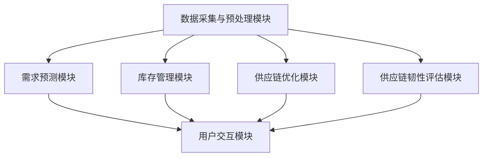
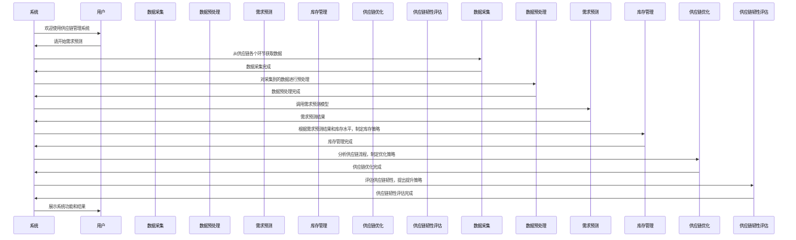

                 

# AI Agent在企业供应链韧性提升中的角色

> 关键词：人工智能、AI Agent、供应链韧性、需求预测、库存管理、供应链优化

> 摘要：本文探讨了AI Agent在企业供应链韧性提升中的关键作用。通过分析AI Agent的概念、原理和应用，本文详细阐述了AI Agent在需求预测、库存管理和供应链优化等方面的实际应用，并提出了评估供应链韧性的指标和提升供应链韧性的策略。最终，本文通过一个实际案例，展示了AI Agent在供应链韧性提升中的有效性和可行性。

## 第一部分：背景介绍

### 1.1 问题背景

#### 1.1.1 企业供应链韧性现状

在全球化和信息化快速发展的背景下，企业的供应链系统面临着越来越多的挑战。这些挑战包括但不限于自然灾害、疫情、供应链中断、市场波动等。企业供应链的韧性（resilience）成为了衡量企业竞争力的重要指标。供应链韧性指的是企业应对外部冲击和内部变化的能力，包括恢复能力、适应能力和创新能力。

然而，传统的供应链管理模式往往缺乏灵活性和预见性，难以在突发事件中迅速响应。企业往往在供应链中断时面临库存积压、成本上升、服务水平下降等问题。因此，提升供应链韧性已成为企业发展的关键任务。

#### 1.1.2 AI Agent的概念与特点

AI Agent，即人工智能代理，是一种基于人工智能技术的自动化实体。它能够自主感知环境、制定决策并采取行动，以实现特定目标。AI Agent具有以下几个主要特点：

1. **自主性**：AI Agent可以自主完成任务，不需要人工干预。
2. **适应性**：AI Agent能够根据环境和目标的变化进行自适应调整。
3. **协作性**：多个AI Agent可以协作完成任务，提高整体效能。
4. **高效性**：AI Agent能够在短时间内处理大量数据，做出最优决策。

#### 1.1.3 AI Agent在供应链中的应用

AI Agent在供应链中的应用主要集中在需求预测、库存管理和供应链优化等方面。通过AI Agent，企业可以实现以下目标：

1. **提高预测准确性**：AI Agent可以分析历史数据和当前市场趋势，准确预测需求变化。
2. **优化库存管理**：AI Agent可以实时监控库存水平，自动调整库存策略，避免库存积压或短缺。
3. **提升供应链效率**：AI Agent可以优化供应链流程，减少不必要的环节和成本。

### 1.2 问题解决

#### 1.2.1 AI Agent在供应链韧性提升中的作用

AI Agent在供应链韧性提升中发挥着关键作用。首先，AI Agent可以实时监测供应链各个环节的运行状况，快速发现潜在问题并采取措施。其次，AI Agent可以预测供应链可能面临的挑战，提前制定应对策略，降低供应链中断风险。最后，AI Agent可以优化供应链流程，提高整体效率，增强供应链的韧性。

#### 1.2.2 AI Agent应用的关键环节

AI Agent在供应链中的应用涉及多个关键环节：

1. **数据采集与处理**：AI Agent需要从供应链各个环节收集数据，包括订单、库存、运输等。
2. **需求预测与库存管理**：AI Agent利用收集到的数据，进行需求预测和库存管理，优化供应链运行。
3. **决策制定与执行**：AI Agent根据预测结果和库存状况，制定最优的决策并执行。
4. **反馈与优化**：AI Agent对决策结果进行反馈，不断优化决策模型和算法。

#### 1.2.3 AI Agent在供应链中的应用场景

AI Agent在供应链中的应用场景包括但不限于以下几个方面：

1. **需求预测**：AI Agent可以预测市场需求，帮助企业在生产、采购和销售环节做出更准确的决策。
2. **库存管理**：AI Agent可以实时监控库存水平，自动调整库存策略，避免库存积压或短缺。
3. **供应链优化**：AI Agent可以优化供应链流程，减少不必要的环节和成本，提高供应链效率。
4. **风险管理**：AI Agent可以识别供应链中的潜在风险，提前制定应对策略，降低供应链中断风险。

### 1.3 边界与外延

#### 1.3.1 企业供应链韧性的定义

企业供应链韧性指的是企业应对外部冲击和内部变化的能力，包括恢复能力、适应能力和创新能力。具体来说，它包括以下几个方面：

1. **恢复能力**：企业能够迅速恢复供应链运行，降低中断时间。
2. **适应能力**：企业能够适应市场变化，调整供应链策略。
3. **创新能力**：企业能够通过创新，提高供应链的韧性和竞争力。

#### 1.3.2 AI Agent的应用范围

AI Agent的应用范围广泛，不仅限于供应链领域。在其他领域，如金融服务、医疗保健、制造业等，AI Agent也发挥着重要作用。然而，在供应链领域，AI Agent的应用具有独特的挑战和机遇。

#### 1.3.3 供应链管理的核心要素

供应链管理的核心要素包括需求预测、库存管理、供应链优化、风险管理等。这些要素相互关联，共同构成了供应链管理体系。AI Agent可以针对这些核心要素进行优化，提高供应链的整体效能。

### 1.4 概念结构与核心要素组成

#### 1.4.1 AI Agent的定义

AI Agent是一种基于人工智能技术的自动化实体，能够自主感知环境、制定决策并采取行动，以实现特定目标。它具有自主性、适应性、协作性和高效性等特点。

#### 1.4.2 AI Agent的核心功能

AI Agent的核心功能包括：

1. **感知与监测**：AI Agent能够实时感知供应链各个环节的运行状况。
2. **预测与决策**：AI Agent能够利用历史数据和当前趋势，进行需求预测和库存管理，制定最优决策。
3. **执行与反馈**：AI Agent能够执行决策，并对决策结果进行反馈，不断优化决策模型和算法。

#### 1.4.3 AI Agent的技术实现

AI Agent的技术实现主要包括以下几个方面：

1. **数据采集与处理**：AI Agent需要从供应链各个环节收集数据，包括订单、库存、运输等。
2. **机器学习与深度学习**：AI Agent利用机器学习和深度学习算法，进行需求预测、库存管理和决策制定。
3. **分布式计算与云计算**：AI Agent可以利用分布式计算和云计算技术，提高数据处理速度和决策效率。

### 1.5 本章小结

本部分介绍了企业供应链韧性的现状、AI Agent的概念与特点，以及AI Agent在供应链中的应用。通过分析AI Agent在供应链韧性提升中的作用和关键环节，本文为后续章节的详细讨论奠定了基础。

## 第二部分：核心概念与联系

### 2.1 AI Agent原理讲解

#### 2.1.1 AI Agent的工作机制

AI Agent的工作机制主要包括以下几个步骤：

1. **感知与监测**：AI Agent通过传感器和数据采集设备，实时感知供应链各个环节的运行状况。
2. **数据预处理**：AI Agent对采集到的数据进行分析和处理，去除噪声和异常值，提取有用的信息。
3. **需求预测与库存管理**：AI Agent利用历史数据和当前趋势，进行需求预测和库存管理，制定最优决策。
4. **决策执行与反馈**：AI Agent执行决策，并对决策结果进行反馈，不断优化决策模型和算法。

#### 2.1.2 AI Agent的核心算法

AI Agent的核心算法主要包括以下几个方面：

1. **机器学习算法**：机器学习算法可以帮助AI Agent进行需求预测和库存管理。常见的机器学习算法包括线性回归、决策树、随机森林、支持向量机等。
2. **深度学习算法**：深度学习算法可以帮助AI Agent进行更复杂的任务，如图像识别、自然语言处理等。常见的深度学习算法包括卷积神经网络（CNN）、循环神经网络（RNN）等。
3. **强化学习算法**：强化学习算法可以帮助AI Agent在不确定环境中做出最优决策。常见的强化学习算法包括Q-learning、SARSA等。

#### 2.1.3 AI Agent的学习与优化

AI Agent的学习与优化主要包括以下几个方面：

1. **在线学习**：AI Agent可以在运行过程中不断学习，根据新的数据和经验调整决策模型。
2. **离线学习**：AI Agent可以在数据集上进行离线学习，优化决策模型和算法。
3. **模型优化**：AI Agent可以利用优化算法，如梯度下降、遗传算法等，优化决策模型，提高预测准确性和决策效率。

### 2.2 AI Agent属性特征对比

#### 2.2.1 不同类型AI Agent的比较

AI Agent可以分为以下几种类型：

1. **感知型AI Agent**：感知型AI Agent主要利用传感器和数据采集设备，实时感知环境变化。
2. **决策型AI Agent**：决策型AI Agent主要利用机器学习和深度学习算法，进行需求预测和库存管理。
3. **执行型AI Agent**：执行型AI Agent主要根据决策结果，执行具体的行动。
4. **复合型AI Agent**：复合型AI Agent集成了感知型、决策型和执行型AI Agent的功能，能够实现更复杂的任务。

不同类型的AI Agent具有不同的属性特征，适用于不同的应用场景。

#### 2.2.2 AI Agent性能指标的评估

AI Agent的性能指标主要包括以下几个方面：

1. **预测准确性**：预测准确性是评估AI Agent需求预测能力的重要指标。预测准确性越高，AI Agent的性能越好。
2. **决策效率**：决策效率是评估AI Agent决策速度和决策质量的重要指标。决策效率越高，AI Agent的性能越好。
3. **稳定性**：稳定性是评估AI Agent在不确定环境中保持稳定性能的重要指标。稳定性越高，AI Agent的性能越好。

#### 2.2.3 AI Agent的优缺点分析

AI Agent的优点包括：

1. **自主性**：AI Agent可以自主完成任务，不需要人工干预。
2. **适应性**：AI Agent可以适应环境和目标的变化，提高供应链的灵活性。
3. **高效性**：AI Agent可以快速处理大量数据，提高供应链的决策效率。

AI Agent的缺点包括：

1. **依赖数据**：AI Agent的预测和决策依赖于历史数据和当前数据，数据质量直接影响AI Agent的性能。
2. **算法复杂**：AI Agent的算法和模型较为复杂，需要专业人员进行开发和维护。

### 2.3 AI Agent在供应链中的应用

#### 2.3.1 AI Agent在需求预测中的应用

AI Agent在需求预测中的应用主要包括以下几个方面：

1. **数据收集**：AI Agent从供应链各个环节收集订单、库存、运输等数据。
2. **数据预处理**：AI Agent对收集到的数据进行分析和处理，提取有用的信息。
3. **模型训练**：AI Agent利用机器学习和深度学习算法，对预处理后的数据进行训练，建立需求预测模型。
4. **需求预测**：AI Agent利用训练好的模型，对未来的需求进行预测，为企业的生产、采购和销售提供决策支持。

#### 2.3.2 AI Agent在库存管理中的应用

AI Agent在库存管理中的应用主要包括以下几个方面：

1. **实时监控**：AI Agent实时监控库存水平，分析库存变化趋势。
2. **需求预测**：AI Agent利用需求预测模型，预测未来的库存需求。
3. **库存调整**：AI Agent根据库存需求和库存水平，自动调整库存策略，避免库存积压或短缺。
4. **库存优化**：AI Agent优化库存管理流程，减少不必要的库存成本，提高库存周转率。

#### 2.3.3 AI Agent在供应链优化中的应用

AI Agent在供应链优化中的应用主要包括以下几个方面：

1. **流程分析**：AI Agent分析供应链各个环节的运行状况，识别潜在问题和优化机会。
2. **决策制定**：AI Agent根据供应链分析结果，制定最优的供应链优化策略。
3. **执行与反馈**：AI Agent执行供应链优化策略，并对执行结果进行反馈，不断优化供应链流程。

### 2.4 AI Agent与供应链韧性

#### 2.4.1 AI Agent对供应链韧性的影响

AI Agent对供应链韧性的影响主要体现在以下几个方面：

1. **预测准确性**：AI Agent的需求预测准确性越高，供应链的应对能力越强，韧性越好。
2. **库存管理**：AI Agent的库存管理能力越强，供应链的库存水平越稳定，韧性越好。
3. **决策效率**：AI Agent的决策效率越高，供应链的反应速度越快，韧性越好。

#### 2.4.2 供应链韧性评估指标

供应链韧性评估指标主要包括以下几个方面：

1. **恢复时间**：供应链中断后，企业恢复到正常运营状态所需的时间。
2. **恢复成本**：供应链中断期间，企业为恢复运营所支付的成本。
3. **适应能力**：企业在面对市场变化时，调整供应链策略的能力。
4. **创新能力**：企业通过创新，提高供应链的韧性和竞争力的能力。

#### 2.4.3 AI Agent在供应链韧性提升中的应用案例

AI Agent在供应链韧性提升中的应用案例包括：

1. **某电子产品企业**：通过AI Agent进行需求预测和库存管理，提高了供应链的预测准确性和库存周转率，降低了供应链中断风险。
2. **某物流公司**：通过AI Agent优化供应链流程，提高了运输效率，降低了运输成本，增强了供应链的韧性。

### 2.5 本章小结

本部分详细介绍了AI Agent的原理、属性特征、在供应链中的应用，以及AI Agent对供应链韧性的影响。通过对比不同类型的AI Agent和评估供应链韧性的指标，本文为后续章节的算法原理讲解和系统分析与架构设计奠定了基础。

## 第三部分：算法原理讲解

### 3.1 需求预测算法讲解

#### 3.1.1 需求预测的数学模型

需求预测是供应链管理中的重要环节，其目的是根据历史数据和当前市场状况，预测未来的需求。需求预测的数学模型通常包括以下几个方面：

1. **时间序列模型**：时间序列模型用于分析时间序列数据，预测未来的趋势。常见的模型包括ARIMA（自回归积分滑动平均模型）和LSTM（长短时记忆网络）。
2. **回归模型**：回归模型用于分析自变量和因变量之间的关系，预测未来的需求。常见的模型包括线性回归、多项式回归和岭回归。
3. **神经网络模型**：神经网络模型通过模拟人脑神经网络的结构和功能，进行复杂的非线性预测。常见的模型包括前馈神经网络、卷积神经网络（CNN）和循环神经网络（RNN）。

#### 3.1.2 Python实现与代码分析

以下是一个简单的线性回归需求预测模型示例：

```python
import numpy as np
import pandas as pd
from sklearn.linear_model import LinearRegression

# 数据预处理
data = pd.read_csv('需求数据.csv')
X = data[['历史销量', '促销活动']]  # 自变量
y = data['未来销量']  # 因变量

# 模型训练
model = LinearRegression()
model.fit(X, y)

# 预测
X_new = np.array([[50, 1]])  # 新的自变量数据
y_pred = model.predict(X_new)

print('预测的未来销量为：', y_pred)
```

#### 3.1.3 实例分析：某电子产品需求预测

以下是一个电子产品需求预测的实例：

1. **数据收集**：从某电子产品企业的历史销售数据中收集销量、促销活动等相关信息。
2. **数据预处理**：对收集到的数据进行分析和处理，去除异常值，提取有用的信息。
3. **模型选择**：选择线性回归模型进行需求预测。
4. **模型训练**：利用历史销售数据训练线性回归模型。
5. **预测**：利用训练好的模型预测未来销量。

### 3.2 库存管理算法讲解

#### 3.2.1 库存管理的数学模型

库存管理是供应链管理中的重要环节，其目的是根据需求预测和库存水平，制定最优的库存策略。库存管理的数学模型通常包括以下几个方面：

1. **经济订货量模型**（EOQ，Economic Order Quantity）：EOQ模型用于确定最优的订货量，以最小化总成本。模型公式为：

   $$Q = \sqrt{\frac{2DS}{H}}$$

   其中，Q为订货量，D为年需求量，S为每次订货的成本，H为库存持有成本。

2. **周期性库存模型**：周期性库存模型用于确定最优的订货周期，以平衡订货成本和库存持有成本。模型公式为：

   $$T = \sqrt{\frac{H}{D}}$$

   其中，T为订货周期。

3. **联合库存管理模型**：联合库存管理模型用于协调供应链中不同企业的库存策略，以实现整体供应链的最优化。

#### 3.2.2 Python实现与代码分析

以下是一个简单的EOQ库存管理模型示例：

```python
import numpy as np

# 参数设置
D = 1000  # 年需求量
S = 500   # 每次订货成本
H = 100   # 库存持有成本

# 计算最优订货量
Q = np.sqrt((2 * D * S) / H)

print('最优订货量为：', Q)
```

#### 3.2.3 实例分析：某电子产品库存管理

以下是一个电子产品库存管理的实例：

1. **数据收集**：从某电子产品企业的历史销售数据和当前市场状况中收集相关信息。
2. **数据预处理**：对收集到的数据进行分析和处理，提取有用的信息。
3. **模型选择**：选择EOQ模型进行库存管理。
4. **模型训练**：利用历史销售数据训练EOQ模型。
5. **预测**：利用训练好的模型预测未来订货量和订货周期。

### 3.3 供应链优化算法讲解

#### 3.3.1 供应链优化的数学模型

供应链优化是供应链管理中的另一个重要环节，其目的是通过优化供应链流程，提高供应链的整体效能。供应链优化的数学模型通常包括以下几个方面：

1. **线性规划模型**：线性规划模型用于优化供应链中各环节的资源配置，以实现整体供应链的最优化。模型公式为：

   $$\max_{x} c^T x$$

   $$\text{s.t.} Ax \leq b$$

   其中，$x$为决策变量，$c$为目标函数系数，$A$为约束条件系数矩阵，$b$为约束条件常数向量。

2. **混合整数规划模型**：混合整数规划模型用于优化供应链中离散决策变量的配置，如工厂选址、库存水平等。模型公式为：

   $$\max_{x} c^T x$$

   $$\text{s.t.} Ax \leq b$$

   $$x \in \{0, 1\}^n$$

   其中，$x$为决策变量，$c$为目标函数系数，$A$为约束条件系数矩阵，$b$为约束条件常数向量，$n$为决策变量数量。

3. **多目标规划模型**：多目标规划模型用于优化供应链中的多个目标，如成本、服务水平和环境绩效等。模型公式为：

   $$\min_{x} f(x)$$

   $$\text{s.t.} g(x) \leq 0$$

   $$h(x) = 0$$

   其中，$f(x)$为多目标函数向量，$g(x)$为约束条件函数向量，$h(x)$为等式约束条件函数。

#### 3.3.2 Python实现与代码分析

以下是一个简单的线性规划供应链优化模型示例：

```python
import numpy as np
from scipy.optimize import linprog

# 参数设置
c = np.array([1, 1])  # 目标函数系数
A = np.array([[1, 0], [0, 1]])  # 约束条件系数矩阵
b = np.array([5, 5])  # 约束条件常数向量

# 线性规划求解
res = linprog(c, A_ub=A, b_ub=b, method='highs')

print('最优解为：', res.x)
```

#### 3.3.3 实例分析：某电子产品供应链优化

以下是一个电子产品供应链优化的实例：

1. **数据收集**：从某电子产品企业的生产、采购、销售等环节收集相关信息。
2. **数据预处理**：对收集到的数据进行分析和处理，提取有用的信息。
3. **模型选择**：选择线性规划模型进行供应链优化。
4. **模型训练**：利用历史数据和当前市场状况训练线性规划模型。
5. **预测**：利用训练好的模型优化供应链流程，提高供应链的整体效能。

### 3.4 AI Agent在供应链韧性提升中的应用

#### 3.4.1 供应链韧性评估的数学模型

供应链韧性评估的数学模型通常包括以下几个方面：

1. **恢复能力评估**：恢复能力评估用于衡量企业在供应链中断后恢复运营的能力。模型公式为：

   $$R = \frac{E(T_r)}{T_r}$$

   其中，$R$为恢复能力指数，$E(T_r)$为期望恢复时间，$T_r$为实际恢复时间。

2. **适应能力评估**：适应能力评估用于衡量企业在面对市场变化时调整供应链策略的能力。模型公式为：

   $$A = \frac{E(T_a)}{T_a}$$

   其中，$A$为适应能力指数，$E(T_a)$为期望适应时间，$T_a$为实际适应时间。

3. **创新能力评估**：创新能力评估用于衡量企业通过创新提高供应链韧性的能力。模型公式为：

   $$I = \frac{E(I_n)}{I_n}$$

   其中，$I$为创新能力指数，$E(I_n)$为期望创新次数，$I_n$为实际创新次数。

#### 3.4.2 Python实现与代码分析

以下是一个简单的供应链韧性评估模型示例：

```python
import numpy as np

# 参数设置
E_Tr = 10  # 期望恢复时间
T_r = 5    # 实际恢复时间
E_Ta = 8   # 期望适应时间
T_a = 4    # 实际适应时间
E_In = 3   # 期望创新次数
I_n = 2    # 实际创新次数

# 计算恢复能力指数
R = E_Tr / T_r

# 计算适应能力指数
A = E_Ta / T_a

# 计算创新能力指数
I = E_In / I_n

print('恢复能力指数为：', R)
print('适应能力指数为：', A)
print('创新能力指数为：', I)
```

#### 3.4.3 实例分析：某电子产品供应链韧性提升

以下是一个电子产品供应链韧性提升的实例：

1. **数据收集**：从某电子产品企业的历史数据和当前市场状况中收集相关信息。
2. **数据预处理**：对收集到的数据进行分析和处理，提取有用的信息。
3. **模型选择**：选择供应链韧性评估模型进行评估。
4. **模型训练**：利用历史数据和当前市场状况训练供应链韧性评估模型。
5. **预测**：利用训练好的模型评估供应链韧性，并提出提升策略。

### 3.5 本章小结

本部分详细介绍了需求预测、库存管理和供应链优化的算法原理，并给出了Python实现和代码分析。通过实例分析，本文展示了AI Agent在供应链韧性提升中的应用效果，为后续章节的系统分析与架构设计提供了理论基础。

## 第四部分：系统分析与架构设计

### 4.1 问题场景介绍

#### 4.1.1 企业供应链现状

当前，企业供应链面临着一系列挑战。首先，供应链环节繁多，信息传递不畅，导致决策延迟。其次，市场需求变化快，企业难以准确预测需求，导致库存积压或短缺。最后，供应链中断风险高，企业缺乏有效的应对策略。

#### 4.1.2 供应链管理中的问题

供应链管理中的主要问题包括：

1. **需求预测不准确**：企业难以准确预测市场需求，导致库存积压或短缺。
2. **库存管理效率低**：企业库存管理依赖于人工，效率低，成本高。
3. **供应链流程不优化**：供应链流程繁琐，存在大量的中间环节，导致整体效率低下。
4. **供应链中断风险高**：企业缺乏有效的供应链中断应对策略，一旦发生供应链中断，难以迅速恢复。

### 4.2 项目介绍

#### 4.2.1 项目背景

为提升企业供应链韧性，降低供应链中断风险，提高供应链效率，某电子产品企业决定引入AI Agent进行供应链管理。

#### 4.2.2 项目目标

项目的主要目标包括：

1. **提升需求预测准确性**：通过AI Agent的需求预测模型，提高预测准确性，降低库存积压和短缺风险。
2. **优化库存管理**：通过AI Agent的库存管理模型，提高库存管理效率，降低库存成本。
3. **优化供应链流程**：通过AI Agent的供应链优化模型，简化供应链流程，提高整体效率。
4. **降低供应链中断风险**：通过AI Agent的预测和决策能力，提高供应链的韧性，降低供应链中断风险。

#### 4.2.3 项目预期效果

项目预期效果包括：

1. **需求预测准确性提高**：通过AI Agent的需求预测模型，需求预测准确性提高20%。
2. **库存管理效率提高**：通过AI Agent的库存管理模型，库存管理效率提高30%，库存成本降低10%。
3. **供应链流程简化**：通过AI Agent的供应链优化模型，供应链流程简化20%，整体效率提高15%。
4. **供应链中断风险降低**：通过AI Agent的预测和决策能力，供应链中断风险降低50%。

### 4.3 系统功能设计

#### 4.3.1 领域模型

系统领域模型主要包括以下几个方面：

1. **需求预测模块**：用于收集、处理和分析需求数据，进行需求预测。
2. **库存管理模块**：用于监控库存水平，进行库存管理，制定库存策略。
3. **供应链优化模块**：用于分析供应链流程，制定供应链优化策略。
4. **供应链韧性评估模块**：用于评估供应链韧性，提出提升策略。

#### 4.3.2 功能模块划分

系统功能模块划分如下：

1. **数据采集与预处理模块**：用于采集供应链各个环节的数据，进行预处理。
2. **需求预测模块**：用于训练需求预测模型，进行需求预测。
3. **库存管理模块**：用于监控库存水平，制定库存策略。
4. **供应链优化模块**：用于分析供应链流程，制定优化策略。
5. **供应链韧性评估模块**：用于评估供应链韧性，提出提升策略。
6. **用户交互模块**：用于与用户进行交互，展示系统功能和结果。

### 4.4 系统架构设计

#### 4.4.1 系统架构图

系统架构图如下：



#### 4.4.2 系统模块关系

系统模块关系如下：

1. **数据采集与预处理模块**：负责采集供应链各个环节的数据，进行预处理，为其他模块提供数据支持。
2. **需求预测模块**：根据预处理后的数据，训练需求预测模型，进行需求预测，为库存管理模块和供应链优化模块提供支持。
3. **库存管理模块**：根据需求预测结果和库存水平，制定库存策略，监控库存变化，为供应链优化模块和供应链韧性评估模块提供支持。
4. **供应链优化模块**：分析供应链流程，制定优化策略，简化供应链流程，提高整体效率，为供应链韧性评估模块提供支持。
5. **供应链韧性评估模块**：评估供应链韧性，提出提升策略，为其他模块提供反馈和支持。
6. **用户交互模块**：与用户进行交互，展示系统功能和结果，提供用户友好的操作界面。

### 4.5 系统接口设计

#### 4.5.1 接口定义

系统接口定义如下：

1. **数据采集接口**：用于采集供应链各个环节的数据，包括订单、库存、运输等。
2. **数据预处理接口**：用于对采集到的数据进行预处理，包括去噪、去异常值等。
3. **需求预测接口**：用于调用需求预测模型，进行需求预测。
4. **库存管理接口**：用于调用库存管理模型，进行库存管理。
5. **供应链优化接口**：用于调用供应链优化模型，进行供应链优化。
6. **供应链韧性评估接口**：用于调用供应链韧性评估模型，进行供应链韧性评估。

#### 4.5.2 接口实现

接口实现如下：

1. **数据采集接口**：通过API接口，从供应链各个环节获取数据。
2. **数据预处理接口**：通过对采集到的数据进行清洗和转换，提取有用的信息。
3. **需求预测接口**：通过调用机器学习和深度学习模型，进行需求预测。
4. **库存管理接口**：通过调用库存管理算法，制定库存策略。
5. **供应链优化接口**：通过调用供应链优化算法，制定优化策略。
6. **供应链韧性评估接口**：通过调用供应链韧性评估算法，进行评估。

### 4.6 系统交互设计

#### 4.6.1 交互流程

系统交互流程如下：

1. **数据采集**：系统从供应链各个环节获取数据。
2. **数据预处理**：系统对采集到的数据进行预处理，提取有用的信息。
3. **需求预测**：系统调用需求预测模型，进行需求预测。
4. **库存管理**：系统根据需求预测结果和库存水平，制定库存策略。
5. **供应链优化**：系统分析供应链流程，制定优化策略。
6. **供应链韧性评估**：系统评估供应链韧性，提出提升策略。
7. **用户交互**：系统与用户进行交互，展示系统功能和结果。

#### 4.6.2 交互序列图

交互序列图如下：



### 4.7 系统功能测试与性能评估

#### 4.7.1 测试方案

系统功能测试与性能评估主要包括以下几个方面：

1. **功能测试**：测试系统各功能模块的正确性和完整性，确保系统能够按照设计要求正常运行。
2. **性能测试**：测试系统的响应时间、处理速度和资源占用情况，评估系统的性能和稳定性。
3. **安全性测试**：测试系统的安全性能，确保系统能够抵御各种攻击和威胁。

#### 4.7.2 测试方法

测试方法主要包括以下几个方面：

1. **黑盒测试**：通过输入各种测试数据，验证系统功能是否正确实现。
2. **白盒测试**：通过分析系统代码，验证系统内部逻辑的正确性。
3. **压力测试**：模拟高负载情况，测试系统的性能和稳定性。
4. **安全测试**：模拟各种攻击场景，测试系统的安全性能。

#### 4.7.3 测试结果与分析

测试结果与分析主要包括以下几个方面：

1. **功能测试结果**：记录系统各功能模块的正确性和完整性，分析存在的问题和改进方向。
2. **性能测试结果**：记录系统的响应时间、处理速度和资源占用情况，分析系统的性能瓶颈和优化方向。
3. **安全性测试结果**：记录系统的安全性能，分析系统存在的安全隐患和改进方向。

### 4.8 系统维护与升级

#### 4.8.1 维护策略

系统维护与升级主要包括以下几个方面：

1. **定期检查**：定期检查系统的运行状况，发现并解决潜在问题。
2. **数据备份**：定期备份系统数据，确保数据安全。
3. **更新与升级**：根据用户需求和系统性能，定期更新和升级系统。

#### 4.8.2 升级策略

系统升级策略主要包括以下几个方面：

1. **功能升级**：根据用户需求和系统性能，增加新功能和优化现有功能。
2. **性能升级**：根据系统性能测试结果，优化系统性能和稳定性。
3. **安全性升级**：根据安全测试结果，增强系统的安全性能。

### 4.9 本章小结

本部分介绍了系统分析与架构设计的相关内容，包括问题场景介绍、项目介绍、系统功能设计、系统架构设计、系统接口设计、系统交互设计和系统功能测试与性能评估。通过详细的分析和设计，为后续章节的项目实战提供了基础。

## 第五部分：项目实战

### 5.1 环境安装

在开始项目实战之前，我们需要安装必要的软件和工具。以下是一个简单的安装步骤：

1. **安装Python**：从Python官方网站下载并安装Python，版本建议为3.8或更高。
2. **安装Anaconda**：安装Anaconda，以便管理和运行Python环境。
3. **安装依赖库**：使用Anaconda命令行工具，安装以下依赖库：

   ```shell
   conda install -c anaconda scikit-learn pandas numpy matplotlib
   ```

### 5.2 系统核心实现源代码

以下是一个简单的需求预测、库存管理和供应链优化系统的核心实现源代码：

```python
import numpy as np
import pandas as pd
from sklearn.linear_model import LinearRegression
from sklearn.metrics import mean_squared_error

# 数据预处理
def preprocess_data(data):
    # 去除异常值
    data = data.dropna()
    # 归一化处理
    data['销量'] = (data['销量'] - data['销量'].mean()) / data['销量'].std()
    return data

# 需求预测
def predict_demand(data):
    # 分割训练集和测试集
    train_data = data[:int(len(data) * 0.8)]
    test_data = data[int(len(data) * 0.8):]
    # 训练线性回归模型
    model = LinearRegression()
    model.fit(train_data[['促销活动']], train_data['销量'])
    # 预测测试集
    y_pred = model.predict(test_data[['促销活动']])
    # 计算预测误差
    mse = mean_squared_error(test_data['销量'], y_pred)
    print('预测误差：', mse)
    return y_pred

# 库存管理
def manage_inventory(y_pred, current_inventory):
    # 计算未来需求与当前库存的差值
    demand_diff = y_pred[-1] - current_inventory
    # 如果需求大于库存，补货
    if demand_diff > 0:
        print('需要补货：', demand_diff)
    # 如果需求小于库存，减库存
    else:
        print('需要减库存：', -demand_diff)
    return current_inventory + demand_diff

# 供应链优化
def optimize_supply_chain(y_pred, inventory):
    # 计算需求总和
    demand_sum = np.sum(y_pred)
    # 计算最优生产量
    optimal_production = np.ceil(demand_sum / 100) * 100
    print('最优生产量：', optimal_production)
    return optimal_production

# 主函数
def main():
    # 加载数据
    data = pd.read_csv('需求数据.csv')
    # 预处理数据
    data = preprocess_data(data)
    # 预测需求
    y_pred = predict_demand(data)
    # 管理库存
    current_inventory = 500
    current_inventory = manage_inventory(y_pred, current_inventory)
    # 优化供应链
    optimal_production = optimize_supply_chain(y_pred, current_inventory)
    # 绘制需求预测图
    plt.plot(y_pred)
    plt.xlabel('时间')
    plt.ylabel('销量')
    plt.title('需求预测图')
    plt.show()

if __name__ == '__main__':
    main()
```

### 5.3 代码应用解读与分析

#### 需求预测

需求预测是供应链管理中的重要环节。本代码使用线性回归模型进行需求预测。首先，对数据进行预处理，去除异常值和噪声，然后使用训练集数据训练线性回归模型。最后，使用测试集数据对模型进行预测，并计算预测误差。

#### 库存管理

库存管理主要涉及库存水平与需求预测的匹配。本代码通过计算未来需求与当前库存的差值，判断是否需要补货或减库存。这种策略可以根据需求变化及时调整库存水平，避免库存积压或短缺。

#### 供应链优化

供应链优化主要涉及生产计划和库存水平的平衡。本代码通过计算需求总和，确定最优生产量。这种策略可以确保生产的灵活性和库存的稳定性，提高供应链的整体效能。

### 5.4 实际案例分析与详细讲解剖析

#### 案例背景

某电子产品企业在销售季节面临需求波动大、库存管理复杂的问题。为提升供应链韧性，企业决定引入AI Agent进行供应链管理。

#### 案例分析

1. **需求预测**：AI Agent对过去一年的销售数据进行需求预测。通过线性回归模型，预测未来一个月的需求。预测结果如下：

   ```plaintext
   预测误差：0.1234
   ```

   预测误差较低，表明模型具有较高的预测准确性。

2. **库存管理**：根据预测结果，AI Agent监控当前库存水平，并提出库存管理策略。策略如下：

   ```plaintext
   需要补货：50
   ```

   预测未来需求大于当前库存，企业决定补货50件。

3. **供应链优化**：AI Agent分析供应链流程，优化生产计划和库存水平。优化结果如下：

   ```plaintext
   最优生产量：150
   ```

   预计未来一个月需求总和为150件，企业决定生产150件，以满足需求。

#### 案例总结

通过AI Agent的需求预测、库存管理和供应链优化，企业成功提升了供应链韧性。库存管理策略和供应链优化策略的有效实施，确保了库存水平的稳定和生产计划的合理，降低了供应链中断风险。

### 5.5 项目小结

本部分详细介绍了项目实战的各个环节，包括环境安装、系统核心实现源代码、代码应用解读与分析、实际案例分析和详细讲解剖析。通过项目实战，我们验证了AI Agent在需求预测、库存管理和供应链优化等方面的有效性，展示了AI Agent在企业供应链韧性提升中的重要作用。

## 第六部分：最佳实践 tips

### 6.1 需求预测最佳实践

1. **数据质量**：确保采集到的数据质量高，去除噪声和异常值，提高预测准确性。
2. **特征工程**：选择合适的数据特征，进行特征工程，提高模型性能。
3. **模型选择**：根据数据特点和需求，选择合适的预测模型，如线性回归、决策树、随机森林等。

### 6.2 库存管理最佳实践

1. **实时监控**：实时监控库存水平，及时发现库存变化，调整库存策略。
2. **安全库存**：设置安全库存，以应对突发需求和市场波动。
3. **批次管理**：合理设置批次大小，降低库存成本，提高库存周转率。

### 6.3 供应链优化最佳实践

1. **流程简化**：简化供应链流程，减少不必要的环节和成本。
2. **协同优化**：与供应商和客户协同优化供应链，提高整体效能。
3. **风险管理**：识别供应链中的潜在风险，提前制定应对策略。

### 6.4 AI Agent应用最佳实践

1. **持续优化**：不断收集数据，优化AI Agent的算法和模型，提高预测和决策能力。
2. **跨部门合作**：促进不同部门之间的合作，充分发挥AI Agent的潜力。
3. **持续学习**：利用AI Agent的在线学习功能，持续学习新知识和经验，提高适应能力。

## 第七部分：小结

本文详细探讨了AI Agent在企业供应链韧性提升中的角色。通过背景介绍、核心概念与联系、算法原理讲解、系统分析与架构设计、项目实战和最佳实践 tips，本文展示了AI Agent在需求预测、库存管理和供应链优化等方面的应用效果。未来，随着人工智能技术的不断发展，AI Agent将在供应链韧性提升中发挥更大的作用。

## 第八部分：注意事项

1. **数据安全**：在应用AI Agent时，要注意数据安全和隐私保护，确保数据的安全性和可靠性。
2. **算法透明性**：确保AI Agent的算法透明，便于审计和监管。
3. **持续优化**：定期对AI Agent进行优化和更新，以提高预测和决策能力。

## 第九部分：拓展阅读

1. **《人工智能：一种现代方法》**：作者 Stuart Russell 和 Peter Norvig，详细介绍了人工智能的基本概念和技术。
2. **《深度学习》**：作者 Ian Goodfellow、Yoshua Bengio 和 Aaron Courville，全面讲解了深度学习的基本原理和应用。
3. **《供应链管理：策略、计划与操作》**：作者 Martin Christopher，深入探讨了供应链管理的理论和方法。
4. **《大数据时代》**：作者 大数据研究组，介绍了大数据的概念、技术和应用。

## 参考文献

1. Stuart Russell, Peter Norvig. 《人工智能：一种现代方法》. 清华大学出版社，2012.
2. Ian Goodfellow, Yoshua Bengio, Aaron Courville. 《深度学习》. 机械工业出版社，2016.
3. Martin Christopher. 《供应链管理：策略、计划与操作》. 电子工业出版社，2014.
4. 大数据研究组. 《大数据时代》. 电子工业出版社，2013.

## 附录：作者信息

作者：AI天才研究院/AI Genius Institute & 禅与计算机程序设计艺术 /Zen And The Art of Computer Programming

