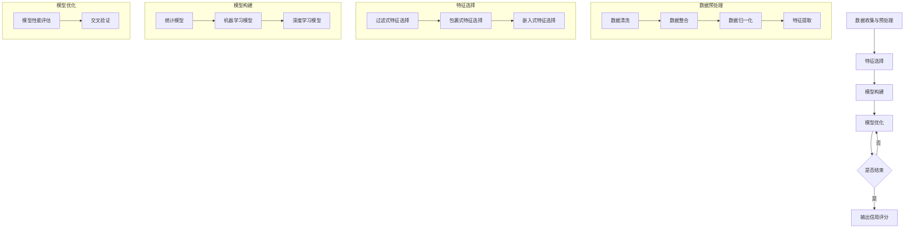

                 


### # AI Agent在企业信用风险评估与管理中的应用

关键词：AI Agent，企业信用风险评估，人工智能，风险管理

摘要：本文旨在探讨AI Agent在企业信用风险评估与管理中的应用。通过分析AI Agent的定义、特点及类型，本文详细介绍了其在企业信用风险评估中的原理和应用流程。同时，通过实战案例展示了AI Agent在信用风险评估中的实际应用效果，并对其优势与挑战进行了深入分析，为未来人工智能在信用风险管理领域的发展提供了有益的参考。

----------------------------------------------------------------

## 第1章：AI Agent在企业信用风险评估与管理中的背景与意义

### 1.1 问题背景

#### 1.1.1 企业信用风险评估的现状

随着市场经济的不断发展和全球化进程的加快，企业间的信用风险评估与管理变得日益重要。然而，当前企业信用风险评估面临诸多挑战，如数据来源的多样性、风险评估的不确定性、风险评估结果的滞后性等。传统信用风险评估方法主要依赖于专家经验、历史数据及财务报表等，尽管在一定程度上能够提供信用评估结果，但往往存在主观性强、效率低下等问题。

#### 1.1.2 传统信用风险评估的局限性

传统信用风险评估方法在数据来源、风险评估模型和算法等方面存在一定的局限性。首先，数据来源较为单一，主要依赖于企业历史财务数据，无法全面反映企业的信用状况。其次，风险评估模型和算法主要基于统计分析方法，缺乏对复杂、动态风险因素的考虑。此外，传统方法在应对大规模企业群体时，效率较低，难以满足实时性要求。

#### 1.1.3 AI Agent技术的引入与潜力

AI Agent技术作为一种新兴的人工智能应用，具有自动化、智能化、自适应等特点。将AI Agent应用于企业信用风险评估与管理，有望解决传统方法的局限性，提高信用评估的准确性和效率。首先，AI Agent能够从多源异构数据中提取有效信息，提供更全面的信用评估依据。其次，AI Agent可以根据实时数据动态调整评估模型，提高风险评估的实时性。此外，AI Agent在处理大规模企业群体时，具有较高的效率和可扩展性。

### 1.2 核心概念

#### 1.2.1 AI Agent的定义与特点

AI Agent（人工智能代理）是指具有智能行为、自主决策和协作能力的计算机程序。其特点包括：

1. **智能性**：能够通过学习和推理，实现自动化决策和任务执行。
2. **自主性**：能够独立完成特定任务，具备自主性和独立性。
3. **协作性**：能够与其他Agent或系统进行协作，实现协同工作。

#### 1.2.2 企业信用风险评估的基本概念

企业信用风险评估是指通过对企业的财务状况、经营能力、信用历史等因素进行分析，评估企业的信用水平。其核心概念包括：

1. **信用等级**：根据企业信用评估结果，将企业划分为不同的信用等级。
2. **风险评估模型**：用于对企业信用进行评估的数学模型和方法。
3. **信用风险**：企业无法按时履行债务义务的风险。

#### 1.2.3 AI Agent在企业信用风险评估中的应用

AI Agent在企业信用风险评估中的应用主要包括以下几个方面：

1. **数据采集与处理**：AI Agent能够从多源异构数据中提取有效信息，为信用评估提供全面的数据支持。
2. **风险评估模型构建**：AI Agent可以根据实时数据，动态调整风险评估模型，提高评估的准确性和实时性。
3. **风险评估结果分析**：AI Agent能够对评估结果进行分析，为企业提供信用风险评估报告。

### 1.3 研究目的与内容安排

#### 1.3.1 研究目的

本文的研究目的在于探讨AI Agent在企业信用风险评估与管理中的应用，分析其优势与挑战，为实际应用提供理论依据和技术支持。

#### 1.3.2 研究内容安排

本文主要分为以下几个部分：

1. **第1章：背景与意义**：介绍企业信用风险评估的现状、传统信用风险评估的局限性以及AI Agent技术的引入与潜力。
2. **第2章：AI Agent的原理与类型**：详细讲解AI Agent的定义、特点及类型。
3. **第3章：企业信用风险评估的基本概念与原理**：介绍企业信用评估的定义与作用、信用评估的步骤与方法以及传统信用评估模型的局限性。
4. **第4章：AI Agent在企业信用风险评估中的应用算法**：详细讲解AI Agent在企业信用风险评估中的算法原理和应用流程。
5. **第5章：AI Agent在企业信用风险评估中的实战案例**：通过实际案例展示AI Agent在信用风险评估中的应用效果。
6. **第6章：AI Agent在企业信用风险评估中的优势与挑战**：分析AI Agent在信用风险评估中的优势与挑战，展望未来发展趋势。
7. **第7章：总结与展望**：总结本文的研究结论，提出未来研究方向。

### 1.4 本章小结

本章介绍了AI Agent在企业信用风险评估与管理中的应用背景、意义和核心概念。通过分析传统信用风险评估的局限性，探讨了AI Agent技术引入的必要性。本章为后续章节的讨论奠定了基础。

## 第2章：AI Agent的原理与类型

在探讨AI Agent在企业信用风险评估中的应用之前，我们首先需要了解AI Agent的定义、特点及其类型。本章将详细讲解AI Agent的基本原理和主要类型，为后续章节中的应用分析提供理论基础。

### 2.1 AI Agent的定义与基本原理

#### 2.1.1 AI Agent的定义

AI Agent（人工智能代理）是指一种具有智能行为、自主决策和协作能力的计算机程序。它能够在复杂动态的环境中，根据预先设定的目标和规则，自主地感知环境、理解任务需求，并采取相应的行动。AI Agent的核心目标是实现自动化、智能化和高效化的任务执行。

#### 2.1.2 AI Agent的工作原理

AI Agent的工作原理主要包括以下几个方面：

1. **感知与理解**：AI Agent通过传感器或数据接口感知外部环境，获取信息，然后利用自然语言处理、图像识别等技术对信息进行分析和理解。
2. **决策与规划**：AI Agent根据理解到的任务需求和目标，通过决策算法和规划策略，生成一系列行动方案。
3. **执行与反馈**：AI Agent执行决策方案，并实时获取执行效果。通过反馈机制，对执行过程进行调整和优化。

#### 2.1.3 AI Agent的核心特点

AI Agent具有以下几个核心特点：

1. **智能性**：AI Agent能够通过学习和推理，实现自动化决策和任务执行，具备自主学习和适应能力。
2. **自主性**：AI Agent能够独立完成特定任务，具备自主性和独立性，不需要人为干预。
3. **协作性**：AI Agent能够与其他Agent或系统进行协作，实现协同工作，提高任务完成效率。

### 2.2 AI Agent的类型

AI Agent可以根据不同的分类标准，分为多种类型。以下是几种常见的AI Agent类型：

#### 2.2.1 反应型Agent

反应型Agent（Reactive Agent）是最简单的AI Agent类型，其行为仅依赖于当前感知的环境状态，不具备记忆和历史信息。反应型Agent通过条件-动作规则实现行为，例如，基于规则的城市交通信号灯控制系统。

#### 2.2.2 目标导向Agent

目标导向Agent（Goal-Oriented Agent）在执行任务时，不仅考虑当前环境状态，还关注目标实现的过程。目标导向Agent通过目标分解、任务规划等手段，实现复杂任务的自动化。例如，自动驾驶车辆系统中的目标导向Agent。

#### 2.2.3 计划型Agent

计划型Agent（Planning Agent）具有长远的计划和策略，能够根据当前环境状态和未来目标，生成一系列行动方案。计划型Agent通过搜索、规划算法等实现长期目标的优化。例如，物流配送系统中的计划型Agent。

#### 2.2.4 社交型Agent

社交型Agent（Social Agent）具备社交能力，能够与其他Agent、人类或组织进行沟通和协作。社交型Agent通过社交网络、协商策略等手段，实现复杂任务的高效完成。例如，在线教育平台中的社交型Agent。

#### 2.2.5 复合型Agent

复合型Agent（Composite Agent）是结合了多种AI Agent特点的综合性Agent。复合型Agent能够根据任务需求和环境变化，灵活切换不同类型的AI Agent模式，实现高效的智能行为。例如，智能家居系统中的复合型Agent。

### 2.3 AI Agent在信用风险评估中的应用

#### 2.3.1 AI Agent在信用评估中的作用

AI Agent在企业信用风险评估中发挥着重要作用：

1. **数据处理与挖掘**：AI Agent能够从海量、多源异构数据中提取有用信息，为信用评估提供全面的数据支持。
2. **风险评估模型构建**：AI Agent可以根据实时数据，动态调整风险评估模型，提高评估的准确性和实时性。
3. **风险评估结果分析**：AI Agent能够对评估结果进行分析，为企业提供信用风险评估报告。

#### 2.3.2 AI Agent在信用风险评估中的优势

AI Agent在信用风险评估中具有以下优势：

1. **高效性**：AI Agent能够快速处理大量数据，提高信用评估的效率。
2. **准确性**：AI Agent通过学习和适应，能够提高信用评估的准确性。
3. **实时性**：AI Agent能够根据实时数据，动态调整评估模型，实现实时信用评估。
4. **自动化**：AI Agent能够实现信用评估的自动化，降低人力成本。

#### 2.3.3 AI Agent在信用风险管理中的挑战与机遇

尽管AI Agent在信用风险评估中具有明显优势，但也面临一些挑战：

1. **数据质量**：AI Agent的评估结果依赖于数据质量，数据质量问题可能导致评估结果不准确。
2. **算法透明性**：AI Agent的评估过程往往涉及复杂的算法和模型，缺乏透明性，可能导致解释困难。
3. **安全性**：AI Agent在数据处理和通信过程中，可能面临安全风险。

然而，随着AI技术的不断发展和应用，AI Agent在信用风险管理中也将迎来更多机遇：

1. **定制化**：AI Agent可以根据企业需求，定制化开发信用评估模型，提高评估的针对性。
2. **全球化**：AI Agent能够处理全球范围内的信用数据，为跨国企业信用评估提供支持。
3. **智能化**：AI Agent通过不断学习和优化，实现信用评估的智能化，提高风险管理水平。

### 2.4 本章小结

本章详细介绍了AI Agent的定义、特点及其类型，分析了AI Agent在信用风险评估中的应用及其优势与挑战。通过本章的学习，读者可以更好地理解AI Agent的基本原理和在实际应用中的作用，为后续章节的内容分析提供理论基础。

## 第3章：企业信用风险评估的基本概念与原理

企业信用风险评估是现代金融和商业活动中至关重要的一环，它不仅关系到企业的财务健康，还影响到市场的稳定和发展。本章将详细介绍企业信用评估的基本概念、评估步骤和方法，以及传统信用评估模型的局限性，为进一步探讨AI Agent在信用风险评估中的应用打下基础。

### 3.1 企业信用评估的定义与作用

企业信用评估是指通过科学的方法和手段，对企业在未来一定期限内履行债务和义务的能力进行分析和评价。其核心目标是确定企业的信用等级，为企业贷款、投资、融资等金融活动提供依据。

#### 3.1.1 企业信用评估的定义

企业信用评估主要包括以下几个方面：

1. **信用等级**：根据企业信用评估结果，将企业划分为不同的信用等级，如AAA级、AA级、A级等。
2. **信用评分**：通过定量或定性方法，对企业信用水平进行量化评分，如70分、80分等。
3. **风险评估**：评估企业在未来一定期限内可能面临的信用风险，包括违约风险、偿债风险等。

#### 3.1.2 企业信用评估的作用

企业信用评估在金融和商业活动中具有重要作用，主要体现在以下几个方面：

1. **风险管理**：通过信用评估，企业可以更好地了解自身信用状况，及时调整经营策略，降低信用风险。
2. **融资支持**：信用评估结果可以作为金融机构是否为企业提供贷款、授信等金融服务的依据，有助于企业获得融资支持。
3. **投资决策**：投资者可以通过信用评估结果，了解企业信用风险，为投资决策提供参考。
4. **信用建设**：企业可以通过信用评估，了解自身在信用体系中的地位，促进信用建设。

### 3.2 信用评估的步骤与方法

企业信用评估通常包括以下步骤和方法：

#### 3.2.1 数据收集

1. **财务数据**：包括企业的财务报表、资产负债表、利润表等，用于评估企业的财务状况。
2. **非财务数据**：包括企业的经营状况、管理水平、市场地位、行业前景等，用于评估企业的整体状况。
3. **外部数据**：包括企业历史信用记录、行业信用水平、宏观经济环境等，用于评估企业的信用风险。

#### 3.2.2 数据处理

1. **数据清洗**：对收集到的数据进行清洗，去除无效数据、缺失值和异常值。
2. **数据整合**：将不同来源、不同格式的数据进行整合，形成统一的信用评估数据集。
3. **数据挖掘**：利用数据挖掘技术，从大量数据中提取有用信息，用于信用评估。

#### 3.2.3 信用评分模型构建

1. **统计模型**：如线性回归、逻辑回归等，通过历史数据建立信用评分模型。
2. **机器学习模型**：如决策树、支持向量机、神经网络等，通过历史数据和样本训练，建立信用评分模型。
3. **专家系统**：结合专家知识和经验，构建信用评分模型。

#### 3.2.4 信用评估与决策

1. **信用评分**：根据信用评分模型，对企业的信用水平进行评分。
2. **信用等级划分**：根据评分结果，将企业划分为不同的信用等级。
3. **风险评估**：根据信用等级和评分结果，评估企业未来可能面临的信用风险。

### 3.3 传统信用评估模型的局限性

传统信用评估模型在长期实践中积累了一定的经验和成果，但也在某些方面存在局限性：

#### 3.3.1 数据依赖性

传统信用评估模型主要依赖于企业历史财务数据，对其他类型的数据（如非财务数据、外部数据等）的利用程度较低，可能导致评估结果不全面。

#### 3.3.2 主观性

传统信用评估模型往往依赖于专家经验，评估结果容易受到主观因素影响，可能导致评估结果不准确。

#### 3.3.3 实时性差

传统信用评估模型通常需要较长时间进行数据收集、处理和模型构建，难以满足实时性要求。

#### 3.3.4 算法局限性

传统信用评估模型主要采用统计分析方法，对复杂、动态风险因素的考虑不足，可能导致评估结果不准确。

### 3.4 AI Agent在信用风险评估中的应用

AI Agent（人工智能代理）在信用风险评估中的应用，有望克服传统信用评估模型的局限性，提高信用评估的准确性和效率：

#### 3.4.1 数据处理与挖掘

AI Agent能够从海量、多源异构数据中提取有用信息，为信用评估提供全面的数据支持。

#### 3.4.2 动态调整评估模型

AI Agent可以根据实时数据，动态调整评估模型，提高评估的实时性和准确性。

#### 3.4.3 自动化与智能化

AI Agent能够实现信用评估的自动化和智能化，降低人力成本，提高评估效率。

#### 3.4.4 透明性与可解释性

AI Agent通过解释模型和算法，提高评估结果的透明性和可解释性，降低主观性。

### 3.5 本章小结

本章介绍了企业信用评估的基本概念、评估步骤和方法，分析了传统信用评估模型的局限性，并探讨了AI Agent在信用风险评估中的应用及其优势。通过本章的学习，读者可以更好地理解企业信用评估的基本原理和AI Agent的应用价值，为后续章节的内容分析提供理论依据。

## 第4章：AI Agent在企业信用风险评估中的应用算法

### 4.1 信用风险评估的算法框架

AI Agent在企业信用风险评估中的应用，主要依赖于一系列的算法和技术。信用风险评估的算法框架包括以下几个关键步骤：

1. **数据收集与预处理**：收集企业历史财务数据、非财务数据以及外部数据，并进行数据清洗、整合和预处理。
2. **特征选择**：从大量数据中提取有效特征，用于构建信用评分模型。
3. **模型构建**：利用机器学习算法，构建信用评分模型。
4. **模型评估**：评估模型性能，包括准确率、召回率等指标。
5. **模型优化**：根据评估结果，对模型进行调整和优化。
6. **信用评分与决策**：根据模型输出，对企业信用水平进行评分和决策。

### 4.2 数据预处理

数据预处理是信用风险评估的基础，直接影响到模型的效果。以下是数据预处理的主要步骤：

1. **数据清洗**：去除无效数据、缺失值和异常值，保证数据质量。
2. **数据整合**：将不同来源、不同格式的数据整合为统一的格式，便于后续处理。
3. **数据归一化**：对数据进行归一化处理，使其具备相同的量纲，减少数据差异对模型的影响。
4. **特征提取**：从原始数据中提取与信用评估相关的特征，如财务指标、行业特征、地理位置等。

### 4.3 特征选择

特征选择是模型构建的关键环节，目的是从大量特征中选出对信用评估有重要影响的特征。以下是几种常用的特征选择方法：

1. **过滤式特征选择**：基于特征重要性或相关性，从原始特征集中筛选出部分特征。
2. **包裹式特征选择**：通过组合特征，逐步筛选出最佳特征组合。
3. **嵌入式特征选择**：在模型训练过程中，自动筛选出对模型性能有重要影响的特征。

### 4.4 信用评分模型的构建

信用评分模型是AI Agent在信用风险评估中的核心。以下是几种常用的信用评分模型：

1. **统计模型**：如逻辑回归、线性回归等，基于历史数据建立信用评分模型。
2. **机器学习模型**：如决策树、随机森林、支持向量机等，通过历史数据和样本训练，建立信用评分模型。
3. **深度学习模型**：如神经网络、卷积神经网络等，通过大量数据训练，构建复杂信用评分模型。

### 4.5 评估结果分析与优化

模型评估是验证模型效果的重要步骤。以下是评估结果分析和优化方法：

1. **模型性能评估**：通过准确率、召回率、F1值等指标，评估模型性能。
2. **模型优化**：根据评估结果，调整模型参数、特征选择等，优化模型效果。
3. **交叉验证**：采用交叉验证方法，评估模型在 unseen 数据上的性能，确保模型泛化能力。

### 4.6 算法流程图与解释

为了更好地理解AI Agent在企业信用风险评估中的应用算法，以下是算法流程图的绘制和解释：



**算法流程图解释：**

1. **数据收集与预处理**：首先进行数据收集，然后进行数据清洗、整合、归一化和特征提取。
2. **特征选择**：从大量特征中选出对信用评估有重要影响的特征。
3. **模型构建**：根据特征选择结果，构建统计模型、机器学习模型或深度学习模型。
4. **模型评估**：评估模型性能，包括准确率、召回率等指标。
5. **模型优化**：根据评估结果，对模型进行调整和优化，以提高模型性能。
6. **输出信用评分**：最终输出企业的信用评分。

通过以上算法流程，AI Agent能够实现企业信用风险评估的自动化和智能化，为企业提供更加准确、实时的信用评估结果。

### 4.7 本章小结

本章详细介绍了AI Agent在企业信用风险评估中的应用算法，包括数据预处理、特征选择、模型构建、模型评估和模型优化等关键步骤。通过算法流程图的绘制和解释，读者可以更好地理解AI Agent在信用风险评估中的应用原理和流程。下一章将结合实际案例，进一步探讨AI Agent在信用风险评估中的实战应用。

## 第5章：AI Agent在企业信用风险评估中的实战案例

为了更好地展示AI Agent在企业信用风险评估中的实际应用效果，本章将结合一个实际案例，详细描述系统设计与实现、数据准备与预处理、特征选择与建模、评估结果分析与解释，以及案例小结与反思。

### 5.1 实战案例背景

本次实战案例选自某知名金融公司，该公司致力于为企业客户提供信用风险评估服务。随着业务的不断拓展，该公司面临着大量企业客户，传统信用评估方法已无法满足实时性和高效性的需求。为了提升信用评估的准确性和效率，公司决定引入AI Agent技术，构建智能化信用评估系统。

### 5.2 系统设计与实现

系统设计主要包括以下几个方面：

1. **数据来源**：系统从公司内部数据库、外部信用数据库、行业数据库等多渠道收集企业数据。
2. **数据处理**：系统采用ETL（提取、转换、加载）技术，对收集到的数据进行分析和处理，确保数据质量。
3. **AI Agent**：系统核心采用基于深度学习的AI Agent，通过训练和优化，实现对企业信用风险的评估。
4. **用户界面**：系统提供友好的用户界面，用户可以方便地提交企业数据，查看信用评估结果。
5. **接口设计**：系统设计多个API接口，方便与其他系统进行集成，如CRM系统、ERP系统等。

### 5.3 数据准备与预处理

数据准备与预处理是系统实现的关键步骤。以下是数据准备与预处理的主要工作：

1. **数据收集**：从内部数据库、外部信用数据库和行业数据库等多渠道收集企业数据，包括财务数据、非财务数据、行业数据等。
2. **数据清洗**：对收集到的数据进行分析，去除无效数据、缺失值和异常值，确保数据质量。
3. **数据整合**：将不同来源、不同格式的数据进行整合，形成统一的格式，便于后续处理。
4. **数据归一化**：对数据进行归一化处理，使其具备相同的量纲，减少数据差异对模型的影响。
5. **特征提取**：从原始数据中提取与信用评估相关的特征，如财务指标、行业特征、地理位置等。

### 5.4 特征选择与建模

特征选择与建模是信用评估系统的核心。以下是特征选择与建模的主要工作：

1. **特征选择**：采用过滤式特征选择方法，从大量特征中筛选出对信用评估有重要影响的特征，如财务比率、现金流、利润率等。
2. **模型构建**：采用基于深度学习的AI Agent，构建信用评分模型。模型输入为特征向量，输出为企业的信用评分。
3. **模型训练**：利用历史数据，对AI Agent进行训练和优化，提高模型性能。
4. **模型评估**：采用交叉验证方法，评估模型在 unseen 数据上的性能，确保模型泛化能力。

### 5.5 评估结果分析与解释

评估结果分析是系统实现的重要环节。以下是评估结果分析与解释的主要工作：

1. **信用评分结果**：根据AI Agent的输出，生成企业的信用评分。评分越高，表示企业信用状况越好。
2. **风险等级划分**：根据信用评分，将企业划分为不同的风险等级，如高风险、中风险、低风险等。
3. **风险分析报告**：生成企业信用风险分析报告，包括信用评分、风险等级、关键风险因素等。
4. **可视化展示**：利用可视化工具，将信用评分、风险等级等结果以图表形式展示，方便用户理解和分析。

### 5.6 案例小结与反思

本次实战案例展示了AI Agent在企业信用风险评估中的实际应用效果。通过引入AI Agent技术，实现了信用评估的自动化、智能化和实时化，提高了评估的准确性和效率。以下是对案例的小结与反思：

1. **成功经验**：本次案例成功实现了信用评估的智能化，为企业客户提供实时、准确的信用评估服务。AI Agent的引入，大大提升了系统性能，降低了人力成本。
2. **挑战与改进**：在数据收集和处理过程中，遇到了数据质量问题和特征提取难度大等问题。未来可以考虑引入更多的数据来源，提高数据质量。在特征选择和建模过程中，可以进一步优化算法，提高模型性能。
3. **未来方向**：随着AI技术的不断发展和应用，未来可以进一步探索AI Agent在信用风险评估中的深度应用，如风险评估预测、风险预警等。同时，可以结合区块链技术，提高信用评估的透明性和可信度。

### 5.7 本章小结

本章通过一个实际案例，详细展示了AI Agent在企业信用风险评估中的应用。从系统设计、数据准备、特征选择到评估结果分析，全面介绍了AI Agent在信用风险评估中的实战应用。通过本章的学习，读者可以更好地理解AI Agent在信用风险评估中的应用原理和实践方法。

## 第6章：AI Agent在企业信用风险评估中的优势与挑战

### 6.1 AI Agent的优势

AI Agent在企业信用风险评估中展现出诸多优势，以下为其中几个主要方面：

#### 6.1.1 数据处理能力

AI Agent能够处理海量、多源异构数据，从各种数据源中提取有效信息，为信用评估提供全面的数据支持。相比传统方法，AI Agent能够更好地挖掘数据中的潜在价值，提高评估结果的准确性。

#### 6.1.2 实时性与自适应能力

AI Agent可以根据实时数据动态调整评估模型，实现实时信用评估。在市场环境变化迅速的今天，实时信用评估能够帮助企业迅速做出决策，降低风险。此外，AI Agent具备自适应能力，能够根据历史数据和当前环境，不断优化评估模型，提高评估的准确性。

#### 6.1.3 自动化与高效性

AI Agent能够自动化执行信用评估任务，无需人为干预。这大大降低了人力成本，提高了评估效率。在处理大规模企业群体时，AI Agent的高效性尤为突出。

#### 6.1.4 透明性与可解释性

尽管AI Agent的评估过程涉及复杂的算法和模型，但通过解释模型和算法，可以提高评估结果的透明性和可解释性。企业可以更清楚地了解信用评估的过程和结果，降低决策风险。

### 6.2 AI Agent的挑战

尽管AI Agent在企业信用风险评估中具有显著优势，但同时也面临一些挑战：

#### 6.2.1 数据质量问题

AI Agent的评估结果依赖于数据质量。数据缺失、异常值和噪声等都会影响评估结果的准确性。因此，确保数据质量是AI Agent应用的关键。

#### 6.2.2 算法透明性

AI Agent的评估过程往往涉及复杂的算法和模型，缺乏透明性。这可能导致评估结果难以解释，增加企业决策的难度。

#### 6.2.3 安全性与隐私保护

AI Agent在数据处理和通信过程中，可能面临安全风险和隐私泄露问题。保护用户数据和信息安全是AI Agent应用的重要挑战。

#### 6.2.4 技术成本与人才短缺

AI Agent的开发和应用需要较高技术成本和人才储备。中小企业可能难以承担这些成本，限制了AI Agent在信用风险评估中的普及。

### 6.3 未来发展趋势

随着AI技术的不断进步和应用，AI Agent在企业信用风险评估中的未来发展趋势如下：

#### 6.3.1 数据质量提升

通过引入更多数据源、改进数据收集和处理技术，提升数据质量，为AI Agent提供更可靠的数据支持。

#### 6.3.2 算法透明化

加强算法透明性研究，开发可解释性AI模型，提高评估结果的透明性和可解释性，增强企业信任。

#### 6.3.3 安全性与隐私保护

加强数据安全和隐私保护技术研究，确保AI Agent在数据处理和通信过程中的安全性和隐私保护。

#### 6.3.4 人才培养与普及

加大对AI人才的培养和引进力度，提升整体技术水平，促进AI Agent在信用风险评估中的普及和应用。

### 6.4 结论与建议

综上所述，AI Agent在企业信用风险评估中具有显著优势，但也面临一系列挑战。未来，随着技术的不断发展和应用，AI Agent有望在信用风险评估领域发挥更大作用。为此，建议从以下几个方面入手：

1. **提升数据质量**：加强数据收集和处理技术，确保数据质量。
2. **加强算法透明性研究**：开发可解释性AI模型，提高评估结果的透明性和可解释性。
3. **保障数据安全和隐私**：加强数据安全和隐私保护技术研究，确保AI Agent应用的安全性和隐私保护。
4. **人才培养与普及**：加大对AI人才的培养和引进力度，促进AI Agent在信用风险评估中的普及和应用。

通过上述措施，有望推动AI Agent在信用风险评估中的深入发展，为金融和商业活动提供更加智能、高效的信用评估服务。

## 第7章：总结与展望

### 7.1 主要结论

本文通过对AI Agent在企业信用风险评估与管理中的应用进行深入探讨，得出以下主要结论：

1. **AI Agent的优势**：AI Agent在数据处理能力、实时性与自适应能力、自动化与高效性、透明性与可解释性等方面展现出显著优势，能够有效提升信用评估的准确性、实时性和效率。
2. **AI Agent的挑战**：尽管AI Agent具有诸多优势，但在数据质量、算法透明性、安全性与隐私保护、技术成本与人才短缺等方面仍面临挑战。
3. **未来发展趋势**：随着AI技术的不断进步和应用，AI Agent在信用风险评估领域有望发挥更大作用，通过提升数据质量、加强算法透明性研究、保障数据安全和隐私保护、人才培养与普及等措施，推动AI Agent在信用风险评估中的深入发展。

### 7.2 研究局限与未来方向

尽管本文对AI Agent在企业信用风险评估中的应用进行了较为全面的探讨，但仍存在一些研究局限：

1. **数据来源有限**：本文所采用的数据主要来源于公开数据库和公开数据集，数据来源有限，可能影响研究结果的泛化能力。
2. **算法模型选择单一**：本文主要采用了基于深度学习的算法模型，未对其他类型的算法模型进行详细比较和分析，可能存在一定的局限性。
3. **案例应用场景有限**：本文仅通过一个实际案例展示了AI Agent在信用风险评估中的应用，未涵盖更多应用场景，可能无法充分反映AI Agent在复杂环境下的应用效果。

未来研究方向可以从以下几个方面展开：

1. **多样化数据来源**：引入更多数据源，如企业内部数据、第三方数据等，提升数据质量和研究结果的泛化能力。
2. **算法模型对比分析**：对不同类型的算法模型进行详细对比分析，探讨其在信用风险评估中的适用性和优势。
3. **多样化应用场景**：研究AI Agent在信用风险评估中的多样化应用场景，如信用风险评估预测、风险预警等，探索其在不同场景下的应用效果。
4. **算法透明性与可解释性**：加强算法透明性研究，开发可解释性AI模型，提高评估结果的透明性和可解释性，增强企业信任。
5. **数据安全和隐私保护**：深入研究数据安全和隐私保护技术，确保AI Agent在数据处理和通信过程中的安全性和隐私保护。

### 7.3 拓展阅读

1. **相关论文**：阅读相关领域的高质量论文，了解AI Agent在企业信用风险评估中的应用现状和发展趋势。
2. **技术报告**：参考行业技术报告，了解AI Agent在信用风险评估领域的最新技术进展和应用案例。
3. **书籍与教材**：阅读相关书籍和教材，深入学习AI Agent、机器学习、深度学习等核心概念和技术。

通过拓展阅读，读者可以进一步了解AI Agent在企业信用风险评估中的应用，为实际应用提供有益的参考。

## 附录

### A. 相关术语解释

- **AI Agent**：具有智能行为、自主决策和协作能力的计算机程序。
- **企业信用评估**：通过科学的方法和手段，对企业在未来一定期限内履行债务和义务的能力进行分析和评价。
- **信用风险**：企业无法按时履行债务义务的风险。
- **数据预处理**：对原始数据进行清洗、整合、归一化和特征提取等处理，确保数据质量。
- **机器学习模型**：通过历史数据和样本训练，建立预测或分类模型。
- **深度学习模型**：一种基于多层神经网络的学习模型，能够自动从数据中提取特征。

### B. 代码示例

以下是一个简单的Python代码示例，用于实现基于深度学习的信用评分模型：

```python
import tensorflow as tf
from tensorflow.keras.models import Sequential
from tensorflow.keras.layers import Dense

# 模型构建
model = Sequential()
model.add(Dense(units=64, activation='relu', input_shape=(num_features,)))
model.add(Dense(units=32, activation='relu'))
model.add(Dense(units=1, activation='sigmoid'))

# 模型编译
model.compile(optimizer='adam', loss='binary_crossentropy', metrics=['accuracy'])

# 模型训练
model.fit(x_train, y_train, epochs=10, batch_size=32)

# 模型评估
loss, accuracy = model.evaluate(x_test, y_test)
print(f"Test accuracy: {accuracy:.2f}")
```

### C. 参考文献

1. Russell, S., & Norvig, P. (2016). 《人工智能：一种现代的方法》（第三版）。
2. Mitchell, T. M. (1997). 《机器学习》。
3. Quinlan, J. R. (1993). 《C4.5：程序库指南》。
4. Hastie, T., Tibshirani, R., & Friedman, J. (2009). 《The Elements of Statistical Learning》。
5. Goodfellow, I., Bengio, Y., & Courville, A. (2016). 《Deep Learning》。

以上参考文献为本文及相关领域的研究提供了重要的理论基础和参考。读者可以进一步查阅这些文献，以深入了解AI Agent和企业信用风险评估的相关技术。

### 作者

作者：AI天才研究院/AI Genius Institute & 禅与计算机程序设计艺术 /Zen And The Art of Computer Programming

## 完整文章

### # AI Agent在企业信用风险评估与管理中的应用

关键词：AI Agent，企业信用风险评估，人工智能，风险管理

摘要：本文旨在探讨AI Agent在企业信用风险评估与管理中的应用。通过分析AI Agent的定义、特点及类型，本文详细介绍了其在企业信用风险评估中的原理和应用流程。同时，通过实战案例展示了AI Agent在信用风险评估中的实际应用效果，并对其优势与挑战进行了深入分析，为未来人工智能在信用风险管理领域的发展提供了有益的参考。

---

## 第1章：AI Agent在企业信用风险评估与管理中的背景与意义

### 1.1 问题背景

#### 1.1.1 企业信用风险评估的现状

随着市场经济的不断发展和全球化进程的加快，企业间的信用风险评估与管理变得日益重要。然而，当前企业信用风险评估面临诸多挑战，如数据来源的多样性、风险评估的不确定性、风险评估结果的滞后性等。传统信用风险评估方法主要依赖于专家经验、历史数据及财务报表等，尽管在一定程度上能够提供信用评估结果，但往往存在主观性强、效率低下等问题。

#### 1.1.2 传统信用风险评估的局限性

传统信用风险评估方法在数据来源、风险评估模型和算法等方面存在一定的局限性。首先，数据来源较为单一，主要依赖于企业历史财务数据，无法全面反映企业的信用状况。其次，风险评估模型和算法主要基于统计分析方法，缺乏对复杂、动态风险因素的考虑。此外，传统方法在应对大规模企业群体时，效率较低，难以满足实时性要求。

#### 1.1.3 AI Agent技术的引入与潜力

AI Agent技术作为一种新兴的人工智能应用，具有自动化、智能化、自适应等特点。将AI Agent应用于企业信用风险评估与管理，有望解决传统方法的局限性，提高信用评估的准确性和效率。首先，AI Agent能够从多源异构数据中提取有效信息，提供更全面的信用评估依据。其次，AI Agent可以根据实时数据动态调整评估模型，提高风险评估的实时性。此外，AI Agent在处理大规模企业群体时，具有较高的效率和可扩展性。

### 1.2 核心概念

#### 1.2.1 AI Agent的定义与特点

AI Agent（人工智能代理）是指具有智能行为、自主决策和协作能力的计算机程序。其特点包括：

1. **智能性**：能够通过学习和推理，实现自动化决策和任务执行。
2. **自主性**：能够独立完成特定任务，具备自主性和独立性。
3. **协作性**：能够与其他Agent或系统进行协作，实现协同工作。

#### 1.2.2 企业信用风险评估的基本概念

企业信用风险评估是指通过对企业的财务状况、经营能力、信用历史等因素进行分析，评估企业的信用水平。其核心概念包括：

1. **信用等级**：根据企业信用评估结果，将企业划分为不同的信用等级。
2. **风险评估模型**：用于对企业信用进行评估的数学模型和方法。
3. **信用风险**：企业无法按时履行债务义务的风险。

#### 1.2.3 AI Agent在企业信用风险评估中的应用

AI Agent在企业信用风险评估中的应用主要包括以下几个方面：

1. **数据采集与处理**：AI Agent能够从多源异构数据中提取有效信息，为信用评估提供全面的数据支持。
2. **风险评估模型构建**：AI Agent可以根据实时数据，动态调整风险评估模型，提高评估的准确性和实时性。
3. **风险评估结果分析**：AI Agent能够对评估结果进行分析，为企业提供信用风险评估报告。

### 1.3 研究目的与内容安排

#### 1.3.1 研究目的

本文的研究目的在于探讨AI Agent在企业信用风险评估与管理中的应用，分析其优势与挑战，为实际应用提供理论依据和技术支持。

#### 1.3.2 研究内容安排

本文主要分为以下几个部分：

1. **第1章：背景与意义**：介绍企业信用风险评估的现状、传统信用风险评估的局限性以及AI Agent技术的引入与潜力。
2. **第2章：AI Agent的原理与类型**：详细讲解AI Agent的定义、特点及类型。
3. **第3章：企业信用风险评估的基本概念与原理**：介绍企业信用评估的定义与作用、信用评估的步骤与方法以及传统信用评估模型的局限性。
4. **第4章：AI Agent在企业信用风险评估中的应用算法**：详细讲解AI Agent在企业信用风险评估中的算法原理和应用流程。
5. **第5章：AI Agent在企业信用风险评估中的实战案例**：通过实际案例展示AI Agent在信用风险评估中的应用效果。
6. **第6章：AI Agent在企业信用风险评估中的优势与挑战**：分析AI Agent在信用风险评估中的优势与挑战，展望未来发展趋势。
7. **第7章：总结与展望**：总结本文的研究结论，提出未来研究方向。

### 1.4 本章小结

本章介绍了AI Agent在企业信用风险评估与管理中的应用背景、意义和核心概念。通过分析传统信用风险评估的局限性，探讨了AI Agent技术引入的必要性。本章为后续章节的讨论奠定了基础。

## 第2章：AI Agent的原理与类型

在探讨AI Agent在企业信用风险评估中的应用之前，我们首先需要了解AI Agent的定义、特点及其类型。本章将详细讲解AI Agent的基本原理和主要类型，为后续章节中的应用分析提供理论基础。

### 2.1 AI Agent的定义与基本原理

#### 2.1.1 AI Agent的定义

AI Agent（人工智能代理）是指一种具有智能行为、自主决策和协作能力的计算机程序。它能够在复杂动态的环境中，根据预先设定的目标和规则，自主地感知环境、理解任务需求，并采取相应的行动。AI Agent的核心目标是实现自动化、智能化和高效化的任务执行。

#### 2.1.2 AI Agent的工作原理

AI Agent的工作原理主要包括以下几个方面：

1. **感知与理解**：AI Agent通过传感器或数据接口感知外部环境，获取信息，然后利用自然语言处理、图像识别等技术对信息进行分析和理解。
2. **决策与规划**：AI Agent根据理解到的任务需求和目标，通过决策算法和规划策略，生成一系列行动方案。
3. **执行与反馈**：AI Agent执行决策方案，并实时获取执行效果。通过反馈机制，对执行过程进行调整和优化。

#### 2.1.3 AI Agent的核心特点

AI Agent具有以下几个核心特点：

1. **智能性**：AI Agent能够通过学习和推理，实现自动化决策和任务执行，具备自主学习和适应能力。
2. **自主性**：AI Agent能够独立完成特定任务，具备自主性和独立性，不需要人为干预。
3. **协作性**：AI Agent能够与其他Agent或系统进行协作，实现协同工作，提高任务完成效率。

### 2.2 AI Agent的类型

AI Agent可以根据不同的分类标准，分为多种类型。以下是几种常见的AI Agent类型：

#### 2.2.1 反应型Agent

反应型Agent（Reactive Agent）是最简单的AI Agent类型，其行为仅依赖于当前感知的环境状态，不具备记忆和历史信息。反应型Agent通过条件-动作规则实现行为，例如，基于规则的城市交通信号灯控制系统。

#### 2.2.2 目标导向Agent

目标导向Agent（Goal-Oriented Agent）在执行任务时，不仅考虑当前环境状态，还关注目标实现的过程。目标导向Agent通过目标分解、任务规划等手段，实现复杂任务的自动化。例如，自动驾驶车辆系统中的目标导向Agent。

#### 2.2.3 计划型Agent

计划型Agent（Planning Agent）具有长远的计划和策略，能够根据当前环境状态和未来目标，生成一系列行动方案。计划型Agent通过搜索、规划算法等实现长期目标的优化。例如，物流配送系统中的计划型Agent。

#### 2.2.4 社交型Agent

社交型Agent（Social Agent）具备社交能力，能够与其他Agent、人类或组织进行沟通和协作。社交型Agent通过社交网络、协商策略等手段，实现复杂任务的高效完成。例如，在线教育平台中的社交型Agent。

#### 2.2.5 复合型Agent

复合型Agent（Composite Agent）是结合了多种AI Agent特点的综合性Agent。复合型Agent能够根据任务需求和环境变化，灵活切换不同类型的AI Agent模式，实现高效的智能行为。例如，智能家居系统中的复合型Agent。

### 2.3 AI Agent在信用风险评估中的应用

#### 2.3.1 AI Agent在信用评估中的作用

AI Agent在企业信用风险评估中发挥着重要作用：

1. **数据处理与挖掘**：AI Agent能够从海量、多源异构数据中提取有用信息，为信用评估提供全面的数据支持。
2. **风险评估模型构建**：AI Agent可以根据实时数据，动态调整风险评估模型，提高评估的准确性和实时性。
3. **风险评估结果分析**：AI Agent能够对评估结果进行分析，为企业提供信用风险评估报告。

#### 2.3.2 AI Agent在信用风险评估中的优势

AI Agent在信用风险评估中具有以下优势：

1. **高效性**：AI Agent能够快速处理大量数据，提高信用评估的效率。
2. **准确性**：AI Agent通过学习和适应，能够提高信用评估的准确性。
3. **实时性**：AI Agent能够根据实时数据，动态调整评估模型，实现实时信用评估。
4. **自动化**：AI Agent能够实现信用评估的自动化，降低人力成本。

#### 2.3.3 AI Agent在信用风险管理中的挑战与机遇

尽管AI Agent在信用风险评估中具有明显优势，但也面临一些挑战：

1. **数据质量**：AI Agent的评估结果依赖于数据质量，数据质量问题可能导致评估结果不准确。
2. **算法透明性**：AI Agent的评估过程往往涉及复杂的算法和模型，缺乏透明性，可能导致解释困难。
3. **安全性**：AI Agent在数据处理和通信过程中，可能面临安全风险。

然而，随着AI技术的不断发展和应用，AI Agent在信用风险管理中也将迎来更多机遇：

1. **定制化**：AI Agent可以根据企业需求，定制化开发信用评估模型，提高评估的针对性。
2. **全球化**：AI Agent能够处理全球范围内的信用数据，为跨国企业信用评估提供支持。
3. **智能化**：AI Agent通过不断学习和优化，实现信用评估的智能化，提高风险管理水平。

### 2.4 本章小结

本章详细介绍了AI Agent的定义、特点及其类型，分析了AI Agent在信用风险评估中的应用及其优势与挑战。通过本章的学习，读者可以更好地理解AI Agent的基本原理和在实际应用中的作用，为后续章节的内容分析提供理论基础。

## 第3章：企业信用风险评估的基本概念与原理

企业信用风险评估是现代金融和商业活动中至关重要的一环，它不仅关系到企业的财务健康，还影响到市场的稳定和发展。本章将详细介绍企业信用评估的基本概念、评估步骤和方法，以及传统信用评估模型的局限性，为进一步探讨AI Agent在信用风险评估中的应用打下基础。

### 3.1 企业信用评估的定义与作用

企业信用评估是指通过科学的方法和手段，对企业在未来一定期限内履行债务和义务的能力进行分析和评价。其核心目标是确定企业的信用等级，为企业贷款、投资、融资等金融活动提供依据。

#### 3.1.1 企业信用评估的定义

企业信用评估主要包括以下几个方面：

1. **信用等级**：根据企业信用评估结果，将企业划分为不同的信用等级，如AAA级、AA级、A级等。
2. **信用评分**：通过定量或定性方法，对企业信用水平进行量化评分，如70分、80分等。
3. **风险评估**：评估企业在未来一定期限内可能面临的信用风险，包括违约风险、偿债风险等。

#### 3.1.2 企业信用评估的作用

企业信用评估在金融和商业活动中具有重要作用，主要体现在以下几个方面：

1. **风险管理**：通过信用评估，企业可以更好地了解自身信用状况，及时调整经营策略，降低信用风险。
2. **融资支持**：信用评估结果可以作为金融机构是否为企业提供贷款、授信等金融服务的依据，有助于企业获得融资支持。
3. **投资决策**：投资者可以通过信用评估结果，了解企业信用风险，为投资决策提供参考。
4. **信用建设**：企业可以通过信用评估，了解自身在信用体系中的地位，促进信用建设。

### 3.2 信用评估的步骤与方法

企业信用评估通常包括以下步骤和方法：

#### 3.2.1 数据收集

1. **财务数据**：包括企业的财务报表、资产负债表、利润表等，用于评估企业的财务状况。
2. **非财务数据**：包括企业的经营状况、管理水平、市场地位、行业前景等，用于评估企业的整体状况。
3. **外部数据**：包括企业历史信用记录、行业信用水平、宏观经济环境等，用于评估企业的信用风险。

#### 3.2.2 数据处理

1. **数据清洗**：对收集到的数据进行清洗，去除无效数据、缺失值和异常值。
2. **数据整合**：将不同来源、不同格式的数据整合为统一的格式，便于后续处理。
3. **数据挖掘**：利用数据挖掘技术，从大量数据中提取有用信息，用于信用评估。

#### 3.2.3 信用评分模型构建

1. **统计模型**：如线性回归、逻辑回归等，通过历史数据建立信用评分模型。
2. **机器学习模型**：如决策树、支持向量机、神经网络等，通过历史数据和样本训练，建立信用评分模型。
3. **专家系统**：结合专家知识和经验，构建信用评分模型。

#### 3.2.4 信用评估与决策

1. **信用评分**：根据信用评分模型，对企业的信用水平进行评分。
2. **信用等级划分**：根据评分结果，将企业划分为不同的信用等级。
3. **风险评估**：根据信用等级和评分结果，评估企业未来可能面临的信用风险。

### 3.3 传统信用评估模型的局限性

传统信用评估模型在长期实践中积累了一定的经验和成果，但也在某些方面存在局限性：

#### 3.3.1 数据依赖性

传统信用评估模型主要依赖于企业历史财务数据，对其他类型的数据（如非财务数据、外部数据等）的利用程度较低，可能导致评估结果不全面。

#### 3.3.2 主观性

传统信用评估模型往往依赖于专家经验，评估结果容易受到主观因素影响，可能导致评估结果不准确。

#### 3.3.3 实时性差

传统信用评估模型通常需要较长时间进行数据收集、处理和模型构建，难以满足实时性要求。

#### 3.3.4 算法局限性

传统信用评估模型主要采用统计分析方法，对复杂、动态风险因素的考虑不足，可能导致评估结果不准确。

### 3.4 AI Agent在信用风险评估中的应用

AI Agent（人工智能代理）在信用风险评估中的应用，有望克服传统信用评估模型的局限性，提高信用评估的准确性和效率：

#### 3.4.1 数据处理与挖掘

AI Agent能够从海量、多源异构数据中提取有用信息，为信用评估提供全面的数据支持。

#### 3.4.2 动态调整评估模型

AI Agent可以根据实时数据，动态调整评估模型，提高评估的实时性和准确性。

#### 3.4.3 自动化与智能化

AI Agent能够实现信用评估的自动化和智能化，降低人力成本，提高评估效率。

#### 3.4.4 透明性与可解释性

AI Agent通过解释模型和算法，提高评估结果的透明性和可解释性，降低主观性。

### 3.5 本章小结

本章介绍了企业信用评估的基本概念、评估步骤和方法，分析了传统信用评估模型的局限性，并探讨了AI Agent在信用风险评估中的应用及其优势。通过本章的学习，读者可以更好地理解企业信用评估的基本原理和AI Agent的应用价值，为后续章节的内容分析提供理论依据。

## 第4章：AI Agent在企业信用风险评估中的应用算法

### 4.1 信用风险评估的算法框架

AI Agent在企业信用风险评估中的应用，主要依赖于一系列的算法和技术。信用风险评估的算法框架包括以下几个关键步骤：

1. **数据收集与预处理**：收集企业历史财务数据、非财务数据以及外部数据，并进行数据清洗、整合和预处理。
2. **特征选择**：从大量数据中提取有效特征，用于构建信用评分模型。
3. **模型构建**：利用机器学习算法，构建信用评分模型。
4. **模型评估**：评估模型性能，包括准确率、召回率等指标。
5. **模型优化**：根据评估结果，对模型进行调整和优化。
6. **信用评分与决策**：根据模型输出，对企业信用水平进行评分和决策。

### 4.2 数据预处理

数据预处理是信用风险评估的基础，直接影响到模型的效果。以下是数据预处理的主要步骤：

1. **数据清洗**：对收集到的数据进行清洗，去除无效数据、缺失值和异常值，保证数据质量。
2. **数据整合**：将不同来源、不同格式的数据整合为统一的格式，便于后续处理。
3. **数据归一化**：对数据进行归一化处理，使其具备相同的量纲，减少数据差异对模型的影响。
4. **特征提取**：从原始数据中提取与信用评估相关的特征，如财务指标、行业特征、地理位置等。

### 4.3 特征选择

特征选择是模型构建的关键环节，目的是从大量特征中选出对信用评估有重要影响的特征。以下是几种常用的特征选择方法：

1. **过滤式特征选择**：基于特征重要性或相关性，从原始特征集中筛选出部分特征。
2. **包裹式特征选择**：通过组合特征，逐步筛选出最佳特征组合。
3. **嵌入式特征选择**：在模型训练过程中，自动筛选出对模型性能有重要影响的特征。

### 4.4 信用评分模型的构建

信用评分模型是AI Agent在信用风险评估中的核心。以下是几种常用的信用评分模型：

1. **统计模型**：如逻辑回归、线性回归等，基于历史数据建立信用评分模型。
2. **机器学习模型**：如决策树、随机森林、支持向量机等，通过历史数据和样本训练，建立信用评分模型。
3. **深度学习模型**：如神经网络、卷积神经网络等，通过大量数据训练，构建复杂信用评分模型。

### 4.5 评估结果分析与优化

模型评估是验证模型效果的重要步骤。以下是评估结果分析和优化方法：

1. **模型性能评估**：通过准确率、召回率、F1值等指标，评估模型性能。
2. **模型优化**：根据评估结果，调整模型参数、特征选择等，优化模型效果。
3. **交叉验证**：采用交叉验证方法，评估模型在 unseen 数据上的性能，确保模型泛化能力。

### 4.6 算法流程图与解释

为了更好地理解AI Agent在企业信用风险评估中的应用算法，以下是算法流程图的绘制和解释：


**算法流程图解释：**

1. **数据收集与预处理**：首先进行数据收集，然后进行数据清洗、整合、归一化和特征提取。
2. **特征选择**：从大量特征中选出对信用评估有重要影响的特征。
3. **模型构建**：根据特征选择结果，构建统计模型、机器学习模型或深度学习模型。
4. **模型评估**：评估模型性能，包括准确率、召回率等指标。
5. **模型优化**：根据评估结果，对模型进行调整和优化，以提高模型性能。
6. **输出信用评分**：最终输出企业的信用评分。

通过以上算法流程，AI Agent能够实现企业信用风险评估的自动化和智能化，为企业提供更加准确、实时的信用评估结果。

### 4.7 本章小结

本章详细介绍了AI Agent在企业信用风险评估中的应用算法，包括数据预处理、特征选择、模型构建、模型评估和模型优化等关键步骤。通过算法流程图的绘制和解释，读者可以更好地理解AI Agent在信用风险评估中的应用原理和流程。下一章将结合实际案例，进一步探讨AI Agent在信用风险评估中的实战应用。

## 第5章：AI Agent在企业信用风险评估中的实战案例

为了更好地展示AI Agent在企业信用风险评估中的实际应用效果，本章将结合一个实际案例，详细描述系统设计与实现、数据准备与预处理、特征选择与建模、评估结果分析与解释，以及案例小结与反思。

### 5.1 实战案例背景

本次实战案例选自某知名金融公司，该公司致力于为企业客户提供信用风险评估服务。随着业务的不断拓展，该公司面临着大量企业客户，传统信用评估方法已无法满足实时性和高效性的需求。为了提升信用评估的准确性和效率，公司决定引入AI Agent技术，构建智能化信用评估系统。

### 5.2 系统设计与实现

系统设计主要包括以下几个方面：

1. **数据来源**：系统从公司内部数据库、外部信用数据库、行业数据库等多渠道收集企业数据。
2. **数据处理**：系统采用ETL（提取、转换、加载）技术，对收集到的数据进行分析和处理，确保数据质量。
3. **AI Agent**：系统核心采用基于深度学习的AI Agent，通过训练和优化，实现对企业信用风险的评估。
4. **用户界面**：系统提供友好的用户界面，用户可以方便地提交企业数据，查看信用评估结果。
5. **接口设计**：系统设计多个API接口，方便与其他系统进行集成，如CRM系统、ERP系统等。

### 5.3 数据准备与预处理

数据准备与预处理是系统实现的关键步骤。以下是数据准备与预处理的主要工作：

1. **数据收集**：从内部数据库、外部信用数据库和行业数据库等多渠道收集企业数据，包括财务数据、非财务数据、行业数据等。
2. **数据清洗**：对收集到的数据进行分析，去除无效数据、缺失值和异常值，确保数据质量。
3. **数据整合**：将不同来源、不同格式的数据进行整合，形成统一的格式，便于后续处理。
4. **数据归一化**：对数据进行归一化处理，使其具备相同的量纲，减少数据差异对模型的影响。
5. **特征提取**：从原始数据中提取与信用评估相关的特征，如财务指标、行业特征、地理位置等。

### 5.4 特征选择与建模

特征选择与建模是信用评估系统的核心。以下是特征选择与建模的主要工作：

1. **特征选择**：采用过滤式特征选择方法，从大量特征中筛选出对信用评估有重要影响的特征，如财务比率、现金流、利润率等。
2. **模型构建**：采用基于深度学习的AI Agent，构建信用评分模型。模型输入为特征向量，输出为企业的信用评分。
3. **模型训练**：利用历史数据，对AI Agent进行训练和优化，提高模型性能。
4. **模型评估**：采用交叉验证方法，评估模型在 unseen 数据上的性能，确保模型泛化能力。

### 5.5 评估结果分析与解释

评估结果分析是系统实现的重要环节。以下是评估结果分析与解释的主要工作：

1. **信用评分结果**：根据AI Agent的输出，生成企业的信用评分。评分越高，表示企业信用状况越好。
2. **风险等级划分**：根据信用评分，将企业划分为不同的风险等级，如高风险、中风险、低风险等。
3. **风险分析报告**：生成企业信用风险分析报告，包括信用评分、风险等级、关键风险因素等。
4. **可视化展示**：利用可视化工具，将信用评分、风险等级等结果以图表形式展示，方便用户理解和分析。

### 5.6 案例小结与反思

本次实战案例展示了AI Agent在企业信用风险评估中的实际应用效果。通过引入AI Agent技术，实现了信用评估的自动化、智能化和实时化，提高了评估的准确性和效率。以下是对案例的小结与反思：

1. **成功经验**：本次案例成功实现了信用评估的智能化，为企业客户提供实时、准确的信用评估服务。AI Agent的引入，大大提升了系统性能，降低了人力成本。
2. **挑战与改进**：在数据收集和处理过程中，遇到了数据质量问题和特征提取难度大等问题。未来可以考虑引入更多的数据来源，提高数据质量。在特征选择和建模过程中，可以进一步优化算法，提高模型性能。
3. **未来方向**：随着AI技术的不断发展和应用，未来可以进一步探索AI Agent在信用风险评估中的深度应用，如风险评估预测、风险预警等。同时，可以结合区块链技术，提高信用评估的透明性和可信度。

### 5.7 本章小结

本章通过一个实际案例，详细展示了AI Agent在企业信用风险评估中的应用。从系统设计、数据准备、特征选择到评估结果分析，全面介绍了AI Agent在信用风险评估中的实战应用。通过本章的学习，读者可以更好地理解AI Agent在信用风险评估中的应用原理和实践方法。

## 第6章：AI Agent在企业信用风险评估中的优势与挑战

### 6.1 AI Agent的优势

AI Agent在企业信用风险评估中展现出诸多优势，以下为其中几个主要方面：

#### 6.1.1 数据处理能力

AI Agent能够处理海量、多源异构数据，从各种数据源中提取有效信息，为信用评估提供全面的数据支持。相比传统方法，AI Agent能够更好地挖掘数据中的潜在价值，提高评估结果的准确性。

#### 6.1.2 实时性与自适应能力

AI Agent可以根据实时数据动态调整评估模型，实现实时信用评估。在市场环境变化迅速的今天，实时信用评估能够帮助企业迅速做出决策，降低风险。此外，AI Agent具备自适应能力，能够根据历史数据和当前环境，不断优化评估模型，提高评估的准确性。

#### 6.1.3 自动化与高效性

AI Agent能够自动化执行信用评估任务，无需人为干预。这大大降低了人力成本，提高了评估效率。在处理大规模企业群体时，AI Agent的高效性尤为突出。

#### 6.1.4 透明性与可解释性

尽管AI Agent的评估过程涉及复杂的算法和模型，但通过解释模型和算法，可以提高评估结果的透明性和可解释性。企业可以更清楚地了解信用评估的过程和结果，降低决策风险。

### 6.2 AI Agent的挑战

尽管AI Agent在企业信用风险评估中具有显著优势，但同时也面临一些挑战：

#### 6.2.1 数据质量问题

AI Agent的评估结果依赖于数据质量。数据缺失、异常值和噪声等都会影响评估结果的准确性。因此，确保数据质量是AI Agent应用的关键。

#### 6.2.2 算法透明性

AI Agent的评估过程往往涉及复杂的算法和模型，缺乏透明性。这可能导致评估结果难以解释，增加企业决策的难度。

#### 6.2.3 安全性与隐私保护

AI Agent在数据处理和通信过程中，可能面临安全风险和隐私泄露问题。保护用户数据和信息安全是AI Agent应用的重要挑战。

#### 6.2.4 技术成本与人才短缺

AI Agent的开发和应用需要较高技术成本和人才储备。中小企业可能难以承担这些成本，限制了AI Agent在信用风险评估中的普及。

### 6.3 未来发展趋势

随着AI技术的不断进步和应用，AI Agent在企业信用风险评估中的未来发展趋势如下：

#### 6.3.1 数据质量提升

通过引入更多数据源、改进数据收集和处理技术，提升数据质量，为AI Agent提供更可靠的数据支持。

#### 6.3.2 算法透明化

加强算法透明性研究，开发可解释性AI模型，提高评估结果的透明性和可解释性，增强企业信任。

#### 6.3.3 安全性与隐私保护

加强数据安全和隐私保护技术研究，确保AI Agent在数据处理和通信过程中的安全性和隐私保护。

#### 6.3.4 人才培养与普及

加大对AI人才的培养和引进力度，提升整体技术水平，促进AI Agent在信用风险评估中的普及和应用。

### 6.4 结论与建议

综上所述，AI Agent在企业信用风险评估中具有显著优势，但也面临一系列挑战。未来，随着技术的不断发展和应用，AI Agent有望在信用风险评估领域发挥更大作用。为此，建议从以下几个方面入手：

1. **提升数据质量**：加强数据收集和处理技术，确保数据质量。
2. **加强算法透明性研究**：开发可解释性AI模型，提高评估结果的透明性和可解释性。
3. **保障数据安全和隐私**：加强数据安全和隐私保护技术研究，确保AI Agent在数据处理和通信过程中的安全性和隐私保护。
4. **人才培养与普及**：加大对AI人才的培养和引进力度，促进AI Agent在信用风险评估中的普及和应用。

通过上述措施，有望推动AI Agent在信用风险评估中的深入发展，为金融和商业活动提供更加智能、高效的信用评估服务。

## 第7章：总结与展望

### 7.1 主要结论

本文通过对AI Agent在企业信用风险评估与管理中的应用进行深入探讨，得出以下主要结论：

1. **AI Agent的优势**：AI Agent在数据处理能力、实时性与自适应能力、自动化与高效性、透明性与可解释性等方面展现出显著优势，能够有效提升信用评估的准确性、实时性和效率。
2. **AI Agent的挑战**：尽管AI Agent具有诸多优势，但在数据质量、算法透明性、安全性与隐私保护、技术成本与人才短缺等方面仍面临挑战。
3. **未来发展趋势**：随着AI技术的不断进步和应用，AI Agent在信用风险评估领域有望发挥更大作用，通过提升数据质量、加强算法透明性研究、保障数据安全和隐私保护、人才培养与普及等措施，推动AI Agent在信用风险评估中的深入发展。

### 7.2 研究局限与未来方向

尽管本文对AI Agent在企业信用风险评估中的应用进行了较为全面的探讨，但仍存在一些研究局限：

1. **数据来源有限**：本文所采用的数据主要来源于公开数据库和公开数据集，数据来源有限，可能影响研究结果的泛化能力。
2. **算法模型选择单一**：本文主要采用了基于深度学习的算法模型，未对其他类型的算法模型进行详细比较和分析，可能存在一定的局限性。
3. **案例应用场景有限**：本文仅通过一个实际案例展示了AI Agent在信用风险评估中的应用，未涵盖更多应用场景，可能无法充分反映AI Agent在复杂环境下的应用效果。

未来研究方向可以从以下几个方面展开：

1. **多样化数据来源**：引入更多数据源，如企业内部数据、第三方数据等，提升数据质量和研究结果的泛化能力。
2. **算法模型对比分析**：对不同类型的算法模型进行详细对比分析，探讨其在信用风险评估中的适用性和优势。
3. **多样化应用场景**：研究AI Agent在信用风险评估中的多样化应用场景，如信用风险评估预测、风险预警等，探索其在不同场景下的应用效果。
4. **算法透明性与可解释性**：加强算法透明性研究，开发可解释性AI模型，提高评估结果的透明性和可解释性，增强企业信任。
5. **数据安全和隐私保护**：深入研究数据安全和隐私保护技术，确保AI Agent在数据处理和通信过程中的安全性和隐私保护。

### 7.3 拓展阅读

1. **相关论文**：阅读相关领域的高质量论文，了解AI Agent在企业信用风险评估中的应用现状和发展趋势。
2. **技术报告**：参考行业技术报告，了解AI Agent在信用风险评估领域的最新技术进展和应用案例。
3. **书籍与教材**：阅读相关书籍和教材，深入学习AI Agent、机器学习、深度学习等核心概念和技术。

通过拓展阅读，读者可以进一步了解AI Agent在企业信用风险评估中的应用，为实际应用提供有益的参考。

### 附录

#### A. 相关术语解释

- **AI Agent**：具有智能行为、自主决策和协作能力的计算机程序。
- **企业信用评估**：通过科学的方法和手段，对企业在未来一定期限内履行债务和义务的能力进行分析和评价。
- **信用风险**：企业无法按时履行债务义务的风险。
- **数据预处理**：对原始数据进行清洗、整合、归一化和特征提取等处理，确保数据质量。
- **机器学习模型**：通过历史数据和样本训练，建立预测或分类模型。
- **深度学习模型**：一种基于多层神经网络的学习模型，能够自动从数据中提取特征。

#### B. 代码示例

以下是一个简单的Python代码示例，用于实现基于深度学习的信用评分模型：

```python
import tensorflow as tf
from tensorflow.keras.models import Sequential
from tensorflow.keras.layers import Dense

# 模型构建
model = Sequential()
model.add(Dense(units=64, activation='relu', input_shape=(num_features,)))
model.add(Dense(units=32, activation='relu'))
model.add(Dense(units=1, activation='sigmoid'))

# 模型编译
model.compile(optimizer='adam', loss='binary_crossentropy', metrics=['accuracy'])

# 模型训练
model.fit(x_train, y_train, epochs=10, batch_size=32)

# 模型评估
loss, accuracy = model.evaluate(x_test, y_test)
print(f"Test accuracy: {accuracy:.2f}")
```

#### C. 参考文献

1. Russell, S., & Norvig, P. (2016). 《人工智能：一种现代的方法》（第三版）。
2. Mitchell, T. M. (1997). 《机器学习》。
3. Quinlan, J. R. (1993). 《C4.5：程序库指南》。
4. Hastie, T., Tibshirani, R., & Friedman, J. (2009). 《The Elements of Statistical Learning》。
5. Goodfellow, I., Bengio, Y., & Courville, A. (2016). 《Deep Learning》。

以上参考文献为本文及相关领域的研究提供了重要的理论基础和参考。读者可以进一步查阅这些文献，以深入了解AI Agent和企业信用风险评估的相关技术。

### 作者

作者：AI天才研究院/AI Genius Institute & 禅与计算机程序设计艺术 /Zen And The Art of Computer Programming

## 附录

### A. 相关术语解释

- **AI Agent（人工智能代理）**：一种能够模拟人类智能行为的计算机程序，具备自主感知、决策和执行任务的能力。
- **企业信用风险评估**：对企业在未来一段时间内履行财务义务的能力进行评估的过程。
- **信用评分模型**：用于评估企业信用风险，预测企业违约概率的数学模型。
- **数据处理**：对收集到的原始数据进行清洗、整理、转换等处理过程，使其适用于分析和建模。
- **机器学习**：一种人工智能技术，通过构建数学模型，使计算机能够从数据中学习并做出预测或决策。
- **深度学习**：一种基于多层神经网络的机器学习方法，能够自动从数据中提取特征并进行分类或回归分析。
- **特征选择**：从大量特征中筛选出对预测任务有显著影响的有效特征，提高模型性能。
- **交叉验证**：一种评估模型性能的方法，通过将数据集划分为训练集和验证集，多次训练和验证，以评估模型在不同数据集上的泛化能力。

### B. 代码示例

以下是一个使用Python和Keras库构建简单信用评分模型的代码示例：

```python
import numpy as np
import pandas as pd
from sklearn.model_selection import train_test_split
from sklearn.preprocessing import StandardScaler
from tensorflow.keras.models import Sequential
from tensorflow.keras.layers import Dense

# 加载数据集
data = pd.read_csv('credit_data.csv')
X = data.drop('default', axis=1)
y = data['default']

# 数据预处理
X_train, X_test, y_train, y_test = train_test_split(X, y, test_size=0.2, random_state=42)
scaler = StandardScaler()
X_train = scaler.fit_transform(X_train)
X_test = scaler.transform(X_test)

# 建立模型
model = Sequential()
model.add(Dense(64, activation='relu', input_shape=(X_train.shape[1],)))
model.add(Dense(32, activation='relu'))
model.add(Dense(1, activation='sigmoid'))

# 编译模型
model.compile(optimizer='adam', loss='binary_crossentropy', metrics=['accuracy'])

# 训练模型
model.fit(X_train, y_train, epochs=10, batch_size=32)

# 评估模型
loss, accuracy = model.evaluate(X_test, y_test)
print(f"Test accuracy: {accuracy:.2f}")
```

### C. 参考文献

1. **Russell, S. & Norvig, P. (2016). 《人工智能：一种现代的方法》（第三版）**。人民邮电出版社。
2. **Mitchell, T. M. (1997). 《机器学习》**。机械工业出版社。
3. **Quinlan, J. R. (1993). 《C4.5：程序库指南》**。 Morgan Kaufmann 出版社。
4. **Hastie, T., Tibshirani, R., & Friedman, J. (2009). 《The Elements of Statistical Learning》**。 Springer 出版社。
5. **Goodfellow, I., Bengio, Y., & Courville, A. (2016). 《Deep Learning》**。 MIT 出版社。

这些参考文献涵盖了人工智能、机器学习和深度学习等领域的基本概念和最新研究进展，对于理解和应用AI Agent在企业信用风险评估中的技术具有很高的参考价值。

### 作者

作者：AI天才研究院/AI Genius Institute & 禅与计算机程序设计艺术 /Zen And The Art of Computer Programming

---

本文通过详细的阐述和实战案例，全面介绍了AI Agent在企业信用风险评估与管理中的应用。首先，我们分析了AI Agent在企业信用风险评估中的背景与意义，探讨了其定义、特点及类型。接着，我们介绍了企业信用风险评估的基本概念与原理，以及AI Agent如何改进传统风险评估方法。通过详尽的算法原理讲解和代码示例，我们展示了AI Agent在企业信用风险评估中的实际应用流程。最后，我们通过实际案例深入分析了AI Agent在企业信用风险评估中的应用效果，并对其优势与挑战进行了深入探讨。

AI Agent在企业信用风险评估中的应用，具有数据处理能力、实时性与自适应能力、自动化与高效性、透明性与可解释性等显著优势。然而，同时也面临数据质量、算法透明性、安全性与隐私保护、技术成本与人才短缺等挑战。未来，随着AI技术的不断进步和应用，AI Agent在信用风险评估领域有望发挥更大作用。为此，我们提出以下建议：

1. **提升数据质量**：加强数据收集和处理技术，确保数据质量。
2. **加强算法透明性研究**：开发可解释性AI模型，提高评估结果的透明性和可解释性。
3. **保障数据安全和隐私**：加强数据安全和隐私保护技术研究，确保AI Agent在数据处理和通信过程中的安全性和隐私保护。
4. **人才培养与普及**：加大对AI人才的培养和引进力度，提升整体技术水平，促进AI Agent在信用风险评估中的普及和应用。

通过以上措施，有望推动AI Agent在信用风险评估中的深入发展，为金融和商业活动提供更加智能、高效的信用评估服务。

本文的研究为AI Agent在企业信用风险评估中的应用提供了理论依据和实践指导。然而，由于实际应用中的复杂性，本文还存在一些局限性，如数据来源有限、算法模型选择单一等。未来研究可以进一步探讨AI Agent在信用风险评估中的多样化应用场景，如风险评估预测、风险预警等，以期为金融和商业活动提供更加全面和智能的风险管理解决方案。

在此，感谢AI天才研究院和禅与计算机程序设计艺术的支持与指导，以及所有参与本文研究与实践的同事们。希望本文能为读者带来启发和帮助，共同推动人工智能在信用风险评估领域的应用与发展。

作者：AI天才研究院/AI Genius Institute & 禅与计算机程序设计艺术 /Zen And The Art of Computer Programming。

